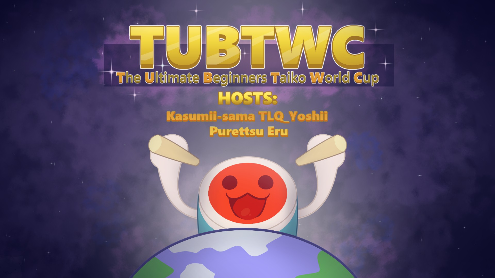

---
tags:
  - TUBTWC
---

# The Ultimate Beginners Taiko World Cup

The **The Ultimate Beginners Taiko World Cup** (***TUBTWC***) is a country-based two-on-two double-elimination osu!taiko tournament hosted by ![][flag_FR] [Kasumii-sama](https://osu.ppy.sh/users/6177263), ![][flag_FR] [Purettsu Eru](https://osu.ppy.sh/users/1542565), and ![][flag_FR] [TLQ\_Yoshii](https://osu.ppy.sh/users/7157133). Each country will send their best low-ranked team composition to battle other country around the globe. This is the first installment of The Ultimate Beginners Taiko World Cup.

## Tournament schedule

| Event | Timestamp |
| --: | :-- |
| Registration phase | 2020-01-24/2020-02-09 |
| Live drawings | 2020-02-16 |
| Qualifiers | 2020-02-22/2020-02-23 |
| Group Stage | 2020-02-29/2020-03-01 |
| Quarterfinals | 2020-03-07/2020-03-08 |
| Semifinals | 2020-03-14/2020-03-15 |
| Finals | 2020-03-21/2020-03-22 |
| Grand Finals | 2020-03-28/2020-03-29 |

## Prizes

| Placing | Prize |
| :-: | :-- |
|  | Unique profile badge |

## Organisation

The The Ultimate Beginners Taiko World Cup is run by various community members.

| Position | Member(s) |
| :-- | :-- |
| Manager | ![][flag_FR] [Kasumii-sama](https://osu.ppy.sh/users/6177263), ![][flag_FR] [Purettsu Eru](https://osu.ppy.sh/users/1542565), ![][flag_FR] [TLQ\_Yoshii](https://osu.ppy.sh/users/7157133) |
| Map selector | ![][flag_MY] [Bedwyr Aorta](https://osu.ppy.sh/users/10875855), ![][flag_DE] [Capu](https://osu.ppy.sh/users/2474015), ![][flag_US] [Cychloryn](https://osu.ppy.sh/users/6921736) |
| Referee | ![][flag_FR] [Apsuko](https://osu.ppy.sh/users/9313135), ![][flag_CL] [Catulus](https://osu.ppy.sh/users/6276709), ![][flag_US] [cheese salad](https://osu.ppy.sh/users/6349821), ![][flag_AU] [ill onion](https://osu.ppy.sh/users/8306102), ![][flag_FR] [Kasumii-sama](https://osu.ppy.sh/users/6177263), ![][flag_NL] [Krekker](https://osu.ppy.sh/users/8265940), ![][flag_FR] [Mimir](https://osu.ppy.sh/users/7382734), ![][flag_FR] [Purettsu Eru](https://osu.ppy.sh/users/1542565), ![][flag_DE] [QEpicAce](https://osu.ppy.sh/users/9489153), ![][flag_FR] [Satsukel](https://osu.ppy.sh/users/9066390), ![][flag_DE] [Sayira](https://osu.ppy.sh/users/7253958), ![][flag_RU] [Starger](https://osu.ppy.sh/users/3398715), ![][flag_MY] [Stupid Idiot](https://osu.ppy.sh/users/8355574), ![][flag_US] [Swovine](https://osu.ppy.sh/users/6666316), ![][flag_FR] [TLQ\_Yoshii](https://osu.ppy.sh/users/7157133) |
| Streamer | ![][flag_US] [cheese salad](https://osu.ppy.sh/users/6349821), ![][flag_PL] [Deroo](https://osu.ppy.sh/users/8360475), ![][flag_NL] [oliebol](https://osu.ppy.sh/users/2756335), ![][flag_FR] [Purettsu Eru](https://osu.ppy.sh/users/1542565), ![][flag_DE] [Sayira](https://osu.ppy.sh/users/7253958), ![][flag_FR] [TLQ\_Yoshii](https://osu.ppy.sh/users/7157133) |
| Commentator | ![][flag_CL] [Catulus](https://osu.ppy.sh/users/6276709), ![][flag_DE] [Drecksackblase](https://osu.ppy.sh/users/6278008), ![][flag_US] [Ethaaaan](https://osu.ppy.sh/users/9536977), ![][flag_EC] [Gamelan4](https://osu.ppy.sh/users/9856910), ![][flag_DE] [Heam](https://osu.ppy.sh/users/4705120), ![][flag_US] [kb131313](https://osu.ppy.sh/users/11229259), ![][flag_SE] [Raphalge](https://osu.ppy.sh/users/3918650) |
| Designer | ![][flag_PL] [E-M-i](https://osu.ppy.sh/users/9148286) |
| Statistician | ![][flag_FR] [Kasumii-sama](https://osu.ppy.sh/users/6177263) |
| Wiki editor | ![][flag_ID] [fajar13k](https://osu.ppy.sh/users/7100002) |
| Developer | ![][flag_FR] [ThePooN](https://osu.ppy.sh/users/718454) |

## Links

- [Discussion thread](https://osu.ppy.sh/community/forums/topics/1014109)
- [TUBTWC Discord server](https://discord.gg/sfNyEmZ)
- [Registration form](https://forms.gle/Qs4DDjFLYwTBKzu58)
- [Livestream](https://www.twitch.tv/gtsosu)
- [Challonge brackets](https://challonge.com/TUBTWC)
- **[Statistics sheet](https://docs.google.com/spreadsheets/d/1m-mjWvqvbwAW6l4L0E10qPtKmHMmePAewbDJatUJzxg/edit?usp=sharing)**

## Participants

*The participants will be revealed after the registration phase ends.*

## Mappools

*The mappools will be revealed one week before each particular stage.*

## Ruleset

### General rules

1. The Ultimate Beginners Taiko World Cup is a **2v2** team tournament with teams of **maximum 5 players**.
2. The teams will first play in a **qualifiers**, followed by a **group stage** and then play in a **double-elimination bracket**.
3. The score system used will be **Score V2**.
4. Any player who meets the requirements stated in the rank restrictions part is allowed to play. Since this tournament will aim to get badged, some players might be declined by osu! staff.
5. Any members of staff apart from **Managers, Mappool Selectors, and Referees** are allowed to play.
6. Players and staff members must have read this ruleset entirely (and we will assume that all players did so throughout the tournament).
7. All participants must stay respectful and keep a proper attitude. Not following this rule can result in a ban/blacklist from the tournament. This rule concerns all the staff as well.
8. Any rule changes or unexpected occurrences will be announced in the thread and in the Discord server.

### Restrictions

1. Players must not rank up further than **#10,000 during registrations**. Players are allowed in this tournament even as a #100,000. This means that players have to be in this rank range until the end of registrations.
2. Players are not allowed to rank up further than **#9,000 during the tournament**. If players pass this limit they will be disqualified.
3. Players must sign up with the country flag of their profile.
4. Players must join the Discord server of the tournament.

### Tournament registration and teams creation

1. In order to participate players need to meet the criteria stated in [restriction](#restrictions) part.
2. Players sign up individually. When their registration is accepted, they will get a country role inside the Discord server provided.
3. The first captain of the team will be chosen by the tournament's staff, and will be sent the roster of every player in the country via osu! forum PM.
4. The staff can refuse a player if they deem that the player skill is not fit with the tournament.
5. This year we are allowing 2 teams for a country under certain conditions:
   - There are **6 or more players** signed up for a country.
   - Each team has to have **at least 3 players**.
6. The captain chosen by the tournament's staff is the one in charge for choosing the team roster, unless if:
   - There are 5 players or less signed up for a country, those players will form the team representing their country.
   - In case there are more than 6 players signed up for a country, the roster must be separated so that it makes 2 teams. It is recommended to find an agreement as fast as possible to then decide on the captain and be able to schedule and prepare the team's matches rapidly.
   - In case the players can't find an agreement, they will be ranked by pp and put in the 2 teams with at least 3 members in each of them with the best ones in a first team and the lowest in the second.
7. The captain is going to be the one who reschedules a match if needed and will ensure that his teammates are here for the matches.

### Stage regulations

1. There are six stages in the tournament: the Qualifiers, the Group Stage, the Quarterfinals, the Semifinals, the Finals, and the Grand Finals.
2. The team will be seeded with the average of their ranks on each map during the Qualifiers round.
3. In case there are more than 16 registered teams, but less than 32, only the top 16 of the Qualifiers will go in the rest of the tournament.
4. In case there are more than 32 registered teams, only the top 32 of the Qualifiers will go in the rest of the tournament.
5. Teams will be drawn in **4 groups of 4 teams** during a drawing show which will happen on Sunday February 13th.
6. In the Group Stage, all teams from each group will face each other. The **best 2 teams** get out of groups.
7. Rankings of each group are determined by sorting the results of each team's performance in the following priority:
   1. Most matches won.
   2. Highest (number of beatmaps won - number of maps lost) score.
   3. Most beatmaps won.
   4. Winner of the match played previously between the tied teams.
8. In Group stage, 'Win by default' will be considered as win by 5:0.
9. The winning condition for each stage is:
   - Group Stage: BO9 (first to 5 points)
   - Round of 16 and Quarterfinals: BO11 (first to 6 points)
   - Semifinals, Finals, and Grand Finals: BO13 (first to 7 points)

### Mappool instructions

1. There will be different set of mappool for each stage.
2. The Loser's Bracket will play on the same pool as the Winner's bracket of the same weekend.
3. The Qualifiers pool will be different from all the other rounds, as it will have a format of 2 NoMod maps, 1 Hidden map, 1 HardRock map, 1 DoubleTime map.
4. Each mappool consists of 6 brackets: NoMod, Hidden, HardRock, DoubleTime, FreeMod, and Tiebreaker.
5. Every mappool will consist of 19 maps.
6. The size of the Hidden, HardRock, DoubleTime and FreeMod brackets will be 3 in all stages.
7. The FreeMod pool is played with FreeMod activated. Every individual player can pick **Hidden, HardRock or both. At least one player of each team must have at least one mod activated**.
8. The Tiebreaker is played under FreeMod conditions but it is not necessary that at least one player has at least one mod activated.
9. The mappool for each stage will be showcased a week before.

### Scheduling instructions

1. Every stage is held **during the weekend**. (it is however allowed to schedule on another day if no good time is found during the weekend)
2. Matches are allowed to overlap if referees are available.
3. We will try to schedule as best as possible to fit with the timezones. The schedule will be released the previous weekend of each stage.
4. Reschedules will only be considered if both teams agree to a time, this needs to be done and notified to the tournament staff before **Thursday at 23:59 UTC+0** in that particular week when team's match takes place.
5. Reschedules may only be requested by **the team captain**.

### Match regulations

1. A private lobby will be created 10 minutes before match by a referee. Both teams captains will be invited into the room when it's match time. Then the referees or the captains will invite the other players into the room.
2. If no staff or referee is available, the match will be postponed.
3. If less than the minimum required players attend, the maximum time the match can be postponed is 10 minutes.
4. If neither of both teams have the minimum required players after 10 minutes it will count as a loss for both teams in Group Stage. In the double elimination bracket, the highest seeded team will advance.
5. The match will be played as TeamVs and ScoreV2 and the name of the room must be : "TUBTWC: (Team Red) vs (Team Blue)".
6. Each team is allowed one warmup but it must be below 4 minutes. Everyone is allowed in the room during warm ups.
7. Each captain has to ban **two beatmaps** to be selected from the pool (apart from Tiebreaker). These beatmaps are not allowed to be picked by any team in the entire match.
8. The captain of each team will roll with the command `!roll` in the chat.
9. The team with the **highest roll bans second and picks first**. The team with the **lowest roll bans first and picks second**.
10. Beatmap selection will then alternate between each captain selecting a beatmap out of the map pool.
11. Captains may pick freely from any bracket.
12. Exchanging players during a match is allowed without limitations.
13. If a player disconnects between the beatmaps and the team can not provide an exchange, the match can be delayed 10 minutes at maximum.
14. If a player disconnects, they get treated as if they failed the map.
15. Disconnects within 30 seconds after beatmap begin can be rematched. This is only allowed once per team.
16. Failed players' scores do not get added to the team score.
17. If the beatmap ends in a draw, the game will be nullified and the map will be replayed.
18. In case of a tie in points (example: 4-4 in BO9), the tiebreaker is selected.

[flag_AU]: /wiki/shared/flag/AU.gif "Australia"
[flag_CL]: /wiki/shared/flag/CL.gif "Chile"
[flag_DE]: /wiki/shared/flag/DE.gif "Germany"
[flag_EC]: /wiki/shared/flag/EC.gif "Ecuador"
[flag_FR]: /wiki/shared/flag/FR.gif "France"
[flag_ID]: /wiki/shared/flag/ID.gif "Indonesia"
[flag_MY]: /wiki/shared/flag/MY.gif "Malaysia"
[flag_NL]: /wiki/shared/flag/NL.gif "Netherlands"
[flag_PL]: /wiki/shared/flag/PL.gif "Poland"
[flag_RU]: /wiki/shared/flag/RU.gif "Russian Federation"
[flag_SE]: /wiki/shared/flag/SE.gif "Sweden"
[flag_US]: /wiki/shared/flag/US.gif "United States"
