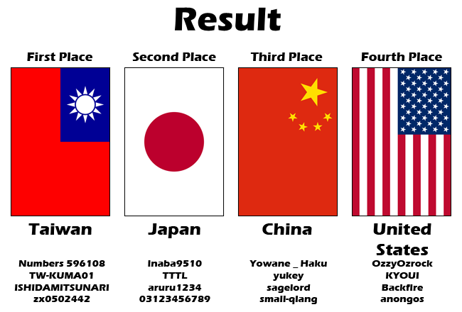

---
tags:
- TWC 2011
- TWC2011
---
Taiko World Cup 2011
======================

The **osu!taiko World Cup 2011** (***TWC #1***) is a country-based osu!taiko tournament hosted by the [osu! team](/wiki/People/The_Team). It is part of the 1st installment of the osu!taiko World Cup.

## Tournament Schedule

| Event | Timestamp |
| ---: | :--- |
| Registration Phase   | 2011-03-12/2011-04-09 |
| Group Stage - Week 1 | 2011-04-15/2011-04-17 |
| Group Stage - Week 2 | 2011-04-22/2011-04-26 |
| Group Stage - Week 3 | 2011-04-29/2011-05-01 |
| Quarterfinals        | 2011-05-07/2011-05-08 |
| Semifinals           | 2011-05-14/2011-05-15 |
| Finals               | 2011-05-22/2011-05-29 |

## Prizes

In every world cup, people conquering a place on the podium are eligible to receive unique prizes created specifically for World Cup winners. It is possible that these items change with every installment of the World Cups.

| Placing | Prize(s) |
| :---: | :--- |
|  | 3 months of osu!supporter and a profile badge |
|  | 2 months of osu!supporter |
|  | 1 month of osu!supporter |
| *Special* | 1 month of osu!supporter |

## Organization

The osu!taiko World Cup 2011 was ran by various community members by distributing the multitude of tasks into various fields of responsibility.

| Position | Member(s) |
| --- | --- |
| Mangement | [![][flag_KR] lepidopodus](https://osu.ppy.sh/users/194807), [![][flag_KR] arien666](https://osu.ppy.sh/users/113646), [![][flag_TW] Alace](https://osu.ppy.sh/users/25993), [![][flag_IL] Noobita](https://osu.ppy.sh/users/119188), [![][flag_HK] wmfchris](https://osu.ppy.sh/users/7401) |
| Streamers | [![][flag_JP] dvorak](https://osu.ppy.sh/users/271359), [![][flag_HK] matthewhln](https://osu.ppy.sh/users/291487) |

## Links

- [Discussion thread](https://osu.ppy.sh/community/forums/topics/47356)
- **[Statistics sheet](https://spreadsheets.google.com/ccc?key=0Aozv0NW718V1dGpOTlAxbnZndXh2QkM2MFdUUUJ5cVE&hl=en&authkey=CNv6phk)**

------------------------------------------------------------------------

## Participants

| | Team | Member |
| ---: | :---: | :--- |
| ![][flag_BR] ![][flag_CL] | **Brazil-Chile** | **[Hyguys](https://osu.ppy.sh/users/362851)**, [Kurisuchianu](https://osu.ppy.sh/users/194345), [Foster Don](https://osu.ppy.sh/users/144464), [JhowM](https://osu.ppy.sh/users/599290) |
| ![][flag_CN] | **China** | **[Yowane \_ Haku](https://osu.ppy.sh/users/255267)**, [yukey](https://osu.ppy.sh/users/81972), [sagelord](https://osu.ppy.sh/users/56200), small-qiang |
| ![][flag_FI] | **Finland** | **XZero94**, LunaticMara, [Orkel](https://osu.ppy.sh/users/39385), [Pallero](https://osu.ppy.sh/users/7381) |
| ![][flag_FR] | **France** | [\_Gezo\_](https://osu.ppy.sh/users/481582), [omegaflo](https://osu.ppy.sh/users/83291), Dagonpater, Didou |
| ![][flag_DE] | **Germany A** | **[OnosakiHito](https://osu.ppy.sh/users/290128)**, [DarkDunskin](https://osu.ppy.sh/users/98985), RockeDon, [Trashy](https://osu.ppy.sh/users/55191) |
| ![][flag_DE] | **Germany B** | **[BrokenArrow1](https://osu.ppy.sh/users/384034)**, [Zeitgeist](https://osu.ppy.sh/users/227765), Der_Locher, [bennius](https://osu.ppy.sh/users/3129206) |
| ![][flag_HK] | **Hong Kong** | **[aabc271](https://osu.ppy.sh/users/155707)**, [XeBi320](https://osu.ppy.sh/users/342622), [KanaRin](https://osu.ppy.sh/users/310747), [Kanpakyin](https://osu.ppy.sh/users/394326) |
| ![][flag_IT] ![][flag_NL] | **Italy-Netherlands** | **[NeoRainier](https://osu.ppy.sh/users/326049)**, [Pheon](https://osu.ppy.sh/users/292295), [Lokamp](https://osu.ppy.sh/users/63671), [Henkie](https://osu.ppy.sh/users/16944) |
| ![][flag_JP] | **Japan** | **inaba9510**, [TTTL](https://osu.ppy.sh/users/164583), [aruru1234](https://osu.ppy.sh/users/228812), [03123456789](https://osu.ppy.sh/users/295488) |
| ![][flag_KR] | **Korea A** | **[KRZY](https://osu.ppy.sh/users/114017)**, BloodyLove, [Remilia-Scarlet](https://osu.ppy.sh/users/602783), [\[Shalon\]](https://osu.ppy.sh/users/317802) |
| ![][flag_KR] | **Korea B** | **samiljul**, [Nyan](https://osu.ppy.sh/users/36102), kds7769, [Kim Jin Seok](https://osu.ppy.sh/users/58034) |
| ![][flag_MY] | **Malaysia** | **[HeatKai](https://osu.ppy.sh/users/332555)**, mekadon, [ffyong](https://osu.ppy.sh/users/168154), [taiko_maniac1811](https://osu.ppy.sh/users/595764) |
| ![][flag_PL] | **Poland** | **[1miko1](https://osu.ppy.sh/users/95690)**, [rEdo](https://osu.ppy.sh/users/49329), [Acrith](https://osu.ppy.sh/users/389880), Niko- |
| ![][flag_PH] | **Philippines** | **[blacksymbian](https://osu.ppy.sh/users/53956)**, [Zekira](https://osu.ppy.sh/users/36749), [caelumangelus](https://osu.ppy.sh/users/710623), [\[Zero\_One\]](https://osu.ppy.sh/users/347574) |
| ![][flag_TW] | **Taiwan** | **[Numbers 596108](https://osu.ppy.sh/users/194653)**, [TW-KUMA01](https://osu.ppy.sh/users/244499), ISHIDAMITSUNARI, [zx0502442](https://osu.ppy.sh/users/457766) |
| ![][flag_GB] | **United Kingdom** | **[Rokodo](https://osu.ppy.sh/users/23374)**, [Sander-Don](https://osu.ppy.sh/users/284307), [MMzz](https://osu.ppy.sh/users/128993), [Nazo](https://osu.ppy.sh/users/55106) |
| ![][flag_US] | **United States** | **[OzzyOzrock](https://osu.ppy.sh/users/465153)**, [KYOUI](https://osu.ppy.sh/users/460978), [Backfire](https://osu.ppy.sh/users/263110), [anongos](https://osu.ppy.sh/users/7135) |

------------------------------------------------------------------------

------------------------------------------------------------------------

## Groups

| Group A | Group B | Group C | Group D |
|---|---|---|---|
| ![][flag_CN] China               | ![][flag_FR] France         | ![][flag_BR] ![][flag_CL] Brazil-Chile | ![][flag_FI] Finland       |
| ![][flag_DE] Germany A           | ![][flag_KR] South Korea A  | ![][flag_HK] Hong Kong      | ![][flag_DE] Germany B     |
| ![][flag_IT] ![][flag_NL] Italy-Netherlands | ![][flag_TW] Taiwan         | ![][flag_PL] Poland         | ![][flag_JP] Japan         |
| ![][flag_MY] Malaysia            | ![][flag_GB] United Kingdom | ![][flag_US] United States  | ![][flag_KR] South Korea B |
| ![][flag_PH] Philippines         |                             |                             |                            |

## Mappools

### Finals

- FreeMod
  - Akitaka Toyama - The Carnivorous Carnival (lepidopodus) \[Oni for TWC\]
  - [Akitaka Toyama - Yozakura Shanikusai (lepidopodus) \[Taiko Inner Oni\]](https://osu.ppy.sh/beatmaps/99165)
  - [Amuro vs Killer - Mei (yeahyeahyeahhh) \[lepidon! - Taiko Oni\]](https://osu.ppy.sh/beatmaps/87775)
  - Ayako Saso - Kamikaze Remix (lepidopodus) \[Oni for TWC\]
  - [beatMARIO - Night of Knights (DJPop) \[DONS\]](https://osu.ppy.sh/beatmaps/58061)
  - [DragonForce - Through The Fire And Flames (Lesjuh) \[Taiko\]](https://osu.ppy.sh/beatmaps/72404)
  - [Linda AI-CUE - Kita Saitama2000 (zelos) \[Taiko Oni\]](https://osu.ppy.sh/beatmaps/88821)
  - [Linda AI-CUE - Man Ka Imu-Ichi no Juu (Zekira) \[Taiko Oni\]](https://osu.ppy.sh/beatmaps/88245)
  - ribbon rooms - mint tears (lepidopodus) \[Oni for TWC\]
  - [sampling mastes MEGA - Rotter Tarmination (lepidopodus) \[Taiko Inner Oni\]](https://osu.ppy.sh/beatmaps/61917)
  - [Taiko no Tatsujin - Haya Saitama2000 (Zekira) \[Oni\]](https://osu.ppy.sh/p/beatmap?b=39076&m=1)
  - [Taiko no Tatusjin - Hataraku2000 (Zekira) \[Taiko Oni\]](https://osu.ppy.sh/beatmaps/51845)
  - Zeami - Ryougen no Mai (lepidopodus) \[Oni for TWC\]
  - [Zeami feat. Ayane - Senpuu no Mai (AC ver.) (lepidopodus) \[Taiko Oni\]](https://osu.ppy.sh/beatmaps/75184)
- Tiebreaker
  - [Linda-AI-CUE - Shimedore2000 (Zekira) \[Taiko Oni\]](https://osu.ppy.sh/beatmaps/94475)

### Semifinals

- FreeMod
  - [07th Expansion - dreamenddischarger (AngelHoney) \[Insane\]](https://osu.ppy.sh/p/beatmap?b=58361&m=1)
  - [Demetori - Jehovah's YaHVeH (happy30) \[Taiko\]](https://osu.ppy.sh/beatmaps/45895)
  - [Jonathan Underdown - IN THE ZONE (lepidopodus) \[Taiko Oni\]](https://osu.ppy.sh/beatmaps/80425)
  - [Len - U.N. Owen was her? (Louis Cyphre) \[lepidon! - Taiko Oni\]](https://osu.ppy.sh/beatmaps/78390)
  - Linda AI-CUE - Soroban2000 (lepidopodus) \[Oni for TWC\]
  - LindaAI-CUE - X-DAY2000 (arien666) \[Taiko Oni\]
  - [M2U - Blythe (MoonFragrance) \[lepidon! - Taiko Oni\]](https://osu.ppy.sh/beatmaps/69725)
  - [Makou - Fermion (MoonFragrance) \[Taiko\]](https://osu.ppy.sh/beatmaps/72946)
  - [Maximum the Hormone - What's Up, People? (Louis Cyphre) \[Aru's 666 Taiko\]](https://osu.ppy.sh/beatmaps/89363)
  - [MC Lynn - EkiBEN2000 (arken1015) \[Taiko Oni\]](https://osu.ppy.sh/beatmaps/42796)
  - [SADA - STAR FIELD (yeahyeahyeahhh) \[lepidon! - Taiko Oni\]](https://osu.ppy.sh/beatmaps/79083)
  - [Zeami - Black Rose Apostle (lepidopodus) \[Taiko Inner Oni\]](https://osu.ppy.sh/beatmaps/81344)
  - [ZUN - Faith is for the Transient people (thepianist) \[dksslqj's Lunatic\]](https://osu.ppy.sh/p/beatmap?b=50430&m=1)
  - [ZUN - Necrofantasia (Fight69) \[Wmf's Taikofantasia\]](https://osu.ppy.sh/beatmaps/70216)
- Tiebreaker
  - [Demetori - Solar Sect of Mystic Wisdom ~ Nuclear Fusion \[Ono's Taiko Oni\]](https://osu.ppy.sh/beatmaps/93176)

### Quarterfinals

- FreeMod
  - [3rd Coast & Paul Bazooka - Luv Flow (Funky House Mix) (MoonFragrance) \[lepidon! - Taiko Oni\]](https://osu.ppy.sh/beatmaps/86969)
  - [Camille Saint-saens & FIRST AID - D2 (MoonFragrance) \[Taiko\]](https://osu.ppy.sh/beatmaps/75926)
  - [DAISUKE ASAKURA - stealth (ouranhshc) \[31's Taiko\]](https://osu.ppy.sh/beatmaps/70334)
  - [Denji Sano - Taiko Time (lepidopodus) \[Taiko Inner Oni\]](https://osu.ppy.sh/beatmaps/90616)
  - [DJ Amuro remixed by DM Ashura - AAA (Clickz) \[wmf's Taiko\]](https://osu.ppy.sh/beatmaps/79035)
  - [DJ YOSHITAKA - ALBIDA (TKiller) \[lepidon! - Taiko Oni\]](https://osu.ppy.sh/beatmaps/80827)
  - [Galdeira - Almagest (Wuiss) \[31's Taiko\]](https://osu.ppy.sh/beatmaps/76993)
  - [Hatsune Miku - Romeo and Cinderella (Nekoo\[\]) \[31's Taiko\]](https://osu.ppy.sh/beatmaps/76530)
  - [Makou - Hamsin (MoonFragrance) \[lepidon! - Taiko Oni\]](https://osu.ppy.sh/beatmaps/60646)
  - [Nami Nakagawa - DON'T CUT (lepidopodus) \[Taiko Inner Oni\]](https://osu.ppy.sh/beatmaps/67202)
  - [Niko - Night of Fire (Gabi) \[lepidon! - Taiko Oni\]](https://osu.ppy.sh/beatmaps/77710)
  - [Ochiai Yurika - Koibumi2000 (arken1015) \[Taiko Oni (Tatsujin)\]](https://osu.ppy.sh/beatmaps/46300)
  - [ParagonX9 - Chaoz Fantasy (Aoitenshi) \[lepidopodus' Taiko Oni\]](https://osu.ppy.sh/beatmaps/49077)
  - [Suzaku VS Genbu - Himiko (Mysterica) \[Another\]](https://osu.ppy.sh/p/beatmap?b=47462&m=1)
- Tiebreaker
  - [Frederic Chopin - Etude Op. 10-4 (lepidopodus) \[Taiko Inner Oni\]](https://osu.ppy.sh/beatmaps/77232)

### Group Stage - Week 3

- FreeMod
  - [\_yoc feat. Sara Matsumoto - Moonlight Windia (ouranhshc) \[Roko-Don's Taiko\]](https://osu.ppy.sh/beatmaps/73769)
  - [Bangsili - Ah! Salvia (DJ Cheori Remix Ver.) (ykcarrot) \[Shino's Taiko\]](https://osu.ppy.sh/beatmaps/78034)
  - [Chai Found Music Workshop - Kikyoku \~Seasons of Asia\~ (xierbaliti) \[Taiko Ura Oni\]](https://osu.ppy.sh/beatmaps/69595)
  - [ClariS - Connect (TV Size) \[Climbb's Taiko Oni\]](https://osu.ppy.sh/beatmaps/86199)
  - [Dai2BungeibuBand - KiraKira (Short Ver.) (Tenshi-nyan) \[Ozzy's Taiko\]](https://osu.ppy.sh/beatmaps/91077)
  - [fripSide - fortissimo -the ultimate crisis- (osuplayer111) \[Kana's Taiko\]](https://osu.ppy.sh/beatmaps/90170)
  - [Hatsune Miku - Nightmare Party Night (banvi) \[Ono's Taiko Oni\]](https://osu.ppy.sh/beatmaps/84587)
  - [IOSYS - Danzai Yamaxanadu (Zekira) \[The Last Judgement\]](https://osu.ppy.sh/p/beatmap?b=50461&m=1)
  - [Jimmy Eat World - The Middle (Gonzvlo) \[lepidon! - Taiko Oni\]](https://osu.ppy.sh/beatmaps/89450)
  - [jun - SILVER DREAM (Twinkle Mix) (ouranhshc) \[31's Taiko\]](https://osu.ppy.sh/beatmaps/78760)
  - [M2U - The Prince of Darkness (TKiller) \[lepidon! - Taiko Oni\]](https://osu.ppy.sh/beatmaps/48999)
  - [Megpoid GUMI - Poker Face (NatsumeRin) \[Taiko Joker\]](https://osu.ppy.sh/beatmaps/84803)
  - [Ryo Yoshimata - Resolver (haha5957) \[31's Taiko\]](https://osu.ppy.sh/beatmaps/80556)
  - [Shimotsuki Haruka - Omoi no Kanata (Short ver.) \[aabc's Taiko\]](https://osu.ppy.sh/beatmaps/87507)
  - [Taiko no Tatsujin - Saitama2000 (Kharl) \[Taiko\]](https://osu.ppy.sh/beatmaps/28306)
  - [YuFu - Holy Moon (wmfchris) \[Taiko\]](https://osu.ppy.sh/beatmaps/53245)
  - [Zeami feat. Ayane - Senpuu no Mai (CS ver.) (lepidopodus) \[Taiko Oni\]](https://osu.ppy.sh/beatmaps/67051)
  - [zts - WhiteBlue (MoonFragrance) \[Taiko\]](https://osu.ppy.sh/beatmaps/62760)
- Tiebreaker
  - [Ai Otsuka - Sakuranbo (S i R i R u) \[lepidon! - Taiko Oni\]](https://osu.ppy.sh/beatmaps/60790)
  - [yak\_won - lucid (soulfear) \[lepidon! - Taiko Oni\]](https://osu.ppy.sh/beatmaps/58041)

### Group Stage - Week 2

- FreeMod
  - [Beniiro Litmus - Rin to Shite Saku Hana no Gotoku (Chacha17) \[lepidon's Taiko Oni\]](https://osu.ppy.sh/beatmaps/49881)
  - [Chata - Yuujou Pop (Rorry) \[Taiko Oni\]](https://osu.ppy.sh/beatmaps/77928)
  - [ClariS - Irony (TV Size) \[Natteke's Taiko\]](https://osu.ppy.sh/beatmaps/76450)
  - [DJ Sharpnel - Exciting Hyper Highspeed Star (xBubu) \[H-boy's Hyper\]](https://osu.ppy.sh/p/beatmap?b=62590&m=1)
  - [dj TAKA feat.Kanako Hoshino - DROP (Sharp) \[lepidon! - Taiko Oni\]](https://osu.ppy.sh/beatmaps/79281)
  - [ESTi - Ladymade Star (lzy) \[lepidon's Taiko Oni\]](https://osu.ppy.sh/beatmaps/49322)
  - [ESTi - Oblivion (MoonFragrance) \[Taiko\]](https://osu.ppy.sh/beatmaps/71514)
  - [Forte Escape - End of the Moonlight (MoonFragrance) \[Taiko\]](https://osu.ppy.sh/beatmaps/60189)
  - [fripSide - future gazer (TV Size) (SamiPale) \[Climbb's Taiko Oni\]](https://osu.ppy.sh/beatmaps/76510)
  - [Hatsune Miku - Love-colored Ward (Krisom) \[lepidon! - Taiko Oni\]](https://osu.ppy.sh/beatmaps/82529)
  - [HTT - Pure Pure Heart (miccoliasms) \[miccoli\]](https://osu.ppy.sh/p/beatmap?b=67469&m=1)
  - [Koike Masato - Raging Waves (LKs) \[Climbb's Taiko Oni\]](https://osu.ppy.sh/beatmaps/59002)
  - [Komiya Mao - Yozakura (Alace) \[Taiko Oni\]](https://osu.ppy.sh/beatmaps/88920)
  - [Starving Trancer feat, Maki - Agony (James) \[Hard\]](https://osu.ppy.sh/p/beatmap?b=33963&m=1)
  - [Taiko no Tatsujin - Mekadesu. (Zekira) \[Oni (2nd Gen)\]](https://osu.ppy.sh/p/beatmap?b=41044&m=1)
  - [Whiteberry - Natsu Matsuri (NatsumeRin) \[Oni\]](https://osu.ppy.sh/beatmapsets/12823)
  - [Yoko Takahashi - Cruel Angel's Thesis (TV Size) (lepidopodus) \[Taiko Inner Oni (Tatsujin)\]](https://osu.ppy.sh/beatmaps/74498)
  - [Yuuna Kamishiro - Shrill False (vivicat) \[31's Taiko\]](https://osu.ppy.sh/beatmaps/72069)
- Tiebreaker
  - [9mm Parabellum Bullet - Punishment (lepidopodus) \[Taiko Oni\]](https://osu.ppy.sh/beatmaps/59792)
  - [Anamanaguchi - Rock Club (Sushi) \[Taiko\]](https://osu.ppy.sh/beatmaps/73057)

### Group Stage - Week 1

- FreeMod
  - [3oh!3 - Chokechain (Gens) \[Hard\]](https://osu.ppy.sh/p/beatmap?b=41909&m=1)
  - [Boom Boom Satelites - Shut Up And Explode (Lissette) \[Insane\]](https://osu.ppy.sh/p/beatmap?b=74478&m=1)
  - [ESTi - SIN (MoonFragrance) \[Taiko\]](https://osu.ppy.sh/beatmaps/66330)
  - [dj TAKA feat. Erika Mochizuki - MOON (Gabi) \[youngdow's Taiko Oni\]](https://osu.ppy.sh/beatmaps/62290)
  - [jun - KIMONO \<3 PRINCESS (ouranhshc) \[lepidon! - Taiko Oni\]](https://osu.ppy.sh/beatmaps/69385)
  - [Kamui Gakupo, KAITO, Kagamine Len - IMITATION BLACK (Shinxyn) \[Insane\]](https://osu.ppy.sh/p/beatmap?b=37370&m=1)
  - [Megurine Luka - DYE (Shinxyn) \[Hard\]](https://osu.ppy.sh/p/beatmap?b=48075&m=1)
  - [Muse - MK Ultra (DJ KRZY) \[31's Taiko\]](https://osu.ppy.sh/beatmaps/53310)
  - [ND Lee - Y (MoonFragrance) \[Taiko\]](https://osu.ppy.sh/beatmaps/70659)
  - [Nico Nico Douga - Kamijo-san & Biribiri at The Skyhigh (KIA) \[Taiko Oni\]](https://osu.ppy.sh/beatmaps/56732)
  - [Pastry - Goblin Girl (osuplayer111) \[Climbb's Taiko Oni\]](https://osu.ppy.sh/beatmaps/86669)
  - [Rie Kugimiya - Suki? Kirai!? Suki!!! (Sushi971) \[Taiko Oni\]](https://osu.ppy.sh/beatmaps/38237)
  - [SID - Rain (TV Size) (KIA) \[aru's Taiko Oni\]](https://osu.ppy.sh/beatmaps/70966)
  - [Taiko no Tatsujin - Kimi no Akari (aquabluu) \[Oni\]](https://osu.ppy.sh/p/beatmap?b=59424&m=1)
  - [xi - Halcyon (gowww) \[miccoli's diff\]](https://osu.ppy.sh/p/beatmap?b=74057&m=1)
  - [YUI - LIFE (JauiPlaY) \[LIFE\]](https://osu.ppy.sh/p/beatmap?b=78220&m=1)
  - [Zun - Doll Judgment ~The Girl Who Played with People's Shapes (Zekira) \[Lunatic\]](https://osu.ppy.sh/p/beatmap?b=44998&m=1)
- Tiebreaker
  - [L'Arc~en\~Ciel - DAYBREAK'S BELL (RandomJibberish) \[lepidon! - Taiko Oni\]](https://osu.ppy.sh/beatmaps/70624)
  - [Rex - Heart of Witch (yeahyeahyeahhh) \[Roko-Don's Taiko\]](https://osu.ppy.sh/beatmaps/75251)

## Match Results

### Finals

| 2011-05-22 | | | | |
| ---: | :---: | :---: | :--- | :---: |
| **China** ![][flag_CN] | **5** | 2 | ![][flag_US] United States | [#1](http://osu.ppy.sh/community/matches/762010) |

| 2011-05-29 | | | | |
| ---: | :---: | :---: | :--- | :---: |
| Japan ![][flag_JP] | 4 | **5** | ![][flag_TW] **Taiwan** | [#1](http://osu.ppy.sh/community/matches/809078) |

### Semifinals

| 2011-05-14 | | | | |
| ---: | :---: | :---: | :--- | :---: |
| China ![][flag_CN]      | 1 | **4** | ![][flag_JP] **Japan**     | [#1](http://osu.ppy.sh/community/matches/714056) |
| **Taiwan** ![][flag_TW] | **4** | 0 | ![][flag_US] United States | -Win by default- |

### Quarterfinals

| 2011-05-07 | | | | |
| ---: | :---: | :---: | :--- | :---: |
| **Taiwan** ![][flag_TW]    | **4** | 0 | ![][flag_IT] ![][flag_NL] Italy-Netherlands | [#1](http://osu.ppy.sh/community/matches/669276) |
| **China** ![][flag_CN]     | **4** | 3 | ![][flag_GB] United Kingdom      | [#1](http://osu.ppy.sh/community/matches/670326) |
| South Korea B ![][flag_KR] | 0 | **4** | ![][flag_US] **United States**   | -Win by default- |

| 2011-05-08 | | | | |
| ---: | :---: | :---: | :--- | :---: |
| Hong Kong ![][flag_HK] | 3 | **4** | ![][flag_JP] **Japan** | [#1](http://osu.ppy.sh/community/matches/677605) |

### Group Stage - Week 3

| 2011-04-29 | | | | |
| ---: | :---: | :---: | :--- | :---: |
| **Germany A** ![][flag_DE] | **3** | 0 | ![][flag_MY] Malaysia | [#1](http://osu.ppy.sh/community/matches/620058) |

| 2011-04-30 | | | | |
| ---: | :---: | :---: | :--- | :---: |
| **Hong Kong** ![][flag_HK]           | **3** | 0 | ![][flag_BR] ![][flag_CL] Brazil-Chile     | [#1](http://osu.ppy.sh/community/matches/621893) |
| South Korea A ![][flag_KR]           | 1 | **3** | ![][flag_TW] **Taiwan**         | [#1](http://osu.ppy.sh/community/matches/625054) |
| Italy-Netherlands ![][flag_IT] ![][flag_NL]     | 1 | **3** | ![][flag_CN] **China**          | [#1](http://osu.ppy.sh/community/matches/625361) |
| Germany B ![][flag_DE]               | 0 | **3** | ![][flag_KR] **South Korea B**  | [#1](http://osu.ppy.sh/community/matches/625672) |
| **Italy-Netherlands** ![][flag_IT] ![][flag_NL] | **3** | 1 | ![][flag_PH] Philippines        | [#1](http://osu.ppy.sh/community/matches/625361) |
| France ![][flag_FR]                  | 0 | **3** | ![][flag_GB] **United Kingdom** | [#1](http://osu.ppy.sh/community/matches/620058) |
| **United States** ![][flag_US]       | **3** | 0 | ![][flag_PL] Poland             | [#1](http://osu.ppy.sh/community/matches/628633) |

| 2011-05-01 | | | | |
| ---: | :---: | :---: | :--- | :---: |
| Malaysia ![][flag_MY]  |  -  |  -  | ![][flag_PH] Philippines   | -Cancelled- |
| China ![][flag_CN]     | 2 | **3** | ![][flag_DE] **Germany A** | [#1](http://osu.ppy.sh/community/matches/633234) |
| **Japan** ![][flag_JP] | **3** | 0 | ![][flag_FI] Finland       | [#1](http://osu.ppy.sh/community/matches/633728) |

### Group Stage - Week 2

| 2011-04-22 | | | | |
| ---: | :---: | :---: | :--- | :---: |
| United Kingdom ![][flag_GB]    | 2 | **3** | ![][flag_TW] **Taiwan** | [#1](http://osu.ppy.sh/community/matches/570806) |
| **South Korea A** ![][flag_KR] | **3** | 0 | ![][flag_FR] France | [#1](http://osu.ppy.sh/community/matches/571429) |

| 2011-04-23 | | | | |
| ---: | :---: | :---: | :--- | :---: |
| **Hong Kong** ![][flag_HK]  | **3** | 0 | ![][flag_US] United States | [#1](http://osu.ppy.sh/community/matches/574922) |

| 2011-04-24 | | | | |
| ---: | :---: | :---: | :--- | :---: |
| **South Korea B** ![][flag_KR] | **3** | 0 | ![][flag_FI] Finland   | [#1](http://osu.ppy.sh/community/matches/587957) |
| **Japan** ![][flag_JP]         | **3** | 0 | ![][flag_DE] Germany B | [#1](http://osu.ppy.sh/community/matches/588494) |

| 2011-04-26 | | | | |
| ---: | :---: | :---: | :--- | :---: |
| Germany A ![][flag_DE]      | 1 | **3** | ![][flag_IT] ![][flag_NL] **Italy-Netherlands** | [#1](http://osu.ppy.sh/community/matches/602804) |
| Brazil-Chile ![][flag_BR] ![][flag_CL] | 0 | **3** | ![][flag_PL] **Poland**              | -Win by default- |

### Group Stage - Week 1

| 2011-04-15 | | | | |
| ---: | :---: | :---: | :--- | :---: |
| **United Kingdom** ![][flag_GB] | **3** | 1 | ![][flag_KR] South Korea A | [#1](http://osu.ppy.sh/community/matches/528963) |

| 2011-04-16 | | | | |
| ---: | :---: | :---: | :--- | :---: |
| Poland ![][flag_PL]            | 1 | **3** | ![][flag_HK] **Hong Kong**           | [#1](http://osu.ppy.sh/community/matches/534263) |
| Philippines ![][flag_PH]       | 1 | **3** | ![][flag_CN] **China**               | [#1](http://osu.ppy.sh/community/matches/534652) |
| Malaysia ![][flag_MY]          | 0 | **3** | ![][flag_IT] ![][flag_NL] **Italy-Netherlands** | [#1](http://osu.ppy.sh/community/matches/535028) |
| **Taiwan** ![][flag_TW]        | **3** | 2 | ![][flag_FR] France                  | [#1](http://osu.ppy.sh/community/matches/535848) |
| Finland ![][flag_FI]           | 0 | **3** | ![][flag_DE] **Germany B**           | [#1](http://osu.ppy.sh/community/matches/537311) |
| **United States** ![][flag_US] | **3** | 0 | ![][flag_BR] ![][flag_CL] Brazil-Chile          | [#1](http://osu.ppy.sh/community/matches/538664) |

| 2011-04-17 | | | | |
| ---: | :---: | :---: | :--- | :---: |
| **South Korea B** ![][flag_KR] | **3** | 0 | ![][flag_JP] Japan         | [#1](http://osu.ppy.sh/community/matches/542259) |
| **China** ![][flag_CN]         | **3** | 0 | ![][flag_MY] Malaysia      | [#1](http://osu.ppy.sh/community/matches/542705) |
| Philippines ![][flag_PH]       | 0 | **3** | ![][flag_DE] **Germany A** | [#1](http://osu.ppy.sh/community/matches/543150) |

## Ruleset

### Tournament Instructions

The 1st round of the tournament will be robin-round stage. There will be 4 groups and each groups have 4~5 teams. Your team will play every other teams once, and the team achieved #1 or #2 in their group will be ascended to the next round. Ranking of teams will be decided by certain standards:

1.  More matches won.
2.  Have bigger `{(the number of games won) - (the number of games defeated)}`.
3.  More games won.
4.  Have bigger `∑{(total score difference) / (maximum score)}`.
5.  Winner of the rematch.

Other stages will be Knockout stage. If your team wins the match, your team will be ascended to the next round immediately. but if you lose your match, your team will be knocked out from the tournament.

Usually you will have a match per a week, but in the 1st round you may have two matches in certain week if your group consists of 5 teams.

### Registration Rules

1.  Minimum 3 players per one team. You can add 1 back-up player, so maximum number of the player in one team is 4.
2.  The team should include a captain for managing the team and the players.
3.  Basically a team represents a nation since it's World Cup. That means you can make a team with players from same country basically.
4.  If your country lacks Taiko players sufficient to participate this, you can recruit players from other nations with permission.
5.  Due to so many Taiko players are from certain countries, more than one team per country is available with permission.
6.  Captain should forum-PM to Tournament manager or post in this thread to make a team.
    1.  Captain can make a team first, then add some players for it.
    2.  One team should include at least 3 players until the registration is closed. If it's not, the team will be disbanded.
    3.  Captain can add back-up player if there's no one for the team until the tournament actually starts.
7.  Staff can't participate tournament as a player.
8.  This rules can be modified without noticing.

### Match Instructions

1.  One of referees will make the room 15 minutes before the time. All players should arrive the room in right time.
    1.  The room will be locked. The password will be sent to the two captains as soon as possible.
    2.  Referee can wait maximum 15 minutes.
    3.  Referee should post multiplayer history in this thread.
2.  The team that mentioned first in the timetable will be Blue team. Referee will be Blue team, too.
    1.  From semi-final, which team will be blue team will be decided by coin flipping of referee.
    2.  Referee should not touch anything that can affect score.
3.  If everythings are ready for the matches, referee will give host to the captain of blue team.
4.  Captain of the blue team selects the map from the maps that are announced for the round, then starts the game.
5.  When the game ends, referee will save screenshot for the result screen, and post it to this thread when the match ends.
6.  Captain of the blue team will give host to captain of the red team and the rest is same as 4 and 5.
    1.  In final game, referee will become host and select the map to play.
7.  Repeat 4~6 until winner is decided.
8.  In Robin-round stage, the team wins 3 games first will win the match. In Knock-out stage, the team need to win 4 games.
9.  In final round, you have to win 5 games first.

### Rules

1.  The maps for the tournament will be announced each round. Basically this will be decided by staff.
    1.  There will be some maps that can be used only for the final games.
2.  One of the staff will be referee for the match.
    1.  Referee should post records of the match in this thread.
    2.  If the referee is absent, one of two captains can take over the job temporarily by agreement between both team.
3.  The matches will be played in locked room created by referee. Setting will be Taiko, Team Vs, score for win condition.
4.  The team with higher total score will win the game.
    1.  Score of failed player will be added to total score too.
5.  The team that will win 3 games first will win the match in Robin-round stage. You will have to win 4 games first in Knock-out stage.
    1.  In final round, The team should win 5 games first to win the match.
6.  'No Video' mod is available. No other mod is allowed unless there is notice about this.
7.  In each game, two captains will choose the map to play alternately.
    1.  In the final game with draw(2:2, 3:3 or 4:4), referee will choose the map to play.
    2.  Maps cannot be used more than 1 time in the same match unless the game was nullified.
8.  If the game ends in a draw, the game will be nullified.
9.  If one of players gets disconnected in the first 2/3 of the map, the game will be nullified. (Intro and outro won't be count as play time.)
    1.  If two players get disconnected, the game will be nullified.
    2.  If disconnection happens right before the game starts, the game will be nullified.
    3.  If nullification of games due to disconnection happens by one team more than 2 times, the opponent team will win by default.
        1.  In semi-final and final round, more than 3 times of disconnection are needed.
    4.  If the time when a player got disconnected is vague, referee will decide whether to nullify or not.
    5.  If disconnected player doesn't return within 10 minutes, the match will resume.
    6.  If the referee gets disconnection, the game will continue, but one of two captain should post record for the game.
    7.  If server is too unstable to continue the match, referee can postpone the match.
    8.  If the disconnection is considered as intentional by referee, referee can announce victory of the opponent team.
10.  If less than 3 players arrived until the time that the match should start, the match can be postponed maximum 20 minutes.
    1.  Referee can take some relevant measures if one of two teams lacks players after waiting for 20 minutes.
        1.  Relevant measures include rescheduling the match, declaring winning by default of the opponent team, etc.
    2.  Referee can postpone the match if bancho is too unstable to play.
11.  During the match, substitution of players is allowed for once, and permission of the referee is needed.
12.  Lags can't be a reason for nullification of game.
13.  In robin-round tournament, 'Win by default' will be considered as win by 3:0, +1.5 score difference ratio.
14.  If there's any unexpected incident that needs decision of staff and isn't specified in this rule during the match, referee will judge.
    1.  The manager can revoke decisions which is made by referees.
15.  The manager can ban a player or a team from the tournament if the player or the team is considered as disturbing the tournament.
    1.  Banned player won't be allowed to participate the next Taiko tournament.
        1.  This can be revoked by manager.
16.  If the manager is absent when decisions from the manager are needed, vice-manager will take over the job temporarily.
17.  This rules can be modified without noticing.

[flag_BR]: /wiki/shared/flag/BR.gif
[flag_CL]: /wiki/shared/flag/CL.gif
[flag_CN]: /wiki/shared/flag/CN.gif
[flag_DE]: /wiki/shared/flag/DE.gif
[flag_FI]: /wiki/shared/flag/FI.gif
[flag_FR]: /wiki/shared/flag/FR.gif
[flag_GB]: /wiki/shared/flag/GB.gif
[flag_HK]: /wiki/shared/flag/HK.gif
[flag_IL]: /wiki/shared/flag/IL.gif
[flag_IT]: /wiki/shared/flag/IT.gif
[flag_JP]: /wiki/shared/flag/JP.gif
[flag_KR]: /wiki/shared/flag/KR.gif
[flag_MY]: /wiki/shared/flag/MY.gif
[flag_NL]: /wiki/shared/flag/NL.gif
[flag_PH]: /wiki/shared/flag/PH.gif
[flag_PL]: /wiki/shared/flag/PL.gif
[flag_TW]: /wiki/shared/flag/TW.gif
[flag_US]: /wiki/shared/flag/US.gif
