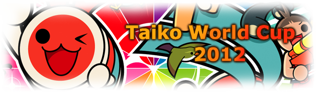
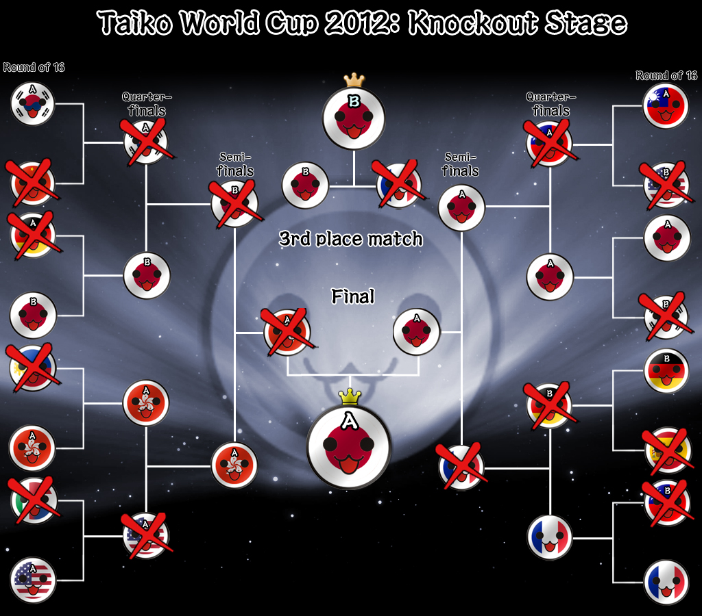
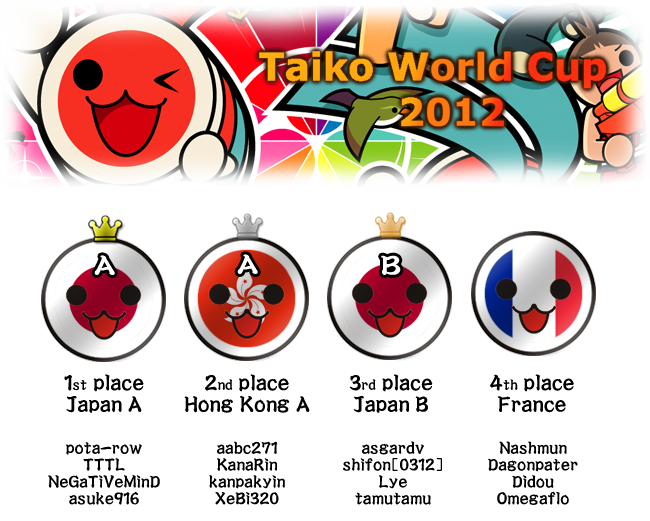

---
tags:
  - TWC 2012
  - TWC2012
---

# Taiko World Cup 2012

The **Taiko World Cup 2012** (***TWC 2012***) was a country-based osu!taiko tournament hosted by the [osu! team](/wiki/People/osu!_team). It was the second instalment of the osu!taiko World Cup.

## Tournament schedule

| Event | Timestamp |
| --: | :-- |
| Registration phase | 2011-11-14/2012-02-03 |
| Round 1-1 | 2012-02-11/2012-02-12 |
| Round 1-2 | 2012-02-18/2012-02-19 |
| Round 1-3 | 2012-02-25/2012-02-26 |
| Round 1-4 | 2012-03-03/2012-03-04 |
| Round 2 | 2012-03-10/2012-03-11 |
| Round 3 | 2012-03-17/2012-03-18 |
| Round 4 | 2012-03-24 |
| Round 5 | 2012-03-31/2012-04-01 |

## Prizes

| Placing | Prize(s) |
| :-: | :-- |
|  | 3 months of osu!supporter, unique profile badge |
|  | 2 months of osu!supporter |
|  | 1 month of osu!supporter |
| *Special* | 1 month of osu!supporter |

## Organisation

The Taiko World Cup 2012 was run by various community members.

| Position | Member(s) |
| :-- | :-- |
| Manager | ::{ flag=KR }:: [lepidopodus](https://osu.ppy.sh/users/194807), ::{ flag=HK }:: [wmfchris](https://osu.ppy.sh/users/7401) |
| Mappool selector | ::{ flag=DE }:: [Loctav](https://osu.ppy.sh/users/71366) |
| Referee | ::{ flag=PE }:: [Gonzvlo](https://osu.ppy.sh/users/237733), ::{ flag=TW }:: [Numbers 596108](https://osu.ppy.sh/users/194653), ::{ flag=FR }:: [Odaril](https://osu.ppy.sh/users/113005) |
| Scheduler | ::{ flag=US }:: [anongos](https://osu.ppy.sh/users/7135) |
| Streamer | ::{ flag=HK }:: [Kirisaki\_Hayashi](https://osu.ppy.sh/users/857986), ::{ flag=HK }:: [matthewhln](https://osu.ppy.sh/users/291487) |

## Links

- [Discussion thread](https://osu.ppy.sh/community/forums/topics/66910)
- Livestream
  - [Matthewhln](https://www.twitch.tv/matthewhln)
  - [lunarsaki](https://www.twitch.tv/lunarsaki)
- **[Statistics sheet](https://docs.google.com/spreadsheet/ccc?key=0Aozv0NW718V1dHlVQldGc0VEN1lpWnlRMHhJakJ1Vnc)**

## Participants

|  | Country | Members |
| :-: | :-: | :-- |
| ::{ flag=AT }:: | **Austria** | **[M A R I O](https://osu.ppy.sh/users/594424)**, [Hawkii](https://osu.ppy.sh/users/709719), [Necro Neko](https://osu.ppy.sh/users/697203), [TheNutritiousGuy](https://osu.ppy.sh/users/626907) |
| ::{ flag=BR }:: | **Brazil** | **[fabriciorby](https://osu.ppy.sh/users/209664)**, [\[Luanny PhNyx\]](https://osu.ppy.sh/users/802909), [Hyguys](https://osu.ppy.sh/users/362851), [JhowM](https://osu.ppy.sh/users/599290) |
| ::{ flag=CA }:: | **Canada** | **[xcherry](https://osu.ppy.sh/users/684730)**, [Crystalloid](https://osu.ppy.sh/users/699741), [orangespanky](https://osu.ppy.sh/users/125142), [Super\_Banana](https://osu.ppy.sh/users/459886) |
| ::{ flag=CL }:: | **Chile** | **[Kurisuchianu](https://osu.ppy.sh/users/194345)**, [Letz\_shake](https://osu.ppy.sh/users/593579), [Touche](https://osu.ppy.sh/users/744220), [Verdisphena](https://osu.ppy.sh/users/378377) |
| ::{ flag=CN }:: | **China** | **[HM495](https://osu.ppy.sh/users/810813)**, [baka\_baka\_Koishi](https://osu.ppy.sh/users/915103), [narcissu2012](https://osu.ppy.sh/users/819937), [small-qiang](https://osu.ppy.sh/users/619179) |
| ::{ flag=FR }:: | **France** | **[Nashmun](https://osu.ppy.sh/users/49031)**, [Dagonpater](https://osu.ppy.sh/users/205257), [Didou](https://osu.ppy.sh/users/594822), [Omegaflo](https://osu.ppy.sh/users/83291) |
| ::{ flag=DE }:: | **Germany A** | **[OnosakiHito](https://osu.ppy.sh/users/290128)**, [DarkDunskin](https://osu.ppy.sh/users/98985), [LittleMagic](https://osu.ppy.sh/users/105380), [RockeDon](https://osu.ppy.sh/users/624957) |
| ::{ flag=DE }:: | **Germany B** | **[Locher](https://osu.ppy.sh/users/587835)**, [Brokenarrow](https://osu.ppy.sh/users/384034), [Slih](https://osu.ppy.sh/users/606738), [Xayphon](https://osu.ppy.sh/users/961417) |
| ::{ flag=HK }:: | **Hong Kong A** | **[aabc271](https://osu.ppy.sh/users/155707)**, [KanaRin](https://osu.ppy.sh/users/310747), [kanpakyin](https://osu.ppy.sh/users/394326), [XeBi320](https://osu.ppy.sh/users/342622) |
| ::{ flag=HK }:: | **Hong Kong B** | **[7odoa](https://osu.ppy.sh/users/643394)**, [jiujiu123](https://osu.ppy.sh/users/728511), [rturuurud](https://osu.ppy.sh/users/520016), [sakurasuzaku](https://osu.ppy.sh/users/192704) |
| ::{ flag=IT }:: ::{ flag=NL }:: | **Italy-Netherlands** | **[NeoRainier](https://osu.ppy.sh/users/326049)**, [happy30](https://osu.ppy.sh/users/27767), [Jak64](https://osu.ppy.sh/users/29029), [Pheon](https://osu.ppy.sh/users/292295) |
| ::{ flag=JP }:: | **Japan A** | **[pota-row](https://osu.ppy.sh/users/858415)**, [asuke916](https://osu.ppy.sh/users/863073), [NeGaTiVeMinD](https://osu.ppy.sh/users/965038), [TTTL](https://osu.ppy.sh/users/164583) |
| ::{ flag=JP }:: | **Japan B** | **[asgardv](https://osu.ppy.sh/users/752078)**, [Lye](https://osu.ppy.sh/users/508616), [shifon\[0312\]](https://osu.ppy.sh/users/295488), [tamutamu](https://osu.ppy.sh/users/364497) |
| ::{ flag=MO }:: | **Macau** | **[L y n n i e](https://osu.ppy.sh/users/189880)**, [\_\_\_\_\_\_\_\_yL](https://osu.ppy.sh/users/761205), [benisakura](https://osu.ppy.sh/users/384986), [tuidaololi](https://osu.ppy.sh/users/359750) |
| ::{ flag=MY }:: | **Malaysia** | **[HeatKai](https://osu.ppy.sh/users/332555)**, [Taiko\_Maniac1811](https://osu.ppy.sh/users/595764), [mekadon](https://osu.ppy.sh/users/157835), [x3Jerry](https://osu.ppy.sh/users/605973) |
| ::{ flag=PH }:: | **Philippines** | **[AngelusMist](https://osu.ppy.sh/users/640612)**, [\[Zero\_One\]](https://osu.ppy.sh/users/347574), [blacksymbian](https://osu.ppy.sh/users/53956), [Zekira](https://osu.ppy.sh/users/36749) |
| ::{ flag=PL }:: | **Poland** | **[Acrith](https://osu.ppy.sh/users/389880)**, [1miko1](https://osu.ppy.sh/users/95690), [DarkStoorM](https://osu.ppy.sh/users/174347), [flyleaf95](https://osu.ppy.sh/users/375174) |
| ::{ flag=KR }:: | **South Korea A** | **[Remilia-Scarlet](https://osu.ppy.sh/users/602783)**, [KDS](https://osu.ppy.sh/users/257977), [Mapper 31](https://osu.ppy.sh/users/156215), [Riboflavin](https://osu.ppy.sh/users/575159) |
| ::{ flag=KR }:: | **South Korea B** | **[\[Shalon\]](https://osu.ppy.sh/users/317802)**, [EkiBen](https://osu.ppy.sh/users/344783), [iketa](https://osu.ppy.sh/users/571504), [OFC\_youngdow](https://osu.ppy.sh/users/1312550) |
| ::{ flag=ES }:: | **Spain** | **[CARRI](https://osu.ppy.sh/users/854536)**, [charly kempachi](https://osu.ppy.sh/users/280115), [MYRKUL](https://osu.ppy.sh/users/255933) |
| ::{ flag=TW }:: | **Taiwan A** | **[doraewon1](https://osu.ppy.sh/users/358675)**, [ISHIDAMITSUNARI](https://osu.ppy.sh/users/242910), [mliencheng](https://osu.ppy.sh/users/586659), [zx\_baka\_0502442](https://osu.ppy.sh/users/457766) |
| ::{ flag=TW }:: | **Taiwan B** | **[jih7491](https://osu.ppy.sh/users/259446)**, [610522](https://osu.ppy.sh/users/965771), [kg2161012](https://osu.ppy.sh/users/468393), [Tomoka Rin](https://osu.ppy.sh/users/125308) |
| ::{ flag=US }:: | **United States A** | **[MMzz](https://osu.ppy.sh/users/128993)**, [OzzyOzrock](https://osu.ppy.sh/users/465153), [Sander-Don](https://osu.ppy.sh/users/284307) |
| ::{ flag=US }:: | **United States B** | **[Makar8000](https://osu.ppy.sh/users/686389)**, [Backfire](https://osu.ppy.sh/users/263110), [KYOUI](https://osu.ppy.sh/users/460978), [Love](https://osu.ppy.sh/users/467487) |

## Groups

| Group A | Group B | Group C | Group D | Group E | Group F |
| :-- | :-- | :-- | :-- | :-- | :-- |
| ::{ flag=MO }:: Macau | ::{ flag=CA }:: Canada | ::{ flag=CL }:: Chile | ::{ flag=AT }:: Austria | ::{ flag=BR }:: Brazil | ::{ flag=CN }:: China |
| ::{ flag=DE }:: Germany B | ::{ flag=HK }:: Hong Kong B | ::{ flag=FR }:: France | ::{ flag=IT }:: ::{ flag=NL }:: Italy-Netherlands | ::{ flag=DE }:: Germany A | ::{ flag=MY }:: Malaysia |
| ::{ flag=HK }:: Hong Kong A | ::{ flag=JP }:: Japan B | ::{ flag=PH }:: Philippines | ::{ flag=KR }:: Korea A | ::{ flag=JP }:: Japan A | ::{ flag=KR }:: Korea B |
| ::{ flag=PL }:: Poland | ::{ flag=TW }:: Taiwan A | ::{ flag=US }:: United States B | ::{ flag=ES }:: Spain | ::{ flag=TW }:: Taiwan B | ::{ flag=US }:: United States A |

## Podium

## Mappools

### Round 5

**[Download the mappack here! (83 MB)](https://puu.sh/ma6o)**

- NoMod
  1. [Demetori - Solar Sect of Mystic Wisdom \~ Nuclear Fusion (Louis Cyphre) \[Ono's Taiko Oni\]](https://osu.ppy.sh/beatmapsets/20125#taiko/93176)
  2. [Frederic Chopin - Etude Op. 10-4 (lepidopodus) \[Taiko Inner Oni\]](https://osu.ppy.sh/beatmapsets/22374#taiko/77232)
  3. [goreshit - MATZcore (\_LRJ\_) \[Ono's Taiko Oni (TWC ver.)\]](https://puu.sh/m9JN)
  4. [Hatsune Miku - Atama no Taisou (val0108) \[Love's Taiko (TWC ver.)\]](https://puu.sh/m9Kl)
  5. [Inspector K - Disconnected Hardkore (CanBlaster Remix) (7odoa) \[Verdi's Taiko Oni\]](https://osu.ppy.sh/beatmapsets/30485#taiko/103052)
  6. [Kanou Mari - Hakuchou no Mizuumi \~still a duckling\~ (banvi) \[wood's Hell Taiko Oni\]](https://osu.ppy.sh/beatmapsets/28893#taiko/99749)
  7. [Linda AI-CUE - Kita Saitama2000 (Zelos) \[Taiko Oni\]](https://osu.ppy.sh/beatmapsets/26296#taiko/88821)
  8. [Linda AI-CUE - Man Ka Imu-Ichi no Juu (Zekira) \[Taiko Oni\]](https://osu.ppy.sh/beatmapsets/26095#taiko/88245)
  9. [Maximum the Hormone - What's Up, People? (Louis Cyphre) \[Aru's 666 Taiko\]](https://osu.ppy.sh/beatmapsets/13320#taiko/89363)
  10. [ParagonX9 - Chaoz Japan (Mustaash) \[Firce777's Hell Oni\]](https://osu.ppy.sh/beatmapsets/31115#taiko/102527)
  11. [ribbon rooms - mint tears (samiljul) \[Taiko Oni\]](https://osu.ppy.sh/beatmapsets/15497#taiko/60227)
  12. [sampling masters MEGA - Rotter Tarmination (lepidopodus) \[Taiko Inner Oni\]](https://osu.ppy.sh/beatmapsets/17351#taiko/61917)
  13. [SUPER STAR -MITSURU- - ALL MY TURN (yeahyeahyeahhh) \[Lepidon! - Taiko Oni\]](https://osu.ppy.sh/beatmapsets/30877#taiko/103133)
  14. [Yousei Teikoku - Kokou no Sousei (Saten-san) \[Ono's Taiko Inner Oni\]](https://osu.ppy.sh/beatmapsets/28705#taiko/101732)
  15. [Zeami - Black Rose Apostle (lepidopodus) \[Taiko Inner Oni\]](https://osu.ppy.sh/beatmapsets/23838#taiko/81344)
- Tiebreaker
  1. **[Various Artists - Taiko World Cup 2012 Compilation (Loctav) \[Taiko Ura Oni\]](https://osu.ppy.sh/beatmapsets/47362#taiko/147018)**

### Round 4

**[Download the mappack here! (90 MB)](https://puu.sh/lj8O)**

- NoMod
  1. [07th Expansion - miragecoordinator (La Cataline) \[MM's Taiko\]](https://osu.ppy.sh/beatmapsets/31116#taiko/116050)
  2. [Dachirumi - Midnight Fusion (Loctav) \[Ono's Taiko Oni\]](https://puu.sh/liWK)
  3. [DJ YOSHITAKA - FLOWER (TKiller) \[lepidon! - Taiko Oni\]](https://osu.ppy.sh/beatmapsets/29996#taiko/104382)
  4. [IOSYS - Kanbu de Tomatte Sugu Tokeru \~ Kyouki no Udongein (ouranhshc) \[Taiko Oni\]](https://osu.ppy.sh/beatmapsets/12292#taiko/61369)
  5. [IOSYS - Tapuu Tears You Base (danny19940914) \[danny's Taiko\]](https://puu.sh/liXi)
  6. [IOSYS - twilight\*twinkle (pieguy1372) \[Ono's Taiko Oni (TWC ver.)\]](https://puu.sh/liYc)
  7. [Kokuyasou - UroboroS-Infinity (Kite) \[Dunskin's Taiko Oni\]](https://osu.ppy.sh/beatmapsets/29257#taiko/107392)
  8. [MC Lynn - EkiBEN2000 (arken1015) \[Taiko Oni\]](https://osu.ppy.sh/beatmapsets/9782#taiko/42796)
  9. [Ochiai Yurika - Koibumi2000 (arken1015) \[wood's Taiko Hell Oni\]](https://osu.ppy.sh/beatmapsets/10539#taiko/43197)
  10. [Renard - TU4AR (Mercurius) \[Ono's Taiko Oni\]](https://osu.ppy.sh/beatmapsets/28997#taiko/117847)
  11. [t+pazolite - Kick-ass Kung-fu Carnival (Zapy) \[Backfire's Taikocalypse (TWC ver.)\]](https://puu.sh/liZS)
  12. [t+pazolite - Of course you need and need and need and need Me (Hellzero) \[Ono's Taiko Oni\]](https://puu.sh/lj0v)
  13. [Team Nekokan - Can't Defeat Airman (Sushi) \[Taiko Air Oni\]](https://osu.ppy.sh/beatmapsets/24084#taiko/82117)
  14. [yak\_won - Lucid (soulfear) \[lepidon! - Taiko Oni\]](https://osu.ppy.sh/beatmapsets/15898#taiko/58041)
  15. [Zeami - Ryougen no Mai (xierbaliti) \[Taiko Oni\]](https://osu.ppy.sh/beatmapsets/29386#taiko/104401)
- Tiebreaker
  1. **[xi - Ascension to Heaven (Shiirn) \[Ono's Taiko Oni\]](https://osu.ppy.sh/beatmapsets/34348#taiko/119666)**

### Round 3

**[Download the mappack here! (97 MB)](https://puu.sh/kmdM)**

- NoMod
  1. [Acme Iku - chaosmaid (demo) (qilliam) \[MM's Taiko\]](https://osu.ppy.sh/beatmapsets/38720#taiko/124599)
  2. [BeautifulDay - V3 (Piano ver.) (wmfchris) \[Taiko\]](https://osu.ppy.sh/beatmapsets/19734#taiko/69225)
  3. [cranky - Libera me (wmfchris) \[Taiko\]](https://osu.ppy.sh/beatmapsets/21178#taiko/73653)
  4. [daniwellP - Nyanyanyanyanyanyanya! (theowest) \[Taiko Collab\]](https://osu.ppy.sh/beatmapsets/31419#taiko/103282)
  5. [dBu - Shinkou Fuuka Kyoku \~ Native Faith (saymun) \[Taiko Oni\]](https://osu.ppy.sh/beatmapsets/17972#taiko/63985)
  6. [Floxytek - Opera (-Lennox-) \[Ono's Taiko Oni\]](https://osu.ppy.sh/beatmapsets/25985#taiko/90319)
  7. [Hatsune Miku - Reversible Doll (NatsumeRin) \[Ono's Taiko Oni\]](https://osu.ppy.sh/beatmapsets/22773#taiko/85251)
  8. [M2U - Blythe (MoonFragrance) \[lepidon! - Taiko Oni\]](https://osu.ppy.sh/beatmapsets/19874#taiko/69725)
  9. [Mahi feat. Hirune - ROTTER TAIYOSHINKO (OnosakiHito) \[Taiko Oni\]](https://osu.ppy.sh/beatmapsets/24701#taiko/84082)
  10. [Megpoid GUMI - Carnival (wcx19911123) \[Ozzy's Taiko\]](https://osu.ppy.sh/beatmapsets/28561#taiko/101234)
  11. [NemesisTheory - Alpha Century IV (Loctav) \[Epsiloni (TWC ver.)\]](https://puu.sh/klXG)
  12. [Sakaue Nachi - Think Of You (orioncomet) \[Roko-Don's Taiko\]](https://osu.ppy.sh/beatmapsets/24838#taiko/89386)
  13. [Swan Lake Orchestra - Hakuchou no Mizuumi (AngelHoney) \[lepidon! - Taiko Oni\]](https://osu.ppy.sh/beatmapsets/25922#taiko/88860)
  14. [t+pazolite - Against Gilgamesh (Louis Cyphre) \[Ono's Taiko Inner Oni\]](https://osu.ppy.sh/beatmapsets/39816#taiko/127115)
  15. [U-F SEQUENCER - EupHolic (POONwing) \[Inner Oni (TWC ver.)\]](https://puu.sh/klYO)
- Tiebreaker
  1. **[Various Artists - Taiko Compilation (Foster Don) \[Taiko Inner Oni (TWC ver.)\]](https://puu.sh/km0o)**

### Round 2

**[Download the mappack here! (95 MB)](https://puu.sh/js2S)**

- NoMod
  1. [44teru-k - F.I (AngelHoney) \[lepidon! - Taiko Oni\]](https://osu.ppy.sh/beatmapsets/25828#taiko/125530)
  2. [akikiki - Faith is for the Transient People (Piano ver.) (wmfchris) \[Taiko\]](https://puu.sh/jrSl)
  3. [Clubringer ft. Kate Lesing - Rivers of Avalon (Nightcore Mix) (jericho2442) \[Kanpakyin's Taik-oni\]](https://osu.ppy.sh/beatmapsets/22658#taiko/80393)
  4. [cosMo@Bousou P feat. Hatsune Miku - Hatsune Miku no Gekishou (lepidopodus) \[Oni (Ura)\]](https://puu.sh/jrTG)
  5. [cranky - R176 (taka1235) \[Pangko\]](https://osu.ppy.sh/beatmapsets/31367#taiko/121335)
  6. [Hatsune Miku - Recommended Spell (val0108) \[Ono's Taiko Oni\]](https://osu.ppy.sh/beatmapsets/28864#taiko/97927)
  7. [Mutsuhiko Izumi - Snow Goose (wmfchris) \[Taiko\]](https://osu.ppy.sh/beatmapsets/21754#taiko/75360)
  8. [NH22 - Corrosion (Lena) \[Taiko Oni\]](https://osu.ppy.sh/beatmapsets/17044#taiko/61235)
  9. [O-Life Japan - Yakujinsama no Couple Dance (AngelHoney) \[Taiko\]](https://osu.ppy.sh/beatmapsets/16990#taiko/95812)
  10. [Ryu -I'm so Happy (tsuka) \[Taiko\]](https://osu.ppy.sh/beatmapsets/29471#taiko/99350)
  11. [Ryu\* Vs. Sota - Go Beyond!! (youngtw123) \[\[Shalon\]'s Taiko\]](https://osu.ppy.sh/beatmapsets/19705#taiko/75621)
  12. [Senpi - Suteki na Hakaba de Kuraseru to Omotta noni (Kite) \[Dunskin's Taiko Oni\]](https://osu.ppy.sh/beatmapsets/31169#taiko/121642)
  13. [SUPER STAR -MITSURU- - SA.YO.NA.RA. SUPER STAR (yeahyeahyeahhh) \[MM's Taiko\]](https://osu.ppy.sh/beatmapsets/38959#taiko/125753)
  14. [Taikojiro - Seirogan2000 (Zelos) \[lepidon! - Taiko Oni (TWC)\]](https://puu.sh/jrY7)
  15. [Two Door Cinema Club - What You Know (Krisom) \[Taikoni!Kuri\]](https://osu.ppy.sh/beatmapsets/31517#taiko/112556)
- Tiebreaker
  1. **[Kola Kid - can't hide your love (Kert) \[31's Taiko\]](https://osu.ppy.sh/beatmapsets/39732#taiko/133083)**

### Round 1-4

**[Download the mappack here! (120 MB)](https://puu.sh/isvz)**

- NoMod
  1. [07th Expansion - dreamenddischarger (wmfchris) \[Wmf's Taiko\]](https://puu.sh/ijk2)
  2. [Atoguru - Itoshi Kimi wo Mitsuke ni (bakabaka) \[Car's Taiko\]](https://osu.ppy.sh/beatmapsets/29044#taiko/98596)
  3. [AU - Lunatic Heaven (Ijah) \[Backfire's Taiko Heaven\]](https://puu.sh/ijjN)
  4. [Bomfunk MC's - Freestyler (Lesjuh) \[Sp3's Taiko\]](https://osu.ppy.sh/beatmapsets/35629#taiko/117090)
  5. [Camille Saint-saens & FIRST AID - D2 (MoonFragrance) \[Taiko\]](https://osu.ppy.sh/beatmapsets/21657#taiko/75926)
  6. [DJ Sadan - Theme of Laura (IceBeam) \[Taiko Oni\]](https://osu.ppy.sh/beatmapsets/38281#taiko/124295)
  7. [dj TAKA (remixed by Yokota Shokai) - Colors -Y&Co. Eurobeat Remix- (Samah) \[Another\]](https://osu.ppy.sh/beatmapsets/27999#taiko/93527)
  8. [e-lma - CaptivAte2\~Kakusei\~ (Maddy) \[Backfire's Inner Oni\]](https://osu.ppy.sh/beatmapsets/36790#taiko/122414)
  9. [Far East Movement ft. The Cataracs - Like a G6 (poisonchan) \[Like a Medi-chan\]](https://osu.ppy.sh/beatmapsets/21922#taiko/93725)
  10. [Furries in a Blender - Ridorii (-Lennox-) \[Ono's Taiko Oni\]](https://osu.ppy.sh/beatmapsets/29727#taiko/99462)
  11. [HIDEKI - CurriculuMachine (Kiwa) \[Alace's Taiko\]](https://osu.ppy.sh/beatmapsets/23464#taiko/100017)
  12. [HOUJIROU - Maihime \~buki\~ (Sandpig) \[Alace's Taiko\]](https://osu.ppy.sh/beatmapsets/28765#taiko/98441)
  13. [IOSYS - Bad Apple & Good Orange (TKiller) \[lepidon! - Taiko Oni\]](https://osu.ppy.sh/beatmapsets/19679#taiko/69534)
  14. [IOSYS - Power of Dream (Night Fever Refix) (Kite) \[Foster's Taiko Oni\]](https://osu.ppy.sh/beatmapsets/27152#taiko/91698)
  15. [LEAF XCEED Music Division - Fur Elise (Louis Cyphre) \[Wmf's Taiko\]](https://osu.ppy.sh/beatmapsets/23916#taiko/82427)
  16. [Lily - Lily Lily Burning Night (MForever) \[31's Taiko\]](https://osu.ppy.sh/beatmapsets/20752#taiko/74402)
  17. [Ryu\* - bloomin' feeling (Nakagawa-Kanon) \[Nyan's Taiko\]](https://osu.ppy.sh/beatmapsets/28332#taiko/112799)
  18. [sakuzyo - VALLISTA (Shiirn) \[Taikocalypse\]](https://osu.ppy.sh/beatmapsets/40056#taiko/127735)
  19. [Suzaku - Anisakis -somatic mutation type Forza (matthewhln) \[hln's Taiko\]](https://puu.sh/ijjV)
  20. [TERRA - Tenjou no Hoshi \~Reimeiki\~ (ouranhshc) \[lepidon! - Taiko Oni\]](https://osu.ppy.sh/beatmapsets/14977#taiko/66719)
- Tiebreaker
  1. **[nam5 - Heavenly Shake (Kite) \[Roko-Don's Taiko\]](https://osu.ppy.sh/beatmapsets/20892#taiko/74347)**

### Round 1-3

**[Download the mappack here! (139 MB)](https://puu.sh/hwGK)**

- NoMod
  1. [3L - Spring of Dreams (impossiblexu) \[Verdi's Taiko Oni\]](https://osu.ppy.sh/beatmapsets/27875#taiko/95459)
  2. [Adraen + Renard - Punk Anthem Track (Aleks719) \[Taiko Oni\]](https://osu.ppy.sh/beatmapsets/37709#taiko/122433)
  3. [ALiCE EMOTiON - Tag (Hardbeat Remix) (Takos) \[Wmf's Taiko\]](https://osu.ppy.sh/beatmapsets/28991#taiko/97992)
  4. [Frank Klepacki - Hell March 2 (zsr123) \[Ozzy's Taiko March\]](https://osu.ppy.sh/beatmapsets/28650#taiko/99527)
  5. [Imai Asami - Tenyou No Mai (POONwing) \[Reverse Oni\]](https://puu.sh/hwzy)
  6. [IOSYS - Chanteikku Sanyousei no Itazura Daisensou (Kochiya Sanae) \[Ono's Taiko Oni\]](https://osu.ppy.sh/beatmapsets/24448#taiko/92189)
  7. [Kakumi Nishigomi - Kurofune Raikou (NatsumeRin) \[Oni\]](https://osu.ppy.sh/beatmapsets/27931#taiko/93468)
  8. [kors k - Wuv U (Nakagawa-Kanon) \[Firce777's Taiko\]](https://osu.ppy.sh/beatmapsets/34556#taiko/117706)
  9. [Kuripurin - Jutenija (qinche) \[Alace's Taiko\]](https://osu.ppy.sh/beatmapsets/25500#taiko/87086)
  10. [Liz Triangle - Who Killed U.N.Owen (S i R i R u) \[kuma01's taiko\]](https://osu.ppy.sh/beatmapsets/17318#taiko/62154)
  11. [Masayoshi Minoshima feat. nomico - Bad Apple!! (ouranhshc) \[lepidon! - Taiko Oni\]](https://osu.ppy.sh/beatmapsets/18260#taiko/65313)
  12. [O-Life Japan - Yamanobori Kibun (qinche) \[Taiko\]](https://osu.ppy.sh/beatmapsets/30256#taiko/100178)
  13. [Rie Kugimiya - Suki? Kirai!? Suki!!! (Sushi971) \[Taiko Oni\]](https://osu.ppy.sh/beatmapsets/9517#taiko/38237)
  14. [Sawashiro Miyuki - Title Nante Jibun de Kangae Nasanaina (TV Size) (Crazy Jay) \[Taiko\]](https://osu.ppy.sh/beatmapsets/17547#taiko/78216)
  15. [Sirio & D-Tox - Loudness War (-Lennox-) \[Ono's Taiko Oni\]](https://osu.ppy.sh/beatmapsets/27861#taiko/93167)
  16. [Suzaku - VANESSA (La Cataline) \[lepidon! - Taiko Oni\]](https://osu.ppy.sh/beatmapsets/27862#taiko/99163)
  17. [Tatsh - Fuushi Kaden (happy30) \[Taiko\]](https://osu.ppy.sh/beatmapsets/15486#taiko/56047)
  18. [Tatsh - reunion (ouranhshc) \[lepidon! - Taiko Oni\]](https://osu.ppy.sh/beatmapsets/24523#taiko/85127)
  19. [wa. remixed celas - Suishou-Sekai \~Fracture\~ (soulfear) \[Firce777's Taiko\]](https://osu.ppy.sh/beatmapsets/28984#taiko/97890)
  20. [xi - Parousia (Shiirn) \[Taiko Oni\]](https://osu.ppy.sh/beatmapsets/37333#taiko/123031)
- Tiebreaker
  1. **[Infected Mushroom - The Legend Of The Black Shawarma (La Cataline) \[lepidon! - Taiko Oni\]](https://osu.ppy.sh/beatmapsets/20122#taiko/74555)**

### Round 1-2

**[Download the mappack here! (124 MB)](https://puu.sh/gzFf)**

- NoMod
  1. [07th Expansion - Worldenddominator (tieff) \[Hard\]](https://osu.ppy.sh/beatmapsets/14546#taiko/53182)
  2. [Boom - How Do You Do (Nightcore Mix) (ztrot) \[America!!\]](https://osu.ppy.sh/beatmapsets/18729#taiko/66336)
  3. [Hatsune Miku - Nightmare Party Night (banvi) \[Ono's Taiko Oni\]](https://osu.ppy.sh/beatmapsets/23053#taiko/84587)
  4. [Hatsune Miku - Senkouhanabi Aika (val0108) \[Ozzy's Taiko\]](https://osu.ppy.sh/beatmapsets/33556#taiko/109382)
  5. [Hatsune Miku - Unhappy Refrain (NatsumeRin) \[Climbb's Taiko Oni\]](https://osu.ppy.sh/beatmapsets/30128#taiko/105917)
  6. [IOSYS - Danzai Yamaxanadu (Zekira) \[Eternal Damnation\]](https://osu.ppy.sh/beatmapsets/13654#taiko/50354)
  7. [IOSYS - RE:Usatei (OzzyOzrock) \[Taiko Oni\]](https://osu.ppy.sh/beatmapsets/31343#taiko/103022)
  8. [Kitsune^2 - Tung, The Icelandic Lesbian (Blue Dragon) \[Nyan's Taiko\]](https://osu.ppy.sh/beatmapsets/35233#taiko/119690)
  9. [kors k - smooooch (Card N'FoRcE) \[Natteke's Taiko Oni\]](https://osu.ppy.sh/beatmapsets/17912#taiko/63950)
  10. [Megpoid GUMI - Cosmos (val0108) \[Backfire's Taiko Oni\]](https://osu.ppy.sh/beatmapsets/37054#taiko/120024)
  11. [MOSAIC.WAV - Chousai Kenbo Sengen (Mafiamaster) \[lepidon! - Taiko Oni\]](https://osu.ppy.sh/beatmapsets/19258#taiko/68244)
  12. [Nico Nico Douga - Owens (AngelHoney) \[Climbb's Taiko Oni\]](https://osu.ppy.sh/beatmapsets/20406#taiko/76538)
  13. [Nudarai - Nuclear Fusion (Sandpig) \[lepidon! - Taiko Oni\]](https://osu.ppy.sh/beatmapsets/25557#taiko/87205)
  14. [Ookami Akiko - Arumujika ac14.0V (aquabluu) \[Taiko Oni\]](https://osu.ppy.sh/beatmapsets/24555#taiko/83437)
  15. [P!nk - Bad Influence (Larto) \[Hard\]](https://osu.ppy.sh/beatmapsets/10334#taiko/40339)
  16. [Ryu\* - Rondo Alla Turca (Ryu\* Remix) (yeahyeahyeahhh) \[lepidon! - Taiko Oni\]](https://osu.ppy.sh/beatmapsets/34468#taiko/113530)
  17. [SHIKI - BABYLON (miccoliasms) \[Alace's Taiko\]](https://osu.ppy.sh/beatmapsets/31373#taiko/104218)
  18. [TERRA - ever snow (ouranhshc) \[Wmf's Taiko\]](https://osu.ppy.sh/beatmapsets/23477#taiko/81284)
  19. [YMCK - Danba Danba Din Dan (lepidopodus) \[Oni\]](https://puu.sh/gzx7)
  20. [Zeami - Blue Rose Ruin (lepidopodus) \[Oni\]](https://puu.sh/gzxk)
- Tiebreaker
  1. **[Insert Rupee - Facing Fears (OC ReMix) (Charles445) \[MM's Taiko\]](https://osu.ppy.sh/beatmapsets/36541#taiko/121635)**

### Round 1-1

**[Download the mappack here! (126 MB)](https://puu.sh/gzHb)**

- NoMod
  1. [Aizawa - Flutter Girl (Shinxyn) \[Insane\]](https://osu.ppy.sh/beatmapsets/17103#taiko/61124)
  2. [ALiCE'S EMOTiON - Sweet Play (S i R i R u) \[Kana's Taiko Oni\]](https://osu.ppy.sh/beatmapsets/29136#taiko/97616)
  3. [Chata - Yuujou Pop (Rorry) \[Taiko Oni\]](https://osu.ppy.sh/beatmapsets/22404#taiko/77928)
  4. [Electronic Boutique - Love is Beautiful (MoonFragrance) \[Taiko\]](https://osu.ppy.sh/beatmapsets/27309#taiko/91648)
  5. [fripSide - late in autumn (Glass) \[31's Taiko\]](https://osu.ppy.sh/beatmapsets/17685#taiko/69730)
  6. [Halozy - Staggering Spirit, Keine's Staggering Song (Card N'FoRcE) \[MakJang's Taiko\]](https://osu.ppy.sh/beatmapsets/25338#taiko/89770)
  7. [Kagamine Rin - Meltdown (Ryu Remix) (banvi) \[Insane\]](https://osu.ppy.sh/beatmapsets/26145#taiko/88397)
  8. [Kawada Mami - See visionS (KanaRin) \[Alace & Kana's Taiko\]](https://osu.ppy.sh/beatmapsets/26565#taiko/93219)
  9. [Korpiklaani - Vodka (Charles445) \[DrunkDunskin's Taiko\]](https://osu.ppy.sh/beatmapsets/26886#taiko/90914)
  10. [Megpoid GUMI - Poker Face (NatsumeRin) \[Taiko Joker\]](https://osu.ppy.sh/beatmapsets/24782#taiko/84803)
  11. [NAOKI & Ryu - Treasure x Star (Natteke desu) \[lepidon! - Taiko Oni\]](https://osu.ppy.sh/beatmapsets/15893#taiko/57311)
  12. [NAOKI feat. SMiLE.dk - A Geisha's Dream (youngtw123) \[Taiko Oni\]](https://osu.ppy.sh/beatmapsets/28766#taiko/103398)
  13. [NieN - Mellow D Fantasy (MoonFragrance) \[Taiko\]](https://osu.ppy.sh/beatmapsets/23521#taiko/82114)
  14. [Noisestorm - Solar (Shiirn) \[Hikato's Taiko Oni\]](https://osu.ppy.sh/beatmapsets/33483#taiko/110219)
  15. [REDALiCE - Selfish (happy30) \[Taiko Oni\]](https://osu.ppy.sh/beatmapsets/28060#taiko/105713)
  16. [Ryu\* - Second Heaven (dksslqj) \[NTK Taiko Oni\]](https://osu.ppy.sh/beatmapsets/25498#taiko/90894)
  17. [sampling masters MEGA - dance storm (lepidopodus) \[Oni (Ura)\]](https://puu.sh/eogv)
  18. [Silver Forest - Kero (9) Revolution Final Battle (Kalypso) \[Taiko\]](https://osu.ppy.sh/beatmapsets/20795#taiko/73885)
  19. [Tatsh feat. Tsukiko - Floating Darkness... (Natteke) \[Climbb's Taiko Oni\]](https://osu.ppy.sh/beatmapsets/22173#taiko/83353)
  20. [Yuuna Kamishiro - Shrill False (vivicat) \[31's Taiko\]](https://osu.ppy.sh/beatmapsets/20005#taiko/72069)
- Tiebreaker
  1. **[Cait Sith - Schrodinger's Cat (Sushi) \[Taiko Oni\]](https://osu.ppy.sh/beatmapsets/36409#taiko/117642)**

## Match results

### Round 5

Saturday, 31 March 2012:

| Team 1 |  |  | Team 2 | Match link |
| --: | :-: | :-: | :-- | :-- |
| **Japan B** ::{ flag=JP }:: | **5** | 4 | ::{ flag=FR }:: France |  |

Sunday, 1 April 2012:

| Team 1 |  |  | Team 2 | Match link |
| --: | :-: | :-: | :-- | :-- |
| Hong Kong A ::{ flag=HK }:: | 2 | **5** | ::{ flag=JP }:: **Japan A** |  |

### Round 4

Saturday, 24 March 2012:

| Team 1 |  |  | Team 2 | Match link |
| --: | :-: | :-: | :-- | :-- |
| Japan B ::{ flag=JP }:: | 1 | **5** | ::{ flag=HK }:: **Hong Kong A** |  |
| **Japan A** ::{ flag=JP }:: | **5** | 0 | ::{ flag=FR }:: France |  |

### Round 3

Saturday, 17 March 2012:

| Team 1 |  |  | Team 2 | Match link |
| --: | :-: | :-: | :-- | :-- |
| Germany B ::{ flag=DE }:: | 1 | **4** | ::{ flag=FR }:: **France** |  |
| **Japan A** ::{ flag=JP }:: | **4** | 1 | ::{ flag=TW }:: Taiwan A |  |

Sunday, 18 March 2012:

| Team 1 |  |  | Team 2 | Match link |
| --: | :-: | :-: | :-- | :-- |
| **Hong Kong A** ::{ flag=HK }:: | **4** | 2 | ::{ flag=US }:: United States A |  |
| Korea A ::{ flag=KR }:: | 1 | **4** | ::{ flag=JP }:: **Japan B** |  |

### Round 2

Saturday, 10 March 2012:

| Team 1 |  |  | Team 2 | Match link |
| --: | :-: | :-: | :-- | :-- |
| **Korea A** ::{ flag=KR }:: | **4** | 1 | ::{ flag=CN }:: China |  |
| Taiwan B ::{ flag=TW }:: | 0 | **4** | ::{ flag=FR }:: **France** |  |
| Philippines ::{ flag=PH }:: | 0 | **4** | ::{ flag=HK }:: **Hong Kong A** | *win by default* |
| Italy-Netherlands ::{ flag=IT }:: ::{ flag=NL }:: | 2 | **4** | ::{ flag=US }:: **United States A** |  |

Sunday, 11 March 2012:

| Team 1 |  |  | Team 2 | Match link |
| --: | :-: | :-: | :-- | :-- |
| **Japan A** ::{ flag=JP }:: | **4** | 1 | ::{ flag=KR }:: Korea B |  |
| **Taiwan A** ::{ flag=TW }:: | **4** | 1 | ::{ flag=US }:: United States B |  |
| Germany A ::{ flag=DE }:: | 0 | **4** | ::{ flag=JP }:: **Japan B** |  |
| **Germany B** ::{ flag=DE }:: | **4** | 0 | ::{ flag=ES }:: Spain |  |

### Round 1-4

Saturday, 3 March 2012:

| Team 1 |  |  | Team 2 | Match link |
| --: | :-: | :-: | :-- | :-- |
| Hong Kong B ::{ flag=HK }:: | 0 | **3** | ::{ flag=TW }:: **Taiwan A** |  |
| **Germany B** ::{ flag=DE }:: | **3** | 0 | ::{ flag=PL }:: Poland |  |
| **Japan A** ::{ flag=JP }:: | **3** | 0 | ::{ flag=TW }:: Taiwan B |  |
| Chile ::{ flag=CL }:: | 0 | **3** | ::{ flag=PH }:: **Philippines** |  |
| **France** ::{ flag=FR }:: | **3** | 1 | ::{ flag=US }:: United States B |  |

Sunday, 4 March 2012:

| Team 1 |  |  | Team 2 | Match link |
| --: | :-: | :-: | :-- | :-- |
| Malaysia ::{ flag=MY }:: | 0 | **3** | ::{ flag=US }:: **United States A** |  |
| China ::{ flag=CN }:: | 1 | **3** | ::{ flag=KR }:: **Korea B** |  |
| Canada ::{ flag=CA }:: | 0 | **3** | ::{ flag=JP }:: **Japan B** |  |
| Austria ::{ flag=AT }:: | 0 | **3** | ::{ flag=KR }:: **Korea A** |  |
| Italy-Netherlands ::{ flag=IT }:: ::{ flag=NL }:: | 0 | **3** | ::{ flag=ES }:: **Spain** |  |

### Round 1-3

Saturday, 25 February 2012:

| Team 1 |  |  | Team 2 | Match link |
| --: | :-: | :-: | :-- | :-- |
| Macau ::{ flag=MO }:: | 0 | **3** | ::{ flag=HK }:: **Hong Kong A** |  |
| Italy-Netherlands ::{ flag=IT }:: ::{ flag=NL }:: | 1 | **3** | ::{ flag=KR }:: **Korea A** |  |
| **Germany A** ::{ flag=DE }:: | **3** | 1 | ::{ flag=TW }:: Taiwan B |  |
| **France** ::{ flag=FR }:: | **3** | 0 | ::{ flag=PH }:: Philippines |  |

Sunday, 26 February 2012:

| Team 1 |  |  | Team 2 | Match link |
| --: | :-: | :-: | :-- | :-- |
| **United States B** ::{ flag=US }:: | **3** | 1 | ::{ flag=CL }:: Chile |  |
| **United States A** ::{ flag=US }:: | **3** | 0 | ::{ flag=CN }:: China |  |
| **Spain** ::{ flag=ES }:: | **3** | 2 | ::{ flag=AT }:: Austria |  |
| Brazil ::{ flag=BR }:: | 0 | **3** | ::{ flag=JP }:: **Japan A** | *win by default* |

### Round 1-2

Saturday, 18 February 2012:

| Team 1 |  |  | Team 2 | Match link |
| --: | :-: | :-: | :-- | :-- |
| Germany B ::{ flag=DE }:: | 2 | **3** | ::{ flag=HK }:: **Hong Kong A** |  |
| **Macau** ::{ flag=MO }:: | **3** | 2 | ::{ flag=PL }:: Poland |  |
| Germany A ::{ flag=DE }:: | 1 | **3** | ::{ flag=JP }:: **Japan A** |  |
| **Korea A** ::{ flag=KR }:: | **3** | 0 | ::{ flag=ES }:: Spain |  |

Sunday, 19 February 2012:

| Team 1 |  |  | Team 2 | Match link |
| --: | :-: | :-: | :-- | :-- |
| **Taiwan A** ::{ flag=TW }:: | **3** | 0 | ::{ flag=CA }:: Canada |  |
| Malaysia ::{ flag=MY }:: | 1 | **3** | ::{ flag=KR }:: **Korea B** |  |
| **Philippines** ::{ flag=PH }:: | **3** | 0 | ::{ flag=US }:: United States B |  |
| Hong Kong B ::{ flag=HK }:: | 0 | **3** | ::{ flag=JP }:: **Japan B** |  |

### Round 1-1

Saturday, 11 February 2012:

| Team 1 |  |  | Team 2 | Match link |
| --: | :-: | :-: | :-- | :-- |
| **China** ::{ flag=CN }:: | **3** | 0 | ::{ flag=MY }:: Malaysia |  |
| Macau ::{ flag=MO }:: | 0 | **3** | ::{ flag=DE }:: **Germany B** | *win by default* |
| **Hong Kong A** ::{ flag=HK }:: | **3** | 0 | ::{ flag=PL }:: Poland |  |
| Austria ::{ flag=AT }:: | 0 | **3** | ::{ flag=IT }:: ::{ flag=NL }:: **Italy-Netherlands** |  |
| **France** ::{ flag=FR }:: | **3** | 0 | ::{ flag=CL }:: Chile |  |
| Brazil ::{ flag=BR }:: | 0 | **3** | ::{ flag=DE }:: **Germany A** |  |
| Korea B ::{ flag=KR }:: | 0 | **3** | ::{ flag=US }:: **United States A** |  |

Sunday, 12 February 2012:

| Team 1 |  |  | Team 2 | Match link |
| --: | :-: | :-: | :-- | :-- |
| Canada ::{ flag=CA }:: | 1 | **3** | ::{ flag=HK }:: **Hong Kong B** |  |
| **Taiwan A** ::{ flag=TW }:: | **3** | 0 | ::{ flag=JP }:: Japan B |  |

## Ruleset

### Tournament rules

1. The maps for certain round will be announced by staff. Only those maps can be used in the round.
   - There will be some maps that can be used only for the final games.
2. One of the staff will be referee for the match.
   - Referee should post records of the match in this thread.
   - If the referee is absent, staffs who is present should take over his/her job temporarily.
     - If no staff is present, the match will be postponed.
3. Players should follow instructions and decisions of referee when the match is on-going, except some cases mentioned in the rules.
4. The matches will be played in locked room created by referee. Setting will be Taiko, Team Vs, score for win condition.
5. The team with higher total score will win the game.
   - Score of failed player will be added to total score too.
6. The team that will win 3 games first will win the match in Group stage. You will have to win 4 games first in Knock-out stage.
   - In Semi-final and final round, The team should win 5 games first to win the match.
7. 'No Video' mod is available. No other mod is allowed unless there is notice about this.
8. Captain or his/her deputy must be present in the match.
9. In each game, two captains will choose the map to play alternately.
   - In the final game with draw(2:2, 3:3 or 4:4), referee will choose the map to play.
   - Maps cannot be used more than 1 time in the same match unless the game was nullified.
10. If the game ends in a draw, the game will be nullified.
11. If one of players gets disconnected in the first 2/3 of the map, the game will be nulified.
    - Intro and outro won't be count as play time.
    - If two players get disconnected, the game will be nulified.
    - If disconnection happens right before the game starts, the game will be nulified.
    - If nullification of games due to disconnection happens by one team more than 2 times, the opponent team will win by default.
      - In semi-final and final round, more than 3 times of disconnection are needed.
      - Referee can refuse winning by default due to disconnection if other relevant measures can be done.
    - If the time when a player got disconnected is vague, referee will decide whether to nulify or not.
    - If disconnected player doesn't return within 15 minutes, the team including disconnected player will be lose by default.
    - If the referee gets disconnection, the game will continue, captain of red team should post record for the game.
    - If server is too unstable to continue the match, referee can postphone the match.
    - If the disconnection is considered as intentional by referee, referee can announce victory of the opponent team.
12. If less than 3 players arrived until the time that the match should start, the match can be postponed maximum 20 minutes.
    - Referee can take some relevant measures if one of two teams lacks players after waiting for 20 minutes.
      - Relevant measures include rescheduling the match, declaring winning by default of the opponent team, etc.
    - Referee can postphone the match if bancho is too unstable to play.
13. During the match, substitution of players is allowed. Permission of the referee is needed.
    - Maximum one substitution is allowed in Group stage, maximum two substitution is allowed in Knock-out stage.
14. Lags can't be a reason for nulification of game.
15. In Group stage, 'Win by default' will be considered as win by 3:0, +1.0 score differece ratio.
16. 2 vs 2 match is available only in the Group stage if no more than 2 players in one of two teams can be ready for the match.
    - Captains of both teams should agree and permission of tournament manager is needed.
    - The manager can ban a team if the team abuses 2 vs 2 match.
17. If there's any unexpected incidence that needs decision of staff and isn't specified in this rule during the match, referee will judge.
    - The manager can revoke decisions which is made by referees later.
18. The manager can ban a player or a team from the tournament if the player or the team is considered as disturbing the tournament.
    - Banned player won't be allowed to participate the next Taiko tournament.
      - This can be revoked by manager.
19. Complaints about maps for previous matches won't be accepted.
20. If the manager is absent when decisions from the manager are needed, vice-manager will take over the job temporarily.
21. This rules can be modified without noticing.

### Tournament registration

1. Minimum 3 players per one team. You can add 1 back-up player, so maximum number of the player in one team is 4.
   - You don't need to specify which player is back-up.
2. The team should include a captain for managing the team and the players.
3. Basically a team represents a nation. That means you should make a team with players from same country.
4. If your country lacks Taiko players sufficient to participate this, you can make a binational team.
   - Binational team includes 2 players from a certain country and 2 players from an another country.
   - Making a binational team can be restricted due to time difference between members of binational team.
5. Due to so many Taiko players are from certain countries, more than one team per country is available.
6. Captain should forum-PM to Tournament manager to make a team.
   - Captain can make a team first, then add some players for it.
   - One team should include at least 3 players until the registration is closed. If it's not, the team will be disbanded.
   - Captain can add a player if there are 3 players in the team until the first match of the tournament starts.
7. Staff can't participate tournament as a player.
8. These rules can be modified without noticing.

### Stage instructions

The 1st round of the tournament is group robin-round stage. There are 6 groups and each groups have 4 teams. Your team will play every other teams once, and the team achieved #1 or #2 in their group and 4 best #3 teams will be ascended to the next round. (Total 16 teams will be ascended.) Ranking of teams will be decided by certain standards:

1. More matches won.
2. Have bigger `{(the number of games won) - (the number of games defeated)}`.
3. Have bigger `∑{(total score difference) / (maximum score)}`.
4. Winner of the rematch.

Other rounds are Knock-out stage. If your team wins the match, your team will be ascended to the next round immediately. but if you lose your match, your team will be knocked out from the tournament.

Usually your team has one match per a week.

### Match instructions

1. One of referees will make the room about 15 minutes before the time. All players should arrive the room in right time.
   - The room will be locked. The password will be sent to the two captains as soon as possible.
   - Referee should post multiplayer history in this thread after the match ends.
2. The team that mentioned first in the timetable will be Blue team. Referee will be Blue team, too.
   - Referee should not touch anything that can affect score.
3. If everythings are ready for the matches, referee will give host to the capatin of blue team.
4. Captain of the blue team selects the map from the maps that are announced for the round, then starts the game.
   - How to select which team will choose the map first can be changed by referee if both captains agree.
5. When the game ends, referee will save screencshot for the result screen, and post it to this thread when the match ends.
6. Captain of the blue team will give host to captain of the red team and the rest is same as 4 and 5.
   - In final game, referee will become host and select the map to play.
7. Repeat 4\~6 until winner is decided.
8. In Group stage, the team wins 3 games first will win the match. In Knock-out stage, the team need to win 4 games.
   - From semi-final round, you have to win 5 games first.
