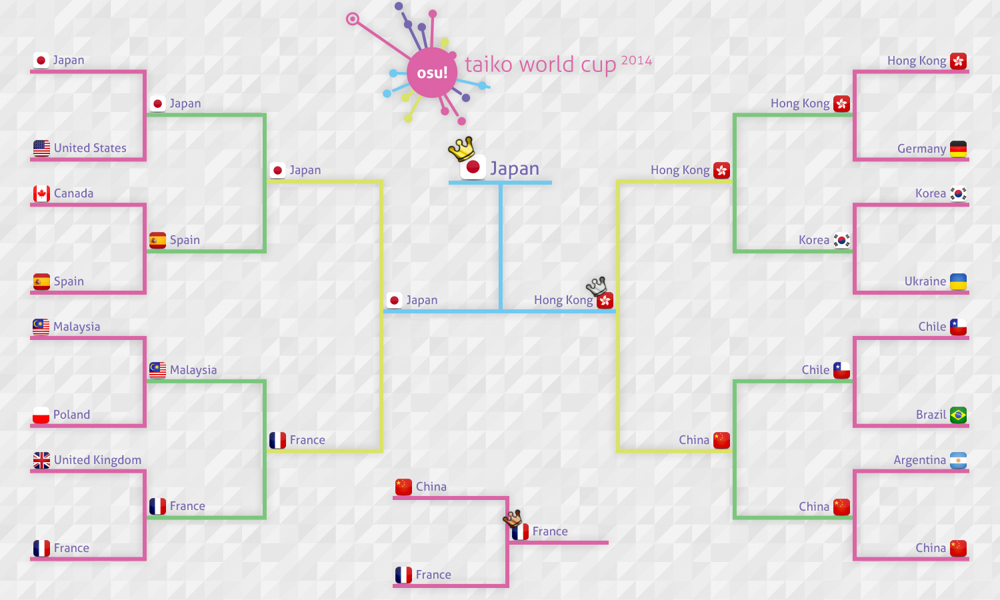

---
tags:
  - TWC 2014
  - TWC2014
---

# osu! Taiko World Cup 2014

The **osu! Taiko World Cup 2014** (***TWC 2014***) was a country-based osu!taiko tournament hosted by the [osu! team](/wiki/People/osu!_team). It was the fourth instalment of the osu!taiko World Cup.

## Tournament schedule

| Event | Timestamp |
| --: | :-- |
| Registration phase | 2014-01-16/2014-01-26 |
| Live drawings | 2014-02-01 (13:00 UTC) |
| Group stage | 2014-02-07/2014-02-09 |
| Round of 16 | 2014-02-15/2014-02-16 |
| Quarterfinals | 2014-02-22/2014-02-23 |
| Semifinals | 2014-03-01/2014-03-02 |
| Finals week 1 | 2014-03-08/2014-03-09 |
| Finals week 2 | 2014-03-15 |

## Prizes

| Placing | Prize(s) |
| :-: | :-- |
|  | 6 months of osu!supporter, unique profile badge, TWC trophy |
|  | 3 months of osu!supporter |
|  | 1 month of osu!supporter |

## Organisation

The Taiko World Cup 2014 was run by various community members.

| Position | Member(s) |
| :-- | :-- |
| Manager | ::{ flag=DE }:: [Loctav](https://osu.ppy.sh/users/71366), ::{ flag=DE }:: [p3n](https://osu.ppy.sh/users/123703) |
| Mappool selector | ::{ flag=DE }:: [OnosakiHito](https://osu.ppy.sh/users/290128) |
| Streamer | ::{ flag=FR }:: [shARPII](https://osu.ppy.sh/users/776257) |
| Commentator | ::{ flag=NZ }:: [deadbeat](https://osu.ppy.sh/users/128370), ::{ flag=NO }:: [Dolphin](https://osu.ppy.sh/users/1331438), ::{ flag=FR }:: [Mr Color](https://osu.ppy.sh/users/116078), ::{ flag=DE }:: [OnosakiHito](https://osu.ppy.sh/users/290128), ::{ flag=US }:: [ztrot](https://osu.ppy.sh/users/6347) |
| Statistician | ::{ flag=PL }:: [Marcin](https://osu.ppy.sh/users/722665) |

## Links

- [Discussion thread](https://osu.ppy.sh/community/forums/topics/179127)
- [Livestream](https://www.twitch.tv/osulive)

## Participants

|  | Country | Members |
| :-: | :-: | :-- |
| ::{ flag=AR }:: | **Argentina** | **[whosthebox](https://osu.ppy.sh/users/1451311)**, [Chillet](https://osu.ppy.sh/users/1236632), [cyntuu mirandaa](https://osu.ppy.sh/users/724230), [Lost The Lights](https://osu.ppy.sh/users/1255920), [Nearex](https://osu.ppy.sh/users/1893238), [Pollotuc](https://osu.ppy.sh/users/42440) |
| ::{ flag=BR }:: | **Brazil** | **[Kolbe](https://osu.ppy.sh/users/1254286)**, [- T i g e r -](https://osu.ppy.sh/users/1381781), [lubask](https://osu.ppy.sh/users/1897332), [suyama-chan](https://osu.ppy.sh/users/928298), [Wolf](https://osu.ppy.sh/users/555855), [Yuki-chan](https://osu.ppy.sh/users/93687) |
| ::{ flag=CA }:: | **Canada** | **[Tasha](https://osu.ppy.sh/users/1031958)**, [Crystalloid](https://osu.ppy.sh/users/699741), [kenny388](https://osu.ppy.sh/users/1098972), [Nanners](https://osu.ppy.sh/users/459886), [xlzqwerty1](https://osu.ppy.sh/users/1466365) |
| ::{ flag=CL }:: | **Chile** | **[-Anhedonia-](https://osu.ppy.sh/users/920861)**, [Gonzaalooo](https://osu.ppy.sh/users/1948903), [megadaisukeone](https://osu.ppy.sh/users/1577133), [MikuWhiteRockShooter](https://osu.ppy.sh/users/1619547) |
| ::{ flag=CN }:: | **China** | **[- Yuuka Niya -](https://osu.ppy.sh/users/1892059)**, [- Kagami Yuki -](https://osu.ppy.sh/users/1319686), [HM495](https://osu.ppy.sh/users/810813), [moe moe moe](https://osu.ppy.sh/users/1804904), [mousegoomba](https://osu.ppy.sh/users/1035291), [yys428](https://osu.ppy.sh/users/1061175) |
| ::{ flag=FR }:: | **France** | **[\_Gezo\_](https://osu.ppy.sh/users/481582)**, [Fraolinch](https://osu.ppy.sh/users/205257), [Jinyan](https://osu.ppy.sh/users/669531), [Nashmun](https://osu.ppy.sh/users/49031), [omegaflo](https://osu.ppy.sh/users/83291), [TimmyAkmed](https://osu.ppy.sh/users/1799973) |
| ::{ flag=DE }:: | **Germany** | **[Luna](https://osu.ppy.sh/users/588007)**, [\[TaikoTori\]](https://osu.ppy.sh/users/1074143), [BrokenArrow](https://osu.ppy.sh/users/384034), [DarkDunskin](https://osu.ppy.sh/users/98985), [Mew104](https://osu.ppy.sh/users/2345156), [tiamus](https://osu.ppy.sh/users/515277) |
| ::{ flag=HK }:: | **Hong Kong** | **[thomas1195](https://osu.ppy.sh/users/1691488)**, [\[yuyuko\_Saigyouj\]](https://osu.ppy.sh/users/1378994), [aabc271](https://osu.ppy.sh/users/155707), [Andrew Chow](https://osu.ppy.sh/users/3043041), [ice man007](https://osu.ppy.sh/users/1926937), [Jikson\[m9\]](https://osu.ppy.sh/users/1485257) |
| ::{ flag=JP }:: | **Japan** | **[TKSalt](https://osu.ppy.sh/users/940878)**, [azger](https://osu.ppy.sh/users/2335982), [NeGaTiVeMinD](https://osu.ppy.sh/users/965038), [Orukaa](https://osu.ppy.sh/users/987895), [pagr42](https://osu.ppy.sh/users/1500725), [sobatsuyu100](https://osu.ppy.sh/users/2076374) |
| ::{ flag=MY }:: | **Malaysia** | **[taiko_maniac1811](https://osu.ppy.sh/users/595764)**, [buhzidao](https://osu.ppy.sh/users/1655126), [cdhsausageboy](https://osu.ppy.sh/users/2403621), [HeatKai](https://osu.ppy.sh/users/332555), [huiko12](https://osu.ppy.sh/users/598553), [Jerry](https://osu.ppy.sh/users/605973) |
| ::{ flag=PH }:: | **Philippines** | **[Primrea](https://osu.ppy.sh/users/943743)**, [Kotaro](https://osu.ppy.sh/users/796530), [Pizzicato](https://osu.ppy.sh/users/692610), [senkai](https://osu.ppy.sh/users/1150178) |
| ::{ flag=PL }:: | **Poland** | **[Acrith](https://osu.ppy.sh/users/389880)**, [DarkStoorM](https://osu.ppy.sh/users/174347), [IsonamiPL](https://osu.ppy.sh/users/1753234), [Minkodon](https://osu.ppy.sh/users/1385227), [LZMieczu](https://osu.ppy.sh/users/1797498), [Sylwia132](https://osu.ppy.sh/users/2037319) |
| ::{ flag=RU }:: | **Russian Federation** | **[MarisaLover](https://osu.ppy.sh/users/1359539)**, [Livius777](https://osu.ppy.sh/users/1282662), [magax](https://osu.ppy.sh/users/918645) |
| ::{ flag=SG }:: | **Singapore** | **[CoroQuetz](https://osu.ppy.sh/users/499843)**, [DJNightmare](https://osu.ppy.sh/users/70909), [minray](https://osu.ppy.sh/users/653771), [neonat](https://osu.ppy.sh/users/1561995) |
| ::{ flag=KR }:: | **South Korea** | **[Konpaku Sariel](https://osu.ppy.sh/users/533502)**, [\[Akita-Neru\]](https://osu.ppy.sh/users/613944), [-applerss-](https://osu.ppy.sh/users/983349), [eoe](https://osu.ppy.sh/users/659959), [L y s](https://osu.ppy.sh/users/211825) |
| ::{ flag=ES }:: | **Spain** | **[LZD](https://osu.ppy.sh/users/224335)**, [Ares267](https://osu.ppy.sh/users/174378), [CARRI](https://osu.ppy.sh/users/854536), [Hanjamon](https://osu.ppy.sh/users/1703330), [MYRKUL](https://osu.ppy.sh/users/255933), [son\_gohan\_2](https://osu.ppy.sh/users/443305) |
| ::{ flag=SE }:: | **Sweden** | **[boat](https://osu.ppy.sh/users/276074)**, [birrin](https://osu.ppy.sh/users/2290294), [Fuwuwi](https://osu.ppy.sh/users/88200), [Tanaka](https://osu.ppy.sh/users/1897905) |
| ::{ flag=UA }:: | **Ukraine** | **[Pagliaccio](https://osu.ppy.sh/users/1163187)**, [Aka](https://osu.ppy.sh/users/1307553), [Anny](https://osu.ppy.sh/users/249094) |
| ::{ flag=GB }:: | **United Kingdom** | **[xWillx](https://osu.ppy.sh/users/696222)**, [abrian159](https://osu.ppy.sh/users/1159051), [Dainesl](https://osu.ppy.sh/users/1588551), [Lno](https://osu.ppy.sh/users/1900787), [TurnipLover](https://osu.ppy.sh/users/1133830) |
| ::{ flag=US }:: | **United States** | **[MMzz](https://osu.ppy.sh/users/128993)**, [AnFace](https://osu.ppy.sh/users/233485), [Backfire](https://osu.ppy.sh/users/263110), [burntpurple1](https://osu.ppy.sh/users/2238673), [LoLBryster](https://osu.ppy.sh/users/1800629), [OzzyOzrock](https://osu.ppy.sh/users/465153) |

## Groups

| Group A | Group B | Group C | Group D |
| :-- | :-- | :-- | :-- |
| ::{ flag=BR }:: Brazil | ::{ flag=CN }:: China | ::{ flag=FR }:: France | ::{ flag=US }:: United States |
| ::{ flag=MY }:: Malaysia | ::{ flag=KR }:: South Korea | ::{ flag=AR }:: Argentina | ::{ flag=CL }:: Chile |
| ::{ flag=JP }:: Japan | ::{ flag=ES }:: Spain | ::{ flag=UA }:: Ukraine | ::{ flag=PH }:: Philippines |
| ::{ flag=DE }:: Germany | ::{ flag=SG }:: Singapore | ::{ flag=CA }:: Canada | ::{ flag=PL }:: Poland |
| ::{ flag=SE }:: Sweden | ::{ flag=GB }:: United Kingdom | ::{ flag=RU }:: Russian Federation | ::{ flag=HK }:: Hong Kong |

## Podium

This competition has come to an end and resulted in the following podium:

| Placing | Team |
| :-: | :-- |
|  | ::{ flag=JP }:: **Japan** (**[TKSalt](https://osu.ppy.sh/users/940878)**, [azger](https://osu.ppy.sh/users/2335982), [NeGaTiVeMinD](https://osu.ppy.sh/users/965038), [Orukaa](https://osu.ppy.sh/users/987895), [pagr42](https://osu.ppy.sh/users/1500725), [sobatsuyu100](https://osu.ppy.sh/users/2076374)) |
|  | ::{ flag=HK }:: **Hong Kong** (**[thomas1195](https://osu.ppy.sh/users/1691488)**, [\[yuyuko\_Saigyouj\]](https://osu.ppy.sh/users/1378994), [aabc271](https://osu.ppy.sh/users/155707), [Andrew Chow](https://osu.ppy.sh/users/3043041), [ice man007](https://osu.ppy.sh/users/1926937), [Jikson\[m9\]](https://osu.ppy.sh/users/1485257)) |
|  | ::{ flag=FR }:: **France** (**[\_Gezo\_](https://osu.ppy.sh/users/481582)**, [Fraolinch](https://osu.ppy.sh/users/205257), [Jinyan](https://osu.ppy.sh/users/669531), [Nashmun](https://osu.ppy.sh/users/49031), [omegaflo](https://osu.ppy.sh/users/83291), [TimmyAkmed](https://osu.ppy.sh/users/1799973)) |

## Mappools

### Finals

**This mappool was played during the Finals week 1 and Finals week 2.**

**[Download the mappack here! (168 MB)](https://www.mediafire.com/download/5s7me0e532r591m/TWC_Finals.rar)**

- NoMod
  1. [Nero's Day At Disneyland - No Money Down, Low Monthly Payments (grumd) \[Loctav's Oni\]](https://osu.ppy.sh/beatmapsets/111825#taiko/297950)
  2. [LeaF - MEPHISTO (Alumetorz) \[TK'S Inner Oni\]](https://osu.ppy.sh/beatmapsets/106212#taiko/284037)
  3. [xi - FREEDOM DiVE (Short Ver.) (OnosakiHito) \[Ura Oni\]](https://osu.ppy.sh/beatmapsets/152169#taiko/374699)
  4. [LeaF - Nano Death!!!!!!! (LunaticP) \[Taiko Eclipse\]](https://osu.ppy.sh/beatmapsets/134139#taiko/336550)
  5. [D.J.Amuro Vs MAX MAXIMIZER - HAERETICUS (Strawberry) \[Firce777's Taiko Oni\]](https://osu.ppy.sh/beatmapsets/87874#taiko/243795)
  6. [sHimaU - Slotcore is Dead (Alumetorz) \[Ura Oni\]](https://osu.ppy.sh/beatmapsets/119233#taiko/306202)
- Hidden
  1. [Toyosaki Aki - GO! GO! MANIAC (TV Size) (climbb65588) \[youngdown's Drum :3\]](https://osu.ppy.sh/beatmapsets/14702#taiko/53930)
  2. [doriko - Yuuhi Zaka (Athena Tennos) \[Ts8zs' Taiko\]](https://osu.ppy.sh/beatmapsets/54581#taiko/167872)
  3. [SID - Rain (TV Size) (KIA) \[aru's Taiko Oni\]](https://osu.ppy.sh/beatmapsets/14818#taiko/70966)
  4. [Spring Head - Fallen Angel (soulfear) \[lepidon! - Taiko Oni\]](https://osu.ppy.sh/beatmapsets/13922#taiko/51769)
- HardRock
  1. [Yousei Teikoku - Asgard (Lybydose) \[Ozzy's Taiko\]](https://osu.ppy.sh/beatmapsets/27712#taiko/100260)
  2. [ChouchouP - Tsukimiyo Rabbit (Zero\_\_wind) \[Firce777's Inner Oni\]](https://osu.ppy.sh/beatmapsets/122342#taiko/332373)
  3. [SAVE THE QUEEN - EX-Termination (Jenny) \[Taiko Oni\]](https://osu.ppy.sh/beatmapsets/50181#taiko/170728)
  4. [Zektbach - L'erisia(Primal Logic) (AngelHoney) \[Firce777's Taiko\]](https://osu.ppy.sh/beatmapsets/64010#taiko/188757)
- DoubleTime
  1. [Tamura Yukari feat. motsu from m.o.v.e - You & Me (cRyo\[iceeicee\]) \[Climbb & aabc's Taiko Oni\]](https://osu.ppy.sh/beatmapsets/67093#taiko/252518)
  2. [Cuvelia - Tenkuu no Yoake (AngelHoney) \[Tama's Taiko Oni\]](https://osu.ppy.sh/beatmapsets/47757#taiko/148012)
  3. [Memme - Extreme Fantasy (AngelHoney) \[Taiko Oni\]](https://osu.ppy.sh/beatmapsets/49459#taiko/173048)
  4. [Megpoid GUMI - Chocolate (Chewin) \[Ono's Taiko Oni\]](https://osu.ppy.sh/beatmapsets/52732#taiko/164075)
- FreeMod
  1. [t+pazolite - to Luv me, I \*\*\* for u. (reprise) (pekos) \[Taikocalypse\]](https://osu.ppy.sh/beatmapsets/42741#taiko/135070)
  2. [Igorrr - Unpleasant Sonata (Sieg) \[Loctav's Oni\]](https://osu.ppy.sh/beatmapsets/90385#taiko/262458)
  3. [t+pazolite feat. Rizna - Imcomplete Cherry Girl (TKSalt) \[KrazySalt (TWC Version)\]](https://osu.ppy.sh/beatmapsets/96369#taiko/378734)
  4. [S.S.H. - Intersect Thunderbolt-Remix (7odoa) \[Taiko Inner Oni\]](https://osu.ppy.sh/beatmapsets/38316#taiko/170038)
- Tiebreaker
  1. **[Tatsh - IMAGE -MATERIAL- \<Version 0\> (Scorpiour) \[Firce777's Taiko Oni\]](https://osu.ppy.sh/beatmapsets/93523#taiko/261205)**

### Semifinals

**[Download the mappack here! (153 MB)](https://www.mediafire.com/download/743weel8bsn9b20/TWC_Semi-finals.rar)**

- NoMod
  1. [Sota Fujimori - WOBBLE IMPACT (Loctav) \[Inner Oni\]](https://osu.ppy.sh/beatmapsets/152368#taiko/375040)
  2. [Renard - Terminal (nold\_1702) \[mint's Inner Oni\]](https://osu.ppy.sh/beatmapsets/102282#taiko/291218)
  3. [Nekomata Master - Smile of Split (Charles445) \[MM's Taiko\]](https://osu.ppy.sh/beatmapsets/56847#taiko/171679)
  4. [Inspector K - Disconnected Hardkore (CanBlaster Remix) (Shiirn) \[Taikore\]](https://osu.ppy.sh/beatmapsets/37242#taiko/119914)
  5. [Reizoko Cj - Hardcore Syndrome (NekoMimiMode) \[Taikosaki\]](https://osu.ppy.sh/beatmapsets/47550#taiko/174345)
  6. [The Quick Brown Fox - HIT AND RUN IN 1920 A.D. (kazukisinx) \[Inner Oni\]](https://osu.ppy.sh/beatmapsets/77858#taiko/218190)
- Hidden
  1. [fripSide - memory of snow (KanaRin) \[Taiko Collab\]](https://osu.ppy.sh/beatmapsets/26097#taiko/89239)
  2. [Atoguru - Mr.Liar (sirjuyt) \[Ono's Taiko Oni\]](https://osu.ppy.sh/beatmapsets/32889#taiko/111015)
  3. [Madeon - Shuriken (Charles445) \[MM's Taiko\]](https://osu.ppy.sh/beatmapsets/34595#taiko/112818)
  4. [M2U - Masquerade (- Kagami Yuki -) \[Inner Oni\]](https://osu.ppy.sh/beatmapsets/132040#taiko/332272)
- HardRock
  1. [Lon - Yuru Fuwa Jukai Girl (Love) \[Oni\]](https://osu.ppy.sh/beatmapsets/123810#taiko/315972)
  2. [Hatsune Miku - Hatsune Miku no Shuuen (DJPop) \[31's Taiko\]](https://osu.ppy.sh/beatmapsets/14463#taiko/53283)
  3. [Prim - Koisuru\*Uchuu Sensou!! (Ryu\* Remix) (DoKoLP) \[Ono's Taiko Oni\]](https://osu.ppy.sh/beatmapsets/47027#taiko/160078)
  4. [paraoka - boot (rickyboi) \[inaba's Taiko\]](https://osu.ppy.sh/beatmapsets/50131#taiko/157233)
- DoubleTime
  1. [SHK - Weep Irish (AngelHoney) \[Kana's Taiko Oni\]](https://osu.ppy.sh/beatmapsets/28545#taiko/95775)
  2. [3L - Come Back To Me (orioncomet) \[Taiko\]](https://osu.ppy.sh/beatmapsets/24201#taiko/87650)
  3. [Niko - Night of Fire (Gabi) \[lepidon! - Taiko Oni\]](https://osu.ppy.sh/beatmapsets/18923#taiko/77710)
  4. [O-Life Japan - Yamanobori Kibun (qinche) \[Taiko\]](https://osu.ppy.sh/beatmapsets/30256#taiko/100178)
- FreeMod
  1. [07th Expansion - rog-unlimitation (AngelHoney) \[lepidon! - Taiko Oni\]](https://osu.ppy.sh/beatmapsets/28751#taiko/110148)
  2. [Rohi - Kakuzetsu Thanatos (NatsumeRin) \[qoot8123's Taiko Oni\]](https://osu.ppy.sh/beatmapsets/76396#taiko/216148)
  3. [Renard - Why Am I So Angry (Blue Dragon) \[lepidon! - Taiko Oni\]](https://osu.ppy.sh/beatmapsets/31133#taiko/260832)
  4. [Shounen Radio - uen (KDS) \[Taiko DS\]](https://osu.ppy.sh/beatmapsets/45015#taiko/140772)
- Tiebreaker
  1. **[Yousei Teikoku - gothic lolita agitator (TKSalt) \[Inner Oni\]](https://osu.ppy.sh/beatmapsets/101004#taiko/267841)**

### Quarterfinals

**[Download the mappack here! (146 MB)](https://www.mediafire.com/download/vyekjgtc1wj2xlk/TWC_Quarter_finals.rar)**

- NoMod
  1. [Lite Show Magic - Crack traxxxx (KinomiCandy) \[Oni\]](https://osu.ppy.sh/beatmapsets/134900#taiko/338140)
  2. [bj.HaLo - G-garden (ampzz) \[Ono's Taiko Oni\]](https://osu.ppy.sh/beatmapsets/49009#taiko/371678)
  3. [Igorrr - Mastication Numerique (grumd) \[Loctav's Taiko Oni\]](https://osu.ppy.sh/beatmapsets/54182#taiko/165342)
  4. [DJ Sharpnel - IVALTEK (happy30) \[Phedondon\]](https://osu.ppy.sh/beatmapsets/50429#taiko/155101)
  5. [Caravan Palace - Dragons (Charles445) \[MM's Taiko\]](https://osu.ppy.sh/beatmapsets/46733#taiko/145511)
  6. [Black Raison d'etre - INSIDE IDENTITY (Natsu) \[aabc's Taiko Oni\]](https://osu.ppy.sh/beatmapsets/100682#taiko/280103)
- Hidden
  1. [Sakakibara Yui - Toki Tsukasadoru Juuni no Meiyaku (TV Size) (gina91189) \[Car's Taiko\]](https://osu.ppy.sh/beatmapsets/31685#taiko/104568)
  2. [Asumi Kana & Fujita Saki & Kitamura Eri - COOLISH WALK (TV Size) (biwako) \[Taiko\]](https://osu.ppy.sh/beatmapsets/37136#taiko/119583)
  3. [Chai Found Music Workshop - Zeihen \~transformation\~ (xierbaliti) \[Taiko Ura Oni\]](https://osu.ppy.sh/beatmapsets/25503#taiko/86571)
  4. [cosMo@Bousou-P - neu BSP style (Bass) \[31's Taiko\]](https://osu.ppy.sh/beatmapsets/50670#taiko/155964)
- HardRock
  1. [Denkare - Satsuriku no Keifu (lolcubes) \[Oni\]](https://osu.ppy.sh/beatmapsets/95925#taiko/257366)
  2. [Qrispy Joybox - snow prism (TKSalt) \[Inner Oni\]](https://osu.ppy.sh/beatmapsets/72392#taiko/206916)
  3. [Yucha-P - Thieves Night Trick (Fraolinch) \[Taiko Trick\]](https://osu.ppy.sh/beatmapsets/148785#taiko/367777)
  4. [Sta - Iris (MMzz) \[Oni\]](https://osu.ppy.sh/beatmapsets/106598#taiko/279828)
- DoubleTime
  1. [Tsubaki - Aijou Pandemic (Nymph) \[KS's Taiko\]](https://osu.ppy.sh/beatmapsets/40166#taiko/129682)
  2. [ave;new feat. Sakura Saori - My Sweet Lady (Short Ver.) (osuplayer111) \[Taiko Oni\]](https://osu.ppy.sh/beatmapsets/41209#taiko/131073)
  3. [NAOKI feat. SMiLE.dk - A Geisha's Dream (yongtw123) \[Taiko Oni\]](https://osu.ppy.sh/beatmapsets/28766#taiko/103398)
  4. [IOSYS - Endless Tewi-ma Park (Kurosanyan) \[Taiko Oni\]](https://osu.ppy.sh/beatmapsets/48874#taiko/153393)
- FreeMod
  1. [kors k feat. Furukawa Mirin - Drive Me Crazy (ampzz) \[Kurosanyan's Oni\]](https://osu.ppy.sh/beatmapsets/65950#taiko/215497)
  2. [Mutsuhiko Izumi - Red Goose (lepidopodus) \[Oni\]](https://osu.ppy.sh/beatmapsets/55920#taiko/169371)
  3. [IOSYS - RE:Usatei (OzzyOzrock) \[Taiko Oni\]](https://osu.ppy.sh/beatmapsets/31343#taiko/103022)
  4. [capsule - JUMPER (Mafiamaster) \[Roko-Don's Taiko\]](https://osu.ppy.sh/beatmapsets/21130#taiko/74040)
- Tiebreaker
  1. **[Demetori - Higan Retour \~ View of The River Styx (RLC) \[Love's Oni\]](https://osu.ppy.sh/beatmapsets/140944#taiko/351752)**

### Round of 16

**[Download the mappack here! (169 MB)](https://www.mediafire.com/download/2stinw27hm7h4kv/TWC+Round+of+16.rar)**

- NoMod
  1. [celas - Azul (Remix) (AngelHoney) \[KUMA's Taiko\]](https://osu.ppy.sh/beatmapsets/40273#taiko/128937)
  2. [SHIKI - BABYLON (miccoliasms) \[Alace's Taiko\]](https://osu.ppy.sh/beatmapsets/31373#taiko/104218)
  3. [WESTARENA by MLREC. - ROUND! (Sushi) \[Inner Oni\]](https://osu.ppy.sh/beatmapsets/88125#taiko/240372)
  4. [Linked Horizon - Jiyuu no Tsubasa (TV Size) (Kuria) \[Kana's Taiko Oni\]](https://osu.ppy.sh/beatmapsets/104986#taiko/277009)
  5. [Ryu\* Vs. L.E.D.-G - PARADISE LOST (ignorethis) \[Taiko\]](https://osu.ppy.sh/beatmapsets/38043#taiko/122471)
  6. [Kano - Houkago Stride (Short Ver.) (Lundlerol) \[Oni\]](https://osu.ppy.sh/beatmapsets/80983#taiko/225075)
- Hidden
  1. [P\*Light - TRIGGER\*HAPPY (MineC24) \[m1ng's Oni\]](https://osu.ppy.sh/beatmapsets/74671#taiko/249943)
  2. [Rise Against - Prayer of the Refugee (Nashmun) \[Oni\]](https://osu.ppy.sh/beatmapsets/110554#taiko/287969)
  3. [Nomizu Iori - \*\*\* Passionate (TV Size) (Vicho-kun) \[Climbb's Taiko Oni\]](https://osu.ppy.sh/beatmapsets/48135#taiko/148982)
  4. [Gentle Stick X M2U - Hades in the Heaven (AngelHoney) \[Ono's Taiko Oni\]](https://osu.ppy.sh/beatmapsets/114488#taiko/307654)
- HardRock
  1. [TOMOSUKE - Macuilxochitl (Charles445) \[\[Shalon\]'s Jubeataiko\]](https://osu.ppy.sh/beatmapsets/43166#taiko/140245)
  2. [Hatsune Miku - Tenshinranman High Collar Hime (NatsumeRin) \[Taiko Oni\]](https://osu.ppy.sh/beatmapsets/55115#taiko/172872)
  3. [DJ TECHNORCH fw. GUHROOVY - KAMAITACHI (fanzhen0019) \[Firce's Taiko\]](https://osu.ppy.sh/beatmapsets/52820#taiko/161427)
  4. [Denkare - gemini (lolcubes) \[Inner Oni\]](https://osu.ppy.sh/beatmapsets/115871#taiko/299163)
- DoubleTime
  1. [Global Deejays - The Sound of San Francisco (Sey) \[OniZoda\]](https://osu.ppy.sh/beatmapsets/96422#taiko/264930)
  2. [PSY - GANGNAM STYLE (yeahyeahyeahhh) \[lepidon! - Taiko Oni\]](https://osu.ppy.sh/beatmapsets/55799#taiko/169840)
  3. [Croove & Mr. Funky - OUT LAW : Reborn (MoonFragrance) \[Taiko\]](https://osu.ppy.sh/beatmapsets/18299#taiko/66082)
  4. [Cream puff - Mermaid girl (tsuka) \[Taiko\]](https://osu.ppy.sh/beatmapsets/30569#taiko/114451)
- FreeMod
  1. [Nanamori-chu \* Goraku-bu - My Pace de Ikimashou (TV Size) (wcx19911123) \[Kanpakyin's Taiko Oni\]](https://osu.ppy.sh/beatmapsets/36333#taiko/118502)
  2. [Galdeira - Almagest (Wuiss) \[31's Taiko\]](https://osu.ppy.sh/beatmapsets/21915#taiko/76993)
  3. [DJ TOTTO - Windy Fairy (Raose) \[TK'S Oni\]](https://osu.ppy.sh/beatmapsets/102005#taiko/272798)
  4. [senya - Kasoku Suru Koi wa Dare mo Tomerarenai (Scorpiour) \[Wmf's Taiko\]](https://osu.ppy.sh/beatmapsets/80747#taiko/249371)
- Tiebreaker
  1. **[DystopiaGround - AugoEidEs (jonathanlfj) \[Ono's Taiko Oni\]](https://osu.ppy.sh/beatmapsets/136969#taiko/383455)**

### Group stage

**[Download the mappack here! (211 MB)](https://www.mediafire.com/download/8kv1e4zne081tvp/TWC+Group+Stage.rar)**

- NoMod
  1. [Loos - Koi Yomi Zakura (NatsumeRin) \[Kana's Taiko Oni\]](https://osu.ppy.sh/beatmapsets/33976#taiko/111835)
  2. [monotone - Totsugeki! Glass no Kneesocks Hime! (Reisen Udongein) \[31's Taiko\]](https://osu.ppy.sh/beatmapsets/54308#taiko/171889)
  3. [cranky - R176 (taka1235) \[Pangko\]](https://osu.ppy.sh/beatmapsets/31367#taiko/121335)
  4. [Ellie Goulding - Burn (Nashmun) \[Oni\]](https://osu.ppy.sh/beatmapsets/140698#taiko/351271)
  5. [bbn - Identic Conflict (Flower) \[Taiko Oni\]](https://osu.ppy.sh/beatmapsets/49188#taiko/176435)
  6. [Tsukasa - Visions (MMzz) \[Inner Oni\]](https://osu.ppy.sh/beatmapsets/97162#taiko/261694)
  7. [Nico Nico Douga - Owens (AngelHoney) \[Climbb's Taiko Oni\]](https://osu.ppy.sh/beatmapsets/20406#taiko/76538)
  8. [incinerate - Purgatorium (RikiH\_) \[inaba's Taiko Oni\]](https://osu.ppy.sh/beatmapsets/54727#taiko/168534)
  9. [LeaF - Calamity Fortune (Flower) \[TK's Oni\]](https://osu.ppy.sh/beatmapsets/96103#taiko/263683)
  10. [AU - Infinite of Nuclear Fusion (OnosakiHito) \[Inner Oni\]](https://osu.ppy.sh/beatmapsets/35211#taiko/285041)
- Hidden
  1. [ONE OK ROCK - Never Let This Go (qoot8123) \[Oni\]](https://osu.ppy.sh/beatmapsets/79713#taiko/222303)
  2. [Yooh - Dynasty (HelloSCV) \[714's Taiko Oni\]](https://osu.ppy.sh/beatmapsets/83094#taiko/229726)
  3. [Mizuki Nana - Vitalization (TV Size) (Flower) \[Oni\]](https://osu.ppy.sh/beatmapsets/102803#taiko/279373)
- HardRock
  1. [Hoshio Yuka - Tabidachi no Shuen (lolcubes) \[Oni (TWC Version)\]](https://osu.ppy.sh/beatmapsets/119729#taiko/307304)
  2. [UPLIFT SPICE - Omega Rhythm (toara\_fict) \[Inner Oni\]](https://osu.ppy.sh/beatmapsets/105365#taiko/276622)
  3. [VY1 - Cyber Thunder Cider (tutuhaha) \[Sp3's Taiko\]](https://osu.ppy.sh/beatmapsets/47146#taiko/146915)
- DoubleTime
  1. [Kara - Step (MoonFragrance) \[Taiko\]](https://osu.ppy.sh/beatmapsets/40893#taiko/137582)
  2. [8\#Prince - take it easy (Pokie) \[ReySHel's Taiko Oni\]](https://osu.ppy.sh/beatmapsets/79717#taiko/222527)
  3. [K2 - What's Your Deep Wish? (lolcubes) \[Oni\]](https://osu.ppy.sh/beatmapsets/48721#taiko/169891)
- FreeMod
  1. [Shihori - Bloody Night (Frostmourne) \[Boss Taiko Oni\]](https://osu.ppy.sh/beatmapsets/46223#taiko/149087)
  2. [Croove & Paul Bazooka - Enemy Storm (Dark Jungle Mix) (Reiji-RJ) \[lepidon! - Taiko Oni\]](https://osu.ppy.sh/beatmapsets/30229#taiko/124413)
  3. [sakuzyo feat. Hatsune Miku - ChaiN De/structioN (Shiirn) \[Climbb & Kana's Taiko Oni\]](https://osu.ppy.sh/beatmapsets/49071#taiko/154164)
- Tiebreaker
  1. **[paraoka - Manima ni (Sandpig) \[Pangko\]](https://osu.ppy.sh/beatmapsets/43107#taiko/136184)**

## Ruleset

### Tournament rules

1. The osu! Taiko World Cup is a country-based 3v3 team tournament.
2. The maps for each round will be announced by the mapset selector in advance on the Sunday before the actual matches take place. Only these will be used during the respective matches.
   - One map will be given as tiebreaker map. This map will only be played in case of a tie.
   - There will also be a [Hidden](/wiki/Gameplay/Game_modifier/Hidden), [HardRock](/wiki/Gameplay/Game_modifier/Hard_Rock), [DoubleTime](/wiki/Gameplay/Game_modifier/Double_Time) and FreeMod bracket.
3. Match schedule will be settled by Tournament Management (see below).
4. If no staff or referee is available, the match will be postponed.
5. Failed player's score do not get added to the team score.
6. Use of the [Visual Settings](/wiki/Client/Interface/Visual_settings) options are allowed.
7. If the game ends in a draw, the game will be nullified.
8. If a player disconnects, they get treated as if they failed the map.
9. Maps cannot be reused in the same match unless the game was nullified.
10. If less than 3 players attend, the maximum time the match can be postponed is 10 minutes.
11. Exchanging players during a match is allowed.
    - You may exchange only one player once per map.
12. Lag is not a valid reason to nullify a map.
13. In Group stage, 'Win by default' will be considered as win by 4:0, +1.0 score difference ratio.
14. Unexpected incidences are handled by the tournament management.
15. Any modification of these rules will be announced.

### Tournament registration

1. Your team needs **at least 3 players** to participate.
   - The maximum team size is 6.
   - You must specify a captain who will represent the team.
2. Each team represents a nation. You must form a team with players from the same country.
3. For team sign ups, [fill out this form](https://docs.google.com/forms/d/1C58_JWKBVVUrJr5so9LBBsqp6LqZktJjGVSZ4pbRhEo/viewform). Then, verify your registration by [sending a PM to Loctav](https://osu.ppy.sh/home/messages/users/71366) titled “TWC Registration”
   - Captains may change their setup by [notifying the management](https://osu.ppy.sh/home/messages/users/71366).
   - You get a confirmation reply in case your registration successfully arrived. Your registration is in pending then.
4. To ensure valid and serious registrations, any registration and change will be checked by the Tournament Management.
5. The total amount of teams is 20.
6. All successfully registered teams will be published after Registration Phase.
   - Captains will get notified in case their roster has been accepted or rejected.
7. Mapset selectors may not participate as a player in this tournament.

### Stage instructions

1. In the first stage (Group Stage), the teams will be divided into 4 groups of 5 teams.
2. All the teams from each group will face each other.
3. Rankings of each group are determined by sorting the results of each team's performance in the following priority:
   1. Most matches won.
   2. Have higher `{(the number of maps won) - (the number of maps defeated)}`.
   3. Most maps won.
   4. Have higher `∑{(total score difference) / (maximum score)}`.
   5. Winner of the rematch.
4. The top 4 teams of each group will move on to the Knock-Out Stages.
5. Following stages are Knock-Out Stages. This means that the winner moves to the next stage and the losing team gets kicked out of the tournament.
6. **Winning conditions:**
   - In Group Stage, you need to win 4 maps to win a match. (Best-of-7)
   - In the Round of 16 and the Quarterfinals, you need to win 5 maps to win a match. (Best-of-9)
   - In Semifinals and Finals, you need to win 6 maps to win a match. (Best-of-11)

### Match instructions

1. A referee will create a multiplayer room 20 minutes in advance. Players must gather during this period.
   - The room will be locked. The password and multiplayer invite will be sent to the two captains as soon as possible.
   - Room settings are Taiko, Team-Vs., Win Condition: 'Score'. Room name must be "Taiko World Cup 2014: TeamBlue vs TeamRed"
   - The team mentioned first in the room name must be the blue team, the team mentioned second in the room name must be the red team.
2. Players are free to select up to two warm-up maps.
3. Map selection will alternate between each captain selecting a map out of the map pool. Each captain must use `!roll` once in `#multiplayer` to determine which team selects first.
   - The captains may select maps out of the NoMod and FreeMod bracket freely.
   - Selection out of mod-specific brackets is limited. Each captain may only select one map from each mod-restricted bracket during the match.
     - Selection out of FreeMod bracket is unlimited.
   - In case of a tie, the tiebreaker map must be played.
4. Results will be published via Statistics site.

### Mappool instructions

1. There will be 1 mappool for the Group Stage, 1 mappool for Round 16, 1 mappool for the Quarter-finals, 1 mappool for the Semi-finals and 1 mappool for the Finals.
2. Each mappool consists of 5 brackets: NoMod, [Hidden](/wiki/Gameplay/Game_modifier/Hidden), [HardRock](/wiki/Gameplay/Game_modifier/Hard_Rock), [DoubleTime](/wiki/Gameplay/Game_modifier/Double_Time) and FreeMod
3. Each mappool consists of 23 maps in total.
4. Each mappool has one tiebreaker
5. The NoMod bracket will be played with no modes activated.
6. The Hidden, HardRock and DoubleTime bracket will be played with the respective modes activated.
7. The FreeMod bracket will have FreeMod activated. Every individual player can pick Hidden, HardRock or no mod at all. Players **must not** select more than one mod.
   - When playing a FreeMod map, at least one player of each team must have one mode activated.
8. The tiebreaker will be played under FreeMod conditions.
   - When playing the tiebreaker, no one needs to have a mode activated.
9. The size of the NoMod bracket will be:
   - 10 in Group Stage
   - 6 in Knock-Out Stages
10. The size of the mod-specific brackets will be:
    - 3 in Group Stage
    - 4 in Knock-Out Stages

### Scheduling instructions

1. Each stage will be held on **a single weekend**
2. Matches in Group Stage may overlap.
3. All Knock-Out Stages will be held on either Saturday or Sunday (refer to Tournament Schedule).
4. Scheduling will be handled by the Tournament Management. Schedules will be released on the Sunday before the first matches of the actual stage.(e.g. on the 2nd Feb for Group Stage). Tournament Management will try to create the schedule to respect the participant's time zone.
5. Captains are responsible for their teams availability. The greater team size exists to ensure every team can provide at least three players for each match. If teams can not provide three players for a match, the match will be considered forfeited.
