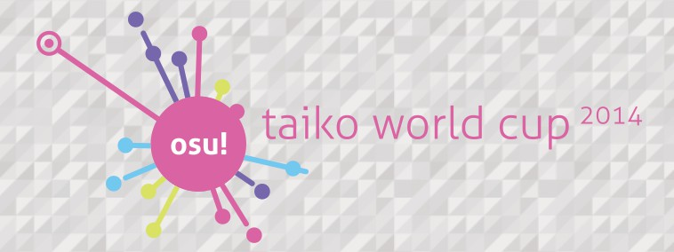

---
tags:
  - TWC 2014
  - TWC2014
outdated_translation: true
---

# osu! Taiko World Cup 2014

**osu! Taiko World Cup 2014** (***简称 TWC 2014*** ) 是一个由 [osu 比赛委员会](https://osu.ppy.sh/groups/26) 举办的[太鼓模式](/wiki/Game_mode/osu!taiko)比赛。TWC 2014 是第四届的太鼓模式比赛，于 2014年 1月 15日 至 2014年 3月 9日 期间举行。上届的冠军是 ::{ flag=TW }:: **台湾**。

## 比赛流程

| Event | Timestamp |
| :-- | :-- |
| 注册阶段 | 2014年 1月 15日 至 26日 |
| 现场抽签 (决定小组赛的队伍排位) | 2014年 2月 1日 13.00 (UTC+0) (即中国时间 21.00) |
| 小组赛 | 2014年 2月 7日 至 9日 |
| 16 强赛 | 2014年 2月 15日 至 16日 |
| 8 强赛 | 2014年 2月 22日 至 23日 |
| 准决赛 | 2014年 3月 1日 至 2日 |
| 决赛 / 季军赛 | 2014年 3月 8日 至 9日 |

## 奖品

| Placing | Country |
| :-- | :-- |
|  | 6 个月 supporter 标签，个人页面徽章，TWC 奖杯 |
|  | 3 个月 supporter 标签 |
|  | 1 个月 supporter 标签 |

## 主办方

| Job | Person(s) |
| :-- | :-- |
| 赛事管理 | ::{ flag=DE }:: [Loctav](https://osu.ppy.sh/users/71366) // ::{ flag=DE }:: [p3n](https://osu.ppy.sh/users/123703) |
| 比赛地图选择 | ::{ flag=DE }:: [OnosakiHito](https://osu.ppy.sh/users/290128) |
| 比赛直播旁述 | ::{ flag=FR }:: [Mr Color](https://osu.ppy.sh/users/116078) // ::{ flag=NZ }:: [deadbeat](https://osu.ppy.sh/users/128370) // ::{ flag=DE }:: [OnosakiHito](https://osu.ppy.sh/users/290128) // ::{ flag=US }:: ztrot // ::{ flag=NO }:: Dolphin |
| 赛果统计 | ::{ flag=PL }:: [Marcin](https://osu.ppy.sh/users/722665) |

## 相关鏈接

- [讨论串](https://osu.ppy.sh/community/forums/topics/179127)
- [直播 (Twitch)](https://www.twitch.tv/osulive)

## 規則

### 比赛規則

1. osu! Taiko World Cup 2014 是以国家作队伍单位的三对三比赛。
2. 每回合比赛的地图，都会于相应的比赛阶段开始前的星期天由 比赛地图选择者 公布。只有被公布的地图才可以在相应的比赛中被选择。
   - 每回合的比赛地图中都会有一张决胜图，该图只有在平局的情况下才会被选择。
   - 此外，比赛地图列表亦包含规定使用 [Hidden](/wiki/Gameplay/Game_modifier/Hidden)、[HardRock](/wiki/Gameplay/Game_modifier/Hard_Rock)、[DoubleTime](/wiki/Gameplay/Game_modifier/Double_Time) 或 FreeMod 的比赛地图。
3. 每回合比赛的时间编排都会由主办方决定。
4. 若没有裁判或主办人员在场，比赛会被延期。
5. 任何不及格的玩家的得分都不会计算到所属队伍的总分。
6. 玩家可以自由调整 [Visual Settings](/wiki/Client/Interface/Visual_settings) 里的选项。
7. 若比赛出现和局，该局会被作废。
8. 若有玩家断线，他们会被视为不及格。
9. 除非比赛结果被作废，每张比赛地图皆不可被重复选择。
10. 若小于三名玩家加入比赛房间，比赛最多可被延迟十分钟。
11. 在比赛期间，替换玩家是允许的。
    - 每张比赛地图皆可替换一名玩家。
12. 電腦或网络的延遲并不是一个将赛果作废的有效理由。
13. 在小组赛阶段，「默认胜利」是指得分 4:0 的胜利，以及 1.0 的得分差距比例。
14. 任何突发事件皆会由主办方处理。
15. 任何規則的修改都会被公布。

### 比赛报名

(翻译未完成)

1. Your team needs **at least 3 players** to participate.
   1. The maximum team size is 6.
   2. You must specify a captain who will represent the team.
2. Each team represents a nation. You must form a team with players from the same country.
3. For team sign ups, [fill out this form](https://docs.google.com/forms/d/1C58_JWKBVVUrJr5so9LBBsqp6LqZktJjGVSZ4pbRhEo/viewform). Then, verify your registration by [sending a PM to Loctav](https://osu.ppy.sh/home/messages/users/71366) titled “TWC Registration”
   - Captains may change their setup by [notifying the management](https://osu.ppy.sh/home/messages/users/71366).
   - You get a confirmation reply in case your registration successfully arrived. Your registration is in pending then.
4. To ensure valid and serious registrations, any registration and change will be checked by the Tournament Management.
5. The total amount of teams is 32.
6. All successfully registered teams will be published after Registration Phase.
   - Captains will get notified in case their roster has been accepted or rejected.
7. Mapset selectors may not participate as a player in this tournament.

### 比赛阶段

(翻译未完成)

1. In the first stage (Group Stage), the teams will be divided into 8 groups of 4 teams.
2. All the teams from each group will face each other.
3. Rankings of each group are determined by sorting the results of each team's performance in the following priority:
   1. Most matches won.
   2. Have higher `{(the number of maps won) - (the number of maps defeated)}`.
   3. Most maps won.
   4. Have higher `∑{(total score difference) / (maximum score)}`.
   5. Winner of the rematch.
4. The top two teams of each group will move on to the Knock-Out Stages.
5. Following stages are Knock-Out Stages. This means that the winner moves to the next stage and the losing team gets kicked out of the tournament.
6. **Winning conditions:**
   - In Group Stage, you need to win 4 maps to win a match. (Best-of-7)
   - In the Round of 16 and the Quarter-finals, you need to win 5 maps to win a match. (Best-of-9)
   - In Semi-finals and Finals, you need to win 6 maps to win a match. (Best-of-11)

### 比赛方式

(翻译未完成)

1. A referee will create a multiplayer room 20 minutes in advance. Players must gather during this period.
   1. The room will be locked. The password and multiplayer invite will be sent to the two captains as soon as possible.
   2. Room settings are osu!, Team-Vs., Win Condition: 'Score'. Room name must be "Taiko World Cup 2014: TeamBlue vs TeamRed"
   3. The team mentioned first in the room name must be the blue team, the team mentioned second in the room name must be the red team.
2. Players are free to select up to two warm-up maps.
3. Map selection will alternate between each captain selecting a map out of the map pool. Each captain must use `!roll` once in `#multiplayer` to determine which team selects first.
   1. The captains may select maps out of the NoMod and FreeMod bracket freely.
   2. Selection out of mod-specific brackets is limited. Each captain may only select one map from each mod-restricted bracket during the match.
      1. Selection out of FreeMod bracket is unlimited.
   3. In case of a tie, the tiebreaker map must be played.
4. Results will be published via Statistics site.

### 比赛地图

(翻译未完成)

1. There will be a 1 mappool for the Group Stage, 1 mappool for Round 16, 1 mappool for the Quarter-finals, 1 mappool for the Semi-finals and 1 mappool for the Finals.
2. Each mappool consists of 5 brackets: NoMod, [Hidden](/wiki/Gameplay/Game_modifier/Hidden), [HardRock](/wiki/Gameplay/Game_modifier/Hard_Rock), [DoubleTime](/wiki/Gameplay/Game_modifier/Double_Time) and FreeMod
3. Each mappool consists of 23 maps in total.
4. Each mappool has one tiebreaker
5. The NoMod bracket will be played with no modes activated.
6. The Hidden, HardRock and DoubleTime bracket will be played with the respective modes activated.
7. The FreeMod bracket will have FreeMod activated. Every individual player can pick Hidden, HardRock or no mod at all. Players **must not** select more than one mod.
   1. When playing a FreeMod map, at least one player of each team must have one mode activated.
8. The tiebreaker will be played under FreeMod conditions.
   1. When playing the tiebreaker, no one must have a mode activated.
9. The size of the NoMod bracket will be:
   - 10 in Group Stage
   - 6 in Knock-Out Stages
10. The size of the mod-specific brackets will be:
    - 3 in Group Stage
    - 4 in Knock-Out Stages

### 比赛时间编排

(翻译未完成)

1. Each stage will be held on **a single weekend**
2. Matches in Group Stage may overlap.
3. All Knock-Out Stages will be held on either Saturday or Sunday (refer to Tournament Schedule).
4. Scheduling will be handled by the Tournament Management. Schedules will be released on the Sunday before the first matches of the actual stage.(e.g. on the 3th Nov. for Group Stage). Tournament Management will try to create the schedule to respect the participant's time zone.
5. Captains are responsible for their teams availability. The greater team size exists to ensure every team can provide at least four players for each match. If teams can not provide four players for a match, the match will be considered forfeited.
