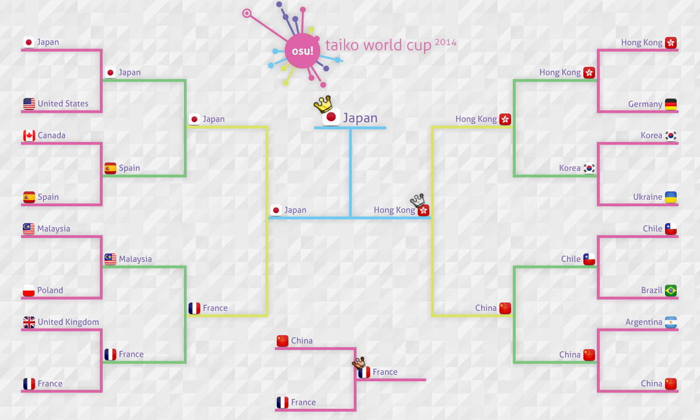

---
tags:
  - TWC 2014
  - TWC2014
  - 世界杯
---

# osu! Taiko 世界杯 2014

**osu! Taiko 世界杯 2014** (***TWC 2014***) 是由 [osu! 团队](/wiki/People/osu!_team)举办的，基于国家/地区的 osu!taiko 锦标赛。本届 osu!taiko 世界杯是第四届。

## 赛程

| 阶段 | 时间 |
| --: | :-- |
| 报名 | 2014-01-16/2014-01-26 |
| 直播抽签 | 2014-02-01 (13:00 UTC) |
| 小组赛 | 2014-02-07/2014-02-09 |
| 十六强赛 | 2014-02-15/2014-02-16 |
| 四分之一决赛 | 2014-02-22/2014-02-23 |
| 半决赛 | 2014-03-01/2014-03-02 |
| 决赛第一周 | 2014-03-08/2014-03-09 |
| 决赛第二周 | 2014-03-15 |

## 奖品

| 名次 | 奖品 |
| :-: | :-- |
|  | 6 个月 osu!supporter 标签、个人主页徽章、TWC 奖杯 |
|  | 3 个月 osu!supporter 标签 |
|  | 1 个月 osu!supporter 标签 |

## 组织

osu!taiko 世界杯 2014 由众多社区成员举办。

| 职位 | 成员 |
| :-- | :-- |
| 比赛管理 | ::{ flag=DE }:: [Loctav](https://osu.ppy.sh/users/71366), ::{ flag=DE }:: [p3n](https://osu.ppy.sh/users/123703) |
| 选图 | ::{ flag=DE }:: [OnosakiHito](https://osu.ppy.sh/users/290128) |
| 直播 | ::{ flag=FR }:: [shARPII](https://osu.ppy.sh/users/776257) |
| 解说 | ::{ flag=NZ }:: [deadbeat](https://osu.ppy.sh/users/128370), ::{ flag=NO }:: [Dolphin](https://osu.ppy.sh/users/1331438), ::{ flag=FR }:: [Mr Color](https://osu.ppy.sh/users/116078), ::{ flag=DE }:: [OnosakiHito](https://osu.ppy.sh/users/290128), ::{ flag=US }:: [ztrot](https://osu.ppy.sh/users/6347) |
| 统计 | ::{ flag=PL }:: [Marcin](https://osu.ppy.sh/users/722665) |

## 链接

- [讨论帖](https://osu.ppy.sh/community/forums/topics/179127)
- [直播](https://www.twitch.tv/osulive)

## 参赛者

|  | 国家/地区 | 选手 |
| :-: | :-: | :-- |
| ::{ flag=AR }:: | **阿根廷** | **[whosthebox](https://osu.ppy.sh/users/1451311)**, [Chillet](https://osu.ppy.sh/users/1236632), [cyntuu mirandaa](https://osu.ppy.sh/users/724230), [Lost The Lights](https://osu.ppy.sh/users/1255920), [Nearex](https://osu.ppy.sh/users/1893238), [Pollotuc](https://osu.ppy.sh/users/42440) |
| ::{ flag=BR }:: | **巴西** | **[Kolbe](https://osu.ppy.sh/users/1254286)**, [- T i g e r -](https://osu.ppy.sh/users/1381781), [lubask](https://osu.ppy.sh/users/1897332), [suyama-chan](https://osu.ppy.sh/users/928298), [Wolf](https://osu.ppy.sh/users/555855), [Yuki-chan](https://osu.ppy.sh/users/93687) |
| ::{ flag=CA }:: | **加拿大** | **[Tasha](https://osu.ppy.sh/users/1031958)**, [Crystalloid](https://osu.ppy.sh/users/699741), [kenny388](https://osu.ppy.sh/users/1098972), [Nanners](https://osu.ppy.sh/users/459886), [xlzqwerty1](https://osu.ppy.sh/users/1466365) |
| ::{ flag=CL }:: | **智利** | **[-Anhedonia-](https://osu.ppy.sh/users/920861)**, [Gonzaalooo](https://osu.ppy.sh/users/1948903), [megadaisukeone](https://osu.ppy.sh/users/1577133), [MikuWhiteRockShooter](https://osu.ppy.sh/users/1619547) |
| ::{ flag=CN }:: | **中国** | **[- Yuuka Niya -](https://osu.ppy.sh/users/1892059)**, [- Kagami Yuki -](https://osu.ppy.sh/users/1319686), [HM495](https://osu.ppy.sh/users/810813), [moe moe moe](https://osu.ppy.sh/users/1804904), [mousegoomba](https://osu.ppy.sh/users/1035291), [yys428](https://osu.ppy.sh/users/1061175) |
| ::{ flag=FR }:: | **法国** | **[\_Gezo\_](https://osu.ppy.sh/users/481582)**, [Fraolinch](https://osu.ppy.sh/users/205257), [Jinyan](https://osu.ppy.sh/users/669531), [Nashmun](https://osu.ppy.sh/users/49031), [omegaflo](https://osu.ppy.sh/users/83291), [TimmyAkmed](https://osu.ppy.sh/users/1799973) |
| ::{ flag=DE }:: | **德国** | **[Luna](https://osu.ppy.sh/users/588007)**, [\[TaikoTori\]](https://osu.ppy.sh/users/1074143), [BrokenArrow](https://osu.ppy.sh/users/384034), [DarkDunskin](https://osu.ppy.sh/users/98985), [Mew104](https://osu.ppy.sh/users/2345156), [tiamus](https://osu.ppy.sh/users/515277) |
| ::{ flag=HK }:: | **香港** | **[thomas1195](https://osu.ppy.sh/users/1691488)**, [\[yuyuko\_Saigyouj\]](https://osu.ppy.sh/users/1378994), [aabc271](https://osu.ppy.sh/users/155707), [Andrew Chow](https://osu.ppy.sh/users/3043041), [ice man007](https://osu.ppy.sh/users/1926937), [Jikson\[m9\]](https://osu.ppy.sh/users/1485257) |
| ::{ flag=JP }:: | **日本** | **[TKSalt](https://osu.ppy.sh/users/940878)**, [azger](https://osu.ppy.sh/users/2335982), [NeGaTiVeMinD](https://osu.ppy.sh/users/965038), [Orukaa](https://osu.ppy.sh/users/987895), [pagr42](https://osu.ppy.sh/users/1500725), [sobatsuyu100](https://osu.ppy.sh/users/2076374) |
| ::{ flag=MY }:: | **马来西亚** | **[taiko_maniac1811](https://osu.ppy.sh/users/595764)**, [buhzidao](https://osu.ppy.sh/users/1655126), [cdhsausageboy](https://osu.ppy.sh/users/2403621), [HeatKai](https://osu.ppy.sh/users/332555), [huiko12](https://osu.ppy.sh/users/598553), [Jerry](https://osu.ppy.sh/users/605973) |
| ::{ flag=PH }:: | **菲律宾** | **[Primrea](https://osu.ppy.sh/users/943743)**, [Kotaro](https://osu.ppy.sh/users/796530), [Pizzicato](https://osu.ppy.sh/users/692610), [senkai](https://osu.ppy.sh/users/1150178) |
| ::{ flag=PL }:: | **波兰** | **[Acrith](https://osu.ppy.sh/users/389880)**, [DarkStoorM](https://osu.ppy.sh/users/174347), [IsonamiPL](https://osu.ppy.sh/users/1753234), [Minkodon](https://osu.ppy.sh/users/1385227), [LZMieczu](https://osu.ppy.sh/users/1797498), [Sylwia132](https://osu.ppy.sh/users/2037319) |
| ::{ flag=RU }:: | **俄罗斯** | **[MarisaLover](https://osu.ppy.sh/users/1359539)**, [Livius777](https://osu.ppy.sh/users/1282662), [magax](https://osu.ppy.sh/users/918645) |
| ::{ flag=SG }:: | **新加坡** | **[CoroQuetz](https://osu.ppy.sh/users/499843)**, [DJNightmare](https://osu.ppy.sh/users/70909), [minray](https://osu.ppy.sh/users/653771), [neonat](https://osu.ppy.sh/users/1561995) |
| ::{ flag=KR }:: | **韩国** | **[Konpaku Sariel](https://osu.ppy.sh/users/533502)**, [\[Akita-Neru\]](https://osu.ppy.sh/users/613944), [-applerss-](https://osu.ppy.sh/users/983349), [eoe](https://osu.ppy.sh/users/659959), [L y s](https://osu.ppy.sh/users/211825) |
| ::{ flag=ES }:: | **西班牙** | **[LZD](https://osu.ppy.sh/users/224335)**, [Ares267](https://osu.ppy.sh/users/174378), [CARRI](https://osu.ppy.sh/users/854536), [Hanjamon](https://osu.ppy.sh/users/1703330), [MYRKUL](https://osu.ppy.sh/users/255933), [son\_gohan\_2](https://osu.ppy.sh/users/443305) |
| ::{ flag=SE }:: | **瑞典** | **[boat](https://osu.ppy.sh/users/276074)**, [birrin](https://osu.ppy.sh/users/2290294), [Fuwuwi](https://osu.ppy.sh/users/88200), [Tanaka](https://osu.ppy.sh/users/1897905) |
| ::{ flag=UA }:: | **乌克兰** | **[Pagliaccio](https://osu.ppy.sh/users/1163187)**, [Aka](https://osu.ppy.sh/users/1307553), [Anny](https://osu.ppy.sh/users/249094) |
| ::{ flag=GB }:: | **英国** | **[xWillx](https://osu.ppy.sh/users/696222)**, [abrian159](https://osu.ppy.sh/users/1159051), [Dainesl](https://osu.ppy.sh/users/1588551), [Lno](https://osu.ppy.sh/users/1900787), [TurnipLover](https://osu.ppy.sh/users/1133830) |
| ::{ flag=US }:: | **美国** | **[MMzz](https://osu.ppy.sh/users/128993)**, [AnFace](https://osu.ppy.sh/users/233485), [Backfire](https://osu.ppy.sh/users/263110), [burntpurple1](https://osu.ppy.sh/users/2238673), [LoLBryster](https://osu.ppy.sh/users/1800629), [OzzyOzrock](https://osu.ppy.sh/users/465153) |

## 分组

| A 组 | B 组 | C 组 | D 组 |
| :-- | :-- | :-- | :-- |
| ::{ flag=BR }:: 巴西 | ::{ flag=CN }:: 中国 | ::{ flag=FR }:: 法国 | ::{ flag=US }:: 美国 |
| ::{ flag=MY }:: 马来西亚 | ::{ flag=KR }:: 韩国 | ::{ flag=AR }:: 阿根廷 | ::{ flag=CL }:: 智利 |
| ::{ flag=JP }:: 日本 | ::{ flag=ES }:: 西班牙 | ::{ flag=UA }:: 乌克兰 | ::{ flag=PH }:: 菲律宾 |
| ::{ flag=DE }:: 德国 | ::{ flag=SG }:: 新加坡 | ::{ flag=CA }:: 加拿大 | ::{ flag=PL }:: 波兰 |
| ::{ flag=SE }:: 瑞典 | ::{ flag=GB }:: 英国 | ::{ flag=RU }:: 俄罗斯 | ::{ flag=HK }:: 香港 |

## 颁奖信息

本赛事已经结束，最终奖次如下：

| 名次 | 队伍 |
| :-: | :-- |
|  | ::{ flag=JP }:: **日本** (**[TKSalt](https://osu.ppy.sh/users/940878)**, [azger](https://osu.ppy.sh/users/2335982), [NeGaTiVeMinD](https://osu.ppy.sh/users/965038), [Orukaa](https://osu.ppy.sh/users/987895), [pagr42](https://osu.ppy.sh/users/1500725), [sobatsuyu100](https://osu.ppy.sh/users/2076374)) |
|  | ::{ flag=HK }:: **香港** (**[thomas1195](https://osu.ppy.sh/users/1691488)**, [\[yuyuko\_Saigyouj\]](https://osu.ppy.sh/users/1378994), [aabc271](https://osu.ppy.sh/users/155707), [Andrew Chow](https://osu.ppy.sh/users/3043041), [ice man007](https://osu.ppy.sh/users/1926937), [Jikson\[m9\]](https://osu.ppy.sh/users/1485257)) |
|  | ::{ flag=FR }:: **法国** (**[\_Gezo\_](https://osu.ppy.sh/users/481582)**, [Fraolinch](https://osu.ppy.sh/users/205257), [Jinyan](https://osu.ppy.sh/users/669531), [Nashmun](https://osu.ppy.sh/users/49031), [omegaflo](https://osu.ppy.sh/users/83291), [TimmyAkmed](https://osu.ppy.sh/users/1799973)) |

## 图池

### 决赛

**此图池用于决赛第一周与决赛第二周。**

**[在这里下载图包！(168 MB)](https://www.mediafire.com/download/5s7me0e532r591m/TWC_Finals.rar)**

- NoMod
  1. [Nero's Day At Disneyland - No Money Down, Low Monthly Payments (grumd) [Loctav's Oni]](https://osu.ppy.sh/beatmapsets/111825#taiko/297950)
  2. [LeaF - MEPHISTO (Alumetorz) [TK'S Inner Oni]](https://osu.ppy.sh/beatmapsets/106212#taiko/284037)
  3. [xi - FREEDOM DiVE (Short Ver.) (OnosakiHito) [Ura Oni]](https://osu.ppy.sh/beatmapsets/152169#taiko/374699)
  4. [LeaF - Nano Death!!!!!!! (LunaticP) [Taiko Eclipse]](https://osu.ppy.sh/beatmapsets/134139#taiko/336550)
  5. [D.J.Amuro Vs MAX MAXIMIZER - HAERETICUS (Strawberry) [Firce777's Taiko Oni]](https://osu.ppy.sh/beatmapsets/87874#taiko/243795)
  6. [sHimaU - Slotcore is Dead (Alumetorz) [Ura Oni]](https://osu.ppy.sh/beatmapsets/119233#taiko/306202)
- Hidden
  1. [Toyosaki Aki - GO! GO! MANIAC (TV Size) (climbb65588) [youngdown's Drum :3]](https://osu.ppy.sh/beatmapsets/14702#taiko/53930)
  2. [doriko - Yuuhi Zaka (Athena Tennos) [Ts8zs' Taiko]](https://osu.ppy.sh/beatmapsets/54581#taiko/167872)
  3. [SID - Rain (TV Size) (KIA) [aru's Taiko Oni]](https://osu.ppy.sh/beatmapsets/14818#taiko/70966)
  4. [Spring Head - Fallen Angel (soulfear) [lepidon! - Taiko Oni]](https://osu.ppy.sh/beatmapsets/13922#taiko/51769)
- HardRock
  1. [Yousei Teikoku - Asgard (Lybydose) [Ozzy's Taiko]](https://osu.ppy.sh/beatmapsets/27712#taiko/100260)
  2. [ChouchouP - Tsukimiyo Rabbit (Zero__wind) [Firce777's Inner Oni]](https://osu.ppy.sh/beatmapsets/122342#taiko/332373)
  3. [SAVE THE QUEEN - EX-Termination (Jenny) [Taiko Oni]](https://osu.ppy.sh/beatmapsets/50181#taiko/170728)
  4. [Zektbach - L'erisia(Primal Logic) (AngelHoney) [Firce777's Taiko]](https://osu.ppy.sh/beatmapsets/64010#taiko/188757)
- DoubleTime
  1. [Tamura Yukari feat. motsu from m.o.v.e - You & Me (cRyo[iceeicee]) [Climbb & aabc's Taiko Oni]](https://osu.ppy.sh/beatmapsets/67093#taiko/252518)
  2. [Cuvelia - Tenkuu no Yoake (AngelHoney) [Tama's Taiko Oni]](https://osu.ppy.sh/beatmapsets/47757#taiko/148012)
  3. [Memme - Extreme Fantasy (AngelHoney) [Taiko Oni]](https://osu.ppy.sh/beatmapsets/49459#taiko/173048)
  4. [Megpoid GUMI - Chocolate (Chewin) [Ono's Taiko Oni]](https://osu.ppy.sh/beatmapsets/52732#taiko/164075)
- FreeMod
  1. [t+pazolite - to Luv me, I *** for u. (reprise) (pekos) [Taikocalypse]](https://osu.ppy.sh/beatmapsets/42741#taiko/135070)
  2. [Igorrr - Unpleasant Sonata (Sieg) [Loctav's Oni]](https://osu.ppy.sh/beatmapsets/90385#taiko/262458)
  3. [t+pazolite feat. Rizna - Imcomplete Cherry Girl (TKSalt) [KrazySalt (TWC Version)]](https://osu.ppy.sh/beatmapsets/96369#taiko/378734)
  4. [S.S.H. - Intersect Thunderbolt-Remix (7odoa) [Taiko Inner Oni]](https://osu.ppy.sh/beatmapsets/38316#taiko/170038)
- Tiebreaker
  1. **[Tatsh - IMAGE -MATERIAL- <Version 0> (Scorpiour) [Firce777's Taiko Oni]](https://osu.ppy.sh/beatmapsets/93523#taiko/261205)**

### 半决赛

**[在这里下载图包！(153 MB)](https://www.mediafire.com/download/743weel8bsn9b20/TWC_Semi-finals.rar)**

- NoMod
  1. [Sota Fujimori - WOBBLE IMPACT (Loctav) [Inner Oni]](https://osu.ppy.sh/beatmapsets/152368#taiko/375040)
  2. [Renard - Terminal (nold_1702) [mint's Inner Oni]](https://osu.ppy.sh/beatmapsets/102282#taiko/291218)
  3. [Nekomata Master - Smile of Split (Charles445) [MM's Taiko]](https://osu.ppy.sh/beatmapsets/56847#taiko/171679)
  4. [Inspector K - Disconnected Hardkore (CanBlaster Remix) (Shiirn) [Taikore]](https://osu.ppy.sh/beatmapsets/37242#taiko/119914)
  5. [Reizoko Cj - Hardcore Syndrome (NekoMimiMode) [Taikosaki]](https://osu.ppy.sh/beatmapsets/47550#taiko/174345)
  6. [The Quick Brown Fox - HIT AND RUN IN 1920 A.D. (kazukisinx) [Inner Oni]](https://osu.ppy.sh/beatmapsets/77858#taiko/218190)
- Hidden
  1. [fripSide - memory of snow (KanaRin) [Taiko Collab]](https://osu.ppy.sh/beatmapsets/26097#taiko/89239)
  2. [Atoguru - Mr.Liar (sirjuyt) [Ono's Taiko Oni]](https://osu.ppy.sh/beatmapsets/32889#taiko/111015)
  3. [Madeon - Shuriken (Charles445) [MM's Taiko]](https://osu.ppy.sh/beatmapsets/34595#taiko/112818)
  4. [M2U - Masquerade (- Kagami Yuki -) [Inner Oni]](https://osu.ppy.sh/beatmapsets/132040#taiko/332272)
- HardRock
  1. [Lon - Yuru Fuwa Jukai Girl (Love) [Oni]](https://osu.ppy.sh/beatmapsets/123810#taiko/315972)
  2. [Hatsune Miku - Hatsune Miku no Shuuen (DJPop) [31's Taiko]](https://osu.ppy.sh/beatmapsets/14463#taiko/53283)
  3. [Prim - Koisuru*Uchuu Sensou!! (Ryu* Remix) (DoKoLP) [Ono's Taiko Oni]](https://osu.ppy.sh/beatmapsets/47027#taiko/160078)
  4. [paraoka - boot (rickyboi) [inaba's Taiko]](https://osu.ppy.sh/beatmapsets/50131#taiko/157233)
- DoubleTime
  1. [SHK - Weep Irish (AngelHoney) [Kana's Taiko Oni]](https://osu.ppy.sh/beatmapsets/28545#taiko/95775)
  2. [3L - Come Back To Me (orioncomet) [Taiko]](https://osu.ppy.sh/beatmapsets/24201#taiko/87650)
  3. [Niko - Night of Fire (Gabi) [lepidon! - Taiko Oni]](https://osu.ppy.sh/beatmapsets/18923#taiko/77710)
  4. [O-Life Japan - Yamanobori Kibun (qinche) [Taiko]](https://osu.ppy.sh/beatmapsets/30256#taiko/100178)
- FreeMod
  1. [07th Expansion - rog-unlimitation (AngelHoney) [lepidon! - Taiko Oni]](https://osu.ppy.sh/beatmapsets/28751#taiko/110148)
  2. [Rohi - Kakuzetsu Thanatos (NatsumeRin) [qoot8123's Taiko Oni]](https://osu.ppy.sh/beatmapsets/76396#taiko/216148)
  3. [Renard - Why Am I So Angry (Blue Dragon) [lepidon! - Taiko Oni]](https://osu.ppy.sh/beatmapsets/31133#taiko/260832)
  4. [Shounen Radio - uen (KDS) [Taiko DS]](https://osu.ppy.sh/beatmapsets/45015#taiko/140772)
- Tiebreaker
  1. **[Yousei Teikoku - gothic lolita agitator (TKSalt) [Inner Oni]](https://osu.ppy.sh/beatmapsets/101004#taiko/267841)**

### 四分之一决赛

**[在这里下载图包！(146 MB)](https://www.mediafire.com/download/vyekjgtc1wj2xlk/TWC_Quarter_finals.rar)**

- NoMod
  1. [Lite Show Magic - Crack traxxxx (KinomiCandy) [Oni]](https://osu.ppy.sh/beatmapsets/134900#taiko/338140)
  2. [bj.HaLo - G-garden (ampzz) [Ono's Taiko Oni]](https://osu.ppy.sh/beatmapsets/49009#taiko/371678)
  3. [Igorrr - Mastication Numerique (grumd) [Loctav's Taiko Oni]](https://osu.ppy.sh/beatmapsets/54182#taiko/165342)
  4. [DJ Sharpnel - IVALTEK (happy30) [Phedondon]](https://osu.ppy.sh/beatmapsets/50429#taiko/155101)
  5. [Caravan Palace - Dragons (Charles445) [MM's Taiko]](https://osu.ppy.sh/beatmapsets/46733#taiko/145511)
  6. [Black Raison d'etre - INSIDE IDENTITY (Natsu) [aabc's Taiko Oni]](https://osu.ppy.sh/beatmapsets/100682#taiko/280103)
- Hidden
  1. [Sakakibara Yui - Toki Tsukasadoru Juuni no Meiyaku (TV Size) (gina91189) [Car's Taiko]](https://osu.ppy.sh/beatmapsets/31685#taiko/104568)
  2. [Asumi Kana & Fujita Saki & Kitamura Eri - COOLISH WALK (TV Size) (biwako) [Taiko]](https://osu.ppy.sh/beatmapsets/37136#taiko/119583)
  3. [Chai Found Music Workshop - Zeihen ~transformation~ (xierbaliti) [Taiko Ura Oni]](https://osu.ppy.sh/beatmapsets/25503#taiko/86571)
  4. [cosMo@Bousou-P - neu BSP style (Bass) [31's Taiko]](https://osu.ppy.sh/beatmapsets/50670#taiko/155964)
- HardRock
  1. [Denkare - Satsuriku no Keifu (lolcubes) [Oni]](https://osu.ppy.sh/beatmapsets/95925#taiko/257366)
  2. [Qrispy Joybox - snow prism (TKSalt) [Inner Oni]](https://osu.ppy.sh/beatmapsets/72392#taiko/206916)
  3. [Yucha-P - Thieves Night Trick (Fraolinch) [Taiko Trick]](https://osu.ppy.sh/beatmapsets/148785#taiko/367777)
  4. [Sta - Iris (MMzz) [Oni]](https://osu.ppy.sh/beatmapsets/106598#taiko/279828)
- DoubleTime
  1. [Tsubaki - Aijou Pandemic (Nymph) [KS's Taiko]](https://osu.ppy.sh/beatmapsets/40166#taiko/129682)
  2. [ave;new feat. Sakura Saori - My Sweet Lady (Short Ver.) (osuplayer111) [Taiko Oni]](https://osu.ppy.sh/beatmapsets/41209#taiko/131073)
  3. [NAOKI feat. SMiLE.dk - A Geisha's Dream (yongtw123) [Taiko Oni]](https://osu.ppy.sh/beatmapsets/28766#taiko/103398)
  4. [IOSYS - Endless Tewi-ma Park (Kurosanyan) [Taiko Oni]](https://osu.ppy.sh/beatmapsets/48874#taiko/153393)
- FreeMod
  1. [kors k feat. Furukawa Mirin - Drive Me Crazy (ampzz) [Kurosanyan's Oni]](https://osu.ppy.sh/beatmapsets/65950#taiko/215497)
  2. [Mutsuhiko Izumi - Red Goose (lepidopodus) [Oni]](https://osu.ppy.sh/beatmapsets/55920#taiko/169371)
  3. [IOSYS - RE:Usatei (OzzyOzrock) [Taiko Oni]](https://osu.ppy.sh/beatmapsets/31343#taiko/103022)
  4. [capsule - JUMPER (Mafiamaster) [Roko-Don's Taiko]](https://osu.ppy.sh/beatmapsets/21130#taiko/74040)
- Tiebreaker
  1. **[Demetori - Higan Retour ~ View of The River Styx (RLC) [Love's Oni]](https://osu.ppy.sh/beatmapsets/140944#taiko/351752)**

### 十六强赛

**[在这里下载图包！(169 MB)](https://www.mediafire.com/download/2stinw27hm7h4kv/TWC+Round+of+16.rar)**

- NoMod
  1. [celas - Azul (Remix) (AngelHoney) [KUMA's Taiko]](https://osu.ppy.sh/beatmapsets/40273#taiko/128937)
  2. [SHIKI - BABYLON (miccoliasms) [Alace's Taiko]](https://osu.ppy.sh/beatmapsets/31373#taiko/104218)
  3. [WESTARENA by MLREC. - ROUND! (Sushi) [Inner Oni]](https://osu.ppy.sh/beatmapsets/88125#taiko/240372)
  4. [Linked Horizon - Jiyuu no Tsubasa (TV Size) (Kuria) [Kana's Taiko Oni]](https://osu.ppy.sh/beatmapsets/104986#taiko/277009)
  5. [Ryu* Vs. L.E.D.-G - PARADISE LOST (ignorethis) [Taiko]](https://osu.ppy.sh/beatmapsets/38043#taiko/122471)
  6. [Kano - Houkago Stride (Short Ver.) (Lundlerol) [Oni]](https://osu.ppy.sh/beatmapsets/80983#taiko/225075)
- Hidden
  1. [P*Light - TRIGGER*HAPPY (MineC24) [m1ng's Oni]](https://osu.ppy.sh/beatmapsets/74671#taiko/249943)
  2. [Rise Against - Prayer of the Refugee (Nashmun) [Oni]](https://osu.ppy.sh/beatmapsets/110554#taiko/287969)
  3. [Nomizu Iori - *** Passionate (TV Size) (Vicho-kun) [Climbb's Taiko Oni]](https://osu.ppy.sh/beatmapsets/48135#taiko/148982)
  4. [Gentle Stick X M2U - Hades in the Heaven (AngelHoney) [Ono's Taiko Oni]](https://osu.ppy.sh/beatmapsets/114488#taiko/307654)
- HardRock
  1. [TOMOSUKE - Macuilxochitl (Charles445) [[Shalon]'s Jubeataiko]](https://osu.ppy.sh/beatmapsets/43166#taiko/140245)
  2. [Hatsune Miku - Tenshinranman High Collar Hime (NatsumeRin) [Taiko Oni]](https://osu.ppy.sh/beatmapsets/55115#taiko/172872)
  3. [DJ TECHNORCH fw. GUHROOVY - KAMAITACHI (fanzhen0019) [Firce's Taiko]](https://osu.ppy.sh/beatmapsets/52820#taiko/161427)
  4. [Denkare - gemini (lolcubes) [Inner Oni]](https://osu.ppy.sh/beatmapsets/115871#taiko/299163)
- DoubleTime
  1. [Global Deejays - The Sound of San Francisco (Sey) [OniZoda]](https://osu.ppy.sh/beatmapsets/96422#taiko/264930)
  2. [PSY - GANGNAM STYLE (yeahyeahyeahhh) [lepidon! - Taiko Oni]](https://osu.ppy.sh/beatmapsets/55799#taiko/169840)
  3. [Croove & Mr. Funky - OUT LAW : Reborn (MoonFragrance) [Taiko]](https://osu.ppy.sh/beatmapsets/18299#taiko/66082)
  4. [Cream puff - Mermaid girl (tsuka) [Taiko]](https://osu.ppy.sh/beatmapsets/30569#taiko/114451)
- FreeMod
  1. [Nanamori-chu * Goraku-bu - My Pace de Ikimashou (TV Size) (wcx19911123) [Kanpakyin's Taiko Oni]](https://osu.ppy.sh/beatmapsets/36333#taiko/118502)
  2. [Galdeira - Almagest (Wuiss) [31's Taiko]](https://osu.ppy.sh/beatmapsets/21915#taiko/76993)
  3. [DJ TOTTO - Windy Fairy (Raose) [TK'S Oni]](https://osu.ppy.sh/beatmapsets/102005#taiko/272798)
  4. [senya - Kasoku Suru Koi wa Dare mo Tomerarenai (Scorpiour) [Wmf's Taiko]](https://osu.ppy.sh/beatmapsets/80747#taiko/249371)
- Tiebreaker
  1. **[DystopiaGround - AugoEidEs (jonathanlfj) [Ono's Taiko Oni]](https://osu.ppy.sh/beatmapsets/136969#taiko/383455)**

### 小组赛

**[在这里下载图包！(211 MB)](https://www.mediafire.com/download/8kv1e4zne081tvp/TWC+Group+Stage.rar)**

- NoMod
  1. [Loos - Koi Yomi Zakura (NatsumeRin) [Kana's Taiko Oni]](https://osu.ppy.sh/beatmapsets/33976#taiko/111835)
  2. [monotone - Totsugeki! Glass no Kneesocks Hime! (Reisen Udongein) [31's Taiko]](https://osu.ppy.sh/beatmapsets/54308#taiko/171889)
  3. [cranky - R176 (taka1235) [Pangko]](https://osu.ppy.sh/beatmapsets/31367#taiko/121335)
  4. [Ellie Goulding - Burn (Nashmun) [Oni]](https://osu.ppy.sh/beatmapsets/140698#taiko/351271)
  5. [bbn - Identic Conflict (Flower) [Taiko Oni]](https://osu.ppy.sh/beatmapsets/49188#taiko/176435)
  6. [Tsukasa - Visions (MMzz) [Inner Oni]](https://osu.ppy.sh/beatmapsets/97162#taiko/261694)
  7. [Nico Nico Douga - Owens (AngelHoney) [Climbb's Taiko Oni]](https://osu.ppy.sh/beatmapsets/20406#taiko/76538)
  8. [incinerate - Purgatorium (RikiH_) [inaba's Taiko Oni]](https://osu.ppy.sh/beatmapsets/54727#taiko/168534)
  9. [LeaF - Calamity Fortune (Flower) [TK's Oni]](https://osu.ppy.sh/beatmapsets/96103#taiko/263683)
  10. [AU - Infinite of Nuclear Fusion (OnosakiHito) [Inner Oni]](https://osu.ppy.sh/beatmapsets/35211#taiko/285041)
- Hidden
  1. [ONE OK ROCK - Never Let This Go (qoot8123) [Oni]](https://osu.ppy.sh/beatmapsets/79713#taiko/222303)
  2. [Yooh - Dynasty (HelloSCV) [714's Taiko Oni]](https://osu.ppy.sh/beatmapsets/83094#taiko/229726)
  3. [Mizuki Nana - Vitalization (TV Size) (Flower) [Oni]](https://osu.ppy.sh/beatmapsets/102803#taiko/279373)
- HardRock
  1. [Hoshio Yuka - Tabidachi no Shuen (lolcubes) [Oni (TWC Version)]](https://osu.ppy.sh/beatmapsets/119729#taiko/307304)
  2. [UPLIFT SPICE - Omega Rhythm (toara_fict) [Inner Oni]](https://osu.ppy.sh/beatmapsets/105365#taiko/276622)
  3. [VY1 - Cyber Thunder Cider (tutuhaha) [Sp3's Taiko]](https://osu.ppy.sh/beatmapsets/47146#taiko/146915)
- DoubleTime
  1. [Kara - Step (MoonFragrance) [Taiko]](https://osu.ppy.sh/beatmapsets/40893#taiko/137582)
  2. [8#Prince - take it easy (Pokie) [ReySHel's Taiko Oni]](https://osu.ppy.sh/beatmapsets/79717#taiko/222527)
  3. [K2 - What's Your Deep Wish? (lolcubes) [Oni]](https://osu.ppy.sh/beatmapsets/48721#taiko/169891)
- FreeMod
  1. [Shihori - Bloody Night (Frostmourne) [Boss Taiko Oni]](https://osu.ppy.sh/beatmapsets/46223#taiko/149087)
  2. [Croove & Paul Bazooka - Enemy Storm (Dark Jungle Mix) (Reiji-RJ) [lepidon! - Taiko Oni]](https://osu.ppy.sh/beatmapsets/30229#taiko/124413)
  3. [sakuzyo feat. Hatsune Miku - ChaiN De/structioN (Shiirn) [Climbb & Kana's Taiko Oni]](https://osu.ppy.sh/beatmapsets/49071#taiko/154164)
- Tiebreaker
  1. **[paraoka - Manima ni (Sandpig) [Pangko]](https://osu.ppy.sh/beatmapsets/43107#taiko/136184)**

## 规则

### 比赛规则

1. osu! Taiko 世界杯 2014 是按国家/地区组队的，3v3 的团队比赛。
2. 每一轮的比赛选图由选图人员在比赛开始之前的周日提前公布。只有这些图会在相应的比赛中使用。
   - 有一张图会作为决胜 (tiebreaker) 图，只有平局时才使用这张图。
   - 此外，还会有 [Hidden](/wiki/Gameplay/Game_modifier/Hidden)、[HardRock](/wiki/Gameplay/Game_modifier/Hard_Rock)、[DoubleTime](/wiki/Gameplay/Game_modifier/Double_Time) 和 FreeMod 的图池分类。
3. 比赛日程将由比赛委员会拟定（见下）。
4. 若组织者或裁判均无空闲时间，比赛将会推迟。
5. 失败玩家的分数不会计入队伍总分。
6. 允许调整[视觉设置](/wiki/Client/Interface/Visual_settings)选项。
7. 若某局比赛出现同分，该局比赛无效。
8. 若有任何玩家掉线，视作该玩家失败。
9. 在有效局比赛中使用过的图，不可使用第二次。
10. 若参与比赛的玩家不足 3 人，比赛可推迟最多 10 分钟。
11. 允许比赛中换人。
    - 每张图只允许更换一名选手。
12. 卡顿不能作为重赛某张图的理由。
13. 在小组赛阶段，“默认获胜”记作 4:0 获胜，+1.0 倍的分数计算。
14. 意外事故由比赛委员会进行处理。
15. 对此规则的任何修改都会进行通知。

### 比赛报名

1. 你的队伍至少需要 **3 名玩家** 才能参赛。
   - 队伍最大人数为 6 人。
   - 你必须指定一名代表队伍的队长。
2. 每支队伍代表一个国家/地区。必须与同一国家/地区的玩家组队。
3. 若要报名队伍，请先[填写此表格](https://docs.google.com/forms/d/1C58_JWKBVVUrJr5so9LBBsqp6LqZktJjGVSZ4pbRhEo/viewform)。然后[向 Loctav 发送](https://osu.ppy.sh/home/messages/users/71366)一条标题为“TWC Registration”来的消息以确认报名。
   - 队长也可以通过[通知委员会](https://osu.ppy.sh/home/messages/users/71366)来修改阵容。
   - 若报名成功送达，你会收到一条确认回复，届时报名状态变为待定。
4. 为确保报名真实有效，任何报名与改动均会经赛事委员会审核。
5. 参赛队伍总数为 20 支。
6. 报名阶段结束后，将公布所有报名成功的队伍。
   - 队长会收到阵容被接受或被拒绝的通知。
7. 选图人员不得以选手身份参加本次比赛。

### 阶段说明

1. 在第一个阶段（小组赛）中，所有队伍分成 4 组，每组有 5 支队伍。
2. 每小组中的任一队伍都会跟同一小组中的其他队伍进行比赛。
3. 通过以下优先级对每个队伍进行排名：
   1. 最高比赛胜场数。
   2. 最高 `{(谱面胜场数) - (谱面败场数)}`。
   3. 最高谱面胜场数。
   4. 最高 `∑{(总分差) / (最高分数)}`。
   5. 重赛的获胜者。
4. 小组赛中每组排名前四的队伍将进入双败淘汰赛阶段。
5. 接下来的阶段均采用双败淘汰制。获胜的队伍将会晋级并进入下一场比赛，未获胜的队伍淘汰出局。
6. **获胜条件：**
   - 小组赛中，你需要在比赛中获得四张图的胜利。（七局四胜）
   - 在十六强赛与四分之一决赛中，你需要在比赛中获得五张图的胜利。（九局五胜）
   - 在半决赛与决赛中，你需要在比赛中获得六张图的胜利。（十一局六胜）

### 比赛说明

1. 裁判将提前 20 分钟创建多人游戏房间。参赛选手必须在这段时间内集合。
   - 房间将被锁定。密码和多人邀请会尽快发送给两位队长。
   - 房间设置为 osu!、Team-Vs.、获胜条件：“Score”。房间名称必须是“Taiko World Cup 2014: 蓝队 vs 红队”。
   - 房间名中提到的第一个队伍必须是蓝队，第二个队伍必须是红队。
2. 选手可自由选择最多两张热手谱面。
3. 选图由两位队长轮流进行。每位队长必须在 `#multiplayer` 中使用一次 `!roll` 来决定先选图一方。
   - 队长可自由选择 NoMod 和 FreeMod 分组中的谱面。
   - 模组限定分组中的谱面有选择次数限制。在整场比赛中，每位队长在每个分组中只能选择一张谱面。
     - FreeMod 分组无选图限制。
   - 仅剩一分且平局时，必须使用决胜 (tiebreaker) 图。
4. 比赛结果将通过统计网站发布。

### 地图说明

1. 小组赛、十六强赛、四分之一决赛、半决赛、决赛各使用一个独立图池。
2. 每个图池含有 5 个分类：NoMod、[Hidden](/wiki/Gameplay/Game_modifier/Hidden)、[HardRock](/wiki/Gameplay/Game_modifier/Hard_Rock)、[DoubleTime](/wiki/Gameplay/Game_modifier/Double_Time) 和 FreeMod。
3. 每个图池均包含 23 张图。
4. 每个图池均有一张决胜 (tiebreaker) 图。
5. 游玩 NoMod 图时，不使用任何模组。
6. Hidden、HardRock 以及 DoubleTime 图需使用相应模组游玩。
7. FreeMod 图将会激活所有模组，任何玩家都可以选用 Hidden、HardRock 或者不使用任何模组。玩家**不得**使用超过一个模组。
   - 游玩 FreeMod 图时，每队须至少有 2 位玩家使用模组。
8. 决胜图按 FreeMod 规则游玩。
   - 游玩决胜图时，不强制玩家使用模组。
9. NoMod 分组的谱面数量为：
   - 小组赛为 10 张
   - 淘汰赛阶段为 6 张
10. 模组限定分组的谱面数量为：
    - 小组赛为 3 张
    - 淘汰赛阶段为 4 张

### 赛程说明

1. 每个阶段将会使用**一个周末**的时间进行。
2. 小组赛比赛可重叠进行。
3. 所有淘汰赛将会在星期六或者星期日 (UTC+0) 进行（参见赛程）。
4. 赛程将由赛事委员会负责安排。赛程会在实际阶段第一场比赛前一个星期日公布（例如，小组赛会在 2 月 2 日公布）。赛事委员会会尽量根据参赛者时区安排赛程。
5. 每支队伍的队长负责保证队伍能够参赛。成员更多的队伍更容易确保凑齐至少三名选手进行每场比赛。如果某支队伍无法提供三名选手进行比赛，本场比赛将记为认输。
