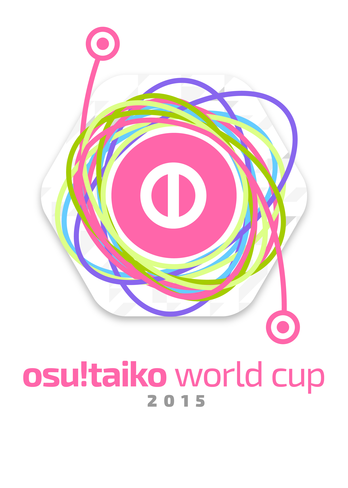

---
tags:
  - TWC 2015
  - TWC2015
outdated_translation: true
---

# osu! Taiko World Cup 2015

**osu! Taiko World Cup 2015** (***TWC 2015***)は[Tournament Management](https://osu.ppy.sh/groups/26)主催の国別対抗の太鼓トーナメントです。今大会は5回目の開催で、2015年1月12日から2015年3月15日まで行われます。前大会の優勝国は::{ flag=JP }:: **日本**です。

## トーナメント日程

| Event | Timestamp |
| :-- | :-- |
| 登録段階 | 2015年1月12日~2月22日 |
| 抽選会 | 2015年2月28日 (14:00 UTC+0) |
| グループステージ | 2015年3月7日~8日 |
| 決勝トーナメント | 2015年3月14日~15日 |
| 準々決勝 | 2015年3月21日~22日 |
| 準決勝 | 2015年3月28日~29日 |
| 決勝 - Week 1 | 2015年4月4日~5日 |
| 決勝 - Week 2 | 2015年4月11日~12日 |

## 賞品

| Placing | Prize(s) |
| :-- | :-- |
|  | supporter tag 6ヶ月、プロフィールバッジ、ユーザータイトル"Taiko Champion"、osu!商品 |
|  | supporter tag 3ヶ月、プロフィールバッジ |
|  | supporter tag 1ヶ月、プロフィールバッジ |

## 構成

| Job | Person |
| :-- | :-- |
| 大会運営者 | ::{ flag=DE }:: [Loctav](https://osu.ppy.sh/users/71366) // ::{ flag=DE }:: [p3n](https://osu.ppy.sh/users/123703) // ::{ flag=ES }:: [Deif](https://osu.ppy.sh/users/318565) |
| ビートマップ選択者 | ::{ flag=DE }:: [OnosakiHito](https://osu.ppy.sh/users/290128) |
| 配信者 | ::{ flag=AU }:: [peppy](https://osu.ppy.sh/users/2) // ::{ flag=PL }:: [Marcin](https://osu.ppy.sh/users/722665) // ::{ flag=FR }:: [shARPII](https://osu.ppy.sh/users/776257) |
| 実況者 | ::{ flag=FR }:: [Mr Color](https://osu.ppy.sh/users/116078) // ::{ flag=US }:: [ztrot](https://osu.ppy.sh/users/6347) |
| 統計者 | ::{ flag=PL }:: [Marcin](https://osu.ppy.sh/users/722665) |

## 参加者

| Country | Group A Members |
| :-- | :-- |
| ::{ flag=AU }:: Australia | **[Slaybelle](https://osu.ppy.sh/users/3084044)**, [dajayeway](https://osu.ppy.sh/users/4841352), [Fideliant](https://osu.ppy.sh/users/2200052), [Pew](https://osu.ppy.sh/users/597692) |
| ::{ flag=SG }:: Singapore | **[taikoplayer123](https://osu.ppy.sh/users/3580055)**, [SilverSufuru](https://osu.ppy.sh/users/3769280), [xKwan](https://osu.ppy.sh/users/403397) |
| ::{ flag=FI }:: Finland | **[DarkSylarn](https://osu.ppy.sh/users/4266840)**, [zheep](https://osu.ppy.sh/users/1889827), [Pelaaja_X](https://osu.ppy.sh/users/3543051) |
| ::{ flag=PH }:: Philippines | **[senkai](https://osu.ppy.sh/users/1150178)**, [Alkaeid](https://osu.ppy.sh/users/567322), [Rumovik](https://osu.ppy.sh/users/3831514), [Primrea](https://osu.ppy.sh/users/943743) |
| ::{ flag=KR }:: South Korea | **[bbj0920](https://osu.ppy.sh/users/87546)**, [Runa](https://osu.ppy.sh/users/4643294), [SweetBloodyLove](https://osu.ppy.sh/users/139827), [Lunaris Filia](https://osu.ppy.sh/users/1807472), [L y s](https://osu.ppy.sh/users/211825) |
| ::{ flag=TW }:: Taiwan | **[-\[ ix Ishida xi \]-](https://osu.ppy.sh/users/242910)**, [jordan\_sur](https://osu.ppy.sh/users/2960947), [zx\_baka\_0502442](https://osu.ppy.sh/users/457766), [howar5041](https://osu.ppy.sh/users/584411), [monkeydluffy3u4](https://osu.ppy.sh/users/2277798), [mliencheng](https://osu.ppy.sh/users/586659) |

| Country | Group B Members |
| :-- | :-- |
| ::{ flag=NO }:: Norway | **[agu](https://osu.ppy.sh/users/1109122)**, [K i u i](https://osu.ppy.sh/users/1794766), [Yukizo](https://osu.ppy.sh/users/2345079) |
| ::{ flag=DK }:: Denmark | **[Zheant](https://osu.ppy.sh/users/708656)**, [TraxieChan](https://osu.ppy.sh/users/455552), [Broder](https://osu.ppy.sh/users/2507101), [Only1Magma](https://osu.ppy.sh/users/3922957) |
| ::{ flag=UA }:: Ukraine | **[Anny](https://osu.ppy.sh/users/249094)**, [Aka](https://osu.ppy.sh/users/1307553), [gavnono](https://osu.ppy.sh/users/1625581) |
| ::{ flag=PL }:: Poland | **[Acrith](https://osu.ppy.sh/users/389880)**, [DarkStoorM](https://osu.ppy.sh/users/174347), [Elfie](https://osu.ppy.sh/users/1676016), [Dess1210](https://osu.ppy.sh/users/295855), [Karryu](https://osu.ppy.sh/users/3402967), [-Jamu-](https://osu.ppy.sh/users/2271556) |
| ::{ flag=DE }:: Germany | **[Luna](https://osu.ppy.sh/users/588007)**, [Mew104](https://osu.ppy.sh/users/2345156), [tiamus](https://osu.ppy.sh/users/515277), [\[TaikoTori\]](https://osu.ppy.sh/users/1074143), [DarkDunskin](https://osu.ppy.sh/users/98985), [\[TaikoSlaxi\]](https://osu.ppy.sh/users/1365973) |
| ::{ flag=CN }:: China | **[yys428](https://osu.ppy.sh/users/1061175)**, [HimemiyaChikane](https://osu.ppy.sh/users/3672537), [Shiki\_nyan](https://osu.ppy.sh/users/345364), [moe moe moe](https://osu.ppy.sh/users/1804904) |

| Country | Group C Members |
| :-- | :-- |
| ::{ flag=IT }:: Italy | **[Ikkun](https://osu.ppy.sh/users/1059945)**, [Earine](https://osu.ppy.sh/users/2485549), [Jey](https://osu.ppy.sh/users/2480153), [DuBisk](https://osu.ppy.sh/users/3371035), [Morshu](https://osu.ppy.sh/users/166169), [LinkerWTF](https://osu.ppy.sh/users/1407595) |
| ::{ flag=SE }:: Sweden | **[Bnyuu](https://osu.ppy.sh/users/2290294)**, [boat](https://osu.ppy.sh/users/276074), [Tanaka](https://osu.ppy.sh/users/1897905), [WilleGO97](https://osu.ppy.sh/users/3880756) |
| ::{ flag=CA }:: Canada | **[Tasha](https://osu.ppy.sh/users/1031958)**, [Fudgyking](https://osu.ppy.sh/users/3802922), [janitoreihil](https://osu.ppy.sh/users/3307897), [Wheelcakes](https://osu.ppy.sh/users/3513722), [Ilfri-chan](https://osu.ppy.sh/users/2518210), [IControl](https://osu.ppy.sh/users/2307285) |
| ::{ flag=AR }:: Argentina | **[Pollotuc](https://osu.ppy.sh/users/42440)**, [Nearex](https://osu.ppy.sh/users/1893238), [cyntuu mirandaa](https://osu.ppy.sh/users/724230) |
| ::{ flag=FR }:: France | **[Nashmun](https://osu.ppy.sh/users/49031)**, [TimmyAkmed](https://osu.ppy.sh/users/1799973), [Fraolinch](https://osu.ppy.sh/users/205257), [omegaflo](https://osu.ppy.sh/users/83291), [\_Gezo\_](https://osu.ppy.sh/users/481582), [Jinyan](https://osu.ppy.sh/users/669531) |
| ::{ flag=JP }:: Japan | **[sobatsuyu100](https://osu.ppy.sh/users/2076374)**, [tasuke912](https://osu.ppy.sh/users/2774767), [cagalin](https://osu.ppy.sh/users/2586173), [Rydan72261](https://osu.ppy.sh/users/5309575), [coDMo2ooo](https://osu.ppy.sh/users/3644233), [1RoHa\_](https://osu.ppy.sh/users/4632503) |

| Country | Group D Members |
| :-- | :-- |
| ::{ flag=HU }:: Hungary | **[\_verto\_](https://osu.ppy.sh/users/2015300)**, [-Arp-](https://osu.ppy.sh/users/3027305), [lussy\_6](https://osu.ppy.sh/users/226128) |
| ::{ flag=ID }:: Indonesia | **[Lightning Wyvern](https://osu.ppy.sh/users/1533122)**, [\_Destroyer\_](https://osu.ppy.sh/users/3185598), [aika357](https://osu.ppy.sh/users/2488637), [kpokol12](https://osu.ppy.sh/users/3577322), [Niko-nyan](https://osu.ppy.sh/users/906991), [Senritsu](https://osu.ppy.sh/users/1165368) |
| ::{ flag=CL }:: Chile | **[-Anhedonia-](https://osu.ppy.sh/users/920861)**, [-[Kuroha]-](https://osu.ppy.sh/users/4193212), [MikuWRS](https://osu.ppy.sh/users/1619547), [Pohm](https://osu.ppy.sh/users/2083934) |
| ::{ flag=ES }:: Spain | **[Hanjamon](https://osu.ppy.sh/users/1703330)**, [CARRI](https://osu.ppy.sh/users/854536), [AlexGc96](https://osu.ppy.sh/users/1130179), [MYRKUL](https://osu.ppy.sh/users/255933), [taigoplayers](https://osu.ppy.sh/users/3687287) |
| ::{ flag=HK }:: Hong Kong | **[KanaRin](https://osu.ppy.sh/users/310747)**, [john26148853](https://osu.ppy.sh/users/2930055), [ice man007](https://osu.ppy.sh/users/1926937), [ll-oscar](https://osu.ppy.sh/users/1488736), [aabc271](https://osu.ppy.sh/users/155707), [ztrike](https://osu.ppy.sh/users/2568493) |
| ::{ flag=US }:: United States | **[Two Fruit Cakes](https://osu.ppy.sh/users/437259)**, [FLANKs](https://osu.ppy.sh/users/2398168), [OzzyOzrock](https://osu.ppy.sh/users/465153), [Shyguy](https://osu.ppy.sh/users/178038), [Kuro](https://osu.ppy.sh/users/1735031), [goatlife](https://osu.ppy.sh/users/4408784) |

## リンク

- [Discussion thread](https://osu.ppy.sh/community/forums/topics/279723)
- [osu! Taiko World Cup 2015 on Twitch](https://www.twitch.tv/osulive)

## ルールセット

### トーナメントルール

1. osu! Taiko World Cupは国別対抗トーナメントです。
2. それぞれのラウンドのビートマップはあらかじめ試合が行われる前の日曜日にビートマップ選択者によって告知されます。各試合においてこのビートマップだけが使用可能です。
   - 1つは同点決勝ビートマップです。これは引き分けの場合のみプレイされます。
   - [Hidden](/wiki/Gameplay/Game_modifier/Hidden)、 [HardRock](/wiki/Gameplay/Game_modifier/Hard_Rock)、 [DoubleTime](/wiki/Gameplay/Game_modifier/Double_Time)、そして自由Mod枠のビートマップもあります。
3. 試合日程は大会運営者によって決定されます。（以下参照）
4. スタッフもしくは審判員の手があいていない場合、試合は延期されます。
5. Failしたプレイヤーのスコアはチームスコアに加算されません。
6. [Visual Settingsオプションの使用は可能です](/wiki/Client/Interface/Visual_settings)。
7. 試合が引き分けで終わった場合、その試合は無効になります。
8. プレイヤーが回線切れになった場合、failしたとして扱われます。
9. ゲームが無効にならない限り、同じビートマップを使うことは出来ません。
10. 必要最低限のプレイヤーが揃わない場合、延長できる試合までの時間は最大で10分です。
11. 試合中での選手変更は可能です。
12. ラグはビートマップを無効にする理由にはなり得ません。
13. グループ段階での不戦勝は4:0で勝利したことになります。スコア差異の割合は+1.0です。
14. 予期せぬアクシデントには大会運営者が対応します。
15. どのようなルール変更も告知されます。

### トーナメント登録

1. 自国のチームに参加したいユーザーは各自で登録を申し込んでください。
   1. 大会運営者がチームの有力志願者のリストを作成します。
   2. 一時的ではありますが、大会運営者が候補の一人をその国のチームキャプテンに指名します。
   3. 指名されたキャプテンはその国の候補者リストからチームを編成してください。
2. 正当で真剣な登録を保証するため、各登録ユーザーは大会運営者にチェックされます。
   1. 各登録ユーザーはそれぞれの国の候補者リストに割り当てられます。
   2. リストへの追加を認められるには、太鼓ppランキングが世界8000位以上でなければいけません。
   3. リストへの追加を認められるには、この12ヶ月間[osu! community rulesに違反していてはいけません](/wiki/Rules)。
3. For signing up, [send a PM to Loctav](https://osu.ppy.sh/home/messages/users/71366) titled “TWC Registration”.
4. 登録を申し込むには、"TWC Registration"というタイトルのforum PMをLoctavに送ってください[forum PMをLoctavに送ってください](https://osu.ppy.sh/home/messages/users/71366)。
   1. 登録PMにローカルタイムゾーンを追記してください。（日本の場合はUTC、GMT共に+9になります。）
   2. 登録申請が問題なく届いた場合、確認の返事が届きます。そのとき申請は承認待ちの状態です。
5. チームの合計は32です。
   1. チームの合計は認められた登録申請の数に依存します。
6. 問題なく編成されたチームは全て登録段階後に発表されます。
7. ビートマップ選択者はプレイヤーとして大会に参加できません。

### ステージ説明

1. 最初のステージ（グループステージ）では、参加チームは４チームごとに計8グループに分けられます。
   1. これは実際のチームの合計によって変更の可能性があります。

2. それぞれのグループ内の全てのチームはグループ内全てのチームと総当たりします。

3. それぞれのグループ内のランキングは以下の優先順位により決定されます。
   1. 一番多くの試合で勝利したチーム
   2. `(勝ち試合 - 負け試合)`がより高いチーム
   3. 一番多くのビートマップで勝利したチーム
   4. `∑(スコア差異の合計) / (最高スコア)`がより高いチーム
   5. 再試合に勝利したチーム

4. それぞれのグループの上位2チームが次のステージに進めます。
   1. これは実際のチームの合計によって変更の可能性があります。

5. 続くステージはダブル・エリミネーションステージです。勝者は次のステージに、敗者は敗者枠に移動されます。

6. [この図](https://puu.sh/bUq5V/f1066103b0.png)を基にして、ステージは以下のように分けられます:

   | ステージ | 試合 ID |
   | :-- | :-- |
   | 決勝トーナメント | A, B, C, D, E, F, G, H |
   | 準々決勝 | I, J, K, L & R, S, T, U |
   | 準決勝 | M, N & V, W, X, Y, Z,AA |
   | 決勝 - Week 1 | O & AB, AC, AD, AE |
   | 決勝 - Week 2 | P, Q |

7. **勝利条件:**
   - グループステージで勝利するには、4つのビートマップで勝利しなければいけません。(Best of 7)
   - 決勝トーナメントそして準々決勝で勝利するには、5つのビートマップで勝利しなければいけません。(Best of 9)
   - 準決勝そして決勝で勝利するには、6つのビートマップで勝利しなければいけません。(Best of 11)

### 試合の説明

1. 審判が試合15分前にマルチルームを作成します。プレイヤーはこの段階で集まってください。
   1. 部屋の設定はTaiko、Team-Vs、勝敗条件: Scoreです。部屋の名前は"TWC 2015: TeamBlue vs TeamRed"です。
   2. 部屋の名前で先に名前が書かれているチームが青チーム、次に書かれているチームが赤チームです。
2. プレイヤーは自由に２つウォーミングアップビートマップを選んでください。疑わしい内容のあるビートマップを使うことは禁止されています。
3. それぞれのキャプテンはビートマップ群から2つビートマップを使用禁止にすることができます。ここで選ばれたビートマップは試合を通してどちらのチームも使用してはいけません。
   1. このビートマップ拒否権は必ずどちらも使用してください。
4. ビートマップ選択はそれぞれのキャプテンが交互に行います。
5. それぞれのキャプテンは`#multiplayer`で`!roll`を使ってください。
   1. `!roll`の勝者は先に試合のビートマップを選んでください。
   2. `!roll`の敗者は先に2つビートマップを使用禁止にしてください。
6. キャプテンはどのカテゴリからでも自由にビートマップを選んで構いません。
   1. 同点の場合は必ず同点決勝ビートマップをプレイしてください。
7. 結果は統計サイトで発表されます。

### ビートマップ群の説明

1. ビートマップ群はグループステージ、決勝トーナメント、準々決勝、準決勝、決勝にそれぞれ1つずつ用意されます。（決勝のWeek 1とWeek 2では同じビートマップ群が使用されます。）
2. それぞれのビートマップ群は5つの枠で構成されます: NoMod, [Hidden](/wiki/Gameplay/Game_modifier/Hidden), [HardRock](/wiki/Gameplay/Game_modifier/Hard_Rock), [DoubleTime](/wiki/Gameplay/Game_modifier/Double_Time)そして自由Modです。
3. それぞれのビートマップ群は合計19ビートマップで構成されます。
4. それぞれのビートマップ群には1つ同点決勝ビートマップが含まれます。
5. NoMod枠は何もModをつけないでプレイしてください。
6. Hidden、HardRock、そしてDoubleTime枠ではそのModをつけてプレイしてください。
7. 自由Mod枠はどんなModでも構いません。各プレイヤーはHidden, HardRockもしくはModなしを選べます。
   1. 自由Mod枠のビートマップをプレイする際は、少なくとも1人のプレイヤーは1つModを付けなければいけません。
8. 決勝同点ビートマップは自由Modの条件でプレイされます
   1. 決勝同点ビートマップをプレイする際は、誰もmodを付けなくても構いません。
9. NoMod枠の規模は全ステージ6つです。
10. 各Mod枠の規模は全ステージそれぞれ3つです。

### 日程説明

1. それぞれのステージは1週間で行われます。
2. グループステージの試合は同じ日に重なることがあるかもしれません。
3. ダブル・エリミネーションステージは全て土曜日もしくは日曜日に行われます。
4. 日程は大会運営者が管理します。日程は行われているステージの最初の試合がある前の日曜日に公表されます。大会運営者は参加者のタイムゾーンを考慮して日程を作成するよう努めます。
5. Captains are responsible for their team's availability. The greater team size exists to ensure every team can provide at least three players for each match. If teams can not provide three players for a match, the match will be considered forfeited.
6. キャプテンはチームの予定の管理者です。
