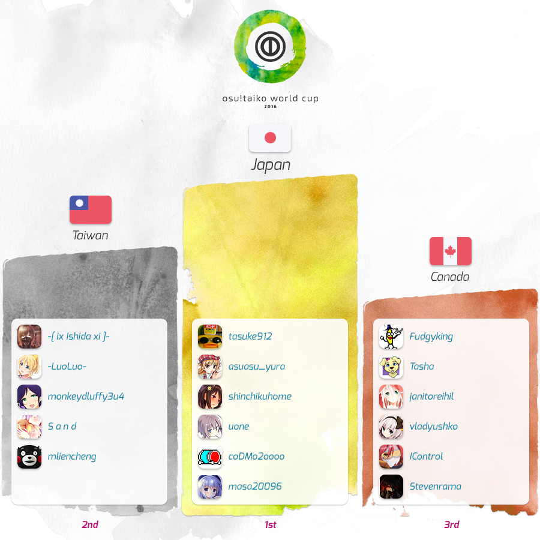
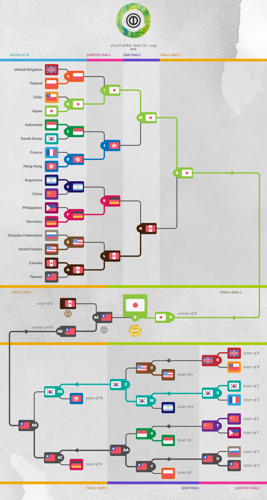

---
tags:
- TWC 2016
- TWC2016
---
osu!Taiko World Cup 2016
========================

The **osu!taiko World Cup 2016** (***TWC 2016***) is a country-based osu!taiko tournament hosted by the [osu! staff](/wiki/People/The_Team). It is the 6th installment of the osu!taiko World Cup.

Tournament schedule
------------------------

| Event              | Timestamp                 |
|--------------------|---------------------------|
| Registration Phase | 9-28 Feb 2016             |
| Drawings           | 11 Mar 2016 (14:00 UTC+0) |
| Group Stage        | 19-20 Mar 2016            |
| Round of 16        | 26-27 Mar 2016            |
| Quarterfinals      | 2-3 Apr 2016              |
| Semifinals         | 9-10 Apr 2016             |
| Finals - Week 1    | 16-17 Apr 2016            |
| Finals - Week 2    | 23-24 Apr 2016            |

Prizes
-------------

We are aiming to have a minimum $3,800 cash prize pool for this world cup. You can support raising this amount of money. We will publish a method for that, as soon as we have it available!

| Placing                                                    | Prize(s)                                                                     |
|------------------------------------------------------------|------------------------------------------------------------------------------|
|    | 50% of the raised prize pool, profile badge, "osu!taiko Champion" user title |
|  | 38% of the raised prize pool, profile badge                                  |
|  | 12% of the raised prize pool, profile badge                                  |

Organization
------------

| Job                   | Persons                                                                                                                                                                                                                                                                                                                                                                                                                                                                          |
|-----------------------|----------------------------------------------------------------------------------------------------------------------------------------------------------------------------------------------------------------------------------------------------------------------------------------------------------------------------------------------------------------------------------------------------------------------------------------------------------------------------------|
| Tournament Management | ![][flag_DE] [Loctav](https://osu.ppy.sh/users/71366) // ![][flag_DE] [p3n](https://osu.ppy.sh/users/123703) // ![][flag_ES] [Deif](https://osu.ppy.sh/users/318565) // ![][flag_FR] [shARPII](https://osu.ppy.sh/users/776257)                                                                                                                                                                                                                  |
| Map Selectors         | ![][flag_US] [MMzz](https://osu.ppy.sh/users/128993) // ![][flag_DE] [OnosakiHito](https://osu.ppy.sh/users/290128)                                                                                                                                                                                                                                                                                                                                              |
| Streamers             | ![][flag_DE] [Loctav](https://osu.ppy.sh/users/71366) // ![][flag_PL] [Marcin](https://osu.ppy.sh/users/722665)                                                                                                                                                                                                                                                                                                                                                  |
| Commentators          | ![][flag_NZ] [deadbeat](https://osu.ppy.sh/users/128370) // ![][flag_DE] [Chromoxx](https://osu.ppy.sh/users/1881639) // ![][flag_AR] [juankristal](https://osu.ppy.sh/users/443656) // ![][flag_FR] [Slainv](https://osu.ppy.sh/users/4823843) // ![][flag_CA] [Tasha](https://osu.ppy.sh/users/1031958) // ![][flag_US] [Zak](https://osu.ppy.sh/users/1375955) // ![][flag_US] [ztrot](https://osu.ppy.sh/users/6347) |
| Statistician          | ![][flag_US] [Ascendance](https://osu.ppy.sh/users/2931883) // ![][flag_NZ] [deadbeat](https://osu.ppy.sh/users/128370) // ![][flag_DE] [Nwolf](https://osu.ppy.sh/users/1910766)                                                                                                                                                                                                                                                                        |

------------------------------------------------------------------------

------------------------------------------------------------------------

------------------------------------------------------------------------

Participants
------------

| Top Seed                                     | Mid Seed                                      | Low Seed                                          |
|----------------------------------------------|-----------------------------------------------|---------------------------------------------------|
| ![][flag_CA] Canada        | ![][flag_AR] Argentina      | ![][flag_AU] Australia          |
| ![][flag_CN] China         | ![][flag_CL] Chile          | ![][flag_BR] Brazil             |
| ![][flag_DE] Germany       | ![][flag_FR] France         | ![][flag_IT] Italy              |
| ![][flag_HK] Hong Kong     | ![][flag_ID] Indonesia      | ![][flag_MY] Malaysia           |
| ![][flag_JP] Japan         | ![][flag_PH] Philippines    | ![][flag_RU] Russian Federation |
| ![][flag_KR] South Korea   | ![][flag_PL] Poland         | ![][flag_SG] Singapore          |
| ![][flag_TW] Taiwan        | ![][flag_ES] Spain          | ![][flag_SE] Sweden             |
| ![][flag_US] United States | ![][flag_GB] United Kingdom | ![][flag_VE] Venezuela          |

------------------------------------------------------------------------

Mappools
-----------

### Finals

**This mappool will be used in Finals - Week 1 and Finals - Week 2**

**[Download the mappack here!](https://www.mediafire.com/download/4px14n1o2cpqc8e/TWC_2016_Finals_Mappack.rar)**

- NoMod
  - [Caladborg - invoker (-Anhedonia-) \[Taikocalypse\]](https://osu.ppy.sh/beatmaps/773846)
  - [sasakure.UK & OSTER Project - Utopia of Oz (\_yu68) \[Inner Oni\]](https://osu.ppy.sh/beatmaps/911280)
  - [t+pazolite - Garakuta Doll Play (sasakure.UK clutter remix) (Love) \[Love\]](https://osu.ppy.sh/beatmaps/916478)
  - [Kobaryo - Always TANO\*C (Kobaryo's FTN-Remix) (R i n g o) \[Ringo's TANO\*C\]](https://osu.ppy.sh/beatmaps/649735)
  - [Camellia - Routing (MMzz) \[Inner Oni\]](https://osu.ppy.sh/beatmaps/821637)
  - [t+pazolite - Rumble Kung-fu Showdown (Lundlerol) \[Taiko\*Krestar\]](https://osu.ppy.sh/beatmaps/396613)
- Hidden
  - [BlackY - Harpuia (Ichigaki) \[Inner Oni\]](https://osu.ppy.sh/beatmaps/706841)
  - [Sota Fujimori - WOBBLE IMPACT (Loctav) \[Inner Oni\]](https://osu.ppy.sh/beatmaps/375040)
  - [LeaF - MEPHISTO (Alumetorz) \[TK'S Inner Oni\]](https://osu.ppy.sh/beatmaps/284037)
- HardRock
  - [Morimori Atsushi - PUPA (TKS) \[Firce777's Hell Oni\]](https://osu.ppy.sh/beatmaps/545841)
  - [L.E.D. vs S-C-U - Confiserie (-xNaCLx-) \[Inner Oni\]](https://osu.ppy.sh/beatmaps/809880)
  - [Chroma - Sayonara Planet Wars (BrambleClaw) \[Inner Oni\]](https://osu.ppy.sh/beatmaps/758831)
- DoubleTime
  - [LEAF XCEED Music Division - YuYu Metal (DoKoLP) \[Ono's Taiko Oni\]](https://osu.ppy.sh/beatmaps/142309)
  - [sakuzyo - AXION (DaxMasterix) \[lepidon! - Inner Oni\]](https://osu.ppy.sh/beatmaps/244200)
  - [A.SAKA - Nanatsu Issenzakura (Nofool) \[tasuke's Inner Oni\]](https://osu.ppy.sh/beatmaps/719063)
- FreeMod
  - [Camellia - Racemization (SKSalt) \[Inner Oni\]](https://osu.ppy.sh/beatmaps/848949)
  - [Thaehan - Doki-Doki (ghm12) \[Taiko\]](https://osu.ppy.sh/beatmaps/700810)
  - [DJ TOTTO VS TOTTO - Vajra (qoot8123) \[Inner Oni\]](https://osu.ppy.sh/beatmaps/717065)
- Tiebreaker
  - [Spawn Of Possession - Apparition (Raiden) \[Terror Oni\]](https://osu.ppy.sh/beatmaps/914189)

### Semifinals

**[Download the mappack here!](https://www.mediafire.com/download/kmqmdnde5tmdxz8/TWC_2016_Semifinals.rar)**

- NoMod
  - [BlackY vs. Yooh - XROSS INFECTION (-\[ Dumpling \]-) \[Kano's Inner Oni\]](https://osu.ppy.sh/beatmaps/716970)
  - [LeaF - Wizdomiot (SKSalt) \[JuDa's Inner Oni\]](https://osu.ppy.sh/beatmaps/781859)
  - [Zeami - Seizya No Kodo (Chocola\_2287) \[Inner Oni\]](https://osu.ppy.sh/beatmaps/859716)
  - [Renard - Bumblefuck (Lost The Lights) \[Collab Inner Oni\]](https://osu.ppy.sh/beatmaps/696201)
  - [xi - ANiMA (tasuke912) \[Inner Oni\]](https://osu.ppy.sh/beatmaps/724040)
  - [t+pazolite - Call me it. (500 Tortures) (Lukareia) \[Lunasa's Taiko Inner Oni\]](https://osu.ppy.sh/beatmaps/251945)
- Hidden
  - [Camellia - werewolf howls. (Nwolf) \[Inner Oni\]](https://osu.ppy.sh/beatmaps/692800)
  - [BlackY - Max Burning!! (SpectorDG) \[tasuke's Inner Oni\]](https://osu.ppy.sh/beatmaps/766232)
  - [TAG - Riot of Color (OzzyOzrock) \[Inner Oni\]](https://osu.ppy.sh/beatmaps/576979)
- HardRock
  - [DE-JAVU - TRIP MACHINE EVOLUTION (Raiden) \[Inner Oni\]](https://osu.ppy.sh/beatmaps/894396)
  - [FLOOR LEGENDS -KAC 2012- - KAC 2012 ULTIMATE MEDLEY -HISTORIA SOUND VOLTEX- (Nanatsu) \[Inner Oni\]](https://osu.ppy.sh/beatmaps/920487)
  - [dj TAKA meets DJ YOSHITAKA ft.guit.good-cool - Elemental Creation -GITADO ROCK ver.- (MMzz) \[Inner Oni\]](https://osu.ppy.sh/beatmaps/487709)
- DoubleTime
  - [M2U - Quo Vadis (TKSalt) \[Inner Oni\]](https://osu.ppy.sh/beatmaps/339131)
  - [Ryu\* - Mind Mapping (kors k mix) (Jerry) \[m1ng's Oni\]](https://osu.ppy.sh/beatmaps/281558)
  - [SOUND HOLIC - Drive My Life (Scorpiour) \[Firce777's Taiko Oni\]](https://osu.ppy.sh/beatmaps/177271)
- FreeMod
  - [RoughSketch + DD"Nakata"Metal - Booths of Fighters (-Anhedonia-) \[GRAVITY\]](https://osu.ppy.sh/beatmaps/637933)
  - [Kufuo - KHAMEN BREAK (Sayaka-) \[Break Oni\]](https://osu.ppy.sh/beatmaps/921055)
  - [The Flashbulb - Lawn Wake IV (Black) (\_Gezo\_) \[Hell Oni\]](https://osu.ppy.sh/beatmaps/756202)
- Tiebreaker
  - [Imperial Circus Dead Decadence - Uta (Kite) \[lolcubes' Hell Oni\]](https://osu.ppy.sh/beatmaps/899716)

### Quarterfinals

**[Download the mappack here!](https://www.mediafire.com/download/xaag5o0tyacpcm4/TWC_2016_Quarterfinals.rar)**

- NoMod
  - [xi - Wish Upon Twin Stars (Ascendance) \[Nardo's Inner Oni\]](https://osu.ppy.sh/beatmaps/805878)
  - [LeaF - Chronostasis (DakeDekaane) \[Inner Oni\]](https://osu.ppy.sh/beatmaps/566347)
  - [xi - Q.E.D.-Ripples of 495 years- (S a n d) \[Ura Oni\]](https://osu.ppy.sh/beatmaps/685388)
  - [Team:SASAKURATION - AVALON (Leader) \[Firce777's Ura Oni\]](https://osu.ppy.sh/beatmaps/406755)
  - [toby fox - Spider Dance (OzzyOzrock) \[Spider Donut 9999G\]](https://osu.ppy.sh/beatmaps/818080)
  - [CyoucyoP feat.Hatsune Miku - End of the World (TKS) \[Inner Oni\]](https://osu.ppy.sh/beatmaps/506018)
- Hidden
  - [Thaehan - Sunrise (ghm12) \[Taiko\]](https://osu.ppy.sh/beatmaps/670914)
  - [Renard - Terminal (nold\_1702) \[mint's Inner Oni\]](https://osu.ppy.sh/beatmaps/291218)
  - [USAO - Showdown (eeezzzeee) \[tasuke's Inner Oni\]](https://osu.ppy.sh/beatmaps/809177)
- HardRock
  - [SOUND HOLIC Vs. dj TAKA feat. YURiCa - TIEFSEE (OnosakiHito) \[Ura Oni\]](https://osu.ppy.sh/beatmaps/915380)
  - [Soleily - Renatus (Multiple Creators) \[Oni\]](https://osu.ppy.sh/beatmaps/557818)
  - [t+pazolite - Pumpin' Junkies (Lost The Lights) \[LTL's Inner Oni\]](https://osu.ppy.sh/beatmaps/799720)
- DoubleTime
  - [kors k feat.Yoshikawa Sunao - 7 Colors (sionKotori) \[Naryuga's Taiko Oni\]](https://osu.ppy.sh/beatmaps/369597)
  - [capitaro - Yoiduki Maiuta (Amamiya Yuko) \[714's Taiko Oni\]](https://osu.ppy.sh/beatmaps/206233)
  - [D.J.Amuro - ZZ (Nofool) \[Inner Oni\]](https://osu.ppy.sh/beatmaps/786903)
- FreeMod
  - [Black Raison d'etre - INSIDE IDENTITY (Natsu) \[aabc's Taiko Oni\]](https://osu.ppy.sh/beatmaps/280103)
  - [RYO - Shuffle Heaven (Nwolf) \[WereOni\]](https://osu.ppy.sh/beatmaps/572587)
  - [CyoucyoP feat.Hatsune Miku - White Prism (kanopu) \[Prism Oni\]](https://osu.ppy.sh/beatmaps/694940)
- Tiebreaker
  - [orangentle / Yu\_Asahina - HAELEQUIN (Extended ver.) (Sayaka-) \[Oni\]](https://osu.ppy.sh/beatmaps/692432)

### Round of 16

**[Download the mappack here!](https://www.mediafire.com/download/c35kxmdomnpp1sy/TWC_2016_Round_of_16.rar)**

- NoMod
  - [Ryu\* - We're so Happy (Spy) \[m1ng's Inner Oni\]](https://osu.ppy.sh/beatmaps/314179)
  - [sasakure.UK - Jack-the-Ripper (Sayaka-) \[Collab Inner Oni\]](https://osu.ppy.sh/beatmaps/496238)
  - [DJ TOTTO - chaplet (Nwolf) \[INNER ONI\]](https://osu.ppy.sh/beatmaps/568217)
  - [Starving Trancer - New Gravity (Nishizumi) \[tasuke's Inner Oni\]](https://osu.ppy.sh/beatmaps/780310)
  - [Ryu\* Vs. L.E.D.-G - PARADISE LOST (ignorethis) \[Taiko\]](https://osu.ppy.sh/beatmaps/122471)
  - [Igorrr - Scarlatti 2.0 (grumd) \[Oni\]](https://osu.ppy.sh/beatmaps/227453)
- Hidden
  - [ESTi X M2U - Obelisque (MMzz) \[Inner Oni\]](https://osu.ppy.sh/beatmaps/417241)
  - [Rohi - Kakuzetsu Thanatos (NatsumeRin) \[714's Taiko Oni\]](https://osu.ppy.sh/beatmaps/217280)
  - [Mutsuhiko Izumi - Red Goose (lepidopodus) \[Oni\]](https://osu.ppy.sh/beatmaps/169371)
- HardRock
  - [colate - Strobe Girl (Extended) (KinomiCandy) \[Oni\]](https://osu.ppy.sh/beatmaps/897649)
  - [DM Ashura - Classical Insanity (LunaticP) \[Taiko Eclipse\]](https://osu.ppy.sh/beatmaps/558244)
  - [onoken - felys -long remix- (Sharp) \[lepidon! - Taiko Oni\]](https://osu.ppy.sh/beatmaps/85473)
- DoubleTime
  - [M2U feat. Guriri - Magnolia (JUDYDANNY) \[Oni\]](https://osu.ppy.sh/beatmaps/350732)
  - [SoundTeMP - Dreamer's Dream (P A N) \[Ono's Oni\]](https://osu.ppy.sh/beatmaps/780327)
  - [SHW - Ikusa JAPAN (shw.in) (kanpakyin) \[Oni\]](https://osu.ppy.sh/beatmaps/411522)
- FreeMod
  - [Memme - China Dress (Tear) \[Zexous' Oni\]](https://osu.ppy.sh/beatmaps/403249)
  - [syatten remixed celas - Bird Sprite -Awakening of Light- (DaxMasterix) \[Climbb's Taiko Oni\]](https://osu.ppy.sh/beatmaps/136426)
  - [Falcom Sound Team jdk - Over Drive (Kite) \[52's Taiko\]](https://osu.ppy.sh/beatmaps/128672)
- Tiebreaker
  - [DragonForce - Defenders (Raiden) \[Tatsujin\]](https://osu.ppy.sh/beatmaps/835691)

### Group Stage

**[Download the mappool here!](https://www.mediafire.com/download/eu9o60zwublo4fq/TWC_2016_Group_Stage.rar)**

- NoMod
  - [YZYX - I nyaned for hours ( ' w')!! feat. Hatsune Miku (MMzz) \[Inner Oni\]](https://osu.ppy.sh/beatmaps/638203)
  - [May'n - Chase the world (TV Size) (Ryafuka) \[Climbb's Taiko Oni\]](https://osu.ppy.sh/beatmaps/150050)
  - [8284 vs wa. - Adularescence (Cherry Blossom) \[TK'S Oni\]](https://osu.ppy.sh/beatmaps/310734)
  - [Denkare - Satsuriku no Keifu (lolcubes) \[Oni\]](https://osu.ppy.sh/beatmaps/257366)
  - [DJ YOSHITAKA - MANA (Lundlerol) \[Inner Oni\]](https://osu.ppy.sh/beatmaps/252086)
  - [Harada Hitomi, Kayano Ai & Ogura Yui - Maware! Setsugekka (TV Size) (wcx19911123) \[Kana's Taiko Maware!\]](https://osu.ppy.sh/beatmaps/314699)
- Hidden
  - [LiSA - traumerei (TV Ver.) (taiko\_maniac1811) \[Oni\]](https://osu.ppy.sh/beatmaps/278000)
  - [Kagamine Rin & Len - Jutenija (Arusha Shuna) \[Dunskin's Taiko Oni\]](https://osu.ppy.sh/beatmaps/109025)
  - [marina - Towa yori Towa ni (Garven) \[TK'S Oni\]](https://osu.ppy.sh/beatmaps/368400)
- HardRock
  - [DECO\*27 - Haruichi. feat. Hatsune Miku (mintong89) \[Taiko Ura Oni\]](https://osu.ppy.sh/beatmaps/498602)
  - [A.SAKA - Nanatsu Issenzakura (Nofool) \[tasuke's Inner Oni\]](https://osu.ppy.sh/beatmaps/719063)
  - [Fear, and Loathing in Las Vegas - Rave-Up Tonight (qoot8123) \[Inner Oni\]](https://osu.ppy.sh/beatmaps/563660)
- DoubleTime
  - [Hatsuki Yura - Yoiyami Hanabi (mrdumpling64) \[aabc's Oni\]](https://osu.ppy.sh/beatmaps/549942)
  - [PSYCHIC LOVER - Samurai Sentai Shinkenger (DakeDekaane) \[Oni\]](https://osu.ppy.sh/beatmaps/324180)
  - [KILLERBLOOD - The Black Case (tetsutaro) \[Oni\]](https://osu.ppy.sh/beatmaps/254187)
- FreeMod
  - [Nekomata Master - Avalon Hill (LunaticP) \[Oni\]](https://osu.ppy.sh/beatmaps/597875)
  - [DAISUKE ASAKURA - stealth (ouranhshc) \[31's Taiko\]](https://osu.ppy.sh/beatmaps/70334)
  - [NOMA - Brain Power (OnosakiHito) \[Ura Oni\]](https://osu.ppy.sh/beatmaps/905096)
- Tiebreaker
  - [kamome sano - plasma (2015 rework) (Charlotte) \[Inner Oni\]](https://osu.ppy.sh/beatmaps/768536)

------------------------------------------------------------------------

Match Results
--------------

**[Find all detailed Match Statistics here!](https://docs.google.com/spreadsheets/d/1gVHBZZpCMq2Ktvsr7KDeb_DBpN048TDjfZJW4c5JKzQ/pubhtml)**

### Finals - Week 2

**Sunday, 24\. April 2016**

| Team A                                | Score       | Team B                                   | History                        |
|:--------------------------------------|:-----------:|-----------------------------------------:|--------------------------------|
| ![][flag_TW] Taiwan | 2 - ***7*** | **Japan** ![][flag_JP] | [#1](https://osu.ppy.sh/community/matches/24400797) |

### Finals - Week 1

**Saturday, 16\. April 2016**

| Team A                                    | Score     | Team B                                         | History                        |
|:------------------------------------------|:---------:|-----------------------------------------------:|--------------------------------|
| ![][flag_JP] **Japan**  | **6** - 2 | Canada ![][flag_CA]          | [#1](https://osu.ppy.sh/community/matches/24194354) |
| ![][flag_DE] Germany    | 0 - **6** | **Taiwan** ![][flag_TW]      | [#1](https://osu.ppy.sh/community/matches/24201032) |
| ![][flag_HK] Hong Kong  | 5 - **6** | **South Korea** ![][flag_KR] | [#1](https://osu.ppy.sh/community/matches/24203340) |
| ![][flag_TW] **Taiwan** | **6** - 0 | South Korea ![][flag_KR]     | [#1](https://osu.ppy.sh/community/matches/24206740) |

**Sunday, 17\. April 2016**

| Team A                                | Score | Team B                                    | History                        |
|:--------------------------------------|:-----:|------------------------------------------:|--------------------------------|
| ![][flag_CA] Canada | 5 - 6 | **Taiwan** ![][flag_TW] | [#1](https://osu.ppy.sh/community/matches/24227476) |

### Semifinals

**Saturday, 9\. April 2016**

| Team A                                         | Score     | Team B                                           | History                        |
|:-----------------------------------------------|:---------:|-------------------------------------------------:|--------------------------------|
| ![][flag_TW] **Taiwan**      | **6** - 1 | Poland ![][flag_PL]            | [#1](https://osu.ppy.sh/community/matches/24031840) |
| ![][flag_CN] China           | 3 - **6** | **Indonesia** ![][flag_ID]     | [#1](https://osu.ppy.sh/community/matches/24033032) |
| ![][flag_JP] **Japan**       | **6** - 0 | Hong Kong ![][flag_HK]         | [#1](https://osu.ppy.sh/community/matches/24036137) |
| ![][flag_KR] **South Korea** | **6** - 0 | Argentina ![][flag_AR]         | [#1](https://osu.ppy.sh/community/matches/24038093) |
| ![][flag_DE] Germany         | 1 - **6** | **Canada** ![][flag_CA]        | [#1](https://osu.ppy.sh/community/matches/24048158) |
| ![][flag_GB] United Kingdom  | 2 - **6** | **United States** ![][flag_US] | [#1](https://osu.ppy.sh/community/matches/24050709) |

**Sunday, 10\. April 2016**

| Team A                                         | Score     | Team B                                       | History                        |
|:-----------------------------------------------|:---------:|---------------------------------------------:|--------------------------------|
| ![][flag_KR] **South Korea** | **6** - 1 | United States ![][flag_US] | [#1](https://osu.ppy.sh/community/matches/24057716) |
| ![][flag_TW] **Taiwan**      | **6** - 0 | Indonesia ![][flag_ID]     | [#1](https://osu.ppy.sh/community/matches/24068098) |

### Quarterfinals

**Saturday, 2\. April 2016**

| Team A                                            | Score     | Team B                                       | History                        |
|:--------------------------------------------------|:---------:|---------------------------------------------:|--------------------------------|
| ![][flag_CN] **China**          | **5** - 1 | Philippines ![][flag_PH]   | [#1](https://osu.ppy.sh/community/matches/23863075) |
| ![][flag_ID] Indonesia          | 1 - **5** | **Hong Kong** ![][flag_HK] | [#1](https://osu.ppy.sh/community/matches/23864087) |
| ![][flag_RU] Russian Federation | 0 - **5** | **Taiwan** ![][flag_TW]    | [#1](https://osu.ppy.sh/community/matches/23865529) |
| ![][flag_PL] Poland             | 0 - **5** | **Japan** ![][flag_JP]     | [#1](https://osu.ppy.sh/community/matches/23867003) |
| ![][flag_KR] **South Korea**    | **5** - 1 | France ![][flag_FR]        | [#1](https://osu.ppy.sh/community/matches/23869118) |
| ![][flag_GB] **United Kingdom** | **5** - 0 | Chile ![][flag_CL]         | [#1](https://osu.ppy.sh/community/matches/23878066) |
| ![][flag_AR] Argentina          | 0 - **5** | **Germany** ![][flag_DE]   | [#1](https://osu.ppy.sh/community/matches/23880433) |
| ![][flag_US] United States      | 2 - **5** | **Canada** ![][flag_CA]    | [#1](https://osu.ppy.sh/community/matches/23883766) |

### Round of 16

**Sunday, 27\. March 2016**

| Team A                                            | Score     | Team B                                           | History                        |
|:--------------------------------------------------|:---------:|-------------------------------------------------:|--------------------------------|
| ![][flag_CA] **Canada**         | **5** - 0 | Taiwan ![][flag_TW]            | [#1](https://osu.ppy.sh/community/matches/23713296) |
| ![][flag_ID] **Indonesia**      | **5** - 2 | South Korea ![][flag_KR]       | [#1](https://osu.ppy.sh/community/matches/23714183) |
| ![][flag_FR] France             | 0 - **5** | **Hong Kong** ![][flag_HK]     | [#1](https://osu.ppy.sh/community/matches/23718684) |
| ![][flag_PH] Philippines        | 0 - **5** | **Germany** ![][flag_DE]       | [#1](https://osu.ppy.sh/community/matches/23719600) |
| ![][flag_CL] Chile              | 0 - **5** | **Japan** ![][flag_JP]         | [#1](https://osu.ppy.sh/community/matches/23720870) |
| ![][flag_AR] **Argentina**      | **5** - 2 | China ![][flag_CN]             | [#1](https://osu.ppy.sh/community/matches/23722191) |
| ![][flag_GB] United Kingdom     | 1 - **5** | **Poland** ![][flag_PL]        | [#1](https://osu.ppy.sh/community/matches/23726773) |
| ![][flag_RU] Russian Federation | 1 - **5** | **United States** ![][flag_US] | [#1](https://osu.ppy.sh/community/matches/23727923) |

### Group Stage

**Sunday, 20\. March 2016**

| Team A | Score | Team B | History |
|-|
| ![][flag_SG] Singapore | 1 - **4** | **Philippines** | ![][flag_PH] | [#1](https://osu.ppy.sh/community/matches/23529018) |
| ![][flag_AU] Australia | 1 - **4** | **Taiwan** | ![][flag_TW] | [#1](https://osu.ppy.sh/community/matches/23529019) |
| ![][flag_MY] Malaysia | 3 - **4** | **Indonesia** | ![][flag_ID] | [#1](https://osu.ppy.sh/community/matches/23529020) |
| ![][flag_ES] Spain | 1 - **4** | **Japan** | ![][flag_JP] | [#1](https://osu.ppy.sh/community/matches/23529936) |
| ![][flag_FR] France | 3 - **4** | **China** | ![][flag_CN] | [#1](https://osu.ppy.sh/community/matches/23529939) |
| ![][flag_AU] Australia | 2 - **4** | **United Kingdom** | ![][flag_GB] | [#1](https://osu.ppy.sh/community/matches/23530967) |
| ![][flag_SG] Singapore | 1 - **4** | **South Korea** | ![][flag_KR] | [#1](https://osu.ppy.sh/community/matches/23530968) |
| ![][flag_MY] Malaysia | 0 - **4** | **Germany** | ![][flag_DE] | [#1](https://osu.ppy.sh/community/matches/23530969) |
| ![][flag_RU] Russian Federation | 0 - **4** | **Japan** | ![][flag_JP] | [#1](https://osu.ppy.sh/community/matches/23532043) |
| ![][flag_SE] Sweden | 1 - **4** | **China** | ![][flag_CN] | [#1](https://osu.ppy.sh/community/matches/23532044) |
| ![][flag_PH] Philippines | 2 - **4** | **South Korea** | ![][flag_KR] | [#1](https://osu.ppy.sh/community/matches/23533518) |
| ![][flag_GB] **United Kingdom** | **4** - 2 | Taiwan | ![][flag_TW] | [#1](https://osu.ppy.sh/community/matches/23533520) |
| ![][flag_AR] Argentina | 1 - **4** | **Hong Kong** | ![][flag_HK] | [#1](https://osu.ppy.sh/community/matches/23533522) |
| ![][flag_RU] **Russian Federation** | **4** - 2 | Spain | ![][flag_ES] | [#1](https://osu.ppy.sh/community/matches/23535001) |
| ![][flag_VE] Venezuela | 0 - **4** | **Hong Kong** | ![][flag_HK] | [#1](https://osu.ppy.sh/community/matches/23535021) |
| ![][flag_ID] Indonesia | 1 - **4** | **Germany** | ![][flag_DE] | [#1](https://osu.ppy.sh/community/matches/23535035) |
| ![][flag_VE] Venezuela | 0 - **4** | **Argentina** | ![][flag_AR] | [#1](https://osu.ppy.sh/community/matches/23540146) |
| ![][flag_SE] Sweden | 0 - **4** | **France** | ![][flag_FR] | [#1](https://osu.ppy.sh/community/matches/23540147) |
| ![][flag_BR] Brazil | 1 - **4** | **Chile** | ![][flag_CL] | [#1](https://osu.ppy.sh/community/matches/23541521) |
| ![][flag_IT] Italy | 0 - **4** | **Canada** | ![][flag_CA] | [#1](https://osu.ppy.sh/community/matches/23542673) |
| ![][flag_CL] Chile | 0 - **4** | **United States** | ![][flag_US] | [#1](https://osu.ppy.sh/community/matches/23543699) |
| ![][flag_PL] Poland | 2 - **4** | **Canada** | ![][flag_CA] | [#1](https://osu.ppy.sh/community/matches/23543708) |
| ![][flag_BR] Brazil | 0 - **4** | **United States** | ![][flag_US] | [#1](https://osu.ppy.sh/community/matches/23545079) |
| ![][flag_IT] Italy | 1 - **4** | **Poland** | ![][flag_PL] | [#1](https://osu.ppy.sh/community/matches/23545089) |

------------------------------------------------------------------------

Ruleset
---------

### Tournament Rules

1.  The osu!taiko World Cup is a country-based 3 versus 3 team tournament, played on the osu!taiko game mode only.
2.  The maps for each round will be announced by the mapset selector in advance on the Sunday before the actual matches take place. Only these will be used during the respective matches.
    -   One map will be given as a tiebreaker map. This map will only be played in case of a tie.
    -   There will also be a [Hidden](/wiki/Game_Modifiers), [HardRock](/wiki/Game_Modifiers), [DoubleTime](/wiki/Game_Modifiers) and FreeMod bracket.

3.  Match schedule will be settled by the Tournament Management (see below).
4.  If no staff or referee is available, the match will be postponed.
5.  Failed player's score do not get added to the team score.
6.  Use of the [Visual Settings](/wiki/Game_Modifiers) options are allowed.
7.  If the beatmap ends in a draw, the game will be nullified.
8.  If a player disconnects, they get treated as if they failed the beatmap.
    1.  Disconnects within 30 seconds after map begin can be rematched. This is up to the referee's discretion.

9.  Beatmaps cannot be reused in the same match unless the beatmap was nullified.
10. If less than 3 players attend, the maximum time the match can be postponed is 10 minutes.
11. Exchanging players during a match is allowed. There are no limitations when exchanging players.
12. Lag is not a valid reason to nullify a beatmap.
13. All players are supposed to keep the match running fluent and without delays. Excessive match delays coming from the player's side can be issued with penalites.
14. If a player disconnects between the beatmaps and the team can not provide an exchange, the match can be delayed 10 minutes at maximum.
15. All players and referees must to be treated with respect. Instructions of the referees and tournament management is to be followed. Decisions labeled as final are not to be objected.
16. Disrupting the match by foul play, picking inappropriate warmup maps (see below), insulting and provoking other players or referees, delaying the match or other deliberate inappropriate misbehavior is strictly prohibited.
17. The multiplayer chatrooms underlie the [osu! community rules](/wiki/Rules). All chat rules apply to the multiplayer chatrooms, too.
    1.  Breaking the chat rules results in a silence. Silenced players can not participate at multiplayer matches and must be exchanged for the time being.

18. In Group stage, 'Win by default' will be considered as win by 4:0, +1.0 score difference ratio.
19. Unexpected incidences are handled by the tournament management. Referees may allow higher tolerance depending on the given circumstances. This is up to their discretion.
20. Penalties for violating the tournament rules can be:
    -   Exclusion of specific players for one map
    -   Exclusion of specific players for an entire match
    -   Declaring the match as Lost by Default
    -   Disqualification from the entire tournament
    -   Disqualification from the current and future official tournaments until appealed

21. Any modification of these rules will be announced.

### Tournament Registration

1.  Every user interested in joining their country's team signs up individually.
    1.  Tournament Management will create a list of potential candidates for a country's team.
    2.  Tournament Management declares one candidate to the captain of the country's team, albeit temporarily.
    3.  The declared captain can form their team from the candidate list of their country.

2.  To ensure valid and serious registrations, every registered user will be checked by the Tournament Management.
    1.  Every registered user will be assigned to their respective country's candidate list.
    2.  To be successfully accepted on the list, you have to ensure that your global osu!taiko performace ranking is above \#5000.
    3.  To be successfully accepted on the list, you have to ensure that you did not violate the [osu! community rules](/wiki/Rules) within the last 12 months.

3.  All successfully formed teams will be published after the Registration Phase.
4.  Only the 32 potentially strongest countries will pariticipate. The potential strength of a country is determined by the online statistics of all valid candidates.
    1.  If the amount of registered countries is below 32, the number might be reduced to 24, 20 or 16. The aim is always to let as many countries participate as possible!

5.  Mapset selectors may not participate as a player in this tournament.

### Stage Instructions

1.  In the first stage (Group Stage), the teams will be divided into 8 groups of 3 teams.
    1.  This may change depending on how many teams are accepted into the competition at the end.

2.  All the teams from each group will face each other.
3.  Rankings of each group are determined by sorting the results of each team's performance in the following priority:
    1.  Most matches won.
    2.  Have higher `{(the number of maps won) - (the number of maps defeated)}`.
    3.  Most maps won.
    4.  Have higher `∑{(total score difference) / (maximum score)}`.
    5.  Winner of the rematch.

4.  The top 2 teams of each group will move on to the Knock-Out Stages.
    1.  This may change with the actual Group Stage setup.

5.  Following stages are Double Elimination Stages. This means that the winner moves to the next stage and the losing team gets moved to the Loser bracket.
6.  Based on [this image](/wiki/shared/stages-visual.png), the stages are split up into the following:

| Stage           | Match ID                |
|-----------------|-------------------------|
| Round of 16     | A, B, C, D, E, F, G, H  |
| Quarter-finals  | I, J, K, L & R, S, T, U |
| Semi-finals     | M, N & V, W, X, Y, Z,AA |
| Finals - Week 1 | O & AB, AC, AD, AE      |
| Finals - Week 2 | P, Q                    |

1.  **Winning conditions:**
    -   In Group Stage, you need to win 4 maps to win a match. (Best-of-7)
    -   In the Round of 16 and the Quarter-finals, you need to win 5 maps to win a match. (Best-of-9)
    -   In Semi-finals and Finals: Week 1, you need to win 6 maps to win a match. (Best-of-11)
    -   In Finals: Week 2, you need to win 7 maps to win the match. (Best-of-13)

### Match Instructions

1.  A referee will create a multiplayer room 15 minutes in advance. Players must gather during this period.
    1.  Room settings are osu!taiko, Team-Vs., Win Condition: 'Score'. Room name must be "TWC 2016: (TeamBlue) vs (TeamRed)".
    2.  The team mentioned first in the room name must be the blue team, the team mentioned second in the room name must be the red team.

2.  Players are free to select up to two warm-up maps. Using beatmaps with questionable content is prohibited. All maps must be osu!taiko specific maps.
3.  Each captain can ban two beatmaps to be selected from the pool. These beatmaps are not allowed to be picked by any team in the entire match.
    1.  Both vetos must always be used.

4.  Beatmap selection will alternate between each captain selecting a beatmap out of the map pool.
5.  Each captain must use "!roll" once in \#multiplayer.
    1.  The winner of the !roll starts picking the first beatmap of the match.
    2.  The loser of the !roll starts banning two beatmaps.

6.  Captains may pick freely from any bracket.
    1.  In case of a tie, the tiebreaker map must be played.

7.  Results of the Group Stage will be published via a Statistics sheet.

### Mappool Instructions

1.  There will be 1 mappool for the Group Stage, 1 mappool for the Round of 16, 1 mappool for the Quarterfinals, 1 mappool for the Semifinals and 1 mappool for the Finals.
    1.  Finals Week 1 & Finals Week 2 use the same mappool.

2.  Each mappool consists of 5 brackets: NoMod, [Hidden](/wiki/Game_Modifiers), [HardRock](/wiki/Game_Modifiers), [DoubleTime](/wiki/Game_Modifiers) and FreeMod.
3.  Each mappool consists of 19 maps in total.
4.  Each mappool has one tiebreaker.
5.  The NoMod bracket will be played with no modes activated.
6.  The Hidden, HardRock and DoubleTime bracket will be played with the respective modes activated.
7.  The FreeMod bracket will have FreeMod activated. Every individual player can pick Hidden, HardRock or no mod at all. You can not pick Hidden and HardRock at the same time.
    1.  When playing a FreeMod map, at least 1 player of each team must have one mode activated.

8.  The tiebreaker will be played under FreeMod conditions.
    1.  When playing the tiebreaker, no one needs to have a mode activated.

9.  The size of the NoMod bracket will be 6 in all stages.
10. The size of the mod-specific brackets will be 3 in all stages.

### Scheduling Instructions

1.  Each stage will be held on **a single weekend**.
2.  Matches in Group Stage may overlap.
3.  All Double Elimination Stages will be held on either Saturday or Sunday, UTC+0.
4.  Scheduling will be handled by the Tournament Management. Schedules will be released on the Sunday before the first matches of the actual stage. Tournament Management will try to create the schedule to respect the participant's time zone.
    1.  In the stages Quarter-finals and higher: Please inform tournament management before Sunday, if you expect a specific time slot to be unavailable in the following week. Wishes are tried to be followed, alas no promises can be made.

5.  Rescheduling after the release of the Schedule on the wiki can not be done in any circumstance.
6.  Captains are responsible for their teams availability. The greater team size exists to ensure every team can provide at least three players for each match. If teams can not provide three players for a match, the match will be considered forfeited.

[flag_AR]: /wiki/shared/flag/AR.gif
[flag_AU]: /wiki/shared/flag/AU.gif
[flag_BR]: /wiki/shared/flag/BR.gif
[flag_CA]: /wiki/shared/flag/CA.gif
[flag_CL]: /wiki/shared/flag/CL.gif
[flag_CN]: /wiki/shared/flag/CN.gif
[flag_DE]: /wiki/shared/flag/DE.gif
[flag_ES]: /wiki/shared/flag/ES.gif
[flag_FR]: /wiki/shared/flag/FR.gif
[flag_GB]: /wiki/shared/flag/GB.gif
[flag_HK]: /wiki/shared/flag/HK.gif
[flag_ID]: /wiki/shared/flag/ID.gif
[flag_IT]: /wiki/shared/flag/IT.gif
[flag_JP]: /wiki/shared/flag/JP.gif
[flag_KR]: /wiki/shared/flag/KR.gif
[flag_MY]: /wiki/shared/flag/MY.gif
[flag_NZ]: /wiki/shared/flag/NZ.gif
[flag_PH]: /wiki/shared/flag/PH.gif
[flag_PL]: /wiki/shared/flag/PL.gif
[flag_RU]: /wiki/shared/flag/RU.gif
[flag_SE]: /wiki/shared/flag/SE.gif
[flag_SG]: /wiki/shared/flag/SG.gif
[flag_TW]: /wiki/shared/flag/TW.gif
[flag_US]: /wiki/shared/flag/US.gif
[flag_VE]: /wiki/shared/flag/VE.gif
