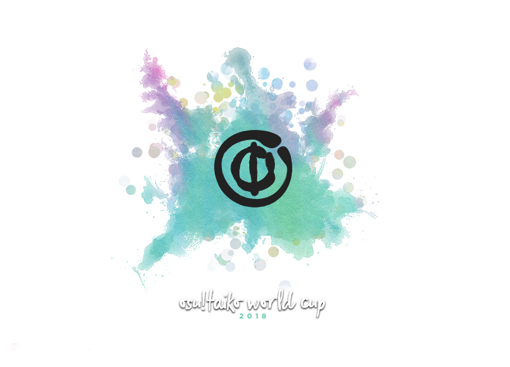
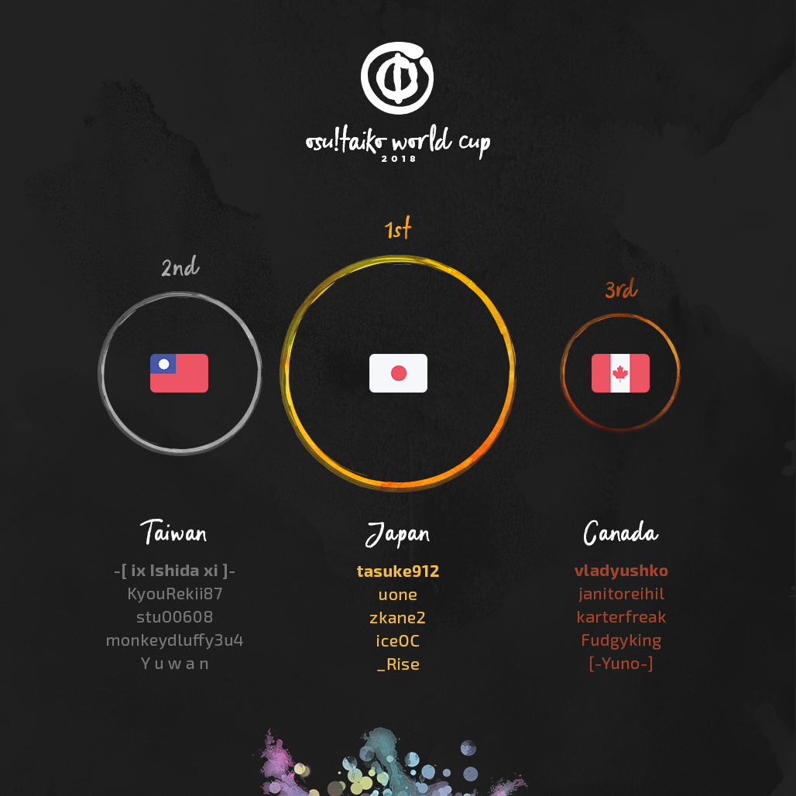

---
tags:
  - TWC 2018
  - TWC2018
---

# osu!taiko World Cup 2018

The **osu!taiko World Cup 2018** (***TWC 2018***) was a country-based osu!taiko tournament hosted by the [osu! team](/wiki/People/osu!_team). It was the eighth instalment of the osu!taiko World Cup.

## Tournament schedule

| Event | Timestamp |
| --: | :-- |
| Registration phase | 2018-03-08/2018-03-21 |
| Live drawings | 2018-03-31 (14:00 UTC) |
| Group stage | 2018-04-07/2018-04-08 |
| Round of 16 | 2018-04-15 |
| Quarterfinals | 2018-04-21/2018-04-22 |
| Semifinals | 2018-04-28/2018-04-29 |
| Finals week 1 | 2018-05-05 |
| Finals week 2 | 2018-05-12/2018-05-13 |

## Prizes

| Placing | Prizes |
| :-: | :-- |
|  | $150 per team member, unique profile badge, "osu!taiko Champion" user title for one year |
|  | $80 per team member, unique profile badge |
|  | $40 per team member, unique profile badge |

  

## Organisation

The osu!taiko World Cup 2018 was run by various community members.

| Position | Member(s) |
| :-- | :-- |
| Manager | ::{ flag=NZ }:: [deadbeat](https://osu.ppy.sh/users/128370), ::{ flag=US }:: [HappyStick](https://osu.ppy.sh/users/256802), ::{ flag=AR }:: [juankristal](https://osu.ppy.sh/users/443656) |
| Mappool selector | ::{ flag=HK }:: [mangomizer](https://osu.ppy.sh/users/1893718), ::{ flag=DE }:: [Nwolf](https://osu.ppy.sh/users/1910766), ::{ flag=DE }:: [OnosakiHito](https://osu.ppy.sh/users/290128) |
| Referee | ::{ flag=ES }:: [Deif](https://osu.ppy.sh/users/318565), ::{ flag=HK }:: [mangomizer](https://osu.ppy.sh/users/1893718), ::{ flag=DE }:: [p3n](https://osu.ppy.sh/users/123703), ::{ flag=CL }:: [WalterToro](https://osu.ppy.sh/users/5281416) |
| Commentator | ::{ flag=CA }:: [Azer](https://osu.ppy.sh/users/2155578), ::{ flag=US }:: [Das](https://osu.ppy.sh/users/3165416), ::{ flag=CA }:: [janitoreihil](https://osu.ppy.sh/users/3307897), ::{ flag=CA }:: [karterfreak](https://osu.ppy.sh/users/1031958), ::{ flag=DE }:: [Mew104](https://osu.ppy.sh/users/2345156), ::{ flag=ES }:: [Raiden](https://osu.ppy.sh/users/2239480), ::{ flag=DE }:: [Zetera](https://osu.ppy.sh/users/587737) |
| Statistician | ::{ flag=NZ }:: [deadbeat](https://osu.ppy.sh/users/128370), ::{ flag=DE }:: [Nwolf](https://osu.ppy.sh/users/1910766) |

## Links

- [Discussion thread](https://osu.ppy.sh/community/forums/topics/713163)
- [Livestream](https://www.twitch.tv/osulive)
- **[Statistics sheet](https://docs.google.com/spreadsheets/d/e/2PACX-1vSp05eL_jYsj4RGa2-lsS39wC1AQDLYXidmQJn0jcLU3c6nETCVZW2BhB5Cy_uIQ_Cp3K_BuTtLJDy4/pubhtml)**

## Participants

|  | Country | Members |
| :-: | :-: | :-- |
| ::{ flag=AR }:: | **Argentina** | **[gaston\_2199](https://osu.ppy.sh/users/5938161)**, [BossPlays\_02](https://osu.ppy.sh/users/7341471), [Midnaait](https://osu.ppy.sh/users/1506011), [Laut1G](https://osu.ppy.sh/users/7286821), [TrolloCat](https://osu.ppy.sh/users/9228032) |
| ::{ flag=AU }:: | **Australia** | **[Aloda](https://osu.ppy.sh/users/1190127)**, [Jaye](https://osu.ppy.sh/users/4841352), [Ceryuia](https://osu.ppy.sh/users/5253213), [rango](https://osu.ppy.sh/users/7728466), [remii](https://osu.ppy.sh/users/2913584) |
| ::{ flag=BR }:: | **Brazil** | **[HiroK](https://osu.ppy.sh/users/4050738)**, [Kbludoh](https://osu.ppy.sh/users/2543764), [Kqrth](https://osu.ppy.sh/users/4115718), [Serial Dreemurr](https://osu.ppy.sh/users/1235444), [Skull Kid](https://osu.ppy.sh/users/3044264) |
| ::{ flag=CA }:: | **Canada** | **[vladyushko](https://osu.ppy.sh/users/4908773)**, [\[-Yuno-\]](https://osu.ppy.sh/users/459886), [Fudgyking](https://osu.ppy.sh/users/3802922), [janitoreihil](https://osu.ppy.sh/users/3307897), [karterfreak](https://osu.ppy.sh/users/1031958) |
| ::{ flag=CL }:: | **Chile** | **[-Kazu-](https://osu.ppy.sh/users/920861)**, [Alepat](https://osu.ppy.sh/users/1164931), [OwO NYANQT x33](https://osu.ppy.sh/users/989542), [Pohm](https://osu.ppy.sh/users/2083934), [Ulqui](https://osu.ppy.sh/users/1263669) |
| ::{ flag=FI }:: | **Finland** | **[duski](https://osu.ppy.sh/users/6506484)**, [hot anime girl](https://osu.ppy.sh/users/4773855), [Lefafel](https://osu.ppy.sh/users/2295850), [Reikocchi](https://osu.ppy.sh/users/1110109) |
| ::{ flag=FR }:: | **France** | **[Arrival](https://osu.ppy.sh/users/1694000)**, [Nofool](https://osu.ppy.sh/users/672430), [Romainnoda](https://osu.ppy.sh/users/8814218), [TimmyAkmed](https://osu.ppy.sh/users/1799973), [-Valony-](https://osu.ppy.sh/users/6487540) |
| ::{ flag=DE }:: | **Germany** | **[Nepuri](https://osu.ppy.sh/users/6637817)**, [jleste](https://osu.ppy.sh/users/8275687), [-Leafeon](https://osu.ppy.sh/users/6956922), [lukili846](https://osu.ppy.sh/users/6278008), [Mikalodo](https://osu.ppy.sh/users/8498207) |
| ::{ flag=HK }:: | **Hong Kong** | **[sing216](https://osu.ppy.sh/users/6096445)**, [Faputa](https://osu.ppy.sh/users/845733), [J a c k y](https://osu.ppy.sh/users/8011704) |
| ::{ flag=ID }:: | **Indonesia** | **[Niko-nyan](https://osu.ppy.sh/users/906991)**, [Lightning Wyvern](https://osu.ppy.sh/users/1533122), [Nishizumi](https://osu.ppy.sh/users/2496768), [pmriva](https://osu.ppy.sh/users/2180885), [XK2238](https://osu.ppy.sh/users/1139209) |
| ::{ flag=IT }:: | **Italy** | **[Ikkun](https://osu.ppy.sh/users/1059945)**, [D3kuu](https://osu.ppy.sh/users/7807444) |
| ::{ flag=JP }:: | **Japan** | **[tasuke912](https://osu.ppy.sh/users/2774767)**, [\_Rise](https://osu.ppy.sh/users/5217107), [iceOC](https://osu.ppy.sh/users/5482401), [uone](https://osu.ppy.sh/users/5321719), [zkane2](https://osu.ppy.sh/users/6359835) |
| ::{ flag=MY }:: | **Malaysia** | **[Xeltic Rival](https://osu.ppy.sh/users/7500364)**, [cdhsausageboy](https://osu.ppy.sh/users/2403621), [Dakry](https://osu.ppy.sh/users/1994145), [Jerry](https://osu.ppy.sh/users/605973), [ZethZ161](https://osu.ppy.sh/users/9912966) |
| ::{ flag=NL }:: | **Netherlands** | **[n0ah](https://osu.ppy.sh/users/3086393)**, [Halzyn](https://osu.ppy.sh/users/156349), [jackylam5](https://osu.ppy.sh/users/1540807), [Pheon](https://osu.ppy.sh/users/292295) |
| ::{ flag=PL }:: | **Poland** | **[Acrith](https://osu.ppy.sh/users/389880)**, [CreepyDuck](https://osu.ppy.sh/users/2435013), [DarkStoorM](https://osu.ppy.sh/users/174347), [Tetsurio](https://osu.ppy.sh/users/2044810) |
| ::{ flag=PT }:: | **Portugal** | **[babysnakes](https://osu.ppy.sh/users/4669728)**, [BlackPet](https://osu.ppy.sh/users/3795067), [hi im costarino](https://osu.ppy.sh/users/9209430), [MeovvCAT](https://osu.ppy.sh/users/5905091), [Shinzui](https://osu.ppy.sh/users/2505011) |
| ::{ flag=RU }:: | **Russian Federation** | **[Alt](https://osu.ppy.sh/users/736496)**, [artemean](https://osu.ppy.sh/users/8650631), [DayzeekFeed](https://osu.ppy.sh/users/5009970), [greenyoyo](https://osu.ppy.sh/users/1581472), [Naninub](https://osu.ppy.sh/users/8188876) |
| ::{ flag=KR }:: | **South Korea** | **[Konpaku Sariel](https://osu.ppy.sh/users/533502)**, [\_Asriel](https://osu.ppy.sh/users/566276), [L y s](https://osu.ppy.sh/users/211825), [MetalStream](https://osu.ppy.sh/users/165027) |
| ::{ flag=ES }:: | **Spain** | **[AlvaroYL](https://osu.ppy.sh/users/6333166)**, [Hanjamon](https://osu.ppy.sh/users/1703330), [LZD](https://osu.ppy.sh/users/224335), [Maitroxsk](https://osu.ppy.sh/users/4875451), [Raiden](https://osu.ppy.sh/users/2239480) |
| ::{ flag=TW }:: | **Taiwan** | **[-\[ ix Ishida xi \]-](https://osu.ppy.sh/users/242910)**, [KyouRekii87](https://osu.ppy.sh/users/10457907), [monkeydluffy3u4](https://osu.ppy.sh/users/2277798), [stu00608](https://osu.ppy.sh/users/1977606), [Y u w a n](https://osu.ppy.sh/users/8192004) |
| ::{ flag=UA }:: | **Ukraine** | **[gavnono](https://osu.ppy.sh/users/1625581)**, [Don Omar](https://osu.ppy.sh/users/689414), [Protoescapist](https://osu.ppy.sh/users/7226687) |
| ::{ flag=GB }:: | **United Kingdom** | **[goheegy](https://osu.ppy.sh/users/8057655)**, [abrian](https://osu.ppy.sh/users/1159051), [Grimbow](https://osu.ppy.sh/users/1387762), [Horiiizon](https://osu.ppy.sh/users/8071438), [Mekelemembe](https://osu.ppy.sh/users/3289191) |
| ::{ flag=US }:: | **United States** | **[n1doking](https://osu.ppy.sh/users/5991961)**, [Dargin](https://osu.ppy.sh/users/7086439), [JDrago14](https://osu.ppy.sh/users/7690078), [Loopy542](https://osu.ppy.sh/users/5468461), [Tem](https://osu.ppy.sh/users/5393042) |
| ::{ flag=VE }:: | **Venezuela** | **[[\_Chichinya\_]](https://osu.ppy.sh/users/2140739)**, [\[\_LordEnder\_\]](https://osu.ppy.sh/users/4609767), [Colorojo12](https://osu.ppy.sh/users/5136821) |

## Podium

## Mappools

### Finals

**This mappool was played in Finals week 1 and Finals week 2.**

**[Download the mappack here! (94 MB)](http://www.mediafire.com/file/0ryxwb43p90g4bw/TWC%202018%20Finals.zip)**

- NoMod
  1. [Kaneko Chiharu - iLLness LiLin (ll-oscar) \[ll-taiko Sp.\]](https://osu.ppy.sh/beatmapsets/587489#taiko/1244054)
  2. [ARM - Primula (tasuke912) \[TAIKO-HOLiC\]](https://osu.ppy.sh/beatmapsets/638476#taiko/1354418)
  3. [Igorrr - Pavor Nocturnus (XK2238) \[Clamatis\]](https://osu.ppy.sh/beatmapsets/150705#taiko/371761)
  4. [Nanoka - Tsukimade Todoke, Fushi no Kemuri (JhowM) \[Extra (Special Edition)\]](https://osu.ppy.sh/beatmapsets/763774#taiko/1605963)
  5. [Lily - Scarlet Rose (ll-oscar) \[ll-taiko Sp.\]](https://osu.ppy.sh/beatmapsets/195238#taiko/463330)
  6. [cranky - R176 \[Short Edit\] (Nwolf) \[Kugessi\]](https://osu.ppy.sh/beatmapsets/514514#taiko/1623411)
- Hidden
  1. [t+pazolite - !!!Chaos Time!!! (Chromoxx) \[tasuke's Hell Oni\]](https://osu.ppy.sh/beatmapsets/494993#taiko/1075862)
  2. [The GAG Quartet - Breaking Mozart (Mew104) \[Mew's Taiko\]](https://osu.ppy.sh/beatmapsets/665406#taiko/1408254)
- HardRock
  1. [S.S.H. - Daedalus (DarkVortex) \[RelentlessOni\]](https://osu.ppy.sh/beatmapsets/771689#taiko/1622384)
  2. [Igorrr & Ruby My Dear - Figue Folle (-Kazu-) \[Inner Oni\]](https://osu.ppy.sh/beatmapsets/680739#taiko/1439297)
- DoubleTime
  1. [sky\_delta VS lapix - NEXT LEVEL (MMzz) \[Inner Oni\]](https://osu.ppy.sh/beatmapsets/623246#taiko/1313652)
  2. [Boogie Belgique - Piccadilly (lazyboy007) \[West End\]](https://osu.ppy.sh/beatmapsets/717359#taiko/1515547)
- FreeMod
  1. [LeaF - Chronostasis (-xNaCLx-) \[xN.taiCLx (TWC. ver)\]](https://osu.ppy.sh/beatmapsets/213562#taiko/1624348)
  2. [The Flashbulb - Passage D (Raiden) \[Raidcore\]](https://osu.ppy.sh/beatmapsets/587426#taiko/1243907)
  3. [DJ Sharpnel - WE LUV LAMA (Nofool) \[LaMAOni\]](https://osu.ppy.sh/beatmapsets/679536#taiko/1436969)
- Tiebreaker
  1. **[RoughSketch feat. DD "Nakata" Metal - Booths of Fighters (Camellia's "Barrage of Flurries" Remix) (Nwolf) \[Grande Finale\]](https://osu.ppy.sh/beatmapsets/772836#taiko/1624503)**

### Semifinals

**[Download the mappack here! (96 MB)](http://www.mediafire.com/file/18k43lb741naww5/SF+Pool.zip)**

- NoMod
  1. [Kyou1110 - Revavavavava Ideoloololololololo (applerss) \[Innererererer Oniinininininini\]](https://osu.ppy.sh/beatmapsets/669463#taiko/1416106)
  2. [Qoiet - Out Now on Crowsnest (tasuke912) \[Expert\]](https://osu.ppy.sh/beatmapsets/667033#taiko/1411524)
  3. [UNDEAD CORPORATION - Revived (Ekoro) \[Sorcery Light\]](https://osu.ppy.sh/beatmapsets/373517#taiko/818305)
  4. [Kaitendaentai - Soutou no Rei (yea) \[Reassurance\]](https://osu.ppy.sh/beatmapsets/750306#taiko/1580076)
  5. [Mass Kaneko - tang pong (Gezoda) \[Akumu\]](https://osu.ppy.sh/beatmapsets/551585#taiko/1168304)
- Hidden
  1. [Umeboshi Chazuke - Bison Charge (Midnaait) \[Bit Crusher\]](https://osu.ppy.sh/beatmapsets/739116#taiko/1559744)
  2. [Hitori Tori - perthed again (yambabom remix) (tsubaki131) \[miKuru'oni\]](https://osu.ppy.sh/beatmapsets/313081#taiko/701069)
- HardRock
  1. [Nightmare - Epileptic Crisis (Xay) \[Xay's Taiko\]](https://osu.ppy.sh/beatmapsets/555021#taiko/1174827)
  2. [Whispered - Strike! (frukoyurdakul) \[K.O.\]](https://osu.ppy.sh/beatmapsets/713086#taiko/1507092)
- DoubleTime
  1. [Ellie Goulding - Burn (Nashmun) \[Oni\]](https://osu.ppy.sh/beatmapsets/140698#taiko/351271)
  2. [Rohi - Kakuzetsu Thanatos (NatsumeRin) \[714's Taiko Oni\]](https://osu.ppy.sh/beatmapsets/76396#taiko/217280)
- FreeMod
  1. [xi - Inixia (Raediaufar) \[Sur's Ura Oni\]](https://osu.ppy.sh/beatmapsets/424299#taiko/919457)
  2. [Memme - Avalanche (Nofool) \[Blizzardy Oni\]](https://osu.ppy.sh/beatmapsets/710898#taiko/1502771)
- Tiebreaker
  1. **[Kurokotei - Lusamine in a Perfect World (Sayaka-) \[Perfect\]](https://osu.ppy.sh/beatmapsets/594246#taiko/1617154)**

### Quarterfinals

**[Download the mappack here! (74 MB)](http://www.mediafire.com/file/m1klo1gsnho6kqw/QFs%20TWC2018.zip)**

- NoMod
  1. [Kaneko Chiharu - WHITEOUT (aabc271) \[Inner Oni+\]](https://osu.ppy.sh/beatmapsets/713114#taiko/1507133)
  2. [U1 overground - Endorphin (ekumea1123) \[iceOC\]](https://osu.ppy.sh/beatmapsets/754140#taiko/1677218)
  3. [LeaF - I (DarkVortex) \[Inner Oni Edit Ver.\]](https://osu.ppy.sh/beatmapsets/480415#taiko/1607811)
  4. [UNDEAD CORPORATION - Everything will freeze (asuasu\_yura) \[Freeze\]](https://osu.ppy.sh/beatmapsets/496533#taiko/1056852)
  5. [she - gum (Nwolf) \[Warped Madness\]](https://osu.ppy.sh/beatmapsets/765066#taiko/1608686)
- Hidden
  1. [Igorrr - Unpleasant Sonata (Sieg) \[Loctav's Oni\]](https://osu.ppy.sh/beatmapsets/90385#taiko/262458)
  2. [CHON - Perfect Pillow (Jaye) \[Nov 29\]](https://osu.ppy.sh/beatmapsets/741465#taiko/1564247)
- HardRock
  1. [Umeboshi Chazuke - Dutch Courage! (goheegy) \[Oni\]](https://osu.ppy.sh/beatmapsets/679277#taiko/1436194)
  2. [Whispered - Jikininki (LZD) \[Inner Oni\]](https://osu.ppy.sh/beatmapsets/415048#taiko/899485)
- DoubleTime
  1. [M2U - Masquerade (- Kagami Yuki -) \[Inner Oni\]](https://osu.ppy.sh/beatmapsets/132040#taiko/332272)
  2. [Pendulum - The Island (MaxNRG Remix) (Tshemmp) \[Kurosanyan's Taiko Oni\]](https://osu.ppy.sh/beatmapsets/48284#taiko/153886)
- FreeMod
  1. [U-F SEQUENCER - EupHolic (OnosakiHito) \[POONwing's Inner Oni 2\]](https://osu.ppy.sh/beatmapsets/763005#taiko/1604103)
  2. [dj TAKA - Colors (sasakure.UK Futurelogic Remix) (bananannian) \[Blue Oni\]](https://osu.ppy.sh/beatmapsets/494032#taiko/1051998)
- Tiebreaker
  1. **[Camellia - Feelin Sky (Camellia's "200step" Self-remix) (Backfire) \[Universe\]](https://osu.ppy.sh/beatmapsets/705016#taiko/1491259)**

### Round of 16

**[Download the mappack here! (73 MB)](http://www.mediafire.com/file/xzf9idadhstnsa0/TWC%202018%20RO16%20MAPPOOL.zip)**

- NoMod
  1. [dj TAKA meets DJ YOSHITAKA ft.guit.good-cool - Elemental Creation -GITADO ROCK ver.- (frukoyurdakul) \[Inner Oni\]](https://osu.ppy.sh/beatmapsets/690344#taiko/1461118)
  2. [Kikuo - Gangu Kyou Sou Kyoku -Shuuen- (sing216) \[Toy Oni\]](https://osu.ppy.sh/beatmapsets/595371#taiko/1259018)
  3. [Kanekochiharu - Lachryma \<Re:Queen'M\> (ll-oscar) \[ll-taiko\]](https://osu.ppy.sh/beatmapsets/416880#taiko/902927)
  4. [xi - Jackknife (Arrival) \[Inner Oni\]](https://osu.ppy.sh/beatmapsets/646616#taiko/1370014)
  5. [Black Hole - Pluto (Zetera) \[Majin Oni TWC ver.\]](https://osu.ppy.sh/beatmapsets/599679#taiko/1599257)
- Hidden
  1. [KNOWER - Time Traveler (Nifty) \[Inner Oni\]](https://osu.ppy.sh/beatmapsets/622136#taiko/1312589)
  2. [onoken - Viden (Nwolf) \[Inner Oni\]](https://osu.ppy.sh/beatmapsets/708312#taiko/1497491)
- HardRock
  1. [An - Akasagarbha (Dainesl) \[Taikocalypse\]](https://osu.ppy.sh/beatmapsets/166076#taiko/669314)
  2. [Virt - Staring at my Spaceship (HashishKabob) \[Taiko Guru v2\]](https://osu.ppy.sh/beatmapsets/57145#taiko/766477)
- DoubleTime
  1. [Noam Lederman - Nosso Samba (mangomizer) \[Samba\]](https://osu.ppy.sh/beatmapsets/716866#taiko/1601332)
  2. [ClariS - Colorful -2017- (Volta) \[Oni\]](https://osu.ppy.sh/beatmapsets/714771#taiko/1510406)
- FreeMod
  1. [COSIO (ZUNTATA) - Black MInD (Chocola\_2287) \[Inner Oni\]](https://osu.ppy.sh/beatmapsets/482988#taiko/1030554)
  2. [t+pazolite - Elder Dragon Legend (ft. Kabocha) (Backfire) \[Taikocalypse\]](https://osu.ppy.sh/beatmapsets/761951#taiko/1602056)
- Tiebreaker
  1. **[BlackYooh vs. siromaru - BLACK or WHITE? (Arrival) \[White\]](https://osu.ppy.sh/beatmapsets/606833#taiko/1281858)**

### Group stage

**[Download the mappack here! (61 MB)](http://www.mediafire.com/file/q87i9p51i3627bu/TWC%202018%20-%20GROUP%20STAGE%20MAPPOOL.rar)**

- NoMod
  1. [Chroma - Collapse (MMzz) \[Inner Oni\]](https://osu.ppy.sh/beatmapsets/691352#taiko/1463029)
  2. [NegaRen - Goin' Under (Nofool) \[Special Oni2\]](https://osu.ppy.sh/beatmapsets/592731#taiko/1254140)
  3. [xi - Caramel Custard (D o t) \[Inner Oni\]](https://osu.ppy.sh/beatmapsets/518818#taiko/1102314)
  4. [Aiobahn & Yunomi - Ginga Tetsudou no Penguin ft. nicamoq (Stripe.P Remix) (KitajimaYN) \[Taiko of an Illusion\]](https://osu.ppy.sh/beatmapsets/673226#taiko/1424840)
  5. [Yuitsuki yukari - Shiawase ni nareru kakushi komando ga aru rashii (Firce777) \[Firce777's Taiko\]](https://osu.ppy.sh/beatmapsets/219733#taiko/514465)
- Hidden
  1. [Ice - Entrance (Midnaait) \[Inner Oni (2014 Ver.)\]](https://osu.ppy.sh/beatmapsets/755569#taiko/1590333)
  2. [ARM (IOSYS) feat. Nicole Curry - Come to Life (Nofool) \[Inner Oni\]](https://osu.ppy.sh/beatmapsets/642762#taiko/1362671)
- HardRock
  1. [ESTi - HELIX (Edit ver.) (hikikochan) \[MX\]](https://osu.ppy.sh/beatmapsets/625729#taiko/1584721)
  2. [YUC'e - Cinderella Syndrome (KinomiCandy) \[Last Dance\]](https://osu.ppy.sh/beatmapsets/551422#taiko/1167967)
- DoubleTime
  1. [Ci Mei Gui - Wu Xuan Lan (Nardoxyribonucleic) \[Oni\]](https://osu.ppy.sh/beatmapsets/339558#taiko/751189)
  2. [FELT - Day after (Senritsu) \[Oni\]](https://osu.ppy.sh/beatmapsets/323180#taiko/718430)
- FreeMod
  1. [Nekomata Master+ - encounter (tasuke912) \[Inner Oni\]](https://osu.ppy.sh/beatmapsets/474003#taiko/1012645)
  2. [Natsume Chiaki - Hanairo Biyori (DarkVortex) \[Inner Oni\]](https://osu.ppy.sh/beatmapsets/280663#taiko/635003)
- Tiebreaker
  1. **[sasakure.UK - Good Bye, Mr. Jack (tkdLolly) \[twcLolly\]](https://osu.ppy.sh/beatmapsets/659426#taiko/1566477)**

## Match results

### Finals week 2

Saturday, 12 May 2018:

| Team 1 |  |  | Team 2 | Match link |
| --: | :-: | :-: | :-- | :-- |
| **Canada** ::{ flag=CA }:: | **7** | 0 | ::{ flag=ID }:: Indonesia | [#1](https://osu.ppy.sh/community/matches/42408617) |

Sunday, 13 May 2018:

| Team 1 |  |  | Team 2 | Match link |
| --: | :-: | :-: | :-- | :-- |
| **Taiwan** ::{ flag=TW }:: | **7** | 1 | ::{ flag=CA }:: Canada | [#1](https://osu.ppy.sh/community/matches/42427896) |
| **Japan** ::{ flag=JP }:: | **7** | 5 | ::{ flag=TW }:: Taiwan | [#1](https://osu.ppy.sh/community/matches/42432190) |

### Finals week 1

Sunday, 5 May 2018:

| Team 1 |  |  | Team 2 | Match link |
| --: | :-: | :-: | :-- | :-- |
| **Canada** ::{ flag=CA }:: | **7** | 3 | ::{ flag=KR }:: South Korea | [#1](https://osu.ppy.sh/community/matches/42242430) |
| **Indonesia** ::{ flag=ID }:: | **7** | 0 | ::{ flag=US }:: United States | *nullified* |
| **Japan** ::{ flag=JP }:: | **7** | 3 | ::{ flag=TW }:: Taiwan | [#1](https://osu.ppy.sh/community/matches/42253405) |
| **Canada** ::{ flag=CA }:: | **7** | 0 | ::{ flag=US }:: United States | *nullified* |

### Semifinals

Saturday, 28 April 2018:

| Team 1 |  |  | Team 2 | Match link |
| --: | :-: | :-: | :-- | :-- |
| **Australia** ::{ flag=AU }:: | **6** | 2 | ::{ flag=CL }:: Chile | [#1](https://osu.ppy.sh/community/matches/42025926) |
| Brazil ::{ flag=BR }:: | 0 | **6** | ::{ flag=ID }:: **Indonesia** | [#1](https://osu.ppy.sh/commuity/matches/42028951n) |
| Poland ::{ flag=PL }:: | 2 | **6** | ::{ flag=ES }:: **Spain** | [#1](https://osu.ppy.sh/community/matches/42032146) |

Sunday, 29 April 2018:

| Team 1 |  |  | Team 2 | Match link |
| --: | :-: | :-: | :-- | :-- |
| Hong Kong ::{ flag=HK }:: | 5 | **6** | ::{ flag=CA }:: **Canada** | [#1](https://osu.ppy.sh/community/matches/42048757) |
| United States ::{ flag=US }:: | 3 | **6** | ::{ flag=TW }:: **Taiwan** | [#1](https://osu.ppy.sh/community/matches/42050275) |
| **Japan** ::{ flag=JP }:: | **6** | 0 | ::{ flag=KR }:: South Korea | [#1](https://osu.ppy.sh/community/matches/42051882) |
| **Indonesia** ::{ flag=ID }:: | **6** | 2 | ::{ flag=AU }:: Australia | [#1](https://osu.ppy.sh/community/matches/42061047) |
| **Canada** ::{ flag=CA }:: | **6** | 1 | ::{ flag=ES }:: Spain | [#1](https://osu.ppy.sh/community/matches/42069729) |

### Quarterfinals

Saturday, 21 April 2018:

| Team 1 |  |  | Team 2 | Match link |
| --: | :-: | :-: | :-- | :-- |
| Argentina ::{ flag=AR }:: | 0 | **5** | ::{ flag=HK }:: **Hong Kong** | [#1](https://osu.ppy.sh/community/matches/41838646) |
| **Poland** ::{ flag=PL }:: | **5** | 2 | ::{ flag=FR }:: France | [#1](https://osu.ppy.sh/community/matches/41840557) |
| United Kingdom ::{ flag=GB }:: | 0 | **5** | ::{ flag=BR }:: **Brazil** | [#1](https://osu.ppy.sh/community/matches/41842794) |
| Spain ::{ flag=ES }:: | 1 | **5** | ::{ flag=US }:: **United States** | [#1](https://osu.ppy.sh/community/matches/41844527) |

Sunday, 22 April 2018:

| Team 1 |  |  | Team 2 | Match link |
| --: | :-: | :-: | :-- | :-- |
| **Australia** ::{ flag=AU }:: | **5** | 1 | ::{ flag=MY }:: Malaysia | [#1](https://osu.ppy.sh/community/matches/41868618) |
| **South Korea** ::{ flag=KR }:: | **5** | 2 | ::{ flag=ID }:: Indonesia | [#1](https://osu.ppy.sh/community/matches/41870252) |
| **Japan** ::{ flag=JP }:: | **5** | 1 | ::{ flag=CL }:: Chile | [#1](https://osu.ppy.sh/community/matches/41872072) |
| **Taiwan** ::{ flag=TW }:: | **5** | 0 | ::{ flag=CA }:: Canada | [#1](https://osu.ppy.sh/community/matches/41873900) |

### Round of 16

Sunday, 15 April 2018:

| Team 1 |  |  | Team 2 | Match link |
| --: | :-: | :-: | :-- | :-- |
| Brazil ::{ flag=BR }:: | 0 | **5** | ::{ flag=US }:: **United States** | [#1](https://osu.ppy.sh/community/matches/41671251) |
| Malaysia ::{ flag=MY }:: | 0 | **5** | ::{ flag=CA }:: **Canada** | [#1](https://osu.ppy.sh/community/matches/41672176) |
| Australia ::{ flag=AU }:: | 0 | **5** | ::{ flag=TW }:: **Taiwan** | [#1](https://osu.ppy.sh/community/matches/41681566) |
| France ::{ flag=FR }:: | 1 | **5** | ::{ flag=ID }:: **Indonesia** | [#1](https://osu.ppy.sh/community/matches/41682697) |
| **Japan** ::{ flag=JP }:: | **5** | 0 | ::{ flag=AR }:: Argentina | *win by default* |
| **South Korea** ::{ flag=KR }:: | **5** | 0 | ::{ flag=PL }:: Poland | [#1](https://osu.ppy.sh/community/matches/41685929) |
| **Chile** ::{ flag=CL }:: | **5** | 1 | ::{ flag=HK }:: Hong Kong | [#1](https://osu.ppy.sh/community/matches/41687469) |
| United Kingdom ::{ flag=GB }:: | 1 | **5** | ::{ flag=ES }:: **Spain** | [#1](https://osu.ppy.sh/community/matches/41689289) |

### Group stage

Saturday, 7 April 2018:

| Team 1 |  |  | Team 2 | Match link |
| --: | :-: | :-: | :-- | :-- |
| Netherlands ::{ flag=NL }:: | 1 | **4** | ::{ flag=KR }:: **South Korea** | [#1](https://osu.ppy.sh/community/matches/41466387) |
| Finland ::{ flag=FI }:: | 1 | **4** | ::{ flag=AU }:: **Australia** | [#1](https://osu.ppy.sh/community/matches/41466557) |
| Russian Federation ::{ flag=RU }:: | 1 | **4** | ::{ flag=FR }:: **France** | [#1](https://osu.ppy.sh/community/matches/41468287) |
| Venezuela ::{ flag=VE }:: | 0 | **4** | ::{ flag=TW }:: **Taiwan** | *win by default* |
| United Kingdom ::{ flag=GB }:: | 3 | **4** | ::{ flag=FR }:: **France** | [#1](https://osu.ppy.sh/community/matches/41470025) |
| Venezuela ::{ flag=VE }:: | 1 | **4** | ::{ flag=HK }:: **Hong Kong** | [#1](https://osu.ppy.sh/community/matches/41470035) |
| Germany ::{ flag=DE }:: | 0 | **4** | ::{ flag=PL }:: **Poland** | [#1](https://osu.ppy.sh/community/matches/41476203) |
| Finland ::{ flag=FI }:: | 0 | **4** | ::{ flag=CL }:: **Chile** | [#1](https://osu.ppy.sh/community/matches/41476142) |
| Germany ::{ flag=DE }:: | 0 | **4** | ::{ flag=US }:: **United States** | [#1](https://osu.ppy.sh/community/matches/41478279) |
| Argentina ::{ flag=AR }:: | 0 | **4** | ::{ flag=CA }:: **Canada** | [#1](https://osu.ppy.sh/community/matches/41478274), [#2](https://osu.ppy.sh/community/matches/41480104) |
| Poland ::{ flag=PL }:: | 0 | **4** | ::{ flag=US }:: **United States** | [#1](https://osu.ppy.sh/community/matches/41480356) |

Sunday, 8 April 2018:

| Team 1 |  |  | Team 2 | Match link |
| --: | :-: | :-: | :-- | :-- |
| **Chile** ::{ flag=CL }:: | **4** | 1 | ::{ flag=AU }:: Australia | [#1](https://osu.ppy.sh/community/matches/41488009) |
| **South Korea** ::{ flag=KR }:: | **4** | 1 | ::{ flag=BR }:: Brazil | [#1](https://osu.ppy.sh/community/matches/41488883) |
| Malaysia ::{ flag=MY }:: | 0 | **4** | ::{ flag=JP }:: **Japan** | [#1](https://osu.ppy.sh/community/matches/41498599) |
| Hong Kong ::{ flag=HK }:: | 1 | **4** | ::{ flag=TW }:: **Taiwan** | [#1](https://osu.ppy.sh/community/matches/41498567) |
| Ukraine ::{ flag=UA }:: | 0 | **4** | ::{ flag=JP }:: **Japan** | [#1](https://osu.ppy.sh/community/matches/41500000) |
| **Spain** ::{ flag=ES }:: | **4** | 3 | ::{ flag=ID }:: Indonesia | [#1](https://osu.ppy.sh/community/matches/41500005) |
| Ukraine ::{ flag=UA }:: | 0 | **4** | ::{ flag=MY }:: **Malaysia** | [#1](https://osu.ppy.sh/community/matches/41501486) |
| Italy ::{ flag=IT }:: | 0 | **4** | ::{ flag=ID }:: **Indonesia** | [#1](https://osu.ppy.sh/community/matches/41501592) |
| Russian Federation ::{ flag=RU }:: | 0 | **4** | ::{ flag=GB }:: **United Kingdom** | [#1](https://osu.ppy.sh/community/matches/41502894) |
| Italy ::{ flag=IT }:: | 1 | **4** | ::{ flag=ES }:: **Spain** | [#1](https://osu.ppy.sh/community/matches/41507763) |
| Portugal ::{ flag=PT }:: | 1 | **4** | ::{ flag=AR }:: **Argentina** | [#1](https://osu.ppy.sh/community/matches/41507781) |
| Portugal ::{ flag=PT }:: | 0 | **4** | ::{ flag=CA }:: **Canada** | [#1](https://osu.ppy.sh/community/matches/41509498), [#2](https://osu.ppy.sh/community/matches/41510211) |
| Netherlands ::{ flag=NL }:: | 0 | **4** | ::{ flag=BR }:: **Brazil** | [#1](https://osu.ppy.sh/community/matches/41509503), [#2](https://osu.ppy.sh/community/matches/41510238) |

## Ruleset

### Tournament rules

1. The osu!taiko World Cup is a country-based team tournament, played on the osu!taiko game mode.
   - The competition will feature a 2v2 format with 3 substitues allowed for each team.
2. **Map scoring is based on Score V2**. It uses an alternative way of weighting hit objects, accuracy and combo and alters various gameplay elements. It is available as unranked mod in song selection for practise on the Cutting Edge build. [Read this thread](https://osu.ppy.sh/community/forums/topics/550582) for more information!
3. The maps for each round will be announced by the mapset selector in advance on the Sunday before the actual matches take place. Only these will be used during the respective matches.
   - One map will be given as a tiebreaker map. This map will only be played in case of a tie.
   - There will also be a [Hidden](/wiki/Gameplay/Game_modifier/Hidden), [HardRock](/wiki/Gameplay/Game_modifier/Hard_Rock), [DoubleTime](/wiki/Gameplay/Game_modifier/Double_Time) and FreeMod bracket.
4. Match schedule will be settled by the Tournament Management (see below).
5. If no staff or referee is available, the match will be postponed.
6. Failed players' scores do not get added to the team score.
   - Reviving and surviving during a map gets considered as passing it.
7. Use of the Visual Settings to alter background dim or disable map elements like storyboards and skins are allowed.
8. If the beatmap ends in a draw, the game will be nullified.
9. If a player disconnects, they get treated as if they failed the map.
   - Disconnects within 30 seconds after map begin can be rematched. This is up to the referee's discretion.
10. Beatmaps cannot be reused in the same match unless the game was nullified.
11. If less than the minimum required players attend, the maximum time the match can be postponed is 10 minutes.
12. Exchanging players during a match is allowed without limitations.
13. Lag is not a valid reason to nullify a beatmap.
14. All players are supposed to keep the match running fluent and without delays. Excessive match delays coming from the player's side can be issued with penalties.
15. If a player disconnects between the beatmaps and the team can not provide an exchange, the match can be delayed 10 minutes at maximum.
16. All players and referees must to be treated with respect. Instructions of the referees and tournament management is to be followed. Decisions labeled as final are not to be objected.
17. Disrupting the match by foul play, picking inappropriate warmup maps (see below), insulting and provoking other players or referees, delaying the match or other deliberate inappropriate misbehavior is strictly prohibited.
18. The multiplayer chatrooms underlie the [osu! community rules](/wiki/Rules). All chat rules apply to the multiplayer chatrooms, too.
    - Breaking the chat rules results in a silence. Silenced players can not participate at multiplayer matches and must be exchanged for the time being.
19. In Group stage, 'Win by default' will be considered as win by 4:0, +1.0 score difference ratio.
20. Unexpected incidences are handled by the tournament management. Referees may allow higher tolerance depending on the given circumstances. This is up to their discretion.
21. Penalties for violating the tournament rules can be:
    - Exclusion of specific players for one map
    - Exclusion of specific players for an entire match
    - Declaring the match as Lost by Default
    - Disqualification from the entire tournament
    - Disqualification from the current and future official tournaments until appealed
    - Any modification of these rules will be announced.

### Tournament registration

1. Every user interested in joining their country's team signs up individually.
   - Tournament Management will create a list of potential candidates for a country's team.
   - Tournament Management declares one candidate to the captain of the country's team, albeit temporarily.
   - The declared captain can form their team from the candidate list of their country.
2. To ensure valid and serious registrations, every registered user will be checked by the Tournament Management.
   - Every registered user will be assigned to their respective country's candidate list.
   - To be successfully accepted on the list, you have to ensure that your global osu!taiko performance ranking is above 5000.
   - To be successfully accepted on the list, you have to ensure that you did not violate the [osu! community rules](/wiki/Rules) within the last 12 months.
3. All successfully formed teams will be published after the Registration Phase.
4. Only the 32 potentially strongest countries will participate. The potential strength of a country is determined by the online statistics of all valid candidates.
   - If the amount of registered countries is below 32, the number might be reduced to 24, 20 or 16. The aim is always to let as many countries participate as possible!
5. Mapset selectors may not participate as a player in this tournament.

### Stage instructions

1. In the first stage (Group Stage), the teams will be divided into 8 groups of 3 teams.

2. All the teams from each group will face each other.

3. Rankings of each group are determined by sorting the results of each team's performance in the following priority:
   - Most matches won.
   - Have higher `{(the number of beatmaps won) - (the number of beatmaps defeated)}`.
   - Most beatmaps won.
   - **Winner of the match played previously between the tied teams.**
   - In the event of a triple tie:
     - Have higher `∑{(total score difference) / (maximum score)}`.
     - Winner of the rematch.

4. The top 2 teams of each group will move on to the Knock-Out Stages.
   - This may change with the actual Group Stage setup.

5. Following stages are Double Elimination Stages. This means that the winner moves to the next stage and the losing team gets moved to the Loser bracket.

6. Based on [this image](/wiki/shared/stages-visual.png), the stages are split up into the following:

   | Stage | Match ID |
   | --: | :-- |
   | Round of 16 | A, B, C, D, E, F, G, H |
   | Quarterfinals | I, J, K, L & R, S, T, U |
   | Semifinals | M, N & V, W, X, Y, Z, AA |
   | Finals | O & AB, AC, AD |
   | Grand Finals | AE, P, Q |

7. **Winning conditions:**
   - In Group Stage, you need to win 4 beatmaps to win a match. (Best-of-7)
   - In the Round of 16 and the Quarterfinals, you need to win 5 beatmaps to win a match. (Best-of-9)
   - In Semifinals, you need to win 6 beatmaps to win a match. (Best-of-11)
   - In the **Finals and Grand Finals**, you need to win 7 beatmaps to win a match. (Best-of-13)

### Match instructions

1. A referee will create a multiplayer room 15 minutes in advance. Players must gather during this period.
   - Room settings are osu!taiko, Team-Vs., Win Condition: 'Score'. Room name must be "TWC 2018: (TeamRed) vs (TeamBlue)".
   - The team mentioned first in the room name must be the red team, the team mentioned second in the room name must be the blue team.
2. Each team is free to select up to one warm-up beatmap. Using beatmaps with questionable content is prohibited. All maps must be osu!taiko specific maps.
3. Each captain has to ban **one beatmap** to be selected from the pool. These beatmaps are not allowed to be picked by any team in the entire match.
4. Beatmap selection will alternate between each captain selecting a beatmap out of the map pool.
5. Each captain must use `!roll` once in `#multiplayer`.
   - The winner of the `!roll` starts picking the first beatmap of the match.
   - The loser of the `!roll` starts banning.
6. Captains may pick freely from any bracket.
   - In case of a tie, the tiebreaker map must be played.
7. Results of the Group Stage will be published via a Statistics sheet.

### Mappool instructions

1. There will be 1 mappool for the Group Stage, 1 mappool for the Round of 16, 1 mappool for the Quarterfinals, 1 mappool for the Semifinals and 1 mappool for the Finals.
   - Finals & Grand Finals use the same mappool.
2. Each mappool consists of 5 brackets: NoMod, [Hidden](/wiki/Gameplay/Game_modifier/Hidden), [HardRock](/wiki/Gameplay/Game_modifier/Hard_Rock), [DoubleTime](/wiki/Gameplay/Game_modifier/Double_Time) and FreeMod.
3. Each mappool consists of 14 maps in total with the exception of the Finals pool which will have 16 maps in total.
4. Each mappool has one tiebreaker.
5. The NoMod bracket will be played with no modes activated.
6. The Hidden, HardRock and DoubleTime bracket will be played with the respective modes activated.
7. The FreeMod bracket will have FreeMod activated. Every individual player can pick Hidden, HardRock or both.
   - When playing a FreeMod map, at least 1 player of each team must have at least one mode activated.
8. The tiebreaker will be played under FreeMod conditions.
   - When playing the tiebreaker, no one needs to have a mode activated.
9. The size of the NoMod bracket will be 5 in all stages with the exception of the Finals which will have 6 maps.
10. The size of the [Hidden](/wiki/Gameplay/Game_modifier/Hidden), [HardRock](/wiki/Gameplay/Game_modifier/Hard_Rock) and [DoubleTime](/wiki/Gameplay/Game_modifier/Double_Time) brackets will be 2 in all stages.
11. The size of the FreeMod brackets will be 2 in all stages with the exception of the Finals which will have 3 maps.

### Scheduling instructions

1. Each stage will be held on **a single weekend**.
2. Matches in Group Stage may overlap.
3. All Double Elimination Stages will be held on either Saturday or Sunday, UTC+0.
4. Scheduling will be handled by the Tournament Management. Schedules will be released on the Sunday before the first matches of the actual stage. Tournament Management will try to create the schedule to respect the participant's time zone.
   - In the stages Quarterfinals and higher: Please inform tournament management before Sunday, if you expect a specific time slot to be unavailable in the following week. Wishes are tried to be followed, alas no promises can be made.
5. Rescheduling after the release of the Schedule on the wiki can not be done in any circumstance.
6. Captains are responsible for their teams availability. The greater team size exists to ensure every team can provide at least three players for each match. If teams can not provide three players for a match, the match will be considered forfeited.
