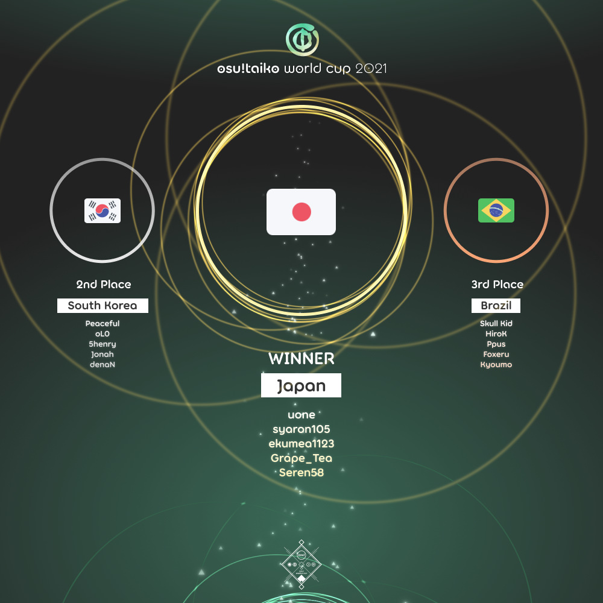

---
tags:
  - TWC
  - TWC2021
---

# osu!taiko World Cup 2021

The **osu!taiko World Cup 2021** (***TWC 2021***) was a country-based osu!taiko tournament hosted by the [osu! team](/wiki/People/The_Team). It was the eleventh instalment of the osu!taiko World Cup.

## Tournament schedule

| Event | Timestamp |
| --: | :-- |
| Registration phase | 2021-02-04/2021-02-18 |
| Live drawings | 2021-02-27 (14:00 UTC) |
| Group stage | 2021-03-06/2021-03-07 |
| Round of 16 | 2021-03-13/2021-03-14 |
| Quarterfinals | 2021-03-20/2021-03-21 |
| Semifinals | 2021-03-27/2021-03-28 |
| Finals week 1 | 2021-04-03/2021-04-04 |
| Finals week 2 | 2021-04-10/2021-04-11 |

## Prizes

| Placing | Prizes |
| :-: | :-- |
|  | $150 per team member, unique profile badge, *osu!taiko Champion* user title for one year |
|  | $80 per team member, unique profile badge |
|  | $40 per team member, unique profile badge |

  

## Organisation

The osu!taiko World Cup 2021 was run by various community members.

| Position | Member(s) |
| :-- | :-- |
| Manager | ![][flag_AR] [juankristal](https://osu.ppy.sh/users/443656), ![][flag_CL] [WalterToro](https://osu.ppy.sh/users/5281416) |
| Mappool selector | ![][flag_US] [Backfire](https://osu.ppy.sh/users/263110), ![][flag_US] [incandescence](https://osu.ppy.sh/users/6256027), ![][flag_AU] [Jaye](https://osu.ppy.sh/users/4841352), ![][flag_GB] [mangomizer](https://osu.ppy.sh/users/1893718), ![][flag_JP] [\_Rise](https://osu.ppy.sh/users/5217107) |
| Commentator | ![][flag_US] [Backfire](https://osu.ppy.sh/users/263110), ![][flag_AU] [Beat43210](https://osu.ppy.sh/users/5664171), ![][flag_US] [Dohland](https://osu.ppy.sh/users/5220511), ![][flag_US] [Ethaaaan](https://osu.ppy.sh/users/9536977), ![][flag_US] [incandescence](https://osu.ppy.sh/users/6256027), ![][flag_CA] [janitore](https://osu.ppy.sh/users/3307897), ![][flag_GB] [mangomizer](https://osu.ppy.sh/users/1893718), ![][flag_US] [Mister Boo](https://osu.ppy.sh/users/2598555), ![][flag_DE] [Nwolf](https://osu.ppy.sh/users/1910766), ![][flag_GB] [Teezel](https://osu.ppy.sh/users/7528639), ![][flag_AR] [Vaf](https://osu.ppy.sh/users/12589048), ![][flag_DE] [Zetera](https://osu.ppy.sh/users/587737) |
| Referee | ![][flag_ES] [Deif](https://osu.ppy.sh/users/318565), ![][flag_AU] [Fairy Bread](https://osu.ppy.sh/users/8306102), ![][flag_US] [JDrago14](https://osu.ppy.sh/users/7690078), ![][flag_BR] [LeoFLT](https://osu.ppy.sh/users/3668779), ![][flag_NL] [nik](https://osu.ppy.sh/users/10077264), ![][flag_DE] [p3n](https://osu.ppy.sh/users/123703), ![][flag_US] [tigereyes144](https://osu.ppy.sh/users/6499811), ![][flag_CL] [WalterToro](https://osu.ppy.sh/users/5281416), ![][flag_GB] [Yazzehh](https://osu.ppy.sh/users/7068973) |
| Statistician | ![][flag_BR] [LeoFLT](https://osu.ppy.sh/users/3668779), ![][flag_DE] [Nwolf](https://osu.ppy.sh/users/1910766) |

## Links

- [Discussion thread](https://osu.ppy.sh/community/forums/topics/1241159)
- [Livestream](https://www.twitch.tv/osulive)
- [Challonge bracket](https://challonge.com/TWC_2021)
- [Pick'ems page](https://pickem.hwc.hr/tournaments/53) hosted by ![][flag_DE] [hallowatcher](https://osu.ppy.sh/users/1874761)
- **[Statistics sheet](https://docs.google.com/spreadsheets/d/e/2PACX-1vTImDZNlIdekerlWWr-TR82GKRflboYOcu3ZEqqeTuaSKQfOuY5WO2rS8p5lPjbvtZ5xZdY_iVGNcTI/pubhtml)**

## Participants

|  | Country | Members |
| :-: | :-: | :-- |
| ![][flag_AR] | **Argentina** | **[gaston\_2199](https://osu.ppy.sh/users/5938161)**, [Reficul](https://osu.ppy.sh/users/1506011), [\_Doodle\_](https://osu.ppy.sh/users/5427801), [Axer](https://osu.ppy.sh/users/7299864), [trollocat](https://osu.ppy.sh/users/9228032) |
| ![][flag_AU] | **Australia** | **[Beat43210](https://osu.ppy.sh/users/5664171)**, [Tsubasa2](https://osu.ppy.sh/users/6835183), [Zippywin](https://osu.ppy.sh/users/7269844), [AmateurMonkeyYT](https://osu.ppy.sh/users/8379046), [r1chyy](https://osu.ppy.sh/users/11499467) |
| ![][flag_AT] | **Austria** | **[animexamera](https://osu.ppy.sh/users/7511357)**, [Cupcake\_Lover](https://osu.ppy.sh/users/1776389), [Mina\_yo](https://osu.ppy.sh/users/2678422), [morth1](https://osu.ppy.sh/users/7246874) |
| ![][flag_BR] | **Brazil** | **[Skull Kid](https://osu.ppy.sh/users/3044264)**, [HiroK](https://osu.ppy.sh/users/4050738), [Ppus](https://osu.ppy.sh/users/5918857), [Foxeru](https://osu.ppy.sh/users/7479684), [Kyoumo](https://osu.ppy.sh/users/8145223) |
| ![][flag_CA] | **Canada** | **[Nanners](https://osu.ppy.sh/users/459886)**, [beary605](https://osu.ppy.sh/users/2198070), [honkers](https://osu.ppy.sh/users/3075337), [janitore](https://osu.ppy.sh/users/3307897), [vysha](https://osu.ppy.sh/users/4908773) |
| ![][flag_CL] | **Chile** | **[Catulus](https://osu.ppy.sh/users/6276709)**, [Necromancy-](https://osu.ppy.sh/users/1890084), [daikiu](https://osu.ppy.sh/users/4232665), [Shiny Froakie](https://osu.ppy.sh/users/6194830), [Chieri\_](https://osu.ppy.sh/users/10268533) |
| ![][flag_CN] | **China** | **[Blastix Riotz](https://osu.ppy.sh/users/5310623)**, [Ookura Risona](https://osu.ppy.sh/users/2073644), [OtakusRin](https://osu.ppy.sh/users/3383404), [puweijie](https://osu.ppy.sh/users/4845848), [Michaelonl](https://osu.ppy.sh/users/12480076) |
| ![][flag_CO] | **Colombia** | **[L1ght](https://osu.ppy.sh/users/9050875)**, [sti](https://osu.ppy.sh/users/1271807), [Madsri](https://osu.ppy.sh/users/6260841), [Hermite](https://osu.ppy.sh/users/7945286), [Jekuru](https://osu.ppy.sh/users/11727492) |
| ![][flag_CR] | **Costa Rica** | **[puijela](https://osu.ppy.sh/users/12687433)**, [Hotman](https://osu.ppy.sh/users/7902082), [JostRc3](https://osu.ppy.sh/users/11211959) |
| ![][flag_FI] | **Finland** | **[duski](https://osu.ppy.sh/users/6506484)**, [vodnanen](https://osu.ppy.sh/users/10335557), [Antti](https://osu.ppy.sh/users/13281473), [MEGAMELA](https://osu.ppy.sh/users/13613362) |
| ![][flag_FR] | **France** | **[Ectomic](https://osu.ppy.sh/users/4069690)**, [Fraolinch](https://osu.ppy.sh/users/205257), [Ekoro](https://osu.ppy.sh/users/284905), [Gintoki8](https://osu.ppy.sh/users/2239411), [Ranshi](https://osu.ppy.sh/users/6680785) |
| ![][flag_DE] | **Germany** | **[frz](https://osu.ppy.sh/users/6956922)**, [xMrtn-](https://osu.ppy.sh/users/866297), [Xayphon](https://osu.ppy.sh/users/961417), [Mew](https://osu.ppy.sh/users/2345156), [Minekuchi](https://osu.ppy.sh/users/9584873) |
| ![][flag_ID] | **Indonesia** | **[apaajaboleh10](https://osu.ppy.sh/users/5151647)**, [WhiteSnowAngel](https://osu.ppy.sh/users/3866964), [Volta](https://osu.ppy.sh/users/4154071), [Katdon\_donKat](https://osu.ppy.sh/users/8089664), [Kaemz](https://osu.ppy.sh/users/8494233) |
| ![][flag_IT] | **Italy** | **[Ikkun](https://osu.ppy.sh/users/1059945)**, [coed](https://osu.ppy.sh/users/3716665), [LordEnder](https://osu.ppy.sh/users/4609767), [D3kuu](https://osu.ppy.sh/users/7807444), [A-40](https://osu.ppy.sh/users/14510301) |
| ![][flag_JP] | **Japan** | **[uone](https://osu.ppy.sh/users/5321719)**, [syaron105](https://osu.ppy.sh/users/8741695), [ekumea1123](https://osu.ppy.sh/users/9119501), [Grape_Tea](https://osu.ppy.sh/users/9540073), [Seren58](https://osu.ppy.sh/users/15252950) |
| ![][flag_MY] | **Malaysia** | **[Jerry](https://osu.ppy.sh/users/605973)**, [Xeltic Rival](https://osu.ppy.sh/users/7500364), [\[Zeth\]](https://osu.ppy.sh/users/9912966), [6gicha](https://osu.ppy.sh/users/12273160), [HHVanilla Ice](https://osu.ppy.sh/users/12803930) |
| ![][flag_MX] | **Mexico** | **[Ammy](https://osu.ppy.sh/users/4183406)**, [xtrem3x](https://osu.ppy.sh/users/136385), [ZaveryK](https://osu.ppy.sh/users/10913397), [Kenrit-San](https://osu.ppy.sh/users/13054150), [-chocoflan-](https://osu.ppy.sh/users/15776151) |
| ![][flag_NL] | **Netherlands** | **[Cookie_Tree](https://osu.ppy.sh/users/502722)**, [StrijkIjzer](https://osu.ppy.sh/users/4130926), [wen294](https://osu.ppy.sh/users/2265974), [lukitsa124](https://osu.ppy.sh/users/8787678), [Boaz](https://osu.ppy.sh/users/13302996) |
| ![][flag_NZ] | **New Zealand** | **[Sparxe](https://osu.ppy.sh/users/5750235)**, [Bwhaa](https://osu.ppy.sh/users/7960435), [arley\_](https://osu.ppy.sh/users/9039824), [Blujae](https://osu.ppy.sh/users/10613885) |
| ![][flag_PH] | **Philippines** | **[Pochacco](https://osu.ppy.sh/users/2927742)**, [Fynbi](https://osu.ppy.sh/users/2164993), [jmeh07](https://osu.ppy.sh/users/2852269), [Rimazii](https://osu.ppy.sh/users/3831514), [Aiery](https://osu.ppy.sh/users/10363380) |
| ![][flag_PL] | **Poland** | **[bernard351](https://osu.ppy.sh/users/9511518)**, [Tetsurio](https://osu.ppy.sh/users/2044810), [boyan](https://osu.ppy.sh/users/2302140), [Eeveelution](https://osu.ppy.sh/users/8438068), [vethreal](https://osu.ppy.sh/users/12067316) |
| ![][flag_PT] | **Portugal** | **[BabySnakes](https://osu.ppy.sh/users/4669728)**, [Shinzui](https://osu.ppy.sh/users/2505011), [MeovvCAT](https://osu.ppy.sh/users/5905091), [N1tro321](https://osu.ppy.sh/users/7385703), [ninjatory3](https://osu.ppy.sh/users/11429256) |
| ![][flag_RU] | **Russian Federation** | **[Akonine](https://osu.ppy.sh/users/7774222)**, [Den4ik228](https://osu.ppy.sh/users/7115174), [Nozdormu](https://osu.ppy.sh/users/7169208), [TwinT](https://osu.ppy.sh/users/9976154), [night\_flower](https://osu.ppy.sh/users/11574707) |
| ![][flag_SG] | **Singapore** | **[Prehistoria](https://osu.ppy.sh/users/8364237)**, [tzechi](https://osu.ppy.sh/users/4662795), [Blerargh](https://osu.ppy.sh/users/7609510), [\_gt](https://osu.ppy.sh/users/8301957), [awdse22](https://osu.ppy.sh/users/8743513) |
| ![][flag_KR] | **South Korea** | **[Peaceful](https://osu.ppy.sh/users/165027)**, [oL0](https://osu.ppy.sh/users/1134683), [5henry](https://osu.ppy.sh/users/3337332), [Jonah](https://osu.ppy.sh/users/5509009), [denaN](https://osu.ppy.sh/users/10894640) |
| ![][flag_CH] | **Switzerland** | **[MC2BP](https://osu.ppy.sh/users/11296097)**, [Zero1519](https://osu.ppy.sh/users/547957), [Upgradefort](https://osu.ppy.sh/users/7184619) |
| ![][flag_TW] | **Taiwan** | **[monkeydluffy3u4](https://osu.ppy.sh/users/2277798)**, [b006089010](https://osu.ppy.sh/users/673542), [seanhappy8520](https://osu.ppy.sh/users/949455), [Yuemiao](https://osu.ppy.sh/users/4493348), [CheeseStingy](https://osu.ppy.sh/users/16462012) |
| ![][flag_TH] | **Thailand** | **[Ponamis](https://osu.ppy.sh/users/7897892)**, [ConieSan](https://osu.ppy.sh/users/2035344), [Raytoly](https://osu.ppy.sh/users/8121109), [Ph0eNiiXZ](https://osu.ppy.sh/users/9463721), [KappuChinooo](https://osu.ppy.sh/users/9582525) |
| ![][flag_TR] | **Turkey** | **[frukoyurdakul](https://osu.ppy.sh/users/7612550)**, [NeuralG](https://osu.ppy.sh/users/13811400) |
| ![][flag_GB] | **United Kingdom** | **[Horiiizon](https://osu.ppy.sh/users/8071438)**, [\_DUSK\_](https://osu.ppy.sh/users/6092181), [Teezel](https://osu.ppy.sh/users/7528639), [B0tch3d](https://osu.ppy.sh/users/9864847), [Daniels](https://osu.ppy.sh/users/12439209) |
| ![][flag_US] | **United States** | **[Loopy542](https://osu.ppy.sh/users/5468461)**, [cheese salad](https://osu.ppy.sh/users/6349821), [R J](https://osu.ppy.sh/users/6490509), [3san](https://osu.ppy.sh/users/8050850), [ChurroChef](https://osu.ppy.sh/users/9258564) |
| ![][flag_VN] | **Vietnam** | **[davidminh0111](https://osu.ppy.sh/users/9623142)**, [\_Kuroni\_](https://osu.ppy.sh/users/6159305), [-BunZ-](https://osu.ppy.sh/users/7556673), [SaraSoul](https://osu.ppy.sh/users/13493346) |

## Podium

## Mappools

### Grand Finals

- NoMod
  - [Kobaryo - Rainbow Freeze (1RoHa\_) \[Nube Oni\]](https://osu.ppy.sh/beatmapsets/673392#taiko/1425158)
  - [REDALiCE vs MASAKI - BUCHiGiRE Berserker (Long ver) (Firce777) \[Firce777's Taiko (TWC ver.)\]](https://osu.ppy.sh/beatmapsets/1422679#taiko/2929979)
  - [Kobaryo - Kumo No Kireme [feat. Kourin.] (Sayaka-) \[Infinite Apocalypse\]](https://osu.ppy.sh/beatmapsets/370678#taiko/906962)
  - [Beneath The Massacre - Absurd Hero (Heaxys) \[TWC 2021 Grandfinals - NM4\]](https://osu.ppy.sh/beatmapsets/1422657#taiko/2929952)
  - [Rahatt - Matusa Bomber (nananass) \[nas\]](https://osu.ppy.sh/beatmapsets/1336341#taiko/2928466)
  - [Dz'Xa - Izumi 7983 (Ulqui) \[COLLAPSING MINDS\]](https://osu.ppy.sh/beatmapsets/1422684#taiko/2929985)
- Hidden
  - [Her Bright Skies - The Glorious (Final Sketch Remix) (tasuke912) \[TAIKO-HOLIC\]](https://osu.ppy.sh/beatmapsets/750181#taiko/1579882)
  - [Blotted Science - Cretaceous Chasm (Mew) \[Inevitable Extinction\]](https://osu.ppy.sh/beatmapsets/1422697#taiko/2930004)
- HardRock
  - [antiPLUR - Speed of Link (Skull Kid) \[Special\]](https://osu.ppy.sh/beatmapsets/477116#taiko/1019139)
  - [Camellia - KillerBeast (Capu) \[Inner Oni\]](https://osu.ppy.sh/beatmapsets/1069639#taiko/2239078)
- DoubleTime
  - [Remo Prototype[CV: Hanamori Yumiri] - Sendan Life (Y O U T A) \[Inner Oni\]](https://osu.ppy.sh/beatmapsets/395660#taiko/861023)
  - [Sota Fujimori - Transport -Extended Mix- (Raiden) \[Inner Oni\]](https://osu.ppy.sh/beatmapsets/742538#taiko/1566143)
- FreeMod
  - [Neko Kanimaru - Hidamari no Machi - A! (PING) \[AHA!\]](https://osu.ppy.sh/beatmapsets/600477#taiko/2929588)
  - [II-L - VANGUARD-2 (Faputa) \[TRAILBLAZING\]](https://osu.ppy.sh/beatmapsets/1422686#taiko/2929992)
  - [Camellia - Flamewall (Cut Ver.) (\_mtk) \[ETERNAL FLAME\]](https://osu.ppy.sh/beatmapsets/1422689#taiko/2929995)
- Tiebreaker
  - **[TWC Sound Team "Zeroth Powers" - One One (Firce777) \[BLOOD GOD FEAR\]](https://osu.ppy.sh/beatmapsets/1422682#taiko/2929983)**

### Finals

- NoMod
  - [Camellia - SCREW // owo // SCREW (roufou) \[Hell Oni\]](https://osu.ppy.sh/beatmapsets/1230293#taiko/2557747)
  - [Metaroom - Angel (Genjuro) \[Taiko Oni\]](https://osu.ppy.sh/beatmapsets/1415961#taiko/2918088)
  - [Colorful Sounds Port - ETERNAL DRAIN (\_yu68) \[DX\]](https://osu.ppy.sh/beatmapsets/573197#taiko/1214311)
  - [DubscribeS - Blood Rave (Final Sketch Remix) (tasuke912) \[TAIKO-HOLiC\]](https://osu.ppy.sh/beatmapsets/523630#taiko/1111605)
  - [Camellia - \*Feels Seasickness...\* (Firce777) \[Firce777's Taiko\]](https://osu.ppy.sh/beatmapsets/958050#taiko/2005989)
  - [Lazhward - CFIT (-Kazu-) \[Bicolor Airline\]](https://osu.ppy.sh/beatmapsets/1273664#taiko/2724417)
- Hidden
  - [YUTO - Theory (te2035) \[LEGGENDARIA Oni\]](https://osu.ppy.sh/beatmapsets/1187561#taiko/2483087)
  - [Cranky - R176 (7\_7 Remix) (7\_7) \[Oni\]](https://osu.ppy.sh/beatmapsets/1416001#taiko/2918150)
- HardRock
  - [Camellia as "Bang Riot" - Blastix Riotz (Nwolf) \[WereOni\]](https://osu.ppy.sh/beatmapsets/351644#taiko/774996)
  - [Silentroom - F1055 (HiroK) \[Flowness\]](https://osu.ppy.sh/beatmapsets/1224716#taiko/2547165)
- DoubleTime
  - [DragonForce - Symphony of the Night (Raiden) \[Tatsujin\]](https://osu.ppy.sh/beatmapsets/555073#taiko/1174919)
  - [cillia - Ringo Uri no Utakata Shoujo (mintong89) \[Ringo Oni\]](https://osu.ppy.sh/beatmapsets/398423#taiko/866288)
- FreeMod
  - [Groovecube - How Are You (cdhsausageboy) \[I'm Die, Thank You Forever.\]](https://osu.ppy.sh/beatmapsets/1415947#taiko/2918060)
  - [Culprate & Dictate - Pencilina (KyouRekii87) \[Taiko-K-2\]](https://osu.ppy.sh/beatmapsets/1097657#taiko/2911497)
  - [Hatsune Miku - boku-boku (Lan wings) \[Ishida's Hell Taiko\]](https://osu.ppy.sh/beatmapsets/51611#taiko/176945)
- Tiebreaker
  - **[Mori Calliope - Excuse My Rudeness, But Could You Please RIP (ReeK's "Dude Whats A Genre" Remix) (Cynplytholowazy) \[Pardon My Insolence, But Could You Please Enjoy Capushellowazy's Taiko Flavor?\]](https://osu.ppy.sh/beatmapsets/1415979#taiko/2918121)**

### Semifinals

- NoMod
  - [TAROLIN - world.[NOT].excuse(nxc); (applerss) \[world.execute(me);\]](https://osu.ppy.sh/beatmapsets/724063#taiko/1528895)
  - [.alucard - Dream Chamber (Socus) \[#unavoidable_nihil\]](https://osu.ppy.sh/beatmapsets/1408782#taiko/2904953)
  - [rerulili - Noushou Sakuretsu Girl (Consified) \[twc feat. consified\]](https://osu.ppy.sh/beatmapsets/1408783#taiko/2904882)
  - [Hideous Divinity - When Flesh Unfolds (frukoyurdakul) \[Merciless Oni\]](https://osu.ppy.sh/beatmapsets/1408767#taiko/2904856)
  - [phonon - polyriddim (GNKait) \[Hell Oni\]](https://osu.ppy.sh/beatmapsets/1272221#taiko/2643612)
  - [leroy - ricky bobby (Ulqui) \[HYPERVENTILATION\]](https://osu.ppy.sh/beatmapsets/1408768#taiko/2904857)
- Hidden
  - [Kobaryo - SEITEN NO TERIYAKI (Backfire) \[Taikocalypse\]](https://osu.ppy.sh/beatmapsets/1408776#taiko/2904868)
  - [Crimsona - Hyper Fiber World Spectrum (4sbet1) \[Collab Oni (TWC Edit)\]](https://osu.ppy.sh/beatmapsets/1405771#taiko/2904878)
- HardRock
  - [Kurokotei - Serphut (Nifty) \[Oni\]](https://osu.ppy.sh/beatmapsets/1408888#taiko/2905127)
  - [Katagiri - Track 40 (rezi888) \[230mP\]](https://osu.ppy.sh/beatmapsets/1408775#taiko/2904867)
- DoubleTime
  - [Anamanaguchi - Blackout City (Sushi) \[Taiko Inner Oni\]](https://osu.ppy.sh/beatmapsets/67226#taiko/195478)
  - [Infected Mushroom - Spitfire (yea) \[Attack\]](https://osu.ppy.sh/beatmapsets/880548#taiko/1841309)
- FreeMod
  - [sak respect for Arata Iiyoshi - Reason of being (D o t) \[tasuke's Upheaval\]](https://osu.ppy.sh/beatmapsets/809965#taiko/1733315)
  - [Shiron - Deadly Dolly Dance (Nardoxyribonucleic) \[Inner Oni\]](https://osu.ppy.sh/beatmapsets/1408773#taiko/2904864)
  - [DJ Sharpnel - Gate Openerz (LZD) \[Inner Oni\]](https://osu.ppy.sh/beatmapsets/1408781#taiko/2904879)
- Tiebreaker
  - **[Dz'Xa - RAGECONTROLEX (tasuke912) \[Oni\]](https://osu.ppy.sh/beatmapsets/1408772#taiko/2904863)**

### Quarterfinals

- NoMod
  - [MisoilePunch - Fin.ArcDeaR (OzzyOzrock) \[End.OniDrum\]](https://osu.ppy.sh/beatmapsets/731630#taiko/1543921)
  - [Dz'Xa - 8284-TM (uone) \[Inner Oni\]](https://osu.ppy.sh/beatmapsets/1335803#taiko/2767410)
  - [38 Ban - Milk Crown on Sonnetica (\_Rise) \[Hell Oni\]](https://osu.ppy.sh/beatmapsets/1349766#taiko/2794625)
  - [hana@\*omori - Seimei no wa wo tsumuide (Ozu) \[F Inner Oni (TWC Ver.)\]](https://osu.ppy.sh/beatmapsets/707622#taiko/2893294)
  - [EZFG - Bluff Liar (Nwolf) \[Fake Oni\]](https://osu.ppy.sh/beatmapsets/1402191#taiko/2892727)
- Hidden
  - [sasakure.UK - Xlo (zkane2) \[irregular time signature\]](https://osu.ppy.sh/beatmapsets/1402226#taiko/2892771)
  - [Inspector K - Disconnected Hardkore (CanBlaster Remix) (Zetera) \[Ura Dial\]](https://osu.ppy.sh/beatmapsets/1402214#taiko/2892755)
- HardRock
  - [Memme - Platina (Naryuga) \[Inner Oni\]](https://osu.ppy.sh/beatmapsets/1402927#taiko/2893927)
  - [Fleshgod Apocalypse - Pathfinder (Raiden) \[Terror Oni\]](https://osu.ppy.sh/beatmapsets/454951#taiko/975271)
- DoubleTime
  - [HyuN - Grin (radar) \[when the when\]](https://osu.ppy.sh/beatmapsets/1402385#taiko/2893024)
  - [Nanahoshi Kangengakudan - IMAGINARY LIKE THE JUSTICE (Nardoxyribonucleic) \[Oni\]](https://osu.ppy.sh/beatmapsets/312658#taiko/697898)
- FreeMod
  - [Brymir - Nephilim (DarkVortex) \[Inner Oni\]](https://osu.ppy.sh/beatmapsets/727270#taiko/1535391)
  - [Yu_Asahina - Gianduja (Alchyr) \[Oni\]](https://osu.ppy.sh/beatmapsets/1402196#taiko/2892733)
  - [ARM - Rhododendron (tasuke912) \[Oni\]](https://osu.ppy.sh/beatmapsets/386620#taiko/844135)
- Tiebreaker
  - **[Toby Fox/Toby Fox (remixed by Camellia) - MEGALOVANIA (Camellia Remix) (7\_7) \[7oni\]](https://osu.ppy.sh/beatmapsets/1042172#taiko/2892022)**

### Round of 16

- NoMod
  - [Electric Music Department (Jingumae Sando Academy) - Hyper Bass Feat. Yunomi (7\_7 bootleg) (EJ\_\_) \[sv\]](https://osu.ppy.sh/beatmapsets/1351301#taiko/2797899)
  - [T-HEY - the Chameleon (femboy mapper) \[Hell Oni\]](https://osu.ppy.sh/beatmapsets/1395289#taiko/2880037)
  - [Neko Hacker - Aimai Cyborg (feat. Ugokuchan & JungMato) (KinomiCandy) \[Ambiguous Oni (TWC Ver.)\]](https://osu.ppy.sh/beatmapsets/1343645#taiko/2782966)
  - [Carnifex - Dark Days (Grimbow) \[Eclipse V2\]](https://osu.ppy.sh/beatmapsets/1238818#taiko/2879952)
  - [fn(ArcaeaSoundTeam) - Red and Blue and Green (HiroK) \[Inner Oni\]](https://osu.ppy.sh/beatmapsets/1209776#taiko/2518712)
- Hidden
  - [Nekomata Master+ - AFRO KNUCKLE (femboy mapper) \[Samba Oni\]](https://osu.ppy.sh/beatmapsets/1395286#taiko/2880034)
  - [TUYU - Anoyo-iki no Bus ni Notte Saraba. (\_Rise) \[Inner Oni (Edit)\]](https://osu.ppy.sh/beatmapsets/1216596#taiko/2879910)
- HardRock
  - [96-glass - You're my everything (te2035) \[breakcore is my everything but twc not\]](https://osu.ppy.sh/beatmapsets/1324528#taiko/2879954)
  - [Whispered - Unrestrained (LZD) \[Inner Oni\]](https://osu.ppy.sh/beatmapsets/569779#taiko/1207835)
- DoubleTime
  - [SECONDWALL - Light (Volta) \[Oni\]](https://osu.ppy.sh/beatmapsets/1318825#taiko/2733144)
  - [Infected Mushroom - Kipod (Hanjamon) \[Inner Oni\]](https://osu.ppy.sh/beatmapsets/305394#taiko/683991)
- FreeMod
  - [taigat - plAnet (CANTAX Remix) (ekumea1123) \[Inner Oni\]](https://osu.ppy.sh/beatmapsets/1157104#taiko/2414712)
  - [owl\*tree feat.chi\*tree - Valsqotch (hoku) \[TWC Flutter ^-^\]](https://osu.ppy.sh/beatmapsets/1395252#taiko/2879960)
  - [Frums - Zephyrs (SKSalt) \[Inner Oni\]](https://osu.ppy.sh/beatmapsets/1395165#taiko/2879802)
- Tiebreaker
  - **[ulko - REGGAETON BUT IT HAS AMEN BREAKS (D3kuu) \[TATSUJIN\]](https://osu.ppy.sh/beatmapsets/1013247#taiko/2120869)**

### Group stage

- NoMod
  - [Noisia - Anomaly (maziari1105) \[Insane\]](https://osu.ppy.sh/beatmapsets/1222464#taiko/2542673)
  - [uma vs. Morimori Atsushi - Re:End of a Dream (incandescence) \[Resolution\]](https://osu.ppy.sh/beatmapsets/1286433#taiko/2865224)
  - [Aitsuki Nakuru & Kabocha - Lilith (Nwolf) \[Demon\]](https://osu.ppy.sh/beatmapsets/1387180#taiko/2865215)
  - [IAHN - Parasite (Original Mix) (iceOC) \[Parasitized Dog\]](https://osu.ppy.sh/beatmapsets/1387184#taiko/2865222)
- Hidden
  - [Makai Toshi Niigata - Ukiyo-e Yokocho (HiroK) \[Inner Oni (TWC ver.)\]](https://osu.ppy.sh/beatmapsets/839452#taiko/2865277)
  - [Street - Reincarnation (eiri-) \[Inner Oni\]](https://osu.ppy.sh/beatmapsets/1279224#taiko/2657263)
- HardRock
  - [Zekk - Libertas (\_DUSK\_) \[Inner Oni\]](https://osu.ppy.sh/beatmapsets/1001338#taiko/2096131)
  - [Sophie Twilight , Akari Amano, Hinata Natsuki, Erie - +Kyutie Ladies+ (DJ Mii-ko Remix) (KawaiiBass) \[Cute Vampire\]](https://osu.ppy.sh/beatmapsets/1313424#taiko/2722104)
- DoubleTime
  - [USAO - Chariot (Extended Mix) (aabc271) \[Inner Oni\]](https://osu.ppy.sh/beatmapsets/1387259#taiko/2865337)
  - [hololive IDOL PROJECT - SHIJOSHUGI ADTRUCK (Maimaing) \[Oning\]](https://osu.ppy.sh/beatmapsets/1387197#taiko/2865248)
- FreeMod
  - [Niwashi+Aoi - Nostalgic Lostlogic (kei821) \[Inner Oni\]](https://osu.ppy.sh/beatmapsets/883344#taiko/1846563)
  - [KAH - energy trixxx (Faputa) \[Master\]](https://osu.ppy.sh/beatmapsets/1387222#taiko/2865276)
  - [Equilibrium - Rise Again (LZD) \[Inner Oni TWC ver.\]](https://osu.ppy.sh/beatmapsets/645370#taiko/2865284)
- Tiebreaker
  - **[NIWASHI - Playing with Ruby (goheegy) \[Inner Oni\]](https://osu.ppy.sh/beatmapsets/835717#taiko/2865258)**

## Match results

### Grand Finals

Sunday, 11 April 2021:

| Team 1 |  |  | Team 2 | Match link |
| --: | :-: | :-: | :-- | :-- |
| **Brazil** ![][flag_BR] | 3 | **7** | ![][flag_KR] South Korea | [#1](https://osu.ppy.sh/community/matches/80529663) |
| **Japan** ![][flag_JP] | **7** | 1 | ![][flag_KR] South Korea | [#1](https://osu.ppy.sh/community/matches/80546558) |

### Finals

Saturday, 3 April 2021:

| Team 1 |  |  | Team 2 | Match link |
| --: | :-: | :-: | :-- | :-- |
| **South Korea** ![][flag_KR] | **7** | 2 | ![][flag_SG] Singapore | [#1](https://osu.ppy.sh/community/matches/79834055) |
| Argentina ![][flag_AR] | 0 | **7** | ![][flag_CA] **Canada** | [#1](https://osu.ppy.sh/community/matches/79871567) |

Sunday, 4 April 2021:

| Team 1 |  |  | Team 2 | Match link |
| --: | :-: | :-: | :-- | :-- |
| Canada ![][flag_CA] | 1 | **7** | ![][flag_KR] **South Korea** | [#1](https://osu.ppy.sh/community/matches/79899853) |
| Brazil ![][flag_BR] | 1 | **7** | ![][flag_JP] **Japan** | [#1](https://osu.ppy.sh/community/matches/79949196) |

### Semifinals

Saturday, 27 March 2021:

| Team 1 |  |  | Team 2 | Match link |
| --: | :-: | :-: | :-- | :-- |
| **Singapore** ![][flag_SG] | **7** | 5 | ![][flag_TW] Taiwan | [#1](https://osu.ppy.sh/community/matches/79197123) |
| **Italy** ![][flag_IT] | **7** | 0 | ![][flag_CN] China | [#1](https://osu.ppy.sh/community/matches/79203211) |
| **Canada** ![][flag_CA] | **7** | 0 | ![][flag_ID] Indonesia | [#1](https://osu.ppy.sh/community/matches/79210161) |
| **United States** ![][flag_US] | **7** | 6 | ![][flag_DE] Germany | [#1](https://osu.ppy.sh/community/matches/79232333) |
| **Brazil** ![][flag_BR] | **7** | 1 | ![][flag_AR] Argentina | [#1](https://osu.ppy.sh/community/matches/79244750) |

Sunday, 28 March 2021:

| Team 1 |  |  | Team 2 | Match link |
| --: | :-: | :-: | :-- | :-- |
| South Korea ![][flag_KR] | 2 | **7** | ![][flag_JP] **Japan** | [#1](https://osu.ppy.sh/community/matches/79267151) |
| Italy ![][flag_IT] | 6 | **7** | ![][flag_SG] **Singapore** | [#1](https://osu.ppy.sh/community/matches/79298956) |
| United States ![][flag_US] | 2 | **7** | ![][flag_CA] **Canada** | [#1](https://osu.ppy.sh/community/matches/79334060) |

### Quarterfinals

Saturday, 20 March 2021:

| Team 1 |  |  | Team 2 | Match link |
| --: | :-: | :-: | :-- | :-- |
| Philippines ![][flag_PH] | 4 | **6** | ![][flag_CN] **China** | [#1](https://osu.ppy.sh/community/matches/78548578) |
| Malaysia ![][flag_MY] | 3 | **6** | ![][flag_DE] **Germany** | [#1](https://osu.ppy.sh/community/matches/78552131) |
| **Brazil** ![][flag_BR] | **6** | 1 | ![][flag_SG] Singapore | [#1](https://osu.ppy.sh/community/matches/78555915) |
| Italy ![][flag_IT] | 1 | **6** | ![][flag_AR] **Argentina** | [#1](https://osu.ppy.sh/community/matches/78581348) |

Sunday, 21 March 2021:

| Team 1 |  |  | Team 2 | Match link |
| --: | :-: | :-: | :-- | :-- |
| United States ![][flag_US] | 1 | **6** | ![][flag_JP] **Japan** | [#1](https://osu.ppy.sh/community/matches/78615570) |
| **South Korea** ![][flag_KR] | **6** | 5 | ![][flag_CA] Canada | [#1](https://osu.ppy.sh/community/matches/78619292) |
| Thailand ![][flag_TH] | 2 | **6** | ![][flag_ID] **Indonesia** | [#1](https://osu.ppy.sh/community/matches/78626428) |
| **Taiwan** ![][flag_TW] | **6** | 0 | ![][flag_PT] Portugal | [#1](https://osu.ppy.sh/community/matches/78649420) |

### Round of 16

Saturday, 13 March 2021:

| Team 1 |  |  | Team 2 | Match link |
| --: | :-: | :-: | :-- | :-- |
| Philippines ![][flag_PH] | 1 | **6** | ![][flag_KR] **South Korea** | [#1](https://osu.ppy.sh/community/matches/77952082) |
| Germany ![][flag_DE] | 5 | **6** | ![][flag_SG] **Singapore** | [#1](https://osu.ppy.sh/community/matches/77955289) |
| **Argentina** ![][flag_AR] | **6** | 4 | ![][flag_ID] Indonesia | [#1](https://osu.ppy.sh/community/matches/77959235) |
| **Brazil** ![][flag_BR] | **6** | 1 | ![][flag_MY] Malaysia | [#1](https://osu.ppy.sh/community/matches/77963937) |

Sunday, 14 March 2021:

| Team 1 |  |  | Team 2 | Match link |
| --: | :-: | :-: | :-- | :-- |
| China ![][flag_CN] | 0 | **6** | ![][flag_CA] **Canada** | [#1](https://osu.ppy.sh/community/matches/78023120) |
| Taiwan ![][flag_TW] | 1 | **6** | ![][flag_US] **United States** | [#1](https://osu.ppy.sh/community/matches/78026482) |
| Portugal ![][flag_PT] | 0 | **6** | ![][flag_JP] **Japan** | [#1](https://osu.ppy.sh/community/matches/78051556) |
| **Italy** ![][flag_IT] | **6** | 0 | ![][flag_TH] Thailand | [#1](https://osu.ppy.sh/community/matches/78059865) |

### Group stage

Saturday, 6 March 2021:

| Team 1 |  |  | Team 2 | Match link |
| --: | :-: | :-: | :-- | :-- |
| **Italy** ![][flag_IT] | **5** | 0 | ![][flag_NZ] New Zealand | [#1](https://osu.ppy.sh/community/matches/77352667) |
| **Taiwan** ![][flag_TW] | **5** | 1 | ![][flag_AU] Australia | [#1](https://osu.ppy.sh/community/matches/77354834) |
| **Germany** ![][flag_DE] | **5** | 1 | ![][flag_AU] Australia | [#1](https://osu.ppy.sh/community/matches/77358209) |
| **Thailand** ![][flag_TH] | **5** | 0 | ![][flag_PL] Poland | [#1](https://osu.ppy.sh/community/matches/77357411) |
| France ![][flag_FR] | 2 | **5** | ![][flag_CN] **China** | [#1](https://osu.ppy.sh/community/matches/77357454) |
| **Thailand** ![][flag_TH] | **5** | 3 | ![][flag_TR] Turkey | [#1](https://osu.ppy.sh/community/matches/77359879) |
| **Japan** ![][flag_JP] | **5** | 1 | ![][flag_FI] Finland | [#1](https://osu.ppy.sh/community/matches/77360103) |
| **South Korea** ![][flag_KR] | **5** | 2 | ![][flag_ID] Indonesia | [#1](https://osu.ppy.sh/community/matches/77363567) |
| **Netherlands** ![][flag_NL] | **5** | 0 | ![][flag_VN] Vietnam | [#1](https://osu.ppy.sh/community/matches/77366593) |
| **Japan** ![][flag_JP] | **5** | 1 | ![][flag_MY] Malaysia | [#1](https://osu.ppy.sh/community/matches/77366598) |
| **Indonesia** ![][flag_ID] | **5** | 0 | ![][flag_CO] Colombia | [#1](https://osu.ppy.sh/community/matches/77370481) |
| United Kingdom ![][flag_GB] | 3 | **5** | ![][flag_PT] **Portugal** | [#1](https://osu.ppy.sh/community/matches/77370473) |
| **Italy** ![][flag_IT] | **5** | 1 | ![][flag_FR] France | [#1](https://osu.ppy.sh/community/matches/77370179) |
| **Malaysia** ![][flag_MY] | **5** | 0 | ![][flag_CL] Chile | [#1](https://osu.ppy.sh/community/matches/77370451) |
| **Poland** ![][flag_PL] | **5** | 3 | ![][flag_TR] Turkey | [#1](https://osu.ppy.sh/community/matches/77375440) |
| **Germany** ![][flag_DE] | **5** | 0 | ![][flag_AT] Austria | [#1](https://osu.ppy.sh/community/matches/77375081) |
| **Argentina** ![][flag_AR] | **5** | 0 | ![][flag_RU] Russian Federation | [#1](https://osu.ppy.sh/community/matches/77375851) |
| **Canada** ![][flag_CA] | **5** | 0 | ![][flag_TR] Turkey | [#1](https://osu.ppy.sh/community/matches/77378963) |
| **Portugal** ![][flag_PT] | **5** | 1 | ![][flag_CH] Switzerland | [#1](https://osu.ppy.sh/community/matches/77378954) |
| **Finland** ![][flag_FI] | **5** | 2 | ![][flag_CL] Chile | [#1](https://osu.ppy.sh/community/matches/77384108) |
| **Canada** ![][flag_CA] | **5** | 0 | ![][flag_PL] Poland | [#1](https://osu.ppy.sh/community/matches/77383631) |
| **Brazil** ![][flag_BR] | **5** | 0 | ![][flag_CH] Switzerland | [#1](https://osu.ppy.sh/community/matches/77383848) |
| **United States** ![][flag_US] | **5** | 0 | ![][flag_NL] Netherlands | [#1](https://osu.ppy.sh/community/matches/77389214) |
| **Brazil** ![][flag_BR] | **5** | 1 | ![][flag_GB] United Kingdom | [#1](https://osu.ppy.sh/community/matches/77388556) |
| **Argentina** ![][flag_AR] | **5** | 0 | ![][flag_CR] Costa Rica | *win by default* |

Sunday, 7 March 2021:

| Team 1 |  |  | Team 2 | Match link |
| --: | :-: | :-: | :-- | :-- |
| **Mexico** ![][flag_MX] | **5** | 4 | ![][flag_CO] Colombia | [#1](https://osu.ppy.sh/community/matches/77416885) |
| **South Korea** ![][flag_KR] | **5** | 0 | ![][flag_CO] Colombia | [#1](https://osu.ppy.sh/community/matches/77421221) |
| **South Korea** ![][flag_KR] | **5** | 0 | ![][flag_MX] Mexico | [#1](https://osu.ppy.sh/community/matches/77423460) |
| **Canada** ![][flag_CA] | **5** | 1 | ![][flag_TH] Thailand | [#1](https://osu.ppy.sh/community/matches/77423467) |
| **Philippines** ![][flag_PH] | **5** | 0 | ![][flag_CR] Costa Rica | [#1](https://osu.ppy.sh/community/matches/77423390) |
| **United States** ![][flag_US] | **5** | 0 | ![][flag_SG] Singapore | [#1](https://osu.ppy.sh/community/matches/77423469) |
| **Indonesia** ![][flag_ID] | **5** | 0 | ![][flag_MX] Mexico | [#1](https://osu.ppy.sh/community/matches/77427027) |
| **United States** ![][flag_US] | **5** | 0 | ![][flag_VN] Vietnam | [#1](https://osu.ppy.sh/community/matches/77427193) |
| **France** ![][flag_FR] | **5** | 0 | ![][flag_NZ] New Zealand | [#1](https://osu.ppy.sh/community/matches/77441249) |
| **Australia** ![][flag_AU] | **5** | 4 | ![][flag_AT] Austria | [#1](https://osu.ppy.sh/community/matches/77443299) |
| **Singapore** ![][flag_SG] | **5** | 0 | ![][flag_VN] Vietnam | [#1](https://osu.ppy.sh/community/matches/77443362) |
| **China** ![][flag_CN] | **5** | 0 | ![][flag_NZ] New Zealand | [#1](https://osu.ppy.sh/community/matches/77443288) |
| **Taiwan** ![][flag_TW] | **5** | 0 | ![][flag_AT] Austria | [#1](https://osu.ppy.sh/community/matches/77448564) |
| **Italy** ![][flag_IT] | **5** | 1 | ![][flag_CN] China | [#1](https://osu.ppy.sh/community/matches/77448610) |
| **Philippines** ![][flag_PH] | **5** | 2 | ![][flag_RU] Russian Federation | [#1](https://osu.ppy.sh/community/matches/77448327) |
| **Singapore** ![][flag_SG] | **5** | 0 | ![][flag_NL] Netherlands | [#1](https://osu.ppy.sh/community/matches/77451684) |
| **Germany** ![][flag_DE] | **5** | 1 | ![][flag_TW] Taiwan | [#1](https://osu.ppy.sh/community/matches/77455069) |
| **Brazil** ![][flag_BR] | **5** | 1 | ![][flag_PT] Portugal | [#1](https://osu.ppy.sh/community/matches/77455070) |
| **Malaysia** ![][flag_MY] | **5** | 3 | ![][flag_FI] Finland | [#1](https://osu.ppy.sh/community/matches/77455016) |
| **Argentina** ![][flag_AR] | **5** | 3 | ![][flag_PH] Philippines | [#1](https://osu.ppy.sh/community/matches/77454922) |
| **United Kingdom** ![][flag_GB] | **5** | 1 | ![][flag_CH] Switzerland | [#1](https://osu.ppy.sh/community/matches/77455105) |
| **Russian Federation** ![][flag_RU] | **5** | 0 | ![][flag_CR] Costa Rica | [#1](https://osu.ppy.sh/community/matches/77454888) |
| **Japan** ![][flag_JP] | **5** | 0 | ![][flag_CL] Chile | [#1](https://osu.ppy.sh/community/matches/77458452) |

## Ruleset

### Tournament rules

1. The osu!taiko World Cup is a country-based team tournament, played on the osu!taiko game mode.
   - **While this competition is planned as a 2 versus 2 setup, this might change depending on the number of incoming registrations.**
2. Beatmap scoring is based on Score V2.
3. The maps for each round will be announced by the mapset selectors on Sunday before the actual matches take place. Only these will be used during the respective matches.
   - One map will be given as a tiebreaker map. This map will only be played in case of a tie.
   - There will also be a [Hidden](/wiki/Game_modifier/Hidden), [HardRock](/wiki/Game_modifier/Hard_Rock), [DoubleTime](/wiki/Game_modifier/Double_Time) and FreeMod bracket.
4. The match schedule will be settled by the Tournament Management (see above).
5. If no staff or referee is available, the match will be postponed.
6. Failed players' scores do not get added to the team score.
7. Use of the Visual Settings to alter background dim or disable map elements like storyboards and skins are allowed.
8. If the beatmap ends in a draw, the game will be nullified.
   - If a game is nullified, the beatmap will be replayed.
9. If a player disconnects, they get treated as if they failed the map.
   - Disconnects within the first 30 seconds of a beatmap can be rematched at the referee's discretion. The beatmap being played might be aborted for this.
   - **If a rematch happens, the roster for each team during that particular beatmap must remain the same. If that is not possible (the player who got disconnected can't get back in time) then both teams are allowed to swap rosters.**
10. Beatmaps cannot be reused in the same match unless the game was nullified.
11. If less than the minimum required players attend, the maximum time the match can be postponed is 10 minutes.
12. Exchanging players during a match is allowed without limitations.
13. Lag is not a valid reason to nullify a beatmap.
14. All players are supposed to keep the match running fluently and without delays. Excessive match delays coming from the player's side can be issued with penalties.
15. If a player disconnects between the beatmaps and the team can not provide an exchange, the match can be delayed 10 minutes at maximum.
16. All players and referees must be treated with respect. Instructions of the referees and tournament management are to be followed. Decisions labelled as final are not to be objected.
17. Disrupting the match by foul play, insulting and provoking other players or referees, delaying the match or other deliberate inappropriate misbehavior is strictly prohibited.
18. The multiplayer chatrooms underlie the [osu! community rules](/wiki/Rules). All chat rules apply to the multiplayer chatrooms, too.
    - Breaking the chat rules results in a silence. Silenced players can not participate in multiplayer matches and must be exchanged for the time being.
19. In the Group stage, 'Win by default' will be considered as win by 4:0, +1.0 score difference ratio.
20. Unexpected incidences are handled by the tournament management. Referees may allow higher tolerance depending on the given circumstances. This is up to their discretion.
21. Penalties for violating the tournament rules can be:
    - Exclusion of specific players for one map
    - Exclusion of specific players for an entire match
    - Declaring the match as Lost by Default
    - Disqualification from the entire tournament
    - Disqualification from the current and future official tournaments until appealed
    - Any modification of these rules will be announced.

### Tournament registration

1. Every user interested in joining their country's team signs up individually.
   - Tournament Management will create a list of potential candidates for a country's team.
   - Tournament Management declares one candidate to be the captain of the country's team, albeit temporarily.
   - The declared captain can form their team from the candidate list of their country.
2. To ensure valid and serious registrations, every registered user will be checked by the Tournament Management.
   - Every registered user will be assigned to their respective country's candidate list.
   - To be successfully accepted on the list, you have to ensure that your global osu!taiko performance ranking is above 5000.
   - To be successfully accepted on the list, you have to ensure that you did not violate the [osu! community rules](/wiki/Rules) within the last 12 months.
3. All successfully formed teams will be published after the Registration Phase.
4. Only the 32 potentially strongest countries will participate. The potential strength of a country is determined by the online statistics of all valid candidates.
   - If the amount of registered countries is below 32, the number might be reduced to 24, 20 or 16. The aim is always to let as many countries participate as possible!
5. Mapset selectors may not participate as players in this tournament.

### Stage instructions

1. In the first stage (Group Stage), the teams will be divided into 8 groups of 4 teams.

2. All the teams from each group will face each other.

3. Rankings of each group are determined by sorting the results of each team's performance in the following priority:
   - Most matches won.
   - Have higher `{(the number of beatmaps won) - (the number of beatmaps defeated)}`.
   - Most beatmaps won.
   - **Winner of the match played previously between the tied teams.**
   - In the event of a triple tie:
     - Have higher `∑{(total score difference) / (maximum score)}`.
     - Winner of the rematch.

4. The top 2 teams of each group will move on to the Knock-Out Stages.
   - This may change with the actual Group Stage setup.

5. The following stages are double elimination stages. This means that the winner moves to the next stage and the losing team gets moved to the Loser bracket.

6. Based on [this image](/wiki/shared/stages-visual.png), the stages are split up into the following:

   | Stage | Match ID |
   | --: | :-- |
   | Round of 16 | A, B, C, D, E, F, G, H |
   | Quarterfinals | I, J, K, L, R, S, T, U |
   | Semifinals | M, N, V, W, X, Y, Z, AA |
   | Finals | O, AB, AC, AD |
   | Grand Finals | AE, P, Q |

7. The **winning conditions** for each stage will be:
   - In Group Stage, you need to win 5 beatmaps to win a match. (Best-of-9)
   - In the Round of 16 and the Quarterfinals, you need to win 6 beatmaps to win a match. (Best-of-11)
   - In Semifinals, Finals and Grand Finals, you need to win 7 beatmaps to win a match. (Best-of-13)

### Match instructions

1. A referee will create a multiplayer room 15 minutes in advance. Players must gather during this period.
   - Room settings are osu!taiko, Team-Vs., Win Condition: 'ScoreV2'. Room name must be "TWC 2021: (TeamRed) vs (TeamBlue)".
   - The team mentioned first in the room name must be the red team, the team mentioned second in the room name must be the blue team.
2. Each captain has to ban **one beatmap** to be selected from the pool. These beatmaps are not allowed to be picked by any team in the entire match.
3. Beatmap selection will alternate between each captain selecting a beatmap out of the map pool.
4. Each captain must use `!roll` once in `#multiplayer`.
   - The winner of the `!roll` starts picking the first beatmap of the match.
   - The loser of the `!roll` starts banning one beatmap, followed by the winner of the `!roll` to ban a beatmap.
5. Captains may pick freely from any bracket.
   - In case of a tie, the tiebreaker map must be played.
6. Teams will have 2 minutes to pick a beatmap and 2 minutes to get ready.
   - In case a team takes more than 2 minutes to pick a map, they will recieve a warning from the referee, on subsequent occurrences the referee will pick a random map available to pick from the mappool using `!roll X`, where X is the number of available maps to pick in the mappool.
   - Each team will receive a "tactical timeout" of **two minutes**, which can be used at any time during their team's pick, **once per match**. *The tactical timeout is optional, and is not required to be used*.
7. Results of the Group Stage will be published via a Statistics sheet.

### Mappool instructions

1. There will be 1 mappool for the Group Stage, 1 mappool for the Round of 16, 1 mappool for the Quarterfinals, 1 mappool for the Semifinals, 1 mappool for the Finals and 1 mappool for the Grand Finals.
2. Each mappool consists of 5 brackets: NoMod, [Hidden](/wiki/Game_modifier/Hidden), [HardRock](/wiki/Game_modifier/Hard_Rock), [DoubleTime](/wiki/Game_modifier/Double_Time) and FreeMod.
3. The Group Stage mappool will consist of 14 maps, Round of 16 and Quarterfinals will consist of 15 maps, Semifinals, Finals and Grand Finals mappool will consist of 16 maps.
4. Each mappool has one tiebreaker.
5. The NoMod bracket will be played with no mods activated.
6. The Hidden, HardRock and DoubleTime bracket will be played with the respective mods activated.
7. The FreeMod bracket will have FreeMod activated. Every individual player can pick Hidden, HardRock or both.
   - When playing a FreeMod map, at least 1 player of each team must have at least one mod activated.
   - Players **must** select different mod combinations. Both players using only Hidden, only HardRock or Hidden+HardRock is disallowed.
8. The tiebreaker will be played under FreeMod conditions.
   - While playing the tiebreaker, players do not need to have a mod activated and are allowed to select the same mod combinations.
9. The size of the NoMod bracket will be 4 in Group Stage, 5 in Round of 16 and Quarterfinals and 6 for Semifinals, Finals and Grand Finals.
10. The size of the [Hidden](/wiki/Game_modifier/Hidden), [HardRock](/wiki/Game_modifier/Hard_Rock) and [DoubleTime](/wiki/Game_modifier/Double_Time) brackets will be 2 in all stages.
11. The size of the FreeMod brackets will be 3 in all stages.

### Scheduling instructions

1. Each stage will be held on **a single weekend**.
2. Matches in Group Stage may overlap.
3. All double elimination stages will be held on either Saturday or Sunday, UTC+0.
4. Scheduling will be handled by the Tournament Management. Schedules will be released on the Sunday before the first matches of the actual stage. Tournament Management will try to create the schedule to respect the participant's time zone.
   - In the stages Quarterfinals and higher: Please inform tournament management before Sunday, if you expect a specific time slot to be unavailable in the following week. Wishes are tried to be followed, alas no promises can be made.
5. **Reschedules will only be considered if both teams agree to a time, this needs to be done and notified to the tournament staff before Wednesday at 23:59 UTC+0 in that particular week when your match takes place.**
6. **Reschedules may only be requested by a team captain.**
   - **Do not ask for a reschedule unless it is absolutely needed. The tournament staff still has the right to decline the request.**
7. Captains are responsible for their team's availability. The greater team size exists to ensure every team can provide at least two players for each match. If teams can not provide two players for a match, the match will be considered forfeited.

[flag_AR]: /wiki/shared/flag/AR.gif "Argentina"
[flag_AT]: /wiki/shared/flag/AT.gif "Austria"
[flag_AU]: /wiki/shared/flag/AU.gif "Australia"
[flag_BR]: /wiki/shared/flag/BR.gif "Brazil"
[flag_CA]: /wiki/shared/flag/CA.gif "Canada"
[flag_CH]: /wiki/shared/flag/CH.gif "Switzerland"
[flag_CL]: /wiki/shared/flag/CL.gif "Chile"
[flag_CN]: /wiki/shared/flag/CN.gif "China"
[flag_CO]: /wiki/shared/flag/CO.gif "Colombia"
[flag_CR]: /wiki/shared/flag/CR.gif "Costa Rica"
[flag_DE]: /wiki/shared/flag/DE.gif "Germany"
[flag_ES]: /wiki/shared/flag/ES.gif "Spain"
[flag_FI]: /wiki/shared/flag/FI.gif "Finland"
[flag_FR]: /wiki/shared/flag/FR.gif "France"
[flag_GB]: /wiki/shared/flag/GB.gif "United Kingdom"
[flag_ID]: /wiki/shared/flag/ID.gif "Indonesia"
[flag_IT]: /wiki/shared/flag/IT.gif "Italy"
[flag_JP]: /wiki/shared/flag/JP.gif "Japan"
[flag_KR]: /wiki/shared/flag/KR.gif "South Korea"
[flag_MX]: /wiki/shared/flag/MX.gif "Mexico"
[flag_MY]: /wiki/shared/flag/MY.gif "Malaysia"
[flag_NL]: /wiki/shared/flag/NL.gif "Netherlands"
[flag_NZ]: /wiki/shared/flag/NZ.gif "New Zealand"
[flag_PH]: /wiki/shared/flag/PH.gif "Philippines"
[flag_PL]: /wiki/shared/flag/PL.gif "Poland"
[flag_PT]: /wiki/shared/flag/PT.gif "Portugal"
[flag_RU]: /wiki/shared/flag/RU.gif "Russian Federation"
[flag_SG]: /wiki/shared/flag/SG.gif "Singapore"
[flag_TH]: /wiki/shared/flag/TH.gif "Thailand"
[flag_TR]: /wiki/shared/flag/TR.gif "Turkey"
[flag_TW]: /wiki/shared/flag/TW.gif "Taiwan"
[flag_US]: /wiki/shared/flag/US.gif "United States"
[flag_VN]: /wiki/shared/flag/VN.gif "Vietnam"
