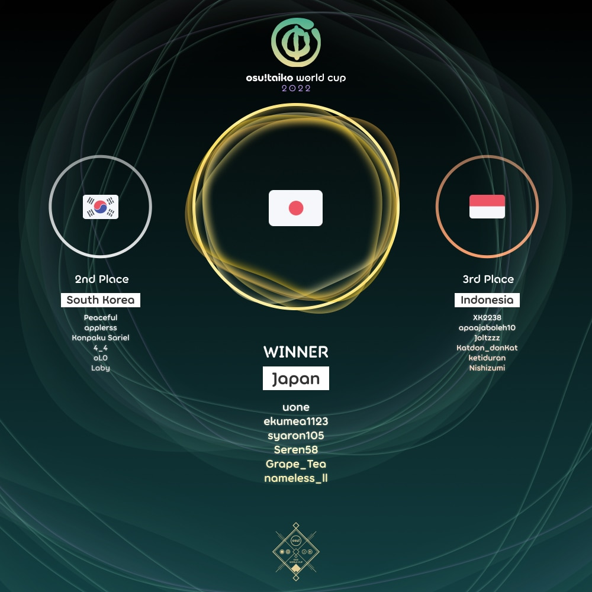

---
tags:
  - TWC
  - TWC2022
  - TWC 2022
---

# osu!taiko World Cup 2022

The **osu!taiko World Cup 2022** (***TWC 2022***) was a country-based osu!taiko tournament hosted by the [osu! team](/wiki/People/osu!_team). It was the twelfth instalment of the osu!taiko World Cup.

## Tournament schedule

| Event | Timestamp |
| --: | :-- |
| Registration phase | 2022-02-10/2022-02-24 |
| Qualifier showcase | 2022-03-05 (14:00 UTC) |
| Qualifier stage | 2022-03-12/2022-03-13 |
| Round of 32 | 2022-03-19/2022-03-20 |
| Round of 16 | 2022-03-26/2022-03-27 |
| Quarterfinals | 2022-04-02/2022-04-03 |
| Semifinals | 2022-04-09/2022-04-10 |
| Finals | 2022-04-16/2022-04-17 |
| Grand Finals | 2022-04-23/2022-04-24 |

## Prizes

| Placing | Prizes |
| :-: | :-- |
|  | $150 per team member, unique profile badge, **osu!taiko Champion** user title for one year |
|  | $80 per team member, unique profile badge |
|  | $40 per team member, unique profile badge |

  

## Organisation

The osu!taiko World Cup 2022 was run by various community members.

| Position | Member(s) |
| :-- | :-- |
| Manager | ::{ flag=CA }:: [Azer](https://osu.ppy.sh/users/2155578), ::{ flag=US }:: [ChillierPear](https://osu.ppy.sh/users/9501251), ::{ flag=BR }:: [LeoFLT](https://osu.ppy.sh/users/3668779), ::{ flag=GB }:: [mangomizer](https://osu.ppy.sh/users/1893718) |
| Mappool selector | ::{ flag=FR }:: [Arrival](https://osu.ppy.sh/users/1694000), ::{ flag=US }:: [Backfire](https://osu.ppy.sh/users/263110), ::{ flag=US }:: [Lumenite-](https://osu.ppy.sh/users/6256027), ::{ flag=JP }:: [Maimaing](https://osu.ppy.sh/users/14520910) |
| Mapper | ::{ flag=HK }:: [\_mtk](https://osu.ppy.sh/users/9468283), ::{ flag=JP }:: [4sbet1](https://osu.ppy.sh/users/11563671), ::{ flag=HK }:: [aabc271](https://osu.ppy.sh/users/155707), ::{ flag=FR }:: [Arrival](https://osu.ppy.sh/users/1694000), ::{ flag=JP }:: [GNKait](https://osu.ppy.sh/users/9109047), ::{ flag=GB }:: [Grimbow](https://osu.ppy.sh/users/1387762), ::{ flag=FR }:: [Heaxys](https://osu.ppy.sh/users/5671417), ::{ flag=TN }:: [Hivie](https://osu.ppy.sh/users/14102976), ::{ flag=JP }:: [iceOC](https://osu.ppy.sh/users/5482401), ::{ flag=NL }:: [ikin5050](https://osu.ppy.sh/users/4007649), ::{ flag=JP }:: [KawaiiBass](https://osu.ppy.sh/users/11992585), ::{ flag=JP }:: [kei821](https://osu.ppy.sh/users/5846289), ::{ flag=JP }:: [KTYN](https://osu.ppy.sh/users/2250574), ::{ flag=US }:: [Lumenite\-](https://osu.ppy.sh/users/6256027), ::{ flag=JP }:: [Maimaing](https://osu.ppy.sh/users/14520910), ::{ flag=GB }:: [mangomizer](https://osu.ppy.sh/users/1893718), ::{ flag=AR }:: [Megafan](https://osu.ppy.sh/users/6632605), ::{ flag=US }:: [Nao Tomori](https://osu.ppy.sh/users/5364763), ::{ flag=HK }:: [Nardoxyribonucleic](https://osu.ppy.sh/users/876419), ::{ flag=US }:: [Nifty](https://osu.ppy.sh/users/4956097), ::{ flag=US }:: [Nifty](https://osu.ppy.sh/users/4956097), ::{ flag=FR }:: [Nofool](https://osu.ppy.sh/users/672430), ::{ flag=DE }:: [Nwolf](https://osu.ppy.sh/users/1910766), ::{ flag=US }:: [radar](https://osu.ppy.sh/users/7131099), ::{ flag=ES }:: [Raiden](https://osu.ppy.sh/users/2239480), ::{ flag=CA }:: [rubies87](https://osu.ppy.sh/users/4949934), ::{ flag=US }:: [Wadsy](https://osu.ppy.sh/users/2598555), ::{ flag=TW }:: [X a v y](https://osu.ppy.sh/users/3738344), ::{ flag=DE }:: [Zetera](https://osu.ppy.sh/users/587737) |
| Commentator | ::{ flag=AU }:: [Beat43210](https://osu.ppy.sh/users/5664171), ::{ flag=US }:: [driodx](https://osu.ppy.sh/users/9709548) ::{ flag=US }:: [Ethaaaan](https://osu.ppy.sh/users/9536977), ::{ flag=AU }:: [Jaye](https://osu.ppy.sh/users/4841352), ::{ flag=US }:: [Lumenite-](https://osu.ppy.sh/users/6256027), ::{ flag=DE }:: [Nwolf](https://osu.ppy.sh/users/1910766), ::{ flag=GB }:: [Teezel](https://osu.ppy.sh/users/7528639), ::{ flag=AR }:: [Vaf](https://osu.ppy.sh/users/12589048) |
| Referee | ::{ flag=NL }:: [Albionthegreat](https://osu.ppy.sh/users/9853595), ::{ flag=AU }:: [Fairy Bread](https://osu.ppy.sh/users/8306102), ::{ flag=CH }:: [Icerite](https://osu.ppy.sh/users/7226287), ::{ flag=BR }:: [LeoFLT](https://osu.ppy.sh/users/3668779), ::{ flag=IN }:: [Speshimen](https://osu.ppy.sh/users/7720204), ::{ flag=US }:: [tigereyes144](https://osu.ppy.sh/users/6499811), ::{ flag=GB }:: [Yazzehh](https://osu.ppy.sh/users/7068973) |
| Statistician | ::{ flag=FI }:: [shdewz](https://osu.ppy.sh/users/10000899) |

## Links

- [Discussion thread](https://osu.ppy.sh/community/forums/topics/1519196)
- [Livestream](https://www.twitch.tv/osulive)
- [Challonge bracket](https://challonge.com/TWC_2022)
- [Pick'ems page](https://pickem.hwc.hr/tournaments/81) hosted by ::{ flag=DE }:: [hallowatcher](https://osu.ppy.sh/users/1874761)
- [Information spreadsheet](https://docs.google.com/spreadsheets/d/e/2PACX-1vThLpR1_d3DZvJuYNeIwZCAvUlBiiKviX_ssZrmqIuh-Oh6yZbfevBL7oH9p3bC8uFF1TJ4WK1ug5yI/pubhtml)

## Participants

|  | Country | Members |
| :-: | :-: | :-- |
| ::{ flag=AR }:: | **Argentina** | **[gaston\_2199](https://osu.ppy.sh/users/5938161)**, [\_Doodle\_](https://osu.ppy.sh/users/5427801), [Axer](https://osu.ppy.sh/users/7299864), [paz08](https://osu.ppy.sh/users/9964420), [Atreevete](https://osu.ppy.sh/users/2615199), [Ingrid10](https://osu.ppy.sh/users/9786011) |
| ::{ flag=AU }:: | **Australia** | **[r1chyy](https://osu.ppy.sh/users/11499467)**, [acid](https://osu.ppy.sh/users/2913584), [Ceryuia](https://osu.ppy.sh/users/5253213), [Aloda](https://osu.ppy.sh/users/1190127), [Jaye](https://osu.ppy.sh/users/4841352), [rango](https://osu.ppy.sh/users/7728466) |
| ::{ flag=AT }:: | **Austria** | **[Cupcake\_Lover](https://osu.ppy.sh/users/1776389)**, [Feli-san](https://osu.ppy.sh/users/23636963), [Mina\_yo](https://osu.ppy.sh/users/2678422) |
| ::{ flag=BR }:: | **Brazil** | **[Skull Kid](https://osu.ppy.sh/users/3044264)**, [Ppus](https://osu.ppy.sh/users/5918857), [Kyoumo](https://osu.ppy.sh/users/8145223), [HiroK](https://osu.ppy.sh/users/4050738), [Foxeru](https://osu.ppy.sh/users/7479684), [Gustav0eiji](https://osu.ppy.sh/users/215127) |
| ::{ flag=CA }:: | **Canada** | **[Fudgy](https://osu.ppy.sh/users/3802922)**, [vysha](https://osu.ppy.sh/users/4908773), [Ascrute](https://osu.ppy.sh/users/13175389), [honkers](https://osu.ppy.sh/users/3075337), [Nanners](https://osu.ppy.sh/users/459886), [beary605](https://osu.ppy.sh/users/2198070) |
| ::{ flag=CL }:: | **Chile** | **[Catulus](https://osu.ppy.sh/users/6276709)**, [Ulqui](https://osu.ppy.sh/users/1263669), [Necromancy-](https://osu.ppy.sh/users/1890084), [\[GS\]Myuka](https://osu.ppy.sh/users/10072733), [Chieri\_](https://osu.ppy.sh/users/10268533), [DaiKiu](https://osu.ppy.sh/users/4232665) |
| ::{ flag=CN }:: | **China** | **[Blastix Riotz](https://osu.ppy.sh/users/5310623)**, [Ookura Risona](https://osu.ppy.sh/users/2073644), [szh134](https://osu.ppy.sh/users/6844521), [Edward\_Tsui](https://osu.ppy.sh/users/8609627), [Michaelonl](https://osu.ppy.sh/users/12480076), [betairylia](https://osu.ppy.sh/users/1558839) |
| ::{ flag=CO }:: | **Colombia** | **[L1ght](https://osu.ppy.sh/users/9050875)**, [coffeelimon28](https://osu.ppy.sh/users/18793276), [Hermite](https://osu.ppy.sh/users/7945286), [Jekuru](https://osu.ppy.sh/users/11727492), [sti](https://osu.ppy.sh/users/1271807), [Animaxgame25](https://osu.ppy.sh/users/16898745) |
| ::{ flag=CR }:: | **Costa Rica** | **[pui](https://osu.ppy.sh/users/12687433)**, [Hotman](https://osu.ppy.sh/users/7902082), [JostRc3](https://osu.ppy.sh/users/11211959) |
| ::{ flag=CZ }:: | **Czech Republic** | **[Salimen](https://osu.ppy.sh/users/10126927)**, [iTzzMar0](https://osu.ppy.sh/users/13108155), [Spinasson](https://osu.ppy.sh/users/21448085), [ToraThePotato](https://osu.ppy.sh/users/10742918) |
| ::{ flag=DK }:: | **Denmark** | **[Zheant](https://osu.ppy.sh/users/708656)**, [Captain](https://osu.ppy.sh/users/2563435), [RasmusCactus](https://osu.ppy.sh/users/2527887), [Soya](https://osu.ppy.sh/users/4776228), [Tsukani](https://osu.ppy.sh/users/5146144) |
| ::{ flag=FI }:: | **Finland** | **[duski](https://osu.ppy.sh/users/6506484)**, [Antti](https://osu.ppy.sh/users/13281473), [vodnanen](https://osu.ppy.sh/users/10335557), [MEGAMELA](https://osu.ppy.sh/users/13613362), [YERTI](https://osu.ppy.sh/users/1490757), [syysmyrsky](https://osu.ppy.sh/users/9421030) |
| ::{ flag=FR }:: | **France** | **[Ectomic](https://osu.ppy.sh/users/4069690)**, [QALF](https://osu.ppy.sh/users/11525993), [TimmyAkmed](https://osu.ppy.sh/users/1799973), [Ekoro](https://osu.ppy.sh/users/284905), [Ranshi](https://osu.ppy.sh/users/6680785), [-Akitai-](https://osu.ppy.sh/users/8897643) |
| ::{ flag=DE }:: | **Germany** | **[frz](https://osu.ppy.sh/users/6956922)**, [Minekuchi](https://osu.ppy.sh/users/9584873), [oomfie126](https://osu.ppy.sh/users/6851789), [Mew](https://osu.ppy.sh/users/2345156), [Xay](https://osu.ppy.sh/users/961417), [xMrtn-](https://osu.ppy.sh/users/866297) |
| ::{ flag=HK }:: | **Hong Kong** | **[Faputa](https://osu.ppy.sh/users/845733)**, [sing216](https://osu.ppy.sh/users/6096445), [J a c k y](https://osu.ppy.sh/users/8011704), [Consified](https://osu.ppy.sh/users/6502903), [Cynplytholowazy](https://osu.ppy.sh/users/3901754), [ilv\_Rem](https://osu.ppy.sh/users/7850538) |
| ::{ flag=ID }:: | **Indonesia** | **[XK2238](https://osu.ppy.sh/users/1139209)**, [apaajaboleh10](https://osu.ppy.sh/users/5151647), [Joltzzz](https://osu.ppy.sh/users/15436568), [Katdon\_donKat](https://osu.ppy.sh/users/8089664), [ketiduran](https://osu.ppy.sh/users/2180885), [Nishizumi](https://osu.ppy.sh/users/2496768) |
| ::{ flag=IT }:: | **Italy** | **[Ikkun](https://osu.ppy.sh/users/1059945)**, [A-40](https://osu.ppy.sh/users/14510301), [D3kuu](https://osu.ppy.sh/users/7807444), [Nara Bocchi](https://osu.ppy.sh/users/7722827), [SkuII Kid](https://osu.ppy.sh/users/4609767), [KITEMMUORT322](https://osu.ppy.sh/users/10370310) |
| ::{ flag=JP }:: | **Japan** | **[uone](https://osu.ppy.sh/users/5321719)**, [ekumea1123](https://osu.ppy.sh/users/9119501), [syaron105](https://osu.ppy.sh/users/8741695), [Seren58](https://osu.ppy.sh/users/15252950), [Grape\_Tea](https://osu.ppy.sh/users/9540073), [nameless\_ll](https://osu.ppy.sh/users/11199742) |
| ::{ flag=MY }:: | **Malaysia** | **[Jerry](https://osu.ppy.sh/users/605973)**, [\[Zeth\]](https://osu.ppy.sh/users/9912966), [6gicha](https://osu.ppy.sh/users/12273160), [CrabCow](https://osu.ppy.sh/users/9755504), [HHVanilla Ice](https://osu.ppy.sh/users/12803930), [JyaKeii](https://osu.ppy.sh/users/12086753) |
| ::{ flag=MX }:: | **Mexico** | **[Awwy](https://osu.ppy.sh/users/4183406)**, [Iojioji](https://osu.ppy.sh/users/1346121), [ZaveryK](https://osu.ppy.sh/users/10913397), [Tatane](https://osu.ppy.sh/users/10208984), [-HiddenTaco-](https://osu.ppy.sh/users/7320933), [Kenrit-San](https://osu.ppy.sh/users/13054150) |
| ::{ flag=NL }:: | **Netherlands** | **[TaikoMom](https://osu.ppy.sh/users/9086438)**, [Boaz](https://osu.ppy.sh/users/13302996), [Cookie\_Tree](https://osu.ppy.sh/users/502722), [Krekker](https://osu.ppy.sh/users/8265940), [Mr HeliX](https://osu.ppy.sh/users/2330619), [StrijkIjzer](https://osu.ppy.sh/users/4130926) |
| ::{ flag=NZ }:: | **New Zealand** | **[Sparxe](https://osu.ppy.sh/users/5750235)**, [Blujae](https://osu.ppy.sh/users/10613885), [idk123456](https://osu.ppy.sh/users/18718856), [Zed0x](https://osu.ppy.sh/users/12136108), [New Zealand](https://osu.ppy.sh/users/9039824) |
| ::{ flag=NO }:: | **Norway** | **[Mills](https://osu.ppy.sh/users/7234023)**, [Vendelicious](https://osu.ppy.sh/users/8818089), [Defectum](https://osu.ppy.sh/users/8631719), [Mist31](https://osu.ppy.sh/users/18916920), [Loff](https://osu.ppy.sh/users/8947341) |
| ::{ flag=PH }:: | **Philippines** | **[Pochacco](https://osu.ppy.sh/users/2927742)**, [Aiery](https://osu.ppy.sh/users/10363380), [DescriptiCringe](https://osu.ppy.sh/users/10882115), [Fynbi](https://osu.ppy.sh/users/2164993), [Nytrioum](https://osu.ppy.sh/users/13547767), [Rimazii](https://osu.ppy.sh/users/3831514) |
| ::{ flag=PL }:: | **Poland** | **[bernard351](https://osu.ppy.sh/users/9511518)**, [vethreal](https://osu.ppy.sh/users/12067316), [boyan](https://osu.ppy.sh/users/2302140), [flatspot\_](https://osu.ppy.sh/users/13920423), [fafik99](https://osu.ppy.sh/users/1787011), [krytwal](https://osu.ppy.sh/users/17540374) |
| ::{ flag=PT }:: | **Portugal** | **[BabySnakes](https://osu.ppy.sh/users/4669728)**, [hi im costarino](https://osu.ppy.sh/users/9209430), [Shinzui](https://osu.ppy.sh/users/2505011), [Rosa](https://osu.ppy.sh/users/7385703), [MeovvCAT](https://osu.ppy.sh/users/5905091), [ChunChun04](https://osu.ppy.sh/users/20640222) |
| ::{ flag=RU }:: | **Russian Federation** | **[TwinT](https://osu.ppy.sh/users/9976154)**, [chayleaf](https://osu.ppy.sh/users/8321579), [night\_flower](https://osu.ppy.sh/users/11574707), [Den4ik228](https://osu.ppy.sh/users/7115174), [QuassBot](https://osu.ppy.sh/users/11117835), [Ak1hiko](https://osu.ppy.sh/users/15305059) |
| ::{ flag=SG }:: | **Singapore** | **[Prehistoria](https://osu.ppy.sh/users/8364237)**, [Bobfree](https://osu.ppy.sh/users/10096125), [Element118](https://osu.ppy.sh/users/2283992), [dantoh000](https://osu.ppy.sh/users/11414361), [I luv loleez](https://osu.ppy.sh/users/18346655), [MattrexDark](https://osu.ppy.sh/users/7171110) |
| ::{ flag=KR }:: | **South Korea** | **[Peaceful](https://osu.ppy.sh/users/165027)**, [applerss](https://osu.ppy.sh/users/983349), [Konpaku Sariel](https://osu.ppy.sh/users/533502), [4\_4](https://osu.ppy.sh/users/1152851), [oL0](https://osu.ppy.sh/users/1134683), [Laby](https://osu.ppy.sh/users/9085164) |
| ::{ flag=ES }:: | **Spain** | **[Nara\_NB](https://osu.ppy.sh/users/3593992)**, [alexinet232](https://osu.ppy.sh/users/5250153), [hunterjos](https://osu.ppy.sh/users/10733787), [MantequillAlex](https://osu.ppy.sh/users/11499752), [misterbola8](https://osu.ppy.sh/users/3610305), [Penvoltio](https://osu.ppy.sh/users/8849448) |
| ::{ flag=SE }:: | **Sweden** | **[Nurend](https://osu.ppy.sh/users/9905079)**, [Raphalge](https://osu.ppy.sh/users/3918650), [melancholicc](https://osu.ppy.sh/users/18406374), [Invisible O](https://osu.ppy.sh/users/22907037), [Soppatorsk](https://osu.ppy.sh/users/2522551) |
| ::{ flag=CH }:: | **Switzerland** | **[MC2BP](https://osu.ppy.sh/users/11296097)**, [Glacy](https://osu.ppy.sh/users/12819177), [Niroe](https://osu.ppy.sh/users/5950591), [Oui](https://osu.ppy.sh/users/5538419), [Zero1519](https://osu.ppy.sh/users/547957) |
| ::{ flag=TW }:: | **Taiwan** | **[stu00608](https://osu.ppy.sh/users/1977606)**, [monkeydluffy3u4](https://osu.ppy.sh/users/2277798), [cat1346](https://osu.ppy.sh/users/10079336), [Polemo03](https://osu.ppy.sh/users/10726804), [Smallwu](https://osu.ppy.sh/users/2512120), [\_Llama](https://osu.ppy.sh/users/12798183) |
| ::{ flag=TR }:: | **Turkey** | **[frukoyurdakul](https://osu.ppy.sh/users/7612550)**, [NeuralG](https://osu.ppy.sh/users/13811400), [skolodojko](https://osu.ppy.sh/users/11716851), [xDeadlordx](https://osu.ppy.sh/users/11211230), [zigizigiefe](https://osu.ppy.sh/users/2463434) |
| ::{ flag=GB }:: | **United Kingdom** | **[goheegy](https://osu.ppy.sh/users/8057655)**, [-Dusk](https://osu.ppy.sh/users/6092181), [Daniels](https://osu.ppy.sh/users/12439209), [Horiiizon](https://osu.ppy.sh/users/8071438), [overdahedge2014](https://osu.ppy.sh/users/9864847), [Metzo](https://osu.ppy.sh/users/10633982) |
| ::{ flag=US }:: | **United States** | **[general chicken](https://osu.ppy.sh/users/8050850)**, [R J](https://osu.ppy.sh/users/6490509), [AuroraPhasmata](https://osu.ppy.sh/users/13664116), [Miniature Lamp](https://osu.ppy.sh/users/9821194), [ChurroChef](https://osu.ppy.sh/users/9258564), [cheese salad](https://osu.ppy.sh/users/6349821) |
| ::{ flag=VN }:: | **Vietnam** | **[davidminh0111](https://osu.ppy.sh/users/9623142)**, [AkiraPlayz](https://osu.ppy.sh/users/16039831), [crazynt\_ngu](https://osu.ppy.sh/users/7844013), [JackTVN](https://osu.ppy.sh/users/12510704), [njshift1](https://osu.ppy.sh/users/16688499) |

## Podium

## Mappools

### Grand Finals

**[Download the mappack here (117 MB)](https://drive.google.com/uc?id=1nBTRaLhiOQ7wSGNJBHbdKfu75JRZkj3c)**

- NoMod
  1. [J-CORE SLi//CER - "Ongaku purode\~yusa" no heikin-tekina seishin jotai (KTYN) \[KTYN//FIRE (TWC Ver.)\]](https://osu.ppy.sh/beatmapsets/1744775#taiko/3568501)
  2. [7\_7 - Meriba (X a v y) \[ONI\]](https://osu.ppy.sh/beatmapsets/1744973#taiko/3569029)
  3. [Frums - Q.E. (HiroK) \[Mirage\]](https://osu.ppy.sh/beatmapsets/1530469#taiko/3130422)
  4. [TJ.hangneil - Apollo (Axer) \[Nostradamus\]](https://osu.ppy.sh/beatmapsets/1739877#taiko/3556397)
  5. [Jiiko - Wocky (Maimaing) \[Hell Oni\]](https://osu.ppy.sh/beatmapsets/1744951#taiko/3568943)
  6. [agata - AMAIWTIWNKMS (Nifty) \[TWC Ver.\]](https://osu.ppy.sh/beatmapsets/1744774#taiko/3568498)
- Hidden
  1. [Animals as Leaders - Monomyth (Zetera) \[Mess\]](https://osu.ppy.sh/beatmapsets/1744810#taiko/3568619)
  2. [METAROOM - SPIRAL (woosungko) \[CONVERGENCE (TWC Ver.)\]](https://osu.ppy.sh/beatmapsets/1744786#taiko/3568534)
- Hard Rock
  1. [Retractable - Eye of xxxx (4sbet1) \[Oni\]](https://osu.ppy.sh/beatmapsets/1383882#taiko/2858741)
  2. [Slax - Too Much Loli (KawaiiBass) \[Go Away 260BPM\]](https://osu.ppy.sh/beatmapsets/1579730#taiko/3225784)
- Double Time
  1. [Mothtek - Meltdown (Remix 2022) (KawaiiBass) \[agitato\]](https://osu.ppy.sh/beatmapsets/1744995#taiko/3569182)
  2. [Gomitaro - S4y G00dby3 (Genjuro) \[Inner Oni\]](https://osu.ppy.sh/beatmapsets/1454482#taiko/2991949)
- FreeMod
  1. [YUKIYANAGI - ALERT (Megafan) \[RAVING ALL NIGHT\]](https://osu.ppy.sh/beatmapsets/1744794#taiko/3568570)
  2. [The Flashbulb - Ninedump (Arrival) \[tasuke's Perilous\]](https://osu.ppy.sh/beatmapsets/984361#taiko/2059692)
  3. [Marco Minnemann - Broken Orange (mangomizer) \[mango\]](https://osu.ppy.sh/beatmapsets/1642598#taiko/3433673)
- Tiebreaker
  1. **[onumi & Akira Complex - Ethereal Cyber Angel XV (Maimaing) \[Demon\]](https://osu.ppy.sh/beatmapsets/1744942#taiko/3568932)**

### Finals

**[Download the mappack here (81 MB)](https://drive.google.com/uc?id=1qOcr47k05xIJn6o6zg5vUMdNzzVeNqUA)**

- NoMod
  1. [Otsukisama Koukyoukyoku - ultima Thule (Hivie) \[dm radar for free nominations\]](https://osu.ppy.sh/beatmapsets/1739299#taiko/3554734)
  2. [Kurokoutei - Nonbinarity (uone) \[Inner Oni\]](https://osu.ppy.sh/beatmapsets/1414457#taiko/2915423)
  3. [majiko - Hypocrite Syndrome (\_Rise) \[Hell Oni\]](https://osu.ppy.sh/beatmapsets/1372080#taiko/2836594)
  4. [Cattle Decapitation - One Day Closer To The End Of The World (ikin5050) \[Heart Strings\]](https://osu.ppy.sh/beatmapsets/1739224#taiko/3554540)
  5. [METAROOM - JITTER FANTA (woosungko) \[FIZZY\]](https://osu.ppy.sh/beatmapsets/1739593#taiko/3555451)
  6. [C-Show - Invitation from Mr.C (Nifty) \[YOU ARE INNERVITED!!!!!!\]](https://osu.ppy.sh/beatmapsets/1739332#taiko/3554816)
- Hidden
  1. [wotoha - Lonerism (Cut Ver.) (tasuke912) \[Aloneness\]](https://osu.ppy.sh/beatmapsets/1739910#taiko/3556860)
  2. [Igorrr - Scarlatti 2.0 (Socus) \[Nihilistic idea\]](https://osu.ppy.sh/beatmapsets/1545368#taiko/3158712)
- Hard Rock
  1. [katagiri - terminus//runtimes (Horiiizon) \[gamelan's terminal\]](https://osu.ppy.sh/beatmapsets/1343171#taiko/2862324)
  2. [goreshit - the dancecore element (Cure) \[7th\]](https://osu.ppy.sh/beatmapsets/1554880#taiko/3176652)
- Double Time
  1. [Camellia - flying in the flow of deep-sea (Nwolf) \[SKWolf's Aquatic Oni\]](https://osu.ppy.sh/beatmapsets/397682#taiko/864922)
  2. [nameless - Toumei Elegy (mintong89) \[Ura Oni\]](https://osu.ppy.sh/beatmapsets/450585#taiko/966676)
- FreeMod
  1. [Laur - Chimimouryou (komasy) \[Muzukasy\]](https://osu.ppy.sh/beatmapsets/1590899#taiko/3249250)
  2. [Kabanagu - 20210517demo (Ulqui) \[Hippopotamus\]](https://osu.ppy.sh/beatmapsets/1544926#taiko/3157853)
  3. [PrimeMIX - Uber 6 (iceOC) \[iceOC's Hell Oni\]](https://osu.ppy.sh/beatmapsets/1739327#taiko/3554801)
- Tiebreaker
  1. **[First Fragment - Gloire Eternelle (Grimbow) \[Raimbow Oni\]](https://osu.ppy.sh/beatmapsets/1739222#taiko/3554538)**

### Semifinals

**[Download the mappack here (81 MB)](https://drive.google.com/uc?id=1UGY8w8M0yOsJTOwOpIN2ADEtoCVQGBew)**

- NoMod
  1. [Spacelectro feat. Momokami - DANCING FOX!!! (applerss) \[NIGHT FOX!!!\]](https://osu.ppy.sh/beatmapsets/1600946#taiko/3269458)
  2. [The Flashbulb - Lawn Wake IX (\_mtk) \[EZ\]](https://osu.ppy.sh/beatmapsets/1734145#taiko/3544468)
  3. [GomiTaro - takio mash up (KTYN) \[takio\]](https://osu.ppy.sh/beatmapsets/1400451#taiko/2889284)
  4. [Veer - Migraine (Wadsy) \[Gracious Head\]](https://osu.ppy.sh/beatmapsets/1734341#taiko/3544843)
  5. [DJ twinturbo - back in 2015 car audio system (ikin5050) \[Gimmickin\]](https://osu.ppy.sh/beatmapsets/1734189#taiko/3544574)
- Hidden
  1. [otetsu - Rubik's Cube (Lumenite-) \[16x16x16\]](https://osu.ppy.sh/beatmapsets/1670975#taiko/3544599)
  2. [ARM(IOSYS) + Brasscapsule - Jazz is Rad (MTNTWarz) \[swagy wacky jazz\]](https://osu.ppy.sh/beatmapsets/1707183#taiko/3544352)
- Hard Rock
  1. [katagiri - Nohmen break (Katagiri Remix) (hoku) \[a hoku of life ^-^\]](https://osu.ppy.sh/beatmapsets/1223733#taiko/2545320)
  2. [Zekk - Foresight (woosungko) \[Inner Oni\]](https://osu.ppy.sh/beatmapsets/1726306#taiko/3527937)
- Double Time
  1. [YUKIYANAGI - Feeling NRG (Megafan) \[Raving All Night\]](https://osu.ppy.sh/beatmapsets/1453904#taiko/2988883)
  2. [Srav3R vs Getty - DUAL BREAKER XX (Yumirin) \[ONI XX\]](https://osu.ppy.sh/beatmapsets/1442123#taiko/2966564)
- FreeMod
  1. [nujioh - PSYCHE (Nifty) \[Neuroticism\]](https://osu.ppy.sh/beatmapsets/1734235#taiko/3544679)
  2. [Camellia - gigadelic (Camellia's 'THE TERA' Remix) (-Kazu-) \[Inner Oni\]](https://osu.ppy.sh/beatmapsets/836037#taiko/3543322)
  3. [Kotori - Anomaly (Kou! "Asymetris" 200step Remix) (KTYN) \[Fate\]](https://osu.ppy.sh/beatmapsets/1734106#taiko/3544464)
- Tiebreaker
  1. **[breakchild - NEUROTYPICALSYSTEM (Nwolf) \[out now on soundcloud\]](https://osu.ppy.sh/beatmapsets/1734223#taiko/3544650)**

### Quarterfinals

**[Download the mappack here (73 MB)](https://drive.google.com/uc?id=1sx8PbyPgijk7IzQ5waWdWnbISar6JAVk)**

- NoMod
  1. [Rahatt - Gas Gas (incandescence) \[C8H18\]](https://osu.ppy.sh/beatmapsets/1641207#taiko/3349737)
  2. [Sta feat.b - Argent symmetry (4sbet1) \[Inner Oni\]](https://osu.ppy.sh/beatmapsets/1729383#taiko/3534396)
  3. [youman - R.I.P. (ekumea1123) \[R.I.P.\]](https://osu.ppy.sh/beatmapsets/1039654#taiko/2173146)
  4. [kamome sano - Elemental Creation (kamome sano Remix) (-Dusk) \[MAXIMUM\]](https://osu.ppy.sh/beatmapsets/1717750#taiko/3510393)
  5. [Boom Kitty - Burning Sands (Nofool) \[Oni\]](https://osu.ppy.sh/beatmapsets/1729062#taiko/3533634)
- Hidden
  1. [7\_7 - Kongetsugou ha!?!?!? (7\_7) \[The TWC Daily!?!?!?\]](https://osu.ppy.sh/beatmapsets/1014856#taiko/3533569)
  2. [xi - Zauberkugel (sendol) \[Ura Oni (TWC Ver.)\]](https://osu.ppy.sh/beatmapsets/1706326#taiko/3533413)
- Hard Rock
  1. [Minami Yuni - Kanagawa Cyber Culvert (tasuke912) \[Upheaval (Edit Ver.)\]](https://osu.ppy.sh/beatmapsets/1724253#taiko/3523973)
  2. [RichaadEB - Spider Dance - Metal Cover (asuasu\_yura) \[Muffet\]](https://osu.ppy.sh/beatmapsets/467190#taiko/999671)
- Double Time
  1. [kors k - Monkey Business (lapix Remix) (Arrival) \[Oni (TWC edit.)\]](https://osu.ppy.sh/beatmapsets/721496#taiko/3533667)
  2. [ONE OK ROCK - Clock Strikes (Chromoxx) \[Inner Oni\]](https://osu.ppy.sh/beatmapsets/602619#taiko/1272845)
- FreeMod
  1. [Plum - Mad Piano Party (incandescence) \[Divertississimo (the twc map)\]](https://osu.ppy.sh/beatmapsets/1727527#taiko/3530351)
  2. [Ocelot - TSUBAKI (TKS) \[TSUBAKI\]](https://osu.ppy.sh/beatmapsets/177838#taiko/427932)
  3. [Daily - Astronomia (USAO a.k.a Daily Mix) (Kannes) \[Lno's Dance\]](https://osu.ppy.sh/beatmapsets/1159255#taiko/2421854)
- Tiebreaker
  1. **[Venetian Snares - She Runs (Kqrth) \[Oni\]](https://osu.ppy.sh/beatmapsets/583601#taiko/1234950)**

### Round of 16

**[Download the mappack here (70 MB)](https://drive.google.com/uc?id=1BAYyEckltoxlJ91jjZDd-J8kz67pMz6f)**

- NoMod
  1. [Tartarate - It's rainy to bye (ler1211) \[Goodbye (TWC ver.)\]](https://osu.ppy.sh/beatmapsets/1711152#taiko/3522974)
  2. [ZxNX - Fiend Demme (Nofool) \[Oni (edit)\]](https://osu.ppy.sh/beatmapsets/1723979#taiko/3523337)
  3. [J-CORE SLi//CER - Yrotsevol Yppahrepyh (X a v y) \[hlskdjfghlksdjfhgkslfdjg\]](https://osu.ppy.sh/beatmapsets/1724001#taiko/3523387)
  4. [underscores - Where did you fall (Ulqui) \[heartbroken\]](https://osu.ppy.sh/beatmapsets/1414012#taiko/2914571)
- Hidden
  1. [Igorrr - Kung-Fu Chevre (Nifty) \[Shaolin Feta\]](https://osu.ppy.sh/beatmapsets/1723995#taiko/3523378)
  2. [Shawn Wasabi + YDG feat. YUNG GEMMY - Burnt Rice (Aiobahn & Jh-Anu Remix) (Cychloryn) \[Inner Oni (TWC Edit)\]](https://osu.ppy.sh/beatmapsets/1206425#taiko/3523443)
- Hard Rock
  1. [Yunosuke - Illusional Flashback (Nifty) \[Delirium\]](https://osu.ppy.sh/beatmapsets/1723994#taiko/3523376)
  2. [EBIMAYO - GOODRAGE (-xNaCLx-) \[Inner Oni\]](https://osu.ppy.sh/beatmapsets/681490#taiko/1440955)
- Double Time
  1. [Marpril - Breaker City (sikawalk Remix) (X a v y) \[Oni\]](https://osu.ppy.sh/beatmapsets/1724008#taiko/3523405)
  2. [Tanchiky - WABI-CIRCUIT (Original Mix) (gaston\_2199) \[ONI\]](https://osu.ppy.sh/beatmapsets/1365528#taiko/2824584)
- FreeMod
  1. [Camellia - This Future (we didn't expect) (tasuke912) \[Oni\]](https://osu.ppy.sh/beatmapsets/1240296#taiko/2578605)
  2. [Mitsukiyo - Madeleine (aabc271) \[Inner Oni+\]](https://osu.ppy.sh/beatmapsets/1723908#taiko/3523210)
  3. [asteria - FUSION (Arrival) \[Oni\]](https://osu.ppy.sh/beatmapsets/1723980#taiko/3523339)
- Tiebreaker
  1. **[Giga - BRING IT ON feat. Kagamine Rin, Len (Sixstylez Bootleg) (TaikOseania) \[INFERIORITY and SUPERIORITY\]](https://osu.ppy.sh/beatmapsets/1677785#taiko/3427811)**

### Round of 32

**[Download the mappack here (88 MB)](https://drive.google.com/uc?id=12G9mUCf-8-8GykJ7Oh76VgBW6B-ukvX5)**

- NoMod
  1. [Official HIGE DANdism - Bad for me (Dz'Xa's Amenpunk) (KTYN) \[Passing love\]](https://osu.ppy.sh/beatmapsets/1334132#taiko/2763983)
  2. [t+pazolite - Troll The Cowardly (Sick Candy Terror Of Feryquitous) (tasuke912) \[Oni\]](https://osu.ppy.sh/beatmapsets/808095#taiko/1695840)
  3. [SAVE THE QUEEN - EX-Termination (\_Rise) \[Inner Oni\]](https://osu.ppy.sh/beatmapsets/1640909#taiko/3349161)
  4. [meganeko - Feral (osu version) (Nofool) \[Oni\]](https://osu.ppy.sh/beatmapsets/1384524#taiko/2860370)
- Hidden
  1. [Lucky Vacuum - Daily Lunch Special (Raphalge) \[Inner Oni\]](https://osu.ppy.sh/beatmapsets/1159807#taiko/2420011)
  2. [t+pazolite - You are the Miserable (Fynbi) \[Master Oni\]](https://osu.ppy.sh/beatmapsets/947105#taiko/2252523)
- Hard Rock
  1. [Function Phantom - Euclid (tasuke912) \[Indifferentiable\]](https://osu.ppy.sh/beatmapsets/761560#taiko/1601331)
  2. [penoreri - Lancelot \~Flame of the Rebellion\~ (Servatory) \[Inner Oni (TWC Ver.)\]](https://osu.ppy.sh/beatmapsets/1491668#taiko/3512780)
- Double Time
  1. [Naganuma Hideki - Funky Dealer (Fraolinch) \[Inner Oni (TWC Ver.)\]](https://osu.ppy.sh/beatmapsets/1095575#taiko/3513038)
  2. [Earth, Wind & Fire - September (yomoha remix) (Midnaait) \[Juano's Oni\]](https://osu.ppy.sh/beatmapsets/1075239#taiko/2251301)
- FreeMod
  1. [EBIMAYO - BADTEK (GNKait) \[INNERONI\]](https://osu.ppy.sh/beatmapsets/1277370#taiko/2653928)
  2. [Getty - Sonic Bass (KTYN) \[Sprint\]](https://osu.ppy.sh/beatmapsets/1719106#taiko/3513220)
  3. [M2U - Mare Maris (radar) \[how the why 2 \<THE FINAL\>\]](https://osu.ppy.sh/beatmapsets/1719045#taiko/3513063)
- Tiebreaker
  1. **[Dustvoxx, Laur - FireLight (yea) \[Cosmic Minds\]](https://osu.ppy.sh/beatmapsets/978134#taiko/2047037)**

### Qualifiers

**[Download the mappack here (48 MB)](https://drive.google.com/uc?id=1Enpj3xdC_FsT4uvt7zIba2tLI4I63eyR)**

- NoMod
  1. [seatrus - morgenroete (KawaiiBass) \[Inner Oni\]](https://osu.ppy.sh/beatmapsets/1712777#taiko/3499847)
  2. [Noisia - Vigilantes (rubies87) \[Oni\]](https://osu.ppy.sh/beatmapsets/1713100#taiko/3500416)
  3. [The Fearless Flyers - Assassin (Megafan) \[j a z z\]](https://osu.ppy.sh/beatmapsets/1712914#taiko/3500092)
- Hidden
  1. [xi - Parousia (Nardoxyribonucleic) \[Inner Oni\]](https://osu.ppy.sh/beatmapsets/1712783#taiko/3499862)
  2. [Irreversible Mechanism - Beyond (Heaxys) \[Inner Oni\]](https://osu.ppy.sh/beatmapsets/1712779#taiko/3499852)
- Hard Rock
  1. [Zekk - Vespera (Nifty) \[Impulse\]](https://osu.ppy.sh/beatmapsets/1712860#taiko/3499979)
  2. [Aether Realm - Ravensong (Raiden) \[Wings of Freedom\]](https://osu.ppy.sh/beatmapsets/1713518#taiko/3501347)
- Double Time
  1. [KINEMA106 - N.M.W (Nao Tomori) \[Oni\]](https://osu.ppy.sh/beatmapsets/1712810#taiko/3499915)
  2. [Feryquitous feat. Sennzai - Rugie (Maimaing) \[somnum\]](https://osu.ppy.sh/beatmapsets/1712786#taiko/3499875)
- FreeMod
  1. [seatrus - O (KTYN) \[Infinity\]](https://osu.ppy.sh/beatmapsets/1712976#taiko/3500185)

## Match results

### Grand Finals

Detailed statistics for this round can be found [here](https://docs.google.com/spreadsheets/d/1e6UBnSyrKsoVqGwE3e_Q-uRDJvEAjmFBGxUilmeHIs8/edit?rm=minimal).

Saturday, April 23, 2022

| Team A |  |  | Team B | Match link |
| --: | :-: | :-: | :-- | :-- |
| **South Korea** ::{ flag=KR }:: | **7** | 2 | ::{ flag=ID }:: Indonesia | [#1](https://osu.ppy.sh/community/matches/100019807) |

Sunday, April 24, 2022

| Team A |  |  | Team B | Match link |
| --: | :-: | :-: | :-- | :-- |
| **Japan** ::{ flag=JP }:: | **7** | 1 | ::{ flag=KR }:: South Korea | [#1](https://osu.ppy.sh/community/matches/100051772) |

### Finals

Detailed statistics for this round can be found [here](https://docs.google.com/spreadsheets/d/1Qlbh6F3OZ0ZLnEy12eBhPcuTb32ZcsMBq25dyBePVc0/edit?rm=minimal).

Saturday, April 16, 2022

| Team A |  |  | Team B | Match link |
| --: | :-: | :-: | :-- | :-- |
| Hong Kong ::{ flag=HK }:: | 1 | **7** | ::{ flag=ID }:: **Indonesia** | [#1](https://osu.ppy.sh/community/matches/99804975) |
| **Germany** ::{ flag=DE }:: | **7** | 3 | ::{ flag=SE }:: Sweden | [#1](https://osu.ppy.sh/community/matches/99816543) |

Sunday, April 17, 2022

| Team A |  |  | Team B | Match link |
| --: | :-: | :-: | :-- | :-- |
| Germany ::{ flag=DE }:: | 6 | **7** | ::{ flag=ID }:: **Indonesia** | [#1](https://osu.ppy.sh/community/matches/99836330) |
| **Japan** ::{ flag=JP }:: | **7** | 1 | ::{ flag=KR }:: South Korea | [#1](https://osu.ppy.sh/community/matches/99839555) |

### Semifinals

Detailed statistics for this round can be found [here](https://docs.google.com/spreadsheets/d/1Vte6gkSYpcamsYoL0BsNPJXDin-FQMvoATke4qIUPn8/edit?rm=minimal).

Saturday, April 9, 2022

| Team A |  |  | Team B | Match link |
| --: | :-: | :-: | :-- | :-- |
| Australia ::{ flag=AU }:: | 1 | **6** | ::{ flag=TW }:: **Taiwan** | [#1](https://osu.ppy.sh/community/matches/99565775) |
| **Sweden** ::{ flag=SE }:: | **6** | 2 | ::{ flag=BR }:: Brazil | [#1](https://osu.ppy.sh/community/matches/99569072) |
| **United Kingdom** ::{ flag=GB }:: | **6** | 4 | ::{ flag=CA }:: Canada | [#1](https://osu.ppy.sh/community/matches/99580358) |

Sunday, April 10, 2022

| Team A |  |  | Team B | Match link |
| --: | :-: | :-: | :-- | :-- |
| **Indonesia** ::{ flag=ID }:: | **6** | 3 | ::{ flag=US }:: United States | [#1](https://osu.ppy.sh/community/matches/99598217) |
| **Indonesia** ::{ flag=ID }:: | **6** | 3 | ::{ flag=GB }:: United Kingdom | [#1](https://osu.ppy.sh/community/matches/99608677) |
| **South Korea** ::{ flag=KR }:: | **6** | 1 | ::{ flag=DE }:: Germany | [#1](https://osu.ppy.sh/community/matches/99608458) |
| **Japan** ::{ flag=JP }:: | **6** | 1 | ::{ flag=HK }:: Hong Kong | [#1](https://osu.ppy.sh/community/matches/99610214) |
| Taiwan ::{ flag=TW }:: | 5 | **6** | ::{ flag=SE }:: **Sweden** | [#1](https://osu.ppy.sh/community/matches/99612233) |

### Quarterfinals

Detailed statistics for this round can be found [here](https://docs.google.com/spreadsheets/d/1SZ1K9ldPL6LgR3iD6QRUZV0KJvU-wFmEDqV0w8-huYM/edit?rm=minimal).

Saturday, April 2, 2022

| Team A |  |  | Team B | Match link |
| --: | :-: | :-: | :-- | :-- |
| **Brazil** ::{ flag=BR }:: | **6** | 3 | ::{ flag=RU }:: Russian Federation | [#1](https://osu.ppy.sh/community/matches/99336587) |
| **Malaysia** ::{ flag=MY }:: | **6** | 1 | ::{ flag=NZ }:: New Zealand | [#1](https://osu.ppy.sh/community/matches/99339267) |
| **Finland** ::{ flag=FI }:: | **6** | 4 | ::{ flag=TR }:: Turkey | [#1](https://osu.ppy.sh/community/matches/99339409) |
| **Taiwan** ::{ flag=TW }:: | **6** | 5 | ::{ flag=CN }:: China | [#1](https://osu.ppy.sh/community/matches/99341849) |
| **Chile** ::{ flag=CL }:: | **6** | 3 | ::{ flag=SG }:: Singapore | [#1](https://osu.ppy.sh/community/matches/99342997) |
| **France** ::{ flag=FR }:: | **6** | 0 | ::{ flag=CH }:: Switzerland | [#1](https://osu.ppy.sh/community/matches/99349325) |
| **United States** ::{ flag=US }:: | **6** | 3 | ::{ flag=IT }:: Italy | [#1](https://osu.ppy.sh/community/matches/99352849) |
| **Canada** ::{ flag=CA }:: | **6** | 3 | ::{ flag=AR }:: Argentina | [#1](https://osu.ppy.sh/community/matches/99360731) |

Sunday, April 3, 2022

| Team A |  |  | Team B | Match link |
| --: | :-: | :-: | :-- | :-- |
| **United States** ::{ flag=US }:: | **6** | 1 | ::{ flag=MY }:: Malaysia | [#1](https://osu.ppy.sh/community/matches/99370860) |
| **Hong Kong** ::{ flag=HK }:: | **6** | 3 | ::{ flag=AU }:: Australia | [#1](https://osu.ppy.sh/community/matches/99374323) |
| **South Korea** ::{ flag=KR }:: | **6** | 0 | ::{ flag=GB }:: United Kingdom | [#1](https://osu.ppy.sh/community/matches/99378718) |
| **Taiwan** ::{ flag=TW }:: | **6** | 2 | ::{ flag=FR }:: France | [#1](https://osu.ppy.sh/community/matches/99381123) |
| **Brazil** ::{ flag=BR }:: | **6** | 1 | ::{ flag=FI }:: Finland | [#1](https://osu.ppy.sh/community/matches/99383387) |
| **Japan** ::{ flag=JP }:: | **6** | 0 | ::{ flag=SE }:: Sweden | [#1](https://osu.ppy.sh/community/matches/99383214) |
| **Germany** ::{ flag=DE }:: | **6** | 3 | ::{ flag=ID }:: Indonesia | [#1](https://osu.ppy.sh/community/matches/99385496) |
| **Canada** ::{ flag=CA }:: | **6** | 2 | ::{ flag=CL }:: Chile | [#1](https://osu.ppy.sh/community/matches/99389469) |

### Round of 16

Detailed statistics for this round can be found [here](https://docs.google.com/spreadsheets/d/19vfkfIEnt0dhqC2cXuCvDSwhvFAeSbw5i_ZAw2l1CtA/edit?rm=minimal).

Saturday, March 26, 2022

| Team A |  |  | Team B | Match link |
| --: | :-: | :-: | :-- | :-- |
| **New Zealand** ::{ flag=NZ }:: | **5** | 2 | ::{ flag=PH }:: Philippines | [#1](https://osu.ppy.sh/community/matches/99114582) |
| Portugal ::{ flag=PT }:: | 4 | **5** | ::{ flag=SG }:: **Singapore** | [#1](https://osu.ppy.sh/community/matches/99117585) |
| Netherlands ::{ flag=NL }:: | 1 | **5** | ::{ flag=CH }:: **Switzerland** | [#1](https://osu.ppy.sh/community/matches/99119714) |
| Czech Republic ::{ flag=CZ }:: | 0 | **5** | ::{ flag=AR }:: **Argentina** | [#1](https://osu.ppy.sh/community/matches/99123857) |
| Costa Rica ::{ flag=CR }:: | 0 | **5** | ::{ flag=TR }:: **Turkey** | [#1](https://osu.ppy.sh/community/matches/99125955) |
| **Germany** ::{ flag=DE }:: | **5** | 3 | ::{ flag=FR }:: France | [#1](https://osu.ppy.sh/community/matches/99126137) |
| Mexico ::{ flag=MX }:: | 0 | **5** | ::{ flag=IT }:: **Italy** | [#1](https://osu.ppy.sh/community/matches/99132507) |

Sunday, March 27, 2022

| Team A |  |  | Team B | Match link |
| --: | :-: | :-: | :-- | :-- |
| United States ::{ flag=US }:: | 4 | **5** | ::{ flag=AU }:: **Australia** | [#1](https://osu.ppy.sh/community/matches/99144573) |
| **Hong Kong** ::{ flag=HK }:: | **5** | 1 | ::{ flag=MY }:: Malaysia | [#1](https://osu.ppy.sh/community/matches/99155883) |
| **South Korea** ::{ flag=KR }:: | **5** | 0 | ::{ flag=FI }:: Finland | [#1](https://osu.ppy.sh/community/matches/99155889) |
| Poland ::{ flag=PL }:: | 3 | **5** | ::{ flag=RU }:: **Russian Federation** | [#1](https://osu.ppy.sh/community/matches/99157397) |
| Taiwan ::{ flag=TW }:: | 4 | **5** | ::{ flag=ID }:: **Indonesia** | [#1](https://osu.ppy.sh/community/matches/99157464) |
| Colombia ::{ flag=CO }:: | 0 | **5** | ::{ flag=CN }:: **China** | [#1](https://osu.ppy.sh/community/matches/99159135) |
| **Japan** ::{ flag=JP }:: | **5** | 0 | ::{ flag=CL }:: Chile | [#1](https://osu.ppy.sh/community/matches/99159159) |
| Brazil ::{ flag=BR }:: | 4 | **5** | ::{ flag=GB }:: **United Kingdom** | [#1](https://osu.ppy.sh/community/matches/99161154) |
| Canada ::{ flag=CA }:: | 4 | **5** | ::{ flag=SE }:: **Sweden** | [#1](https://osu.ppy.sh/community/matches/99163168) |

### Round of 32

Detailed statistics for this round can be found [here](https://docs.google.com/spreadsheets/d/1dcyZUSqBQjFKorRFZKEfZ4ZVbIggI4WlWxC1Eofp1Mw/edit?rm=minimal).

Saturday, March 19, 2022

| Team A |  |  | Team B | Match link |
| --: | :-: | :-: | :-- | :-- |
| **Chile** ::{ flag=CL }:: | **5** | 2 | ::{ flag=CN }:: China | [#1](https://osu.ppy.sh/community/matches/98886392) |
| **Malaysia** ::{ flag=MY }:: | **5** | 1 | ::{ flag=RU }:: Russian Federation | [#1](https://osu.ppy.sh/community/matches/98889890) |
| **France** ::{ flag=FR }:: | **5** | 2 | ::{ flag=AR }:: Argentina | [#1](https://osu.ppy.sh/community/matches/98903469) |
| **Japan** ::{ flag=JP }:: | **5** | 0 | ::{ flag=CO }:: Colombia | [#1](https://osu.ppy.sh/community/matches/98907836) |

Sunday, March 20, 2022

| Team A |  |  | Team B | Match link |
| --: | :-: | :-: | :-- | :-- |
| **Brazil** ::{ flag=BR }:: | **5** | 0 | ::{ flag=NZ }:: New Zealand | [#1](https://osu.ppy.sh/community/matches/98911287) |
| **South Korea** ::{ flag=KR }:: | **5** | 0 | ::{ flag=MX }:: Mexico | [#1](https://osu.ppy.sh/community/matches/98916980) |
| **Hong Kong** ::{ flag=HK }:: | **5** | 0 | ::{ flag=PL }:: Poland | [#1](https://osu.ppy.sh/community/matches/98923225) |
| **Australia** ::{ flag=AU }:: | **5** | 3 | ::{ flag=TR }:: Turkey | [#1](https://osu.ppy.sh/community/matches/98924385) |
| **United Kingdom** ::{ flag=GB }:: | **5** | 2 | ::{ flag=PH }:: Philippines | [#1](https://osu.ppy.sh/community/matches/98924429) |
| Italy ::{ flag=IT }:: | 3 | **5** | ::{ flag=FI }:: **Finland** | [#1](https://osu.ppy.sh/community/matches/98928985) |
| **Taiwan** ::{ flag=TW }:: | **5** | 1 | ::{ flag=PT }:: Portugal | [#1](https://osu.ppy.sh/community/matches/98930618) |
| **Indonesia** ::{ flag=ID }:: | **5** | 0 | ::{ flag=SG }:: Singapore | [#1](https://osu.ppy.sh/community/matches/98930679) |
| **Germany** ::{ flag=DE }:: | **5** | 0 | ::{ flag=CZ }:: Czech Republic | [#1](https://osu.ppy.sh/community/matches/98932764) |
| **Canada** ::{ flag=CA }:: | **5** | 0 | ::{ flag=NL }:: Netherlands | [#1](https://osu.ppy.sh/community/matches/98934492) |
| **United States** ::{ flag=US }:: | **5** | 0 | ::{ flag=CR }:: Costa Rica | [#1](https://osu.ppy.sh/community/matches/98938285) |
| **Sweden** ::{ flag=SE }:: | **5** | 0 | ::{ flag=CH }:: Switzerland | [#1](https://osu.ppy.sh/community/matches/98940557) |

### Qualifiers

The final standings for the Qualifier stage can be found in the following [spreadsheet](https://docs.google.com/spreadsheets/d/1A5rJtjh4iR934PY5fLp0RXIHGZOG1lEa90WAoK9B-Ro/edit?rm=minimal). Detailed statistics for this round can be found [here](https://docs.google.com/spreadsheets/d/1dWVR84e_MCsFQnXgNZR9KBdi0AEnPIpkEdi4bu8-pbc/edit?rm=minimal).

Qualifier results:

| Seed | Country | Rank Sum |
| :-: | :-- | :-: |
| #1 | ::{ flag=JP }:: Japan | 16 |
| #2 | ::{ flag=KR }:: South Korea | 36 |
| #3 | ::{ flag=DE }:: Germany | 38 |
| #4 | ::{ flag=HK }:: Hong Kong | 65 |
| #5 | ::{ flag=US }:: United States | 80 |
| #6 | ::{ flag=TW }:: Taiwan | 88 |
| #7 | ::{ flag=BR }:: Brazil | 104 |
| #8 | ::{ flag=CA }:: Canada | 109 |
| #9 | ::{ flag=SE }:: Sweden | 111 |
| #10 | ::{ flag=GB }:: United Kingdom | 112 |
| #11 | ::{ flag=ID }:: Indonesia | 113* |
| #12 | ::{ flag=AU }:: Australia | 113* |
| #13 | ::{ flag=MY }:: Malaysia | 121 |
| #14 | ::{ flag=FR }:: France | 124 |
| #15 | ::{ flag=IT }:: Italy | 126 |
| #16 | ::{ flag=CL }:: Chile | 137 |
| #17 | ::{ flag=CN }:: China | 143 |
| #18 | ::{ flag=FI }:: Finland | 155 |
| #19 | ::{ flag=AR }:: Argentina | 166 |
| #20 | ::{ flag=RU }:: Russian Federation | 194 |
| #21 | ::{ flag=TR }:: Turkey | 218 |
| #22 | ::{ flag=SG }:: Singapore | 236 |
| #23 | ::{ flag=PH }:: Philippines | 238 |
| #24 | ::{ flag=CH }:: Switzerland | 244 |
| #25 | ::{ flag=NL }:: Netherlands | 247 |
| #26 | ::{ flag=NZ }:: New Zealand | 259 |
| #27 | ::{ flag=PT }:: Portugal | 262 |
| #28 | ::{ flag=CR }:: Costa Rica | 271 |
| #29 | ::{ flag=PL }:: Poland | 279 |
| #30 | ::{ flag=CZ }:: Czech Republic | 282 |
| #31 | ::{ flag=MX }:: Mexico | 296 |
| #32 | ::{ flag=CO }:: Colombia | 323 |
| #33 | ::{ flag=DK }:: Denmark | 327 |
| #34 | ::{ flag=NO }:: Norway | 335 |
| #35 | ::{ flag=ES }:: Spain | 336 |
| #36 | ::{ flag=VN }:: Vietnam | 354 |
| #37 | ::{ flag=AT }:: Austria | 370 |

\**: higher average team score used as a tiebreaker*

## Ruleset

### Tournament rules

1. The osu!taiko World Cup is a country-based 2 versus 2 team tournament, played on the osu!taiko game mode.
2. Beatmap scoring is based on ScoreV2.
3. The maps for each round will be announced by the mapset selectors on the Sunday before the actual matches take place. Only these will be used during the respective matches.
4. The match schedule will be settled by the Tournament Management (see above).
5. If no referee is available at match time, the match will be postponed.
6. Use of the Visual Settings to alter background dim or disable beatmap elements like storyboards and skins are allowed.
   - Custom skin elements must not be used to alter core gameplay elements or mechanics.
7. If the beatmap ends in a draw, the game will be nullified.
   - If a game is nullified, the beatmap will be replayed.
8. Teams may ask for a rematch if a team member encounters technical difficulties while playing.
   - "Lag spikes" are not considered a valid reason to nullify a beatmap.
   - If a rematch happens, the original roster for each team during that particular beatmap must remain the same. If that is not possible, e.g. by virtue of a technical issue, both teams will be allowed to swap rosters.
   - This rule is not to be abused. Referees may veto a rematch request if they find that this is the case.
9. Disconnects within 30 seconds or 25% of the beatmap length (whichever happens first) can be rematched, at the referee's discretion, as long as it is clearly communicated in the chatroom.
10. If a player disconnects, their scores will not be counted towards their team's total, unless adequate proof of said score is provided. The following are considered as acceptable proof:
    - Player point-of-view live stream snippets (commonly referred to as "clips" or "VODs"). The entirety of the play, along with the results screen must be clearly visible along with the affected player's score.
    - Replay files of the play, taken directly from the "Local scores" tab on the affected player's client (the timestamps must exactly match the time at which the game took place, as seen on the multiplayer lobby link).
    - Screenshots from other players taken directly in-game that show the affected player's score.
      - Screenshots from the results screen must clearly show the affected player's score. This is the preferred method.
      - Screenshots taken in-game at the time of disconnection may be accepted. Note that this method does not provide a one-to-one representation of that player's score. Using this method is not encouraged and it may be denied at the referee's discretion if the information provided is not sufficient to identify the player/score.
      - All screenshots **MUST** be taken using the game itself (using `Shift` + `F12`), that is, they must be hosted on the `https://osu.ppy.sh/` domain. Any other form of screenshot will be denied.
    - Player scores may be derived from the official stream as a last resort, in cases where the match is streamed.
11. If less than the minimum amount of required players are present at match time, the match can be postponed for up to 10 minutes. If after this period there are still not enough players for either team, a *win by default* will be declared for the side with the most members present.
    - The minimum amount of required players is the amount of players needed to play a beatmap without any vacant spots in the lobby (i.e. 2 participants must be present for the match to begin).
12. If a player disconnects between beatmaps and the team cannot provide a substitute, the match can be delayed for up to 10 minutes (limited to once per team, per match).
13. Exchanging players between games is allowed without limitations.
14. **The minimum size for a team is 3 players, and the maximum is 6.**
15. Players are expected to keep the match running fluently and without delays. Excessive match delays from the players' side may result in penalties being applied at the referee's discretion. Disrupting the match by foul play, insulting or provoking other players or staff, delaying the match, or other deliberate inappropriate misbehaviour are strictly prohibited, and will be punished accordingly.
16. All players and staff must be treated with respect. Instructions from the referees and the Tournament Management are to be followed. Decisions labelled as final are not to be objected.
17. The multiplayer chatrooms underlie the [osu! community rules](/wiki/Rules). All chat rules apply to the multiplayer chatrooms, too.
    - Breaking the chat rules may result in a silence. Silenced players cannot participate in multiplayer matches and must be exchanged for the duration of the punishment.
18. Penalties for violating the tournament rules include, but are not limited to:
    - Exclusion of specific players for one beatmap.
    - Exclusion of specific players for an entire match.
    - Declaring the match as forfeited, or as a win by default for the other team.
    - Disqualification from the entire tournament.
    - Disqualification from the current and future official tournaments, until appealed.
19. Referees may allow, at their discretion, lower or higher tolerances for timers.
20. The Tournament Management may request liveplays or recordings of individual players or teams at any point.
21. The Tournament Management reserves the right to modify these rules at any moment. Any such changes will be announced in advance.

### Tournament registration

1. Every user interested in joining their country's team signs up individually.
   - Tournament Management will create a list of potential candidates for a country's team.
   - Tournament Management will declare one candidate captain of their country's team.
2. The declared captain will then form their team from the candidate list of their country.
   - Captains are expected to choose team members with honesty and good will, with the aim of fielding the strongest team possible.
   - Captains are allowed to exclude themselves from the team list.
   - Captains are allowed to conduct and coordinate "tryouts", tests to gauge player aptitude, on their own terms.
   - Captains may choose, with the approval of the Tournament Management, at any time, to transfer their role to other prospective team members. Once given, only the new captain may assign the captaincy to another player.
3. To ensure valid registrations, every prospective participant will be manually checked by the [account support team](/wiki/People/Account_support_team), in a manner similar to the [tournament screening](/wiki/Tournaments/Official_support#tournament-screening) that is offered to community tournaments.
   - Every registered user will be assigned to their respective country's candidate list.
   - To be successfully accepted on the list, players are required to be placed #5000 or higher on the osu!taiko global ranking, and not have violated the [osu! community rules](/wiki/Rules) within the last 12 months.
4. All successfully formed teams will be published after the Registration Phase.
   - A team should have at least 4 players registered to have the chance to play the Qualifier stage. This limitation may be change depending on the amount of signups.
   - The top 32 seeded teams will qualify to the Round of 32.
5. Tournament staff members are **not** allowed to play in the tournament, with the exception of commentators.

### Qualifier instructions

1. In the Qualifier stage, all teams will play a specific pool designed by the mappool selectors.
2. The mappool will contain 5 brackets: [NoMod](/wiki/Gameplay/Game_modifier#no-mod), [Hidden](/wiki/Gameplay/Game_modifier/Hidden), [Hard Rock](/wiki/Gameplay/Game_modifier/Hard_Rock), [Double Time](/wiki/Gameplay/Game_modifier/Double_Time), and [FreeMod](/wiki/Gameplay/Game_modifier#free-mod). There will be no tiebreakers for this stage.
3. The Qualifier pool will contain 10 maps. There will be 3 maps under the NoMod bracket, 2 maps for the Hidden, Hard Rock, and Double Time brackets, and 1 map for the FreeMod bracket.
4. Teams will have to play the mappool twice at a designated time.
   - Teams may skip individual maps or the second run altogether if they so desire.
5. The mappool is to be played in the following order: NM1, NM2, NM3, HD1, HD2, HR1, HR2, DT1, DT2, FM1. Teams may not ask to play the pool in any other order.
6. Each team must have 2 players for each map. They can be exchanged freely after a map is concluded.
7. A team's score for a map is considered as the highest combined team score for that map (i.e. the sum of each individual player's score). Only the highest score out of the two runs will be used for seeding.
8. An optional 5-minute break will be offered between the first and second play-through of the mappool.
9. All teams will play their qualifiers in separate rooms. It is suggested that teams do not broadcast or share their results publicly to avoid seed manipulation.
10. The seeding method used for Qualifiers will be rank sum, where each team's map rank will be added together as a numerical value to compose that team's final score, which is then sorted from lowest to highest, lowest being seed #1.
    - The exact formula that will be used for each map is `Map score = RANK(Team score)`, where `RANK` is the function that correlates `Team score` to all scores in the current map, sorted from highest to lowest score.
    - The final team score to be sorted is defined as `Final score = SUM(Map score)`, i.e. the sum of each map's `Map score`.
11. Only the top 32 seeded teams will advance to the Round of 32.

### Stage instructions

1. Following the Qualifier stage, a double elimination bracket will be played. This means that the winning team moves to the next stage while the loser gets moved to the losers bracket.
2. Teams in the losers bracket must play 2 matches each weekend starting from the Quarterfinals.
3. Teams that lose a match in the losers bracket are eliminated from the tournament.

### Win conditions

- In the Qualifier stage, teams need to place in the top 32 seeded teams in order to advance to the following double elimination stages.
- In the Round of 32 and Round of 16, teams need to win 5 maps to win a match (best of 9).
- In the Quarterfinals and Semifinals, teams need to win 6 maps to win a match (best of 11).
- In the Finals and Grand Finals, teams need to win 7 maps to win the match (best of 13).

### Match instructions

1. A referee will create a multiplayer room 15 minutes before the scheduled match time. Players must join the lobby in that period.
   - The room settings are `Game mode: "osu!taiko"`, `Team mode: "Team Vs"` and `Score mode: "ScoreV2"`. The room name must follow the pattern of `TWC2022: ({Red Team}) vs ({Blue Team})`. The team mentioned first in the room name must be the red team, the team mentioned second in the room name must be the blue team.
2. Each captain can ban **one beatmap** from the pool. These beatmaps can not be picked by any team for the entire duration of the match.
3. Both captains will alternate picking a beatmap from the mappool.
4. Each captain must use `!roll` once in `#multiplayer`.
   - The winner of the `!roll` starts picking the first beatmap of the match.
   - The loser of the `!roll` starts banning one beatmap, followed by the winner of the  `!roll` to ban a beatmap.
5. Teams will have 2 minutes to pick a beatmap and 2 minutes to get ready. If a team takes more time than allotted, the procedures adopted will be as follows:
   - For the first occurrence:
     - The team will receive a verbal warning from the referee
   - On subsequent occurrences:
     - For a pick timer: a random map will be chosen from the mappool using `!roll X`, where X is the number of maps that were neither picked nor banned, excluding the tiebreaker.
     - For a ready timer: the referee will issue the `!mp start 10` command, regardless of how many players from each team are present in the lobby, using `!mp kick` on any extra players for each team, starting from the top (i.e. the first valid player combination for each team will be forced to play the pick). The results for such games are to be taken as is.
   - Repeat offenders may receive further sanctions from the Tournament Management.
   - Each team will receive one "tactical timeout" of 2 minutes, to be used as extra time to pick or ban a beatmap. *The tactical timeout is optional.*
     - The tactical timeout may be called on a tiebreaker, provided that both teams' captains agree to it.
6. Results for the Qualifier stage will be published via a statistics sheet.

### Mappool instructions

1. There will be 1 mappool for every stage of the tournament
2. Each mappool consists of 5 brackets: [NoMod](/wiki/Gameplay/Game_modifier#no-mod), [Hidden](/wiki/Gameplay/Game_modifier/Hidden), [Hard Rock](/wiki/Gameplay/Game_modifier/Hard_Rock), [Double Time](/wiki/Gameplay/Game_modifier/Double_Time) and [FreeMod](/wiki/Gameplay/Game_modifier#free-mod).
3. The Qualifiers Stage mappool will consist of 10 maps, Round of 32 and Round of 16 will consist of 14 maps, Quarterfinals and Semifinals will consist of 15 maps, and the Finals and Grand Finals mappools will consist of 16 maps.
4. Every mappool, except for the Qualifier stage, will contain a tiebreaker beatmap. It will only be played in case of a tie in the scoreline in the best of system, e.g. the scoreline is 4-4 and the match is best of 9, the tiebreaker shall be played.
5. The NoMod bracket will be played with the [No Fail](/wiki/Gameplay/Game_modifier/No_Fail) mod activated.
6. The Hidden, Hard Rock and Double Time brackets will be played with the respective mods activated along with the No Fail mod.
7. The FreeMod bracket will have FreeMod activated, and the No Fail mod will be enforced. Each player may pick Hidden, Hard Rock or Hidden + Hard Rock.
   - When playing a FreeMod map, at least one player of each team must use a mod.
   - Both teams must select the No Fail mod in addition to their chosen mod combination.
   - Players must select different mod combinations. Using only Hidden, Hard Rock, or Hidden + Hard Rock for both players at the same time is not allowed. No Fail will not be counted as a mod (e.g. two players using No Fail + Hidden and Hidden will be considered as using the same mod combination).
8. The tiebreaker will be played with FreeMod activated, but will not follow the FreeMod bracket rules: players do not need to have a mod activated and are allowed to select the same mod combination. Both teams must select the No Fail mod.
9. The size of the NoMod bracket will be 3 for the Qualifiers, 4 for the Round of 32 and Round of 16, 5 for the Quarterfinals and Semifinals, and 6 for the Finals and Grand Finals.
10. The size of the [Hidden](/wiki/Gameplay/Game_modifier/Hidden), [Hard Rock](/wiki/Gameplay/Game_modifier/Hard_Rock) and [Double Time](/wiki/Gameplay/Game_modifier/Double_Time) brackets will be 2 for all stages.
11. The size of the FreeMod brackets will be 3 for all stages minus the Qualifiers, which will have 1 FreeMod map.

### Scheduling instructions

1. Each stage will be held on **a single weekend**.
2. Matches in Qualifiers will be held during specific time slots proposed by the tournament staff. Each team is free to choose a time slot in which they want to play.
   - **A team that doesn't pick a time slot by Thursday, March 10 23:59 UTC will be considered disqualified.**
3. All Bracket Stages will be held between Saturday 0:00 and Sunday 23:59 UTC+0.
4. Scheduling will be handled by the Tournament Management. Schedules will be released on the Sunday before the first matches of the stage. Tournament Management will try to create the schedule to respect the participants' time zones.
   - In the Semifinals and subsequent stages, team captains may inform Tournament Management if they expect a specific time slot to be unavailable in the following week. Schedule updates will be granted to the best of Management's abilities.
5. **Reschedules will only be considered if both teams agree to a time and communicate it to the Tournament Management, before Wednesday 23:59 UTC+0 of the week the match is to take place on.**
   - Reschedules may only be requested by a team captain.
   - Matches may not be scheduled to any time beyond **Sunday, 19:00 UTC+0** of the week they are to be played at.
   - **Do not ask for a reschedule unless it is absolutely needed. The Tournament Management reserves the right to deny any rescheduling request.**
6. Captains are responsible for their team's availability. Any mishaps resulting from a lack of transparency from a team are to be resolved internally, the Tournament Management will not intervene.
