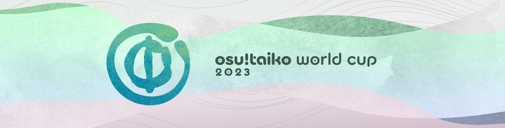
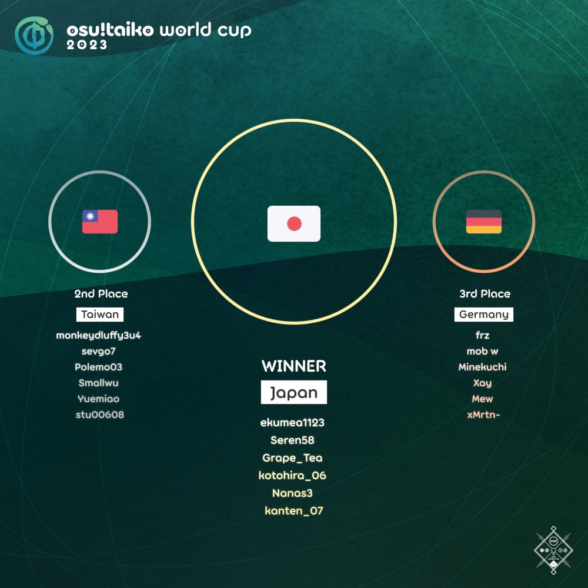

---
tags:
  - TWC
  - TWC2023
  - TWC 2023
---

# osu!taiko World Cup 2023

The **osu!taiko World Cup 2023** (***TWC 2023***) was a country-based osu!taiko tournament hosted by the [osu! team](/wiki/People/osu!_team). It was the thirteenth instalment of the osu!taiko World Cup.

## Tournament schedule

| Event | Timestamp |
| --: | :-- |
| Registration phase | 2023-02-16/2023-03-02 |
| Qualifier showcase | 2023-03-12 (14:00 UTC) |
| Qualifier stage | 2023-03-18/2023-03-19 |
| Round of 32 | 2023-03-25/2023-03-26 |
| Round of 16 | 2023-04-01/2023-04-02 |
| Quarterfinals | 2023-04-08/2023-04-09 |
| Semifinals | 2023-04-15/2023-04-16 |
| Finals | 2023-04-22/2023-04-23 |
| Grand Finals | 2023-04-29/2023-04-30 |

## Prizes

The osu!taiko World Cup 2023 offered a minimum $2,000 cash prize pool and limited-edition merch. The prize pool was further increased to $2,185 from [community donations](https://opencollective.com/osu-tournaments/events/osu-taiko-world-cup-2023-13130e56).

| Placing | Prizes |
| :-: | :-- |
|  | 50% of the prize pool, single-run merch, profile badge, **osu!taiko Champion** user title for one year |
|  | 30% of the prize pool, single-run merch, profile badge |
|  | 20% of the prize pool, single-run merch, profile badge |

  

## Organisation

The osu!taiko World Cup 2023 was run by various community members.

| Position | Member(s) |
| :-- | :-- |
| Manager | ::{ flag=CA }:: [Azer](https://osu.ppy.sh/users/2155578), ::{ flag=US }:: [ChillierPear](https://osu.ppy.sh/users/9501251), ::{ flag=BR }:: [LeoFLT](https://osu.ppy.sh/users/3668779), ::{ flag=GB }:: [mangomizer](https://osu.ppy.sh/users/1893718) |
| Mappool selector | ::{ flag=GB }:: **[mangomizer](https://osu.ppy.sh/users/1893718)**, ::{ flag=US }:: [Lumenite\-](https://osu.ppy.sh/users/6256027), ::{ flag=JP }:: [Maimaing](https://osu.ppy.sh/users/14520910), ::{ flag=US }:: [Nifty](https://osu.ppy.sh/users/4956097) |
| Mappool playtester | ::{ flag=JP }:: [4sbet1](https://osu.ppy.sh/users/11563671), ::{ flag=US }:: [Backfire](https://osu.ppy.sh/users/263110), ::{ flag=BR }:: [HiroK](https://osu.ppy.sh/users/4050738), ::{ flag=AU }:: [Jaye](https://osu.ppy.sh/users/4841352), ::{ flag=SE }:: [Nurend](https://osu.ppy.sh/users/9905079), ::{ flag=SE }:: [Raphalge](https://osu.ppy.sh/users/3918650) |
| Mapper | ::{ flag=SG }:: [\_gt](https://osu.ppy.sh/users/8301957), ::{ flag=HK }:: [\_mtk](https://osu.ppy.sh/users/9468283), ::{ flag=JP }:: [\_Rise](https://osu.ppy.sh/users/5217107), ::{ flag=JP }:: [4sbet1](https://osu.ppy.sh/users/11563671), ::{ flag=JP }:: [7\_7](https://osu.ppy.sh/users/7491106), ::{ flag=GB }:: [aceticke](https://osu.ppy.sh/users/8838763), ::{ flag=DE }:: [Ak1o](https://osu.ppy.sh/users/1600041), ::{ flag=US }:: [Alchyr](https://osu.ppy.sh/users/4993032), ::{ flag=US }:: [Annabel](https://osu.ppy.sh/users/3388410), ::{ flag=NL }:: [Boaz](https://osu.ppy.sh/users/13302996), ::{ flag=TR }:: [Burak](https://osu.ppy.sh/users/13213075), ::{ flag=DE }:: [Capu](https://osu.ppy.sh/users/2474015), ::{ flag=MY }:: [cdh](https://osu.ppy.sh/users/2403621), ::{ flag=RU }:: [clockbite](https://osu.ppy.sh/users/16736934), ::{ flag=HK }:: [Cynplytholowazy](https://osu.ppy.sh/users/3901754), ::{ flag=MX }:: [DakeDekaane](https://osu.ppy.sh/users/1425253), ::{ flag=MN }:: [dtn](https://osu.ppy.sh/users/17630767), ::{ flag=HK }:: [Faputa](https://osu.ppy.sh/users/845733), ::{ flag=US }:: [fieryrage](https://osu.ppy.sh/users/3533958), ::{ flag=BR }:: [flr](https://osu.ppy.sh/users/4689256), ::{ flag=PH }:: [Fynbi](https://osu.ppy.sh/users/2164993), ::{ flag=US }:: [Garpo](https://osu.ppy.sh/users/4097035), ::{ flag=GB }:: [Grimbow](https://osu.ppy.sh/users/1387762), ::{ flag=SE }:: [Hana Hayashi](https://osu.ppy.sh/users/4601806), ::{ flag=BR }:: [HiroK](https://osu.ppy.sh/users/4050738), ::{ flag=TN }:: [Hivie](https://osu.ppy.sh/users/14102976), ::{ flag=NL }:: [ikin5050](https://osu.ppy.sh/users/4007649), ::{ flag=HK }:: [Irone OSU](https://osu.ppy.sh/users/10678230), ::{ flag=FI }:: [Jaltzu](https://osu.ppy.sh/users/2597417), ::{ flag=AU }:: [Jaye](https://osu.ppy.sh/users/4841352), ::{ flag=US }:: [Jonarwhal](https://osu.ppy.sh/users/3653035), ::{ flag=JP }:: [komasy](https://osu.ppy.sh/users/1980256), ::{ flag=MY }:: [ler1211](https://osu.ppy.sh/users/19901680), ::{ flag=US }:: [Lumenite\-](https://osu.ppy.sh/users/6256027), ::{ flag=JP }:: [Maimaing](https://osu.ppy.sh/users/14520910), ::{ flag=US }:: [Miniature Lamp](https://osu.ppy.sh/users/9821194), ::{ flag=MY }:: [MTNTWarz](https://osu.ppy.sh/users/14036825), ::{ flag=US }:: [Nao Tomori](https://osu.ppy.sh/users/5364763), ::{ flag=HK }:: [Nardoxyribonucleic](https://osu.ppy.sh/users/876419), ::{ flag=JP }:: [Naryuga](https://osu.ppy.sh/users/522188), ::{ flag=US }:: [Nifty](https://osu.ppy.sh/users/4956097), ::{ flag=SE }:: [Nurend](https://osu.ppy.sh/users/9905079), ::{ flag=DE }:: [Nwolf](https://osu.ppy.sh/users/1910766), ::{ flag=SE }:: [Raphalge](https://osu.ppy.sh/users/3918650), ::{ flag=ID }:: [raynald](https://osu.ppy.sh/users/25094413), ::{ flag=NO }:: [roufou](https://osu.ppy.sh/users/1109122), ::{ flag=CA }:: [rubies87](https://osu.ppy.sh/users/4949934), ::{ flag=KR }:: [sendol](https://osu.ppy.sh/users/4433058), ::{ flag=JP }:: [Shamirin\_mzk](https://osu.ppy.sh/users/11325757), ::{ flag=JP }:: [tasuke912](https://osu.ppy.sh/users/2774767), ::{ flag=JP }:: [uone](https://osu.ppy.sh/users/5321719), ::{ flag=KR }:: [woosungko](https://osu.ppy.sh/users/14184157), ::{ flag=US }:: [youtune3](https://osu.ppy.sh/users/6442010), ::{ flag=GB }:: [ZTH](https://osu.ppy.sh/users/5258461) |
| Commentator | ::{ flag=AU }:: [Beat43210](https://osu.ppy.sh/users/5664171), ::{ flag=US }:: [driodx](https://osu.ppy.sh/users/9709548), ::{ flag=US }:: [ETHN](https://osu.ppy.sh/users/9536977), ::{ flag=CA }:: [janitore](https://osu.ppy.sh/users/3307897), ::{ flag=AU }:: [Jaye](https://osu.ppy.sh/users/4841352), ::{ flag=DE }:: [Joogs](https://osu.ppy.sh/users/8844167), ::{ flag=US }:: [Lumenite\-](https://osu.ppy.sh/users/6256027), ::{ flag=DE }:: [Nwolf](https://osu.ppy.sh/users/1910766), ::{ flag=GB }:: [Teezel](https://osu.ppy.sh/users/7528639), ::{ flag=AR }:: [Vaf](https://osu.ppy.sh/users/12589048), ::{ flag=HK }:: [YonGin](https://osu.ppy.sh/users/7109317) |
| Referee | ::{ flag=NL }:: [Albionthegreat](https://osu.ppy.sh/users/9853595), ::{ flag=AU }:: [Fairy Bread](https://osu.ppy.sh/users/8306102), ::{ flag=BR }:: [LeoFLT](https://osu.ppy.sh/users/3668779), ::{ flag=NL }:: [nik](https://osu.ppy.sh/users/10077264), ::{ flag=IN }:: [Speshimen](https://osu.ppy.sh/users/7720204), ::{ flag=US }:: [tigereyes144](https://osu.ppy.sh/users/6499811), ::{ flag=GB }:: [Yazzehh](https://osu.ppy.sh/users/7068973), ::{ flag=US }:: [\[K\]](https://osu.ppy.sh/users/16551387) |
| Statistician | ::{ flag=FI }:: [shdewz](https://osu.ppy.sh/users/10000899) |

## Links

- [Information spreadsheet](https://docs.google.com/spreadsheets/d/e/2PACX-1vQVZQZCgZ1cw1N6w0CGsnSGT2-ILaWMYo88bRDXQycx03Rw0yawJikrOGB_rsx1k0LVY7UaO1DVU_5J/pubhtml)
- [Discussion thread](https://osu.ppy.sh/community/forums/topics/1722224)
- [Livestream](https://www.twitch.tv/osulive)
- [Challonge bracket](https://challonge.com/TWC_2023)
- [Pick'ems page](https://pickem.hwc.hr/tournaments/110) hosted by ::{ flag=DE }:: [hallowatcher](https://osu.ppy.sh/users/1874761)

## Participants

|  | Country | Members |
| :-: | :-: | :-- |
| ::{ flag=AR }:: | **Argentina** | **[Axer](https://osu.ppy.sh/users/7299864)**, [-EikoNoChikara-](https://osu.ppy.sh/users/5040981), [Ingrid10](https://osu.ppy.sh/users/9786011), [Megafan](https://osu.ppy.sh/users/6632605), [Atreevete](https://osu.ppy.sh/users/2615199), [mati-bmp](https://osu.ppy.sh/users/24719267) |
| ::{ flag=AU }:: | **Australia** | **[r1chyy](https://osu.ppy.sh/users/11499467)**, [Tsubasa2](https://osu.ppy.sh/users/6835183), [Sivies](https://osu.ppy.sh/users/3597096), [NangLordSazzo](https://osu.ppy.sh/users/11457644), [AmateurMonkeyYT](https://osu.ppy.sh/users/8379046), [Beat43210](https://osu.ppy.sh/users/5664171) |
| ::{ flag=AT }:: | **Austria** | **[Amane](https://osu.ppy.sh/users/6821436)**, [animexamera](https://osu.ppy.sh/users/7511357), [Mina\_yo](https://osu.ppy.sh/users/2678422), [Feli-san](https://osu.ppy.sh/users/23636963), [Cupcake\_Lover](https://osu.ppy.sh/users/1776389), [JakobDerNoob](https://osu.ppy.sh/users/15260267) |
| ::{ flag=BR }:: | **Brazil** | **[Foxeru](https://osu.ppy.sh/users/7479684)**, [Skull Kid](https://osu.ppy.sh/users/3044264), [Kyoumo](https://osu.ppy.sh/users/8145223), [miwoo](https://osu.ppy.sh/users/12630336), [ImTutu](https://osu.ppy.sh/users/16262582), [Spicy Onion](https://osu.ppy.sh/users/11799110) |
| ::{ flag=CA }:: | **Canada** | **[Dizzayy](https://osu.ppy.sh/users/12014683)**, [Ascrute](https://osu.ppy.sh/users/13175389), [Nanners](https://osu.ppy.sh/users/459886), [SMG3](https://osu.ppy.sh/users/7189946), [beary605](https://osu.ppy.sh/users/2198070), [honkers](https://osu.ppy.sh/users/3075337) |
| ::{ flag=CL }:: | **Chile** | **[Ulqui](https://osu.ppy.sh/users/1263669)**, [Necromancy-](https://osu.ppy.sh/users/1890084), [\[GS\]Myuka](https://osu.ppy.sh/users/10072733), [Escocyan](https://osu.ppy.sh/users/9057823), [iNeon](https://osu.ppy.sh/users/10907480), [Shiny Froakie](https://osu.ppy.sh/users/6194830) |
| ::{ flag=CN }:: | **China** | **[superSSS](https://osu.ppy.sh/users/4315477)**, [szh134](https://osu.ppy.sh/users/6844521), [WLYMinato](https://osu.ppy.sh/users/12703319), [shoucan91](https://osu.ppy.sh/users/9383908), [Ookura Risona](https://osu.ppy.sh/users/2073644), [\[GB\]Edward\_Tsui](https://osu.ppy.sh/users/8609627) |
| ::{ flag=CO }:: | **Colombia** | **[L1ght](https://osu.ppy.sh/users/9050875)**, [ParraCharlie](https://osu.ppy.sh/users/18425848), [Hermite](https://osu.ppy.sh/users/7945286), [sti](https://osu.ppy.sh/users/1271807) |
| ::{ flag=CZ }:: | **Czechia** | **[Golden](https://osu.ppy.sh/users/12639462)**, [iTzzMar0](https://osu.ppy.sh/users/13108155), [FlipRop](https://osu.ppy.sh/users/10806437), [ToraThePotato](https://osu.ppy.sh/users/10742918), [nevqr](https://osu.ppy.sh/users/14269506), [Spinasson](https://osu.ppy.sh/users/21448085) |
| ::{ flag=DK }:: | **Denmark** | **[Captain](https://osu.ppy.sh/users/2563435)**, [Tsukani](https://osu.ppy.sh/users/5146144), [Leriola](https://osu.ppy.sh/users/18539549), [melon boy](https://osu.ppy.sh/users/3053382) |
| ::{ flag=EE }:: | **Estonia** | **[PaskAcc](https://osu.ppy.sh/users/9040795)**, [a720863z](https://osu.ppy.sh/users/18535399), [TkonicRabid](https://osu.ppy.sh/users/10480961), [Definedd](https://osu.ppy.sh/users/22750981) |
| ::{ flag=FI }:: | **Finland** | **[duski](https://osu.ppy.sh/users/6506484)**, [MEGAMELA](https://osu.ppy.sh/users/13613362), [vodnanen](https://osu.ppy.sh/users/10335557), [Antti](https://osu.ppy.sh/users/13281473), [Mazzuli500](https://osu.ppy.sh/users/10648818) |
| ::{ flag=FR }:: | **France** | **[QALF](https://osu.ppy.sh/users/11525993)**, [-Akitai-](https://osu.ppy.sh/users/8897643), [Ekoro](https://osu.ppy.sh/users/284905), [Ranshi](https://osu.ppy.sh/users/6680785), [TimmyAkmed](https://osu.ppy.sh/users/1799973), [YaniFR](https://osu.ppy.sh/users/11260982) |
| ::{ flag=DE }:: | **Germany** | **[frz](https://osu.ppy.sh/users/6956922)**, [mob w](https://osu.ppy.sh/users/6851789), [Minekuchi](https://osu.ppy.sh/users/9584873), [Xay](https://osu.ppy.sh/users/961417), [Mew](https://osu.ppy.sh/users/2345156), [xMrtn-](https://osu.ppy.sh/users/866297) |
| ::{ flag=HK }:: | **Hong Kong** | **[YonGin](https://osu.ppy.sh/users/7109317)**, [Shing\_](https://osu.ppy.sh/users/2211364), [Irone OSU](https://osu.ppy.sh/users/10678230), [Henry\_03](https://osu.ppy.sh/users/17413733), [Iwvi](https://osu.ppy.sh/users/702611), [Takuto271](https://osu.ppy.sh/users/2226395) |
| ::{ flag=ID }:: | **Indonesia** | **[Joltzzz](https://osu.ppy.sh/users/15436568)**, [Naverlyn](https://osu.ppy.sh/users/14324722), [ImChro](https://osu.ppy.sh/users/7280717), [Lightning Wyvern](https://osu.ppy.sh/users/1533122), [Volta](https://osu.ppy.sh/users/4154071), [Veltlion](https://osu.ppy.sh/users/10999079) |
| ::{ flag=IT }:: | **Italy** | **[Ikkun](https://osu.ppy.sh/users/1059945)**, [ndrrr](https://osu.ppy.sh/users/4609767), [A-40](https://osu.ppy.sh/users/14510301), [D3kuu](https://osu.ppy.sh/users/7807444), [partyboy95](https://osu.ppy.sh/users/3716665) |
| ::{ flag=JP }:: | **Japan** | **[ekumea1123](https://osu.ppy.sh/users/9119501)**, [Seren58](https://osu.ppy.sh/users/15252950), [Grape\_Tea](https://osu.ppy.sh/users/9540073), [kotohira\_06](https://osu.ppy.sh/users/22444525), [Nanas3](https://osu.ppy.sh/users/17015562), [kanten\_07](https://osu.ppy.sh/users/11680357) |
| ::{ flag=LV }:: | **Latvia** | **[waywern2012](https://osu.ppy.sh/users/5870453)**, [Huntey](https://osu.ppy.sh/users/14451706), [Piparkuucinsh](https://osu.ppy.sh/users/7453024), [Bezmozglij123](https://osu.ppy.sh/users/20489038), [- k1ryaa](https://osu.ppy.sh/users/17609405) |
| ::{ flag=LT }:: | **Lithuania** | **[ramojusd](https://osu.ppy.sh/users/14400817)**, [Atago](https://osu.ppy.sh/users/7011843), [Beesu](https://osu.ppy.sh/users/9117835), [wwww](https://osu.ppy.sh/users/3997162) |
| ::{ flag=MY }:: | **Malaysia** | **[CrabCow](https://osu.ppy.sh/users/9755504)**, [\[Zeth\]](https://osu.ppy.sh/users/9912966), [6gicha](https://osu.ppy.sh/users/12273160), [HHVanilla Ice](https://osu.ppy.sh/users/12803930), [Jerry](https://osu.ppy.sh/users/605973) |
| ::{ flag=MX }:: | **Mexico** | **[Iojioji](https://osu.ppy.sh/users/1346121)**, [-HiddenTaco-](https://osu.ppy.sh/users/7320933), [Hivan111](https://osu.ppy.sh/users/13525805), [Awwy](https://osu.ppy.sh/users/4183406), [Maximil4813N](https://osu.ppy.sh/users/20089489), [ZaveryK](https://osu.ppy.sh/users/10913397) |
| ::{ flag=NL }:: | **Netherlands** | **[Cookie\_Tree](https://osu.ppy.sh/users/502722)**, [StrijkIjzer](https://osu.ppy.sh/users/4130926), [Hypello](https://osu.ppy.sh/users/1594036), [Tyronix](https://osu.ppy.sh/users/11290311), [R1ght4](https://osu.ppy.sh/users/21564948), [SmokyBeen](https://osu.ppy.sh/users/13832554) |
| ::{ flag=NZ }:: | **New Zealand** | **[Sparxe](https://osu.ppy.sh/users/5750235)**, [Zed0x](https://osu.ppy.sh/users/12136108), [New Zealand](https://osu.ppy.sh/users/9039824), [idk123456](https://osu.ppy.sh/users/18718856), [Blujae](https://osu.ppy.sh/users/10613885), [Bwhaa](https://osu.ppy.sh/users/7960435) |
| ::{ flag=NO }:: | **Norway** | **[Vendelicious](https://osu.ppy.sh/users/8818089)**, [petterde](https://osu.ppy.sh/users/7555792), [Loff](https://osu.ppy.sh/users/8947341), [Mist31](https://osu.ppy.sh/users/18916920), [Defectum](https://osu.ppy.sh/users/8631719) |
| ::{ flag=PE }:: | **Peru** | **[alemagno333](https://osu.ppy.sh/users/11411697)**, [ZupOSU](https://osu.ppy.sh/users/23361435), [FabriGamer84](https://osu.ppy.sh/users/20882798), [Pachekin](https://osu.ppy.sh/users/8257441) |
| ::{ flag=PH }:: | **Philippines** | **[Pochacco](https://osu.ppy.sh/users/2927742)**, [jmeh07](https://osu.ppy.sh/users/2852269), [DescriptiCringe](https://osu.ppy.sh/users/10882115), [Aiery](https://osu.ppy.sh/users/10363380), [JoshEco4](https://osu.ppy.sh/users/18591473), [qish](https://osu.ppy.sh/users/17050115) |
| ::{ flag=PL }:: | **Poland** | **[bernard351](https://osu.ppy.sh/users/9511518)**, [Akamileusz](https://osu.ppy.sh/users/6807238), [knibblet](https://osu.ppy.sh/users/6922240), [nickname2500](https://osu.ppy.sh/users/5385606), [SKRIS-MI](https://osu.ppy.sh/users/15330641), [krytwal](https://osu.ppy.sh/users/17540374) |
| ::{ flag=PT }:: | **Portugal** | **[BabySnakes](https://osu.ppy.sh/users/4669728)**, [Shinzui](https://osu.ppy.sh/users/2505011), [Warpzoned](https://osu.ppy.sh/users/18649724), [Rosa](https://osu.ppy.sh/users/7385703), [MeovvCAT](https://osu.ppy.sh/users/5905091), [ImDem0nPT](https://osu.ppy.sh/users/12733839) |
| ::{ flag=RU }:: | **Russian Federation** | **[fullaltshallah](https://osu.ppy.sh/users/9976154)**, [Den4ik228](https://osu.ppy.sh/users/7115174), [taikoshallah](https://osu.ppy.sh/users/11117835), [Dayzeek](https://osu.ppy.sh/users/5009970), [rollshallah](https://osu.ppy.sh/users/8188876), [krokodil\_koban](https://osu.ppy.sh/users/24910091) |
| ::{ flag=SG }:: | **Singapore** | **[MattrexDark](https://osu.ppy.sh/users/7171110)**, [Element118](https://osu.ppy.sh/users/2283992), [IJosephI\[GS\]](https://osu.ppy.sh/users/13353749), [TheFunk](https://osu.ppy.sh/users/13981991) |
| ::{ flag=KR }:: | **South Korea** | **[oL0](https://osu.ppy.sh/users/1134683)**, [Laby](https://osu.ppy.sh/users/9085164), [4\_4](https://osu.ppy.sh/users/1152851), [ChoSeung](https://osu.ppy.sh/users/6367560), [ILOVEMARISA](https://osu.ppy.sh/users/8767392), [RaiRator](https://osu.ppy.sh/users/5054081) |
| ::{ flag=ES }:: | **Spain** | **[AlvaroYL](https://osu.ppy.sh/users/6333166)**, [Alsael](https://osu.ppy.sh/users/13938746), [MantequillAlex](https://osu.ppy.sh/users/11499752), [OneBurstMan](https://osu.ppy.sh/users/5285438), [Celoluna](https://osu.ppy.sh/users/14571758), [Penvoltio](https://osu.ppy.sh/users/8849448) |
| ::{ flag=CH }:: | **Switzerland** | **[MC2BP](https://osu.ppy.sh/users/11296097)**, [cholarmor](https://osu.ppy.sh/users/21502158), [Oui](https://osu.ppy.sh/users/5538419), [Zero1519](https://osu.ppy.sh/users/547957) |
| ::{ flag=TW }:: | **Taiwan** | **[monkeydluffy3u4](https://osu.ppy.sh/users/2277798)**, [sevgo7](https://osu.ppy.sh/users/23487206), [Polemo03](https://osu.ppy.sh/users/10726804), [Smallwu](https://osu.ppy.sh/users/2512120), [Yuemiao](https://osu.ppy.sh/users/4493348), [stu00608](https://osu.ppy.sh/users/1977606) |
| ::{ flag=GB }:: | **United Kingdom** | **[goheegy](https://osu.ppy.sh/users/8057655)**, [Horiiizon](https://osu.ppy.sh/users/8071438), [Dusk-](https://osu.ppy.sh/users/6092181), [overdahedge2014](https://osu.ppy.sh/users/9864847), [Daniels](https://osu.ppy.sh/users/12439209), [InspectElement](https://osu.ppy.sh/users/8484987) |
| ::{ flag=US }:: | **United States** | **[cheese salad](https://osu.ppy.sh/users/6349821)**, [AuroraPhasmata](https://osu.ppy.sh/users/13664116), [ChurroChef](https://osu.ppy.sh/users/9258564), [FrootLoopy542](https://osu.ppy.sh/users/5468461), [pet](https://osu.ppy.sh/users/1656336), [R J](https://osu.ppy.sh/users/6490509) |
| ::{ flag=VN }:: | **Vietnam** | **[davidminh0111](https://osu.ppy.sh/users/9623142)**, [-M\_A\_T\_C\_H\_A-](https://osu.ppy.sh/users/26012543), [crazynt\_ngu](https://osu.ppy.sh/users/7844013), [hi\_there\_osu](https://osu.ppy.sh/users/22698999), [njshift1](https://osu.ppy.sh/users/16688499), [Creeperbrine303](https://osu.ppy.sh/users/22515524) |

The complete sign-up list can be found [here](https://gist.github.com/LeoFLT/0ad463970c6b5c22f623fcefd8d5e63d#file-twc-2023-player-list-csv).

## Podium

## Mappools

### Grand Finals

**[Download the mappack here (98 MB)](https://drive.google.com/uc?id=1LFIn2kTwIXtRpeNeTuza0Kh21tNvYhMo)**

- No Mod
  1. [Sobrem - Super Macaron (4sbet1) \[Super Macaroni\]](https://osu.ppy.sh/beatmapsets/1980775#taiko/4113069)
  2. [katagiri - Angel's Salad (Nwolf) \[WereOni\]](https://osu.ppy.sh/beatmapsets/1980692#taiko/4112862)
  3. [7\_7 feat. kasane vavzed - 7D (7\_7) \[7\_7\]](https://osu.ppy.sh/beatmapsets/1980743#taiko/4113017)
  4. [II-L - EXPLORER-4 (Miniature Lamp) \[Cosmic Cruise\]](https://osu.ppy.sh/beatmapsets/1664805#taiko/3398617)
  5. [Nile - Snake Pit Mating Frenzy (ikin5050) \[Snake Oni\]](https://osu.ppy.sh/beatmapsets/1980708#taiko/4112907)
  6. [Raimukun - Firmament Star (rubies87) \[Galactic Ascension\]](https://osu.ppy.sh/beatmapsets/1980788#taiko/4113087)
- Hidden
  1. [Riya - Laboratory-18 (woosungko) \[Synthesis (TWC Ver.)\]](https://osu.ppy.sh/beatmapsets/1814106#taiko/3721620)
  2. [FRASER EDWARDS - The Harvest (nananass) \[Oni\]](https://osu.ppy.sh/beatmapsets/1878351#taiko/3866454)
- Hard Rock
  1. [Silentroom - Shuu no Hazama (HiroK) \[Hell Oni\]](https://osu.ppy.sh/beatmapsets/1980705#taiko/4112897)
  2. [Rabbit House - Gehenna (Raphalge) \[Inner Oni\]](https://osu.ppy.sh/beatmapsets/1980698#taiko/4112875)
- Double Time
  1. [Camellia - PLANET//SHAPER (Genjuro) \[Fabrication of the Universe\]](https://osu.ppy.sh/beatmapsets/921130#taiko/1923544)
  2. [MIMI - Toumeika (ler1211) \[Transparent\]](https://osu.ppy.sh/beatmapsets/1980700#taiko/4112881)
- FreeMod
  1. [Marmalade butcher - Amanita (sendol) \[X\]](https://osu.ppy.sh/beatmapsets/1720005#taiko/3515099)
  2. [Thaehan - Overworld (Tasha) \[Muri\]](https://osu.ppy.sh/beatmapsets/545510#taiko/1155694)
  3. [LV.4 feat. Mawata Spica - Vortex of Sorrow (uone) \[END\]](https://osu.ppy.sh/beatmapsets/1980701#taiko/4112884)
- Tiebreaker
  1. **[Gram - Sigrdrifa (Nifty) \[Prose Edda\]](https://osu.ppy.sh/beatmapsets/1981053#taiko/4113613)**

### Finals

**[Download the mappack here (76 MB)](https://drive.google.com/uc?id=1sI6l9kokhpOYrkLqdsliW0j9lhh-6ySd)**

- No Mod
  1. [rN - onostrapha (Cynplytholowazy) \[calamity\]](https://osu.ppy.sh/beatmapsets/1976633#taiko/4103021)
  2. [Masahiro "Godspeed" Aoki - Twister (tasuke912) \[TAIKO-HOLIC\]](https://osu.ppy.sh/beatmapsets/1441606#taiko/2965671)
  3. [Aquestion - Umami Blaze (youtune3) \[Infernal Oni\]](https://osu.ppy.sh/beatmapsets/1976814#taiko/4103528)
  4. [linear ring - Can you hear me? (DEtermination21) \[Waltz of White Noise\]](https://osu.ppy.sh/beatmapsets/1713296#taiko/3500751)
  5. [BLANKFIELD - The Red and White (Ak1o) \[The Red and Blue\]](https://osu.ppy.sh/beatmapsets/1976559#taiko/4102855)
  6. [Mono. - ROCKET START (Shamirin\_mzk) \[Kinpatsu Loni\]](https://osu.ppy.sh/beatmapsets/1976801#taiko/4103485)
- Hidden
  1. [Marmalade butcher - Mirage Age (Eyenine) \[Image\]](https://osu.ppy.sh/beatmapsets/1520484#taiko/3141358)
  2. [Rish feat. Choko - Punai Punai Gensou \~Punai Punai in Wonderland\~ (ler1211) \[Punai World Cup\]](https://osu.ppy.sh/beatmapsets/1977053#taiko/4104127)
- Hard Rock
  1. [ISOMERZ (DJ Raisei + seatrus) - Symmetric (sendol) \[Self-Similarity\]](https://osu.ppy.sh/beatmapsets/1612240#taiko/3292583)
  2. [technoplanet feat. Haruno - End of Fairytale (Maimaing) \[Hell Oni\]](https://osu.ppy.sh/beatmapsets/1976819#taiko/4103534)
- Double Time
  1. [technoplanet - Megastructure \[Extended Mix\] (duski) \[Inner Oni\]](https://osu.ppy.sh/beatmapsets/1499443#taiko/3113038)
  2. [rejection - Aimai Attitude (feat. Nakamura Sanso) (KTYN) \[Behind the Mind\]](https://osu.ppy.sh/beatmapsets/1261099#taiko/2621461)
- Free Mod
  1. [Masahiro "Godspeed" Aoki - Blaze (roufou) \[Hell Oni\]](https://osu.ppy.sh/beatmapsets/1976839#taiko/4103593)
  2. [II-L - SPUTNIK-3 (Horiiizon) \[OUTER SPACE\]](https://osu.ppy.sh/beatmapsets/1596423#taiko/3260555)
  3. [SOOOO - iiillluuuvvvUUU (4sbet1) \[hhheeellllllOOO\]](https://osu.ppy.sh/beatmapsets/1976827#taiko/4103565)
- Tiebreaker
  1. **[BilliumMoto & Dictate - 1KARUGA (HiroK) \[H1roK & u1's 1nner On1\]](https://osu.ppy.sh/beatmapsets/1976834#taiko/4103575)**

### Semifinals

**[Download the mappack here (88 MB)](https://drive.google.com/uc?id=108ermOWRbv1-CLTuBeJvWGVJ8DsgcBV5)**

- No Mod
  1. [Morimori Atsushi - Le Cirque de Minuit (2019 Re:work) (raynald) \[Night Circus\]](https://osu.ppy.sh/beatmapsets/1972313#taiko/4092558)
  2. [Toromaru - Sleight of Hand (Nurend) \[Disruption\]](https://osu.ppy.sh/beatmapsets/1972518#taiko/4093075)
  3. [antiPLUR - Runengon (aceticke) \[Supersonic Planetary System\]](https://osu.ppy.sh/beatmapsets/1972575#taiko/4093198)
  4. [Inferi - Wrath of the Fallen One (Raiden) \[Vaecordia\]](https://osu.ppy.sh/beatmapsets/1168660#taiko/2438332)
  5. [ZxNX as "Delaina" - End Me (dtn) \[End Game\]](https://osu.ppy.sh/beatmapsets/1972399#taiko/4092843)
- Hidden
  1. [CHON - Dew (Jaye) \[Elements of Life\]](https://osu.ppy.sh/beatmapsets/1972526#taiko/4093096)
  2. [Morimori Atsushi vs. uma - ETERNAL:DREAMER (Naryuga) \[Hell Oni\]](https://osu.ppy.sh/beatmapsets/1972781#taiko/4093577)
- Hard Rock
  1. [w\_tre - Shannon's Theorem (Raphalge) \[Inner Oni\]](https://osu.ppy.sh/beatmapsets/1972531#taiko/4093122)
  2. [SWORD OF JUSTICE - Sword of Justice (\_mtk) \[Hikari yo\]](https://osu.ppy.sh/beatmapsets/1972458#taiko/4092947)
- Double Time
  1. [MuryokuP - Frozen World (ikin5050) \[Northern Lights\]](https://osu.ppy.sh/beatmapsets/1972541#taiko/4093146)
  2. [Imy - Over the limit (Nardoxyribonucleic) \[Limitless Oni\]](https://osu.ppy.sh/beatmapsets/1972545#taiko/4093155)
- Free Mod
  1. [SAMString - Ataraxia (MTNTWarz) \[Serenity\]](https://osu.ppy.sh/beatmapsets/1972547#taiko/4093157)
  2. [Hino Isuka vs. s-don - Glooorious!! (ZTH) \[Inner Oni\]](https://osu.ppy.sh/beatmapsets/1972551#taiko/4093161)
  3. [LV.4 - Sentimental Surge (Hana Hayashi) \[Serotonin Syndrome\]](https://osu.ppy.sh/beatmapsets/1972728#taiko/4093466)
- Tiebreaker
  1. **[katagiri - Kyuukou (ler1211) \[Confluence\]](https://osu.ppy.sh/beatmapsets/1941880#taiko/4016719)**

### Quarterfinals

**[Download the mappack here (82 MB)](https://drive.google.com/uc?id=13RGv-KkXBSL-QAmmO_gmmfCRRxntFHsI)**

- No Mod
  1. [Zekk - Sugary Daydream (TKS) \[Hell Oni\]](https://osu.ppy.sh/beatmapsets/578489#taiko/1224835)
  2. [Billain & Vegas - Shinde (Arrival) \[Oni\]](https://osu.ppy.sh/beatmapsets/1362405#taiko/2818836)
  3. [Se-U-Ra - Tsui no Maihime (sendol) \[10^13.5\]](https://osu.ppy.sh/beatmapsets/1967789#taiko/4081022)
  4. [Camellia - Blackmagik Blazing (\_yu68) \[Inner Oni\]](https://osu.ppy.sh/beatmapsets/1087782#taiko/2274690)
  5. [METAROOM - WORM RAVE (woosungko) \[JUMBLE\]](https://osu.ppy.sh/beatmapsets/1968269#taiko/4082434)
- Hidden
  1. [Toromaru - Uncharted Sky (Faputa) \[Inner Oni\]](https://osu.ppy.sh/beatmapsets/1967930#taiko/4081437)
  2. [NIWASHI - T\_ritama Breaker (Irone OSU) \[Eradicate (Edit)\]](https://osu.ppy.sh/beatmapsets/1634455#taiko/4081202)
- Hard Rock
  1. [Umeboshi Chazuke - Midnight Trickster (HiroK) \[:seal:\]](https://osu.ppy.sh/beatmapsets/1968104#taiko/4082108)
  2. [Imy - Countdown (Raphalge) \[Inner Oni\]](https://osu.ppy.sh/beatmapsets/1967985#taiko/4081872)
- Double Time
  1. [Grant - Weapon (feat. Baum) (rubies87) \[Lethality\]](https://osu.ppy.sh/beatmapsets/1967931#taiko/4081439)
  2. [SECONDWALL - Natsu no Owari (Hivie) \[Rainy Summer\]](https://osu.ppy.sh/beatmapsets/1404425#taiko/2896554)
- Free Mod
  1. [LeaF - Calamity Fortune (DakeDekaane) \[Inner Oni (TWC Edit)\]](https://osu.ppy.sh/beatmapsets/1968850#taiko/4083711)
  2. [Zekk - Falling Down feat. Renko x TRIANGLE (Backfire) \[OOni\]](https://osu.ppy.sh/beatmapsets/1969845#taiko/4086680)
  3. [Plum - Mad Piano Party II (tasuke912) \[FM3\]](https://osu.ppy.sh/beatmapsets/1968116#taiko/4082132)
- Tiebreaker
  1. **[Kurokotei feat. Sennzai - escape (the looking-glass, and what alice found there) (Megafan) \[Bandersnatch\]](https://osu.ppy.sh/beatmapsets/1908229#taiko/3935137)**

### Round of 16

**[Download the mappack here (66 MB)](https://drive.google.com/uc?id=1m75THvxZQ_d9adBFBg7_6X-6hMWAgApf)**

- No Mod
  1. [Plum - Tempest (Capu) \[X\]](https://osu.ppy.sh/beatmapsets/1963578#taiko/4069679)
  2. [Toromaru - Curiosity (Lumenite-) \[Killed the Cat\]](https://osu.ppy.sh/beatmapsets/1963577#taiko/4069677)
  3. [LeaF - ATHAZA (Faputa) \[BLOOM\]](https://osu.ppy.sh/beatmapsets/1257077#taiko/2612133)
  4. [Magnetude - Falling (Cut Ver.) (clockbite) \[Into The Deep\]](https://osu.ppy.sh/beatmapsets/1963585#taiko/4069755)
- Hidden
  1. [RiraN - Lose Control (Jonarwhal) \[Let's play a game\]](https://osu.ppy.sh/beatmapsets/1963693#taiko/4070008)
  2. [Hino Isuka - Wonderful Paradise (uone) \[Inner Oni\]](https://osu.ppy.sh/beatmapsets/1963694#taiko/4070010)
- Hard Rock
  1. [Cinamoro - Another (Hivie) \[Illusion\]](https://osu.ppy.sh/beatmapsets/1963582#taiko/4069722)
  2. [Lime - Chronomia (Nwolf) \[Oni\]](https://osu.ppy.sh/beatmapsets/1963559#taiko/4069646)
- Double Time
  1. [BlackY - Howling Moon (komasy) \[TWC ver.\]](https://osu.ppy.sh/beatmapsets/1963854#taiko/4070769)
  2. [Zekk - SUMMER (\_Rise) \[Oni\]](https://osu.ppy.sh/beatmapsets/1963718#taiko/4070069)
- Free Mod
  1. [Zekk - Duplication (eiri-) \[Facsimile\]](https://osu.ppy.sh/beatmapsets/1963847#taiko/4070755)
  2. [Zenpaku - Blast+ feat. DEMONDICE (Burak) \[Odyssey\]](https://osu.ppy.sh/beatmapsets/1963586#taiko/4069758)
  3. [Morimori Atsushi - PUPA (uma Remix) (Lumenite-) \[Inner Oni (Edit)\]](https://osu.ppy.sh/beatmapsets/1591364#taiko/4069678)
- Tiebreaker
  1. **[Camellia - fastest crash (Camellia's "paroxysmal" Hitech Remix) (Alchyr) \[impact\]](https://osu.ppy.sh/beatmapsets/1963587#taiko/4069759)**

### Round of 32

**[Download the mappack here (83 MB)](https://drive.google.com/uc?id=1iRH0Yk6l-l3xGbR8R-DmYPYoLGCd-VnF)**

- No Mod
  1. [Kola Kid - spaceman (Gamelan4) \[freedom\]](https://osu.ppy.sh/beatmapsets/1108777#taiko/2317154)
  2. [Sobrem x Silentroom - Random (rubies87) \[Inner Oni\]](https://osu.ppy.sh/beatmapsets/1627748#taiko/3323050)
  3. [Rabbit House - Randa no Hen feat. Mitchell (fieryrage) \[i am the taiko player now\]](https://osu.ppy.sh/beatmapsets/1959471#taiko/4060306)
  4. [Waterflame - Time Machine (Cut Ver.) (Fynbi) \[Shift\]](https://osu.ppy.sh/beatmapsets/1959541#taiko/4060422)
- Hidden
  1. [Yuyoyuppe - Kami no Kotoba (Cut Ver.) (Hivie) \[Sorrow (TWC Edit)\]](https://osu.ppy.sh/beatmapsets/1959510#taiko/4060369)
  2. [MisoilePunch - Overrrload!! (iloveyou4ever) \[Inner Oni\]](https://osu.ppy.sh/beatmapsets/1837749#taiko/3773552)
- Hard Rock
  1. [m108 - Crescent Sakura (Antti) \[Inner Oni\]](https://osu.ppy.sh/beatmapsets/1449942#taiko/2981326)
  2. [Se-U-Ra - F-Rozenette (ikin5050) \[Inner Oni\]](https://osu.ppy.sh/beatmapsets/1959488#taiko/4060333)
- Double Time
  1. [Blue Stahli - Blue Stahli (Jaltzu) \[Inner Oni\]](https://osu.ppy.sh/beatmapsets/1576838#taiko/3221023)
  2. [wotoha - Digital Life Hacker (BlackBN) \[Irone's Oni\]](https://osu.ppy.sh/beatmapsets/1522733#taiko/3119398)
- Free Mod
  1. [Redside - Sidequest (Maimaing) \[Taikoquest\]](https://osu.ppy.sh/beatmapsets/1959473#taiko/4060309)
  2. [Tokyo Machine - OKAY (trollocat) \[INNER ONI\]](https://osu.ppy.sh/beatmapsets/1198443#taiko/2495986)
  3. [antiPLUR - One Life Left to Live (Nwolf) \[Last Stand\]](https://osu.ppy.sh/beatmapsets/1198823#taiko/2496686)
- Tiebreaker
  1. **[FRASER EDWARDS - The Reckoning (Garpo) \[Oni\]](https://osu.ppy.sh/beatmapsets/1959475#taiko/4060311)**

### Qualifiers

**[Download the mappack here (52 MB)](https://drive.google.com/uc?id=14RYknWcAXdrIXN7K5PBgxp6fMlOn5Szb)**

- No Mod
  1. [Rabbit House - Seculo Seculorum (raynald) \[Forever\]](https://osu.ppy.sh/beatmapsets/1955322#taiko/4049804)
  2. [False Noise - Space Angel (Cut Ver.) (4sbet1) \[Inner Oni\]](https://osu.ppy.sh/beatmapsets/1955325#taiko/4049809)
  3. [Rish feat. Choko - Take (\_gt) \[1200\]](https://osu.ppy.sh/beatmapsets/1955326#taiko/4049810)
- Hidden
  1. [Silentroom - NULCTRL (Boaz) \[NYCTOPHOBIA\]](https://osu.ppy.sh/beatmapsets/1955317#taiko/4049793)
  2. [ELFENSJoN - INHERIT (flr) \[RECEIVE\]](https://osu.ppy.sh/beatmapsets/1955340#taiko/4049866)
- Hard Rock
  1. [Cinamoro - Variations on D Minor (feat. PLORALD) (Nwolf) \[Variations on Nwolf\]](https://osu.ppy.sh/beatmapsets/1955319#taiko/4049801)
  2. [UNDEAD CORPORATION - Blow (Grimbow) \[Oni\]](https://osu.ppy.sh/beatmapsets/1955320#taiko/4049802)
- Double Time
  1. [meganeko - Ninox (osu! edit) (Nao Tomori) \[Oni\]](https://osu.ppy.sh/beatmapsets/1955324#taiko/4049807)
  2. [kakichoco - Hakudou (Nardoxyribonucleic) \[Oni\]](https://osu.ppy.sh/beatmapsets/1955347#taiko/4049875)
- Free Mod
  1. [Zekk - ReIMEI (cdh) \[AsHITA\]](https://osu.ppy.sh/beatmapsets/1955236#taiko/4049602)

## Match results

### Grand Finals

Detailed statistics for this round can be found [here](https://docs.google.com/spreadsheets/d/1jdC5skkPBgeqOuasLkkihnxpDYbBPK7StmmtlL_TF7M/?rm=minimal).

Saturday, 29 April 2023:

| Team A |  |  | Team B | Match link |
| --: | :-: | :-: | :-- | :-- |
| **Taiwan** ::{ flag=TW }:: | **7** | 6 | ::{ flag=DE }:: Germany | [#1](https://osu.ppy.sh/community/matches/108221558) |

Sunday, 30 April 2023:

| Team A |  |  | Team B | Match link |
| --: | :-: | :-: | :-- | :-- |
| **Japan** ::{ flag=JP }:: | **7** | 0 | ::{ flag=TW }:: Taiwan | [#1](https://osu.ppy.sh/community/matches/108242105) |

### Finals

Detailed statistics for this round can be found [here](https://docs.google.com/spreadsheets/d/1ucXho5aHNBINl73zwoaSd7Lee2d1Bvr5d_DfwaKbfkE?rm=minimal).

Saturday, 22 April 2023:

| Team A |  |  | Team B | Match link |
| --: | :-: | :-: | :-- | :-- |
| **South Korea** ::{ flag=KR }:: | **7** | 3 | ::{ flag=CN }:: China | [#1](https://osu.ppy.sh/community/matches/108099877) |
| United States ::{ flag=US }:: | 0 | **7** | ::{ flag=DE }:: **Germany** | [#1](https://osu.ppy.sh/community/matches/108108909) |

Sunday, 23 April 2023:

| Team A |  |  | Team B | Match link |
| --: | :-: | :-: | :-- | :-- |
| **Japan** ::{ flag=JP }:: | **7** | 0 | ::{ flag=TW }:: Taiwan | [#1](https://osu.ppy.sh/community/matches/108116856) |
| **Germany** ::{ flag=DE }:: | **7** | 3 | ::{ flag=KR }:: South Korea | [#1](https://osu.ppy.sh/community/matches/108118899) |

### Semifinals

Detailed statistics for this round can be found [here](https://docs.google.com/spreadsheets/d/1-53w_zGOQqp4CvIG4mtgxriyRsbW2OibNKxmVVMRH4s/edit?rm=minimal).

Saturday, 15 April 2023:

| Team A |  |  | Team B | Match link |
| --: | :-: | :-: | :-- | :-- |
| **Italy** ::{ flag=IT }:: | **6** | 3 | ::{ flag=MY }:: Malaysia | [#1](https://osu.ppy.sh/community/matches/107968912) |
| **France** ::{ flag=FR }:: | **6** | 4 | ::{ flag=BR }:: Brazil | [#1](https://osu.ppy.sh/community/matches/107975514) |
| **Germany** ::{ flag=DE }:: | **6** | 3 | ::{ flag=CL }:: Chile | [#1](https://osu.ppy.sh/community/matches/107980596) |

Sunday, 16 April 2023:

| Team A |  |  | Team B | Match link |
| --: | :-: | :-: | :-- | :-- |
| United States ::{ flag=US }:: | 4 | **6** | ::{ flag=TW }:: **Taiwan** | [#1](https://osu.ppy.sh/community/matches/107987149) |
| United Kingdom ::{ flag=GB }:: | 5 | **6** | ::{ flag=CN }:: **China** | [#1](https://osu.ppy.sh/community/matches/107991537) |
| Italy ::{ flag=IT }:: | 0 | **6** | ::{ flag=DE }:: **Germany** | [#1](https://osu.ppy.sh/community/matches/107993087) |
| France ::{ flag=FR }:: | 5 | **6** | ::{ flag=CN }:: **China** | [#1](https://osu.ppy.sh/community/matches/107994018) |
| **Japan** ::{ flag=JP }:: | **6** | 0 | ::{ flag=KR }:: South Korea | [#1](https://osu.ppy.sh/community/matches/107994971) |

### Quarterfinals

Detailed statistics for this round can be found [here](https://docs.google.com/spreadsheets/d/1zZuZAkCOa1B7082irzq_wynoTHNSkVh--rVuHsdcVUM?rm=minimal).

Saturday, 8 April 2023:

| Team A |  |  | Team B | Match link |
| --: | :-: | :-: | :-- | :-- |
| **Brazil** ::{ flag=BR }:: | **6** | 3 | ::{ flag=ID }:: Indonesia | [#1](https://osu.ppy.sh/community/matches/107838775) |
| **Malaysia** ::{ flag=MY }:: | **6** | 1 | ::{ flag=AR }:: Argentina | [#1](https://osu.ppy.sh/community/matches/107838716) |
| **New Zealand** ::{ flag=NZ }:: | **6** | 0 | ::{ flag=NO }:: Norway | [#1](https://osu.ppy.sh/community/matches/107842816) |
| **Finland** ::{ flag=FI }:: | **6** | 0 | ::{ flag=CZ }:: Czechia | [#1](https://osu.ppy.sh/community/matches/107845559) |
| **China** ::{ flag=CN }:: | **6** | 1 | ::{ flag=ES }:: Spain | [#1](https://osu.ppy.sh/community/matches/107847296) |
| **Canada** ::{ flag=CA }:: | **6** | 3 | ::{ flag=RU }:: Russian Federation | [#1](https://osu.ppy.sh/community/matches/107849221) |
| **United States** ::{ flag=US }:: | **6** | 4 | ::{ flag=GB }:: United Kingdom | [#1](https://osu.ppy.sh/community/matches/107852416) |
| **Chile** ::{ flag=CL }:: | **6** | 0 | ::{ flag=MX }:: Mexico | [#1](https://osu.ppy.sh/community/matches/107853678) |

Sunday, 9 April 2023:

| Team A |  |  | Team B | Match link |
| --: | :-: | :-: | :-- | :-- |
| **Chile** ::{ flag=CL }:: | **6** | 0 | ::{ flag=NZ }:: New Zealand | [#1](https://osu.ppy.sh/community/matches/107858808) |
| **Philippines** ::{ flag=PH }:: | **6** | 0 | ::{ flag=PL }:: Poland | [#1](https://osu.ppy.sh/community/matches/107864933) |
| **Japan** ::{ flag=JP }:: | **6** | 0 | ::{ flag=DE }:: Germany | [#1](https://osu.ppy.sh/community/matches/107867874) |
| Italy ::{ flag=IT }:: | 2 | **6** | ::{ flag=KR }:: **South Korea** | [#1](https://osu.ppy.sh/community/matches/107867925) |
| **China** ::{ flag=CN }:: | **6** | 0 | ::{ flag=PH }:: Philippines | [#1](https://osu.ppy.sh/community/matches/107869088) |
| **Taiwan** ::{ flag=TW }:: | **6** | 4 | ::{ flag=FR }:: France | [#1](https://osu.ppy.sh/community/matches/107868963) |
| **Brazil** ::{ flag=BR }:: | **6** | 0 | ::{ flag=FI }:: Finland | [#1](https://osu.ppy.sh/community/matches/107871300) |
| Canada ::{ flag=CA }:: | 5 | **6** | ::{ flag=MY }:: **Malaysia** | [#1](https://osu.ppy.sh/community/matches/107871285) |

### Round of 16

Detailed statistics for this round can be found [here](https://docs.google.com/spreadsheets/d/1dQgj0J87o709taDGiAbGJAURHXTHz5ZbrctFYHgqAjY?rm=minimal).

Saturday, 1 April 2023:

| Team A |  |  | Team B | Match link |
| --: | :-: | :-: | :-- | :-- |
| Portugal ::{ flag=PT }:: | 1 | **5** | ::{ flag=ID }:: **Indonesia** | [#1](https://osu.ppy.sh/community/matches/107708693) |
| Hong Kong ::{ flag=HK }:: | 2 | **5** | ::{ flag=CZ }:: **Czechia** | [#1](https://osu.ppy.sh/community/matches/107708635) |
| Switzerland ::{ flag=CH }:: | 4 | **5** | ::{ flag=PL }:: **Poland** | [#1](https://osu.ppy.sh/community/matches/107711566) |
| **France** ::{ flag=FR }:: | **5** | 0 | ::{ flag=CA }:: Canada | [#1](https://osu.ppy.sh/community/matches/107715845) |

Sunday, 2 April 2023:

| Team A |  |  | Team B | Match link |
| --: | :-: | :-: | :-- | :-- |
| **United States** ::{ flag=US }:: | **5** | 0 | ::{ flag=NZ }:: New Zealand | [#1](https://osu.ppy.sh/community/matches/107721707) |
| Australia ::{ flag=AU }:: | 0 | **5** | ::{ flag=MX }:: **Mexico** | [#1](https://osu.ppy.sh/community/matches/107724808) |
| **Taiwan** ::{ flag=TW }:: | **5** | 0 | ::{ flag=MY }:: Malaysia | [#1](https://osu.ppy.sh/community/matches/107726345) |
| Vietnam ::{ flag=VN }:: | 1 | **5** | ::{ flag=ES }:: **Spain** | [#1](https://osu.ppy.sh/community/matches/107729556) |
| Netherlands ::{ flag=NL }:: | 4 | **5** | ::{ flag=AR }:: **Argentina** | [#1](https://osu.ppy.sh/community/matches/107730468) |
| **Japan** ::{ flag=JP }:: | **0** | -1 | ::{ flag=PH }:: Philippines | [win by default](https://osu.ppy.sh/community/matches/107727544) |
| China ::{ flag=CN }:: | 0 | **5** | ::{ flag=DE }:: **Germany** | [#1](https://osu.ppy.sh/community/matches/107730516) |
| Singapore ::{ flag=SG }:: | 1 | **5** | ::{ flag=NO }:: **Norway** | [#1](https://osu.ppy.sh/community/matches/107732779) |
| **South Korea** ::{ flag=KR }:: | **5** | 1 | ::{ flag=BR }:: Brazil | [#1](https://osu.ppy.sh/community/matches/107732839) |
| **Italy** ::{ flag=IT }:: | **5** | 0 | ::{ flag=FI }:: Finland | [#1](https://osu.ppy.sh/community/matches/107733974) |
| Denmark ::{ flag=DK }:: | 1 | **5** | ::{ flag=RU }:: **Russian Federation** | [#1](https://osu.ppy.sh/community/matches/107735335) |
| **United Kingdom** ::{ flag=GB }:: | **5** | 1 | ::{ flag=CL }:: Chile | [#1](https://osu.ppy.sh/community/matches/107737796) |

### Round of 32

Detailed statistics for this round can be found [here](https://docs.google.com/spreadsheets/d/1apoAu1BXTcV2zpbXHSm_Z4p-v5xUmPEmPSpNDPCAVMA?rm=minimal).

Saturday, 25 March 2023:

| Team A |  |  | Team B | Match link |
| --: | :-: | :-: | :-- | :-- |
| **Italy** ::{ flag=IT }:: | **5** | 0 | ::{ flag=AU }:: Australia | [#1](https://osu.ppy.sh/community/matches/107568728) |
| **United Kingdom** ::{ flag=GB }:: | **5** | 0 | ::{ flag=HK }:: Hong Kong | [#1](https://osu.ppy.sh/community/matches/107569076) |
| **Japan** ::{ flag=JP }:: | **5** | 0 | ::{ flag=DK }:: Denmark | [#1](https://osu.ppy.sh/community/matches/107570201) |
| **Philippines** ::{ flag=PH }:: | **5** | 2 | ::{ flag=RU }:: Russian Federation | [#1](https://osu.ppy.sh/community/matches/107574869) |
| **United States** ::{ flag=US }:: | **5** | 1 | ::{ flag=PT }:: Portugal | [#1](https://osu.ppy.sh/community/matches/107576101) |
| **Finland** ::{ flag=FI }:: | **5** | 0 | ::{ flag=MX }:: Mexico | [#1](https://osu.ppy.sh/community/matches/107577491) |

Sunday, 26 March 2023:

| Team A |  |  | Team B | Match link |
| --: | :-: | :-: | :-- | :-- |
| Indonesia ::{ flag=ID }:: | 2 | **5** | ::{ flag=NZ }:: **New Zealand** | [#1](https://osu.ppy.sh/community/matches/107591638) |
| **China** ::{ flag=CN }:: | **5** | 0 | ::{ flag=NL }:: Netherlands | [#1](https://osu.ppy.sh/community/matches/107592857) |
| **Malaysia** ::{ flag=MY }:: | **5** | 1 | ::{ flag=ES }:: Spain | [#1](https://osu.ppy.sh/community/matches/107594416) |
| **Germany** ::{ flag=DE }:: | **5** | 0 | ::{ flag=AR }:: Argentina | [#1](https://osu.ppy.sh/community/matches/107595218) |
| **South Korea** ::{ flag=KR }:: | **5** | 0 | ::{ flag=SG }:: Singapore | [#1](https://osu.ppy.sh/community/matches/107595293) |
| **France** ::{ flag=FR }:: | **5** | 0 | ::{ flag=CH }:: Switzerland | [#1](https://osu.ppy.sh/community/matches/107595258) |
| **Taiwan** ::{ flag=TW }:: | **5** | 0 | ::{ flag=VN }:: Vietnam | [#1](https://osu.ppy.sh/community/matches/107596317) |
| **Brazil** ::{ flag=BR }:: | **5** | 1 | ::{ flag=NO }:: Norway | [#1](https://osu.ppy.sh/community/matches/107601231) |
| **Chile** ::{ flag=CL }:: | **5** | 0 | ::{ flag=CZ }:: Czechia | [#1](https://osu.ppy.sh/community/matches/107601381) |
| **Canada** ::{ flag=CA }:: | **5** | 0 | ::{ flag=PL }:: Poland | [#1](https://osu.ppy.sh/community/matches/107602430) |

### Qualifiers

The final standings for the Qualifier stage can be found at the following [spreadsheet](https://docs.google.com/spreadsheets/d/1CbqJJuGEPjObjSS40BqfbZfi5On-osqtWECKq9BLGKE?rm=minimal).

| Seed | Country | rank sum[^qualifiers-seeding] | avg. score[^qualifiers-tiebreaker] |
| :-: | :-- | :-- | :-- |
| #1 | ::{ flag=JP }:: Japan | 15 | 3,188,549 |
| #2 | ::{ flag=US }:: United States | 38 | 3,150,243 |
| #3 | ::{ flag=TW }:: Taiwan | 42 | 3,151,622 |
| #4 | ::{ flag=IT }:: Italy | 64 | 3,108,182 |
| #5 | ::{ flag=KR }:: South Korea | 65 | 3,133,854 |
| #6 | ::{ flag=FR }:: France | 67 | 3,122,894 |
| #7 | ::{ flag=GB }:: United Kingdom | 75 | 3,112,485 |
| #8 | ::{ flag=CN }:: China | 78 | 3,106,324 |
| #9 | ::{ flag=DE }:: Germany | 80 | 3,118,375 |
| #10 | ::{ flag=CL }:: Chile | 90 | 3,102,489 |
| #11 | ::{ flag=CA }:: Canada | 97 | 3,072,844 |
| #12 | ::{ flag=BR }:: Brazil | 125 | 3,022,580 |
| #13 | ::{ flag=FI }:: Finland | 127 | 3,048,516 |
| #14 | ::{ flag=MY }:: Malaysia | 130 | 3,053,763 |
| #15 | ::{ flag=ID }:: Indonesia | 162 | 2,948,985 |
| #16 | ::{ flag=PH }:: Philippines | 166 | 2,909,632 |
| #17 | ::{ flag=RU }:: Russian Federation | 169 | 2,890,699 |
| #18 | ::{ flag=NZ }:: New Zealand | 184 | 2,923,327 |
| #19 | ::{ flag=ES }:: Spain | 196 | 2,846,605 |
| #20 | ::{ flag=MX }:: Mexico | 216 | 2,824,348 |
| #21 | ::{ flag=NO }:: Norway | 217 | 2,778,873 |
| #22 | ::{ flag=PL }:: Poland | 225 | 2,805,191 |
| #23 | ::{ flag=CZ }:: Czechia | 237 | 2,747,543 |
| #24 | ::{ flag=AR }:: Argentina | 237 | 2,712,566 |
| #25 | ::{ flag=NL }:: Netherlands | 244 | 2,738,199 |
| #26 | ::{ flag=HK }:: Hong Kong | 246 | 2,736,969 |
| #27 | ::{ flag=CH }:: Switzerland | 247 | 2,692,935 |
| #28 | ::{ flag=SG }:: Singapore | 271 | 2,626,553 |
| #29 | ::{ flag=AU }:: Australia | 283 | 2,575,849 |
| #30 | ::{ flag=VN }:: Vietnam | 295 | 2,498,277 |
| #31 | ::{ flag=PT }:: Portugal | 297 | 2,513,787 |
| #32 | ::{ flag=DK }:: Denmark | 312 | 2,309,432 |
| #33 | ::{ flag=PE }:: Peru | 322 | 2,266,169 |
| #34 | ::{ flag=CO }:: Colombia | 341 | 2,028,499 |
| #35 | ::{ flag=EE }:: Estonia | 351 | 1,923,887 |
| #36 | ::{ flag=LV }:: Latvia | 359 | 1,834,846 |
| #37 | ::{ flag=AT }:: Austria | 360 | 1,771,295 |
| #38 | ::{ flag=LT }:: Lithuania | 380 | 1,271,631 |

## Ruleset

### Tournament rules

1. The osu!taiko World Cup is a country-based 3 versus 3 double-elimination team tournament, played on the osu!taiko game mode.
   - Players from countries or territories (as seen on their profile flag) that are under a protectorate, sovereign state, or otherwise closely related to another country may choose to play for that country **if** the country listed on their profile is unable to field enough players to form a valid team.
   - *Notice: While this competition is slated to have a double-elimination Round of 32 bracket, it may be scaled down to a Round of 16 format if the player pool is insufficient.*
2. Beatmap scoring is based on ScoreV2.
3. The minimum size for a team is 4 players, and the maximum is 6.
4. The beatmap list for each round will be announced by the mappool selectors on the official stream, on the Sunday before the matches take place.
5. The match schedules for each round will be announced by the tournament managers on this page, as well as the information sheet, on the Sunday before the matches take place.
6. Use of the Visual Settings to alter background dim or disable beatmap elements like storyboards and skins are allowed.
   - Custom skin elements must not be used to alter core gameplay elements or mechanics in unintended ways.
7. If less than the minimum amount of required players are present at match time, the match can be postponed for up to 10 minutes. If after this period there are still not enough players for either team, a *win by default* will be declared for the side with the most members present.
   - The minimum amount of required players is the amount of players needed to play a beatmap without any vacant spots in the lobby (i.e. at least 3 participants from each team must be present for the match to begin).
8. Exchanging players between games is allowed without limitations.
9. If a game ends in a draw, it will be nullified and the beatmap will be replayed.
10. Teams may ask for a rematch if a team member encounters technical issues while playing within 30 seconds or 25% of the beatmap drain length (whichever happens first) of the game's start. Referees may, at their discretion, veto this request.
    - "Lag spikes" are not considered a valid reason to rematch a beatmap.
    - The roster for each team during a rematch must remain the same as the original run. If that is not possible, e.g. by virtue of a technical issue that prevents a player from entering the lobby, both teams will be allowed to swap rosters.
    - This rule is not to be abused. Referees may veto a rematch request if they find that this is the case.
11. If a player disconnects mid-game, their scores will not be counted towards their team's total, unless adequate proof of said score is provided. The following are considered as acceptable proof:
    - Player point-of-view live stream snippets (commonly referred to as "clips" or "VODs"). The entirety of the play, along with the results screen must be clearly visible along with the affected player's score.
    - Replay files of the play, taken directly from the "Local scores" tab on the affected player's client (the timestamps must exactly match the time at which the game took place, as seen on the multiplayer lobby link).
    - Screenshots from other players taken directly in-game that show the affected player's score.
      - Screenshots from the results screen must clearly show the affected player's score. This is the preferred method.
      - Screenshots taken in-game at the time of disconnection may be accepted. Note that this method does not provide a one-to-one representation of that player's score. Using this method is not encouraged and it may be denied at the referee's discretion if the information provided is not sufficient to identify the player/score.
      - All screenshots **MUST** be taken using the game itself (using `Shift` + `F12`), that is, they must be hosted on the `https://osu.ppy.sh/` domain. Any other form of screenshot will be denied.
    - Player scores may be derived from the official stream as a last resort, in cases where the match is streamed.
12. Players are expected to keep the match running fluently and without delays. Excessive match delays from the players' side may result in penalties being applied by the tournament managers. Disrupting the match by foul play, insulting or provoking other players or staff, delaying the match, or other deliberate inappropriate misbehaviour are strictly prohibited, and will be punished accordingly.
13. All players and staff must be treated with respect. Instructions from the referees and the tournament managers are to be followed. Decisions labelled as final are not to be objected.
14. The multiplayer chatrooms underlie the [osu! community rules](/wiki/Rules). All chat rules apply to the multiplayer chatrooms where the matches will take place.
    - Breaking the chat rules may result in a silence. Silenced players cannot participate in multiplayer matches and must be exchanged for the duration of the punishment.
15. Penalties for violating the tournament rules include, but are not limited to:
    - Exclusion of specific players for one beatmap.
    - Exclusion of specific players for an entire match.
    - Declaring the match as forfeited, or as a win by default for the other team.
    - Disqualification from the entire tournament.
    - Disqualification from the current and future official tournaments, until appealed.
16. Referees may allow, at their discretion, lower or higher tolerances for timers.
17. The tournament managers may request liveplays or recordings of individual players or teams at any point in the tournament without prior warning.
18. The tournament managers reserve the right to modify these rules at any moment. Any such changes will be announced in advance.

### Tournament registration

1. Every user interested in joining their country's team signs up individually.
   - The tournament managers will create a list of potential candidates for a country's team.
   - The tournament managers will declare one candidate captain of their country's team.
   - The provisional captain will receive a private message on the osu! website containing further instructions, via the announcement feature, titled "osu!taiko World Cup 2023 - Team {Country Name}".
2. The provisional captain will then form their team by selecting players from the candidate pool for their country.
   - Captains are expected to choose team members with honesty and good will, with the aim of fielding the strongest team possible.
   - Captains are allowed to exclude themselves from the team list.
   - Captains are allowed to conduct and coordinate "tryouts", tests to gauge player aptitude, on their own terms.
   - Captains are allowed, at any time, to transfer their role to other prospective team members. Once given, only the new captain may assign the captaincy to another player.
   - **Teams that do not not send their team list by March 9, 2023 (23:59 UTC) will be disqualified from the competition.**
3. To ensure valid registrations, every prospective participant will be manually checked by the [account support team](/wiki/People/Account_support_team), in a manner similar to the [tournament screening](/wiki/Tournaments/Official_support#tournament-screening) that is offered to community tournaments.
   - Every registered user will be assigned to their respective country's candidate list.
   - To be successfully accepted on the list, players are required to be placed #5000 or higher on the osu!taiko global ranking, and not have violated the [osu! community rules](/wiki/Rules) within the last 12 months.
4. All successfully formed teams will be published after the registration phase on this page.
   - A team should have at least 4 players registered to have the chance to play the Qualifier stage.
5. Tournament staff members are **not** allowed to play in the tournament, with the exception of commentators and streamers.

### Qualifier instructions

1. In the Qualifier stage, all teams will play a specific pool designed by the mappool selectors.
2. The mappool will contain 5 brackets: [NoMod](/wiki/Gameplay/Game_modifier#no-mod), [Hidden](/wiki/Gameplay/Game_modifier/Hidden), [Hard Rock](/wiki/Gameplay/Game_modifier/Hard_Rock), [Double Time](/wiki/Gameplay/Game_modifier/Double_Time), and [FreeMod](/wiki/Gameplay/Game_modifier#free-mod). There will be no tiebreakers for this stage.
3. The Qualifier pool will consist of 10 maps. There will be 3 maps under the No Mod bracket, 2 maps for the Hidden, Hard Rock, and Double Time brackets, and 1 map for the FreeMod bracket.
4. Teams will be asked to play the mappool twice at a designated time. The team's best playthrough will be used for seeding.
5. The mappool is to be played according to the order listed on this page.
   - Teams may skip playing any beatmap on their second run.
6. Each team must have 3 members play each map. They may be exchanged freely after a map is concluded.
7. An optional 3-minute break will be offered between the first and second playthrough of the mappool.
8. All teams will play their qualifiers in separate rooms. It is *suggested* that teams do not broadcast or share their results publicly to avoid seed manipulation.
   - Teams may be grouped into a singular room if there are not enough referees available at match time.
9. The seeding method used for Qualifiers will be rank sum, where each team's map rank will be added together as a numerical value to compose that team's final score, which is then sorted from lowest to highest, lowest being seed #1.
   - The exact formula that will be used for each map is `Map score = RANK(Team score)`, where `RANK` is the function that correlates `Team score` to all scores in the current map, sorted from highest to lowest score.
   - The final team score to be sorted is defined as `Final score = SUM(Map score)`, i.e. the sum of each map's `Map score`.
10. Only the top 32 seeded teams will advance to the Round of 32.
11. The Qualifiers stage results will be published both on this page as well as a spreadsheet which will feature detailed information about every score submitted.

### Stage instructions

1. Following the Qualifiers, a double-elimination bracket will be played — for teams in the winners bracket, the winning team continues in the same bracket, while the losing team gets moved to the losers bracket, where any further defeats will eliminate the team from the competition.
2. Teams in the losers bracket must play up to 2 matches each weekend, starting from the Quarterfinals.

### Win conditions

- In the Qualifiers, teams need to place in the top 32 seeded teams in order to advance to the double-elimination stage.
- In the Round of 32 and Round of 16, teams need to win 5 maps to win a match (best of 9).
- In the Quarterfinals and Semifinals, teams need to win 6 maps to win a match (best of 11).
- In the Finals and Grand Finals, teams need to win 7 maps to win the match (best of 13).
  - *Note: for the Grand Finals match, the team that is coming from the winners bracket is required to win one "set", that is, one best of 13, to win the tournament. The team coming from the losers bracket, however, needs to win 2 sets.*

### Match instructions

1. A referee will create a multiplayer room 10 minutes before the scheduled match time. Teams must join the lobby in that period.
   - The room settings are `Game mode: "osu!taiko"`, `Team mode: "Team Vs"` and `Score mode: "ScoreV2"`. The room name must follow the pattern of `TWC2023: ({Red Team}) VS ({Blue Team})`. The team mentioned first in the room name must be the red team, the team mentioned second in the room name must be the blue team.
2. Each team may ban **one beatmap** to be selected from the pool. These beatmaps can not be picked by any team for the entire duration of the match.
3. Each captain must use `!roll` once in the match's chatroom.
   - The winner of the `!roll` starts picking the first beatmap of the match.
   - The loser of the `!roll` starts banning one beatmap, followed by the winner of the `!roll` to ban a beatmap.
4. After bans are decided, both teams will take turns in picking a beatmap from the mappool.
5. Teams will be allowed 2 minutes to pick a beatmap and 2 minutes to press the `Ready` button on their client. If a team takes more time than allotted for either action, the procedures adopted will be as follows:
   - For the first occurrence:
     - The team will receive a verbal warning from the referee
   - On subsequent occurrences:
     - For a pick timer: a random map will be chosen from the mappool using `!roll X`, where X is the number of beatmaps that were neither picked nor banned, excluding the tiebreaker.
     - For a ready timer: the referee will issue the `!mp start 10` command, regardless of how many players from each team are present in the lobby, using `!mp kick` on any extra players for each team, starting from the top (i.e. the first valid player combination for each team will be forced to play the pick). The results for such games are to be taken as is.
     - Repeat offenders may receive further sanctions from the tournament managers.
6. Each team will receive one "tactical timeout" of 2 minutes, to be used as extra time to pick, ban, or ready for a beatmap. *The tactical timeout is optional.*
   - The tactical timeout may be called on a tiebreaker, provided that both teams' captains agree to it.

### Mappool instructions

1. Every stage will have its own mappool.
2. Each mappool consists of 5 brackets: [NoMod](/wiki/Gameplay/Game_modifier#no-mod), [Hidden](/wiki/Gameplay/Game_modifier/Hidden), [Hard Rock](/wiki/Gameplay/Game_modifier/Hard_Rock), [Double Time](/wiki/Gameplay/Game_modifier/Double_Time) and [FreeMod](/wiki/Gameplay/Game_modifier#free-mod).
3. The mappool sizes are as follows:
   - Qualifiers: 10 beatmaps
   - Round of 32 and Round of 16: 14 beatmaps
   - Quarterfinals and Semifinals: 15 beatmaps
   - Finals and Grand Finals: 16 beatmaps
4. Each mappool has one tiebreaker, except for the Qualifiers.
5. The NoMod bracket will be played with the [No Fail](/wiki/Gameplay/Game_modifier/No_Fail) mod activated.
6. The [Hidden](/wiki/Gameplay/Game_modifier/Hidden), [Hard Rock](/wiki/Gameplay/Game_modifier/Hard_Rock) and [Double Time](/wiki/Gameplay/Game_modifier/Double_Time) brackets will be played with the respective mods activated along with the No Fail mod.
7. The [FreeMod](/wiki/Gameplay/Game_modifier#free-mod) bracket will have Free Mods activated. The valid mod combinations for each player are:
   - [NoMod](/wiki/Gameplay/Game_modifier#no-mod) – no mods selected
   - Hidden
   - Hard Rock
   - Hidden + Hard Rock
8. For FreeMod, each team is **required** to have both Hidden **and** Hard Rock selected among its players. A player may shoulder all the mods for their team (e.g. one player selects Hidden + Hard Rock, and the remaining players select no mods (NoMod)), or it may be split among all members (e.g. the first player selects Hidden, the second selects Hard Rock, and the third selects no mods (No Mod)). Teams may "overmod", that is, select more mods than what is required.
9. Failed scores will be counted. To that end, the [No Fail](/wiki/Gameplay/Game_modifier/No_Fail) mod will be enforced on every beatmap.
   - Teams that purposefully disregard this instruction and team fail as a result will lose said game.
10. The tiebreaker will be played under FreeMod conditions, but players will be exempt from the mod requirement.

### Scheduling instructions

1. Each stage will be held on **a single weekend**.
2. Matches in Qualifiers will be held during specific time slots proposed by the tournament managers. Each team may choose a time slot in which they want to play.
   - **A team that does not pick a time slot by March 16, 2023 (23:59 UTC) will be considered disqualified.**
3. All bracket stages will be held between Saturday 00:00 and Sunday 19:00 UTC.
4. Match scheduling will be handled by the tournament managers. Schedules will be released on the Sunday before the first matches of the stage. The tournament managers will try to create the schedule to respect the participants' time zones.
   - In the Quarterfinals and subsequent stages, team captains may inform tournament managers if they expect a specific time slot to be unavailable in the following week.
5. **Reschedules will only be considered if both teams agree to a time and communicate it to the tournament managers, before Wednesday 23:59 UTC of the week the match is to take place on.**
   - Matches may not be scheduled to any time beyond **Sunday, 19:00 UTC** of the week they are to be played at.
   - **Do not ask for a reschedule unless it is absolutely necessary. The tournament managers reserve the right to deny any rescheduling request.**
   - Late reschedule requests will not be accepted under any circumstances.
6. Captains are responsible for their team's availability.

## Notes

[^qualifiers-seeding]: Used as the main seeding method
[^qualifiers-tiebreaker]: Used as a tiebreaker when two teams have the same rank sum
