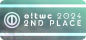
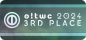
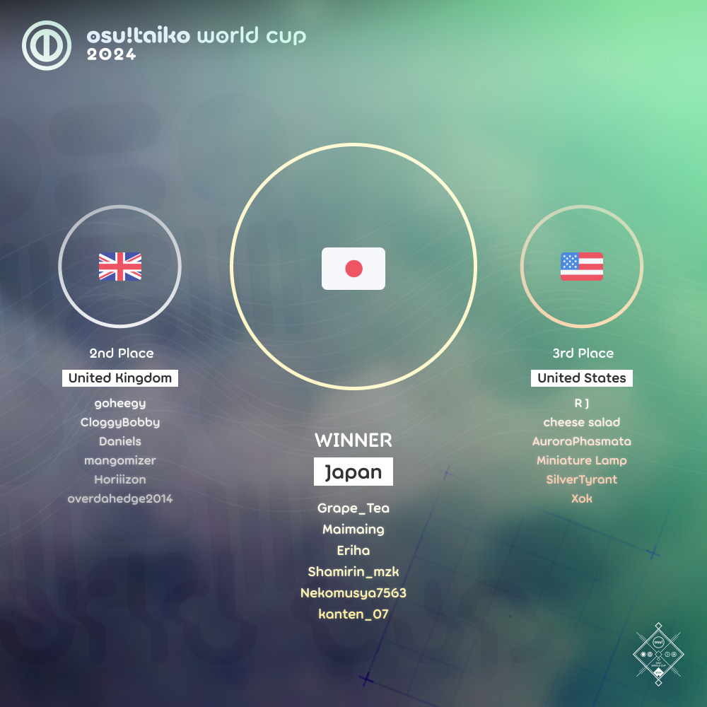

---
tags:
  - TWC
  - TWC2024
  - TWC 2024
---

# osu!taiko World Cup 2024

The **osu!taiko World Cup 2024** (***TWC 2024***) was a country-based osu!taiko tournament hosted by the [osu! team](/wiki/People/osu!_team). It was the fourteenth instalment of the osu!taiko World Cup.

## Tournament schedule

| Event | Timestamp |
| --: | :-- |
| Registration phase | 2024-02-15 (00:00 UTC)/2024-02-28 (23:59 UTC) |
| Qualifier showcase | 2024-03-10 (14:00 UTC) |
| Qualifier stage | 2024-03-16/2024-03-17 |
| Round of 32 | 2024-03-23/2024-03-24 |
| Round of 16 | 2024-03-30/2024-03-31 |
| Quarterfinals | 2024-04-06/2024-04-07 |
| Semifinals | 2024-04-13/2024-04-14 |
| Finals | 2024-04-20/2024-04-21 |
| Grand Finals | 2024-04-27/2024-04-28 |

## Prizes

The osu!taiko World Cup 2024 offered a $2,000 cash prize pool and limited-edition merch.

| Placing | Prizes |
| :-: | :-- |
|  | 50% of the prize pool, single-run merch, profile badge, **osu!taiko Champion** user title for one year |
|  | 30% of the prize pool, single-run merch, profile badge |
|  | 20% of the prize pool, single-run merch, profile badge |

  

## Organisation

The osu!taiko World Cup 2024 was run by various community members.

| Position | Member(s) |
| :-- | :-- |
| Manager | ::{ flag=CA }:: [Azer](https://osu.ppy.sh/users/2155578), ::{ flag=US }:: [ChillierPear](https://osu.ppy.sh/users/9501251), ::{ flag=BR }:: [LeoFLT](https://osu.ppy.sh/users/3668779) |
| Mappool selector | ::{ flag=SE }:: **[Nurend](https://osu.ppy.sh/users/9905079)**, ::{ flag=SE }:: **[Raphalge](https://osu.ppy.sh/users/3918650)**, ::{ flag=US }:: [Backfire](https://osu.ppy.sh/users/263110), ::{ flag=NL }:: [Boaz](https://osu.ppy.sh/users/13302996), ::{ flag=VN }:: [davidminh0111](https://osu.ppy.sh/users/9623142) |
| Mappool quality assurance | ::{ flag=GB }:: [aceticke](https://osu.ppy.sh/users/8838763), ::{ flag=BR }:: [Ideal](https://osu.ppy.sh/users/3869519) |
| Mappool playtester | ::{ flag=JP }:: [4sbet1](https://osu.ppy.sh/users/11563671), ::{ flag=DE }:: [frz](https://osu.ppy.sh/users/6956922), ::{ flag=US }:: [Garpo](https://osu.ppy.sh/users/4097035), ::{ flag=DE }:: [Mew](https://osu.ppy.sh/users/2345156), ::{ flag=IT }:: [ndrrr](https://osu.ppy.sh/users/4609767), ::{ flag=AU }:: [r1chyy](https://osu.ppy.sh/users/11499467), ::{ flag=JP }:: [Sasara](https://osu.ppy.sh/users/7994829), ::{ flag=NZ }:: [Sparxe](https://osu.ppy.sh/users/5750235), ::{ flag=DE }:: [Xay](https://osu.ppy.sh/users/961417) |
| Mapper | ::{ flag=JP }:: [\_Rise](https://osu.ppy.sh/users/5217107), ::{ flag=US }:: [\-Kazuha](https://osu.ppy.sh/users/29978316), ::{ flag=JP }:: [4sbet1](https://osu.ppy.sh/users/11563671), ::{ flag=DE }:: [Ak1o](https://osu.ppy.sh/users/1600041), ::{ flag=US }:: [Alchyr](https://osu.ppy.sh/users/4993032), ::{ flag=MY }:: [Asagi Mutsuki](https://osu.ppy.sh/users/2403621), ::{ flag=US }:: [Backfire](https://osu.ppy.sh/users/263110), ::{ flag=NL }:: [Boaz](https://osu.ppy.sh/users/13302996), ::{ flag=HK }:: [Cynplytholowazy](https://osu.ppy.sh/users/3901754), ::{ flag=IT }:: [D3kuu](https://osu.ppy.sh/users/7807444), ::{ flag=VN }:: [davidminh0111](https://osu.ppy.sh/users/9623142), ::{ flag=JP }:: [ekumea1123](https://osu.ppy.sh/users/9119501), ::{ flag=DE }:: [frz](https://osu.ppy.sh/users/6956922), ::{ flag=GR }:: [Genjuro](https://osu.ppy.sh/users/3196091), ::{ flag=DE }:: [HomieLove](https://osu.ppy.sh/users/8693851), ::{ flag=NL }:: [ikin5050](https://osu.ppy.sh/users/4007649), ::{ flag=SE }:: [Invisible O](https://osu.ppy.sh/users/22907037), ::{ flag=US }:: [Izzeee](https://osu.ppy.sh/users/8503743), ::{ flag=AR }:: [Megafan](https://osu.ppy.sh/users/6632605), ::{ flag=DE }:: [Mew](https://osu.ppy.sh/users/2345156), ::{ flag=IT }:: [ndrrr](https://osu.ppy.sh/users/4609767), ::{ flag=US }:: [Nifty](https://osu.ppy.sh/users/4956097), ::{ flag=RU }:: [Nozdormu](https://osu.ppy.sh/users/7169208), ::{ flag=SE }:: [Nurend](https://osu.ppy.sh/users/9905079), ::{ flag=DE }:: [Nwolf](https://osu.ppy.sh/users/1910766), ::{ flag=DE }:: [OnosakiHito](https://osu.ppy.sh/users/290128), ::{ flag=IT }:: [Quorum](https://osu.ppy.sh/users/5200775), ::{ flag=SE }:: [Raphalge](https://osu.ppy.sh/users/3918650), ::{ flag=NO }:: [roufou](https://osu.ppy.sh/users/1109122), ::{ flag=US }:: [SolaEclipse](https://osu.ppy.sh/users/6621158), ::{ flag=JP }:: [tasuke912](https://osu.ppy.sh/users/2774767), ::{ flag=JP }:: [uone](https://osu.ppy.sh/users/5321719), ::{ flag=DE }:: [Xay](https://osu.ppy.sh/users/961417) |
| Commentator | ::{ flag=AU }:: [Beat43210](https://osu.ppy.sh/users/5664171), ::{ flag=US }:: [driodx](https://osu.ppy.sh/users/9709548), ::{ flag=US }:: [ETHN](https://osu.ppy.sh/users/9536977), ::{ flag=CA }:: [janitore](https://osu.ppy.sh/users/3307897), ::{ flag=AU }:: [Jaye](https://osu.ppy.sh/users/4841352), ::{ flag=DE }:: [Joogs](https://osu.ppy.sh/users/8844167), ::{ flag=DE }:: [Nwolf](https://osu.ppy.sh/users/1910766), ::{ flag=GB }:: [Teezel](https://osu.ppy.sh/users/7528639), ::{ flag=HK }:: [YonGin](https://osu.ppy.sh/users/7109317) |
| Referee | ::{ flag=US }:: [\[K\]](https://osu.ppy.sh/users/16551387), ::{ flag=FR }:: [Aidown](https://osu.ppy.sh/users/1522146), ::{ flag=NL }:: [Albionthegreat](https://osu.ppy.sh/users/9853595), ::{ flag=BR }:: [LeoFLT](https://osu.ppy.sh/users/3668779), ::{ flag=NL }:: [nik](https://osu.ppy.sh/users/10077264), ::{ flag=IN }:: [Speshimen](https://osu.ppy.sh/users/7720204), ::{ flag=US }:: [tigereyes144](https://osu.ppy.sh/users/6499811), ::{ flag=GB }:: [Yazzehh](https://osu.ppy.sh/users/7068973) |
| Statistician | ::{ flag=FI }:: **[shdewz](https://osu.ppy.sh/users/10000899)**, ::{ flag=BR }:: [LeoFLT](https://osu.ppy.sh/users/3668779) |
| Design coordinator | ::{ flag=CN }:: **[Sakura006](https://osu.ppy.sh/users/10365024)**, ::{ flag=CA }:: [kaetwo](https://osu.ppy.sh/users/1997719) |

## Links

- [Information spreadsheet](https://docs.google.com/spreadsheets/d/1qGOprVVOTXTBGw2xwDhvTxjpp92SEA1NkQIBJ1gI9xY?rm=minimal)
- [Weekly statistics spreadsheets](https://drive.google.com/drive/folders/13k866nXj-DsAfVphboJ6jBLk1EIPU1yA)
- [Discussion thread](https://osu.ppy.sh/community/forums/topics/1884428)
- [Livestream](https://www.twitch.tv/osulive)
- [Tournament listing](https://osu.ppy.sh/community/tournaments/43)
- [Pick'ems page](https://pickem.hwc.hr/tournaments/140) hosted by ::{ flag=DE }:: [hallowatcher](https://osu.ppy.sh/users/1874761)
- [Challonge bracket](https://challonge.com/TWC2024)

## Participants

|  | Country | Members |
| :-: | :-: | :-- |
| ::{ flag=AR }:: | **Argentina** | **[ZelLink](https://osu.ppy.sh/users/6752242)**, [\_Doodle\_](https://osu.ppy.sh/users/5427801), [\_Illustrious\_](https://osu.ppy.sh/users/8256770), [-GordoN-](https://osu.ppy.sh/users/5040981), [Darxad](https://osu.ppy.sh/users/12908933), [SUPERNOOB20](https://osu.ppy.sh/users/16422988) |
| ::{ flag=AU }:: | **Australia** | **[splyrg](https://osu.ppy.sh/users/11457644)**, [Jaye](https://osu.ppy.sh/users/4841352), [HungryTurtle420](https://osu.ppy.sh/users/30338965), [Dogman77](https://osu.ppy.sh/users/16892858), [Zippywin](https://osu.ppy.sh/users/7269844), [Tsubasa2](https://osu.ppy.sh/users/6835183) |
| ::{ flag=BR }:: | **Brazil** | **[Foxeru](https://osu.ppy.sh/users/7479684)**, [HiroK](https://osu.ppy.sh/users/4050738), [Kyoumo](https://osu.ppy.sh/users/8145223), [Lorenzetto](https://osu.ppy.sh/users/9213381), [miwoo](https://osu.ppy.sh/users/12630336), [Skull Kid](https://osu.ppy.sh/users/3044264) |
| ::{ flag=CA }:: | **Canada** | **[Dizzayy](https://osu.ppy.sh/users/12014683)**, [Ascrute](https://osu.ppy.sh/users/13175389), [Kombucha457](https://osu.ppy.sh/users/18265351), [seal--](https://osu.ppy.sh/users/26820002), [Eltigant](https://osu.ppy.sh/users/15191942), [dots\_](https://osu.ppy.sh/users/15429414) |
| ::{ flag=CL }:: | **Chile** | **[Ulqui](https://osu.ppy.sh/users/1263669)**, [chibamasu](https://osu.ppy.sh/users/16067522), [myucchii](https://osu.ppy.sh/users/10072733), [Esconyan](https://osu.ppy.sh/users/9057823), [DaiKiu](https://osu.ppy.sh/users/4232665), [Shiny Froakie](https://osu.ppy.sh/users/6194830) |
| ::{ flag=CN }:: | **China** | **[superSSS](https://osu.ppy.sh/users/4315477)**, [shoucan91](https://osu.ppy.sh/users/9383908), [WLYMinato](https://osu.ppy.sh/users/12703319), [Michaelonl](https://osu.ppy.sh/users/12480076), [kknegative](https://osu.ppy.sh/users/2349769), [FORMless000](https://osu.ppy.sh/users/8697654) |
| ::{ flag=CO }:: | **Colombia** | **[L1ght](https://osu.ppy.sh/users/9050875)**, [Xoretra](https://osu.ppy.sh/users/4940698), [Coffecito](https://osu.ppy.sh/users/18793276), [ParraCharlie](https://osu.ppy.sh/users/18425848), [-Noval-](https://osu.ppy.sh/users/13890993) |
| ::{ flag=CZ }:: | **Czechia** | **[Spinasson](https://osu.ppy.sh/users/21448085)**, [iTzzMar0](https://osu.ppy.sh/users/13108155), [grillroasted](https://osu.ppy.sh/users/18271627), [emily\_](https://osu.ppy.sh/users/8438530) |
| ::{ flag=DK }:: | **Denmark** | **[Tsukani](https://osu.ppy.sh/users/5146144)**, [Captain](https://osu.ppy.sh/users/2563435), [Leriola](https://osu.ppy.sh/users/18539549), [Rachri](https://osu.ppy.sh/users/13551943) |
| ::{ flag=EE }:: | **Estonia** | **[PaskAcc](https://osu.ppy.sh/users/9040795)**, [a720863z](https://osu.ppy.sh/users/18535399), [Defined](https://osu.ppy.sh/users/22750981), [TkonicRabid](https://osu.ppy.sh/users/10480961), [zhewaxen](https://osu.ppy.sh/users/22879634) |
| ::{ flag=FI }:: | **Finland** | **[duski](https://osu.ppy.sh/users/6506484)**, [Antti](https://osu.ppy.sh/users/13281473), [BFKB113PBK](https://osu.ppy.sh/users/13613362), [GamersDecision](https://osu.ppy.sh/users/19975342), [Mazzuli500](https://osu.ppy.sh/users/10648818), [vodnanen](https://osu.ppy.sh/users/10335557) |
| ::{ flag=FR }:: | **France** | **[Ranshi](https://osu.ppy.sh/users/6680785)**, [YaniFR](https://osu.ppy.sh/users/11260982), [Ecchou](https://osu.ppy.sh/users/16403250), [Nethen](https://osu.ppy.sh/users/14034809), [Briesmas](https://osu.ppy.sh/users/2865172), [Gintoki8](https://osu.ppy.sh/users/2239411) |
| ::{ flag=DE }:: | **Germany** | **[Drecksackblase](https://osu.ppy.sh/users/6278008)**, [dragonmaxx](https://osu.ppy.sh/users/12160279), [Dioramos](https://osu.ppy.sh/users/14415208), [MrrMiller](https://osu.ppy.sh/users/9757858), [Mikalodo](https://osu.ppy.sh/users/8498207), [Emre1504](https://osu.ppy.sh/users/13392709) |
| ::{ flag=HK }:: | **Hong Kong** | **[YonGin](https://osu.ppy.sh/users/7109317)**, [Shing\_](https://osu.ppy.sh/users/2211364), [Brown918](https://osu.ppy.sh/users/9805760), [Henry03](https://osu.ppy.sh/users/17413733), [fua](https://osu.ppy.sh/users/21138904) |
| ::{ flag=HU }:: | **Hungary** | **[Araxcrow](https://osu.ppy.sh/users/11038892)**, [T3mie](https://osu.ppy.sh/users/22121763), [Texshh](https://osu.ppy.sh/users/31373683), [TomaSajt](https://osu.ppy.sh/users/14205174), [Verald](https://osu.ppy.sh/users/5766307), [verto](https://osu.ppy.sh/users/2015300) |
| ::{ flag=ID }:: | **Indonesia** | **[ImChro](https://osu.ppy.sh/users/7280717)**, [Ahmad Haris](https://osu.ppy.sh/users/6048245), [bad hd player](https://osu.ppy.sh/users/13385865), [Fz2311x](https://osu.ppy.sh/users/29780191), [Kaemz](https://osu.ppy.sh/users/8494233), [Alwaysyukaz](https://osu.ppy.sh/users/4999506) |
| ::{ flag=IT }:: | **Italy** | **[CRHIX](https://osu.ppy.sh/users/25662684)**, [eww](https://osu.ppy.sh/users/12022477), [Arach](https://osu.ppy.sh/users/8512755), [KITEMMUORT322](https://osu.ppy.sh/users/10370310), [Garda](https://osu.ppy.sh/users/8127849), [megalovania lol](https://osu.ppy.sh/users/20215461) |
| ::{ flag=JP }:: | **Japan** | **[Grape\_Tea](https://osu.ppy.sh/users/9540073)**, [Maimaing](https://osu.ppy.sh/users/14520910), [Eriha](https://osu.ppy.sh/users/16320311), [Shamirin\_mzk](https://osu.ppy.sh/users/11325757), [Nekomusya7563](https://osu.ppy.sh/users/1382717), [kanten\_07](https://osu.ppy.sh/users/11680357) |
| ::{ flag=LV }:: | **Latvia** | **[waywern2012](https://osu.ppy.sh/users/5870453)**, [Huntey](https://osu.ppy.sh/users/14451706), [Bezmozglij123](https://osu.ppy.sh/users/20489038), [Mista64](https://osu.ppy.sh/users/10774000), [Piparkuucinsh](https://osu.ppy.sh/users/7453024), [SleepySkyler](https://osu.ppy.sh/users/25608671) |
| ::{ flag=LT }:: | **Lithuania** | **[ramojusd](https://osu.ppy.sh/users/14400817)**, [Atago](https://osu.ppy.sh/users/7011843), [ite](https://osu.ppy.sh/users/11390568), [LilyTheCutest](https://osu.ppy.sh/users/15153340) |
| ::{ flag=MY }:: | **Malaysia** | **[CrabCow](https://osu.ppy.sh/users/9755504)**, [vun](https://osu.ppy.sh/users/6932501), [K0rd31HP](https://osu.ppy.sh/users/15231510), [DXA FonG](https://osu.ppy.sh/users/15019527), [JyaKeii](https://osu.ppy.sh/users/12086753), [HenNEET](https://osu.ppy.sh/users/14225265) |
| ::{ flag=MX }:: | **Mexico** | **[Hivan111](https://osu.ppy.sh/users/13525805)**, [-Caredu-](https://osu.ppy.sh/users/12294759), [Maxmisil](https://osu.ppy.sh/users/20089489), [-Teka-](https://osu.ppy.sh/users/5065096), [Agamalpa](https://osu.ppy.sh/users/15420662), [JunkyTrack](https://osu.ppy.sh/users/11720359) |
| ::{ flag=NL }:: | **Netherlands** | **[Cookie\_Tree](https://osu.ppy.sh/users/502722)**, [demonking7447](https://osu.ppy.sh/users/11094496), [Hypello](https://osu.ppy.sh/users/1594036), [R1ght4](https://osu.ppy.sh/users/21564948), [StrijkIjzer](https://osu.ppy.sh/users/4130926), [Tyronix](https://osu.ppy.sh/users/11290311) |
| ::{ flag=NO }:: | **Norway** | **[Vendelicious](https://osu.ppy.sh/users/8818089)**, [Mills](https://osu.ppy.sh/users/7234023), [Mist31](https://osu.ppy.sh/users/18916920), [Defectum](https://osu.ppy.sh/users/8631719) |
| ::{ flag=PE }:: | **Peru** | **[alemagno333](https://osu.ppy.sh/users/11411697)**, [Dinki](https://osu.ppy.sh/users/23361435), [Koto-chan](https://osu.ppy.sh/users/8925569), [Pachekin](https://osu.ppy.sh/users/8257441), [FabriGamer84](https://osu.ppy.sh/users/20882798) |
| ::{ flag=PH }:: | **Philippines** | **[Aiery](https://osu.ppy.sh/users/10363380)**, [jmeh07](https://osu.ppy.sh/users/2852269), [JoshEco4](https://osu.ppy.sh/users/18591473), [Mochii\_31](https://osu.ppy.sh/users/25140935), [qish](https://osu.ppy.sh/users/17050115), [Silicosis 2](https://osu.ppy.sh/users/18560307) |
| ::{ flag=PL }:: | **Poland** | **[Qroissant](https://osu.ppy.sh/users/9511518)**, [knibblet](https://osu.ppy.sh/users/6922240), [Dynutka](https://osu.ppy.sh/users/5947521), [SKRIS-MI](https://osu.ppy.sh/users/15330641), [nickname2500](https://osu.ppy.sh/users/5385606), [krytwal](https://osu.ppy.sh/users/17540374) |
| ::{ flag=PT }:: | **Portugal** | **[BabySnakes](https://osu.ppy.sh/users/4669728)**, [ImDem0nPT](https://osu.ppy.sh/users/12733839), [MeovvCAT](https://osu.ppy.sh/users/5905091), [Shinzui](https://osu.ppy.sh/users/2505011), [waifufumi](https://osu.ppy.sh/users/16778763), [Warpzoned](https://osu.ppy.sh/users/18649724) |
| ::{ flag=RU }:: | **Russian Federation** | **[mekkimous](https://osu.ppy.sh/users/17381947)**, [fullaltshallah](https://osu.ppy.sh/users/9976154), [Akonine](https://osu.ppy.sh/users/7774222), [artemean](https://osu.ppy.sh/users/8650631), [taikoshallah](https://osu.ppy.sh/users/11117835), [krokodil\_koban](https://osu.ppy.sh/users/24910091) |
| ::{ flag=SK }:: | **Slovakia** | **[Golden](https://osu.ppy.sh/users/12639462)**, [nevqr](https://osu.ppy.sh/users/14269506), [FlipRopiik](https://osu.ppy.sh/users/10806437), [AlejarTV](https://osu.ppy.sh/users/12568571) |
| ::{ flag=KR }:: | **South Korea** | **[Peaceful](https://osu.ppy.sh/users/165027)**, [oL0](https://osu.ppy.sh/users/1134683), [Laby](https://osu.ppy.sh/users/9085164), [POCARI SWEAT](https://osu.ppy.sh/users/5082685), [Ayaeon](https://osu.ppy.sh/users/13135192), [Jonah](https://osu.ppy.sh/users/5509009) |
| ::{ flag=ES }:: | **Spain** | **[MantequillAlex](https://osu.ppy.sh/users/11499752)**, [Alsael](https://osu.ppy.sh/users/13938746), [GATmoneyTJ1994](https://osu.ppy.sh/users/6735738), [Helox](https://osu.ppy.sh/users/18275040) |
| ::{ flag=SE }:: | **Sweden** | **[Hana Hayashi](https://osu.ppy.sh/users/4601806)**, [yamfan](https://osu.ppy.sh/users/8669774), [Lemmie](https://osu.ppy.sh/users/11700865), [Sturvos](https://osu.ppy.sh/users/7050679) |
| ::{ flag=CH }:: | **Switzerland** | **[TaikoWorldCup](https://osu.ppy.sh/users/11296097)**, [cholarmor](https://osu.ppy.sh/users/21502158), [Oui](https://osu.ppy.sh/users/5538419), [NekoTowel](https://osu.ppy.sh/users/14838605), [Nakarin](https://osu.ppy.sh/users/547957) |
| ::{ flag=TW }:: | **Taiwan** | **[monkeydluffy3u4](https://osu.ppy.sh/users/2277798)**, [HiGreeks](https://osu.ppy.sh/users/16536516), [Yuemiao](https://osu.ppy.sh/users/4493348), [HarryAda](https://osu.ppy.sh/users/12892087), [Polemo03](https://osu.ppy.sh/users/10726804), [sevgo7](https://osu.ppy.sh/users/23487206) |
| ::{ flag=TH }:: | **Thailand** | **[banan](https://osu.ppy.sh/users/16011592)**, [Ponamis](https://osu.ppy.sh/users/7897892), [Raytoly](https://osu.ppy.sh/users/8121109), [ZeroKungz](https://osu.ppy.sh/users/23155757), [HD Enjoyer](https://osu.ppy.sh/users/3968546) |
| ::{ flag=TR }:: | **Turkey** | **[frukoyurdakul](https://osu.ppy.sh/users/7612550)**, [NeuralG](https://osu.ppy.sh/users/13811400), [skolodojko](https://osu.ppy.sh/users/11716851), [magev](https://osu.ppy.sh/users/13892153), [Zmor0133](https://osu.ppy.sh/users/6419257), [Ryukishi](https://osu.ppy.sh/users/9045874) |
| ::{ flag=GB }:: | **United Kingdom** | **[goheegy](https://osu.ppy.sh/users/8057655)**, [CloggyBobby](https://osu.ppy.sh/users/8484987), [Daniels](https://osu.ppy.sh/users/12439209), [mangomizer](https://osu.ppy.sh/users/1893718), [Horiiizon](https://osu.ppy.sh/users/8071438), [overdahedge2014](https://osu.ppy.sh/users/9864847) |
| ::{ flag=US }:: | **United States** | **[R J](https://osu.ppy.sh/users/6490509)**, [cheese salad](https://osu.ppy.sh/users/6349821), [AuroraPhasmata](https://osu.ppy.sh/users/13664116), [Miniature Lamp](https://osu.ppy.sh/users/9821194), [SilverTyrant](https://osu.ppy.sh/users/14356353), [Xok](https://osu.ppy.sh/users/12177903) |
| ::{ flag=VN }:: | **Vietnam** | **[MashedPotato](https://osu.ppy.sh/users/10494860)**, [Creeperbrine303](https://osu.ppy.sh/users/22515524), [hi\_there\_osu](https://osu.ppy.sh/users/22698999), [nahieu2005](https://osu.ppy.sh/users/22069182), [RandomNameIdk](https://osu.ppy.sh/users/24042710) |

The complete sign-up list can be found [here](https://gist.github.com/LeoFLT/253130c40e8486cdfbcdf680bb19988d).

## Podium

## Mappools

### Grand Finals

**[Download the mappack here (109 MB)](https://packs.ppy.sh/P245%20-%20osu!taiko%20World%20Cup%202024%3A%20Grand%20Finals.zip)**\
[View the showcase VOD here](https://www.twitch.tv/videos/2125996548)

- No Mod
  1. [katagiri - c0pyf0x (Raphalge) \[inner oni\]](https://osu.ppy.sh/beatmapsets/2169957#taiko/4579407)
  2. [sepiarecorders - s/c/a/p/e/g/o/a/t (Raphalge) \[o/n/i\]](https://osu.ppy.sh/beatmapsets/2169956#taiko/4579405)
  3. [DJ Raisei - Fractured Heaven (Genjuro) \[Fallen Angel\]](https://osu.ppy.sh/beatmapsets/2169918#taiko/4579320)
  4. [Nanodesu - Libera Lotus (Mew) \[Reborn Purity\]](https://osu.ppy.sh/beatmapsets/2169909#taiko/4579308)
  5. [HOUR OF PENANCE - Devotion for Tyranny (HomieLove) \[The Monstrosity feat. Ak1o (TWC Ver.)\]](https://osu.ppy.sh/beatmapsets/2169921#taiko/4579324)
  6. [BilliumMoto - Stained Satin (Nifty) \[Showdown (TWC ver.)\]](https://osu.ppy.sh/beatmapsets/2170035#taiko/4579579)
  7. [BilliumMoto - 100 Carat Smoke Point (\_Rise) \[Inner Oni\]](https://osu.ppy.sh/beatmapsets/2170025#taiko/4579557)
- Hidden
  1. [DJ Majokko Mirakurun - Crakkin (Shamirin\_mzk) \[Despair\]](https://osu.ppy.sh/beatmapsets/1761127#taiko/3604452)
  2. [ikaruga\_nex - ultimer (Raphalge) \[arrested for silly crimes\]](https://osu.ppy.sh/beatmapsets/1761945#taiko/3606293)
- Hard Rock
  1. [Memme - Acid Burst (goheegy) \[TWC Ver.\]](https://osu.ppy.sh/beatmapsets/1048233#taiko/4579357)
  2. [7\_7 - Nanikore!? Mix (Waribashi) \[Nandacore\]](https://osu.ppy.sh/beatmapsets/1240813#taiko/2579507)
- Double Time
  1. [MK & RoughSketch - Stereo Beasts (Original Mix) (roufou) \[yoshi\]](https://osu.ppy.sh/beatmapsets/2169935#taiko/4579365)
  2. [USAO - ZED (Extended Mix) (yassu-) \[Collab\]](https://osu.ppy.sh/beatmapsets/511097#taiko/1086503)
- Free Mod
  1. [xxxlolxxx - 36C (miyagishima) \[Inner Oni\]](https://osu.ppy.sh/beatmapsets/2107272#taiko/4422349)
  2. [nujioh - goodbye (D3kuu) \[final destination\]](https://osu.ppy.sh/beatmapsets/2169940#taiko/4579380)
- Tiebreaker
  1. **[Quarkee & Yuuni - Fabricated Exaltation (tasuke912) \[Grande Finale\]](https://osu.ppy.sh/beatmapsets/2169950#taiko/4579392)**

### Finals

**[Download the mappack here (167 MB)](https://packs.ppy.sh/P244%20-%20osu!taiko%20World%20Cup%202024%3A%20Finals.zip?1713511023)**\
[View the showcase VOD here](https://www.twitch.tv/videos/2124949532)

- No Mod
  1. [SatapanP ft. Hatsune Miku - Bagooon!!!!! (Skidooskei) \[NO MISS!!!!! (TWC EDIT!!!!!)\]](https://osu.ppy.sh/beatmapsets/2112567#taiko/4570747)
  2. [Mylta - KEY (Cut Ver.) (ekumea1123) \[Crypto\]](https://osu.ppy.sh/beatmapsets/2078471#taiko/4352127)
  3. [kessoku band - Seishun Complex (Kirairi Bootleg) (Seren58) \[Quartet\]](https://osu.ppy.sh/beatmapsets/1901991#taiko/3921191)
  4. [Ruby My Dear - Ecureuil (SolaEclipse) \[Don't Blink\]](https://osu.ppy.sh/beatmapsets/2166520#taiko/4570829)
  5. [Rivers of Nihil - Reign of Dreams (Xay) \[Perpetuity\]](https://osu.ppy.sh/beatmapsets/2166485#taiko/4570764)
  6. [Frums - Remnants of Turing (Ulqui) \[Alto Hospicio\]](https://osu.ppy.sh/beatmapsets/2019618#taiko/4205872)
  7. [Sydosys - Serrate (\_Rise) \[Inner Oni\]](https://osu.ppy.sh/beatmapsets/2166563#taiko/4570945)
- Hidden
  1. [flatt - Agitato (miyagishima) \[Inner Oni (TWC Edit)\]](https://osu.ppy.sh/beatmapsets/2024995#taiko/4570745)
  2. [Supire - Nebula (Alchyr) \[Naturalborn Void\]](https://osu.ppy.sh/beatmapsets/2166486#taiko/4570766)
- Hard Rock
  1. [Kayoko - BORN.TO.KiLL (miyagishima) \[Inner Oni (TWC Edit)\]](https://osu.ppy.sh/beatmapsets/2106820#taiko/4421005)
  2. [Lime - Campanella (Nwolf) \[Skyreach (TWC Ver.)\]](https://osu.ppy.sh/beatmapsets/2134225#taiko/4570779)
- Double Time
  1. [Houshou Marine x Yunomi - Unison (Megafan) \[Choose Me!\]](https://osu.ppy.sh/beatmapsets/1559449#taiko/3185402)
  2. [ShinRa-Bansho - Mugen Shitto Gekijou "666" (gaston\_2199) \[Drums Theater "Final Curtain: Inner Oni"\]](https://osu.ppy.sh/beatmapsets/1772154#taiko/4332478)
- Free Mod
  1. [MYUKKE. - Friendly Gigant Fire (frz) \[Hell Oni (TWC Ver.)\]](https://osu.ppy.sh/beatmapsets/2049240#taiko/4570786)
  2. [Shogo Nomura - egoist (ZTH) \[Chaos\]](https://osu.ppy.sh/beatmapsets/1915102#taiko/3950909)
- Tiebreaker
  1. **[TWC Sound Team "Xurv Stasis Rasufim" - Kaze no Denwa (ikin5050) \[Hell Oni\]](https://osu.ppy.sh/beatmapsets/2166504#taiko/4570795)**

### Semifinals

**[Download the mappack here (118 MB)](https://packs.ppy.sh/P243%20-%20osu!taiko%20World%20Cup%202024%3A%20Semifinals.zip)**\
[View the showcase VOD here](https://www.twitch.tv/videos/2113703930)

- No Mod
  1. [lemm - Algorithm 54 (tasuke912) \[Oni 54\]](https://osu.ppy.sh/beatmapsets/2163075#taiko/4561785)
  2. [Tanchiky - Riot (Nwolf) \[stage five\]](https://osu.ppy.sh/beatmapsets/2163103#taiko/4561829)
  3. [Zips - Heisei Sayonara Bye Bye (Ph0eNiiXZ) \[To Your Demise \[290 BPM\]\]](https://osu.ppy.sh/beatmapsets/1709931#taiko/3941177)
  4. [Nanodesu - The Show's Over (Mew) \[Curtain Call\]](https://osu.ppy.sh/beatmapsets/2163078#taiko/4561790)
  5. [UNDEAD CORPORATION - The silent world (sendol) \[Hell Oni (Edit)\]](https://osu.ppy.sh/beatmapsets/1117919#taiko/4561385)
  6. [katagiri - Higashi (SORA\_T4kAhqSh1) \[TWC edit\]](https://osu.ppy.sh/beatmapsets/2163089#taiko/4561814)
- Hidden
  1. [MYUKKE. - Mach Roger (Nwolf) \[bowser\]](https://osu.ppy.sh/beatmapsets/2163105#taiko/4561831)
  2. [cosMo@bousouP feat. Hatsune Miku - Daijoubu Desu ka? (Raphalge) \[Inner Oni\]](https://osu.ppy.sh/beatmapsets/2163117#taiko/4561849)
- Hard Rock
  1. [Street - Aiwv (Grape\_Tea) \[Re:Taiko (Cut Ver.)\]](https://osu.ppy.sh/beatmapsets/2141512#taiko/4507425)
  2. [MisomyL - Amnehilesie (Shinsekai-) \[Forgotten Oni TWC. Ver\]](https://osu.ppy.sh/beatmapsets/1712107#taiko/4561908)
- Double Time
  1. [Masayoshi Iimori - NEWALONE (Extended Mix) (roufou) \[Flagrant\]](https://osu.ppy.sh/beatmapsets/2163092#taiko/4561817)
  2. [Fox Stevenson - Bruises (freestyler) \[flr's Inner Oni\]](https://osu.ppy.sh/beatmapsets/1916575#taiko/4102175)
- Free Mod
  1. [Sparxe - Switcheroo (OnosakiHito) \[Ura Oni (TWC Ver.)\]](https://osu.ppy.sh/beatmapsets/2163116#taiko/4561848)
  2. [Hoshino Ongaku Koubou - pique (Nepoch) \[MAXIMUM\]](https://osu.ppy.sh/beatmapsets/1384944#taiko/2861112)
- Tiebreaker
  1. **[Tektheist - Pomegranate (SolaEclipse) \[Spiral Matai\]](https://osu.ppy.sh/beatmapsets/2163122#taiko/4561855)**

### Quarterfinals

**[Download the mappack here (78 MB)](https://packs.ppy.sh/P242%20-%20osu!taiko%20World%20Cup%202024%3A%20Quarterfinals.zip)**\
[View the showcase VOD here](https://www.twitch.tv/videos/2107173187)

- No Mod
  1. [Momiji Yamamoto - Fantastic\*Tooryanse(7\_7 kuso bootleg) (Waribashi) \[Fantastic\* (Edit)\]](https://osu.ppy.sh/beatmapsets/1126206#taiko/2353151)
  2. [Jimmy Weckl - System "Z" (FORMless000) \[MDC "R"\]](https://osu.ppy.sh/beatmapsets/2092777#taiko/4387440)
  3. [Zips - Reiwai Terrorism (yassu-) \[† DJ MOKOJI †\]](https://osu.ppy.sh/beatmapsets/894341#taiko/1868905)
  4. [Uroko - How 2(torial) move out (davidminh0111) \[davidminh & Noz's Tutorial\]](https://osu.ppy.sh/beatmapsets/2159324#taiko/4552782)
  5. [Amon Amarth - Twilight of the Thunder God (frukoyurdakul) \[Death\]](https://osu.ppy.sh/beatmapsets/531697#taiko/1126786)
  6. [yowanecity - Genius(Yunosuke Remix) (Shamirin\_mzk) \[Criminal\]](https://osu.ppy.sh/beatmapsets/1996134#taiko/4148533)
- Hidden
  1. [dj REMO-CON - Pollinosis (roufou) \[Sickest Oni\]](https://osu.ppy.sh/beatmapsets/2159328#taiko/4552799)
  2. [technoplanet feat. Haruno & Daisuke Kurosawa - Far Away Light (op45667) \[Fading Incandescence\]](https://osu.ppy.sh/beatmapsets/1915414#taiko/3951566)
- Hard Rock
  1. [ASA - Assault TAXI (\_Rise) \[Inner Oni (Edit)\]](https://osu.ppy.sh/beatmapsets/2071611#taiko/4552232)
  2. [7\_7 feat. kasane vavzed - Yakou (Invisible O) \[Ethereal\]](https://osu.ppy.sh/beatmapsets/2159335#taiko/4552824)
- Double Time
  1. [Street - Maritime Police (Megafan) \[Flow\]](https://osu.ppy.sh/beatmapsets/2159322#taiko/4552776)
  2. [PSYQUI - Raise Your Hands feat. Such (D3kuu) \[Inner Mario\]](https://osu.ppy.sh/beatmapsets/2159330#taiko/4552816)
- Free Mod
  1. [Feryquitous - Ai Nov (MTNTWarz) \[Eliminate\]](https://osu.ppy.sh/beatmapsets/2014150#taiko/4191502)
  2. [succducc - me & u (Kara Edit) (ler1211) \[you & i (should kiss) (twc edit)\]](https://osu.ppy.sh/beatmapsets/2026921#taiko/4223441)
- Tiebreaker
  1. **[Viatores Nebulae (ptar124 & SiLiS) - Ad infinitum \~ein sof\~ (frz) \[Perpetual Divinity\]](https://osu.ppy.sh/beatmapsets/2159337#taiko/4552827)**

### Round of 16

**[Download the mappack here (83 MB)](https://packs.ppy.sh/P241%20-%20osu!taiko%20World%20Cup%202024%3A%20Round%20of%2016.zip)**\
[View the showcase VOD here](https://www.twitch.tv/videos/2100512474)

- No Mod
  1. [ptar124 - aqua vitae feat. Kagamine Rin & Kagamine Len (Cynplytholowazy) \[Life-Water\]](https://osu.ppy.sh/beatmapsets/2155621#taiko/4543646)
  2. [ALEPH - IMPULSE (\_Rise) \[Inner Oni\]](https://osu.ppy.sh/beatmapsets/1387209#taiko/2865261)
  3. [Nanahoshi Kangengakudan - FREEDMAN (Cut Ver.) (Nwolf) \[Inner Oni (1.15x)\]](https://osu.ppy.sh/beatmapsets/2155512#taiko/4543418)
  4. [Rish feat. Choko - Waaa (Mew) \[:v: :grin: :v:\]](https://osu.ppy.sh/beatmapsets/2155513#taiko/4543420)
  5. [Ranka Lee (CV: Nakajima Megumi), Sheryl Nome (CV: May'n) - Lion (Golden Eggs J-CORE Bootleg) (-Kazuha) \[Your Sound\]](https://osu.ppy.sh/beatmapsets/2155519#taiko/4543435)
- Hidden
  1. [taylor - pave paradise (D3kuu) \[mario\]](https://osu.ppy.sh/beatmapsets/2155527#taiko/4543461)
  2. [Ethan Bortnick - hide n seek (ndrrr) \[luigi\]](https://osu.ppy.sh/beatmapsets/2155526#taiko/4543460)
- Hard Rock
  1. [Tedjimo yomigY - Usuva Kagerow (Izzeee) \[Dragonfly\]](https://osu.ppy.sh/beatmapsets/2155520#taiko/4543445)
  2. [UNDEAD CORPORATION - Adore Your Pain (roxorotto) \[Inner Oni (Edit)\]](https://osu.ppy.sh/beatmapsets/2155509#taiko/4543414)
- Double Time
  1. [kagenui hana - Shoujo Fuzei (cdh) \[\<33\]](https://osu.ppy.sh/beatmapsets/2015581#taiko/4524843)
  2. [the peggies - LOVE TRIP (2019) (MicSup08) \[Koi\]](https://osu.ppy.sh/beatmapsets/1854308#taiko/3810475)
- Free Mod
  1. [Zen Nihon Suppoko Nyaago Shin'eitai - Muunya Poyopoyo Suppoko Nyaago (Eyenine) \[Uranya\~go (edit)\]](https://osu.ppy.sh/beatmapsets/2155530#taiko/4543466)
  2. [Aiyru - Inventor (Raphalge) \[Inner Oni\]](https://osu.ppy.sh/beatmapsets/2155537#taiko/4543474)
- Tiebreaker
  1. **[Cansol - Train of Thought (Nurend) \[Last Stop\]](https://osu.ppy.sh/beatmapsets/2155531#taiko/4543467)**

### Round of 32

**[Download the mappack here (93 MB)](https://packs.ppy.sh/P240%20-%20osu!taiko%20World%20Cup%202024%3A%20Round%20of%2032.zip)**\
[View the showcase VOD here](https://www.twitch.tv/videos/2093904149?t=0h49m19s)

- No Mod
  1. [KISIDA KYODAN & THE AKEBOSI ROCKETS - Shinkuu no Melancholy (Nwolf) \[Forgotten Fantasy Satellite (TWC ver.)\]](https://osu.ppy.sh/beatmapsets/2152054#taiko/4534311)
  2. [Street - Hypothesis (tasuke912) \[pf.\]](https://osu.ppy.sh/beatmapsets/2068643#taiko/4533909)
  3. [Shoebill - Amen-Kun (ikin5050) \[Distractive Cat\]](https://osu.ppy.sh/beatmapsets/2152041#taiko/4534276)
  4. [siqlo - wholeheartedly (Mew) \[haphazardly\]](https://osu.ppy.sh/beatmapsets/2152039#taiko/4534272)
  5. [xi - Garyou Tensei (Xay) \[Happy Little Streams\]](https://osu.ppy.sh/beatmapsets/2152045#taiko/4534285)
- Hidden
  1. [Hamu feat. Natsuki Karin - Sunao ni Naritai (osu! Edit Ver.) (Quorum) \[Hidden Answers\]](https://osu.ppy.sh/beatmapsets/2152060#taiko/4534320)
  2. [Power Of Nature - BabeL \~Next Story\~ (uone) \[Oni\]](https://osu.ppy.sh/beatmapsets/699595#taiko/1481393)
- Hard Rock
  1. [Ponkichi - YOZAKURA Bladerz (TKS) \[Inner Oni\]](https://osu.ppy.sh/beatmapsets/1707779#taiko/3552174)
  2. [TUYU - Daemonisch (gaston\_2199) \[KTYN's Inner Oni\]](https://osu.ppy.sh/beatmapsets/1444402#taiko/2983308)
- Double Time
  1. [meganeko - Computer Blues (Axer) \[Volta's Oni\]](https://osu.ppy.sh/beatmapsets/1147128#taiko/2412944)
  2. [REDALiCE feat. Nomiya Ayumi - Colors (4sbet1) \[Oni\]](https://osu.ppy.sh/beatmapsets/1578929#taiko/3223966)
- Free Mod
  1. [Kotoha - Yuki wa Naniiro (TKS) \[Snowmelt\]](https://osu.ppy.sh/beatmapsets/2078626#taiko/4352521)
  2. [Namiguru - Zunda Party Night (Waribashi) \[Zunda Dancing\]](https://osu.ppy.sh/beatmapsets/1962520#taiko/4067448)
- Tiebreaker
  1. **[Yuuni - Frozen Blood (HomieLove) \[Cosmic Minds\]](https://osu.ppy.sh/beatmapsets/2152052#taiko/4534309)**

### Qualifiers

**[Download the mappack here (28 MB)](https://packs.ppy.sh/P239%20-%20osu!taiko%20World%20Cup%202024%3A%20Qualifiers.zip)**\
[View the showcase VOD here](https://www.twitch.tv/videos/2086820936)

- No Mod
  1. [katagiri - Meshimase!! Nyan-Nyan Nightmare (nananass) \[KTYN's NIGHTMARE\]](https://osu.ppy.sh/beatmapsets/878831#taiko/1842492)
  2. [Feryquitous - THE SEVENS CODE (sendol) \[Inner Oni (Edit)\]](https://osu.ppy.sh/beatmapsets/1736507#taiko/4525789)
  3. [Alice Schach and the Magic Orchestra - Doppelgangers (Nozdormu) \[Duality\]](https://osu.ppy.sh/beatmapsets/2148475#taiko/4525808)
- Hidden
  1. [L.E.D.-G - Karasu (roufou) \[MURDER\]](https://osu.ppy.sh/beatmapsets/2148481#taiko/4525819)
- Hard Rock
  1. [SOUND HOLIC feat. Nana Takahashi - EVANESCENT (Raphalge) \[Inner Oni\]](https://osu.ppy.sh/beatmapsets/2148488#taiko/4525834)
- Double Time
  1. [PSYQUI - Still in my heart feat. Punipuni Denki (Sebola) \[You are still in my heart (TWC Edit)\]](https://osu.ppy.sh/beatmapsets/2148504#taiko/4525866)
- Free Mod
  1. [Chroma - To the Milky Way (davidminh0111) \[Supernova\]](https://osu.ppy.sh/beatmapsets/2148483#taiko/4525822)

## Match results

### Grand Finals

Saturday, 27 April 2024:

| Team A |  |  | Team B | Match link | VOD link |
| --: | :-: | :-: | :-- | :-- | :-- |
| **United Kingdom** ::{ flag=GB }:: | **7** | 3 | ::{ flag=US }:: United States | [#1](https://osu.ppy.sh/community/matches/113656670) | [#1](https://www.twitch.tv/videos/2131198127) |

Sunday, 28 April 2024:

| Team A |  |  | Team B | Match link | VOD link |
| --: | :-: | :-: | :-- | :-- | :-- |
| **Japan** ::{ flag=JP }:: | **7** | 1 | ::{ flag=GB }:: United Kingdom | [#1](https://osu.ppy.sh/community/matches/113667781) | [#1](https://www.twitch.tv/videos/2131898761) |

### Finals

Detailed statistics for this round can be found [here](https://docs.google.com/spreadsheets/d/1hwZO3KTWHHlQ8BaPMFy3cffKlmao8cd3unrvaI2bKmA?rm=minimal).

Saturday, 20 April 2024:

| Team A |  |  | Team B | Match link | VOD link |
| --: | :-: | :-: | :-- | :-- | :-- |
| Brazil ::{ flag=BR }:: | 3 | **7** | ::{ flag=TW }:: **Taiwan** | [#1](https://osu.ppy.sh/community/matches/113566115) | [#1](https://www.twitch.tv/videos/2124949578) |

Sunday, 21 April 2024:

| Team A |  |  | Team B | Match link | VOD link |
| --: | :-: | :-: | :-- | :-- | :-- |
| South Korea ::{ flag=KR }:: | 3 | **7** | ::{ flag=US }:: **United States** | [#1](https://osu.ppy.sh/community/matches/113575347) | [#1](https://www.twitch.tv/videos/2125504351) |
| **Japan** ::{ flag=JP }:: | **7** | 0 | ::{ flag=GB }:: United Kingdom | [#1](https://osu.ppy.sh/community/matches/113580271) | [#1](https://www.twitch.tv/videos/2125773582) |
| **United States** ::{ flag=US }:: | **7** | 4 | ::{ flag=TW }:: Taiwan | [#1](https://osu.ppy.sh/community/matches/113582809) | [#1](https://www.twitch.tv/videos/2125916897) |

### Semifinals

Detailed statistics for this round can be found [here](https://docs.google.com/spreadsheets/d/1kt4_ec0U8pw327B5nHwYo8cwCvIu2mCQUvOh4P0Untg?rm=minimal).

Saturday, 13 April 2024:

| Team A |  |  | Team B | Match link | VOD link |
| --: | :-: | :-: | :-- | :-- | :-- |
| **China** ::{ flag=CN }:: | **6** | 0 | ::{ flag=FI }:: Finland | [#1](https://osu.ppy.sh/community/matches/113473898) | [#1](https://www.twitch.tv/videos/2118660381) |
| **Japan** ::{ flag=JP }:: | **6** | 0 | ::{ flag=BR }:: Brazil | [#1](https://osu.ppy.sh/community/matches/113475423) | [#1](https://www.twitch.tv/videos/2118756373) |
| **Taiwan** ::{ flag=TW }:: | **6** | 0 | ::{ flag=CA }:: Canada | [#1](https://osu.ppy.sh/community/matches/113476197) | [#1](https://www.twitch.tv/videos/2118778200) |
| **Chile** ::{ flag=CL }:: | **6** | 2 | ::{ flag=FR }:: France | [#1](https://osu.ppy.sh/community/matches/113478101) | [#1](https://www.twitch.tv/videos/2118876237) |

Sunday, 14 April 2024:

| Team A |  |  | Team B | Match link | VOD link |
| --: | :-: | :-: | :-- | :-- | :-- |
| **United States** ::{ flag=US }:: | **6** | 1 | ::{ flag=MY }:: Malaysia | [#1](https://osu.ppy.sh/community/matches/113485488) | [#1](https://www.twitch.tv/videos/2119349809) |
| **United Kingdom** ::{ flag=GB }:: | **6** | 5 | ::{ flag=KR }:: South Korea | [#1](https://osu.ppy.sh/community/matches/113490219) | [#1](https://www.twitch.tv/videos/2119605829) |
| China ::{ flag=CN }:: | 3 | **6** | ::{ flag=TW }:: **Taiwan** | [#1](https://osu.ppy.sh/community/matches/113491479) | [#1](https://www.twitch.tv/videos/2119657043) |
| **United States** ::{ flag=US }:: | **6** | 2 | ::{ flag=CL }:: Chile | [#1](https://osu.ppy.sh/community/matches/113495296) | [#1](https://www.twitch.tv/videos/2119880874) |

### Quarterfinals

Detailed statistics for this round can be found [here](https://docs.google.com/spreadsheets/d/1p7hv9TmgJp9k53CuqOrE7jPb8vO_xpoFJQ-_nIRdDpk?rm=minimal).

Friday, 05 April 2024:

| Team A |  |  | Team B | Match link | VOD link |
| --: | :-: | :-: | :-- | :-- | :-- |
| **Netherlands** ::{ flag=NL }:: | **6** | 1 | ::{ flag=ID }:: Indonesia | [#1](https://osu.ppy.sh/community/matches/113370363) | [#1](https://www.twitch.tv/videos/2111872756) |

Saturday, 6 April 2024:

| Team A |  |  | Team B | Match link | VOD link |
| --: | :-: | :-: | :-- | :-- | :-- |
| **Malaysia** ::{ flag=MY }:: | **6** | 2 | ::{ flag=AU }:: Australia | [#1](https://osu.ppy.sh/community/matches/113381374) | [#1](https://www.twitch.tv/videos/2112449785) |
| Turkey ::{ flag=TR }:: | 2 | **6** | ::{ flag=TH }:: **Thailand** | [#1](https://osu.ppy.sh/community/matches/113384092) | [#1](https://www.twitch.tv/videos/2112500383) |
| **Finland** ::{ flag=FI }:: | **6** | 0 | ::{ flag=DE }:: Germany | [#1](https://osu.ppy.sh/community/matches/113384467) | [#1](https://www.twitch.tv/videos/2112496638) |
| **Philippines** ::{ flag=PH }:: | **6** | 0 | ::{ flag=CH }:: Switzerland | [#1](https://osu.ppy.sh/community/matches/113384931) | [#1](https://www.twitch.tv/videos/2112606526) |
| **Canada** ::{ flag=CA }:: | **6** | 4 | ::{ flag=RU }:: Russian Federation | [#1](https://osu.ppy.sh/community/matches/113385844) | [#1](https://www.twitch.tv/videos/2112606527) |
| **Argentina** ::{ flag=AR }:: | **6** | 0 | ::{ flag=SK }:: Slovakia | [#1](https://osu.ppy.sh/community/matches/113387234) | [#1](https://www.twitch.tv/videos/2112642117) |
| United States ::{ flag=US }:: | 1 | **6** | ::{ flag=BR }:: **Brazil** | [#1](https://osu.ppy.sh/community/matches/113392114) | [#1](https://www.twitch.tv/videos/2112925699) |

Sunday, 7 April 2024:

| Team A |  |  | Team B | Match link | VOD link |
| --: | :-: | :-: | :-- | :-- | :-- |
| **Japan** ::{ flag=JP }:: | **6** | 1 | ::{ flag=CL }:: Chile | [#1](https://osu.ppy.sh/community/matches/113394221) | [#1](https://www.twitch.tv/videos/2113305617) |
| **Canada** ::{ flag=CA }:: | **6** | 2 | ::{ flag=PH }:: Philippines | [#1](https://osu.ppy.sh/community/matches/113394761) | [#1](https://www.twitch.tv/videos/2113305618) |
| **Malaysia** ::{ flag=MY }:: | **6** | 3 | ::{ flag=NL }:: Netherlands | [#1](https://osu.ppy.sh/community/matches/113397564) | [#1](https://www.twitch.tv/videos/2113322491) |
| **France** ::{ flag=FR }:: | **6** | 2 | ::{ flag=PL }:: Poland | [#1](https://osu.ppy.sh/community/matches/113398084) | [#1](https://www.twitch.tv/videos/2113345527) |
| **Finland** ::{ flag=FI }:: | **6** | 1 | ::{ flag=TH }:: Thailand | [#1](https://osu.ppy.sh/community/matches/113398357) | [#1](https://www.twitch.tv/videos/2113358450) |
| **South Korea** ::{ flag=KR }:: | **6** | 4 | ::{ flag=CN }:: China | [#1](https://osu.ppy.sh/community/matches/113399474) | [#1](https://www.twitch.tv/videos/2113447916) |
| **United Kingdom** ::{ flag=GB }:: | **6** | 3 | ::{ flag=TW }:: Taiwan | [#1](https://osu.ppy.sh/community/matches/113400641) | [#1](https://www.twitch.tv/videos/2113494456) |
| **France** ::{ flag=FR }:: | **6** | 2 | ::{ flag=AR }:: Argentina | [#1](https://osu.ppy.sh/community/matches/113403202) | [#1](https://www.twitch.tv/videos/2113631912) |

### Round of 16

Detailed statistics for this round can be found [here](https://docs.google.com/spreadsheets/d/1xXmKaCIfkjcCyq1msEpQUbb_SPG8u3zEe7rcbmljDP8?rm=minimal).

Saturday, 30 March 2024:

| Team A |  |  | Team B | Match link | VOD link |
| --: | :-: | :-: | :-- | :-- | :-- |
| **Japan** ::{ flag=JP }:: | **5** | 0 | ::{ flag=PH }:: Philippines | [#1](https://osu.ppy.sh/community/matches/113289025) | [#1](https://www.twitch.tv/videos/2105887871) |
| Denmark ::{ flag=DK }:: | 0 | **5** | ::{ flag=AU }:: **Australia** | [#1](https://osu.ppy.sh/community/matches/113291144) | [#1](https://www.twitch.tv/videos/2105889387) |
| **Brazil** ::{ flag=BR }:: | **5** | 0 | ::{ flag=FI }:: Finland | [#1](https://osu.ppy.sh/community/matches/113293395) | [#1](https://www.twitch.tv/videos/2105891423) |
| Hong Kong ::{ flag=HK }:: | 0 | **5** | ::{ flag=TH }:: **Thailand** | [#1](https://osu.ppy.sh/community/matches/113294179) | [#1](https://www.twitch.tv/videos/2105925815) |
| Italy ::{ flag=IT }:: | 0 | **5** | ::{ flag=DE }:: **Germany** | [#1](https://osu.ppy.sh/community/matches/113295134) | [#1](https://www.twitch.tv/videos/2105968607) |
| Peru ::{ flag=PE }:: | 0 | **5** | ::{ flag=PL }:: **Poland** | [#1](https://osu.ppy.sh/community/matches/113296025) | [#1](https://www.twitch.tv/videos/2106021865) |
| Czechia ::{ flag=CZ }:: | 0 | **5** | ::{ flag=RU }:: **Russian Federation** | [#1](https://osu.ppy.sh/community/matches/113296934) | [#1](https://www.twitch.tv/videos/2106075246) |
| **Chile** ::{ flag=CL }:: | **5** | 1 | ::{ flag=CA }:: Canada | [#1](https://osu.ppy.sh/community/matches/113301124) | [#1](https://www.twitch.tv/videos/2106335145) |

Sunday, 31 March 2024:

| Team A |  |  | Team B | Match link | VOD link |
| --: | :-: | :-: | :-- | :-- | :-- |
| **South Korea** ::{ flag=KR }:: | **5** | 0 | ::{ flag=NL }:: Netherlands | [#1](https://osu.ppy.sh/community/matches/113307316) | [#1](https://www.twitch.tv/videos/2106783248) |
| **Slovakia** ::{ flag=SK }:: | **0** | -1 | ::{ flag=NO }:: Norway | *win by default* |  |
| **Taiwan** ::{ flag=TW }:: | **5** | 0 | ::{ flag=FR }:: France | [#1](https://osu.ppy.sh/community/matches/113307766) | [#1](https://www.twitch.tv/videos/2106815000) |
| **China** ::{ flag=CN }:: | **5** | 2 | ::{ flag=MY }:: Malaysia | [#1](https://osu.ppy.sh/community/matches/113308481) | [#1](https://www.twitch.tv/videos/2106884009) |
| **United Kingdom** ::{ flag=GB }:: | **5** | 1 | ::{ flag=AR }:: Argentina | [#1](https://osu.ppy.sh/community/matches/113309102) | [#1](https://www.twitch.tv/videos/2106895507) |
| Colombia ::{ flag=CO }:: | 2 | **5** | ::{ flag=ID }:: **Indonesia** | [#1](https://osu.ppy.sh/community/matches/113309695) | [#1](https://www.twitch.tv/videos/2106946835) |
| **United States** ::{ flag=US }:: | **5** | 0 | ::{ flag=TR }:: Turkey | [#1](https://osu.ppy.sh/community/matches/113311014) | [#1](https://www.twitch.tv/videos/2107033952) |
| Mexico ::{ flag=MX }:: | 2 | **5** | ::{ flag=CH }:: **Switzerland** | [#1](https://osu.ppy.sh/community/matches/113311814) | [#1](https://www.twitch.tv/videos/2107105344) |

### Round of 32

Detailed statistics for this round can be found [here](https://docs.google.com/spreadsheets/d/1Ik9AOAkdUBKwGi6qYNsAIwhlYG1vVKjP6SXH67in6pk?rm=minimal).

Friday, 22 March 2024:

| Team A |  |  | Team B | Match link | VOD link |
| --: | :-: | :-: | :-- | :-- | :-- |
| **Finland** ::{ flag=FI }:: | **5** | 0 | ::{ flag=NO }:: Norway | [#1](https://osu.ppy.sh/community/matches/113179374) | [#1](https://www.twitch.tv/videos/2098391563) |

Saturday, 23 March 2024:

| Team A |  |  | Team B | Match link | VOD link |
| --: | :-: | :-: | :-- | :-- | :-- |
| **Chile** ::{ flag=CL }:: | **5** | 0 | ::{ flag=CO }:: Colombia | [#1](https://osu.ppy.sh/community/matches/113185322) | [#1](https://www.twitch.tv/videos/2098964086) |
| **Taiwan** ::{ flag=TW }:: | **5** | 0 | ::{ flag=HK }:: Hong Kong | [#1](https://osu.ppy.sh/community/matches/113190279) | [#1](https://www.twitch.tv/videos/2098965925) |
| **Japan** ::{ flag=JP }:: | **5** | 0 | ::{ flag=DK }:: Denmark | [#1](https://osu.ppy.sh/community/matches/113190789) | [#1](https://www.twitch.tv/videos/2098981785) |
| **Malaysia** ::{ flag=MY }:: | **5** | 3 | ::{ flag=CH }:: Switzerland | [#1](https://osu.ppy.sh/community/matches/113193076) | [#1](https://www.twitch.tv/videos/2099153913) |
| Russian Federation ::{ flag=RU }:: | 1 | **5** | ::{ flag=NL }:: **Netherlands** | [#1](https://osu.ppy.sh/community/matches/113194129) | [#1](https://www.twitch.tv/videos/2099154958) |
| **Canada** ::{ flag=CA }:: | **5** | 1 | ::{ flag=ID }:: Indonesia | [#1](https://osu.ppy.sh/community/matches/113195029) | [#1](https://www.twitch.tv/videos/2099195311) |
| **Turkey** ::{ flag=TR }:: | **5** | 4 | ::{ flag=PL }:: Poland | [#1](https://osu.ppy.sh/community/matches/113196968) | [#1](https://www.twitch.tv/videos/2099334355) |
| **United States** ::{ flag=US }:: | **5** | 0 | ::{ flag=PE }:: Peru | [#1](https://osu.ppy.sh/community/matches/113198976) | [#1](https://www.twitch.tv/videos/2099424977) |

Sunday, 24 March 2024:

| Team A |  |  | Team B | Match link | VOD link |
| --: | :-: | :-: | :-- | :-- | :-- |
| Australia ::{ flag=AU }:: | 2 | **5** | ::{ flag=PH }:: **Philippines** | [#1](https://osu.ppy.sh/community/matches/113203652) | [#1](https://www.twitch.tv/videos/2099750415) |
| **China** ::{ flag=CN }:: | **5** | 1 | ::{ flag=MX }:: Mexico | [#1](https://osu.ppy.sh/community/matches/113204165) | [#1](https://www.twitch.tv/videos/2099798348) |
| **France** ::{ flag=FR }:: | **5** | 1 | ::{ flag=TH }:: Thailand | [#1](https://osu.ppy.sh/community/matches/113208486) | [#1](https://www.twitch.tv/videos/2100047296) |
| **South Korea** ::{ flag=KR }:: | **5** | 0 | ::{ flag=CZ }:: Czechia | [#1](https://osu.ppy.sh/community/matches/113209185) | [#1](https://www.twitch.tv/videos/2100084427) |
| **United Kingdom** ::{ flag=GB }:: | **5** | 0 | ::{ flag=IT }:: Italy | [#1](https://osu.ppy.sh/community/matches/113210936) | [#1](https://www.twitch.tv/videos/2100169493) |
| **Brazil** ::{ flag=BR }:: | **5** | 0 | ::{ flag=SK }:: Slovakia | [#1](https://osu.ppy.sh/community/matches/113212734) | [#1](https://www.twitch.tv/videos/2100276728) |
| Germany ::{ flag=DE }:: | 4 | **5** | ::{ flag=AR }:: **Argentina** | [#1](https://osu.ppy.sh/community/matches/113214824), [#2](https://osu.ppy.sh/community/matches/113215193) | [#1](https://www.twitch.tv/videos/2100431997) |

### Qualifiers

The final standings for the Qualifier stage can be found in the following [spreadsheet](https://docs.google.com/spreadsheets/d/1m1W98_yMFveSdoYsPXk1MgIE_JDGpMDVoIpn0EUmroU?rm=minimal). A VOD for the Qualifiers results/Round of 32 Mappool showcase can be found [here](https://www.twitch.tv/videos/2093904149).

| Seed | Country | rank sum[^qualifiers-seeding] | avg. score[^qualifiers-tiebreaker] |
| :-: | :-- | --: | --: |
| #1 | ::{ flag=JP }:: Japan | 7 | 3,143,524 |
| #2 | ::{ flag=GB }:: United Kingdom | 24 | 3,114,613 |
| #3 | ::{ flag=KR }:: South Korea | 26 | 3,111,040 |
| #4 | ::{ flag=US }:: United States | 37 | 3,090,022 |
| #5 | ::{ flag=BR }:: Brazil | 40 | 3,086,872 |
| #6 | ::{ flag=CN }:: China | 41 | 3,087,052 |
| #7 | ::{ flag=TW }:: Taiwan | 43 | 3,086,893 |
| #8 | ::{ flag=CL }:: Chile | 49 | 3,074,094 |
| #9 | ::{ flag=CA }:: Canada | 73 | 3,013,388 |
| #10 | ::{ flag=FR }:: France | 76 | 3,006,013 |
| #11 | ::{ flag=MY }:: Malaysia | 85 | 2,995,379 |
| #12 | ::{ flag=FI }:: Finland | 86 | 3,000,794 |
| #13 | ::{ flag=TR }:: Turkey | 96 | 2,907,873 |
| #14 | ::{ flag=RU }:: Russian Federation | 109 | 2,877,016 |
| #15 | ::{ flag=DE }:: Germany | 114 | 2,926,473 |
| #16 | ::{ flag=AU }:: Australia | 119 | 2,917,797 |
| #17 | ::{ flag=PH }:: Philippines | 123 | 2,902,293 |
| #18 | ::{ flag=AR }:: Argentina | 128 | 2,905,570 |
| #19 | ::{ flag=NL }:: Netherlands | 130 | 2,869,600 |
| #20 | ::{ flag=PL }:: Poland | 137 | 2,857,782 |
| #21 | ::{ flag=NO }:: Norway | 141 | 2,786,720 |
| #22 | ::{ flag=CH }:: Switzerland | 152 | 2,805,138 |
| #23 | ::{ flag=TH }:: Thailand | 153 | 2,778,861 |
| #24 | ::{ flag=ID }:: Indonesia | 169 | 2,706,821 |
| #25 | ::{ flag=CO }:: Colombia | 170 | 2,708,307 |
| #26 | ::{ flag=HK }:: Hong Kong | 176 | 2,698,740 |
| #27 | ::{ flag=MX }:: Mexico | 183 | 2,619,135 |
| #28 | ::{ flag=SK }:: Slovakia | 202 | 2,578,415 |
| #29 | ::{ flag=PE }:: Peru | 205 | 2,525,435 |
| #30 | ::{ flag=CZ }:: Czechia | 206 | 2,526,575 |
| #31 | ::{ flag=IT }:: Italy | 213 | 2,495,816 |
| #32 | ::{ flag=DK }:: Denmark | 214 | 2,433,912 |
| #33 | ::{ flag=PT }:: Portugal | 215 | 2,436,572 |
| #34 | ::{ flag=SE }:: Sweden | 237 | 2,252,458 |
| #35 | ::{ flag=VN }:: Vietnam | 239 | 2,255,307 |
| #36 | ::{ flag=LV }:: Latvia | 251 | 2,122,725 |
| #37 | ::{ flag=EE }:: Estonia | 253 | 2,060,323 |
| #38 | ::{ flag=HU }:: Hungary | 266 | 1,621,865 |
| #39 | ::{ flag=LT }:: Lithuania | 271 | 1,258,432 |
| #40 | ::{ flag=ES }:: Spain | *DNP* | *DNP* |

## Ruleset

### Tournament rules

1. The osu!taiko World Cup is a country-based 3 versus 3 team tournament, played on the osu!taiko game mode.
   - Players from countries or territories (as seen on their profile flag) that are under a protectorate or sovereign state may choose to play for that country **if** the country listed on their profile is unable to field enough players to form a valid team. Refer to [this article](https://wikipedia.org/wiki/Dependent_territory#Lists_of_dependent_territories) for an overview of the criteria adopted. Players that have participated under another country previously may continue to do so.
2. Beatmap scoring is based on ScoreV2.
3. The minimum size for a team is 4 players, and the maximum is 6.
4. The beatmap list for each round will be announced by the mappool selectors on the official stream, on the Sunday before the matches take place.
5. The match schedules for each round will be announced by the tournament managers on this page, as well as the information sheet, on the Sunday before the matches take place.
6. Use of the Visual Settings to alter background dim or disable beatmap elements like storyboards and skins is allowed.
   - Custom skin elements must not be used to alter core gameplay elements or mechanics in unintended ways.
7. If less than the minimum amount of required players are present at match time, the match can be postponed for up to 10 minutes. If after this period there are still not enough players for either team, a *win by default* will be declared for the side with the most members present.
   - The minimum amount of required players is the amount of players needed to play a beatmap without any vacant spots in the lobby (i.e. at least 3 participants from each team must be present for the match to begin).
8. Exchanging players between games is allowed without limitations.
9. If a game ends in a draw, it will be nullified and the beatmap will be replayed.
10. Teams may ask for a rematch if a team member encounters technical issues while playing within 30 seconds or 25% of the beatmap drain length (whichever happens first) of the game's start. Referees may, at their discretion, veto this request.
    - "Lag spikes" are not considered a valid reason to rematch a beatmap.
    - The roster for each team during a rematch must remain the same as the original run. If that is not possible, e.g. by virtue of a technical issue that prevents a player from entering the lobby, both teams will be allowed to swap rosters.
    - This rule is not to be abused. Referees may veto a rematch request if they find that this is the case.
11. If a player disconnects mid-game, their scores will not be counted towards their team's total, unless adequate proof of said score is provided. The following are considered as acceptable proof:
    - Player point-of-view live stream snippets (commonly referred to as "clips" or "VODs"). The entirety of the play, along with the results screen must be clearly visible along with the affected player's score.
    - Replay files of the play, taken directly from the "Local scores" tab on the affected player's client (the timestamps must exactly match the time at which the game took place, as seen on the multiplayer lobby link).
    - Screenshots from other players taken directly in-game that show the affected player's score.
      - Screenshots from the results screen must clearly show the affected player's score. This is the preferred method.
      - Screenshots taken in-game at the time of disconnection may be accepted. Note that this method does not provide a one-to-one representation of that player's score. Using this method is not encouraged and it may be denied at the referee's discretion if the information provided is not sufficient to identify the player/score.
      - All screenshots **MUST** be taken using the game itself (using `Shift` + `F12`), that is, they must be hosted on the `https://osu.ppy.sh/` domain. Any other form of screenshot will be denied.
    - Player scores may be derived from the official stream as a last resort, in cases where the match is streamed.
12. Players are expected to keep the match running fluently and without delays. Excessive match delays from the players' side may result in penalties being applied by the tournament managers. Disrupting the match by foul play, insulting or provoking other players or staff, delaying the match, or other deliberate inappropriate misbehaviour are strictly prohibited, and will be punished accordingly.
13. All players and staff must be treated with respect. Instructions from the referees and the tournament managers are to be followed. Decisions labelled as final are not to be objected.
14. The multiplayer chatrooms underlie the [osu! community rules](/wiki/Rules). All chat rules apply to the multiplayer chatrooms where the matches will take place.
    - Breaking the chat rules may result in a silence. Silenced players cannot participate in multiplayer matches and must be exchanged for the duration of the punishment.
15. Penalties for violating the tournament rules include, but are not limited to:
    - Exclusion of specific players for one beatmap.
    - Exclusion of specific players for an entire match.
    - Declaring the match as forfeited, or as a win by default for the other team.
    - Disqualification from the entire tournament.
    - Disqualification from the current and future official tournaments, until appealed.
16. Referees may allow, at their discretion, lower or higher tolerances for timers.
17. The tournament managers may request liveplays or recordings of individual players or teams at any point in the tournament without prior warning.
18. The tournament managers will be responsible for receiving and investigating any tournament-related complaints.
19. The tournament managers reserve the right to modify these rules at any moment. Any such changes will be announced in advance.

### Tournament registration

1. Every user interested in joining their country's team signs up individually.
   - The tournament managers will create a list of potential candidates for a country's team.
   - The tournament managers will declare one candidate captain of their country's team.
   - The provisional captain will receive a private message on the osu! website containing further instructions, via the announcement feature, titled "osu!taiko World Cup 2024 - Team {Country Name}".
2. The provisional captain will then form their team by selecting players from the candidate pool for their country.
   - Captains are expected to choose team members with honesty and good will, with the aim of fielding the strongest team possible.
   - Captains are expected to submit their finalised team list **before the deadline**.
   - Captains are allowed to exclude themselves from the team list.
   - Captains are allowed to conduct and coordinate "tryouts", tests to gauge player aptitude, on their own terms.
   - Captains are allowed, at any time, to transfer their role to other prospective team members. Once given, only the new captain may assign the captaincy to another player.
   - **Teams that do not not send their team list by March 8, 23:59 UTC will be disqualified from the competition.**
3. To ensure valid registrations, every prospective participant will be manually checked by the [account support team](/wiki/People/Account_support_team), in a manner similar to the [tournament screening](/wiki/Tournaments/Official_support#tournament-screening) that is offered to community tournaments.
   - Every registered user will be assigned to their respective country's candidate list.
   - To be successfully accepted on the list, players are required to be placed #5000 or higher on the osu!taiko global ranking, and not have violated the [osu! community rules](/wiki/Rules) within the last 12 months.
4. All successfully formed teams will be published after the registration phase on this page.
   - A team should have at least 4 players registered to have the chance to play the Qualifier stage.
5. Tournament staff members are **not** allowed to play in the tournament, with the exception of commentators and streamers.

### Qualifier instructions

1. In the Qualifier stage, all teams will play a specific pool designed by the mappool selectors.
2. The mappool will contain 5 brackets: [No Mod](/wiki/Gameplay/Game_modifier#no-mod), [Hidden](/wiki/Gameplay/Game_modifier/Hidden), [Hard Rock](/wiki/Gameplay/Game_modifier/Hard_Rock), [Double Time](/wiki/Gameplay/Game_modifier/Double_Time), and [Free Mod](/wiki/Gameplay/Game_modifier#free-mod). There will be no tiebreakers for this stage.
3. The Qualifier pool will consist of 7 maps. There will be 3 maps under the No Mod bracket and 1 map for the Hidden, Hard Rock, Double Time, and Free Mod brackets.
4. Teams will be asked to play the mappool twice at a designated time. The team's best playthrough will be used for seeding.
5. The mappool is to be played according to the order listed on this page.
   - Teams may skip playing any beatmap on their second run.
6. Each team must have 3 members play each map. They may be exchanged freely after a map is concluded.
7. An optional 3-minute break will be offered between the first and second playthrough of the mappool.
8. All teams will play their qualifiers in separate rooms. It is *suggested* that teams do not broadcast or share their results publicly to avoid seed manipulation.
   - Teams may be grouped into a singular room if there are not enough referees available at match time.
9. The seeding method used for Qualifiers will be rank sum, where each team's map rank will be added together as a numerical value to compose that team's final score, which is then sorted from lowest to highest, lowest being seed #1.
   - The exact formula that will be used for each map is `Map score = RANK(Team score)`, where `RANK` is the function that correlates `Team score` to all scores in the current map, sorted from highest to lowest score.
   - The final team score to be sorted is defined as `Final score = SUM(Map score)`, i.e. the sum of each map's `Map score`.
10. Only the top 32 seeded teams will advance to the Round of 32.

### Stage instructions

1. Following the Qualifiers, a double-elimination bracket will be played — for teams in the winners bracket, the winning team continues in the same bracket, while the losing team gets moved to the losers bracket, where any further defeats will eliminate the team from the competition.
2. Teams in the losers bracket must play up to 2 matches each weekend, starting from the Quarterfinals.

### Win conditions

- In the Qualifiers, teams need to place in the top 32 seeded teams in order to advance to the double-elimination stage.
- In the Round of 32 and Round of 16, teams need to win 5 maps to win a match (best of 9).
- In the Quarterfinals and Semifinals, teams need to win 6 maps to win a match (best of 11).
- In the Finals and Grand Finals, teams need to win 7 maps to win the match (best of 13).
  - *Note: for the Grand Finals match, the team that is coming from the winners bracket is required to win one "set", that is, one best of 13, to win the tournament. The team coming from the losers bracket, however, needs to win 2 sets.*

### Match instructions

1. A referee will create a multiplayer room 10 minutes before the scheduled match time. Teams must join the lobby in that period.
   - The room settings are `Game mode: "osu!taiko"`, `Team mode: "Team Vs"` and `Score mode: "ScoreV2"`. The room name must follow the pattern of `TWC2024: ({Red Team}) VS ({Blue Team})`. The team mentioned first in the room name must be the red team, the team mentioned second in the room name must be the blue team.
2. Each captain must use `!roll` once in the match's chatroom. After the rolls are set, the pick and ban phase will have the following steps:
   1. The loser of the `!roll` starts banning one beatmap, followed by the winner of the `!roll` to ban a beatmap.
   2. The winner of the `!roll` starts picking the first beatmap of the match.
3. After bans are decided, both teams will take turns in picking a beatmap from the mappool.
4. Teams will be allowed 2 minutes to pick a beatmap and 2 minutes to press the `Ready` button on their client. If a team takes more time than allotted for either action, the procedures adopted will be as follows:
   - For the first occurrence:
     - The team will receive a verbal warning from the referee; in addition, the referee may opt to forcefully use the team's tactical timeout to allow for the team to pick.
     - If the team does not pick a map within 15 seconds from when the timer expires, the referee will apply the procedure for subsequent occurrences listed below, i.e. a random pick will be used for a pick timer, and the match will be forcefully started for a ready timer.
   - On subsequent occurrences:
     - For a pick timer: a random map will be chosen from the mappool using `!roll X`, where X is the number of beatmaps that were neither picked nor banned, excluding the tiebreaker.
     - For a ready timer: the referee will issue the `!mp start 10` command, regardless of how many players from each team are present in the lobby, using `!mp kick` on any extra players for each team, starting from the top (i.e. the first valid player combination for each team will be forced to play the pick). The results for such games are to be taken as is.
     - Repeat offenders may receive further sanctions from the tournament managers.
5. In the case of a team starting a map with less than the optimal number of players on their roster due to an unforeseen circumstance (e.g. a technical issue or unavoidable player absence), the team in question will be granted the right to fill their roster before play commences. The remainder of the original roster must stay the same, i.e. only player additions are allowed.
6. Each team will receive one "tactical timeout" of 2 minutes, to be used as extra time to ban, pick, or ready for a beatmap. *The tactical timeout is optional.*
   - The tactical timeout may be called on a tiebreaker, provided that both teams' captains agree to it.

### Mappool information

1. Every stage will have its own mappool.
2. Each mappool consists of 5 brackets: [No Mod](/wiki/Gameplay/Game_modifier#no-mod), [Hidden](/wiki/Gameplay/Game_modifier/Hidden), [Hard Rock](/wiki/Gameplay/Game_modifier/Hard_Rock), [Double Time](/wiki/Gameplay/Game_modifier/Double_Time) and [Free Mod](/wiki/Gameplay/Game_modifier#free-mod).
3. The mappool sizes are as follows:
   - Qualifiers: 7 beatmaps
   - Round of 32 and Round of 16: 14 beatmaps
   - Quarterfinals and Semifinals: 15 beatmaps
   - Finals and Grand Finals: 16 beatmaps
4. Each mappool has one tiebreaker, except for the Qualifiers.
5. The No Mod bracket will be played with the [No Fail](/wiki/Gameplay/Game_modifier/No_Fail) mod activated.
6. The [Hidden](/wiki/Gameplay/Game_modifier/Hidden), [Hard Rock](/wiki/Gameplay/Game_modifier/Hard_Rock) and [Double Time](/wiki/Gameplay/Game_modifier/Double_Time) brackets will be played with the respective mods activated along with the No Fail mod.
7. The [Free Mod](/wiki/Gameplay/Game_modifier#free-mod) bracket will have Free Mods activated. The valid mod combinations for each player are:
   - [No Mod](/wiki/Gameplay/Game_modifier#no-mod), i.e. no mods selected
   - Hidden
   - Hard Rock
   - Hidden + Hard Rock
8. Failed scores will be counted. To that end, the [No Fail](/wiki/Gameplay/Game_modifier/No_Fail) mod will be enforced on every beatmap.
   - Teams that purposefully disregard this instruction and team fail as a result will lose said game.
9. The tiebreaker will be played under Free Mod conditions.

### Scheduling instructions

1. Each stage will be held on **a single weekend**.
2. Matches in Qualifiers will be held during specific time slots proposed by the tournament managers. Each team may choose a time slot in which they want to play.
   - **Teams that do not pick a time slot by March 14, 2024 (23:59 UTC) will be considered disqualified.**
3. All bracket stages will be held between Saturday 00:00 and Sunday 19:00 UTC.
4. Match scheduling will be handled by the tournament managers. Schedules will be released on the Sunday before the first matches of the stage. The tournament managers will try to create the schedule to respect the participants' time zones.
   - In the Quarterfinals and subsequent stages, team captains may inform tournament managers if they expect a specific time slot to be unavailable in the following week.
5. **Reschedules will only be considered if both teams agree to a time and communicate it to the tournament managers, before Wednesday 23:59 UTC of the week the match is to take place on.**
   - Matches may not be scheduled to any time beyond **Sunday, 19:00 UTC** of the week they are to be played at.
   - **Do not ask for a reschedule unless it is absolutely necessary. The tournament managers reserve the right to deny any rescheduling request.**
   - Late reschedule requests will not be accepted under any circumstances.
6. Captains are responsible for their team's availability.

## Notes

[^qualifiers-seeding]: Used as the main seeding method
[^qualifiers-tiebreaker]: Used as a tiebreaker when two teams have the same average rank
