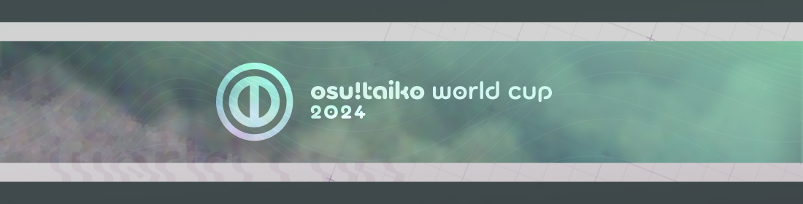

---
tags:
  - TWC
  - TWC2024
  - TWC 2024
outdated_translation: true
outdated_since: 5291d6b7e14c5ced8380ce7917cbad6e0709b441
---

# osu!taiko 월드컵 2024

**osu!taiko 월드컵 2024** (***TWC 2024***)는 [osu! 팀](/wiki/People/osu!_team)이 주최한 국가 기반 토너먼트입니다. 이것은 14번째 osu!taiko 월드컵이기도 합니다.

## 토너먼트 일정

| 스테이지 | 일정 |
| --: | :-- |
| 등록 기간 | 2024-02-15 (00:00 UTC)/2024-02-28 (23:59 UTC) |
| 퀄리파이어 맵풀 쇼케이스 | 2024-03-10 (14:00 UTC) |
| 퀄리파이어 기간 | 2024-03-16/2024-03-17 |
| 32강 | 2024-03-23/2024-03-24 |
| 16강 | 2024-03-30/2024-04-01 |
| 쿼터파이널 | 2024-04-06/2024-04-07 |
| 세미파이널 | 2024-04-13/2024-04-14 |
| 파이널 | 2024-04-20/2024-04-21 |
| 그랜드 파이널 | 2024-04-27/2024-04-28 |

## 상품

osu!taiko 월드컵 2024는 최소 $2,000 상금과 한정판 상품을 제공합니다.

| 순위 | 상품 |
| :-: | :-- |
|  | 총상금의 50%, 단독적으로 제작되는 상품, 프로필 배지, 1년간의 **osu!taiko Champion** 유저 타이틀을 제공합니다. |
|  | 총상금의 30%, 단독적으로 제작되는 상품, 프로필 배지를 제공합니다 |
|  | 총상금의 20%, 단독적으로 제작되는 상품, 프로필 배지를 제공합니다 |

## 조직

osu!taiko 월드컵 2024는 osu!팀과 여러명의 커뮤니티 멤버들로 운영됩니다.

| 직책 | 멤버 |
| :-- | :-- |
| 매니저 | ::{ flag=CA }:: [Azer](https://osu.ppy.sh/users/2155578), ::{ flag=US }:: [ChillierPear](https://osu.ppy.sh/users/9501251), ::{ flag=BR }:: [LeoFLT](https://osu.ppy.sh/users/3668779) |
| 맵풀 셀렉터 | ::{ flag=SE }:: **[Nurend](https://osu.ppy.sh/users/9905079)**, ::{ flag=SE }:: **[Raphalge](https://osu.ppy.sh/users/3918650)**, ::{ flag=US }:: [Backfire](https://osu.ppy.sh/users/263110), ::{ flag=NL }:: [Boaz](https://osu.ppy.sh/users/13302996), ::{ flag=VN }:: [davidminh0111](https://osu.ppy.sh/users/9623142) |
| 맵풀 퀄리티 보증 | ::{ flag=GB }:: [aceticke](https://osu.ppy.sh/users/8838763), ::{ flag=BR }:: [Ideal](https://osu.ppy.sh/users/3869519) |
| 맵풀 플레이테스터 | ::{ flag=JP }:: [4sbet1](https://osu.ppy.sh/users/11563671), ::{ flag=DE }:: [frz](https://osu.ppy.sh/users/6956922), ::{ flag=US }:: [Garpo](https://osu.ppy.sh/users/4097035), ::{ flag=DE }:: [Mew](https://osu.ppy.sh/users/2345156), ::{ flag=IT }:: [ndrrr](https://osu.ppy.sh/users/4609767), ::{ flag=AU }:: [r1chyy](https://osu.ppy.sh/users/11499467), ::{ flag=JP }:: [Sasara](https://osu.ppy.sh/users/7994829), ::{ flag=NZ }:: [Sparxe](https://osu.ppy.sh/users/5750235), ::{ flag=DE }:: [Xay](https://osu.ppy.sh/users/961417) |
| 매퍼 | ::{ flag=JP }:: [\_Rise](https://osu.ppy.sh/users/5217107), ::{ flag=US }:: [\-Kazuha](https://osu.ppy.sh/users/29978316), ::{ flag=JP }:: [4sbet1](https://osu.ppy.sh/users/11563671), ::{ flag=DE }:: [Ak1o](https://osu.ppy.sh/users/1600041), ::{ flag=US }:: [Alchyr](https://osu.ppy.sh/users/4993032), ::{ flag=MY }:: [Asagi Mutsuki](https://osu.ppy.sh/users/2403621), ::{ flag=US }:: [Backfire](https://osu.ppy.sh/users/263110), ::{ flag=NL }:: [Boaz](https://osu.ppy.sh/users/13302996), ::{ flag=HK }:: [Cynplytholowazy](https://osu.ppy.sh/users/3901754), ::{ flag=IT }:: [D3kuu](https://osu.ppy.sh/users/7807444), ::{ flag=VN }:: [davidminh0111](https://osu.ppy.sh/users/9623142), ::{ flag=JP }:: [ekumea1123](https://osu.ppy.sh/users/9119501), ::{ flag=DE }:: [frz](https://osu.ppy.sh/users/6956922), ::{ flag=GR }:: [Genjuro](https://osu.ppy.sh/users/3196091), ::{ flag=DE }:: [HomieLove](https://osu.ppy.sh/users/8693851), ::{ flag=NL }:: [ikin5050](https://osu.ppy.sh/users/4007649), ::{ flag=SE }:: [Invisible O](https://osu.ppy.sh/users/22907037), ::{ flag=US }:: [Izzeee](https://osu.ppy.sh/users/8503743), ::{ flag=AR }:: [Megafan](https://osu.ppy.sh/users/6632605), ::{ flag=DE }:: [Mew](https://osu.ppy.sh/users/2345156), ::{ flag=IT }:: [ndrrr](https://osu.ppy.sh/users/4609767), ::{ flag=US }:: [Nifty](https://osu.ppy.sh/users/4956097), ::{ flag=RU }:: [Nozdormu](https://osu.ppy.sh/users/7169208), ::{ flag=SE }:: [Nurend](https://osu.ppy.sh/users/9905079), ::{ flag=DE }:: [Nwolf](https://osu.ppy.sh/users/1910766), ::{ flag=DE }:: [OnosakiHito](https://osu.ppy.sh/users/290128), ::{ flag=IT }:: [Quorum](https://osu.ppy.sh/users/5200775), ::{ flag=SE }:: [Raphalge](https://osu.ppy.sh/users/3918650), ::{ flag=NO }:: [roufou](https://osu.ppy.sh/users/1109122), ::{ flag=US }:: [SolaEclipse](https://osu.ppy.sh/users/6621158), ::{ flag=JP }:: [tasuke912](https://osu.ppy.sh/users/2774767), ::{ flag=JP }:: [uone](https://osu.ppy.sh/users/5321719), ::{ flag=DE }:: [Xay](https://osu.ppy.sh/users/961417) |
| 해설 | ::{ flag=AU }:: [Beat43210](https://osu.ppy.sh/users/5664171), ::{ flag=US }:: [driodx](https://osu.ppy.sh/users/9709548), ::{ flag=US }:: [ETHN](https://osu.ppy.sh/users/9536977), ::{ flag=CA }:: [janitore](https://osu.ppy.sh/users/3307897), ::{ flag=AU }:: [Jaye](https://osu.ppy.sh/users/4841352), ::{ flag=DE }:: [Joogs](https://osu.ppy.sh/users/8844167), ::{ flag=DE }:: [Nwolf](https://osu.ppy.sh/users/1910766), ::{ flag=GB }:: [Teezel](https://osu.ppy.sh/users/7528639), ::{ flag=HK }:: [YonGin](https://osu.ppy.sh/users/7109317) |
| 심판 | ::{ flag=US }:: [\[K\]](https://osu.ppy.sh/users/16551387), ::{ flag=FR }:: [Aidown](https://osu.ppy.sh/users/1522146), ::{ flag=NL }:: [Albionthegreat](https://osu.ppy.sh/users/9853595), ::{ flag=BR }:: [LeoFLT](https://osu.ppy.sh/users/3668779), ::{ flag=NL }:: [nik](https://osu.ppy.sh/users/10077264), ::{ flag=IN }:: [Speshimen](https://osu.ppy.sh/users/7720204), ::{ flag=US }:: [tigereyes144](https://osu.ppy.sh/users/6499811), ::{ flag=GB }:: [Yazzehh](https://osu.ppy.sh/users/7068973) |
| 통계 | ::{ flag=FI }:: **[shdewz](https://osu.ppy.sh/users/10000899)**, ::{ flag=BR }:: [LeoFLT](https://osu.ppy.sh/users/3668779) |
| GFX | ::{ flag=CN }:: **[Sakura006](https://osu.ppy.sh/users/10365024)**, ::{ flag=CA }:: [kaetwo](https://osu.ppy.sh/users/1997719) |

## 링크

- [정보 스프레드시트](https://docs.google.com/spreadsheets/d/1qGOprVVOTXTBGw2xwDhvTxjpp92SEA1NkQIBJ1gI9xY?rm=minimal)
- [주간 통계 스프레드시트](https://drive.google.com/drive/folders/13k866nXj-DsAfVphboJ6jBLk1EIPU1yA)
- [논의 스레드](https://osu.ppy.sh/community/forums/topics/1884428)
- [실시간 방송](https://www.twitch.tv/osulive)
- [토너먼트 목록](https://osu.ppy.sh/community/tournaments/43)
- ::{ flag=DE }:: [hallowatcher](https://osu.ppy.sh/users/1874761)가 운영하는 [Pick'em 승부예측 페이지](https://pickem.hwc.hr/tournaments/140)
- [Challonge 대진표](https://challonge.com/TWC2024)

## 참가자

|  | Country | Members |
| :-: | :-: | :-- |
| ::{ flag=AR }:: | **아르헨티나** | **[ZelLink](https://osu.ppy.sh/users/6752242)**, [\_Doodle\_](https://osu.ppy.sh/users/5427801), [\_Illustrious\_](https://osu.ppy.sh/users/8256770), [-GordoN-](https://osu.ppy.sh/users/5040981), [Darxad](https://osu.ppy.sh/users/12908933), [SUPERNOOB20](https://osu.ppy.sh/users/16422988) |
| ::{ flag=AU }:: | **오스트레일리아** | **[splyrg](https://osu.ppy.sh/users/11457644)**, [Jaye](https://osu.ppy.sh/users/4841352), [HungryTurtle420](https://osu.ppy.sh/users/30338965), [Dogman77](https://osu.ppy.sh/users/16892858), [Zippywin](https://osu.ppy.sh/users/7269844), [Tsubasa2](https://osu.ppy.sh/users/6835183) |
| ::{ flag=BR }:: | **브라질** | **[Foxeru](https://osu.ppy.sh/users/7479684)**, [HiroK](https://osu.ppy.sh/users/4050738), [Kyoumo](https://osu.ppy.sh/users/8145223), [Lorenzetto](https://osu.ppy.sh/users/9213381), [miwoo](https://osu.ppy.sh/users/12630336), [Skull Kid](https://osu.ppy.sh/users/3044264) |
| ::{ flag=CA }:: | **캐나다** | **[Dizzayy](https://osu.ppy.sh/users/12014683)**, [Ascrute](https://osu.ppy.sh/users/13175389), [Kombucha457](https://osu.ppy.sh/users/18265351), [seal--](https://osu.ppy.sh/users/26820002), [Eltigant](https://osu.ppy.sh/users/15191942), [dots\_](https://osu.ppy.sh/users/15429414) |
| ::{ flag=CL }:: | **칠레** | **[Ulqui](https://osu.ppy.sh/users/1263669)**, [chibamasu](https://osu.ppy.sh/users/16067522), [myucchii](https://osu.ppy.sh/users/10072733), [Esconyan](https://osu.ppy.sh/users/9057823), [DaiKiu](https://osu.ppy.sh/users/4232665), [Shiny Froakie](https://osu.ppy.sh/users/6194830) |
| ::{ flag=CN }:: | **중국** | **[superSSS](https://osu.ppy.sh/users/4315477)**, [shoucan91](https://osu.ppy.sh/users/9383908), [WLYMinato](https://osu.ppy.sh/users/12703319), [Michaelonl](https://osu.ppy.sh/users/12480076), [kknegative](https://osu.ppy.sh/users/2349769), [FORMless000](https://osu.ppy.sh/users/8697654) |
| ::{ flag=CO }:: | **콜롬비아** | **[L1ght](https://osu.ppy.sh/users/9050875)**, [Xoretra](https://osu.ppy.sh/users/4940698), [Coffecito](https://osu.ppy.sh/users/18793276), [ParraCharlie](https://osu.ppy.sh/users/18425848), [-Noval-](https://osu.ppy.sh/users/13890993) |
| ::{ flag=CZ }:: | **체코** | **[Spinasson](https://osu.ppy.sh/users/21448085)**, [iTzzMar0](https://osu.ppy.sh/users/13108155), [grillroasted](https://osu.ppy.sh/users/18271627), [emily\_](https://osu.ppy.sh/users/8438530) |
| ::{ flag=DK }:: | **덴마크** | **[Tsukani](https://osu.ppy.sh/users/5146144)**, [Captain](https://osu.ppy.sh/users/2563435), [Leriola](https://osu.ppy.sh/users/18539549), [Rachri](https://osu.ppy.sh/users/13551943) |
| ::{ flag=EE }:: | **에스토니아** | **[PaskAcc](https://osu.ppy.sh/users/9040795)**, [a720863z](https://osu.ppy.sh/users/18535399), [Defined](https://osu.ppy.sh/users/22750981), [TkonicRabid](https://osu.ppy.sh/users/10480961), [zhewaxen](https://osu.ppy.sh/users/22879634) |
| ::{ flag=FI }:: | **핀란드** | **[duski](https://osu.ppy.sh/users/6506484)**, [Antti](https://osu.ppy.sh/users/13281473), [BFKB113PBK](https://osu.ppy.sh/users/13613362), [GamersDecision](https://osu.ppy.sh/users/19975342), [Mazzuli500](https://osu.ppy.sh/users/10648818), [vodnanen](https://osu.ppy.sh/users/10335557) |
| ::{ flag=FR }:: | **프랑스** | **[Ranshi](https://osu.ppy.sh/users/6680785)**, [YaniFR](https://osu.ppy.sh/users/11260982), [Ecchou](https://osu.ppy.sh/users/16403250), [Nethen](https://osu.ppy.sh/users/14034809), [Briesmas](https://osu.ppy.sh/users/2865172), [Gintoki8](https://osu.ppy.sh/users/2239411) |
| ::{ flag=DE }:: | **독일** | **[Drecksackblase](https://osu.ppy.sh/users/6278008)**, [dragonmaxx](https://osu.ppy.sh/users/12160279), [Dioramos](https://osu.ppy.sh/users/14415208), [MrrMiller](https://osu.ppy.sh/users/9757858), [Mikalodo](https://osu.ppy.sh/users/8498207), [Emre1504](https://osu.ppy.sh/users/13392709) |
| ::{ flag=HK }:: | **홍콩** | **[YonGin](https://osu.ppy.sh/users/7109317)**, [Shing\_](https://osu.ppy.sh/users/2211364), [Brown918](https://osu.ppy.sh/users/9805760), [Henry03](https://osu.ppy.sh/users/17413733), [fua](https://osu.ppy.sh/users/21138904) |
| ::{ flag=HU }:: | **헝가리** | **[Araxcrow](https://osu.ppy.sh/users/11038892)**, [T3mie](https://osu.ppy.sh/users/22121763), [Texshh](https://osu.ppy.sh/users/31373683), [TomaSajt](https://osu.ppy.sh/users/14205174), [Verald](https://osu.ppy.sh/users/5766307), [verto](https://osu.ppy.sh/users/2015300) |
| ::{ flag=ID }:: | **인도네시아** | **[ImChro](https://osu.ppy.sh/users/7280717)**, [Ahmad Haris](https://osu.ppy.sh/users/6048245), [bad hd player](https://osu.ppy.sh/users/13385865), [Fz2311x](https://osu.ppy.sh/users/29780191), [Kaemz](https://osu.ppy.sh/users/8494233), [Alwaysyukaz](https://osu.ppy.sh/users/4999506) |
| ::{ flag=IT }:: | **이탈리아** | **[CRHIX](https://osu.ppy.sh/users/25662684)**, [eww](https://osu.ppy.sh/users/12022477), [Arach](https://osu.ppy.sh/users/8512755), [KITEMMUORT322](https://osu.ppy.sh/users/10370310), [Garda](https://osu.ppy.sh/users/8127849), [megalovania lol](https://osu.ppy.sh/users/20215461) |
| ::{ flag=JP }:: | **일본** | **[Grape\_Tea](https://osu.ppy.sh/users/9540073)**, [Maimaing](https://osu.ppy.sh/users/14520910), [Eriha](https://osu.ppy.sh/users/16320311), [Shamirin\_mzk](https://osu.ppy.sh/users/11325757), [Nekomusya7563](https://osu.ppy.sh/users/1382717), [kanten\_07](https://osu.ppy.sh/users/11680357) |
| ::{ flag=LV }:: | **라트비아** | **[waywern2012](https://osu.ppy.sh/users/5870453)**, [Huntey](https://osu.ppy.sh/users/14451706), [Bezmozglij123](https://osu.ppy.sh/users/20489038), [Mista64](https://osu.ppy.sh/users/10774000), [Piparkuucinsh](https://osu.ppy.sh/users/7453024), [SleepySkyler](https://osu.ppy.sh/users/25608671) |
| ::{ flag=LT }:: | **리투아니아** | **[ramojusd](https://osu.ppy.sh/users/14400817)**, [Atago](https://osu.ppy.sh/users/7011843), [ite](https://osu.ppy.sh/users/11390568), [LilyTheCutest](https://osu.ppy.sh/users/15153340) |
| ::{ flag=MY }:: | **말레이시아** | **[CrabCow](https://osu.ppy.sh/users/9755504)**, [vun](https://osu.ppy.sh/users/6932501), [K0rd31HP](https://osu.ppy.sh/users/15231510), [DXA FonG](https://osu.ppy.sh/users/15019527), [JyaKeii](https://osu.ppy.sh/users/12086753), [HenNEET](https://osu.ppy.sh/users/14225265) |
| ::{ flag=MX }:: | **멕시코** | **[Hivan111](https://osu.ppy.sh/users/13525805)**, [-Caredu-](https://osu.ppy.sh/users/12294759), [Maxmisil](https://osu.ppy.sh/users/20089489), [-Teka-](https://osu.ppy.sh/users/5065096), [Agamalpa](https://osu.ppy.sh/users/15420662), [JunkyTrack](https://osu.ppy.sh/users/11720359) |
| ::{ flag=NL }:: | **네덜란드** | **[Cookie\_Tree](https://osu.ppy.sh/users/502722)**, [demonking7447](https://osu.ppy.sh/users/11094496), [Hypello](https://osu.ppy.sh/users/1594036), [R1ght4](https://osu.ppy.sh/users/21564948), [StrijkIjzer](https://osu.ppy.sh/users/4130926), [Tyronix](https://osu.ppy.sh/users/11290311) |
| ::{ flag=NO }:: | **노르웨이** | **[Vendelicious](https://osu.ppy.sh/users/8818089)**, [Mills](https://osu.ppy.sh/users/7234023), [Mist31](https://osu.ppy.sh/users/18916920), [Defectum](https://osu.ppy.sh/users/8631719) |
| ::{ flag=PE }:: | **페루** | **[alemagno333](https://osu.ppy.sh/users/11411697)**, [Dinki](https://osu.ppy.sh/users/23361435), [Koto-chan](https://osu.ppy.sh/users/8925569), [Pachekin](https://osu.ppy.sh/users/8257441), [FabriGamer84](https://osu.ppy.sh/users/20882798) |
| ::{ flag=PH }:: | **필리핀** | **[Aiery](https://osu.ppy.sh/users/10363380)**, [jmeh07](https://osu.ppy.sh/users/2852269), [JoshEco4](https://osu.ppy.sh/users/18591473), [Mochii\_31](https://osu.ppy.sh/users/25140935), [qish](https://osu.ppy.sh/users/17050115), [Silicosis 2](https://osu.ppy.sh/users/18560307) |
| ::{ flag=PL }:: | **폴란드** | **[Qroissant](https://osu.ppy.sh/users/9511518)**, [knibblet](https://osu.ppy.sh/users/6922240), [Dynutka](https://osu.ppy.sh/users/5947521), [SKRIS-MI](https://osu.ppy.sh/users/15330641), [nickname2500](https://osu.ppy.sh/users/5385606), [krytwal](https://osu.ppy.sh/users/17540374) |
| ::{ flag=PT }:: | **포르투갈** | **[BabySnakes](https://osu.ppy.sh/users/4669728)**, [ImDem0nPT](https://osu.ppy.sh/users/12733839), [MeovvCAT](https://osu.ppy.sh/users/5905091), [Shinzui](https://osu.ppy.sh/users/2505011), [waifufumi](https://osu.ppy.sh/users/16778763), [Warpzoned](https://osu.ppy.sh/users/18649724) |
| ::{ flag=RU }:: | **러시아** | **[mekkimous](https://osu.ppy.sh/users/17381947)**, [fullaltshallah](https://osu.ppy.sh/users/9976154), [Akonine](https://osu.ppy.sh/users/7774222), [artemean](https://osu.ppy.sh/users/8650631), [taikoshallah](https://osu.ppy.sh/users/11117835), [krokodil\_koban](https://osu.ppy.sh/users/24910091) |
| ::{ flag=SK }:: | **슬로바키아** | **[Golden](https://osu.ppy.sh/users/12639462)**, [nevqr](https://osu.ppy.sh/users/14269506), [FlipRopiik](https://osu.ppy.sh/users/10806437), [AlejarTV](https://osu.ppy.sh/users/12568571) |
| ::{ flag=KR }:: | **대한민국** | **[Peaceful](https://osu.ppy.sh/users/165027)**, [oL0](https://osu.ppy.sh/users/1134683), [Laby](https://osu.ppy.sh/users/9085164), [POCARI SWEAT](https://osu.ppy.sh/users/5082685), [Ayaeon](https://osu.ppy.sh/users/13135192), [Jonah](https://osu.ppy.sh/users/5509009) |
| ::{ flag=ES }:: | **스페인** | **[MantequillAlex](https://osu.ppy.sh/users/11499752)**, [Alsael](https://osu.ppy.sh/users/13938746), [GATmoneyTJ1994](https://osu.ppy.sh/users/6735738), [Helox](https://osu.ppy.sh/users/18275040) |
| ::{ flag=SE }:: | **스웨덴** | **[Hana Hayashi](https://osu.ppy.sh/users/4601806)**, [yamfan](https://osu.ppy.sh/users/8669774), [Lemmie](https://osu.ppy.sh/users/11700865), [Sturvos](https://osu.ppy.sh/users/7050679) |
| ::{ flag=CH }:: | **스위스** | **[TaikoWorldCup](https://osu.ppy.sh/users/11296097)**, [cholarmor](https://osu.ppy.sh/users/21502158), [Oui](https://osu.ppy.sh/users/5538419), [NekoTowel](https://osu.ppy.sh/users/14838605), [Nakarin](https://osu.ppy.sh/users/547957) |
| ::{ flag=TW }:: | **대만** | **[monkeydluffy3u4](https://osu.ppy.sh/users/2277798)**, [HiGreeks](https://osu.ppy.sh/users/16536516), [Yuemiao](https://osu.ppy.sh/users/4493348), [HarryAda](https://osu.ppy.sh/users/12892087), [Polemo03](https://osu.ppy.sh/users/10726804), [sevgo7](https://osu.ppy.sh/users/23487206) |
| ::{ flag=TH }:: | **태국** | **[banan](https://osu.ppy.sh/users/16011592)**, [Ponamis](https://osu.ppy.sh/users/7897892), [Raytoly](https://osu.ppy.sh/users/8121109), [ZeroKungz](https://osu.ppy.sh/users/23155757), [HD Enjoyer](https://osu.ppy.sh/users/3968546) |
| ::{ flag=TR }:: | **튀르키예** | **[frukoyurdakul](https://osu.ppy.sh/users/7612550)**, [NeuralG](https://osu.ppy.sh/users/13811400), [skolodojko](https://osu.ppy.sh/users/11716851), [magev](https://osu.ppy.sh/users/13892153), [Zmor0133](https://osu.ppy.sh/users/6419257), [Ryukishi](https://osu.ppy.sh/users/9045874) |
| ::{ flag=GB }:: | **영국** | **[goheegy](https://osu.ppy.sh/users/8057655)**, [CloggyBobby](https://osu.ppy.sh/users/8484987), [Daniels](https://osu.ppy.sh/users/12439209), [mangomizer](https://osu.ppy.sh/users/1893718), [Horiiizon](https://osu.ppy.sh/users/8071438), [overdahedge2014](https://osu.ppy.sh/users/9864847) |
| ::{ flag=US }:: | **미국** | **[R J](https://osu.ppy.sh/users/6490509)**, [cheese salad](https://osu.ppy.sh/users/6349821), [AuroraPhasmata](https://osu.ppy.sh/users/13664116), [Miniature Lamp](https://osu.ppy.sh/users/9821194), [SilverTyrant](https://osu.ppy.sh/users/14356353), [Xok](https://osu.ppy.sh/users/12177903) |
| ::{ flag=VN }:: | **베트남** | **[MashedPotato](https://osu.ppy.sh/users/10494860)**, [Creeperbrine303](https://osu.ppy.sh/users/22515524), [hi\_there\_osu](https://osu.ppy.sh/users/22698999), [nahieu2005](https://osu.ppy.sh/users/22069182), [RandomNameIdk](https://osu.ppy.sh/users/24042710) |

전체 플레이어 목록은 [여기서](https://gist.github.com/LeoFLT/253130c40e8486cdfbcdf680bb19988d) 볼 수 있습니다.

## 매치 일정 : 그랜드 파이널

### 2024년 4월 28일 일요일

| Team A | Team B | 경기 시간 | 트위치 방송 |  |
| --: | :-- | :-- | :-: | :-: |
| 일본 ::{ flag=JP }:: | ::{ flag=GB }:: 영국 | [4월 28일 일요일 13:00 UTC](https://www.timeanddate.com/worldclock/converter.html?iso=20240428T130000&p1=1440&p2=248&p3=136) | [osulive](https://twitch.tv/osulive) | [^gf-match] |

## 맵풀 목록

### 그랜드 파이널

**[맵팩은 여기서 다운로드가 가능합니다  (109 MB)](https://packs.ppy.sh/P245%20-%20osu!taiko%20World%20Cup%202024%3A%20Grand%20Finals.zip)**\
[쇼케이스 VOD는 여기서 볼 수 있습니다](https://www.twitch.tv/videos/2125996548)

- No Mod
  1. [katagiri - c0pyf0x (Raphalge) \[inner oni\]](https://osu.ppy.sh/beatmapsets/2169957#taiko/4579407)
  2. [sepiarecorders - s/c/a/p/e/g/o/a/t (Raphalge) \[o/n/i\]](https://osu.ppy.sh/beatmapsets/2169956#taiko/4579405)
  3. [DJ Raisei - Fractured Heaven (Genjuro) \[Fallen Angel\]](https://osu.ppy.sh/beatmapsets/2169918#taiko/4579320)
  4. [Nanodesu - Libera Lotus (Mew) \[Reborn Purity\]](https://osu.ppy.sh/beatmapsets/2169909#taiko/4579308)
  5. [HOUR OF PENANCE - Devotion for Tyranny (HomieLove) \[The Monstrosity feat. Ak1o (TWC Ver.)\]](https://osu.ppy.sh/beatmapsets/2169921#taiko/4579324)
  6. [BilliumMoto - Stained Satin (Nifty) \[Showdown (TWC ver.)\]](https://osu.ppy.sh/beatmapsets/2170035#taiko/4579579)
  7. [BilliumMoto - 100 Carat Smoke Point (\_Rise) \[Inner Oni\]](https://osu.ppy.sh/beatmapsets/2170025#taiko/4579557)
- Hidden
  1. [DJ Majokko Mirakurun - Crakkin (Shamirin\_mzk) \[Despair\]](https://osu.ppy.sh/beatmapsets/1761127#taiko/3604452)
  2. [ikaruga\_nex - ultimer (Raphalge) \[arrested for silly crimes\]](https://osu.ppy.sh/beatmapsets/1761945#taiko/3606293)
- Hard Rock
  1. [Memme - Acid Burst (goheegy) \[TWC Ver.\]](https://osu.ppy.sh/beatmapsets/1048233#taiko/4579357)
  2. [7\_7 - Nanikore!? Mix (Waribashi) \[Nandacore\]](https://osu.ppy.sh/beatmapsets/1240813#taiko/2579507)
- Double Time
  1. [MK & RoughSketch - Stereo Beasts (Original Mix) (roufou) \[yoshi\]](https://osu.ppy.sh/beatmapsets/2169935#taiko/4579365)
  2. [USAO - ZED (Extended Mix) (yassu-) \[Collab\]](https://osu.ppy.sh/beatmapsets/511097#taiko/1086503)
- Free Mod
  1. [xxxlolxxx - 36C (miyagishima) \[Inner Oni\]](https://osu.ppy.sh/beatmapsets/2107272#taiko/4422349)
  2. [nujioh - goodbye (D3kuu) \[final destination\]](https://osu.ppy.sh/beatmapsets/2169940#taiko/4579380)
- Tiebreaker
  1. **[Quarkee & Yuuni - Fabricated Exaltation (tasuke912) \[Grande Finale\]](https://osu.ppy.sh/beatmapsets/2169950#taiko/4579392)**

### 파이널

**[맵팩은 여기서 다운로드가 가능합니다  (167 MB)](https://packs.ppy.sh/P244%20-%20osu!taiko%20World%20Cup%202024%3A%20Finals.zip?1713511023)**\
[쇼케이스 VOD는 여기서 볼 수 있습니다](https://www.twitch.tv/videos/2124949532)

- No Mod
  1. [SatapanP ft. Hatsune Miku - Bagooon!!!!! (Skidooskei) \[NO MISS!!!!! (TWC EDIT!!!!!)\]](https://osu.ppy.sh/beatmapsets/2112567#taiko/4570747)
  2. [Mylta - KEY (Cut Ver.) (ekumea1123) \[Crypto\]](https://osu.ppy.sh/beatmapsets/2078471#taiko/4352127)
  3. [kessoku band - Seishun Complex (Kirairi Bootleg) (Seren58) \[Quartet\]](https://osu.ppy.sh/beatmapsets/1901991#taiko/3921191)
  4. [Ruby My Dear - Ecureuil (SolaEclipse) \[Don't Blink\]](https://osu.ppy.sh/beatmapsets/2166520#taiko/4570829)
  5. [Rivers of Nihil - Reign of Dreams (Xay) \[Perpetuity\]](https://osu.ppy.sh/beatmapsets/2166485#taiko/4570764)
  6. [Frums - Remnants of Turing (Ulqui) \[Alto Hospicio\]](https://osu.ppy.sh/beatmapsets/2019618#taiko/4205872)
  7. [Sydosys - Serrate (\_Rise) \[Inner Oni\]](https://osu.ppy.sh/beatmapsets/2166563#taiko/4570945)
- Hidden
  1. [flatt - Agitato (miyagishima) \[Inner Oni (TWC Edit)\]](https://osu.ppy.sh/beatmapsets/2024995#taiko/4570745)
  2. [Supire - Nebula (Alchyr) \[Naturalborn Void\]](https://osu.ppy.sh/beatmapsets/2166486#taiko/4570766)
- Hard Rock
  1. [Kayoko - BORN.TO.KiLL (miyagishima) \[Inner Oni (TWC Edit)\]](https://osu.ppy.sh/beatmapsets/2106820#taiko/4421005)
  2. [Lime - Campanella (Nwolf) \[Skyreach (TWC Ver.)\]](https://osu.ppy.sh/beatmapsets/2134225#taiko/4570779)
- Double Time
  1. [Houshou Marine x Yunomi - Unison (Megafan) \[Choose Me!\]](https://osu.ppy.sh/beatmapsets/1559449#taiko/3185402)
  2. [ShinRa-Bansho - Mugen Shitto Gekijou "666" (gaston\_2199) \[Drums Theater "Final Curtain: Inner Oni"\]](https://osu.ppy.sh/beatmapsets/1772154#taiko/4332478)
- Free Mod
  1. [MYUKKE. - Friendly Gigant Fire (frz) \[Hell Oni (TWC Ver.)\]](https://osu.ppy.sh/beatmapsets/2049240#taiko/4570786)
  2. [Shogo Nomura - egoist (ZTH) \[Chaos\]](https://osu.ppy.sh/beatmapsets/1915102#taiko/3950909)
- Tiebreaker
  1. **[TWC Sound Team "Xurv Stasis Rasufim" - Kaze no Denwa (ikin5050) \[Hell Oni\]](https://osu.ppy.sh/beatmapsets/2166504#taiko/4570795)**

### 세미파이널

**[맵팩은 여기서 다운로드가 가능합니다 (118 MB)](https://packs.ppy.sh/P243%20-%20osu!taiko%20World%20Cup%202024%3A%20Semifinals.zip)**\
[쇼케이스 VOD는 여기서 볼 수 있습니다](https://www.twitch.tv/videos/2113703930)

- No Mod
  1. [lemm - Algorithm 54 (tasuke912) \[Oni 54\]](https://osu.ppy.sh/beatmapsets/2163075#taiko/4561785)
  2. [Tanchiky - Riot (Nwolf) \[stage five\]](https://osu.ppy.sh/beatmapsets/2163103#taiko/4561829)
  3. [Zips - Heisei Sayonara Bye Bye (Ph0eNiiXZ) \[To Your Demise \[290 BPM\]\]](https://osu.ppy.sh/beatmapsets/1709931#taiko/3941177)
  4. [Nanodesu - The Show's Over (Mew) \[Curtain Call\]](https://osu.ppy.sh/beatmapsets/2163078#taiko/4561790)
  5. [UNDEAD CORPORATION - The silent world (sendol) \[Hell Oni (Edit)\]](https://osu.ppy.sh/beatmapsets/1117919#taiko/4561385)
  6. [katagiri - Higashi (SORA\_T4kAhqSh1) \[TWC edit\]](https://osu.ppy.sh/beatmapsets/2163089#taiko/4561814)
- Hidden
  1. [MYUKKE. - Mach Roger (Nwolf) \[bowser\]](https://osu.ppy.sh/beatmapsets/2163105#taiko/4561831)
  2. [cosMo@bousouP feat. Hatsune Miku - Daijoubu Desu ka? (Raphalge) \[Inner Oni\]](https://osu.ppy.sh/beatmapsets/2163117#taiko/4561849)
- Hard Rock
  1. [Street - Aiwv (Grape\_Tea) \[Re:Taiko (Cut Ver.)\]](https://osu.ppy.sh/beatmapsets/2141512#taiko/4507425)
  2. [MisomyL - Amnehilesie (Shinsekai-) \[Forgotten Oni TWC. Ver\]](https://osu.ppy.sh/beatmapsets/1712107#taiko/4561908)
- Double Time
  1. [Masayoshi Iimori - NEWALONE (Extended Mix) (roufou) \[Flagrant\]](https://osu.ppy.sh/beatmapsets/2163092#taiko/4561817)
  2. [Fox Stevenson - Bruises (freestyler) \[flr's Inner Oni\]](https://osu.ppy.sh/beatmapsets/1916575#taiko/4102175)
- Free Mod
  1. [Sparxe - Switcheroo (OnosakiHito) \[Ura Oni (TWC Ver.)\]](https://osu.ppy.sh/beatmapsets/2163116#taiko/4561848)
  2. [Hoshino Ongaku Koubou - pique (Nepoch) \[MAXIMUM\]](https://osu.ppy.sh/beatmapsets/1384944#taiko/2861112)
- Tiebreaker
  1. **[Tektheist - Pomegranate (SolaEclipse) \[Spiral Matai\]](https://osu.ppy.sh/beatmapsets/2163122#taiko/4561855)**

### 쿼터파이널

**[맵팩은 여기서 다운로드가 가능합니다 (78 MB)](https://packs.ppy.sh/P242%20-%20osu!taiko%20World%20Cup%202024%3A%20Quarterfinals.zip)**\
[쇼케이스 VOD는 여기서 볼 수 있습니다](https://www.twitch.tv/videos/2107173187)

- No Mod
  1. [Momiji Yamamoto - Fantastic\*Tooryanse(7\_7 kuso bootleg) (Waribashi) \[Fantastic\* (Edit)\]](https://osu.ppy.sh/beatmapsets/1126206#taiko/2353151)
  2. [Jimmy Weckl - System "Z" (FORMless000) \[MDC "R"\]](https://osu.ppy.sh/beatmapsets/2092777#taiko/4387440)
  3. [Zips - Reiwai Terrorism (yassu-) \[† DJ MOKOJI †\]](https://osu.ppy.sh/beatmapsets/894341#taiko/1868905)
  4. [Uroko - How 2(torial) move out (davidminh0111) \[davidminh & Noz's Tutorial\]](https://osu.ppy.sh/beatmapsets/2159324#taiko/4552782)
  5. [Amon Amarth - Twilight of the Thunder God (frukoyurdakul) \[Death\]](https://osu.ppy.sh/beatmapsets/531697#taiko/1126786)
  6. [yowanecity - Genius(Yunosuke Remix) (Shamirin\_mzk) \[Criminal\]](https://osu.ppy.sh/beatmapsets/1996134#taiko/4148533)
- Hidden
  1. [dj REMO-CON - Pollinosis (roufou) \[Sickest Oni\]](https://osu.ppy.sh/beatmapsets/2159328#taiko/4552799)
  2. [technoplanet feat. Haruno & Daisuke Kurosawa - Far Away Light (op45667) \[Fading Incandescence\]](https://osu.ppy.sh/beatmapsets/1915414#taiko/3951566)
- Hard Rock
  1. [ASA - Assault TAXI (\_Rise) \[Inner Oni (Edit)\]](https://osu.ppy.sh/beatmapsets/2071611#taiko/4552232)
  2. [7\_7 feat. kasane vavzed - Yakou (Invisible O) \[Ethereal\]](https://osu.ppy.sh/beatmapsets/2159335#taiko/4552824)
- Double Time
  1. [Street - Maritime Police (Megafan) \[Flow\]](https://osu.ppy.sh/beatmapsets/2159322#taiko/4552776)
  2. [PSYQUI - Raise Your Hands feat. Such (D3kuu) \[Inner Mario\]](https://osu.ppy.sh/beatmapsets/2159330#taiko/4552816)
- Free Mod
  1. [Feryquitous - Ai Nov (MTNTWarz) \[Eliminate\]](https://osu.ppy.sh/beatmapsets/2014150#taiko/4191502)
  2. [succducc - me & u (Kara Edit) (ler1211) \[you & i (should kiss) (twc edit)\]](https://osu.ppy.sh/beatmapsets/2026921#taiko/4223441)
- Tiebreaker
  1. **[Viatores Nebulae (ptar124 & SiLiS) - Ad infinitum \~ein sof\~ (frz) \[Perpetual Divinity\]](https://osu.ppy.sh/beatmapsets/2159337#taiko/4552827)**

### 16강

**[맵팩은 여기서 다운로드가 가능합니다 (83 MB)](https://packs.ppy.sh/P241%20-%20osu!taiko%20World%20Cup%202024%3A%20Round%20of%2016.zip)**\
[쇼케이스 VOD는 여기서 볼 수 있습니다](https://www.twitch.tv/videos/2100512474)

- No Mod
  1. [ptar124 - aqua vitae feat. Kagamine Rin & Kagamine Len (Cynplytholowazy) \[Life-Water\]](https://osu.ppy.sh/beatmapsets/2155621#taiko/4543646)
  2. [ALEPH - IMPULSE (\_Rise) \[Inner Oni\]](https://osu.ppy.sh/beatmapsets/1387209#taiko/2865261)
  3. [Nanahoshi Kangengakudan - FREEDMAN (Cut Ver.) (Nwolf) \[Inner Oni (1.15x)\]](https://osu.ppy.sh/beatmapsets/2155512#taiko/4543418)
  4. [Rish feat. Choko - Waaa (Mew) \[:v: :grin: :v:\]](https://osu.ppy.sh/beatmapsets/2155513#taiko/4543420)
  5. [Ranka Lee (CV: Nakajima Megumi), Sheryl Nome (CV: May'n) - Lion (Golden Eggs J-CORE Bootleg) (-Kazuha) \[Your Sound\]](https://osu.ppy.sh/beatmapsets/2155519#taiko/4543435)
- Hidden
  1. [taylor - pave paradise (D3kuu) \[mario\]](https://osu.ppy.sh/beatmapsets/2155527#taiko/4543461)
  2. [Ethan Bortnick - hide n seek (ndrrr) \[luigi\]](https://osu.ppy.sh/beatmapsets/2155526#taiko/4543460)
- Hard Rock
  1. [Tedjimo yomigY - Usuva Kagerow (Izzeee) \[Dragonfly\]](https://osu.ppy.sh/beatmapsets/2155520#taiko/4543445)
  2. [UNDEAD CORPORATION - Adore Your Pain (roxorotto) \[Inner Oni (Edit)\]](https://osu.ppy.sh/beatmapsets/2155509#taiko/4543414)
- Double Time
  1. [kagenui hana - Shoujo Fuzei (cdh) \[\<33\]](https://osu.ppy.sh/beatmapsets/2015581#taiko/4524843)
  2. [the peggies - LOVE TRIP (2019) (MicSup08) \[Koi\]](https://osu.ppy.sh/beatmapsets/1854308#taiko/3810475)
- Free Mod
  1. [Zen Nihon Suppoko Nyaago Shin'eitai - Muunya Poyopoyo Suppoko Nyaago (Eyenine) \[Uranya\~go (edit)\]](https://osu.ppy.sh/beatmapsets/2155530#taiko/4543466)
  2. [Aiyru - Inventor (Raphalge) \[Inner Oni\]](https://osu.ppy.sh/beatmapsets/2155537#taiko/4543474)
- Tiebreaker
  1. **[Cansol - Train of Thought (Nurend) \[Last Stop\]](https://osu.ppy.sh/beatmapsets/2155531#taiko/4543467)**

### 32강

**[맵팩은 여기서 다운로드가 가능합니다 (93 MB)](https://packs.ppy.sh/P240%20-%20osu!taiko%20World%20Cup%202024%3A%20Round%20of%2032.zip)**\
[쇼케이스 VOD는 여기서 볼 수 있습니다](https://www.twitch.tv/videos/2093904149?t=0h49m19s)

- No Mod
  1. [KISIDA KYODAN & THE AKEBOSI ROCKETS - Shinkuu no Melancholy (Nwolf) \[Forgotten Fantasy Satellite (TWC ver.)\]](https://osu.ppy.sh/beatmapsets/2152054#taiko/4534311)
  2. [Street - Hypothesis (tasuke912) \[pf.\]](https://osu.ppy.sh/beatmapsets/2068643#taiko/4533909)
  3. [Shoebill - Amen-Kun (ikin5050) \[Distractive Cat\]](https://osu.ppy.sh/beatmapsets/2152041#taiko/4534276)
  4. [siqlo - wholeheartedly (Mew) \[haphazardly\]](https://osu.ppy.sh/beatmapsets/2152039#taiko/4534272)
  5. [xi - Garyou Tensei (Xay) \[Happy Little Streams\]](https://osu.ppy.sh/beatmapsets/2152045#taiko/4534285)
- Hidden
  1. [Hamu feat. Natsuki Karin - Sunao ni Naritai (osu! Edit Ver.) (Quorum) \[Hidden Answers\]](https://osu.ppy.sh/beatmapsets/2152060#taiko/4534320)
  2. [Power Of Nature - BabeL \~Next Story\~ (uone) \[Oni\]](https://osu.ppy.sh/beatmapsets/699595#taiko/1481393)
- Hard Rock
  1. [Ponkichi - YOZAKURA Bladerz (TKS) \[Inner Oni\]](https://osu.ppy.sh/beatmapsets/1707779#taiko/3552174)
  2. [TUYU - Daemonisch (gaston\_2199) \[KTYN's Inner Oni\]](https://osu.ppy.sh/beatmapsets/1444402#taiko/2983308)
- Double Time
  1. [meganeko - Computer Blues (Axer) \[Volta's Oni\]](https://osu.ppy.sh/beatmapsets/1147128#taiko/2412944)
  2. [REDALiCE feat. Nomiya Ayumi - Colors (4sbet1) \[Oni\]](https://osu.ppy.sh/beatmapsets/1578929#taiko/3223966)
- Free Mod
  1. [Kotoha - Yuki wa Naniiro (TKS) \[Snowmelt\]](https://osu.ppy.sh/beatmapsets/2078626#taiko/4352521)
  2. [Namiguru - Zunda Party Night (Waribashi) \[Zunda Dancing\]](https://osu.ppy.sh/beatmapsets/1962520#taiko/4067448)
- Tiebreaker
  1. **[Yuuni - Frozen Blood (HomieLove) \[Cosmic Minds\]](https://osu.ppy.sh/beatmapsets/2152052#taiko/4534309)**

### 퀄리파이어

**[맵팩은 여기서 다운로드가 가능합니다 (28 MB)](https://packs.ppy.sh/P239%20-%20osu!taiko%20World%20Cup%202024%3A%20Qualifiers.zip)**\
[쇼케이스 VOD는 여기서 볼 수 있습니다](https://www.twitch.tv/videos/2086820936)

- No Mod
  1. [katagiri - Meshimase!! Nyan-Nyan Nightmare (nananass) \[KTYN's NIGHTMARE\]](https://osu.ppy.sh/beatmapsets/878831#taiko/1842492)
  2. [Feryquitous - THE SEVENS CODE (sendol) \[Inner Oni (Edit)\]](https://osu.ppy.sh/beatmapsets/1736507#taiko/4525789)
  3. [Alice Schach and the Magic Orchestra - Doppelgangers (Nozdormu) \[Duality\]](https://osu.ppy.sh/beatmapsets/2148475#taiko/4525808)
- Hidden
  1. [L.E.D.-G - Karasu (roufou) \[MURDER\]](https://osu.ppy.sh/beatmapsets/2148481#taiko/4525819)
- Hard Rock
  1. [SOUND HOLIC feat. Nana Takahashi - EVANESCENT (Raphalge) \[Inner Oni\]](https://osu.ppy.sh/beatmapsets/2148488#taiko/4525834)
- Double Time
  1. [PSYQUI - Still in my heart feat. Punipuni Denki (Sebola) \[You are still in my heart (TWC Edit)\]](https://osu.ppy.sh/beatmapsets/2148504#taiko/4525866)
- Free Mod
  1. [Chroma - To the Milky Way (davidminh0111) \[Supernova\]](https://osu.ppy.sh/beatmapsets/2148483#taiko/4525822)

## 경기 결과

### 그랜드 파이널

2024년 4월 27일 토요일:

| Team A |  |  | Team B | 경기 링크 | VOD 링크 |
| --: | :-: | :-: | :-- | :-- | :-- |
| **영국** ::{ flag=GB }:: | **7** | 3 | ::{ flag=US }:: 미국 | [#1](https://osu.ppy.sh/community/matches/113656670) | [#1](https://www.twitch.tv/videos/2131198127) |

### 파이널

자세한 통계는 [여기](https://docs.google.com/spreadsheets/d/1hwZO3KTWHHlQ8BaPMFy3cffKlmao8cd3unrvaI2bKmA?rm=minimal)에서 확인할 수 있습니다.

2024년 4월 20일 토요일:

| Team A |  |  | Team B | 경기 링크 | VOD 링크 |
| --: | :-: | :-: | :-- | :-- | :-- |
| 브라질 ::{ flag=BR }:: | 3 | **7** | ::{ flag=TW }:: **대만** | [#1](https://osu.ppy.sh/community/matches/113566115) | [#1](https://www.twitch.tv/videos/2124949578) |

2024년 4월 21일 일요일:

| Team A |  |  | Team B | 경기 링크 | VOD 링크 |
| --: | :-: | :-: | :-- | :-- | :-- |
| 대한민국 ::{ flag=KR }:: | 3 | **7** | ::{ flag=US }:: **미국** | [#1](https://osu.ppy.sh/community/matches/113575347) | [#1](https://www.twitch.tv/videos/2125504351) |
| **일본** ::{ flag=JP }:: | **7** | 0 | ::{ flag=GB }:: 영국 | [#1](https://osu.ppy.sh/community/matches/113580271) | [#1](https://www.twitch.tv/videos/2125773582) |
| **미국** ::{ flag=US }:: | **7** | 4 | ::{ flag=TW }:: 대만 | [#1](https://osu.ppy.sh/community/matches/113582809) | [#1](https://www.twitch.tv/videos/2125916897) |

### 세미파이널

자세한 통계는 [여기](https://docs.google.com/spreadsheets/d/1kt4_ec0U8pw327B5nHwYo8cwCvIu2mCQUvOh4P0Untg?rm=minimal)에서 확인할 수 있습니다.

2024년 4월 13일 토요일:

| Team A |  |  | Team B | 경기 링크 | VOD 링크 |
| --: | :-: | :-: | :-- | :-- | :-- |
| **중국** ::{ flag=CN }:: | **6** | 0 | ::{ flag=FI }:: 핀란드 | [#1](https://osu.ppy.sh/community/matches/113473898) | [#1](https://www.twitch.tv/videos/2118660381) |
| **일본** ::{ flag=JP }:: | **6** | 0 | ::{ flag=BR }:: 브라질 | [#1](https://osu.ppy.sh/community/matches/113475423) | [#1](https://www.twitch.tv/videos/2118756373) |
| **대만** ::{ flag=TW }:: | **6** | 0 | ::{ flag=CA }:: 캐나다 | [#1](https://osu.ppy.sh/community/matches/113476197) | [#1](https://www.twitch.tv/videos/2118778200) |
| **칠레** ::{ flag=CL }:: | **6** | 2 | ::{ flag=FR }:: 프랑스 | [#1](https://osu.ppy.sh/community/matches/113478101) | [#1](https://www.twitch.tv/videos/2118876237) |

2024년 4월 14일 일요일:

| Team A |  |  | Team B | 경기 링크 | VOD 링크 |
| --: | :-: | :-: | :-- | :-- | :-- |
| **미국** ::{ flag=US }:: | **6** | 1 | ::{ flag=MY }:: 말레이시아 | [#1](https://osu.ppy.sh/community/matches/113485488) | [#1](https://www.twitch.tv/videos/2119349809) |
| **영국** ::{ flag=GB }:: | **6** | 5 | ::{ flag=KR }:: 대한민국 | [#1](https://osu.ppy.sh/community/matches/113490219) | [#1](https://www.twitch.tv/videos/2119605829) |
| 중국 ::{ flag=CN }:: | 3 | **6** | ::{ flag=TW }:: **대만** | [#1](https://osu.ppy.sh/community/matches/113491479) | [#1](https://www.twitch.tv/videos/2119657043) |
| **미국** ::{ flag=US }:: | **6** | 2 | ::{ flag=CL }:: 칠레 | [#1](https://osu.ppy.sh/community/matches/113495296) | [#1](https://www.twitch.tv/videos/2119880874) |

### 쿼터파이널

자세한 통계는 [여기](https://docs.google.com/spreadsheets/d/1xXmKaCIfkjcCyq1msEpQUbb_SPG8u3zEe7rcbmljDP8?rm=minimal)에서 확인할 수 있습니다.

2024년 4월 5일 금요일:

| Team A |  |  | Team B | 경기 링크 | VOD 링크 |
| --: | :-: | :-: | :-- | :-- | :-- |
| **네덜란드** ::{ flag=NL }:: | **6** | 1 | ::{ flag=ID }:: 인도네시아 | [#1](https://osu.ppy.sh/community/matches/113370363) | [#1](https://www.twitch.tv/videos/2111872756) |

2024년 4월 6일 토요일:

| Team A |  |  | Team B | 경기 링크 | VOD 링크 |
| --: | :-: | :-: | :-- | :-- | :-- |
| **말레이시아** ::{ flag=MY }:: | **6** | 2 | ::{ flag=AU }:: 오스트레일리아 | [#1](https://osu.ppy.sh/community/matches/113381374) | [#1](https://www.twitch.tv/videos/2112449785) |
| 튀르키예 ::{ flag=TR }:: | 2 | **6** | ::{ flag=TH }:: **태국** | [#1](https://osu.ppy.sh/community/matches/113384092) | [#1](https://www.twitch.tv/videos/2112500383) |
| **핀란드** ::{ flag=FI }:: | **6** | 0 | ::{ flag=DE }:: 독일 | [#1](https://osu.ppy.sh/community/matches/113384467) | [#1](https://www.twitch.tv/videos/2112496638) |
| **필리핀** ::{ flag=PH }:: | **6** | 0 | ::{ flag=CH }:: 스위스 | [#1](https://osu.ppy.sh/community/matches/113384931) | [#1](https://www.twitch.tv/videos/2112606526) |
| **캐나다** ::{ flag=CA }:: | **6** | 4 | ::{ flag=RU }:: 러시아 | [#1](https://osu.ppy.sh/community/matches/113385844) | [#1](https://www.twitch.tv/videos/2112606527) |
| **아르헨티나** ::{ flag=AR }:: | **6** | 0 | ::{ flag=SK }:: 슬로바키아 | [#1](https://osu.ppy.sh/community/matches/113387234) | [#1](https://www.twitch.tv/videos/2112642117) |
| 미국 ::{ flag=US }:: | 1 | **6** | ::{ flag=BR }:: **브라질** | [#1](https://osu.ppy.sh/community/matches/113392114) | [#1](https://www.twitch.tv/videos/2112925699) |

2024년 4월 7일 일요일:

| Team A |  |  | Team B | 경기 링크 | VOD 링크 |
| --: | :-: | :-: | :-- | :-- | :-- |
| **일본** ::{ flag=JP }:: | **6** | 1 | ::{ flag=CL }:: 칠레 | [#1](https://osu.ppy.sh/community/matches/113394221) | [#1](https://www.twitch.tv/videos/2113305617) |
| **캐나다** ::{ flag=CA }:: | **6** | 2 | ::{ flag=PH }:: 필리핀 | [#1](https://osu.ppy.sh/community/matches/113394761) | [#1](https://www.twitch.tv/videos/2113305618) |
| **말레이시아** ::{ flag=MY }:: | **6** | 3 | ::{ flag=NL }:: 네덜란드 | [#1](https://osu.ppy.sh/community/matches/113397564) | [#1](https://www.twitch.tv/videos/2113322491) |
| **프랑스** ::{ flag=FR }:: | **6** | 2 | ::{ flag=PL }:: 폴란드 | [#1](https://osu.ppy.sh/community/matches/113398084) | [#1](https://www.twitch.tv/videos/2113345527) |
| **핀란드** ::{ flag=FI }:: | **6** | 1 | ::{ flag=TH }:: 태국 | [#1](https://osu.ppy.sh/community/matches/113398357) | [#1](https://www.twitch.tv/videos/2113358450) |
| **대한민국** ::{ flag=KR }:: | **6** | 4 | ::{ flag=CN }:: 중국 | [#1](https://osu.ppy.sh/community/matches/113399474) | [#1](https://www.twitch.tv/videos/2113447916) |
| **영국** ::{ flag=GB }:: | **6** | 3 | ::{ flag=TW }:: 대만 | [#1](https://osu.ppy.sh/community/matches/113400641) | [#1](https://www.twitch.tv/videos/2113494456) |
| **프랑스** ::{ flag=FR }:: | **6** | 2 | ::{ flag=AR }:: 아르헨티나 | [#1](https://osu.ppy.sh/community/matches/113403202) | [#1](https://www.twitch.tv/videos/2113631912) |

### 16강

자세한 통계는 [여기](https://docs.google.com/spreadsheets/d/1xXmKaCIfkjcCyq1msEpQUbb_SPG8u3zEe7rcbmljDP8?rm=minimal)에서 확인할 수 있습니다.

2024년 3월 30일 토요일:

| Team A |  |  | Team B | 경기 링크 | VOD 링크 |
| --: | :-: | :-: | :-- | :-- | :-- |
| **일본** ::{ flag=JP }:: | **5** | 0 | ::{ flag=PH }:: 필리핀 | [#1](https://osu.ppy.sh/community/matches/113289025) | [#1](https://www.twitch.tv/videos/2105887871) |
| 덴마크 ::{ flag=DK }:: | 0 | **5** | ::{ flag=AU }:: **오스트레일리아** | [#1](https://osu.ppy.sh/community/matches/113291144) | [#1](https://www.twitch.tv/videos/2105889387) |
| **브라질** ::{ flag=BR }:: | **5** | 0 | ::{ flag=FI }:: 핀란드 | [#1](https://osu.ppy.sh/community/matches/113293395) | [#1](https://www.twitch.tv/videos/2105891423) |
| 홍콩 ::{ flag=HK }:: | 0 | **5** | ::{ flag=TH }:: **태국** | [#1](https://osu.ppy.sh/community/matches/113294179) | [#1](https://www.twitch.tv/videos/2105925815) |
| 이탈리아 ::{ flag=IT }:: | 0 | **5** | ::{ flag=DE }:: **독일** | [#1](https://osu.ppy.sh/community/matches/113295134) | [#1](https://www.twitch.tv/videos/2105968607) |
| 페루 ::{ flag=PE }:: | 0 | **5** | ::{ flag=PL }:: **폴란드** | [#1](https://osu.ppy.sh/community/matches/113296025) | [#1](https://www.twitch.tv/videos/2106021865) |
| 체코 ::{ flag=CZ }:: | 0 | **5** | ::{ flag=RU }:: **러시아** | [#1](https://osu.ppy.sh/community/matches/113296934) | [#1](https://www.twitch.tv/videos/2106075246) |
| **칠레** ::{ flag=CL }:: | **5** | 1 | ::{ flag=CA }:: 캐나다 | [#1](https://osu.ppy.sh/community/matches/113301124) | [#1](https://www.twitch.tv/videos/2106335145) |

2024년 3월 31일 일요일:

| Team A |  |  | Team B | 경기 링크 | VOD 링크 |
| --: | :-: | :-: | :-- | :-- | :-- |
| **대한민국** ::{ flag=KR }:: | **5** | 0 | ::{ flag=NL }:: 네덜란드 | [#1](https://osu.ppy.sh/community/matches/113307316) | [#1](https://www.twitch.tv/videos/2106783248) |
| **슬로바키아** ::{ flag=SK }:: | **0** | -1 | ::{ flag=NO }:: 노르웨이 | *win by default* |  |
| **대만** ::{ flag=TW }:: | **5** | 0 | ::{ flag=FR }:: 프랑스 | [#1](https://osu.ppy.sh/community/matches/113307766) | [#1](https://www.twitch.tv/videos/2106815000) |
| **중국** ::{ flag=CN }:: | **5** | 2 | ::{ flag=MY }:: 말레이시아 | [#1](https://osu.ppy.sh/community/matches/113308481) | [#1](https://www.twitch.tv/videos/2106884009) |
| **영국** ::{ flag=GB }:: | **5** | 1 | ::{ flag=AR }:: 아르헨티나 | [#1](https://osu.ppy.sh/community/matches/113309102) | [#1](https://www.twitch.tv/videos/2106895507) |
| 콜롬비아 ::{ flag=CO }:: | 2 | **5** | ::{ flag=ID }:: **인도네시아** | [#1](https://osu.ppy.sh/community/matches/113309695) | [#1](https://www.twitch.tv/videos/2106946835) |
| **미국** ::{ flag=US }:: | **5** | 0 | ::{ flag=TR }:: 튀르키예 | [#1](https://osu.ppy.sh/community/matches/113311014) | [#1](https://www.twitch.tv/videos/2107033952) |
| 멕시코 ::{ flag=MX }:: | 2 | **5** | ::{ flag=CH }:: **스위스** | [#1](https://osu.ppy.sh/community/matches/113311814) | [#1](https://www.twitch.tv/videos/2107105344) |

### 32강

자세한 통계는 [여기](https://docs.google.com/spreadsheets/d/1Ik9AOAkdUBKwGi6qYNsAIwhlYG1vVKjP6SXH67in6pk?rm=minimal)에서 확인할 수 있습니다.

2024년 3월 22일 금요일:

| Team A |  |  | Team B | 경기 링크 | VOD 링크 |
| --: | :-: | :-: | :-- | :-- | :-- |
| **핀란드** ::{ flag=FI }:: | **5** | 0 | ::{ flag=NO }:: 노르웨이 | [#1](https://osu.ppy.sh/community/matches/113179374) | [#1](https://www.twitch.tv/videos/2098391563) |

2024년 3월 23일 토요일:

| Team A |  |  | Team B | 경기 링크 | VOD 링크 |
| --: | :-: | :-: | :-- | :-- | :-- |
| **칠레** ::{ flag=CL }:: | **5** | 0 | ::{ flag=CO }:: 콜롬비아 | [#1](https://osu.ppy.sh/community/matches/113185322) | [#1](https://www.twitch.tv/videos/2098964086) |
| **대만** ::{ flag=TW }:: | **5** | 0 | ::{ flag=HK }:: 홍콩 | [#1](https://osu.ppy.sh/community/matches/113190279) | [#1](https://www.twitch.tv/videos/2098965925) |
| **일본** ::{ flag=JP }:: | **5** | 0 | ::{ flag=DK }:: 덴마크 | [#1](https://osu.ppy.sh/community/matches/113190789) | [#1](https://www.twitch.tv/videos/2098981785) |
| **말레이시아** ::{ flag=MY }:: | **5** | 3 | ::{ flag=CH }:: 스위스 | [#1](https://osu.ppy.sh/community/matches/113193076) | [#1](https://www.twitch.tv/videos/2099153913) |
| 러시아 ::{ flag=RU }:: | 1 | **5** | ::{ flag=NL }:: **네덜란드** | [#1](https://osu.ppy.sh/community/matches/113194129) | [#1](https://www.twitch.tv/videos/2099154958) |
| **캐나다** ::{ flag=CA }:: | **5** | 1 | ::{ flag=ID }:: 인도네시아 | [#1](https://osu.ppy.sh/community/matches/113195029) | [#1](https://www.twitch.tv/videos/2099195311) |
| **튀르키예** ::{ flag=TR }:: | **5** | 4 | ::{ flag=PL }:: 폴란드 | [#1](https://osu.ppy.sh/community/matches/113196968) | [#1](https://www.twitch.tv/videos/2099334355) |
| **미국** ::{ flag=US }:: | **5** | 0 | ::{ flag=PE }:: 페루 | [#1](https://osu.ppy.sh/community/matches/113198976) | [#1](https://www.twitch.tv/videos/2099424977) |

2024년 3월 24일 일요일:

| Team A |  |  | Team B | 경기 링크 | VOD 링크 |
| --: | :-: | :-: | :-- | :-- | :-- |
| 오스트레일리아 ::{ flag=AU }:: | 2 | **5** | ::{ flag=PH }:: **필리핀** | [#1](https://osu.ppy.sh/community/matches/113203652) | [#1](https://www.twitch.tv/videos/2099750415) |
| **중국** ::{ flag=CN }:: | **5** | 1 | ::{ flag=MX }:: 멕시코 | [#1](https://osu.ppy.sh/community/matches/113204165) | [#1](https://www.twitch.tv/videos/2099798348) |
| **프랑스** ::{ flag=FR }:: | **5** | 1 | ::{ flag=TH }:: 태국 | [#1](https://osu.ppy.sh/community/matches/113208486) | [#1](https://www.twitch.tv/videos/2100047296) |
| **대한민국** ::{ flag=KR }:: | **5** | 0 | ::{ flag=CZ }:: 체코 | [#1](https://osu.ppy.sh/community/matches/113209185) | [#1](https://www.twitch.tv/videos/2100084427) |
| **영국** ::{ flag=GB }:: | **5** | 0 | ::{ flag=IT }:: 이탈리아 | [#1](https://osu.ppy.sh/community/matches/113210936) | [#1](https://www.twitch.tv/videos/2100169493) |
| **브라질** ::{ flag=BR }:: | **5** | 0 | ::{ flag=SK }:: 슬로바키아 | [#1](https://osu.ppy.sh/community/matches/113212734) | [#1](https://www.twitch.tv/videos/2100276728) |
| 독일 ::{ flag=DE }:: | 4 | **5** | ::{ flag=AR }:: **아르헨티나** | [#1](https://osu.ppy.sh/community/matches/113214824), [#2](https://osu.ppy.sh/community/matches/113215193) | [#1](https://www.twitch.tv/videos/2100431997) |

### 퀄리파이어

퀄리파이어 최종 순위는 [스프레드시트](https://docs.google.com/spreadsheets/d/1m1W98_yMFveSdoYsPXk1MgIE_JDGpMDVoIpn0EUmroU?rm=minimal)에서 확인할 수 있습니다. 퀄리파이어 결과/32강 맵풀 쇼케이스 VOD는 [여기](https://www.twitch.tv/videos/2093904149)에서 볼 수 있습니다.

| 시드 | 국가 | %MAX sum[^qualifiers-seeding] | avg. score[^qualifiers-tiebreaker] |
| :-: | :-- | --: | --: |
| #1 | ::{ flag=JP }:: 일본 | 7 | 3,143,524 |
| #2 | ::{ flag=GB }:: 영국 | 24 | 3,114,613 |
| #3 | ::{ flag=KR }:: 대한민국 | 26 | 3,111,040 |
| #4 | ::{ flag=US }:: 미국 | 37 | 3,090,022 |
| #5 | ::{ flag=BR }:: 브라질 | 40 | 3,086,872 |
| #6 | ::{ flag=CN }:: 중국 | 41 | 3,087,052 |
| #7 | ::{ flag=TW }:: 대만 | 43 | 3,086,893 |
| #8 | ::{ flag=CL }:: 칠레 | 49 | 3,074,094 |
| #9 | ::{ flag=CA }:: 캐나다 | 73 | 3,013,388 |
| #10 | ::{ flag=FR }:: 프랑스 | 76 | 3,006,013 |
| #11 | ::{ flag=MY }:: 말레이시아 | 85 | 2,995,379 |
| #12 | ::{ flag=FI }:: 핀란드 | 86 | 3,000,794 |
| #13 | ::{ flag=TR }:: 튀르키예 | 96 | 2,907,873 |
| #14 | ::{ flag=RU }:: 러시아 | 109 | 2,877,016 |
| #15 | ::{ flag=DE }:: 독일 | 114 | 2,926,473 |
| #16 | ::{ flag=AU }:: 오스트레일리아 | 119 | 2,917,797 |
| #17 | ::{ flag=PH }:: 필리핀 | 123 | 2,902,293 |
| #18 | ::{ flag=AR }:: 아르헨티나 | 128 | 2,905,570 |
| #19 | ::{ flag=NL }:: 네덜란드 | 130 | 2,869,600 |
| #20 | ::{ flag=PL }:: 폴란드 | 137 | 2,857,782 |
| #21 | ::{ flag=NO }:: 노르웨이 | 141 | 2,786,720 |
| #22 | ::{ flag=CH }:: 스위스 | 152 | 2,805,138 |
| #23 | ::{ flag=TH }:: 태국 | 153 | 2,778,861 |
| #24 | ::{ flag=ID }:: 인도네시아 | 169 | 2,706,821 |
| #25 | ::{ flag=CO }:: 콜롬비아 | 170 | 2,708,307 |
| #26 | ::{ flag=HK }:: 홍콩 | 176 | 2,698,740 |
| #27 | ::{ flag=MX }:: 멕시코 | 183 | 2,619,135 |
| #28 | ::{ flag=SK }:: 슬로바키아 | 202 | 2,578,415 |
| #29 | ::{ flag=PE }:: 페루 | 205 | 2,525,435 |
| #30 | ::{ flag=CZ }:: 체코 | 206 | 2,526,575 |
| #31 | ::{ flag=IT }:: 이탈리아 | 213 | 2,495,816 |
| #32 | ::{ flag=DK }:: 덴마크 | 214 | 2,433,912 |
| #33 | ::{ flag=PT }:: 포르투갈 | 215 | 2,436,572 |
| #34 | ::{ flag=SE }:: 스웨덴 | 237 | 2,252,458 |
| #35 | ::{ flag=VN }:: 베트남 | 239 | 2,255,307 |
| #36 | ::{ flag=LV }:: 라트비아 | 251 | 2,122,725 |
| #37 | ::{ flag=EE }:: 에스토니아 | 253 | 2,060,323 |
| #38 | ::{ flag=HU }:: 헝가리 | 266 | 1,621,865 |
| #39 | ::{ flag=LT }:: 리투아니아 | 271 | 1,258,432 |
| #40 | ::{ flag=ES }:: 스페인 | *DNP* | *DNP* |

## 규칙

### 토너먼트 규칙

1. osu!taiko 월드컵은 osu!taiko 게임 모드에서 진행하는 3 vs 3 국가기반 팀 토너먼트 입니다.
   - **만약** 프로필에 표시된 국가에서 유효한 팀을 만들기 위한 인원이 부족하여 팀을 구성할 수 없는 경우, 프로필 국기에 표시되는 보호령, 주권 국가 또는 다른 국가와 밀접하게 관련된 영토 혹은 국가로 플레이가 가능합니다. 채택된 기준에 대한 내용은 [이 문서](https://wikipedia.org/wiki/Dependent_territory#Lists_of_dependent_territories)를 참조해 주세요. 이전에 다른 국가에서 참가한 플레이어는 계속 참가할 수 있습니다.
2. 점수 시스템은 ScoreV2를 사용합니다.
3. 팀에는 최소 4명이 있어야 하고, 6명을 넘지 말아야 합니다.
4. 각 라운드의 맵풀 목록은 경기가 시작되기 전 일요일에 맵풀 셀렉터가 공식 방송을 통해 발표하게 됩니다.
5. 각 라운드의 경기 일정은 경기가 시작하기 전 일요일에 정보 시트와 함께 이 페이지에 토너먼트 매니저가 발표하게 됩니다.
6. 게임 내 설정을 사용하여 배경 어둡기를 변경하거나 스토리보드 및 비트맵 스킨 요소를 비활성화할 수 있습니다.
   - 커스텀 스킨은 핵심 게임플레이나 게임 매커니즘을 의도하지 않은 방식으로 변경하여 사용하여서는 안 됩니다.
7. 경기 시간에 필요한 최소 인원보다 적은 인원이 참석할 경우, 경기는 최대 10분간 지연이 가능합니다. 이 지연 이후에도 양 팀 모두 최소 인원보다 적은 경우, 더 많은 플레이어가 있는 팀에 *부전승이 선언됩니다*
   - 필수인 최소 플레이어는 로비에 빈 자리 없이 비트맵을 플레이하는 데 필요한 플레이어의 수입니다. (즉, 경기를 시작하기 위해선 3명의 플레이어가 있어야 합니다).
8. 경기 간 선수 교체는 제한 없이 허용됩니다.
9. 경기중 무승부가 생긴 경우 해당 비트맵의 플레이를 무효로 처리하고, 그 비트맵을 다시 플레이하게 됩니다.
10. 팀 구성원이 게임 시작후 30초 혹은 비트맵 길이의 25% 이내에 (먼저 발생하는 것 기준) 플레이하는 동안 기술적인 문제가 발생하는 경우 재경기를 요청할 수 있습니다. 심판은 재량에 따라 해당 요청을 거부할 수 있습니다.
    - "순간적인 랙 발생"은 유효한 재경기 사유가 아닙니다.
    - 재경기 중 각 팀의 플레이 명단은 원래 경기와 동일하게 유지되어야 합니다. 이것이 불가능한 경우는(예를 들면 기술적인 문제로 플레이어가 로비에 입장이 불가능한 경우) 팀 모두 플레이어 명단을 교체할 수 있습니다.
    - 이 규칙은 남용되어서는 안 되며, 심판은 이것이 사실이라고 판단하는 경우 재경기 요청을 거부할 수 있습니다.
11. 플레이어가 경기 진행 중에 연결이 끊긴 경우 해당 점수에 대해 적절한 증거가 제공되지 않는 한 해당 점수는 팀 총점에 계산되지 않습니다. 아래는 허용되는 증거로 간주됩니다:
    - 플레이어가 직접 방송하는 플레이어 시점 방송에서 (일반적으로 "클립" 혹은 "VOD"라고 합니다) 결과 화면과 함께 플레이 전체가 영향을 받은 플레이어의 점수와 함께 명확하게 표시되어야 합니다.
    - 영향을 받은 플레이어의 클라이언트에서 "로컬 점수" 탭을 통해 직접 가져오는 플레이어의 리플레이 파일 (플레이 기록은 멀티플레이어 로비 링크에 표시된 대로 경기가 진행된 시간과 정확하게 일치해야 합니다).
    - 영향을 받은 플레이어의 점수를 게임 내에서 직접 촬영한 다른 플레이어의 스크린샷.
      - 결과 화면의 스크린샷에는 영향을 받은 플레이어의 점수가 명확하게 표시되어야 합니다. 이것이 선호되는 방법입니다.
      - 연결이 끊어졌을 때 게임 내에서 찍은 스크린샷이 허용될 수 있습니다. 이 방법은 해당 플레이어의 점수를 1:1로 표현하지는 않습니다. 이 방법을 사용하는 것은 권장되지 않으며, 제공된 정보가 플레이어 혹은 점수를 식별하기에 충분하지 않는 경우는 심판의 재량에 따라 거부될 수 있습니다.
      - 모든 스크린샷은 **무조건** 게임 내 기능을 이용하여 촬영해야 합니다. (`Shift` + `F12` 사용) 이 의미는 `https://osu.ppy.sh/` 도메인에서 호스팅되어야 하며, 다른 형태의 스크린샷은 거부됩니다.
    - 경기가 방송 중인 경우 플레이어 점수는 최후의 수단으로 공식 방송에서 파생될 수 있습니다.
12. 플레이어는 경기를 지연 없이 원활하게 해야 하는 의무가 있습니다. 토너먼트 매니저는 플레이어 측이 과도하게 경기를 지연할 경우 페널티를 적용할 수 있습니다. 반칙으로 경기를 방해하거나, 경기를 지연시키거나, 기타 부적절하고 고의적인 행위는 엄격히 금지되며, 이에 따라 처벌을 받게 됩니다.
13. 모든 플레이어와 스태프는 존중받아야 합니다. 심판진과 토너먼트 매니저의 지시를 따라야 하며, 최종적으로 표시된 결정에 대해 이의를 제기할 수 없습니다.
14. 모든 멀티플레이 채팅은 [osu! 규칙](/wiki/Rules)을 지켜야 하며, 이는 경기가 진행되는 모든 멀티플레이 채팅에 적용됩니다.
    - 채팅 규칙을 위반하면 사일런스가 발생할 수 있습니다. 사일런스 된 플레이어는 멀티플레이 매치에 참가할 수 없으며, 해당 처벌 기간 동안 교체되어야 합니다.
15. 토너먼트 규칙 위반에 대한 처벌은 다음을 포함하지만 이에 국한되지는 않습니다:
    - 하나의 비트맵에서 특정 플레이어를 제외합니다.
    - 전체 경기에서 특정 플레이어를 제외합니다.
    - 경기에 대해 몰수패를 적용하거나 상대 팀의 부전승을 선언합니다.
    - 모든 토너먼트에 대해 실격 처리합니다.
    - 항소가 있을 때까지 현재 및 차후 공식 토너먼트에서 실격 처리합니다.
16. 심판은 재량에 따라 더 길거나 짧게 타이머를 설정할 수 있습니다.
17. 토너먼트 매니저는 토너먼트 중 언제든지 사전 경고 없이 개별 플레이나 팀의 라이브 플레이에 대해 녹화를 요청할 수 있습니다.
18. 토너먼트 매니저는 토너먼트 관련 불만 사항을 접수하고 조사할 책임이 있습니다.
19. 토너먼트 매니저는 언제든지 이러한 규칙을 수정할 권리가 있습니다. 해당 변경 사항은 사전에 공지하게 됩니다.

### 토너먼트 등록

1. 자신의 국가에 참여하는 데 관심이 있는 모든 유저는 개별적으로 등록하게 됩니다.
   - 토너먼트 매니저는 국가 팀에 대하여 잠재적인 후보자 목록을 작성합니다.
   - 토너먼트 매니저는 해당 국가의 캡틴 후보 1명을 선언하게 됩니다.
   - 임시 캡틴은 osu!에서 비공개 메시지를 받게 됩니다. "osu!taiko World Cup 2024 - 팀 {국가 이름}" 이라는 제목의 공지와 추가 지침이 있는 웹 사이트가 포함됩니다.
2. 임시 캡틴은 해당 국가의 후보 중 선수를 선택하여 팀을 구성하게 됩니다.
   - 캡틴은 가능한 가장 강력한 팀을 구성하기 위해 정직하고 선의를 가지고 팀원을 선택해야 할 의무가 있습니다.
   - 캡틴은 최종 팀 목록을 **마감일 전**까지 제출해야 합니다.
   - 캡틴은 팀 목록에서 자신을 제외할 수 있습니다.
   - 캡틴은 자신의 조건에 따라 플레이어의 적성을 측정하기 위해 "선발전"을 시행하고 조정할 수 있습니다.
   - 캡틴은 언제든지 자신의 역할을 다른 예비 팀원에게 임명할 수 있습니다. 임명된 후에는 새로운 주장만이 다른 플레이어에게 주장을 임명할 수 있습니다.
   - **2024년 3월 8일 23:59 UTC까지 팀 목록을 보내지 않는 팀은 대회에서 실격됩니다.**
3. 유효한 등록을 보장하기 위해, 잠재적인 모든 플레이어는 [계정 지원 팀](/wiki/People/Account_support_team)에 의해 [토너먼트 스크리닝](/wiki/Tournaments/Official_support#토너먼트-스크리닝)과 비슷하게 수동으로 검증을 받게 됩니다.
   - 등록된 모든 유저는 해당 국가의 후보 목록에 기록됩니다.
   - 목록에 성공적으로 등록되기 위해선, 플레이어는 osu!taiko에서 세계랭킹 5,000위 이상을 기록해야 합니다. 또한 [osu! 규칙](/wiki/Rules)을 12개월간 위반한 적이 없어야 합니다.
4. 성공적으로 조직된 모든 팀은 등록 기간 이후 이 페이지에 게시되게 됩니다.
   - 퀄리파이어에 참여 할 기회를 얻기 위해선 한팀에 최소 4명의 플레이어가 등록되어야 합니다.
5. 해설과 스트리머를 제외한 토너먼트 스태프는 토너먼트에 플레이할 수 **없습니다.**

### 퀄리파이어 규칙

1. 퀄리파이어 스테이지에선 모든 팀이 맵풀 셀렉터가 설계한 특정 맵풀에서 플레이하게 됩니다.
2. 각 맵풀은 [No Mod](/wiki/Gameplay/Game_modifier#nomod), [Hidden](/wiki/Gameplay/Game_modifier/Hidden), [Hard Rock](/wiki/Gameplay/Game_modifier/Hard_Rock), [Double Time](/wiki/Gameplay/Game_modifier/Double_Time), [Free Mod](/wiki/Gameplay/Game_modifier#freemod)로 구성되어 있으며, 타이브레이커는 없습니다.
3. 퀄리파이어 맵풀은 7개로 구성되어 있으며, No Mod 3개와 Hidden, Hard Rock, Double Time, Free Mod에는 1개의 맵이 있습니다.
4. 각 팀은 지정된 시간에 맵풀을 두 번 플레이해야 합니다. 팀의 최고 기록이 시드 배정에 사용됩니다.
5. 맵풀은 이 페이지에 나열된 순서에 따라 플레이하게 됩니다.
   - 팀은 두 번째 플레이 때 비트맵 플레이를 건너뛸 수 있습니다.
6. 각 팀은 각각의 맵을 플레이할 3명의 팀원으로 구성되어야 합니다. 맵이 선택된 후에는 자유롭게 교체할 수 있습니다.
7. 맵풀의 첫 번째 플레이와 두 번째 플레이 사이에 선택적으로 3분의 휴식 시간이 제공됩니다.
8. 모든 팀은 별도의 로비에서 퀄리파이어를 치르게 됩니다. 시드 조작을 피하기 위해 팀은 결과를 공개적으로 방송하거나 공유하지 않는 것이 *좋습니다*
   - 경기 시간에 심판이 충분하지 않은 경우, 팀은 하나의 로비로 그룹화될 수 있습니다.
9. 시드를 받은 32개 팀만이 32강에 진출하게 됩니다.

### 스테이지 규칙

1. 퀄리파이어 이후에, 더블 엘리미네이션 브라켓을 진행하게 됩니다. 승자조에 속한 팀은 승리할 경우 계속 승자조에 남게 되고, 패배한 팀은 패자조로 이동하게 됩니다. 패자조에서 패배할 경우 해당팀은 탈락하게 됩니다.
2. 패자조에 있는 팀은 쿼터파이널부터 매주 주말마다 최대 2개의 경기를 치러야 합니다.

### 승리 조건

- 퀄리파이어에선, 더블 엘리미네이션 브라켓에 진출하기 위해서 시드를 배정받는 상위 32개 팀에 들어야 합니다.
- 32강과 16강에선, 매치에서 5승을 하면 승리하게 됩니다. (9판 5선승).
- 쿼터파이널과 세미파이널에선, 매치에서 6승을 하면 승리하게 됩니다. (11판 6선승).
- 파이널과 그랜드 파이널에선, 매치에서 7승을 하면 승리하게 됩니다. (13판 7선승).
  - *참고: 그랜드 파이널 매치의 경우, 승자조에 있었던 팀이 토너먼트에서 우승하기 위해선 하나의 "세트" 즉, best of 13 매치에서 한번을 승리해야 합니다. 단, 패자조에 속해있던 팀은 2세트를 이겨야 합니다.*

### 경기 규칙

1. 심판은 예정된 경기 시간 10분 전에 멀티 플레이어 방을 만들게 됩니다. 해당 시간 안에 팀은 로비에 참여해야 합니다.
   - 로비 설정은 `Game mode: "osu!taiko"`, `Team mode: "Team Vs"` and `Score mode: "ScoreV2"` 이여야 하며, 방 이름은 `TWC2024: ({Red Team}) VS ({Blue Team})`. 이여야 합니다. 방 이름에 첫 번째로 언급된 팀이 레드 팀이며, 두 번째로 언급된 팀이 블루 팀이여야 합니다.
2. 양팀의 캡틴은 채팅방에서  `!roll`을 한번씩 사용해야 합니다. roll이 결정되면 픽및 밴 페이즈는 다음과 같은 단계를 거칩니다:
   1. `!roll`의 패자가 비트맵을 밴하고, 이어서 `!roll`의 승자가 비트맵을 밴합니다.
   2. `!roll`의 승자가 매치에서 첫 번째 픽을 진행하게 됩니다.
3. 금지가 결정되면 두 팀이 차례대로 맵풀에서 비트맵을 선택합니다.
4. 팀은 비트맵을 픽하는데 2분, 클라이언트에서 `준비` 버튼을 누르는데 2분의 시간이 주어집니다. 팀이 각 행동에서 더 많은 시간을 소비하는 경우, 다음과 같은 절차가 이뤄집니다.
   - 첫 번째의 경우:
     - 해당 팀은 심판으로부터 구두 경고를 받게 됩니다. 또한, 심판은 팀이 선택할 수 있도록 타임아웃을 강제로 사용할 수도 있습니다.
     - 팀이 타이머가 종료되고도 15초 이내에 맵을 선택하지 않을 경우, 심판은 다음 경우에 대해 아래 나열된 절차를 적용하게 됩니다. 즉, 픽 타이머에는 무작위 픽이 적용되며, 준비 시간에는 강제로 시작하게 됩니다.
   - 이후 해당 상황이 발생할 경우:
     - 픽 타이머의 경우: `!roll X`를 사용하여 무작위 맵을 픽하게 됩니다. 여기서 X의 수는 타이브레이커와 픽 또는 밴이 된 맵을 제외한 비트맵의 수입니다.
     - 준비 타이머의 경우: 심판은 로비의 인원과 관계없이 `!mp start 10` 명령어를 입력하며, 초과하는 각 팀의 플레이어에 대해선 상단부터 `!mp kick`을 사용하게 됩니다. 즉, 팀마다 처음으로 유효한 팀원들이 강제로 선택됩니다. 그러한 경우, 게임의 결과는 그대로 받아들여져야 합니다.
     - 반복적으로 위반하는 경우, 토너먼트 매니저로부터 추가 제재를 받을 수 있습니다.
5. 예상치 못한 상황(예를 들면 기술적인 문제 혹은 갑작스러운 플레이어의 부재)으로 인해 팀이 최소의 플레이어 수보다 적은 인원으로 시작하는 경우, 해당 팀은 플레이가 시작하기 전에 로스터를 채울 수 있는 권리를 부여받게 됩니다. 원래 로스터는 동일하게 유지되어야 하며, 플레이어를 추가하는 것만 허용됩니다.
6. 각 팀은 밴/픽/준비 시간에 2분의 추가시간이 부여되는 타임아웃을 한번 사용할 수 있습니다.  *타임아웃은 선택 사항입니다.*
   - 양 팀의 주장이 동의할 경우, 타이브레이커에서 타임아웃을 요청할 수 있습니다.

### 맵풀 정보

1. 모든 스테이지에는 고유한 맵풀이 있습니다
2. 각 맵풀은 [No Mod](/wiki/Gameplay/Game_modifier#nomod), [Hidden](/wiki/Gameplay/Game_modifier/Hidden), [Hard Rock](/wiki/Gameplay/Game_modifier/Hard_Rock), [Double Time](/wiki/Gameplay/Game_modifier/Double_Time), [Free Mod](/wiki/Gameplay/Game_modifier#freemod)로 구성되어 있습니다.
3. 맵풀별 비트맵의 개수는 다음과 같습니다:
   - 퀄리파이어: 7개의 비트맵
   - 32강과 16강: 14개의 비트맵
   - 쿼터파이널과 세미파이널: 15개의 비트맵
   - 파이널과 그랜드 파이널: 16개의 비트맵
4. 퀄리파이어를 제외한 각각의 맵풀에는 1개의 타이브레이커가 있습니다.
5. No Mod에서는 [No Fail](/wiki/Gameplay/Game_modifier/No_Fail) 모드를 사용하게 됩니다.
6. [Hidden](/wiki/Gameplay/Game_modifier/Hidden), [Hard Rock](/wiki/Gameplay/Game_modifier/Hard_Rock), [Double Time](/wiki/Gameplay/Game_modifier/Double_Time) 맵풀에서는 해당 모드와 함께 No Fail 모드를 사용합니다.
7. [Free Mod](/wiki/Gameplay/Game_modifier#freemod)에서는 모드를 자유롭게 선택할 수 있습니다. 각 플레이어의 유효한 모드 조합은 아래와 같습니다:
   - [No Mod](/wiki/Gameplay/Game_modifier#nomod) 즉, 모드를 사용하지 않습니다.
   - Hidden
   - Hard Rock
   - Hidden + Hard Rock
8. 실패한 점수는 계산되며, 이를 위해 [No Fail](/wiki/Gameplay/Game_modifier/No_Fail)모드를 모든 비트맵에 적용하게 됩니다.
   - 의도적으로 이 지침을 무시하고 팀 페일로 이어진 경우, 해당 비트맵에서 패배하게 됩니다.
9. 타이브레이커는 Free Mod 조건에서 진행하지만, 모드를 요구하는 사항은 적용하지 않습니다.

### 스케줄 정보

1. 각 스테이지는 **주말마다** 진행됩니다.
2. 퀄리파이어의 경우, 토너먼트 매니저가 제공한 특정 시간에 진행하게 됩니다. 각 팀은 플레이하고 싶은 시간대를 선택할 수 있습니다.
   - **2024년 3월 14일 목요일 23:59 UTC까지 시간을 선택하지 않은 팀은 대회에서 실격됩니다.**
3. 모든 브라켓 스테이지는 토요일 00:00부터 일요일 19:00 UTC까지 진행합니다.
4. 경기 일정은 토너먼트 매니저가 관리하게 됩니다. 일정은 스테이지 첫 경기전 일요일에 공개되며, 토너먼트 매니저는 플레이어들의 시간대를 존중하는 스케줄을 할려고 노력할 것입니다.
   - 쿼터파이널 또는 그 이후에 캡틴은 그다음 주에 특정 시간대가 불가능한 경우, 토너먼트 매니저에게 알릴 수 있습니다.
5. **일정 변경은 양 팀이 경기가 진행되는 주의 수요일 23:59 UTC 전에 각 팀이 동의하고 이를 토너먼트 매니저에게 알린 경우에만 고려됩니다.**
   - 경기는 해당 주의 **일요일, 19:00 UTC**을 넘겨서는 일정 변경이 되지 않을 수 있습니다.
   - **꼭 필요한 경우가 아니라면 일정 변경을 요청하지 마세요. 토너먼트 매니저는 요청을 거부할 권리를 보유합니다.**
   - 어떠한 경우에도 기한을 넘긴 일정 변경 요청은 허용되지 않습니다.
6. 캡틴은 팀이 가능한지에 대해 확인해야 할 책임이 있습니다.

## Notes

[^qualifiers-seeding]: 주된 시드 배정 방법으로 사용합니다
[^qualifiers-tiebreaker]: 두팀의 순위가 동일할 경우 타이브레이커로 사용합니다
[^gf-match]: 그랜드 파이널 경기
