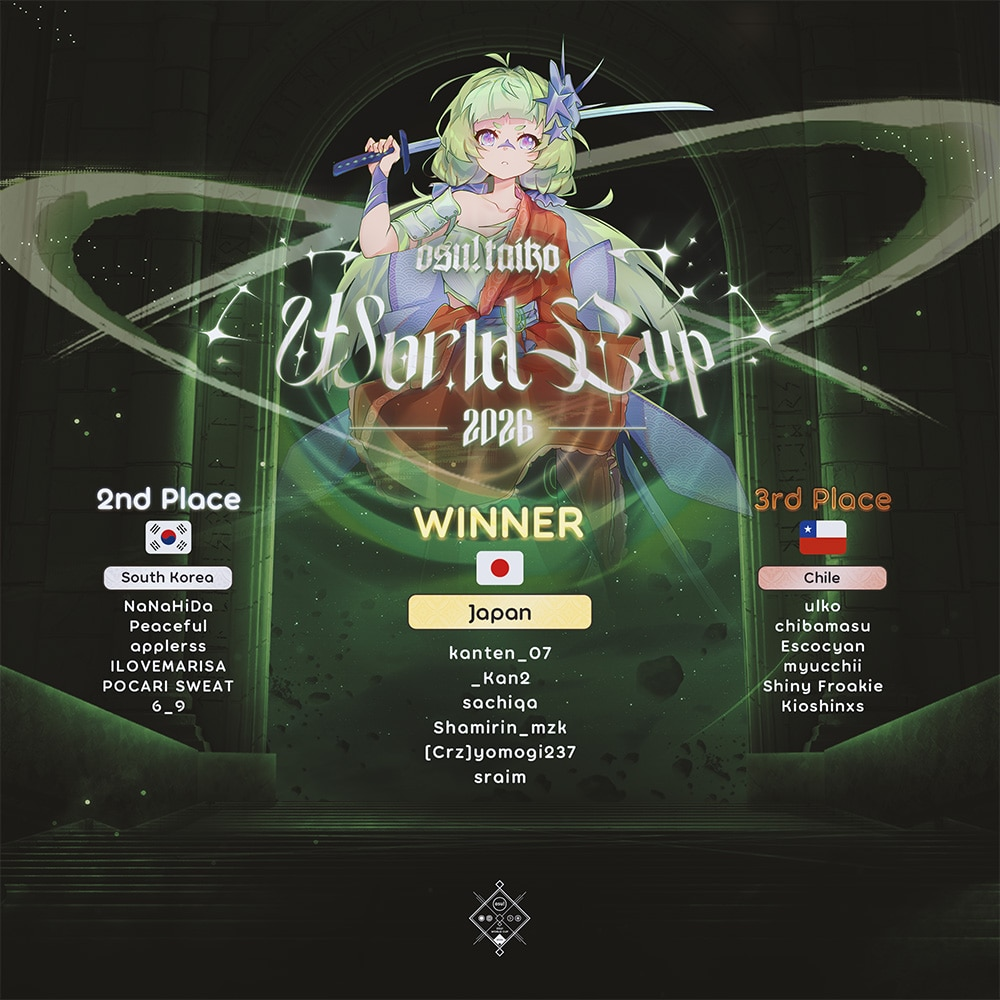

---
tags:
  - TWC
  - TWC2026
  - TWC 2026
---

# osu!taiko World Cup 2026

The **osu!taiko World Cup 2026** (***TWC 2026***) was a country-based osu!taiko tournament hosted by the [osu! team](/wiki/People/osu!_team). It was the sixteenth instalment of the osu!taiko World Cup.

## Tournament schedule

| Event | Timestamp |
| --: | :-- |
| Registration phase | 2026-02-13 (20:00 UTC)/2026-02-28 (23:59 UTC) |
| Qualifier showcase | 2026-03-08 (14:00 UTC) |
| Qualifier stage | 2026-03-14/2026-03-15 |
| Group stage | 2026-03-21/2026-03-22 |
| Round of 16 | 2026-03-28/2026-03-29 |
| Quarterfinals | 2026-04-04/2026-04-05 |
| Semifinals | 2026-04-11/2026-04-12 |
| Finals | 2026-04-18/2026-04-19 |
| Grand Finals | 2026-04-25/2026-04-26 |

## Prizes

The osu!taiko World Cup 2026 offered a $2,000 cash prize pool and limited-edition merch.

| Placing | Prizes |
| :-: | :-- |
|  | 50% of the prize pool, limited-edition merch, profile badge, **osu!taiko Champion** user title for one year |
|  | 30% of the prize pool, limited-edition merch, profile badge |
|  | 20% of the prize pool, limited-edition merch, profile badge |

  

## Organisation

The osu!taiko World Cup 2026 was run by the [osu! team](/wiki/People/osu!_team) and various community members.

| Position | Member(s) |
| :-- | :-- |
| Managers | ::{ flag=CA }:: [Azer](https://osu.ppy.sh/users/2155578), ::{ flag=US }:: [ChillierPear](https://osu.ppy.sh/users/9501251), ::{ flag=BR }:: [LeoFLT](https://osu.ppy.sh/users/3668779), ::{ flag=CN }:: [Sakura006](https://osu.ppy.sh/users/10365024) |
| Mappool selectors | ::{ flag=SE }:: **[Nurend](https://osu.ppy.sh/users/9905079)**, ::{ flag=JP }:: [4sbet1](https://osu.ppy.sh/users/11563671), ::{ flag=JP }:: [miyagishima](https://osu.ppy.sh/users/8027517), ::{ flag=DE }:: [Nwolf](https://osu.ppy.sh/users/1910766), ::{ flag=DE }:: [Xay](https://osu.ppy.sh/users/961417) |
| Mappool playtesters | ::{ flag=US }:: [Backfire](https://osu.ppy.sh/users/263110), ::{ flag=FR }:: [Briesmas](https://osu.ppy.sh/users/2865172), ::{ flag=JP }:: [Grape\_Tea](https://osu.ppy.sh/users/9540073), ::{ flag=ID }:: [Katdon\_donKat](https://osu.ppy.sh/users/8089664), ::{ flag=JP }:: [Maimaing](https://osu.ppy.sh/users/14520910), ::{ flag=JP }:: [My Angel Eru](https://osu.ppy.sh/users/26454214), ::{ flag=SE }:: [Nurend](https://osu.ppy.sh/users/9905079), ::{ flag=NO }:: [roufou](https://osu.ppy.sh/users/1109122), ::{ flag=JP }:: [shinjinhome](https://osu.ppy.sh/users/30147970), ::{ flag=US }:: [Shyguy](https://osu.ppy.sh/users/178038), ::{ flag=TW }:: [X a v y](https://osu.ppy.sh/users/3738344) |
| Mappers | ::{ flag=SG }:: [\_gt](https://osu.ppy.sh/users/8301957), ::{ flag=HK }:: [\_mtk](https://osu.ppy.sh/users/9468283), ::{ flag=JP }:: [\_Rise](https://osu.ppy.sh/users/5217107), ::{ flag=JP }:: [\_yu68](https://osu.ppy.sh/users/6170507), ::{ flag=JP }:: [4sbet1](https://osu.ppy.sh/users/11563671), ::{ flag=US }:: [5\_5](https://osu.ppy.sh/users/6853438), ::{ flag=HK }:: [aabc271](https://osu.ppy.sh/users/155707), ::{ flag=US }:: [Alchyr](https://osu.ppy.sh/users/4993032), ::{ flag=ID }:: [Alwaysyukaz](https://osu.ppy.sh/users/4999506), ::{ flag=US }:: [Backfire](https://osu.ppy.sh/users/263110), ::{ flag=JP }:: [ekumea1123](https://osu.ppy.sh/users/9119501), ::{ flag=JP }:: [Eriha](https://osu.ppy.sh/users/16320311), ::{ flag=PH }:: [Eyenine](https://osu.ppy.sh/users/1259391), ::{ flag=GR }:: [Genjuro](https://osu.ppy.sh/users/3196091), ::{ flag=JP }:: [Grape\_Tea](https://osu.ppy.sh/users/9540073), ::{ flag=DE }:: [Greenshell](https://osu.ppy.sh/users/8693851), ::{ flag=FR }:: [Heaxys](https://osu.ppy.sh/users/5671417), ::{ flag=TN }:: [Hivie](https://osu.ppy.sh/users/14102976), ::{ flag=JP }:: [hz404](https://osu.ppy.sh/users/14947043), ::{ flag=JP }:: [iceOC](https://osu.ppy.sh/users/5482401), ::{ flag=JP }:: [iceOC](https://osu.ppy.sh/users/5482401), ::{ flag=NL }:: [ikin5050](https://osu.ppy.sh/users/4007649), ::{ flag=HK }:: [JarvisGaming](https://osu.ppy.sh/users/8601048), ::{ flag=US }:: [Jayceko](https://osu.ppy.sh/users/19951350), ::{ flag=JP }:: [layxa](https://osu.ppy.sh/users/14800030), ::{ flag=JP }:: [Maimaing](https://osu.ppy.sh/users/14520910), ::{ flag=GB }:: [Meguminx\_MAS](https://osu.ppy.sh/users/17797595), ::{ flag=JP }:: [miyagishima](https://osu.ppy.sh/users/8027517), ::{ flag=JP }:: [My Angel Eru](https://osu.ppy.sh/users/26454214), ::{ flag=CN }:: [N a N a](https://osu.ppy.sh/users/11341131), ::{ flag=RU }:: [Nozdormu](https://osu.ppy.sh/users/7169208), ::{ flag=SE }:: [Nurend](https://osu.ppy.sh/users/9905079), ::{ flag=DE }:: [Nwolf](https://osu.ppy.sh/users/1910766), ::{ flag=DE }:: [OnosakiHito](https://osu.ppy.sh/users/290128), ::{ flag=PL }:: [Paraxia](https://osu.ppy.sh/users/14001000), ::{ flag=IT }:: [Quorum](https://osu.ppy.sh/users/5200775), ::{ flag=ID }:: [raynald](https://osu.ppy.sh/users/25094413), ::{ flag=NO }:: [roufou](https://osu.ppy.sh/users/1109122), ::{ flag=CA }:: [rubies87](https://osu.ppy.sh/users/4949934), ::{ flag=GB }:: [Skidooskei](https://osu.ppy.sh/users/10079029), ::{ flag=US }:: [SolaEclipse](https://osu.ppy.sh/users/6621158), ::{ flag=NL }:: [TaikoMom](https://osu.ppy.sh/users/9086438), ::{ flag=JP }:: [tasuke912](https://osu.ppy.sh/users/2774767), ::{ flag=DE }:: [Undead Alice](https://osu.ppy.sh/users/17415683), ::{ flag=JP }:: [uone](https://osu.ppy.sh/users/5321719), ::{ flag=TW }:: [X a v y](https://osu.ppy.sh/users/3738344), ::{ flag=DE }:: [Xay](https://osu.ppy.sh/users/961417), ::{ flag=AT }:: [Yasuho](https://osu.ppy.sh/users/8458835), ::{ flag=MY }:: [Z419](https://osu.ppy.sh/users/9912966), ::{ flag=DE }:: [Zetera](https://osu.ppy.sh/users/587737) |
| Commentators | **::{ flag=US }:: [ChillierPear](https://osu.ppy.sh/users/9501251)**, ::{ flag=SG }:: [_gt](https://osu.ppy.sh/users/8301957), ::{ flag=AU }:: [Beat43210](https://osu.ppy.sh/users/5664171), ::{ flag=US }:: [Bronzecrank](https://osu.ppy.sh/users/14173115), ::{ flag=US }:: [driodx](https://osu.ppy.sh/users/9709548), ::{ flag=GB }:: [Ethan_Taikotris](https://osu.ppy.sh/users/16968817), ::{ flag=NL }:: [ikin5050](https://osu.ppy.sh/users/4007649), ::{ flag=AU }:: [Jaye](https://osu.ppy.sh/users/4841352), ::{ flag=DE }:: [Joogs](https://osu.ppy.sh/users/8844167), ::{ flag=DE }:: [Nwolf](https://osu.ppy.sh/users/1910766), ::{ flag=GB }:: [overdahedge2015](https://osu.ppy.sh/users/9864847), ::{ flag=NZ }:: [Sparxe](https://osu.ppy.sh/users/5750235), ::{ flag=NL }:: [TaikoMom](https://osu.ppy.sh/users/9086438), ::{ flag=GB }:: [Teezel](https://osu.ppy.sh/users/7528639), ::{ flag=AT }:: [Yasuho](https://osu.ppy.sh/users/8458835), ::{ flag=HK }:: [YonGin](https://osu.ppy.sh/users/7109317) |
| Commentators (special guests) | ::{ flag=SE }:: [-Anchor-](https://osu.ppy.sh/users/1352257), ::{ flag=ID }:: [BlankTap](https://osu.ppy.sh/users/10137131), ::{ flag=GB }:: [Bubbleman](https://osu.ppy.sh/users/5182050), ::{ flag=CA }:: [D I O](https://osu.ppy.sh/users/3958619), ::{ flag=US }:: [Dohland](https://osu.ppy.sh/users/5220511), ::{ flag=GB }:: [Doomsday](https://osu.ppy.sh/users/18983), ::{ flag=US }:: [Dynascape](https://osu.ppy.sh/users/8784587), ::{ flag=GB }:: [epic man 2](https://osu.ppy.sh/users/14566000), ::{ flag=TN }:: [Hivie](https://osu.ppy.sh/users/14102976), ::{ flag=US }:: [hubbawubba](https://osu.ppy.sh/users/15910288), ::{ flag=CA }:: [I\-Flame](https://osu.ppy.sh/users/11257542), ::{ flag=KZ }:: [Lightin](https://osu.ppy.sh/users/7595619), ::{ flag=PH }:: [LivelyPeninsula](https://osu.ppy.sh/users/11517895), ::{ flag=GB }:: [Nathanial](https://osu.ppy.sh/users/9169747), ::{ flag=US }:: [Snowleopard](https://osu.ppy.sh/users/3790227), ::{ flag=US }:: [Sparky](https://osu.ppy.sh/users/3187959), ::{ flag=US }:: [SunApple](https://osu.ppy.sh/users/11817622), ::{ flag=PH }:: [SurfChu85](https://osu.ppy.sh/users/4469895), ::{ flag=US }:: [this1neguy](https://osu.ppy.sh/users/1797189) |
| Referees | **::{ flag=BR }:: [LeoFLT](https://osu.ppy.sh/users/3668779)**, ::{ flag=IN }:: [\-Space](https://osu.ppy.sh/users/7720204), ::{ flag=US }:: [akace100](https://osu.ppy.sh/users/9308128), ::{ flag=NL }:: [Albionthegreat](https://osu.ppy.sh/users/9853595), ::{ flag=BR }:: [DizzyH](https://osu.ppy.sh/users/9896172), ::{ flag=SE }:: [ellen\-](https://osu.ppy.sh/users/7630166), ::{ flag=VN }:: [Hoaq](https://osu.ppy.sh/users/7696512), ::{ flag=CL }:: [Isita](https://osu.ppy.sh/users/13973026), ::{ flag=AR }:: [KlBBY](https://osu.ppy.sh/users/12182138), ::{ flag=NL }:: [nik](https://osu.ppy.sh/users/10077264), ::{ flag=FI }:: [shdewz](https://osu.ppy.sh/users/10000899), ::{ flag=US }:: [Suicune3](https://osu.ppy.sh/users/6895187), ::{ flag=US }:: [tigereyes144](https://osu.ppy.sh/users/6499811), ::{ flag=GB }:: [Yazzehh](https://osu.ppy.sh/users/7068973) |
| Statisticians | **::{ flag=FI }:: [shdewz](https://osu.ppy.sh/users/10000899)**, ::{ flag=BR }:: [LeoFLT](https://osu.ppy.sh/users/3668779) |
| News team | ::{ flag=TN }:: [Hivie](https://osu.ppy.sh/users/14102976), ::{ flag=SE }:: [Nurend](https://osu.ppy.sh/users/9905079), ::{ flag=GB }:: [overdahedge2015](https://osu.ppy.sh/users/9864847), ::{ flag=CN }:: [Sakura006](https://osu.ppy.sh/users/10365024) |
| osu! original design | **::{ flag=CN }:: [Sakura006](https://osu.ppy.sh/users/10365024)**, *more TBA* |
| Tournament design | ::{ flag=CN }:: [AlexDunk](https://osu.ppy.sh/users/9194799), ::{ flag=US }:: [ChillierPear](https://osu.ppy.sh/users/9501251), ::{ flag=HK }:: [Detristy](https://osu.ppy.sh/users/38325708), ::{ flag=RU }:: [LeeNarie](https://osu.ppy.sh/users/2667849), ::{ flag=ID }:: [LenLitchu](https://osu.ppy.sh/users/34098325), ::{ flag=CN }:: [Sakura006](https://osu.ppy.sh/users/10365024) |
| Musician | [ALEPH](https://osu.ppy.sh/beatmaps/artists/107), [Camellia](https://osu.ppy.sh/beatmaps/artists/31), [Cansol](https://osu.ppy.sh/beatmaps/artists/407), [dennoko-P](https://x.com/dennoko_p), [Ennnn](https://soundcloud.com/ennnn), [OLDUCT](https://lit.link/olduct), [TWC SOUND TEAM "FLiPFORCE"](https://soundcloud.com/elw00d/on-ur-marks), [uynet](https://osu.ppy.sh/beatmaps/artists/453) |

## Links

- **[Information spreadsheet](https://docs.google.com/spreadsheets/d/176bQrUhfCMkiozwUgwE7J3BO3Lxye7hul4DrYfBlqSE?rm=minimal)**
- [Weekly statistics](https://drive.google.com/drive/folders/15yu_oHZGBSKOJtZqimSfcw7a9py1uipL)
- [Livestream](https://www.twitch.tv/osulive)
- [Discussion thread](https://osu.ppy.sh/community/forums/topics/2179201)
- [Tournament listing](https://osu.ppy.sh/community/tournaments/54)
- [Challonge bracket](https://challonge.com/TWC2026)
- [Pick'ems page](https://pickem.hwc.hr/tournaments/192) hosted by ::{ flag=DE }:: [hallowatcher](https://osu.ppy.sh/users/1874761)

## Participants

|  | Country | Members |
| :-: | :-: | :-- |
| ::{ flag=AR }:: | **Argentina** | **[ottenst](https://osu.ppy.sh/users/13488325)**, [SUPERNOOB20](https://osu.ppy.sh/users/16422988) |
| ::{ flag=AU }:: | **Australia** | **[Frostetic](https://osu.ppy.sh/users/30388979)**, [Jaye](https://osu.ppy.sh/users/4841352), [spIyrg](https://osu.ppy.sh/users/8379046) |
| ::{ flag=BY }:: | **Belarus** | **[quinnq](https://osu.ppy.sh/users/34132397)**, [foreyn](https://osu.ppy.sh/users/26215857) |
| ::{ flag=BE }:: | **Belgium** | **[XOlifreX](https://osu.ppy.sh/users/4328137)**, [Brentywenty](https://osu.ppy.sh/users/22753946) |
| ::{ flag=BR }:: | **Brazil** | **[Foxeru](https://osu.ppy.sh/users/7479684)**, [miwoo](https://osu.ppy.sh/users/12630336), [Skid](https://osu.ppy.sh/users/3044264), [Kyoumo](https://osu.ppy.sh/users/8145223), [HiroK](https://osu.ppy.sh/users/4050738), [irie-](https://osu.ppy.sh/users/29727936) |
| ::{ flag=BG }:: | **Bulgaria** | **[Vasko2o](https://osu.ppy.sh/users/19577961)**, [giyokon](https://osu.ppy.sh/users/10852632), [theangelov](https://osu.ppy.sh/users/18827836) |
| ::{ flag=CA }:: | **Canada** | **[Eltigant](https://osu.ppy.sh/users/15191942)**, [Ascrute](https://osu.ppy.sh/users/13175389), [Austin Princess](https://osu.ppy.sh/users/12014683), [flakeur](https://osu.ppy.sh/users/19747043), [GDMem](https://osu.ppy.sh/users/10804091), [TheCoconutHuman](https://osu.ppy.sh/users/27809747) |
| ::{ flag=CL }:: | **Chile** | **[ulko](https://osu.ppy.sh/users/1263669)**, [chibamasu](https://osu.ppy.sh/users/16067522), [Escocyan](https://osu.ppy.sh/users/9057823), [myucchii](https://osu.ppy.sh/users/10072733), [Shiny Froakie](https://osu.ppy.sh/users/6194830), [Kioshinxs](https://osu.ppy.sh/users/14433939) |
| ::{ flag=CN }:: | **China** | **[superSSS](https://osu.ppy.sh/users/4315477)**, [WLYMinato](https://osu.ppy.sh/users/12703319), [kknegative](https://osu.ppy.sh/users/2349769), [SakurabaEmma](https://osu.ppy.sh/users/9383908), [FORMless000](https://osu.ppy.sh/users/8697654), [Michaelonl](https://osu.ppy.sh/users/12480076) |
| ::{ flag=CO }:: | **Colombia** | **[ParraCharlie](https://osu.ppy.sh/users/18425848)**, [Xoretra](https://osu.ppy.sh/users/4940698), [Coffecito](https://osu.ppy.sh/users/18793276), [Madsri](https://osu.ppy.sh/users/6260841), [sti](https://osu.ppy.sh/users/1271807), [Hermite](https://osu.ppy.sh/users/7945286) |
| ::{ flag=CR }:: | **Costa Rica** | **[pui](https://osu.ppy.sh/users/12687433)**, [Hotman](https://osu.ppy.sh/users/7902082), [Korone](https://osu.ppy.sh/users/11847767) |
| ::{ flag=FI }:: | **Finland** | **[duski](https://osu.ppy.sh/users/6506484)**, [Antti](https://osu.ppy.sh/users/13281473), [BFKB113PBK](https://osu.ppy.sh/users/13613362), [GamersDecision](https://osu.ppy.sh/users/19975342), [vodnanen](https://osu.ppy.sh/users/10335557) |
| ::{ flag=FR }:: | **France** | **[YaniFR](https://osu.ppy.sh/users/11260982)**, [Ranshi](https://osu.ppy.sh/users/6680785), [Gundham](https://osu.ppy.sh/users/8023063), [Ecchou](https://osu.ppy.sh/users/16403250), [Chernobog](https://osu.ppy.sh/users/3317042), [Nethen](https://osu.ppy.sh/users/14034809) |
| ::{ flag=DE }:: | **Germany** | **[frz](https://osu.ppy.sh/users/6956922)**, [dragonmaxx](https://osu.ppy.sh/users/12160279), [BCM](https://osu.ppy.sh/users/14822582), [Drecksackblase](https://osu.ppy.sh/users/6278008), [Gomen Yuuka](https://osu.ppy.sh/users/14050018), [Kingo](https://osu.ppy.sh/users/7625535) |
| ::{ flag=GT }:: | **Guatemala** | **[Maxtulini](https://osu.ppy.sh/users/25345980)**, [Mochiku](https://osu.ppy.sh/users/14847195) |
| ::{ flag=HK }:: | **Hong Kong** | **[Henry03](https://osu.ppy.sh/users/17413733)**, [Beanies](https://osu.ppy.sh/users/11635488), [Brown918](https://osu.ppy.sh/users/9805760), [Shing\_](https://osu.ppy.sh/users/2211364) |
| ::{ flag=ID }:: | **Indonesia** | **[-Sera](https://osu.ppy.sh/users/6048245)**, [Aesa](https://osu.ppy.sh/users/3285867), [apaajaboleh10](https://osu.ppy.sh/users/5151647), [fhz](https://osu.ppy.sh/users/13660273), [Fz2311x](https://osu.ppy.sh/users/29780191), [Reyi](https://osu.ppy.sh/users/13385865) |
| ::{ flag=IT }:: | **Italy** | **[ndrrr](https://osu.ppy.sh/users/4609767)**, [A-40](https://osu.ppy.sh/users/14510301), [chmekoe](https://osu.ppy.sh/users/7807444), [Plasmusss](https://osu.ppy.sh/users/20822544), [CRHIX](https://osu.ppy.sh/users/25662684), [megalovania lol](https://osu.ppy.sh/users/20215461) |
| ::{ flag=JP }:: | **Japan** | **[kanten\_07](https://osu.ppy.sh/users/11680357)**, [\_Kan2](https://osu.ppy.sh/users/7160196), [sachiqa](https://osu.ppy.sh/users/21542520), [Shamirin\_mzk](https://osu.ppy.sh/users/11325757), [\[Crz\]yomogi237](https://osu.ppy.sh/users/28571440), [sraim](https://osu.ppy.sh/users/29485001) |
| ::{ flag=KZ }:: | **Kazakhstan** | **[k1fa08](https://osu.ppy.sh/users/15526317)**, [MrApelsinchik](https://osu.ppy.sh/users/16834783) |
| ::{ flag=LV }:: | **Latvia** | **[Huntey](https://osu.ppy.sh/users/14451706)**, [Bezmozglij123](https://osu.ppy.sh/users/20489038), [alekuu](https://osu.ppy.sh/users/11488875), [knuckledust](https://osu.ppy.sh/users/37281689), [Mista64](https://osu.ppy.sh/users/10774000) |
| ::{ flag=LT }:: | **Lithuania** | **[ramojusd](https://osu.ppy.sh/users/14400817)**, [Beesu](https://osu.ppy.sh/users/9117835), [ite](https://osu.ppy.sh/users/11390568), [CamperLt](https://osu.ppy.sh/users/4582149), [BeesAtWork](https://osu.ppy.sh/users/15847145), [D0mis](https://osu.ppy.sh/users/3941186) |
| ::{ flag=MY }:: | **Malaysia** | **[Jerry](https://osu.ppy.sh/users/605973)**, [K0rd31HP](https://osu.ppy.sh/users/15231510), [Xeltic Rival](https://osu.ppy.sh/users/7500364), [6gicha](https://osu.ppy.sh/users/12273160), [vun](https://osu.ppy.sh/users/6932501), [DXA FonG](https://osu.ppy.sh/users/15019527) |
| ::{ flag=MX }:: | **Mexico** | **[Hivan111](https://osu.ppy.sh/users/13525805)**, [Maxmisil](https://osu.ppy.sh/users/20089489), [reisen91937](https://osu.ppy.sh/users/25396679), [Iojioji](https://osu.ppy.sh/users/1346121), [aait](https://osu.ppy.sh/users/33041206), [milpa](https://osu.ppy.sh/users/15420662) |
| ::{ flag=NL }:: | **Netherlands** | **[Cookie\_Tree](https://osu.ppy.sh/users/502722)**, [R1ght4](https://osu.ppy.sh/users/21564948), [Gibiji](https://osu.ppy.sh/users/21058672), [StrijkIjzer](https://osu.ppy.sh/users/4130926), [Arhythmix](https://osu.ppy.sh/users/19161909), [Tcc\_ow](https://osu.ppy.sh/users/14413148) |
| ::{ flag=NZ }:: | **New Zealand** | **[Old Zealand](https://osu.ppy.sh/users/5750235)**, [New ZeaIand](https://osu.ppy.sh/users/12136108), [ZeaIand](https://osu.ppy.sh/users/14777912), [New Zealamb](https://osu.ppy.sh/users/9039824), [idk123456](https://osu.ppy.sh/users/18718856), [iou1214](https://osu.ppy.sh/users/35898762) |
| ::{ flag=NO }:: | **Norway** | **[Vendelicious](https://osu.ppy.sh/users/8818089)**, [petterde](https://osu.ppy.sh/users/7555792), [Nurend Fanboy](https://osu.ppy.sh/users/18916920), [Tien](https://osu.ppy.sh/users/8631719), [Ksyro\_](https://osu.ppy.sh/users/15218817) |
| ::{ flag=PE }:: | **Peru** | **[alemagno333](https://osu.ppy.sh/users/11411697)**, [Desinias](https://osu.ppy.sh/users/23361435), [Pachekin](https://osu.ppy.sh/users/8257441) |
| ::{ flag=PH }:: | **Philippines** | **[jmeh07](https://osu.ppy.sh/users/2852269)**, [JoshEco4](https://osu.ppy.sh/users/18591473), [Silicosis 2](https://osu.ppy.sh/users/18560307), [DescriptiCringe](https://osu.ppy.sh/users/10882115), [Farmer Brown](https://osu.ppy.sh/users/17823779), [rrapido](https://osu.ppy.sh/users/18630149) |
| ::{ flag=PL }:: | **Poland** | **[knibblet](https://osu.ppy.sh/users/6922240)**, [SKRIS-MI](https://osu.ppy.sh/users/15330641), [nickname2500](https://osu.ppy.sh/users/5385606), [Falek99](https://osu.ppy.sh/users/1787011), [Akamileusz](https://osu.ppy.sh/users/6807238), [TheMopey](https://osu.ppy.sh/users/14621140) |
| ::{ flag=PT }:: | **Portugal** | **[BabySnakes](https://osu.ppy.sh/users/4669728)**, [MeovvCAT](https://osu.ppy.sh/users/5905091), [Shinzui](https://osu.ppy.sh/users/2505011), [Warp](https://osu.ppy.sh/users/18649724) |
| ::{ flag=RO }:: | **Romania** | **[badeu](https://osu.ppy.sh/users/1473890)**, [mikuhatsunegirl10](https://osu.ppy.sh/users/1188782), [Sakupen Circles](https://osu.ppy.sh/users/12172227) |
| ::{ flag=RU }:: | **Russian Federation** | **[taikoshallah](https://osu.ppy.sh/users/11117835)**, [Den4ik228](https://osu.ppy.sh/users/7115174), [eblan4ik228](https://osu.ppy.sh/users/15013948), [SceptifyMK](https://osu.ppy.sh/users/20843003), [Negroani](https://osu.ppy.sh/users/35968093), [Akonine](https://osu.ppy.sh/users/7774222) |
| ::{ flag=RS }:: | **Serbia** | **[Plasmodius](https://osu.ppy.sh/users/8327905)**, [bugfinder1610](https://osu.ppy.sh/users/11630179), [lepinja77](https://osu.ppy.sh/users/11189453), [Miniministop](https://osu.ppy.sh/users/9651151), [Ognjen3800](https://osu.ppy.sh/users/14706521) |
| ::{ flag=SK }:: | **Slovakia** | **[nevqr](https://osu.ppy.sh/users/14269506)**, [Alejar](https://osu.ppy.sh/users/12568571), [Golden](https://osu.ppy.sh/users/12639462), [Ticy](https://osu.ppy.sh/users/15142530), [micqaal](https://osu.ppy.sh/users/20512411) |
| ::{ flag=KR }:: | **South Korea** | **[NaNaHiDa](https://osu.ppy.sh/users/30114023)**, [Peaceful](https://osu.ppy.sh/users/165027), [applerss](https://osu.ppy.sh/users/983349), [ILOVEMARISA](https://osu.ppy.sh/users/8767392), [POCARI SWEAT](https://osu.ppy.sh/users/5082685), [6\_9](https://osu.ppy.sh/users/2998248) |
| ::{ flag=ES }:: | **Spain** | **[A L E P H](https://osu.ppy.sh/users/6735738)**, [Celoluna](https://osu.ppy.sh/users/14571758), [Luqas](https://osu.ppy.sh/users/26688450), [Race-](https://osu.ppy.sh/users/18660354) |
| ::{ flag=SE }:: | **Sweden** | **[Raphalge](https://osu.ppy.sh/users/3918650)**, [yamfan](https://osu.ppy.sh/users/8669774), [Anders8KJS](https://osu.ppy.sh/users/36024737) |
| ::{ flag=CH }:: | **Switzerland** | **[TaikoWorldCup](https://osu.ppy.sh/users/11296097)**, [NekoTowel](https://osu.ppy.sh/users/14838605), [Nakarin](https://osu.ppy.sh/users/547957) |
| ::{ flag=TW }:: | **Taiwan** | **[cheesestingy](https://osu.ppy.sh/users/16462012)**, [dssds](https://osu.ppy.sh/users/29260556), [HiGreeks](https://osu.ppy.sh/users/16536516), [monkeydluffy3u4](https://osu.ppy.sh/users/2277798), [sevgo7](https://osu.ppy.sh/users/23487206), [Polemo03](https://osu.ppy.sh/users/10726804) |
| ::{ flag=TR }:: | **Türkiye** | **[Batu](https://osu.ppy.sh/users/13196066)**, [Zmor0133](https://osu.ppy.sh/users/6419257), [Flicker](https://osu.ppy.sh/users/7916800), [Aarqeus](https://osu.ppy.sh/users/12478873) |
| ::{ flag=UA }:: | **Ukraine** | **[SudoKu37](https://osu.ppy.sh/users/19926884)**, [EHEPGODAP](https://osu.ppy.sh/users/13079214), [Kaolel\_](https://osu.ppy.sh/users/23209237) |
| ::{ flag=GB }:: | **United Kingdom** | **[rloseise](https://osu.ppy.sh/users/6793778)**, [overdahedge2015](https://osu.ppy.sh/users/9864847), [Horiiizon](https://osu.ppy.sh/users/8071438), [Pied wagtail](https://osu.ppy.sh/users/8484987), [Nathanial](https://osu.ppy.sh/users/9169747), [spanner dude](https://osu.ppy.sh/users/12489832) |
| ::{ flag=US }:: | **United States** | **[AuroraPhasmata](https://osu.ppy.sh/users/13664116)**, [13 Stairs](https://osu.ppy.sh/users/14356353), [mBiscuit](https://osu.ppy.sh/users/17061174), [Miniature Lamp](https://osu.ppy.sh/users/9821194), [R J](https://osu.ppy.sh/users/6490509), [MrCB](https://osu.ppy.sh/users/13857986) |
| ::{ flag=VN }:: | **Vietnam** | **[Creeperbrine303](https://osu.ppy.sh/users/22515524)**, [buttermiilk](https://osu.ppy.sh/users/16039831), [RandomNameIdk](https://osu.ppy.sh/users/24042710), [\[TCD\] Azure](https://osu.ppy.sh/users/18782185), [kocoten72](https://osu.ppy.sh/users/15517145) |

Captains are listed in **bold**.

The complete sign-up list can be found [here](https://gist.github.com/LeoFLT/6b38d4e22d9926c8e0bb24c5a634ac8d).

## Podium

## Match results

### Grand Finals

Saturday, 25 April 2026:

| ID | Team A |  |  | Team B | Match link | VOD link |
| :-: | --: | :-: | :-: | :-- | :-- | :-- |
| SM | **Team kddk** | **6** | 5 | Team bongo | [#1](https://osu.ppy.sh/community/matches/121010479) | [#1](https://www.twitch.tv/videos/2756724314) |
| 45 | Chile ::{ flag=CL }:: | 6 | **7** | ::{ flag=KR }:: **South Korea** | [#1](https://osu.ppy.sh/community/matches/121010905) | [#1](https://www.twitch.tv/videos/2756777848) |

Sunday, 26 April 2026:

| ID | Team A |  |  | Team B | Match link | VOD link |
| :-: | --: | :-: | :-: | :-- | :-- | :-- |
| 46b | **Japan** ::{ flag=JP }:: | **7** | 5 | ::{ flag=KR }:: South Korea | [#1](https://osu.ppy.sh/community/matches/121017600) | [#1](https://www.twitch.tv/videos/2757488797) |

### Finals

Detailed statistics for this round can be found [here](https://docs.google.com/spreadsheets/d/1aC38wGYXcqKhDjm_ZLKPcIVIpq89R-H722CyK9tAXcU?rm=minimal).

Saturday, 18 April 2026:

| ID | Team A |  |  | Team B | Match link | VOD link |
| :-: | --: | :-: | :-: | :-- | :-- | :-- |
| 42 | Brazil ::{ flag=BR }:: | 6 | **7** | ::{ flag=TW }:: **Taiwan** | [#1](https://osu.ppy.sh/community/matches/120962349) | [#1](https://www.twitch.tv/videos/2750862446) |
| 41 | **South Korea** ::{ flag=KR }:: | **7** | 2 | ::{ flag=CN }:: China | [#1](https://osu.ppy.sh/community/matches/120964470) | [#1](https://www.twitch.tv/videos/2751065444) |
| 43c | Taiwan ::{ flag=TW }:: | 3 | **7** | ::{ flag=KR }:: **South Korea** | [#1](https://osu.ppy.sh/community/matches/120965282) | [#1](https://www.twitch.tv/videos/2751160028) |

Sunday, 19 April 2026:

| ID | Team A |  |  | Team B | Match link | VOD link |
| :-: | --: | :-: | :-: | :-- | :-- | :-- |
| 44 | **Japan** ::{ flag=JP }:: | **7** | 2 | ::{ flag=CL }:: Chile | [#1](https://osu.ppy.sh/community/matches/120970266) | [#1](https://www.twitch.tv/videos/2751656269) |

### Semifinals

Detailed statistics for this round can be found [here](https://docs.google.com/spreadsheets/d/1jfo9ZsZN2hBsc9Av1JGodXUZnj_6hru9PT2JZ_Feeq4?rm=minimal).

Saturday, 11 April 2026:

| ID | Team A |  |  | Team B | Match link | VOD link |
| :-: | --: | :-: | :-: | :-- | :-- | :-- |
| 33 | **Taiwan** ::{ flag=TW }:: | **6** | 0 | ::{ flag=NZ }:: New Zealand | [#1](https://osu.ppy.sh/community/matches/120915604) | [#1](https://www.twitch.tv/videos/2745509637) |
| 35 | **China** ::{ flag=CN }:: | **6** | 0 | ::{ flag=AU }:: Australia | [#1](https://osu.ppy.sh/community/matches/120915912) | [#1](https://www.twitch.tv/videos/2745509636) |
| 39 | **Japan** ::{ flag=JP }:: | **6** | 1 | ::{ flag=KR }:: South Korea | [#1](https://osu.ppy.sh/community/matches/120916660) | [#1](https://www.twitch.tv/videos/2745512622) |
| 34 | **United States** ::{ flag=US }:: | **6** | 1 | ::{ flag=FI }:: Finland | [#1](https://osu.ppy.sh/community/matches/120918218) | [#1](https://www.twitch.tv/videos/2745562049) |
| 36 | **Italy** ::{ flag=IT }:: | **6** | 4 | ::{ flag=GB }:: United Kingdom | [#1](https://osu.ppy.sh/community/matches/120919997) | [#1](https://www.twitch.tv/videos/2745734198) |

Sunday, 12 April 2026:

| ID | Team A |  |  | Team B | Match link | VOD link |
| :-: | --: | :-: | :-: | :-- | :-- | :-- |
| 40 | **Chile** ::{ flag=CL }:: | **6** | 3 | ::{ flag=BR }:: Brazil | [#1](https://osu.ppy.sh/community/matches/120922024) | [#1](https://www.twitch.tv/videos/2745993870) |
| 37a | United States ::{ flag=US }:: | 3 | **6** | ::{ flag=TW }:: **Taiwan** | [#1](https://osu.ppy.sh/community/matches/120922696) | [#1](https://www.twitch.tv/videos/2746035528) |
| 38a | Italy ::{ flag=IT }:: | 5 | **6** | ::{ flag=CN }:: **China** | [#1](https://osu.ppy.sh/community/matches/120924693) | [#1](https://www.twitch.tv/videos/2746243641) |

### Quarterfinals

Detailed statistics for this round can be found [here](https://docs.google.com/spreadsheets/d/1ZxXYJ5zsbxS8evLrhaX6sn9okERfyJhcG-vlgCbZVTk?rm=minimal).

Saturday, 4 April 2026:

| ID | Team A |  |  | Team B | Match link | VOD link |
| :-: | --: | :-: | :-: | :-- | :-- | :-- |
| 24 | **Australia** ::{ flag=AU }:: | **6** | 2 | ::{ flag=DE }:: Germany | [#1](https://osu.ppy.sh/community/matches/120865872) | [#1](https://www.twitch.tv/videos/2739701122) |
| 17 | **Russian Federation** ::{ flag=RU }:: | **6** | 0 | ::{ flag=VN }:: Vietnam | [#1](https://osu.ppy.sh/community/matches/120866933) | [#1](https://www.twitch.tv/videos/2739782751) |
| 22 | **United Kingdom** ::{ flag=GB }:: | **6** | 0 | ::{ flag=SE }:: Sweden | [#1](https://osu.ppy.sh/community/matches/120866878) | [#1](https://www.twitch.tv/videos/2739738672) |
| 23 | Norway ::{ flag=NO }:: | 2 | **6** | ::{ flag=PT }:: **Portugal** | [#1](https://osu.ppy.sh/community/matches/120866887) | [#1](https://www.twitch.tv/videos/2739738672?t=0h34m17s) |
| 19 | **Indonesia** ::{ flag=ID }:: | **6** | 3 | ::{ flag=SK }:: Slovakia | [#1](https://osu.ppy.sh/community/matches/120867365) | [#1](https://www.twitch.tv/videos/2739784069) |
| 21 | **France** ::{ flag=FR }:: | **6** | 4 | ::{ flag=MY }:: Malaysia | [#1](https://osu.ppy.sh/community/matches/120867600) | [#1](https://www.twitch.tv/videos/2739798373) |
| 18 | **Finland** ::{ flag=FI }:: | **6** | 3 | ::{ flag=NL }:: Netherlands | [#1](https://osu.ppy.sh/community/matches/120868348) | [#1](https://www.twitch.tv/videos/2739854250) |
| 32 | **Brazil** ::{ flag=BR }:: | **6** | 3 | ::{ flag=IT }:: Italy | [#1](https://osu.ppy.sh/community/matches/120869531) | [#1](https://www.twitch.tv/videos/2739973163) |

Sunday, 5 April 2026:

| ID | Team A |  |  | Team B | Match link | VOD link |
| :-: | --: | :-: | :-: | :-- | :-- | :-- |
| 20 | **New Zealand** ::{ flag=NZ }:: | **6** | -1 | ::{ flag=CA }:: Canada | *win by default* |  |
| 30 | United States ::{ flag=US }:: | 2 | **6** | ::{ flag=KR }:: **South Korea** | [#1](https://osu.ppy.sh/community/matches/120872649) | [#1](https://www.twitch.tv/videos/2740357631) |
| 29 | **Japan** ::{ flag=JP }:: | **6** | 1 | ::{ flag=TW }:: Taiwan | [#1](https://osu.ppy.sh/community/matches/120873120) | [#1](https://www.twitch.tv/videos/2740408698) |
| 26a | **New Zealand** ::{ flag=NZ }:: | **6** | 0 | ::{ flag=ID }:: Indonesia | [#1](https://osu.ppy.sh/community/matches/120873992) | [#1](https://www.twitch.tv/videos/2740491526) |
| 27a | **United Kingdom** ::{ flag=GB }:: | **6** | 2 | ::{ flag=FR }:: France | [#1](https://osu.ppy.sh/community/matches/120874303) | [#1](https://www.twitch.tv/videos/2740515648) |
| 28b | **Australia** ::{ flag=AU }:: | **6** | 0 | ::{ flag=PT }:: Portugal | [#1](https://osu.ppy.sh/community/matches/120874351) | [#1](https://www.twitch.tv/videos/2740517105) |
| 25a | **Finland** ::{ flag=FI }:: | **6** | 4 | ::{ flag=RU }:: Russian Federation | [#1](https://osu.ppy.sh/community/matches/120874845) | [#1](https://www.twitch.tv/videos/2740575347) |
| 31 | **Chile** ::{ flag=CL }:: | **6** | 2 | ::{ flag=CN }:: China | [#1](https://osu.ppy.sh/community/matches/120874995) | [#1](https://www.twitch.tv/videos/2740582571) |

### Round of 16

Detailed statistics for this round can be found [here](https://docs.google.com/spreadsheets/d/1wpsHIKzBg7RcDeh4mjHVtV8XMBddD3iwD_ex549ImEU?rm=minimal).

Saturday, 28 March 2026:

| ID | Team A |  |  | Team B | Match link | VOD link |
| :-: | --: | :-: | :-: | :-- | :-- | :-- |
| 12 | Mexico ::{ flag=MX }:: | 2 | **5** | ::{ flag=CA }:: **Canada** | [#1](https://osu.ppy.sh/community/matches/120813188) | [#1](https://www.twitch.tv/videos/2733570406) |
| 1 | **Japan** ::{ flag=JP }:: | **5** | 2 | ::{ flag=AU }:: Australia | [#1](https://osu.ppy.sh/community/matches/120814186) | [#1](https://www.twitch.tv/videos/2733690474) |
| 4 | **South Korea** ::{ flag=KR }:: | **5** | 2 | ::{ flag=FR }:: France | [#1](https://osu.ppy.sh/community/matches/120815560) | [#1](https://www.twitch.tv/videos/2733829175) |
| 14 | Philippines ::{ flag=PH }:: | 2 | **5** | ::{ flag=SE }:: **Sweden** | [#1](https://osu.ppy.sh/community/matches/120816851) | [#1](https://www.twitch.tv/videos/2733946340) |
| 3 | **United States** ::{ flag=US }:: | **5** | 3 | ::{ flag=GB }:: United Kingdom | [#1](https://osu.ppy.sh/community/matches/120817376) | [#1](https://www.twitch.tv/videos/2733990307) |
| 7 | **Brazil** ::{ flag=BR }:: | **5** | 3 | ::{ flag=FI }:: Finland | [#1](https://osu.ppy.sh/community/matches/120817819) | [#1](https://www.twitch.tv/videos/2734033713) |

Sunday, 29 March 2026:

| ID | Team A |  |  | Team B | Match link | VOD link |
| :-: | --: | :-: | :-: | :-- | :-- | :-- |
| 5 | **Chile** ::{ flag=CL }:: | **5** | 1 | ::{ flag=NZ }:: New Zealand | [#1](https://osu.ppy.sh/community/matches/120820923) | [#1](https://www.twitch.tv/videos/2734353765) |
| 13 | Peru ::{ flag=PE }:: | 2 | **5** | ::{ flag=MY }:: **Malaysia** | [#1](https://osu.ppy.sh/community/matches/120821707) | [#1](https://www.twitch.tv/videos/2734482759) |
| 6 | **China** ::{ flag=CN }:: | **5** | 1 | ::{ flag=ID }:: Indonesia | [#1](https://osu.ppy.sh/community/matches/120824363) | [#1](https://www.twitch.tv/videos/2734746694) |
| 15 | Switzerland ::{ flag=CH }:: | 1 | **5** | ::{ flag=PT }:: **Portugal** | [#1](https://osu.ppy.sh/community/matches/120824323) | [#1](https://www.twitch.tv/videos/2734747498) |
| 10 | Hong Kong ::{ flag=HK }:: | 2 | **5** | ::{ flag=NL }:: **Netherlands** | [#1](https://osu.ppy.sh/community/matches/120824823) | [#1](https://www.twitch.tv/videos/2734788436) |
| 11 | Argentina ::{ flag=AR }:: | 0 | **5** | ::{ flag=SK }:: **Slovakia** | [#1](https://osu.ppy.sh/community/matches/120825256) | [#1](https://www.twitch.tv/videos/2734821376) |
| 9 | Colombia ::{ flag=CO }:: | 4 | **5** | ::{ flag=VN }:: **Vietnam** | [#1](https://osu.ppy.sh/community/matches/120825509) | [#1](https://www.twitch.tv/videos/2734858509) |
| 8 | **Italy** ::{ flag=IT }:: | **5** | 3 | ::{ flag=RU }:: Russian Federation | [#1](https://osu.ppy.sh/community/matches/120825806) | [#1](https://www.twitch.tv/videos/2734882833) |
| 16 | Poland ::{ flag=PL }:: | 1 | **5** | ::{ flag=DE }:: **Germany** | [#1](https://osu.ppy.sh/community/matches/120825969) | [#1](https://www.twitch.tv/videos/2734903172) |

### Group stage

Detailed statistics for this round can be found [here](https://docs.google.com/spreadsheets/d/1MvHFY0DyOOcmwRhCN7FirTi58o9DMnY5fhSjOZ-iHxM?rm=minimal).

Saturday, 21 March 2026:

| ID | Team A |  |  | Team B | Match link | VOD link |
| :-: | --: | :-: | :-: | :-- | :-- | :-- |
| G1 | **New Zealand** ::{ flag=NZ }:: | **5** | 1 | ::{ flag=SE }:: Sweden | [#1](https://osu.ppy.sh/community/matches/120767392) | [#1](https://www.twitch.tv/videos/2727997776) |
| A3 | Hong Kong ::{ flag=HK }:: | 4 | **5** | ::{ flag=VN }:: **Vietnam** | [#1](https://osu.ppy.sh/community/matches/120768257) | [#1](https://www.twitch.tv/videos/2728054593) |
| B1 | Malaysia ::{ flag=MY }:: | 2 | **5** | ::{ flag=ID }:: **Indonesia** | [#1](https://osu.ppy.sh/community/matches/120768357) | [#1](https://www.twitch.tv/videos/2728058074) |
| B2 | **Malaysia** ::{ flag=MY }:: | **5** | 3 | ::{ flag=PH }:: Philippines | [#1](https://osu.ppy.sh/community/matches/120768725) | [#1](https://www.twitch.tv/videos/2728082264) |
| C2 | **Russian Federation** ::{ flag=RU }:: | **5** | 1 | ::{ flag=PL }:: Poland | [#1](https://osu.ppy.sh/community/matches/120768711) | [#1](https://www.twitch.tv/videos/2728071951) |
| A1 | **Norway** ::{ flag=NO }:: | **5** | 2 | ::{ flag=HK }:: Hong Kong | [#1](https://osu.ppy.sh/community/matches/120769577) | [#1](https://www.twitch.tv/videos/2728162675) |
| C1 | **Russian Federation** ::{ flag=RU }:: | **5** | 2 | ::{ flag=PT }:: Portugal | [#1](https://osu.ppy.sh/community/matches/120769646) | [#1](https://www.twitch.tv/videos/2728159990) |
| D2 | **Slovakia** ::{ flag=SK }:: | **5** | 1 | ::{ flag=MX }:: Mexico | [#1](https://osu.ppy.sh/community/matches/120769943) | [#1](https://www.twitch.tv/videos/2728205069) |
| F1 | Germany ::{ flag=DE }:: | 3 | **5** | ::{ flag=FI }:: **Finland** | [#1](https://osu.ppy.sh/community/matches/120769993) | [#1](https://www.twitch.tv/videos/2728214962) |
| E3 | **Canada** ::{ flag=CA }:: | **5** | 1 | ::{ flag=AR }:: Argentina | [#1](https://osu.ppy.sh/community/matches/120770395) | [#1](https://www.twitch.tv/videos/2728247019) |
| D3 | **France** ::{ flag=FR }:: | **5** | 3 | ::{ flag=MX }:: Mexico | [#1](https://osu.ppy.sh/community/matches/120770888) | [#1](https://www.twitch.tv/videos/2728325209) |
| E1 | **United Kingdom** ::{ flag=GB }:: | **5** | 2 | ::{ flag=CA }:: Canada | [#1](https://osu.ppy.sh/community/matches/120771388) | [#1](https://www.twitch.tv/videos/2728356936) |
| G3 | **Sweden** ::{ flag=SE }:: | **5** | 1 | ::{ flag=PE }:: Peru | [#1](https://osu.ppy.sh/community/matches/120771369) | [#1](https://www.twitch.tv/videos/2728347237) |
| H1 | **Australia** ::{ flag=AU }:: | **5** | 4 | ::{ flag=NL }:: Netherlands | [#1](https://osu.ppy.sh/community/matches/120772730) | [#1](https://www.twitch.tv/videos/2728498363) |

Sunday, 22 March 2026:

| ID | Team A |  |  | Team B | Match link | VOD link |
| :-: | --: | :-: | :-: | :-- | :-- | :-- |
| H2 | **Australia** ::{ flag=AU }:: | **5** | 0 | ::{ flag=CO }:: Colombia | [#1](https://osu.ppy.sh/community/matches/120773383) | [#1](https://www.twitch.tv/videos/2728570883) |
| G2 | **New Zealand** ::{ flag=NZ }:: | **5** | 1 | ::{ flag=PE }:: Peru | [#1](https://osu.ppy.sh/community/matches/120773667) | [#1](https://www.twitch.tv/videos/2728616062) |
| F3 | **Finland** ::{ flag=FI }:: | **5** | 0 | ::{ flag=CH }:: Switzerland | [#1](https://osu.ppy.sh/community/matches/120776444) | [#1](https://www.twitch.tv/videos/2728920451) |
| A2 | **Norway** ::{ flag=NO }:: | **5** | 1 | ::{ flag=VN }:: Vietnam | [#1](https://osu.ppy.sh/community/matches/120777292) | [#1](https://www.twitch.tv/videos/2729002523) |
| B3 | **Indonesia** ::{ flag=ID }:: | **5** | 4 | ::{ flag=PH }:: Philippines | [#1](https://osu.ppy.sh/community/matches/120777694) | [#1](https://www.twitch.tv/videos/2729072460) |
| C3 | **Portugal** ::{ flag=PT }:: | **5** | 1 | ::{ flag=PL }:: Poland | [#1](https://osu.ppy.sh/community/matches/120777778) | [#1](https://www.twitch.tv/videos/2729045431) |
| D1 | Slovakia ::{ flag=SK }:: | 3 | **5** | ::{ flag=FR }:: **France** | [#1](https://osu.ppy.sh/community/matches/120777733) |  |
| E2 | **United Kingdom** ::{ flag=GB }:: | **5** | 0 | ::{ flag=AR }:: Argentina | [#1](https://osu.ppy.sh/community/matches/120778155) | [#1](https://www.twitch.tv/videos/2729088884) |
| H3 | **Netherlands** ::{ flag=NL }:: | **5** | 0 | ::{ flag=CO }:: Colombia | [#1](https://osu.ppy.sh/community/matches/120778657) | [#1](https://www.twitch.tv/videos/2729136097) |
| F2 | **Germany** ::{ flag=DE }:: | **5** | 3 | ::{ flag=CH }:: Switzerland | [#1](https://osu.ppy.sh/community/matches/120779049) | [#1](https://www.twitch.tv/videos/2729205905) |

### Qualifiers

The final standings for the Qualifier stage can be found in the following [spreadsheet](https://docs.google.com/spreadsheets/d/1er35TKY_KtywkVI85s6Vp3Yz9XGMDsz-MlD17SfhtZY?rm=minimal).
View the Qualifier seed reveal VOD [here](https://www.twitch.tv/videos/2723456293).

| Seed | Country | Rank[^qualifiers-seeding] | Avg. score[^qualifiers-tiebreaker] | Lobby link |
| :-: | :-- | --: | --: | --: |
| #1 | ::{ flag=JP }:: Japan | 11 | 2,034,794 | [#1](https://osu.ppy.sh/community/matches/120726712) |
| #2 | ::{ flag=CL }:: Chile | 21 | 2,030,291 | [#1](https://osu.ppy.sh/community/matches/120717801) |
| #3 | ::{ flag=BR }:: Brazil | 31 | 2,029,815 | [#1](https://osu.ppy.sh/community/matches/120725607) |
| #4 | ::{ flag=US }:: United States | 43 | 2,024,440 | [#1](https://osu.ppy.sh/community/matches/120726194) |
| #5 | ::{ flag=KR }:: South Korea | 47 | 2,025,167 | [#1](https://osu.ppy.sh/community/matches/120726954) |
| #6 | ::{ flag=IT }:: Italy | 58 | 2,011,113 | [#1](https://osu.ppy.sh/community/matches/120729833) |
| #7 | ::{ flag=CN }:: China | 62 | 2,021,072 | [#1](https://osu.ppy.sh/community/matches/120729392) |
| #8 | ::{ flag=TW }:: Taiwan | 75 | 2,012,926 | [#1](https://osu.ppy.sh/community/matches/120729366) |
| #9 | ::{ flag=MY }:: Malaysia | 79 | 2,017,439 | [#1](https://osu.ppy.sh/community/matches/120719696) |
| #10 | ::{ flag=GB }:: United Kingdom | 79 | 2,009,327 | [#1](https://osu.ppy.sh/community/matches/120731622) |
| #11 | ::{ flag=AU }:: Australia | 84 | 2,015,696 | [#1](https://osu.ppy.sh/community/matches/120727430) |
| #12 | ::{ flag=DE }:: Germany | 88 | 2,001,636 | [#1](https://osu.ppy.sh/community/matches/120728611) |
| #13 | ::{ flag=RU }:: Russian Federation | 88 | 1,999,685 | [#1](https://osu.ppy.sh/community/matches/120722969) |
| #14 | ::{ flag=NO }:: Norway | 96 | 1,998,395 | [#1](https://osu.ppy.sh/community/matches/120730735) |
| #15 | ::{ flag=SK }:: Slovakia | 101 | 1,985,447 | [#1](https://osu.ppy.sh/community/matches/120729808) |
| #16 | ::{ flag=NZ }:: New Zealand | 119 | 1,998,157 | [#1](https://osu.ppy.sh/community/matches/120719303) |
| #17 | ::{ flag=FI }:: Finland | 123 | 1,993,831 | [#1](https://osu.ppy.sh/community/matches/120730306) |
| #18 | ::{ flag=CA }:: Canada | 127 | 1,988,545 | [#1](https://osu.ppy.sh/community/matches/120724817) |
| #19 | ::{ flag=PT }:: Portugal | 128 | 1,989,102 | [#1](https://osu.ppy.sh/community/matches/120731229) |
| #20 | ::{ flag=HK }:: Hong Kong | 134 | 1,974,740 | [#1](https://osu.ppy.sh/community/matches/120721110) |
| #21 | ::{ flag=FR }:: France | 135 | 1,980,332 | [#1](https://osu.ppy.sh/community/matches/120728998) |
| #22 | ::{ flag=SE }:: Sweden | 137 | 1,978,985 | [#1](https://osu.ppy.sh/community/matches/120721587) |
| #23 | ::{ flag=NL }:: Netherlands | 152 | 1,969,651 | [#1](https://osu.ppy.sh/community/matches/120731666) |
| #24 | ::{ flag=ID }:: Indonesia | 156 | 1,968,911 | [#1](https://osu.ppy.sh/community/matches/120721146) |
| #25 | ::{ flag=PH }:: Philippines | 156 | 1,952,908 | [#1](https://osu.ppy.sh/community/matches/120722077) |
| #26 | ::{ flag=VN }:: Vietnam | 159 | 1,971,124 | [#1](https://osu.ppy.sh/community/matches/120721077) |
| #27 | ::{ flag=PE }:: Peru | 180 | 1,953,103 | [#1](https://osu.ppy.sh/community/matches/120724819) |
| #28 | ::{ flag=MX }:: Mexico | 192 | 1,923,242 | [#1](https://osu.ppy.sh/community/matches/120726711) |
| #29 | ::{ flag=PL }:: Poland | 194 | 1,925,851 | [#1](https://osu.ppy.sh/community/matches/120729846) |
| #30 | ::{ flag=CO }:: Colombia | 206 | 1,909,798 | [#1](https://osu.ppy.sh/community/matches/120731623) |
| #31 | ::{ flag=CH }:: Switzerland | 224 | 1,848,602 | [#1](https://osu.ppy.sh/community/matches/120703402) |
| #32 | ::{ flag=AR }:: Argentina | 226 | 1,799,189 | [#1](https://osu.ppy.sh/community/matches/120724798) |
| #33 | ::{ flag=TR }:: Türkiye | 227 | 1,848,526 | [#1](https://osu.ppy.sh/community/matches/120731194) |
| #34 | ::{ flag=BG }:: Bulgaria | 242 | 1,783,698 | [#1](https://osu.ppy.sh/community/matches/120721090) |
| #35 | ::{ flag=RS }:: Serbia | 242 | 1,774,277 | [#1](https://osu.ppy.sh/community/matches/120731184) |
| #36 | ::{ flag=CR }:: Costa Rica | 249 | 1,713,121 | [#1](https://osu.ppy.sh/community/matches/120730277) |
| #37 | ::{ flag=LV }:: Latvia | 253 | 1,693,159 | [#1](https://osu.ppy.sh/community/matches/120722042) |
| #38 | ::{ flag=RO }:: Romania | 266 | 1,623,923 | [#1](https://osu.ppy.sh/community/matches/120723936) |
| #39 | ::{ flag=BE }:: Belgium | 268 | 1,591,311 | [#1](https://osu.ppy.sh/community/matches/120720281) |
| #40 | ::{ flag=LT }:: Lithuania | 281 | 1,494,480 | [#1](https://osu.ppy.sh/community/matches/120723964) |
| #41 | ::{ flag=UA }:: Ukraine | 283 | 1,450,329 | [#1](https://osu.ppy.sh/community/matches/120731245) |
| #42 | ::{ flag=GT }:: Guatemala | 284 | 1,452,194 | [#1](https://osu.ppy.sh/community/matches/120717809) |
| #43 | ::{ flag=BY }:: Belarus | 300 | 964,004 | [#1](https://osu.ppy.sh/community/matches/120730777) |

## Groups

Watch the Group drawings VOD [here](https://www.twitch.tv/videos/2723456293?t=1h11m5s).

Group A:

| # | Team | Wins | Losses | PF | PA | PD | Seed |
| :-: | :-- | :-: | :-: | :-: | :-: | :-: | :-: |
| #1 | ::{ flag=NO }:: Norway | **2** | 0 | 10 | 3 | **+7** | 14 |
| #2 | ::{ flag=VN }:: Vietnam | **1** | 1 | 6 | 9 | **-3** | 26 |
| #3 | ::{ flag=HK }:: Hong Kong | **0** | 2 | 6 | 10 | **-4** | 20 |

Group B:

| # | Team | Wins | Losses | PF | PA | PD | Seed |
| :-: | :-- | :-: | :-: | :-: | :-: | :-: | :-: |
| #1 | ::{ flag=ID }:: Indonesia | **2** | 0 | 10 | 6 | **+4** | 24 |
| #2 | ::{ flag=MY }:: Malaysia | **1** | 1 | 7 | 8 | **-1** | 9 |
| #3 | ::{ flag=PH }:: Philippines | **0** | 2 | 7 | 10 | **-3** | 25 |

Group C:

| # | Team | Wins | Losses | PF | PA | PD | Seed |
| :-: | :-- | :-: | :-: | :-: | :-: | :-: | :-: |
| #1 | ::{ flag=RU }:: Russian Federation | **2** | 0 | 10 | 3 | **+7** | 13 |
| #2 | ::{ flag=PT }:: Portugal | **1** | 1 | 7 | 6 | **+1** | 19 |
| #3 | ::{ flag=PL }:: Poland | **0** | 2 | 2 | 10 | **-8** | 29 |

Group D:

| # | Team | Wins | Losses | PF | PA | PD | Seed |
| :-: | :-- | :-: | :-: | :-: | :-: | :-: | :-: |
| #1 | ::{ flag=FR }:: France | **2** | 0 | 10 | 6 | **+4** | 21 |
| #2 | ::{ flag=SK }:: Slovakia | **1** | 1 | 8 | 6 | **+2** | 15 |
| #3 | ::{ flag=MX }:: Mexico | **0** | 2 | 4 | 10 | **-6** | 28 |

Group E:

| # | Team | Wins | Losses | PF | PA | PD | Seed |
| :-: | :-- | :-: | :-: | :-: | :-: | :-: | :-: |
| #1 | ::{ flag=GB }:: United Kingdom | **2** | 0 | 10 | 2 | **+8** | 10 |
| #2 | ::{ flag=CA }:: Canada | **1** | 1 | 7 | 6 | **+1** | 18 |
| #3 | ::{ flag=AR }:: Argentina | **0** | 2 | 1 | 10 | **-9** | 32 |

Group F:

| # | Team | Wins | Losses | PF | PA | PD | Seed |
| :-: | :-- | :-: | :-: | :-: | :-: | :-: | :-: |
| #1 | ::{ flag=FI }:: Finland | **2** | 0 | 10 | 3 | **+7** | 17 |
| #2 | ::{ flag=DE }:: Germany | **1** | 1 | 8 | 8 | **0** | 12 |
| #3 | ::{ flag=CH }:: Switzerland | **0** | 2 | 3 | 10 | **-7** | 31 |

Group G:

| # | Team | Wins | Losses | PF | PA | PD | Seed |
| :-: | :-- | :-: | :-: | :-: | :-: | :-: | :-: |
| #1 | ::{ flag=NZ }:: New Zealand | **2** | 0 | 10 | 2 | **+8** | 16 |
| #2 | ::{ flag=SE }:: Sweden | **1** | 1 | 6 | 6 | **0** | 22 |
| #3 | ::{ flag=PE }:: Peru | **0** | 2 | 2 | 10 | **-8** | 27 |

Group H:

| # | Team | Wins | Losses | PF | PA | PD | Seed |
| :-: | :-- | :-: | :-: | :-: | :-: | :-: | :-: |
| #1 | ::{ flag=AU }:: Australia | **2** | 0 | 10 | 4 | **+6** | 11 |
| #2 | ::{ flag=NL }:: Netherlands | **1** | 1 | 9 | 5 | **+4** | 23 |
| #3 | ::{ flag=CO }:: Colombia | **0** | 2 | 0 | 10 | **-10** | 30 |

## Mappools

### Grand Finals

**[Download the mappack here (126 MB)](https://packs.ppy.sh/P321%20-%20osu%21taiko%20World%20Cup%202026%3A%20Grand%20Finals.zip)**\
[Watch the showcase VOD here](https://www.twitch.tv/videos/2752041926)

- No Mod
  1. [Frums - Mdrqnxtagon (\_yu68) \[Oni\]](https://osu.ppy.sh/beatmapsets/2541443#taiko/5627063)
  2. [Ennnn - Silver Bullet (tasuke912) \[TAIKO-HOLIC\]](https://osu.ppy.sh/beatmapsets/2541444#taiko/5627069)
  3. [DJ Raisei - Tenshi No Mau Tokoro feat. Hatsune Miku (N a N a) \[Isitoria Celeste\]](https://osu.ppy.sh/beatmapsets/2541446#taiko/5627071)
  4. [doro - f43v3qqqqqqqq52c4f4c425 (X a v y) \[q\]](https://osu.ppy.sh/beatmapsets/2541555#taiko/5627367)
  5. [Rings of Saturn - Divine Authority (Xay) \[Anders\]](https://osu.ppy.sh/beatmapsets/2541455#taiko/5627099)
  6. [NAKED AUTOMATA - If we don't talk again, remember I loved you (Paraxia) \[adieu, toi que j'aime\]](https://osu.ppy.sh/beatmapsets/2541453#taiko/5627097)
- Hidden
  1. [Ruby My Dear - Saint Patron (Alchyr) \[Fantom of TWC\]](https://osu.ppy.sh/beatmapsets/2541452#taiko/5627095)
  2. [kaitendaentai - Hubris (ikin5050) \[Icarus\]](https://osu.ppy.sh/beatmapsets/2541457#taiko/5627104)
- Hard Rock
  1. [ISLTR - Ochimasita\_210106 (wth) \[Inner Oni (TWC Ver.)\]](https://osu.ppy.sh/beatmapsets/2137740#taiko/5627107)
  2. [LV.4 feat. Chiaki Iwasaki - B.O.L. (Cut Ver.) (iceOC) \[Frozen feat. G-Tea\]](https://osu.ppy.sh/beatmapsets/2541459#taiko/5627106)
- Double Time
  1. [Kou! - sub/zerO (4sbet1) \[Inner Oni\]](https://osu.ppy.sh/beatmapsets/2541460#taiko/5627109)
  2. [Nanaki feat.GUMI - Mousou Kajitsu (Chromoxx) \[Delusional Fantasy\]](https://osu.ppy.sh/beatmapsets/602993#taiko/1273614)
- Free Mod
  1. [DJ Raisei - #Kurutta Minzoku AGNIKAYANIZM (Meguminx\_MAS) \[Biochemical Soup\]](https://osu.ppy.sh/beatmapsets/2541463#taiko/5627118)
  2. [Tenno Otsuge - REMEMBER MAZE w/DJ Raisei (Backfire) \[And\]](https://osu.ppy.sh/beatmapsets/2541476#taiko/5627150)
  3. [X2lowline - dimension2k (cut ver.) (hz404) \[2048 dimensions\]](https://osu.ppy.sh/beatmapsets/2541426#taiko/5626997)
- Tiebreaker
  1. **[Camellia feat. Camellia - Thule (Zetera) \[Finis Mundi\]](https://osu.ppy.sh/beatmapsets/2541488#taiko/5627199)**

### Finals

**[Download the mappack here (131 MB)](https://packs.ppy.sh/P320%20-%20osu%21taiko%20World%20Cup%202026%3A%20Finals.zip)**\
[Watch the showcase VOD here](https://www.twitch.tv/videos/2746363340)

- No Mod
  1. [dennoko-P - Super-Focused Limit Break (\_Rise) \[Hell Oni\]](https://osu.ppy.sh/beatmapsets/2537890#taiko/5616129)
  2. [ISLTR - nism (Cut Ver.) (ekumea1123) \[Hollow\]](https://osu.ppy.sh/beatmapsets/2537884#taiko/5616113)
  3. [Camellia - QuomodocunquizE (Skidooskei) \[Lunar Simians from Outer Space (TWC ver.)\]](https://osu.ppy.sh/beatmapsets/2537895#taiko/5616138)
  4. [XH & sugosugiii - STYLE! feat. Kasane Teto (\_Rise) \[Inner Oni\]](https://osu.ppy.sh/beatmapsets/2537893#taiko/5616136)
  5. [Demon King - Tyrannical Reign of the Deceiver (Xay) \[Invictus\]](https://osu.ppy.sh/beatmapsets/2537898#taiko/5616147)
  6. [sheeno mirin - I found it out (Raphalge) \[Hell Oni\]](https://osu.ppy.sh/beatmapsets/2098220#taiko/4401158)
- Hidden
  1. [Luna Fozer - Overjoy \* OVERDOSE!! (Nwolf) \[LET'S GO (TWC ver.)\]](https://osu.ppy.sh/beatmapsets/2508420#taiko/5616165)
  2. [mimizu feat. Kasane Teto SV - Tatakina (gaston\_2199) \[Daitatsujin\]](https://osu.ppy.sh/beatmapsets/2448776#taiko/5346739)
- Hard Rock
  1. [nitro (as "summersick") - summersick (\_Rise) \[Oni (TWC Edit)\]](https://osu.ppy.sh/beatmapsets/2004014#taiko/5616166)
  2. [Ludicin - Obliterate (Shinsekai-) \[Annihilation\]](https://osu.ppy.sh/beatmapsets/2537908#taiko/5616167)
- Double Time
  1. [Ironmouse & Camellia - Waifu Jam (osu! edit) (Backfire) \[TWC Jam\]](https://osu.ppy.sh/beatmapsets/2537941#taiko/5616282)
  2. [Nakajima Megumi - TRY UNITE! (aran Remix) (Sped Up Ver.) (radar) \[Collab\]](https://osu.ppy.sh/beatmapsets/1968855#taiko/4083716)
- Free Mod
  1. [xi - Bad Elixir (raynald) \[Fermi Majestia One\]](https://osu.ppy.sh/beatmapsets/2537915#taiko/5616186)
  2. [Zekk - Fluctuation (4sbet1) \[Inner Oni (TWC Edit)\]](https://osu.ppy.sh/beatmapsets/2537913#taiko/5616183)
  3. [Ice - Etude for the Sinners (iceOC) \[Song of Sin\]](https://osu.ppy.sh/beatmapsets/2538045#taiko/5616517)
- Tiebreaker
  1. **[TWC Sound Team "FLiPFORCE" - ON.UR.MARKS... (Jayceko) \[BRACE.FOR.IMPACT...\]](https://osu.ppy.sh/beatmapsets/2538002#taiko/5616417)**

### Semifinals

**[Download the mappack here (99 MB)](https://packs.ppy.sh/P319%20-%20osu%21taiko%20World%20Cup%202026%3A%20Semifinals.zip)**\
[Watch the showcase VOD here](https://www.twitch.tv/videos/2740668428)

- No Mod
  1. [seatrus - TEMP3ST (\_mtk) \[D3ATH TWC VER.\]](https://osu.ppy.sh/beatmapsets/2534351#taiko/5604104)
  2. [Skybreak - NOLIGHT (feat. HeyBela) (rubies87) \[INNERONI\]](https://osu.ppy.sh/beatmapsets/2534739#taiko/5605025)
  3. [BlackY - ULT!MATE END (Cut Ver.) (JarvisGaming) \[explode\]](https://osu.ppy.sh/beatmapsets/2534370#taiko/5604161)
  4. [pa-o-mu99999 - Bobobo-bo Bo-bobo (Jayceko) \[!!! ? ? !!\]](https://osu.ppy.sh/beatmapsets/2534673#taiko/5604911)
  5. [Fallujah - Carved From Stone (2024 Remaster) (Heaxys) \[Eternal\]](https://osu.ppy.sh/beatmapsets/2534385#taiko/5604193)
  6. [ALEPH - SIGNALBURNERRR (Z419) \[CODE: FUZE\]](https://osu.ppy.sh/beatmapsets/2534365#taiko/5604141)
- Hidden
  1. [Riya - IMPULSE (Quorum) \[Inner Oni\]](https://osu.ppy.sh/beatmapsets/2534380#taiko/5604182)
  2. [Xyris - Terrablazer (Alwaysyukaz) \[Laevatain\]](https://osu.ppy.sh/beatmapsets/2534374#taiko/5604173)
- Hard Rock
  1. [Toromaru - Erinyes (tasuke912) \[Retaliation\]](https://osu.ppy.sh/beatmapsets/2534384#taiko/5604192)
  2. [MITCH DOWNVELL - not sakura (roufou) \[Neue\]](https://osu.ppy.sh/beatmapsets/2534381#taiko/5604184)
- Double Time
  1. [Camellia - Maze of Vignere Square (Undead Alice) \[Inner Oni\]](https://osu.ppy.sh/beatmapsets/2534390#taiko/5604200)
  2. [Aiobahn feat. KOTOKO - INTERNET YAMERO (Yasuho) \[GLORP YAMERO\]](https://osu.ppy.sh/beatmapsets/2534395#taiko/5604207)
- Free Mod
  1. [MetaHumanBoi - ILLUSTRIOUS DRIFTERS (miyagishima) \[RACE!\]](https://osu.ppy.sh/beatmapsets/2534393#taiko/5604205)
  2. [Aiyru - Elevator (Grape\_Tea) \[Inner Oni\]](https://osu.ppy.sh/beatmapsets/2534394#taiko/5604206)
  3. [fool - TO THE NEXT (Greenshell) \[Inner Oni\]](https://osu.ppy.sh/beatmapsets/2534404#taiko/5604231)
- Tiebreaker
  1. **[Laur - SEV-26 (uone) \[Malignant Madness\]](https://osu.ppy.sh/beatmapsets/2534398#taiko/5604215)**

### Quarterfinals

**[Download the mappack here (104 MB)](https://packs.ppy.sh/P318%20-%20osu!taiko%20World%20Cup%202026%3A%20Quarterfinals.zip?1775107454)**\
[Watch the showcase VOD here](https://www.twitch.tv/videos/2734988514)

- No Mod
  1. [exnoiz - Chen Man (X a v y) \[reze\]](https://osu.ppy.sh/beatmapsets/2530667#taiko/5593609)
  2. [CHON - Splash (tasuke912) \[Sway\]](https://osu.ppy.sh/beatmapsets/2530697#taiko/5593663)
  3. [ABSOLUTE CASTAWAY - Ouka Enbu (Cut Ver.) (Grape\_Tea) \[Inner Oni\]](https://osu.ppy.sh/beatmapsets/2530675#taiko/5593621)
  4. [Axez - Dominator-X (layxa) \[Absolute Being\]](https://osu.ppy.sh/beatmapsets/2530679#taiko/5593626)
  5. [Curiowave - Ghost In Memory (TaikoMom) \[Her\]](https://osu.ppy.sh/beatmapsets/2530687#taiko/5593649)
  6. [Cansol - Jazz Invasion (Nurend) \[Fight!\]](https://osu.ppy.sh/beatmapsets/2530688#taiko/5593650)
- Hidden
  1. [trung-nova - Starry Comet (TaikoMom) \[Shimmering\]](https://osu.ppy.sh/beatmapsets/2530691#taiko/5593655)
  2. [goreshit - hot as balls (Meguminx\_MAS) \[Hell Oni\]](https://osu.ppy.sh/beatmapsets/2530694#taiko/5593659)
- Hard Rock
  1. [KASHIWA Daisuke - SHARAKU (Nwolf) \[Act V\]](https://osu.ppy.sh/beatmapsets/2530722#taiko/5593725)
  2. [uynet - Lunar Eclipse (X a v y) \[Umbral Totality\]](https://osu.ppy.sh/beatmapsets/2530668#taiko/5593610)
- Double Time
  1. [Neko Hacker - Kuishinbo Hacker feat. Kuishinbo Akachan (tasuke912) \[Manpuku\]](https://osu.ppy.sh/beatmapsets/2530699#taiko/5593669)
  2. [Azumalim - Jinrui Mina Senpai! (Mtell & Ange;art Hardcore Bootleg) (Waribashi) \[ryuki & KTYN's Chorus\]](https://osu.ppy.sh/beatmapsets/1133749#taiko/2367712)
- Free Mod
  1. [Mili - Peach Pit and Cyanide (TaikoMom) \[Won't you be mine and mine alone?\]](https://osu.ppy.sh/beatmapsets/2530705#taiko/5593692)
  2. [MYUKKE. - Unknown Amnasia (Yuemiao) \[i forgor\]](https://osu.ppy.sh/beatmapsets/2441332#taiko/5326296)
  3. [Hyparpax - depth meter (roufou) \[Ura Oni\]](https://osu.ppy.sh/beatmapsets/2530720#taiko/5593723)
- Tiebreaker
  1. **[penoreri - Vacant Rhapsody (hz404) \[BEAUTIFUL EMPTINESS.\]](https://osu.ppy.sh/beatmapsets/2531045#taiko/5594583)**

### Round of 16

**[Download the mappack here (123 MB)](https://packs.ppy.sh/P317%20-%20osu!taiko%20World%20Cup%202026%3A%20Round%20of%2016.zip?1774380497)**\
[View the showcase VOD here](https://www.twitch.tv/videos/2729260283)

- No Mod
  1. [sasakure.UK feat. Shirakami Fubuki - KINGWORLD (Faputa) \[KING ONI\]](https://osu.ppy.sh/beatmapsets/1784288#taiko/3654236)
  2. [OLDUCT - Buy Now! (miyagishima) \[Inner Oni\]](https://osu.ppy.sh/beatmapsets/2527043#taiko/5582858)
  3. [XH - Corrupted Paywall (Meguminx\_MAS) \[Hell Oni\]](https://osu.ppy.sh/beatmapsets/2527046#taiko/5582863)
  4. [Xyris - Vitality Charger (feat. Hanakuma Chifuyu) (Nozdormu) \[You Charge My Vitality! \>w\<\]](https://osu.ppy.sh/beatmapsets/2527052#taiko/5582874)
  5. [Xavlegbmaofffassssitimiwoamndutroabcwapwaeiippohfffx - Pneumonoultramicroscopicsilicovolcanoconiosis (Xay) \[Eellogofusciouhipoppokunurious\]](https://osu.ppy.sh/beatmapsets/2527057#taiko/5582884)
- Hidden
  1. [seatrus - Raindrop (Grape\_Tea) \[Inner Oni\]](https://osu.ppy.sh/beatmapsets/2527055#taiko/5582877)
  2. [Marmalade butcher - Open Scar Unending (Eyenine) \[Torrington Wrestling Club\]](https://osu.ppy.sh/beatmapsets/2527284#taiko/5583583)
- Hard Rock
  1. [steelplus - Skywired Beatscape (Hivie) \[Sanctuary\]](https://osu.ppy.sh/beatmapsets/2527061#taiko/5582903)
  2. [orangentle / Yu\_Asahina - OEFHEBEN (Alwaysyukaz) \[Almighty Power (TWC Ver.)\]](https://osu.ppy.sh/beatmapsets/2428701#taiko/5582896)
- Double Time
  1. [Yunomi - Game Over (feat. TORIENA) (komasy) \[Game Start (TWC Edit)\]](https://osu.ppy.sh/beatmapsets/2527202#taiko/5583227)
  2. [A-One - Side by Side (OnosakiHito) \[Inner Oni (TWC Ver.)\]](https://osu.ppy.sh/beatmapsets/2527072#taiko/5582922)
- Free Mod
  1. [Zekk - Quantum L3ap (Maimaing) \[Inn3r Oni\]](https://osu.ppy.sh/beatmapsets/2527065#taiko/5582908)
  2. [Kagetora. - Tenchi-Kaibyaku (Nwolf) \[Misplaced Oni\]](https://osu.ppy.sh/beatmapsets/2528068#taiko/5585695)
- Tiebreaker
  1. **[Cansol - Out of Place (Nurend) \[Wandering Wolf\]](https://osu.ppy.sh/beatmapsets/2527074#taiko/5582924)**

### Group stage

**[Download the mappack here (70 MB)](https://packs.ppy.sh/P316%20-%20osu!taiko%20World%20Cup%202026%3A%20Group%20stage.zip?1773881345)**\
[Watch the showcase VOD here](https://www.twitch.tv/videos/2723456293?t=1h23m2s)

- No Mod
  1. [Iyowa feat. Kasane Teto - BABEL (Sebola) \[Shinjiteru\]](https://osu.ppy.sh/beatmapsets/1987197#taiko/4127942)
  2. [Sobrem - 2anyFirst (tasuke912) \[Courage\]](https://osu.ppy.sh/beatmapsets/2523226#taiko/5571891)
  3. [KINEMA106 - Doremi Goal (aabc271) \[Inner Oni+\]](https://osu.ppy.sh/beatmapsets/2523254#taiko/5571972)
  4. [fur:trash - puppydog's lament (\_gt) \[lone wolf\]](https://osu.ppy.sh/beatmapsets/2523218#taiko/5571878)
  5. [femtanyl - IT'S TIME (Xay) \[Y3ar\_1ng L1t.le §trea\_s\]](https://osu.ppy.sh/beatmapsets/2523224#taiko/5571889)
- Hidden
  1. [MYUKKE. - Seal the Deal (hz404) \[Let's Seal the Deal!\]](https://osu.ppy.sh/beatmapsets/2523472#taiko/5572583)
  2. [Shion Kanzaki - Ganglion (roufou) \[Ura Oni\]](https://osu.ppy.sh/beatmapsets/2523227#taiko/5571893)
- Hard Rock
  1. [Mameyudoufu - Point (4sbet1) \[Inner Oni\]](https://osu.ppy.sh/beatmapsets/2523184#taiko/5571805)
  2. [HyuN feat. YURI - Disorder (My Angel Eru) \[Inner Oni\]](https://osu.ppy.sh/beatmapsets/2523470#taiko/5572580)
- Double Time
  1. [EGOIST - Lovely Icecream Princess Sweetie (Axer) \[Complex (Simple TWC Ver.)\]](https://osu.ppy.sh/beatmapsets/2523329#taiko/5572177)
  2. [MYUKKE. - Boudica (Antti) \[Oni\]](https://osu.ppy.sh/beatmapsets/1472397#taiko/4289683)
- Free Mod
  1. [WangleLine - Super Kitten Travel Hex (miyagishima) \[Inner Oni\]](https://osu.ppy.sh/beatmapsets/2523236#taiko/5571916)
  2. [Hidra-Xjeil - MilK(Holy Grail Remix) (4sbet1) \[Inner Oni\]](https://osu.ppy.sh/beatmapsets/2523185#taiko/5571806)
- Tiebreaker
  1. **[Kagetora. vs. ikaruga\_nex - Gott der Apokalypse (miyagishima) \[Vernichtung\]](https://osu.ppy.sh/beatmapsets/2523240#taiko/5571925)**

### Qualifiers

**[Download the mappack here (39 MB)](https://packs.ppy.sh/P315%20-%20osu%21taiko%20World%20Cup%202026%3A%20Qualifiers.zip)**\
[Watch the showcase VOD here](https://www.twitch.tv/videos/2717118872)

- No Mod
  1. [Aitsuki Nakuru - Presenter\* (Eriha) \[Eriha & hz404's Special Gift\*\]](https://osu.ppy.sh/beatmapsets/2519558#taiko/5560420)
  2. [Ik4sumi - Palimpsest (Cut Ver.) (miyagishima) \[Inner Oni\]](https://osu.ppy.sh/beatmapsets/2519538#taiko/5560349)
  3. [Laur - Attractor Dimension (layxa) \[Oni\]](https://osu.ppy.sh/beatmapsets/2519539#taiko/5560350)
- Hidden
  1. [Spiegel vs. Yukino - MassacrE || 3rc4224M (Nwolf) \[Inverted Aversion\]](https://osu.ppy.sh/beatmapsets/2519546#taiko/5560361)
- Hard Rock
  1. [witch's slave vs. kefi - Magicarissa (ikin5050) \[bwaaa\]](https://osu.ppy.sh/beatmapsets/2519543#taiko/5560356)
- Double Time
  1. [you feat. nayuta - Let's Jump! (2019 Reworks) (4sbet1) \[Inner Oni\]](https://osu.ppy.sh/beatmapsets/2519542#taiko/5560355)
- Free Mod
  1. [Redside - Ultraviolet (4sbet1) \[Inner Oni\]](https://osu.ppy.sh/beatmapsets/2519544#taiko/5560357)

## Ruleset

### Tournament rules

1. The osu!taiko World Cup is a country-based 2 versus 2 team tournament, played on the osu!taiko game mode. It begins with a Qualifier stage, followed by a Group stage. After the Group stage, the tournament proceeds into a double-elimination bracket starting from the Round of 16
   - Players from countries or territories (as seen on their profile flag) that are under a protectorate or sovereign state may choose to play for that country **if** the country listed on their profile is unable to field enough players to form a valid team. Refer to [this article](https://wikipedia.org/wiki/Dependent_territory#Lists_of_dependent_territories) for an overview of the criteria adopted. Players that have participated under another country previously may continue to do so.
2. Beatmap scoring is based on ScoreV2.
3. The minimum size for a team is 2 players, and the maximum is 6.
4. The beatmap list for each round will be announced by the mappool selectors on the official stream, on the Sunday before the matches take place.
5. The match schedules for each round will be announced by the tournament managers on this page, as well as the information sheet, on the Sunday before the matches take place.
6. Use of the Visual Settings to alter background dim or disable beatmap elements like storyboards and skins is allowed.
   - Custom skin elements must not be used to alter core gameplay elements or mechanics in unintended ways.
7. If less than the minimum amount of required players are present at match time, the match can be postponed for up to 10 minutes. If after this period there are still not enough players for either team, a *win by default* will be declared for the side with the most members present.
   - The minimum amount of required players is the amount of players needed to play a beatmap without any vacant spots in the lobby (i.e. at least 2 participants from each team must be present for the match to begin).
8. Exchanging players between games is allowed without limitations.
9. If a game ends in a draw, it will be nullified and the beatmap will be replayed.
10. Teams may ask for a rematch if a team member encounters technical issues while playing within 30 seconds or 25% of the beatmap drain length (whichever happens first) of the game's start. Referees may, at their discretion, veto this request.
    - "Lag spikes" are not considered a valid reason to rematch a beatmap.
    - The roster for each team during a rematch must remain the same as the original run. If that is not possible, e.g. by virtue of a technical issue that prevents a player from entering the lobby, both teams will be allowed to swap rosters.
    - This rule is not to be abused. Referees may veto a rematch request if they find that this is the case.
11. If a player disconnects mid-game, their scores will not be counted towards their team's total, unless adequate proof of said score is provided. The following are considered as acceptable proof:
    - Player point-of-view live stream snippets (commonly referred to as "clips" or "VODs"). The entirety of the play, along with the results screen must be clearly visible along with the affected player's score.
    - Replay files of the play, taken directly from the "Local scores" tab on the affected player's client (the timestamps must exactly match the time at which the game took place, as seen on the multiplayer lobby link).
    - Screenshots from other players taken directly in-game that show the affected player's score.
      - Screenshots from the results screen must clearly show the affected player's score. This is the preferred method.
      - Screenshots taken in-game at the time of disconnection may be accepted. Note that this method does not provide a one-to-one representation of that player's score. Using this method is not encouraged and may be denied at the referee's discretion if the information provided is not sufficient to identify the player/score.
      - All screenshots **MUST** be taken using the game itself (using `Shift` + `F12`), that is, they must be hosted on the `https://osu.ppy.sh/` domain. Any other form of screenshot will be denied.
    - Player scores may be derived from the official stream as a last resort, in cases where the match is streamed.
12. Players are expected to keep the match running fluently and without delays. Excessive match delays from the players' side may result in penalties being applied by the tournament managers. Disrupting the match by foul play, insulting or provoking other players or staff, delaying the match, or other deliberate inappropriate misbehaviour are strictly prohibited, and will be punished accordingly.
13. All players and staff must be treated with respect. Instructions from the referees and the tournament managers are to be followed. Decisions labelled as final are not to be objected.
14. The multiplayer chatrooms underlie the [osu! community rules](/wiki/Rules). All chat rules apply to the multiplayer chatrooms where the matches will take place.
    - Breaking the chat rules may result in a silence. Silenced players cannot participate in multiplayer matches and must be exchanged for the duration of the punishment.
15. Penalties for violating the tournament rules include, but are not limited to:
    - Exclusion of specific players for one beatmap.
    - Exclusion of specific players for an entire match.
    - Declaring the match as forfeited, or as a win by default for the other team.
    - Disqualification from the entire tournament.
    - Disqualification from the current and future official tournaments, until appealed.
16. Referees may allow, at their discretion, lower or higher tolerances for timers.
17. The tournament managers may request liveplays or recordings of individual players or teams at any point in the tournament without prior warning.
18. The tournament managers will be responsible for receiving and investigating any tournament-related complaints.
19. The tournament managers reserve the right to modify these rules at any moment. Any such changes will be announced in advance.

### Tournament registration

1. Every user interested in joining their country's team signs up individually.
   - The tournament managers will create a list of potential candidates for a country's team.
   - The tournament managers will declare one candidate captain of their country's team.
   - The provisional captain will receive a private message on the osu! website containing further instructions, via the announcement feature, titled "osu!taiko World Cup 2026 - Team {Country Name}".
2. The provisional captain will then form their team by selecting players from the candidate pool for their country.
   - Captains are expected to choose team members with honesty and good will, with the aim of fielding the strongest team possible.
   - Captains are expected to submit their finalised team list **before the deadline**.
   - Captains are allowed to exclude themselves from the team list.
   - Captains are allowed to conduct and coordinate "tryouts", tests to gauge player aptitude, on their own terms.
   - Captains are allowed, at any time, to transfer their role to other prospective team members. Once given, only the new captain may assign the captaincy to another player.
   - **Teams that do not send their team list by March 6, 23:59 UTC will have their members selected by the tournament organisers.**
     - Auto-selection will be based primarily on osu!taiko global rank. However, secondary factors such as community presence and user activity may be used to fill remaining spots. The provisional captain responsible for the missing submission is subject to removal from the team on a case-by-case basis.
3. To ensure valid registrations, every prospective participant will be manually checked by the [account support team](/wiki/People/Account_support_team), in a manner similar to the [tournament screening](/wiki/Tournaments/Official_support#tournament-screening) that is offered to community tournaments.
   - Every registered user will be assigned to their respective country's candidate list.
   - To be successfully accepted on the list, players are required to be placed #5000 or higher on the osu!taiko global ranking, and not have violated the [osu! community rules](/wiki/Rules) within the last 12 months.
4. All successfully formed teams will be published after the registration phase on this page.
   - A team should have at least 2 players registered to have the chance to play the Qualifier stage.
5. Tournament staff members are **not** allowed to play in the tournament, with the exception of commentators and streamers.
   - The tournament managers must ensure that such staff members do not have access to any privileged data, e.g. Qualifier score information, or mappool information before the mappool showcase.

### Qualifier instructions

1. In the Qualifier stage, all teams will play a specific pool designed by the mappool selectors.
2. The mappool will contain 5 brackets: [No Mod](/wiki/Gameplay/Game_modifier#no-mod), [Hidden](/wiki/Gameplay/Game_modifier/Hidden), [Hard Rock](/wiki/Gameplay/Game_modifier/Hard_Rock), [Double Time](/wiki/Gameplay/Game_modifier/Double_Time), and [Free Mod](/wiki/Gameplay/Game_modifier#free-mod). There will be no tiebreakers for this stage.
3. The Qualifier pool will consist of 7 maps. There will be 3 maps under the No Mod bracket and 1 map for the Hidden, Hard Rock, Double Time, and Free Mod brackets.
4. Teams will be asked to play the mappool twice at a designated time. The team's best playthrough will be used for seeding.
5. The mappool is to be played according to the order listed on this page.
   - Teams may skip playing any beatmap on their second run.
6. Each team must have 2 members play each map. They may be exchanged freely after a map is concluded.
7. An optional 3-minute break will be offered between the first and second playthrough of the mappool.
8. All teams will play their qualifiers in separate rooms. It is *suggested* that teams do not broadcast or share their results publicly to avoid seed manipulation.
   - Teams may be grouped into a singular room if there are not enough referees available at match time.
9. The seeding method used for Qualifiers will be rank sum, where each team's map rank will be added together as a numerical value to compose that team's final score, which is then sorted from lowest to highest, lowest being seed #1.
   - The exact formula that will be used for each map is `Map score = RANK(Team score)`, where `RANK` is the function that correlates `Team score` to all scores in the current map, sorted from highest to lowest score.
   - The final team score to be sorted is defined as `Final score = SUM(Map score)`, i.e. the sum of each map's `Map score`.
10. Only the top 32 seeded teams will advance to the next stage. These teams will be divided into two categories based on their qualifier results:
    - Seeds 1–8 will be designated as **Legends** (8 teams).
    - Seeds 9–32 will be designated as **Challengers** (24 teams).
11. The 8 Legends teams will receive a bye, advancing directly to the winners' bracket of the Round of 16.
12. The 24 Challenger teams will proceed to the group stage.

### Group stage instructions

1. Following the Qualifiers, the group stage will feature the Challenger (seeds 9–32) teams.
2. The 24 Challenger teams will be randomly drafted from three pots (filled based on qualifier seeding) into eight groups of three.
3. Each team will play one match against every other team in their group (three matches for each group). All matches will be best of 9, with one ban for each team.
4. Ranking within a group is determined by the number of matches won.
   - In the case of a tie in match wins, the team with the higher point difference, i.e. wins minus losses across all matches, will be ranked higher.
   - If the tie persists, the head-to-head match result will be used.
   - If the tie still persists, the team's qualifier seed will be used as a tiebreaker.
5. After all group matches are completed, teams will advance to the bracket stage based on their final group placement.

### Group stage seeding procedure

The primary goal of the Group stage draw is to ensure that each group is balanced, preventing teams with similar qualifier seeds from being placed together. This is achieved by separating teams into seeding pots based on their performance in the Qualifier stage, as follows:

- Pot 1 seeds: 9, 10, 11, 12, 13, 14, 15, 16
- Pot 2 seeds: 17, 18, 19, 20, 21, 22, 23, 24
- Pot 3 seeds: 25, 26, 27, 28, 29, 30, 31, 32

#### Draw process

Once the pots are established, the draw process will be conducted live on stream. Eight groups will be formed in total. The process is as follows:

1. **Drawing from the first pot:** One team from Pot 1 is randomly drawn and placed into Group 1. Another one is placed into Group 2, and so on, until all eight teams from Pot 1 have been assigned to a different group. Each group will then have a single top-seeded team.
2. **Drawing from subsequent pots:** The process is repeated for Pot 2. The eight teams from Pot 2 are randomly drawn and placed into each of the eight groups. This continues for Pot 3. When the draw is complete, each group will contain exactly one team from each of the three seeding pots.

Afterwards, **all groups are seeded based on the average of their Qualifier stage main seeding criteria (rank sum)**, with the highest average group being called "Group A", the second highest being "Group B", and so on, until the lowest average "Group H".

#### Seeding rules

All advancing teams will be assigned new seeds based on the following factors:

**Within a group:**

1. Match wins
2. Point differential (`PD = map wins - map losses`)
3. Head-to-head result
4. Qualifier seed (tiebreaker)

**Between groups:**

Groups are ordered by taking the average of the main seeding criteria (rank sum) from the Qualifier stage. Higher-seeded groups are considered stronger. Seeds 1–8 for the bracket stage are composed of the top 8 teams from the Qualifier stage (Legends), seeds 9–16 are composed #1 finishers from Groups A through H, seeds 17–24 are composed the #2 of each group, and seeds 25–32 are composed of the #3 finishers of each group.

#### Advancement to the Bracket stage

**In the Group stage**, a team's goal is to place as high as possible in their group. Advancement is determined as follows:

- The top 1 team from each group (8 total) will advance to the **Round of 16 winners' bracket**.
- The bottom 2 teams from each group (16 total) will advance to the **Round of 16 losers' bracket**. The 2nd-place teams will be seeded higher than the 3rd-place teams.

The final bracket configuration will be as follows:

| Match ID | Bracket | Red team | Blue team |
| :-: | :-: | :-: | :-: |
| **1** | Winners | Seed #1 `(Legend #1)` | Seed #16 `(Group H #1)` |
| **2** | Winners | Seed #8 `(Legend #8)` | Seed #9 `(Group A #1)` |
| **3** | Winners | Seed #4 `(Legend #4)` | Seed #13 `(Group E #1)` |
| **4** | Winners | Seed #5 `(Legend #5)` | Seed #12 `(Group D #1)` |
| **5** | Winners | Seed #2 `(Legend #2)` | Seed #15 `(Group G #1)` |
| **6** | Winners | Seed #7 `(Legend #7)` | Seed #10 `(Group B #1)` |
| **7** | Winners | Seed #3 `(Legend #3)` | Seed #14 `(Group F #1)` |
| **8** | Winners | Seed #6 `(Legend #6)` | Seed #11 `(Group C #1)` |
| **9** | Losers | Seed #32 `(Group H #3)` | Seed #17 `(Group A #2)` |
| **10** | Losers | Seed #25 `(Group A #3)` | Seed #24 `(Group H #2)` |
| **11** | Losers | Seed #29 `(Group E #3)` | Seed #20 `(Group D #2)` |
| **12** | Losers | Seed #28 `(Group D #3)` | Seed #21 `(Group E #2)` |
| **13** | Losers | Seed #31 `(Group G #3)` | Seed #18 `(Group B #2)` |
| **14** | Losers | Seed #26 `(Group B #3)` | Seed #23 `(Group G #2)` |
| **15** | Losers | Seed #30 `(Group F #3)` | Seed #19 `(Group C #2)` |
| **16** | Losers | Seed #27 `(Group C #3)` | Seed #22 `(Group F #2)` |

### Bracket stage instructions

1. Following the Group stage, a double-elimination bracket will be played — for teams in the winners' bracket, the winning team continues in the same bracket, while the losing team gets moved to the losers' bracket, where any further defeats will eliminate the team from the competition.
2. Teams in the losers' bracket must play up to 2 matches each weekend, starting from the Quarterfinals.

### Win conditions

- In the Qualifiers, teams need to place in the top 32 seeded teams in order to advance to the double-elimination stage.
- In the Group stage and Round of 16, teams need to win 5 maps to win a match (best of 9).
- In the Quarterfinals and Semifinals, teams need to win 6 maps to win a match (best of 11).
- In the Finals and Grand Finals, teams need to win 7 maps to win the match (best of 13).
  - *Note: for the Grand Finals match, the team that is coming from the winners' bracket is required to win one "set", that is, one best of 13, to win the tournament. The team coming from the losers' bracket, however, needs to win 2 sets.*

### Match instructions

1. A referee will create a multiplayer room 10 minutes before the scheduled match time. Teams must join the lobby in that period.
   - The room settings are `Game mode: "osu!taiko"`, `Team mode: "Team Vs"` and `Score mode: "ScoreV2"`. The room name must follow the pattern of `TWC2026: ({Red Team}) VS ({Blue Team})`. The team mentioned first in the room name must be the red team, the team mentioned second in the room name must be the blue team.
2. Each captain must use `!roll` once in the match's chatroom. After the rolls are set, the pick and ban phase will have the following steps:
   1. The loser of the `!roll` starts banning one beatmap, followed by the winner of the `!roll` to ban a beatmap.
   2. The winner of the `!roll` starts picking the first beatmap of the match.
3. After bans are decided, both teams will take turns in picking a beatmap from the mappool.
4. Teams will be allowed 2 minutes to pick a beatmap and 2 minutes to press the `Ready` button on their client. If a team takes more time than allotted for either action, the procedures adopted will be as follows:
   - For the first occurrence:
     - The team will receive a verbal warning from the referee; in addition, the referee may opt to forcefully use the team's tactical timeout to allow for the team to pick.
     - If the team does not pick a map within 15 seconds from when the timer expires, the referee will apply the procedure for subsequent occurrences listed below, i.e. a random pick will be used for a pick timer, and the match will be forcefully started for a ready timer.
   - On subsequent occurrences:
     - For a pick timer: a random map will be chosen from the mappool using `!roll X`, where X is the number of beatmaps that were neither picked nor banned, excluding the tiebreaker.
     - For a ready timer: the referee will issue the `!mp start 10` command, regardless of how many players from each team are present in the lobby, using `!mp kick` on any extra players for each team, starting from the top (i.e. the first valid player combination for each team will be forced to play the pick). The results for such games are to be taken as is.
     - Repeat offenders may receive further sanctions from the tournament managers.
5. In the case of a team starting a map with less than the optimal number of players on their roster due to an unforeseen circumstance (e.g. a technical issue or unavoidable player absence), the team in question will be granted the right to fill their roster before play commences. The remainder of the original roster must stay the same, i.e. only player additions are allowed.
6. Each team will receive one "tactical timeout" of 2 minutes, to be used as extra time to ban, pick, or ready for a beatmap. *The tactical timeout is optional, and is always incremented to the current running timer.*
   - The tactical timeout may be called on a tiebreaker, provided that both teams' captains agree to it and that there least one team still has their timeout.

### Mappool information

1. Every stage will have its own mappool.
2. Each mappool consists of 5 brackets: [No Mod](/wiki/Gameplay/Game_modifier#no-mod), [Hidden](/wiki/Gameplay/Game_modifier/Hidden), [Hard Rock](/wiki/Gameplay/Game_modifier/Hard_Rock), [Double Time](/wiki/Gameplay/Game_modifier/Double_Time) and [Free Mod](/wiki/Gameplay/Game_modifier#free-mod).
3. The mappool sizes are as follows:
   - Qualifiers: 7 beatmaps
   - Groups and Round of 16: 14 beatmaps
   - Quarterfinals and Semifinals: 16 beatmaps
   - Finals and Grand Finals: 16 beatmaps
4. Each mappool has one tiebreaker, except for the Qualifiers.
5. The No Mod bracket will be played with the [No Fail](/wiki/Gameplay/Game_modifier/No_Fail) mod activated.
6. The [Hidden](/wiki/Gameplay/Game_modifier/Hidden), [Hard Rock](/wiki/Gameplay/Game_modifier/Hard_Rock) and [Double Time](/wiki/Gameplay/Game_modifier/Double_Time) brackets will be played with the respective mods activated along with the No Fail mod.
7. The [Free Mod](/wiki/Gameplay/Game_modifier#free-mod) bracket will have Free Mods activated. The valid mod combinations for each player are:
   - [No Mod](/wiki/Gameplay/Game_modifier#no-mod), i.e. no mods selected
   - Hidden
   - Hard Rock
   - Hidden + Hard Rock
8. Failed scores will be counted in their integrity. To that end, the [No Fail](/wiki/Gameplay/Game_modifier/No_Fail) mod will be enforced on every beatmap.
   - Teams that purposefully disregard this instruction and team fail as a result will lose said game.
9. The tiebreaker will be played under Free Mod conditions.

### Scheduling instructions

1. Each stage will be held on **a single weekend**.
2. Matches in Qualifiers will be held during specific time slots proposed by the tournament managers. Each team may choose a time slot in which they want to play.
   - **Teams that do not pick a time slot by March 12, 2026 (23:59 UTC) will be considered disqualified.**
3. All bracket stages will be held between Saturday 00:00 and Sunday 19:00 UTC. Other times might be allowed under the discretion of the tournament managers.
4. Initial match schedules will be made by the tournament managers. Schedules will be released on the Sunday before the first matches of the stage. The tournament managers will try to create the schedule to respect the participants' time zones.
   - In the Quarterfinals and subsequent stages, team captains may inform tournament managers if they expect a specific time slot to be unavailable in the following week.
5. **Reschedules will only be considered if both teams agree to a time and communicate it to the tournament managers, before Wednesday 23:59 UTC of the week the match is to take place on.**
   - Matches may not be scheduled to any time beyond **Sunday, 19:00 UTC** of the week they are to be played at.
   - **Do not ask for a reschedule unless it is absolutely necessary. The tournament managers reserve the right to deny any rescheduling request.**
   - Late reschedule requests will not be accepted under any circumstances, unless adequate reasoning is provided.
6. Captains are responsible for their team's availability.

## Notes

[^qualifiers-seeding]: Used as the main seeding method
[^qualifiers-tiebreaker]: Used as a tiebreaker when two teams have the same rank sum.
