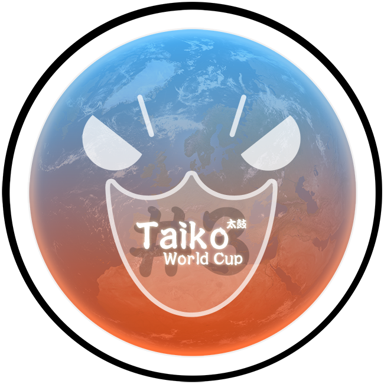

---
tags:
- 'TWC #3'
- TWC#3
---

# Taiko World Cup #3

The **Taiko World Cup #3** (***TWC #3***) was a country-based osu!taiko tournament hosted by the [osu! team](/wiki/People/The_Team). It was the third installment of the osu!taiko World Cup.

## Tournament Schedule

| Event | Timestamp |
| --: | :-- |
| Registration Phase | 2012-09-22/2013-01-01 |
| Live Drawings | 2013-01-20 |
| Group Stage | 2013-02-02/2013-02-17 |
| Qualification Stage | 2013-02-23/2013-02-24 |
| Round of 16 | 2013-03-02/2013-03-03 |
| Quarterfinals | 2013-03-09/2013-03-10 |
| Semifinals | 2013-03-16/2013-03-17 |
| Finals | 2013-03-23/2013-03-24 |

## Prizes

| Placing | Prize(s) |
| :-: | :-- |
|  | 6 months of osu!supporter tag, unique profile badge, osu! merchandise |
|  | 3 months of osu!supporter tag |
|  | 1 month of osu!supporter tag |
| *Special* | 1 month of osu!supporter tag |

## Organisation

The Taiko World Cup #3 was run by various community members by distributing the multitude of tasks into various fields of responsibility.

| Postition | Member(s) |
| :-- | :-- |
| Manager | ![][flag_DE] [Loctav](https://osu.ppy.sh/users/71366), ![][flag_HK] [wmfchris](https://osu.ppy.sh/users/7401), ![][flag_KR] [lepidopodus](https://osu.ppy.sh/users/194807) |
| Map Selector | ![][flag_CA] [Xakyrie](https://osu.ppy.sh/users/684730), ![][flag_DE] [OnosakiHito](https://osu.ppy.sh/users/290128) |
| Scheduler | ![][flag_CA] [Xakyrie](https://osu.ppy.sh/users/684730), ![][flag_CA] [Haruka](https://osu.ppy.sh/users/686460) |
| Referee | ![][flag_CA] [YTYuyu](https://osu.ppy.sh/users/660484), ![][flag_BG] [Flanster](https://osu.ppy.sh/users/447818), ![][flag_HK] [kanpakyin](https://osu.ppy.sh/users/394326), ![][flag_PL] [Acrith](https://osu.ppy.sh/users/389880) |
| Streamer | ![][flag_HK] [matthewhln](https://osu.ppy.sh/users/291487), ![][flag_US] [Makar](https://osu.ppy.sh/users/686389), ![][flag_US] [dkun](https://osu.ppy.sh/users/154400) |
| Commentator | ![][flag_FR] [Cyclohexane](https://osu.ppy.sh/users/116078), ![][flag_CA] [karterfreak](https://osu.ppy.sh/users/1031958), ![][flag_US] [OzzyOzrock](https://osu.ppy.sh/users/465153), ![][flag_DE] [OnosakiHito](https://osu.ppy.sh/users/290128), ![][flag_PL] [Acrith](https://osu.ppy.sh/users/389880) |

## Links

- [Discussion thread](https://osu.ppy.sh/community/forums/topics/99029)
- [Livestream](https://www.twitch.tv/taikoworldcup)

---

## Participants

|  | Country | Members |
| :-: | :-: | :-- |
| ![][flag_AR] | **Argentina** | **[Nearex](https://osu.ppy.sh/users/1893238)**, [Sujeto 97](https://osu.ppy.sh/users/1331132), [Ariel](https://osu.ppy.sh/users/1065794), [Pollotuc](https://osu.ppy.sh/users/42440) |
| ![][flag_CA] | **Canada A** | **[Tasha](https://osu.ppy.sh/users/1031958)**, [hipster3000](https://osu.ppy.sh/users/1307688), [kenny388](https://osu.ppy.sh/users/1098972) |
| ![][flag_CA] | **Canada B** | **[Haruka](https://osu.ppy.sh/users/686460)**, [Crystalloid](https://osu.ppy.sh/users/699741), [Super\_Banana](https://osu.ppy.sh/users/459886) |
| ![][flag_CL] | **Chile A** | **[T o u c h e](https://osu.ppy.sh/users/744220)**, [Cristian](https://osu.ppy.sh/users/194345), [Foster Don](https://osu.ppy.sh/users/144464), [MichelleP](https://osu.ppy.sh/users/1260578) |
| ![][flag_CL] | **Chile B** | **[kazukisinx](https://osu.ppy.sh/users/920861)**, [Letz\_Shake](https://osu.ppy.sh/users/593579), [koneejo](https://osu.ppy.sh/users/718626), [N3koKiller](https://osu.ppy.sh/users/1095350) |
| ![][flag_CN] | **China A** | **[HM495](https://osu.ppy.sh/users/810813)**, [Mic](https://osu.ppy.sh/users/81972), [narcissu2012](https://osu.ppy.sh/users/819937), [baka\_baka\_Koishi](https://osu.ppy.sh/users/915103) |
| ![][flag_CN] | **China B** | **[bx1989](https://osu.ppy.sh/users/424233)**, [yuan0312](https://osu.ppy.sh/users/586131), [Yowane \_ Haku](https://osu.ppy.sh/users/255267), [mcwyc](https://osu.ppy.sh/users/624482) |
| ![][flag_DK] ![][flag_NO] | **Denmark-Norway** | **[TraxieChan](https://osu.ppy.sh/users/455552)**, [Zheant](https://osu.ppy.sh/users/708656), [Dolphin](https://osu.ppy.sh/users/1331438), [Agu](https://osu.ppy.sh/users/1109122) |
| ![][flag_SV] ![][flag_VE] | **El Salvador-Venezuela** | **[Christian](https://osu.ppy.sh/users/1435127)**, [KIKECTB](https://osu.ppy.sh/users/1671844), [\[Chichioko\]](https://osu.ppy.sh/users/2140739), [Black Wolf159](https://osu.ppy.sh/users/1860819) |
| ![][flag_FI] | **Finland** | **[Samwais](https://osu.ppy.sh/users/1227199)**, [ReZero](https://osu.ppy.sh/users/391366), [Orkel](https://osu.ppy.sh/users/39385) |
| ![][flag_FR] | **France** | **[Nashmun](https://osu.ppy.sh/users/49031)**, [\_Gezo\_](https://osu.ppy.sh/users/481582), [omegaflo](https://osu.ppy.sh/users/83291), [Fraolinch](https://osu.ppy.sh/users/205257) |
| ![][flag_DE] | **Germany A** | **[Slih](https://osu.ppy.sh/users/606738)**, [Xay](https://osu.ppy.sh/users/961417), [BrokenArrow](https://osu.ppy.sh/users/384034), [DarkDunskin](https://osu.ppy.sh/users/98985) |
| ![][flag_DE] | **Germany B** | **[Luna](https://osu.ppy.sh/users/588007)**, [FreedomofBirds](https://osu.ppy.sh/users/1074143), [Satyros](https://osu.ppy.sh/users/520358), [xBourbon\_Kid](https://osu.ppy.sh/users/645775) |
| ![][flag_HK] | **Hong Kong A** | **[aabc271](https://osu.ppy.sh/users/155707)**, [kanpakyin](https://osu.ppy.sh/users/394326), [KanaRin](https://osu.ppy.sh/users/310747), [hknoboru](https://osu.ppy.sh/users/1485257) |
| ![][flag_HK] | **Hong Kong B** | **[NewibornCLivee](https://osu.ppy.sh/users/1530993)**, [EZENA](https://osu.ppy.sh/users/1257848), [firenz818](https://osu.ppy.sh/users/942283), [wcl\_0209](https://osu.ppy.sh/users/1214640) |
| ![][flag_ID] | **Indonesia** | **[Flandre XKarlet](https://osu.ppy.sh/users/1139209)**, [Frans Niko](https://osu.ppy.sh/users/906991), [\[Sena Airi\]](https://osu.ppy.sh/users/1151612), [Ghassan Super](https://osu.ppy.sh/users/1538223) |
| ![][flag_IT] ![][flag_NL] | **Italy-Netherlands** | **[NeoRainier](https://osu.ppy.sh/users/326049)**, [Pheon](https://osu.ppy.sh/users/292295), [Lokamp](https://osu.ppy.sh/users/63671), [happy30](https://osu.ppy.sh/users/27767) |
| ![][flag_JP] | **Japan A** | **[FlowerMasterK](https://osu.ppy.sh/users/1143137)**, [Rappu](https://osu.ppy.sh/users/1207106), [shifon\[0312\]](https://osu.ppy.sh/users/295488), [kiru132](https://osu.ppy.sh/users/663075) |
| ![][flag_JP] | **Japan B** | **[Shuki-](https://osu.ppy.sh/users/621526)**, [Orukaa](https://osu.ppy.sh/users/987895), [NeGaTiVeMinD](https://osu.ppy.sh/users/965038), [TKSalt](https://osu.ppy.sh/users/940878) |
| ![][flag_MO] | **Macau** | **[L y n n i e](https://osu.ppy.sh/users/189880)**, [benisakura](https://osu.ppy.sh/users/384986), [justnobody](https://osu.ppy.sh/users/2875410), [i0200352](https://osu.ppy.sh/users/1238085) |
| ![][flag_MY] | **Malaysia** | **[taiko_maniac1811](https://osu.ppy.sh/users/595764)**, [HeatKai](https://osu.ppy.sh/users/332555), [Jerry](https://osu.ppy.sh/users/605973), [huiko12](https://osu.ppy.sh/users/598553) |
| ![][flag_PH] | **Philippines** | **[Ca Calne](https://osu.ppy.sh/users/1498271)**, [\_intervention](https://osu.ppy.sh/users/1150178), [Kyoren](https://osu.ppy.sh/users/1266303), [Kotaro](https://osu.ppy.sh/users/796530) |
| ![][flag_PL] | **Poland** | **[Acrith](https://osu.ppy.sh/users/389880)**, [DarkStoorM](https://osu.ppy.sh/users/174347), [nekoyan](https://osu.ppy.sh/users/685739), [Niko](https://osu.ppy.sh/users/175141) |
| ![][flag_RU] | **Russian Federation** | **[Big and Busty](https://osu.ppy.sh/users/1728245)**, [Wolfjkeee](https://osu.ppy.sh/users/1282662), [Shandro](https://osu.ppy.sh/users/175411), [Ch1ka](https://osu.ppy.sh/users/352967) |
| ![][flag_KR] | **South Korea** | **[-applerss-](https://osu.ppy.sh/users/983349)**, [kawhy](https://osu.ppy.sh/users/2180896), [Bye](https://osu.ppy.sh/users/344783), [\[Akita-Neru\]](https://osu.ppy.sh/users/613944) |
| ![][flag_ES] | **Spain** | **[MYRKUL](https://osu.ppy.sh/users/255933)**, [LZD](https://osu.ppy.sh/users/224335), [CARRI](https://osu.ppy.sh/users/854536), [charly kempachy](https://osu.ppy.sh/users/280115) |
| ![][flag_TW] | **Taiwan A** | **[-\[ ix Ishida xi \]-](https://osu.ppy.sh/users/242910)**, [zx\_baka\_0502442](https://osu.ppy.sh/users/457766), [yikao](https://osu.ppy.sh/users/352674), [oiu850714](https://osu.ppy.sh/users/437607) |
| ![][flag_TW] | **Taiwan B** | **[Dora](https://osu.ppy.sh/users/358675)**, [yoyo](https://osu.ppy.sh/users/31060), [howar5041](https://osu.ppy.sh/users/584411), [----mliencheng----](https://osu.ppy.sh/users/586659) |
| ![][flag_TH] | **Thailand** | **[RSX-981](https://osu.ppy.sh/users/1136345)**, [0OoMickeyoO0](https://osu.ppy.sh/users/317494), [gangevil123](https://osu.ppy.sh/users/600440), [kantokun](https://osu.ppy.sh/users/1280801) |
| ![][flag_UA] | **Ukraine** | **[totoco](https://osu.ppy.sh/users/592387)**, [Aka-](https://osu.ppy.sh/users/3732398), [Hikkiko](https://osu.ppy.sh/users/551193) |
| ![][flag_US] | **United States A** | **[Two Fruit Cakes](https://osu.ppy.sh/users/437259)**, [Backfire](https://osu.ppy.sh/users/263110), [HashishKabob](https://osu.ppy.sh/users/1076063), [OzzyOzrock](https://osu.ppy.sh/users/465153) |
| ![][flag_US] | **United States B** | **[Kuro](https://osu.ppy.sh/users/1735031)**, [lianna](https://osu.ppy.sh/users/1167251), [Horo](https://osu.ppy.sh/users/992439), [AnFace](https://osu.ppy.sh/users/233485) |

---

## Podium

This competition has come to an end and resulted in the following podium:

| Placing | Team |
| :-: | :-- |
|  | ![][flag_TW] Taiwan A |
|  | ![][flag_HK] Hong Kong A |
|  | ![][flag_JP] Japan A |

---

## Mappools

### Finals

**[Download the mappack here! (106 MB)](http://www.mediafire.com/file/55u3kl139pr04i8/TWC+-+Final+Mappool+pack.zip)**

- NoMod
  - Cres - End Time (choco00) \[Nyan's Taiko (TWC Ver.)\]
  - xi - Akasha (Nyan) \[Nyan's Taiko+H (TWC Ver.)\]
  - [t+pazolite - Luv\*Lab\*Poison 22ate! (Saten) \[Taikosaki\]](https://osu.ppy.sh/beatmapsets/30058#taiko/99759)
  - K@me - Athlon -Speed Dragon- (POONwing) \[Inner Oni\]
  - [t+pazolite - Stardust Lullaby (Strawberry) \[Ono's Taiko Oni\]](https://osu.ppy.sh/beatmapsets/58016#taiko/176450)
  - Reizoko Cj - Hardcore Syndrome (NekoMimiMode) \[Taikosaki\]
  - goreshit - Satori De Pon! ([CSGA]Ar3sgice) \[Taikocalypse X (TWC Ver.)\]
  - [The Ghost Of 3.13 - Forgotten (Blue Dragon) \[PhNyx's Taiko Oni\]](https://osu.ppy.sh/beatmapsets/55560#taiko/168807)
  - xi - FREEDOM DiVE (Short Ver.) (-Chata-) \[Firce's Taiko Inner Oni\]
  - Iku Akume - Slashmaid (Censored Version) (Firce777) \[Firce's Taiko\]
  - ALiCE'S EMOTiON - Foughten Field (t+pazolite Remix) (Bass) \[Taikocalypse (TWC Ver.)\]
- Hidden
  - [guna with team kyukkyu - subconsciousness (Charles445) \[Backfire's Taiko Oni\]](https://osu.ppy.sh/beatmapsets/45205#taiko/146760)
  - cranky - Rei Mai ToukyouRikaDaigaku YOSAKOI So Ran (POONwing) [Oni]
- HardRock
  - [DECO\*27 feat. marina - Aimai Elegy (val0108) \[Love's Taiko Oni\]](https://osu.ppy.sh/beatmapsets/43248#taiko/136526)
  - [Levaslater - NNRT (Reisen Udongein) \[Taiko DS\]](https://osu.ppy.sh/beatmapsets/47330#taiko/152961)
- DoubleTime
  - [ALiCE'S EMOTiON - Sweet Play (S i R i R u) \[Kana's Taiko Oni\]](https://osu.ppy.sh/beatmapsets/29136#taiko/97616)
  - [Xi - Majotachi no Butoukai \~ Magus (Kite) \[Pheon's Taiko Oni\]](https://osu.ppy.sh/beatmapsets/43862#taiko/157054)
- Tiebreaker
  - **[Renard - Because Maybe! pt. 3 (Blue Dragon) \[Taiko Collab\]](https://osu.ppy.sh/beatmapsets/30013#taiko/192573)**

### Semifinals

- NoMod
  - [Ryu - Plan 8 (wantuole) \[Firce777's Taiko\]](https://osu.ppy.sh/beatmapsets/76825#taiko/216131)
  - Renard - Smoke Tower (giO-) \[Taikocalypse\]
  - [44teru-k - F.I (AngelHoney) \[lepidon! - Taiko Oni\]](https://osu.ppy.sh/beatmapsets/25828#taiko/125530)
  - [weyheyhey !! - I'm Your Daddy (Loctav) \[Inner Oni\]](https://osu.ppy.sh/beatmapsets/59859#taiko/179233)
  - [Memme - BSPower Explosion (AngelHoney) \[Taiko Oni\]](https://osu.ppy.sh/beatmapsets/44967#taiko/141942)
  - [Lon - Yuru Fuwa Jukai Girl (Garven) \[Tasha's Taiko Oni\]](https://osu.ppy.sh/beatmapsets/49686#taiko/165988)
  - t+pazolite - VOX Diamond (OnosakiHito) \[Taiko Oni\]
  - [Igorrr - Mastication Numerique (grumd) \[Loctav's Taiko Oni\]](https://osu.ppy.sh/beatmapsets/54182#taiko/165342)
  - [Hatsune Miku - Atama no Taisou (val0108) \[Love's Taiko Oni\]](https://osu.ppy.sh/beatmapsets/40344#taiko/131291)
  - [Renard - Why Am I So Angry (Blue Dragon) \[lepidon! - Taiko Oni\]](https://osu.ppy.sh/beatmapsets/31133#taiko/260832)
  - t+pazolite - Kick-ass Kung-fu Carnival (Zapy) \[Backfire's Taikocalypse (TWC ver.)\]
- Hidden
  - [Ken Nakagawa - Tsuioku no Michishirube \~ Sono Ni (Dusty) \[Fiya's Taiko Oni\]](https://osu.ppy.sh/beatmapsets/42158#taiko/167317)
  - The Quick Brown Fox - Shut Down Everything (OnosakiHito) \[Ono's Taiko Inner Oni\]
- HardRock
  - [yanaginagi - Muteki no Soldier (BinJip) \[Taiko DS\]](https://osu.ppy.sh/beatmapsets/52221#taiko/184851)
  - [Suzaku - CONTRACT (Crimmi) \[Backfire's Taiko Inner Oni\]](https://osu.ppy.sh/beatmapsets/33819#taiko/124317)
- DoubleTime
  - [Pastry - Goblin Girl (osuplayer111) \[Climbb's Taiko Oni\]](https://osu.ppy.sh/beatmapsets/25392#taiko/86669)
  - [IOSYS - Chizome no Love Letter (Hellzero) \[Fiya's Taiko Oni\]](https://osu.ppy.sh/beatmapsets/35878#taiko/126709)
- Tiebreaker
  - **LEAF XCEED Music Division - Guitar Vs. Piano (ISHIDAMITSUNARI) \[- IshidaTaikonari - (TWC ver.)\]**

### Quarterfinals

- NoMod
  - [IOSYS - RE:USATEI (OzzyOzrock) \[Taiko Oni\]](https://osu.ppy.sh/beatmapsets/31343#taiko/103022)
  - [Megpoid GUMI - Ikasama Life Game (manten) \[Taiko Collab\]](https://osu.ppy.sh/beatmapsets/44665#taiko/141625)
  - Hatsune Miku - Electric Love (t+pazolite Overcute Remix) (zapy) \[Ono’s Taiko Oni\]
  - [Ryu\* Vs. L.E.D. - PARADISE LOST (ignorethis) \[Taiko\]](https://osu.ppy.sh/beatmapsets/38043#taiko/122471)
  - [Acme Iku - chaosmaid (demo) (mochi) \[MM's Taiko Oni\]](https://osu.ppy.sh/beatmapsets/38720#taiko/124599)
  - [O-Life Japan - Yakujinsama no Couple Dance (AngelHoney) \[Taiko\]](https://osu.ppy.sh/beatmapsets/16990#taiko/95812)
  - dj Taka - Hollywood Galaxy (lepidopodus) \[lepidon! - Taiko Oni\]
  - [Beridzebeth - Seijin no Tou (Strawberry) \[Firce777's Taiko Oni\]](https://osu.ppy.sh/beatmapsets/66968#taiko/212475)
- Hidden
  - [Subplaid - Jeg onskerikke a skade deg (grumd) \[Rocke’s Taiko\]](https://osu.ppy.sh/beatmapsets/42817#taiko/138230)
  - [Kola Kid - can't hide your love (Kert) \[31's Taiko\]](https://osu.ppy.sh/beatmapsets/39732#taiko/133083)
- HardRock
  - [P\*Light - Poppin' Shower (Reisen Udongein) \[Taiko Oni\]](https://osu.ppy.sh/beatmapsets/42527#taiko/134337)
  - xi - youma yakou (danny19940914) \[Danny’s Taiko Oni\]
- DoubleTime
  - Pendulum - The Vulture (La Cataline) \[Taikolor (TWC Ver.)\]
  - [fripSide - fortissimo-from insanity affection- (Short Ver.) (Melophobia) \[Kana's Taiko Oni\]](https://osu.ppy.sh/beatmapsets/44106#taiko/139625)
- Tiebreaker
  - **[t+pazolite - to Luv me, I \*\*\* for u. (reprise) (pekos) \[Taikocalypse\]](https://osu.ppy.sh/beatmapsets/42741#taiko/135070)**

### Round of 16

- NoMod
  - [UNDEAD CORPORATION - Yoru Naku Usagi wa Yume wo Miru (Strawberry) \[jom's Taiko Oni\]](https://osu.ppy.sh/beatmapsets/59049#taiko/214251)
  - [bj.HaLo - Ende (galvenize) \[Kurosanyan's Taiko Oni\]](https://osu.ppy.sh/beatmapsets/44035#taiko/183596)
  - [Tokiwa Yuu - Shounen Ripples (Suzully) \[Taiko DS\]](https://osu.ppy.sh/beatmapsets/39678#taiko/127850)
  - [The Quick Brown Fox - The Big Black (Blue Dragon) \[Ono's Taiko Oni\]](https://osu.ppy.sh/beatmapsets/41823#taiko/132889)
  - [Cait Sith - Schrodinger's Cat (Sushi) \[Taiko Oni\]](https://osu.ppy.sh/beatmapsets/36409#taiko/117642)
  - [Hatsune Miku - Kagerou Days (m i z u k i) \[Taiko Oni\]](https://osu.ppy.sh/beatmapsets/37638#taiko/132640)
  - [IOSYS - Kanbu de Tomatte Sugu Tokeru \~ Kyouki no Udongein (ouranhshc) \[Taiko Oni\]](https://osu.ppy.sh/beatmapsets/12292#taiko/61369)
  - [Xelia - Illumiscape (Kanna) \[31's Taiko\]](https://osu.ppy.sh/beatmapsets/43960#taiko/160239)
- Hidden
  - [IOSYS - Tapuu Tears You Base (danny19940914) \[danny's taiko\]](https://puu.sh/28gKz)
  - kors k as teranoid - Bad Maniacs (La Cataline) \[lepidon! - Taiko Oni\]
- HardRock
  - [Croove & Paul Bazooka - Enemy Storm (Dark Jungle Mix) (Reiji-RJ) \[lepidon! - Taiko Oni\]](https://osu.ppy.sh/beatmapsets/30229#taiko/124413)
  - [DJ TECHNORCH fw. GUHROOVY - KAMAITACHI (Mr Color) \[Taikolor\]](https://puu.sh/28h1RZ)
- DoubleTime
  - [Basic Element - Touch You Right Now (Kiiwa) \[Kana's Taiko Oni\]](https://osu.ppy.sh/beatmapsets/32369#taiko/139607)
  - [ClariS - Neo Moon (goodbye) \[Alace's Taiko\]](https://osu.ppy.sh/beatmapsets/29693#taiko/100104)
- Tiebreaker
  - **[YAMAGEN'S DEVILELIET - EYES OF DEVILELIET(Kite) \[Dunskin's Taiko Oni\]](https://osu.ppy.sh/beatmapsets/36988#taiko/123834)**

### Qualification Stage

- NoMod
  - [ALiCE’S EMOTION - Mami Mami Zone (Mixagji) \[Ono's Taiko Oni\]](https://osu.ppy.sh/beatmapsets/43728#taiko/143931)
  - [L.E.D. - THE LAST STRIKER (Nakagawa-Kanon) \[inaba's Taiko Oni\]](https://osu.ppy.sh/beatmapsets/38867#taiko/145844)
  - [Nico Nico Douga - Owens (AngelHoney) \[Climbb's Taiko Oni\]](https://osu.ppy.sh/beatmapsets/20406#taiko/76538)
  - [kors k - smooooch (Card N'FoRcE) \[Natteke's Taiko Oni\]](https://osu.ppy.sh/beatmapsets/17912#taiko/63950)
  - [Hatsune Miku - Unhappy Refrain (NatsumeRin) \[Climbb's Taiko Oni\]](https://osu.ppy.sh/beatmapsets/30128#taiko/105917)
  - [EastNewSound - Lucid Dream (eveless) \[Poke's Taiko\]](https://osu.ppy.sh/beatmapsets/24825#taiko/87964)
  - [cranky - R176 (taka1235) \[Pangko\]](https://osu.ppy.sh/beatmapsets/31367#taiko/121335)
  - [KOTOKO - Oboetete Ii yo (cRyo\[iceeicee\]) \[aabc's Taiko\]](https://osu.ppy.sh/beatmapsets/53791#taiko/177822)
- Hidden
  - AU - Rotterdam Cirno (OnosakiHito) \[Taiko Oni\]
  - [Saiya - Remote Control (Garven) \[inaba's Taiko Oni\]](https://osu.ppy.sh/beatmapsets/53857#taiko/173361)
- HardRock
  - [Nanamori-chu \* Goraku-bu - My Pace de Ikimashou (bakabaka) \[Car's Taiko\]](https://osu.ppy.sh/beatmapsets/36569#taiko/118718)
  - [Zektbach - meme (AngelHoney) \[Taiko Oni\]](https://osu.ppy.sh/beatmapsets/68617#taiko/200145)
- DoubleTime
  - [Hatsune Miku - Electric Love (Short Ver.) (KayeSara) \[aabc's Taiko\]](https://osu.ppy.sh/beatmapsets/44591#taiko/140560)
  - [Matsumoto Tamaki - Tenshi Teki Kenpou Yonjou (KayeSara) \[aabc's Taiko\]](https://osu.ppy.sh/beatmapsets/43100#taiko/137802)
- Tiebreaker
  - **[Ayane - Endless Tears...(lkp) \[Taiko Oni\]](https://osu.ppy.sh/beatmapsets/24960#taiko/101301)**

### Group Stage (Week 3)

- NoMod
  - [Saiya - Remote Control (Garven) \[inaba's Taiko Oni\]](https://osu.ppy.sh/beatmapsets/53857#taiko/173361)
  - [Choucho - Kawaru Mirai (TV Size) (Kenezz) \[H's Moe Taiko\]](https://osu.ppy.sh/beatmapsets/32911#taiko/107794)
  - [O-Life Japan - Yamanobori Kibun (qinche) \[Taiko\]](https://osu.ppy.sh/beatmapsets/30256#taiko/100178)
  - [Melanie Flash - One in a Million (Nightcore Mix) (Makar8000) \[Ozzy's Once in a Taiko\]](https://osu.ppy.sh/beatmapsets/37235#taiko/122001)
  - [Nanamori-chu \* Goraku-bu - My Pace de Ikimashou (bakabaka) \[Car's Taiko\]](https://osu.ppy.sh/beatmapsets/36569#taiko/118718)
  - [Senpi - Suteki na Hakaba de Kuraseru to Omotta noni (Kite) \[Dunskin's Taiko Oni\]](https://osu.ppy.sh/beatmapsets/31169#taiko/121642)
  - [KOTOKO - Oboetete Ii yo (cRyo\[iceeicee\]) \[aabc's Taiko\]](https://osu.ppy.sh/beatmapsets/53791#taiko/177822)
  - [Furries in a Blender - Ridorii (-Lennox-) \[Ono's Taiko Oni\]](https://osu.ppy.sh/beatmapsets/29727#taiko/99462)
- Hidden
  - [nano.RIPE - Hana no Iro (TV Size) (Disoy) \[Kana's Taiko Oni\]](https://osu.ppy.sh/beatmapsets/30567#taiko/101109)
  - [Subplaid - Only time make your hapiness (\[Luanny PhNyx\]) \[Oni\]](https://osu.ppy.sh/beatmapsets/57381#taiko/172994)
- HardRock
  - [Shihori - Heisei Kappa Lords (goodbye) \[KumaTaiko\]](https://osu.ppy.sh/beatmapsets/30841#taiko/101781)
  - [Ryu\* - China Express (yeahyeahyeahhh) \[Taiko Oni\]](https://osu.ppy.sh/beatmapsets/53853#taiko/164009)
- DoubleTime
  - [PSY - GANGNAM STYLE (yeahyeahyeahhh) \[lepidon! - Taiko Oni\]](https://osu.ppy.sh/beatmapsets/55799#taiko/169840)
  - [ave;new feat. Sakura Saori - True My Heart (Suzuka Asahina) \[Climbb's Taiko Oni\]](https://osu.ppy.sh/beatmapsets/16910#taiko/68793)
- Tiebreaker
  - **[toku feat. Pagoda - Boku no Sainou -dub mix- (Garven) \[MM's Taiko\]](https://osu.ppy.sh/beatmapsets/33914#taiko/115063)**

### Group Stage (Week 2)

- NoMod
  - [Silver Forest - Prayer (Elly-chan) \[MM's Taiko Oni\]](https://osu.ppy.sh/beatmapsets/32214#taiko/188456)
  - AU - Rotterdam Cirno (OnosakiHito) \[Taiko Oni\]
  - [Envy - Heaven (Charles445) \[MM's Taiko Oni\]](https://osu.ppy.sh/beatmapsets/42038#taiko/135499)
  - [Nudarai - Nuclear Fusion (Sandpig) \[lepidon! - Taiko Oni\]](https://osu.ppy.sh/beatmapsets/25557#taiko/87205)
  - [cranky - R176 (taka1235) \[Pangko\]](https://osu.ppy.sh/beatmapsets/31367#taiko/121335)
  - [Hatsune Miku - Unhappy Refrain (NatsumeRin) \[Climbb's Taiko Oni\]](https://osu.ppy.sh/beatmapsets/30128#taiko/105917)
  - [Zektbach - meme (AngelHoney) \[Taiko Oni\]](https://osu.ppy.sh/beatmapsets/68617#taiko/200145)
  - [MuryokuP - hypnoSpirA (meiikyuu) \[Haruka's Taiko Oni\]](https://osu.ppy.sh/beatmapsets/57908#taiko/180663)
- Hidden
  - [Mutsuhiko Izumi - Snow Goose (wmfchris) \[Taiko\]](https://osu.ppy.sh/beatmapsets/21754#taiko/75360)
  - [Hatsune Miku - Romeo and Cinderella (Nekoo\[\]) \[31's Taiko\]](https://osu.ppy.sh/beatmapsets/21954#taiko/76530)
- HardRock
  - [EastNewSound - Lucid Dream (eveless) \[Poke's Taiko\]](https://osu.ppy.sh/beatmapsets/24825#taiko/87964)
  - ETIA. - Enkan no Kotowari (Rein0527) \[KUMA's Taiko Oni (TWC ver.)\]
- DoubleTime
  - [12 Girls Band - Freedom (LKs) \[lepidon! - Taiko Oni\]](https://osu.ppy.sh/beatmapsets/13901#taiko/51121)
  - [Matsumoto Tamaki - Tenshi Teki Kenpou Yonjou (KayeSara) \[aabc's Taiko\]](https://osu.ppy.sh/beatmapsets/13901#taiko/51121)
- Tiebreaker
  - **[DystopiaGround - AugoEidEs (happy30) \[lepidon! - Taiko Oni\]](https://osu.ppy.sh/beatmapsets/24611#taiko/97949)**

### Group Stage (Week 1)

- NoMod
  - [Comp - Kyoai (karenying) \[Kana's Taiko Oni\]](https://osu.ppy.sh/beatmapsets/28609#taiko/114207)
  - [Suzaku - VANESSA (La Cataline) \[lepidon! Taiko Oni\]](https://osu.ppy.sh/beatmapsets/27862#taiko/99163)
  - [ALiCE’S EMOTION - Mami Mami Zone (Mixagji) \[Ono's Taiko Oni\]](https://osu.ppy.sh/beatmapsets/43728#taiko/143931)
  - [Ryu\* - Starmine (pop'n mixxx) (Sushi) \[Taiko Oni\]](https://osu.ppy.sh/beatmapsets/31002#taiko/115377)
  - [L.E.D. - THE LAST STRIKER (Nakagawa-Kanon) \[inaba's Taiko Oni\]](https://osu.ppy.sh/beatmapsets/38867#taiko/145844)
  - [HOUJIROU - Maihime \~buki\~ (Sandpig) \[Alace's Taiko\]](https://osu.ppy.sh/beatmapsets/28765#taiko/98441)
  - [Nico Nico Douga - Owens (AngelHoney) \[Climbb's Taiko Oni\]](https://osu.ppy.sh/beatmapsets/20406#taiko/76538)
  - [kors k - smooooch (Card N'FoRcE) \[Natteke's Taiko Oni\]](https://osu.ppy.sh/beatmapsets/17912#taiko/63950)
- Hidden
  - [naotyu - Her Majesty (Reisen Udongein) \[MM's Taiko\]](https://osu.ppy.sh/beatmapsets/52360#taiko/166598)
  - [Hatsune Miku - Love-colored Ward (Krisom) \[lepidon! Taiko Oni\]](https://osu.ppy.sh/beatmapsets/52360#taiko/166598)
- HardRock
  - [Hatsune Miku - Nightmare Party Night (banvi) \[Ono's Taiko Oni\]](https://osu.ppy.sh/beatmapsets/23053#taiko/84587)
  - [Ryu\* - bloomin’ feeling (Nakagawa-Kanon) \[Nyan's Taiko Oni\]](https://osu.ppy.sh/beatmapsets/28332#taiko/112799)
- DoubleTime
  - [Madeon - Shuriken (Charles445) \[MM's Taiko\]](https://osu.ppy.sh/beatmapsets/34595#taiko/112818)
  - [Hatsune Miku - Electric Love (Short Ver.) (KayeSara) \[aabc's Taiko\]](https://osu.ppy.sh/beatmapsets/44591#taiko/140560)
- Tiebreaker
  - **[Demetori - Silent Voyage to Eternity (brikel) \[31's Taiko\]](https://osu.ppy.sh/beatmapsets/14309#taiko/108010)**

---

## Ruleset

### Tournament Registration

1. Your team needs at least 3 players to participate. You are free to add another fourth player.
2. You need to specify a captain who will manage the team. (e.g. in match scheduling)
3. Basically a team represents a nation. That means you should make a team with players from same country.
4. If your country lacks Taiko players sufficient to participate this, you can make a binational team.
   - Binational team includes 2 players from a certain country and 2 players from an another country.
   - Making a binational team can be restricted due to time difference between members of binational team.
   - Binational teams are only exceptional and shall not be common case. They need approval by tournament management.
   - You can not create one binational team and another national team. (e.g. you can not create a Team IT/NL and another Team IT)
5. Multiple teams per country are allowed. Special Qualification Encounter after Group Stage may happen. Refer to Tournament Instructions!
6. To found a team, send a PM to tournament management or post into this thread.
   - Captains are free to change their team setup until their first match starts
7. Mapset selectors can't participate tournament as a player.

### Stage Instructions

1. In the first stage (Group Stage), the teams will be divided into 8 groups of 4 team in each one.
2. All the teams from each group will face each other.
3. Rankings of each group are determined by sorting the statistics of each team in followed priority:
   1. More matches won.
   2. Have higher `{(the number of games won) - (the number of games defeated)}`.
   3. More games won.
   4. Have higher `∑{(total score difference) / (maximum score)}`.
   5. Winner of the rematch.
4. Teams from the same country will not be in the same group in group stage.
5. The best two of each group will ascend to the Knock-Out Stages.
6. If two teams of the same country are supposed to ascend from Group Stage to Knock-Out Stages, they will encounter each other on a Qualification Stage. The winning team will ascend to the next round, the losing will be knocked out from the tournament. The free slot will receive the team with the best result among all groups.
7. Following stages are Knock-Out Stages. This means that the winner ascends to the next stage and the losing team gets kicked out of the tournament.
8. In Group Stage, you need to win 4 maps to win a match. In Qualification Stage (1-4), Round of 16 and Quarter-finals, you need to win 5 maps to win a match. In Semi-finals and Finals, you need to win 6 maps to with a match.

### Match Instructions

1. One of referees will create a multiplayer room about 30 minutes before the time. All players should arrive the room in right time.
   - The room will be locked. The password and multiplayer invite will be sent to the two captains as soon as possible.
   - Room settings are Taiko, Team-Vs., Win Condition 'Score'. Room name must be "Taiko World Cup #3: TeamBlue vs. TeamRed"
   - The team mentioned first in the room name must be the blue team, the team mentioned second in the room name must be the red team.
2. The team that mentioned first in the timetable will be the blue team.
3. Referee will keep the host during the whole match.
4. Referee will select one warmup map. This map is not part of the actual mappool.
5. Alternately each captain selects a map out of the mappool. Winner of this warmup will start selecting maps.
   - The captains can select maps out of the NoMod bracket unlimited.
   - Selection out of mod-specific brackets is limited. Each captain can only select one map from each mod-restricted bracket during match. So each team can pick 1 HardRock, 1 Hidden and 1 DoubleTime map during match.
   - In case of tie, the tiebreaker map must be played.
   - Captains shall tell the selected map via PM to the referee. He will pick it.
6. Referees must save the result of each game with a screenshot.
7. When match ended, referee must post the screenshots and the multiplayer history link into the tournament thread.

### Tournament Rules

1. The maps for each round are announced by mapset selectors approx. 1 week ahead. Only these can be used during the respective matches.
   - One map will be given as tiebreaker map. This map only gets played in case of a tie. Also there will be a Hidden, a HardRock and a DoubleTime bracket.
2. Captains have the chance to hand in preferred times for matches 9 days ahead. All your matches will be scheduled by trying to fit these perferations. Match schedules will be released approx. 7 days ahead. Captains have 24 hours to object the scheduled time.
   - After the 24 hours passed, match schedule is locked and can't be changed anymore.
3. If no staff or referee is available, the match must be postponed.
4. Score of failed player will be added to total score too.
5. 'No Video' mod is available. Visual Settings are available.
6. Maps cannot be used more than once in the same match unless the game was nullified.
7. If the game ends in a draw, the game will be nullified.
8. If one of players gets disconnected, the game will be nullified. This can happen up to twice. After exceeding two attempts, disconnected players get treated as left on their own.
   - If server is too unstable to continue the match, tournament management can postpone the match.
9. If less than 3 players arrived, the match can be postponed maximum 20 minutes.
10. During the match, exchanging players is allowed.
    - You can exchange players once in group-stage and twice in knock-out stages.
11. Lags can't be a reason for nullification of game.
12. When a match gets postponed too frequent, tournament manangement can declare the opponent team wins by default.
    - In Group stage, 'Win by default' will be considered as win by 4:0, +1.0 score difference ratio.
13. 2 vs 2 match is available only in the Group stage if no more than 3 players in one of two teams can be ready for the match.
    - Captains of both teams should agree and permission of tournament manager is needed.
    - The manager can disqualify a team if the team abuses 3 vs 3 match.
14. Unexpected incidences that needs decision of staff and isn't specified in this ruleset during the tournament will need the referee to judge. Yet, the decision of tournament management is final.
15. Any form of non-fair behaviour (such as cheating, insulting other players, racism, impersonating) or disturbance in the tournament's progress will be punished with an immediate banishment of the player/the team from the tournament.
    - Banned player won't be allowed to participate the next Taiko World Cup.
16. Prospective and retrospective complaints about map selection or progress of this tournament will have no use and will be ignored. Suggestions are appreciated.
17. If the manager is absent when decisions from the manager are needed, vice-manager will take over the job temporarily.
18. Any modification of this rules will be notified.

[flag_AR]: /wiki/shared/flag/AR.gif
[flag_BG]: /wiki/shared/flag/BG.gif
[flag_CA]: /wiki/shared/flag/CA.gif
[flag_CL]: /wiki/shared/flag/CL.gif
[flag_CN]: /wiki/shared/flag/CN.gif
[flag_DE]: /wiki/shared/flag/DE.gif
[flag_DK]: /wiki/shared/flag/DK.gif
[flag_ES]: /wiki/shared/flag/ES.gif
[flag_FI]: /wiki/shared/flag/FI.gif
[flag_FR]: /wiki/shared/flag/FR.gif
[flag_HK]: /wiki/shared/flag/HK.gif
[flag_ID]: /wiki/shared/flag/ID.gif
[flag_IT]: /wiki/shared/flag/IT.gif
[flag_JP]: /wiki/shared/flag/JP.gif
[flag_KR]: /wiki/shared/flag/KR.gif
[flag_MO]: /wiki/shared/flag/MO.gif
[flag_MY]: /wiki/shared/flag/MY.gif
[flag_NL]: /wiki/shared/flag/NL.gif
[flag_NO]: /wiki/shared/flag/NO.gif
[flag_PH]: /wiki/shared/flag/PH.gif
[flag_PL]: /wiki/shared/flag/PL.gif
[flag_RU]: /wiki/shared/flag/RU.gif
[flag_SV]: /wiki/shared/flag/SV.gif
[flag_TH]: /wiki/shared/flag/TH.gif
[flag_TW]: /wiki/shared/flag/TW.gif
[flag_UA]: /wiki/shared/flag/UA.gif
[flag_US]: /wiki/shared/flag/US.gif
[flag_VE]: /wiki/shared/flag/VE.gif
