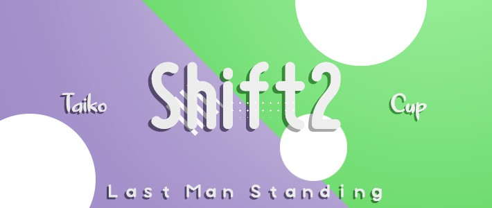

---
tags:
  - SC2
  - TLMS
  - TLMS:SC2
---

# Taiko LMS: Shift Cup 2

The **Taiko LMS: Shift Cup 2** (***TLMS:SC2***) was a worldwide 4v4 double-elimination osu!taiko tournament hosted by ![][flag_US] [Backfire](https://osu.ppy.sh/users/263110) and ![][flag_GB] [Lno](https://osu.ppy.sh/users/1900787). Teams would gather a team of 4 (with the option of 2 back-ups) in a 4-on-4 knock-out style match. This was the second installment of the Taiko Shift Cup and part of the Taiko LMS tournaments.

## Tournament schedule

| Event | Timestamp |
| --: | :-- |
| Registration phase | 2020-03-28/2020-04-18 |
| Live drawings | 2020-04-19 (23:00 UTC) |
| Group Stage | 2020-04-25/2020-04-26 |
| Round of 16 | 2020-05-02/2020-05-03 |
| Quarterfinals | 2020-05-09/2020-05-10 |
| Semifinals | 2020-05-16/2020-05-17 |
| Finals | 2020-05-23/2020-05-24 |
| Grand Finals | 2020-05-30/2020-05-31 |

## Prizes

| Placing | Prize |
| :-: | :-- |
|  | Unique profile badge for each team member |

## Organisation

The Taiko LMS: Shift Cup 2 was run by various community members.

| Position | Member(s) |
| :-- | :-- |
| Organiser | ![][flag_US] [Backfire](https://osu.ppy.sh/users/263110), ![][flag_GB] [Lno](https://osu.ppy.sh/users/1900787) |
| Map selector | ![][flag_US] [Backfire](https://osu.ppy.sh/users/263110), ![][flag_RU] [Dayzeek](https://osu.ppy.sh/users/5009970), ![][flag_GB] [Lno](https://osu.ppy.sh/users/1900787) |
| Referee | ![][flag_HK] [Akali393394](https://osu.ppy.sh/users/9686628), ![][flag_NL] [Boaz](https://osu.ppy.sh/users/13302996), ![][flag_CL] [Catulus](https://osu.ppy.sh/users/6276709), ![][flag_PL] [Deroo](https://osu.ppy.sh/users/8360475), ![][flag_SG] [Element118](https://osu.ppy.sh/users/2283992), ![][flag_US] [ITotallyGetThat](https://osu.ppy.sh/users/8770622), ![][flag_FR] [Kasumii-sama](https://osu.ppy.sh/users/6177263), ![][flag_SE] [Nurend](https://osu.ppy.sh/users/9905079) |
| Streamer | ![][flag_PL] [Deroo](https://osu.ppy.sh/users/8360475), ![][flag_SG] [Element118](https://osu.ppy.sh/users/2283992), ![][flag_US] [ITotallyGetThat](https://osu.ppy.sh/users/8770622), ![][flag_DE] [Sayira](https://osu.ppy.sh/users/7253958) |
| Commentator | ![][flag_US] [AuroraPhasmata](https://osu.ppy.sh/users/13664116), ![][flag_AU] [Beat43210](https://osu.ppy.sh/users/5664171), ![][flag_CL] [Catulus](https://osu.ppy.sh/users/6276709), ![][flag_DE] [Drecksackblase](https://osu.ppy.sh/users/6278008), ![][flag_US] [Ethaaaan](https://osu.ppy.sh/users/9536977), ![][flag_TR] [frukoyurdakul](https://osu.ppy.sh/users/7612550), ![][flag_DE] [Heam](https://osu.ppy.sh/users/4705120), ![][flag_SE] [Raphalge](https://osu.ppy.sh/users/3918650), ![][flag_AR] [Vaf](https://osu.ppy.sh/users/12589048) |
| Designer | ![][flag_FI] [Micro](https://osu.ppy.sh/users/4801080) |
| Statistician | ![][flag_FR] [Kasumii-sama](https://osu.ppy.sh/users/6177263) |
| Wiki editor | ![][flag_ID] [fajar13k](https://osu.ppy.sh/users/7100002) |

## Links

- [Discussion thread](https://osu.ppy.sh/community/forums/topics/1043063)
- [LMS Discord server](https://discord.gg/mJAF2Xa)
- [Livestream](https://twitch.tv/osutaikolive)
- [Challonge brackets](https://challonge.com/p86zgof5)
- **[Statistics sheet](https://docs.google.com/spreadsheets/d/1oFiXMH2d69WB5yXEMc7X5IsS7EASo7o3CIBWgKOJEnw/edit?usp=sharing)**

## Participants

| Team | Members |
| :-- | :-- |
| **100% taiko juice** | ![][flag_RU] **[night_flower](https://osu.ppy.sh/users/11574707)**, ![][flag_CN] [te2035](https://osu.ppy.sh/users/6294200), ![][flag_UA] [Don Omar](https://osu.ppy.sh/users/689414), ![][flag_CA] [CaesarSalad99](https://osu.ppy.sh/users/12392840), ![][flag_FR] [BananaW](https://osu.ppy.sh/users/9298106), ![][flag_CA] [beary605](https://osu.ppy.sh/users/2198070) |
| **a** | ![][flag_KR] **[BamgoeSN](https://osu.ppy.sh/users/1152851)**, ![][flag_KR] [Konpaku Sariel](https://osu.ppy.sh/users/533502), ![][flag_KR] [oL0](https://osu.ppy.sh/users/1134683), ![][flag_KR] [POCARI SWEAT](https://osu.ppy.sh/users/5082685), ![][flag_KR] [Lamery](https://osu.ppy.sh/users/4557972), ![][flag_KR] [TWIL1GHT](https://osu.ppy.sh/users/12478373) |
| **abibibubibui** | ![][flag_DE] **[frz](https://osu.ppy.sh/users/6956922)**, ![][flag_TR] [frukoyurdakul](https://osu.ppy.sh/users/7612550), ![][flag_DE] [jleste](https://osu.ppy.sh/users/8275687), ![][flag_CA] [janitore](https://osu.ppy.sh/users/3307897), ![][flag_BR] [HiroK](https://osu.ppy.sh/users/4050738), ![][flag_DE] [Xay](https://osu.ppy.sh/users/961417) |
| **cloudfag's harem** | ![][flag_RU] **[cloudfags](https://osu.ppy.sh/users/5285786)**, ![][flag_RU] [TwinT](https://osu.ppy.sh/users/9976154), ![][flag_US] [Catgirl](https://osu.ppy.sh/users/2771995), ![][flag_PL] [bernard351](https://osu.ppy.sh/users/9511518), ![][flag_PL] [pestoszx](https://osu.ppy.sh/users/12144395), ![][flag_RU] [Den4ik228](https://osu.ppy.sh/users/7115174) |
| **Dancing Pallbearers** | ![][flag_ID] **[apaajaboleh10](https://osu.ppy.sh/users/5151647)**, ![][flag_ID] [ketiduran](https://osu.ppy.sh/users/2180885), ![][flag_ID] [Aesa](https://osu.ppy.sh/users/3285867), ![][flag_ID] [Nishizumi](https://osu.ppy.sh/users/2496768), ![][flag_ID] [Naverlyn](https://osu.ppy.sh/users/14324722), ![][flag_ID] [Katdon\_donKat](https://osu.ppy.sh/users/8089664) |
| **Easter Egg** | ![][flag_FR] **[DemonWaves](https://osu.ppy.sh/users/3909293)**, ![][flag_FR] [Mokip](https://osu.ppy.sh/users/11404841), ![][flag_FR] [Chernobog](https://osu.ppy.sh/users/3317042), ![][flag_FR] [Madeline](https://osu.ppy.sh/users/2812098), ![][flag_FR] [kamaboko117](https://osu.ppy.sh/users/9508031), ![][flag_FR] [Ladybug](https://osu.ppy.sh/users/4833654) |
| **EuroGamers -Jaye** | ![][flag_IT] **[D3kuu](https://osu.ppy.sh/users/7807444)**, ![][flag_IT] [Ikkun](https://osu.ppy.sh/users/1059945), ![][flag_ES] [AlvaroYL](https://osu.ppy.sh/users/6333166), ![][flag_GB] [goheegy](https://osu.ppy.sh/users/8057655), ![][flag_DE] [Mew](https://osu.ppy.sh/users/2345156), ![][flag_PL] [CreepyDuck](https://osu.ppy.sh/users/2435013) |
| **juju on that Beat43210** | ![][flag_AU] **[Beat43210](https://osu.ppy.sh/users/5664171)**, ![][flag_US] [HoopWheat](https://osu.ppy.sh/users/12177903), ![][flag_US] [ThatTaikoGuy](https://osu.ppy.sh/users/4640844), ![][flag_US] [Obama Taichou](https://osu.ppy.sh/users/3220847), ![][flag_US] [Ethaaaan](https://osu.ppy.sh/users/9536977), ![][flag_US] [Shyguy](https://osu.ppy.sh/users/178038) |
| **loli meme patrol** | ![][flag_RU] **[Nozdormu](https://osu.ppy.sh/users/7169208)**, ![][flag_CA] [Vysha](https://osu.ppy.sh/users/4908773), ![][flag_RU] [Akonine](https://osu.ppy.sh/users/7774222), ![][flag_RU] [Voenkom](https://osu.ppy.sh/users/10168328), ![][flag_RU] [Naninub](https://osu.ppy.sh/users/8188876), ![][flag_RU] [Starger](https://osu.ppy.sh/users/3398715) |
| **Los Panas** | ![][flag_EC] **[Gamelan4](https://osu.ppy.sh/users/9856910)**, ![][flag_CL] [Ulqui](https://osu.ppy.sh/users/1263669), ![][flag_BR] [Skull Kid](https://osu.ppy.sh/users/3044264), ![][flag_BR] [Coryn](https://osu.ppy.sh/users/2828556), ![][flag_BR] [Foxeru](https://osu.ppy.sh/users/7479684), ![][flag_BR] [Kyoumo](https://osu.ppy.sh/users/8145223) |
| **null** | ![][flag_JP] **[gekiowata](https://osu.ppy.sh/users/8929896)**, ![][flag_JP] [izu_illya](https://osu.ppy.sh/users/12155303), ![][flag_JP] [4sbet1](https://osu.ppy.sh/users/11563671), ![][flag_JP] [nuzojon](https://osu.ppy.sh/users/9773629), ![][flag_JP] [4mehibiki](https://osu.ppy.sh/users/10489413), ![][flag_JP] [Quantom_osu](https://osu.ppy.sh/users/7935131) |
| **Pokochin Brothers** | ![][flag_JP] **[Yoroiari](https://osu.ppy.sh/users/6056862)**, ![][flag_JP] [tamakagi2000](https://osu.ppy.sh/users/9540073), ![][flag_JP] [nyanmi-1828](https://osu.ppy.sh/users/6866480), ![][flag_JP] [Maeda](https://osu.ppy.sh/users/12615278), ![][flag_JP] [Maimaing](https://osu.ppy.sh/users/14520910), ![][flag_JP] [KuroKuroKuro](https://osu.ppy.sh/users/11931563) |
| **Remii and the E-Girls** | ![][flag_AU] **[dad come back](https://osu.ppy.sh/users/4691373)**, ![][flag_AU] [Tsubasa2](https://osu.ppy.sh/users/6835183), ![][flag_AU] [r1chyy](https://osu.ppy.sh/users/11499467), ![][flag_AU] [acid](https://osu.ppy.sh/users/2913584) |
| **RJ is a furry** | ![][flag_US] **[cheese salad](https://osu.ppy.sh/users/6349821)**, ![][flag_US] [R J](https://osu.ppy.sh/users/6490509), ![][flag_US] [Whulf](https://osu.ppy.sh/users/11601107), ![][flag_US] [Loopy542](https://osu.ppy.sh/users/5468461), ![][flag_US] [ChurroChef](https://osu.ppy.sh/users/9258564), ![][flag_US] [AuroraPhasmata](https://osu.ppy.sh/users/13664116) |
| **Syria** | ![][flag_DE] **[Drecksackblase](https://osu.ppy.sh/users/6278008)**, ![][flag_US] [quickvik](https://osu.ppy.sh/users/4410873), ![][flag_US] [3san](https://osu.ppy.sh/users/8050850), ![][flag_US] [giyokon](https://osu.ppy.sh/users/10852632), ![][flag_AR] [BossPlays](https://osu.ppy.sh/users/7341471), ![][flag_TW] [X a v y](https://osu.ppy.sh/users/3738344) |
| **the bros 3** | ![][flag_GR] **[Genjuro](https://osu.ppy.sh/users/3196091)**, ![][flag_US] [closed](https://osu.ppy.sh/users/5116922), ![][flag_BR] [Kqrth](https://osu.ppy.sh/users/4115718), ![][flag_DE] [i like trap](https://osu.ppy.sh/users/3624499), ![][flag_GB] [Horiizon](https://osu.ppy.sh/users/14513386) |
| **United Kingdom B** | ![][flag_GB] **[Metzo](https://osu.ppy.sh/users/10633982)**, ![][flag_GB] [Teezel](https://osu.ppy.sh/users/7528639), ![][flag_GB] [Daniels](https://osu.ppy.sh/users/12439209), ![][flag_GB] [Moonwake](https://osu.ppy.sh/users/6657019), ![][flag_GB] [hammygames](https://osu.ppy.sh/users/12232503), ![][flag_GB] [\_DUSK\_](https://osu.ppy.sh/users/6092181) |
| **Where is JDrago1-13?** | ![][flag_SE] **[Raphalge](https://osu.ppy.sh/users/3918650)**, ![][flag_KR] [Peaceful](https://osu.ppy.sh/users/165027), ![][flag_US] [JDrago14](https://osu.ppy.sh/users/7690078), ![][flag_IT] [coed](https://osu.ppy.sh/users/3716665), ![][flag_VE] [Colorojo12](https://osu.ppy.sh/users/5136821), ![][flag_IT] [LordEnder](https://osu.ppy.sh/users/4609767) |
| **Windjammers** | ![][flag_DE] **[Sayira](https://osu.ppy.sh/users/7253958)**, ![][flag_DE] [\[TaikoTori\]](https://osu.ppy.sh/users/1074143), ![][flag_DE] [Ak1o](https://osu.ppy.sh/users/1600041), ![][flag_DE] [Mikalodo](https://osu.ppy.sh/users/8498207), ![][flag_DE] [QEpicAce](https://osu.ppy.sh/users/9489153), ![][flag_DE] [Zetera](https://osu.ppy.sh/users/587737) |
| **Yona and the Macacos** | ![][flag_BR] **[Mikudayo](https://osu.ppy.sh/users/5235718)**, ![][flag_FR] [Yona](https://osu.ppy.sh/users/7930622), ![][flag_BR] [Berg](https://osu.ppy.sh/users/8097465), ![][flag_IT] [A-40](https://osu.ppy.sh/users/14510301), ![][flag_ES] [LZD](https://osu.ppy.sh/users/224335), ![][flag_BR] [Lazarento](https://osu.ppy.sh/users/3224958) |
| **ヴぇ** | ![][flag_JP] **[Six b0xes](https://osu.ppy.sh/users/8303357)**, ![][flag_JP] [syaron105](https://osu.ppy.sh/users/8741695), ![][flag_JP] [miki308](https://osu.ppy.sh/users/7632508), ![][flag_JP] [kvgyubh](https://osu.ppy.sh/users/8244404), ![][flag_JP] [konohahakase](https://osu.ppy.sh/users/11325757), ![][flag_JP] [remiria3150](https://osu.ppy.sh/users/4376346) |

## Groups

| Group | Top seed | High seed | Mid seed | Low seed |
| :-: | :-- | :-- | :-- | :-- |
| **Group 1** | ヴぇ | a | Syria | Easter Egg |
| **Group 2** | Where is JDrago1-13? | Pokochin Brothers | 100% taiko juice | the bros 3 |
| **Group 3** | Dancing Pallbearers | Los Panas | Yona and the Macacos | United Kingdom B |
| **Group 4** | null | abibibubibui | RJ is a furry | cloudfag's harem |
| **Group 5** | EuroGamers -Jaye | loli meme patrol | juju on that Beat43210 | Windjammers, Remii and the E-Girls |

## Podium

This competition has come to an end and resulted in the following podium:

| Placing | Team |
| :-- | :-- |
|  | **Where is JDrago1-13?** (![][flag_SE] [Raphalge](https://osu.ppy.sh/users/3918650), ![][flag_KR] [Peaceful](https://osu.ppy.sh/users/165027), ![][flag_US] [JDrago14](https://osu.ppy.sh/users/7690078), ![][flag_IT] [coed](https://osu.ppy.sh/users/3716665), ![][flag_VE] [Colorojo12](https://osu.ppy.sh/users/5136821), ![][flag_IT] [LordEnder](https://osu.ppy.sh/users/4609767)) |
|  | **abibibubibui** (![][flag_DE] [frz](https://osu.ppy.sh/users/6956922), ![][flag_TR] [frukoyurdakul](https://osu.ppy.sh/users/7612550), ![][flag_DE] [jleste](https://osu.ppy.sh/users/8275687), ![][flag_CA] [janitore](https://osu.ppy.sh/users/3307897), ![][flag_BR] [HiroK](https://osu.ppy.sh/users/4050738), ![][flag_DE] [Xay](https://osu.ppy.sh/users/961417)) |
|  | **EuroGamers -Jaye** (![][flag_IT] [D3kuu](https://osu.ppy.sh/users/7807444), ![][flag_IT] [Ikkun](https://osu.ppy.sh/users/1059945), ![][flag_ES] [AlvaroYL](https://osu.ppy.sh/users/6333166), ![][flag_GB] [goheegy](https://osu.ppy.sh/users/8057655), ![][flag_DE] [Mew](https://osu.ppy.sh/users/2345156), ![][flag_PL] [CreepyDuck](https://osu.ppy.sh/users/2435013)) |

## Mappools

### Grand Finals

- NoMod
  - [TryHardNinja feat. CaptainSparklez - Revenge (ReeK's "Dude, What's A Genre?" Remix) (yuzu\_\_rinrin) \[YZYN Wars\]](https://osu.ppy.sh/beatmapsets/1162156#taiko/2424392)
  - [Cement Tea - Hikari (yvk1n0 Remix) (applerss) \[Loss of sight\]](https://osu.ppy.sh/beatmapsets/1161346#taiko/2422862)
  - [tofubeats - CAND\\\LAND feat LIZ - Pa'slam system Remix(kawaii amen girl bootleg) (\_Kan2) \[Inner Oni\]](https://osu.ppy.sh/beatmapsets/1156597#taiko/2413578)
- Hidden
  - [Airuei - Framework (Nwolf) \[Wired Oni\]](https://osu.ppy.sh/beatmapsets/1152903#taiko/2406326)
  - [PROTODOME - Excuuuuuuuse Me, Princess (Princess Zelda's Rescue) (karterfreak) \[Oni\]](https://osu.ppy.sh/beatmapsets/822044#taiko/1722921)
  - [Fukenkouseijin - Marunouchi Amenpunk (Cure) \[Nerf\]](https://osu.ppy.sh/beatmapsets/1170133#taiko/2441070)
- HardRock
  - [tobato - Digital(ooooooop) Tattoo (7\_7) \[Taiko(oooooooo)\]](https://osu.ppy.sh/beatmapsets/921770#taiko/1924891)
  - [KEMOMIMI EDM SQUAD - XDUBSTEPX (maguro869) \[Superior Collab\]](https://osu.ppy.sh/beatmapsets/1125612#taiko/2351867)
  - [Slaughter to Prevail - Hell (yea) \[Armageddon\]](https://osu.ppy.sh/beatmapsets/766730#taiko/1611775)
- DoubleTime
  - [positive MAD-crew - Mynarco Addiction (hikikochan) \[Memory\]](https://osu.ppy.sh/beatmapsets/454210#taiko/973848)
  - [kors k - Monkey Business (uone) \[Inner Oni (0.85\~0.75)\]](https://osu.ppy.sh/beatmapsets/712368#taiko/1506159)
  - [Lamb of God - Laid to Rest (frukoyurdakul) \[Inner Oni\]](https://osu.ppy.sh/beatmapsets/678365#taiko/1434384)
- FreeMod
  - [Katagiri - Vocaloid wa Omaenokoto Kirai 2 (applerss) \[Confusing\]](https://osu.ppy.sh/beatmapsets/1068037#taiko/2236034)
  - [Hommarju - Dr. Chemical & Killing Machine (roufou) \[Hell Oni\]](https://osu.ppy.sh/beatmapsets/991727#taiko/2074063)
  - [Cyte - TOUHOH Frequency modulation syntheless (Socus) \[superultraextremenoguardfullpowerfuckingtjbcretiredstyle\]](https://osu.ppy.sh/beatmapsets/1025343#taiko/2144562)
- Extra
  - [Camellia feat. Nanahira - Ska-sh All Neurons!! (katacheh) \[Ska-sh Taiko!!\]](https://osu.ppy.sh/beatmapsets/1120800#taiko/2341897)
  - [Frums - Turnstile Jumper (maziari1105) \[Over Speed\]](https://osu.ppy.sh/beatmapsets/990672#taiko/2072124)
  - [Stellabee - Wanderlustism (uncut edit) (-Kazu-) \[banger\]](https://osu.ppy.sh/beatmapsets/1111814#taiko/2322943)
- Tiebreaker
  - **[sabi - ban ge fuse (applerss) \[bang\]](https://osu.ppy.sh/beatmapsets/1098800#taiko/2295665)**

### Finals

- NoMod
  - [AVERSIONS CROWN - Erebus (Astolfo) \[Oblivion Nightmare\]](https://osu.ppy.sh/beatmapsets/622565#taiko/1312427)
  - [Lazhward - Do Not Play WIXOSS (applerss) \[Pause\]](https://osu.ppy.sh/beatmapsets/1126776#taiko/2354213)
  - [Culprate & Dictate - Pencilina (KyouRekii87) \[Taiko-K\]](https://osu.ppy.sh/beatmapsets/1097657#taiko/2293563)
- Hidden
  - [Se-U-Ra - LOSHAXI (origin) (Nifty) \[Inner Oni\]](https://osu.ppy.sh/beatmapsets/1103611#taiko/2305553)
  - [DJ Genki - ATARAX1A (Ceryuia) \[Inner Oni\]](https://osu.ppy.sh/beatmapsets/1091305#taiko/2281436)
  - [Project B- - Tyouseisyounen no tame no Tyoutasai na Tyoukotennteki Tyoubukyoku (Lno) \[Ura Oni\]](https://osu.ppy.sh/beatmapsets/810930#taiko/1701242)
- HardRock
  - [sakuraburst - dragonlands (Faputa) \[Ura Oni\]](https://osu.ppy.sh/beatmapsets/935765#taiko/1954961)
  - [Shusaku Uchiyama - Tofu Survivor Theme (giyokon) \[Hellish Delight\]](https://osu.ppy.sh/beatmapsets/1165330#taiko/2430479)
  - [Rahatt - Mafijas Breakcore (Genjuro) \[Ulqui's Hell Oni\]](https://osu.ppy.sh/beatmapsets/1164471#taiko/2430214)
- DoubleTime
  - [paraoka feat.Acme Iku - Chaosmaid (nyanmi-1828) \[Inner Oni\]](https://osu.ppy.sh/beatmapsets/588244#taiko/1245404)
  - [rerulili feat MIKU & GUMI - Disturb Manic Girl (Felt7z) \[Collab\]](https://osu.ppy.sh/beatmapsets/712086#taiko/1505385)
  - [Hoshii Miki & Ibuki Tsubasa & Julia & Kitakami Reika - Marionette ha nemuranai(Game size) (Lze) \[Oni(low SV)\]](https://osu.ppy.sh/beatmapsets/739100#taiko/1559699)
- FreeMod
  - [7\_7 - ?\_? (7\_7) \[?\_?\]](https://osu.ppy.sh/beatmapsets/1163967#taiko/2428157)
  - [t+pazolite - You are the Miserable (FiNNb) \[Master Oni\]](https://osu.ppy.sh/beatmapsets/947105#taiko/2252523)
  - [SOUND HOLIC feat. Nana Takahashi - EVANESCENT (roufou) \[Hell Oni\]](https://osu.ppy.sh/beatmapsets/1160196#taiko/2423422)
- Extra
  - [t+pazolite feat. Nanahira - Ukakuf Kins (katacheh) \[Tomorrow\]](https://osu.ppy.sh/beatmapsets/961953#taiko/2014222)
  - [Kobaryo - Carrionoid Amile (2014 Remix) (tasuke912) \[Undefined\]](https://osu.ppy.sh/beatmapsets/444066#taiko/953998)
  - [Gynx - P\*NIS REMIX (7\_7) \[ANNOYING SV\]](https://osu.ppy.sh/beatmapsets/1132422#taiko/2398932)
- Tiebreaker
  - **[Kopophobia & Ajataa - Starfall (Nwolf) \[WereOni\]](https://osu.ppy.sh/beatmapsets/1043714#taiko/2182088)**

### Semifinals

- NoMod
  - [Katagiri feat. Hanacco - Kahen reishiki zettai kyomei hakai kosen (HiroK) \[Resonance\]](https://osu.ppy.sh/beatmapsets/957806#taiko/2005234)
  - [Sakuzyo - PANDORA PARADOXXX (Clerne) \[Inner Oni\]](https://osu.ppy.sh/beatmapsets/995146#taiko/2081623)
  - [Rissyuu feat.Choko - Punai Punai Gensou \~Punai Punai in Wonderland\~ (KitajimaYN) \[7oni\]](https://osu.ppy.sh/beatmapsets/1048939#taiko/2196403)
- Hidden
  - [Lon x Chroma - Wakaranai (Raphalge) \[what\]](https://osu.ppy.sh/beatmapsets/878927#taiko/1838135)
  - [tarolabo - Miko (Genjuro) \[Hell Oni\]](https://osu.ppy.sh/beatmapsets/1100379#taiko/2298926)
  - [Terminal 11 - Sparkle Downer (Xay) \[Sparkle Doni\]](https://osu.ppy.sh/beatmapsets/1128293#taiko/2357293)
- HardRock
  - [Cyte - Command Prompt (Idealism) \[C:\Program Files\Difficulties\434f525255505445442046494c45.exe\]](https://osu.ppy.sh/beatmapsets/1068145#taiko/2236237)
  - [The Flashbulb - Creep (Greenshell) \[Nyctophobia\]](https://osu.ppy.sh/beatmapsets/966087#taiko/2100987)
  - [Igorrr - Cheval (yopohapan) \[Gallop\]](https://osu.ppy.sh/beatmapsets/656130#taiko/1390258)
- DoubleTime
  - [FAKE TYPE. - FAKE STYLE II (Nofool) \[Inner Oni\]](https://osu.ppy.sh/beatmapsets/832516#taiko/1744082)
  - [LiSA - crossing field (gaston\_2199) \[Inner Oni\]](https://osu.ppy.sh/beatmapsets/679269#taiko/1436180)
  - [RADWIMPS - Zen Zen Zense (movie ver.) (Skull Kid) \[Oni\]](https://osu.ppy.sh/beatmapsets/603944#taiko/1275904)
- FreeMod
  - [PerdoVanse - eu quero (HiroK) \[Sopa de Macaco\]](https://osu.ppy.sh/beatmapsets/801697#taiko/1682736)
  - [S3RL - Addict (DJKurara Remix) (yea) \[Relapse Oni\]](https://osu.ppy.sh/beatmapsets/938609#taiko/1960721)
  - [The Flashbulb - Amen Iraq (Volta) \[Fatal Oni\]](https://osu.ppy.sh/beatmapsets/966277#taiko/2022565)
- Extra
  - [katagiri - planet of the kemomimi loli (Backfire) \[Taikoclysm (ft. Legless)\]](https://osu.ppy.sh/beatmapsets/904052#taiko/1887234)
  - [Hoshino Ongaku Koubou - pique (kei821) \[Inner Oni\]](https://osu.ppy.sh/beatmapsets/1116673#taiko/2332764)
  - [Rings of Saturn - Eviscerate (Xay) \[Oniscerate\]](https://osu.ppy.sh/beatmapsets/477477#taiko/1621260)
- Tiebreaker
  - **[Billain & Vorso - Transhumanist (Kamuy) \[fapu's synthesis\]](https://osu.ppy.sh/beatmapsets/1069426#taiko/2246635)**

### Quarterfinals

**[Download the mappack here! (94 MB)](https://www.mediafire.com/file/xbnjhpi0h70yilv/mappool_ro8.rar/file)**

- NoMod
  - [Slax - Cutening (hoku-4625) \[7\_7 & hoku's YAHOO! ^-^\]](https://osu.ppy.sh/beatmapsets/817170#taiko/1713521)
  - [Hino Isuka + Umeboshi Chazuke - Ultra Happy Miracle Bazoooooka!! (asuasu\_yura) \[Solo's Bazooka!!\]](https://osu.ppy.sh/beatmapsets/690719#taiko/1463236)
  - [Ice - iL (seanhappy8520) \[CHAOS 13\]](https://osu.ppy.sh/beatmapsets/1020596#taiko/2138041)
- Hidden
  - [sak respect for Arata Iiyoshi - Reason of being (D o t) \[Ura Oni\]](https://osu.ppy.sh/beatmapsets/809965#taiko/1699509)
  - [Camellia - Diastrophism (rubies87) \[HiroK's Inner Oni\]](https://osu.ppy.sh/beatmapsets/1067161#taiko/2245964)
  - [M2U x NICODE - LUNE - Chiptune & Music Box Arrange Ver. (uone) \[Oni\]](https://osu.ppy.sh/beatmapsets/607963#taiko/1971980)
- HardRock
  - [penoreri - Preserved Valkyria (Nardoxyribonucleic) \[Valkyrie Oni\]](https://osu.ppy.sh/beatmapsets/861177#taiko/1801687)
  - [Katagiri - Breakin' Asia (Lix\_0101) \[OiOi Oni\]](https://osu.ppy.sh/beatmapsets/919130#taiko/1919198)
  - [Seiryu - AO-0 [prototype] (CrowWhite) \[Stasis\]](https://osu.ppy.sh/beatmapsets/1088570#taiko/2278332)
- DoubleTime
  - [Aihara Kaori - Shiro-Neko Caramel Mugen no Wataame (Felt7z) \[Chronicle\]](https://osu.ppy.sh/beatmapsets/813509#taiko/1706121)
  - [nameless - SLoWMoTIoN (Marfuri) \[SLoW oNI\]](https://osu.ppy.sh/beatmapsets/834799#taiko/1748618)
  - [onoken - Amnolys (uone) \[Oni\]](https://osu.ppy.sh/beatmapsets/736516#taiko/1554433)
- FreeMod
  - [MIssionary - Song of Sin (Skull Kid) \[Sinful Melody\]](https://osu.ppy.sh/beatmapsets/1045880#taiko/2186408)
  - [s-don vs. Hinoisuka - Trrricksters!! (EdamaMe411) \[Trrricksters!!\]](https://osu.ppy.sh/beatmapsets/1122277#taiko/2345156)
  - [Camellia - Gene Disruption (XeoStyle) \[Arrival's Disrupting Oni\]](https://osu.ppy.sh/beatmapsets/555326#taiko/1203227)
- Extra
  - [sakuzyo - StrayedCatz (D o t) \[.'s Taiko\]](https://osu.ppy.sh/beatmapsets/772767#taiko/1624338)
  - [Kobaryo - Eternal Ending (kyou1110 Remix) (-Kazu-) \[Inner Oni\]](https://osu.ppy.sh/beatmapsets/773639#taiko/1626234)
  - [Matra Magic - Off Tha Heezie (Jaye) \[Nov 29\]](https://osu.ppy.sh/beatmapsets/591055#taiko/1250899)
- Tiebreaker
  - **[ulko - REGGAETON BUT IT HAS AMEN BREAKS (D3kuu) \[TATSUJIN\]](https://osu.ppy.sh/beatmapsets/1013247#taiko/2120869)**

### Round of 16

**[Download the mappack here! (90 MB)](https://www.mediafire.com/file/o015yntwe0hm414/mappool.rar/file)**

- NoMod
  - [BUTAOTOME - In the Black (Nwolf) \[Inner Oni\]](https://osu.ppy.sh/beatmapsets/1068835#taiko/2237598)
  - [BEMANI Sound Team "Sota Fujimori" - OZONE (Cychloryn) \[Inner Oni\]](https://osu.ppy.sh/beatmapsets/1131154#taiko/2362744)
  - [chelmico - Easy Breezy feat Zenpaku (dj-Jo Remix) (D3kuu) \[Breeze\]](https://osu.ppy.sh/beatmapsets/1122895#taiko/2346527)
- Hidden
  - [be5moti - Trahison (houraizin) \[Inner Oni\]](https://osu.ppy.sh/beatmapsets/833305#taiko/1745532)
  - [James Landino & Kabuki - Birdsong (Nifty) \[Cygnet\]](https://osu.ppy.sh/beatmapsets/1010367#taiko/2115020)
  - [Hyphen - ^/7(L|?\[\_(L+#\<\>+&|^(o) (\[Zeth\]) \[Faceless\]](https://osu.ppy.sh/beatmapsets/732250#taiko/1545035)
- HardRock
  - [dj TAKA meets DJ YOSHITAKA ft.guit.good-cool - Elemental Creation -GITADO ROCK ver.- (frukoyurdakul) \[Inner Oni\]](https://osu.ppy.sh/beatmapsets/690344#taiko/1461118)
  - [NayutalieN - Alien Alien (Nhato Remix) (Rhytoly) \[Alien\]](https://osu.ppy.sh/beatmapsets/904873#taiko/1888713)
  - [P\*Light - Storm Buster (Arrival) \[Inner Oni\]](https://osu.ppy.sh/beatmapsets/620268#taiko/1307259)
- DoubleTime
  - [Half Polish - Hej Sokoly (Volta) \[Oni\]](https://osu.ppy.sh/beatmapsets/1051396#taiko/2205036)
  - [Porno Graffiti - The Day feat. Aruvn (dj-Jo Remix) Extended Version (Chromoxx) \[Sur's Oni\]](https://osu.ppy.sh/beatmapsets/693174#taiko/1473833)
  - [Diao Ye Zong feat. Kushi - Yuumeikyou o Wakatsu Koto (strickluke) \[Oni\]](https://osu.ppy.sh/beatmapsets/743089#taiko/1567153)
- FreeMod
  - [TANO\*C Sound Team - BATTLE NO.1 (tamakagi2000) \[Ron's Inner Oni\]](https://osu.ppy.sh/beatmapsets/1080359#taiko/2335813)
  - [Nanawo Akari - Instant Heaven feat.Eve (Jerry) \[Inner Oni\]](https://osu.ppy.sh/beatmapsets/810190#taiko/1699932)
  - [Toby Fox - THE WORLD REVOLVING (Vulkin) \[ANCEL'S FINAL CHAOS\]](https://osu.ppy.sh/beatmapsets/873084#taiko/1829927)
- Extra
  - [eicaTV vs kanone - MG277 (m1kado) \[Taiko\]](https://osu.ppy.sh/beatmapsets/724157#taiko/1529084)
  - [Minami Yuni - Kanagawa Cyber Culvert (ekumea1123) \[tasuke's Upheaval\]](https://osu.ppy.sh/beatmapsets/898783#taiko/1877558)
  - [toby fox - Ruins (sasakure.UK Remix) (eae) \[Golden Flowers\]](https://osu.ppy.sh/beatmapsets/790685#taiko/1659016)
- Tiebreaker
  - **[Dustvoxx - Disconnect Me (from saturator) (pavlukivan) \[Oni (from remus)\]](https://osu.ppy.sh/beatmapsets/1118559#taiko/2381796)**

### Group Stage

**[Download the mappack here! (133 MB)](https://www.dropbox.com/s/tfuiej2yios9rfi/Shift%20Cup%20Group%20Stage%20Mappack.rar?dl=1)**

- NoMod
  - [Chroma - \[@\_\_@\] (Faputa) \[Inner Oni\]](https://osu.ppy.sh/beatmapsets/1048153#taiko/2190876)
  - [t+pazolite vs P\*Light - IZANA (Yuemiao) \[INNER ONI\]](https://osu.ppy.sh/beatmapsets/1100797#taiko/2299870)
  - [Srav3R - Do You Love Me feat. Shizaki yuki (KTYN) \[Falling Love\]](https://osu.ppy.sh/beatmapsets/1124812#taiko/2350312)
- Hidden
  - [Camellia feat. Nanahira - Amor De Verao (Tofu1222) \[Inner Oni\]](https://osu.ppy.sh/beatmapsets/746316#taiko/1573005)
  - [sky_delta - Crepuscular rays (\_DUSK\_) \[Inner Oni\]](https://osu.ppy.sh/beatmapsets/1078522#taiko/2256714)
  - [HyuN - The Apocalypse (Capu) \[Inner Oni\]](https://osu.ppy.sh/beatmapsets/1075603#taiko/2266446)
- HardRock
  - [Cranky - Liberame (Nofool) \[Inner Oni\]](https://osu.ppy.sh/beatmapsets/981301#taiko/2053550)
  - [Equilibrium - Rise Again (LZD) \[Inner Oni\]](https://osu.ppy.sh/beatmapsets/645370#taiko/1367601)
  - [Lime - Renai Syndrome (Lime717) \[Lime\]](https://osu.ppy.sh/beatmapsets/1012988#taiko/2120373)
- DoubleTime
  - [Shiro (CV: Ai Kayano) - Oracion (Nao Tomori) \[Collab Oni\]](https://osu.ppy.sh/beatmapsets/705955#taiko/1494227)
  - [FELT - Feel The Flow (ReySHeL) \[Oni\]](https://osu.ppy.sh/beatmapsets/107346#taiko/281402)
  - [Fatal Force & Crusher P - Wildfire (Kin) \[PyrOni\]](https://osu.ppy.sh/beatmapsets/348660#taiko/992595)
- FreeMod
  - [kamome sano - archive::zip (ekumea1123) \[inner::oni\]](https://osu.ppy.sh/beatmapsets/860544#taiko/1800462)
  - [PSYQUI - Still In My Heart (Ft. Puniden) (hoku) \[With you ^-^\]](https://osu.ppy.sh/beatmapsets/959055#taiko/2007890)
  - [Dormir - Cookie Bouquets (goheegy) \[Oni\]](https://osu.ppy.sh/beatmapsets/992797#taiko/2076171)
- Extra
  - [ginkiha - Shadow Castle (Ak1o) \[QEA's Chateau Noire\]](https://osu.ppy.sh/beatmapsets/1124807#taiko/2350304)
  - [Kikuohana - Desert Theater (Alchyr) \[Withered\]](https://osu.ppy.sh/beatmapsets/955835#taiko/1996725)
  - [Silentroom - Nhelv (namaniku) \[Inner Oni\]](https://osu.ppy.sh/beatmapsets/684795#taiko/1449249)
- Tiebreaker
  - **[Zekk & SANY-ON - Amazing Sampling Showcase (Mew) \[Mew's Taiko\]](https://osu.ppy.sh/beatmapsets/1134079#taiko/2368384)**

## Match results

### Grand Finals

Saturday, 30 May 2020:

| Team 1 |  |  | Team 2 | Match link |
| --: | :-: | :-: | :-- | :-- |
| **abibibubibui** | **7** | 5 | EuroGamers -Jaye | [#1](https://osu.ppy.sh/community/matches/62304272) |

Sunday, 31 May 2020:

| Team 1 |  |  | Team 2 | Match link |
| --: | :-: | :-: | :-- | :-- |
| abibibubibui | 0 | **7** | **Where is JDrago1-13?** | [#1](https://osu.ppy.sh/community/matches/62337927) |

### Finals

Saturday, 23 May 2020:

| Team 1 |  |  | Team 2 | Match link |
| --: | :-: | :-: | :-- | :-- |
| null | 0 | **7** | **abibibubibui** | [#1](https://osu.ppy.sh/community/matches/62006826) |
| ヴぇ | 6 | **7** | **Dancing Pallbearers** | [#1](https://osu.ppy.sh/community/matches/62005150) |
| **Where is JDrago1-13?** | **7** | 5 | EuroGamers -Jaye | [#1](https://osu.ppy.sh/community/matches/62008973) |

Sunday, 24 May 2020:

| Team 1 |  |  | Team 2 | Match link |
| --: | :-: | :-: | :-- | :-- |
| Dancing Pallbearers | -1 | **0** | **abibibubibui** | *win by default* |

### Semifinals

Saturday, 16 May 2020:

| Team 1 |  |  | Team 2 | Match link |
| --: | :-: | :-: | :-- | :-- |
| **null** | **6** | 4 | Pokochin Brothers | [#1](https://osu.ppy.sh/community/matches/61718086) |
| Dancing Pallbearers | 1 | **6** | **Where is JDrago1-13?** | [#1](https://osu.ppy.sh/community/matches/61739041) |
| **RJ is a Furry** | **0** | -1 | a | *win by default* |
| **EuroGamers -Jaye** | **6** | 1 | abibibubibui | [#1](https://osu.ppy.sh/community/matches/61742768) |
| Juju on that Beat43210 | 0 | **6** | **Los Panas** | [#1](https://osu.ppy.sh/community/matches/61756651) |

Sunday, 17 May 2020:

| Team 1 |  |  | Team 2 | Match link |
| --: | :-: | :-: | :-- | :-- |
| Yona and the Macacos | 0 | **6** | **ヴぇ** | [#1](https://osu.ppy.sh/community/matches/61771747) |
| **null** | **6** | 2 | RJ is a Furry | [#1](https://osu.ppy.sh/community/matches/61775752) |
| **ヴぇ** | **6** | 3 | Los Panas | [#1](https://osu.ppy.sh/community/matches/61778566) |

### Quarterfinals

Saturday, 9 May 2020:

| Team 1 |  |  | Team 2 | Match link |
| --: | :-: | :-: | :-- | :-- |
| **Dancing Pallbearers** | **6** | 1 | a | [#1](https://osu.ppy.sh/community/matches/61438871) |
| ヴぇ | 2 | **6** | **abibibubibui** | [#1](https://osu.ppy.sh/community/matches/61455524) |
| Los Panas | 0 | **6** | **EuroGamers -Jaye** | [#1](https://osu.ppy.sh/community/matches/61462754) |
| **RJ is a Furry** | **0** | -1 | 100% Taiko Juice | *win by default* |
| Syria | 3 | **6** | **juju on that Beat43210** | [#1](https://osu.ppy.sh/community/matches/61464071) |

Sunday, 10 May 2020:

| Team 1 |  |  | Team 2 | Match link |
| --: | :-: | :-: | :-- | :-- |
| Pokochin Brothers | 0 | **6** | **Where is JDrago1-13?** | [#1](https://osu.ppy.sh/community/matches/61492417) |
| loli meme patrol | 3 | **6** | **null** | [#1](https://osu.ppy.sh/community/matches/61495342) |
| Windjammers | 5 | **6** | **Yona and the Macacos** | [#1](https://osu.ppy.sh/community/matches/61495784) |

### Round of 16

Saturday, 2 May 2020:

| Team 1 |  |  | Team 2 | Match link |
| --: | :-: | :-: | :-- | :-- |
| juju on that Beat43210 | 0 | **5** | **Where is JDrago1-13?** | [#1](https://osu.ppy.sh/community/matches/61149567) |
| loli meme patrol | 3 | **5** | **Los Panas** | [#1](https://osu.ppy.sh/community/matches/61178931) |
| 100% taiko juice | -1 | **0** | **abibibubibui** | *win by default* |
| Syria | 1 | **5** | **Pokochin Brothers** | [#1](https://osu.ppy.sh/community/matches/61189814) |

Sunday, 3 May 2020:

| Team 1 |  |  | Team 2 | Match link |
| --: | :-: | :-: | :-- | :-- |
| null | 0 | **5** | **EuroGamers -Jaye** | [#1](https://osu.ppy.sh/community/matches/61204371) |
| Yona and the Macacos | 2 | **5** | **a** | [#1](https://osu.ppy.sh/community/matches/61209023) |
| Windjammers | 2 | **5** | **Dancing Pallbearers** | [#1](https://osu.ppy.sh/community/matches/61208921) |
| RJ is a Furry | 0 | **5** | **ヴぇ** | [#1](https://osu.ppy.sh/community/matches/61211480) |

### Group Stage

Saturday, 25 April 2020:

| Team 1 |  |  | Team 2 | Match link |
| --: | :-: | :-: | :-- | :-- |
| **ヴぇ** | **5** | 1 | Syria | [#1](https://osu.ppy.sh/community/matches/60852134) |
| **Where is JDrago1-13?** | **5** | 1 | the bros 3 | [#1](https://osu.ppy.sh/community/matches/60853621) |
| Syria | 3 | **5** | **a** | [#1](https://osu.ppy.sh/community/matches/60861248) |
| **Dancing Pallbearers** | **5** | 0 | Yona and the Macacos | [#1](https://osu.ppy.sh/community/matches/60864715) |
| **ヴぇ** | **5** | 0 | Easter Egg | [#1](https://osu.ppy.sh/community/matches/60866314) |
| **Where is JDrago1-13?** | **5** | 0 | 100% taiko juice | [#1](https://osu.ppy.sh/community/matches/60873668) |
| **EuroGamers -Jaye** | **5** | 1 | juju on that Beat | [#1](https://osu.ppy.sh/community/matches/60876142), [#2](https://osu.ppy.sh/community/matches/60877433) |
| juju on that Beat | 3 | **5** | **fine lady meme patrol** | [#1](https://osu.ppy.sh/community/matches/60878892), [#2](https://osu.ppy.sh/community/matches/60881834) |
| RJ is a furry | 1 | **5** | **abibibubibui** | [#1](https://osu.ppy.sh/community/matches/60881421) |
| **RJ is a furry** | **5** | 0 | cloudfag's harem | [#1](https://osu.ppy.sh/community/matches/60883450) |
| **EuroGamers -Jaye** | **5** | 2 | Windjammers | [#1](https://osu.ppy.sh/community/matches/60880959) |
| **EuroGamers -Jaye** | **5** | 0 | fine lady meme patrol | [#1](https://osu.ppy.sh/community/matches/60883942) |
| **100% taiko juice** | **5** | 4 | the bros 3 | [#1](https://osu.ppy.sh/community/matches/60880931) |
| **Syria** | **5** | 0 | Easter Egg | [#1](https://osu.ppy.sh/community/matches/60886742) |
| Yona and the Macacos | 1 | **5** | **Los Panas** | [#1](https://osu.ppy.sh/community/matches/60889015) |
| null | 4 | **5** | **RJ is a Furry** | [#1](https://osu.ppy.sh/community/matches/60895385) |

Sunday, 26 April 2020:

| Team 1 |  |  | Team 2 | Match link |
| --: | :-: | :-: | :-- | :-- |
| Dancing Pallbearers | 3 | **5** | **Los Panas** | [#1](https://osu.ppy.sh/community/matches/60897781) |
| Remii and the E-Girls | 1 | **5** | **fine lady meme patrol** | [#1](https://osu.ppy.sh/community/matches/60908652) |
| **Dancing Pallbearers** | **5** | 0 | United Kingdom B | [#1](https://osu.ppy.sh/community/matches/60909909) |
| **Windjammers** | **5** | 0 | Remii and the E-Girls | [#1](https://osu.ppy.sh/community/matches/60910217) |
| the bros 3 | 0 | **5** | **Pokochin Brothers** | [#1](https://osu.ppy.sh/community/matches/60910638) |
| **null** | **5** | 1 | cloudfag's harem | [#1](https://osu.ppy.sh/community/matches/60910150) |
| **EuroGamers -Jaye** | **5** | 0 | Remii and the E-Girls | [#1](https://osu.ppy.sh/community/matches/60911549) |
| Easter Egg | 0 | **5** | **a** | [#1](https://osu.ppy.sh/community/matches/60912042) |
| **juju on that Beat43210** | **5** | 0 | Remii and the E-Girls | [#1](https://osu.ppy.sh/community/matches/60917309) |
| ヴぇ | 0 | **5** | **a** | [#1](https://osu.ppy.sh/community/matches/60917212) |
| **Where is JDrago1-13?** | **5** | 1 | Pokochin Brothers | [#1](https://osu.ppy.sh/community/matches/60917247) |
| null | 0 | **5** | **abibibubibui** | [#1](https://osu.ppy.sh/community/matches/60917275) |
| juju on that Beat43210 | 2 | **5** | **Windjammers** | [#1](https://osu.ppy.sh/community/matches/60919166) |
| **Yona & the Macacos** | **5** | 1 | United Kingdom B | [#1](https://osu.ppy.sh/community/matches/60921435) |
| **abibibubibui** | **5** | 0 | cloudfag's harem | [#1](https://osu.ppy.sh/community/matches/60921675) |
| Windjammers | 3 | **5** | **fine lady meme patrol** | [#1](https://osu.ppy.sh/community/matches/60923622) |
| United Kingdom B | 1 | **5** | **Los Panas** | [#1](https://osu.ppy.sh/community/matches/60927793) |

## Ruleset

### General rules

1. Taiko LMS: Shift Cup 2 is a 4v4 team tournament, with the aspects of knock-out rules, and double-elimination bracket.
2. The maps for each round will be announced by the mapset selector in advance on the Sunday before the actual matches take place.
3. Match schedule will be settled by the Tournament Management.
4. If no staff or referee is available, the match will be postponed.
5. Usage of the [Visual Settings](/wiki/Visual_Settings) options are allowed.
6. If the game ends in a draw, the tiebreaker will be played.
7. If a player disconnects, their score is treated as being 0.
   - Unless the disconnected player has a screenshot with their final score, or the server saved their score before disconnection, so we can compare it to the others.
   - The second exception is when the player is disconnected in first ten seconds of a map. In that case, there will be a rematch. This may only occur once per map, and once per player.
8. Maps cannot be reused in the same match unless the game was nullified.
9. If less than 4 players attend, each Revives will be limited by 1 less, per the round.
10. The Revive System functions are as follows:
    - Players can only revive **other** eliminated members of their team.
    - Players may not choose to revive themself if playing as the last member (1 vs 4, for example)
    - Players may swap freely between each other for each map
    - More information to the Revive system are in [match instructions](#match-instructions).
11. Revives are always assigned to the active player.
    - During Group Stage and Round of 16, each team is given 1 Revives.
    - During Quarter Finals till Semifinals, each team is given 2 Revives.
    - During and after Finals each team is given 3 Revives.
      - If a player loses a map they are knocked out and cannot participate in the same match unless revived.
      - The player who is revived may not participate in the match on the same turn they are revived, except in the instance that the team waits to use their revives after all players have been eliminated.
      - Each player may only be revived once per match.
      - (Elimination Stages Only): Revives may only occur **after** that round's map has been chosen.
12. Lag is not a valid reason to nullify a map.
13. Unexpected incidents are handled by the tournament management.
14. Any modification of these rules will be announced.
15. Note that the players who get knocked out during a match is only gone temporarily, during the match. If their team advances, they can participate in the next match their team plays in.

### Tournament registration

1. Each team needs at least 4 players to participate.
   - The maximum size of a team is 6 players.
   - Teams are not bound to country and can include players from various countries. Schedules will give teams with single or close time zones higher priority over ones with several, spread-apart time zones (for example having a team with players from America, Europe and Asia will be low priority).
   - The team must name a captain who will represent the team.
   - Every player will be informed via PM about the team registration. Don't register teams without all players agreeing!
   - Teams are limited to only having 1 player from the Top 50, if they choose to pick one, and may pick freely from anyone else.
2. The Tournament Team involved directly with the map pool may not participate as players in this tournament. This does not include referees, streamers and commentators.
3. The maximum amount of teams is 32.
4. For a team to sign up, they must use the Google Form located at the beginning of the forum post and adhere to all rules/guidelines.
5. To ensure valid registrations, any registrations and changes will be checked.
6. All successfully registered teams will be published once they have been confirmed with the captains.
7. At the end of Registration, teams will be Seeded manually via a Panel of Unbiased Players/Staff Members, to decide how the Bracket will start (in Group Stage).

### Match instructions

1. A referee (or tournament manager) will create a multiplayer room 10 minutes in advance. Players must gather during this period.
   - The room will be locked. The password and multiplayer invite will be sent to the two captains as soon as possible.
   - Captains **must specify the four members** who will participate in the match before rolls. Team Size is 6, so choose 4, two must sit out. This is to ensure that teams have a back-up player, in case of emergency or sickness.
   - Room settings are Taiko, Team-Vs., Win Condition: 'Score V2'. Room name must be "TSC: TeamBlue vs TeamRed"
   - The team mentioned first in the room name must be the blue team, the team mentioned second in the room name must be the red team.
   - Blue team must occupy slot 1. Red team must occupy slot 2.
   - The setup at the start of the match must remain consistent throughout.
2. Each team is allowed to select one warm-up map.
   - During Group Stage warm-ups must not exceed 4:00 minutes. In the following stages the warm-up can be up to 6 minutes long if both teams agree.
   - Offensive songs may be blocked by referees.
3. Map selection will alternate between each captain selecting a map out of the map pool. Each captain must use `!roll` once in `#multiplayer` to determine which team selects and bans first. Roll winner may decide if they want to ban first and pick 2nd, or pick first and ban 2nd. Bans always happen before picks.
   - Each team is allowed to ban two maps out of the entire map pool with the exception of the tiebreaker, which cannot be banned. Each team has to use their bans.
4. In case when one player lasts in both teams with no Revives remaining, the tiebreaker map must be played.
5. Results will be published via the Statistics site.

### Mappool instructions

1. Each stage will receive its own mappool.
2. Each mappool consists of 7 brackets: NoMod, Extra, [Hidden](/wiki/Game_Modifiers#hidden), [HardRock](/wiki/Game_Modifiers#hard-rock), [DoubleTime](/wiki/Game_Modifiers#double-time), FreeMod, and Tiebreaker.
3. Each mappool consists of 18 maps in total.
4. Each mappool has one tiebreaker.
   - The tiebreaker will be played without mods activated.
   - In the freak event of a tie on the tiebreaker, the tiebreaker will be replayed under FreeMod conditions.
5. The NoMod & Extra bracket will be played with no mods activated.
6. The Hidden, HardRock, and DoubleTime bracket will be played with the respective mods activated.
7. The FreeMod bracket will have FreeMod activated. The players can pick Hidden, HardRock or both. Players are required to play with a mod.
8. The size of every mod bracket will be 3 across all stages of the tournament.
9. The mappool will be released after the last match of the previous stage has been played.

### Scheduling instructions

1. Each stage will be held on a single weekend.
2. Stages past RO16 may consist of multiple rounds for teams in Loser's Bracket.
3. Scheduling will be handled by the Tournament Management. Schedules and mappools will be released on the Sunday before the first matches of the actual stage. The Tournament Management will try to create the schedule to respect the participant's time zone.
4. Captains are responsible for their teams’ availability. The greater team size exists to ensure every team can provide at least three players for each match.

[flag_AR]: /wiki/shared/flag/AR.gif "Argentina"
[flag_AU]: /wiki/shared/flag/AU.gif "Australia"
[flag_BR]: /wiki/shared/flag/BR.gif "Brazil"
[flag_CA]: /wiki/shared/flag/CA.gif "Canada"
[flag_CL]: /wiki/shared/flag/CL.gif "Chile"
[flag_CN]: /wiki/shared/flag/CN.gif "China"
[flag_DE]: /wiki/shared/flag/DE.gif "Germany"
[flag_EC]: /wiki/shared/flag/EC.gif "Ecuador"
[flag_ES]: /wiki/shared/flag/ES.gif "Spain"
[flag_FI]: /wiki/shared/flag/FI.gif "Finland"
[flag_FR]: /wiki/shared/flag/FR.gif "France"
[flag_GB]: /wiki/shared/flag/GB.gif "United Kingdom"
[flag_GR]: /wiki/shared/flag/GR.gif "Greece"
[flag_HK]: /wiki/shared/flag/HK.gif "Hong Kong"
[flag_ID]: /wiki/shared/flag/ID.gif "Indonesia"
[flag_IT]: /wiki/shared/flag/IT.gif "Italy"
[flag_JP]: /wiki/shared/flag/JP.gif "Japan"
[flag_KR]: /wiki/shared/flag/KR.gif "South Korea"
[flag_NL]: /wiki/shared/flag/NL.gif "Netherlands"
[flag_PL]: /wiki/shared/flag/PL.gif "Poland"
[flag_RU]: /wiki/shared/flag/RU.gif "Russian Federation"
[flag_SE]: /wiki/shared/flag/SE.gif "Sweden"
[flag_SG]: /wiki/shared/flag/SG.gif "Singapore"
[flag_TR]: /wiki/shared/flag/TR.gif "Turkey"
[flag_TW]: /wiki/shared/flag/TW.gif "Taiwan"
[flag_UA]: /wiki/shared/flag/UA.gif "Ukraine"
[flag_US]: /wiki/shared/flag/US.gif "United States"
[flag_VE]: /wiki/shared/flag/VE.gif "Venezuela"
