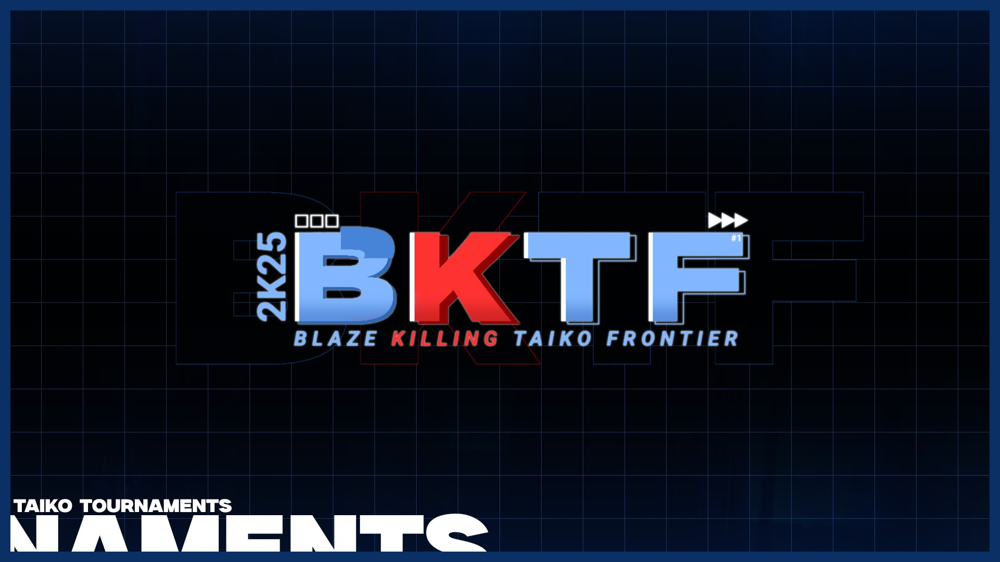

---
tags:
  - BKTF
  - Blaze Killing Taiko Frontier
---

# Blaze Killing Taiko Frontier

The **Blaze Killing Taiko Frontier** (***BKTF***) was a team based worldwide double-elimination osu!taiko tournament hosted by ::{ flag=JP }:: [shinjinhome](https://osu.ppy.sh/users/30147970). It was the first instalment of the Blaze Killing Taiko Frontier and part of the Taiko Frontier tournament series.

## Tournament schedule

| Event | Timestamp |
| --: | :-- |
| Registration phase | 2025-08-15/2025-09-13 |
| Screening phase | 2025-09-14/2025-09-28 |
| Qualifiers | 2025-10-04/2025-10-05 |
| Round of 32 | 2025-10-10/2025-10-12 |
| Round of 16 | 2025-10-18/2025-10-20 |
| Quarterfinals | 2025-10-25/2025-10-26 |
| Semifinals | 2025-11-01/2025-11-02 |
| Finals | 2025-11-08/2025-11-15 |
| Grand Finals | 2025-11-22/2025-11-23 |

## Prizes

| Placing | Prize(s) |
| :-: | :-- |
|  | Unique profile badge, 2 months of osu!supporter tag, unique profile banner, `BKTF #1 Champion` role on Taiko Frontier Discord server |
|  | Unique profile banner |
|  | Unique profile banner |

## Organisation

The Blaze Killing Taiko Frontier was run by various community members.

| Position | Member(s) |
| :-- | :-- |
| Host | ::{ flag=JP }:: [shinjinhome](https://osu.ppy.sh/users/30147970) |
| Co-Host | ::{ flag=JP }:: [Noko\_BSF](https://osu.ppy.sh/users/3811831), ::{ flag=JP }:: [Remi\_hs](https://osu.ppy.sh/users/7692731), ::{ flag=JP }:: [shaaaaaQ](https://osu.ppy.sh/users/16234052), ::{ flag=JP }:: [Syurin](https://osu.ppy.sh/users/20422042) |
| Head mappooler | ::{ flag=JP }:: [na7yuta\_osu](https://osu.ppy.sh/users/22747806), ::{ flag=JP }:: [shinjinhome](https://osu.ppy.sh/users/30147970) |
| Map pooler | ::{ flag=JP }:: [Hataya](https://osu.ppy.sh/users/30109442), ::{ flag=CN }:: [N a N a](https://osu.ppy.sh/users/11341131), ::{ flag=KR }:: [NaNaHiDa](https://osu.ppy.sh/users/30114023), ::{ flag=KR }:: [Peaceful](https://osu.ppy.sh/users/165027), ::{ flag=KR }:: [sendol](https://osu.ppy.sh/users/4433058), ::{ flag=PT }:: [Warp](https://osu.ppy.sh/users/18649724) |
| Mapper | ::{ flag=US }:: [\_somet](https://osu.ppy.sh/users/11833538), ::{ flag=JP }:: [-Kazuha](https://osu.ppy.sh/users/29978316), ::{ flag=ID }:: [Alwaysyukaz](https://osu.ppy.sh/users/4999506), ::{ flag=JP }:: [CarsqL](https://osu.ppy.sh/users/25734391), ::{ flag=JP }:: [Eriha](https://osu.ppy.sh/users/16320311), ::{ flag=JP }:: [Gsuncraft](https://osu.ppy.sh/users/30496573), ::{ flag=BR }:: [HiroK](https://osu.ppy.sh/users/4050738), ::{ flag=HK }:: [JarvisGaming](https://osu.ppy.sh/users/8601048), ::{ flag=US }:: [Jayceko](https://osu.ppy.sh/users/19951350), ::{ flag=JP }:: [komasy](https://osu.ppy.sh/users/1980256), ::{ flag=JP }:: [miyagishima](https://osu.ppy.sh/users/8027517), ::{ flag=MY }:: [MTNTWarz](https://osu.ppy.sh/users/14036825), ::{ flag=JP }:: [na7yuta\_osu](https://osu.ppy.sh/users/22747806), ::{ flag=CN }:: [N a N a](https://osu.ppy.sh/users/11341131), ::{ flag=KR }:: [NaNaHiDa](https://osu.ppy.sh/users/30114023), ::{ flag=SE }:: [Raphalge](https://osu.ppy.sh/users/3918650), ::{ flag=JP }:: [shaaaaaQ](https://osu.ppy.sh/users/16234052), ::{ flag=JP }:: [shinjinhome](https://osu.ppy.sh/users/30147970), ::{ flag=TW }:: [Solor](https://osu.ppy.sh/users/25201175), ::{ flag=JP }:: [Syurin](https://osu.ppy.sh/users/20422042), ::{ flag=NL }:: [TaikoMom](https://osu.ppy.sh/users/9086438), ::{ flag=JP }:: [uone](https://osu.ppy.sh/users/5321719), ::{ flag=JP }:: [Waribashi](https://osu.ppy.sh/users/2250574) |
| Mappool tester | ::{ flag=TW }:: [cheesestingy](https://osu.ppy.sh/users/16462012), ::{ flag=JP }:: [Gsuncraft](https://osu.ppy.sh/users/30496573), ::{ flag=JP }:: [limecc](https://osu.ppy.sh/users/35751315), ::{ flag=CN }:: [N a N a](https://osu.ppy.sh/users/11341131), ::{ flag=JP }:: [na7yuta\_osu](https://osu.ppy.sh/users/22747806), ::{ flag=KR }:: [NaNaHiDa](https://osu.ppy.sh/users/30114023), ::{ flag=GB }:: [overdahedge2015](https://osu.ppy.sh/users/9864847), ::{ flag=KR }:: [Peaceful](https://osu.ppy.sh/users/165027), ::{ flag=JP }:: [Remi\_hs](https://osu.ppy.sh/users/7692731), ::{ flag=JP }:: [shinjinhome](https://osu.ppy.sh/users/30147970), ::{ flag=PT }:: [Warp](https://osu.ppy.sh/users/18649724), ::{ flag=NZ }:: [ZeaIand](https://osu.ppy.sh/users/14777912) |
| Mappool replayer | ::{ flag=TW }:: [cheesestingy](https://osu.ppy.sh/users/16462012), ::{ flag=JP }:: [Grape\_Tea](https://osu.ppy.sh/users/9540073), ::{ flag=JP }:: [Lefty3](https://osu.ppy.sh/users/4719175), ::{ flag=JP }:: [limecc](https://osu.ppy.sh/users/35751315), ::{ flag=CN }:: [N a N a](https://osu.ppy.sh/users/11341131), ::{ flag=JP }:: [na7yuta\_osu](https://osu.ppy.sh/users/22747806), ::{ flag=KR }:: [NaNaHiDa](https://osu.ppy.sh/users/30114023), ::{ flag=KR }:: [Peaceful](https://osu.ppy.sh/users/165027), ::{ flag=SE }:: [Raphalge](https://osu.ppy.sh/users/3918650), ::{ flag=JP }:: [Remi\_hs](https://osu.ppy.sh/users/7692731), ::{ flag=ID }:: [Reyi](https://osu.ppy.sh/users/13385865), ::{ flag=JP }:: [shinjinhome](https://osu.ppy.sh/users/30147970), ::{ flag=JP }:: [SORA\_T4kAhqSh1](https://osu.ppy.sh/users/30549266), ::{ flag=JP }:: [yuranin](https://osu.ppy.sh/users/17746140), ::{ flag=NZ }:: [ZeaIand](https://osu.ppy.sh/users/14777912) |
| Referee | ::{ flag=PL }:: [Broken Chair](https://osu.ppy.sh/users/5274209), ::{ flag=FI }:: [kimi321](https://osu.ppy.sh/users/6962961), ::{ flag=CN }:: [N a N a](https://osu.ppy.sh/users/11341131), ::{ flag=KR }:: [NaNaHiDa](https://osu.ppy.sh/users/30114023), ::{ flag=JP }:: [Noko\_BSF](https://osu.ppy.sh/users/3811831), ::{ flag=JP }:: [Remi\_hs](https://osu.ppy.sh/users/7692731), ::{ flag=JP }:: [shinjinhome](https://osu.ppy.sh/users/30147970), ::{ flag=US }:: [sonicthescrew](https://osu.ppy.sh/users/36769473), ::{ flag=AR }:: [SUPERNOOB20](https://osu.ppy.sh/users/16422988), ::{ flag=JP }:: [Syurin](https://osu.ppy.sh/users/20422042), ::{ flag=PL }:: [Szafa11x](https://osu.ppy.sh/users/14075839), ::{ flag=NL }:: [TaikoMom](https://osu.ppy.sh/users/9086438) |
| Streamer | ::{ flag=JP }:: [Hataya](https://osu.ppy.sh/users/30109442), ::{ flag=CN }:: [N a N a](https://osu.ppy.sh/users/11341131), ::{ flag=KR }:: [NaNaHiDa](https://osu.ppy.sh/users/30114023), ::{ flag=JP }:: [Noko\_BSF](https://osu.ppy.sh/users/3811831), ::{ flag=GB }:: [overdahedge2015](https://osu.ppy.sh/users/9864847), ::{ flag=SE }:: [Raphalge](https://osu.ppy.sh/users/3918650), ::{ flag=JP }:: [Remi\_hs](https://osu.ppy.sh/users/7692731), ::{ flag=ID }:: [Reyi](https://osu.ppy.sh/users/13385865), ::{ flag=JP }:: [shinjinhome](https://osu.ppy.sh/users/30147970), ::{ flag=NL }:: [TaikoMom](https://osu.ppy.sh/users/9086438) |
| Commentator | ::{ flag=GB }:: [-XxbluezaperxX-](https://osu.ppy.sh/users/12264218), ::{ flag=SG }:: [\_gt](https://osu.ppy.sh/users/8301957), ::{ flag=JP }:: [Eriha](https://osu.ppy.sh/users/16320311), ::{ flag=JP }:: [Grape\_Tea](https://osu.ppy.sh/users/9540073), ::{ flag=JP }:: [Hataya](https://osu.ppy.sh/users/30109442), ::{ flag=GB }:: [hornedlove](https://osu.ppy.sh/users/14072678), ::{ flag=JP }:: [ItsDiamond](https://osu.ppy.sh/users/12611862), ::{ flag=GB }:: [My Angel Seia](https://osu.ppy.sh/users/17797595), ::{ flag=CN }:: [N a N a](https://osu.ppy.sh/users/11341131), ::{ flag=JP }:: [Noko\_BSF](https://osu.ppy.sh/users/3811831), ::{ flag=GB }:: [overdahedge2015](https://osu.ppy.sh/users/9864847), ::{ flag=KR }:: [Peaceful](https://osu.ppy.sh/users/165027), ::{ flag=JP }:: [shinjinhome](https://osu.ppy.sh/users/30147970), ::{ flag=GB }:: [spanner dude](https://osu.ppy.sh/users/12489832), ::{ flag=AR }:: [SUPERNOOB20](https://osu.ppy.sh/users/16422988), ::{ flag=NL }:: [TaikoMom](https://osu.ppy.sh/users/9086438), ::{ flag=HK }:: [YonGin](https://osu.ppy.sh/users/7109317) |
| Designer | ::{ flag=JP }:: [Hataya](https://osu.ppy.sh/users/30109442), ::{ flag=FR }:: [Kheops](https://osu.ppy.sh/users/18607342), ::{ flag=CN }:: [N a N a](https://osu.ppy.sh/users/11341131), ::{ flag=JP }:: [shinjinhome](https://osu.ppy.sh/users/30147970) |
| Video producer | ::{ flag=JP }:: [shinjinhome](https://osu.ppy.sh/users/30147970), ::{ flag=AR }:: [SUPERNOOB20](https://osu.ppy.sh/users/16422988) |
| Statistician | ::{ flag=JP }:: [Noko_BSF](https://osu.ppy.sh/users/3811831) |
| Developer | ::{ flag=CN }:: [N a N a](https://osu.ppy.sh/users/11341131), ::{ flag=JP }:: [shaaaaaQ](https://osu.ppy.sh/users/16234052) |
| Translator | ::{ flag=FR }:: [Briesmas](https://osu.ppy.sh/users/2865172), ::{ flag=JP }:: [ItsDiamond](https://osu.ppy.sh/users/12611862) |
| Wiki editor | ::{ flag=ID }:: [fajar13k](https://osu.ppy.sh/users/7100002) |

## Links

- [Discussion thread](https://osu.ppy.sh/community/forums/topics/2117736?n=1)
- [Discord server](https://discord.gg/35TQMEBXnt)
- [Livestream](https://www.twitch.tv/taikofrontier)
- [Website](https://taiko-frontier.vercel.app/en/bktf1)
- [Youtube channel](https://www.youtube.com/@TaikoFrontier_osu)
- [Challonge bracket](https://challonge.com/xzu0d98d)
- Spreadsheets
  - **[Main sheet](https://docs.google.com/spreadsheets/u/1/d/1APYqj8Qkeg9skY1F7Ml8SZ7uJ_M-X0qgcgUzI3kV65A/edit?gid=0#gid=0)**
  - [Statistics sheet](https://drive.google.com/drive/folders/1qj2xTkZKPHVNYVqrSLVz2LgK94bUclhs)

## Participants

| Team | Members |
| :-- | :-- |
| **Asad's Kalbs** | ::{ flag=AU }:: **[acid](https://osu.ppy.sh/users/2913584)**, ::{ flag=AU }:: [rango](https://osu.ppy.sh/users/7728466), ::{ flag=AU }:: [Tsubasa2](https://osu.ppy.sh/users/6835183) |
| **batman** | ::{ flag=TR }:: **[Batu](https://osu.ppy.sh/users/13196066)**, ::{ flag=PE }:: [Desinias](https://osu.ppy.sh/users/23361435), ::{ flag=GB }:: [spanner dude](https://osu.ppy.sh/users/12489832) |
| **珍珠奶茶** | ::{ flag=TW }:: **[AceIn](https://osu.ppy.sh/users/8306118)**, ::{ flag=HK }:: [S3V21](https://osu.ppy.sh/users/30243509), ::{ flag=HK }:: [Beanies](https://osu.ppy.sh/users/11635488) |
| **Coconut** | ::{ flag=RU }:: **[Dayzeek](https://osu.ppy.sh/users/5009970)**, ::{ flag=RU }:: [SceptifyMK](https://osu.ppy.sh/users/20843003), ::{ flag=RU }:: [Negroani](https://osu.ppy.sh/users/35968093) |
| **DaiKiu volviste a tomar temporada 4** | ::{ flag=CL }:: **[DaiKiu](https://osu.ppy.sh/users/4232665)**, ::{ flag=CL }:: [Kioshinxs](https://osu.ppy.sh/users/14433939), ::{ flag=AU }:: [Necromancy](https://osu.ppy.sh/users/1890084) |
| **チーム土方** | ::{ flag=JP }:: **[Cae2q](https://osu.ppy.sh/users/31350995)**, ::{ flag=JP }:: [Mutouhome2q](https://osu.ppy.sh/users/33783668) |
| **FAT** | ::{ flag=FR }:: **[Acii\_](https://osu.ppy.sh/users/11253595)**, ::{ flag=FR }:: [Totodileuh](https://osu.ppy.sh/users/13345184), ::{ flag=FR }:: [faheen](https://osu.ppy.sh/users/13157438) |
| **Fatherland Community** | ::{ flag=FI }:: **[Haadez](https://osu.ppy.sh/users/8925266)**, ::{ flag=FI }:: [duski](https://osu.ppy.sh/users/6506484), ::{ flag=FI }:: [Mazzuli500](https://osu.ppy.sh/users/10648818) |
| **Hellas Holland** | **::{ flag=GR }:: [KostPer](https://osu.ppy.sh/users/10584732)**, ::{ flag=NL }:: [apo11-0](https://osu.ppy.sh/users/34516901) |
| **Hornedgabonga** | ::{ flag=ID }:: **[-Sera](https://osu.ppy.sh/users/6048245)**, ::{ flag=ID }:: [apaajaboleh10](https://osu.ppy.sh/users/5151647), ::{ flag=GB }:: [hornedlove](https://osu.ppy.sh/users/14072678) |
| **ILOVETV** | ::{ flag=BR }:: **[Iko](https://osu.ppy.sh/users/11515189)**, ::{ flag=BR }:: [Gholdengo](https://osu.ppy.sh/users/16456158), ::{ flag=US }:: [fractal161](https://osu.ppy.sh/users/23048879) |
| **klaspe slum** | ::{ flag=CA }:: **[Infinity21\_EXE](https://osu.ppy.sh/users/23873884)**, ::{ flag=CA }:: [GDMem](https://osu.ppy.sh/users/10804091), ::{ flag=US }:: [P h y s i c s](https://osu.ppy.sh/users/5421176) |
| **寿命** | ::{ flag=JP }:: **[makaki](https://osu.ppy.sh/users/21893710)**, ::{ flag=JP }:: [nuku0315](https://osu.ppy.sh/users/8772103), ::{ flag=VN }:: [njshift1](https://osu.ppy.sh/users/16688499) |
| **Lorem Ipsum** | ::{ flag=BE }:: **[mirovh](https://osu.ppy.sh/users/22419404)**, ::{ flag=TW }:: [\[Crz\]FolAH1217](https://osu.ppy.sh/users/6232458), ::{ flag=ID }:: [Lightning Wyvern](https://osu.ppy.sh/users/1533122) |
| **Mama call a Taxi** | ::{ flag=IE }:: [Barra](https://osu.ppy.sh/users/3728315), ::{ flag=GB }:: [Moonwake](https://osu.ppy.sh/users/6657019) |
| **Matryoshkas** | ::{ flag=RU }:: **[Midorimomoika](https://osu.ppy.sh/users/6580862)**, ::{ flag=RU }:: [BelgiumGL](https://osu.ppy.sh/users/30705971), ::{ flag=RU }:: [TREEToTREET](https://osu.ppy.sh/users/8879204) |
| **Multimode** | ::{ flag=GB }:: **[Caelan](https://osu.ppy.sh/users/4471879)**, ::{ flag=SE }:: [Anders8KJS](https://osu.ppy.sh/users/36024737), ::{ flag=AT }:: [animexamera](https://osu.ppy.sh/users/7511357) |
| **NMonly** | ::{ flag=JP }:: **[yajyusen](https://osu.ppy.sh/users/16881532)**, ::{ flag=JP }:: [G1nD4m4](https://osu.ppy.sh/users/32491496), ::{ flag=JP }:: [Bruh\_moment2357](https://osu.ppy.sh/users/26010872) |
| **No price go grad** | ::{ flag=KR }:: **[patrick05](https://osu.ppy.sh/users/17812031)**, ::{ flag=KR }:: [Ting_Min](https://osu.ppy.sh/users/19398027), ::{ flag=GB }:: [Jonah](https://osu.ppy.sh/users/5509009) |
| **Not Derankers** | ::{ flag=JP }:: **[limecc](https://osu.ppy.sh/users/35751315)**, ::{ flag=KR }:: [ttota](https://osu.ppy.sh/users/20042402), ::{ flag=JP }:: [Rookdaooooo](https://osu.ppy.sh/users/31198498) |
| **Pompompurin** | ::{ flag=VN }:: **[buttermiilk](https://osu.ppy.sh/users/16039831)**, ::{ flag=KR }:: [Puruth](https://osu.ppy.sh/users/36990246) |
| **reisen** | ::{ flag=MX }:: **[reisen91937](https://osu.ppy.sh/users/25396679)**, ::{ flag=US }:: [OvO](https://osu.ppy.sh/users/12085251) |
| **RGB** | ::{ flag=FR }:: **[Gundham](https://osu.ppy.sh/users/8023063)**, ::{ flag=FR }:: [Rezyia](https://osu.ppy.sh/users/13911899), ::{ flag=FR }:: [Briesmas](https://osu.ppy.sh/users/2865172) |
| **sacabambaspis** | ::{ flag=KR }:: **[Riviclia](https://osu.ppy.sh/users/1616533)**, ::{ flag=VN }:: [Creeperbrine303](https://osu.ppy.sh/users/22515524), ::{ flag=PH }:: [Eyenine](https://osu.ppy.sh/users/1259391) |
| **spumbup** | ::{ flag=RU }:: **[sigmatapper](https://osu.ppy.sh/users/15838689)**, ::{ flag=JP }:: [spongebobdesu](https://osu.ppy.sh/users/34393346), ::{ flag=CN }:: [W-108](https://osu.ppy.sh/users/25695490) |
| **STD勢** | ::{ flag=JP }:: **[1208](https://osu.ppy.sh/users/27018825)**, ::{ flag=JP }:: [amaino3](https://osu.ppy.sh/users/30537391), ::{ flag=JP }:: [acidbase](https://osu.ppy.sh/users/25990072) |
| **taiko haters** | ::{ flag=FR }:: **[Chernobog](https://osu.ppy.sh/users/3317042)**, ::{ flag=BR }:: [irie-](https://osu.ppy.sh/users/29727936), ::{ flag=US }:: [Chupalika](https://osu.ppy.sh/users/1926383) |
| **髙橋山翔太3** | ::{ flag=JP }:: **[SORA\_T4kAhqSh1](https://osu.ppy.sh/users/30549266)**, ::{ flag=JP }:: [IA vocaloid](https://osu.ppy.sh/users/1785084), ::{ flag=JP }:: [Lefty3](https://osu.ppy.sh/users/4719175) |
| **takotako** | ::{ flag=VE }:: **[Shinsekai-](https://osu.ppy.sh/users/2140739)**, ::{ flag=BR }:: [roko100789](https://osu.ppy.sh/users/3224958) |
| **トウカイテイオーはちマンボウーダービー** | **::{ flag=PH }:: [Farmer Brown](https://osu.ppy.sh/users/17823779)**, ::{ flag=PH }:: [rrapido](https://osu.ppy.sh/users/18630149), ::{ flag=PH }:: [wwowie](https://osu.ppy.sh/users/19445999) |
| **低精度** | ::{ flag=JP }:: **[wwwwww](https://osu.ppy.sh/users/24326387)**, ::{ flag=JP }:: [kogudayo](https://osu.ppy.sh/users/33317792), ::{ flag=JP }:: [Gravy Nova](https://osu.ppy.sh/users/33668768) |
| **The King's Guard** | ::{ flag=NO }:: **[Nurend Fanboy](https://osu.ppy.sh/users/18916920)**, ::{ flag=NO }:: [Vendelicious](https://osu.ppy.sh/users/8818089), ::{ flag=VN }:: [davidminh0111](https://osu.ppy.sh/users/9623142) |
| **umapyoi** | ::{ flag=US }:: **[Skey](https://osu.ppy.sh/users/7718539)**, ::{ flag=US }:: [nezupoco](https://osu.ppy.sh/users/16731028), ::{ flag=US }:: [pixixelated](https://osu.ppy.sh/users/15266039) |
| **維他奶** | ::{ flag=HK }:: **[ilv\_Rem](https://osu.ppy.sh/users/7850538)**, ::{ flag=HK }:: [Brown918](https://osu.ppy.sh/users/9805760), ::{ flag=HK }:: [\_mtk](https://osu.ppy.sh/users/9468283) |
| **watetormelon** | ::{ flag=IT }:: **[CRHIX](https://osu.ppy.sh/users/25662684)**, ::{ flag=RO }:: [mikuhatsunegirl10](https://osu.ppy.sh/users/1188782), ::{ flag=IT }:: [KITEMMUORT322](https://osu.ppy.sh/users/10370310) |

## Podium

This competition has come to an end and resulted in the following podium:

| Placing | Team |
| :-: | :-- |
|  | **寿命** (::{ flag=JP }:: **[makaki](https://osu.ppy.sh/users/21893710)**, ::{ flag=JP }:: [nuku0315](https://osu.ppy.sh/users/8772103), ::{ flag=VN }:: [njshift1](https://osu.ppy.sh/users/16688499)) |
|  | **The King's Guard** (::{ flag=NO }:: **[Nurend Fanboy](https://osu.ppy.sh/users/18916920)**, ::{ flag=NO }:: [Vendelicious](https://osu.ppy.sh/users/8818089), ::{ flag=VN }:: [davidminh0111](https://osu.ppy.sh/users/9623142)) |
|  | **DaiKiu volviste a tomar temporada 4** (::{ flag=CL }:: **[DaiKiu](https://osu.ppy.sh/users/4232665)**, ::{ flag=CL }:: [Kioshinxs](https://osu.ppy.sh/users/14433939), ::{ flag=AU }:: [Necromancy](https://osu.ppy.sh/users/1890084)) |

## Mappools

### Grand Finals

**[Download the mappack here! (86 MB)](https://mega.nz/file/uwJThDbB#POykQbJbEOjtkCz4xw0TT3TmGj1Ru3WNRWbDDab2nqk)**

- NoMod
  1. [Tanchiky Vs. D-D-Dice Vs. Karameru - QUATTUORUX (shinjinhome) \[Inner Oni\]](https://osu.ppy.sh/beatmapsets/2465205#taiko/5396344)
  2. [DJ Raisei - Fractured Angel (Game Ver.) (X a v y) \[Heavenly Descent\]](https://osu.ppy.sh/beatmapsets/2465352#taiko/5396754)
  3. [Sot-C - TAKE THIS GUN LOL (miyagishima) \[Inner Oni\]](https://osu.ppy.sh/beatmapsets/2465214#taiko/5396359)
  4. [Irreversible Mechanism - The Agony (TaikoMom) \[Of Hollow Songs and Empty Prayers\]](https://osu.ppy.sh/beatmapsets/2428542#taiko/5287906)
  5. [guitarhero - see you tomorrow (Solor) \[see you at BKTF#2 || Enable Beatmap Skin!!\]](https://osu.ppy.sh/beatmapsets/2465215#taiko/5396362)
- Hidden
  1. [Camellia feat. Nanahira - Beni Kanzashi (Cut Ver.) (na7yuta\_osu) \[Crimson Flower\]](https://osu.ppy.sh/beatmapsets/2465188#taiko/5396313)
  2. [Shifuo - Patisserie Girls (Cut Ver.) (JarvisGaming) \[we are going to beat you up\]](https://osu.ppy.sh/beatmapsets/2465152#taiko/5396205)
- Hard Rock
  1. [Yunosuke - Illusional Flashback (na7yuta\_osu) \[Last Hope Is......\]](https://osu.ppy.sh/beatmapsets/2465186#taiko/5396305)
  2. [t+pazolite - Candy Crack Curtain Call (Cut Ver.) (Gsuncraft) \[Crack the Candy\]](https://osu.ppy.sh/beatmapsets/2464780#taiko/5395195)
- Double Time
  1. [inabakumori - Lost Umbrella(yuigot Remix) (shinjinhome) \[rainy\]](https://osu.ppy.sh/beatmapsets/2465203#taiko/5396342)
  2. [Camellia feat. STARLIVHT - LIVHT MY WAY (Konpaku Sariel) \[Light Emitting Drum\]](https://osu.ppy.sh/beatmapsets/2465066#taiko/5395988)
- Free Mod
  1. [tn-shi - Cyberfantasia (miyagishima) \[Inner Oni\]](https://osu.ppy.sh/beatmapsets/2465213#taiko/5396357)
  2. [COOL&CREATE - Chou Saishuu Kichiku Imouto Flandre S (Raphalge) \[Inner Oni\]](https://osu.ppy.sh/beatmapsets/2465216#taiko/5396363)
  3. [Silentroom - Nhelv (Waribashi) \[I? My? Me?\]](https://osu.ppy.sh/beatmapsets/2465132#taiko/5396169)
- Flashlight
  1. [Kenshi Yonezu - Plazma (shinjinhome) \[the starting point of all miracles\]](https://osu.ppy.sh/beatmapsets/2465204#taiko/5396343)
- Low SV
  1. [d0tc0mmie - Traffic Lights feat. Kasane Teto, Adachi Rei & GUMI (worst 2 fingers) \[Yellow Light\]](https://osu.ppy.sh/beatmapsets/2465128#taiko/5396161)
- Tiebreaker
  1. **[Camellia - Qyoh (Nine Stars) (shinjinhome) \[See you again under the night sky\]](https://osu.ppy.sh/beatmapsets/2465206#taiko/5396345)**

### Finals

- NoMod
  1. [exnoiz - Flying amen (shaaaaaQ) \[Frontier\]](https://osu.ppy.sh/beatmapsets/2458442#taiko/5375985)
  2. [Noriah - Everything Black (Lieless Frenchcore Bootleg) (Sped Up & Cut Ver.) (Syurin) \[Oni\]](https://osu.ppy.sh/beatmapsets/2289049#taiko/5371471)
  3. [Nizikawa - Metamorphose (Raphalge) \[Inner Oni\]](https://osu.ppy.sh/beatmapsets/2458443#taiko/5375986)
  4. [Silentroom - Finixe (Gsuncraft) \[Starry Sky\]](https://osu.ppy.sh/beatmapsets/2458430#taiko/5375969)
  5. [t+pazolite - Flashback Flicker (Solor) \[Crossover || Enable Beatmap Skin!!\]](https://osu.ppy.sh/beatmapsets/2458435#taiko/5375975)
- Hidden
  1. [Kurubukko - Hometown in Ruins (Konpaku Sariel) \[Hakugyokurou\]](https://osu.ppy.sh/beatmapsets/2458059#taiko/5374836)
  2. [Gaiyu - Moe Phonk [Phonk x Kawaii] (shaaaaaQ) \[kawaii ne!\]](https://osu.ppy.sh/beatmapsets/2458438#taiko/5375980)
- Hard Rock
  1. [Ludicin - Clinozoisite (Cut ver.) (miyagishima) \[Inner Oni (BKTF Edit)\]](https://osu.ppy.sh/beatmapsets/2458422#taiko/5375958)
  2. [MisoilePunch \~pan soe\~ - MeTear'n TruX (Gsuncraft) \[Inner Oni\]](https://osu.ppy.sh/beatmapsets/2458432#taiko/5375972)
- Double Time
  1. [Chihiro Yonekura - DEAR MY WAKER (na7yuta\_osu) \[BATTLE FOR PUNISHMENT\]](https://osu.ppy.sh/beatmapsets/2458433#taiko/5375973)
  2. [Ponchi feat. haxchi - Kokoro Diary (Gsuncraft) \[Your Story\]](https://osu.ppy.sh/beatmapsets/2458431#taiko/5375970)
- Free Mod
  1. [USAO - Knight Rider (Waribashi) \[Justice\]](https://osu.ppy.sh/beatmapsets/2458396#taiko/5375848)
  2. [Chaos City Niigata - Ukiyoe Yokochou (-Kazuha) \[Parade\]](https://osu.ppy.sh/beatmapsets/2458561#taiko/5376253)
  3. [Kimara Lovelace - URBAN FRAGMENTS (Cut Ver.) (Eriha) \[\* (Edit Ver.)\]](https://osu.ppy.sh/beatmapsets/2458418#taiko/5375948)
- Flashlight
  1. [Freezer feat. Kiichigo - Berry Go!! (shaaaaaQ) \[GO!!GO!!GO!!\]](https://osu.ppy.sh/beatmapsets/2458439#taiko/5375981)
- Low SV
  1. [MYUKKE. - FULi AUTO BUSTER (worst 2 fingers) \[Destroy (no kiai ver.)\]](https://osu.ppy.sh/beatmapsets/2458434#taiko/5375974)
- First Take
  1. [yuri - Heart111 (#jerseyclub remix) (CarsqL) \[give me\]](https://osu.ppy.sh/beatmapsets/2289058#taiko/4884846)
  2. [LOLIPO - Confused Start -Hinnyuu Tou no Tatakai- (7\_7) \[chippai\]](https://osu.ppy.sh/beatmapsets/1159684#taiko/2419786)
  3. [Winny Puhh - Meiecundimees uks Korsakov laks eile Latti (NaNaHiDa) \[Kantan Toxic PP\]](https://osu.ppy.sh/beatmapsets/2460380#taiko/5381626)
- Tiebreaker
  1. **[tn-shi - INVERSION (shinjinhome) \[Reach for the sky.\]](https://osu.ppy.sh/beatmapsets/2458450#taiko/5375994)**

### Semifinals

**[Download the mappack here! (72 MB)](https://mega.nz/file/StoA3ZbA#arW2apBML887IXSMfV8tR3BRyBgbfa-0AZlEUe-N2Zk)**

- NoMod
  1. [Hagane&7mai - Exalt (Waribashi) \[Rising Heartbeat\]](https://osu.ppy.sh/beatmapsets/2455466#taiko/5366294)
  2. [DJ Myosuke - GENOCIDER (Kobaryo's FTN-Remix) (X a v y) \[killa yu\]](https://osu.ppy.sh/beatmapsets/2455496#taiko/5366398)
  3. [d0tc0mmie - Can You Feel It feat. Hatsune Miku (Eriha) \[Dance\]](https://osu.ppy.sh/beatmapsets/2455381#taiko/5366079)
  4. [Ne Obliviscaris - Misericorde I - As the Flesh Falls (Cut ver) (TaikoMom) \[Dance of Crippled Rebellion\]](https://osu.ppy.sh/beatmapsets/2455392#taiko/5366109)
  5. [utzbo - Hidden Gateway (Solor) \[Hidden Breezy Cherry Blossom\]](https://osu.ppy.sh/beatmapsets/2455457#taiko/5366264)
- Hidden
  1. [mimizu - Tatakina (Konpaku Sariel) \[Kasane DonKat\]](https://osu.ppy.sh/beatmapsets/2455323#taiko/5365942)
  2. [Noisestorm - Barracuda (Waribashi) \[Each person's mission\]](https://osu.ppy.sh/beatmapsets/2455468#taiko/5366305)
- Hard Rock
  1. [Ugovhb & ef - WTF 2 (komasy) \[WTF\]](https://osu.ppy.sh/beatmapsets/2455507#taiko/5366425)
  2. [uynet - Onsoku Uchuu Ryokou (na7yuta\_osu) \[Broken Sound\]](https://osu.ppy.sh/beatmapsets/2455489#taiko/5366386)
- Double Time
  1. [Kenshi Yonezu - Shunrai (567 nightcore) (NaNaHiDa) \[Inner Oni\]](https://osu.ppy.sh/beatmapsets/2455490#taiko/5366387)
  2. [Aimer - ONE AND LAST (WTHBRO) \[Farewell\]](https://osu.ppy.sh/beatmapsets/1743804#taiko/3565088)
- Free Mod
  1. [KARUT - After School Dessert(Uzawa&Kazusa HardCore Remix) (na7yuta\_osu) \[Wet Breath\]](https://osu.ppy.sh/beatmapsets/2455488#taiko/5366385)
  2. [Gaiyu - Azu (miyagishima) \[Inner Oni\]](https://osu.ppy.sh/beatmapsets/2455493#taiko/5366391)
- Flashlight
  1. [Odetari - DICE AND ROLL (Instrumental) [reprod by blade30] (NaNaHiDa) \[!roll\]](https://osu.ppy.sh/beatmapsets/2455492#taiko/5366390)
- Low SV
  1. [ETIA. - On And On!! (feat. Jenga) (worst 2 fingers) \[HIT ME WITH THE HARDCORE!! (no kiai ver.)\]](https://osu.ppy.sh/beatmapsets/2455484#taiko/5366372)
- First Take
  1. [Se-U-Ra - Traveler \~stand aloof\~ (Blackener) \[1.0x SV\]](https://osu.ppy.sh/beatmapsets/1416439#taiko/2918947)
  2. [lapix - Venetian Drums (short) (zkane2) \[Snare\]](https://osu.ppy.sh/beatmapsets/1060800#taiko/2220987)
  3. [LeaF - Calamity Fortune (NaNaHiDa) \[Inner Toxic PP\]](https://osu.ppy.sh/beatmapsets/2456966#taiko/5371091)
  4. [Silentroom - X7124 (arialle) \[U124 0N1\]](https://osu.ppy.sh/beatmapsets/2219107#taiko/4703779)
- Tiebreaker
  1. **[ToYou & DJ Raisei - ADHD (shinjinhome) \[Under the rising sky.\]](https://osu.ppy.sh/beatmapsets/2455497#taiko/5366399)**

### Quarterfinals

**[Download the mappack here! (83 MB)](https://mega.nz/file/4Fd21bqb#HEAnnqpWUH3_Zhf2NITTKWbTjzZz81_sqrvsIi5CbZE)**

- NoMod
  1. [REDALiCE vs. USAO - SAIKYO STRONGER (Raphalge) \[Inner Oni\]](https://osu.ppy.sh/beatmapsets/2451757#taiko/5355901)
  2. [Kobaryo - SEITEN NO TERIYAKI (-Kazuha) \[GOURMET\]](https://osu.ppy.sh/beatmapsets/2451656#taiko/5355118)
  3. [TAKU INOUE - Backyard Stars (\_Rise) \[Inner Oni\]](https://osu.ppy.sh/beatmapsets/2395037#taiko/5187369)
  4. [soundorbis - ENISHI (uone) \[Inner Oni\]](https://osu.ppy.sh/beatmapsets/2451649#taiko/5355073)
  5. [HITORI. - Senbonzakura feat. Hatsune Miku (HITORI. Bootleg) (Solor) \[Special\]](https://osu.ppy.sh/beatmapsets/2451740#taiko/5355834)
- Hidden
  1. [DJ Myosuke - Darkside Of The Mind (Raphalge) \[Inner Oni\]](https://osu.ppy.sh/beatmapsets/2451756#taiko/5355890)
  2. [Gekidan Record feat. Nekomata Master - Houkou Orpheus (JarvisGaming) \[Hidden Answers\]](https://osu.ppy.sh/beatmapsets/2451682#taiko/5355204)
- Hard Rock
  1. [seatrus x kuro - UPRIZING DOWNBURST (MTNTWarz) \[Frontier\]](https://osu.ppy.sh/beatmapsets/2451734#taiko/5355822)
  2. [DECO\*27 - Chimera feat. Hatsune Miku (Jonarwhal) \[Dependency\]](https://osu.ppy.sh/beatmapsets/1769706#taiko/3622656)
- Double Time
  1. [Exyl - Ping! 2 (shinjinhome) \[@NaNaHida @NaNaHida @NaNaHida\]](https://osu.ppy.sh/beatmapsets/2451704#taiko/5355497)
  2. [ke-ji feat. Nanahira - Ange du Blanc Pur (Heaxys) \[Genjuro's Oni\]](https://osu.ppy.sh/beatmapsets/1263882#taiko/2639016)
- Free Mod
  1. [Mitsukiyo - Unwelcome School (t+pazolite Remix) (na7yuta\_osu) \[Red Youth\]](https://osu.ppy.sh/beatmapsets/2451372#taiko/5353781)
  2. [Slax - Blight My Name (Mew) \[Say it again.\]](https://osu.ppy.sh/beatmapsets/1838080#taiko/3774229)
- Flashlight
  1. [37 shikakuzakana - Found Footage 37 feat.IA (shinjinhome) \[where you\]](https://osu.ppy.sh/beatmapsets/2451712#taiko/5355761)
- Low SV
  1. [PinocchioP - Don't Believe in T (feat. Hatsune Miku & Kasane Teto) (Hataya) \[T is my EVERYTHING\]](https://osu.ppy.sh/beatmapsets/2451713#taiko/5355765)
- First Take
  1. [exnoiz - Hello amen (ler1211) \[hihi ><\]](https://osu.ppy.sh/beatmapsets/1823672#taiko/3742073)
  2. [NormalM feat. Usagi Denki - Luminous Entities Lost Heart (Briesmas) \[Inner Oni\]](https://osu.ppy.sh/beatmapsets/2023493#taiko/4214841)
  3. [EmoCosine - Nekojarashi (CuLacllachan) \[Nyaaaaaaaaaaaaaaa\]](https://osu.ppy.sh/beatmapsets/1642271#taiko/3352225)
  4. [StellaBee - Meteor Shower (layxa) \[Glimmering Night\]](https://osu.ppy.sh/beatmapsets/1822954#taiko/3740662)
  5. [MYUKKE. - AI[UE]OON (Rinze) \[\[EX\]OSPHERE\]](https://osu.ppy.sh/beatmapsets/1888032#taiko/3888242)
  6. [TUYU - Shuten no Saki ga Aru to Suru Naraba. (cpu\_alpha) \[Inner Oni 1.2x\]](https://osu.ppy.sh/beatmapsets/2070087#taiko/4331893)
  7. [Silent Siren - Hachigatsu no Yoru (MathaFuckera.k.alziefuckuppunk270mix) (KTYN) \[Midsummer Night\]](https://osu.ppy.sh/beatmapsets/1846885#taiko/3793832)
  8. [ARForest - Metheus (Arrival) \[Inner Oni\]](https://osu.ppy.sh/beatmapsets/662696#taiko/1402746)
  9. [Hikarinonakani - Blue Youth (K a y o k o) \[Farewell\]](https://osu.ppy.sh/beatmapsets/2276405#taiko/4851477)
  10. [\*reinahitomi - Shuriken wa Terekakushi (HiroK) \[Hell Oni\]](https://osu.ppy.sh/beatmapsets/1627471#taiko/3322572)
  11. [Schwank - $1.78 (Fynbi) \[$12.01\]](https://osu.ppy.sh/beatmapsets/1794756#taiko/3678678)
  12. [Niwashi - Playing with Ruby (EdamaMe411) \[7z's Heretic\]](https://osu.ppy.sh/beatmapsets/922384#taiko/1926622)
- Tiebreaker
  1. **[Xyris - Beyond the Edge (feat. Hanakuma Chifuyu) (NaNaHiDa) \[Ruler of the Time\]](https://osu.ppy.sh/beatmapsets/2451738#taiko/5355829)**

### Round of 16

**[Download the mappack here! (77 MB)](https://mega.nz/file/xZsXmIRb#FAlhNHfocGtWaWmBiJLYrYJiORT1UwL6qgLOA8e2ufc)**

- NoMod
  1. [Artifact vs. Dualcast - Energizing Flame (MTNTWarz) \[Frontier\]](https://osu.ppy.sh/beatmapsets/2448438#taiko/5345484)
  2. [2 gou. - Genkyoku wo Kizamu (shinjinhome) \[TEXT SAMPLE\]](https://osu.ppy.sh/beatmapsets/2447746#taiko/5343728)
  3. [ikaruga\_nex - Mirage (TaikoMom) \[Resolute\]](https://osu.ppy.sh/beatmapsets/2358244#taiko/5345239)
  4. [Sasuke Haraguchi feat. Kasane Teto - HITO Mania (worst 2 fingers) \[Maniac\]](https://osu.ppy.sh/beatmapsets/2448446#taiko/5345492)
- Hidden
  1. [DJ SHARPNEL - BF2014 (Ghost N) \[1.1x\]](https://osu.ppy.sh/beatmapsets/2429319#taiko/5290054)
  2. [anubasu-anubasu - The island of albatross (Alwaysyukaz) \[Fantasy Skyfarer\]](https://osu.ppy.sh/beatmapsets/2448394#taiko/5345411)
- Hard Rock
  1. [Tia - The Glory Days (Cut Ver.) (komasy) \[Inner Oni\]](https://osu.ppy.sh/beatmapsets/1871492#taiko/3850735)
  2. [Se-U-Ra - Sekibaku no Maihime wa Kuraku Shizumu (-Kazuha) \[Forlorn Danseuse\]](https://osu.ppy.sh/beatmapsets/2448515#taiko/5345679)
- Double Time
  1. [Good-for-nothing universe - High School Monster (shinjinhome) \[MONSTER\]](https://osu.ppy.sh/beatmapsets/2447745#taiko/5343727)
  2. [Becky - I Wanna Be A Ninja (\[R\]) \[Oni\]](https://osu.ppy.sh/beatmapsets/1051314#taiko/2198465)
- Free Mod
  1. [Tokiwa - Syuou Sange (Shamirin\_mzk) \[Petal falling\]](https://osu.ppy.sh/beatmapsets/1593285#taiko/3254190)
  2. [Curren - worldwidesuperstar (HiroK) \[Inner Oni\]](https://osu.ppy.sh/beatmapsets/2448572#taiko/5345796)
- Flashlight
  1. [TOOBOE - Tablet (shinjinhome) \[UAAAAAAAAAA!!!!!!!\]](https://osu.ppy.sh/beatmapsets/2447747#taiko/5343729)
- Low SV
  1. [BanYa - Moonlight (NaNaHiDa) \[Inner Oni (BKTF#1 edit.)\]](https://osu.ppy.sh/beatmapsets/2448495#taiko/5345641)
- Tiebreaker
  1. **[seatrus - The Princess was gills breathing. (JarvisGaming) \[drown\]](https://osu.ppy.sh/beatmapsets/2448433#taiko/5345478)**

### Round of 32

**[Download the mappack here! (73 MB)](https://mega.nz/file/oJMDGS6S#JakuTWwWVCfL9qzDdPLlNIamrf3gh3BrKiZ27bKh6rk)**

- NoMod
  1. [N\_dog - To the missrable me (2025 Remaster) (Raphalge) \[Inner Oni\]](https://osu.ppy.sh/beatmapsets/2445666#taiko/5338242)
  2. [Srav3R - Selfish Mood (\_Rise) \[Inner Oni\]](https://osu.ppy.sh/beatmapsets/1393062#taiko/2875937)
  3. [antiPLUR - One Life Left to Live (Nwolf) \[Last Stand\]](https://osu.ppy.sh/beatmapsets/1198823#taiko/2496686)
  4. [DJ Majokko Mirakurun - Mafain (Nifty) \[Oni\]](https://osu.ppy.sh/beatmapsets/1541447#taiko/3189504)
- Hidden
  1. [tokiwa feat. Sanso Nakamura - Kotodama Refrain (katagiri Bootleg) (snowball112) \[Inner Oni\]](https://osu.ppy.sh/beatmapsets/1426769#taiko/2937902)
  2. [M2U - A Bella! (feat. Lucy) (eiri-) \[Inner Oni\]](https://osu.ppy.sh/beatmapsets/760757#taiko/1658885)
- Hard Rock
  1. [KARUT - CrossFire (Raytoly Hardcore Remix) (Raytoly) \[Climax\]](https://osu.ppy.sh/beatmapsets/1811830#taiko/3716486)
  2. [Kenshi Yonezu - KICK BACK (gaston\_2199) \[LER'S INNER ONI\]](https://osu.ppy.sh/beatmapsets/1878651#taiko/3877992)
- Double Time
  1. [KNOWER - The Government Knows (-Flashlight-) \[Oni\]](https://osu.ppy.sh/beatmapsets/1983475#taiko/4119462)
  2. [miroir - O-Ku-Ri-Mo-No Sunday! (Mtell Hardcore Bootleg) (ler1211) \[Oni\]](https://osu.ppy.sh/beatmapsets/1661627#taiko/3392081)
- Free Mod
  1. [Yasui Yousuke - YO-KAI Disco (Shinmetori Remix) (Waribashi) \[Phantom\]](https://osu.ppy.sh/beatmapsets/2445618#taiko/5338094)
  2. [litmus\* as Ester - Krave (Extended Ver.) (davidminh0111) \[Black's Inner Oni\]](https://osu.ppy.sh/beatmapsets/1656354#taiko/3395536)
- Flashlight
  1. [Mitsukiyo - ROMANTIC SEASIDE (shinjinhome) \[seaside\]](https://osu.ppy.sh/beatmapsets/2445670#taiko/5338252)
- Low SV
  1. [Se-U-Ra - Cris Fortress (Ulqui) \[Inner Oni\]](https://osu.ppy.sh/beatmapsets/1305819#taiko/2707381)
- Tiebreaker
  1. **[Camellia vs. lapix - Hypnotize (Genjuro) \[Narcosis\]](https://osu.ppy.sh/beatmapsets/1051122#taiko/2196763)**

### Qualifiers

**[Download the mappack here! (41 MB)](https://drive.google.com/file/d/1TXyXwGWv9DC5gzxpLENwiQLvaCppHfUw/view)**

- NoMod
  1. [ISOMERZ (DJ Raisei + seatrus) - Symmetric (Gsuncraft) \[Geometry\]](https://osu.ppy.sh/beatmapsets/2441949#taiko/5327946)
  2. [Billain - Metal Jaws (worst 2 fingers) \[Inner Oni (Cut ver)\]](https://osu.ppy.sh/beatmapsets/2441937#taiko/5327920)
  3. [MYUKKE. - Mach Roger (worst 2 fingers) \[AMEN\]](https://osu.ppy.sh/beatmapsets/2441938#taiko/5327922)
- Hidden
  1. [seatrus - Oyasmy (JarvisGaming) \[Outer Luigi\]](https://osu.ppy.sh/beatmapsets/2441889#taiko/5327780)
- Hard Rock
  1. [Akiri - ROTTED AS THE QUEEN OF THE RATS (komasy) \[Inner Oni\]](https://osu.ppy.sh/beatmapsets/2442000#taiko/5328070)
- Double Time
  1. [syudou - Bitter Choco Decoration (feat. Hatsune Miku) (CarsqL) \[Oni\]](https://osu.ppy.sh/beatmapsets/2442070#taiko/5328270)
- Free Mod
  1. [3R2 - Interlude (feat. SOOTHEMILY & Xinevsky) (Syurin) \[Aftertaste\]](https://osu.ppy.sh/beatmapsets/2441944#taiko/5327937)

## Match results

### Grand Finals

Saturday, 22 November 2025:

| Team 1 |  |  | Team 2 | Match link |
| --: | :-: | :-: | :-- | :-- |
| DaiKiu volviste a tomar temporada 4 | 2 | **7** | **The King's Guard** | [#1](https://osu.ppy.sh/community/matches/119893831) |

Sunday, 23 November 2025:

| Team 1 |  |  | Team 2 | Match link |
| --: | :-: | :-: | :-- | :-- |
| **寿命** | **7** | 4 | The King's Guard | [#1](https://osu.ppy.sh/community/matches/119904528) |

### Finals

Saturday, 8 November 2025:

| Team 1 |  |  | Team 2 | Match link |
| --: | :-: | :-: | :-- | :-- |
| Lorem Ipsum | 2 | **7** | **The King's Guard** | [#1](https://osu.ppy.sh/community/matches/119771128) |
| NMonly | -1 | **0** | **Coconut** | *win by default* |

Saturday, 15 November 2025:

| Team 1 |  |  | Team 2 | Match link |
| --: | :-: | :-: | :-- | :-- |
| **寿命** | **7** | 1 | DaiKiu volviste a tomar temporada 4 | [#1](https://osu.ppy.sh/community/matches/119833105) |
| Coconut | 6 | **7** | **The King's Guard** | [#1](https://osu.ppy.sh/community/matches/119833802) |

### Semifinals

Saturday, 1 November 2025:

| Team 1 |  |  | Team 2 | Match link |
| --: | :-: | :-: | :-- | :-- |
| Pompompurin | -1 | **0** | **Fatherland Community** | *win by default* |
| **Coconut** | **6** | 1 | Fat | [#1](https://osu.ppy.sh/community/matches/119710332) |
| 髙橋山翔太3 | 3 | **6** | **Hornedgabonga** | [#1](https://osu.ppy.sh/community/matches/119710855) |
| **The King's Guard** | **6** | 3 | 珍珠奶茶 | [#1](https://osu.ppy.sh/community/matches/119710815) |

Sunday, 2 November 2025:

| Team 1 |  |  | Team 2 | Match link |
| --: | :-: | :-: | :-- | :-- |
| NMonly | -1 | **0** | **DaiKiu volviste a tomar temporada 4** | *win by default* |
| **Coconut** | **6** | 2 | Hornedgabonga | [#1](https://osu.ppy.sh/community/matches/119719500) |
| **寿命** | **6** | 5 | Lorem Ipsum | [#1](https://osu.ppy.sh/community/matches/119720526) |
| **The King's Guard** | **6** | 1 | Fatherland Community | [#1](https://osu.ppy.sh/community/matches/119722014) |

### Quarterfinals

Saturday, 25 October 2025:

| Team 1 |  |  | Team 2 | Match link |
| --: | :-: | :-: | :-- | :-- |
| **taiko haters** | **6** | 4 | Not Derankers | [#1](https://osu.ppy.sh/community/matches/119646368) |
| 維他奶 | 1 | **6** | **Hornedgabonga** | [#1](https://osu.ppy.sh/community/matches/119648917) |
| STD勢 | 2 | **6** | **FAT** | [#1](https://osu.ppy.sh/community/matches/119649508) |
| **珍珠奶茶** | **6** | 4 | spumbup | [#1](https://osu.ppy.sh/community/matches/119650003) |
| **sacabambaspis** | **6** | 0 | Hellas Holland | [#1](https://osu.ppy.sh/community/matches/119650051) |
| 低精度 | 1 | **6** | **umapyoi** | [#1](https://osu.ppy.sh/community/matches/119650082) |
| **Fatherland Communty** | **6** | 0 | Multimode | [#1](https://osu.ppy.sh/community/matches/119651328) |
| RGB | 2 | **6** | **ILOVETV** | [#1](https://osu.ppy.sh/community/matches/119652508) |

Sunday, 26 October 2025:

| Team 1 |  |  | Team 2 | Match link |
| --: | :-: | :-: | :-- | :-- |
| **珍珠奶茶** | **6** | 3 | sacabambaspis | [#1](https://osu.ppy.sh/community/matches/119658286) |
| 髙橋山翔太3 | 4 | **6** | **寿命** | [#1](https://osu.ppy.sh/community/matches/119658526) |
| Pompompurin | -1 | **0** | **NMonly** | *win by default* |
| **Hornedgabonga** | **6** | 2 | umapyoi | [#1](https://osu.ppy.sh/community/matches/119659650) |
| **Lorem Ipsum** | **6** | 4 | Coconut | [#1](https://osu.ppy.sh/community/matches/119659688) |
| The King's Guard | 4 | **6** | **DaiKiu volviste a tomar temporada 4** | [#1](https://osu.ppy.sh/community/matches/119660772) |
| **FAT** | **6** | 4 | ILOVETV | [#1](https://osu.ppy.sh/community/matches/119663089) |
| **Fatherland Community** | **6** | 5 | taiko haters | [#1](https://osu.ppy.sh/community/matches/119663086) |

### Round of 16

Saturday, 18 October 2025:

| Team 1 |  |  | Team 2 | Match link |
| --: | :-: | :-: | :-- | :-- |
| **Multimode** | **5** | 3 | Asad's Kalbs | [#1](https://osu.ppy.sh/community/matches/119584414) |
| トウカイテイオーはちマンボウーダービー | 2 | **5** | **Hornedgabonga** | [#1](https://osu.ppy.sh/community/matches/119585337) |
| **Hellas Holland** | **5** | 4 | No price go grad | [#1](https://osu.ppy.sh/community/matches/119586052) |
| **DaiKiu volviste a tomar temporada 4** | **5** | 4 | STD勢 | [#1](https://osu.ppy.sh/community/matches/119585951) |
| **髙橋山翔太3** | **5** | 2 | taiko haters | [#1](https://osu.ppy.sh/community/matches/119586013) |
| reisen | 0 | **5** | **spumbup** | [#1](https://osu.ppy.sh/community/matches/119587492) |
| batman | 1 | **5** | **ILOVETV** | [#1](https://osu.ppy.sh/community/matches/119588219) |
| watetormelon | 2 | **5** | **umapyoi** | [#1](https://osu.ppy.sh/community/matches/119590263) |

Sunday, 19 October 2025:

| Team 1 |  |  | Team 2 | Match link |
| --: | :-: | :-: | :-- | :-- |
| klaspe slum | 1 | **5** | **Not Derankers** | [#1](https://osu.ppy.sh/community/matches/119593615) |
| Fatherland Community | 0 | **5** | **寿命** | [#1](https://osu.ppy.sh/community/matches/119595594) |
| **Pompompurin** | **5** | 0 | 低精度 | [#1](https://osu.ppy.sh/community/matches/119596453) |
| **Lorem Ipsum** | **5** | 3 | sacabambaspis | [#1](https://osu.ppy.sh/community/matches/119597004) |
| **Coconut** | **5** | 0 | 珍珠奶茶 | [#1](https://osu.ppy.sh/community/matches/119597567) |
| takotako | 0 | **5** | **FAT** | [#1](https://osu.ppy.sh/community/matches/119599311) |
| **The King's Guard** | **5** | 0 | RGB | [#1](https://osu.ppy.sh/community/matches/119599356) |

Monday, 20 October 2025:

| Team 1 |  |  | Team 2 | Match link |
| --: | :-: | :-: | :-- | :-- |
| 維他奶 | 4 | **5** | **NMonly** | [#1](https://osu.ppy.sh/community/matches/119606257) |

### Round of 32

Friday, 10 October 2025:

| Team 1 |  |  | Team 2 | Match link |
| --: | :-: | :-: | :-- | :-- |
| Not Derankers | 4 | **5** | **STD勢** | [#1](https://osu.ppy.sh/community/matches/119534529) |

Saturday, 11 October 2025:

| Team 1 |  |  | Team 2 | Match link |
| --: | :-: | :-: | :-- | :-- |
| **Lorem Ipsum** | **5** | 2 | トウカイテイオーはちマンボウーダービー | [#1](https://osu.ppy.sh/community/matches/119522244) |
| Hornedgabonga | 1 | **5** | **sacabambaspis** | [#1](https://osu.ppy.sh/community/matches/119522243) |
| **Coconut** | **5** | 2 | watetormelon | [#1](https://osu.ppy.sh/community/matches/119522799) |
| **RGB** | **5** | 1 | Asad's Kalbs | [#1](https://osu.ppy.sh/community/matches/119522761) |
| **珍珠奶茶** | **5** | 2 | umapyoi | [#1](https://osu.ppy.sh/community/matches/119524041) |

Sunday, 12 October 2025:

| Team 1 |  |  | Team 2 | Match link |
| --: | :-: | :-: | :-- | :-- |
| **Pompompurin** | **5** | 0 | reisen | [#1](https://osu.ppy.sh/community/matches/119529971) |
| **DaiKiu volviste a tomar temporada 4** | **5** | 1 | klaspe slum | [#1](https://osu.ppy.sh/community/matches/119530029) |
| **NMonly** | **5** | 3 | No price go grad | [#1](https://osu.ppy.sh/community/matches/119531241) |
| **低精度** | **5** | 1 | spumbup | [#1](https://osu.ppy.sh/community/matches/119533535) |
| **The King's Guard** | **5** | 0 | Multimode | [#1](https://osu.ppy.sh/community/matches/119534236) |
| **寿命** | **5** | 1 | ILOVETV | [#1](https://osu.ppy.sh/community/matches/119534198) |
| **髙橋山翔太3** | **5** | 0 | takotako | [#1](https://osu.ppy.sh/community/matches/119534529) |
| **taiko haters** | **5** | 1 | FAT | [#1](https://osu.ppy.sh/community/matches/119534750) |
| batman | 2 | **5** | **Fatherland Community** | [#1](https://osu.ppy.sh/community/matches/119534736) |
| **維他奶** | **5** | 0 | Hellas Holland | [#1](https://osu.ppy.sh/community/matches/119535444) |

### Qualifiers

The final standings for the Qualifiers stage can be found in the following [qualifiers results statistics page](https://docs.google.com/spreadsheets/u/1/d/1APYqj8Qkeg9skY1F7Ml8SZ7uJ_M-X0qgcgUzI3kV65A/edit?gid=0#gid=0). Only the top 32 will advance to the knockout stage.

## Ruleset

### General rules

1. Blaze Killing Taiko Frontier is a team-based double-elimination tournament, played on osu!(stable), osu!taiko game mode.
2. Beatmap scoring is based on ScoreV2.
3. Respectful Behavior: Abusive language, insults, discrimination, intentional delays, cheating, multi-accounting, or disruptive behavior is strictly prohibited. Individuals engaging in such actions will receive warnings or be banned from the tournament. 

### Participation requirements

1. osu!taiko Global Rank: #500 - #1,500.
   - Players who reach above #490 or below #1,510 during the tournament period will be disqualified.
2. Joining the [Taiko Frontier Discord server](https://discord.gg/35TQMEBXnt) is mandatory.
3. Players with a history of bans or disruptive behavior are not allowed to participate.
4. Commentators and translators are allowed to participate in this tournament. However, eliminated players can become referees, streamers or playtesters.
5. Players are allowed to register regards from any nationality/region.
6. Any other staff roles that are not listed here cannot partake in this tournament.
7. Any osu!taiko player who has not been restricted within the past 12 months and follows [osu! community rules](/wiki/Rules) will be allowed in this tournament. The osu! support reserves the right of removing any player from the tournament following the screening phase.
8. All players and staff must thoroughly read and comply to these rules during the tournament. Respectful behavior is expected at all times. Violations may result in tournament bans or disqualification. 

### Team composition

1. Team size will be between two players or three players at maximum.
2. Every team will name a captain, their responsibility will be scheduling and acting as the primary contact with tournament organisers. In the absence of the captain, another team member must take over. If there is no response within 48 hours, organisers will make decisions on behalf of the team.
3. Any team naming that is considered inappropriate, offensive, or indecent are prohibited.
4. No member changes are allowed after the registration period (August 23, 2025 - September 20, 2025). Exceptions are permitted only on the first day of the screening period (September 14, 2025) for emergencies, with changes requested within 24 hours via the Discord server's `#reschedule` text channel. Replacement players must also meet the [participation requirements](#participation-requirements) criteria.

### Registration process

1. Completing the registration form with following options:
   - Free Agent: Register as an individual
   - 2-Player Team: Register as duo
   - 3-Player Team: Register as a full team
2. Free Agents can form 3-player team with other Free Agents or join a 2-player team. If a team is not formed by the screening start date (September 14, 2025), organisers will automatically assign Free Agents to teams.
3. 2-Player team Can merge with a Free Agent to form a 3-player team. If no Free Agent is found by the screening start date (September 14, 2025), the team will compete as a 2-player team.
4. Using the Discord server's `#looking-for-team` text channel is recommended to recruit and find team members.

### Scheduling

1. Schedule and rundown will follow what's written before in the [tournament schedules](#tournament-schedule) section above.
2. Reschedules are allowed with both teams must agree and notify organisers via the Discord server's `#reschedule` text channel by Thursday 23:59 (UTC) of the match week. Rescheduling must be finalised by Friday 12:00 (UTC).
3. If the initial weekends schedule are unavailable, matches can be held until Monday 23:00 (UTC) if a referee is available. For Qualifiers, this is limited to Sunday 23:00 (UTC). 

### Winning conditions

| Stage | BO format | Win condition |
| :-- | :-- | :-- |
| **Round of 32 and Round of 16** | Best-of-9 | First to 5 points |
| **Quarterfinals and Semifinals** | Best-of-11 | First to 6 points |
| **Finals and Grand Finals** | Best-of-13 | (first to 7 points) |

### Qualifiers rules

1. The qualifiers will occur ranging from October 4, 2025 - October 5, 2025, held in multiplayer lobbies. Players select lobbies via the Discord server's `#reschedule` text channel.
2. Teams will be asked to play the mappool twice at a designated time. The team's best playthrough will be used for seeding.
3. Warmups are not permitted.
4. Matches are conducted under private lobbies that are created at the registered time and, players will be invited to join.
5. Reschedules are allowed by contacting the organisers via the Discord server's `#reschedule` text channel.
6. No show without prior notice (24 hours before Qualifiers start) will result in teams doing so ranked last in the qualifiers results.
7. Match results for Qualifiers are published on the [qualifiers results statistics page](https://docs.google.com/spreadsheets/u/1/d/1APYqj8Qkeg9skY1F7Ml8SZ7uJ_M-X0qgcgUzI3kV65A/edit?gid=0#gid=0) main after Qualifiers have concluded.
8. Seedings will be done with the average rank of each on each map.

### Streaming

1. Matches are streamed on Taiko Frontier's available multiple platforms.

| Platform | Designation |
| :-- | :-- |
| Youtube channel | For Japanese viewers |
| Twitch channel | For International viewers |
| Twitch archives | Will be uploaded to Youtube channel once a match is done |

2. Streaming and Spectating
   - Mirror streaming is permitted on YouTube channel (Japanese commentary) or Twitch channel (global commentary) without delay restrictions. Players may also stream their matches.
   - Spectators are prohibited from abusive language or spamming. Streamers may delete comments or restrict viewers.
   - Match Archives: Announced on the official Discord server within 48 hours of the match.

### Mappool composition

1. Mappool showcase will take place one week before each round (Sunday 20:00 UTC) on YouTube or Twitch channel and published in the Mappool page of the [Taiko Frontier website](https://taiko-frontier.vercel.app/en/bktf1/mappools/). Notifications are sent via the Discord server's `#announcements` text channel. After the showcase, the map links will be published on the [Main sheets](https://docs.google.com/spreadsheets/u/1/d/1APYqj8Qkeg9skY1F7Ml8SZ7uJ_M-X0qgcgUzI3kV65A/edit?gid=0#gid=0).
2. Organisers will prioritize songs that are allowed to use directly by the artist or from the osu! featured artist listing. However, if the organisers have no other choice, songs that are not explicitly disallowed will be pooled.
3. Losers’ Bracket will have the same pool as the Winners’ Bracket.
4. Following table is the composition for each stage.

| Bracket | Qualifiers | Round of 32/Round of 16 | Quarterfinals/Semifinals | Finals/Grand Finals |
| :-- | :-- | :-- | :-- | :-- |
| NoMod | 3 Maps | 4 Maps | 5 Maps | 5 Maps |
| Hidden (HD) | 1 Map | 2 Maps | 2 Maps | 2 Maps |
| Hard Rock (HR) | 1 Map | 2 Maps | 2 Maps | 2 Maps |
| Double Time (DT) | 1 Map | 2 Maps | 2 Maps | 2 Maps |
| Flashlight (FL) | - | 1 Map | 1 Map | 1 Map |
| Free Mod (FM) | 1 Map | 2 Maps | 2 Maps | 3 Maps |
| First Take (FT) | - | - | 1 Map | 1 Map |
| Low SV (LSV) | - | 1 Map | 1 Map | 1 Map |
| Tiebreaker (TB) | - | 1 Map | 1 Map | 1 Map |

5. Following are usage on mod brackets
   - FreeMod: Players may choose NM, HD, HR, or HDHR. Other mods (e.g Flashlight, Sudden Death) are invalid.
   - First Take: NoMod only.
   - Tiebreaker: NoMod only.
   - Low SV: NoMod only.
   - Picks: Players may freely choose from the map pool (NM, HD, HR, DT, FM, FT, LSV), adhering to bracket-specific mod rules.
   - First Take (FT): FT randomly from consistency/tech/speed/stream maps
   - Issue Reporting: Report issues within 48 hours of mappool release via the Discord server's `#mappool-feedback` text channel. Verified issues result in the replacement with a map of similar difficulty or a fix for custom maps.

### Match rules

1. Referees create private lobbies 10 minutes before the match with format of: `BKTF 1: (Red Team) vs (Blue Team)`. Players must join on time.
2. Late arrival up to 10 minutes is still tolerated. However if the deadline has passed, the late team will be declared as forfeit. If both teams are late, the higher seed wins.
3. Warmups are permitted but may be skipped if time is limited.
4. Team captains have to execute `!roll` command to determine a number. The higher roll chooses either first ban or first pick; the lower roll takes the remaining option.
5. Bans:
   1. Each team bans 2 maps (excluding TB and FT) within 90s. If no selection is made, the referee uses `!roll` to randomly decide. Ban order: A(first), B(first), B(second), A(second).
   2. A team cannot ban the same slot twice. (e.g HD1/HD2 ban deemed as invalid, while HD1/HR1 ban is a valid ban)
5. Picks: After bans, the pick-first team selects maps alternately. Selection time: 90s; preparation time: 90s. If no selection is made, the referee uses `!roll` to decide. Once all players are ready or preparation time ends, the referee starts the map with `!mp start 10`.
6. FT members please finalize within 180 seconds.
7. Disconnections:
   - Within 30 seconds of map start: One retry per team is allowed.
   - After 30 seconds: The score is counted as 0.
8. No Fail mods are applied to all maps.
9. If a map has draw results, the teams will replay the same map. If a second draw occurs, the selecting team chooses a different map, and the drawn map is available again in the pool.
10. Ties will be resolved via the Tiebreaker bracket.
11. Technical Issues such as game bugs (e.g score not registering, map loading errors)
    - Referees decide on a replay.
    - Unresolved issues are escalated to organisers.
    - Device issues: Affected players’ teammates continue; if all players are affected, the match is forfeited.
    - Others: There are no tactical timeouts

### Code of conduct and penalties

1. Prohibited Actions:
   - Cheating or multi-accounting: Immediate disqualification and permanent ban from Taiko Frontier tournaments (verified by osu! staff).
   - Abusive language (insults, discrimination, provocation) or intentional delays: Warnings or further penalties.
   - Disruptive behavior or harassment: May result in immediate disqualification.
2. Appeals: Complaints about punishments must be submitted to the tournament organisers via DM within 24 hours of the issue. Late appeals are not accepted. 

### Emergency procedures

1. Tournament Cancellation/Postponement are decided by organisers. 
2. Staff Absence:
   - Substitute staff will be arranged for absent referees or streamers.
   - If no substitutes are available, rescheduling may be requested.
