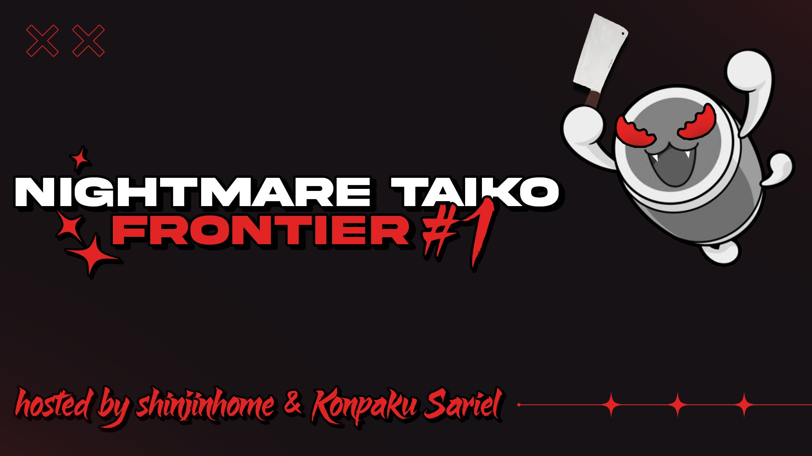
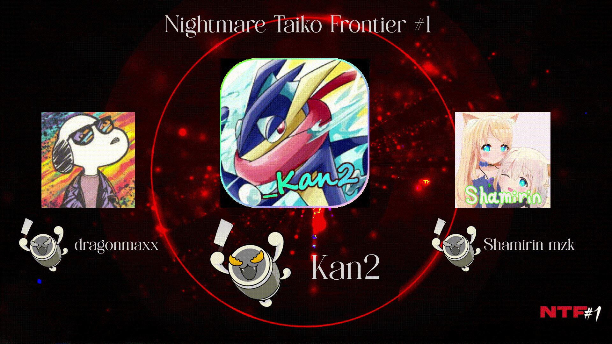

---
tags:
  - NTF
---

# Nightmare Taiko Frontier

The **Nightmare Taiko Frontier** (***NTF***) was a worldwide 1v1 double-elimination osu!taiko tournament hosted by ::{ flag=JP }:: [shinjinhome](https://osu.ppy.sh/users/30147970) and ::{ flag=KR }:: [Konpaku Sariel](https://osu.ppy.sh/users/533502). It was the first instalment of the Nightmare Taiko Frontier and part of the Taiko Frontier tournament series.

## Tournament schedule

| Event | Timestamp |
| --: | :-- |
| Registration phase | 2025-12-07/2026-01-07 |
| Screening phase | 2026-01-08/2026-01-11 |
| Qualifiers | 2026-01-16/2026-01-18 |
| Round of 61 | 2026-01-24/2026-01-25 |
| Round of 32 | 2026-01-30/2026-02-01 |
| Round of 16 | 2026-02-06/2026-02-08 |
| Quarterfinals | 2026-02-14/2026-02-15 |
| Semifinals | 2026-02-21/2026-02-22 |
| Finals | 2026-02-28/2026-03-01 |
| Grand Finals | 2026-03-07/2026-03-08 |

## Prizes

| Placing | Prize(s) |
| :-: | :-- |
|  | Unique profile badge, 2 months of osu!supporter, unique profile banner, `NTF #1 Champion` role on Taiko Frontier Discord server |
|  | Unique profile banner |
|  | Unique profile banner |

## Organisation

The Nightmare Taiko Frontier was run by various community members.

| Position | Member(s) |
| :-- | :-- |
| Host | ::{ flag=JP }:: [shinjinhome](https://osu.ppy.sh/users/30147970), ::{ flag=KR }:: [Konpaku Sariel](https://osu.ppy.sh/users/533502) |
| Map pooler | ::{ flag=JP }:: [Gsuncraft](https://osu.ppy.sh/users/30496573), ::{ flag=JP }:: [shinjinhome](https://osu.ppy.sh/users/30147970), ::{ flag=JP }:: [yakisode](https://osu.ppy.sh/users/35619347) |
| Mapper | ::{ flag=RU }:: [\_HeLLFly\_](https://osu.ppy.sh/users/14225226), ::{ flag=JP }:: [\_Rise](https://osu.ppy.sh/users/5217107), ::{ flag=JP }:: [-Kazuha](https://osu.ppy.sh/users/29978316), ::{ flag=JP }:: [4sbet1](https://osu.ppy.sh/users/11563671), ::{ flag=US }:: [5\_5](https://osu.ppy.sh/users/6853438), ::{ flag=JP }:: [Gsuncraft](https://osu.ppy.sh/users/30496573), ::{ flag=HK }:: [JarvisGaming](https://osu.ppy.sh/users/8601048), ::{ flag=JP }:: [layxa](https://osu.ppy.sh/users/14800030), ::{ flag=JP }:: [miyagishima](https://osu.ppy.sh/users/8027517), ::{ flag=JP }:: [na7yuta\_osu](https://osu.ppy.sh/users/22747806), ::{ flag=KR }:: [Peaceful](https://osu.ppy.sh/users/165027), ::{ flag=JP }:: [shinjinhome](https://osu.ppy.sh/users/30147970), ::{ flag=JP }:: [SORA\_T4kAhqSh1](https://osu.ppy.sh/users/30549266), ::{ flag=JP }:: [Syurin](https://osu.ppy.sh/users/20422042), ::{ flag=JP }:: [Waribashi](https://osu.ppy.sh/users/2250574), ::{ flag=TW }:: [X a v y](https://osu.ppy.sh/users/3738344), ::{ flag=JP }:: [yakisode](https://osu.ppy.sh/users/35619347) |
| Mappool tester | ::{ flag=RU }:: [\_HeLLFly\_](https://osu.ppy.sh/users/14225226), ::{ flag=JP }:: [-yukineko-](https://osu.ppy.sh/users/15159808), ::{ flag=JP }:: [Grape\_Tea](https://osu.ppy.sh/users/9540073), ::{ flag=JP }:: [marusuke75](https://osu.ppy.sh/users/28854025), ::{ flag=DE }:: [MrrMiller](https://osu.ppy.sh/users/9757858), ::{ flag=KR }:: [NaNaHiDa](https://osu.ppy.sh/users/30114023), ::{ flag=KR }:: [Peaceful](https://osu.ppy.sh/users/165027), ::{ flag=JP }:: [shinchikuhome](https://osu.ppy.sh/users/3174184) |
| Referee | ::{ flag=MX }:: [Annapurna](https://osu.ppy.sh/users/36965488), ::{ flag=MY }:: [DXA FonG](https://osu.ppy.sh/users/15019527), ::{ flag=US }:: [EpsilonMaiagare](https://osu.ppy.sh/users/3855052), ::{ flag=JP }:: [na7yuta\_osu](https://osu.ppy.sh/users/22747806), ::{ flag=KR }:: [NaNaHiDa](https://osu.ppy.sh/users/30114023), ::{ flag=JP }:: [nuku0315](https://osu.ppy.sh/users/8772103), ::{ flag=IN }:: [Pilo\_BFFRI](https://osu.ppy.sh/users/27266540), ::{ flag=JP }:: [shinjinhome](https://osu.ppy.sh/users/30147970), ::{ flag=US }:: [sonicthescrew](https://osu.ppy.sh/users/36769473), ::{ flag=NL }:: [TaikoMom](https://osu.ppy.sh/users/9086438), ::{ flag=US }:: [zempro](https://osu.ppy.sh/users/37507022) |
| Streamer | ::{ flag=US }:: [EpsilonMaiagare](https://osu.ppy.sh/users/3855052), ::{ flag=JP }:: [na7yuta\_osu](https://osu.ppy.sh/users/22747806), ::{ flag=KR }:: [NaNaHiDa](https://osu.ppy.sh/users/30114023), ::{ flag=JP }:: [Syurin](https://osu.ppy.sh/users/20422042), ::{ flag=NL }:: [TaikoMom](https://osu.ppy.sh/users/9086438) |
| Commentator | ::{ flag=GB }:: [-XxbluezaperxX-](https://osu.ppy.sh/users/12264218), ::{ flag=JP }:: [Grape\_Tea](https://osu.ppy.sh/users/9540073), ::{ flag=GB }:: [hornedlove](https://osu.ppy.sh/users/14072678), ::{ flag=KR }:: [Peaceful](https://osu.ppy.sh/users/165027), ::{ flag=RU }:: [plush seal](https://osu.ppy.sh/users/17381947), ::{ flag=JP }:: [shinjinhome](https://osu.ppy.sh/users/30147970) |
| Designer | ::{ flag=FR }:: [Kheops](https://osu.ppy.sh/users/18607342), ::{ flag=IN }:: [Pilot\_BFFRI](https://osu.ppy.sh/users/27266540) |
| Composer | ::{ flag=JP }:: [WhiteSakata](https://osu.ppy.sh/users/15400295) |
| Statistician | ::{ flag=JP }:: [Noko\_BSF](https://osu.ppy.sh/users/3811831) |
| Developer | ::{ flag=JP }:: [shaaaaaQ](https://osu.ppy.sh/users/16234052) |
| Wiki editor | ::{ flag=ID }:: [fajar13k](https://osu.ppy.sh/users/7100002) |

## Links

- [Discussion thread](https://osu.ppy.sh/community/forums/topics/2160698?n=1)
- [Discord server](https://discord.gg/35TQMEBXnt)
- [Livestream](https://www.twitch.tv/taikofrontier)
- [Website](https://taiko-frontier.vercel.app/en/ntf1)
- [Youtube channel](https://www.youtube.com/@TaikoFrontier_osu)
- [Challonge bracket](https://challonge.com/ja/oxt3t7lo)
- [Statistics sheet](https://drive.google.com/drive/folders/1sZtNz_-5zZ5hcuKrbElVoOco_6e7Itzs?usp=sharing)

## Participants

| Seed | Player | Global rank[^global-rank-registration] |
| :-- | :-- | :-- |
| #1 | ::{ flag=JP }:: [\[Crz\]yomogi237](https://osu.ppy.sh/users/28571440) | #30 |
| #2 | ::{ flag=JP }:: [\_Kan2](https://osu.ppy.sh/users/7160196) | #14 |
| #3 | ::{ flag=JP }:: [sachiqa](https://osu.ppy.sh/users/21542520) | #23 |
| #4 | ::{ flag=JP }:: [Shamirin\_mzk](https://osu.ppy.sh/users/11325757) | #24 |
| #5 | ::{ flag=US }:: [13 Stairs](https://osu.ppy.sh/users/14356353) | #13 |
| #6 | ::{ flag=AU }:: [HungryTurtle420](https://osu.ppy.sh/users/30338965) | #43 |
| #7 | ::{ flag=DE }:: [dragonmaxx](https://osu.ppy.sh/users/12160279) | #113 |
| #8 | ::{ flag=US }:: [AuroraPhasmata](https://osu.ppy.sh/users/13664116) | #62 |
| #9 | ::{ flag=JP }:: [CarsqL](https://osu.ppy.sh/users/25734391) | #50 |
| #10 | ::{ flag=BR }:: [HiroK](https://osu.ppy.sh/users/4050738) | #186 |
| #11 | ::{ flag=US }:: [mBiscuit](https://osu.ppy.sh/users/17061174) | #247 |
| #12 | ::{ flag=JP }:: [yuranin](https://osu.ppy.sh/users/17746140) | #34 |
| #13 | ::{ flag=TW }:: [monkeydluffy3u4](https://osu.ppy.sh/users/2277798) | #180 |
| #14 | ::{ flag=JP }:: [MROK\_221](https://osu.ppy.sh/users/35487271) | #94 |
| #15 | ::{ flag=AU }:: [Frostetic](https://osu.ppy.sh/users/30388979) | #93 |
| #16 | ::{ flag=BR }:: [miwoo](https://osu.ppy.sh/users/12630336) | #20 |
| #17 | ::{ flag=SK }:: [nevqr](https://osu.ppy.sh/users/14269506) | #53 |
| #18 | ::{ flag=MY }:: [vun](https://osu.ppy.sh/users/6932501) | #323 |
| #19 | ::{ flag=SK }:: [Alejar](https://osu.ppy.sh/users/12568571) | #187 |
| #20 | ::{ flag=JP }:: [mobmouser](https://osu.ppy.sh/users/24718103) | #124 |
| #21 | ::{ flag=PL }:: [knibblet](https://osu.ppy.sh/users/6922240) | #217 |
| #22 | ::{ flag=RU }:: [Den4ik228](https://osu.ppy.sh/users/7115174) | #88 |
| #23 | ::{ flag=US }:: [YouCanNotKnow](https://osu.ppy.sh/users/9311768) | #279 |
| #24 | ::{ flag=JP }:: [UoxoU\_4rk](https://osu.ppy.sh/users/27304274) | #100 |
| #25 | ::{ flag=SK }:: [Golden](https://osu.ppy.sh/users/12639462) | #46 |
| #26 | ::{ flag=JP }:: [barrier15300](https://osu.ppy.sh/users/32648254) | #267 |
| #27 | ::{ flag=US }:: [fractal161](https://osu.ppy.sh/users/23048879) | #503 |
| #28 | ::{ flag=GB }:: [spanner dude](https://osu.ppy.sh/users/12489832) | #567 |
| #29 | ::{ flag=PE }:: [alemagno333](https://osu.ppy.sh/users/11411697) | #305 |
| #30 | ::{ flag=CA }:: [TheCoconutHuman](https://osu.ppy.sh/users/27809747) | #534 |
| #31 | ::{ flag=BR }:: [ImTutu](https://osu.ppy.sh/users/16262582) | #210 |
| #32 | ::{ flag=BR }:: [irie-](https://osu.ppy.sh/users/29727936) | #349 |
| #33 | ::{ flag=FR }:: [YaniFR](https://osu.ppy.sh/users/11260982) | #71 |
| #34 | ::{ flag=FI }:: [duski](https://osu.ppy.sh/users/6506484) | #313 |
| #35 | ::{ flag=RU }:: [\_TheXFactory\_](https://osu.ppy.sh/users/15013948) | #213 |
| #36 | ::{ flag=SE }:: [yamfan](https://osu.ppy.sh/users/8669774) | #337 |
| #37 | ::{ flag=NO }:: [Nurend Fanboy](https://osu.ppy.sh/users/18916920) | #896 |
| #38 | ::{ flag=IT }:: [CRHIX](https://osu.ppy.sh/users/25662684) | #1,131 |
| #39 | ::{ flag=SE }:: [Anders8KJS](https://osu.ppy.sh/users/36024737) | #727 |
| #40 | ::{ flag=MX }:: [Hivan111](https://osu.ppy.sh/users/13525805) | #519 |
| #41 | ::{ flag=CA }:: [flakeur](https://osu.ppy.sh/users/19747043) | #998 |
| #42 | ::{ flag=BR }:: [Iko](https://osu.ppy.sh/users/11515189) | #678 |
| #43 | ::{ flag=FR }:: [Rezyia](https://osu.ppy.sh/users/13911899) | #912 |
| #44 | ::{ flag=US }:: [Momoiro Yume](https://osu.ppy.sh/users/19924725) | #291 |
| #45 | ::{ flag=PE }:: [Desinias](https://osu.ppy.sh/users/23361435) | #729 |
| #46 | ::{ flag=US }:: [Inigo](https://osu.ppy.sh/users/5592441) | #397 |
| #47 | ::{ flag=US }:: [Chupalika](https://osu.ppy.sh/users/1926383) | #974 |
| #48 | ::{ flag=FI }:: [BFKB113PBK](https://osu.ppy.sh/users/13613362) | #78 |
| #49 | ::{ flag=BR }:: [KaZuoo](https://osu.ppy.sh/users/9599359) | #331 |
| #50 | ::{ flag=AR }:: [SUPERNOOB20](https://osu.ppy.sh/users/16422988) | #719 |
| #51 | ::{ flag=BR }:: [Gholdengo](https://osu.ppy.sh/users/16456158) | #552 |
| #52 | ::{ flag=RU }:: [Midorimomoika](https://osu.ppy.sh/users/6580862) | #885 |
| #53 | ::{ flag=RU }:: [plush seal](https://osu.ppy.sh/users/17381947) | #1,045 |
| #54 | ::{ flag=GB }:: [DemonSlayer6669](https://osu.ppy.sh/users/17526815) | #1,141 |
| #55 | ::{ flag=MX }:: [reisen91937](https://osu.ppy.sh/users/25396679) | #524 |
| #56 | ::{ flag=PH }:: [wwowie](https://osu.ppy.sh/users/19445999) | #1,021 |
| #57 | ::{ flag=RO }:: [mikuhatsunegirl10](https://osu.ppy.sh/users/1188782) | #1,452 |
| #58 | ::{ flag=CA }:: [DrummerDragon](https://osu.ppy.sh/users/21779285) | #1,804 |
| #59 | ::{ flag=US }:: [Peac3Sush1](https://osu.ppy.sh/users/30714166) | #2,984 |
| #60 | ::{ flag=MX }:: [Lucio\_](https://osu.ppy.sh/users/19113773) | #6,463 |
| #61 | ::{ flag=TW }:: [HANABI\_RN](https://osu.ppy.sh/users/26696007) | #5,632 |

## Podium

## Mappools

### Grand Finals

- No Mod
  1. [Laur - Exitium (Hana Hayashi) \[Cosmic Apoptosis\]](https://osu.ppy.sh/beatmapsets/2158162#taiko/4549790)
  2. [DJ-Orca - OD BUNNY (X a v y) \[Suicide\]](https://osu.ppy.sh/beatmapsets/2516390#taiko/5550128)
  3. [Camellia - 24-Dimensional Non-Euclidean Deep Blue Starfall Vertigo (JarvisGaming) \[Nightmare\]](https://osu.ppy.sh/beatmapsets/2516426#taiko/5550187)
  4. [monoqlom - aremite (4sbet1) \[extream\]](https://osu.ppy.sh/beatmapsets/2516366#taiko/5549992)
  5. [So Sus + Konka - Acorn (Faputa) \[Quercus\]](https://osu.ppy.sh/beatmapsets/1901430#taiko/3919985)
  6. [RoughSketch - 666 ("999" Camellia's Unofficial / Rejected Remix) (X a v y) \[Nightmare\]](https://osu.ppy.sh/beatmapsets/2516392#taiko/5550130)
- Double Time
  1. [Nor - OperationD (xi Remix) (4sbet1) \[Special Operations: Decagrammaton\]](https://osu.ppy.sh/beatmapsets/2516370#taiko/5550009)
  2. [Tsukuyomi - IF (arcpotato) \[Hell Oni\]](https://osu.ppy.sh/beatmapsets/2127745#taiko/4514602)
  3. [vyrval - \*H+3+YAD\*7luCJIo0T6... (Genjuro) \[THEVOICESINMYHEAD\]](https://osu.ppy.sh/beatmapsets/2146030#taiko/4520288)
  4. [4nzu - ENIGMA ZAG (Genjuro) \[Hell Oni\]](https://osu.ppy.sh/beatmapsets/1925165#taiko/3974925)
- Force Mod
  1. [GTS Sound Team "takehirotei" - GTS:FINAL\_ROAD\_MEGAMIX (uone) \[GRAND_FINALE\]](https://osu.ppy.sh/beatmapsets/2343541#taiko/5230492)
  2. [trapman - minefield surfing (n1doking) \[Jester\]](https://osu.ppy.sh/beatmapsets/646702#taiko/1370173)
  3. [Nizikawa - Metamorphose (Raphalge) \[Inner Oni\]](https://osu.ppy.sh/beatmapsets/2458443#taiko/5375986)
- Free Speed
  1. [Jiiko - Wocky (Maimaing) \[Hell Oni\]](https://osu.ppy.sh/beatmapsets/1744951#taiko/3568943)
  2. [II-L - VANGUARD-1 (Axer) \[Satellite\]](https://osu.ppy.sh/beatmapsets/1407228#taiko/2901604)
  3. [Dion Timmer - Shiawase (VIP) (koul) \[Tidal Wave\]](https://osu.ppy.sh/beatmapsets/2074958#taiko/4343374)
- Tiebreaker
  **1. [WhiteSakata - Devotion maid in a Daydream (shinjinhome) \[Your Nightmare ends here, congrats\]](https://osu.ppy.sh/beatmapsets/2516486#taiko/5550333)**

### Finals

- No Mod
  1. [cosMo@BousouP feat. Yuzuki Yukari - Raid Boss: CATASTROPHiC LoVE (Idealism) \[CATASTROPHE\]](https://osu.ppy.sh/beatmapsets/1118202#taiko/2335693)
  2. [Kobaryo - HUG AND KILL (KyeX) \[CRY AND DIE\]](https://osu.ppy.sh/beatmapsets/1848009#taiko/3796183)
  3. [tailspun ft. eili - Destroy, Destroy (X a v y) \[spirit ruins\]](https://osu.ppy.sh/beatmapsets/2512887#taiko/5539428)
  4. [Slax - Loli 2000 (- Sensei -) \[\<3 1.4x (300bpm)\]](https://osu.ppy.sh/beatmapsets/2491696#taiko/5474277)
  5. [nacho - rip (Nifty) \[KUDASAI\]](https://osu.ppy.sh/beatmapsets/2199550#taiko/4654924)
  6. [96-glass - codesight. Megamix (\_Rise) \[Hell Oni\]](https://osu.ppy.sh/beatmapsets/2512883#taiko/5539419)
- Double Time
  1. [Xyris - FOXGLOVE (Irone OSU) \[Deceitful Bouquet\]](https://osu.ppy.sh/beatmapsets/2325243#taiko/4984081)
  2. [PinocchioP feat. Hatsune Miku - Kusare-gedou and Chocolate (Gsuncraft) \[4rk's Inner Oni\]](https://osu.ppy.sh/beatmapsets/2237251#taiko/5283878)
  3. [Toromaru - Wasteland (Cut Ver.) (Gamelan4) \[Disposal\]](https://osu.ppy.sh/beatmapsets/2357933#taiko/5079475)
  4. [Kikuo - Aishite Aishite Aishite (Alchyr) \[<3\]](https://osu.ppy.sh/beatmapsets/2195740#taiko/4646141)
- Force Mod
  1. [Ishino Takkyu - From Under to Upper (Peaceful) \[Tutorial\]](https://osu.ppy.sh/beatmapsets/2512875#taiko/5539387)
  2. [7\_7 - mck r nttles (Nifty) \[stnging\]](https://osu.ppy.sh/beatmapsets/2127798#taiko/4473055)
  3. [Qoiet - Shunyata (tasuke912) \[Expert\]](https://osu.ppy.sh/beatmapsets/667033#taiko/1411524)
- Free Speed
  1. [Harumaki Gohan feat. Hatsune Miku - Zero Talking (Raphalge) \[Inner Oni\]](https://osu.ppy.sh/beatmapsets/2081307#taiko/4358545)
  2. [MAX - Checklist (feat. Chromeo) (\_gt) \[123 // abc\]](https://osu.ppy.sh/beatmapsets/2155487#taiko/4543374)
  3. [KERO - Color Printer (SimplySynthy) \[Personal Computer\]](https://osu.ppy.sh/beatmapsets/2167213#taiko/4572334)
- Tiebreaker
  1. **[Camellia - Parallel Universe Shifter (miyagishima) \[Time-Space Shift in the Dream World\]](https://osu.ppy.sh/beatmapsets/2512855#taiko/5539340)**

### Semifinals

**[Download the mappack here! (85 MB)](https://mega.nz/file/KtRynJ5Y#Ce06szAM7gkP5rfYL4YtLgEr-w31HeJMxhLAsj-mOds)**

- No Mod
  1. [Her Bright Skies - The Glorious (Final Sketch Remix) (yea) \[Disappearance II\]](https://osu.ppy.sh/beatmapsets/772463#taiko/1623809)
  2. [shio - Qronostasis -GABBA vs. Speedcore mix- (Genjuro) \[Green's Extra Stage\]](https://osu.ppy.sh/beatmapsets/2279133#taiko/4861552)
  3. [RefraQ & Vorso - Biomes (Cut Ver.) (\_gt) \[Apogee\]](https://osu.ppy.sh/beatmapsets/2365924#taiko/5102117)
  4. [Lime - BEYOND (Syurin) \[Ascension\]](https://osu.ppy.sh/beatmapsets/2509110#taiko/5527047)
  5. [Schwank - null (SORA\_T4kAhqSh1) \[Emptiness\]](https://osu.ppy.sh/beatmapsets/2509111#taiko/5527049)
- Double Time
  1. [LiSA - Rising Hope (LU-I Remix) (Faputa) \[Irregularity\]](https://osu.ppy.sh/beatmapsets/771492#taiko/1621929)
  2. [Arash - Temptation (feat. Rebecca) (Nightcore Mix) (nevqr) \[Ura Oni\]](https://osu.ppy.sh/beatmapsets/2109078#taiko/4429959)
  3. [KOTONOHOUSE - Can u feel my heart feat. punipunidenki (-Kazuha) \[Heartbeats\]](https://osu.ppy.sh/beatmapsets/2509108#taiko/5527044)
  4. [sanj - last minute (sakuraburst remix) (\[Zeth\]) \[the withering existence\]](https://osu.ppy.sh/beatmapsets/835011#taiko/1748990)
- Force Mod
  1. [HARI KARI - MIRROR FRAGMENT (D3kuu) \[REPLICA\]](https://osu.ppy.sh/beatmapsets/971297#taiko/2248574)
  2. [Mamiya Kaede feat.Hatsune Miku - Fukusei Sareta Sora no Kioku (na7yuta\_osu) \[Type:BlackyNight \[R\]\]](https://osu.ppy.sh/beatmapsets/2509101#taiko/5527017)
- Free Speed
  1. [Drazically - Reality:SHIFT (-Kazuha) \[Hell Oni\]](https://osu.ppy.sh/beatmapsets/2335282#taiko/5013444)
  2. [bbno$ - it boy (nevqr) \[im him\]](https://osu.ppy.sh/beatmapsets/2232653#taiko/4740014)
  3. [Pizuya's Cell - Kagayaku Hari no Kobitozoku \~ Little Princess (CallMeLyra) \[Shining Needle Sword\]](https://osu.ppy.sh/beatmapsets/1178342#taiko/2457407)
- Tiebreaker
  1. [Camellia - Tojita Sekai (Gsuncraft) \[Unexplored\]](https://osu.ppy.sh/beatmapsets/2509131#taiko/5527095)

### Quarterfinals

**[Download the mappack here! (83 MB)](https://mega.nz/file/b8QjmR7K#iunyyz_qrYAHzyFAOpoKTAEZp5jNdCNFPRIPaA65aYc)**

- No Mod
  1. [Katagiri - Baby, Please (Loveriche) \[Kill me\]](https://osu.ppy.sh/beatmapsets/1671952#taiko/3414926)
  2. [PinocchioP feat. Hatsune Miku - Weekly Shonen BYE-BYE (Gsuncraft) \[bye bye\]](https://osu.ppy.sh/beatmapsets/2409109#taiko/5229800)
  3. [Sven Noon - The Map (uone) \[Taiko\]](https://osu.ppy.sh/beatmapsets/1850669#taiko/3801800)
  4. [Aversions Crown - Erebus (Heaxys) \[Guilt\]](https://osu.ppy.sh/beatmapsets/1692984#taiko/3459491)
  5. [XH - Saviour of Speedcore (- Sensei -) \[nute edit\]](https://osu.ppy.sh/beatmapsets/2505643#taiko/5516862)
- Double Time
  1. [xi - XaleidoscopiX (Raytoly) \[RE:Master\]](https://osu.ppy.sh/beatmapsets/2409296#taiko/5265825)
  2. [Yousei Teikoku - Shadow Corps (Eyenine) \[Oni\]](https://osu.ppy.sh/beatmapsets/2330270#taiko/4998231)
  3. [Ray\_Oh - Eternal Nail (feat. yuzuha) (miyagishima) \[Inner Oni\]](https://osu.ppy.sh/beatmapsets/2505607#taiko/5516717)
  4. [HiTECH NINJA - Memecore (Nifty) \[burger gaming\]](https://osu.ppy.sh/beatmapsets/1687499#taiko/3448739)
- Force Mod
  1. [BilliumMoto - Four Veiled Stars (Ulqui) \[End\]](https://osu.ppy.sh/beatmapsets/2113156#taiko/4436813)
  2. [yowanecity - Tensai (Yunosuke Remix) (Shamirin\_mzk) \[Criminal\]](https://osu.ppy.sh/beatmapsets/1996134#taiko/4148533)
- Free Speed
  1. [Nizikawa - Grenade 8455 (\_Rise) \[Inner Oni\]](https://osu.ppy.sh/beatmapsets/2055067#taiko/4293883)
  2. [AAAA - Hazukashigariya no Toy Soldier (\_gt) \[Shy Toy Soldier\]](https://osu.ppy.sh/beatmapsets/2182073#taiko/4610418)
  3. [D(ABE3) - MANIERA (\_yu68) \[Virtuoso\]](https://osu.ppy.sh/beatmapsets/400761#taiko/871924)
- Tiebreaker
    1. **[Camellia - Blackmagik Blazing (Waribashi) \[Dream\]](https://osu.ppy.sh/beatmapsets/2505608#taiko/5516719)**

### Round of 16

**[Download the mappack here! (67 MB)](https://mega.nz/file/m4IRACCC#JL354o5BNKj7JPZMxlbTDrsWICddmmxbzwRClwpHDz8)**

- No Mod
  1. [ITHAQUA - aoi kokoro (Hivie) \[hivie & \_rise's beloved\]](https://osu.ppy.sh/beatmapsets/2036468#taiko/4246968)
  2. [Aquestion - Umami Blaze (youtune3) \[Infernal Oni\]](https://osu.ppy.sh/beatmapsets/1976814#taiko/4103528)
  3. [nitro (as "summersick") - summersick (Paraxia) \[inner oni\]](https://osu.ppy.sh/beatmapsets/2039248#taiko/4253503)
  4. [Hardestboy - Fuck Them All (tasuke912) \[XXXX\]](https://osu.ppy.sh/beatmapsets/1061580#taiko/2223033)
- Double Time
  1. [Aoi (CV: Iguchi Yuka), Hinata (CV: Asumi Kana) - Irochigai no Tsubasa (YUPPUN Remix Reloaded) (yakisode) \[Wings\]](https://osu.ppy.sh/beatmapsets/2465547#taiko/5397285)
  2. [Camellia - FLYING OUT TO THE SKY (covered by Nanahira, moimoi, Nana Takahashi) (Boaz) \[KYEX'S ONI\]](https://osu.ppy.sh/beatmapsets/1906986#taiko/3946841)
  3. [Halozy - Don't let you down (ler1211) \[Believe in me\]](https://osu.ppy.sh/beatmapsets/2282096#taiko/4865876)
- Force Mod
  1. [Umeboshi Chazuke - Galaxy in Toybox (maziari1105) \[The Chipstyle World\]](https://osu.ppy.sh/beatmapsets/559156#taiko/1182564)
  2. [junko - DRIVE FOR HAPPINESS!! (Jayceko) \[SCDC-00166\]](https://osu.ppy.sh/beatmapsets/2384385#taiko/5155784)
- Free Speed
  1. [Noisia - Anomaly (maziari1105) \[Insane\]](https://osu.ppy.sh/beatmapsets/1222464#taiko/2542673)
  2. [braven - Texas Energy (_Rise) \[Inner Oni\]](https://osu.ppy.sh/beatmapsets/1661690#taiko/3392234)
  3. [Memme - One Plus One Is Cutie (Horiiizon) \[Horiiizon Plus Oui Is Cutie\]](https://osu.ppy.sh/beatmapsets/1914410#taiko/3949433)
- Tiebreaker
  1. **[ReeK - Nebula Blast (SORA\_T4kAhqSh1) \[7yuta & Sora collab\]](https://osu.ppy.sh/beatmapsets/2502038#taiko/5505214)**

### Round of 32

**[Download the mappack here! (66 MB)](https://mega.nz/file/ThgFwIIJ#chIeTkQZLOWsnLEUPRJKBvGwAJx3b8y1K63q19ZpBGc)**

- No Mod
  1. [MisoilePunch - Overrrload!! (iloveyou4ever) \[Hyperrr!!\]](https://osu.ppy.sh/beatmapsets/1837749#taiko/3773551)
  2. [Halv - Karyu-ikkaku (yakisode) \[Oni\]](https://osu.ppy.sh/beatmapsets/2461031#taiko/5392982)
  3. [Pluvio - Square Peg (ZTH) \[Round Oni\]](https://osu.ppy.sh/beatmapsets/1985507#taiko/4124071)
  4. [cosMo@BousouP - MOW\*MOW\*ABDUCTION!!! (yakisode) \[Oni\]](https://osu.ppy.sh/beatmapsets/2498583#taiko/5494498)
- Double Time
  1. [tashi - Farthest Galaxy (na7yuta\_osu) \[Galaxy Hook\]](https://osu.ppy.sh/beatmapsets/2498606#taiko/5494565)
  2. [Kano - Sukisuki Zecchoushou (ler1211) \[Oni\]](https://osu.ppy.sh/beatmapsets/1967663#taiko/4080772)
  3. [HyuN - Grin (radar) \[',:^)\]](https://osu.ppy.sh/beatmapsets/1402385#taiko/3020440)
- Force Mod
  1. [rintaro soma - solips (Raytoly) \[Re:ALIZE\]](https://osu.ppy.sh/beatmapsets/1859776#taiko/3822995)
  2. [tarolabo - B a r o q u e (ZTH) \[Hell Oni\]](https://osu.ppy.sh/beatmapsets/1247605#taiko/2593156)
- Free Speed
  1. [Aoris (feat. Kaai Yuki) - Lotus Eater (TKS) \[Apathy\]](https://osu.ppy.sh/beatmapsets/1556093#taiko/3178876)
  2. [technoplanet - Insomnia (hz404) \[Sleepless Oni\]](https://osu.ppy.sh/beatmapsets/2264561#taiko/4857451)
  3. [kyou1110 - I'm gonNA choke (Nifty) \[fart oni\]](https://osu.ppy.sh/beatmapsets/1489498#taiko/3053337)
- Tiebreaker
  1. **[Affected - Abstrakt Visualisering (SORA\_T4kAhqSh1) \[Oni\]](https://osu.ppy.sh/beatmapsets/2498607#taiko/5494566)**

### Round of 61

**[Download the mappack here! (41 MB)](https://mega.nz/file/z4RSnKDC#MNlUJ5uNDq-FhyYB0M6QcmfwQuuu19r8gVatV6ZgiGU)**

- No Mod
  1. [Annoying Ringtone - The Day You Die (Mew) \[Mew's Taiko\]](https://osu.ppy.sh/beatmapsets/1134084#taiko/2368395)
  2. [KaratoPanchiiShounen feat. Haruno - A Wandering Melody of Love (KyeX) \[Melodic Romance\]](https://osu.ppy.sh/beatmapsets/1748598#taiko/3576717)
  3. [EmoCosine - Cutter (Boaz) \[Agony\]](https://osu.ppy.sh/beatmapsets/1734692#taiko/3545502)
  4. [Silentroom - Finixe (Gsuncraft) \[Starry Sky\]](https://osu.ppy.sh/beatmapsets/2458430#taiko/5375969)
- Double Time
  1. [YurryCanon feat. GUMI - Suicide Parade (woyouyuyuzheng) \[Inner Oni\]](https://osu.ppy.sh/beatmapsets/2175372#taiko/4593373)
  2. [Kairiki bear feat. Hatsune Miku - Shippaisaku Shoujo (FabriGamer84) \[2199's Oni\]](https://osu.ppy.sh/beatmapsets/2209562#taiko/4754191)
  3. [The Flashbulb - The Bridgeport Run (Faputa) \[Inner Oni\]](https://osu.ppy.sh/beatmapsets/1215016#taiko/3301984)
- Force Mod
  1. [Marmalade butcher - Amanita (Eltigant) \[Hell Oni\]](https://osu.ppy.sh/beatmapsets/2270594#taiko/4836218)
  2. [Diplo - Express Yourself (feat. Nicky Da B) [Saint Punk Remix] (Nightcore Mix) (Jayceko) \[Invisible's Expression\]](https://osu.ppy.sh/beatmapsets/1949363#taiko/4036652)
- Free Speed
  1. [Eisyo-kobu - Faithtival (Alwaysyukaz) \[Inner Oni\]](https://osu.ppy.sh/beatmapsets/2254161#taiko/4794977)
  2. [Tomatsu Haruka, Hikasa Yoko, Amamiya Sora - Eyecatch! Too Much! (Volta) \[Inner Oni! Too Much!\]](https://osu.ppy.sh/beatmapsets/554873#taiko/1174566)
  3. [Zekk - Foresight (HiroK) \[Hell Oni\]](https://osu.ppy.sh/beatmapsets/1440285#taiko/2963225)
- Tiebreaker
  1. **[aa...hisuichazuke... - steganography (gaston\_2199) \[Encrypted Message\]](https://osu.ppy.sh/beatmapsets/1847490#taiko/3795119)**

### Qualifiers

**[Download the mappack here! (36 MB)](https://mega.nz/file/TgQj0IoY#DjcUyf2cx_VWnJuWlqWMV6BWJuG5zB06n6Tr1In2mdM)**

- No Mod
  1. [Juggernaut. vs. Gram - Seraphim (Creeperbrine303) \[Heaven\]](https://osu.ppy.sh/beatmapsets/2222905#taiko/4737649)
  2. [inabakumori - Lost Umbrella (7\_7 bootleg) (KTYN) \[Disappear\]](https://osu.ppy.sh/beatmapsets/1555914#taiko/3178536)
  3. [Scale J - bubble (\_Rise) \[Inner Oni\]](https://osu.ppy.sh/beatmapsets/1530050#taiko/3129607)
  4. [Kobaryo - New Game Plus (Genjuro) \[Challenge\]](https://osu.ppy.sh/beatmapsets/1249951#taiko/2598031)
- Double Time
  1. [Natori Sana - Sana no Outa. (Angeart J-Core Edit) (KTYN) \[Xavy's Gratitude\]](https://osu.ppy.sh/beatmapsets/1298908#taiko/2806496)
  2. [Digital Math - The Musky Thrust (Jaltzu) \[Inner Oni\]](https://osu.ppy.sh/beatmapsets/1153833#taiko/2408145)
- Force Mod
  1. [ik4sumi - Collider (\_HeLLFly\_) \[Singularity\]](https://osu.ppy.sh/beatmapsets/2491679#taiko/5474231)

## Match results

### Grand Finals

Saturday, 7 March 2026:

| Player 1 |  |  | Player 2 | Match link |
| --: | :-: | :-: | :-- | :-- |
| Shamirin\_mzk ::{ flag=JP }:: | 3 | **7** | ::{ flag=DE }:: **dragonmaxx** | [#1](https://osu.ppy.sh/community/matches/120672074) |

Sunday, 8 March 2026:

| Player 1 |  |  | Player 2 | Match link |
| --: | :-: | :-: | :-- | :-- |
| **\_Kan2** ::{ flag=JP }:: | **7** | 2 | ::{ flag=DE }:: dragonmaxx | [#1](https://osu.ppy.sh/community/matches/120682675) |

### Finals

Saturday, 28 February 2026:

| Player 1 |  |  | Player 2 | Match link |
| --: | :-: | :-: | :-- | :-- |
| **sachiqa** ::{ flag=JP }:: | **7** | 3 | ::{ flag=BR }:: HiroK | [#1](https://osu.ppy.sh/community/matches/120622607) |
| AuroraPhasmata ::{ flag=US }:: | -1 | **0** | ::{ flag=DE }:: **dragonmaxx** | [#1](https://osu.ppy.sh/community/matches/) |

Sunday, 1 March 2026:

| Player 1 |  |  | Player 2 | Match link |
| --: | :-: | :-: | :-- | :-- |
| **dragonmaxx** ::{ flag=DE }:: | **7** | 5 | ::{ flag=JP }:: sachiqa | [#1](https://osu.ppy.sh/community/matches/120632518) |
| **\_Kan2** ::{ flag=JP }:: | **7** | 1 | ::{ flag=JP }:: Shamirin\_mzk | [#1](https://osu.ppy.sh/community/matches/120633393) |

### Semifinals

Saturday, 21 February 2026:

| Player 1 |  |  | Player 2 | Match link |
| --: | :-: | :-: | :-- | :-- |
| \[Crz\]yomogi237 ::{ flag=JP }:: | -1 | **0** | ::{ flag=AU }:: **HungryTurtle420** | *win by default* |
| 13 Stairs ::{ flag=US }:: | -1 | **0** | ::{ flag=BR }:: **HiroK** | *win by default* |
| AuroraPhasmata ::{ flag=US }:: | 1 | **6** | ::{ flag=JP }:: **Shamirin\_mzk** | [#1](https://osu.ppy.sh/community/matches/120574010) |
| **\_Kan2** ::{ flag=JP }:: | **6** | 1 | ::{ flag=JP }:: sachiqa | [#1](https://osu.ppy.sh/community/matches/120576274) |
| **dragonmaxx** ::{ flag=DE }:: | **6** | 1 | ::{ flag=BR }:: miwoo | [#1](https://osu.ppy.sh/community/matches/120577167) |
| **mBiscuit** ::{ flag=US }:: | 0 | -1 | ::{ flag=BR }:: ImTutu | *win by default* |

Sunday, 22 February 2026:

| Player 1 |  |  | Player 2 | Match link |
| --: | :-: | :-: | :-- | :-- |
| HungryTurtle420 ::{ flag=AU }:: | -1 | **0** | ::{ flag=BR }:: **HiroK** | *win by default* |
| **dragonmaxx** ::{ flag=DE }:: | **6** | 5 | ::{ flag=US }:: mBiscuit | [#1](https://osu.ppy.sh/community/matches/120586674) |

### Quarterfinals

Saturday, 14 February 2026:

| Player 1 |  |  | Player 2 | Match link |
| --: | :-: | :-: | :-- | :-- |
| **HiroK** ::{ flag=BR }:: | **6** | 3 | ::{ flag=RU }:: \_TheXFactory\_ | [#1](https://osu.ppy.sh/community/matches/120528716) |
| **monkeydluffy3u4** ::{ flag=TW }:: | **6** | 4 | ::{ flag=CA }:: TheCoconutHuman | [#1](https://osu.ppy.sh/community/matches/120521249) |
| yuranin ::{ flag=JP }:: | 3 | **6** | ::{ flag=BR }:: **miwoo** | [#1](https://osu.ppy.sh/community/matches/120521617) |
| UoxoU\_4rk ::{ flag=JP }:: | 3 | **6** | ::{ flag=JP }:: **barrier15300** | [#1](https://osu.ppy.sh/community/matches/120522719) |
| BFKB113PBK ::{ flag=FI }:: | -1 | **0** | ::{ flag=BR }:: **ImTutu** | *win by default* |
| **MROK\_221** ::{ flag=JP }:: | **6** | 3 | ::{ flag=PE }:: alemagno333 | [#1](https://osu.ppy.sh/community/matches/120524933) |
| **HungryTurtle420** ::{ flag=AU }:: | 0 | -1 | ::{ flag=GB }:: spanner dude | *win by default* |

Sunday, 15 February 2026:

| Player 1 |  |  | Player 2 | Match link |
| --: | :-: | :-: | :-- | :-- |
| **miwoo** ::{ flag=BR }:: | **6** | 5 | ::{ flag=TW }:: monkeydluffy3u4 | [#1](https://osu.ppy.sh/community/matches/120524956) |
| **Frostetic** ::{ flag=AU }:: | **6** | 2 | ::{ flag=BR }:: irie- | [#1](https://osu.ppy.sh/community/matches/120529296) |
| barrier15300 ::{ flag=JP }:: | 2 | **6** | ::{ flag=BR }:: **ImTutu** | [#1](https://osu.ppy.sh/community/matches/120529640) |
| **HiroK** ::{ flag=BR }:: | **6** | 3 | ::{ flag=AU }:: Frostetic | [#1](https://osu.ppy.sh/community/matches/120529934) |
| \[Crz\]yomogi237 ::{ flag=JP }:: | 5 | **6** | ::{ flag=US }:: **AuroraPhasmata** | [#1](https://osu.ppy.sh/community/matches/120530337) |
| **Shamirin\_mzk** ::{ flag=JP }:: | **6** | 4 | ::{ flag=US }:: 13 Stairs | [#1](https://osu.ppy.sh/community/matches/120531810) |
| **sachiqa** ::{ flag=JP }:: | **6** | 4 | ::{ flag=US }:: mBiscuit | [#1](https://osu.ppy.sh/community/matches/120530380) |
| **HungryTurtle420** ::{ flag=AU }:: | **6** | 4 | ::{ flag=JP }:: MROK\_221 | [#1](https://osu.ppy.sh/community/matches/120531558) |
| **\_Kan2** ::{ flag=JP }:: | **6** | 2 | ::{ flag=DE }:: dragonmaxx | [#1](https://osu.ppy.sh/community/matches/120531563) |

### Round of 16

Friday, 6 February 2026:

| Player 1 |  |  | Player 2 | Match link |
| --: | :-: | :-: | :-- | :-- |
| **ImTutu** ::{ flag=BR }:: | **5** | 0 | ::{ flag=RU }:: plush seal | [#1](https://osu.ppy.sh/community/matches/120469046) |
| **irie-** ::{ flag=BR }:: | **5** | 2 | ::{ flag=FR }:: Rezyia | [#1](https://osu.ppy.sh/community/matches/120469898) |

Saturday, 7 February 2026:

| Player 1 |  |  | Player 2 | Match link |
| --: | :-: | :-: | :-- | :-- |
| **knibblet** ::{ flag=PL }:: | **0** | -1 | ::{ flag=FI }:: duski | *win by default* |
| fractal161 ::{ flag=US }:: | 0 | **5** | ::{ flag=BR }:: **miwoo** | [#1](https://osu.ppy.sh/community/matches/120470687) |
| **barrier15300** ::{ flag=JP }:: | **5** | 2 | ::{ flag=PE }:: Desinias | [#1](https://osu.ppy.sh/community/matches/120480504) |
| **vun** ::{ flag=MY }:: | **5** | 1 | ::{ flag=NO }:: Nurend Fanboy | [#1](https://osu.ppy.sh/community/matches/120473010) |
| **YouCanNotKnow** ::{ flag=US }:: | **0** | -1 | ::{ flag=SE }:: yamfan | *win by default* |
| KaZuoo ::{ flag=BR }:: | 3 | **5** | ::{ flag=IT }:: **CRHIX** | [#1](https://osu.ppy.sh/community/matches/120473741) |
| wwowie ::{ flag=PH }:: | 1 | **5** | ::{ flag=RU }:: **\_TheXFactory\_** | [#1](https://osu.ppy.sh/community/matches/120473786) |
| **Den4ik228** ::{ flag=RU }:: | **0** | -1 | ::{ flag=FR }:: YaniFR | *win by default* |
| mobmouser ::{ flag=JP }:: | -1 | **0** | ::{ flag=SE }:: **Anders8KJS** | *win by default* |
| **TheCoconutHuman** ::{ flag=CA }:: | **0** | -1 | ::{ flag=JP }:: CarsqL | *win by default* |
| **Alejar** ::{ flag=SK }:: | **5** | 2 | ::{ flag=MX }:: Hivan111 | [#1](https://osu.ppy.sh/community/matches/120476465) |
| CRHIX ::{ flag=IT }:: | 3 | **5** | ::{ flag=BR }:: **irie-** | [#1](https://osu.ppy.sh/community/matches/120477787) |
| **spanner dude** ::{ flag=GB }:: | **5** | 1 | ::{ flag=US }:: Chupalika | [#1](https://osu.ppy.sh/community/matches/120478971) |

Sunday, 8 February 2026:

| Player 1 |  |  | Player 2 | Match link |
| --: | :-: | :-: | :-- | :-- |
| knibblet ::{ flag=PL }:: | -1 | **0** | ::{ flag=GB }:: **spanner dude** | *win by default* |
| vun ::{ flag=MY }:: | 0 | **5** | ::{ flag=BR }:: **ImTutu** | [#1](https://osu.ppy.sh/community/matches/120479892) |
| **13 Stairs** ::{ flag=US }:: | **5** | 3 | yuranin | [#1](https://osu.ppy.sh/community/matches/120481587) |
| **AuroraPhasmata** ::{ flag=US }:: | **5** | 1 | ::{ flag=JP }:: UoxoU\_4rk | [#1](https://osu.ppy.sh/community/matches/120481804) |
| **\_Kan2** ::{ flag=JP }:: | **5** | 0 | ::{ flag=AU }:: Frostetic | [#1](https://osu.ppy.sh/community/matches/120481832) |
| YouCanNotKnow ::{ flag=US }:: | -1 | **0** | ::{ flag=JP }:: **barrier15300** | *win by default* |
| **Shamirin\_mzk** ::{ flag=JP }:: | **5** | 2 | ::{ flag=TW }:: monkeydluffy3u4 | [#1](https://osu.ppy.sh/community/matches/120482308) |
| **sachiqa** ::{ flag=JP }:: | **5** | 1 | ::{ flag=JP }:: MROK\_221 | [#1](https://osu.ppy.sh/community/matches/120483067) |
| **dragonmaxx** ::{ flag=DE }:: | **5** | 4 | ::{ flag=BR }:: HiroK | [#1](https://osu.ppy.sh/community/matches/120483438) |
| **alemagno333** ::{ flag=PE }:: | **5** | 0 | ::{ flag=BR }:: Iko | [#1](https://osu.ppy.sh/community/matches/120483872) |
| Den4ik228 ::{ flag=RU }:: | 1 | **5** | ::{ flag=BR }:: **miwoo** | [#1](https://osu.ppy.sh/community/matches/120483783) |
| **\[Crz\]yomogi237** ::{ flag=JP }:: | **5** | 0 | ::{ flag=FI }:: BFKB113PBK | [#1](https://osu.ppy.sh/community/matches/120483876) |
| **Golden** ::{ flag=SK }:: | **5** | 1 | ::{ flag=US }:: Inigo | [#1](https://osu.ppy.sh/community/matches/120484371) |
| Alejar ::{ flag=SK }:: | 2 | **5** | ::{ flag=CA }:: **TheCoconutHuman** | [#1](https://osu.ppy.sh/community/matches/120484252) |
| **\_TheXFactory\_** ::{ flag=RU }:: | **5** | 4 | ::{ flag=SK }:: Golden | [#1](https://osu.ppy.sh/community/matches/120484793) |
| Anders8KJS ::{ flag=SE }:: | 0 | **5** | ::{ flag=PE }:: **alemagno333** | [#1](https://osu.ppy.sh/community/matches/120484823) |
| HungryTurtle420 ::{ flag=AU }:: | 4 | **5** | ::{ flag=US }:: **mBiscuit** | [#1](https://osu.ppy.sh/community/matches/120478982) |

### Round of 32

Friday, 30 January 2026:

| Player 1 |  |  | Player 2 | Match link |
| --: | :-: | :-: | :-- | :-- |
| **plush seal** ::{ flag=RU }:: | **5** | 0 | ::{ flag=US }:: Momoiro Yume | [#1](https://osu.ppy.sh/community/matches/120421348) |

Saturday, 31 January 2026:

| Player 1 |  |  | Player 2 | Match link |
| --: | :-: | :-: | :-- | :-- |
| Midorimomoika ::{ flag=RU }:: | -1 | **0** | ::{ flag=PE }:: **Desinias** | *win by default* |
| Lucio\_ ::{ flag=MX }:: | -1 | **0** | ::{ flag=NO }:: **Nurend Fanboy** | *win by default* |
| DrummerDragon ::{ flag=CA }:: | 0 | **5** | ::{ flag=SE }:: **Anders8KJS** | [#1](https://osu.ppy.sh/community/matches/120422233) |
| reisen91937 ::{ flag=MX }:: | -1 | **0** | ::{ flag=BR }:: **Iko** | *win by default* |
| **CarsqL** ::{ flag=JP }:: | **5** | 1 | ::{ flag=CA }:: flakeur | [#1](https://osu.ppy.sh/community/matches/120422747) |
| **\[Crz\]yomogi237** ::{ flag=JP }:: | **5** | 1 | ::{ flag=BR }:: irie- | [#1](https://osu.ppy.sh/community/matches/120423536) |
| **monkeydluffy3u4** ::{ flag=TW }:: | **5** | 1 | ::{ flag=JP }:: mobmouser | [#1](https://osu.ppy.sh/community/matches/120425890) |
| **miwoo** ::{ flag=BR }:: | **5** | 1 | ::{ flag=SK }:: nevqr | [#1](https://osu.ppy.sh/community/matches/120426336) |
| KaZuoo ::{ flag=BR }:: | 0 | **5** | ::{ flag=FI }:: **BFKB113PBK** | [#1](https://osu.ppy.sh/community/matches/120426314) |
| **yuranin** ::{ flag=JP }:: | **5** | 3 | ::{ flag=PL }:: knibblet | [#1](https://osu.ppy.sh/community/matches/120427245) |
| **\_Kan2** ::{ flag=JP }:: | **5** | 0 | ::{ flag=BR }:: ImTutu | [#1](https://osu.ppy.sh/community/matches/120427177) |
| SUPERNOOB20 ::{ flag=AR }:: | 0 | **5** | ::{ flag=US }:: **Chupalika** | [#1](https://osu.ppy.sh/community/matches/120428113) |
| DemonSlayer6669 ::{ flag=GB }:: | 0 | **5** | ::{ flag=FR }:: **Rezyia** | [#1](https://osu.ppy.sh/community/matches/120428105) |
| Peac3Sush1 ::{ flag=US }:: | 0 | **5** | ::{ flag=IT }:: **CRHIX** | [#1](https://osu.ppy.sh/community/matches/120428680) |

Sunday, 1 February 2026:

| Player 1 |  |  | Player 2 | Match link |
| --: | :-: | :-: | :-- | :-- |
| **HiroK** ::{ flag=BR }:: | **5** | 1 | ::{ flag=US }:: YouCanNotKnow | [#1](https://osu.ppy.sh/community/matches/120430267) |
| **mBiscuit** ::{ flag=US }:: | **5** | 4 | ::{ flag=RU }:: Den4ik228 | [#1](https://osu.ppy.sh/community/matches/120430913) |
| **HungryTurtle420** ::{ flag=AU }:: | **5** | 1 | ::{ flag=US }:: fractal161 | [#1](https://osu.ppy.sh/community/matches/120430913) |
| **Frostetic** ::{ flag=AU }:: | **5** | 0 | ::{ flag=MY }:: vun | [#1](https://osu.ppy.sh/community/matches/120432675) |
| **dragonmaxx** ::{ flag=DE }:: | **5** | 1 | ::{ flag=JP }:: barrier15300 | [#1](https://osu.ppy.sh/community/matches/120433144) |
| wwowie ::{ flag=PH }:: | 0 | **5** | ::{ flag=JP }:: **UoxoU\_4rk** | [#1](https://osu.ppy.sh/community/matches/120433385) |
| **Shamirin\_mzk** ::{ flag=JP }:: | **5** | 0 | ::{ flag=PE }:: alemagno333 | [#1](https://osu.ppy.sh/community/matches/120433386) |
| **MROK\_221** ::{ flag=JP }:: | **5** | 2 | ::{ flag=SK }:: Alejar | [#1](https://osu.ppy.sh/community/matches/120433799) |
| **sachiqa** ::{ flag=JP }:: | **5** | 0 | ::{ flag=CA }:: TheCoconutHuman | [#1](https://osu.ppy.sh/community/matches/120434244) |
| mikuhatsunegirl10 ::{ flag=RO }:: | 1 | **5** | ::{ flag=MX }:: **Hivan111** | [#1](https://osu.ppy.sh/community/matches/120436078) |
| HANABI\_RN ::{ flag=TW }:: | 0 | **5** | ::{ flag=SE }:: **yamfan** | [#1](https://osu.ppy.sh/community/matches/120436079) |
| Gholdengo ::{ flag=BR }:: | 4 | **5** | ::{ flag=US }:: **Inigo** | [#1](https://osu.ppy.sh/community/matches/120436080) |
| **13 Stairs** ::{ flag=US }:: | **5** | 2 | ::{ flag=GB }:: spanner dude | [#1](https://osu.ppy.sh/community/matches/120436898) |
| **AuroraPhasmata** ::{ flag=US }:: | **5** | 2 | ::{ flag=SK }:: Golden | [#1](https://osu.ppy.sh/community/matches/120437742) |

### Round of 61

Saturday, 24 January 2026:

| Player 1 |  |  | Player 2 | Match link |
| --: | :-: | :-: | :-- | :-- |
| miwoo ::{ flag=BR }:: | -1 | **0** | ::{ flag=BR }:: **KaZuoo** | *win by default* |
| **13 Stairs** ::{ flag=US }::  | **5** | 0 | ::{ flag=MX }:: Lucio\_ | [#1](https://osu.ppy.sh/community/matches/120374231) |
| **HungryTurtle420** ::{ flag=AU }:: | **5** | 0 | ::{ flag=US }:: Peac3Sush1 | [#1](https://osu.ppy.sh/community/matches/120374755) |
| **spanner dude** ::{ flag=GB }:: | **0** | -1 | ::{ flag=NO }:: Nurend Fanboy | *win by default* |
| **monkeydluffy3u4** ::{ flag=TW }:: | **0** | -1 | ::{ flag=RU }:: Midorimomoika | *win by default* |
| **Shamirin\_mzk** ::{ flag=JP }:: | **0** | -1 | ::{ flag=TW }:: HANABI\_RN | *win by default* |
| CarsqL ::{ flag=JP }:: | -1 | **0** | ::{ flag=PH }:: **wwowie** | *win by default* |
| **TheCoconutHuman** ::{ flag=CA }:: | **5** | 3 | ::{ flag=RU }:: eblan4ik228 | [#1](https://osu.ppy.sh/community/matches/120376867) |
| **Den4ik228** ::{ flag=RU }:: | **5** | 0 | ::{ flag=FR }:: Rezyia | [#1](https://osu.ppy.sh/community/matches/120378704) |
| **YouCanNotKnow** ::{ flag=US }:: | **5** | 0 | ::{ flag=BR }:: Iko | [#1](https://osu.ppy.sh/community/matches/120380920) |

Sunday, 25 January 2026:

| Player 1 |  |  | Player 2 | Match link |
| --: | :-: | :-: | :-- | :-- |
| **HiroK** ::{ flag=BR }:: | **5** | 0 | ::{ flag=MX }:: reisen91937 | [#1](https://osu.ppy.sh/community/matches/120382452) |
| **Frostetic** ::{ flag=AU }:: | **5** | 0 | ::{ flag=AR }:: SUPERNOOB20 | [#1](https://osu.ppy.sh/community/matches/120381683) |
| **mobmouser** ::{ flag=JP }:: | **5** | 3 | ::{ flag=PE }:: Desinias | [#1](https://osu.ppy.sh/community/matches/120382016) |
| **vun** ::{ flag=MY }:: | **5** | 4 | ::{ flag=US }:: Chupalika | [#1](https://osu.ppy.sh/community/matches/120382602) |
| **UoxoU\_4rk** ::{ flag=JP }:: | **5** | 0 | ::{ flag=CA }:: flakeur | [#1](https://osu.ppy.sh/community/matches/120382593) |
| **barrier15300** ::{ flag=JP }:: | **5** | 0 | ::{ flag=SE }:: Anders8KJS | [#1](https://osu.ppy.sh/community/matches/120385046) |
| **yuranin** ::{ flag=JP }:: | **5** | 1 | ::{ flag=RU }:: plush seal | [#1](https://osu.ppy.sh/community/matches/120385106) |
| **MROK\_221** ::{ flag=JP }:: | **5** | 1 | ::{ flag=BR }:: Gholdengo | [#1](https://osu.ppy.sh/community/matches/120385855) |
| **mBiscuit** ::{ flag=US }:: | **5** | 0 | ::{ flag=GB }:: DemonSlayer6669 | [#1](https://osu.ppy.sh/community/matches/120386279) |
| **ImTutu** ::{ flag=BR }:: | **5** | 2 | ::{ flag=FI }:: duski | [#1](https://osu.ppy.sh/community/matches/120386700) |
| nevqr ::{ flag=SK }:: | -1 | **0** | ::{ flag=FI }:: **BFKB113PBK** | *win by default* |
| **fractal161** ::{ flag=US }:: | **5** | 4 | ::{ flag=IT }:: CRHIX | [#1](https://osu.ppy.sh/community/matches/120386925) |
| **Alejar** ::{ flag=SK }:: | **5** | 3 | ::{ flag=US }:: Inigo | [#1](https://osu.ppy.sh/community/matches/120387154) |
| **Golden** ::{ flag=SK }:: | **5** | 0 | ::{ flag=MX }:: Hivan111 | [#1](https://osu.ppy.sh/community/matches/120387156) |
| **dragonmaxx** ::{ flag=DE }:: | **5** | 0 | ::{ flag=CA }:: DrummerDragon | [#1](https://osu.ppy.sh/community/matches/120387565) |
| **AuroraPhasmata** ::{ flag=US }:: | **5** | 0 | ::{ flag=RO }:: mikuhatsunegirl10 | [#1](https://osu.ppy.sh/community/matches/120387567) |
| **irie-** ::{ flag=BR }:: | **5** | 3 | ::{ flag=FR }:: YaniFR | [#1](https://osu.ppy.sh/community/matches/120388430) |
| **alemagno333** ::{ flag=PE }:: | **5** | 0 | ::{ flag=SE }:: yamfan | [#1](https://osu.ppy.sh/community/matches/120388453) |
| **knibblet** ::{ flag=PL }:: | **0** | -1 | ::{ flag=US }:: Momoiro Yume | *win by default* |

### Qualifiers

The final standings for the Qualifiers stage can be found in the following [qualifiers results statistics page](https://docs.google.com/spreadsheets/d/1SrFfOKS3g9O7bUyWirk_6gBp9U9HTTTt6wCFmhkO0b0/edit?gid=629917536). No participants were eliminated and everyone proceed to the Round of 61 stage.

| Seed | Player | Total score[^qualifiers-seeding] | Avg. score |
| :-: | :-- | :-: | --: |
| #1 | ::{ flag=JP }:: [\[Crz\]yomogi237](https://osu.ppy.sh/users/28571440) | 7,302,334 | 1,043,191 |
| #2 | ::{ flag=JP }:: [\_Kan2](https://osu.ppy.sh/users/7160196) | 7,287,735 | 1,041,105 |
| #3 | ::{ flag=JP }:: [sachiqa](https://osu.ppy.sh/users/21542520) | 7,227,308 | 1,032,473 |
| #4 | ::{ flag=JP }:: [Shamirin\_mzk](https://osu.ppy.sh/users/11325757) | 7,188,864 | 1,026,981 |
| #5 | ::{ flag=US }:: [13 Stairs](https://osu.ppy.sh/users/14356353) | 7,110,989 | 1,015,856 |
| #6 | ::{ flag=AU }:: [HungryTurtle420](https://osu.ppy.sh/users/30338965) | 7,081,279 | 1,011,611 |
| #7 | ::{ flag=DE }:: [dragonmaxx](https://osu.ppy.sh/users/12160279) | 7,078,170 | 1,011,167 |
| #8 | ::{ flag=US }:: [AuroraPhasmata](https://osu.ppy.sh/users/13664116) | 7,077,608 | 1,011,087 |
| #9 | ::{ flag=JP }:: [CarsqL](https://osu.ppy.sh/users/25734391) | 7,074,196 | 1,010,599 |
| #10 | ::{ flag=BR }:: [HiroK](https://osu.ppy.sh/users/4050738) | 7,056,480 | 1,008,069 |
| #11 | ::{ flag=US }:: [mBiscuit](https://osu.ppy.sh/users/17061174) | 7,029,743 | 1,004,249 |
| #12 | ::{ flag=JP }:: [yuranin](https://osu.ppy.sh/users/17746140) | 6,981,378 | 997,340 |
| #13 | ::{ flag=TW }:: [monkeydluffy3u4](https://osu.ppy.sh/users/2277798) | 6,980,642 | 997,235 |
| #14 | ::{ flag=JP }:: [MROK\_221](https://osu.ppy.sh/users/35487271) | 6,941,175 | 991,596 |
| #15 | ::{ flag=AU }:: [Frostetic](https://osu.ppy.sh/users/30388979) | 6,929,488 | 989,927 |
| #16 | ::{ flag=BR }:: [miwoo](https://osu.ppy.sh/users/12630336) | 6,879,373 | 982,768 |
| #17 | ::{ flag=SK }:: [nevqr](https://osu.ppy.sh/users/14269506) | 6,878,141 | 982,592 |
| #18 | ::{ flag=MY }:: [vun](https://osu.ppy.sh/users/6932501) | 6,746,743 | 963,820 |
| #19 | ::{ flag=SK }:: [Alejar](https://osu.ppy.sh/users/12568571) | 6,724,166 | 960,595 |
| #20 | ::{ flag=JP }:: [mobmouser](https://osu.ppy.sh/users/24718103) | 6,721,408 | 960,201 |
| #21 | ::{ flag=PL }:: [knibblet](https://osu.ppy.sh/users/6922240) | 6,656,760 | 950,966 |
| #22 | ::{ flag=RU }:: [Den4ik228](https://osu.ppy.sh/users/7115174) | 6,635,669 | 947,953 |
| #23 | ::{ flag=US }:: [YouCanNotKnow](https://osu.ppy.sh/users/9311768) | 6,625,499 | 946,500 |
| #24 | ::{ flag=JP }:: [UoxoU\_4rk](https://osu.ppy.sh/users/27304274) | 6,618,359 | 945,480 |
| #25 | ::{ flag=SK }:: [Golden](https://osu.ppy.sh/users/12639462) | 6,602,166 | 943,167 |
| #26 | ::{ flag=JP }:: [barrier15300](https://osu.ppy.sh/users/32648254) | 6,587,411 | 941,059 |
| #27 | ::{ flag=US }:: [fractal161](https://osu.ppy.sh/users/23048879) | 6,482,846 | 926,121 |
| #28 | ::{ flag=GB }:: [spanner dude](https://osu.ppy.sh/users/12489832) | 6,471,334 | 924,476 |
| #29 | ::{ flag=PE }:: [alemagno333](https://osu.ppy.sh/users/11411697) | 6,334,858 | 904,980 |
| #30 | ::{ flag=CA }:: [TheCoconutHuman](https://osu.ppy.sh/users/27809747) | 6,322,869 | 903,267 |
| #31 | ::{ flag=BR }:: [ImTutu](https://osu.ppy.sh/users/16262582) | 6,283,205 | 897,601 |
| #32 | ::{ flag=BR }:: [irie-](https://osu.ppy.sh/users/29727936) | 6,246,234 | 892,319 |
| #33 | ::{ flag=FR }:: [YaniFR](https://osu.ppy.sh/users/11260982) | 6,139,139 | 877,020 |
| #34 | ::{ flag=FI }:: [duski](https://osu.ppy.sh/users/6506484) | 6,043,523 | 863,360 |
| #35 | ::{ flag=RU }:: [\_TheXFactory\_](https://osu.ppy.sh/users/15013948) | 6,001,525 | 857,361 |
| #36 | ::{ flag=SE }:: [yamfan](https://osu.ppy.sh/users/8669774) | 5,997,121 | 856,732 |
| #37 | ::{ flag=NO }:: [Nurend Fanboy](https://osu.ppy.sh/users/18916920) | 5,875,477 | 839,354 |
| #38 | ::{ flag=IT }:: [CRHIX](https://osu.ppy.sh/users/25662684) | 5,844,898 | 834,985 |
| #39 | ::{ flag=SE }:: [Anders8KJS](https://osu.ppy.sh/users/36024737) | 5,825,242 | 832,177 |
| #40 | ::{ flag=MX }:: [Hivan111](https://osu.ppy.sh/users/13525805) | 5,794,631 | 827,804 |
| #41 | ::{ flag=CA }:: [flakeur](https://osu.ppy.sh/users/19747043) | 5,790,599 | 827,228 |
| #42 | ::{ flag=BR }:: [Iko](https://osu.ppy.sh/users/11515189) | 5,770,300 | 824,329 |
| #43 | ::{ flag=FR }:: [Rezyia](https://osu.ppy.sh/users/13911899) | 5,666,922 | 809,560 |
| #44 | ::{ flag=US }:: [Momoiro Yume](https://osu.ppy.sh/users/19924725) | 5,609,977 | 801,425 |
| #45 | ::{ flag=PE }:: [Desinias](https://osu.ppy.sh/users/23361435) | 5,561,757 | 794,537 |
| #46 | ::{ flag=US }:: [Inigo](https://osu.ppy.sh/users/5592441) | 5,340,430 | 762,919 |
| #47 | ::{ flag=US }:: [Chupalika](https://osu.ppy.sh/users/1926383) | 5,252,011 | 750,287 |
| #48 | ::{ flag=FI }:: [BFKB113PBK](https://osu.ppy.sh/users/13613362) | 5,119,306 | 731,329 |
| #49 | ::{ flag=BR }:: [KaZuoo](https://osu.ppy.sh/users/9599359) | 4,860,078 | 694,297 |
| #50 | ::{ flag=AR }:: [SUPERNOOB20](https://osu.ppy.sh/users/16422988) | 4,828,092 | 689,727 |
| #51 | ::{ flag=BR }:: [Gholdengo](https://osu.ppy.sh/users/16456158) | 4,819,204 | 688,458 |
| #52 | ::{ flag=RU }:: [Midorimomoika](https://osu.ppy.sh/users/6580862) | 4,534,350 | 647,764 |
| #53 | ::{ flag=RU }:: [plush seal](https://osu.ppy.sh/users/17381947) | 4,491,014 | 641,573 |
| #54 | ::{ flag=GB }:: [DemonSlayer6669](https://osu.ppy.sh/users/17526815) | 4,436,245 | 633,749 |
| #55 | ::{ flag=MX }:: [reisen91937](https://osu.ppy.sh/users/25396679) | 4,416,253 | 630,893 |
| #56 | ::{ flag=PH }:: [wwowie](https://osu.ppy.sh/users/19445999) | 4,277,461 | 611,066 |
| #57 | ::{ flag=RO }:: [mikuhatsunegirl10](https://osu.ppy.sh/users/1188782) | 4,037,874 | 576,839 |
| #58 | ::{ flag=CA }:: [DrummerDragon](https://osu.ppy.sh/users/21779285) | 3,086,537 | 440,934 |
| #59 | ::{ flag=US }:: [Peac3Sush1](https://osu.ppy.sh/users/30714166) | 2,247,920 | 321,131 |
| #60 | ::{ flag=MX }:: [Lucio\_](https://osu.ppy.sh/users/19113773) | 1,275,661 | 182,237 |
| #61 | ::{ flag=TW }:: [HANABI\_RN](https://osu.ppy.sh/users/26696007) | 1,058,230 | 151,176 |

## Ruleset

### General rules

1. Nightmare Taiko Frontier is a 1v1 double-elimination tournament, played on osu!(stable), osu!taiko game mode.
2. Beatmap scoring is based on ScoreV2.
3. Respectful Behavior: Abusive language, insults, discrimination, intentional delays, cheating, multi-accounting, or disruptive behavior is strictly prohibited. Individuals engaging in such actions will receive warnings or be banned from the tournament. 

### Participation requirements

1. Registration is open to players of all ranks.
2. Joining the [Taiko Frontier Discord server](https://discord.gg/35TQMEBXnt) is mandatory.
3. Players with a history of bans or disruptive behavior are not allowed to participate.
4. Commentators and translators are allowed to participate in this tournament. However, eliminated players can become referees, streamers or playtesters.
5. Players are allowed to register regards from any nationality/region.
6. Any other staff roles that are not listed here cannot partake in this tournament.
7. Any osu!taiko player who has not been restricted within the past 12 months and follows [osu! community rules](/wiki/Rules) will be allowed in this tournament. The [account support team](/wiki/People/Account_support_team) reserves the right of removing any player from the tournament following the screening phase.
8. All players and staff must thoroughly read and comply with these rules during the tournament. Respectful behavior is expected at all times. Violations may result in tournament bans or disqualification. 

### Scheduling

1. Schedule will follow what's written before in the [tournament schedules](#tournament-schedule) section above.
2. Reschedules are allowed so long as both players agree and notify organisers via the Discord server's `#reschedule` text channel by Thursday 23:59 (UTC) of the match week. Rescheduling must be finalised by Friday 12:00 (UTC).
3. If the initial weekends schedule are unavailable, matches can be held until Monday 23:00 (UTC) if a referee is available. For Qualifiers, this is limited to Sunday 23:00 (UTC). 

### Winning conditions

| Stage | BO format | Win condition |
| :-- | :-- | :-- |
| **Round of 61, Round of 32, and Round of 16** | Best-of-9 | First to 5 points |
| **Quarterfinals and Semifinals** | Best-of-11 | First to 6 points |
| **Finals and Grand Finals** | Best-of-13 | First to 7 points |

### Qualifiers rules

1. The Qualifiers will occur ranging from January 16, 2026 – January 18, 2026, held in multiplayer lobbies. Players select lobbies via the Discord server's `#reschedule` text channel.
2. Players will be asked to play the mappool twice at a designated time. The player's best playthrough will be used for seeding.
3. Warmups are not permitted.
4. Matches are conducted under private lobbies that are created at the registered time and, players will be invited to join.
5. Reschedules are allowed by contacting the organisers via the Discord server's `#reschedule` text channel.
6. No show without prior notice (24 hours before Qualifiers start) will result in players doing so ranked last in the qualifiers results.
7. Match results for the Qualifiers are published on the [Qualifiers results statistics page](https://docs.google.com/spreadsheets/d/1SrFfOKS3g9O7bUyWirk_6gBp9U9HTTTt6wCFmhkO0b0/edit?gid=629917536) after Qualifiers stage have concluded.
8. Seedings will be done with the highest total score as the main criteria.

### Streaming

1. Matches are streamed across Taiko Frontier's various platforms.

| Platform | Designation |
| :-- | :-- |
| [Youtube channel](https://www.youtube.com/@TaikoFrontier_osu) | For Japanese viewers |
| [Twitch channel](https://www.twitch.tv/taikofrontier) | For international viewers |
| [Twitch archives](https://www.youtube.com/watch?v=N5DXHQ4O9Wk&list=PLUq1xspwXul9-IeuAEoFM87Mm6lmEdxvR) | Will be uploaded to Youtube channel once a match is done |

2. Streaming and Spectating
   - Mirror streaming is permitted on YouTube channel (Japanese commentary) or Twitch channel (global commentary) without delay restrictions. Players may also stream their matches.
   - Spectators are prohibited from using abusive language or spamming. Streamers may delete comments or restrict viewers.
   - Matches will be archived and announced on the official Discord server within 48 hours of the match.

### Mappool composition

1. Mappool showcase will take place one week before each round (Sunday 20:00 UTC) on YouTube or Twitch channel and published in the mappool page of the [Taiko Frontier website](https://taiko-frontier.vercel.app/en/ntf1/mappools). Notifications are sent via the Discord server's `#announcements` text channel.
2. Organisers will prioritise songs that are allowed to use directly by the artist or from the osu! Featured Artist listing. However, if the organisers have no other choice, songs that are not explicitly disallowed will be pooled.
3. Losers' Bracket will have the same pool as the Winners' Bracket.
4. Following table is the composition for each stage.

| Round | No Mod | Double Time | Force Mod | Free Speed | Tiebreaker |
| :-- | :-: | :-: | :-: | :-: | :-: |
| Qualifiers | 4 Maps | 2 Maps | 1 Map | - | - |
| Round of 61, Round of 32, and Round of 16 | 4 Maps | 3 Maps | 2 Maps | 3 Maps | 1 Map |
| Quarterfinals and Semifinals | 5 Maps | 4 Maps | 2 Maps | 3 Maps | 1 Map |
| Finals and Grand Finals | 6 Maps | 4 Maps | 2 Maps | 4 Maps | 1 Map |

5. Following are usage on mod brackets
   - Double Time: Played with Double Time or Nightcore. The picking player specifies whether to play DT or NC, and both players must use the same mod.
   - Force Mod: Players are forced to choose either HD, HR, and/or HDHR. Other mods (e.g Flashlight, Sudden Death) are invalid.
   - Free Speed: Played with either No Mod, Double Time, or Nightcore. The picking player specifies whether to play DT or NC, and both players must use the same mod.
   - Tiebreaker: No Mod only.
   - Picks: Players may freely choose from the map pool (NM, HD, HR, DT, FM, FT, LSV), adhering to bracket-specific mod rules.
   - Issue Reporting: Report issues within 48 hours of mappool release via the Discord server's `#mappool-feedback` text channel. Verified issues result in the replacement with a map of similar difficulty or a fix for custom maps.

### Match rules

1. Referees create private lobbies 10 minutes before the match with format of: `NTF 1: (Player 1) vs (Player 2)`. Players must join on time.
2. Late arrival up to 10 minutes is still tolerated. However if the deadline has passed, the late player will be declared as forfeit. If both players are late, the higher seed wins.
3. Warmups are permitted but may be skipped if time is limited.
4. Players have to execute `!roll` command to determine a number. The higher roll chooses either first ban or first pick; the lower roll takes the remaining option.
5. Each player ban 1 map (excluding Tiebreaker) within 90 seconds. If no selection is made, the referee uses `!roll` to randomly decide.
6. Picks: After bans, the pick-first player selects maps alternately. Selection time: 90 seconds; preparation time: 90 seconds. If no selection is made, the referee uses `!roll` to decide. Once all players are ready or preparation time ends, the referee starts the map with `!mp start 10`.
   - Referee roll criteria on Force Mod:
     - Roll 1 – 25: No Mod
     - Roll 26 – 50: Hidden
     - Roll 51 – 75: Hard Rock
     - Roll 76 – 100: Hidden + Hard Rock
   - If the referee rolls and the result is Force Mod or Free Speed, the player retains 60 seconds to choose mods. If time expires, Force mods modifier are decided randomly and Free Speed defaults to NM.
7. Disconnections:
   - Within 30 seconds of map start: One retry per player is allowed.
   - After 30 seconds: The disconnected player receives 0 points.
8. No Fail mods are applied to all maps.
9. If a map has draw results, the players will replay the same map.
   - If a second draw occurs, the selecting player chooses a different map, and the drawn map is available again in the pool.
10. Ties will be resolved via the Tiebreaker bracket.
11. Technical issues such as game bugs (e.g score not registering, map loading errors)
    - Referees decide on a replay.
    - Unresolved issues are escalated to organisers.
    - Device issues: Tactical timeout may be used.
    - Others: There are no tactical timeouts.

### Joker rules

1. The player who lost the previous map may invoke the special **Joker** rule.
   - **Joker** may be used regardless of whether the map was picked by the player or by their opponent.
   - For the **first pick of the match**, only the player who picks second (e.g the player who lost the roll) may use **Joker**.
2. When **Joker** is invoked:
   - The player may add either **Hidden (HD)** or **Hard Rock (HR)** to the selected map slot (one mod only).
   - Both players must play with the same mod applied.
   - On **Force Mod (FM)** slots, one mod may be either added or removed.
   - Removing a mod in order to play the map as **No Mod (NM)** is also permitted.
3. **Joker** may not be used on the Tiebreaker map.
4. Specified usage limits:
   - **Up to Quarterfinals:** 2 uses per match
   - **From Semifinals onwards:** 3 uses per match

### Code of conduct and penalties

1. Prohibited actions:
   - Cheating or multi-accounting: Immediate disqualification and permanent ban from Taiko Frontier tournaments (verified by osu! staff).
   - Abusive language (insults, discrimination, provocation) or intentional delays: Warnings or further penalties.
   - Disruptive behavior or harassment: May result in immediate disqualification.
2. Appeals: Complaints about punishments must be submitted to the tournament organisers via DM within 24 hours of the issue. Late appeals are not accepted. 

### Emergency procedures

1. The tournament may be cancelled and/or postponed at the behest of the organisers.
2. Staff absences:
   - Substitute staff will be arranged for absent referees or streamers.
   - If no substitutes are available, rescheduling may be requested.

## Notes

[^global-rank-registration]: Global rank when player registered
[^qualifiers-seeding]: Used as the main seeding method
