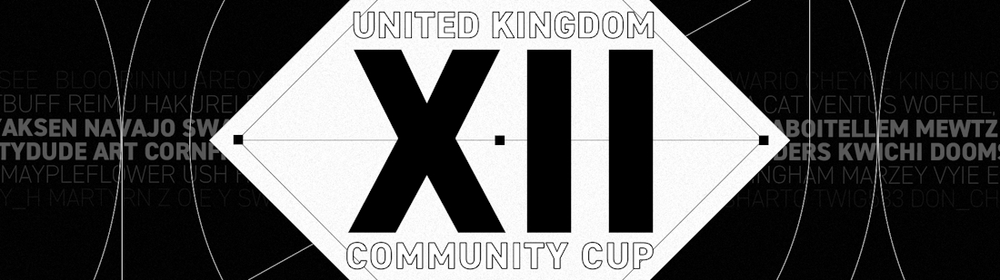

---
tags:
  - UKCC
  - UKCC12
  - UKCC#12
---

# UK Community Cup 12

The **UK Community Cup 12** (***UKCC12***) was a British 1v1 double-elimination osu! tournament hosted by ::{ flag=GB }:: [Yazzehh](https://osu.ppy.sh/users/7068973), ::{ flag=GB }:: [Damarsh](https://osu.ppy.sh/users/7465147) and ::{ flag=TR }:: [oralekin](https://osu.ppy.sh/users/7631823). It was the thirteenth instalment of the UK Community Cup series and the series' seventh 1v1 competition.

## Tournament schedule

| Event | Timestamp |
| --: | :-- |
| Registration phase | 2023-02-28/2023-03-12 |
| Qualifiers mappool release | 2023-03-13 |
| Qualifiers stage | 2023-03-18/2023-03-19 |
| Round of 32 | 2023-03-25/2023-03-26 |
| Round of 16 | 2023-04-01/2023-01-02 |
| Quarterfinals | 2023-04-08/2023-04-09 |
| Semifinals | 2023-04-15/2023-04-16 |
| Finals | 2023-04-22/2023-04-23 |
| Grand Finals | 2023-04-29/2023-04-30 |

## Prizes

| Placing | Prize(s) |
| :-: | :-- |
|  | £100 and profile badge |
|  | £65 |
|  | £35 |

## Organisation

The UK Community Cup 12 was run by various community members.

| Position | Member(s) |
| :-- | :-- |
| Manager | ::{ flag=GB }:: [Yazzehh](https://osu.ppy.sh/users/7068973), ::{ flag=GB }:: [Damarsh](https://osu.ppy.sh/users/7465147), ::{ flag=TR }:: [oralekin](https://osu.ppy.sh/users/7631823) |
| Mappool selector | ::{ flag=CA }:: [chiv](https://osu.ppy.sh/users/6701656), ::{ flag=US }:: [M I L E S](https://osu.ppy.sh/users/6036351), ::{ flag=GB }:: [Damarsh](https://osu.ppy.sh/users/7465147), ::{ flag=US }:: [ChillierPear](https://osu.ppy.sh/users/9501251), ::{ flag=BR }:: [dasdwqdf](https://osu.ppy.sh/users/5403374), ::{ flag=NO }:: [YokesPai](https://osu.ppy.sh/users/6399568), ::{ flag=BR }:: [Dada](https://osu.ppy.sh/users/9119507) |
| Streamer | ::{ flag=US }:: [ChillierPear](https://osu.ppy.sh/users/9501251), ::{ flag=GB }:: [Damarsh](https://osu.ppy.sh/users/7465147), ::{ flag=GB }:: [Teejay](https://osu.ppy.sh/users/9499753), ::{ flag=GB }:: [T-Bunda](https://osu.ppy.sh/users/13347736), ::{ flag=BR }:: [Dada](https://osu.ppy.sh/users/9119507) |
| Commentator | ::{ flag=GB }:: [Doomsday](https://osu.ppy.sh/users/18983), ::{ flag=US }:: [ChillierPear](https://osu.ppy.sh/users/9501251), ::{ flag=GB }:: [SadShiba](https://osu.ppy.sh/users/10747626), ::{ flag=GB }:: [Damarsh](https://osu.ppy.sh/users/7465147), ::{ flag=GB }:: [Teejay](https://osu.ppy.sh/users/9499753), ::{ flag=GB }:: [T-Bunda](https://osu.ppy.sh/users/13347736), ::{ flag=DE }:: [TheHunter1](https://osu.ppy.sh/users/6496016), ::{ flag=FI }:: [Lefafel](https://osu.ppy.sh/users/2295850), ::{ flag=FR }:: [lardon](https://osu.ppy.sh/users/11409334) |
| Designer | ::{ flag=US }:: [ChillierPear](https://osu.ppy.sh/users/9501251) |
| Referee | ::{ flag=GB }:: [Yazzehh](https://osu.ppy.sh/users/7068973), ::{ flag=GB }:: [Damarsh](https://osu.ppy.sh/users/7465147), ::{ flag=GB }:: [Domblade](https://osu.ppy.sh/users/6701945), ::{ flag=US }:: [ChillierPear](https://osu.ppy.sh/users/9501251), ::{ flag=PL }:: [Marzale](https://osu.ppy.sh/users/5194043), ::{ flag=DE }:: [TheHunter1](https://osu.ppy.sh/users/6496016), ::{ flag=US }:: [Geag](https://osu.ppy.sh/users/16052525), ::{ flag=ID }:: [Raff](https://osu.ppy.sh/users/7227330), ::{ flag=GB }:: [Kezanub](https://osu.ppy.sh/users/6088641), ::{ flag=GB }:: [T-Bunda](https://osu.ppy.sh/users/13347736) |
| Statistician | ::{ flag=NO }:: [YokesPai](https://osu.ppy.sh/users/6399568) |

## Links

- [Discussion thread](https://osu.ppy.sh/community/forums/topics/1728291)
- [Discord server](https://discord.gg/EtsU7Cw)
- [Livestream](https://twitch.tv/osuukcc)
- [Rules and information document](https://docs.google.com/document/d/19cAB_QOHAUBSySA4UXHcagjj3UrAxLU7w4g_nVlG4q4/edit?usp=sharing)
- [Main spreadsheet](https://docs.google.com/spreadsheets/d/1Yeh9CVc8fCDQmSnJfA9dXQaIFTds50cOdMDjENdL19A/edit?usp=sharing)

## Participants

See the [signups sheet](https://docs.google.com/spreadsheets/d/1Yeh9CVc8fCDQmSnJfA9dXQaIFTds50cOdMDjENdL19A/edit?gid=230870066#gid=230870066) for a list of all initial participants.

| Seed | Members |
| :-- | :-- |
| 1-8 | ::{ flag=GB }:: [Plasma](https://osu.ppy.sh/users/10077431), ::{ flag=GB }:: [Kingling](https://osu.ppy.sh/users/7010761), ::{ flag=GB }:: [Accolibed](https://osu.ppy.sh/users/9269034), ::{ flag=GB }:: [rudj](https://osu.ppy.sh/users/11592896), ::{ flag=GB }:: [SinqHD](https://osu.ppy.sh/users/15887523), ::{ flag=GB }:: [Doomsday](https://osu.ppy.sh/users/18983), ::{ flag=GB }:: [reshamen](https://osu.ppy.sh/users/17706086), ::{ flag=GB }:: [idealnettles](https://osu.ppy.sh/users/4010354) |
| 9-16 | ::{ flag=GB }:: [Cozzzy](https://osu.ppy.sh/users/2003917), ::{ flag=GB }:: [polski1](https://osu.ppy.sh/users/18131614), ::{ flag=GB }:: [Gazzzaa](https://osu.ppy.sh/users/8624512), ::{ flag=GB }:: [Humsterlol](https://osu.ppy.sh/users/16218750), ::{ flag=GB }:: [Kwichi](https://osu.ppy.sh/users/16287466), ::{ flag=GB }:: [butter dog](https://osu.ppy.sh/users/12925539), ::{ flag=IE }:: [PoSharTo](https://osu.ppy.sh/users/11332703), ::{ flag=GB }:: [Teejay](https://osu.ppy.sh/users/9499753) |
| 17-24 | ::{ flag=GB }:: [NinoMyAngel](https://osu.ppy.sh/users/14801826), ::{ flag=GB }:: [Woodzy](https://osu.ppy.sh/users/7361767), ::{ flag=GB }:: [Cornfield](https://osu.ppy.sh/users/4087422), ::{ flag=GB }:: [crashout](https://osu.ppy.sh/users/11839754), ::{ flag=GB }:: [velcro shoes](https://osu.ppy.sh/users/11345690), ::{ flag=GB }:: [Twiki](https://osu.ppy.sh/users/10329548), ::{ flag=GB }:: [Cors](https://osu.ppy.sh/users/11502740), ::{ flag=GB }:: [Cleveland Brown](https://osu.ppy.sh/users/18857412) |
| 25-32 | ::{ flag=GB }:: [Buzzy](https://osu.ppy.sh/users/13915963), ::{ flag=GB }:: [Gaz](https://osu.ppy.sh/users/3648459), ::{ flag=CA }:: [Greninja](https://osu.ppy.sh/users/8579186), ::{ flag=GB }:: [MaypleFlower](https://osu.ppy.sh/users/10609949), ::{ flag=GB }:: [Ush](https://osu.ppy.sh/users/6069002), ::{ flag=GB }:: [lkgddr](https://osu.ppy.sh/users/4128132), ::{ flag=GB }:: [Mula Hwaka](https://osu.ppy.sh/users/19501020), ::{ flag=GB }:: [marzey](https://osu.ppy.sh/users/11584669) |

## Podium

This competition has come to an end and resulted in the following podium:

| Placing | Player |
| :-: | :-- |
|  | ::{ flag=GB }:: [Accolibed](https://osu.ppy.sh/users/9269034) |
|  | ::{ flag=GB }:: [Kingling](https://osu.ppy.sh/users/7010761) |
|  | ::{ flag=GB }:: [rudj](https://osu.ppy.sh/users/11592896 ) |

## Mappools

### Grand Finals

- No Mod
  1. [U1 overground - Dopamine (fanzhen0019) \[C6H3(OH)2-CH2-CH2-NH2\]](https://osu.ppy.sh/beatmapsets/210316#osu/494818)
  2. [Kuroneko Dungeon - Ryoushi no Umi no Lindwurm (P o M u T a) \[MASTER\]](https://osu.ppy.sh/beatmapsets/372850#osu/830607)
  3. [Morimori Atsushi - Tits or get the fuck out!! (Regou) \[Hell Extra!!\]](https://osu.ppy.sh/beatmapsets/455022#osu/975418)
  4. [Culprate & Au5 - Impulse (handsome) \[Master\]](https://osu.ppy.sh/beatmapsets/705788#osu/1492654)
  5. [Yuuyu - Scrap Syndrome (deetz) \[Mechanical Failure\]](https://osu.ppy.sh/beatmapsets/973996#osu/2038860)
  6. [Rin - Kishinjou set 03 \~ Humans and Youkai Traversing the Canal (yaspo) \[hasplasho's Human x Youkai CoLunatic\]](https://osu.ppy.sh/beatmapsets/1799358#osu/3688644)
- Hidden
  1. [xi - FREEDOM DiVE (Nakagawa-Kanon) \[Another\]](https://osu.ppy.sh/beatmapsets/39804#osu/126645)
  2. [Yooh - Heracles (Twiggykun) \[Rampage\]](https://osu.ppy.sh/beatmapsets/1659194#osu/3387004)
  3. [Akiyama Uni - Odoru Mizushibuki (Hollow Wings) \[Death Dance\]](https://osu.ppy.sh/beatmapsets/153887#osu/378126)
  4. [frederic - ONLYWONDER (n0ah) \[Singing sometimes\]](https://osu.ppy.sh/beatmapsets/807885#osu/1952051)
- Hard Rock
  1. [Seiryu - Critical Crystal (Priti) \[Ultra\]](https://osu.ppy.sh/beatmapsets/199535#osu/473210)
  2. [qfeileadh - breathe (ktgster) \[Extreme\]](https://osu.ppy.sh/beatmapsets/1181778#osu/2463985)
  3. [uma vs. Morimori Atsushi - Re:End of a Dream (Battle) \[toybot's Extra\]](https://osu.ppy.sh/beatmapsets/557039#osu/1249833)
  4. [Hyadain - Rap de Chocobo (mrowswares) \[Gold\]](https://osu.ppy.sh/beatmapsets/1125851#osu/2352372)
- Double Time
  1. [Eleharmonica remixed by kors k - Der Wald (kors k Remix) (Cheesecake) \[Jace's Insane\]](https://osu.ppy.sh/beatmapsets/581787#osu/1477261)
  2. [Akatsuki Records - Adieu, to this Lively Graveyard (yaspo) \[KIRBY REMIX DELUXE EDITION\]](https://osu.ppy.sh/beatmapsets/1252820#osu/2603690)
  3. [Kalafina - Kimi no Gin no Niwa (Hollow Wings) \[Extra\]](https://osu.ppy.sh/beatmapsets/132044#osu/469565)
  4. [AAAA - Hiyokko Santa to Yuki no Machi (Dear A Remix) (Azzedd) \[Insane\]](https://osu.ppy.sh/beatmapsets/880070#osu/1840585)
- Tiebreaker
  1. **[DragonForce - Cry Thunder (Rolniczy) \[In the Eyes of Broken Dreams\]](https://osu.ppy.sh/beatmapsets/890589#osu/1861781)**

### Finals

- No Mod
  1. [UNDEAD CORPORATION - Everything will freeze (Ekoro) \[Extra\]](https://osu.ppy.sh/beatmapsets/158023#osu/552068)
  2. [Umeboshi Chazuke - Owari to Hajimari no Oto (Yoshimaro) \[New Beginning!\]](https://osu.ppy.sh/beatmapsets/790045#osu/1657917)
  3. [lapix - Flamenco House (Luminiscental) \[Axaptice's Expert\]](https://osu.ppy.sh/beatmapsets/1865291#osu/3836665)
  4. [Rin - Eientewi set 06 \~ Plain Asia (yaspo) \[Leaves in the wind\]](https://osu.ppy.sh/beatmapsets/993507#osu/2077521)
  5. [ESTi - HELIX (Edit ver.) (Hollow Wings) \[EX EX\]](https://osu.ppy.sh/beatmapsets/194910#osu/462700)
  6. [Function Phantom - Paradox (byfar) \[Enigma\]](https://osu.ppy.sh/beatmapsets/824125#osu/1726857)
- Hidden
  1. [DragonForce - Extraction Zone (Kloyd) \[Legend\]](https://osu.ppy.sh/beatmapsets/1073266#osu/2246145)
  2. [Camellia feat. Luschel - Night Fog (Mir) \[Heartbeat\]](https://osu.ppy.sh/beatmapsets/1242304#osu/2582733)
  3. [Black Hole - Pluto (7odoa) \[Challenge\]](https://osu.ppy.sh/beatmapsets/45074#osu/146957)
  4. [sakuzyo - AXION (Flower) \[Another\]](https://osu.ppy.sh/beatmapsets/115193#osu/297811)
- Hard Rock
  1. [Jun Ishikawa - Candy Mountain (Etna) \[Sky High\]](https://osu.ppy.sh/beatmapsets/1007024#osu/3470543)
  2. [kors k - Monkey Business (waefwerf) \[WHEE WHOO\]](https://osu.ppy.sh/beatmapsets/1115934#osu/2343738)
  3. [Sara - Ren Ren Ai Ai Cir Cir Cula Cula Tion Tion (pishifat) \[Extra\]](https://osu.ppy.sh/beatmapsets/684060#osu/1447689)
  4. [beatMARIO - Night of Knights (alacat) \[The World\]](https://osu.ppy.sh/beatmapsets/352570#osu/776951)
- Double Time
  1. [Nekomata Master feat.Joelle Strother - Infinity of Our Love (moph) \[Ambient's Insane\]](https://osu.ppy.sh/beatmapsets/629830#osu/1348093)
  2. [ALiCE'S EMOTION - Selfish (Tsukasa Remix) (Mixagji) \[Lunatic\]](https://osu.ppy.sh/beatmapsets/1364267#osu/2822322)
  3. [Jimmy Weckl - Get Happy (buhei) \[Xilver's EXPERT\]](https://osu.ppy.sh/beatmapsets/359580#osu/961924)
  4. [Pastel*Palettes - Happy Synthesizer (ktgster) \[Insane\]](https://osu.ppy.sh/beatmapsets/932654#osu/1989991)
- Tiebreaker
  1. **[Natsu - Regression (Regou) \[X\]](https://osu.ppy.sh/beatmapsets/1771677#osu/3649428)**

### Semifinals

- No Mod
  1. [sabi - true DJ MAG top ranker's song Zenpen (katagiri Remix) (Nathan) \[Acyl x captin's Extreme\]](https://osu.ppy.sh/beatmapsets/1357624#osu/3125070)
  2. [Paramore - Anklebiters (attendant) \[Luscent's Expert\]](https://osu.ppy.sh/beatmapsets/1512813#osu/3103322)
  3. [ChthoniC - Defenders Of Bu-Tik Palace (shoyeu) \[Timeless Sentence\]](https://osu.ppy.sh/beatmapsets/1895593#osu/3906538)
  4. [The Flashbulb - DIDJ PVC (Irreversible) \[Zetera's EX II\]](https://osu.ppy.sh/beatmapsets/966078#osu/2061815)
  5. [YURRY CANON - Nadeshiko color Heart (kwk) \[Sakase\]](https://osu.ppy.sh/beatmapsets/682996#osu/1451733)
  6. [sasakure.UK - Good Bye, Mr. Jack (Xilver15) \[ReMiX\]](https://osu.ppy.sh/beatmapsets/586425#osu/1241924)
- Hidden
  1. [100 Gecs - money machine (Arkisol) \[big trucks\]](https://osu.ppy.sh/beatmapsets/1243413#osu/2585025)
  2. [MiddleIsland - Frailness (LMT) \[Virtuoso\]](https://osu.ppy.sh/beatmapsets/720978#osu/1522554)
  3. [xi - Last Resort (Kroytz) \[1112's EXHAUST\]](https://osu.ppy.sh/beatmapsets/800102#osu/1679782)
  4. [LiLA'c Records - Maze of Vapor (Brutal Core mix) (-Kemsyt) \[Mirash's Extra\]](https://osu.ppy.sh/beatmapsets/1752523#osu/3586373)
- Hard Rock
  1. [nmk - sola (Morinaga) \[Last Word\]](https://osu.ppy.sh/beatmapsets/723024#osu/1526226)
  2. [DOT96 - MAKE IT FUNKY NOW (-PC) \[werf's Extra\]](https://osu.ppy.sh/beatmapsets/1958516#osu/4057663)
  3. [HyuN - Grin (ktgster) \[Expert\]](https://osu.ppy.sh/beatmapsets/947770#osu/1982581)
  4. [P\*Light - FUNKY SUMMER BEACH (Priti) \[Ultra\]](https://osu.ppy.sh/beatmapsets/212192#osu/498989)
- Double Time
  1. [Scatman John - Scatman's World (Club Mix) (Chalwa) \[Your Fantasy\]](https://osu.ppy.sh/beatmapsets/917348#osu/1915798)
  2. [Horie Yui - Promised Love \~Daisuki x 100\~ (moonlightleaf) \[Millhiore F. Biscotti\]](https://osu.ppy.sh/beatmapsets/358659#osu/788625)
  3. [REDALiCE - Great nano desu (M I L E S) \[Yokes' Extreme\]](https://osu.ppy.sh/beatmapsets/1475196#osu/3271323)
  4. [Koji Kondo - Ground Theme (Gust) \[45872\]](https://osu.ppy.sh/beatmapsets/1643826#osu/3355391)
- Tiebreaker
  1. **[goreshit - burn this moment into the retina of my eye (grumd) \[extra\]](https://osu.ppy.sh/beatmapsets/359890#osu/791274)**

### Quarterfinals

- No Mod
  1. [Utsu-P - MiKUSABBATH (Kuron-kun) \[Distortion\]](https://osu.ppy.sh/beatmapsets/264483#osu/602917)
  2. [xi - Akasha (Jemmmmy) \[Heaven\]](https://osu.ppy.sh/beatmapsets/118768#osu/408378)
  3. [Chihara Minori - SELF PRODUCER (Startrick) \[Himenokouji Akiko\]](https://osu.ppy.sh/beatmapsets/419728#osu/908297)
  4. [seatrus - MONONOKE (Realazy) \[Orientalism\]](https://osu.ppy.sh/beatmapsets/1280194#osu/2659353)
  5. [katagiri - Naopura2000 -Daybreak- (Zenoc) \[Extreme\]](https://osu.ppy.sh/beatmapsets/1952005#osu/4042050)
  6. [Niko - Made of Fire (lesjuh) \[Oni\]](https://osu.ppy.sh/beatmapsets/10112#osu/40017)
- Hidden
  1. [yambabom - Over my head (Zapy) \[Insane\]](https://osu.ppy.sh/beatmapsets/57460#osu/187791)
  2. [NieN - Road of Death (soulfear) \[SC\]](https://osu.ppy.sh/beatmapsets/13305#osu/49256)
  3. [Asaka - Open your eyes (Fushimi Rio) \[World: :Synchronization\]](https://osu.ppy.sh/beatmapsets/880456#osu/1871739)
  4. [cosMo@BousouP feat.Hatsune Miku - Hatsune Miku no Shoushitsu (val0108) \[Extra\]](https://osu.ppy.sh/beatmapsets/125843#osu/320127)
- Hard Rock
  1. [Camellia feat. Nanahira - Tsukitourou (jonathanlfj) \[Countless\]](https://osu.ppy.sh/beatmapsets/383147#osu/837694)
  2. [Eoin O' Broin - Deep Space (galvenize) \[Another\]](https://osu.ppy.sh/beatmapsets/25098#osu/85550)
  3. [HyuN - Tokyo's Starlight (Pho) \[Collab Extra\]](https://osu.ppy.sh/beatmapsets/891712#osu/1864175)
  4. [P\*Light - NINJA (Kyubey) \[Elvis' Donatello\]](https://osu.ppy.sh/beatmapsets/195307#osu/548376)
- Double Time
  1. [Yuuki Aoi - Platinum (Mythol) \[Collab\]](https://osu.ppy.sh/beatmapsets/83118#osu/229676)
  2. [Masayoshi Minoshima - Bad Apple!! feat.nomico (Nhato Remix) (Akareh) \[Limbo\]](https://osu.ppy.sh/beatmapsets/616378#osu/1299942)
  3. [Barbarian On The Groove feat. Kotomitama - Over The Rainbow (Jupiter) \[Rainbow\]](https://osu.ppy.sh/beatmapsets/38722#osu/123882)
  4. [Dio feat. Sef - Aye (AJT) \[Lesjuh's Aye!!\]](https://osu.ppy.sh/beatmapsets/1621130#osu/3309941)
- Tiebreaker
  1. **[Shpongle - Dr. Vinklestein Says (piroshki) \[Entheogen\]](https://osu.ppy.sh/beatmapsets/1750091#osu/3580348)**

### Round of 16

- No Mod
  1. [ChouCho - bouquet (Kibbleru) \[Ex\]](https://osu.ppy.sh/beatmapsets/460580#osu/986375)
  2. [cosMo@BousouP - Oceanus (Broccoly) \[Divinity\]](https://osu.ppy.sh/beatmapsets/267767#osu/609843)
  3. [Wagakki Band - Senbonzakura (pkk) \[Death Blossom\]](https://osu.ppy.sh/beatmapsets/427508#osu/922916)
  4. [MYUKKE. - ViViTAL MONO (Laquarius) \[ExTRA\]](https://osu.ppy.sh/beatmapsets/1753391#osu/3588248)
  5. [LIQU@. - Yotogibanashi no Kamikakushi (Kyubey) \[oko's Extra\]](https://osu.ppy.sh/beatmapsets/236396#osu/717133)
- Hidden
  1. [FujuniseikouyuuP - Invasion of stray cats (val0108) \[Stray0108\]](https://osu.ppy.sh/beatmapsets/256947#osu/588523)
  2. [Bo Xue Liang - Ci Chuang Ge (969363565) \[96's Quilt\]](https://osu.ppy.sh/beatmapsets/1523626#osu/3117704)
  3. [Cranky - Rave 2 Rave (Sonnyc) \[Expert\]](https://osu.ppy.sh/beatmapsets/751896#osu/1582902)
- Hard Rock
  1. [Girls' Generation - Gee (defiance) \[gee gee gee gee baby baby baby\]](https://osu.ppy.sh/beatmapsets/1512253#osu/3096443)
  2. [SHIKI - Pure Ruby (tsuka) \[Another\]](https://osu.ppy.sh/beatmapsets/39325#osu/125448)
  3. [Power Of Nature - Shounen wa Sora o Tadoru (CallieCube) \[fanzhen's EX\]](https://osu.ppy.sh/beatmapsets/1373545#osu/3109288)
- Double Time
  1. [Peach Pit - Alrighty Aphrodite (-Zel) \[Fsjallink's Insane\]](https://osu.ppy.sh/beatmapsets/1915272#osu/4030096)
  2. [IOSYS feat. NJK Record - Miracle-Hinacle (Hinacle) \[Collab\]](https://osu.ppy.sh/beatmapsets/50454#osu/155049)
  3. [sumiisan - EMIYA -Time alter- (xbopost) \[Insane\]](https://osu.ppy.sh/beatmapsets/1105097#osu/2309576)
- Tiebreaker
  1. **[Chata - enn (EvilElvis) \[Starry Sky of Small Desires\]](https://osu.ppy.sh/beatmapsets/406217#osu/882812)**

### Round of 32

- No Mod
  1. [Reol - No title (cRyo[iceeicee]) \[Insane\]](https://osu.ppy.sh/beatmapsets/260141#osu/594307)
  2. [BlackYooh vs. siromaru - BLACK or WHITE? (BluOxy) \[MASTER\]](https://osu.ppy.sh/beatmapsets/248876#osu/635679)
  3. [Streetlight Manifesto - The Blonde Lead The Blind (pishifat) \[Extra\]](https://osu.ppy.sh/beatmapsets/376545#osu/824359)
  4. [Function Phantom - Variable (Chaoslitz) \[Deluxe\]](https://osu.ppy.sh/beatmapsets/751774#osu/1582594)
  5. [cosMo@BousouP feat. Hatsune Miku - Machinegun Poem Doll (Zoli) \[Extra\]](https://osu.ppy.sh/beatmapsets/1606218#osu/3292028)
- Hidden
  1. [DJ S3RL - T-T-Techno (feat. Jesskah) (nold_1702) \[Technonationalism\]](https://osu.ppy.sh/beatmapsets/83560#osu/655794)
  2. [Basshunter - Ievan Polkka Trance Remix (Teara) \[HikkiDooms\]](https://osu.ppy.sh/beatmapsets/10406#osu/45546)
  3. [Camellia - Fastest Crash (sukiNathan) \[Extra\]](https://osu.ppy.sh/beatmapsets/331025#osu/746315)
- Hard Rock
  1. [Rita - Dream Walker (Amamiya Yuko) \[Ethereal\]](https://osu.ppy.sh/beatmapsets/315299#osu/722934)
  2. [IOSYS - Utage wa Eien ni \~SHD\~ (DJPop) \[SOLO\]](https://osu.ppy.sh/beatmapsets/7385#osu/31819)
  3. [KyoKa - Kirameki\*Chocolaterie (Left) \[Garden's Expert\]](https://osu.ppy.sh/beatmapsets/1106356#osu/2314082)
- Double Time
  1. [LMFAO - Party Rock Anthem feat. Lauren Bennett, GoonRock (AJT) \[Sorry For Party Rocking\]](https://osu.ppy.sh/beatmapsets/1940198#osu/4011601)
  2. [Tsunamaru - Gin no Fluch (HelloSCV) \[Insane\]](https://osu.ppy.sh/beatmapsets/85721#osu/235309)
  3. [Lou Bega - Mambo No.5 (Lesjuh) \[Insane\]](https://osu.ppy.sh/beatmapsets/33393#osu/108936)
- Tiebreaker
  1. **[Thank You Scientist - My Famed Disappearing Act (Theaceae) \[Perish\]](https://osu.ppy.sh/beatmapsets/765338#osu/1609182)**

### Qualifiers

- No Mod
  1. [Ahomushi - Koko wa Doko (Nao Tomori) \[DoKo\]](https://osu.ppy.sh/beatmapsets/1549875#osu/3167229)
  2. [S2TB Recording - Super Luminal (Luscent) \[Another\]](https://osu.ppy.sh/beatmapsets/1620087#osu/3360089)
  3. [Hatsune Miku - No,39 (val0108) \[0108 style\]](https://osu.ppy.sh/beatmapsets/34097#osu/110914)
  4. [Memme - Pandemonium (sdafsf) \[Lasse's Extra: #8\]](https://osu.ppy.sh/beatmapsets/734190#osu/1550984)
- Hidden
  1. [yuki. - Spring Signal (pishifat) \[Extra\]](https://osu.ppy.sh/beatmapsets/716211#osu/1513223)
  2. [ZUN - Year-Round Absorbed Curiosity (saymun) \[Insane\]](https://osu.ppy.sh/beatmapsets/19515#osu/68581)
- Hard Rock
  1. [Akiyama Uni - Touhou Hisouten (sahuang) \[Lunatic\]](https://osu.ppy.sh/beatmapsets/455069#osu/975519)
  2. [subplaid - Only time make your hapiness (Desperate-kun) \[Insane\]](https://osu.ppy.sh/beatmapsets/560330#osu/1184962)
- Double Time
  1. [Itou Masumi - Yume no Naka no Watashi no Yume (RLC) \[Coda\]](https://osu.ppy.sh/beatmapsets/668664#osu/1414553)
  2. [petit milady - Ma Cherie (Andrea) \[Lovers\]](https://osu.ppy.sh/beatmapsets/255481#osu/585605)

## Match results

### Grand Finals

Sunday, 30 April 2023:

| Player 1 |  |  | Player 2 | Match link |
| --: | :-: | :-: | :-- | :-- |
| rudj ::{ flag=GB }:: | 5 | **7** | ::{ flag=GB }:: **Accolibed** | [#1](https://osu.ppy.sh/community/matches/108244405) |
| Kingling ::{ flag=GB }:: | 2 | **7** | ::{ flag=GB }:: **Accolibed** | [#1](https://osu.ppy.sh/community/matches/108248342) |
| **Accolibed** ::{ flag=GB }:: | **7** | 2 | ::{ flag=GB }:: Kingling | [#1](https://osu.ppy.sh/community/matches/108249483) |

### Finals

Saturday, 22 April 2023:

| Player 1 |  |  | Player 2 | Match link |
| --: | :-: | :-: | :-- | :-- |
| **Plasma** ::{ flag=GB }:: | **7** | 3 | ::{ flag=GB }:: Doomsday | [#1](https://osu.ppy.sh/community/matches/108102442) |
| **Accolibed** ::{ flag=GB }:: | **7** | 0 | ::{ flag=GB }:: SinqHD | [#1](https://osu.ppy.sh/community/matches/108105430) |

Sunday, 23 April 2023:

| Player 1 |  |  | Player 2 | Match link |
| --: | :-: | :-: | :-- | :-- |
| rudj ::{ flag=GB }:: | 5 | **7** | ::{ flag=GB }:: **Kingling** | [#1](https://osu.ppy.sh/community/matches/108125160) |
| **Accolibed** ::{ flag=GB }:: | **7** | 5 | ::{ flag=GB }:: Plasma | [#1](https://osu.ppy.sh/community/matches/108127572) |

### Semifinals

Friday, 14 April 2023:

| Player 1 |  |  | Player 2 | Match link |
| --: | :-: | :-: | :-- | :-- |
| Cors ::{ flag=GB }:: | 4 | **6** | ::{ flag=GB }:: **Teejay** | [#1](https://osu.ppy.sh/community/matches/107943061) |
| Plasma ::{ flag=GB }:: | 4 | **6** | ::{ flag=GB }:: **rudj** | [#1](https://osu.ppy.sh/community/matches/107952446) |

Saturday, 15 April 2023:

| Player 1 |  |  | Player 2 | Match link |
| --: | :-: | :-: | :-- | :-- |
| **SinqHD** ::{ flag=GB }:: | **6** | 2 | ::{ flag=GB }:: Gazzzaa | [#1](https://osu.ppy.sh/community/matches/107974433) |
| **Doomsday** ::{ flag=GB }:: | **6** | 3 | ::{ flag=GB }:: polski1 | [#1](https://osu.ppy.sh/community/matches/107976843) |
| **Cozzzy** ::{ flag=GB }:: | **0** | -1 | ::{ flag=GB }:: reshamen | *forfeit* |
| **Doomsday** ::{ flag=GB }:: | **6** | 0 | ::{ flag=GB }:: Teejay | [#1](https://osu.ppy.sh/community/matches/107979429) |

Sunday, 16 April 2023:

| Player 1 |  |  | Player 2 | Match link |
| --: | :-: | :-: | :-- | :-- |
| **SinqHD** ::{ flag=GB }:: | **6** | 3 | ::{ flag=GB }:: Cozzzy | [#1](https://osu.ppy.sh/community/matches/107998463) |
| **Kingling** ::{ flag=GB }:: | **6** | 2 | ::{ flag=GB }:: Accolibed | [#1](https://osu.ppy.sh/community/matches/108000661) |

### Quarterfinals

Friday, 7 April 2023:

| Player 1 |  |  | Player 2 | Match link |
| --: | :-: | :-: | :-- | :-- |
| **Kingling** ::{ flag=GB }:: | **6** | 0 | ::{ flag=GB }:: Cors | [#1](https://osu.ppy.sh/community/matches/107827608) |
| **rudj** ::{ flag=GB }:: | **6** | 0 | ::{ flag=GB }:: SinqHD | [#1](https://osu.ppy.sh/community/matches/107829940) |

Saturday, 8 April 2023:

| Player 1 |  |  | Player 2 | Match link |
| --: | :-: | :-: | :-- | :-- |
| **Teejay** ::{ flag=GB }:: | **6** | 2 | ::{ flag=GB }:: Twiki | [#1](https://osu.ppy.sh/community/matches/107846017) |
| velcro shoes ::{ flag=GB }:: | -1 | **0** | ::{ flag=GB }:: **Mula Hwaka** | *forfeit* |
| **Woodzy** ::{ flag=GB }:: | **6** | 5 | ::{ flag=GB }:: MaypleFlower | [#1](https://osu.ppy.sh/community/matches/107851116) |
| Cornfield ::{ flag=GB }:: | 5 | **6** | ::{ flag=GB }:: **Buzzy** | [#1](https://osu.ppy.sh/community/matches/107853814) |
| **Gazzzaa** ::{ flag=GB }:: | **6** | 3 | ::{ flag=GB }:: marzey | [#1](https://osu.ppy.sh/community/matches/107854971) |
| **idealnettles** ::{ flag=GB }:: | **6** | 4 | ::{ flag=GB }:: butter dog | [#1](https://osu.ppy.sh/community/matches/107855565) |

Sunday, 9 April 2023:

| Player 1 |  |  | Player 2 | Match link |
| --: | :-: | :-: | :-- | :-- |
| idealnettles ::{ flag=GB }:: | 3 | **6** | ::{ flag=GB }:: **Teejay** | [#1](https://osu.ppy.sh/community/matches/107868145) |
| Kwichi ::{ flag=GB }:: | -1 | **0** | ::{ flag=GB }:: **polski1** | *forfeit* |
| Mula Hwaka ::{ flag=GB }:: | 1 | **6** | ::{ flag=GB }:: **polski1** | [#1](https://osu.ppy.sh/community/matches/107870384) |
| **Accolibed** ::{ flag=GB }:: | **6** | 3 | ::{ flag=GB }:: Doomsday | [#1](https://osu.ppy.sh/community/matches/107872320) |
| **Plasma** ::{ flag=GB }:: | **6** | 2 | ::{ flag=GB }:: Cozzzy | [#1](https://osu.ppy.sh/community/matches/107873386) |
| **reshamen** ::{ flag=GB }:: | **0** | -1 | ::{ flag=GB }:: Ush | *forfeit* |
| **Gazzzaa** ::{ flag=GB }:: | **0** | -1 | ::{ flag=GB }:: Buzzy | *forfeit* |
| **reshamen** ::{ flag=GB }:: | **6** | 0 | ::{ flag=GB }:: Woodzy | [#1](https://osu.ppy.sh/community/matches/107876517) |

### Round of 16

Thursday, 30 March 2023:

| Player 1 |  |  | Player 2 | Match link |
| --: | :-: | :-: | :-- | :-- |
| **Mula Hwaka** ::{ flag=GB }:: | **5** | 3 | ::{ flag=IE }:: PoSharTo | [#1](https://osu.ppy.sh/community/matches/107672154) |
| Gaz ::{ flag=GB }:: | 2 | **5** | ::{ flag=GB }:: **polski1** | [#1](https://osu.ppy.sh/community/matches/107672163) |

Friday, 31 March 2023:

| Player 1 |  |  | Player 2 | Match link |
| --: | :-: | :-: | :-- | :-- |
| **Buzzy** ::{ flag=GB }:: | **0** | -1 | ::{ flag=GB }:: Cleveland Brown | *forfeit* |

Saturday, 1 April 2023:

| Player 1 |  |  | Player 2 | Match link |
| --: | :-: | :-: | :-- | :-- |
| **Kingling** ::{ flag=GB }:: | **5** | 1 | ::{ flag=GB }:: Woodzy | [#1](https://osu.ppy.sh/community/matches/107711475) |
| reshamen ::{ flag=GB }:: | 2 | **5** | ::{ flag=GB }:: **Cors** | [#1](https://osu.ppy.sh/community/matches/107711611) |
| **MaypleFlower** ::{ flag=GB }:: | **5** | 1 | ::{ flag=GB }:: Humsterlol | [#1](https://osu.ppy.sh/community/matches/107713088) |
| **Ush** ::{ flag=GB }:: | **5** | 4 | ::{ flag=GB }:: crashout | [#1](https://osu.ppy.sh/community/matches/107716163) |
| **SinqHD** ::{ flag=GB }:: | **5** | 1 | ::{ flag=GB }:: velcro shoes | [#1](https://osu.ppy.sh/community/matches/107716669) |
| **marzey** ::{ flag=GB }:: | **5** | 4 | ::{ flag=GB }:: NinoMyAngel | [#1](https://osu.ppy.sh/community/matches/107717292) |

Sunday, 2 April 2023:

| Player 1 |  |  | Player 2 | Match link |
| --: | :-: | :-: | :-- | :-- |
| Greninja ::{ flag=CA }:: | -1 | **0** | ::{ flag=GB }:: **Twiki** | *forfeit* |
| idealnettles ::{ flag=GB }:: | 1 | **5** | ::{ flag=GB }:: **Cozzzy** | [#1](https://osu.ppy.sh/community/matches/107735297) |
| **rudj** ::{ flag=GB }:: | **5** | 0 | ::{ flag=GB }:: Kwichi | [#1](https://osu.ppy.sh/community/matches/107735312) |
| **Plasma** ::{ flag=GB }:: | **5** | 1 | ::{ flag=GB }:: Teejay | [#1](https://osu.ppy.sh/community/matches/107736666) |
| **Accolibed** ::{ flag=GB }:: | **5** | 0 | ::{ flag=GB }:: Cornfield | [#1](https://osu.ppy.sh/community/matches/107739059) |
| **Doomsday** ::{ flag=GB }:: | **5** | 3 | ::{ flag=GB }:: Gazzzaa | [#1](https://osu.ppy.sh/community/matches/107739087) |

Monday, 3 April 2023:

| Player 1 |  |  | Player 2 | Match link |
| --: | :-: | :-: | :-- | :-- |
| lkgddr ::{ flag=GB }:: | 3 | **5** | ::{ flag=GB }:: **butter dog** | [#1](https://osu.ppy.sh/community/matches/107753817) |

### Round of 32

Thursday, 23 March 2023:

| Player 1 |  |  | Player 2 | Match link |
| --: | :-: | :-: | :-- | :-- |
| **rudj** ::{ flag=GB }:: | **5** | 0 | ::{ flag=GB }:: Ush | [#1](https://osu.ppy.sh/community/matches/107539572) |

Saturday, 25 March 2023:

| Player 1 |  |  | Player 2 | Match link |
| --: | :-: | :-: | :-- | :-- |
| **Kingling** ::{ flag=GB }:: | **5** | 0 | ::{ flag=GB }:: Mula Hwaka | [#1](https://osu.ppy.sh/community/matches/107573306) |
| **Accolibed** ::{ flag=GB }:: | **5** | 0 | ::{ flag=GB }:: lkgddr | [#1](https://osu.ppy.sh/community/matches/107576170) |
| **idealnettles** ::{ flag=GB }:: | **5** | 2 | ::{ flag=GB }:: Buzzy | [#1](https://osu.ppy.sh/community/matches/107576152) |
| **SinqHD** ::{ flag=GB }:: | **5** | 0 | ::{ flag=GB }:: MaypleFlower | [#1](https://osu.ppy.sh/community/matches/107577505) |
| **Doomsday** ::{ flag=GB }:: | **5** | 0 | ::{ flag=CA }:: Greninja | [#1](https://osu.ppy.sh/community/matches/107578848) |
| **Teejay** ::{ flag=GB }:: | **5** | 0 | ::{ flag=GB }:: NinoMyAngel | [#1](https://osu.ppy.sh/community/matches/107583217) |
| **reshamen** ::{ flag=GB }:: | **5** | 1 | ::{ flag=GB }:: Gaz | [#1](https://osu.ppy.sh/community/matches/107584035) |

Sunday, 26 March 2023:

| Player 1 |  |  | Player 2 | Match link |
| --: | :-: | :-: | :-- | :-- |
| **Cozzzy** ::{ flag=GB }:: | **0** | -1 | ::{ flag=GB }:: Cleveland Brown | *forfeit* |
| **Plasma** ::{ flag=GB }:: | 5 | 0 | ::{ flag=GB }:: marzey | [#1](https://osu.ppy.sh/community/matches/107598878) |
| **Kwichi** ::{ flag=GB }:: | **5** | 1 | ::{ flag=GB }:: crashout | [#1](https://osu.ppy.sh/community/matches/107600391) |
| PoSharTo ::{ flag=IE }:: | -1 | **0** | ::{ flag=GB }:: **Woodzy** | *forfeit* |
| **Gazzzaa** ::{ flag=GB }:: | **5** | 0 | ::{ flag=GB }:: Twiki | [#1](https://osu.ppy.sh/community/matches/107604993) |

Monday, 27 March 2023:

| Player 1 |  |  | Player 2 | Match link |
| --: | :-: | :-: | :-- | :-- |
| Humsterlol ::{ flag=GB }:: | 2 | **5** | ::{ flag=GB }:: **velcro shoes** | [#1](https://osu.ppy.sh/community/matches/107608802) |
| polski1 ::{ flag=GB }:: | 4 | **5** | ::{ flag=GB }:: **Cors** | [#1](https://osu.ppy.sh/community/matches/107620971) |
| butter dog ::{ flag=GB }:: | 0 | **5** | ::{ flag=GB }:: **Cornfield** | [#1](https://osu.ppy.sh/community/matches/107620865) |

### Qualifiers

See the [Qualifiers results sheet](https://docs.google.com/spreadsheets/d/1Yeh9CVc8fCDQmSnJfA9dXQaIFTds50cOdMDjENdL19A/edit?gid=1929685287#gid=1929685287) for a list of all qualification results.

Top 10 qualification results:

| Placing | Player | Normalised score |
| --: | :-- | :-- |
|  | ::{ flag=GB }:: [Plasma](https://osu.ppy.sh/users/10077431) | 8,915,288 |
|  | ::{ flag=GB }:: [Kingling](https://osu.ppy.sh/users/7010761) | 8,816,664 |
|  | ::{ flag=GB }:: [Accolibed](https://osu.ppy.sh/users/9269034) | 8,108,148 |
| *4th place* | ::{ flag=GB }:: [rudj](https://osu.ppy.sh/users/11592896) | 7,795,134 |
| *5th place* | ::{ flag=GB }:: [SinqHD](https://osu.ppy.sh/users/15887523) | 7,206,017 |
| *6th place* | ::{ flag=GB }:: [Doomsday](https://osu.ppy.sh/users/18983) | 7,152,475 |
| *7th place* | ::{ flag=GB }:: [reshamen](https://osu.ppy.sh/users/17706086) | 6,863,861 |
| *8th place* | ::{ flag=GB }:: [idealnettles](https://osu.ppy.sh/users/4010354) | 6,454,921 |
| *9th place* | ::{ flag=GB }:: [Cozzzy](https://osu.ppy.sh/users/2003917) | 6,351,398 |
| *10th place* | ::{ flag=GB }:: [polski1](https://osu.ppy.sh/users/18131614) | 6,163,163 |

## Ruleset

### General

- This tournament is a 1v1 double-elimination British osu! tournament.
- To be able to participate, players must have a ::{ flag=GB }:: United Kingdom or ::{ flag=IE }:: Ireland flag, otherwise the player must be able to provide proof of residency to the hosts.
- Matches will be Head To Head, with ScoreV2 as the scoring system used.
- Hosts, mappool selectors and referees are not permitted participate in the tournament.

### Reschedules

- Schedules for the next round are released on the Monday before a stage is due to happen and ALL matches will be scheduled for the weekend. You can reschedule for weekdays at the staff’s discretion.
- In order to reschedule, you must contact your opponents, agree on a time and be able to provide proof (by form of a screenshot/image) of the agreed reschedule to the Hosts.
- In effort to ensure as many matches take place as possible, reschedules are allowed up to 2 hours before your match is due to be played. However, your opponent holds the right to refuse a reschedule if asked less than 12 hours from the scheduled time
- If it is impossible to find a time to reschedule to that suits both players, players should talk to the Hosts (Yazzehh, Damarsh or oralekin) and they will attempt to sort something out.
- Matches that are uncertain to happen (for example, losers’ bracket matches) will still appear on the schedule. They are to be rescheduled if needed in the same way as confirmed matches.
- If a match needs rescheduling to a time after a related losers’ bracket match, the matches relying on the outcome of the rescheduled match will be rescheduled by staff and 24 hours will be given for rescheduling them, if needed.

### Match rules

- Referees will create the lobby approximately 10 minutes before the match is due to start. (UKCC: (Player 1) vs (Player 2))
- Players have a 10 minute grace period after their scheduled match time to join the lobby. If a player fails to join the lobby in this time, then the default win will go to the other player. If both players do not show up, both players will receive losses.
- We take no-shows seriously, if you fail to show up to your match without valid reason, you may forfeit your right to future UKCC tournaments.
- The referee cannot play during the match.

#### Qualifiers

- Players will play 10 maps (4 No Mod, 2 Hidden, 2 Hard Rock, 2 Double Time) once.
- The top 32/64 scores (depending on signups/screening) from qualifiers will make it through to the bracket stage.
- Seeding will be done based on the sum of normalised scores from the qualifier maps.

#### Rolling

- When both players are in the lobby and ready, the referee will ask the players to `!roll`. The order of picks of bans is decided using the [UKCC Roll System](https://i.imgur.com/S0VIvni.png).

#### Banning

- Players have 2 minutes to ban a map. Failure to ban a map within this time limit results in a lost ban.
- From the Round of 32, there will be two bans per player.
- There are no restrictions on bans and picks. Players are free to ban/pick any map regardless of mod.

#### Warm-ups

- Warm-up maps must be a submitted beatmap, and have a drain time of 4 minutes or less.

#### Picking

- Players have 90 seconds to pick a map. Failure to pick a map within this time limit results in pick choice being passed to the opposing team.
- Failed scores will count.
- Tiebreakers are Free Mod, however No Mod can be used.
