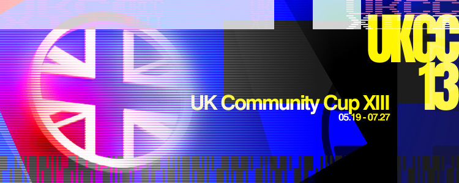

---
tags:
  - UKCC
  - UKCC13
  - UKCC#13
---

# UK Community Cup 13

The **UK Community Cup 13** (***UKCC13***) is a British 1v1 double-elimination osu! tournament hosted by ::{ flag=GB }:: [Yazzehh](https://osu.ppy.sh/users/7068973), ::{ flag=GB }:: [Damarsh](https://osu.ppy.sh/users/7465147), ::{ flag=GB }:: [baz](https://osu.ppy.sh/users/4422329) and ::{ flag=NO }:: [YokesPai](https://osu.ppy.sh/users/6399568). It is the fourteenth instalment of the UK Community Cup series and the series' eighth 1v1 competition.

## Tournament schedule

| Event | Timestamp |
| --: | :-- |
| Registration phase | 2025-05-19(20:00UTC)/2025-06-07 (23:59 UTC) |
| Qualifiers mappool release | 2025-06-08 |
| Qualifiers stage | 2025-06-14/2025-06-15 |
| Round of 48 & 32 | 2025-06-20/2025-03-23 |
| Round of 16 | 2025-06-26/2025-06-27 |
| Quarterfinals | 2025-07-05/2025-07-06 |
| Semifinals | 2025-07-12/2025-07-13 |
| Finals | 2025-07-19/2025-07-20 |
| Grand Finals | 2025-07-26/2025-07-27 |

## Prizes

| Placing | Prize(s) |
| :-: | :-- |
|  | £100 and profile badge (pending approval) |
|  | £65 |
|  | £35 |

## Organisation

The UK Community Cup 13 is run by various community members.

| Position | Member(s) |
| :-- | :-- |
| Manager | ::{ flag=GB }:: [Yazzehh](https://osu.ppy.sh/users/7068973), ::{ flag=GB }:: [Damarsh](https://osu.ppy.sh/users/7465147), ::{ flag=GB }:: [baz](https://osu.ppy.sh/users/4422329), ::{ flag=NO }:: [YokesPai](https://osu.ppy.sh/users/6399568) |
| Mappool selector | ::{ flag=NO }:: [YokesPai](https://osu.ppy.sh/users/6399568), ::{ flag=US }:: [ChillierPear](https://osu.ppy.sh/users/9501251), ::{ flag=BR }:: [Dada](https://osu.ppy.sh/users/9119507), ::{ flag=IL }:: [FlagFlayer](https://osu.ppy.sh/users/14289115), ::{ flag=NL }:: [niqht](https://osu.ppy.sh/users/14390731), ::{ flag=US }:: [M I L E S](https://osu.ppy.sh/users/6036351) |
| Streamer | ::{ flag=GB }:: [Yazzehh](https://osu.ppy.sh/users/7068973), ::{ flag=GB }:: [Damarsh](https://osu.ppy.sh/users/7465147), ::{ flag=GB }:: [baz](https://osu.ppy.sh/users/4422329), ::{ flag=US }:: [ChillierPear](https://osu.ppy.sh/users/9501251), ::{ flag=GB }:: [ilw8](https://osu.ppy.sh/users/14167692), ::{ flag=GB }:: [jakk](https://osu.ppy.sh/users/9098192), ::{ flag=DK }:: [Mikkel-](https://osu.ppy.sh/users/15068978) |
| Commentator | ::{ flag=GB }:: [Damarsh](https://osu.ppy.sh/users/7465147), ::{ flag=GB }:: [Bubbleman](https://osu.ppy.sh/users/5182050), ::{ flag=US }:: [ChillierPear](https://osu.ppy.sh/users/9501251), ::{ flag=GB }:: [Doomsday](https://osu.ppy.sh/users/18983), ::{ flag=US }:: [hubbawubba](https://osu.ppy.sh/users/15910288), ::{ flag=GB }:: [jakk](https://osu.ppy.sh/users/9098192), ::{ flag=GB }:: [SteffoST](https://osu.ppy.sh/users/6566765) |
| Referee | ::{ flag=GB }:: [Yazzehh](https://osu.ppy.sh/users/7068973), ::{ flag=GB }:: [Damarsh](https://osu.ppy.sh/users/7465147), ::{ flag=GB }:: [baz](https://osu.ppy.sh/users/4422329), ::{ flag=NO }:: [YokesPai](https://osu.ppy.sh/users/6399568), ::{ flag=US }:: [ChillierPear](https://osu.ppy.sh/users/9501251), ::{ flag=IL }:: [FlagFlayer](https://osu.ppy.sh/users/14289115), ::{ flag=GB }:: [jakk](https://osu.ppy.sh/users/9098192), ::{ flag=FI }:: [Lefafel](https://osu.ppy.sh/users/2295850) |
| Statistician | ::{ flag=GB }:: [baz](https://osu.ppy.sh/users/4422329), ::{ flag=NO }:: [YokesPai](https://osu.ppy.sh/users/6399568) |
| Designer | ::{ flag=CA }:: [kaetwo](https://osu.ppy.sh/users/1997719) |

## Links

- [Discussion thread](https://osu.ppy.sh/community/forums/topics/2081529?n=1)
- [Challonge](https://challonge.com/UKCC13)
- [Discord server](https://discord.gg/EtsU7Cw)
- [Livestream](https://twitch.tv/osuukcc)
- [Rules and information document](https://docs.google.com/document/d/1dokXiLFDr0Al53jHZ8M81aff4_ODSyOoglvYqnRm3Ec/edit?usp=sharing)
- [Main spreadsheet](https://docs.google.com/spreadsheets/d/1tNo9ErJf60lDPGxgs2bPTMBM1yio40CSfpxmrIgxGj0/edit?usp=sharing)
- **[Registration Form](https://docs.google.com/forms/d/e/1FAIpQLSd7tQRPQoLFjboi_fIz9220MrNyvQxdX5X9CvwpBm2rfScSgQ/viewform?usp=dialog)**

## Ruleset

### General

- This tournament is a 1v1 double-elimination osu! tournament.
- To participate, players must have their profile country as one of the following: ::{ flag=GB }:: United Kingdom, ::{ flag=IE }:: Ireland, ::{ flag=GG }:: Guernsey, ::{ flag=JE }:: Jersey or ::{ flag=IM }:: Isle of Man.
- Hosts, mappool selectors, and referees are not permitted to participate in the tournament.
- Players will be seeded by the sum of normalised scores from a qualifier stage.
- The top 48 players will progress onto a 48 player, double-elimination bracket.
- Players are required to join the UK Community Cup Discord server to participate in the tournament.
- Signups are subject to [tournament screening](/wiki/Tournaments/Official_support#tournament-screening).

### Scheduling

- All match times will be listed in UTC (GMT).
- Schedules for the next round are released on the Monday prior to the first matches of the stage.
- All matches will be scheduled on a single weekend. Matches cannot be scheduled to start any later than Sunday 22:59 UTC. 
  - Matches may be rescheduled to a weekday at the staff’s discretion with the agreement of both players.
- Each match will have an assigned referee on the match schedule.
  - If the assigned referee is not present at the scheduled time, the hosts must be notified immediately via the UK Community Cup Discord server. 
  - Self-refereeing is not permitted.
- To reschedule a match:
  - A player must post a screenshot of both players agreeing to reschedule their match with a new time in #reschedules on the UK Community Cup Discord server. 
  - A host will confirm if the new time is acceptable, if not, the hosts will discuss with the affected players as to if a new time can be agreed.
  - If no rescheduling agreement can be reached between the players, the match will be scheduled to its original time. 
  - Reschedules are permitted up until 2 hours before the current time of the match. The opposing player holds the right to refuse a reschedule if requested less than 12 hours from the scheduled time.
- The schedule will contain all combinations of matches that could occur over the course of the stage. Losers Bracket matches that are uncertain to happen are to be rescheduled as if they are confirmed matches.
  - The Grand Finals Bracket Reset is to be scheduled for 15 minutes after the conclusion of the first Grand Finals match. This match cannot be rescheduled.
- If a match needs rescheduling to a time after a related losers’ bracket match, the matches relying on the outcome of the rescheduled match will be rescheduled by staff and 24 hours will be given for rescheduling them.

### Qualifiers

- Players must participate in a single qualifier lobby at a time of their choosing.
- Players will play each map in the qualifier pool once.
- Every qualifier lobby will play though the qualifier pool in a predetermined order.
- Players are advised to not stream/publish a video of their qualifier lobby or publicise their results until every player has had the opportunity to participate in a qualifier lobby.
- Seeding will be done based on the sum of normalized scores from the qualifier maps.
- Only the top 48 seeded players will progress onto the bracket stage.

### Match Information

- Matches will use the Head to Head team mode, with ScoreV2 as the scoring system used.
- A referee will create the match lobby 10 minutes before the match scheduled start time.
  - The referee will create the match lobby with the room name in the format of: UKCC: (Player 1’s username) vs (Player 2’s username).
- Players are to join the match lobby within 10 minutes of the scheduled match time. If a player fails to join the lobby in time, then the default win will go to the other player. If neither player is present, both players will receive losses.
- Each player may choose to play a warmup of their choosing.
  - Warmup maps must be a submitted beatmap, and have a length of less than or equal to 3 minutes.
  - Warmup maps must not have the explicit tag, should adhere to the tournament content usage rules and the osu! Community Guidelines.
- When both players are in the lobby and ready, the referee will ask both players to !roll.
  - The referee will ask the winner of the roll if they would like to choose between the Pick or Ban order.
  - The referee will then ask the winner of the roll if they would like to choose if they go first or second for the order they chose. 
  - The referee will then ask the loser of the roll if they would like to choose if they go first or second for the order the winner of the roll did not choose. 
  - The match will then proceed in the order determined by the player's choices.
- Players have 90 seconds to ban a map. Failure to ban a map within this time limit results in a lost ban.
  - The Tiebreaker cannot be banned.
- Players have 90 seconds to pick a map. Failure to pick a map within this time limit results in pick choice being passed to the opposing player.
  - Players cannot pick the Tiebreaker. If the score is tied with each player one point off the required total to win the match, the Tiebreaker will be picked.
- All picked maps are to be played with No Fail enabled.
  - The Tiebreaker will be played under Freemod conditions, players may choose a combination of Hidden and/or Hard Rock, players are still required to use No Fail.
- The referee cannot play during any stage of the match.
- To win the match, a player needs to win a set number of maps.
  - In the Round of 48, 32 and 16, players must win 5 maps to win a match (Best of 9).
  - In the Quarterfinals and Semifinals, players must win 6 maps to win a match (Best of 11).
  - In the Finals and Grand Finals, players must win 7 maps to win a match (Best of 11).
    - To win the tournament, the player participating directly from the winners bracket is only required to win one match, the player participating from the losers bracket must win two matches consecutively.
- The result of the match will be published on the match results spreadsheet and in #results on the UK Community Cup Discord server.

### Mappool Information

- Each stage will have its own mappool.
- Mappools are to be released the Monday prior to the first matches of the stage.
- Each mappool will consist of 4 brackets: No Mod, Hidden, Hard Rock, and Double Time.
  - Mappools used in the Bracket Stage will also contain a Tiebreaker map.
- The Hidden, Hard Rock, and Double Time brackets will be played with the respective mods enabled for all players.
- All maps will adhere to the content usage rules as outlined on the [official tournament support page](/wiki/Tournaments/Official_support).
