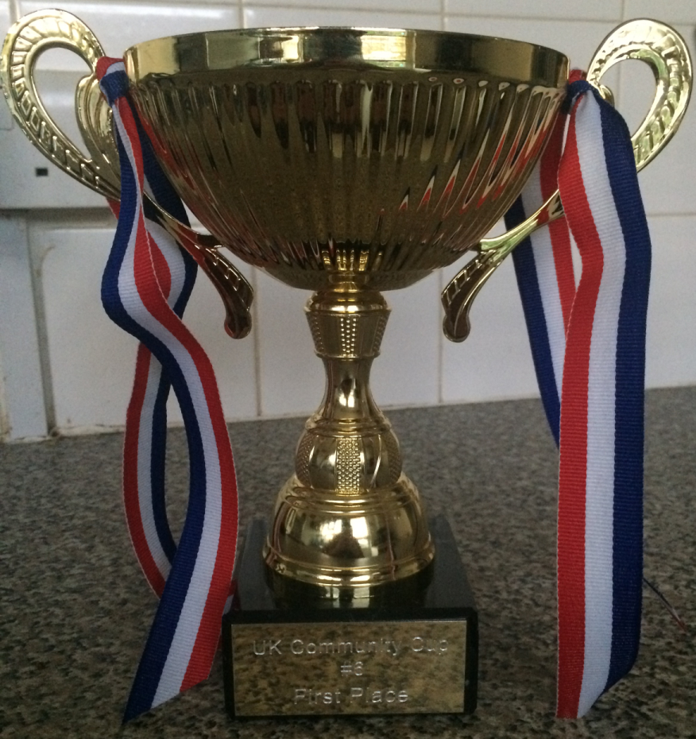
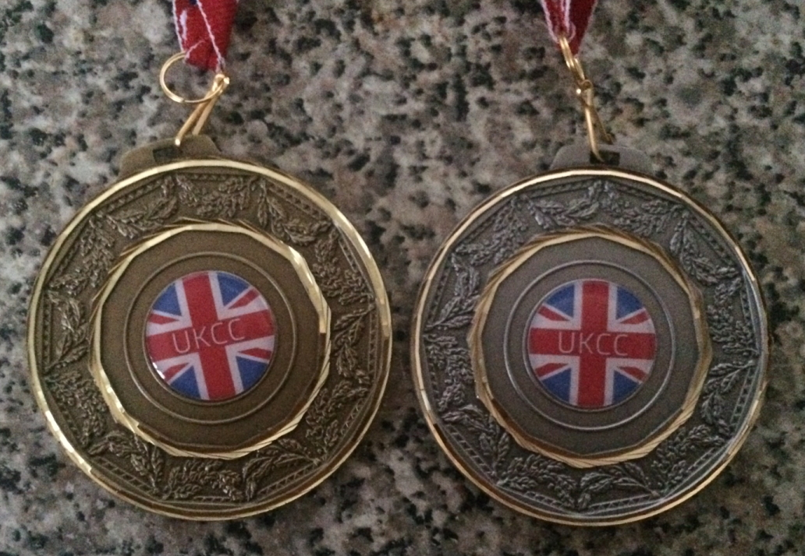

---
tags:
  - UKCC
  - UKCC6
  - UKCC#6
---

# UK Community Cup 6

The **UK Community Cup 6** (***UKCC6***) was a British 2v2 double-elimination osu! tournament hosted by ::{ flag=GB }:: [Yazzehh](https://osu.ppy.sh/users/7068973), ::{ flag=GB }:: [Chrigarr](https://osu.ppy.sh/users/10111130), ::{ flag=GB }:: [\_Takara](https://osu.ppy.sh/users/11599184) and ::{ flag=GB }:: [Doomsday is Bad](https://osu.ppy.sh/users/3481378). It was the sixth instalment of the UK Community Cup series and the series' third 2v2 competition.

## Tournament schedule

| Event | Timestamp |
| --: | :-- |
| Registration phase | 2019-01-12/2019-02-03 |
| Live drawings | 2019-02-18 |
| Group stage | 2019-02-23/2019-02-24 |
| Round of 32 | 2019-03-02/2019-03-03 |
| Round of 16 | 2019-03-09/2019-03-10 |
| Quarterfinals | 2019-03-16/2019-03-17 |
| Semifinals | 2019-03-23/2019-03-24 |
| Finals | 2019-03-30/2019-03-31 |
| Grand Finals | 2019-04-06/2019-04-07 |

## Prizes

| Placing | Prizes |
| :-: | :-- |
|  | 4 months of osu!supporter, unique profile badge, 1st place trophy, £75 |
|  | 2 months of osu!supporter, 2nd place medal, £45 |
|  | 1 months of osu!supporter, 3rd place medal, £25 |

## Organisation

The UK Community Cup 6 was run by various community members.

| Position | Members |
| :-- | :-- |
| Manager | ::{ flag=GB }:: [Yazzehh](https://osu.ppy.sh/users/7068973), ::{ flag=GB }:: [Chrigarr](https://osu.ppy.sh/users/10111130), ::{ flag=GB }:: [\_Takara](https://osu.ppy.sh/users/11599184), ::{ flag=GB }:: [Doomsday is Bad](https://osu.ppy.sh/users/3481378) |
| Mappool selector | ::{ flag=GB }:: [SoraRoxas01](https://osu.ppy.sh/users/1986262), ::{ flag=GB }:: [Jameslike](https://osu.ppy.sh/users/2415743), ::{ flag=GB }:: [helix](https://osu.ppy.sh/users/3322597), ::{ flag=GB }:: [Doomsday is Bad](https://osu.ppy.sh/users/3481378), ::{ flag=US }:: [DigitalHypno](https://osu.ppy.sh/users/4384207) |
| Streamer | ::{ flag=GB }:: [Electovoid](https://osu.ppy.sh/users/6648263), ::{ flag=GB }:: [helix](https://osu.ppy.sh/users/3322597), ::{ flag=GB }:: [Chrigarr](https://osu.ppy.sh/users/10111130), ::{ flag=GB }:: [\_Takara](https://osu.ppy.sh/users/11599184), ::{ flag=CA }:: [kymotsujason](https://osu.ppy.sh/users/2541804) |
| Commentator | ::{ flag=GB }:: [hlo](https://osu.ppy.sh/users/2232928), ::{ flag=GB }:: [Doomsday](https://osu.ppy.sh/users/18983), ::{ flag=GB }:: [\_Takara](https://osu.ppy.sh/users/11599184), ::{ flag=GB }:: [AlexDark69](https://osu.ppy.sh/users/5146647), ::{ flag=GB }:: [Pelzio](https://osu.ppy.sh/users/4775226), ::{ flag=GB }:: [Electovoid](https://osu.ppy.sh/users/6648263), ::{ flag=GB }:: [xFluffyo](https://osu.ppy.sh/users/8397226), ::{ flag=GB }:: [Chrigarr](https://osu.ppy.sh/users/10111130), ::{ flag=GB }:: [sut\_son](https://osu.ppy.sh/users/sut_son), ::{ flag=GB }:: [Nega](https://osu.ppy.sh/users/3181083), ::{ flag=FI }:: [Nyanaro](https://osu.ppy.sh/users/4157611), ::{ flag=GB }:: [Rojaseq](https://osu.ppy.sh/users/3027841), ::{ flag=US }:: [tigereyes144](https://osu.ppy.sh/users/6499811) |
| Designer | ::{ flag=GB }:: [Doomsday is Bad](https://osu.ppy.sh/users/3481378) |
| Referee | ::{ flag=GB }:: [Yazzehh](https://osu.ppy.sh/users/7068973), ::{ flag=FI }:: [Lefafel](https://osu.ppy.sh/users/2295850), ::{ flag=GB }:: [Chrigarr](https://osu.ppy.sh/users/10111130), ::{ flag=GB }:: [\_Takara](https://osu.ppy.sh/users/11599184), ::{ flag=GB }:: [minorman4](https://osu.ppy.sh/users/4837257), ::{ flag=GB }:: [Domblade](https://osu.ppy.sh/users/6701945), ::{ flag=FR }:: [FayeurS 5](https://osu.ppy.sh/users/6177263), ::{ flag=GB }:: [Arthorian](https://osu.ppy.sh/users/10588677), ::{ flag=NL }:: [Wiqued](https://osu.ppy.sh/users/10039350), ::{ flag=PL }:: [Baziu](https://osu.ppy.sh/users/7192659), ::{ flag=DE }:: [GDLenny](https://osu.ppy.sh/users/8406711), ::{ flag=GR }:: [Nikolomara](https://osu.ppy.sh/users/10077264), ::{ flag=US }:: [tigereyes144](https://osu.ppy.sh/users/6499811), ::{ flag=DE }:: [real cute](https://osu.ppy.sh/users/9172811), ::{ flag=BE }:: [DraQeu](https://osu.ppy.sh/users/4425520), ::{ flag=FR }:: [\[ Mimir \]](https://osu.ppy.sh/users/7382734) |
| Statistician | ::{ flag=NO }:: [YokesPai](https://osu.ppy.sh/users/6399568) |

## Links

- [Discussion thread](https://osu.ppy.sh/community/forums/topics/854898?n=1)
- [Challonge](https://challonge.com/ukcc6)
- [Discord](https://discord.gg/EtsU7Cw)
- [Livestream](https://twitch.tv/osuukcc)
- [Spreadsheet](https://docs.google.com/spreadsheets/d/1AzNYH0Gj2T_ciTde3bSQYISNZJDQ6fDOvTPoamBYf-w/edit#gid=0)

## Participants

### High seed

| Team | Members |
| :-- | :-- |
| **Boom! Tetris for Benbow** | ::{ flag=GB }:: [TopSp1n](https://osu.ppy.sh/users/7657761), ::{ flag=GB }:: [Apo11o](https://osu.ppy.sh/users/9558549) |
| **whatever** | ::{ flag=GB }:: [meltz](https://osu.ppy.sh/users/6741042), ::{ flag=GB }:: [Woffel](https://osu.ppy.sh/users/3915122) |
| **Could've been major** | ::{ flag=GB }:: [Bloo](https://osu.ppy.sh/users/6778877), ::{ flag=GB }:: [Nega](https://osu.ppy.sh/users/3181083) |
| **Blooming FlowR in Summer Solstice** | ::{ flag=GB }:: [Summer Solstice](https://osu.ppy.sh/users/3233710), ::{ flag=GB }:: [gadrin](https://osu.ppy.sh/users/2245830) |
| **That one** | ::{ flag=GB }:: [Electovoid](https://osu.ppy.sh/users/6648263), ::{ flag=GB }:: [OPJames](https://osu.ppy.sh/users/4117142) |
| **ok idk** | ::{ flag=GB }:: [hlo](https://osu.ppy.sh/users/2232928), ::{ flag=GB }:: [zzyyy](https://osu.ppy.sh/users/3600441) |
| **SwimmyJimmies** | ::{ flag=GB }:: [OPJimmySwimmy](https://osu.ppy.sh/users/6576972), ::{ flag=GB }:: [OPSwimmyJimmy](https://osu.ppy.sh/users/4196808) |
| **\[blank\]** | ::{ flag=GB }:: [Harpy](https://osu.ppy.sh/users/6761714), ::{ flag=GB }:: [xFluffyo](https://osu.ppy.sh/users/8397226) |
| **Question Mark** | ::{ flag=GB }:: [Best459](https://osu.ppy.sh/users/8185366), ::{ flag=GB }:: [Bubbleman](https://osu.ppy.sh/users/5182050) |
| **Where's yours???** | ::{ flag=GB }:: [KmK](https://osu.ppy.sh/users/7077554), ::{ flag=GB }:: [Wario](https://osu.ppy.sh/users/4361729) |
| **10man?** | ::{ flag=GB }:: [majoreh](https://osu.ppy.sh/users/7959222), ::{ flag=GB }:: [Kingling](https://osu.ppy.sh/users/7010761) |
| **Twins Remastered** | ::{ flag=GB }:: [SteffoST](https://osu.ppy.sh/users/6566765), ::{ flag=GB }:: [Shaww](https://osu.ppy.sh/users/2704809) |
| **Cephox** | ::{ flag=GB }:: [Zyphox](https://osu.ppy.sh/users/6589047), ::{ flag=GB }:: [Cephus](https://osu.ppy.sh/users/3373206) |
| **Werther's Originals** | ::{ flag=GB }:: [dong](https://osu.ppy.sh/users/4422446), ::{ flag=GB }:: [Doomsday](https://osu.ppy.sh/users/18983) |
| **Burrito Gang** | ::{ flag=GB }:: [skyset](https://osu.ppy.sh/users/6244594), ::{ flag=GB }:: [Cla](https://osu.ppy.sh/users/4748791) |
| **V I N T A G E** | ::{ flag=GB }:: [Jerome](https://osu.ppy.sh/users/3391379), ::{ flag=GB }:: [Kardet](https://osu.ppy.sh/users/1438509) |

### Mid seed

| Team | Members |
| :-- | :-- |
| **cshuutg_gseorn** | ::{ flag=GB }:: [Chugger](https://osu.ppy.sh/users/4491713), ::{ flag=GB }:: [sut\_son](https://osu.ppy.sh/users/9622163) |
| **Team Beached Whale** | ::{ flag=MV }:: [HypebeastHijabi](https://osu.ppy.sh/users/1786945), ::{ flag=GB }:: [Chemistry](https://osu.ppy.sh/users/6069540) |
| **A B S O L U T E U N I T S** | ::{ flag=GB }:: [Defex](https://osu.ppy.sh/users/9674143), ::{ flag=GB }:: [Malteser](https://osu.ppy.sh/users/5218178) |
| **DT aka delet this** | ::{ flag=GB }:: [mmi-](https://osu.ppy.sh/users/5444914), ::{ flag=GB }:: [OskaRRRitoS](https://osu.ppy.sh/users/7051163) |
| **rice farmers** | ::{ flag=VN }:: [LMT](https://osu.ppy.sh/users/7262798), ::{ flag=GB }:: [Erylie](https://osu.ppy.sh/users/6652874) |
| **heck** | ::{ flag=GB }:: [pod](https://osu.ppy.sh/users/8237552), ::{ flag=GB }:: [Teejay](https://osu.ppy.sh/users/9499753) |
| **i dont mind dude xd** | ::{ flag=GB }:: [AlexDark69](https://osu.ppy.sh/users/5146647), ::{ flag=GB }:: [Tilley](https://osu.ppy.sh/users/8793814) |
| **Brb suing Fortnite** | ::{ flag=IE }:: [M a t t y](https://osu.ppy.sh/users/3737136), ::{ flag=IE }:: [wackobako](https://osu.ppy.sh/users/3649156) |
| **Morbidly Obese** | ::{ flag=GB }:: [Morbid](https://osu.ppy.sh/users/6963690), ::{ flag=GB }:: [Obese](https://osu.ppy.sh/users/3937808) |
| **Sinking Ship** | ::{ flag=GB }:: [RndGuy](https://osu.ppy.sh/users/1201586), ::{ flag=GB }:: [Cozzzy](https://osu.ppy.sh/users/2003917) |
| **OG** | ::{ flag=IE }:: [aernat](https://osu.ppy.sh/users/4073754), ::{ flag=IE }:: [Demon](https://osu.ppy.sh/users/3991596) |
| **bubble but worse** | ::{ flag=GB }:: [Taekyon](https://osu.ppy.sh/users/9406725), ::{ flag=GB }:: [\_Legacy](https://osu.ppy.sh/users/7157608) |
| **IRA** | ::{ flag=IE }:: [Turnz](https://osu.ppy.sh/users/7194225), ::{ flag=IE }:: [S E K A I](https://osu.ppy.sh/users/8726490) |
| **Gazzzaa Sucks** | ::{ flag=GB }:: [This Acc Sucks](https://osu.ppy.sh/users/7299249), ::{ flag=GB }:: [Gazzzaa](https://osu.ppy.sh/users/8624512) |
| **can we play all our amtches drunk?** | ::{ flag=GB }:: [Doughy](https://osu.ppy.sh/users/5275937), ::{ flag=GB }:: [Orenjijusu](https://osu.ppy.sh/users/5261864) |
| **send cat pics** | ::{ flag=GB }:: [unrealLyyy](https://osu.ppy.sh/users/9594849), ::{ flag=GB }:: [IamKirby](https://osu.ppy.sh/users/3955274) |

### Low seed

| Team | Members |
| :-- | :-- |
| **KFC for Spare** | ::{ flag=GB }:: [Maharen](https://osu.ppy.sh/users/4019511), ::{ flag=GB }:: [DeltaZero](https://osu.ppy.sh/users/6472042) |
| **Whiisk** | ::{ flag=GB }:: [Hii](https://osu.ppy.sh/users/5475585), ::{ flag=GB }:: [Wsk](https://osu.ppy.sh/users/9673192) |
| **Solibriquet** | ::{ flag=GB }:: [Olib](https://osu.ppy.sh/users/4044289), ::{ flag=GB }:: [Sobriquet](https://osu.ppy.sh/users/3891023) |
| **gunplay melody** | ::{ flag=GB }:: [idealnettles](https://osu.ppy.sh/users/4010354), ::{ flag=GB }:: [koiishi](https://osu.ppy.sh/users/707861) |
| **gamers elbow** | ::{ flag=GB }:: [moneybags](https://osu.ppy.sh/users/9645554), ::{ flag=GB }:: [adrixxx](https://osu.ppy.sh/users/9754392) |
| **uh** | ::{ flag=GB }:: [lokkut](https://osu.ppy.sh/users/4776591), ::{ flag=GB }:: [Sam](https://osu.ppy.sh/users/1453543) |
| **Straw Carrots** | ::{ flag=GB }:: [Rojaseq](https://osu.ppy.sh/users/3027841), ::{ flag=GB }:: [Pelzio](https://osu.ppy.sh/users/4775226) |
| **#notmynova** | ::{ flag=GB }:: [Coodywoo](https://osu.ppy.sh/users/6145623), ::{ flag=GB }:: [st0nebull](https://osu.ppy.sh/users/3214055) |
| **technicality** | ::{ flag=GB }:: [Elit3](https://osu.ppy.sh/users/10086758), ::{ flag=GB }:: [Luminiscental](https://osu.ppy.sh/users/10526814) |
| **DMU Esports** | ::{ flag=GB }:: [xPhell](https://osu.ppy.sh/users/9346516), ::{ flag=GB }:: [Phymiath](https://osu.ppy.sh/users/9106403) |
| **The Bin Men** | ::{ flag=GB }:: [-spoon-](https://osu.ppy.sh/users/10623176), ::{ flag=GB }:: [Mashi](https://osu.ppy.sh/users/8400612) |
| **\[-Omitted-\]** | ::{ flag=GB }:: [PsychoStatic](https://osu.ppy.sh/users/7291594), ::{ flag=GB }:: [kekking434](https://osu.ppy.sh/users/7820712) |
| **Lincs FM** | ::{ flag=GB }:: [\[B-e-N-o\]](https://osu.ppy.sh/users/10192264), ::{ flag=GB }:: [JLCrayton](https://osu.ppy.sh/users/7357242) |
| **TeamName404** | ::{ flag=GB }:: [MarIsBad](https://osu.ppy.sh/users/3705704), ::{ flag=GB }:: [Sith](https://osu.ppy.sh/users/8112797) |
| **ram ranch** | ::{ flag=GB }:: [MyAngelZeroTwo](https://osu.ppy.sh/users/8337591), ::{ flag=GB }:: [BurninLight](https://osu.ppy.sh/users/9473917) |
| **Чики Брики** | ::{ flag=GB }:: [Icedd](https://osu.ppy.sh/users/11146469), ::{ flag=GB }:: [Dant2003](https://osu.ppy.sh/users/9227012) |

## Podium

This competition has come to an end and resulted in the following podium:

| Placing | Player |
| :-: | :-- |
|  | **Question Mark** (::{ flag=GB }:: [Best459](https://osu.ppy.sh/users/8185366), ::{ flag=GB }:: [Bubbleman](https://osu.ppy.sh/users/5182050)) |
|  | **10man?** (::{ flag=GB }:: [majoreh](https://osu.ppy.sh/users/7959222), ::{ flag=GB }:: [Kingling](https://osu.ppy.sh/users/7010761)) |
|  | **Boom! Tetris for Benbow** (::{ flag=GB }:: [TopSp1n](https://osu.ppy.sh/users/7657761), ::{ flag=GB }:: [Apo11o](https://osu.ppy.sh/users/9558549)) |

## Mappools

### Grand Finals

**[Download the mappack here! (147 MB)](https://mega.nz/#!K5hV2Kob!zmN-Tre4e1ilQt9YL0r3xw1exEE336uGYxYPHnWYuJk)**

- NoMod
  1. [UNDEAD CORPORATION - Yoru Naku Usagi wa Yume o Miru (MaridiuS) [Madness]](https://osu.ppy.sh/beatmapsets/695743#osu/1474012)
  2. [xi remixed by cosMo@bousouP - FREEDOM DiVE [METAL DIMENSIONS] (Cherry Blossom) [Extra]](https://osu.ppy.sh/beatmapsets/905158#osu/1907933)
  3. [Cranky - Ran (pishifat) [Extra]](https://osu.ppy.sh/beatmapsets/751772#osu/1582585)
  4. [Camellia - Towards the Horizon (Mir) [Adventure Time]](https://osu.ppy.sh/beatmapsets/714454#osu/1509915)
  5. [System of a Down - Vicinity of Obscenity (Larto) [Impossible]](https://osu.ppy.sh/beatmapsets/13768#osu/50712)
  6. [Krewella x Diskord - Beggars (Consouls Remix) (NeilPerry) [Neil x Ameth's Conflux]](https://osu.ppy.sh/beatmapsets/881753#osu/1843575)
- Hidden
  1. [Renard - Banned Forever (Blue Dragon) [Lesjuh]](https://osu.ppy.sh/beatmapsets/16349#osu/64266)
  2. [96Neko - Uso No Hibana (Depths) [Corrupt Emotions]](https://osu.ppy.sh/beatmapsets/578574#osu/1225022)
  3. [M2U - Velocity (M2Usonek) [Slider Velocity]](https://osu.ppy.sh/beatmapsets/891581#osu/1863869)
- HardRock
  1. [Hiroyuki Sawano - BLOWIN' (ktgster) [Challenge]](https://osu.ppy.sh/beatmapsets/560165#osu/1184609)
  2. [HujuniseikouyuuP - MISTAKE (val0108) [Ms. 0108]](https://osu.ppy.sh/beatmapsets/105245#osu/276366)
  3. [Shounen Radio - neu (Philippines) [Platinum]](https://osu.ppy.sh/beatmapsets/58422#osu/179070)
- DoubleTime
  1. [Touyama Nao & Yamazaki Haruka - Ringo Ribbon (Fycho) [Insane]](https://osu.ppy.sh/beatmapsets/114490#osu/296435)
  2. [twiddy - Live from the Bowling Alley (squirrelpascals) [Collab Insane]](https://osu.ppy.sh/beatmapsets/873671#osu/1826146)
  3. [Harry - Earth Day (Moway) [Earth Day]](https://osu.ppy.sh/beatmapsets/65228#osu/195502)
- FreeMod
  1. [Blacklolita - Praeteritum (JeZag) [Anachronism]](https://osu.ppy.sh/beatmapsets/651006#osu/2406944)
  2. [Susumu Hirasawa - The Secret of The Flowers of Phenomenon (jesus1412) [Insane]](https://osu.ppy.sh/beatmapsets/70247#osu/201974)
  3. [Can't Stop Won't Stop (feat. Fresh Big Mouf) - Mighty & High (thiev) [Hip Hop]](https://osu.ppy.sh/beatmapsets/770361#osu/1619682)
- Tiebreaker
  1. **[AAAA - Hoshi o Kakeru Adventure \~ we are forever friends! \~ [Long ver.] (Battle) [Imagined Voyage]](https://osu.ppy.sh/beatmapsets/677573#osu/1432943)**

### Finals

**[Download the mappack here! (135 MB)](https://mega.nz/#!upBUiSQJ!oW3Nz-ayeon3dECI1xL7MtBWeb-7l4NA4rCsov5KdLU)**

- NoMod
  1. [Manami Numakura - Sakebe (Mishima Yurara) [Pon]](https://osu.ppy.sh/beatmapsets/550344#osu/1165959)
  2. [Hatsune Miku - Andromeda (Shodan) [Lemon sour (ar 9.7)]](https://osu.ppy.sh/beatmapsets/864485#osu/1809339)
  3. [xi - over the top (Broccoly) [Zion]](https://osu.ppy.sh/beatmapsets/364622#osu/800326)
  4. [Camellia - Beyond the Geostationary Orbit Level (Regou) [Extra]](https://osu.ppy.sh/beatmapsets/908006#osu/1894825)
  5. [Beautiful Day - V3 (ignorethis) [Impossible]](https://osu.ppy.sh/beatmapsets/4622#osu/41313)
  6. [GUMI - Kamisama Nejimaki (Shionomiya-Eki) [Death]](https://osu.ppy.sh/beatmapsets/71804#osu/205538)
- Hidden
  1. [TatshMusicCircle - Raikou -3rd Desire- (Kite) [Extra]](https://osu.ppy.sh/beatmapsets/143316#osu/1836851)
  2. [THE ORAL CIGARETTES - Sesshoku (Nevo) [Apocalypse]](https://osu.ppy.sh/beatmapsets/839248#osu/1758255)
  3. [Draw The Emotional - Sad Spring (bor) [Extra Stage]](https://osu.ppy.sh/beatmapsets/745020#osu/1575381)
- HardRock
  1. [ginkiha - EOS (alacat) [Lycoris]](https://osu.ppy.sh/beatmapsets/151720#osu/373781)
  2. [Suzumu - Sekishinsei: Kamatoto Araryouzi (tutuhaha) [Extra]](https://osu.ppy.sh/beatmapsets/152546#osu/375346)
  3. [Sota Fujimori - Move That Body -Extended Mix- (Amamiya Yuko) [Extreme]](https://osu.ppy.sh/beatmapsets/220220#osu/538404)
- DoubleTime
  1. [Hanatan - Romeo and Cinderella (captin1) [Insane]](https://osu.ppy.sh/beatmapsets/132591#osu/358160)
  2. [Nanahira - Viva Happy (Frey) [M I K U !]](https://osu.ppy.sh/beatmapsets/672621#osu/1421827)
  3. [Frederic Chopin - Etude Op. 10-4 (lepidopodus) [Insane]](https://osu.ppy.sh/beatmapsets/22374#osu/77231)
- FreeMod
  1. [IOSYS - Border of Extacy (Shinxyn) [Doomsday]](https://osu.ppy.sh/beatmapsets/7932#osu/33415)
  2. [Shoji Meguro - WAKE UP, GET UP, GET OUT THERE! (DeviousPanda) [Expert]](https://osu.ppy.sh/beatmapsets/745504#osu/1571641)
  3. [Jun.A - The Fairy's Adventurous Tale (KanbeKotori) [Extra]](https://osu.ppy.sh/beatmapsets/26480#osu/89229)
- Tiebreaker
  1. **[Camellia - GHOST (Sheepcraft) [No Escape]](https://osu.ppy.sh/beatmapsets/578966#osu/1225765)**

### Semifinals

**[Download the mappack here! (133 MB)](https://fs2.iaero.me/osu/ukcc6-sf.zip)**

- NoMod
  1. [MY FIRST STORY - Fukagyaku Replace (Broccoly) [Weakness]](https://osu.ppy.sh/beatmapsets/383270#osu/837946)
  2. [Deadlock - A New Era (Drummer) [Tragedy]](https://osu.ppy.sh/beatmapsets/792017#osu/1661389)
  3. [Camellia - shadows of cats (Arbane) [felidae]](https://osu.ppy.sh/beatmapsets/464366#osu/994310)
  4. Suzuki Konomi - Cyber Thunder Cider (Nattu) \[Niat's Cider\]
  5. [Rossini & MC F 40 - Guillaume Tell (Sushi971) [Heavy]](https://osu.ppy.sh/beatmapsets/11742#osu/44714)
  6. [FujuniseikouyuuP - Invasion of stray cat (val0108) [Stray0108]](https://osu.ppy.sh/beatmapsets/256947#osu/588523)
- Hidden
  1. [Maksim Mrvica - Croatian Rhapsody (haha5957) [Vivace]](https://osu.ppy.sh/beatmapsets/54016#osu/170608)
  2. [LiSA - ASH (Nao Tomori) [Aka no Saiten]](https://osu.ppy.sh/beatmapsets/826992#osu/1733018)
  3. [DJ Noriken - Stargazer feat. YUC'e (PSYQUI Remix) (-Jordan-) [Expert]](https://osu.ppy.sh/beatmapsets/853867#osu/1784484)
- HardRock
  1. [Tatsh - Cruel Moon (Shinxyn) [Lunatic]](https://osu.ppy.sh/beatmapsets/13584#osu/50148)
  2. [Lapfox Trax feat. guilhox - Lapfoxed Forever (Blue Dragon) [Nogard]](https://osu.ppy.sh/beatmapsets/59521#osu/178353)
  3. [Memme - Starving Days (Gamu) [Extra]](https://osu.ppy.sh/beatmapsets/275743#osu/625507)
- DoubleTime
  1. [96Neko - Paintings? Oh, yeah. (Charles445) [Insane]](https://osu.ppy.sh/beatmapsets/57393#osu/173015)
  2. [Maika - I Wish (Patchouli) [Insane]](https://osu.ppy.sh/beatmapsets/41048#osu/129934)
  3. [Touyama Nao - Happy Crescent (Sumisola) [Insane]](https://osu.ppy.sh/beatmapsets/26966#osu/94634)
- FreeMod
  1. [SHK - Death Moon II (ktgster) [SHD]](https://osu.ppy.sh/beatmapsets/472158#osu/1009022)
  2. [MY FIRST STORY - The Puzzle (HabiHolic) [Extra]](https://osu.ppy.sh/beatmapsets/723031#osu/1526245)
  3. [An - Catanoph (Ryuusei Aika) [Miura's Extra]](https://osu.ppy.sh/beatmapsets/775846#osu/1697021)
- Tiebreaker
  1. **[Nakamura Meiko - Core of Spark (Lortus) [Dash the Heart]](https://osu.ppy.sh/beatmapsets/798420#osu/1676639)**

### Quarterfinals

**[Download the mappack here! (126 MB)](https://fs2.iaero.me/osu/ukcc6-qf.zip)**

- NoMod
  1. [Akitsuki Fuuka CV:Lynn - Fair wind (Zero\_\_wind) [Extra]](https://osu.ppy.sh/beatmapsets/587541#osu/1244144)
  2. [Suzaku - Anisakis -somatic mutation type "Forza"- (Chewin) [Extra]](https://osu.ppy.sh/beatmapsets/146791#osu/363633)
  3. [Function Phantom - Euclid (byfar) [Fifth Postulate]](https://osu.ppy.sh/beatmapsets/419614#osu/908093)
  4. [Shoji Meguro & Lyn - Last Surprise (Nathan) [Joker]](https://osu.ppy.sh/beatmapsets/916214#osu/1913466)
  5. [P\*Light - TRIGGER\*HAPPY (MineC24) [EXHAUST]](https://osu.ppy.sh/beatmapsets/74671#osu/211903)
  6. [Dark PHOENiX - Hiroari Shoots a Strange Bird (sjoy) [Extra]](https://osu.ppy.sh/beatmapsets/126354#osu/321559)
- Hidden
  1. [Mahi feat. Hirune - ROTTER TAIYOSHINKO (OnosakiHito) [CracKed]](https://osu.ppy.sh/beatmapsets/24701#osu/85651)
  2. [Reol - Heimenkyou (Frey) [Shattered World]](https://osu.ppy.sh/beatmapsets/867074#osu/1812660)
  3. [xi - Time files (gowww) [Another]](https://osu.ppy.sh/beatmapsets/49843#osu/153484)
- HardRock
  1. [Xelia - Illumiscape (Kanna) [Another]](https://osu.ppy.sh/beatmapsets/43960#osu/137840)
  2. [Amatsuki - Higurashi Moratorium (HelloSCV) [Frobe's Extra]](https://osu.ppy.sh/beatmapsets/94506#osu/254370)
  3. [M2U - Masquerade (Melt) [Extreme]](https://osu.ppy.sh/beatmapsets/124857#osu/554287)
- DoubleTime
  1. [Don Tetto - No Digas Lo Siento (-Sh1n1-) [Dolor]](https://osu.ppy.sh/beatmapsets/648660#osu/1374122)
  2. [BIGBANG - SOBER (Syph) [I HATE BEING SOBER.]](https://osu.ppy.sh/beatmapsets/702375#osu/1486212)
  3. [Matchbox Twenty - How Far We've Come (Sushi) [Insane]](https://osu.ppy.sh/beatmapsets/31014#osu/104117)
- FreeMod
  1. [Rhapsody - Emerald Sword (Reikin) [Extreme]](https://osu.ppy.sh/beatmapsets/3198#osu/25580)
  2. [Kurahashi Yoeko - Tomodachi no Uta (tutuhaha) [Tomodachi]](https://osu.ppy.sh/beatmapsets/790979#osu/1659553)
  3. [sakuraburst - forest of the spirits (Shiirn) [beckoning]](https://osu.ppy.sh/beatmapsets/595796#osu/1260007)
- Tiebreaker
  1. **[Wakeshima Kanon - World's End, Girl's Rondo (Asterisk DnB Remix) (\_kotachi\_) [Addiction]](https://osu.ppy.sh/beatmapsets/445730#osu/957468)**

### Round of 16

**[Download the mappack here! (106 MB)](https://fs2.iaero.me/osu/ukcc6-16.zip)**

- NoMod
  1. [AKINO from bless4 - MIIRO (Kawaiwkyik) [Miiro]](https://osu.ppy.sh/beatmapsets/259127#osu/592367)
  2. [8284 vs wa. - Adularescence (Cherry Blossom) [Extra]](https://osu.ppy.sh/beatmapsets/119438#osu/306669)
  3. [Memme - Cherry Blossom (xLolicore-) [Dance]](https://osu.ppy.sh/beatmapsets/577504#osu/1222252)
  4. [Toby Fox - Field of Hopes and Dreams (Hobbes2) [Extra]](https://osu.ppy.sh/beatmapsets/886504#osu/1853285)
  5. [Shindig - Rabbit Onesie (squirrelpascals) [One-Size-Fits-All]](https://osu.ppy.sh/beatmapsets/760827#osu/1599979)
  6. [Pierce The Veil - King For A Day (feat Kellin Quinn) (pishifat) [Expert]](https://osu.ppy.sh/beatmapsets/297909#osu/677907)
- Hidden
  1. [seiya-murai feat.ALT - Sumidagawa Karenka (m i z u k i) [EXTREME]](https://osu.ppy.sh/beatmapsets/32523#osu/106361)
  2. [Hanatan - Kimi no Kiseki (Star Stream) [S.S]](https://osu.ppy.sh/beatmapsets/54602#osu/165883)
  3. [Camellia - Turning up! (RLC) [td4w!]](https://osu.ppy.sh/beatmapsets/207024#osu/487910)
- HardRock
  1. [Delain - Go Away (pishifat) [Insane]](https://osu.ppy.sh/beatmapsets/475676#osu/1017900)
  2. [AKI AKANE - FIRST (Milan-) [Insane]](https://osu.ppy.sh/beatmapsets/293832#osu/807070)
  3. [Memme - NEW Astronomas (Charles445) [Extra]](https://osu.ppy.sh/beatmapsets/87188#osu/238265)
- DoubleTime
  1. [REOL - Summer Horror Party (Chaoslitz) [Ghostly Summertime]](https://osu.ppy.sh/beatmapsets/522666#osu/1109947)
  2. [Aimer - words (Monstrata) [Rhetoric]](https://osu.ppy.sh/beatmapsets/477813#osu/1020665)
  3. [Giga-P - Electric Angel (pkmnyab) [Insane]](https://osu.ppy.sh/beatmapsets/146794#osu/363639)
- FreeMod
  1. [onoken - Felys (tsukamaete) [Another]](https://osu.ppy.sh/beatmapsets/14769#osu/53913)
  2. [MY FIRST STORY - Saishuukai STORY (HabiHolic) [Extra]](https://osu.ppy.sh/beatmapsets/535013#osu/1133290)
  3. [M2U & NICODE feat. Guriri & Lucy - Myosotis (gokugohan12468) [Frey's Extra]](https://osu.ppy.sh/beatmapsets/439323#osu/945582)
- Tiebreaker
  1. **[Yokomin - Yukari (Nao Tomori) [Taiyou no Ie]](https://osu.ppy.sh/beatmapsets/808764#osu/1697183)**

### Round of 32

**[Download the mappack here! (86 MB)](https://fs2.iaero.me/osu/ukcc6-32.zip)**

- NoMod
  1. [Kino Hiko - The Noise of Rain (Battle) [Extra]](https://osu.ppy.sh/beatmapsets/613928#osu/1363850)
  2. [Au5 - Reiteration (NeilPerry) [Nino's Insane]](https://osu.ppy.sh/beatmapsets/487775#osu/1056128)
  3. [Feint - Tower Of Heaven (You Are Slaves) (eLy) [Extra]](https://osu.ppy.sh/beatmapsets/128931#osu/847314)
  4. [Orangestar feat. Mary - DAYBREAK FRONTLINE (Monstrata) [Alt]](https://osu.ppy.sh/beatmapsets/779226#osu/1636388)
- Hidden
  1. [Anamanaguchi - Blackout City (Sushi) [Insane]](https://osu.ppy.sh/beatmapsets/67226#osu/204638)
  2. [Blackhole - Lagomorphic (happy623) [Lagomorph]](https://osu.ppy.sh/beatmapsets/74664#osu/211889)
- HardRock
  1. [senya - Akatsuki no Suiheisen ni (Satellite) [N a s y a's Insane]](https://osu.ppy.sh/beatmapsets/242360#osu/648129)
  2. [M2U - PandorA (Minorsonek) [Ultima Fox's Insane]](https://osu.ppy.sh/beatmapsets/836894#osu/1824802)
- DoubleTime
  1. [Maroon 5 - Moves Like Jagger ft. Christina Aguilera (Gero) [Jagger]](https://osu.ppy.sh/beatmapsets/156371#osu/383192)
  2. [Cranky - Time Alter (Mirash) [pishi's Hard]](https://osu.ppy.sh/beatmapsets/847900#osu/1773170)
- FreeMod
  1. [sak respect for Arata Iiyoshi - Reason of being (CookieBite) [Cookie M i N's EXTREME]](https://osu.ppy.sh/beatmapsets/640558#osu/1440742)
  2. [Sound Horizon - Raijin no Hidariude (Recelt) [Insane]](https://osu.ppy.sh/beatmapsets/636613#osu/1350757)
- Tiebreaker
  1. **[Aqours - WATER BLUE NEW WORLD (Atalanta) [Head for the Future!]](https://osu.ppy.sh/beatmapsets/721656#osu/1532240)**

### Group stage

**[Download the mappack here! (88 MB)](https://fs2.iaero.me/osu/ukcc6-gs.zip)**

- NoMod
  1. [Black Raison d'etre - INSIDE IDENTITY (CXu) [Insane]](https://osu.ppy.sh/beatmapsets/66901#osu/194798)
  2. [Spriggan - Valkyrie Dimension (Charles445) [Insane]](https://osu.ppy.sh/beatmapsets/45935#osu/143189)
  3. [Function Phantom - Paradox (byfar) [J1's Insane]](https://osu.ppy.sh/beatmapsets/824125#osu/1756217)
  4. [Reol & nqrse - Ooedo Ranvu (Pho) [Another]](https://osu.ppy.sh/beatmapsets/357544#osu/952576)
- Hidden
  1. [Katy Perry - E.T. (La Cataline) [Futuristic]](https://osu.ppy.sh/beatmapsets/36077#osu/116708)
  2. [sakuzyo feat. Hatsune Miku - ChaiN De/structioN (Shiirn) [Loneliness]](https://osu.ppy.sh/beatmapsets/49071#osu/154165)
- HardRock
  1. [ALiCE'S EMOTiON - Dark Flight Dreamer (Sakaue Nachi) [Twaoi's Insane]](https://osu.ppy.sh/beatmapsets/185250#osu/763294)
  2. [Kucchi vs Akki - Yakumo >>JOINT STRUGGLE (Muya) [Hyper]](https://osu.ppy.sh/beatmapsets/688877#osu/1460444)
- DoubleTime
  1. [Nishino Kana - Story (Autumn) [Our Story]](https://osu.ppy.sh/beatmapsets/113692#osu/294801)
  2. [cYsmix feat. emii - Tear Rain (happy30) [Insane]](https://osu.ppy.sh/beatmapsets/140558#osu/350980)
- FreeMod
  1. [Feryquitous feat. Aitsuki Nakuru - Kairikou (Ryuusei Aika) [den0saur's Insane]](https://osu.ppy.sh/beatmapsets/740862#osu/1626474)
  2. [IAHN - Pink Love (feat. Lency) (\_83) [Insane]](https://osu.ppy.sh/beatmapsets/667043#osu/1411543)
- Tiebreaker
  1. **[Demetori - Seijouki no Pierrot \~ The MadPiero Laughs (jonathanlfj) [Lunatic]](https://osu.ppy.sh/beatmapsets/656918#osu/1501711)**

## Match Results

### Grand Finals

#### Grand Finals

Tuesday, 9 April 2019:

| Team 1 |  |  | Team 2 | Match link |
| --: | :-: | :-: | :-- | :-- |
| 10man? | 0 | **7** | **Question Mark** | [#1](https://osu.ppy.sh/community/matches/50875283) |
| 10man? | 3 | **7** | **Question Mark** | [#1](https://osu.ppy.sh/community/matches/50875283) |

#### Losers Finals

Saturday, 6 April 2019:

| Team 1 |  |  | Team 2 | Match link |
| --: | :-: | :-: | :-- | :-- |
| Boom! Tetris for Benbow | 3 | **7** | **Question Mark** | [#1](https://osu.ppy.sh/community/matches/50792552) |

### Finals

#### Winners Finals

Friday, 29 March 2019:

| Team 1 |  |  | Team 2 | Match link |
| --: | :-: | :-: | :-- | :-- |
| Boom! Tetris for Benbow | 0 | **6** | **10man?** | [#1](https://osu.ppy.sh/community/matches/50615362) |

#### Losers Bracket Round 6

Saturday, 30 March 2019:

| Team 1 |  |  | Team 2 | Match link |
| --: | :-: | :-: | :-- | :-- |
| **Could've been major** | **6** | 0 | A B S O L U T E U N I T S | [#1](https://osu.ppy.sh/community/matches/50646941) |

Thursday, 4 April 2019:

| Team 1 |  |  | Team 2 | Match link |
| --: | :-: | :-: | :-- | :-- |
| \[blank\] | 3 | **6** | **Question Mark** | [#1](https://osu.ppy.sh/community/matches/50749097) |

#### Losers Bracket Round 7

Thursday, 4 April 2019:

| Team 1 |  |  | Team 2 | Match link |
| --: | :-: | :-: | :-- | :-- |
| Could've been major | 5 | **6** | **Question mark** | [#1](https://osu.ppy.sh/community/matches/50754696) |

### Semifinals

#### Semifinals

Friday, 22 March 2019:

| Team 1 |  |  | Team 2 | Match link |
| --: | :-: | :-: | :-- | :-- |
| **Boom! Tetris for Benbow!** | **6** | 4 | \[blank\] | [#1](https://osu.ppy.sh/community/matches/50451551) |

Saturday, 23 March 2019:

| Team 1 |  |  | Team 2 | Match link |
| --: | :-: | :-: | :-- | :-- |
| Could've been major | 5 | **6** | **10man?** | [#1](https://osu.ppy.sh/community/matches/50479094) |

#### Losers Bracket Round 4

Saturday, 23 March 2019:

| Team 1 |  |  | Team 2 | Match link |
| --: | :-: | :-: | :-- | :-- |
| **That one** | **6** | 4 | A B S O L U T E U N I T S | [#1](https://osu.ppy.sh/community/matches/50480995) |
| **SwimmyJimmies** | **6** | 5 | Werther's Originals | [#1](https://osu.ppy.sh/community/matches/50482916) |
| i don't mind dude xd | 0 | **6** | **cshuutgh_gseorn** | [#1](https://osu.ppy.sh/community/matches/50485079) |

Sunday, 24 March 2019:

| Team 1 |  |  | Team 2 | Match link |
| --: | :-: | :-: | :-- | :-- |
| **Question Mark** | **6** | 0 | TwinsRemastered | [#1](https://osu.ppy.sh/community/matches/50501362) |

#### Losers Bracket Round 5

Sunday, 17 March 2019:

| Team 1 |  |  | Team 2 | Match link |
| --: | :-: | :-: | :-- | :-- |
| cshuutgh_gseorn | 2 | **6** | **A B S O L U T E U N I T S** | [#1](https://osu.ppy.sh/community/matches/50511099) |
| **Question** Mark | **6** | 2 | SwimmyJimmies | [#1](https://osu.ppy.sh/community/matches/50512969) |

### Quarterfinals

#### Quarterfinals

Friday, 15 March 2019:

| Team 1 |  |  | Team 2 | Match link |
| --: | :-: | :-: | :-- | :-- |
| **Boom! Tetris for Benbow** | **5** | 0 | i dont mind dude xd | [#1](https://osu.ppy.sh/community/matches/50281510) |

Saturday, 16 March 2019:

| Team 1 |  |  | Team 2 | Match link |
| --: | :-: | :-: | :-- | :-- |
| **\[blank\]** | **5** | 4 | That one | [#1](https://osu.ppy.sh/community/matches/50317390) |

Sunday, 17 March 2019:

| Team 1 |  |  | Team 2 | Match link |
| --: | :-: | :-: | :-- | :-- |
| **10man?** | **5** | 3 | SwimmyJimmies | [#1](https://osu.ppy.sh/community/matches/50343921) |

Tuesday, 19 March 2019:

| Team 1 |  |  | Team 2 | Match link |
| --: | :-: | :-: | :-- | :-- |
| **Could've been major** | **5** | 3 | Question Mark | [#1](https://osu.ppy.sh/community/matches/50379547) |

#### Losers Bracket Round 2

Friday, 15 March 2019:

| Team 1 |  |  | Team 2 | Match link |
| --: | :-: | :-: | :-- | :-- |
| **rice farmers** | **5** | 3 | DT aka delet this | [#1](https://osu.ppy.sh/community/matches/50283443) |

Saturday, 16 March 2019:

| Team 1 |  |  | Team 2 | Match link |
| --: | :-: | :-: | :-- | :-- |
| **Werther's Originals** | **5** | 3 | Sinking Ship | [#1](https://osu.ppy.sh/community/matches/50309897) |
| **KFC for Spare** | **5** | 2 | Gazzza Sucks | [#1](https://osu.ppy.sh/community/matches/50310698) |
| Burrito Gang | 2 | **5** | **cshuutgh_gseorn** | [#1](https://osu.ppy.sh/community/matches/50313702) |
| **Twins Remastered** | **5** | 3 | V I N T A G E | [#1](https://osu.ppy.sh/community/matches/50314455) |
| **Brb suing Fortnite** | **5** | 0 | IRA | [#1](https://osu.ppy.sh/community/matches/50315512) |

Sunday, 17 March 2019:

| Team 1 |  |  | Team 2 | Match link |
| --: | :-: | :-: | :-- | :-- |
| **A B S O L U T E U N I T S** | **5** | 4 | Team Beached Whale | [#1](https://osu.ppy.sh/community/matches/50341223) |

Monday, 18 March 2019:

| Team 1 |  |  | Team 2 | Match link |
| --: | :-: | :-: | :-- | :-- |
| **whatever** | **0** | -1 | Blooming FlowR in Summer Solstice | *forfeit* |

#### Losers Bracket Round 3

Sunday, 17 March 2019:

| Team 1 |  |  | Team 2 | Match link |
| --: | :-: | :-: | :-- | :-- |
| Twins Remastered | 5 | 0 | KFC for Spare | [#1](https://osu.ppy.sh/community/matches/50346097) |
| Brb suing Fortnite | 0 | 5 | Werther's Originals | [#1](https://osu.ppy.sh/community/matches/50348733) |

Monday, 18 March 2019:

| Team 1 |  |  | Team 2 | Match link |
| --: | :-: | :-: | :-- | :-- |
| rice farmers | 3 | **5** | **cshuutgh_gseorn** | [#1](https://osu.ppy.sh/community/matches/50368592) |

Wednesday, 20 March 2019:

| Team 1 |  |  | Team 2 | Match link |
| --: | :-: | :-: | :-- | :-- |
| whatever | 1 | **5** | **A B S O L U T E U N I T S** | [#1](https://osu.ppy.sh/community/matches/50406987) |

### Round of 16

#### Round of 16

Saturday, 9 March 2019:

| Team 1 |  |  | Team 2 | Match link |
| --: | :-: | :-: | :-- | :-- |
| Brb suing Fortnite | 0 | **5** | **That one** | [#1](https://osu.ppy.sh/community/matches/50146462) |
| **\[blank\]** | **5** | 3 | Werther's Originals | [#1](https://osu.ppy.sh/community/matches/50148213) |

Sunday, 10 March 2019:

| Team 1 |  |  | Team 2 | Match link |
| --: | :-: | :-: | :-- | :-- |
| **Could've been major** | **5** | 0 | Burrito Gang | [#1](https://osu.ppy.sh/community/matches/50176086) |
| **10man?** | **5** | 2 | A B S O L U T E U N I T S | [#1](https://osu.ppy.sh/community/matches/50174273) |
| **Boom! Tetris for Benbow** | **5** | 1 | KFC for Spare | [#1](https://osu.ppy.sh/community/matches/50175638) |
| **SwimmyJimmies** | **5** | 4 | whatever | [#1](https://osu.ppy.sh/community/matches/50178908) |
| **i dont mind dude xd** | **5** | 3 | TwinsRemastered | [#1](https://osu.ppy.sh/community/matches/50184211) |

Monday, 11 March 2019:

| Team 1 |  |  | Team 2 | Match link |
| --: | :-: | :-: | :-- | :-- |
| DT aka delet this | 0 | **5** | **Question Mark** | [#1](https://osu.ppy.sh/community/matches/50202225) |

#### Losers Bracket Round 1

Thursday, 7 March 2019:

| Team 1 |  |  | Team 2 | Match link |
| --: | :-: | :-: | :-- | :-- |
| technicality | 3 | **5** | **Blooming FlowR in Summer Solstice** | [#1](https://osu.ppy.sh/community/matches/50093638) |

Saturday, 9 March 2019:

| Team 1 |  |  | Team 2 | Match link |
| --: | :-: | :-: | :-- | :-- |
| **Gazzza Sucks** | **5** | 3 | #notmynova | [#1](https://osu.ppy.sh/community/matches/50145686) |
| gamers elbow | -1 | **0** | **IRA** | *forfeit* |
| OG | -1 | **0** | **rice farmers** | *forfeit* |

Sunday, 10 March 2019:

| Team 1 |  |  | Team 2 | Match link |
| --: | :-: | :-: | :-- | :-- |
| Cephox | 3 | **5** | **Sinking Ship** | [#1](https://osu.ppy.sh/community/matches/50178723) |
| Morbidly Obese | 2 | **5** | **V I N T A G E** | [#1](https://osu.ppy.sh/community/matches/50180808) |
| **cshuutg_gseorn** | **5** | 1 | Solibriquet | [#1](https://osu.ppy.sh/community/matches/50184405) |

Thursday, 14 March 2019:

| Team 1 |  |  | Team 2 | Match link |
| --: | :-: | :-: | :-- | :-- |
| **Team Beached Whale** | **5** | 2 | heck | [#1](https://osu.ppy.sh/community/matches/50257769) |

### Round of 32

Friday, 1 March 2019:

| Team 1 |  |  | Team 2 | Match link |
| --: | :-: | :-: | :-- | :-- |
| **Boom! Tetris for Benbow** | **4** | 1 | technicality | [#1](https://osu.ppy.sh/community/matches/49945617) |

Saturday, 2 March 2019:

| Team 1 |  |  | Team 2 | Match link |
| --: | :-: | :-: | :-- | :-- |
| **Question Mark** | **4** | 1 | Sinking Ship | [#1](https://osu.ppy.sh/community/matches/49971747) |
| **That one** | **4** | 2 | Solibriquet | [#1](https://osu.ppy.sh/community/matches/49973568) |
| Cephox | 3 | **4** | **DT aka delet this** | [#1](https://osu.ppy.sh/community/matches/49977216) |
| **\[blank\]** | **4** | 0 | OG | [#1](https://osu.ppy.sh/community/matches/49979388) |
| **i dont mind dude xd** | **4** | 1 | Team Beached Whale | [#1](https://osu.ppy.sh/community/matches/49978968) |
| **whatever** | **4** | 0 | #notmynova | [#1](https://osu.ppy.sh/community/matches/49980611) |

Sunday, 3 March 2019:

| Team 1 |  |  | Team 2 | Match link |
| --: | :-: | :-: | :-- | :-- |
| Gazza sucks | 1 | **4** | **SwimmyJimmies** | [#1](https://osu.ppy.sh/community/matches/50003842) |
| **Werther's Original** | **4** | 0 | rice farmers | [#1](https://osu.ppy.sh/community/matches/50005504) |
| **10man?** | **4** | 1 | Morbidly Obese | [#1](https://osu.ppy.sh/community/matches/50005779) |
| Could've been major | -1 | **0** | **gamers elbow** | *forfeit* |
| V I N T A G E | 3 | **4** | **A B S O L U T E U N I T S** | [#1](https://osu.ppy.sh/community/matches/50007352) |
| **KFC for Spare** | **4** | 3 | Blooming FlowR in Summer Solstice | [#1](https://osu.ppy.sh/community/matches/50008973) |
| IRA | -1 | **0** | **Burrito Gang** | *forfeit* |

Monday, 4 March 2019:

| Team 1 |  |  | Team 2 | Match link |
| --: | :-: | :-: | :-- | :-- |
| **Brb suing Fortnite** | **4** | 2 | cshuutgh_gseorn | [#1](https://osu.ppy.sh/community/matches/50032129) |

Thursday, 7 March 2019:

| Team 1 |  |  | Team 2 | Match link |
| --: | :-: | :-: | :-- | :-- |
| **TwinsRemastered** | **4** | 1 | heck | [#1](https://osu.ppy.sh/community/matches/50095110) |

### Group Stage

#### Group A

| Team 1 |  |  | Team 2 | Match link |
| --: | :-: | :-: | :-- | :-- |
| SwimmyJimmies | 2 | **4** | **i dont mind dude xd** | [#1](https://osu.ppy.sh/community/matches/49841898) |
| **SwimmyJimmies** | **4** | 1 | The Bin Men | [#1](https://osu.ppy.sh/community/matches/49840870) |
| **i dont mind dude xd** | **4** | 1 | The Bin Men | [#1](https://osu.ppy.sh/community/matches/49856252) |

#### Group B

| Team 1 |  |  | Team 2 | Match link |
| --: | :-: | :-: | :-- | :-- |
| **Werther's Originals** | **4** | 1 | DT aka delet this | [#1](https://osu.ppy.sh/community/matches/49860243) |
| **Werther's Originals** | **4** | 0 | gunplay melody | [#1](https://osu.ppy.sh/community/matches/49859096) |
| **DT aka delet this** | **4** | 0 | gunplay melody | [#1](https://osu.ppy.sh/community/matches/49840654) |

#### Group C

| Team 1 |  |  | Team 2 | Match link |
| --: | :-: | :-: | :-- | :-- |
| **Question Mark** | **4** | 3 | A B S O L U T E U N I T S | [#1](https://osu.ppy.sh/community/matches/49857428) |
| **Question Mark** | **4** | 0 | uh | [#1](https://osu.ppy.sh/community/matches/49858787) |
| **A B S O L U T E U N I T S** | **4** | 0 | uh | [#1](https://osu.ppy.sh/community/matches/49804711) |

#### Group D

| Team 1 |  |  | Team 2 | Match link |
| --: | :-: | :-: | :-- | :-- |
| **\[blank\]** | **4** | 0 | bubble but worse | [#1](https://osu.ppy.sh/community/matches/49811921) |
| **\[blank\]** | **4** | 2 | Solibriquet | [#1](https://osu.ppy.sh/community/matches/49840723) |
| bubble but worse | 2 | **4** | **Solibriquet** | [#1](https://osu.ppy.sh/community/matches/49801221) |

#### Group E

| Team 1 |  |  | Team 2 | Match link |
| --: | :-: | :-: | :-- | :-- |
| Blooming FlowR in Summer Solstice | -1 | **0** | **Gazzza Sucks** | *forfeit* |
| **Blooming FlowR in Summer Solstice** | **4** | 0 | ram ranch | [#1](https://osu.ppy.sh/community/matches/49840036) |
| **Gazzza Sucks** | **4** | 0 | ram ranch | [#1](https://osu.ppy.sh/community/matches/49829030) |

#### Group F

| Team 1 |  |  | Team 2 | Match link |
| --: | :-: | :-: | :-- | :-- |
| **10man?** | **4** | 2 | Team Beached Whale | [#1](https://osu.ppy.sh/community/matches/49810026) |
| **10man?** | **4** | 0 | Straw Carrots | [#1](https://osu.ppy.sh/community/matches/49837404) |
| **Team Beached Whale** | **4** | 0 | Straw Carrots | [#1](https://osu.ppy.sh/community/matches/49798775) |

#### Group G

| Team 1 |  |  | Team 2 | Match link |
| --: | :-: | :-: | :-- | :-- |
| **Where's yours???** | **4** | 2 | Brb suing Fortnite | [#1](https://osu.ppy.sh/community/matches/49840498) |
| Where's yours??? | 1 | **4** | **technicality** | [#1](https://osu.ppy.sh/community/matches/49808123) |
| **Brb suing Fortnite** | **4** | 1 | technicality | [#1](https://osu.ppy.sh/community/matches/49843025) |

#### Group H

| Team 1 |  |  | Team 2 | Match link |
| --: | :-: | :-: | :-- | :-- |
| **Could've been major** | **4** | 0 | heck | [#1](https://osu.ppy.sh/community/matches/49801089) |
| **Could've been major** | **4** | 0 | Whiisk | [#1](https://osu.ppy.sh/community/matches/49831497) |
| **heck** | **4** | 3 | Whiisk | [#1](https://osu.ppy.sh/community/matches/49808127) |

#### Group I

| Team 1 |  |  | Team 2 | Match link |
| --: | :-: | :-: | :-- | :-- |
| **That one** | **4** | 0 | rice farmers | [#1](https://osu.ppy.sh/community/matches/49840503) |
| **That one** | **4** | 0 | TeamName404 | [#1](https://osu.ppy.sh/community/matches/49801244) |
| **rice farmers** | **4** | 1 | TeamName404 | [#1](https://osu.ppy.sh/community/matches/49839276) |

#### Group J

| Team 1 |  |  | Team 2 | Match link |
| --: | :-: | :-: | :-- | :-- |
| **Burrito Gang** | **4** | 0 | send cat pics | [#1](https://osu.ppy.sh/community/matches/49802938) |
| Burrito Gang | 2 | **4** | **KFC for Spare** | [#1](https://osu.ppy.sh/community/matches/49839349) |
| send cat pics | -1 | **0** | **KFC for Spare** | *forfeit* |

#### Group K

| Team 1 |  |  | Team 2 | Match link |
| --: | :-: | :-: | :-- | :-- |
| **Cephox** | **4** | 2 | Sinking Ship | [#1](https://osu.ppy.sh/community/matches/49832992) |
| **Cephox** | **4** | 0 | DMU Esports | [#1](https://osu.ppy.sh/community/matches/49806405) |
| **Sinking Ship** | **4** | 1 | DMU Esports | [#1](https://osu.ppy.sh/community/matches/49836011) |

#### Group L

| Team 1 |  |  | Team 2 | Match link |
| --: | :-: | :-: | :-- | :-- |
| **V I N T A G E** | **4** | 0 | can we play all our amtches drunk? | [#1](https://osu.ppy.sh/community/matches/49781924) |
| **V I N T A G E** | **4** | 1 | #notmynova | [#1](https://osu.ppy.sh/community/matches/49842011) |
| can we play all our amtches drunk? | 3 | **4** | **#notmynova** | [#1](https://osu.ppy.sh/community/matches/49814021) |

#### Group M

| Team 1 |  |  | Team 2 | Match link |
| --: | :-: | :-: | :-- | :-- |
| ok idk | -1 | **0** | **IRA** | *forfeit* |
| ok idk | -1 | **0** | **gamers elbow** | *forfeit* |
| **IRA** | **4** | 2 | gamers elbow | [#1](https://osu.ppy.sh/community/matches/49839071) |

#### Group N

| Team 1 |  |  | Team 2 | Match link |
| --: | :-: | :-: | :-- | :-- |
| **Boom! Tetris for Benbow** | **4** | 2 | cshuutg_gseorn | [#1](https://osu.ppy.sh/community/matches/49810187) |
| **Boom! Tetris for Benbow** | **0** | -1 | \[-Omitted-\] | *forfeit* |
| **cshuutg_gseorn** | **4** | 0 | \[-Omitted-\] | [#1](https://osu.ppy.sh/community/matches/49812963) |

#### Group O

| Team 1 |  |  | Team 2 | Match link |
| --: | :-: | :-: | :-- | :-- |
| **whatever** | **4** | 0 | Morbidly Obese | [#1](https://osu.ppy.sh/community/matches/49838859) |
| **whatever** | **4** | 0 | Lincs FM | [#1](https://osu.ppy.sh/community/matches/49812025) |
| Morbidly Obese | 1 | **4** | **Lincs FM** | [#1](https://osu.ppy.sh/community/matches/49835878 ) |

#### Group P

| Team 1 |  |  | Team 2 | Match link |
| --: | :-: | :-: | :-- | :-- |
| **TwinsRemastered** | **4** | 0 | OG | [#1](https://osu.ppy.sh/community/matches/49836003) |
| **TwinsRemastered** | **4** | 0 | Чики Брики | [#1](https://osu.ppy.sh/community/matches/49834362) |
| **OG** | 4 | 3 | Чики Брики | [#1](https://osu.ppy.sh/community/matches/49839026) |

#### Qualifier

| Team 1 |  |  | Team 2 | Match link |
| --: | :-: | :-: | :-- | :-- |
| **Чики Брики** | **4** | 2 | Big Click Energy | [#1](https://osu.ppy.sh/community/matches/49754111) |

## Ruleset

### General

- This tournament is a 2v2 double-elimination British osu! tournament.
- This tournament will consist of up to 64 teams.
- Matches will be **Team Vs**, with **ScoreV2** as the scoring system used.
- To be able to participate, players must have an **::{ flag=GB }:: United Kingdom or ::{ flag=IE }:: Ireland flag or be able to provide proof of residency to the hosts.**
- Ranks will be taken during and when signups end. If your teams rank after signups end is under 1000, you will not be eligible to participate in the tournament.
- All staff (apart from the hosts, mappool selectors and referees) are allowed to participate in the tournament.
- All players are to treat staff and other participants with a high level of respect. Any kind of mistreatment on the discord server or during matches (this includes homophobia, racism and toxicity) will result in a **ban** and will be **blacklisted** from participating from future UKCC tournaments.
- ***Where rules do not prevail, common sense shall. The administration has explicit discretion to apply their judgement on this as they see fit.***
- Players are strongly advised to join the public discord so that they are contactable by other players and staff. If a player can’t be contacted or is not responding to messages, through discord, ingame messages or forum pms, contact the staff.
- Mappools are to be released the Monday before a stage is due to happen.

### Reschedules

- The tournament matches will be drawn on weekends, the exact schedule to be released every Monday.
- Matches can however be rescheduled for any day in the week as long as there is a referee available to supervise.
- In order to reschedule, you must contact your opponents, agree on a time and be able to provide **proof** (by form of a screenshot/image) of the agreed reschedule to the Hosts.
- A time to reschedule your match to must be agreed and staff informed before 2 hours before the match is due to be played. However, your opponents hold the right to refuse a reschedule if asked less than 12 hours from the scheduled time.
- If it is impossible to find a time to reschedule to that suits both players, both players should talk to the Hosts (::{ flag=GB }:: [Yazzehh](https://osu.ppy.sh/users/7068973), ::{ flag=GB }:: [Chrigarr](https://osu.ppy.sh/users/10111130), ::{ flag=GB }:: [\_Takara](https://osu.ppy.sh/users/11599184) or ::{ flag=GB }:: [Doomsday is Bad](https://osu.ppy.sh/users/3481378)) and we will attempt to sort something out.
- Matches that are uncertain to happen (for example, losers’ bracket matches) will still appear on the schedule. They are to be rescheduled if needed in the same way as confirmed matches.
- If a match needs rescheduling to a time after a related losers’ bracket match, the matches relying on the outcome of the rescheduled match will be rescheduled by staff and 24 hours will be given for rescheduling them, if needed.

### Match Rules

- Referees will create the lobby 10 minutes before the match is due to start.
- If a team fails to show up at the time of the match starting, a 10 minute timer will be started.
- If after the 10 minutes a team fails to show up, then the default win will go to the other team.
- If your team fails to show up to a match without a valid reason, you may be blacklisted from the next UKCC tournament.
- When both teams are in the lobby and ready, the referee will ask the players to !roll. The order of picks of bans is decided using the [UKCC 4 roll system](https://i.imgur.com/S0VIvni.png).
- There will be no warmups in the Group Stage. After this, warmup maps must be a submitted beatmap, and have a drain time of 4 minutes or less.
- For warmups, **Head to Head** will be used. **Team Vs** will be used in the actual match.
- For Freemod picks, players must select any combination of the following mods: **Hidden, HardRock**. Only one player from each team must select a mod.
- Each team is allowed one ban in the Group stage and Round of 32. Afterwards, this will increase to two bans
- Teams have **2 minutes** to ban a map. Failure to ban a map within this time limit results in a lost ban.
- Teams have **2 minutes** to pick a map. Failure to pick a map within this time limit results in pick choice being passed to the opposing team.
- Tiebreakers are FreeMod, however No Mod can be used.
- The referee is not allowed to participate in the match.
