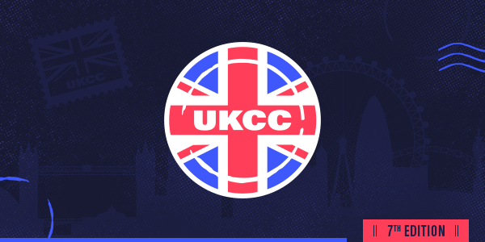

---
tags:
  - UKCC
  - UKCC7
  - UKCC#7
---

# UK Community Cup 7

The **UK Community Cup 7** (***UKCC7***) was a British 1v1 double-elimination osu! tournament hosted by ::{ flag=GB }:: [Bae-](https://osu.ppy.sh/users/6576972) and ::{ flag=GB }:: [Yazzehh](https://osu.ppy.sh/users/7068973). It was the seventh instalment of the UK Community Cup series and the series' fourth 1v1 competition.

## Tournament schedule

| Event | Timestamp |
| --: | :-- |
| Registration phase | 2019-07-27/2019-08-26 |
| Qualifying round 1 | 2019-09-07/2019-09-08 |
| Qualifying round 2 | 2019-09-14/2019-09-15 |
| Round of 32 | 2019-09-21/2019-09-22 |
| Round of 16 | 2019-09-28/2019-09-29 |
| Quarterfinals | 2019-10-05/2019-10-06 |
| Semifinals | 2019-10-12/2019-10-13 |
| Finals | 2019-10-19/2019-10-20 |
| Grand Finals | 2019-10-26/2019-10-27 |

## Prizes

| Placing | Prize(s) |
| :-: | :-- |
|  | 6 months of osu!supporter, profile badge and a magnificent trophy |
|  | 3 months of osu!supporter and a sparkling medal |
|  | 1 month of osu!supporter and a sparkling medal |

## Organisation

The UK Community Cup 7 was run by various community members.

| Position | Member(s) |
| :-- | :-- |
| Host | ::{ flag=GB }:: [Bae-](https://osu.ppy.sh/users/6576972), ::{ flag=GB }:: [Yazzehh](https://osu.ppy.sh/users/7068973) |
| Mappool selector | ::{ flag=BR }:: [Dada](https://osu.ppy.sh/users/9119507), ::{ flag=US }:: [\_p0ke\_](https://osu.ppy.sh/users/929134) |
| Streamer | ::{ flag=GB }:: [Bae-](https://osu.ppy.sh/users/6576972), ::{ flag=GB }:: [_Takara](https://osu.ppy.sh/users/11599184), ::{ flag=GB }:: [Kingling](https://osu.ppy.sh/users/7010761), ::{ flag=GB }:: [xFluffyo](https://osu.ppy.sh/users/8397226), ::{ flag=FI }:: [Lefafel](https://osu.ppy.sh/users/2295850) |
| Commentator | ::{ flag=GB }:: [sut_son](https://osu.ppy.sh/users/9622163), ::{ flag=FI }:: [Lefafel](https://osu.ppy.sh/users/2295850), ::{ flag=US }:: [tigereyes144](https://osu.ppy.sh/users/6499811), ::{ flag=GB }:: [_Takara](https://osu.ppy.sh/users/11599184), ::{ flag=GB }:: [Kingling](https://osu.ppy.sh/users/7010761), ::{ flag=GB }:: [xFluffyo](https://osu.ppy.sh/users/8397226), ::{ flag=GB }:: [Doomsday is bad](https://osu.ppy.sh/users/3481378), ::{ flag=GB }:: [Daiyaa](https://osu.ppy.sh/users/929134), ::{ flag=GB }:: [Doomsday](https://osu.ppy.sh/users/18983), ::{ flag=GB }:: [Gazzzaa](https://osu.ppy.sh/users/8624512), ::{ flag=GB }:: [Best459](https://osu.ppy.sh/users/8185366), ::{ flag=US }:: [M I L E S](https://osu.ppy.sh/users/6036351), ::{ flag=GB }:: [SteffoST](https://osu.ppy.sh/users/6566765), ::{ flag=GB }:: [Bae-](https://osu.ppy.sh/users/6576972), ::{ flag=GB }:: [hlo](https://osu.ppy.sh/users/2232928), ::{ flag=NL }:: [nik](https://osu.ppy.sh/users/10077264) |
| Designer | ::{ flag=GB }:: [Melonturtle](https://osu.ppy.sh/users/4775283), ::{ flag=GB }:: [Listie](https://osu.ppy.sh/users/4121535) |
| Referee | ::{ flag=GB }:: [Bae-](https://osu.ppy.sh/users/6576972), ::{ flag=GB }:: [Yazzehh](https://osu.ppy.sh/users/7068973), ::{ flag=DE }:: [Bakugo-](https://osu.ppy.sh/users/4990127), ::{ flag=GB }:: [Domblade](https://osu.ppy.sh/users/6701945), ::{ flag=BE }:: [DraQeu](https://osu.ppy.sh/users/4425520), ::{ flag=DE }:: [GDLenny](https://osu.ppy.sh/users/8406711), ::{ flag=FI }:: [Lefafel](https://osu.ppy.sh/users/2295850), ::{ flag=FR }:: [Mimir](https://osu.ppy.sh/users/7382734), ::{ flag=NL }:: [nik](https://osu.ppy.sh/users/10077264) |
| Statistician | ::{ flag=NO }:: [Yokespai](https://osu.ppy.sh/users/6399568) |

## Links

- [Discussion thread](https://osu.ppy.sh/community/forums/topics/940042?n=1)
- [Challonge](https://challonge.com/ukcc7)
- [Discord](https://discord.gg/EtsU7Cw)
- [Livestream](https://twitch.tv/osuukcc)
- [Pick'em page](https://pickem.hwchr.com/tournaments/15) hosted by ::{ flag=DE }:: [hallowatcher](https://osu.ppy.sh/users/1874761)
- [Spreadsheet](https://docs.google.com/spreadsheets/d/1ubY1Oci0HaH-rny6IKbqlRszPzquwSm9n4fwwnqn5yA/edit#gid=0)

## Participants

| Seed | Players |
| :-- | :-- |
| 1-16 | ::{ flag=GB }:: [Karthy](https://osu.ppy.sh/users/4196808), ::{ flag=GB }:: [Spare](https://osu.ppy.sh/users/2204373), ::{ flag=GB }:: [MoeYandere](https://osu.ppy.sh/users/2565902), ::{ flag=GB }:: [Bubbleman](https://osu.ppy.sh/users/5182050), ::{ flag=GB }:: [bloo](https://osu.ppy.sh/users/6778877), ::{ flag=GB }:: [Ventus](https://osu.ppy.sh/users/1986262), ::{ flag=GB }:: [Voss](https://osu.ppy.sh/users/7657761), ::{ flag=GB }:: [Woffel](https://osu.ppy.sh/users/3915122), ::{ flag=GB }:: [Wario](https://osu.ppy.sh/users/4361729), ::{ flag=GB }:: [Apo11o](https://osu.ppy.sh/users/9558549), ::{ flag=GB }:: [Doomsday](https://osu.ppy.sh/users/18983), ::{ flag=GB }:: [majoreh](https://osu.ppy.sh/users/7959222), ::{ flag=GB }:: [Harpy](https://osu.ppy.sh/users/6761714), ::{ flag=GB }:: [hlo](https://osu.ppy.sh/users/2232928), ::{ flag=GB }:: [helix](https://osu.ppy.sh/users/3322597), ::{ flag=GB }:: [Summer Solstice](https://osu.ppy.sh/users/3233710) |
| 17-32 | ::{ flag=GB }:: [Kingling](https://osu.ppy.sh/users/7010761), ::{ flag=GB }:: [AJT](https://osu.ppy.sh/users/3181083), ::{ flag=GB }:: [Zyphox](https://osu.ppy.sh/users/6589047), ::{ flag=GB }:: [Erylie](https://osu.ppy.sh/users/6652874), ::{ flag=GB }:: [Cla](https://osu.ppy.sh/users/4748791), ::{ flag=GB }:: [Rinnu](https://osu.ppy.sh/users/12179012), ::{ flag=GB }:: [meltz](https://osu.ppy.sh/users/6741042), ::{ flag=GB }:: [pod](https://osu.ppy.sh/users/8237552), ::{ flag=GB }:: [Malteser](https://osu.ppy.sh/users/5218178), ::{ flag=GB }:: [sut_son](https://osu.ppy.sh/users/9622163), ::{ flag=IE }:: [M a t t y](https://osu.ppy.sh/users/3737136), ::{ flag=GB }:: [Best459](https://osu.ppy.sh/users/8185366), ::{ flag=GB }:: [SteffoST](https://osu.ppy.sh/users/6566765), ::{ flag=GB }:: [xFluffyo](https://osu.ppy.sh/users/8397226), ::{ flag=GB }:: [Sam](https://osu.ppy.sh/users/1453543), ::{ flag=GB }:: [OskaRRRitoS](https://osu.ppy.sh/users/7051163) |
| 33-48 | ::{ flag=GB }:: [Appilesh](https://osu.ppy.sh/users/6467933), ::{ flag=IE }:: [Impossabear](https://osu.ppy.sh/users/10278329), ::{ flag=GB }:: [Maharen](https://osu.ppy.sh/users/4019511), ::{ flag=GB }:: [Kerantina](https://osu.ppy.sh/users/7516484), ::{ flag=GB }:: [Lemonosity](https://osu.ppy.sh/users/5668221), ::{ flag=GB }:: [- Akumi -](https://osu.ppy.sh/users/10528604), ::{ flag=GB }:: [idealnettles](https://osu.ppy.sh/users/4010354), ::{ flag=GB }:: [Gazzzaa](https://osu.ppy.sh/users/8624512), ::{ flag=GB }:: [[Nathan]](https://osu.ppy.sh/users/4741293), ::{ flag=GB }:: [Flare](https://osu.ppy.sh/users/10670430), ::{ flag=IE }:: [Pedro yH](https://osu.ppy.sh/users/5579031), ::{ flag=GB }:: [Cephus](https://osu.ppy.sh/users/3373206), ::{ flag=GB }:: [Teejay](https://osu.ppy.sh/users/9499753), ::{ flag=GB }:: [Lusory](https://osu.ppy.sh/users/2101270), ::{ flag=GB }:: [Tilley](https://osu.ppy.sh/users/8793814), ::{ flag=GB }:: [phant0mm](https://osu.ppy.sh/users/4490737) |
| 49-64 | ::{ flag=GB }:: [AlexDark69](https://osu.ppy.sh/users/5146647), ::{ flag=GB }:: [skyset](https://osu.ppy.sh/users/6244594), ::{ flag=GB }:: [ChicagoTed7172](https://osu.ppy.sh/users/2948139), ::{ flag=GB }:: [Rime](https://osu.ppy.sh/users/1397232), ::{ flag=GB }:: [dong](https://osu.ppy.sh/users/4422446), ::{ flag=GB }:: [Dep](https://osu.ppy.sh/users/11894736), ::{ flag=GB }:: [Mazz](https://osu.ppy.sh/users/7404874), ::{ flag=GB }:: [Chugger](https://osu.ppy.sh/users/4491713), ::{ flag=GB }:: [-spoon-](https://osu.ppy.sh/users/10623176), ::{ flag=GB }:: [Hoshik](https://osu.ppy.sh/users/10822769), ::{ flag=GB }:: [unrealLyyy](https://osu.ppy.sh/users/9594849), ::{ flag=GB }:: [RndGuy](https://osu.ppy.sh/users/1201586), ::{ flag=GB }:: [Defex](https://osu.ppy.sh/users/9674143), ::{ flag=IE }:: [S E K A I](https://osu.ppy.sh/users/8726490), ::{ flag=GB }:: [Declan](https://osu.ppy.sh/users/9673192), ::{ flag=GB }:: [-Deeline](https://osu.ppy.sh/users/10121815) |
| 65-80 | ::{ flag=GB }:: [Raiii](https://osu.ppy.sh/users/10300454), ::{ flag=GB }:: [Venoxia](https://osu.ppy.sh/users/7333471), ::{ flag=GB }:: [This Acc Sucks](https://osu.ppy.sh/users/7299249), ::{ flag=IE }:: [iNomaj](https://osu.ppy.sh/users/11042987), ::{ flag=GB }:: [Gazza](https://osu.ppy.sh/users/3648459), ::{ flag=GB }:: [DanZqa](https://osu.ppy.sh/users/4572097), ::{ flag=GB }:: [Coodywoo](https://osu.ppy.sh/users/6145623), ::{ flag=GB }:: [HonourBound](https://osu.ppy.sh/users/2945999), ::{ flag=GB }:: [Axyom](https://osu.ppy.sh/users/10510045), ::{ flag=GB }:: [Daiyaa](https://osu.ppy.sh/users/929134), ::{ flag=GB }:: [4Circ](https://osu.ppy.sh/users/2161823), ::{ flag=IE }:: [teetoew](https://osu.ppy.sh/users/3805082), ::{ flag=GB }:: [Pelzio](https://osu.ppy.sh/users/4775226), ::{ flag=IE }:: [KaiWhen](https://osu.ppy.sh/users/10040214), ::{ flag=US }:: [Kirix](https://osu.ppy.sh/users/2480224), ::{ flag=IE }:: [Nivlac-](https://osu.ppy.sh/users/8978983) |
| 81-96 | ::{ flag=GB }:: [_Snowy](https://osu.ppy.sh/users/10710046), ::{ flag=GB }:: [Tesco Meal Deal](https://osu.ppy.sh/users/6471972), ::{ flag=GB }:: [DeltaZero](https://osu.ppy.sh/users/6472042), ::{ flag=GB }:: [JO3-M4K](https://osu.ppy.sh/users/7659789), ::{ flag=GB }:: [Felicia](https://osu.ppy.sh/users/6177798), ::{ flag=GB }:: [SS_Eclipse](https://osu.ppy.sh/users/9468006), ::{ flag=GB }:: [Sith](https://osu.ppy.sh/users/8112797), ::{ flag=GB }:: [JackRB](https://osu.ppy.sh/users/10007343), ::{ flag=GB }:: [lokkut](https://osu.ppy.sh/users/4776591), ::{ flag=GB }:: [Asda Meal Deal](https://osu.ppy.sh/users/6749950), ::{ flag=GB }:: [PsychoStatic](https://osu.ppy.sh/users/7291594), ::{ flag=GB }:: [smh my head](https://osu.ppy.sh/users/12203874), ::{ flag=GB }:: [Phymiath](https://osu.ppy.sh/users/9106403), ::{ flag=GB }:: [Elit3](https://osu.ppy.sh/users/10086758), ::{ flag=GB }:: [Blukey](https://osu.ppy.sh/users/7813034), ::{ flag=GB }:: [GongoTheGecko](https://osu.ppy.sh/users/9227012) |
| 97-111 | ::{ flag=GB }:: [Damarsh](https://osu.ppy.sh/users/7465147), ::{ flag=GB }:: [DrexiN](https://osu.ppy.sh/users/5363646), ::{ flag=GB }:: [cfman29](https://osu.ppy.sh/users/9023597), ::{ flag=GB }:: [God](https://osu.ppy.sh/users/10502908), ::{ flag=GB }:: [Mantle](https://osu.ppy.sh/users/7225966), ::{ flag=GB }:: [aroS](https://osu.ppy.sh/users/7193474), ::{ flag=IE }:: [Neverslain](https://osu.ppy.sh/users/10644912), ::{ flag=IE }:: [kaniciwah](https://osu.ppy.sh/users/9371954), ::{ flag=GB }:: [josph12](https://osu.ppy.sh/users/8584840), ::{ flag=GB }:: [mamoopy](https://osu.ppy.sh/users/9384951), ::{ flag=GB }:: [fadentic](https://osu.ppy.sh/users/13453905), ::{ flag=GB }:: [Metzo](https://osu.ppy.sh/users/10633982), ::{ flag=GB }:: [Bowris](https://osu.ppy.sh/users/8562850), ::{ flag=GB }:: [_Phazy](https://osu.ppy.sh/users/3956707), ::{ flag=IE }:: [Broznix](https://osu.ppy.sh/users/13909259) |

## Podium

This competition has come to an end and resulted in the following podium:

| Placing | Player |
| :-: | :-- |
|  | [Bubbleman](https://osu.ppy.sh/users/5182050) |
|  | [Spare](https://osu.ppy.sh/users/2204373) |
|  | [AJT](https://osu.ppy.sh/users/3181083) |

## Mappools

### Grand Finals

**[Download the mappack here! (148.0MB)](https://mega.nz/#!TmhgUK5K!7kkYZPdolGvJbuCezRBj1SFJe6J-qZRu0B4qXTwXwzU)**

- NoMod
  1. [Shiena Nishizawa - Brand-new World (AtHeoN) [Brand-new Extra]](https://osu.ppy.sh/beatmapsets/375910#osu/1391381)
  2. [xi - over the top (AMX) [FOUR DIMENSIONS]](https://osu.ppy.sh/beatmapsets/801498#osu/1682412)
  3. [rerulili - Noushou Sakuretsu Girl (cheesiest) [sanji no oyatsu wa makaron tabemasu]](https://osu.ppy.sh/beatmapsets/196910#osu/911946)
  4. [lapix - Amazing Mirage (Extended) (Akali) [Fata Morgana]](https://osu.ppy.sh/beatmapsets/582543#osu/1232752)
  5. [Umeboshi Chazuke - Bison Charge (Nao Tomori) [Flask's Extreme]](https://osu.ppy.sh/beatmapsets/894701#osu/1900116)
  6. [sakuzyo - AXION (Flower) [AXION\_REBORN]](https://osu.ppy.sh/beatmapsets/115193#osu/324516)
- Hidden
  1. [xi - FREEDOM DiVE (Nakagawa-Kanon) [Another]](https://osu.ppy.sh/beatmapsets/39804#osu/126645)
  2. [Yunomi & nicamoq - Indoor Kei Nara Trackmaker (Snow Note) [Another]](https://osu.ppy.sh/beatmapsets/525846#osu/1115999)
  3. [DJKurara - Goodbye (EijiKuinbii) [SEVEN COLORS]](https://osu.ppy.sh/beatmapsets/866436#osu/1811477)
- HardRock
  1. [TAG - PRANA (CSY the corrupt) [Extreme]](https://osu.ppy.sh/beatmapsets/85275#osu/234444)
  2. [Yumeno Yuki - THE APPLE IS CAST! (Lasse) [Resolve]](https://osu.ppy.sh/beatmapsets/945614#osu/1974604)
  3. [Powerless - Soleil (handsome) [#1: handsome & pishifat]](https://osu.ppy.sh/beatmapsets/721494#osu/1523514)
- DoubleTime
  1. [Toyosaki Aki - MORE&MORE (Fycho) [Insane]](https://osu.ppy.sh/beatmapsets/125303#osu/318975)
  2. [BRZion - Game Brain (Zapy) [Insane]](https://osu.ppy.sh/beatmapsets/31224#osu/105978)
  3. [kors k - Dot (Reiji-RJ) [korzhik]](https://osu.ppy.sh/beatmapsets/184484#osu/441616)
  4. [Hardgore Alice (CV: Hidaka Rina) - Forget me Not... (Mordred) [Insane]](https://osu.ppy.sh/beatmapsets/918004#osu/1924965)
- FreeMod
  1. [DECO\*27 - Ghost Rule (val0108) [z1085684963's Extra]](https://osu.ppy.sh/beatmapsets/425169#osu/951521)
  2. [DragonForce - Ashes of the Dawn (pw384) [Extra]](https://osu.ppy.sh/beatmapsets/786141#osu/1650328)
  3. [CustomiZ - COOLEST (Spork Lover) [Hi-Speed Extreme]](https://osu.ppy.sh/beatmapsets/520373#osu/1105536)
- Tiebreaker
  1. **[Ata - Euphoria (bbu) [Delusion]](https://osu.ppy.sh/beatmapsets/813328#osu/1705819)**

### Finals

**[Download the mappack here! (165.6MB)](https://mega.nz/#!7ux0kKbD!aBqtZjDCQnxb4nvianpVv_2eOUl4aEeMa6TmZH-w5so)**

- NoMod
  1. [\*namirin - Amatsu Kitsune (Meg) [Extra]](https://osu.ppy.sh/beatmapsets/405474#osu/881313)
  2. [Nekomata L.E.D.Master+ - Chrono Diver -PENDULUMs- (yf_bmp) [-Visceral-'s Extreme]](https://osu.ppy.sh/beatmapsets/714552#osu/2592033)
  3. [siromaru + cranky - conflict (Icekalt) [Encounter]](https://osu.ppy.sh/beatmapsets/936126#osu/1955676)
  4. [t+pazolite - Call me it. (500 Tortures) (Fort) [Extra]](https://osu.ppy.sh/beatmapsets/291155#osu/655682)
  5. [Camellia - Chirality (Suzuki_1112) [fanzhen's Extra]](https://osu.ppy.sh/beatmapsets/692068#osu/1464581)
  6. [Pastel\*Palettes - Happy Synthesizer (ktgster) [Shizuku's Expert]](https://osu.ppy.sh/beatmapsets/932654#osu/1989990)
- Hidden
  1. [In Flames - Take This Life (LMT) [kiry's Extra]](https://osu.ppy.sh/beatmapsets/709296#osu/1569878)
  2. [Tachibana Miya - Miya to Tengoku to Jigoku (AngelHoney) [Hentai]](https://osu.ppy.sh/beatmapsets/17450#osu/62269)
  3. [Camellia as "Reverse of Riot" - Completeness Under Incompleteness (Regou) [RLC's Infinite]](https://osu.ppy.sh/beatmapsets/514750#osu/1094551)
- HardRock
  1. [Hana - Sakura no Uta (Ultimate Madoka) [VI.Artist of the Sakura]](https://osu.ppy.sh/beatmapsets/440068#osu/994933)
  2. [Glamour of the Kill - A Hope in Hell (ykcarrot) [Hopeless]](https://osu.ppy.sh/beatmapsets/31814#osu/104389)
  3. [Toby Fox - Chaos King (Fatfan Kolek) [Kalibe's Expert]](https://osu.ppy.sh/beatmapsets/877955#osu/1884623)
- DoubleTime
  1. [NanosizeMir - Philosophyz -NanosizeMir Ver.- (timemon) [Insane]](https://osu.ppy.sh/beatmapsets/621677#osu/1351933)
  2. [TK from Ling tosite sigure - White Out (Ametrin) [Snowy Departure]](https://osu.ppy.sh/beatmapsets/670872#osu/1418668)
  3. [Amane - Midsummer Festival (Natteke) [Lunatekke]](https://osu.ppy.sh/beatmapsets/21924#osu/75822)
  4. [NEWS - weeeek (Echo) [Insane]](https://osu.ppy.sh/beatmapsets/3697#osu/22422)
- FreeMod
  1. [Byakko - Kachou Fuusetsu (EvilElvis) [MasterPeeysa]](https://osu.ppy.sh/beatmapsets/190603#osu/453790)
  2. [Denkishiki Karen Ongaku Shuudan - Owari Tsumugishi Mono (LMT) [Lasse's Extra]](https://osu.ppy.sh/beatmapsets/763607#osu/1711326)
  3. [Kucchy vs Akky - Satori \~3rd eyes\~ (DJPop) [Lunatic]](https://osu.ppy.sh/beatmapsets/13827#osu/50892)
- Tiebreaker
  1. **[Demetori - Eastern Dream ~ The Introduction / Kamisabita Kosenjou \~ Suwa Foughten Field (Keada) [Stage 6]](https://osu.ppy.sh/beatmapsets/642547#osu/1362265)**

### Semifinals

**[Download the mappack here! (128.7MB)](https://mega.nz/#!S7p2QShR!ugelC74o3C1Xc3ECMHCb7EWzhvuZh75UuGs9_nznR44)**

- NoMod
  1. [Roselia - R (Doormat) [Rosenlied]](https://osu.ppy.sh/beatmapsets/820180#osu/1719416)
  2. [LeaF - MEPHISTO (Starfy) [Mephistopheles]](https://osu.ppy.sh/beatmapsets/714024#osu/1509096)
  3. Reol - Yakusoku no Ao (Fatfan Kolek) \[Chaoz's Extra\]<!-- Map deleted by owner -->
  4. [Camellia feat. Nanahira - NANI THE FUCK!! (Mir) [???????]](https://osu.ppy.sh/beatmapsets/1021743#osu/2137778)
  5. [EZFG - Hurting for a Very Hurtful Pain (tutuhaha) [Dance]](https://osu.ppy.sh/beatmapsets/46848#osu/145669)
  6. [kamome sano - citrus (nika mika) [moecho's lemonade]](https://osu.ppy.sh/beatmapsets/529789#osu/1411721)
- Hidden
  1. [Nico Nico Chorus - Unhappy Refrain (Kite) [Trigger-Happy]](https://osu.ppy.sh/beatmapsets/533123#osu/1129480)
  2. [RevenG - Sakura (Kharl) [Insane]](https://osu.ppy.sh/beatmapsets/4638#osu/25296)
  3. [Asaka - Open your eyes (Fushimi Rio) [World: :Synchronization]](https://osu.ppy.sh/beatmapsets/880456#osu/1871739)
- HardRock
  1. [Maksim Mrvica - Croatian Rhapsody (haha5957) [Presto]](https://osu.ppy.sh/beatmapsets/850663#osu/1778453)
  2. [Ryu\* - Sakura Reflection (MYTK Remix) (Leader) [Another]](https://osu.ppy.sh/beatmapsets/288486#osu/650610)
  3. [Azel - -Astraia- (ktgster) [Extra]](https://osu.ppy.sh/beatmapsets/316445#osu/706743)
- DoubleTime
  1. [TRUE - DREAM SOLISTER (Azunyan-) [Insane]](https://osu.ppy.sh/beatmapsets/967875#osu/2026140)
  2. [Hiro - Carol Megamix (LunarSakuya) [Insane]](https://osu.ppy.sh/beatmapsets/64901#osu/190584)
  3. [Two Door Cinema Club - Cigarettes In The Theatre (Lesjuh) [Insane]](https://osu.ppy.sh/beatmapsets/37461#osu/120461)
  4. [zts - worldenddominator (deetz) [Dada's Insane]](https://osu.ppy.sh/beatmapsets/897884#osu/1985639)
- FreeMod
  1. [All That Remains - This Calling (Riince) [Despair]](https://osu.ppy.sh/beatmapsets/304439#osu/682053)
  2. [Wiklund - Billy Boogie (yeahyeahyeahhh) [16 Bits?!]](https://osu.ppy.sh/beatmapsets/9040#osu/36547)
  3. [Akiyama Uni - The Grimoire of Alice (Hollow Wings) [Extra]](https://osu.ppy.sh/beatmapsets/123839#osu/316018)
- Tiebreaker
  1. **[USAO - Showdown (Depths) [Calamity]](https://osu.ppy.sh/beatmapsets/688191#osu/1456429)**

### Quarterfinals

**[Download the mappack here! (141.7MB)](https://mega.nz/#!37BHiSQa!_YCHsfzKe3AqxPboSBa2Uuyf0_chbWqYVTpd5QNj9WA)**

- NoMod
  1. [Suzumu - Kakumeisei ousama densenbyou (tutuhaha) [Extra]](https://osu.ppy.sh/beatmapsets/307686#osu/688304)
  2. [Prim - Koisuru\*Uchuu Sensou!! (CSY the corrupt) [Another]](https://osu.ppy.sh/beatmapsets/84125#osu/231964)
  3. [flumpool - Yoru wa Nemureru kai? (Kalibe) [Insomnia]](https://osu.ppy.sh/beatmapsets/738045#osu/1557509)
  4. [Camellia - crystallized (Smoothie World) [Ca2Al3(SiO4)3(OH)]](https://osu.ppy.sh/beatmapsets/399151#osu/867819)
  5. [Imperial Circus Dead Decadence - Shinbatsu o Tadori Kyoukotsu ni Itaru (Kite) [Extra Collab]](https://osu.ppy.sh/beatmapsets/482382#osu/2040764)
  6. [Shindig - New Friends (GreenHue) [squirrelp's Key to a Happy Life]](https://osu.ppy.sh/beatmapsets/761932#osu/1603103)
- Hidden
  1. [Hiroyuki Sawano feat. Mika Kobayashi - Bios (goodbye) [LKs' Another]](https://osu.ppy.sh/beatmapsets/43674#osu/137766)
  2. [DIGI-SEQ-BAND2000 - Somehow You Found Me (VitaminB6) [Expert]](https://osu.ppy.sh/beatmapsets/11761#osu/44692)
  3. [Ryu\* vs. Sota - Go Beyond!! (Anto) [Nuvolina's Expert!!]](https://osu.ppy.sh/beatmapsets/934522#osu/2023961)
- HardRock
  1. [Helblinde - Putin's Boner (YellowManul) [Extra]](https://osu.ppy.sh/beatmapsets/318036#osu/708367)
  2. [Kakumi Nishigomi - Hyakka Ryouran (jyc-Binggan) [Hana]](https://osu.ppy.sh/beatmapsets/73451#osu/271616)
  3. [Apocalyptica - 2010 (feat. Dave Lombardo) (pishifat) [Extra]](https://osu.ppy.sh/beatmapsets/324990#osu/724512)
- DoubleTime
  1. [Iguchi Yuka - HELLO to DREAM (Mordred) [Lasse's Insane]](https://osu.ppy.sh/beatmapsets/1006608#osu/2109432)
  2. [Toyama Nao - Ima Koko (Kibbleru) [Together]](https://osu.ppy.sh/beatmapsets/687493#osu/1454746)
  3. [Hatsune Miku - Vegetable Juice (Po Pi Po) Ryu Remix (banvi) [animask's Juice]](https://osu.ppy.sh/beatmapsets/14984#osu/57735)
- FreeMod
  1. [TAKA respect for J.S.B - Ubertreffen (kiddly) [Another]](https://osu.ppy.sh/beatmapsets/15740#osu/56830)
  2. [Mikami Shiori - Watashi, Shuyaku no Akaza Akari desu (Happy Euri Mix) (Arphimigon) [Akarimigon]](https://osu.ppy.sh/beatmapsets/404937#osu/880364)
  3. [T & Sugah x Lexurus - No More (Strategas) [Extra]](https://osu.ppy.sh/beatmapsets/471562#osu/1007896)
- Tiebreaker
  1. **[Diao Ye Zong feat. Meramipop - Gensou Roman Kikou (is the limit.) (sahuang) [Flower Dance]](https://osu.ppy.sh/beatmapsets/719447#osu/1519282)**

### Round of 16

**[Download the mappack here! (163.5MB)](https://mega.nz/#!qqA2nCSa!zCQWppNn47REZtWCPLk9aVguEF9rGuO9h6BwHQGVqUk)**

- NoMod
  1. [Aqours - Thrilling One Way (ASPIRIN) [DvXtra]](https://osu.ppy.sh/beatmapsets/577666#osu/1225805)
  2. [sak respect for Arata Iiyoshi - Reason of being (CookieBite) [FINAL DESTINATION]](https://osu.ppy.sh/beatmapsets/640558#osu/1358482)
  3. [Nekomata Master - Nekozamurai no Gyakushu (moph) [kwk's Extra]](https://osu.ppy.sh/beatmapsets/518743#osu/1434351)
  4. [Yousei Teikoku - Zetsubou plantation (Saten) [Extra]](https://osu.ppy.sh/beatmapsets/86009#osu/688942)
  5. [Memme - Acid Burst (Priti) [Hollowversibles's Extra]](https://osu.ppy.sh/beatmapsets/302535#osu/689803)
  6. [JYOCHO - Taiyou to Kurashite Kita (dsco) [Bloom]](https://osu.ppy.sh/beatmapsets/600881#osu/1269564)
- Hidden
  1. [S3RL - MTC (Different Heaven Remix) (-Genesis) [Heaven]](https://osu.ppy.sh/beatmapsets/288162#osu/770354)
  2. [Conagusuri - Hina Choco Dark Matter (Mafiamaster) [Lunatic]](https://osu.ppy.sh/beatmapsets/15576#osu/56337)
  3. [adaptor - LAISSEZ:FAIRE (handsome) [Team Sample Text's Extra]](https://osu.ppy.sh/beatmapsets/671457#osu/1419707)
- HardRock
  1. [Giga & Suzumu feat. Kagamine Rin - Undead Enemy (pkk) [Oppression]](https://osu.ppy.sh/beatmapsets/224600#osu/524187)
  2. [Qrispy Joybox feat.mao - Umeyukiyo (LKs) [Insane]](https://osu.ppy.sh/beatmapsets/100040#osu/265643)
  3. [Levaslater - NNRT (Reisen Udongein) [Extra]](https://osu.ppy.sh/beatmapsets/47330#osu/146985)
- DoubleTime
  1. [Reol - MONSTER (handsome) [SHARKIE'S INSANE]](https://osu.ppy.sh/beatmapsets/366440#osu/812721)
  2. [VY1 - Cyber Thunder Cider (tutuhaha) [Cyber]](https://osu.ppy.sh/beatmapsets/47146#osu/151215)
  3. [David Hasselhoff - True Survivor (Crimmi) [Insane Survivors]](https://osu.ppy.sh/beatmapsets/321460#osu/737878)
- FreeMod
  1. [Cranky - The Five (tsukamaete) [Another]](https://osu.ppy.sh/beatmapsets/18339#osu/64996)
  2. [Airi Totoki, Akane Hino, Aiko Takamori, Syoko Hoshi, Yuko Hori - Zettai Tokken Shuchou Shimasu! (Snow Note) [MASTER]](https://osu.ppy.sh/beatmapsets/738362#osu/1559184)
  3. [Rigel Theatre - Rinn Ding Dong (kwk) [moph's Big Dong Extra]](https://osu.ppy.sh/beatmapsets/804648#osu/1724396)
- Tiebreaker
  1. **[Demetori - Youyoumu \~ The Woman Who Sold the Moon (Keada) [Phantasm]](https://osu.ppy.sh/beatmapsets/740641#osu/1562486)**

### Round of 32

**[Download the mappack here! (114.6MB)](https://mega.nz/#!OvQhmAiS!PT1qpuu5XGjnvX9Ra9w8flaEZsL_CCW47scekuARt7Y)**

- NoMod
  1. [kalon. - Juubaku (Meg) [rui's Extra]](https://osu.ppy.sh/beatmapsets/529724#osu/1123161)
  2. [Yuuyu - Scrap Syndrome (deetz) [Extra]](https://osu.ppy.sh/beatmapsets/973996#osu/2044722)
  3. [Eagle - Hypersonik (EvilElvis) [NeilPerry]](https://osu.ppy.sh/beatmapsets/517959#osu/1104818)
  4. [TK from Ling Tosite Sigure - katharsis (Seto Kousuke) [Expert]](https://osu.ppy.sh/beatmapsets/862411#osu/1803966)
  5. [MAX MAXIMIZER vs. DJ TOTTO - Rebellio (Realazy) [REALARU's EXTRA]](https://osu.ppy.sh/beatmapsets/744636#osu/1632337)
  6. [Meg & Dia - Monster (DotEXE Remix) (nold_1702) [Xtra]](https://osu.ppy.sh/beatmapsets/157896#osu/436825)
- Hidden
  1. [Kuroneko Dungeon - Lilieze to Enryuu Laevateinn (Nyquill) [Another†leggendaria]](https://osu.ppy.sh/beatmapsets/326608#osu/725139)
  2. [ZUN - The Youkai Mountain \~ Mysterious Mountain (Lybydose) [Lunatic]](https://osu.ppy.sh/beatmapsets/22278#osu/76917)
  3. [Another Infinity feat. Mayumi Morinaga - COME BACK TO MY HEART (Ryu\* Remix) (CSY the corrupt) [Extreme]](https://osu.ppy.sh/beatmapsets/63056#osu/186599)
- HardRock
  1. [Breaking Benjamin - The Diary of Jane (FCL) [Extreme]](https://osu.ppy.sh/beatmapsets/468418#osu/1001921)
  2. [Eagle - S!ck (tsuka) [Extra]](https://osu.ppy.sh/beatmapsets/84014#osu/341285)
  3. [An - Encryption (HelloSCV) [Kloyd's Extra]](https://osu.ppy.sh/beatmapsets/96368#osu/258384)
- DoubleTime
  1. [Nanamori-chu \* Goraku-bu - Precious Friends (Setz206) [Insane]](https://osu.ppy.sh/beatmapsets/173956#osu/420131)
  2. [Chata - Present (Lasse) [Insane]](https://osu.ppy.sh/beatmapsets/840161#osu/1761649)
  3. [Mago de Oz - Xanandra (Xanandra) [Sieg's Hard]](https://osu.ppy.sh/beatmapsets/74313#osu/249032)
- FreeMod
  1. [nano - Silence (Tari) [Insane]](https://osu.ppy.sh/beatmapsets/240160#osu/555116)
  2. [Streetlight Manifesto - A Moment of Violence (pishifat) [Extra]](https://osu.ppy.sh/beatmapsets/485376#osu/1035104)
  3. [onoken - Felys (Inferior) [DJPop's Insane]](https://osu.ppy.sh/beatmapsets/7013#osu/160795)
- Tiebreaker
  1. **[FELT - Lies in Reality (Frostings) [Albatross]](https://osu.ppy.sh/beatmapsets/568845#osu/1205981)**

### Qualifying round 2

**[Download the mappack here! (86.8MB)](https://mega.nz/#!f3ASAA7T!umH3bN99cnuYe1ZFsOiXauUBFQRrW0n-_Zr4V8gE9ZA)**

- NoMod
  1. [96neko - E? Aa, sou. (newton-) [Fabricated]](https://osu.ppy.sh/beatmapsets/902346#osu/1914227)
  2. [cYsmix - Peer Gynt (Rolniczy) [Expert]](https://osu.ppy.sh/beatmapsets/805762#osu/1691360)
  3. [Reid Speed & Ahee - Overtaken (feat. Heartwurkz) (Rue) [Tonight is All Mine]](https://osu.ppy.sh/beatmapsets/898881#osu/1877730)
- Hidden
  1. [FLOOR LEGENDS -KAC 2012- - KAC 2012 ULTIMATE MEDLEY -HISTORIA SOUND VOLTEX- (Gamu) [N a s y a's INFINITE]](https://osu.ppy.sh/beatmapsets/296505#osu/682020)
  2. [Bilibili Douga - Night of Feifan Brother (Lan wings) [Feifan Bro]](https://osu.ppy.sh/beatmapsets/44443#osu/139221)
- HardRock
  1. [nano - No pain, No game (xsrsbsns) [Insane]](https://osu.ppy.sh/beatmapsets/60785#osu/185761)
  2. [iru1919 - Tenko (Seto Kousuke) [Insane]](https://osu.ppy.sh/beatmapsets/840826#osu/1759876)
- DoubleTime
  1. [u's - START:DASH!! (scanter) [Insane]](https://osu.ppy.sh/beatmapsets/99340#osu/264252)
  2. [Hana - Gekka Jasmine (2014ver.) (PinkHeart) [Gyro's Light Insane]](https://osu.ppy.sh/beatmapsets/408745#osu/1035068)

### Qualifying round 1

**[Download the mappack here! (46.7MB)](https://mega.nz/#!T6RjDY7S!0PbquOystkS4v2-byiBC0b_KMEZA8lECFhMqjYKDm_A)**

- NoMod
  1. [ALiCE'S EMOTiON - Cold Rain (Yauxo) [Lunatic]](https://osu.ppy.sh/beatmapsets/204399#osu/482650)
  2. [sakuzyo - VALLISTA (Shiirn) [Another]](https://osu.ppy.sh/beatmapsets/40056#osu/127313)
  3. [U - Ha-tenya? (biwako) [Insane]](https://osu.ppy.sh/beatmapsets/37313#osu/120080)
  4. [YUC'e - Sengoku HOP (Nathan) [apple's Insane]](https://osu.ppy.sh/beatmapsets/564329#osu/1489274)
- Hidden
  1. [Iguchi Yuka - RE-ILLUSION (Mordred) [Collab Insane]](https://osu.ppy.sh/beatmapsets/806635#osu/1856697)
- HardRock
  1. [Meramipop - algorhythm (cRyo[iceeicee]) [Insane]](https://osu.ppy.sh/beatmapsets/43524#osu/136571)
- DoubleTime
  1. [T.M.Revolution x Mizuki Nana - Preserved Roses (Xinely) [Collab Hard]](https://osu.ppy.sh/beatmapsets/223530#osu/522135)

## Match results

### Grand Finals

#### Grand Final

Wednesday, 27 October 2019:

| Player 1 |  |  | Player 2 | Match link |
| --: | :-: | :-: | :-- | :-- |
| Spare ::{ flag=GB }:: | 3 | **7** | ::{ flag=GB }:: **Bubbleman** | [#1](https://osu.ppy.sh/community/matches/55854629) |
| Spare ::{ flag=GB }:: | 0 | **7** | ::{ flag=GB }:: **Bubbleman** | [#1](https://osu.ppy.sh/community/matches/55856320) |

#### Loser Finals

Wednesday, 23 October 2019:

| Player 1 |  |  | Player 2 | Match link |
| --: | :-: | :-: | :-- | :-- |
| **Bubbleman** ::{ flag=GB }:: | **7** | 4 | ::{ flag=GB }:: AJT | [#1](https://osu.ppy.sh/community/matches/55760376) |

### Finals

#### Winner Finals

Saturday, 19 October 2019:

| Player 1 |  |  | Player 2 | Match link |
| --: | :-: | :-: | :-- | :-- |
| **Spare** ::{ flag=GB }:: | **6** | 3 | ::{ flag=GB }:: AJT | [#1](https://osu.ppy.sh/community/matches/55673675) |

#### Losers Bracket Round 6

Sunday, 20 October 2019:

| Player 1 |  |  | Player 2 | Match link |
| --: | :-: | :-: | :-- | :-- |
| **Harpy** ::{ flag=GB }:: | **6** | 4 | ::{ flag=GB }:: hlo | [#1](https://osu.ppy.sh/community/matches/55693071) |

Monday, 21 October 2019:

| Player 1 |  |  | Player 2 | Match link |
| --: | :-: | :-: | :-- | :-- |
| Ventus ::{ flag=GB }:: | 4 | **6** | ::{ flag=GB }:: **Bubbleman** | [#1](https://osu.ppy.sh/community/matches/55719453) |

#### Losers Bracket Round 7

Tuesday, 22 October 2019:

| Player 1 |  |  | Player 2 | Match link |
| --: | :-: | :-: | :-- | :-- |
| Harpy ::{ flag=GB }:: | 4 | **6** | ::{ flag=GB }:: **Bubbleman** | [#1](https://osu.ppy.sh/community/matches/55738843) |

### Semifinals

#### Semifinals

Sunday, 13 October 2019:

| Player 1 |  |  | Player 2 | Match link |
| --: | :-: | :-: | :-- | :-- |
| **Spare** ::{ flag=GB }:: | **6** | 3 | ::{ flag=GB }:: Harpy | [#1](https://osu.ppy.sh/community/matches/55539551) |
| **AJT** ::{ flag=GB }:: | **6** | 4 | ::{ flag=GB }:: Ventus | [#1](https://osu.ppy.sh/community/matches/55545686) |

#### Losers Bracket Round 4

Friday, 11 October 2019:

| Player 1 |  |  | Player 2 | Match link |
| --: | :-: | :-: | :-- | :-- |
| Malteser ::{ flag=GB }:: | 2 | **6** | ::{ flag=GB }:: **Best459** | [#1](https://osu.ppy.sh/community/matches/55482259) |

Saturday, 12 October 2019:

| Player 1 |  |  | Player 2 | Match link |
| --: | :-: | :-: | :-- | :-- |
| bloo ::{ flag=GB }:: | -1 | **0** | ::{ flag=GB }:: **Kingling** | *forfeit* |

Sunday, 13 October 2019:

| Player 1 |  |  | Player 2 | Match link |
| --: | :-: | :-: | :-- | :-- |
| Wario ::{ flag=GB }:: | 0 | **6** | ::{ flag=GB }:: **hlo** | [#1](https://osu.ppy.sh/community/matches/55542910) |

Wednesday, 16 October 2019:

| Player 1 |  |  | Player 2 | Match link |
| --: | :-: | :-: | :-- | :-- |
| Doomsday ::{ flag=GB }:: | 1 | **6** | ::{ flag=GB }:: **Bubbleman** | [#1](https://osu.ppy.sh/community/matches/55605940) |

#### Losers Bracket Round 5

Tuesday, 15 October 2019:

| Player 1 |  |  | Player 2 | Match link |
| --: | :-: | :-: | :-- | :-- |
| **hlo** ::{ flag=GB }:: | **6** | 2 | ::{ flag=GB }:: Best459 | [#1](https://osu.ppy.sh/community/matches/55585920) |

Thursday, 17 October 2019:

| Player 1 |  |  | Player 2 | Match link |
| --: | :-: | :-: | :-- | :-- |
| Kingling ::{ flag=GB }:: | 3 | **6** | ::{ flag=GB }:: **Bubbleman** | [#1](https://osu.ppy.sh/community/matches/55620137) |

### Quarterfinals

#### Quarterfinals

Saturday, 5 October 2019:

| Player 1 |  |  | Player 2 | Match link |
| --: | :-: | :-: | :-- | :-- |
| **Spare** ::{ flag=GB }:: | **5** | 0 | ::{ flag=GB }:: bloo | [#1](https://osu.ppy.sh/community/matches/55335898) |
| **AJT** ::{ flag=GB }:: | **5** | 3 | ::{ flag=GB }:: Best459 | [#1](https://osu.ppy.sh/community/matches/55350496) |

Sunday, 6 October 2019:

| Player 1 |  |  | Player 2 | Match link |
| --: | :-: | :-: | :-- | :-- |
| **Harpy** ::{ flag=GB }:: | **5** | 3 | ::{ flag=GB }:: Doomsday | [#1](https://osu.ppy.sh/community/matches/55372794) |
| Wario ::{ flag=GB }:: | 2 | **5** | ::{ flag=GB }:: **Ventus** | [#1](https://osu.ppy.sh/community/matches/55378053) |

#### Losers Bracket Round 2

Monday, 30 September 2019:

| Player 1 |  |  | Player 2 | Match link |
| --: | :-: | :-: | :-- | :-- |
| **Apo11o** ::{ flag=GB }:: | **5** | 2 | ::{ flag=GB }:: Defex | [#1](https://osu.ppy.sh/community/matches/55236437) |

Saturday, 5 October 2019:

| Player 1 |  |  | Player 2 | Match link |
| --: | :-: | :-: | :-- | :-- |
| **Kingling** ::{ flag=GB }:: | **0** | -1 | ::{ flag=GB }:: meltz | *forfeit* |
| MoeYandere ::{ flag=GB }:: | -1 | **0** | ::{ flag=GB }:: **hlo** | *forfeit* |
| majoreh ::{ flag=GB }:: | 2 | **5** | ::{ flag=GB }:: **Zyphox** | [#1](https://osu.ppy.sh/community/matches/55347021) |

Sunday, 6 October 2019:

| Player 1 |  |  | Player 2 | Match link |
| --: | :-: | :-: | :-- | :-- |
| **Malteser** ::{ flag=GB }:: | **5** | 3 | ::{ flag=GB }:: Woffel | [#1](https://osu.ppy.sh/community/matches/55368204) |
| **Bubbleman** ::{ flag=GB }:: | **5** | 1 | ::{ flag=GB }:: Rinnu | [#1](https://osu.ppy.sh/community/matches/55371230) |
| Voss ::{ flag=GB }:: | 2 | **5** | ::{ flag=GB }:: **Kerantina** | [#1](https://osu.ppy.sh/community/matches/55376109) |

Monday, 7 October 2019:

| Player 1 |  |  | Player 2 | Match link |
| --: | :-: | :-: | :-- | :-- |
| helix ::{ flag=GB }:: | 3 | **5** | ::{ flag=GB }:: **Summer Solstice** | [#1](https://osu.ppy.sh/community/matches/55399760) |

#### Losers Bracket Round 3

Saturday, 5 October 2019:

| Player 1 |  |  | Player 2 | Match link |
| --: | :-: | :-: | :-- | :-- |
| **Kingling** ::{ flag=GB }:: | **0** | -1 | ::{ flag=GB }:: Apo11o | *forfeit* |

Sunday, 6 October 2019:

| Player 1 |  |  | Player 2 | Match link |
| --: | :-: | :-: | :-- | :-- |
| **hlo** ::{ flag=GB }:: | **5** | 3 | ::{ flag=GB }:: Zyphox | [#1](https://osu.ppy.sh/community/matches/55368217) |

Tuesday, 8 October 2019:

| Player 1 |  |  | Player 2 | Match link |
| --: | :-: | :-: | :-- | :-- |
| Summer Solstice ::{ flag=GB }:: | 1 | **5** | ::{ flag=GB }:: **Malteser** | [#1](https://osu.ppy.sh/community/matches/55419418) |

Friday, 11 October 2019:

| Player 1 |  |  | Player 2 | Match link |
| --: | :-: | :-: | :-- | :-- |
| Kerantina ::{ flag=GB }:: | 0 | **5** | ::{ flag=GB }:: **Bubbleman** | [#1](https://osu.ppy.sh/community/matches/55477017) |

### Round of 16

#### Round of 16

Friday, 27 September 2019:

| Player 1 |  |  | Player 2 | Match link |
| --: | :-: | :-: | :-- | :-- |
| **Harpy** ::{ flag=GB }:: | **5** | 1 | ::{ flag=GB }:: MoeYandere | [#1](https://osu.ppy.sh/community/matches/55145284) |

Saturday, 28 September 2019:

| Player 1 |  |  | Player 2 | Match link |
| --: | :-: | :-: | :-- | :-- |
| **Best459** ::{ flag=GB }:: | **5** | 0 | ::{ flag=GB }:: Apo11o | [#1](https://osu.ppy.sh/community/matches/55179412) |

Sunday, 29 September 2019:

| Player 1 |  |  | Player 2 | Match link |
| --: | :-: | :-: | :-- | :-- |
| **Spare** ::{ flag=GB }:: | **5** | 3 | ::{ flag=GB }:: helix | [#1](https://osu.ppy.sh/community/matches/55205273) |
| **Doomsday** ::{ flag=GB }:: | **5** | 3 | ::{ flag=GB }:: majoreh | [#1](https://osu.ppy.sh/community/matches/55206159) |
| **AJT** ::{ flag=GB }:: | **5** | 4 | ::{ flag=GB }:: Kingling | [#1](https://osu.ppy.sh/community/matches/55211334) |
| Bubbleman ::{ flag=GB }:: | -1 | **0** | ::{ flag=GB }:: **Ventus** | *forfeit* |
| Voss ::{ flag=GB }:: | 2 | **5** | ::{ flag=GB }:: **Wario** | [#1](https://osu.ppy.sh/community/matches/55214023) |

Wednesday, 2 October 2019:

| Player 1 |  |  | Player 2 | Match link |
| --: | :-: | :-: | :-- | :-- |
| **bloo** ::{ flag=GB }:: | **5** | 2 | ::{ flag=GB }:: Malteser | [#1](https://osu.ppy.sh/community/matches/55274719) |

#### Losers Bracket Round 1

Saturday, 28 September 2019:

| Player 1 |  |  | Player 2 | Match link |
| --: | :-: | :-: | :-- | :-- |
| **meltz** ::{ flag=GB }:: | **5** | 4 | ::{ flag=GB }:: pod | [#1](https://osu.ppy.sh/community/matches/55166896) |
| **Defex** ::{ flag=GB }:: | **5** | 0 | ::{ flag=GB }:: xFluffyo | [#1](https://osu.ppy.sh/community/matches/55173947) |
| **Kerantina** ::{ flag=GB }:: | **5** | 3 | ::{ flag=GB }:: Tilley | [#1](https://osu.ppy.sh/community/matches/55171273) |
| **hlo** ::{ flag=GB }:: | **0** | -1 | ::{ flag=GB }:: DeltaZero | *forfeit* |
| Kirix ::{ flag=GB }:: | 0 | **5** | ::{ flag=GB }:: **Rinnu** | [#1](https://osu.ppy.sh/community/matches/55173434) |

Sunday, 29 September 2019:

| Player 1 |  |  | Player 2 | Match link |
| --: | :-: | :-: | :-- | :-- |
| **Woffel** ::{ flag=GB }:: | **5** | 1 | ::{ flag=GB }:: -spoon- | [#1](https://osu.ppy.sh/community/matches/55210336) |
| **Cla** ::{ flag=GB }:: | **5** | 1 | ::{ flag=GB }:: Summer Solstice | [#1](https://osu.ppy.sh/community/matches/55212272) |

Thursday, 3 October 2019:

| Player 1 |  |  | Player 2 | Match link |
| --: | :-: | :-: | :-- | :-- |
| Appilesh ::{ flag=GB }:: | 0 | **5** | ::{ flag=GB }:: **Zyphox** | [#1](https://osu.ppy.sh/community/matches/55296385) |

### Round of 32

Friday, 20 September 2019:

| Player 1 |  |  | Player 2 | Match link |
| --: | :-: | :-: | :-- | :-- |
| **MoeYandere** ::{ flag=GB }:: | **5** | 1 | ::{ flag=GB }:: xFluffyo | [#1](https://osu.ppy.sh/community/matches/54975432) |

Saturday, 21 September 2019:

| Player 1 |  |  | Player 2 | Match link |
| --: | :-: | :-: | :-- | :-- |
| **Spare** ::{ flag=GB }:: | **5** | 1 | ::{ flag=GB }:: Kirix | [#1](https://osu.ppy.sh/community/matches/55002002) |
| **AJT** ::{ flag=GB }:: | **5** | 1 | ::{ flag=GB }:: Appilesh | [#1](https://osu.ppy.sh/community/matches/55002344) |
| **Best459** ::{ flag=GB }:: | **5** | 3 | ::{ flag=GB }:: hlo | [#1](https://osu.ppy.sh/community/matches/55004099) |
| **Doomsday** ::{ flag=GB }:: | **5** | 0 | ::{ flag=GB }:: meltz | [#1](https://osu.ppy.sh/community/matches/55008167) |
| **Malteser** ::{ flag=GB }:: | **5** | 0 | ::{ flag=GB }:: Tilley | [#1](https://osu.ppy.sh/community/matches/55010302) |

Sunday, 22 September 2019:

| Player 1 |  |  | Player 2 | Match link |
| --: | :-: | :-: | :-- | :-- |
| **Bubbleman** ::{ flag=GB }:: | **5** | 0 | ::{ flag=GB }:: Cla | [#1](https://osu.ppy.sh/community/matches/55033230) |
| **majoreh** ::{ flag=GB }:: | **5** | 2 | ::{ flag=GB }:: pod | [#1](https://osu.ppy.sh/community/matches/55036478) |
| Zyphox ::{ flag=GB }:: | 3 | **5** | ::{ flag=GB }:: **Kingling** | [#1](https://osu.ppy.sh/community/matches/55036528) |
| **bloo** ::{ flag=GB }:: | **5** | 2 | ::{ flag=GB }:: Kerantina | [#1](https://osu.ppy.sh/community/matches/55039874) |
| **Voss** ::{ flag=GB }:: | **5** | 1 | ::{ flag=GB }:: Woffel | [#1](https://osu.ppy.sh/community/matches/55040015) |
| **Harpy** ::{ flag=GB }:: | **5** | 0 | ::{ flag=GB }:: Defex | [#1](https://osu.ppy.sh/community/matches/55042213) |
| **helix** ::{ flag=GB }:: | **5** | 1 | ::{ flag=GB }:: Rinnu | [#1](https://osu.ppy.sh/community/matches/55043513) |
| **Apo11o** ::{ flag=GB }:: | **0** | -1 | ::{ flag=GB }:: DeltaZero | *forfeit* |

Monday, 23 September 2019:

| Player 1 |  |  | Player 2 | Match link |
| --: | :-: | :-: | :-- | :-- |
| -spoon- ::{ flag=GB }:: | 4 | **5** | ::{ flag=GB }:: **Wario** | [#1](https://osu.ppy.sh/community/matches/55061725) |

Wednesday, 25 September 2019:

| Player 1 |  |  | Player 2 | Match link |
| --: | :-: | :-: | :-- | :-- |
| **Ventus** ::{ flag=GB }:: | **5** | 4 | ::{ flag=GB }:: Summer Solstice | [#1](https://osu.ppy.sh/community/matches/55103447) |

### Qualifying round 2

See the [Qualifying round 2 results sheet](https://docs.google.com/spreadsheets/d/1ubY1Oci0HaH-rny6IKbqlRszPzquwSm9n4fwwnqn5yA/edit#gid=1213327055) for a breakdown of the round 2 qualification results.

Top 10 qualification results:

| Placing | Player | Total score | Average score |
| --: | :-- | :-- | :-- |
|  | ::{ flag=GB }:: [AJT](https://osu.ppy.sh/users/3181083) | 9,047,548 | 1,005,283 |
|  | ::{ flag=GB }:: [Spare](https://osu.ppy.sh/users/2204373) | 8,927,095 | 991,899 |
|  | ::{ flag=GB }:: [Voss](https://osu.ppy.sh/users/7657761) | 8,925,622 | 991,736 |
| *4th place* | ::{ flag=GB }:: [Harpy](https://osu.ppy.sh/users/6761714) | 8,883,330 | 987,037 |
| *5th place* | ::{ flag=GB }:: [Best459](https://osu.ppy.sh/users/8185366) | 8,706,043 | 967,338 |
| *6th place* | ::{ flag=GB }:: [Doomsday](https://osu.ppy.sh/users/18983) | 8,677,900 | 964,211 |
| *7th place* | ::{ flag=GB }:: [Malteser](https://osu.ppy.sh/users/5218178) | 8,647,916 | 960,880 |
| *8th place* | ::{ flag=GB }:: [Bubbleman](https://osu.ppy.sh/users/5182050) | 8,574,337 | 952,704 |
| *9th place* | ::{ flag=GB }:: [bloo](https://osu.ppy.sh/users/6778877) | 8,337,871 | 926,430 |
| *10th place* | ::{ flag=GB }:: [Apo11o](https://osu.ppy.sh/users/9558549) | 7,934,353 | 881,595 |

### Qualifying round 1

See the [Qualifying round 1 results sheet](https://docs.google.com/spreadsheets/d/1ubY1Oci0HaH-rny6IKbqlRszPzquwSm9n4fwwnqn5yA/edit#gid=1010206758) for a breakdown of the round 1 qualification results.

Top 10 qualification results:

| Placing | Player | Total score | Average score |
| --: | :-- | :-- | :-- |
|  | ::{ flag=GB }:: [Ventus](https://osu.ppy.sh/users/1986262) | 7,359,796 | 1,051,399 |
|  | ::{ flag=GB }:: [Voss](https://osu.ppy.sh/users/7657761) | 7,348,665 | 1,049,809 |
|  | ::{ flag=GB }:: [Doomsday](https://osu.ppy.sh/users/18983) | 7,323,921 | 1,046,274 |
| *4th place* | ::{ flag=GB }:: [Harpy](https://osu.ppy.sh/users/6761714) | 7,301,100 | 1,043,014 |
| *5th place* | ::{ flag=GB }:: [Best459](https://osu.ppy.sh/users/8185366) | 7,236,793 | 1,033,828 |
| *6th place* | ::{ flag=GB }:: [Malteser](https://osu.ppy.sh/users/5218178) | 7,190,030 | 1,027,147 |
| *7th place* | ::{ flag=GB }:: [AJT](https://osu.ppy.sh/users/3181083) | 7,115,924 | 1,016,561 |
| *8th place* | ::{ flag=GB }:: [Apo11o](https://osu.ppy.sh/users/9558549) | 7,104,376 | 1,014,911 |
| *9th place* | ::{ flag=GB }:: [Spare](https://osu.ppy.sh/users/2204373) | 7,003,977 | 1,000,568 |
| *10th place* | ::{ flag=GB }:: [idealnettles](https://osu.ppy.sh/users/4010354) | 6,974,913 | 996,416 |

## Ruleset

- In the event there are 128 signups, those with the lowest global rank will be unable to participate (unless the tournament is expanded).
- The structure of the tournament will be:
  - Two qualification rounds where 32 players progress
  - Double Elimination Bracket
- To be able to participate, players must have an **::{ flag=GB }:: United Kingdom or ::{ flag=IE }:: Ireland flag or be able to provide proof of residency to the hosts.**
- Matches will be **Head to Head** and **ScoreV2**.
- Ranks and qualification placements are used to calculate seeding. Once the tournament starts, your rank is locked and will not affect your seed.
- All staff (apart from the hosts, mappool selectors and referees) are allowed to participate in the tournament.
- All players are to treat staff and other participants with a high level of respect. Any kind of mistreatment on the Discord server or during matches (this includes homophobia, racism and toxicity) will result in a **ban** and offenders will be **blacklisted** from participating from future UKCC tournaments.
- ***Where rules do not prevail, common sense shall. The administration has explicit discretion to apply their judgement on this as they see fit.***
- Players are **required** to join the public Discord server so that they are contactable by other players and staff. If a player can't be contacted or is not responding to messages through Discord, in-game messages, or forum PMs, contact the staff.
- Mappools are to be released the Monday before a stage is due to happen.

### Reschedules

- Schedules for the next round are released on the Monday before a stage is due to happen and **all** matches will be scheduled for the weekend. You can reschedule for weekdays at the staffs discretion.
- In order to reschedule, you must contact your opponents, agree on a time and be able to provide **proof** (by form of a screenshot/image) of the agreed reschedule to the Hosts.
- In effort to ensure as many matches take place as possible, reschedules are allowed up to **1 hour before your match is due to be played**. However, your opponent holds the right to **refuse a reschedule if asked less than 24 hours from the scheduled time**.
- If it is impossible to find a time to reschedule to that suits both players, both players should talk to the Hosts (Bae- or Yazzehh) and we will attempt to sort something out.
- Matches that are uncertain to happen (for example, losers’ bracket matches) will still appear on the schedule. They are to be rescheduled if needed in the same way as confirmed matches.
- If a match needs rescheduling to a time after a related losers’ bracket match, the matches relying on the outcome of the rescheduled match will be rescheduled by staff and 24 hours will be given for rescheduling them, if needed.

### Pre-match

- Referees will create the lobby approximately **10 minutes** before the match is due to start.
- Players have a 10 minute grace period after their scheduled match time to join the lobby. If a player fails to join the lobby in this time, then the default win will go to the other player. If both players do not show up, both players will recieve losses.
- We take no-shows seriously, if you fail to show up to your match without valid reason, you may forfeit your right to future UKCC tournaments.
- The referee cannot play during the match.

### Qualifying rounds

- There will be two qualifying rounds
- There will be 4 No Mod, 1 Hidden, 1 HardRock and 1 DoubleTime map in round 1.
- There will be 3 No Mod, 2 Hidden, 2 HardRock and 2 DoubleTime maps in round 2.
  - Round 2 maps were played in the order: NM3, HR2, DT2, HD2, HR1, NM2, DT1, NM1, HD1.
- Your scores on each map will be added together giving you a total score.
- The top 64 players will progress from the first qualifier.
- The top 32 players will progress from the second qualifier.
- Seeding for groups will be determined from your seed based on your osu! rank (as of signup close) and your overall position in the RO64 qualifer, eg 3rd seed + 15th in qualifier = 18 points.

### Rolling

- When both players are in the lobby and ready, the referee will ask the players to !roll. The order of picks of bans is decided using the [UKCC 4 roll system](https://i.imgur.com/S0VIvni.png).

### Banning

- From the Group Stage onwards players will have **two** bans.
- Players have **2 minutes** to ban a map. Failure to ban a map within this time limit results in a lost ban.

### Warmups

- There will be no warmups in Qualification rounds. After this, warmup maps must be a submitted beatmap, and have a drain time of 4 minutes or less.

### Picking

- Players have **2 minutes** to pick a map. Failure to pick a map within this time limit results in pick choice being passed to the opposing player.
- For Freemod picks, players must select any combination of the following mods: **Hidden, HardRock**.
- Failed scores will count.
- Tiebreakers are FreeMod, however No Mod can be used.
