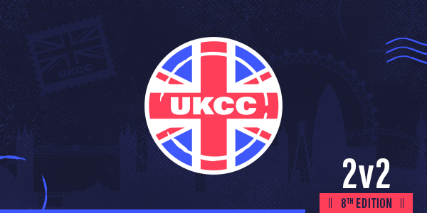

---
tags:
  - UKCC
  - UKCC8
  - UKCC#8
---

# UK Community Cup 8

The **UK Community Cup 8** (***UKCC8***) was a British 2v2 double-elimination osu! tournament hosted by ::{ flag=GB }:: [Bae-](https://osu.ppy.sh/users/6576972) and ::{ flag=GB }:: [Yazzehh](https://osu.ppy.sh/users/7068973). It was the eighth instalment of the UK Community Cup series and the series' fourth 2v2 competition.

## Tournament schedule

| Event | Timestamp |
| --: | :-- |
| Registration phase | 2020-02-22/2020-03-15 |
| Qualifier mappool release | 2020-03-22 |
| Qualifiers | 2020-03-28/2020-03-29 |
| Group stage | 2020-04-04/2020-04-12 |
| Round of 16 | 2020-04-18/2020-04-19 |
| Quarterfinals | 2020-04-25/2020-04-26 |
| Semifinals | 2020-05-02/2020-05-03 |
| Finals | 2020-05-09/2020-05-10 |
| Grand Finals | 2020-05-16/2020-05-17 |

## Prizes

| Placing | Prize(s) |
| :-: | :-- |
|  | Unique profile badge, £60 |
|  | £30 |
|  | £20 |

## Organisation

The UK Community Cup 8 was run by various community members.

| Position | Member(s) |
| :-- | :-- |
| Manager | ::{ flag=GB }:: [Bae-](https://osu.ppy.sh/users/6576972), ::{ flag=GB }:: [Yazzehh](https://osu.ppy.sh/users/7068973) |
| Mappool selector | ::{ flag=US }:: [\_p0ke\_](https://osu.ppy.sh/users/5434711), ::{ flag=BR }:: [Dada](https://osu.ppy.sh/users/9119507) |
| Streamer | ::{ flag=GB }:: [Bae-](https://osu.ppy.sh/users/6576972), ::{ flag=GB }:: [AlexDark69](https://osu.ppy.sh/users/5146647), ::{ flag=US }:: [ChillierPear](https://osu.ppy.sh/users/9501251), ::{ flag=FR }:: [Mimir](https://osu.ppy.sh/users/7382734), ::{ flag=NL }:: [nik](https://osu.ppy.sh/users/10077264), ::{ flag=GB }:: [Damarsh](https://osu.ppy.sh/users/7465147), ::{ flag=GB }:: [Kingling](https://osu.ppy.sh/users/7010761) |
| Commentator | ::{ flag=GB }:: [Bae-](https://osu.ppy.sh/users/6576972), ::{ flag=GB }:: [AlexDark69](https://osu.ppy.sh/users/5146647), ::{ flag=GB }:: [Doomsday](https://osu.ppy.sh/users/18983), ::{ flag=GB }:: [majoreh](https://osu.ppy.sh/users/7959222), ::{ flag=GB }:: [hlo](https://osu.ppy.sh/users/2232928), ::{ flag=GB }:: [Best459](https://osu.ppy.sh/users/8185366), ::{ flag=GB }:: [Gazzzaa](https://osu.ppy.sh/users/8624512), ::{ flag=GB }:: [SteffoST](https://osu.ppy.sh/users/6566765), ::{ flag=GB }:: [xFluffyo](https://osu.ppy.sh/users/8397226), ::{ flag=US }:: [ChillierPear](https://osu.ppy.sh/users/9501251), ::{ flag=AR }:: [Vaf](https://osu.ppy.sh/users/12589048), ::{ flag=GB }:: [Damarsh](https://osu.ppy.sh/users/7465147), ::{ flag=GB }:: [Kingling](https://osu.ppy.sh/users/7010761), ::{ flag=US }:: [M I L E S](https://osu.ppy.sh/users/6036351), ::{ flag=GB }:: [sut\_son](https://osu.ppy.sh/users/9622163) |
| Designer | ::{ flag=GB }:: [Melonturtle](https://osu.ppy.sh/users/4775283) |
| Referee | ::{ flag=GB }:: [Bae-](https://osu.ppy.sh/users/6576972), ::{ flag=GB }:: [Yazzehh](https://osu.ppy.sh/users/7068973), ::{ flag=FI }:: [Lefafel](https://osu.ppy.sh/users/2295850), ::{ flag=NL }:: [nik](https://osu.ppy.sh/users/10077264), ::{ flag=US }:: [ChillierPear](https://osu.ppy.sh/users/9501251), ::{ flag=PL }:: [Marzale](https://osu.ppy.sh/users/5194043), ::{ flag=DE }:: [GDLenny](https://osu.ppy.sh/users/8406711), ::{ flag=FR }:: [Mimir](https://osu.ppy.sh/users/7382734), ::{ flag=DE }:: [TheHunter1](https://osu.ppy.sh/users/6496016), ::{ flag=BE }:: [DraQeu](https://osu.ppy.sh/users/4425520), ::{ flag=TW }:: [MuChin](https://osu.ppy.sh/users/9834516) |
| Statistician | ::{ flag=NO }:: [YokesPai](https://osu.ppy.sh/users/6399568) |

## Links

- [Discussion thread](https://osu.ppy.sh/community/forums/topics/1026417?n=1)
- [Challonge](https://challonge.com/ukcc8)
- [Discord](https://discord.gg/EtsU7Cw)
- [Livestream](https://twitch.tv/osuukcc)
- [Spreadsheet](https://docs.google.com/spreadsheets/d/1qBNQMfkLaujAMj8mQW4gTvejIhm6Wz7TOlS32IZOr64/edit?usp=sharing)

## Participants

See the [signups sheet](https://docs.google.com/spreadsheets/d/1qBNQMfkLaujAMj8mQW4gTvejIhm6Wz7TOlS32IZOr64/edit#gid=1175416265) for a list of all initial participants.

### Top seed

| Team | Members |
| :-- | :-- |
| **10man?** | ::{ flag=GB }:: [Kingling](https://osu.ppy.sh/users/7010761), ::{ flag=GB }:: [majoreh](https://osu.ppy.sh/users/7959222) |
| **will is minecart** | ::{ flag=GB }:: [Voss](https://osu.ppy.sh/users/7657761), ::{ flag=GB }:: [hlo](https://osu.ppy.sh/users/2232928) |
| **Who Needs DT Anyway?** | ::{ flag=GB }:: [helix](https://osu.ppy.sh/users/3322597), ::{ flag=GB }:: [bloo](https://osu.ppy.sh/users/6778877) |
| **Maids of Neuroscience** | ::{ flag=GB }:: [Harpy](https://osu.ppy.sh/users/6761714), ::{ flag=GB }:: [Apo11o](https://osu.ppy.sh/users/9558549) |
| **Diu Lei Lou Mo** | ::{ flag=GB }:: [Ventus](https://osu.ppy.sh/users/1986262), ::{ flag=GB }:: [Jameslike](https://osu.ppy.sh/users/2415743) |
| **:nandos:** | ::{ flag=GB }:: [Zyphox](https://osu.ppy.sh/users/6589047), ::{ flag=GB }:: [-spoon-](https://osu.ppy.sh/users/10623176) |
| **smol players smol scores** | ::{ flag=GB }:: [Listie](https://osu.ppy.sh/users/4121535), ::{ flag=GB }:: [Kerantina](https://osu.ppy.sh/users/7516484) |
| **Karthy and AJT's Team** | ::{ flag=GB }:: [Defex](https://osu.ppy.sh/users/9674143), ::{ flag=GB }:: [Gazzzaa](https://osu.ppy.sh/users/8624512) |

### High seed

| Team | Members |
| :-- | :-- |
| **Werther's Originals** | ::{ flag=GB }:: [Doomsday](https://osu.ppy.sh/users/18983), ::{ flag=GB }:: [dong](https://osu.ppy.sh/users/4422446) |
| **Gaurdian's of Vallhala** | ::{ flag=GB }:: [Coodywoo](https://osu.ppy.sh/users/6145623), ::{ flag=GB }:: [Bubbleman](https://osu.ppy.sh/users/5182050) |
| **Degenerates buying gf** | ::{ flag=GB }:: [Erylie](https://osu.ppy.sh/users/6652874), ::{ flag=GB }:: [Pengrio](https://osu.ppy.sh/users/6255471) |
| **yogWow** | ::{ flag=GB }:: [4Circ](https://osu.ppy.sh/users/2161823), ::{ flag=GB }:: [HonourBound](https://osu.ppy.sh/users/2945999) |
| **Goin't'MosqueBro** | ::{ flag=GB }:: [Crai](https://osu.ppy.sh/users/2285207), ::{ flag=GB }:: [Lusory](https://osu.ppy.sh/users/2101270) |
| **Black Market Pound Planet** | ::{ flag=GB }:: [Woffel](https://osu.ppy.sh/users/3915122), ::{ flag=GB }:: [pod](https://osu.ppy.sh/users/8237552) |
| **obato mit Brot** | ::{ flag=GB }:: [Doughy](https://osu.ppy.sh/users/5275937), ::{ flag=GB }:: [Kobato Hasegawa](https://osu.ppy.sh/users/10085767) |
| **zyphox big noob** | ::{ flag=GB }:: [Tilley](https://osu.ppy.sh/users/8793814), ::{ flag=GB }:: [Cephus](https://osu.ppy.sh/users/3373206) |

### Mid seed

| Team | Members |
| :-- | :-- |
| **Sauces In The Cupboard** | ::{ flag=GB }:: [sut\_son](https://osu.ppy.sh/users/9622163), ::{ flag=GB }:: [Shachi](https://osu.ppy.sh/users/6546933) |
| **Deflated Squidward** | ::{ flag=GB }:: [\[Nathan\]](https://osu.ppy.sh/users/4741293), ::{ flag=GB }:: [-Deeline](https://osu.ppy.sh/users/10121815) |
| **will win by no show** | ::{ flag=GB }:: [idealnettles](https://osu.ppy.sh/users/4010354), ::{ flag=GB }:: [mjozog3](https://osu.ppy.sh/users/4785993) |
| **Business Tour Online TM** | ::{ flag=IE }:: [souljaboitellem](https://osu.ppy.sh/users/8726490), ::{ flag=IE }:: [Ophiz](https://osu.ppy.sh/users/6671641) |
| **Sauces In The Fridge** | ::{ flag=GB }:: [Gazza](https://osu.ppy.sh/users/3648459), ::{ flag=GB }:: [DanZqa](https://osu.ppy.sh/users/4572097) |
| **seulgijam** | ::{ flag=IE }:: [Aseridan](https://osu.ppy.sh/users/9217468), ::{ flag=IE }:: [LilyFlower](https://osu.ppy.sh/users/7449949) |
| **Gordon** | ::{ flag=GB }:: [meltz](https://osu.ppy.sh/users/6741042), ::{ flag=GB }:: [shoe lace](https://osu.ppy.sh/users/3937808) |
| **Daveid gives osu a go** | ::{ flag=GB }:: [Chemistry](https://osu.ppy.sh/users/6069540), ::{ flag=GB }:: [RedKing](https://osu.ppy.sh/users/2754924) |

### Low seed

| Team | Members |
| :-- | :-- |
| **Big Boy Bristolians** | ::{ flag=GB }:: [AlexDark69](https://osu.ppy.sh/users/5146647), ::{ flag=GB }:: [NoSpace](https://osu.ppy.sh/users/10585285) |
| **Divert** | ::{ flag=GB }:: [Raiii](https://osu.ppy.sh/users/10300454), ::{ flag=GB }:: [Flare](https://osu.ppy.sh/users/10670430) |
| **Roll up, Spark up.** | ::{ flag=GB }:: [ReXo](https://osu.ppy.sh/users/11825889), ::{ flag=GB }:: [Duzell](https://osu.ppy.sh/users/10135005) |
| **Pepsi boys** | ::{ flag=IE }:: [M a t t y](https://osu.ppy.sh/users/3737136), ::{ flag=GB }:: [Razuh](https://osu.ppy.sh/users/6731135) |
| **corona fighters** | ::{ flag=GB }:: [Cla](https://osu.ppy.sh/users/4748791), ::{ flag=GB }:: [MattyGee](https://osu.ppy.sh/users/9213524) |
| **Full Salt** | ::{ flag=GB }:: [Sith](https://osu.ppy.sh/users/8112797), ::{ flag=GB }:: [Singletappable](https://osu.ppy.sh/users/12356252) |
| **to!wie** | ::{ flag=GB }:: [unrealLyyy](https://osu.ppy.sh/users/9594849), ::{ flag=GB }:: [This Acc Sucks](https://osu.ppy.sh/users/7299249) |
| **no idea lol** | ::{ flag=GB }:: [OskaRRRitoS](https://osu.ppy.sh/users/7051163), ::{ flag=GB }:: [NeoPixel201](https://osu.ppy.sh/users/12139352) |

## Podium

This competition has come to an end and resulted in the following podium:

| Placing | Player |
| :-: | :-- |
|  | **10man?** (::{ flag=GB }:: [Kingling](https://osu.ppy.sh/users/7010761), ::{ flag=GB }:: [majoreh](https://osu.ppy.sh/users/7959222)) |
|  | **will is minecart** (::{ flag=GB }:: [Voss](https://osu.ppy.sh/users/7657761), ::{ flag=GB }:: [hlo](https://osu.ppy.sh/users/2232928)) |
|  | **Gaurdian's of Vallhala** (::{ flag=GB }:: [Coodywoo](https://osu.ppy.sh/users/6145623), ::{ flag=GB }:: [Bubbleman](https://osu.ppy.sh/users/5182050)) |

## Mappools

### Grand Finals

- NoMod
  1. [UROBOROS - Black Swallowtail (Kalindraz) [Braves of the Six Flowers]](https://osu.ppy.sh/beatmapsets/835711#osu/1750280)
  2. [LeaF - Musical Movement (Snow Note) [Another]](https://osu.ppy.sh/beatmapsets/195124#osu/463136)
  3. [Imy feat. Aitsuki Nakuru - Meteora (Icekalt) [Petal]](https://osu.ppy.sh/beatmapsets/1129440#osu/2359478)
  4. [Uinyasu, Occhoko Bunny - Aa Kenran no Yume ga Gotoku (Epsilon Remix) (deadcode) [Flower Dance]](https://osu.ppy.sh/beatmapsets/822937#osu/2103267)
  5. [LULICO vs. LOLIPO - We Hate Touhou (Raikozen) [Akali's Tuck Fouhou]](https://osu.ppy.sh/beatmapsets/468937#osu/1002857)
  6. [ave;new feat. Shirasawa Rie - MAYBE ROSY KISS -HARD dRESS STYLE- ([CSGA]Ar3sgice) [MAYBE POSSIBLE]](https://osu.ppy.sh/beatmapsets/169650#osu/410858)
- Hidden
  1. [Reol - +Danshi (fanzhen0019) [HW]](https://osu.ppy.sh/beatmapsets/178550#osu/431717)
  2. [Falcom Sound Team jdk - GENESIS BEYOND THE BEGINNING (Mariko Sakuragi) [Extra]](https://osu.ppy.sh/beatmapsets/1032441#osu/2223544)
  3. [Britney Spears - Toxic (schoolboy) [In The Zone]](https://osu.ppy.sh/beatmapsets/1061947#osu/2223745)
- HardRock
  1. [Rche - Todestrieb (FrenZ396) [Impulse]](https://osu.ppy.sh/beatmapsets/968678#osu/2026835)
  2. [Exilia - Lifegame (P o M u T a) [Expert]](https://osu.ppy.sh/beatmapsets/331859#osu/735004)
  3. [Cranky - Rave 2 Rave (Sonnyc) [Expert]](https://osu.ppy.sh/beatmapsets/751896#osu/1582902)
- DoubleTime
  1. [Tommy heavenly6 - PAPERMOON (Jounzan) [Insane]](https://osu.ppy.sh/beatmapsets/503978#osu/1072406)
  2. [ClariS - Colorful (Laurier) [Insane]](https://osu.ppy.sh/beatmapsets/134008#osu/336295)
  3. [onoken - felys -long remix- (Sharp) [Another]](https://osu.ppy.sh/beatmapsets/25109#osu/85075)
  4. [neuras - on the bounce (Zekira) [Challenge]](https://osu.ppy.sh/beatmapsets/10098#osu/39642)
- FreeMod
  1. [Susumu Hirasawa - Pacific Rim Imitation Network (Gens) [KIRBY Mix]](https://osu.ppy.sh/beatmapsets/31119#osu/105143)
  2. [GLORYHAMMER - Rise of the Chaos Wizards (Stunter) [Through the Dark Galactic Skies]](https://osu.ppy.sh/beatmapsets/990188#osu/2170985)
  3. [t+pazolite - Magical Higan Tour 2009 (DJNightmare) [Collab]](https://osu.ppy.sh/beatmapsets/40609#osu/128775)
- Tiebreaker
  1. **[gmtn. (witch's slave) - furioso melodia (Alumetorz) [Wrath]](https://osu.ppy.sh/beatmapsets/280107#osu/633993)**

### Finals

- NoMod
  1. [Belmont - Overstepping (Sharkie) [Extreme]](https://osu.ppy.sh/beatmapsets/665580#osu/1408543)
  2. [xi remixed by cosMo@bousouP - FREEDOM DiVE [METAL DIMENSIONS] (Cherry Blossom) [Extra]](https://osu.ppy.sh/beatmapsets/905158#osu/1907933)
  3. [Kuroneko Dungeon - Ryoushi no Umi no Lindwurm (Crystal) [Yoru's Expert]](https://osu.ppy.sh/beatmapsets/405167#osu/890915)
  4. [Endorfin. vs Feryquitous - Sincuvate (Nokris) [Nokris. vs NeilPerry]](https://osu.ppy.sh/beatmapsets/739011#osu/1559554)
  5. [Kohmi Hirose - Promise (Luscent) [geddan]](https://osu.ppy.sh/beatmapsets/1094694#osu/2287891)
  6. [Cranky vs. MASAKI - ouroboros -twin stroke of the end- (celerih) [Flask's Expert]](https://osu.ppy.sh/beatmapsets/1052054#osu/2226504)
- Hidden
  1. [Yumeno Yuki - BWLAUTE BEIRRD (Lasse) [LMT's Expert.]](https://osu.ppy.sh/beatmapsets/1014034#osu/2131275)
  2. [bbn - Identic Conflict (Myxo) [LMT's Another]](https://osu.ppy.sh/beatmapsets/1020429#osu/2135438)
  3. [A.SAKA - Nanatsu Issenzakura (yf_bmp) [imouto's Extra]](https://osu.ppy.sh/beatmapsets/513731#osu/1092646)
- HardRock
  1. [Rita - dorchadas (Delis) [Sharnoth]](https://osu.ppy.sh/beatmapsets/580215#osu/1279490)
  2. [Anamanaguchi - Blackout City (Sushi) [Blackout]](https://osu.ppy.sh/beatmapsets/67226#osu/195477)
  3. [Nardis - Cosmo Memory (Shiirn) [Entelecheia]](https://osu.ppy.sh/beatmapsets/517598#osu/1099759)
- DoubleTime
  1. [Akatsuki Records - SAMURAI GHOST GIRL, KILL! KILL! (SMOKELIND) [KOWARI'S LUNATIC]](https://osu.ppy.sh/beatmapsets/1073159#osu/2245963)
  2. [zts - miragecoordinator (Tsumugi-chan) [Collab Expert]](https://osu.ppy.sh/beatmapsets/1085924#osu/2270798)
  3. [Underoath - You're Ever So Inviting (pishifat) [Insane]](https://osu.ppy.sh/beatmapsets/324586#osu/721157)
  4. [Rihanna ft. Jay-Z - Umbrella (Agent Spin Here) [Insane]](https://osu.ppy.sh/beatmapsets/9873#osu/38971)
- FreeMod
  1. [TJ.Hangneil - Kamui (7odoa) [SHD]](https://osu.ppy.sh/beatmapsets/39017#osu/124664)
  2. [Katakiri Rekka - own justice, once more (Dada) [Vintage]](https://osu.ppy.sh/beatmapsets/1148992#osu/2398960)
  3. [Unlucky Morpheus - Phantom Blood (IsomirDiAngelo) [Atalanta's Extra]](https://osu.ppy.sh/beatmapsets/885158#osu/2153771)
- Tiebreaker
  1. **[Unlucky Morpheus - Angreifer (Scarsnic) [Zeitlos]](https://osu.ppy.sh/beatmapsets/581468#osu/1230741)**

### Semifinals

- NoMod
  1. [yanaginagi - can cry (captin1) [lamentation]](https://osu.ppy.sh/beatmapsets/889584#osu/1859321)
  2. [Ryu\* - Sakura Mirage (Priti) [ULTRA]](https://osu.ppy.sh/beatmapsets/205022#osu/484036)
  3. [Function Phantom - Paradox (byfar) [Enigma]](https://osu.ppy.sh/beatmapsets/824125#osu/1726857)
  4. [TOMINAGA TOMMY HIROAKI - JoJo \~Sono Chi no Sadame\~ Archetype MIX Ver. (Delis) [Overdrive]](https://osu.ppy.sh/beatmapsets/714329#osu/1509639)
  5. [umu. - humanly (Luscent) [Expert]](https://osu.ppy.sh/beatmapsets/1045518#osu/2185651)
  6. [Nekrogoblikon - Mold (Icekalt) [Hectic's Extra]](https://osu.ppy.sh/beatmapsets/1061153#osu/2224855)
- Hidden
  1. [TK from Ling tosite sigure - Fu re te Fu re ru (Mao) [Expert]](https://osu.ppy.sh/beatmapsets/880806#osu/1841827)
  2. [Kawada Mami - JOINT (Mariko Sakuragi) [Insane+]](https://osu.ppy.sh/beatmapsets/1051651#osu/2287620)
  3. [Camellia - Towards The Horizon (Pho) [Chaoz's Extra]](https://osu.ppy.sh/beatmapsets/636393#osu/1501737)
- HardRock
  1. [Wagakki Band - Ikusa (Atsuro) [Hope]](https://osu.ppy.sh/beatmapsets/345860#osu/767914)
  2. [Brandy - Cross Time !! (Leader) [captin's Extra]](https://osu.ppy.sh/beatmapsets/973162#osu/2067296)
  3. [Memme - Chinese Restaurant (M o k o r i) [Spicy]](https://osu.ppy.sh/beatmapsets/256467#osu/587547)
- DoubleTime
  1. [Egypt Central - White Rabbit (Mordred) [Insane]](https://osu.ppy.sh/beatmapsets/1039791#osu/2185147)
  2. [Utsu-P - Corona (Net0) [Insane]](https://osu.ppy.sh/beatmapsets/1001722#osu/2096920)
  3. [Foreground Eclipse - In A Night When Her Sorrow Resounds Around (Seni) [tatemae's Lunatic]](https://osu.ppy.sh/beatmapsets/901755#osu/1914105)
  4. [sana - Kotoba no Iranai Yakusoku (Irohas) [Insane]](https://osu.ppy.sh/beatmapsets/634179#osu/1345731)
- FreeMod
  1. [Camellia - KillerBeast (Mir) [Reform's Extra]](https://osu.ppy.sh/beatmapsets/1019290#osu/2137969)
  2. [Emilie Autumn - I Know Where You Sleep (Mogsworth) [Psychotic]](https://osu.ppy.sh/beatmapsets/10397#osu/40531)
  3. [Shibayan - Shock!! (Arranged Ver.) (Snow Note) [Exceed]](https://osu.ppy.sh/beatmapsets/55119#osu/412985)
- Tiebreaker
  1. **[DragonForce - Operation Ground and Pound (Atsuro) [Legend]](https://osu.ppy.sh/beatmapsets/324171#osu/720314)**

### Quarterfinals

- NoMod
  1. [Paramore - Monster (Speed Up Ver.) (Drummer) [Tragedy]](https://osu.ppy.sh/beatmapsets/981756#osu/2054768)
  2. [Miki Sayaka vs. Miki Sayaka (fw. Miki Sayaka) - squartatrice (eINess) [HARD RENAISSAYAKA]](https://osu.ppy.sh/beatmapsets/283595#osu/641169)
  3. [HyuN - You'Re aRleAdY dEAd (J1\_) [Demise]](https://osu.ppy.sh/beatmapsets/891441#osu/1863462)
  4. [Sota Fujimori - ACCELERATE (mindmaster107) [WHIPLASH]](https://osu.ppy.sh/beatmapsets/852493#osu/1781876)
  5. [Yunomi with Momobako&miko - Soumatou Labyrinth (Snow Note) [Labyrinth]](https://osu.ppy.sh/beatmapsets/721064#osu/1522698)
  6. [Nanahoshi Kangengakudan - Meikaruza (Snowin) [Dance]](https://osu.ppy.sh/beatmapsets/1019721#osu/2133726)
- Hidden
  1. [Renard - TU4AR (Mercurius) [Nogard]](https://osu.ppy.sh/beatmapsets/28997#osu/97934)
  2. [TAG - Theory of Eternity (kiddly) [Extra]](https://osu.ppy.sh/beatmapsets/35224#osu/227061)
  3. [ETIA. - Claiomh Solais (Zare) [Eternal]](https://osu.ppy.sh/beatmapsets/165664#osu/403039)
- HardRock
  1. [24K - SUPERFLY (DeRandom Otaku) [LIT]](https://osu.ppy.sh/beatmapsets/558362#osu/1181126)
  2. [Kiryu - EVE (Flower) [Another]](https://osu.ppy.sh/beatmapsets/213434#osu/501755)
  3. [ETIA. - Lost Love (JJburstOwO) [Last Eve]](https://osu.ppy.sh/beatmapsets/341933#osu/755900)
- DoubleTime
  1. [eufonius - glowing world \~Kagayaki no, Sekai e\~ (Dored) [Ojousama koko's Insane.]](https://osu.ppy.sh/beatmapsets/911279#osu/1919061)
  2. [Kiryu - Disguise (Seikatu) [Insane]](https://osu.ppy.sh/beatmapsets/225957#osu/642573)
  3. [monet - Kagami no Sekai ni wa Watashi shika Inai -another version- (Mirash) [PandaHero's Insane]](https://osu.ppy.sh/beatmapsets/685725#osu/1469159)
  4. [Hanatan - Palette (Smoothie) [Insane]](https://osu.ppy.sh/beatmapsets/165693#osu/403096)
- FreeMod
  1. [goreshit - fly, heart! fly! (kiri09) [flyable]](https://osu.ppy.sh/beatmapsets/93754#osu/252755)
  2. [System Of A Down - Toxicity (Icekalt) [Hectic's Extra]](https://osu.ppy.sh/beatmapsets/1041151#osu/2196360)
  3. [SHIKI - Pure Ruby (tsuka) [Another]](https://osu.ppy.sh/beatmapsets/39325#osu/125448)
- Tiebreaker
  1. **[wa. vs ETIA. - Akasagarbha -extended mix- (Ambient) [Boundless]](https://osu.ppy.sh/beatmapsets/712372#osu/1505901)**

### Round of 16

- NoMod
  1. [Itou Kanako - Fatima (10nya) [1.064750%]](https://osu.ppy.sh/beatmapsets/787938#osu/1653723)
  2. [FLOOR BABA - WIGGLECORE (Will Stetson) [Parky's Extra]](https://osu.ppy.sh/beatmapsets/957370#osu/2097308)
  3. [ak+q & Redeilia - Enigma Helix (Icekalt) [Extra]](https://osu.ppy.sh/beatmapsets/867825#osu/1814068)
  4. [Pierce The Veil - The Divine Zero (pishifat) [Extra]](https://osu.ppy.sh/beatmapsets/565871#osu/1197211)
  5. [Azu - Haryu (milr\_) [Down's Expert]](https://osu.ppy.sh/beatmapsets/576232#osu/2250247)
  6. [Memme - Extreme Fantasy (AngelHoney) [ExtrA]](https://osu.ppy.sh/beatmapsets/49459#osu/152480)
- Hidden
  1. [DJ Totoriott - Chloe (Yusomi) [Extreme]](https://osu.ppy.sh/beatmapsets/768982#osu/1617055)
  2. [Kola Kid - can't hide your love (Kert) [Can]](https://osu.ppy.sh/beatmapsets/39732#osu/126470)
  3. [Jin feat. MARiA from GARNiDELiA - daze (Loneight) [Extra]](https://osu.ppy.sh/beatmapsets/188837#osu/449984)
- HardRock
  1. [Underoath - A Moment Suspended in Time (Milan-) [BOUYAAA's Extra]](https://osu.ppy.sh/beatmapsets/407575#osu/915675)
  2. [Shinra-bansho - Itazura Sensation (Hailie) [Mathew's Insane]](https://osu.ppy.sh/beatmapsets/745460#osu/1616716)
  3. [TOPHAMHAT-KYO - Princess Danshi (Achilanx) [Princess' Temptation]](https://osu.ppy.sh/beatmapsets/1061929#osu/2223705)
- DoubleTime
  1. [nano - GALLOWS BELL (theramdans) [A Mystery's Insane]](https://osu.ppy.sh/beatmapsets/170942#osu/611679)
  2. [Sum 41 - The Hell Song (Natteke) [Hard]](https://osu.ppy.sh/beatmapsets/23797#osu/81227)
  3. [sakuzyo - Senkyou Ranbu (ktgster) [Insane]](https://osu.ppy.sh/beatmapsets/460516#osu/1042025)
- FreeMod
  1. [Skrillex - First Of The Year (Equinox) (nold\_1702) [ND1]](https://osu.ppy.sh/beatmapsets/56791#osu/187639)
  2. [ALI PROJECT - ALICE Douzai Innocent (-Light-) [Innocence]](https://osu.ppy.sh/beatmapsets/648368#osu/1373594)
  3. [S3RL - Catchit (Radio Edit) (Rolniczy) [Ex]](https://osu.ppy.sh/beatmapsets/839864#osu/1848985)
- Tiebreaker
  1. **[Nanahira - Monosugoi Space Shuttle de Koishi ga Monosugoi Uta (sullywally) [Satellite]](https://osu.ppy.sh/beatmapsets/711964#osu/1505170)**

### Group stage

- NoMod
  1. [Hana - Kuukirikigaku Shoujo to Shounen no Uta (Bellicose) [Tsui no Sora]](https://osu.ppy.sh/beatmapsets/1055510#osu/2205432)
  2. [LeaF - Calamity Fortune (Frostings) [Cataclysm]](https://osu.ppy.sh/beatmapsets/359168#osu/789752)
  3. [Co shu Nie - ZETTAI ZETSUMEI (Crissa) [Extra]](https://osu.ppy.sh/beatmapsets/918776#osu/1919057)
  4. [Camellia - Chirality (RLC) [Isomer]](https://osu.ppy.sh/beatmapsets/227598#osu/530250)
  5. [Kicco - Akari no Arika (lit120) [Kibb's Extra]](https://osu.ppy.sh/beatmapsets/788172#osu/1654239)
  6. [Infected Mushroom - Where Do I Belong (Mao) [Expert]](https://osu.ppy.sh/beatmapsets/959439#osu/2008690)
- Hidden
  1. [Yonezu Kenshi - LOSER (Skystar) [WINNER]](https://osu.ppy.sh/beatmapsets/852544#osu/1781960)
  2. [O-Life Japan - Nuclear Fusion (ignorethis) [Insane]](https://osu.ppy.sh/beatmapsets/16649#osu/59685)
  3. [jippusu - Heisei Kataku Rhythm (HelloSCV) [Insane]](https://osu.ppy.sh/beatmapsets/71720#osu/205379)
- HardRock
  1. [Subplaid - Only time make your hapiness (Kyshiro) [Forever]](https://osu.ppy.sh/beatmapsets/255887#osu/586303)
  2. [Negentropy (a.k.a. Team Grimoire) - ouroVoros (Suzuki_1112) [Firika's Another]](https://osu.ppy.sh/beatmapsets/707164#osu/1557405)
  3. [Chasers - Lost (ktgster) [Insane]](https://osu.ppy.sh/beatmapsets/151878#osu/374114)
- DoubleTime
  1. [yukizakurasou - Natsukage \~Ano Hikoukigumo wo Koeta, Sono Saki e\~ (Garden) [Recollections of Summer]](https://osu.ppy.sh/beatmapsets/664684#osu/1417243)
  2. [Duoscience - Indifferences (Mir) [Nowa's Light Insane]](https://osu.ppy.sh/beatmapsets/722662#osu/1538482)
  3. [Rin - Spring of Dreams (jyc-Binggan) [Lunatic]](https://osu.ppy.sh/beatmapsets/119739#osu/325938)
- FreeMod
  1. [Silver Forest - Sakase \* Sakase (MegaManEXE) [Lunatic]](https://osu.ppy.sh/beatmapsets/12508#osu/46880)
  2. [Nekrogoblikon - The Skin Thief (LMT) [Insane]](https://osu.ppy.sh/beatmapsets/1061535#osu/2223742)
  3. [Fotzu - POTOMIRU PINERA (TheShadowOfDark) [Tatan's Expert]](https://osu.ppy.sh/beatmapsets/1032450#osu/2163407)
- Tiebreaker
  1. **[Thank You Scientist - My Famed Disappearing Act (Theaceae) [Perish]](https://osu.ppy.sh/beatmapsets/765338#osu/1609182)**

### Qualifiers

- NoMod
  1. [Feint - Snake Eyes (feat. CoMa) Full Vers. (byfar) [yheja lamo]](https://osu.ppy.sh/beatmapsets/331643#osu/928642)
  2. [ZUTOMAYO - Kan Saete Kuyashiiwa [Luscent's Extra]](https://osu.ppy.sh/beatmapsets/1001507#osu/2167576)
  3. [Seiryu - Critical Crystal (Priti) [wa's Extra]](https://osu.ppy.sh/beatmapsets/199535#osu/475805)
- Hidden
  1. [Taku Inoue - Yoake made Ato 3 Byou (Nerova Riuz GX) [apaffy's Extra]](https://osu.ppy.sh/beatmapsets/768893#osu/1643448)
  2. [ONE OK ROCK - NO SCARED (HabiHolic) [Insane]](https://osu.ppy.sh/beatmapsets/119277#osu/306278)
- HardRock
  1. [Arctic Monkeys - Still Take You Home (Milan-) [BOUYAAA's Insane]](https://osu.ppy.sh/beatmapsets/631466#osu/1491730)
  2. [DJ YOSHITAKA - Bloody Tears(IIDX EDITION) (Gabi) [Insane]](https://osu.ppy.sh/beatmapsets/6598#osu/29731)
- DoubleTime
  1. [ITO KASHITARO - Boku no Hosomichi (Raose) [Journey]](https://osu.ppy.sh/beatmapsets/394691#osu/859034)
  2. [Hana - Sakura no Uta (Alyce) [Light Insane]](https://osu.ppy.sh/beatmapsets/376552#osu/824390)

## Match results

### Grand Finals

#### Grand Finals

Sunday, 17 May 2020:

| Team 1 |  |  | Team 2 | Match link |
| --: | :-: | :-: | :-- | :-- |
| **10man?** | **7** | 2 | will is minecart | [#1](https://osu.ppy.sh/community/matches/61780353) |

#### Losers Finals

Saturday, 16 May 2020:

| Team 1 |  |  | Team 2 | Match link |
| --: | :-: | :-: | :-- | :-- |
| **will is minecart** | **7** | 3 | Gaurdians of Valhalla | [#1](https://osu.ppy.sh/community/matches/61744983) |

### Finals

#### Winner Finals

Sunday, 10 May 2020:

| Team 1 |  |  | Team 2 | Match link |
| --: | :-: | :-: | :-- | :-- |
| **10man?** | **6** | 0 | will is minecart | [#1](https://osu.ppy.sh/community/matches/61501149) |

#### Losers Bracket Round 4

Saturday, 9 May 2020:

| Team 1 |  |  | Team 2 | Match link |
| --: | :-: | :-: | :-- | :-- |
| Diu Lei Lou Mo | -1 | **0** | **Gaurdian's of Vallhala** | *forfeit* |
| **Who Needs DT Anyway?** | **6** | 2 | Maids of Neuroscience | [#1](https://osu.ppy.sh/community/matches/61457384) |

#### Losers Bracket Round 5

Monday, 11 May 2020:

| Team 1 |  |  | Team 2 | Match link |
| --: | :-: | :-: | :-- | :-- |
| **Gaurdian's of Valhalla** | **6** | 4 | Who Needs DT Anyway? | [#1](https://osu.ppy.sh/community/matches/61535980) |

### Semifinals

#### Semifinals

Saturday, 2 May 2020:

| Team 1 |  |  | Team 2 | Match link |
| --: | :-: | :-: | :-- | :-- |
| **will is minecart** | **6** | 3 | Who Needs DT Anyway? | [#1](https://osu.ppy.sh/community/matches/61175493) |

Sunday, 3 May 2020:

| Team 1 |  |  | Team 2 | Match link |
| --: | :-: | :-: | :-- | :-- |
| **10man?** | **0** | -1 | Diu Lei Lou Mo | *forfeit* |

#### Losers Bracket Round 2

Saturday, 2 May 2020:

| Team 1 |  |  | Team 2 | Match link |
| --: | :-: | :-: | :-- | :-- |
| Werther's Originals | 4 | **6** | **:nandos:** | [#1](https://osu.ppy.sh/community/matches/61177002) |
| **Maids of Neuroscience** | **6** | 0 | smol players smol scores | [#1](https://osu.ppy.sh/community/matches/61171463) |
| Karthy and AJT's Team | 2 | **6** | **Degenerates buying gf** | [#1](https://osu.ppy.sh/community/matches/61183618) |
| **Gaurdian's of Vallhala** | **6** | 0 | Business Tour Online TM | [#1](https://osu.ppy.sh/community/matches/61167428) |

#### Losers Bracket Round 3

Sunday, 3 May 2020:

| Team 1 |  |  | Team 2 | Match link |
| --: | :-: | :-: | :-- | :-- |
| Degenerates buying gf | 2 | **6** | **Gaurdian's of Vallhala** | [#1](https://osu.ppy.sh/community/matches/61210923) |

Monday, 4 May 2020:

| Team 1 |  |  | Team 2 | Match link |
| --: | :-: | :-: | :-- | :-- |
| **Maids of Neuroscience** | **6** | 3 | :nandos: | [#1](https://osu.ppy.sh/community/matches/61259986) |

### Quarterfinals

#### Quarterfinals

Saturday, 25 April 2020:

| Team 1 |  |  | Team 2 | Match link |
| --: | :-: | :-: | :-- | :-- |
| Maids of Neuroscience | 3 | **6** | **Diu Lei Lou Mo** | [#1](https://osu.ppy.sh/community/matches/60885854) |

Sunday, 26 April 2020:

| Team 1 |  |  | Team 2 | Match link |
| --: | :-: | :-: | :-- | :-- |
| **10man?** | **6** | 0 | Werther's Originals | [#1](https://osu.ppy.sh/community/matches/60925377) |
| **will is minecart** | **6** | 1 | Karthy and AJT's Team | [#1](https://osu.ppy.sh/community/matches/60929732) |
| **Who Needs DT Anyway?** | **6** | 3 | Gaurdians of Valhalla | [#1](https://osu.ppy.sh/community/matches/60915155) |

#### Losers Bracket Round 1

Saturday, 25 April 2020:

| Team 1 |  |  | Team 2 | Match link |
| --: | :-: | :-: | :-- | :-- |
| **Business Tour Online TM** | **6** | 0 | zyphox big noob | [#1](https://osu.ppy.sh/community/matches/60881144) |
| will win by no show | 0 | **6** | **smol players smol scores** | [#1](https://osu.ppy.sh/community/matches/60876341) |
| obato mit Brot | 2 | **6** | **:nandos:** | [#1](https://osu.ppy.sh/community/matches/60885838) |

Sunday, 26 April 2020:

| Team 1 |  |  | Team 2 | Match link |
| --: | :-: | :-: | :-- | :-- |
| Goin't'MosqueBro | -1 | **0** | **Degenerates buying gf** | *forfeit* |

### Round of 16

Friday, 17 April 2020:

| Team 1 |  |  | Team 2 | Match link |
| --: | :-: | :-: | :-- | :-- |
| **10man?** | **5** | 1 | Business Tour Online TM | [#1](https://osu.ppy.sh/community/matches/60536479) |

Saturday, 18 April 2020:

| Team 1 |  |  | Team 2 | Match link |
| --: | :-: | :-: | :-- | :-- |
| **will is minecart** | **5** | 0 | will win by no show | [#1](https://osu.ppy.sh/community/matches/60575178) |
| **Who Needs DT Anyway?** | **5** | 1 | obato mit brot | [#1](https://osu.ppy.sh/community/matches/60567941) |

Sunday, 19 April 2020:

| Team 1 |  |  | Team 2 | Match link |
| --: | :-: | :-: | :-- | :-- |
| zyphox big noob | 0 | **5** | **Werther's Originals** | [#1](https://osu.ppy.sh/community/matches/60622403) |
| **Maids of Neuroscience** | **5** | 0 | Goin't'MosqueBro | [#1](https://osu.ppy.sh/community/matches/60626868) |
| **Diu Lei Lou Mo** | **5** | 1 | Degenerates buying gf | [#1](https://osu.ppy.sh/community/matches/60626908) |
| smol players smol scores | 1 | **5** | **Karthy and AJT's Team** | [#1](https://osu.ppy.sh/community/matches/60618166) |
| :nandos: | 4 | **5** | **Gaurdian's of Valhalla** | [#1](https://osu.ppy.sh/community/matches/60618200) |

### Group stage

#### Group A

| Team 1 |  |  | Team 2 | Match link |
| --: | :-: | :-: | :-- | :-- |
| **Who Needs DT Anyway?** | **5** | 0 | yogWow | [#1](https://osu.ppy.sh/community/matches/59983548) |
| **Who Needs DT Anyway?** | **5** | 1 | Business Tour Online TM | [#1](https://osu.ppy.sh/community/matches/60068648) |
| **Who Needs DT Anyway?** | **5** | 0 | no idea lol | [#1](https://osu.ppy.sh/community/matches/60026452) |
| yogWow | 4 | **5** | **Business Tour Online TM** | [#1](https://osu.ppy.sh/community/matches/60037372) |
| **yogWow** | **5** | 3 | no idea lol | [#1](https://osu.ppy.sh/community/matches/59988567) |
| **Business Tour Online TM** | **5** | 1 | no idea lol | [#1](https://osu.ppy.sh/community/matches/60068648) |

#### Group B

| Team 1 |  |  | Team 2 | Match link |
| --: | :-: | :-: | :-- | :-- |
| **:nandos:** | **5** | 3 | Werther's Orignals | [#1](https://osu.ppy.sh/community/matches/60039474) |
| **:nandos:** | **5** | 1 | Sauces in the Fridge | [#1](https://osu.ppy.sh/community/matches/60327186) |
| **:nandos:** | **5** | 0 | Pepsi Boys | [#1](https://osu.ppy.sh/community/matches/60245875) |
| **Werther's Orignals** | **5** | 2 | Sauces in the Fridge | [#1](https://osu.ppy.sh/community/matches/60331535) |
| **Werther's Orignals** | **5** | 3 | Pepsi Boys | [#1](https://osu.ppy.sh/community/matches/60030541) |
| Sauces in the Fridge | 4 | **5** | **Pepsi Boys** | [#1](https://osu.ppy.sh/community/matches/60293533) |

#### Group C

| Team 1 |  |  | Team 2 | Match link |
| --: | :-: | :-: | :-- | :-- |
| **Diu Lei Lou Mo** | **5** | 1 | Gaurdian's of Vallhala | [#1](https://osu.ppy.sh/community/matches/59985697) |
| **Diu Lei Lou Mo** | **5** | 0 | Deflated Squidward | [#1](https://osu.ppy.sh/community/matches/59995516) |
| **Diu Lei Lou Mo** | **5** | 1 | Big Boy Bristolians | [#1](https://osu.ppy.sh/community/matches/60026485) |
| **Gaurdian's of Vallhala** | **5** | 1 | Deflated Squidward | [#1](https://osu.ppy.sh/community/matches/60028110) |
| **Gaurdian's of Vallhala** | **5** | 0 | Big Boy Bristolians | [#1](https://osu.ppy.sh/community/matches/59988088) |
| **Deflated Squidward** | **5** | 3 | Big Boy Bristolians | [#1](https://osu.ppy.sh/community/matches/60032810) |

#### Group D

| Team 1 |  |  | Team 2 | Match link |
| --: | :-: | :-: | :-- | :-- |
| **will is minecart** | **5** | 0 | Goin't'MosqueBro | [#1](https://osu.ppy.sh/community/matches/60022435) |
| **will is minecart** | **1** | 0 | seulgijam | *forfeit* |
| **will is minecart** | **5** | 0 | Full Salt | [#1](https://osu.ppy.sh/community/matches/59992952) |
| **Goin't'MosqueBro** | **1** | 0 | seulgijam | *forfeit* |
| **Goin't'MosqueBro** | **5** | 0 | Full Salt | [#1](https://osu.ppy.sh/community/matches/60034817) |
| **seulgijam** | **5** | 3 | Full Salt | [#1](https://osu.ppy.sh/community/matches/59997790) |

#### Group E

| Team 1 |  |  | Team 2 | Match link |
| --: | :-: | :-: | :-- | :-- |
| **Maids of Neuroscience** | **1** | 0 | Degenerates buying gf | *forfeit* |
| **Maids of Neuroscience** | **1** | 0 | Gordon | *forfeit* |
| **Maids of Neuroscience** | **5** | 0 | to!wie | [#1](https://osu.ppy.sh/community/matches/60324183) |
| **Degenerates buying gf** | **5** | 0 | Gordon | [#1](https://osu.ppy.sh/community/matches/60333682) |
| **Degenerates buying gf** | **5** | 1 | to!wie | [#1](https://osu.ppy.sh/community/matches/60280004) |
| Gordon | 0 | **1** | **to!wie** | *forfeit* |

#### Group F

| Team 1 |  |  | Team 2 | Match link |
| --: | :-: | :-: | :-- | :-- |
| **smol players smol scores** | **5** | 3 | Black Market Pound Planet | [#1](https://osu.ppy.sh/community/matches/60322124) |
| **smol players smol scores** | **5** | 0 | will win by no show | [#1](https://osu.ppy.sh/community/matches/60317492) |
| **smol players smol scores** | **5** | 0 | corona fighters | [#1](https://osu.ppy.sh/community/matches/60274620) |
| Black Market Pound Planet | 2 | **5** | **will win by no show** | [#1](https://osu.ppy.sh/community/matches/60287428) |
| **Black Market Pound Planet** | **5** | 2 | corona fighters | [#1](https://osu.ppy.sh/community/matches/60326856) |
| **will win by no show** | **5** | 3 | corona fighters | [#1](https://osu.ppy.sh/community/matches/60280255) |

#### Group G

| Team 1 |  |  | Team 2 | Match link |
| --: | :-: | :-: | :-- | :-- |
| **10man?** | **5** | 0 | obato mit Brot | [#1](https://osu.ppy.sh/community/matches/60272499) |
| **10man?** | **1** | 0 | Sauces In The Cupboard | *forfeit* |
| **10man?** | **1** | 0 | Roll up, Spark up. | *forfeit* |
| **obato mit Brot** | **1** | 0 | Sauces In The Cupboard | *forfeit* |
| **obato mit Brot** | **5** | 2 | Roll up, Spark up. | [#1](https://osu.ppy.sh/community/matches/60030689) |
| Sauces In The Cupboard | 0 | **1** | **Roll up, Spark up.** | *forfeit* |

#### Group H

| Team 1 |  |  | Team 2 | Match link |
| --: | :-: | :-: | :-- | :-- |
| Karthy and AJT's Team | 2 | **5** | **zyphox big noob** | [#1](https://osu.ppy.sh/community/matches/60325031) |
| **Karthy and AJT's Team** | **5** | 4 | Daveid gives osu a go | [#1](https://osu.ppy.sh/community/matches/60329065) |
| **Karthy and AJT's Team** | **5** | 0 | Divert | [#1](https://osu.ppy.sh/community/matches/60285157) |
| **zyphox big noob** | **5** | 3 | Daveid gives osu a go | [#1](https://osu.ppy.sh/community/matches/60370260) |
| **zyphox big noob** | **1** | 0 | Divert | *forfeit* |
| **Daveid gives osu a go** | **5** | 2 | Divert | [#1](https://osu.ppy.sh/community/matches/60331413) |

### Qualifiers

See the [Qualifiers results sheet](https://docs.google.com/spreadsheets/d/1qBNQMfkLaujAMj8mQW4gTvejIhm6Wz7TOlS32IZOr64/edit#gid=174781692) for a breakdown of the qualifier results.

## Ruleset

- This tournament is a 2v2 double-elimination British osu! tournament.
- The structure of the tournament will be:
  - One qualification round where 32 teams progress
  - Group stage where 16 teams progress
  - Double-elimination bracket
- To be able to participate, players must have a **::{ flag=GB }:: United Kingdom or ::{ flag=IE }:: Ireland flag or be able to provide proof of residency to the hosts**.
- Ranks will be taken during and at the end of signups. If your team rank after signups end is under 1000, you will not be eligible to participate in the tournament.
- Matches will be **Team Vs**, with **ScoreV2** as the scoring system used.
- Ranks are used to calculate seeding. Once the tournament starts, your rank is locked and will not affect your seed.
- All staff (apart from the hosts, mappool selectors and referees) are allowed to participate in the tournament.
- All players are to treat staff and other participants with a high level of respect. Any kind of mistreatment on the Discord server or during matches (this includes homophobia, racism and toxicity) will result in a **ban** and the offending player will be **blacklisted** from participating from future UKCC tournaments.
- ***Where rules do not prevail, common sense shall. The administration has explicit discretion to apply their judgement on this as they see fit.***
- Players are **required** to join the public Discord server so that they are contactable by other players and staff. If a player can't be contacted or is not responding to messages through Discord, in-game messages, or forum PMs, contact the staff.
- Mappools are to be released the Monday before a stage is due to happen.

### Reschedules

- Schedules for the next round are released on the Monday before a stage is due to happen and **all** matches will be scheduled for the weekend. You can reschedule for weekdays at the staff's discretion.
- In order to reschedule, you must contact your opponents, agree on a time, and be able to provide **proof** (by form of a screenshot/image) of the agreed reschedule to the hosts.
- In effort to ensure that as many matches take place as possible, reschedules are allowed up to **2 hours before your match is due to be played**. However, your opponent holds the right to **refuse a reschedule if asked less than 12 hours from the scheduled time**.
- If it is impossible to find a time to reschedule to that suits both teams, both teams should talk to the hosts ([Bae-](https://osu.ppy.sh/users/6576972) or [Yazzehh](https://osu.ppy.sh/users/7068973)) who will attempt to sort something out.
- Matches that are uncertain to happen (for example, losers' bracket matches) will still appear on the schedule. They are to be rescheduled if needed in the same way as confirmed matches.
- If a match needs rescheduling to a time after a related losers' bracket match, the matches relying on the outcome of the rescheduled match will be rescheduled by staff and 24 hours will be given for rescheduling them, if needed.

### Pre-match

- Referees will create the lobby approximately **10 minutes** before the match is due to start.
- Teams have a 10 minute grace period after their scheduled match time to join the lobby. If a player fails to join the lobby in this time, then the default win will go to the other player. If both teams do not show up, both teams will recieve losses.
- We take no-shows seriously, if you fail to show up to your match without valid reason, you may forfeit your right to future UKCC tournaments.
- The referee cannot play during the match.

### Rolling

- When both teams are in the lobby and ready, the referee will ask the teams to `!roll`. The order of picks of bans is decided using the [UKCC 4 roll system](https://i.imgur.com/S0VIvni.png).

### Banning

- Teams will have **two** bans.
- Teams have **2 minutes** to ban a map. Failure to ban a map within this time limit results in a lost ban.

### Warmups

- There will be no warmups in Qualification rounds. After this, warmup maps must be submitted beatmaps, and have a drain time of 4 minutes or less.

### Picking

- Teams have **2 minutes** to pick a map. Failure to pick a map within this time limit results in pick choice being passed to the opposing player.
- For FreeMod picks, teams must select any combination of **Hidden or HardRock**.
- Failed scores will count.
- Tiebreakers are FreeMod, however NoMod can be used.
