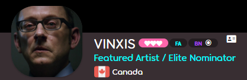

---
tags:
  - forum title
  - forum titles
  - rank
  - titles
  - user color
  - user colour
  - titre du forum
  - titres du forum
  - grade
  - titres
  - couleur de l'utilisateur
  - couleurs de l'utilisateur
---

# Titre de l'utilisateur

*Pour la liste des personnes qui ont obtenu des titres d'utilisateur spéciaux, voir [Utilisateurs avec des titres uniques](/wiki/People/Users_with_unique_titles).*

Un **titre d'utilisateur** est une courte étiquette sur la page de profil d'un utilisateur, définie par l'[équipe osu!](/wiki/People/osu!_team). La plupart des titres indiquent l'appartenance à un [groupe d'utilisateurs](/wiki/People/User_group), mais certains utilisateurs ont obtenu des [titres plus uniques](/wiki/People/Users_with_unique_titles) pour des réalisations ou des contributions spécifiques.

La couleur du titre d'un utilisateur est la même que celle de l'utilisateur, qui est généralement définie par l'appartenance à un groupe. Si l'utilisateur n'a pas de couleur définie, le titre est blanc.

## Histoire

### Titres du nombre de posts

Sur les forums de [l'ancien site d'osu!](https://old.ppy.sh), les utilisateurs pouvaient obtenir des titres en atteignant un certains seuils de nombre de posts, comme suit :

| Titre du forum | Nombre total de posts |
| :-: | :-- |
| Rhythm Rookie | 0–4 |
| Tempo Trainee | 5–14 |
| Whistle Blower | 15–29 |
| Cymbal Sounder | 30–49 |
| Beat Clicker | 50–79 |
| Slider Savant | 80–119 |
| Spinner Sage | 120–179 |
| Star Shooter | 180–259 |
| Combo Commander | 260–499 |
| Rhythm Incarnate | 500+ |

Ces titres n'étaient visibles que sur les barres latérales des messages du forum (pas sur les profils des utilisateurs) et n'étaient pas affichés si un autre titre personnalisé était déjà défini auparavant.

## Le saviez-vous ?

::: Infobox

:::

- Les titres des utilisateurs sont appelés "rank titles" dans le code du jeu. Ce nom est un vestige de l'époque où osu! était construit sur [phpBB](https://www.phpbb.com/).
- À partir de mars 2021, les utilisateurs qui gagnent plusieurs titres se voient généralement attribuer un titre qui les réunit tous avec des barres obliques. Auparavant, il était plus courant d'afficher uniquement le titre le plus significatif ou le plus récent.
