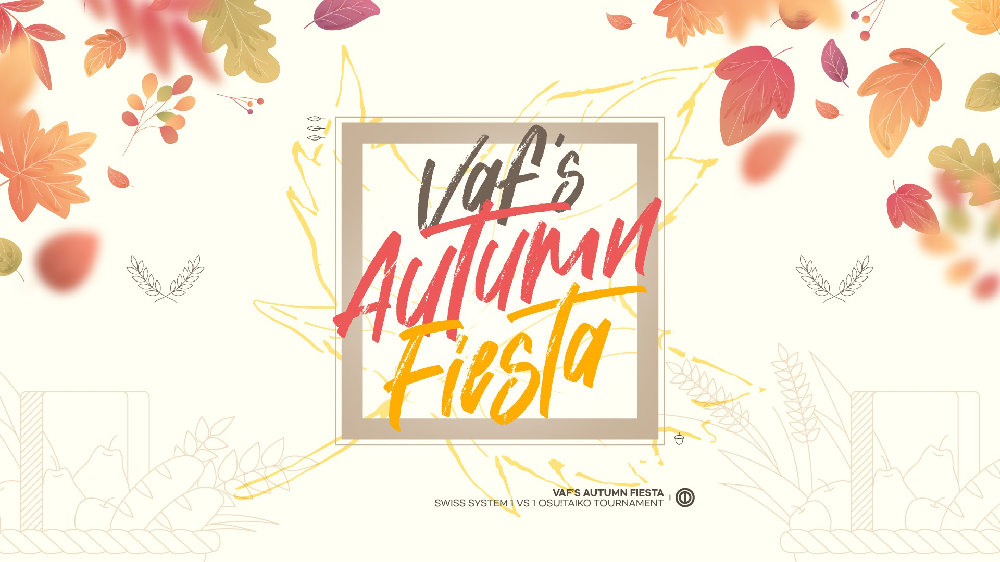

---
tags:
  - VAF
---

# Vaf's Autumn Fiesta

The **Vaf's Autumn Fiesta** (**VAF**) was a 1v1 osu!taiko tournament hosted by ::{ flag=AR }:: [Vaf](https://osu.ppy.sh/users/12589048). The tournament was run in a swiss style to determine the top players before going onto a double-elimination bracket in the Semifinals phase. The tournament was also rank-restricted to rank #50 and below. It was the first instalment of the Vaf's Autumn Fiesta.

## Tournament schedule

| Event | Timestamp |
| --: | :-- |
| Registration phase | 2021-04-16/2021-05-01 |
| Screening | 2021-05-01/2021-05-10 |
| Swiss week 1 | 2021-05-15/2021-05-16 |
| Swiss week 2 | 2021-05-22/2021-05-23 |
| Swiss week 3 | 2021-05-27/2021-05-30 |
| Swiss week 4 | 2021-06-05/2021-06-06 |
| Swiss week 5 | 2021-06-12/2021-06-13 |
| Swiss week 6 | 2021-06-19/2021-06-20 |
| Semifinals | 2021-06-26/2021-06-27 |
| Finals | 2021-07-03/2021-07-04 |
| Grand Finals | 2021-07-10/2021-07-11 |

## Prizes

| Placing | Prize |
| :-: | :-- |
|  | Unique profile badge, physical trophy, 6 months of osu!supporter |
|  | Physical trophy, 6 months of osu!supporter |
|  | Physical trophy, 6 months of osu!supporter |

A prize pool of grand total 18 months of osu!supporter and physical trophies is made possible thanks to [Lotuspro](http://www.lotuspro.io/).

## Organisation

The Vaf's Autumn Fiesta was run by various community members.

| Position | Member(s) |
| :-- | :-- |
| Organizer | ::{ flag=AR }:: [Vaf](https://osu.ppy.sh/users/12589048) |
| Administrator | ::{ flag=FR }:: [Spartan Plume](https://osu.ppy.sh/users/2553166), ::{ flag=US }:: [tigereyes144](https://osu.ppy.sh/users/6499811), ::{ flag=AR }:: [trollocat](https://osu.ppy.sh/users/9228032) |
| Mappool selector | ::{ flag=DE }:: [Nwolf](https://osu.ppy.sh/users/1910766), ::{ flag=ES }:: [Raiden](https://osu.ppy.sh/users/2239480), ::{ flag=AR }:: [Reficul](https://osu.ppy.sh/users/1506011), ::{ flag=AR }:: [trollocat](https://osu.ppy.sh/users/9228032) |
| Mapper | ::{ flag=JP }:: [\_Rise](https://osu.ppy.sh/users/5217107), ::{ flag=JP }:: [7\_7](https://osu.ppy.sh/users/7491106), ::{ flag=US }:: [Nifty](https://osu.ppy.sh/users/4956097), ::{ flag=ES }:: [Raiden](https://osu.ppy.sh/users/2239480), ::{ flag=CL }:: [Ulqui](https://osu.ppy.sh/users/1263669) |
| Referee | ::{ flag=US }:: [\[K\]](https://osu.ppy.sh/users/16551387), ::{ flag=KR }:: [4\_4](https://osu.ppy.sh/users/1152851), ::{ flag=FR }:: [Aidown](https://osu.ppy.sh/users/1522146), ::{ flag=HK }:: [BlackBq](https://osu.ppy.sh/users/6291741), ::{ flag=NL }:: [Boaz](https://osu.ppy.sh/users/13302996), ::{ flag=KR }:: [Civil oath](https://osu.ppy.sh/users/3216107), ::{ flag=DK }:: [Colibz](https://osu.ppy.sh/users/13647254), ::{ flag=BR }:: [DizzyH](https://osu.ppy.sh/users/9896172), ::{ flag=US }:: [JDrago14](https://osu.ppy.sh/users/7690078), ::{ flag=BR }:: [LeoFLT](https://osu.ppy.sh/users/3668779), ::{ flag=US }:: [moss-](https://osu.ppy.sh/users/9918921), ::{ flag=US }:: [Nambulance](https://osu.ppy.sh/users/13034610), ::{ flag=GB }:: [NightmareParty](https://osu.ppy.sh/users/15671175), ::{ flag=FR }:: [Okupsa](https://osu.ppy.sh/users/9313135), ::{ flag=TR }:: [oralekin](https://osu.ppy.sh/users/7631823), ::{ flag=DE }:: [Sayira](https://osu.ppy.sh/users/7253958), ::{ flag=PL }:: [SebekPlayed](https://osu.ppy.sh/users/7871365), ::{ flag=SG }:: [Spartric](https://osu.ppy.sh/users/7740442), ::{ flag=GB }:: [SSScotty](https://osu.ppy.sh/users/10319851), ::{ flag=GB }:: [StartAndSelect](https://osu.ppy.sh/users/8720555), ::{ flag=US }:: [tigereyes144](https://osu.ppy.sh/users/6499811), ::{ flag=VN }:: [Vespulaz](https://osu.ppy.sh/users/10848857), ::{ flag=AT }:: [Yasuho](https://osu.ppy.sh/users/8458835) |
| Streamer | ::{ flag=CL }:: [\[GS\]Myuka](https://osu.ppy.sh/users/10072733), ::{ flag=US }:: [ITotallyGetThat](https://osu.ppy.sh/users/8770622), ::{ flag=FR }:: [Kasumi-sama](https://osu.ppy.sh/users/6177263), ::{ flag=DK }:: [Polle](https://osu.ppy.sh/users/13218204), ::{ flag=DE }:: [Sayira](https://osu.ppy.sh/users/7253958), ::{ flag=SG }:: [Spartric](https://osu.ppy.sh/users/7740442), ::{ flag=CL }:: [Touche](https://osu.ppy.sh/users/1603962), ::{ flag=AR }:: [Vaf](https://osu.ppy.sh/users/12589048), ::{ flag=US }:: [Wilfred Murr](https://osu.ppy.sh/users/2598555), ::{ flag=TW }:: [XzCraftP](https://osu.ppy.sh/users/1593180) |
| Commentator | ::{ flag=GB }:: [B0tch3d](https://osu.ppy.sh/users/9864847), ::{ flag=AU }:: [Beat43210](https://osu.ppy.sh/users/5664171), ::{ flag=US }:: [Ethaaaan](https://osu.ppy.sh/users/9536977), ::{ flag=GB }:: [hammygames](https://osu.ppy.sh/users/12232503), ::{ flag=CA }:: [janitore](https://osu.ppy.sh/users/3307897), ::{ flag=US }:: [JM-](https://osu.ppy.sh/users/10629673), ::{ flag=US }:: [Loopy542](https://osu.ppy.sh/users/5468461), ::{ flag=GB }:: [Teezel](https://osu.ppy.sh/users/7528639), ::{ flag=AR }:: [Vaf](https://osu.ppy.sh/users/12589048), ::{ flag=US }:: [Wilfred Murr](https://osu.ppy.sh/users/2598555) |
| Designer | ::{ flag=KR }:: [POCARI SWEAT](https://osu.ppy.sh/users/5082685) |
| Statistician | ::{ flag=JP }:: [Noko\_BSF](https://osu.ppy.sh/users/3811831), ::{ flag=FR }:: [Spartan Plume](https://osu.ppy.sh/users/2553166), ::{ flag=AR }:: [Vaf](https://osu.ppy.sh/users/12589048) |
| Wiki editor | ::{ flag=ID }:: [fajar13k](https://osu.ppy.sh/users/7100002) |

## Links

- [Discussion thread](https://osu.ppy.sh/community/forums/topics/1299571)
- Livestream
  - [Twitch](https://www.twitch.tv/vafautumnfiesta)
  - [Trovo](https://trovo.live/VafAutumnFiesta)
    - *Note: The second channel's purpose was to stream the other match if there were more than one matches happening at the same time.*
- [VAF Discord server](https://discord.gg/h6AcC2XB3B)
- [Challonge bracket](https://challonge.com/VAF)
- **[Statistics sheet](https://docs.google.com/spreadsheets/d/1A0MAwHb0xVQefsPAc1v1SMox9dTyWodRXyqyIWNaVjg/edit?usp=sharing)**

## Participants

*Note: Global ranks were recorded at the end of registration.*

| Global rank | Player |
| --: | :-- |
| #51 | ::{ flag=BR }:: [Skull Kid](https://osu.ppy.sh/users/3044264) |
| #54 | ::{ flag=AR }:: [\_Doodle\_](https://osu.ppy.sh/users/5427801) |
| #55 | ::{ flag=IT }:: [D3kuu](https://osu.ppy.sh/users/7807444) |
| #56 | ::{ flag=IT }:: [LordEnder](https://osu.ppy.sh/users/4609767) |
| #58 | ::{ flag=JP }:: [yu-k1\_](https://osu.ppy.sh/users/16347853) |
| #62 | ::{ flag=GB }:: [mangomizer](https://osu.ppy.sh/users/1893718) |
| #64 | ::{ flag=PL }:: [bernard351](https://osu.ppy.sh/users/9511518) |
| #68 | ::{ flag=KR }:: [oL0](https://osu.ppy.sh/users/1134683) |
| #77 | ::{ flag=JP }:: [nananass](https://osu.ppy.sh/users/7231722) |
| #82 | ::{ flag=BR }:: [Ppus](https://osu.ppy.sh/users/5918857) |
| #83 | ::{ flag=MY }:: [\[Zeth\]](https://osu.ppy.sh/users/9912966) |
| #87 | ::{ flag=KR }:: [Konpaku Sariel](https://osu.ppy.sh/users/533502) |
| #90 | ::{ flag=IT }:: [A-40](https://osu.ppy.sh/users/14510301) |
| #95 | ::{ flag=HK }:: [J a c k y](https://osu.ppy.sh/users/8011704) |
| #97 | ::{ flag=BR }:: [HiroK](https://osu.ppy.sh/users/4050738) |
| #100 | ::{ flag=CA }:: [janitore](https://osu.ppy.sh/users/3307897) |
| #107 | ::{ flag=IT }:: [Ikkun](https://osu.ppy.sh/users/1059945) |
| #112 | ::{ flag=TH }:: [Raytoly](https://osu.ppy.sh/users/8121109) |
| #124 | ::{ flag=ID }:: [XK2238](https://osu.ppy.sh/users/1139209) |
| #133 | ::{ flag=KR }:: [5henry](https://osu.ppy.sh/users/3337332) |
| #136 | ::{ flag=AR }:: [gaston\_2199](https://osu.ppy.sh/users/5938161) |
| #145 | ::{ flag=IT }:: [coed](https://osu.ppy.sh/users/3716665) |
| #146 | ::{ flag=CL }:: [Vulkin](https://osu.ppy.sh/users/4901066) |
| #149 | ::{ flag=DE }:: [Minekuchi](https://osu.ppy.sh/users/9584873) |
| #150 | ::{ flag=NO }:: [petterde](https://osu.ppy.sh/users/7555792) |
| #151 | ::{ flag=US }:: [AuroraPhasmata](https://osu.ppy.sh/users/13664116) |
| #156 | ::{ flag=US }:: [\_knots](https://osu.ppy.sh/users/4407678) |
| #158 | ::{ flag=US }:: [cheese salad](https://osu.ppy.sh/users/6349821) |
| #167 | ::{ flag=RU }:: [Akonine](https://osu.ppy.sh/users/7774222) |
| #168 | ::{ flag=KR }:: [phosphene47](https://osu.ppy.sh/users/8000318) |
| #176 | ::{ flag=GR }:: [Genjuro](https://osu.ppy.sh/users/3196091) |
| #181 | ::{ flag=AU }:: [r1chyy](https://osu.ppy.sh/users/11499467) |
| #198 | ::{ flag=CH }:: [MC2BP](https://osu.ppy.sh/users/11296097) |
| #200 | ::{ flag=TW }:: [cat1346](https://osu.ppy.sh/users/10079336) |
| #209 | ::{ flag=US }:: [Xok](https://osu.ppy.sh/users/12177903) |
| #210 | ::{ flag=BR }:: [FurryBoujee](https://osu.ppy.sh/users/12630336) |
| #211 | ::{ flag=PH }:: [Pochacco](https://osu.ppy.sh/users/2927742) |
| #218 | ::{ flag=NZ }:: [Sparxe](https://osu.ppy.sh/users/5750235) |
| #219 | ::{ flag=GB }:: [Daniels](https://osu.ppy.sh/users/12439209) |
| #229 | ::{ flag=RU }:: [CrowWhite](https://osu.ppy.sh/users/8638977) |
| #234 | ::{ flag=KZ }:: [Lynerrr](https://osu.ppy.sh/users/14254867) |
| #237 | ::{ flag=BR }:: [Coryn](https://osu.ppy.sh/users/2828556) |
| #239 | ::{ flag=US }:: [Garpo](https://osu.ppy.sh/users/4097035) |
| #249 | ::{ flag=TW }:: [Yuemiao](https://osu.ppy.sh/users/4493348) |
| #253 | ::{ flag=KR }:: [GoZaRaNi](https://osu.ppy.sh/users/2879608) |
| #256 | ::{ flag=UA }:: [Don Omar](https://osu.ppy.sh/users/689414) |
| #261 | ::{ flag=BR }:: [Gustav0eiji](https://osu.ppy.sh/users/215127) |
| #274 | ::{ flag=MX }:: [-Arato](https://osu.ppy.sh/users/4588852) |
| #283 | ::{ flag=RU }:: [Den4ik228](https://osu.ppy.sh/users/7115174) |
| #293 | ::{ flag=CA }:: [honkers](https://osu.ppy.sh/users/3075337) |
| #303 | ::{ flag=TH }:: [Ponamis](https://osu.ppy.sh/users/7897892) |
| #315 | ::{ flag=ID }:: [Naverlyn](https://osu.ppy.sh/users/14324722) |
| #332 | ::{ flag=FI }:: [MEGAMELA](https://osu.ppy.sh/users/13613362) |
| #360 | ::{ flag=FR }:: [BananaW](https://osu.ppy.sh/users/9298106) |
| #368 | ::{ flag=NL }:: [Cookie\_Tree](https://osu.ppy.sh/users/502722) |
| #380 | ::{ flag=JP }:: [shakegohan\_jar](https://osu.ppy.sh/users/14088526) |
| #381 | ::{ flag=US }:: [Etholux](https://osu.ppy.sh/users/8593837) |
| #382 | ::{ flag=KR }:: [Jakads](https://osu.ppy.sh/users/259972) |
| #384 | ::{ flag=BE }:: [XOlifreX](https://osu.ppy.sh/users/4328137) |
| #394 | ::{ flag=GB }:: [Teezel](https://osu.ppy.sh/users/7528639) |
| #407 | ::{ flag=JP }:: [uranosu1030](https://osu.ppy.sh/users/9029238) |
| #417 | ::{ flag=JP }:: [Saikoro](https://osu.ppy.sh/users/741819) |
| #425 | ::{ flag=TW }:: [\_Llama](https://osu.ppy.sh/users/12798183) |
| #430 | ::{ flag=JP }:: [Ku\_Ren](https://osu.ppy.sh/users/2535243) |

## Podium

This competition has come to an end and resulted in the following podium:

| Placing | Player |
| :-: | :-- |
|  | ::{ flag=JP }:: [yu-k1\_](https://osu.ppy.sh/users/16347853) |
|  | ::{ flag=HK }:: [J a c k y](https://osu.ppy.sh/users/8011704) |
|  | ::{ flag=CA }:: [janitore](https://osu.ppy.sh/users/3307897) |

## Mappools

### Grand Finals

**[Download the mappack here! (90 MB)](https://www.mediafire.com/file/sz6al1q0nifisg9/MAPPACK_GF.zip/file)**

- NoMod
  1. [Kyou1110 - Revavavavava Ideoloololololololo (applerss) \[Innererererer Oniinininininini\]](https://osu.ppy.sh/beatmapsets/669463#taiko/1416106)
  2. [Richard Jacques - Super Sonic Racing (Foxeru) \[HiroK's All-Stars\]](https://osu.ppy.sh/beatmapsets/1315188#taiko/2725557)
  3. [The Flashbulb - Lawn Wake IX (iceOC) \[EX\]](https://osu.ppy.sh/beatmapsets/966060#taiko/2022187)
  4. [Various Artists - all night (ISLTR remix) (\_Rise) \[insomnia\]](https://osu.ppy.sh/beatmapsets/1510651#taiko/3093479)
  5. [Ophidian I - Spiral to Oblivion (Raiden) \[Desolation\]](https://osu.ppy.sh/beatmapsets/1508738#taiko/3089782)
  6. [Kurokotei - Nonbinarity (uone) \[Inner Oni\]](https://osu.ppy.sh/beatmapsets/1414457#taiko/2915423)
- Hidden
  1. [easyname - silly 300bpm thing (Kqrth) \[Oni\]](https://osu.ppy.sh/beatmapsets/725373#taiko/1531570)
  2. [BABii, Kai Whiston, Iglooghost - Lamb (Nifty) \[Midas\]](https://osu.ppy.sh/beatmapsets/1262367#taiko/2623873)
  3. [toby fox - Ruins (sasakure.UK Remix) (eae) \[Golden Flowers\]](https://osu.ppy.sh/beatmapsets/790685#taiko/1659016)
- HardRock
  1. [Chroma - Field : Kaerezu no Chi (tasuke912) \[Farthest\]](https://osu.ppy.sh/beatmapsets/897127#taiko/1874251)
  2. [t+pazolite - Garakuta Doll Play (sasakure.UK clutter remix) (Love) \[Love+Kinobles Oni\]](https://osu.ppy.sh/beatmapsets/424222#taiko/922997)
  3. [Kabocha - EgO (ll-oscar) \[ll-taiko St.\]](https://osu.ppy.sh/beatmapsets/1070329#taiko/2240471)
- DoubleTime
  1. [Furries in a Blender - Storm World (Hanjamon) \[Inner Oni\]](https://osu.ppy.sh/beatmapsets/322150#taiko/716320)
  2. [ayaponzu\* - Yakubyougami (gaston\_2199) \[Inner Oni\]](https://osu.ppy.sh/beatmapsets/742938#taiko/1659898)
  3. [Boogie Belgique - Piccadilly (lazyboy007) \[West End\]](https://osu.ppy.sh/beatmapsets/717359#taiko/1515547)
- FreeMod
  1. [Ruby My Dear - Croque Monsieur A Disneyland (Gamelan4) \[_m6's Oni\]](https://osu.ppy.sh/beatmapsets/1039985#taiko/2173759)
  2. [Doin - Pine nut (eae) \[Tatsujin\]](https://osu.ppy.sh/beatmapsets/974639#taiko/2040084)
  3. [Frums - My Capacitance (HiroK) \[Capacity\]](https://osu.ppy.sh/beatmapsets/1145495#taiko/2391607)
- Tiebreaker
  1. **[Yuuyu - Iki o Koroshita Stokesia (D3kuu) \[T4tsujin\]](https://osu.ppy.sh/beatmapsets/1002607#taiko/2098589)**

### Finals

**[Download the mappack here! (109 MB)](https://www.mediafire.com/file/b2xdkgyty6c5foq/Mappack+F.zip/file)**

- NoMod
  1. [96-glass - TAROLIN MEGAMIX (2077 art mix) (applerss) \[2019 oni\]](https://osu.ppy.sh/beatmapsets/1066293#taiko/2234549)
  2. [Hatsune Miku - With a Dance Number (Dz'Xa's Amenpunk) (KTYN) \[False appearance\]](https://osu.ppy.sh/beatmapsets/1332703#taiko/2761943)
  3. [ginka\*EX - ASSASSIN (Axer) \[Daitatsujin\]](https://osu.ppy.sh/beatmapsets/980660#taiko/2052326)
  4. [Spastic Ink - Words For Nerds (cut ver.) (Mew104) \[Overflow\]](https://osu.ppy.sh/beatmapsets/970838#taiko/2032919)
  5. [Imperial Circus Dead Decadence - Shinbatsu o Tadori Kyoukotsu ni Itaru (Heaxys) \[Compelling Retribution\]](https://osu.ppy.sh/beatmapsets/1070409#taiko/2572186)
  6. [Retractable - Teitai Kasoku Yomei Ikubaku (tasuke912) \[Oni\]](https://osu.ppy.sh/beatmapsets/893799#taiko/1867862)
- Hidden
  1. [Laur - KILL KILL KILL KILL KILL (maziari1105) \[Hell Oni\]](https://osu.ppy.sh/beatmapsets/477119#taiko/1045005)
  2. [Kobaryo - Theme for Psychopath Justice (eiri-) \[Hell Oni\]](https://osu.ppy.sh/beatmapsets/1245034#taiko/2587936)
  3. [Within The Ruins - Enigma (Grimbow) \[Oni\]](https://osu.ppy.sh/beatmapsets/1243301#taiko/2584826)
- HardRock
  1. [onoken - K8107 (Genjuro) \[Hell Oni\]](https://osu.ppy.sh/beatmapsets/1201354#taiko/2502165)
  2. [sHimaU - nohmen break (Vaenus Remix) (uone) \[Inner Oni\]](https://osu.ppy.sh/beatmapsets/670256#taiko/1417601)
  3. [Apollo"FIXEDSTAR"program feat. Ritsuka - SolarOrbit -Connected with the Espabrother- (Raiden) \[Interstellar (VAF ver.)\]](https://osu.ppy.sh/beatmapsets/1335757#taiko/3082573)
- DoubleTime
  1. [Venetian Snares - Shaky Sometimes (Jaltzu) \[Unstable Oni\]](https://osu.ppy.sh/beatmapsets/1229307#taiko/2564821)
  2. [Kanzaki Eluza - Independence (hoku-4625) \[Sentiment\]](https://osu.ppy.sh/beatmapsets/809378#taiko/1698445)
  3. [Rick Astley - Never Gonna Give You Up - Akyra Eurobeat Extended Mix - (duski) \[Multi-Track Rick-Rolling\]](https://osu.ppy.sh/beatmapsets/1015518#taiko/2125411)
- FreeMod
  1. [Aphex Twin - 4 acid organ[rough mix] (trollocat) \[alternative masterpiece\]](https://osu.ppy.sh/beatmapsets/1239661#taiko/2577376)
  2. [A? - Arrogation (Cut Ver.) (ZTH) \[Acquisition\]](https://osu.ppy.sh/beatmapsets/1291023#taiko/2679859)
  3. [KikuoHana - Ponkotsu Ningyou no Uta (Alchyr) \[Inner Oni\]](https://osu.ppy.sh/beatmapsets/1155252#taiko/3012846)
- Tiebreaker
  1. **[Team Grimoire - Vafpruonir (7\_7) \[Vaf\]](https://osu.ppy.sh/beatmapsets/1504837#taiko/3082615)**

### Semifinals

**[Download the mappack here! (102 MB)](https://www.mediafire.com/file/wzxoqyuv7oqb3rx/MAPPACK_SEMIFINALS_VAF.zip/file)**

- NoMod
  1. [hanacco - Tachibana Sylphynford (X a v y) \[TSF in Nippon!\]](https://osu.ppy.sh/beatmapsets/1312208#taiko/2719578)
  2. [Jeff Williams - I'm The One (feat. Casey Lee Williams) (HiroK) \[Crescent Rose\]](https://osu.ppy.sh/beatmapsets/840800#taiko/1759832)
  3. [Billain & Vegas - Shinde (Arrival) \[Oni\]](https://osu.ppy.sh/beatmapsets/1362405#taiko/2818836)
  4. [Myntian - Dog's Revenge on Luna (Faputa) \[Faputaitatsujin\]](https://osu.ppy.sh/beatmapsets/1498342#taiko/3070867)
  5. [Rhapsody of Fire - Dawn of Victory (Raiden) \[Unending Wrath 234bpm\]](https://osu.ppy.sh/beatmapsets/1494483#taiko/3063140)
  6. [The Flashbulb - That Missing Week (Lazarento) \[Nostalgia\]](https://osu.ppy.sh/beatmapsets/1202138#taiko/2503642)
- Hidden
  1. [katagiri - Sendan Life (katagiri Bootleg) (nyanmi-1828) \[ma\]](https://osu.ppy.sh/beatmapsets/1127090#taiko/2355331)
  2. [Frums - 24eeev0-$ (Gamelan4) \[Cychlo's eeev0lution-$\]](https://osu.ppy.sh/beatmapsets/1111340#taiko/2341735)
  3. [Kola Kid - good old times (Nwolf) \[slow oni\]](https://osu.ppy.sh/beatmapsets/1213598#taiko/2525737)
- HardRock
  1. [The Flashbulb - Kirlian Choices (Gamelan4) \[Transparency\]](https://osu.ppy.sh/beatmapsets/1456241#taiko/2993125)
  2. [Camellia as "fluX Xroise" - Xronier (Felt7z) \[Inner Oni\]](https://osu.ppy.sh/beatmapsets/925700#taiko/1933563)
  3. [LeaF - Paraclete (Kroytz) \[Nwolf's Inner Oni\]](https://osu.ppy.sh/beatmapsets/455109#taiko/1023467)
- DoubleTime
  1. [S3RL feat. Nikolett - Silicon XX (yea) \[Fantasy XX\]](https://osu.ppy.sh/beatmapsets/989809#taiko/2070533)
  2. [Helblinde - Grief & Malice (Rhytoly) \[Inner Oni\]](https://osu.ppy.sh/beatmapsets/782253#taiko/1642679)
  3. [M2U - Mare Maris (Quorum) \[Dusk's Inner Oni\]](https://osu.ppy.sh/beatmapsets/1222016#taiko/2813658)
- FreeMod
  1. [Nekomata Master vs. HuMeR - BUZRA (ZTH) \[Inner Oni\]](https://osu.ppy.sh/beatmapsets/1349645#taiko/2794392)
  2. [tarolabo - Miko (Genjuro) \[Hell Oni\]](https://osu.ppy.sh/beatmapsets/1100379#taiko/2298926)
  3. [Iglooghost - Super Ink Burst (Ulqui) \[Entropy\]](https://osu.ppy.sh/beatmapsets/1182264#taiko/2464974)
- Tiebreaker
  1. **[TryHardNinja - Revenge (feat. CaptainSparklez) (ReeK's "Dude, What's A Genre?" Remix) (Genjuro) \[Hell Oni\]](https://osu.ppy.sh/beatmapsets/1398744#taiko/2886041)**

### Swiss week 6

**[Download the mappack here! (93 MB)](https://www.mediafire.com/file/9scny0ifon9dtss/mappack+week+6.zip/file)**

- NoMod
  1. [Silentroom - Finixe (Faputa) \[Inner Oni\]](https://osu.ppy.sh/beatmapsets/1336266#taiko/2768306)
  2. [P\*Light - Pollinosis Panic (gaston\_2199) \[Oni\]](https://osu.ppy.sh/beatmapsets/981589#taiko/2054261)
  3. [RODEOGLO - AK-47 (Genjuro) \[$W4G\]](https://osu.ppy.sh/beatmapsets/1332834#taiko/2761668)
  4. [BUGCORE - NU SHLUMP//KEY SWAMP (Nifty) \[SHWUMPCORE\]](https://osu.ppy.sh/beatmapsets/1491649#taiko/3057539)
  5. [warinside - Esoteria (Felt7z) \[Heretic Oni\]](https://osu.ppy.sh/beatmapsets/655900#taiko/1389846)
- Hidden
  1. [odaxelagnia - #sawg (Horiiizon) \[#inner\]](https://osu.ppy.sh/beatmapsets/1207490#taiko/2515572)
  2. [Zekk - Foresight (HiroK) \[Hell Oni\]](https://osu.ppy.sh/beatmapsets/1440285#taiko/2963225)
  3. [Halogen - U Got That (agu) \[Oni\]](https://osu.ppy.sh/beatmapsets/962671#taiko/2015666)
- HardRock
  1. [kamome sano - Prepared Improvisation (tasuke912) \[Oni\]](https://osu.ppy.sh/beatmapsets/556358#taiko/1177487)
  2. [katagiri - AMEN KATAGIRI GENERATION (KitajimaYN) \[COLLABORATION\]](https://osu.ppy.sh/beatmapsets/1023593#taiko/2141230)
  3. [Getty vs. DJ DiA - Antifront Gears (Faputa) \[War Dance\]](https://osu.ppy.sh/beatmapsets/1043137#taiko/2180259)
- DoubleTime
  1. [ETIA. - You Are Gone (iceOC) \[Oni\]](https://osu.ppy.sh/beatmapsets/607987#taiko/1284044)
  2. [BTS - FIRE (Skull Kid) \[BULTAOREUNE\]](https://osu.ppy.sh/beatmapsets/591037#taiko/1250871)
  3. [Neovaii - Silent (Mew) \[Tranquility\]](https://osu.ppy.sh/beatmapsets/1065551#taiko/2231274)
- FreeMod
  1. [II-L - VANGUARD-1 (Axer) \[Satellite\]](https://osu.ppy.sh/beatmapsets/1407228#taiko/2901604)
  2. [Teletexter - Super Sonic Raving (ZTH) \[Inner Oni\]](https://osu.ppy.sh/beatmapsets/1321693#taiko/2737702)
  3. [Igorrr & Ruby My Dear - Figue Folle (-Kazu-) \[Inner Oni\]](https://osu.ppy.sh/beatmapsets/680739#taiko/1439297)

### Swiss week 5

**[Download the mappack here! (77 MB)](https://www.mediafire.com/file/zmt03xqpk33atfv/MAPPACK_SWISS_5.zip/file)**

- NoMod
  1. [An - Cochma (Ulqui) \[Purity\]](https://osu.ppy.sh/beatmapsets/1381447#taiko/2854276)
  2. [BEMANI Sound Team "HuMeR" feat.Fernweh - sakazuki (Lze) \[MXM\]](https://osu.ppy.sh/beatmapsets/992779#taiko/2076138)
  3. [Memme - Acid Burst (goheegy) \[Oni\]](https://osu.ppy.sh/beatmapsets/1048233#taiko/2191032)
  4. [Lite Show Magic - Stronghold (BabySnakes) \[oh no!\]](https://osu.ppy.sh/beatmapsets/1485671#taiko/3046461)
  5. [Nekrogoblikon - The Skin Thief (radar) \[Torture\]](https://osu.ppy.sh/beatmapsets/1129186#taiko/2359000)
- Hidden
  1. [Miyashita Yuu - Endgame (\_Rise) \[Inner Oni\]](https://osu.ppy.sh/beatmapsets/1402249#taiko/2892814)
  2. [BanYa - Blazing (asuasu\_yura) \[Oni\]](https://osu.ppy.sh/beatmapsets/1062630#taiko/2225245)
  3. [Airuei - Framework (Nwolf) \[Wired Oni\]](https://osu.ppy.sh/beatmapsets/1152903#taiko/2406326)
- HardRock
  1. [kors k - Empire of Fury (femboy mapper) \[TERROR ONI\]](https://osu.ppy.sh/beatmapsets/1414668#taiko/2915829)
  2. [t+pazolite - Candy Crack Curtain Call (ll-oscar) \[ll-taiko\]](https://osu.ppy.sh/beatmapsets/473507#taiko/1011768)
  3. [Katsuro Tajima - Puchipochi (Reficul) \[Tatsujin (Edit.)\]](https://osu.ppy.sh/beatmapsets/1133381#taiko/2963074)
- DoubleTime
  1. [DragonForce - Strangers (Garpo) \[True Survivor\]](https://osu.ppy.sh/beatmapsets/1193191#taiko/2486211)
  2. [The Flashbulb - Six Acid Strings (Nardoxyribonucleic) \[Volta's Oni\]](https://osu.ppy.sh/beatmapsets/966451#taiko/2078180)
  3. [kors k - Monkey Business (lapix Remix) (Arrival) \[Oni\]](https://osu.ppy.sh/beatmapsets/721496#taiko/1523524)
- FreeMod
  1. [Cranky vs. MASAKI - ouroboros -twin stroke of the end- (\_DUSK\_) \[Inner Oni\]](https://osu.ppy.sh/beatmapsets/1167065#taiko/2434428)
  2. [S3RL - Addict (DJKurara Remix) (yea) \[Relapse Oni\]](https://osu.ppy.sh/beatmapsets/938609#taiko/1960721)
  3. [Machine Girl - Bullet Hell (Nifty) \[touhou\]](https://osu.ppy.sh/beatmapsets/1061403#taiko/2222629)

### Swiss week 4

**[Download the mappack here! (74 MB)](https://www.mediafire.com/file/hnxyyckq4znqd6m/MAPPACK_SWISS_4.zip/file)**

- NoMod
  1. [Rainbowdragoneyes - Gods Of War 2007 - 2010 (Nofool) \[Inner Oni\]](https://osu.ppy.sh/beatmapsets/831241#taiko/1741497)
  2. [Kaneko Chiharu - iLLness LiLin (Chromoxx) \[KTYN's Inner Oni\]](https://osu.ppy.sh/beatmapsets/918254#taiko/2417637)
  3. [Machine Girl - Out By 16, Dead on the Scene (ZTH) \[Inner Oni\]](https://osu.ppy.sh/beatmapsets/1116495#taiko/2351939)
  4. [8284 - Connaextion (Maimaing) \[?\]](https://osu.ppy.sh/beatmapsets/1479044#taiko/3034256)
  5. [DragonForce - Fallen World (Nofool) \[S T R E A M W O R L D\]](https://osu.ppy.sh/beatmapsets/491289#taiko/1046955)
- Hidden
  1. [GaMetal - Count Cannoli (Greenshell) \[Purple Wind\]](https://osu.ppy.sh/beatmapsets/793368#taiko/1666161)
  2. [technoplanet feat. Haruno & Daisuke Kurosawa - Far Away Light (Raiden) \[Glimmer\]](https://osu.ppy.sh/beatmapsets/1459468#taiko/2998970)
  3. [tarolabo - gynandromorph (D3kuu) \[X XYY\]](https://osu.ppy.sh/beatmapsets/1185599#taiko/2471262)
- HardRock
  1. [Arcaea Sound Team against. ETIA. - Singularity VVVIP (Raytoly) \[If You CCCAN\]](https://osu.ppy.sh/beatmapsets/1139960#taiko/2381084)
  2. [Amebre Kizami - Yuzukosho No Kanata (hoku) \[Hurry up ^-^\]](https://osu.ppy.sh/beatmapsets/1334765#taiko/2765079)
  3. [Starkill - Until We Fall (Raiden) \[Legendary (1.5)\]](https://osu.ppy.sh/beatmapsets/1471235#taiko/3020436)
- DoubleTime
  1. [sasakure.UK - Epitorica no Matsuri (\_DUSK\_) \[Inner Oni\]](https://osu.ppy.sh/beatmapsets/1167959#taiko/2436820)
  2. [Sasaki Sayaka - Marine Blue ni Sotte (Nardoxyribonucleic) \[Inner Oni\]](https://osu.ppy.sh/beatmapsets/630650#taiko/1331306)
  3. [E.G.G. - OK I'm blue rat (Genjuro) \[Inner Oni\]](https://osu.ppy.sh/beatmapsets/1184988#taiko/2470101)
- FreeMod
  1. [Morimori Atsushi - Funkotsu Saishin Casino (gaston\_2199) \[Inner Oni\]](https://osu.ppy.sh/beatmapsets/1028937#taiko/2151497)
  2. [Venetian Snares - Die Winnipeg Die Die Die Fuckers Die (ZTH) \[Inner Oni\]](https://osu.ppy.sh/beatmapsets/1126295#taiko/2354953)
  3. [cybermiso - Surveiller et punir (tasuke912) \[Oni\]](https://osu.ppy.sh/beatmapsets/921181#taiko/1923626)

### Swiss week 3

**[Download the mappack here! (88 MB)](https://www.mediafire.com/file/jz3c3oiuax5kpfo/MAPPACK+SWISS+3.zip/file)**

- NoMod
  1. [Rohi - Kakuzetsu Thanatos (Idealism) \[Isolation\]](https://osu.ppy.sh/beatmapsets/1175412#taiko/2451623)
  2. [Ponchi feat. haxchi - Connect Colors (Jerry) \[YNZM's Rainbow\]](https://osu.ppy.sh/beatmapsets/1282848#taiko/2664333)
  3. [cybermiso - corps-sans-organes (Arrival) \[Oni\]](https://osu.ppy.sh/beatmapsets/1141437#taiko/2384102)
  4. [Nitro Fun - Final Boss (Cut Ver) (Lno) \[Oni\]](https://osu.ppy.sh/beatmapsets/1402151#taiko/2892658)
  5. [UNDEAD CORPORATION - Embraced by the Flame (Nwolf) \[Deserted Oni\]](https://osu.ppy.sh/beatmapsets/436802#taiko/940785)
- Hidden
  1. [Helblinde - Disconnected (Kannes) \[Virtual Reality\]](https://osu.ppy.sh/beatmapsets/1158176#taiko/2417023)
  2. [Aquestion - ENERGY INFLATION (A\_\_) \[KTYN's Inner Oni\]](https://osu.ppy.sh/beatmapsets/1315661#taiko/2726428)
  3. [Sota Fujimori - ACCELERATE (HiroK) \[Max Speed!\]](https://osu.ppy.sh/beatmapsets/844461#taiko/1766496)
- HardRock
  1. [ZUN remixed by LeaF - Resurrection Spell (sendol) \[Charlotte's Inner Oni\]](https://osu.ppy.sh/beatmapsets/798869#taiko/1954440)
  2. [Yousei Teikoku - Zetsubou plantation (Saten) \[Ono's Taiko Oni\]](https://osu.ppy.sh/beatmapsets/86009#taiko/374422)
  3. [cosMo@bousouP - Oceanus (Faputa) \[Empyrean Flow\]](https://osu.ppy.sh/beatmapsets/1047505#taiko/2189542)
- DoubleTime
  1. [THE KOXX - A Fool Moon Night (Skull Kid) \[Full Moon\]](https://osu.ppy.sh/beatmapsets/737288#taiko/1555918)
  2. [IOSYS - Poinsettia (eiri-) \[Inner Oni\]](https://osu.ppy.sh/beatmapsets/799276#taiko/1678184)
  3. [SIHanatsuka - EMber (Nara\_NB) \[Inner Oni (SV nerf)\]](https://osu.ppy.sh/beatmapsets/967071#taiko/3025810)
- FreeMod
  1. [Yu\_Asahina - Trickstarz (kitafuma) \[Inner Oni\]](https://osu.ppy.sh/beatmapsets/1118075#taiko/2335498)
  2. [Nekomata Master+ - POINT ZERO (\_DUSK\_) \[Inner Oni\]](https://osu.ppy.sh/beatmapsets/937099#taiko/1957601)
  3. [Cyte - Silver Winds (Cychloryn) \[Inner Oni\]](https://osu.ppy.sh/beatmapsets/1242018#taiko/2582138)

### Swiss week 2

**[Download the mappack here! (94 MB)](https://www.mediafire.com/file/ivudcuyyvpky3eh/MAPPACK+SWISS+WEEK+2.zip/file)**

- NoMod
  1. [mafumafu - Kakushigoto (kanpakyin) \[Inner Oni (Tourney Ver.)\]](https://osu.ppy.sh/beatmapsets/1320126#taiko/3006514)
  2. [Rings Of Saturn - Senseless Massacre (Vulkin) \[Ura Oni\]](https://osu.ppy.sh/beatmapsets/819819#taiko/1779857)
  3. [Silentroom - Nhelv (namaniku) \[Akanistha\]](https://osu.ppy.sh/beatmapsets/684795#taiko/1449248)
  4. [t+pazolite - Seedy Try (HiroK) \[Spooky Oni\]](https://osu.ppy.sh/beatmapsets/816696#taiko/1712661)
  5. [YUZUKINGDOM - National Anthem (Nao Tomori) \[Collab Inner Oni\]](https://osu.ppy.sh/beatmapsets/1439897#taiko/2962574)
- Hidden
  1. [saradisk - CIAOchuru remix (KTYN) \[Foreign objects*225\]](https://osu.ppy.sh/beatmapsets/1188736#taiko/2477061)
  2. [E.G.G. - Got more raves? (DakeDekaane) \[Oni\]](https://osu.ppy.sh/beatmapsets/1080225#taiko/2259976)
  3. [Asaki - Torinaki jima nite (Mikaruge) \[Hell Oni\]](https://osu.ppy.sh/beatmapsets/1380433#taiko/2852368)
- HardRock
  1. [Nightmare - Dream to Nightmare (Kqrth) \[Inner Oni\]](https://osu.ppy.sh/beatmapsets/834254#taiko/1962899)
  2. [Chroma - Sayonara Planet Wars (404 AccNotFound) \[flw34tfg\]](https://osu.ppy.sh/beatmapsets/643875#taiko/1411960)
  3. [LEAF XCEED Music Division - Fur Elisa (coed) \[Inner Oni\]](https://osu.ppy.sh/beatmapsets/1215987#taiko/2530307)
- DoubleTime
  1. [hololive IDOL PROJECT - BLUE CLAPPER (Jerry) \[Ulqui's Inner Oni\]](https://osu.ppy.sh/beatmapsets/1329875#taiko/2756998)
  2. [Uchida Maaya - Tsubomi Yume Miru Rhapsodia \~Alma no Michibiki\~ (lolcubes) \[Inner Oni\]](https://osu.ppy.sh/beatmapsets/110292#taiko/287463)
  3. [HARUTYA - Byoushin o Kamu (juanilp4evr) \[Inner Oni\]](https://osu.ppy.sh/beatmapsets/961181#taiko/2012247)
- FreeMod
  1. [REDALiCE & aran - Sweet Requiem (Marm) \[Threnody\]](https://osu.ppy.sh/beatmapsets/665521#taiko/1408434)
  2. [EmoCosine - Give You My World (Capu) \[Master\]](https://osu.ppy.sh/beatmapsets/1225464#taiko/2548643)
  3. [siqlo - YInMn Blue (gaston_2199) \[Inner Oni\]](https://osu.ppy.sh/beatmapsets/1233593#taiko/2564430)

### Swiss week 1

**[Download the mappack here! (113 MB)](https://www.mediafire.com/file/cc6lfomy344chll/SWISS1_MAPPACK.zip/file)**

- NoMod
  1. [Orangestar - Asu no Yozora Shoukaihan (Raphalge) \[Vocaloid Hater\]](https://osu.ppy.sh/beatmapsets/704125#taiko/1489560)
  2. [Yuikonnu - Uchouten Vivace (aHTaoN) \[Taiko\]](https://osu.ppy.sh/beatmapsets/1118352#taiko/2335978)
  3. [kors k - Poochie (Nifty) \[Special\]](https://osu.ppy.sh/beatmapsets/946420#taiko/1976130)
  4. [Chroma - Genyo Ressha no Tabi (Faputa) \[Faputatsujin\]](https://osu.ppy.sh/beatmapsets/1335410#taiko/2766601)
  5. [Junichi Masuda - Decisive Battle! Daigo (drum edit) (Raiden) \[tiko (nerf)\]](https://osu.ppy.sh/beatmapsets/1264369#taiko/2983649)
- Hidden
  1. [TUYU - Doro no Bunzai de Watashi dake no Taisetsu o Ubaouda nante (gaston_2199) \[Inner Oni\]](https://osu.ppy.sh/beatmapsets/1316773#taiko/2728335)
  2. [polysha - ILL-STARRED Diver (uone) \[Oni\]](https://osu.ppy.sh/beatmapsets/1013895#taiko/2122040)
  3. [MAD CHILD - Voice 2 Voice (Peaceful) \[Inner Oni\]](https://osu.ppy.sh/beatmapsets/1037062#taiko/2168202)
- HardRock
  1. [Satsuki ga Tenkomori - Masked bitcH wo limikkusushitemita (Grimbow) \[Oni\]](https://osu.ppy.sh/beatmapsets/976549#taiko/2044088)
  2. [Arctic Monkeys - The Bad Thing (\_MMMMMM\_MMMMMM\_) \[Bad Oni\]](https://osu.ppy.sh/beatmapsets/1214914#taiko/2528437)
  3. [Fractal Dreamers - Gardens Under A Spring Sky (\_Kobii) \[Fapu's Verdancy\]](https://osu.ppy.sh/beatmapsets/1080892#taiko/2266329)
- DoubleTime
  1. [C-CLAYS - Fancy-free (MMzz) \[Oni\]](https://osu.ppy.sh/beatmapsets/177859#taiko/427996)
  2. [Draper - Joyride (ZenithAnnul) \[Oni\]](https://osu.ppy.sh/beatmapsets/308115#taiko/689179)
  3. [Colors Slash - Colors Power ni Omakasero! (Sober Bear Remix) (HEKUSODASU) \[Oni\]](https://osu.ppy.sh/beatmapsets/807284#taiko/1725411)
- FreeMod
  1. [goreshit - When the cicadas cry (RuinedChicken) \[Chickenspawn\]](https://osu.ppy.sh/beatmapsets/610689#taiko/1289368)
  2. [SEVENTH SISTERS - SEVENTH HAVEN (Mtell Remix) (Shallty) \[1st Sister Shallty\]](https://osu.ppy.sh/beatmapsets/829545#taiko/1737946)
  3. [Se-U-Ra - Hope 4 Hopeful (Hivie) \[Optimism\]](https://osu.ppy.sh/beatmapsets/1302274#taiko/2700888)

## Match results

### Grand Finals

Saturday, 10 July 2021:

| Player 1 |  |  | Player 2 | Match link |
| --: | :-: | :-: | :-- | :-- |
| janitore ::{ flag=CA }:: | 6 | **7** | ::{ flag=HK }:: **J a c k y** | [#1](https://osu.ppy.sh/community/matches/87121539) |

Sunday, 11 July 2021:

| Player 1 |  |  | Player 2 | Match link |
| --: | :-: | :-: | :-- | :-- |
| **yu-k1\_** ::{ flag=JP }:: | **7** | 3 | ::{ flag=HK }:: J a c k y | [#1](https://osu.ppy.sh/community/matches/87175258) |

### Finals

Saturday, 3 July 2021:

| Player 1 |  |  | Player 2 | Match link |
| --: | :-: | :-: | :-- | :-- |
| **Minekuchi** ::{ flag=DE }:: | **7** | 2 | ::{ flag=IT }:: Ikkun | [#1](https://osu.ppy.sh/community/matches/86721018) |
| Skull Kid ::{ flag=BR }:: | 1 | **7** | ::{ flag=CA }:: **janitore** | [#1](https://osu.ppy.sh/community/matches/86742979) |

Sunday, 4 July 2021:

| Player 1 |  |  | Player 2 | Match link |
| --: | :-: | :-: | :-- | :-- |
| J a c k y ::{ flag=HK }:: | 3 | **7** | ::{ flag=JP }:: **yu-k1\_** | [#1](https://osu.ppy.sh/community/matches/86769379) |
| Minekuchi ::{ flag=DE }:: | 0 | **7** | ::{ flag=CA }:: **janitore** | [#1](https://osu.ppy.sh/community/matches/86776535) |

### Semifinals

Saturday, 26 June 2021:

| Player 1 |  |  | Player 2 | Match link |
| --: | :-: | :-: | :-- | :-- |
| **XK2238** ::{ flag=ID }:: | **7** | 1 | ::{ flag=US }:: cheese salad | [#1](https://osu.ppy.sh/community/matches/86290156) |
| mangomizer ::{ flag=GB }:: | 2 | **7** | ::{ flag=IT }:: **Ikkun** | [#1](https://osu.ppy.sh/community/matches/86305698) |
| HiroK ::{ flag=BR }:: | 1 | **7** | ::{ flag=JP }:: **nananass** | [#1](https://osu.ppy.sh/community/matches/86308020) |

Sunday, 27 June 2021:

| Player 1 |  |  | Player 2 | Match link |
| --: | :-: | :-: | :-- | :-- |
| **janitore** ::{ flag=CA }:: | **7** | 0 | ::{ flag=KR }:: 5henry | [#1](https://osu.ppy.sh/community/matches/86342158) |
| **J a c k y** ::{ flag=HK }:: | **7** | 1 | ::{ flag=BR }:: Skull Kid | [#1](https://osu.ppy.sh/community/matches/86344611) |
| Minekuchi ::{ flag=DE }:: | 2 | **7** | ::{ flag=JP }:: **yu-k1\_** | [#1](https://osu.ppy.sh/community/matches/86364156) |
| nananass ::{ flag=JP }:: | 1 | **7** | ::{ flag=CA }:: **janitore** | [#1](https://osu.ppy.sh/community/matches/86368987) |
| XK2238 ::{ flag=ID }:: | 6 | **7** | ::{ flag=IT }:: **Ikkun** | [#1](https://osu.ppy.sh/community/matches/86417837) |

### Swiss week 6

Saturday, 19 June 2021:

| Player 1 |  |  | Player 2 | Match link |
| --: | :-: | :-: | :-- | :-- |
| **MEGAMELA** ::{ flag=FI }:: | **7** | 0 | ::{ flag=RU }:: Akonine | *win by default* |
| GoZaRaNi ::{ flag=KR }:: | 0 | **7** | ::{ flag=PH }:: **Pochacco** | *win by default* |
| **coed** ::{ flag=IT }:: | **7** | 0 | ::{ flag=KR }:: phosphene47 | *win by default* |
| **D3kuu** ::{ flag=IT }:: | **7** | 0 | ::{ flag=TW }:: Yuemiao | [#1](https://osu.ppy.sh/community/matches/85881455) |
| Konpaku Sariel ::{ flag=KR }:: | 0 | **7** | ::{ flag=BE }:: **XOlifreX** | *win by default* |
| **Coryn** ::{ flag=BR }:: | **7** | 0 | ::{ flag=MY }:: \[Zeth\] | *win by default* |
| **J a c k y** ::{ flag=HK }:: | **7** | 5 | ::{ flag=CA }:: janitore | [#1](https://osu.ppy.sh/community/matches/85881014) |
| **Vulkin** ::{ flag=CL }:: | **7** | 1 | ::{ flag=RU }:: CrowWhite | [#1](https://osu.ppy.sh/community/matches/85895644) |
| Genjuro ::{ flag=GR }:: | 0 | 0 | ::{ flag=BR }:: Gustav0eiji | *nullified* |
| oL0 ::{ flag=KR }:: | 0 | **7** | ::{ flag=US }:: **Etholux** | *win by default* |

Sunday, 20 June 2021:

| Player 1 |  |  | Player 2 | Match link |
| --: | :-: | :-: | :-- | :-- |
| **Ku\_Ren** ::{ flag=JP }:: | **7** | 4 | ::{ flag=MX }:: -Arato | [#1](https://osu.ppy.sh/community/matches/85918264) |
| Daniels ::{ flag=GB }:: | 0 | **7** | ::{ flag=US }:: **Xok** | *win by default* |
| bernard351 ::{ flag=PL }:: | 0 | **7** | ::{ flag=JP }:: **uranosu1030** | *win by default* |
| **5henry** ::{ flag=KR }:: | **7** | 1 | ::{ flag=US }:: \_knots | [#1](https://osu.ppy.sh/community/matches/85919643) |
| Jakads ::{ flag=KR }:: | 0 | **7** | ::{ flag=US }:: **cheese salad** | *win by default* |
| Ponamis ::{ flag=TH }:: | 0 | **7** | ::{ flag=AU }:: **r1chyy** | *win by default* |
| **Teezel** ::{ flag=GB }:: | **7** | 0 | ::{ flag=ID }:: Naverlyn | *win by default* |
| **petterde** ::{ flag=NO }:: | **7** | 0 | ::{ flag=NL }:: Cookie\_Tree | *win by default* |
| nananass ::{ flag=JP }:: | 4 | **7** | ::{ flag=JP }:: **yu-k1\_** | [#1](https://osu.ppy.sh/community/matches/85938286) |
| BananaW ::{ flag=FR }:: | 0 | 0 | ::{ flag=JP }:: shakegohan\_jar | *nullified* |
| Sparxe ::{ flag=NZ }:: | 5 | **7** | ::{ flag=TW }:: **cat1346** | [#1](https://osu.ppy.sh/community/matches/85939789) |
| LordEnder ::{ flag=IT }:: | 6 | 6 | ::{ flag=RU }:: Den4ik228 | [#1](https://osu.ppy.sh/community/matches/85941215) |
| **Saikoro** ::{ flag=JP }:: | **7** | 0 | ::{ flag=TW }:: \_Llama | *win by default* |
| honkers ::{ flag=CA }:: | 0 | **7** | ::{ flag=CH }:: **MC2BP** | *win by default* |
| **XK2238** ::{ flag=ID }:: | **7** | 5 | ::{ flag=IT }:: Ikkun | [#1](https://osu.ppy.sh/community/matches/85943637) |
| **Minekuchi** ::{ flag=DE }:: | **7** | 1 | ::{ flag=AR }:: \_Doodle\_ | [#1](https://osu.ppy.sh/community/matches/85946197) |
| Lynerrr ::{ flag=KZ }:: | 3 | **7** | ::{ flag=BR }:: **HiroK** | [#1](https://osu.ppy.sh/community/matches/85946292) |
| Ppus ::{ flag=BR }:: | 0 | **7** | ::{ flag=US }:: **Garpo** | *win by default* |
| **mangomizer** ::{ flag=GB }:: | **7** | 5 | ::{ flag=TH }:: Raytoly | [#1](https://osu.ppy.sh/community/matches/85947936) |
| **Skull Kid** ::{ flag=BR }:: | **7** | 1 | ::{ flag=IT }:: A-40 | [#1](https://osu.ppy.sh/community/matches/85958743) |
| **AuroraPhasmata** ::{ flag=US }:: | **7** | 1 | ::{ flag=AR }:: gaston\_2199 | [#1](https://osu.ppy.sh/community/matches/85961573) |
| **FurryBoujee** ::{ flag=BR }:: | **7** | 0 | ::{ flag=UA }:: Don Omar | [#1](https://osu.ppy.sh/community/matches/85963413) |

### Swiss week 5

Saturday, 12 June 2021:

| Player 1 |  |  | Player 2 | Match link |
| --: | :-: | :-: | :-- | :-- |
| **Naverlyn** ::{ flag=ID }:: | **7** | 0 | ::{ flag=RU }:: Akonine | *win by default* |
| Ponamis ::{ flag=TH }:: | 2 | **7** | ::{ flag=KR }:: **phosphene47** | [#1](https://osu.ppy.sh/community/matches/85429009) |
| **CrowWhite** ::{ flag=RU }:: | **7** | 0 | ::{ flag=JP }:: shakegohan\_jar | *win by default* |
| r1chyy ::{ flag=AU }:: | 4 | **7** | ::{ flag=CH }:: **MC2BP** | [#1](https://osu.ppy.sh/community/matches/85432892) |
| **Raytoly** ::{ flag=TH }:: | **7** | 2 | ::{ flag=UA }:: Don Omar | [#1](https://osu.ppy.sh/community/matches/85435869) |
| oL0 ::{ flag=KR }:: | 1 | **7** | ::{ flag=JP }:: **yu-k1\_** | [#1](https://osu.ppy.sh/community/matches/85435788) |
| petterde ::{ flag=NO }:: | 3 | **7** | ::{ flag=TW }:: **Yuemiao** | [#1](https://osu.ppy.sh/community/matches/85437072) |
| Konpaku Sariel ::{ flag=KR }:: | 0 | **7** | ::{ flag=US }:: **\_knots** | *win by default* |
| Cookie\_Tree ::{ flag=NL }:: | 1 | **7** | ::{ flag=PL }:: **bernard351** | [#1](https://osu.ppy.sh/community/matches/85440158) |
| **XK2238** ::{ flag=ID }:: | **7** | 4 | ::{ flag=IT }:: D3kuu | [#1](https://osu.ppy.sh/community/matches/85439519) |
| 5henry ::{ flag=KR }:: | 5 | **7** | ::{ flag=GB }:: **mangomizer** | [#1](https://osu.ppy.sh/community/matches/85448010) |
| janitore ::{ flag=CA }:: | 6 | 6 | ::{ flag=DE }:: Minekuchi | [#1](https://osu.ppy.sh/community/matches/85452437) |
| **Etholux** ::{ flag=US }:: | **7** | 0 | ::{ flag=GR }:: Genjuro | *win by default* |
| Sparxe ::{ flag=NZ }:: | 3 | **7** | ::{ flag=BR }:: **Skull Kid** | [#1](https://osu.ppy.sh/community/matches/85456974) |
| **Coryn** ::{ flag=BR }:: | **7** | 0 | ::{ flag=US }:: Xok | *win by default* |
| Ppus ::{ flag=BR }:: | 0 | **7** | ::{ flag=AR }:: **gaston\_2199** | *win by default* |

Sunday, 13 June 2021:

| Player 1 |  |  | Player 2 | Match link |
| --: | :-: | :-: | :-- | :-- |
| **uranosu1030** ::{ flag=JP }:: | **7** | 0 | ::{ flag=FR }:: BananaW | *win by defaut* |
| **-Arato** ::{ flag=MX }:: | **7** | 5 | ::{ flag=RU }:: Den4ik228 | [#1](https://osu.ppy.sh/community/matches/85480290) |
| Saikoro ::{ flag=JP }:: | 2 | **7** | ::{ flag=US }:: **cheese salad** | [#1](https://osu.ppy.sh/community/matches/85485201) |
| Garpo ::{ flag=US }:: | 0 | **7** | ::{ flag=CA }:: **honkers** | *win by default* |
| **Pochacco** ::{ flag=PH }:: | **7** | 0 | ::{ flag=MY }:: \[Zeth\] | *win by default* |
| \_Llama ::{ flag=TW }:: | 0 | **7** | ::{ flag=FI }:: **MEGAMELA** | *win by default* |
| **nananass** ::{ flag=JP }:: | **7** | 1 | ::{ flag=KR }:: Jakads | [#1](https://osu.ppy.sh/community/matches/85500337) |
| XOlifreX ::{ flag=BE }:: | 1 | **7** | ::{ flag=KR }:: **GoZaRaNi** | [#1](https://osu.ppy.sh/community/matches/85501842) |
| **cat1346** ::{ flag=TW }:: | **7** | 0 | ::{ flag=GB }:: Daniels | *win by default* |
| Vulkin ::{ flag=CL }:: | 0 | **7** | ::{ flag=BR }:: **FurryBoujee** | *win by default* |
| \_Doodle\_ ::{ flag=AR }:: | 3 | **7** | ::{ flag=HK }:: **J a c k y** | [#1](https://osu.ppy.sh/community/matches/85503813) |
| Ku\_Ren ::{ flag=JP }:: | 2 | **7** | ::{ flag=KZ }:: **Lynerrr** | [#1](https://osu.ppy.sh/community/matches/85507035) |
| **A-40** ::{ flag=IT }:: | **7** | 4 | ::{ flag=IT }:: coed | [#1](https://osu.ppy.sh/community/matches/85507167) |
| **Teezel** ::{ flag=GB }:: | **7** | 0 | ::{ flag=BR }:: Gustav0eiji | *win by default* |
| **HiroK** ::{ flag=BR }:: | **7** | 2 | ::{ flag=IT }:: LordEnder | [#1](https://osu.ppy.sh/community/matches/85518719) |
| **Ikkun** ::{ flag=IT }:: | **7** | 1 | ::{ flag=US }:: AuroraPhasmata | [#1](https://osu.ppy.sh/community/matches/85526250) |

### Swiss week 4

Saturday, 5 June 2021:

| Player 1 |  |  | Player 2 | Match link |
| --: | :-: | :-: | :-- | :-- |
| Naverlyn ::{ flag=ID }:: | 6 | 6 | ::{ flag=US }:: Xok | [#1](https://osu.ppy.sh/community/matches/84958935) |
| **nananass** ::{ flag=JP }:: | **7** | 1 | ::{ flag=TW }:: Yuemiao | [#1](https://osu.ppy.sh/community/matches/84964391) |
| \[Zeth\] ::{ flag=MY }:: | 1 | **7** | ::{ flag=UA }:: **Don Omar** | [#1](https://osu.ppy.sh/community/matches/84970356) |
| **Sparxe** ::{ flag=NZ }:: | **7** | 0 | ::{ flag=TH }:: Ponamis | [#1](https://osu.ppy.sh/community/matches/84972626) |
| Saikoro ::{ flag=JP }:: | 1 | **7** | ::{ flag=GB }:: **mangomizer** | [#1](https://osu.ppy.sh/community/matches/84972754) |
| CrowWhite ::{ flag=RU }:: | 3 | **7** | ::{ flag=GB }:: **Teezel** | [#1](https://osu.ppy.sh/community/matches/84975341) |
| **Daniels** ::{ flag=GB }:: | **7** | 0 | ::{ flag=CH }:: MC2BP | [#1](https://osu.ppy.sh/community/matches/84978462) |
| **yu-k1\_** ::{ flag=JP }:: | **7** | 1 | ::{ flag=BR }:: Ppus | [#1](https://osu.ppy.sh/community/matches/84978785) |
| Ikkun ::{ flag=IT }:: | 5 | **7** | ::{ flag=HK }:: **J a c k y** | [#1](https://osu.ppy.sh/community/matches/84976918) |
| **\_Doodle\_** ::{ flag=AR }:: | **7** | 4 | ::{ flag=ID }:: XK2238 | [#1](https://osu.ppy.sh/community/matches/84978808) |
| Akonine ::{ flag=RU }:: | 0 | **7** | ::{ flag=KZ }:: **Lynerrr** | [#1](https://osu.ppy.sh/community/matches/84982297) |
| **Jakads** ::{ flag=KR }:: | **7** | 0 | ::{ flag=GR }:: Genjuro | [#1](https://osu.ppy.sh/community/matches/84982041) |
| **Minekuchi** ::{ flag=DE }:: | **7** | 5 | ::{ flag=TH }:: Raytoly | [#1](https://osu.ppy.sh/community/matches/84981992) |
| **D3kuu** ::{ flag=IT }:: | **7** | 1 | ::{ flag=IT }:: LordEnder | [#1](https://osu.ppy.sh/community/matches/84985185) |
| Cookie\_Tree ::{ flag=NL }:: | 4 | **7** | ::{ flag=BR }:: **FurryBoujee** | [#1](https://osu.ppy.sh/community/matches/84988551) |
| Gustav0eiji ::{ flag=BR }:: | 6 | 6 | ::{ flag=PH }:: Pochacco | [#1](https://osu.ppy.sh/community/matches/84989639) |
| **AuroraPhasmata** ::{ flag=US }:: | **7** | 3 | ::{ flag=NO }:: petterde | [#1](https://osu.ppy.sh/community/matches/84992542) |
| **A-40** ::{ flag=IT }:: | **7** | 2 | ::{ flag=CL }:: Vulkin | [#1](https://osu.ppy.sh/community/matches/84992553) |
| BananaW ::{ flag=FR }:: | 0 | **7** | ::{ flag=MX }:: **-Arato** | *win by default* |
| **Skull Kid** ::{ flag=BR }:: | **7** | 2 | ::{ flag=US }:: Etholux | [#1](https://osu.ppy.sh/community/matches/85008895) |
| Konpaku Sariel ::{ flag=KR }:: | 0 | **7** | ::{ flag=KR }:: **5henry** | *win by default* |

Sunday, 6 June 2021:

| Player 1 |  |  | Player 2 | Match link |
| --: | :-: | :-: | :-- | :-- |
| honkers ::{ flag=CA }:: | 1 | **7** | ::{ flag=AR }:: **gaston\_2199** | [#1](https://osu.ppy.sh/community/matches/85020582) |
| shakegohan\_jar ::{ flag=JP }:: | 0 | 0 | ::{ flag=TW }:: \_Llama | *nullified* |
| Garpo ::{ flag=US }:: | 2 | **7** | ::{ flag=US }:: **\_knots** | [#1](https://osu.ppy.sh/community/matches/85023304) |
| GoZaRaNi ::{ flag=KR }:: | 0 | **7** | ::{ flag=US }:: **cheese salad** | [#1](https://osu.ppy.sh/community/matches/85031235) |
| r1chyy ::{ flag=AU }:: | 2 | **7** | ::{ flag=KR }:: **phosphene47** | [#1](https://osu.ppy.sh/community/matches/85035404) |
| Den4ik228 ::{ flag=RU }:: | 0 | **7** | ::{ flag=TW }:: **cat1346** | [#1](https://osu.ppy.sh/community/matches/85037166) |
| Ku\_Ren ::{ flag=JP }:: | 2 | **7** | ::{ flag=KR }:: **oL0** | [#1](https://osu.ppy.sh/community/matches/85039244) |
| uranosu1030 ::{ flag=JP }:: | 0 | **7** | ::{ flag=FI }:: **MEGAMELA** | *win by default* |
| **janitore** ::{ flag=CA }:: | **7** | 0 | ::{ flag=IT }:: coed | [#1](https://osu.ppy.sh/community/matches/85055765) |
| bernard351 ::{ flag=PL }:: | 1 | **7** | ::{ flag=BR }:: **HiroK** | [#1](https://osu.ppy.sh/community/matches/85063130) |
| **Coryn** ::{ flag=BR }:: | **7** | 5 | ::{ flag=BE }:: XOlifreX | [#1](https://osu.ppy.sh/community/matches/85074860) |

### Swiss week 3

Thursday, 27 May 2021:

| Player 1 |  |  | Player 2 | Match link |
| --: | :-: | :-: | :-- | :-- |
| Ppus ::{ flag=BR }:: | 1 | **7** | ::{ flag=IT }:: **coed** | [#1](https://osu.ppy.sh/community/matches/84356479) |

Saturday, 29 May 2021:

| Player 1 |  |  | Player 2 | Match link |
| --: | :-: | :-: | :-- | :-- |
| **Skull Kid** ::{ flag=BR }:: | **7** | 2 | ::{ flag=GB }:: Daniels | [#1](https://osu.ppy.sh/community/matches/84433215) |
| uranosu1030 ::{ flag=JP }:: | 0 | **7** | ::{ flag=RU }:: **Den4ik228** | [#1](https://osu.ppy.sh/community/matches/84465490) |
| oL0 ::{ flag=KR }:: | 0 | **7** | ::{ flag=IT }:: **Ikkun** | *win by default* |
| MEGAMELA ::{ flag=FI }:: | 2 | **7** | ::{ flag=AU }:: **r1chyy** | [#1](https://osu.ppy.sh/community/matches/84478349) |
| D3kuu ::{ flag=IT }:: | 2 | **7** | ::{ flag=HK }:: **J a c k y** | [#1](https://osu.ppy.sh/community/matches/84480902) |
| Konpaku Sariel ::{ flag=KR }:: | 1 | **7** | ::{ flag=DE }:: **Minekuchi** | [#1](https://osu.ppy.sh/community/matches/84480812) |
| bernard351 ::{ flag=PL }:: | 0 | **7** | ::{ flag=GR }:: **Genjuro** | *win by default* |
| **Saikoro** ::{ flag=JP }:: | **7** | 5 | ::{ flag=PH }:: Pochacco | [#1](https://osu.ppy.sh/community/matches/84480557) |
| **Jakads** ::{ flag=KR }:: | **7** | 0 | ::{ flag=BR }:: FurryBoujee | [#1](https://osu.ppy.sh/community/matches/84490679) |
| mangomizer ::{ flag=GB }:: | 6 | 6 | ::{ flag=KZ }:: Lynerrr | [#1](https://osu.ppy.sh/community/matches/84490085) |
| **Sparxe** ::{ flag=NZ }:: | **7** | 0 | ::{ flag=US }:: Xok | [#1](https://osu.ppy.sh/community/matches/84502111) |
| **XOlifreX** ::{ flag=BE }:: | **7** | 4 | ::{ flag=MX }:: -Arato | [#1](https://osu.ppy.sh/community/matches/84512784) |
| **petterde** ::{ flag=NO }:: | **7** | 4 | ::{ flag=CA }:: honkers | [#1](https://osu.ppy.sh/community/matches/84510637) |
| **Vulkin** ::{ flag=CL }:: | **7** | 0 | ::{ flag=BR }:: Gustav0eiji | *win by default* |
| **5henry** ::{ flag=KR }:: | **7** | 1 | ::{ flag=US }:: Garpo | [#1](https://osu.ppy.sh/community/matches/84528261) |

Sunday, 30 May 2021:

| Player 1 |  |  | Player 2 | Match link |
| --: | :-: | :-: | :-- | :-- |
| yu-k1\_ ::{ flag=JP }:: | 3 | **7** | ::{ flag=CA }:: **janitore** | [#1](https://osu.ppy.sh/community/matches/84530548) |
| gaston\_2199 ::{ flag=AR }:: | 4 | **7** | ::{ flag=TW }:: **Yuemiao** | [#1](https://osu.ppy.sh/community/matches/84530538) |
| \_knots ::{ flag=US }:: | 3 | **7** | ::{ flag=TH }:: **Ponamis** | [#1](https://osu.ppy.sh/community/matches/84536450) |
| shakegohan\_jar ::{ flag=JP }:: | 0 | **7** | ::{ flag=KR }:: **GoZaRaNi** | *win by default* |
| \_Llama ::{ flag=TW }:: | 0 | **7** | ::{ flag=ID }:: **Naverlyn** | [#1](https://osu.ppy.sh/community/matches/84543937) |
| **AuroraPhasmata** ::{ flag=US }:: | **7** | 4 | ::{ flag=TW }:: cat1346 | [#1](https://osu.ppy.sh/community/matches/84547556) |
| **Cookie\_Tree** ::{ flag=NL }:: | **7** | 3 | ::{ flag=RU }:: CrowWhite | [#1](https://osu.ppy.sh/community/matches/84549682) |
| **LordEnder** ::{ flag=IT }:: | **7** | 5 | ::{ flag=KR }:: phosphene47 | [#1](https://osu.ppy.sh/community/matches/84552288) |
| BananaW ::{ flag=FR }:: | 0 | **7** | ::{ flag=CH }:: **MC2BP** | *win by default* |
| **Raytoly** ::{ flag=TH }:: | **7** | 0 | ::{ flag=RU }:: Akonine | *win by default* |
| \[Zeth\] ::{ flag=MY }:: | 1 | **7** | ::{ flag=JP }:: **Ku\_Ren** | [#1](https://osu.ppy.sh/community/matches/84554169) |
| nananass ::{ flag=JP }:: | 4 | **7** | ::{ flag=ID }:: **XK2238** | [#1](https://osu.ppy.sh/community/matches/84556889) |
| Teezel ::{ flag=GB }:: | 2 | **7** | ::{ flag=BR }:: **HiroK** | [#1](https://osu.ppy.sh/community/matches/84562591) |
| **\_Doodle\_** ::{ flag=AR }:: | **7** | 2 | ::{ flag=IT }:: A-40 | [#1](https://osu.ppy.sh/community/matches/84573527) |
| cheese salad ::{ flag=US }:: | 2 | **7** | ::{ flag=US }:: **Etholux** | [#1](https://osu.ppy.sh/community/matches/84576391) |
| **Don Omar** ::{ flag=UA }:: | **7** | 4 | ::{ flag=BR }:: Coryn | [#1](https://osu.ppy.sh/community/matches/84582425) |

### Swiss week 2

Saturday, 22 May 2021:

| Player 1 |  |  | Player 2 | Match link |
| --: | :-: | :-: | :-- | :-- |
| **J a c k y** ::{ flag=HK }:: | **7** | 3 | ::{ flag=BR }:: Gustav0eiji | [#1](https://osu.ppy.sh/community/matches/83920835) |
| **Yuemiao** ::{ flag=TW }:: | **7** | 3 | ::{ flag=TW }:: \_Llama | [#1](https://osu.ppy.sh/community/matches/83935764) |
| **phosphene47** ::{ flag=KR }:: | **7** | 5 | ::{ flag=RU }:: Den4ik228 | [#1](https://osu.ppy.sh/community/matches/83938392) |
| **cat1346** ::{ flag=TW }:: | **7** | 1 | ::{ flag=ID }:: Naverlyn | [#1](https://osu.ppy.sh/community/matches/83940411) |
| MC2BP ::{ flag=CH }:: | 0 | **7** | ::{ flag=TH }:: **Ponamis** | [#1](https://osu.ppy.sh/community/matches/83943873) |
| **Daniels** ::{ flag=GB }:: | **7** | 0 | ::{ flag=JP }:: shakegohan\_jar | *win by default* |
| **mangomizer** ::{ flag=GB }:: | **7** | 5 | ::{ flag=KR }:: GoZaRaNi | [#1](https://osu.ppy.sh/community/matches/83947484) |
| **Pochacco** ::{ flag=PH }:: | **7** | 3 | ::{ flag=NL }:: Cookie\_Tree | [#1](https://osu.ppy.sh/community/matches/83950465) |
| **Konpaku Sariel** ::{ flag=KR }:: | **7** | 5 | ::{ flag=GR }:: Genjuro | [#1](https://osu.ppy.sh/community/matches/83950516) |
| **yu-k1\_** ::{ flag=JP }:: | **7** | 0 | ::{ flag=CL }:: Vulkin | [#1](https://osu.ppy.sh/community/matches/83954420) |
| Skull Kid ::{ flag=BR }:: | 1 | **7** | ::{ flag=ID }:: **XK2238** | [#1](https://osu.ppy.sh/community/matches/83954440) |
| **A-40** ::{ flag=IT }:: | **7** | 3 | ::{ flag=NZ }:: Sparxe | [#1](https://osu.ppy.sh/community/matches/83954419) |
| HiroK ::{ flag=BR }:: | 6 | 6 | ::{ flag=UA }:: Don Omar | [#1](https://osu.ppy.sh/community/matches/83967184%3E) |
| bernard351 ::{ flag=PL }:: | 0 | **7** | ::{ flag=DE }:: **Minekuchi** | [#1](https://osu.ppy.sh/community/matches/83972320) |
| **Ppus** ::{ flag=BR }:: | **7** | 4 | ::{ flag=US }:: cheese salad | [#1](https://osu.ppy.sh/community/matches/83972157) |
| **Xok** ::{ flag=US }:: | **7** | 1 | ::{ flag=FI }:: MEGAMELA | [#1](https://osu.ppy.sh/community/matches/83976915) |
| **petterde** ::{ flag=NO }:: | **7** | 0 | ::{ flag=MX }:: -Arato | *win by default* |
| **D3kuu** ::{ flag=IT }:: | **7** | 3 | ::{ flag=AR }:: gaston\_2199 | [#1](https://osu.ppy.sh/community/matches/83981978) |

Sunday, 23 May 2021:

| Player 1 |  |  | Player 2 | Match link |
| --: | :-: | :-: | :-- | :-- |
| **janitore** ::{ flag=CA }:: | **7** | 3 | ::{ flag=KR }:: Jakads | [#1](https://osu.ppy.sh/community/matches/84005608) |
| **nananass** ::{ flag=JP }:: | **7** | 0 | ::{ flag=US }:: \_knots | [#1](https://osu.ppy.sh/community/matches/84007230) |
| r1chyy ::{ flag=AU }:: | 0 | **7** | ::{ flag=CA }:: **honkers** | *win by default* |
| **Garpo** ::{ flag=US }:: | **7** | 1 | ::{ flag=JP }:: uranosu1030 | [#1](https://osu.ppy.sh/community/matches/84007217) |
| **oL0** ::{ flag=KR }:: | **7** | 1 | ::{ flag=AU }:: AuroraPhasmata | [#1](https://osu.ppy.sh/community/matches/84010967%3E) |
| Raytoly ::{ flag=TH }:: | 6 | 6 | ::{ flag=JP }:: Ku\_Ren | [#1](https://osu.ppy.sh/community/matches/84018989) |
| **Ikkun** ::{ flag=IT }:: | **7** | 0 | ::{ flag=JP }:: Saikoro | [#1](https://osu.ppy.sh/community/matches/84025131) |
| \[Zeth\] ::{ flag=MY }:: | 6 | 6 | ::{ flag=RU }:: Akonine | [#1](https://osu.ppy.sh/community/matches/84027400) |
| **\_Doodle\_** ::{ flag=AR }:: | **7** | 3 | ::{ flag=KR }:: 5henry | [#1](https://osu.ppy.sh/community/matches/84034817) |
| LordEnder ::{ flag=IT }:: | 4 | **7** | ::{ flag=IT }:: **coed** | [#1](https://osu.ppy.sh/community/matches/84039519) |
| **Lynerrr** ::{ flag=KZ }:: | **7** | 2 | ::{ flag=BE }:: XOlifreX | [#1](https://osu.ppy.sh/community/matches/84047741) |
| **FurryBoujee** ::{ flag=BR }:: | **7** | 0 | ::{ flag=FR }:: BananaW | *win by default* |
| CrowWhite ::{ flag=RU }:: | 1 | **7** | ::{ flag=US }:: **Etholux** | [#1](https://osu.ppy.sh/community/matches/84051674) |
| Coryn ::{ flag=BR }:: | 6 | 6 | ::{ flag=GB }:: Teezel | [#1](https://osu.ppy.sh/community/matches/84064545) |

### Swiss week 1

Saturday, 15 May 2021:

| Player 1 |  |  | Player 2 | Match link |
| --: | :-: | :-: | :-- | :-- |
| **nananass** ::{ flag=JP }:: | **7** | 1 | ::{ flag=KZ }:: Lynerrr | [#1](https://osu.ppy.sh/community/matches/83385729) |
| **Konpaku Sariel** ::{ flag=KR }:: | **7** | 3 | ::{ flag=TW }:: Yuemiao | [#1](https://osu.ppy.sh/community/matches/83390574) |
| **A-40** ::{ flag=IT }:: | **7** | 1 | ::{ flag=KR }:: GoZaRaNi | [#1](https://osu.ppy.sh/community/matches/83397922) |
| **\_Doodle\_** ::{ flag=AR }:: | **7** | 1 | ::{ flag=TW }:: cat1346 | [#1](https://osu.ppy.sh/community/matches/83397925) |
| **J a c k y** ::{ flag=HK }:: | **7** | 0 | ::{ flag=UA }:: Don Omar | [#1](https://osu.ppy.sh/community/matches/83401924) |
| **Raytoly** ::{ flag=TH }:: | **7** | 0 | ::{ flag=CA }:: honkers | [#1](https://osu.ppy.sh/community/matches/83405119) |
| **bernard351** ::{ flag=PL }:: | **7** | 3 | ::{ flag=GB }:: Daniels | [#1](https://osu.ppy.sh/community/matches/83405083) |
| mangomizer ::{ flag=GB }:: | 5 | **7** | ::{ flag=NZ }:: **Sparxe** | [#1](https://osu.ppy.sh/community/matches/83405606) |
| **yu-ki\_** ::{ flag=JP }:: | **7** | 2 | ::{ flag=PH }:: Pochacco | [#1](https://osu.ppy.sh/community/matches/83405707) |
| HiroK ::{ flag=BR }:: | 2 | **7** | ::{ flag=BR }:: **Gustav0eiji** | [#1](https://osu.ppy.sh/community/matches/83413631), [#2](https://osu.ppy.sh/community/matches/83416800) |
| **D3kuu** ::{ flag=IT }:: | **7** | 1 | ::{ flag=MY }:: Xok | [#1](https://osu.ppy.sh/community/matches/83417440) |
| **Skull Kid** ::{ flag=BR }:: | **7** | 2 | ::{ flag=CH }:: MC2BP | [#1](https://osu.ppy.sh/community/matches/83418728) |
| **\_knots** ::{ flag=US }:: | **7** | 4 | ::{ flag=BE }:: XOlifreX | [#1](https://osu.ppy.sh/community/matches/83422824) |
| **LordEnder** ::{ flag=IT }:: | **7** | 2 | ::{ flag=BR }:: FurryBoujee | [#1](https://osu.ppy.sh/community/matches/83424964) |

Sunday, 16 May 2021:

| Player 1 |  |  | Player 2 | Match link |
| --: | :-: | :-: | :-- | :-- |
| **Ppus** ::{ flag=BR }:: | **7** | 2 | ::{ flag=BR }:: Coryn | [#1](https://osu.ppy.sh/community/matches/83446275) |
| **janitore** ::{ flag=CA }:: | **7** | 0 | ::{ flag=MX }:: -Arato | [#1](https://osu.ppy.sh/community/matches/83452492) |
| **\[Zeth\]** ::{ flag=MY }:: | **7** | 3 | ::{ flag=US }:: Garpo | [#1](https://osu.ppy.sh/community/matches/83458473) |
| r1chyy ::{ flag=AU }:: | 3 | **7** | ::{ flag=JP }:: **Ku\_Ren** | [#1](https://osu.ppy.sh/community/matches/83464262) |
| phosphene47 ::{ flag=KR }:: | 4 | **7** | ::{ flag=JP }:: **Saikoro** | [#1](https://osu.ppy.sh/community/matches/83468725) |
| **XK2238** ::{ flag=JP }:: | **7** | 1 | ::{ flag=TH }:: Ponamis | [#1](https://osu.ppy.sh/community/matches/83473055) |
| **Minekuchi** ::{ flag=DE }:: | **7** | 3 | ::{ flag=JP }:: shakegohan\_jar | [#1](https://osu.ppy.sh/community/matches/83473056) |
| **oL0** ::{ flag=KR }:: | **7** | 0 | ::{ flag=RU }:: CrowWhite | [#1](https://osu.ppy.sh/community/matches/83475194) |
| **Akonine** ::{ flag=RU }:: | **7** | 2 | ::{ flag=JP }:: uranosu1030 | [#1](https://osu.ppy.sh/community/matches/83477641) |
| **Ikkun** ::{ flag=IT }:: | **7** | 0 | ::{ flag=RU }:: Den4ik228 | [#1](https://osu.ppy.sh/community/matches/83477972) |
| **5henry** ::{ flag=KR }:: | **7** | 1 | ::{ flag=ID }:: Naverlyn | [#1](https://osu.ppy.sh/community/matches/83479482) |
| petterde ::{ flag=NO }:: | 4 | **7** | ::{ flag=KR }:: **Jakads** | [#1](https://osu.ppy.sh/community/matches/83484317) |
| **Genjuro** ::{ flag=GR }:: | **7** | 1 | ::{ flag=TW }:: \_Llama | [#1](https://osu.ppy.sh/community/matches/83488630) |
| **coed** ::{ flag=IT }:: | **0** | -1 | ::{ flag=FR }:: BananaW | *win by default* |
| **cheese salad** ::{ flag=US }:: | **7** | 0 | ::{ flag=GB }:: Teezel | [#1](https://osu.ppy.sh/community/matches/83500633) |
| **Vulkin** ::{ flag=CL }:: | **7** | 3 | ::{ flag=NL }:: Cookie\_Tree | [#1](https://osu.ppy.sh/community/matches/83500624) |
| **gaston\_2199** ::{ flag=AR }:: | **7** | 0 | ::{ flag=FI }:: MEGAMELA | [#1](https://osu.ppy.sh/community/matches/83504892) |
| **AuroraPhasmata** ::{ flag=US }:: | **7** | 4 | ::{ flag=US }:: Etholux | [#1](https://osu.ppy.sh/community/matches/83519527) |

## Ruleset

### General rules

1. A private lobby will be created by a referee 10 minutes before the scheduled match. Both players will be invited into the room when it's match time.
   - If a player is late by **10 minutes**, they will automatically lose the `!roll`.
   - If a player is late by **15 minutes**, the other player will be declared as the winner by default.
2. If both players fail to show up to their match, the match will end up as a tie.
3. Each player can submit a warmup, although it cannot be longer than **3 minutes** long.
4. The player with the higher `!roll` will be asked to choose either the pick order or ban order. Then, the loser will be forced to choose the remaining option.
5. Referee will then summarise the pick/ban order selected by the players.
6. Ban order is: Player 1 ban, Player 2 ban, Player 1 ban, Player 2 ban.
7. You can call for an abort within the first **30 seconds** of the map, in order to replay it. Each player has a limit of **1 replay** per match.
8. Players **are not allowed** to ban the same mod bracket twice with the exception of NoMod.
9. Players **have no restrictions regarding picks**. They can pick any map in any order from any bracket.
10. Players **do not have any restrictions** for FreeMod bracket maps. They can play without any mods, with Hidden, Hard Rock, or Hidden and Hard Rock.
11. It is the player's responsibility to be prepared for the match. If any technical difficulties appear related to the picks (e.g. a player has slow connection and cannot download the picked map), the referee is allowed to give a point to the enemy player if the problematic player is taking too long to fix their problem.
12. There are no time restrictions, but the players are expected to act using common sense. If a player is obviously stalling, then the referees are allowed to add an `!mp timer` of their choice (preferably 2 minutes).
13. Disrespect of the assigned referee, and/or opponent, will not be tolerated. (Applies towards other staff members in the Discord server environment)
14. If a pick has been tied for 2 times after replaying it, the pick will be nullified.
15. The mappool size will follow the listed format:
    - Swiss bracket: 5 NoMod, 3 Hidden, 3 HardRock, 3 DoubleTime, 3 FreeMod
    - Semifinals, Finals, and Grand Finals: 5 NoMod, 3 Hidden, 3 HardRock, 3 DoubleTime, 3 FreeMod, 1 Tiebreaker
16. Any members of the staff apart from organizers, mappool selectors and referees **are allowed to play**.
17. All match schedules will be written in UTC.
18. Reschedules will always be accepted as long as they are **24 hours before** the first schedule of the running stage.
19. Mappools will be released by each week's Monday, so every match can occur before that. This applies for both the Swiss bracket and the knockout stage.

### Registration

1. Every player that meets the rank restricted requirements is able to sign up. When registration is coming to an end, players are allowed to bypass the rank restriction, but if the player isn't within the rank range by the time registration ends, their registration will be removed.
2. To register, each player must follow the posting format: their osu! user ID followed by a timezone (in UTC) in the `#registration` text-channel in the VAF Discord server, which will only be open for 2 weeks until the registrations end.
3. Signing up does not guarantee participation in the tournament. Players will have to stay within the cutoff until the registrations close. The cutoff will be held at 64 players.

### Swiss style

1. Swiss style is a league style format which consists of playing against X opponents depending on the format and rounds existing. This implies that each player will not play against everyone in the swiss. Each matchup will depend on the seeding and performance of every player in the swiss bracket. There is an exception where in case of a tie a player might rematch someone depending on their point difference (this depends on the Challonge bracket). More information on this format can be accessed through the [following video](https://youtu.be/WsvFrxJPBZA).
2. Each player will play throughout 6 weeks, 6 matches/rounds of swiss style.
3. Matchups will be paired between players who possess the same amount of W-L-D (for example someone that goes 3-0 will be prioritized against someone who also is 3-0). Moreover, playing against the same player twice will be avoided unless it's completely necessary.
4. Every match will use BO13 format, this means throughout the entire swiss bracket a player will need 7 points to win a match or 6 to guarantee a tie. Semifinals onwards will also use BO13 format. The main difference is that the swiss bracket doesn't have a tiebreaker.
5. In case of a tie in W-L-D at the end of the 6 rounds/matches, several tiebreaker methods will be used depending on different information:
   - Points
   - [Bucholz](https://en.wikipedia.org/wiki/Buchholz_system)
   - Points scored difference
6. Every player who enters will play 6 matches in total 6 throughout 6 weeks in the swiss bracket. Only the top 12 players will go through the double elimination bracket afterwards.
7. Players will immediately enter the Semifinals knockout stage if they pass the swiss bracket. Top 4 players from the swiss bracket will be placed in the winners bracket while the rest will start from the losers bracket.
8. Players will only play 1 match per each swiss week. In total, they will play 6 matches during the swiss bracket.
9. The top 12 players from the swiss bracket will be moved on to a **bracket reset** if the team from the loser's bracket wins the first match.
