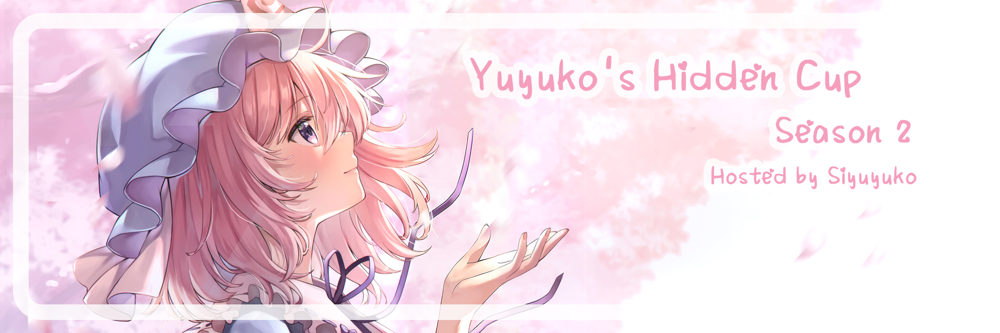
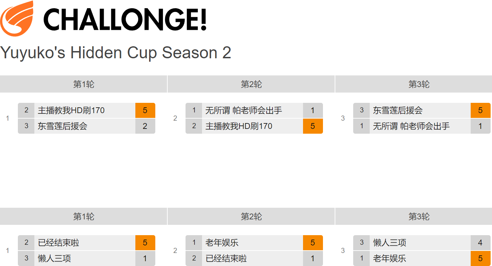
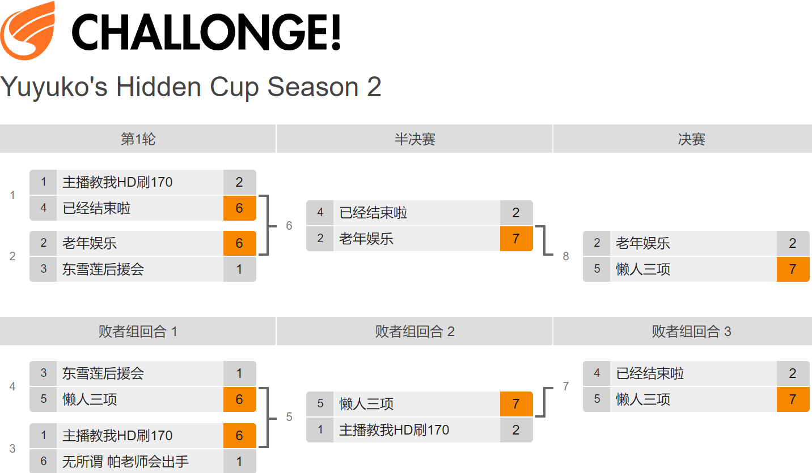

---
tags:
  - YHC S2
  - YHC
  - 幽幽杯
  - 幽幽子
---

# 第二届幽幽杯

**第二届幽幽杯** (***YHC S2***) 是基于 osu! 主模式，娱乐为主的多人 (3v3) 打图游玩锦标赛，主办是 ::{ flag=CN }:: [SIyuyuko](https://osu.ppy.sh/users/9794030)。这是该系列赛的第二届比赛。

## 时间安排

| 事项 | 时间 |
| --: | :-- |
| 报名阶段 | 2022-11-26/2022-12-25 |
| 分组 | 2022-12-25 (20:00 UTC+08) |
| 小组赛 | 2022-12-28/2023-1-8 |
| 淘汰赛第一轮 | 2023-1-11/2023-1-15 |
| 淘汰赛第二轮 | 2023-1-18/2023-2-5 |

## 奖励

| 名次 | 奖励 |
| :-: | :-- |
|  | 队内每个玩家获得随机的零食包（大约价值 USD 8）、一个非官方的主页奖牌 |
| *整场比赛的 MVP* | 1 个月的 osu! 支持者 |

## 组织

第二届幽幽杯由众多的社区成员举办。

| 职责 | 成员 |
| :-- | :-- |
| 主办 | ::{ flag=CN }:: [SIyuyuko](https://osu.ppy.sh/users/9794030) |
| 选图 | ::{ flag=CN }:: [SIyuyuko](https://osu.ppy.sh/users/9794030), ::{ flag=CN }:: [Muziyami](https://osu.ppy.sh/users/7003013) |
| 试图 | ::{ flag=CN }:: [SIyuyuko](https://osu.ppy.sh/users/9794030), ::{ flag=CN }:: [Muziyami](https://osu.ppy.sh/users/7003013) |
| 提供回放 | ::{ flag=CN }:: [Hakumo Shiro](https://osu.ppy.sh/users/5179557), ::{ flag=CN }:: [Hakumo Ai](https://osu.ppy.sh/users/694480), ::{ flag=CN }:: [VialVistas](https://osu.ppy.sh/users/9697708), ::{ flag=CN }:: [Crystal](https://osu.ppy.sh/users/1646397), ::{ flag=CN }:: [Sayori\_yui](https://osu.ppy.sh/users/7183040), ::{ flag=CN }:: [Senbe1](https://osu.ppy.sh/users/6911753), ::{ flag=CN }:: [carrywind](https://osu.ppy.sh/users/12228018) |
| 直播 | ::{ flag=CN }:: [SIyuyuko](https://osu.ppy.sh/users/9794030), ::{ flag=CN }:: [Muziyami](https://osu.ppy.sh/users/7003013) |
| 解说 | ::{ flag=CN }:: [SIyuyuko](https://osu.ppy.sh/users/9794030), ::{ flag=CN }:: [Muziyami](https://osu.ppy.sh/users/7003013) |
| 设计 | ::{ flag=CN }:: [Muziyami](https://osu.ppy.sh/users/7003013) |
| 裁判 | ::{ flag=CN }:: [SIyuyuko](https://osu.ppy.sh/users/9794030), ::{ flag=CN }:: [Muziyami](https://osu.ppy.sh/users/7003013) |
| 统计 | ::{ flag=CN }:: [Muziyami](https://osu.ppy.sh/users/7003013) |

## 链接

- [直播间](https://live.bilibili.com/21549800)
- [YHC 社区 QQ 群](https://jq.qq.com/?_wv=1027&k=4CVOhMz7)
- [对阵表](https://challonge.com/YHC_S2)
- **[统计主表格](https://docs.qq.com/sheet/DUkhYRERQUWVTY2lE?tab=v89kx8)**

## 选手

| 队伍代号 | 队名 | 成员 |
| :-: | :-: | :-- |
| **A** | **老年娱乐** | [**Spell**](https://osu.ppy.sh/users/13003552), [\_Yukinoshita](https://osu.ppy.sh/users/15343685), [HUYI520](https://osu.ppy.sh/users/15337997), [mike233333](https://osu.ppy.sh/users/15436106), [lizhanyiawa](https://osu.ppy.sh/users/13928307) |
| **B** | **无所谓 帕老师会出手** | [**QianLi1611**](https://osu.ppy.sh/users/30367809), [The Origin](https://osu.ppy.sh/users/10225377), [USAIKO](https://osu.ppy.sh/users/30018494), [AliceMana](https://osu.ppy.sh/users/11531025), [LimeSeptum](https://osu.ppy.sh/users/13256419) |
| **C** | **已经结束啦** | [**Ayaaaachi**](https://osu.ppy.sh/users/16022736), [innnnovation](https://osu.ppy.sh/users/18443135), [dawnstar](https://osu.ppy.sh/users/17426219), [eric1388](https://osu.ppy.sh/users/20384257), [Lzq12345](https://osu.ppy.sh/users/15012640) |
| **D** | **懒人三项** | [**RoyMaster**](https://osu.ppy.sh/users/28365836), [Sakura Luna](https://osu.ppy.sh/users/1608105), [cirnosaikyo](https://osu.ppy.sh/users/19971407), [small_pineapple](https://osu.ppy.sh/users/20989945), [\_Eilphy](https://osu.ppy.sh/users/15175276) |
| **E** | **主播教我HD刷170** | [**Neutron torpedo**](https://osu.ppy.sh/users/24657559), [SugersakiE](https://osu.ppy.sh/users/15091523), [Kevin0036](https://osu.ppy.sh/users/24004891), [qimengxunkong](https://osu.ppy.sh/users/16849347), [dongguadongde](https://osu.ppy.sh/users/28494479) |
| **F** | **东雪莲后援会** | [**Kieost**](https://osu.ppy.sh/users/17823832), [-XiAoyu](https://osu.ppy.sh/users/19061410), [Yin0508](https://osu.ppy.sh/users/15730382), [Zxian](https://osu.ppy.sh/users/20672564), [YuKiRoKi](https://osu.ppy.sh/users/16668536) |

## 分组

| A 组 | B 组 |
| :-- | :-- |
| **无所谓 帕老师会出手** | **老年娱乐** |
| **主播教我HD刷170** | **已经结束啦** |
| **东雪莲后援会** | **懒人三项** |

## 颁奖

本次比赛已经结束，颁奖结果如下：

| 名次 | 队伍 |
| :-: | :-- |
|  | **懒人三项** |
|  | **老年娱乐** |
|  | **已经结束啦** |

## 图池

### 淘汰赛第二轮 (Round 3)

**[在这里下载谱面包！(122.5 MB)](https://drive.google.com/file/d/12rFoRjc-raITz7Ib55JDOA9RHvwnEOmJ/view?usp=share_link)**

- Hidden
  1. [Hana - Sakura no Uta (Zekk) [Subahibi's Extra]](https://osu.ppy.sh/beatmapsets/1648596#osu/3468294)
  2. [Water Color Melody. - MotherGoose o Kikinagara (AdveNt) [Insane]](https://osu.ppy.sh/beatmapsets/1347987#osu/3113813)
  3. [BlackY feat. Risa Yuzuki - Shuumatsu Kinema (My Angel Jeremy) [Insane]](https://osu.ppy.sh/beatmapsets/1820113#osu/3735247)
  4. [69 de 74 - RTTR (Reywateil) [Xenon's Another]](https://osu.ppy.sh/beatmapsets/1447300#osu/3196719)
  5. [hitorie - Little Cry Baby (moph) [Insane]](https://osu.ppy.sh/beatmapsets/1098258#osu/2381878)
  6. [Sakamoto Maaya - Dokuhaku (Kalibe) [Insane]](https://osu.ppy.sh/beatmapsets/1426532#osu/2938608)
  7. [Silent Siren - LOVE no Shirushi (alacat) [Insane]](https://osu.ppy.sh/beatmapsets/122444#osu/313165)
- NoMod
  1. [nowisee - microser (bilibilicnm) [Extra]](https://osu.ppy.sh/beatmapsets/1456710#osu/3017432)
  2. [Metomate - Guren (Hey lululu) [lu^3 x lealu's Insane]](https://osu.ppy.sh/beatmapsets/1544987#osu/3157972)
- DoubleTime
  1. [Ylvis - The Fox (W h i t e) [Fox]](https://osu.ppy.sh/beatmapsets/119980#osu/307804)
  2. [kozato - Tsuki -Yue- (Gust) [kanor's Hard]](https://osu.ppy.sh/beatmapsets/1401651#osu/2896899)
  3. [Lana Del Rey - Summertime Sadness (piroshki) [A Sweet Kiss]](https://osu.ppy.sh/beatmapsets/1113209#osu/2325564)
- FreeMod
  1. [Charli XCX - Boom Clap (schoolboy) [Expert]](https://osu.ppy.sh/beatmapsets/730792#osu/1542345)
  2. [Soleily feat. SUNRaiSE - Rise Above (Nytrocide\_) [-Sylvari's Insane]](https://osu.ppy.sh/beatmapsets/1767895#osu/3661739)
  3. [Tokyo Jihen - Sounan (Uberzolik) [AIR's Insane]](https://osu.ppy.sh/beatmapsets/967321#osu/2033671)
- Tiebreaker
  1. **[DystopiaGround - AugoEidEs (jonathanlfj) [Angelic]](https://osu.ppy.sh/beatmapsets/136969#osu/342543)**

### 淘汰赛第一轮 (Round 2)

**[在这里下载谱面包！(121.4 MB)](https://drive.google.com/file/d/1nOrkgMX0pNqj9b-HgxLBjCc-pJF5FAEm/view?usp=share_link)**

- Hidden
  1. [BAND-MAID - I can’t live without you. (Lasse) [Insane]](https://osu.ppy.sh/beatmapsets/1093430#osu/2288966)
  2. [Lime - Renai Syndrome (apaffy) [Another]](https://osu.ppy.sh/beatmapsets/166062#osu/859667)
  3. [Sangatsu no Phantasia - Koufuku na Wagamama (Jiysea) [Insane]](https://osu.ppy.sh/beatmapsets/1478828#osu/3035501)
  4. [M2U - Promise (feat. Sherie) (Ultima Fox) [Serenity]](https://osu.ppy.sh/beatmapsets/1005492#osu/2104403)
  5. [Toromaru - Enigma (Avena) [EXHAUST]](https://osu.ppy.sh/beatmapsets/460380#osu/1003687)
  6. [senya - Sono Kami no Dilemma ni (Serafeim) [Wheel of Misfortune]](https://osu.ppy.sh/beatmapsets/1391331#osu/2872872)
- NoMod
  1. [Vivy (CV: Yagi Kairi) - Sing My Pleasure (Andrea) [Collab Insane]](https://osu.ppy.sh/beatmapsets/1470500#osu/3019025)
  2. [Run Girls, Run! - Share the light (Amateurre) [Shizurre's Insane]](https://osu.ppy.sh/beatmapsets/1693654#osu/3461651)
- DoubleTime
  1. [senya - Hitorishizuka (Satellite) [Satellite]](https://osu.ppy.sh/beatmapsets/95839#osu/261417)
  2. [Silver Forest Feat. Aki & Sakura Mayuko - Summer time Heaven -after (RVMathew) [Lunatic Lite]](https://osu.ppy.sh/beatmapsets/729279#osu/1554793)
- FreeMod
  1. [Akatsuki Records - Silent Silence Siren (Zelq) [Rolniczy's Insane]](https://osu.ppy.sh/beatmapsets/866443#osu/1824472)
  2. [Good Kid - Slingshot (wafer) [Crowley's Insane]](https://osu.ppy.sh/beatmapsets/1802930#osu/3739576)
  3. [cadode - Kaika (VINXIS) [Shadows]](https://osu.ppy.sh/beatmapsets/1754413#osu/3590290)
- Tiebreaker
  1. **[earthmind - Another Heaven (Kalibe) [Sakura]](https://osu.ppy.sh/beatmapsets/571626#osu/1308941)**

### 小组赛 (Round 1)

**[在这里下载谱面包！(103 MB)](https://drive.google.com/file/d/16EGRC4DnalO_YEiENcBLBTi9H05XcHiE/view?usp=share_link)**

- Hidden
  1. [Wakeshima Kanon - world's end, girl's rondo (Agatsu) [Irohas' Insane]](https://osu.ppy.sh/beatmapsets/997439#osu/2089366)
  2. [dj TAKA - snow storm (Oracle) [Another]](https://osu.ppy.sh/beatmapsets/151033#osu/372448)
  3. [Tsukuyomi - Dareka no Shinzou ni Nareta nara (Mononymous) [too's Insane]](https://osu.ppy.sh/beatmapsets/1544600#osu/3239199)
  4. [:) feat. KAFU - Alma (Ducky-) [Insane]](https://osu.ppy.sh/beatmapsets/1677752#osu/3448129)
  5. [kessoku band - Guitar to Kodoku to Aoi Hoshi (ponbot) [Ame's Insane]](https://osu.ppy.sh/beatmapsets/1880007#osu/3902695)
  6. [DJ YOSHITAKA - Evans (Leader) [vikala's Insane]](https://osu.ppy.sh/beatmapsets/1023491#osu/2141049)
- NoMod
  1. [Limonene - (please) replay (Realazy) [(lasse's) insane]](https://osu.ppy.sh/beatmapsets/1279941#osu/2661092)
  2. [yanaginagi - Usotsuki (Cellina) [Collab Insane]](https://osu.ppy.sh/beatmapsets/1791297#osu/3743459)
- DoubleTime
  1. [Marina and the Diamonds - Teen Idle (-Waterlemon) [Hard]](https://osu.ppy.sh/beatmapsets/1784342#osu/3675891)
  2. [Gesu no Kiwami Otome. - Digital Mogura (dsco) [Hard]](https://osu.ppy.sh/beatmapsets/737340#osu/2587641)
- FreeMod
  1. [Silver Forest - Kero (9) destiny (Bloxi) [Kloster's Lunatic]](https://osu.ppy.sh/beatmapsets/1670776#osu/3424391)
  2. [MindaRyn - Like Flames (MajK00) [AkagEnu's Insane]](https://osu.ppy.sh/beatmapsets/1693866#osu/3521488)
  3. [BlackY feat. Risa Yuzuki - Stellalude (Hinsvar) [Insane]](https://osu.ppy.sh/beatmapsets/1515209#osu/3139469)
- Tiebreaker
  1. **[Marika - Truth and Light (ponbot) [gazimal’s Insane]](https://osu.ppy.sh/beatmapsets/1594534#osu/3256904)**

## 比赛结果

### 淘汰赛第二轮 (Round 3)

| 队伍 1 |  |  | 队伍 2 | 比赛链接 |
| --: | :-: | :-: | :-- | :-- |
| 已经结束啦 ::{ flag=CN }:: | 2 | **7** | ::{ flag=CN }:: **老年娱乐** | [#1](https://osu.ppy.sh/community/matches/106494978) |
| 主播教我HD刷170 ::{ flag=CN }:: | 2 | **7** | ::{ flag=CN }:: **懒人三项** | [#1](https://osu.ppy.sh/community/matches/106474264) |
| 已经结束啦 ::{ flag=CN }:: | 2 | **7** | ::{ flag=CN }:: **懒人三项** | [#1](https://osu.ppy.sh/community/matches/106647542) |
| 老年娱乐 ::{ flag=CN }:: | 2 | **7** | ::{ flag=CN }:: **懒人三项** | [#1](https://osu.ppy.sh/community/matches/106652243) |

### 淘汰赛第一轮 (Round 2)

| 队伍 1 |  |  | 队伍 2 | 比赛链接 |
| --: | :-: | :-: | :-- | :-- |
| 主播教我HD刷170 ::{ flag=CN }:: | 2 | **6** | ::{ flag=CN }:: **已经结束啦** | [#1](https://osu.ppy.sh/community/matches/106265442) |
| **老年娱乐**::{ flag=CN }:: | **6** | 1 | ::{ flag=CN }:: 东雪莲后援会 | [#1](https://osu.ppy.sh/community/matches/106245589) |
| **主播教我HD刷170** ::{ flag=CN }:: | **6** | 1 | ::{ flag=CN }:: 无所谓 帕老师会出手 | [#1](https://osu.ppy.sh/community/matches/106267609) |
| 东雪莲后援会 ::{ flag=CN }:: | 1 | **6** | ::{ flag=CN }:: **懒人三项** | [#1](https://osu.ppy.sh/community/matches/106288941) |

### 小组赛 (Round 1)

#### A 组

| 队伍 1 |  |  | 队伍 2 | 比赛链接 |
| --: | :-: | :-: | :-- | :-- |
| 无所谓 帕老师会出手 ::{ flag=CN}:: | 1 | **5** | ::{ flag=CN }:: **主播教我HD刷170** | [#1](https://osu.ppy.sh/community/matches/105951662) |
| **主播教我HD刷170** ::{ flag=CN }:: | **5** | 2 | ::{ flag=CN }:: 东雪莲后援会 | [#1](https://osu.ppy.sh/community/matches/105992915) |
| **东雪莲后援会** ::{ flag=CN }:: | **5** | 1 | ::{ flag=CN }:: 无所谓 帕老师会出手 | [#1](https://osu.ppy.sh/community/matches/106089411) |

#### B 组

| 队伍 1 |  |  | 队伍 2 | 比赛链接 |
| --: | :-: | :-: | :-- | :-- |
| **老年娱乐** ::{ flag=CN }:: | **5** | 1 | ::{ flag=CN }:: 已经结束啦 | [#1](https://osu.ppy.sh/community/matches/105975299) |
| **已经结束啦** ::{ flag=CN }:: | **5** | 1 | ::{ flag=CN }:: 懒人三项 | [#1](https://osu.ppy.sh/community/matches/105990432) |
| 懒人三项 ::{ flag=CN }:: | 4 | **5** | ::{ flag=CN }:: **老年娱乐** | [#1](https://osu.ppy.sh/community/matches/106113040) |

## 规则

### 常规

1. 幽幽杯 (The Yuyuko's Hidden Cup) 是基于 osu! 主模式，娱乐为主的多人 (3v3) 打图游玩锦标赛。
2. 谱面计分基于 Score V2 系统。
3. 基于报名的选手数量，**每队限制为 5 名选手**。
4. 每轮比赛结束后的周末（周五 12:00 - 周一 23:00），选图员将在官方直播间公布下一轮的图池。
5. 每轮的默认比赛时间将由主办在周日最后一场比赛开始后，于主表格中公布，队长可以在公布后的比赛周的周一到周五内（周六 00:00 UTC+8 之前）与对手商量，并确定好修改后的比赛时间。
6. 允许在打图时使用视觉设置 (Visual Settings) 关闭谱面故事板、视频或是将谱面暗化拉到 100%。
   - 自定义皮肤元素不得以非预期的方式来改变游戏核心的玩法和机制。
7. 如果比赛开始时，某一方选手数量少于游戏进行所需的最少玩家数量，比赛可以推迟 10 分钟。如果推迟后，此方选手数量仍旧少于游戏进行所需的最少玩家数量，则判对方默认获胜 (Win by default)。
   - 所需的最少玩家数量，是指在房间中没有任何空位的情况下，开启一场对局所需的玩家数量（即在 3v3 比赛开始前，某一方必须有 3 名选手在场）。
8. 一场比赛中的对局前后，允许无条件更换队伍内其他选手。
9. 如果某个对局出现了平局，则该局作废，重赛一局。
10. 比赛开始后 30 秒以内，或者谱面还未游玩至 25% (取决于哪一项时间更短)，此时如果选手遇到了技术上的问题，可以私聊这场比赛的裁判请求重赛。裁判可以允许或者拒绝这次重赛请求。
    - “打图卡顿”不能作为请求重赛的理由。
    - 重赛时的对阵选手必须和重赛前的对局完全一样。如果需要重赛的选手因为网络原因无法进入房间，此时，两队即可更换对阵选手。
    - 此条重赛规则不可滥用。如果裁判认为你是故意利用规则，将有权利拒绝你的重赛请求。
11. 如果选手在对局开始后，断开与服务器的链接 (具体显示在观赛端黑屏，或是黑屏后离开对局)，则需要在该场对局打完后，向主办方提供可信服的证据。否则将不计入队伍成绩。
    - 选手可提供直播时的第一人称录播切片。录播需要录制到玩家的屏幕。
    - 选手可以提供游戏回放文件，通过从被影响的选手的客户端的“本地”选项卡下获取到（成绩的时间戳必须与比赛链接中，该场对局的时间戳完全匹配）。
    - 房间内的其他选手可以直接在游戏中截图，显示被影响选手的分数。
      - 在结算界面的截图必须清晰展示被影响选手的分数。推荐使用这种方法。
      - 被影响选手可提供断连时，在游戏中按下 F12 截下的图。注意，在游戏中截下的图上所示的分数，不能直接算入该队的总分。并且，不推荐使用这种方法。如果这张截图不足以证明是该名选手断连时的截图，则裁判可自行决定。
      - 所有截图**必须**使用 `Shift` + `F12` 上传到 osu! 官网。必须保证网络截图的域名是 `https://osu.ppy.sh/` 。其他域名的截图无效。
    - 如果比赛正在直播，那么作为最后的手段，可以从直播的观赛端读取选手最后留下的分数。
12. 选手应协助比赛顺畅进行，尽量少因为网络问题而延误。如果某一队的延误情况严重，则可能受到裁判或主办的惩罚。严禁犯规、侮辱或者挑衅其他选手或者裁判、主办、工作人员等，严禁故意拖延比赛或扰乱比赛。相应者会受到处罚。
13. 应该尊重所有选手或者裁判、主办、工作人员等人。必须遵守裁判和主办的意见，不得反驳他们提出的最终决定。
14. 比赛将在 osu! 官方服务器进行。因此，在多人游戏房间中，必须遵守 [osu! 社区守则](/wiki/Rules)。
    - 如果有刷屏等等的行为，选手将会被禁言。他们无法进入比赛房间。只能派上其他选手替代他的位置。
15. 违反比赛规则的处罚包括但不限于：
    - 禁止某位选手上一张图。
    - 禁止某位选手参加整场比赛。
    - 宣布比赛结束，另一队默认获胜 (Win by default)。
    - 取消全队比赛资格。
    - 取消全队当前和未来的官方比赛资格，直至队伍上诉。
16. 裁判可自行决定计时指令 (!mp timer) 到点后的额外放水时间。
17. 主办方可能不会提前告知，并要求部分选手录制或直播自己的比赛和操作。
18. 主办方保留可随时修改这些规则的权利。修改规则时会提前告知。

### 报名

1. 符合报名条件的选手可直接在[报名表](https://docs.qq.com/form/page/DUm5TSlRpTG11WHdx)中填写信息完成报名。报名表将于 2022年12月25日 关闭。
2. 报名条件
   - pp 限制：2000pp - 4500pp
3. 当选手成功报名后，将计算并获得一个**费用**。它会影响之后的组队环节。

### 组队

1. 每队应组入 5 名参赛选手 (包括队长)。
2. 队伍的费用之和应处于 4.8 费到 5.2 费之间 (包括边界值)。
3. 请尽量确保队伍的费用之和为 5，避免超过以上限制。如果有队伍的费用超出限制，则主办将下场调整。
4. 当队伍组好，队长即可向主办发送队伍名称和队伍旗帜。
   - 队旗和队名应遵守 [osu! 社区守则](/wiki/Rules)。不允许使用露骨、诽谤、侮辱、贬损、人身攻击和政治攻击的队名或队旗。
   - 推荐队旗尺寸：270 * 180px，PNG 文件格式。
5. 未能在小组赛图池展示 (Showcase) 之前组好队的选手，主办将介入并完成这些选手的组队任务。
6. 一般来说，队内**费用最高**的选手应担任队长的职务。如果队内其他选手想担任队长，并获得了该队将被替换的队长和主办方的同意，即可以更换队长职务。
7. 队长应对自己的队伍负责。如果有队长玩忽职守，未能尽责，主办方将可能会作出处罚，并通知其他国内相关比赛的工作人员。

### 比赛阶段

1. 小组赛中，6 支队伍将按骰子点数大小分成 A/B 两组。组内 3 队互相进行 3 场比赛。
2. 小组赛后，将进行双败淘汰赛。小组赛组内前两名队伍将进入胜者组，最后一名进入败者组（并轮空一轮）。
3. 胜者组内获胜的队伍将晋级下一阶段的胜者组比赛，胜者组内惜败的队伍将进入下一阶段的败者组比赛。如果再次失败，队伍将被淘汰出局。

### 获胜条件

1. 小组赛中，没有队伍会被淘汰。小组赛的结果只会影响淘汰赛中的位置。
2. 小组赛 (Round 1) 图池将为 BO9 (九局五胜)。
3. 淘汰赛第一轮 (Round 2) 图池将为 BO11 (十一局六胜)。
4. 淘汰赛第二轮 (Round 3) 图池将为 BO13 (十三局七胜)。
   - *注意：与 OWC 锦标赛规则不同，在总决赛中，败者组冠军队伍想要获得最终的冠军，只需要赢下一场比赛，与胜者组冠军队伍获胜的条件一样。*

### 比赛流程

1. 在确定好的比赛开始前 10 分钟，裁判会创建对应的多人游戏房间。选手需要在这个时间内进入房间准备比赛。
   - 用于比赛的房间的参数应设定为：`游戏模式："osu!"`、`组队模式："Team Vs"`、 `计分模式："ScoreV2"`。用于比赛的房间名格式应为：`YHCS2: ({红队队名}) VS ({蓝队队名})`。VS 左侧的队伍是红队，右侧的队伍是蓝队。
2. 在比赛所有阶段内，两支队伍能在图池中挑选并**禁掉一张图** (1 Ban)。被禁掉的图在该场比赛中都不能选用。
3. 两支队伍的队长需要在比赛房间里至少使用一次 `!roll` 指令。
   - 对于 `!roll` 点数较大的队伍，队长能够决定他所在的队伍是先**选图**还是先**禁图**。
   - 队伍可以“双选” (一直选) 同一模组的图 (指在上一属于自己队伍选图的对局时选了一张图，在下一次属于自己队伍选图的对局时，选了与上一张图属于同一模组的另外一张图)。
   - 对于 `!roll` 点数较小的队伍，他们选图禁图的先后顺序由 `!roll` 点数较大的队伍所决定。
4. 禁好图后，两队将开始挑选 (Pick) 赛图。
5. 两支队伍都有 2 分钟可用于选图，并有 2 分钟等待选手在客户端里按下 `准备` 按钮。如果队伍超时，流程将会：
   - 第一次超时：
     - 裁判将会口头警告。
   - 多次超时：
     - 选图超时：裁判将使用 `!roll X` 命令（x 是剩余可挑选，除去决胜图 (TB) 的图数量）来随机挑选一张图池内剩余的图。
     - 准备超时：裁判将不管实际的对阵情况，使用 `!mp kick` 指令优先踢出房间内某队超过应上场人数的选手，确定场上剩余的选手处于正确的位置（固定每个队合乎赛图要求的首选对阵），并直接使用 `!mp start 10` 强制开启对局。结算的成绩将作为该局的结果。
     - 多次超时将受到主办更严重的处罚。
6. 两支队伍有申请一次*技术性暂停*的机会 (2 分钟)。可用来作出决策或是应对突发状况。*技术性暂停完全是自愿的。*
   - 决胜图 (TB) 之前，如果双方队长同意，则可以附加一次技术性暂停。

### 图池

1. 一个阶段只会有一个图池。
2. 每个图池都拥有固定的 4 个模组池：[No Mod](/wiki/Gameplay/Game_modifier#无模组-(no-mod))、[Hidden](/wiki/Gameplay/Game_modifier/Hidden)、[Double Time](/wiki/Gameplay/Game_modifier/Double_Time)、[FreeMod](/wiki/Gameplay/Game_modifier#自由选择模组-(free-mod)).
3. 图池所含的赛图数量：
   - 小组赛 (Round 1) 和淘汰赛第一轮 (Round 2)：14 张谱面：6 HD、2 NM、2 DT、3 FM、1 TB
   - 淘汰赛第二轮 (Round 3)：16 张谱面：7 HD、2 NM、3 DT、3 FM、1 TB
4. Hidden 和 Double Time 模组池将强制所有选手开启对应的模组。
   - 在 Double Time 模组池内，选手可以同时开启 Hidden。
5. 强制在所有对局中使用 No Fail 模组。
6. FreeMod 模组池将允许按照规则，“自由”选择并使用模组。
   - 可供选择的模组搭配有：Hidden、Hard Rock、Hidden + Hard Rock。
   - **当选择 FreeMod 模组池时，必须有 1 名玩家仅使用 Hidden 模组，至少 2 名玩家使用以上的模组搭配。剩下的那名玩家则可自由选择是否开启模组。**
7. 决胜图 (TB) 将按照 FreeMod 规则进行，但没有以上那些模组池内的强制要求。

### 时间安排

1. 每个比赛阶段将持续**一周或者两周**。
2. 所有比赛都可在周三的 00:00 到 周日的 22:00 UTC+8 之内举行。
3. 主办方将会根据选手们的时区或是偏好，在周日，即周内最后一场比赛打完后，安排比赛的默认开赛时间。
   - 此外，每支队伍的队长也可以预先向主办方或是对方的队长告知队伍无法参赛的时间段。
4. **只有两队都同意，并将可比赛的时间在比赛周的星期五 23:59 UTC+8 之前告知主办，才能算是成功重新安排比赛日程。**
   - 比赛时间不得晚于这周**周日的 22:00 UTC+8**。
   - **主办方有拒绝重新调整比赛开始时间的权利。除非必要，最好不要重新调整时间。**
   - 任何情况下，不接受过晚的比赛时间重新安排请求。
5. 队长需要负责确保自己队伍内的选手是否可以准时上场。
