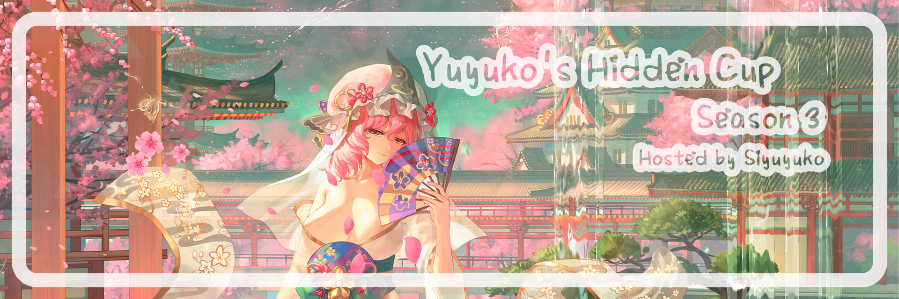
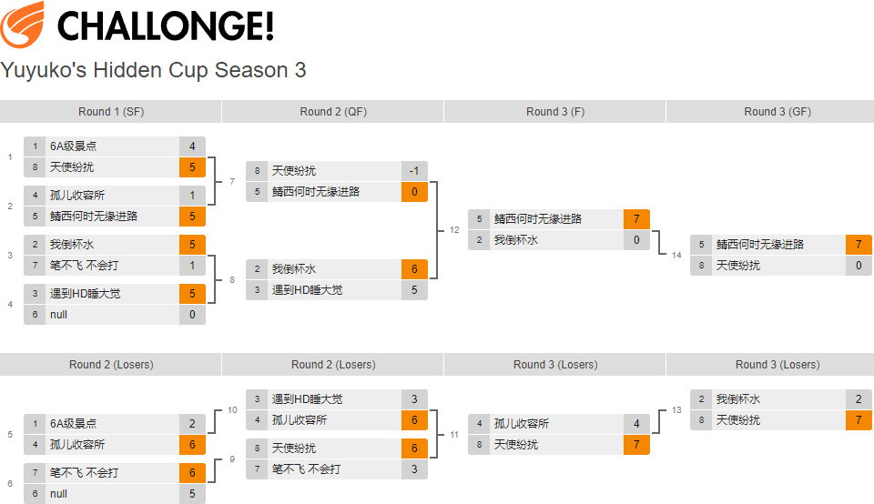

---
tags:
  - YHC S3
  - YHC
---

# Yuyuko's Hidden Cup Season 3

The **Yuyuko's Hidden Cup Season 3** (***YHC S3***) was a team-based 4v4 double-elimination osu! tournament hosted by ::{ flag=CN }:: [SIyuyuko](https://osu.ppy.sh/users/9794030). It was the 3rd instalment of the Yuyuko's Hidden Cup.

## Tournament schedule

| Event | Timestamp |
| --: | :-- |
| Registration phase | 2023-06-01/2023-06-15 |
| Drawings | 2023-06-16 (20:00 UTC+8) |
| Elimination stage 1 | 2023-06-16/2023-06-25 |
| Elimination stage 2 | 2023-06-26/2023-07-09 |
| Elimination stage 3 | 2023-07-10/2023-07-29 |

## Prizes

| Placing | Prize(s) |
| :-: | :-- |
|  | USD 4.8 per player, an unofficial badge |
|  | USD 3.4 per player |
|  | USD 2 per player |
| *the most valuable person of the tournament (MVP)* | 1 month of osu!supporter |
| *the coach of winner team* | 1 month of osu!supporter |
| *the MVP of the tournament (under 3200 pp)* | 1 month of osu!supporter |

## Organisation

The Yuyuko's Hidden Cup Season 3 was run by various community members.

| Position | Member(s) |
| :-- | :-- |
| Manager | ::{ flag=CN }:: [SIyuyuko](https://osu.ppy.sh/users/9794030) |
| Mappool selector | ::{ flag=CN }:: [SIyuyuko](https://osu.ppy.sh/users/9794030), ::{ flag=CN }:: [Muziyami](https://osu.ppy.sh/users/7003013) |
| Mappool playtester | ::{ flag=CN }:: [SIyuyuko](https://osu.ppy.sh/users/9794030), ::{ flag=CN }:: [Muziyami](https://osu.ppy.sh/users/7003013) |
| Showcaser | ::{ flag=CN }:: [Hakumo Shiro](https://osu.ppy.sh/users/5179557), ::{ flag=CN }:: [Hakumo Ai](https://osu.ppy.sh/users/694480), ::{ flag=CN }:: [VialVistas](https://osu.ppy.sh/users/9697708), ::{ flag=CN }:: [Sayori\_yui](https://osu.ppy.sh/users/7183040), ::{ flag=CN }:: [Senbe1](https://osu.ppy.sh/users/6911753), ::{ flag=CN }:: [carrywind](https://osu.ppy.sh/users/12228018) |
| Streamer | ::{ flag=CN }:: [SIyuyuko](https://osu.ppy.sh/users/9794030), ::{ flag=CN }:: [Muziyami](https://osu.ppy.sh/users/7003013) |
| Commentator | ::{ flag=CN }:: [SIyuyuko](https://osu.ppy.sh/users/9794030), ::{ flag=CN }:: [Muziyami](https://osu.ppy.sh/users/7003013) |
| Designer | ::{ flag=CN }:: [Muziyami](https://osu.ppy.sh/users/7003013) |
| Referee | ::{ flag=CN }:: [SIyuyuko](https://osu.ppy.sh/users/9794030), ::{ flag=CN }:: [Muziyami](https://osu.ppy.sh/users/7003013) |
| Statistician | ::{ flag=CN }:: [Muziyami](https://osu.ppy.sh/users/7003013) |

## Links

- [Discussion thread](https://osu.ppy.sh/community/forums/topics/1772679)
- [Livestream](https://live.bilibili.com/21549800)
- [YHC Community QQ Group](https://jq.qq.com/?_wv=1027&k=4CVOhMz7)
- [Challonge bracket](https://challonge.com/YHC_S3)
- **[Statistics sheet](https://docs.google.com/spreadsheets/d/1CpOzFz98lkTaGbur7fCLoLuvJQnO4VKomUvPktYVl_c)**

## Participants

| Team code | Team name | Members |
| :-: | :-: | :-- |
| **A** | **null** | [**Arca Lunar**](https://osu.ppy.sh/users/13888511), [mura sama](https://osu.ppy.sh/users/9527178), [Pcioafk](https://osu.ppy.sh/users/13228763), [yukko233](https://osu.ppy.sh/users/28804123), [wjs255](https://osu.ppy.sh/users/29856978), [qimengxunkong](https://osu.ppy.sh/users/16849347), [Endless fare](https://osu.ppy.sh/users/8580156) |
| **B** | **我倒杯水** | [**n0000000000o**](https://osu.ppy.sh/users/12215328), [yukishize](https://osu.ppy.sh/users/11736169), [cd20200816](https://osu.ppy.sh/users/18118155), [EYii](https://osu.ppy.sh/users/26977726), [FiresunX](https://osu.ppy.sh/users/25578225), [Aokreti](https://osu.ppy.sh/users/27321919), [akuya](https://osu.ppy.sh/users/25089015) |
| **C** | **6A级景点** | [**FlyingYellow**](https://osu.ppy.sh/users/25776202), [goyhan](https://osu.ppy.sh/users/30314890), [Avogadoll](https://osu.ppy.sh/users/32609690), [-aLIEz-](https://osu.ppy.sh/users/31372295), [YamadaJ](https://osu.ppy.sh/users/13413713), [ArleneRain\_](https://osu.ppy.sh/users/19673275), [[Alex]](https://osu.ppy.sh/users/28776271) |
| **D** | **鲭西何时无缘进路** | [**innnnovation**](https://osu.ppy.sh/users/18443135), [Natsukaze](https://osu.ppy.sh/users/29046592), [Refu3](https://osu.ppy.sh/users/24013879), [eric1388](https://osu.ppy.sh/users/20384257), [TomCh](https://osu.ppy.sh/users/13863127), [ElectroTD](https://osu.ppy.sh/users/6955595), [Kallen0401](https://osu.ppy.sh/users/32620473) |
| **E** | **天使纷扰** | [**7R1N1TY**](https://osu.ppy.sh/users/12803951), [SouJuku](https://osu.ppy.sh/users/20403654), [Asp1er](https://osu.ppy.sh/users/17392497), [zhuiyi_crane](https://osu.ppy.sh/users/24365691), [MizukiQwQ](https://osu.ppy.sh/users/15154497), [Fungus OVO](https://osu.ppy.sh/users/4928835), [Lfruin](https://osu.ppy.sh/users/18165022) |
| **F** | **遇到HD睡大觉** | [**fate80016**](https://osu.ppy.sh/users/8471476), [rtconsuming](https://osu.ppy.sh/users/8500047), [MAPSILL](https://osu.ppy.sh/users/31956309), [FeD4kTo](https://osu.ppy.sh/users/31483691), [SansX](https://osu.ppy.sh/users/29735986), [iz6](https://osu.ppy.sh/users/26093361), [Dawintch](https://osu.ppy.sh/users/9948405) |
| **G** | **笔不飞 不会打** | [**Kieost**](https://osu.ppy.sh/users/17823832), [sion22](https://osu.ppy.sh/users/30137844), [Zxian](https://osu.ppy.sh/users/20672564), [xxbg](https://osu.ppy.sh/users/31833376), [chana](https://osu.ppy.sh/users/18375016), [Lemen](https://osu.ppy.sh/users/28120802), [K_vAE](https://osu.ppy.sh/users/8756045) |
| **H** | **孤儿收容所** | [**Niumaokun**](https://osu.ppy.sh/users/16227180), [Alymetic](https://osu.ppy.sh/users/19287762), [LingYuanOvO](https://osu.ppy.sh/users/23805648), [1224192602](https://osu.ppy.sh/users/13089663), [lizhanyiawa](https://osu.ppy.sh/users/13928307), [CyberBunnyGirl](https://osu.ppy.sh/users/11531025), [magic\_\_sunny](https://osu.ppy.sh/users/13323610) |

## Coaches

| Team name | Coach name |
| :-- | :-- |
| **null** | [**RoyMaster**](https://osu.ppy.sh/users/28365836) |
| **我倒杯水** | [**Celia-Claire**](https://osu.ppy.sh/users/12790121) |
| **6A级景点** | [**ShandenOnter**](https://osu.ppy.sh/users/13999223) |
| **鲭西何时无缘进路** | [**VialVistas**](https://osu.ppy.sh/users/9697708) |
| **天使纷扰** | [**Kotor1**](https://osu.ppy.sh/users/2351439) |
| **遇到HD睡大觉** | [**Stick_Fish**](https://osu.ppy.sh/users/13358640) |
| **笔不飞 不会打** | [**Sakura Luna**](https://osu.ppy.sh/users/1608105) |
| **孤儿收容所** | [**-spring night-**](https://osu.ppy.sh/users/17064371) |

## Podium

This competition has come to an end and resulted in the following podium:

| Placing | Team |
| :-: | :-- |
|  | **鲭西何时无缘进路** |
|  | **天使纷扰** |
|  | **我倒杯水** |

## Mappools

### Elimination stage 3

**[Download the mappack here! (167.2 MB)](https://drive.google.com/file/d/1fIR_oDrImtjRc4TGrI5cLXjxuWwoI5LT/view?usp=sharing)**

- Hidden
  1. [mimimemeMIMI - Sayonara Usotsuki (Mikii) [Elvcho's Insane]](https://osu.ppy.sh/beatmapsets/395359#osu/1089478)
  2. [Seiryu - Ultramarine (RLC) [Another]](https://osu.ppy.sh/beatmapsets/107377#osu/281389)
  3. [ShinRa-Bansho - Charisma Rengoku Tenshin (gazimal) [My Angel Jeremy's Insane]](https://osu.ppy.sh/beatmapsets/1808183#osu/3754744)
  4. [Innocent Key - Lunatic Red Eyes (Entry) [Lunatic]](https://osu.ppy.sh/beatmapsets/1879868#osu/3888520)
  5. [Veil of Maya - Mikasa (Bergy) [DavidEd's Insane]](https://osu.ppy.sh/beatmapsets/480298#osu/1215683)
  6. [He Xian Ren - Dai Ni Hui Jia (Decay Limerence) [Expert]](https://osu.ppy.sh/beatmapsets/1463612#osu/3479138)
  7. [Satsuki ga tenkomori feat. kana - Famima Akihabara-ten ni haittara tenshon ga agatta (yf_bmp) [FamilyMart]](https://osu.ppy.sh/beatmapsets/1871448#osu/3850639)
- NoMod
  1. [la la larks - Massive Passive (Kalibe) [collab insane]](https://osu.ppy.sh/beatmapsets/1092295#osu/2296463)
  2. [Powerless feat. kakichoco - Aspirin (Some Hero) [Insane]](https://osu.ppy.sh/beatmapsets/1550470#osu/3171420)
- DoubleTime
  1. [IAHN - Candy Luv (Monstrata) [Insane]](https://osu.ppy.sh/beatmapsets/491033#osu/1046489)
  2. [HiTECH NINJA - Modelista (-jordan-) [Misery's Present Lv.6]](https://osu.ppy.sh/beatmapsets/1148442#osu/2945043)
  3. [EMA - God-ish (SMOKELIND) [xidorn's Hard]](https://osu.ppy.sh/beatmapsets/1693123#osu/3463053)
- FreeMod
  1. [Link"0 - Finixtahv (Ryuusei Aika) [Pigeons' Insane]](https://osu.ppy.sh/beatmapsets/1752805#osu/3670563)
  2. [Mefjus - Blitz (Cut Ver.) (DeRandom Otaku) [Insane]](https://osu.ppy.sh/beatmapsets/1869512#osu/3846436)
  3. [solfa feat. Shimotsuki Haruka - leap in your mind (Dored) [Mirash's Extra]](https://osu.ppy.sh/beatmapsets/911281#osu/1996858)
- Tiebreaker
  1. **[Dark PHOENiX - Yuuga ni Sakase, Sumizome no Sakura (Muziyami) [Untouchable Hidden Border]](https://osu.ppy.sh/beatmapsets/2022219#osu/4211648)**

### Elimination stage 2

**[Download the mappack here! (99.6 MB)](https://drive.google.com/file/d/1AP5fzu3o7O27MBfsM6quPvfJiVex_r6g/view?usp=sharing)**

- Hidden
  1. [BAND-MAID - RINNE (ShirohaMyMommy) [INSANE]](https://osu.ppy.sh/beatmapsets/1193063#osu/2485990)
  2. [Electro.muster feat. Rita - Dream Walker (Amamya) [Collab Insane]](https://osu.ppy.sh/beatmapsets/1907777#osu/3983420)
  3. [KNOWER - The Government Knows (Pachiru) [Insane]](https://osu.ppy.sh/beatmapsets/1075602#osu/2250658)
  4. [ATARASHII GAKKO! - Koi Geba (Pigeons) [NcFix's Insane]](https://osu.ppy.sh/beatmapsets/1699465#osu/3741633)
  5. [Se-U-Ra - Qlifact -another- (Nao Tomori) [Insane]](https://osu.ppy.sh/beatmapsets/1224699#osu/2592215)
  6. [Frederic - oddloop (Komore) [collab insane feat. dailycare]](https://osu.ppy.sh/beatmapsets/595899#osu/1262582)
- NoMod
  1. [Annabel - howl (Weoweet) [sebas' insane]](https://osu.ppy.sh/beatmapsets/1779373#osu/3667656)
  2. [Gesu no Kiwami Otome. - Romance ga Ariamaru (vikala) [Agatsu & Maestro's Insane]](https://osu.ppy.sh/beatmapsets/856645#osu/2706721)
- DoubleTime
  1. [Jay Chou - Rice Field (Jiezi) [Muz's Pleasant Field]](https://osu.ppy.sh/beatmapsets/1682452#osu/3464150)
  2. [Halozy - 143 (extended mix) (celerih) [Hard]](https://osu.ppy.sh/beatmapsets/1132649#osu/2365787)
- FreeMod
  1. [San Wu Marblue - Xiao Yao Xian (Narcissu) [An]](https://osu.ppy.sh/beatmapsets/1690033#osu/3453677)
  2. [O2i3 - Heart Function (VINXIS) [vikala's Insane]](https://osu.ppy.sh/beatmapsets/1133480#osu/2368769)
  3. [syrela - Pulsation (Lasse) [Expert]](https://osu.ppy.sh/beatmapsets/677886#osu/1433497)
- Tiebreaker
  1. **[ZAQ - ASEED (Anxient) [Insane]](https://osu.ppy.sh/beatmapsets/1786219#osu/3661903)**

### Elimination stage 1

**[Download the mappack here! (94.6 MB)](https://drive.google.com/file/d/1q2Wo1k31mUWTcWBX1n0P-PP-f3ekcKVH/view?usp=sharing)**

- Hidden
  1. [\*namirin - Hitokoto no Kyori (sahuang) [Linadeft's Insane]](https://osu.ppy.sh/beatmapsets/667290#osu/1411984)
  2. [A.SAKA - Nanatsu Myoukakitsubata (August) [Kaguya_Sama's Another]](https://osu.ppy.sh/beatmapsets/1889202#osu/3954370)
  3. [Kotoha - Zecchou Sanka (achyoo) [Agllius' Insane]](https://osu.ppy.sh/beatmapsets/1862243#osu/3837066)
  4. [EMA x sekai - Yoru no Jihanki (seros) [S_Saika's Insane]](https://osu.ppy.sh/beatmapsets/1871812#osu/3888754)
  5. [kessoku band - Karakara (captin1) [ponbot's Insane]](https://osu.ppy.sh/beatmapsets/1876958#osu/3891085)
  6. [siinamota - sasameku (remodel for alpa) (Renumi) [insane]](https://osu.ppy.sh/beatmapsets/1674914#osu/3421505)
- NoMod
  1. [Manami Numakura - Sakebe (Mishima Yurara) [Kalibe's Insane]](https://osu.ppy.sh/beatmapsets/550344#osu/1187324)
  2. [HOYO-MiX - A Glorious Awakening (Ascended) [Nereid's Ascension]](https://osu.ppy.sh/beatmapsets/1727638#osu/3530499)
- DoubleTime
  1. [ClariS - Hirahira Hirara (Yasaija 714) [Sakura]](https://osu.ppy.sh/beatmapsets/1784342#osu/3675891)
  2. [Will Stetson - Lagtrain (Ryuusei Aika) [Finshie's Hard]](https://osu.ppy.sh/beatmapsets/1443224#osu/2975322)
- FreeMod
  1. [M2U feat. Guriri - Marigold (VIP Remix) (Kuroise) [Insane]](https://osu.ppy.sh/beatmapsets/1797921#osu/3685509)
  2. [Nor - Aoharu (Setu) [Insane]](https://osu.ppy.sh/beatmapsets/1949511#osu/4046200)
  3. [Cranky - Amanojaku (Mao) [Nao's Insane]](https://osu.ppy.sh/beatmapsets/978694#osu/2145788)
- Tiebreaker
  1. **[Genkaku Aria - Souhaku Rebellion (Lasse) [Insane]](https://osu.ppy.sh/beatmapsets/1072923#osu/2248125)**

## Match results

### Elimination stage 3

| Team 1 |  |  | Team 2 | Match link |
| --: | :-: | :-: | :-- | :-- |
| **鲭西何时无缘进路** ::{ flag=CN }:: | **7** | 0 | ::{ flag=CN }:: 天使纷扰 | [#1](https://osu.ppy.sh/community/matches/109736014) |
| 我倒杯水 ::{ flag=CN }:: | 2 | **7** | ::{ flag=CN }:: **天使纷扰** | [#1](https://osu.ppy.sh/community/matches/109588877) |
| 孤儿收容所 ::{ flag=CN }:: | 4 | **7** | ::{ flag=CN }:: **天使纷扰** | [#1](https://osu.ppy.sh/community/matches/109539288) |
| **鲭西何时无缘进路** ::{ flag=CN }:: | **7** | 0 | ::{ flag=CN }:: 我倒杯水 | [#1](https://osu.ppy.sh/community/matches/109520720) |

### Elimination stage 2

| Team 1 |  |  | Team 2 | Match link |
| --: | :-: | :-: | :-- | :-- |
| **天使纷扰** ::{ flag=CN }:: | **6** | 3 | ::{ flag=CN }:: 笔不飞 不会打 | [#1](https://osu.ppy.sh/community/matches/109390391) |
| 遇到HD睡大觉 ::{ flag=CN }:: | 3 | **6** | ::{ flag=CN }:: **孤儿收容所** | [#1](https://osu.ppy.sh/community/matches/109391200) |
| **笔不飞 不会打** ::{ flag=CN }:: | **6** | 5 | ::{ flag=CN }:: null | [#1](https://osu.ppy.sh/community/matches/109278600) |
| 6A级景点 ::{ flag=CN }:: | 2 | **6** | ::{ flag=CN }:: **孤儿收容所** | [#1](https://osu.ppy.sh/community/matches/109295823) |
| **我倒杯水** ::{ flag=CN }:: | **6** | 5 | ::{ flag=CN }:: 遇到HD睡大觉 | [#1](https://osu.ppy.sh/community/matches/109279456) |
| 天使纷扰 ::{ flag=CN }:: | -1 | **0** | ::{ flag=CN }:: **鲭西何时无缘进路** | *win by default* |

### Elimination stage 1

| Team 1 |  |  | Team 2 | Match link |
| --: | :-: | :-: | :-- | :-- |
| **遇到HD睡大觉** ::{ flag=CN}:: | **5** | 0 | ::{ flag=CN }:: null | [#1](https://osu.ppy.sh/community/matches/109161042) |
| **我倒杯水** ::{ flag=CN }:: | **5** | 1 | ::{ flag=CN }:: 笔不飞 不会打 | [#1](https://osu.ppy.sh/community/matches/109142623) |
| 孤儿收容所 ::{ flag=CN }:: | 4 | **5** | ::{ flag=CN }:: **鲭西何时无缘进路** | [#1](https://osu.ppy.sh/community/matches/109163592) |
| 6A级景点 ::{ flag=CN }:: | 1 | **5** | ::{ flag=CN }:: **天使纷扰** | [#1](https://osu.ppy.sh/community/matches/109144755) |

## Ruleset

### General

1. The Yuyuko's Hidden Cup Season 3 is a entertainment-oriented double elimination 4v4 team tournament, played on the osu! game mode.
2. Beatmap scoring is based on ScoreV2.
3. Based on the number of registration, **the size for a team is 7 players**.
4. The beatmap list for each next round will be announced by the mappool selectors on the official live stream, on the weekend (Friday 12:00 UTC+8 - Monday 23:00 UTC+8) after the matches take place.
5. The default match schedules for each round will be announced by the tournament managers in the information (main) sheet, on Sunday before the last matches take place. The captain may have a discussion with the opponent and confirm the match time before Saturday 00:00 on the same week.
6. Use of the Visual Settings panel to alter background dim or disable beatmap elements like storyboards and skins is allowed.
   - Custom skin elements must not be used to alter core gameplay elements or mechanics in unintended ways.
7. If less than the minimum amount of required players are present at match time, the match can be postponed for up to 10 minutes. If after this period there are still not enough players for either team, a win by default will be declared for the side with the most members present.
   - The minimum amount of required players is the amount of players needed to play a beatmap without any vacant spots in the lobby (i.e. 4 participants must be present for the match to begin).
8. Replacing players between games is allowed without limitations.
9. If a game ends in a draw, it will be nullified and the beatmap will be replayed.
10. Teams may ask for a rematch if a team member encounters technical issues while playing within 30 seconds or 25% of the beatmap drain length (whichever happens first) of the game's start. Referees may, at their discretion, veto this request.
    - "Lag spikes" are not considered a valid reason to rematch a beatmap.
    - The roster for each team during a rematch must remain the same as the original run. If that is not possible, e.g. by virtue of a technical issue that prevents a player from entering the lobby, both teams will be allowed to swap rosters.
    - This rule is not to be abused. Referees may veto a rematch request if they find that this is the case.
11. If a player disconnects mid-game, their scores will not be counted towards their team's total, unless adequate proof of said score is provided. The following are considered as acceptable proof:
    - Player point-of-view live stream snippets (commonly referred to as "clips" or "VODs"). The entirety of the play, along with the results screen, must be clearly visible along with the affected player's score.
    - Replay files of the play, taken directly from the "Local scores" tab on the affected player's client (the timestamps must exactly match the time at which the game took place, as seen on the multiplayer lobby link).
    - Screenshots from other players taken directly in-game that show the affected player's score.
      - Screenshots from the results screen must clearly show the affected player's score. This is the preferred method.
      - Screenshots taken in-game at the time of disconnection may be accepted. Note that this method does not provide a one-to-one representation of that player's score. Using this method is not encouraged and it may be denied at the referee's discretion if the information provided is not sufficient to identify the player/score.
      - All screenshots **MUST** be taken using the game itself (using `Shift` + `F12`), that is, they must be hosted on the `https://osu.ppy.sh/` domain. Any other form of screenshot will be denied.
    - Player scores may be derived from the official stream as a last resort, in cases where the match is streamed.
12. Players are expected to keep the match running fluently and without delays. Excessive match delays from the players' side may result in penalties being applied by the tournament managers. Disrupting the match by foul play, insulting or provoking other players or staff, delaying the match, or other deliberate inappropriate misbehaviour are strictly prohibited, and will be punished accordingly.
13. All players and staff must be treated with respect. Instructions from the referees and the tournament managers are to be followed. Decisions labelled as final are not to be objected.
14. The multiplayer chatrooms abide by the [osu! community rules](/wiki/Rules). All chat rules apply to the multiplayer chatrooms where the matches will take place.
    - Breaking the chat rules may result in a silence. Silenced players cannot participate in multiplayer matches and must be replaced for the duration of the punishment.
15. Penalties for violating the tournament rules include, but are not limited to:
    - Exclusion of specific players for one beatmap.
    - Exclusion of specific players for an entire match.
    - Declaring the match as forfeited, or as a win by default for the other team.
    - Disqualification from the entire tournament.
    - Disqualification from the current and future official tournaments, until appealed.
16. Referees may allow, at their discretion, lower or higher tolerances for timers.
17. The tournament managers may request liveplays or recordings of individual players or teams at any point in the tournament without prior warning.
18. The tournament managers reserve the right to modify these rules at any moment. Any such changes will be announced in advance.

### Tournament registration

1. A player who meets the registration conditions can register through the [Registration Form](https://docs.qq.com/form/page/DUnpIQmF2ZXRvcm9P). Registration will close on 2023-06-16.
2. Registration Conditions:
   - pp limitation: 2000pp - 4500pp
3. If a player registered successfully, a **cost** will be calculated and will affect the team-up stage.

### Team-up information

1. Each team will have 7 players (including the captain).
2. The sum of player cost should be 6.7 - 7.3 (including boundary values).
3. Please try to keep the cost within a reasonable threshold. If out of limit, staff will take action.
4. If a team formed successfully, the captain could send the team name and team flag to the staff.
   - The team flag and team name should comply with [osu! community rules](/wiki/Rules). Sexualized, trolling, insulting, derogatory, personally and/or politically offensive team names and flags are not allowed.
   - Recommended team flag size: 270 * 180px, PNG file format.
5. The staff will intervene and complete the team formation task of the players who fail to form a team before the group match pool showcase.
6. In general, the player with the **highest cost** in the team should hold the position of captain. If other players in the team want to be the captain, they need to obtain the consent of the captain to be replaced and the staff.
7. The captain shall be responsible for his team. If a captain neglects his duty, the staff may impose punishment and notify other domestic staff of relevant tournaments.

### Stage instructions

1. During all the matches, a double-elimination bracket will be played.
2. for teams in the winners' bracket, the winning team continues in the same bracket, while the losing team gets moved to the losers' bracket, where any further defeats will eliminate the team from the competition.

### Win condition

1. No team will be eliminated in the eliminating stage 1, the result of the group stage will only affect the position of the team in the eliminating stage 2/3.
2. In the Elimination Stage 1, teams need to win 5 maps to win a match (best of 9).
3. In the Elimination Stage 2, teams need to win 6 maps to win a match (best of 11).
4. In the Elimination Stage 3, teams need to win 7 maps to win a match (best of 13).
   - *Note: different from the OWC tournament rules, for the Grand Finals match, the team coming from the losers' bracket, the same as the last one of the winners' bracket team, just needs to win 1 match.*

### Match procedures

1. A referee will create a multiplayer room 10 minutes before the scheduled match time. Teams must join the lobby in that period.
   - The room settings are `Game mode: "osu!"`, `Team mode: "Team Vs"` and `Score mode: "ScoreV2"`. The room name must follow the pattern of `YHCS3: ({Red Team}) VS ({Blue Team})`. The team mentioned first in the room name must be the red team, the team mentioned second in the room name must be the blue team.
2. Each team may ban **one beatmap** to be selected from the pool In all stages of the tournament. These beatmaps may not be picked by any team for the entire duration of the match.
3. Each captain must use `!roll` once in the match's chatroom.
   - The winner of the `!roll`, the team captain would decide if their team **picks** first or **bans** first.
   - Teams may "double pick" (i.e. pick two or more maps from the same mod pool in sequence) without limitations.
   - The loser of the `!roll` 's ban/pick depends on the winner of the `!roll`.
4. After bans are decided, both teams will take turns in picking a beatmap from the mappool.
5. Teams will be allowed 2 minutes to pick a beatmap and 2 minutes to press the `Ready` button on their client. If a team takes more time than allotted for either action, the procedures adopted will be as follows:
   - For the first occurrence:
     - The team will receive a verbal warning from the referee.
   - On subsequent occurrences:
     - For a pick timer: a random map will be chosen from the mappool using `!roll X`, where X is the number of beatmaps that were neither picked nor banned, excluding the tiebreaker.
     - For a ready timer: the referee will issue the `!mp start 10` command, regardless of how many players from each team are present in the lobby, using `!mp kick` on any extra players for each team, starting from the top (i.e. the first valid player combination for each team will be forced to play the pick). The results for such games are to be taken as is.
     - Repeat offenders may receive further sanctions from the tournament managers.
6. Each team will receive one "tactical timeout" of 2 minutes, to be used as extra time to pick or ban a beatmap. *The tactical timeout is optional.*
   - The tactical timeout may be called on a tiebreaker, provided that both teams' captains agree to it.

### Mappool information

1. Every stage will have its own mappool.
2. Each mappool will consist of 4 brackets: [No Mod](/wiki/Gameplay/Game_modifier#no-mod), [Hidden](/wiki/Gameplay/Game_modifier/Hidden), [Double Time](/wiki/Gameplay/Game_modifier/Double_Time), and [FreeMod](/wiki/Gameplay/Game_modifier#free-mod).
3. The mappool sizes are as follows:
   - Elimination Stage 1 and Elimination Stage 2: 14 beatmaps: 6 HD, 2 NM, 2 DT, 3 FM, 1 TB
   - Elimination Stage 3: 16 beatmaps: 7 HD, 2 NM, 3 DT, 3 FM, 1 TB
4. The Hidden and Double Time brackets will be played with the respective mods enabled for all players.
   - It's possible if a player uses Hidden mod during the Double Time mod bracket.
5. The No Fail mod will be enforced on every beatmap.
6. The FreeMod bracket will have "Free Mods" enabled, that is, players will be able to select what mods they use.
   - Possible mod choices are Hidden, Hard Rock, and Hidden + Hard Rock.
   - **When playing a FreeMod beatmap, there must be 1 player with Hidden ONLY and at least 3 players with a Mod. For the remaining player, enabling mods is optional.**
7. The tiebreaker will be played under FreeMod conditions, but the mod requirement is not enforced.

### Scheduling information

1. Each stage will be held on **a single or double weekend**.
2. All bracket stages will be held between Wednesday 00:00 UTC+8 and Sunday 22:00 UTC+8.
3. Match scheduling will be handled by the tournament managers. Schedules will be released on the Sunday after the last matches of the stage. The tournament managers will try to create the schedule to respect the participants' time zones and time favors.
   - In addition, team captains may inform tournament managers if they expect a specific time slot to be unavailable in the following week.
4. **Reschedules will only be considered if both teams agree to a time and communicate it to the tournament managers, before Friday 23:59 UTC+8 of the week the match is to take place on.**
   - Matches may not be scheduled to any time beyond **Sunday, 22:00 UTC+8** of the week they are to be played at.
   - **Do not ask for a reschedule unless it is absolutely needed. The tournament managers reserve the right to deny any rescheduling request.**
   - Late reschedule requests will not be accepted under any circumstances.
5. Captains and coaches are responsible for their team's availability.
