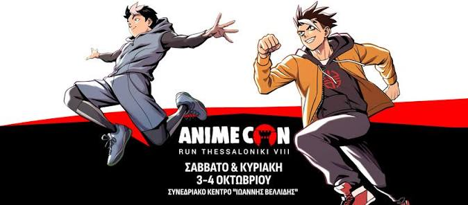

# Zenith Lan

 <!-- replace "logo" with "banner" if that suits the image better -->

The **Zenith Lan** (***ZNH***) is a 1v1, single-elimination, LAN, open rank osu! tournament hosted by ::{ flag=GR }:: [KakashiSensei_](https://osu.ppy.sh/users/18254930) in Greece.

## Tournament schedule

|              Event | Timestamp                |
| -----------------: | :----------------------- |
| Registration phase | 2026-09-08/2026-09-22    |
|         Qualifiers | 2026-09-22/2026-09-27    |
|      Live drawings | 2026-09-30 (17:00 UTC+3) |
|        Round of 16 | 2026-10-03               |
|      Quarterfinals | 2026-10-03               |
|         Semifinals | 2026-10-04               |
|             Finals | 2026-10-04               |

## Prizes

|                           Placing                          | Prize(s)                                                                     |
| :--------------------------------------------------------: | :--------------------------------------------------------------------------- |
|      | Badge (pending) + secret prizes courtesy of osu! + 4 months of osu!supporter |
|  | 3 months of osu!supporter + secret prizes courtesy of osu!                   |
|  | 2 months of osu!supporter + secret prizes courtesy of osu!                   |
|                         *4th place*                        |                                                                              |

## Organisation

The Zenith Lan is run by various community members.

| Position         | Member(s)                                                                                                                  |
| :--------------- | :------------------------------------------------------------------------------------------------------------------------- |
| Manager          | ::{ flag=GR }:: [Double_](https://osu.ppy.sh/users/20163454)                                                               |
| Mappool selector | ::{ flag=GR }:: [JackPax](https://osu.ppy.sh/users/11226645)                                                               |
| Streamer         | TBD                                                                                                                        |
| Commentator      | ::{ flag=GR }:: [Current 02](https://osu.ppy.sh/users/29239717)                                                            |
| Designer         | ::{ flag=FR }:: [Kheops](https://osu.ppy.sh/users/18607342)                                                                |
| Referee          | ::{ flag=GR }:: [Double_](https://osu.ppy.sh/users/20163454), ::{ flag=GR }:: [pan_har](https://osu.ppy.sh/users/26660680) |
| Statistician     | ::{ flag=GR }:: [Double_](https://osu.ppy.sh/users/20163454)                                                               |

## Links

* [Discussion thread](https://osu.ppy.sh/community/forums/topics/2243217)
* [Livestream](https://www.twitch.tv/kakashiosu_)
* **[Statistics sheet](https://docs.google.com/spreadsheets/d/1daL5IiB3vRI2hmXHZpoGd0jgnBV_xLmXMgG6LOlVkLo/edit?pli=1&gid=2085624547#gid=2085624547)**

## Mappools

**[Download the mappack here! (108.8 MB)](https://drive.google.com/file/d/1RPmY3eN4FhW-eKGtGQ9NH3E_gn-c2AYX/view?usp=sharing)**

### Qualifiers

* **No Mod**

  1. [NM1](https://osu.ppy.sh/beatmapsets/2184705#osu/4618010)
  2. [NM2](https://osu.ppy.sh/beatmapsets/2108626#osu/4440275)
  3. [NM3](https://osu.ppy.sh/beatmapsets/969845#osu/2028973)
  4. [NM4](https://osu.ppy.sh/beatmapsets/1286316#osu/2670817)
  5. [NM5](https://osu.ppy.sh/beatmapsets/1257525#osu/2613076)
  6. [NM6](https://osu.ppy.sh/beatmapsets/10333#osu/44406)
* **Hidden**

  1. [HD1](https://osu.ppy.sh/beatmapsets/220220#osu/538404)
  2. [HD2](https://osu.ppy.sh/beatmapsets/856645#osu/1789641)
* **Hard Rock**

  1. [HR1](https://osu.ppy.sh/beatmapsets/341933#osu/755900)
  2. [HR2](https://osu.ppy.sh/beatmapsets/1693764#osu/4671188)
* **Double Time**

  1. [DT1](https://osu.ppy.sh/beatmapsets/1074482#osu/2248577)
  2. [DT2](https://osu.ppy.sh/beatmapsets/1296273#osu/2750914)
  3. [DT3](https://osu.ppy.sh/beatmapsets/476697#osu/1018250)

## Ruleset

### Basic Rules

* Zenith Lan 2026 is a LAN, open rank event with an online qualifier stage.
* The tournament will be played in osu!lazer.
* There is no rank requirement.
* Format: Round of 16 single elimination.
* All registered participants will be submitted for official osu! account support screening.
* Participants may take part in qualifiers before screening is completed. If a participant is removed following screening, their qualifier result will be treated as void and they will not be permitted to participate in the LAN bracket.
* Players are not allowed to self-referee their own matches.
* A dedicated referee will be assigned to each match and another referee will be provided within 2–5 minutes if necessary.
* Players have 5 minutes from the scheduled match time to join the lobby.
* Cheating, match manipulation, rule violations, and other serious issues may be investigated and reported to the appropriate osu! staff.
* Tournament staff may perform reasonable checks of tournament equipment when necessary to investigate suspected cheating.
* Players may use their own peripherals where permitted by tournament staff.
* Match results and tournament records will be made publicly available on the Main Sheet.
* Every participant must be part of the [Discord server](https://discord.gg/Y4SF29mhHQ).

### Qualifiers

* The qualifiers will be played in a playlist.
* The maps will be played in the order they appear on the sheet.
* Once the qualifiers are over, the 16 highest-seeded players will advance to the LAN bracket.
* Once the qualifier period ends, the playlist will close and no further scores will be accepted.
* Players will have 18 attempts for 13 maps that they can distribute across the playlist, with their best score on each beatmap being used for the final qualifier results.
* Participants will be required to submit a score on every map in order to be eligible for seeding.
* The qualifiers will allow all participants to complete the qualifier mappool individually within a predefined time window.
* For seeding, average score will be used and standard seeding will apply.

### LAN Bracket

* The two players will `/roll`. The winner decides whether to choose the order of picks or bans, and the loser chooses the order of the remaining selection.
* The number of bans and picks available to each player depends on the round.
* Round of 16: Best of 6 (first to 3) with 2 bans.
* Quarterfinals and Semifinals: Best of 9 (first to 5) with 2 bans.
* Finals and Grand Finals: Best of 15 (first to 7) with 1 ban.
* Time for the pick: 2 minutes.
* Time between the pick and the start of the map: 1:30 minutes.
