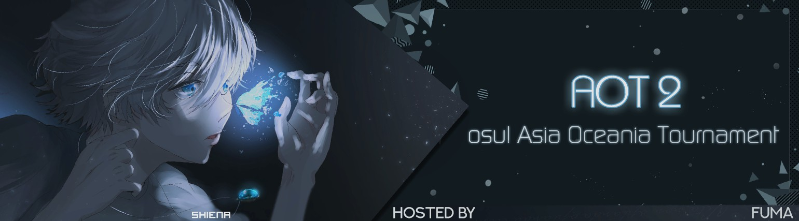

---
tags:
  - o!AOT 2
  - AOT 2
---

# osu! Asia Oceania Tournament 2

The **osu! Asia Oceania Tournament 2** (***o!AOT2***) was an Asian and Oceanian double-elimination team-based osu! tournament hosted by ::{ flag=ID }:: [Fuma](https://osu.ppy.sh/users/1501956) and ::{ flag=ID }:: [nya10](https://osu.ppy.sh/users/1372608). The tournament was restricted to players within the Asia and Oceania countries only. It was the second instalment of the osu! Asia Oceania Tournament.

## Tournament schedule

| Event | Timestamp |
| --: | :-- |
| Registration phase | 2020-05-31/2020-06-21 |
| Player screening | 2020-06-21/2020-06-28 |
| Qualifiers | 2020-07-03/2020-07-05 |
| Round of 32 | 2020-07-11/2020-07-13 |
| Round of 16 | 2020-07-15/2020-07-19 |
| Quarterfinals | 2020-07-24/2020-07-27 |
| Semifinals | 2020-08-01/2020-08-02 |
| Finals | 2020-08-08/2020-08-09 |
| Grand Finals | 2020-08-15/2020-08-16 |

## Prizes

| Placing | Prize |
| :-: | :-- |
|  | Unique profile badge |

## Organisation

The osu! Asia Oceania Tournament 2 was run by various community members.

| Position | Member(s) |
| :-- | :-- |
| Organizer | ::{ flag=ID }:: [Fuma](https://osu.ppy.sh/users/1501956) |
| Mappool selector | ::{ flag=ID }:: [Fuma](https://osu.ppy.sh/users/1501956), ::{ flag=ID }:: [Kuro Fuyusaki](https://osu.ppy.sh/users/2667496), ::{ flag=VN }:: [LMT](https://osu.ppy.sh/users/7262798), ::{ flag=ID }:: [nya10](https://osu.ppy.sh/users/1372608) |
| Referee | ::{ flag=KR }:: [Cherry bomb](https://osu.ppy.sh/users/11584205), ::{ flag=HK }:: [Cindergoat](https://osu.ppy.sh/users/10168682), ::{ flag=ID }:: [Fayn](https://osu.ppy.sh/users/5390495), ::{ flag=HK }:: [Finley On Cocoa](https://osu.ppy.sh/users/10141298), ::{ flag=ID }:: [Fuma](https://osu.ppy.sh/users/1501956), ::{ flag=DE }:: [GDLenny](https://osu.ppy.sh/users/8406711), ::{ flag=AU }:: [ill onion](https://osu.ppy.sh/users/8306102), ::{ flag=CN }:: [MyAngelJackWang](https://osu.ppy.sh/users/3665920), ::{ flag=ID }:: [nya10](https://osu.ppy.sh/users/1372608), ::{ flag=ID }:: [PatrickFPSGamer](https://osu.ppy.sh/users/4796773), ::{ flag=ID }:: [Remuru](https://osu.ppy.sh/users/3654220), ::{ flag=IN }:: [Speshimen](https://osu.ppy.sh/users/7720204), ::{ flag=US }:: [Suicune3](https://osu.ppy.sh/users/6895187), ::{ flag=DE }:: [TheHunter1](https://osu.ppy.sh/users/6496016), ::{ flag=MY }:: [Xyrelyx](https://osu.ppy.sh/users/3765632) |
| Streamer | ::{ flag=AU }:: [ill onion](https://osu.ppy.sh/users/8306102), ::{ flag=SG }:: [k\_1tty](https://osu.ppy.sh/users/5407620), ::{ flag=SG }:: [Rtzero](https://osu.ppy.sh/users/9262462), ::{ flag=ID }:: [Victim\_Crasher](https://osu.ppy.sh/users/2084869), ::{ flag=TW }:: [XzCraftP](https://osu.ppy.sh/users/1593180) |
| Commentator | ::{ flag=GR }:: [JackPaX](https://osu.ppy.sh/users/11226645), ::{ flag=SG }:: [O-Tae](https://osu.ppy.sh/users/13430124), ::{ flag=SG }:: [Rtzero](https://osu.ppy.sh/users/9262462), ::{ flag=ID }:: [sumippe](https://osu.ppy.sh/users/1929336), ::{ flag=ID }:: [xHirayuki](https://osu.ppy.sh/users/3245206) |
| Designer | ::{ flag=ID }:: [Shiena](https://osu.ppy.sh/users/9823378) |
| Statistician | ::{ flag=ID }:: [nya10](https://osu.ppy.sh/users/1372608) |
| Wiki editor | ::{ flag=ID }:: [fajar13k](https://osu.ppy.sh/users/7100002) |

## Links

- [Discussion thread](https://osu.ppy.sh/community/forums/topics/1079231)
- [o!AOT Discord server](https://discord.gg/mZtHc5M)
- [Livestream](https://www.twitch.tv/osuaot)
- [Challonge brackets](https://challonge.com/oAOT2)
- **[Statistics sheet](https://docs.google.com/spreadsheets/d/155vE-qSwfc9CVXGoiAeTQXBzxr4jmwBNwOrs7hYHxyI/edit)**

## Participants

| Team | Members |
| :-- | :-- |
| **:peepolaughpoint:** | ::{ flag=MY }:: **[ShaneLiang](https://osu.ppy.sh/users/6716499)**, ::{ flag=MY }:: [wuhua](https://osu.ppy.sh/users/2932510), ::{ flag=MY }:: [Rampax](https://osu.ppy.sh/users/3995630), ::{ flag=MY }:: [ClawViper](https://osu.ppy.sh/users/2681361) |
| **awwwwww ＦＯＫ** | ::{ flag=AU }:: **[jordanlr7](https://osu.ppy.sh/users/11652827)**, ::{ flag=AU }:: [Shiroha](https://osu.ppy.sh/users/3068044), ::{ flag=AU }:: [ASecretBox](https://osu.ppy.sh/users/7341183), ::{ flag=KR }:: [ddm](https://osu.ppy.sh/users/7910282) |
| **benki** | ::{ flag=JP }:: **[\_tottoko\_](https://osu.ppy.sh/users/8354698)**, ::{ flag=JP }:: [dectopia](https://osu.ppy.sh/users/2845904), ::{ flag=JP }:: [Recia](https://osu.ppy.sh/users/1787027), ::{ flag=JP }:: [chankoma](https://osu.ppy.sh/users/4260383) |
| **best lolis** | ::{ flag=ID }:: **[Lifeline](https://osu.ppy.sh/users/11367222)**, ::{ flag=ID }:: [Vinno](https://osu.ppy.sh/users/10717635), ::{ flag=KR }:: [MyAimHugofrost](https://osu.ppy.sh/users/6896883), ::{ flag=HK }:: [- Sakura -](https://osu.ppy.sh/users/10829419) |
| **Better** | ::{ flag=IN }:: **[Logia](https://osu.ppy.sh/users/16487742)**, ::{ flag=IN }:: [Deathstark](https://osu.ppy.sh/users/12691887) |
| **Brawl stars gang + Poke** | ::{ flag=AU }:: **[-Secured-](https://osu.ppy.sh/users/14648196)**, ::{ flag=AU }:: [KannaKamuiii](https://osu.ppy.sh/users/11435502), ::{ flag=MY }:: [DanielSiew](https://osu.ppy.sh/users/12916724), ::{ flag=IN }:: [Pokeinfernape](https://osu.ppy.sh/users/11412507) |
| **BUNKER** | ::{ flag=KR }:: **[siroitora](https://osu.ppy.sh/users/9146185)**, ::{ flag=KR }:: [Atipir](https://osu.ppy.sh/users/8991722), ::{ flag=KR }:: [mx10000](https://osu.ppy.sh/users/3730848), ::{ flag=KR }:: [Suyong\_](https://osu.ppy.sh/users/8799923) |
| **Chicken Curry** | ::{ flag=IN }:: **[Potla](https://osu.ppy.sh/users/1788022)**, ::{ flag=JP }:: [R1K50N](https://osu.ppy.sh/users/9116955), ::{ flag=IN }:: [\_Cyan](https://osu.ppy.sh/users/10250612), ::{ flag=JP }:: [EIGER](https://osu.ppy.sh/users/1504556) |
| **Dream Solister** | ::{ flag=TH }:: **[Trigonoculus](https://osu.ppy.sh/users/7627013)**, ::{ flag=TH }:: [Applause](https://osu.ppy.sh/users/1832711), ::{ flag=SG }:: [moosepi](https://osu.ppy.sh/users/1868745), ::{ flag=TW }:: [\[ Zane \]](https://osu.ppy.sh/users/3517706) |
| **e** | ::{ flag=AU }:: **[- Raphi -](https://osu.ppy.sh/users/5126976)**, ::{ flag=AU }:: [YelloJello](https://osu.ppy.sh/users/9285180), ::{ flag=AU }:: [I Love Anime](https://osu.ppy.sh/users/10760137), ::{ flag=AU }:: [pewdekz](https://osu.ppy.sh/users/5754859) |
| **erogemaster225** | ::{ flag=MY }:: **[Chiyuu](https://osu.ppy.sh/users/8226107)**, ::{ flag=MY }:: [Zygody](https://osu.ppy.sh/users/3677251), ::{ flag=MY }:: [Auxuelus](https://osu.ppy.sh/users/5414124), ::{ flag=MY }:: [vernonlim](https://osu.ppy.sh/users/10167542) |
| **Filthy deranker and the minions** | ::{ flag=KR }:: **[ToGlette](https://osu.ppy.sh/users/1076236)**, ::{ flag=KR }:: [Civil oath](https://osu.ppy.sh/users/3216107), ::{ flag=KR }:: [Telta](https://osu.ppy.sh/users/4750140), ::{ flag=JP }:: [MONTBLANC\_heart](https://osu.ppy.sh/users/1650137) |
| **Floating up** | ::{ flag=KR }:: **[Gomo Pslvarh](https://osu.ppy.sh/users/1206417)**, ::{ flag=KR }:: [Aristia](https://osu.ppy.sh/users/3478883), ::{ flag=KR }:: [FlyingTuna](https://osu.ppy.sh/users/9224078), ::{ flag=JP }:: [Varvalian](https://osu.ppy.sh/users/3345902) |
| **Fuk** | ::{ flag=AU }:: **[GranDSenpai](https://osu.ppy.sh/users/3997580)**, ::{ flag=KR }:: [Yaong](https://osu.ppy.sh/users/1883865), ::{ flag=JP }:: [Tatsua](https://osu.ppy.sh/users/7626092), ::{ flag=HK }:: [Hibiki](https://osu.ppy.sh/users/5413624) |
| **fush n chups** | ::{ flag=AU }:: **[loveleft](https://osu.ppy.sh/users/9240047)**, ::{ flag=HK }:: [Dragbit 2](https://osu.ppy.sh/users/11172237), ::{ flag=ID }:: [cfood](https://osu.ppy.sh/users/8626190), ::{ flag=ID }:: [Daffy](https://osu.ppy.sh/users/5968633) |
| **half agouka** | ::{ flag=ID }:: **[Agouka](https://osu.ppy.sh/users/9606647)**, ::{ flag=JP }:: [A5uka](https://osu.ppy.sh/users/5137553), ::{ flag=ID }:: [LongExistence](https://osu.ppy.sh/users/2380426), ::{ flag=ID }:: [MOMO543959](https://osu.ppy.sh/users/2373484) |
| **hororaibu purodakushon** | ::{ flag=SG }:: **[zan](https://osu.ppy.sh/users/11420887)**, ::{ flag=SG }:: [Jazzie](https://osu.ppy.sh/users/7137463), ::{ flag=MY }:: [TheBlank](https://osu.ppy.sh/users/9597370) |
| **Just circles** | ::{ flag=KZ }:: **[livingrim](https://osu.ppy.sh/users/5300686)**, ::{ flag=KZ }:: [\[\_Ata\_\]](https://osu.ppy.sh/users/7399836), ::{ flag=KZ }:: [Gluccky](https://osu.ppy.sh/users/10418049), ::{ flag=KZ }:: [Wadas](https://osu.ppy.sh/users/3201658) |
| **matta ne\~** | ::{ flag=VN }:: **[Shironi](https://osu.ppy.sh/users/8660120)**, ::{ flag=VN }:: [boylanklunk\_9x](https://osu.ppy.sh/users/7050175), ::{ flag=VN }:: [Tuon](https://osu.ppy.sh/users/6673790), ::{ flag=VN }:: [Ui chan](https://osu.ppy.sh/users/5449433) |
| **NCout** | ::{ flag=KR }:: **[\[RyuTell\]](https://osu.ppy.sh/users/9397144)**, ::{ flag=KR }:: [Kaneko Chiharu](https://osu.ppy.sh/users/6537257), ::{ flag=KR }:: [Nopekjk](https://osu.ppy.sh/users/4585186), ::{ flag=KR }:: [Piper](https://osu.ppy.sh/users/10592853) |
| **No Tryhard** | ::{ flag=PH }:: **[konawiki](https://osu.ppy.sh/users/4003979)**, ::{ flag=PH }:: [MioMilo](https://osu.ppy.sh/users/2199427), ::{ flag=PH }:: [zonelouise](https://osu.ppy.sh/users/1492995), ::{ flag=PH }:: [xidorn](https://osu.ppy.sh/users/7904667) |
| **our teamname** | ::{ flag=NZ }:: **[susmusduspus](https://osu.ppy.sh/users/9602495)**, ::{ flag=AU }:: [laflame713](https://osu.ppy.sh/users/12480759), ::{ flag=AU }:: [caleonn](https://osu.ppy.sh/users/12271701), ::{ flag=AU }:: [jackdawson001](https://osu.ppy.sh/users/12457173) |
| **PAKET PHOENIXNYA KAKA** | ::{ flag=ID }:: **[Comeout](https://osu.ppy.sh/users/14436779)**, ::{ flag=ID }:: [1Ardy1](https://osu.ppy.sh/users/10558466) |
| **Pillars** | ::{ flag=AU }:: **[HydraChaos](https://osu.ppy.sh/users/14447065)**, ::{ flag=TW }:: [Bios](https://osu.ppy.sh/users/5772165), ::{ flag=ID }:: [Rayhan Hamil](https://osu.ppy.sh/users/4085825), ::{ flag=ID }:: [dika312](https://osu.ppy.sh/users/741613) |
| **pokis thunder thighs** | ::{ flag=NZ }:: **[Zoomer](https://osu.ppy.sh/users/6600930)**, ::{ flag=NZ }:: [ALTERNATOR32](https://osu.ppy.sh/users/3895932), ::{ flag=NZ }:: [Feyyy](https://osu.ppy.sh/users/2523703), ::{ flag=NZ }:: [ningalu](https://osu.ppy.sh/users/6934358) |
| **ppOverheat** | ::{ flag=AU }:: **[Delchoran](https://osu.ppy.sh/users/8530809)**, ::{ flag=AU }:: [\_boid](https://osu.ppy.sh/users/11388122), ::{ flag=NZ }:: [Riwaka](https://osu.ppy.sh/users/6112258), ::{ flag=AU }:: [Luminance](https://osu.ppy.sh/users/4745025) |
| **PUPU** | ::{ flag=ID }:: **[Skydiver](https://osu.ppy.sh/users/4750008)**, ::{ flag=HK }:: [DenierNezzar](https://osu.ppy.sh/users/126144), ::{ flag=CN }:: [Crystal](https://osu.ppy.sh/users/1646397), ::{ flag=CN }:: [davidqu2](https://osu.ppy.sh/users/6090175) |
| **PUPUPU** | ::{ flag=CN }:: **[EbisuzawaKurumi](https://osu.ppy.sh/users/5791401)**, ::{ flag=HK }:: [Chaoslitz](https://osu.ppy.sh/users/3621552), ::{ flag=CN }:: [Sugiura Kanata](https://osu.ppy.sh/users/7839397), ::{ flag=CN }:: [MyAngelMiku](https://osu.ppy.sh/users/7025429) |
| **santai aja bos** | ::{ flag=ID }:: **[sumippe](https://osu.ppy.sh/users/1929336)**, ::{ flag=ID }:: [smh](https://osu.ppy.sh/users/1629553), ::{ flag=ID }:: [Rexeez](https://osu.ppy.sh/users/1987591), ::{ flag=ID }:: [F4UZ4N](https://osu.ppy.sh/users/11070577) |
| **Spugs** | ::{ flag=KG }:: **[Madaraha](https://osu.ppy.sh/users/11137291)**, ::{ flag=KG }:: [CpxG](https://osu.ppy.sh/users/12270069) |
| **Ｔｈｅ　Ｂｉｇ　ＤＩＬＦＳ** | ::{ flag=AU }:: **[Jordan The Bear](https://osu.ppy.sh/users/7477458)**, ::{ flag=AU }:: [uyghti](https://osu.ppy.sh/users/3641404), ::{ flag=AU }:: [Monk The Don](https://osu.ppy.sh/users/4012086), ::{ flag=AU }:: [Vivace](https://osu.ppy.sh/users/3698691) |
| **unko** | ::{ flag=JP }:: **[katatakatata](https://osu.ppy.sh/users/3540294)**, ::{ flag=JP }:: [a\_Blue](https://osu.ppy.sh/users/5645667), ::{ flag=JP }:: [----](https://osu.ppy.sh/users/4304495), ::{ flag=JP }:: [Valtz](https://osu.ppy.sh/users/5911299) |
| **Walfrid is now Singaporean** | ::{ flag=SG }:: **[k\_1tty](https://osu.ppy.sh/users/5407620)**, ::{ flag=SG }:: [GSBlank](https://osu.ppy.sh/users/2312106), ::{ flag=SG }:: [Rtyzen](https://osu.ppy.sh/users/2439822), ::{ flag=ID }:: [Walfrid](https://osu.ppy.sh/users/6600809) |
| **Water Sausage** | ::{ flag=ID }:: **[phizh](https://osu.ppy.sh/users/4569302)**, ::{ flag=ID }:: [Fre](https://osu.ppy.sh/users/3484548), ::{ flag=ID }:: [\[fry\]](https://osu.ppy.sh/users/4917604), ::{ flag=ID }:: [thefarrel007](https://osu.ppy.sh/users/2429128) |
| **wudi tofu** | ::{ flag=TW }:: **[EthanTC](https://osu.ppy.sh/users/9539163)**, ::{ flag=TW }:: [Spinesnight](https://osu.ppy.sh/users/4519494), ::{ flag=TW }:: [Arkal](https://osu.ppy.sh/users/1775182) |
| **Xi bal** | ::{ flag=KR }:: **[\_sPekTrE](https://osu.ppy.sh/users/11129034)**, ::{ flag=KR }:: [\[Karcher\]](https://osu.ppy.sh/users/11443437), ::{ flag=KR }:: [Megii](https://osu.ppy.sh/users/7429772), ::{ flag=KR }:: [Peresia](https://osu.ppy.sh/users/7027766) |
| **Yuri Empire** | ::{ flag=AU }:: **[European Union](https://osu.ppy.sh/users/11499384)**, ::{ flag=AU }:: [ToastnButter](https://osu.ppy.sh/users/10339644) |

## Podium

This competition has come to an end and resulted in the following podium:

| Placing | Team |
| :-: | :-- |
|  | **Floating up** (::{ flag=KR }:: **[Gomo Pslvarh](https://osu.ppy.sh/users/1206417)**, ::{ flag=KR }:: [Aristia](https://osu.ppy.sh/users/3478883), ::{ flag=KR }:: [FlyingTuna](https://osu.ppy.sh/users/9224078), ::{ flag=JP }:: [Varvalian](https://osu.ppy.sh/users/3345902)) |
|  | **PUPU** (::{ flag=ID }:: **[Skydiver](https://osu.ppy.sh/users/4750008)**, ::{ flag=HK }:: [DenierNezzar](https://osu.ppy.sh/users/126144), ::{ flag=CN }:: [Crystal](https://osu.ppy.sh/users/1646397), ::{ flag=CN }:: [davidqu2](https://osu.ppy.sh/users/6090175)) |
|  | **:peepolaughpoint:** (::{ flag=MY }:: **[ShaneLiang](https://osu.ppy.sh/users/6716499)**, ::{ flag=MY }:: [wuhua](https://osu.ppy.sh/users/2932510), ::{ flag=MY }:: [Rampax](https://osu.ppy.sh/users/3995630), ::{ flag=MY }:: [ClawViper](https://osu.ppy.sh/users/2681361)) |

## Mappools

### Grand Finals

**[Download the mappack here! (125 MB)](https://mega.nz/file/9gNQCQIJ#nWHbjnepijxaoR-5B8XbVukGdc6M98NgUk0SkHzj9xA)**

- NoMod
  1. [Reol - Saisaki (Shirasaka Koume) \[Reborn, to strong yourself.\]](https://osu.ppy.sh/beatmapsets/871397#osu/1820714)
  2. [Shiraishi - Shinsekai (Fuma) \[Ultra\]](https://osu.ppy.sh/beatmapsets/1233291#osu/2563922)
  3. [Maoki Yamamoto - PIRATES BANQUET (thzz) \[PARTY!!\]](https://osu.ppy.sh/beatmapsets/1178351#osu/2457465)
  4. [Getty vs. DJ DiA - DropZ-Line- (Realazy) \[Neil x Regou's Extra\]](https://osu.ppy.sh/beatmapsets/727049#osu/1546209)
  5. [Kobaryo - Villain Virus \[feat. Camellia\] (Fuma) \[Ailment\]](https://osu.ppy.sh/beatmapsets/1233292#osu/2563924)
  6. [Bentham - TONIGHT (dsco) \[Joel\]](https://osu.ppy.sh/beatmapsets/587221#osu/1243461)
- Hidden
  1. [Memme - Extreme Fantasy (-PC) \[Reverie\]](https://osu.ppy.sh/beatmapsets/697899#osu/1478228)
  2. [Nanamori-chu \* Goraku-bu - Happy Time wa Owaranai (Hivie) \[IOException's Expert\]](https://osu.ppy.sh/beatmapsets/1043808#osu/2201860)
  3. [Renril - Rinne Tensei (Depths) \[Awakening\]](https://osu.ppy.sh/beatmapsets/824423#osu/1727589)
- HardRock
  1. [Camellia - Chirality (Suzuki\_1112) \[Moecho's Hypertrophy Xtra\]](https://osu.ppy.sh/beatmapsets/692068#osu/1517055)
  2. [Alfakyun. x Camellia - calling (ProfessionalBox) \[Prestissimo\]](https://osu.ppy.sh/beatmapsets/523558#osu/1111493)
  3. [xi feat. Sta - Tiferet (ktgster) \[Another\]](https://osu.ppy.sh/beatmapsets/714225#osu/1509637)
- DoubleTime
  1. [senya - Sasayaku, Kiekaketa Kouishou ga. (Satellite) \[Satellite\]](https://osu.ppy.sh/beatmapsets/1053613#osu/2201688)
  2. [ShinRa-Bansho - Marisa wa Taihen na Mono o Nusunde Ikimashita ShinRa-Bansho Ver (Len) \[Classic Extra\]](https://osu.ppy.sh/beatmapsets/1024028#osu/2142037)
  3. [LhoU - popotnik ~ The Traveller of Ljubljana (Niva) \[Exotic\]](https://osu.ppy.sh/beatmapsets/712388#osu/1505919)
  4. [ZUN remixed by LeaF - Resurrection Spell (emu1337) \[Lunatic\]](https://osu.ppy.sh/beatmapsets/1132711#osu/2369402)
- FreeMod
  1. [Nekrogoblikon - The Skin Thief (LMT) \[Murder\]](https://osu.ppy.sh/beatmapsets/1061535#osu/2222880)
  2. [Falcom Sound Team jdk - GENESIS BEYOND THE BEGINNING (Mariko Sakuragi) \[Extra\]](https://osu.ppy.sh/beatmapsets/1032441#osu/2223544)
  3. [Sally - ennb (Natteke desu) \[habibi love\]](https://osu.ppy.sh/beatmapsets/1029346#osu/2152416)
- Tiebreaker
  1. **[Imperial Circus Dead Decadence - Gekiai No Yobigoe Ga Dekiai No Sakebigoe Wo Kurau (IsomirDiAngelo) \[Defiled Love\]](https://osu.ppy.sh/beatmapsets/915563#osu/1943046)**

### Finals

**[Download the mappack here! (123 MB)](https://mega.nz/file/15lRhCxR#DsAh3ulFuA67B2Zn0RWnbuixIy1-lkownEMflCIIb0U)**

- NoMod
  1. [DECO\*27 - Android Girl (Fuma) \[Reboot\]](https://osu.ppy.sh/beatmapsets/1228450#osu/2554392)
  2. [LeaF - WoRLd Tempest (Kyshiro) \[FOUR DIMENSIONS\]](https://osu.ppy.sh/beatmapsets/410233#osu/890329)
  3. [jioyi - Platinum (Smug Nanachi) \[TheBlank's Extreme\]](https://osu.ppy.sh/beatmapsets/1040895#osu/2193647)
  4. [umu. - Dareka no Shinzou ni Nareta Nara (xbopost) \[Expert\]](https://osu.ppy.sh/beatmapsets/1098181#osu/2294521)
  5. [cosMo@Bousou-P - End Mark ni Kibou to Namida wo soete (SnowNiNo\_) \[Flask's MASTER\]](https://osu.ppy.sh/beatmapsets/772055#osu/1662512)
  6. [onumi - CONFUSION PART ONE (Spork Lover) \[Extra\]](https://osu.ppy.sh/beatmapsets/1011610#osu/2124378)
- Hidden
  1. [MAXIMIZER VS DJ TOTTO - REBELLIO (Smoothie World) \[SINGVER'S AVATAR\]](https://osu.ppy.sh/beatmapsets/469021#osu/1003011)
  2. [Sound.AVE - Churu Churu (Fuma) \[Bwomf ;3\]](https://osu.ppy.sh/beatmapsets/1228456#osu/2554398)
  3. [Hatsuki Yura - The Clockwork Rose -Tokei Shikake no Bara Shoujo- (My Angel Watame) \[Corruption\]](https://osu.ppy.sh/beatmapsets/849824#osu/1776939)
- HardRock
  1. [96Neko - Uso No Hibana (Depths) \[Corrupt Emotions\]](https://osu.ppy.sh/beatmapsets/578574#osu/1225022)
  2. [USAO - Outbreak (Otosaka-Yu) \[Let's go!!!\]](https://osu.ppy.sh/beatmapsets/1095388#osu/2289292)
  3. [SOUND HOLIC vs. dj TAKA feat. YURiCa - TIEFSEE (celerih) \[Expert\]](https://osu.ppy.sh/beatmapsets/928646#osu/1939633)
- DoubleTime
  1. [Nakamura Meiko - Scarlet Faith (Tsukuyomi) \[Insane\]](https://osu.ppy.sh/beatmapsets/144223#osu/364990)
  2. [Chase & Status feat. Plan B - End Credits (Nemis) \[Nemis\]](https://osu.ppy.sh/beatmapsets/105686#osu/277274)
  3. [Takahashi Yoko - A Cruel Angel's Thesis (Director's Edit. Version) (Net0) \[osu! Asia Oceania Tournament edit\]](https://osu.ppy.sh/beatmapsets/1164031#osu/2546194)
  4. [Seatbelts feat. Yamane Mai - THE REAL FOLK BLUES (moph) \[Expert\]](https://osu.ppy.sh/beatmapsets/840047#osu/1758488)
- FreeMod
  1. [x0o0x\_ - Big Brother (Luscent) \[YOKES' EXTRA Mix\]](https://osu.ppy.sh/beatmapsets/1120687#osu/2400783)
  2. [OSTER project - Capriccio of My Mind (7odoa) \[Extra\]](https://osu.ppy.sh/beatmapsets/107475#osu/281632)
  3. [Kitsune^2 - Rainbow Tylenol (Blue Dragon) \[Hell\]](https://osu.ppy.sh/beatmapsets/20789#osu/72585)
- Tiebreaker
  1. **[BABYMETAL - Tales of The Destinies (Monstrata) \[Predator\]](https://osu.ppy.sh/beatmapsets/534115#osu/1131424)**

### Semifinals

**[Download the mappack here! (130 MB)](https://mega.nz/file/hk9jlYJD#m5BS7_az5VXiesk_Ln1OIAiHmzILxKqLhLtDEi6sM4I)**

- NoMod
  1. [Foreground Eclipse - Flames Within These Black Feathers (Seni) \[Tearing Apart The Despair Entangled Within My Hands\]](https://osu.ppy.sh/beatmapsets/1001825#osu/2097124)
  2. [Kurokotei - Chronostasis (\_Epreus) \[Regou's Classic Extra\]](https://osu.ppy.sh/beatmapsets/1069048#osu/2240948)
  3. [Eagle - Hypersonik (synderes) \[Ultra\]](https://osu.ppy.sh/beatmapsets/1185265#osu/2470619)
  4. [TK from Ling tosite sigure - katharsis (Deca) \[apotheosis\]](https://osu.ppy.sh/beatmapsets/966110#osu/2135522)
  5. [Twin-Tails - Twintail Dreamer! (TV Size) (Moecho) \[HW's EX\]](https://osu.ppy.sh/beatmapsets/1115213#osu/2329704)
- Hidden
  1. [Fear, and Loathing in Las Vegas - Stray in Chaos (puxtu) \[Alheak's Extreme\]](https://osu.ppy.sh/beatmapsets/574129#osu/1225317)
  2. [mmry - Variance (DeviousPanda) \[Master (edit ver)\]](https://osu.ppy.sh/beatmapsets/1165608#osu/2431090)
  3. [CustomiZ - COOLEST (TV Size) (Spork Lover) \[EX\]](https://osu.ppy.sh/beatmapsets/520373#osu/1563518)
- HardRock
  1. [Krewella - Killin' It (Sped Up Ver.) (Hectic) \[Rapture\]](https://osu.ppy.sh/beatmapsets/1029940#osu/2153590)
  2. [onoken - Amnolys (DreaM117er) \[Koiyuki's Schwarz Extrem\]](https://osu.ppy.sh/beatmapsets/1069791#osu/2301694)
  3. [RoughSketch feat. Aikipin - Alice in Voodooland (tpz Despair Remix) (JeZag) \[Fear\]](https://osu.ppy.sh/beatmapsets/678481#osu/1434586)
- DoubleTime
  1. [WEAVER - Kuchizuke Diamond (-Mikan) \[Dailycare's Special\]](https://osu.ppy.sh/beatmapsets/1051509#osu/2251196)
  2. [Rche - Todestrieb (FrenZ396) \[Insane\]](https://osu.ppy.sh/beatmapsets/968678#osu/2028792)
  3. [M.O.V.E - Gamble Rumble (Jemmmmy) \[Insane\]](https://osu.ppy.sh/beatmapsets/137699#osu/344076)
  4. [livetune adding Fukase (from SEKAI NO OWARI) - Take Your Way (Bearizm) \[Special\]](https://osu.ppy.sh/beatmapsets/872916#osu/1824715)
- FreeMod
  1. [EYE\_RH - The Red Coronation (Parachute) \[Calamity\]](https://osu.ppy.sh/beatmapsets/1033460#osu/2160869)
  2. [Rohi - Slan Leat (VINXIS) \[Goodbye\]](https://osu.ppy.sh/beatmapsets/1177073#osu/2454944)
  3. [Drumsound & Bassline Smith - Through The Night feat. Tom Cane (Strategas) \[Extra\]](https://osu.ppy.sh/beatmapsets/685499#osu/1499313)
- Tiebreaker
  1. **[DystopiaGround - AugoEidEs (contagious) \[Agony\]](https://osu.ppy.sh/beatmapsets/1008143#osu/2109961)**

### Quarterfinals

**[Download the mappack here! (127 MB)](https://mega.nz/file/wxtEUaqb#mfl7b7WC5UfA8459IqOxo8T9efQbUdBL1OMI_n10M7A)**

- NoMod
  1. [ShinRa-Bansho - Zenryoku Happy Life (Asagi) \[Overdrive\]](https://osu.ppy.sh/beatmapsets/819611#osu/1718454)
  2. [Ice - Etude for the Sinners (Cherry Blossom) \[Trolled\]](https://osu.ppy.sh/beatmapsets/892189#osu/1865097)
  3. [Suda Keina - veil (Kaitjuh) \[impasse\]](https://osu.ppy.sh/beatmapsets/1023081#osu/2140171)
  4. [lapix - Carry Me Away (Fuma) \[Shizuku's EXTRA (nerfed ver.)\]](https://osu.ppy.sh/beatmapsets/1217573#osu/2533322)
  5. [DJ Totoriott - Chloe (DeviousPanda) \[Mystery\]](https://osu.ppy.sh/beatmapsets/915491#osu/1911962)
- Hidden
  1. [Warak - REANIMATE (GIDZ) \[Epic\]](https://osu.ppy.sh/beatmapsets/1138102#osu/2377630)
  2. [HyuN - Infinity Heaven (BarkingMadDog) \[Extreme\]](https://osu.ppy.sh/beatmapsets/821998#osu/1752927)
  3. [P-Model - Logic Airforce (nullset) \[KIRBY Mix\]](https://osu.ppy.sh/beatmapsets/29267#osu/100237)
- HardRock
  1. [Morimori Atsushi - Tits or get the fuck out!! (Regou) \[FreeSongs' Extra!!\]](https://osu.ppy.sh/beatmapsets/455022#osu/995932)
  2. [ALI - Wild Side (fieryrage) \[Keitaro's Expert\]](https://osu.ppy.sh/beatmapsets/1109683#osu/2319256)
  3. [96neko - E? Aa, sou. (newton-) \[Fabricated\]](https://osu.ppy.sh/beatmapsets/902346#osu/1914227)
- DoubleTime
  1. [Juno Reactor - Guardian Angel (PandaHero) \[Insane\]](https://osu.ppy.sh/beatmapsets/965524#osu/2021129)
  2. [XX:me - Torikago (Kibbleru) \[Jian\]](https://osu.ppy.sh/beatmapsets/731356#osu/1543369)
  3. [a\_hisa - inertia (\[ HalLoWeeN \]) \[Hyper\]](https://bloodcat.com/osu/s/126347)
  4. [merry-san - Venom (Houshou Hari) \[Insane\]](https://osu.ppy.sh/beatmapsets/1073331#osu/2246285)
- FreeMod
  1. [Zips - Heisei Cataclysm (Nevo) \[Heisei\]](https://osu.ppy.sh/beatmapsets/1060960#osu/2221292)
  2. [Foreground Eclipse - Fall of Tears (Zelq) \[Autumnal Waterfall\]](https://osu.ppy.sh/beatmapsets/914729#osu/2153282)
  3. [Rabbit House - Final Overtake (Flower) \[Old Driver\]](https://osu.ppy.sh/beatmapsets/399465#osu/869491)
- Tiebreaker
  1. **[RIN - Pluto -Tenderness (My Angel Azusa) \[Hades In The Heaven\]](https://osu.ppy.sh/beatmapsets/573313#osu/1241443)**

### Round of 16

**[Download the mappack here! (97 MB)](https://mega.nz/file/BslWHABQ#Rg0gnbYiu37ehXfdL1-RrNywszmkHafCWccpPt-M7SM)**

- NoMod
  1. [Itowokashi - Kanadeai (Flask) \[Twin Star\]](https://osu.ppy.sh/beatmapsets/1089616#osu/2278105)
  2. [xi - Solar Storm (Fuma) \[Cubtori\]](https://osu.ppy.sh/beatmapsets/1212905#osu/2524501)
  3. [Dave Rodgers - Deja Vu (Shizuku-) \[Multi Cursor Drifting\]](https://osu.ppy.sh/beatmapsets/961329#osu/2012548)
  4. [Nor + YUC'e - Mint Comet (JrSzZ) \[Chromatic\]](https://osu.ppy.sh/beatmapsets/1000076#osu/2092293)
  5. [aran - Sunny After Rain feat. Kantan.N (fanzhen0019) \[dot\]](https://osu.ppy.sh/beatmapsets/886602#osu/1853460)
- Hidden
  1. [uma vs. Morimori Atsushi - GLORY:ROAD (My Angel RangE) \[KAGUYA_SAMA'S:STAIR\]](https://osu.ppy.sh/beatmapsets/1067583#osu/2256761)
  2. [Josif Habib - Happy Chiptune 2 (TheNexus) \[Insane\]](https://osu.ppy.sh/beatmapsets/805331#osu/1690552)
- HardRock
  1. [SHK - Identity (Fuma) \[Expert\]](https://osu.ppy.sh/beatmapsets/1212904#osu/2524500)
  2. [Rohi - Kanata ni Mau wa Sakura no Shirabe (NatsumeRin) \[Extra\]](https://osu.ppy.sh/beatmapsets/93555#osu/252290)
- DoubleTime
  1. [Meg & Dia - Black Wedding (Larto) \[Crazy!\]](https://osu.ppy.sh/beatmapsets/30000#osu/101115)
  2. [SYNC.ART'S - Mienai kara, Mieru Mono. (pyrowar56) \[Lunatic\]](https://osu.ppy.sh/beatmapsets/725159#osu/1554528)
  3. [P4koo - Crystal Illusion (Riana) \[Insane\]](https://osu.ppy.sh/beatmapsets/791944#osu/2232947)
- FreeMod
  1. [Akatsuki Records - Trance Dance Anarchy (papapa213) \[Dancing!\]](https://osu.ppy.sh/beatmapsets/1056140#osu/2207263)
  2. [xaki - proud-dust (Dada) \[Vintage Another\]](https://osu.ppy.sh/beatmapsets/973222#osu/2047312)
- Tiebreaker
  1. **[Camellia - Enantiomorphs (Smoothie World) \[Chirality\]](https://osu.ppy.sh/beatmapsets/479033#osu/1022959)**

### Round of 32

**[Download the mappack here! (100 MB)](https://mega.nz/file/FoVWAA4Z#tmDwEObubY62m40pquWSCDX3EZKJTZyGKNaZgOlmI50)**

- NoMod
  1. [aki - Clione no Akari (MiyohashiKoori) \[Flying in the Sky\]](https://osu.ppy.sh/beatmapsets/1013752#osu/2137749)
  2. [Xi - Shoujo Kisokyoku \~ Speed Battle (Fuma) \[Ekoro's Extra\]](https://osu.ppy.sh/beatmapsets/1208277#osu/2515949)
  3. [Sele-P - Scarlet Rose (Kuron-kun) \[Absence of Reality\]](https://osu.ppy.sh/beatmapsets/736484#osu/1554372)
  4. [YUC'e - Chemical Cookie (Yusomi) \[kodoku's Extra\]](https://osu.ppy.sh/beatmapsets/905119#osu/1891490)
  5. [goreshit - xenobeat (-Aqua) \[Hinsvar's Expert\]](https://osu.ppy.sh/beatmapsets/1090113#osu/2313561)
- Hidden
  1. [BEMANI Sound Team "Nekomata Master" - Matsuri no Ato, Kimi o Omofu. (Seolv) \[DeviousPanda's Expert\]](https://osu.ppy.sh/beatmapsets/1081665#osu/2271795)
  2. [solfa feat. Shimotsuki Haruka - leap in your mind (Lasse) \[Expert\]](https://osu.ppy.sh/beatmapsets/818672#osu/1718542)
- HardRock
  1. [Rapbit & Ritsuka - When They Cry -Rosin Remix- (Fuma) \[Expert\]](https://osu.ppy.sh/beatmapsets/1208278#osu/2515950)
  2. [04 Limited Sazabys - Squall (Gillstar) \[Loreley's Another\]](https://osu.ppy.sh/beatmapsets/1029349#osu/2165315)
- DoubleTime
  1. [Mami Kawada - sense (Giralda) \[LC's Insane\]](https://osu.ppy.sh/beatmapsets/325638#osu/723285)
  2. [The Bellas - Toxic (Janpai) \[Intoxicated\]](https://osu.ppy.sh/beatmapsets/756893#osu/1592529)
  3. [Nekomata Master - Sayonara Heaven (deetz) \[EX\]](https://osu.ppy.sh/beatmapsets/989775#osu/2070432)
- FreeMod
  1. [Neru feat. Kagamine Rin - Datsugoku (Ryuusei Aika) \[Rallus aquaticus\]](https://osu.ppy.sh/beatmapsets/813468#osu/1706044)
  2. [LeaF - MEPHISTO (Alumetorz) \[Extra\]](https://osu.ppy.sh/beatmapsets/106212#osu/278451)
- Tiebreaker
  1. **[GALNERYUS - HUNTING FOR YOUR DREAM (Haruto) \[Haruto x Keitaro's FAITH\]](https://osu.ppy.sh/beatmapsets/1128855#osu/2358367)**

### Qualifiers

**[Download the mappack here! (72 MB)](https://mega.nz/file/5w0jXLJQ#QcLhUcYP1QcRhr5CSYjargZGrxBXCEfVJkptymlQziU)**

- NoMod
  1. [Terashima Takuma - Nameless Story (Yudragen) \[Innominate\]](https://osu.ppy.sh/beatmapsets/1036720#osu/2167561)
  2. [m108 - XIII Charlotte (Cherry Blossom) \[yumenother\]](https://osu.ppy.sh/beatmapsets/678383#osu/1434424)
  3. [Giga - BRING IT ON (Pho) \[Minorsonek's Extreme\]](https://osu.ppy.sh/beatmapsets/865490#osu/1864300)
  4. [Jeff Williams - I'm The One (feat. Casey Lee Williams) (puxtu) \[toybot's Extra\]](https://osu.ppy.sh/beatmapsets/451658#osu/1605312)
- Hidden
  1. [The Lonely Island Ft. Akon - I Just Had Sex (TKiller) \[Collab\]](https://bloodcat.com/osu/s/24104)
  2. [Kabocha - EmbryO (Kawashiro) \[Garden's Expert\]](https://osu.ppy.sh/beatmapsets/947018#osu/1990062)
- HardRock
  1. [Umi no Soko kara Mermaid Prim by ARM x Komso - Gyogyotto Ningyo Bakkon Bridal (fanzhen0019) \[Another\]](https://osu.ppy.sh/beatmapsets/651723#osu/1382059)
  2. [YOASOBI - Ano Yume o Nazotte (eiri-) \[Love\]](https://osu.ppy.sh/beatmapsets/1128515#osu/2357718)
- DoubleTime
  1. [Suzuki Konomi - This game (Kalibe) \[Kuuhaku\]](https://osu.ppy.sh/beatmapsets/462896#osu/991267)
  2. [SOUND HOLIC - Scarlet Eyes (Cyborg) \[Lunatic\]](https://osu.ppy.sh/beatmapsets/14954#osu/55177)

## Match results

### Grand Finals

Saturday, 15 August 2020:

| Team 1 |  |  | Team 2 | Match link |
| --: | :-: | :-: | :-: | :-- |
| :peepolaughpoint: | 0 | **8** | **Floating up** | [#1](https://osu.ppy.sh/community/matches/65463043) |

Sunday, 16 August 2020:

| Team 1 |  |  | Team 2 | Match link |
| --: | :-: | :-: | :-: | :-- |
| PUPU | 1 | **8** | **Floating up** | [#1](https://osu.ppy.sh/community/matches/65506133) |
| **Floating up** | **8** | 0 | PUPU | [#1](https://osu.ppy.sh/community/matches/65510302) |

### Finals

Saturday, 8 August 2020:

| Team 1 |  |  | Team 2 | Match link |
| --: | :-: | :-: | :-- | :-- |
| awwwwww ＦＯＫ | 1 | **8** | **Floating up** | [#1](https://osu.ppy.sh/community/matches/65153540) |
| **PUPU** | **8** | 1 | :peepolaughpoint: | [#1](https://osu.ppy.sh/community/matches/65156500) |

Sunday, 9 August 2020:

| Team 1 |  |  | Team 2 | Match link |
| --: | :-: | :-: | :-- | :-- |
| **unko** | **8** | 1 | Fuk | [#1](https://osu.ppy.sh/community/matches/65188947) |
| unko | 1 | **8** | **Floating up** | [#1](https://osu.ppy.sh/community/matches/65191577) |

### Semifinals

Saturday, 1 August 2020:

| Team 1 |  |  | Team 2 | Match link |
| --: | :-: | :-: | :-- | :-- |
| **Ｔｈｅ　Ｂｉｇ　ＤＩＬＦＳ** | **7** | 3 | best lolis | [#1](https://osu.ppy.sh/community/matches/64843519) |
| **benki** | **7** | 2 | fush n chups | [#1](https://osu.ppy.sh/community/matches/64844908) |
| **:peepolaughpoint:** | **7** | 5 | awwwwww ＦＯＫ | [#1](https://osu.ppy.sh/community/matches/64848698) |

Sunday, 2 August 2020:

| Team 1 |  |  | Team 2 | Match link |
| --: | :-: | :-: | :-- | :-- |
| **Fuk** | **7** | 3 | Walfrid is now Singaporean | [#1](https://osu.ppy.sh/community/matches/64881421) |
| **Floating up** | **7** | 1 | santai aja bos | [#1](https://osu.ppy.sh/community/matches/64883990) |
| benki | 1 | **7** | **Fuk** | [#1](https://osu.ppy.sh/community/matches/64886783) |
| **PUPU** | **7** | 5 | unko | [#1](https://osu.ppy.sh/community/matches/64886042) |
| Ｔｈｅ Ｂｉｇ ＤＩＬＦＳ | 1 | **7** | **Floating up** | [#1](https://osu.ppy.sh/community/matches/64886680) |

### Quarterfinals

Friday, 24 July 2020:

| Team 1 |  |  | Team 2 | Match link |
| --: | :-: | :-: | :-- | :-- |
| **fush n chups** | **7** | 0 | Filthy deranker and the minions | [#1](https://osu.ppy.sh/community/matches/64499310) |
| **wudi tofu** | **7** | 4 | Dream Solister | [#1](https://osu.ppy.sh/community/matches/64502817), [#2](https://osu.ppy.sh/community/matches/64506027) |
| PUPUPU | 5 | **7** | **santai aja bos** | [#1](https://osu.ppy.sh/community/matches/64509086) |

Saturday, 25 July 2020:

| Team 1 |  |  | Team 2 | Match link |
| --: | :-: | :-: | :-- | :-- |
| Xi bal | 5 | **7** | **BUNKER** | [#1](https://osu.ppy.sh/community/matches/64543878) |
| **PUPU** | **7** | 3 | Floating up | [#1](https://osu.ppy.sh/community/matches/64545221) |
| **best lolis** | **7** | 4 | Chicken Curry | [#1](https://osu.ppy.sh/community/matches/64545772) |
| **matta ne\~** | **7** | 1 | Water Sausage | [#1](https://osu.ppy.sh/community/matches/64548510) |
| **Walfrid is now Singaporean** | **7** | 1 | erogemaster225 | [#1](https://osu.ppy.sh/community/matches/64548450) |
| No Tryhard | 6 | **7** | **Ncout** | [#1](https://osu.ppy.sh/community/matches/64546683) |
| **:peepolaughpoint:** | **7** | 5 | benki | [#1](https://osu.ppy.sh/community/matches/64551576) |

Sunday, 26 July 2020:

| Team 1 |  |  | Team 2 | Match link |
| --: | :-: | :-: | :-- | :-- |
| **Walfrid is now Singaporean** | **7** | 2 | BUNKER | [#1](https://osu.ppy.sh/community/matches/64585735) |
| **best lolis** | **7** | 1 | wudi tofu | [#1](https://osu.ppy.sh/community/matches/64588208) |
| Fuk | 2 | **7** | **awwwwww ＦＯＫ** | [#1](https://osu.ppy.sh/community/matches/64588582) |
| Ｔｈｅ Ｂｉｇ ＤＩＬＦＳ | 3 | **7** | **unko** | [#1](https://osu.ppy.sh/community/matches/64589966) |
| NCout | 6 | **7** | **santai aja bos** | [#1](https://osu.ppy.sh/community/matches/64589681) |

Monday, 27 July 2020:

| Team 1 |  |  | Team 2 | Match link |
| --: | :-: | :-: | :-- | :-- |
| **matta ne\~** | **0** | -1 | fush n chups | *win by default* |

### Round of 16

Wednesday, 15 July 2020:

| Team 1 |  |  | Team 2 | Match link |
| --: | :-: | :-: | :-- | :-- |
| Spugs | 0 | **6** | **Dream Solister** | [#1](https://osu.ppy.sh/community/matches/64135531) |

Friday, 17 July 2020:

| Team 1 |  |  | Team 2 | Match link |
| --: | :-: | :-: | :-- | :-- |
| **:peepolaughpoint:** | **6** | 5 | wudi tofu | [#1](https://osu.ppy.sh/community/matches/64211834) |

Saturday, 18 July 2020:

| Team 1 |  |  | Team 2 | Match link |
| --: | :-: | :-: | :-- | :-- |
| e | 1 | **6** | **Filthy deranker and the minions** | [#1](https://osu.ppy.sh/community/matches/64246206) |
| **Floating up** | **6** | 2 | Xi bal | [#1](https://osu.ppy.sh/community/matches/64247549) |
| **Water Sausage** | **0** | -1 | pokis thunder thighs | *win by default* |
| **PUPU** | **6** | 2 | Walfrid is now Singaporean | [#1](https://osu.ppy.sh/community/matches/64250549) |
| **benki** | **6** | 5 | best lolis | [#1](https://osu.ppy.sh/community/matches/64250528) |
| **awwwwww ＦＯＫ** | **6** | 4 | No Tryhard | [#1](https://osu.ppy.sh/community/matches/64253985) |
| Just circles | 1 | **6** | **erogemaster225** | [#1](https://osu.ppy.sh/community/matches/64258322) |

Sunday, 19 July 2020:

| Team 1 |  |  | Team 2 | Match link |
| --: | :-: | :-: | :-- | :-- |
| half agouka | 1 | **6** | **Chicken Curry** | [#1](https://osu.ppy.sh/community/matches/64280413) |
| Pillars | 0 | **6** | **NCout** | [#1](https://osu.ppy.sh/community/matches/64288586) |
| ppOverheat | 1 | **6** | **BUNKER** | [#1](https://osu.ppy.sh/community/matches/64289703) |
| **unko** | **6** | 0 | matta ne\~ | [#1](https://osu.ppy.sh/community/matches/64293235) |
| hororaibu purodakushon | -1 | **0** | **santai aja bos** | *win by default* |
| **Ｔｈｅ　Ｂｉｇ　ＤＩＬＦＳ** | **6** | 2 | fush n chups | [#1](https://osu.ppy.sh/community/matches/64292693) |
| **Fuk** | **6** | 3 | PUPUPU | [#1](https://osu.ppy.sh/community/matches/64296759) |

### Round of 32

Saturday, 11 July 2020:

| Team 1 |  |  | Team 2 | Match link |
| --: | :-: | :-: | :-- | :-- |
| **Walfrid is now Singaporean** | **6** | 2 | Chicken Curry | [#1](https://osu.ppy.sh/community/matches/63962805) |
| **awwwwww ＦＯＫ** | **6** | 0 | e | [#1](https://osu.ppy.sh/community/matches/63965347) |
| **benki** | **6** | 0 | Just circles | [#1](https://osu.ppy.sh/community/matches/63967125) |
| **PUPU** | **6** | 0 | half agouka | [#1](https://osu.ppy.sh/community/matches/63966861) |
| **Xi bal** | **6** | 2 | Dream Solister | [#1](https://osu.ppy.sh/community/matches/63968428) |
| **best lolis** | **6** | 2 | erogemaster225 | [#1](https://osu.ppy.sh/community/matches/63968504) |
| Filthy deranker and the minions | 2 | **6** | **No Tryhard** | [#1](https://osu.ppy.sh/community/matches/63970530) |

Sunday, 12 July 2020:

| Team 1 |  |  | Team 2 | Match link |
| --: | :-: | :-: | :-- | :-- |
| **Ｔｈｅ　Ｂｉｇ　ＤＩＬＦＳ** | **6** | 2 | Pillars | [#1](https://osu.ppy.sh/community/matches/64003743) |
| **Floating up** | **6** | 0 | Spugs | [#1](https://osu.ppy.sh/community/matches/64003433) |
| **Fuk** | **6** | 0 | Water Sausage | [#1](https://osu.ppy.sh/community/matches/64006247) |
| **:peepolaughpoint:** | **6** | 1 | ppOverheat | [#1](https://osu.ppy.sh/community/matches/64006238) |
| BUNKER | 4 | **6** | **wudi tofu** | [#1](https://osu.ppy.sh/community/matches/64006496) |
| **unko** | **6** | 1 | hororaibu purodakushon | [#1](https://osu.ppy.sh/community/matches/64008236) |
| santai aja bos | 5 | **6** | **matta ne\~** | [#1](https://osu.ppy.sh/community/matches/64009940) |
| NCout | 5 | **6** | **fush n chups** | [#1](https://osu.ppy.sh/community/matches/64010083) |

Monday, 13 July 2020:

| Team 1 |  |  | Team 2 | Match link |
| --: | :-: | :-: | :-- | :-- |
| pokis thunder thighs | 1 | **6** | **PUPUPU** | [#1](https://osu.ppy.sh/community/matches/64040980) |

### Qualifiers

| Seed | Team | Points |
| --: | :-- | --: |
| #1 | PUPU | 89,009 |
| #2 | Fuk | 85,422 |
| #3 | Ｔｈｅ　Ｂｉｇ　ＤＩＬＦＳ | 81,691 |
| #4 | :peepolaughpoint: | 76,707 |
| #5 | benki | 75,935 |
| #6 | unko | 74,876 |
| #7 | Floating up | 73,726 |
| #8 | awwwwww ＦＯＫ | 72,563 |
| #9 | NCout | 70,168 |
| #10 | Walfrid is now Singaporean | 67,618 |
| #11 | No Tryhard | 65,744 |
| #12 | Xi bal | 64,823 |
| #13 | best lolis | 64,685 |
| #14 | santai aja bos | 64,594 |
| #15 | pokis thunder thighs | 64,503 |
| #16 | BUNKER | 60,107 |
| #17 | Chicken Curry | 59,732 |
| #18 | Dream Solister | 57,459 |
| #19 | PUPUPU | 56,189 |
| #20 | Filthy deranker and the minions | 54,993 |
| #21 | fush n chups | 53,267 |
| #22 | wudi tofu | 52,985 |
| #23 | matta ne\~ | 50,590 |
| #24 | erogemaster225 | 48,761 |
| #25 | Just circles | 42,202 |
| #26 | Water Sausage | 39,422 |
| #27 | half agouka | 38,251 |
| #28 | ppOverheat | 26,908 |
| #29 | e | 22,769 |
| #30 | hororaibu purodakushon | 15,833 |
| #31 | Spugs | 15,528 |
| #32 | Pillars | 13,584 |
| #33 | Brawl stars gang + Poke | 13,320 |
| #34 | our teamname | 10,964 |
| #35 | Yuri Empire | 10,419 |
| #36 | PAKET PHOENIXNYA KAKA | 3,366 |
| #37 | Better | 0 |

- Only the top 32 team could proceed to the Group Stage
- More detailed qualifiers results with how the points were gathered can be accessed via this [spreadsheet](https://docs.google.com/spreadsheets/d/1_jdti6hIoQPqpfP5AyYJjPEiGSpL9ObC-y-OcwoTXNw/edit)
- Team seedings also get determined with their results in Qualifiers:
  - Seed #1 - #8 were Top seed teams.
  - Seed #9 - #16 were High seed teams.
  - Seed #17 - #24 were Mid seed teams.
  - Seed #25 - #32 were Low seed teams.
  - Seed #33 and below teams got eliminated from the tournament.

## Ruleset

### General rules

1. osu! Asia Oceania Tournament 2 is an osu! tournament.
2. The scoring system used will be **ScoreV2** with NoFail bracket selected.
3. Players will assemble a team between 2 to 4 players and the match format will be a 2v2.
4. There will be **no rank restrictions**.
5. Participation is restricted to players with flags from Asian or Oceanian countries.
   - Follow the [following document](https://puu.sh/FNs5a.txt) for list eligible countries.
   - If players are able to show proof of residency and citizenship to the host, they may be eligible to register (Contact "Fuma#7895" via Discord for further instructions).
6. Joining the Discord server is mandatory for all players:
   - Players may only leave the Discord server if they get eliminated from the tournament.
   - Failure to do so may result in their registration to get revoked.
7. **Where rules aren't applicable, common sense shall follow**.

### Match procedures

1. Pick (P) and Ban (B) order assuming team 1 wins the roll:
   - Round of 32 and Round of 16: B2 B1 P1 P2 P1 P2 P1 P2 P1 P2 P1 P2 ... TB
   - Quarterfinals, Semifinals, Finals, and Grand Finals: B2 B1 P1 P2 P1 P2 B2 B1 P1 P2 P1 P2 P1 P2 ... TB
2. Timers will be given for every action.
   - Pick/ban phase: 120 seconds, failure to comply will results in a randomised pick/ban.
   - Ready phase: 120 seconds, failure to comply will results in a force start.
3. Disconnections may be tolerated depending on the following scenarios.
   - Within the first **45 seconds**: rematch.
   - Otherwise: no rematch.
     - If the affected player is able to provide a valid screenshot to the referee, the score may be counted.
   - Please notify the referee immediately in case of disconnection/getting stuck in the "waiting for players" screen.
4. Warmups may only be done **strictly** within the first 10 minutes of the match.
   - The match will start **10 minutes after** the scheduled time whether warmups are finished or not.
   - Maximum duration for each team's warmup is **4 minutes**. Make sure to link the warmup map to the referee at least **10 minutes** before the match time.
5. Lateness will only be tolerated before the set timer runs out. Failure to attend will be counted as a forfeit.
   - Qualifiers: 5 minutes.
   - Knockout Stage: **After warmups are done**.
6. Grand Finals advantage will be given to a team in the winners bracket bracket by giving them a bracket reset if they lose the first Grand Finals match.

### Qualifiers procedures

1. Every map from the Qualifiers mappool will be played once, following the order of the mappool sheet.
2. In case it isn't clear enough, only **2 players** per team are allowed to play each map.
3. A **120 seconds** timer will commence between each map, failure to comply will result in a force start.
4. Teams may only be given a chance to replay the map they disconnected on.
5. Placement on the qualifiers will determine seedings of each team.
   - Seed #1 - #8 are Top seed teams.
   - Seed #9 - #16 are High seed teams.
   - Seed #17 - #24 are Mid seed teams.
   - Seed #25 - #32 are Low seed teams.
   - Seed #33 and below teams gets eliminated from the tournament.
6. Seed placements will determine how the brackets will play out.
   - Randomised seed #1 - #8 will face randomised seed between seed #25 - #32.
   - Randomised seed #9 - #16 will face randomised seed between seed #17 - #24.

### Mappool information

1. Mappool, bans, and winning conditions for each round will follow the following format:
   - Qualifiers: 4 NoMod, 2 Hidden, 2 HardRock, 2 DoubleTime
   - Round of 32 and Round of 16: 5 NoMod, 2 Hidden, 2 HardRock, 3 DoubleTime, 2 FreeMod, 1 Tiebreaker (1 ban, best of 11)
   - Quarterfinals and Semifinals: 5 NoMod, 3 Hidden, 3 HardRock, 4 DoubleTime, 3 FreeMod, 1 Tiebreaker (2 bans, best of 13)
   - Finals and Grand Finals: 6 NoMod, 3 Hidden, 3 HardRock, 4 DoubleTime, 3 FreeMod, 1 Tiebreaker (2 bans, best of 15)
2. For FreeMod bracket, only one player is required to pick one of the following mods/mod combinations between Easy, Hidden, or Hard Rock.
3. In the Tiebreaker, players are allowed to pick a mod of their choice.

### Rescheduling policy

1. Reschedules must be posted on the `#reschedule` text channel in the o!AOT Discord server using the provided format.
2. Reschedules are allowed if done 24 hours before that team's match time. In case of late reschedules:
   - Contact the referee responsible for the match.
   - If no other referee is available, we reserve the right to decline the reschedule.
3. If the opposing team does not reply within 48 hours since the first request, a new match time may be proposed.
