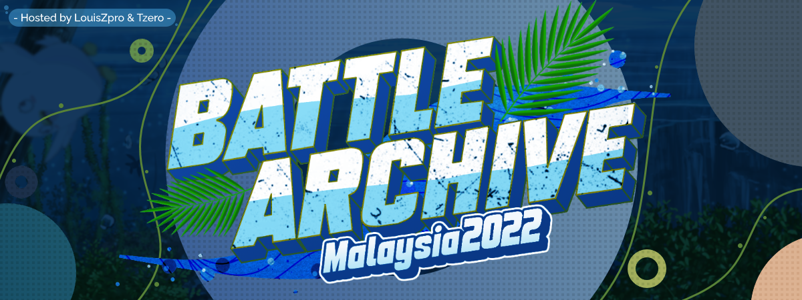

---
tags:
  - o!BAM
  - o!BAM 2
---

# osu! Battle Archive Malaysia 2022

The **osu! Battle Archive Malaysia 2022** (***o!BAM2***) was a double-elimination 2v2 osu! tournament hosted by ::{ flag=MY }:: [LouisZpro](https://osu.ppy.sh/users/6231292) and ::{ flag=MY }:: [Tzero](https://osu.ppy.sh/users/6088976). The tournament was open to teams of two with a ::{ flag=MY }:: Malaysian player as their captain, and the second player coming from one of the ten [ASEAN member states](https://asean.org/about-asean/member-states/) (::{ flag=BN }:: Brunei Darussalam, ::{ flag=KH }:: Cambodia, ::{ flag=ID }:: Indonesia, ::{ flag=LA }:: Laos, ::{ flag=MY }:: Malaysia, ::{ flag=MM }:: Myanmar, ::{ flag=PH }:: The Philippines, ::{ flag=SG }:: Singapore, ::{ flag=TH }:: Thailand, and ::{ flag=VN }:: Vietnam) regardless of rank. Despite the change in format from its previous iterations, the tournament was formally regarded as the second instalment of the osu! Battle Archive Malaysia.

## Tournament schedule

| Event | Timestamp |
| --: | :-- |
| Registration phase | 2022-08-19/2022-09-04 |
| Qualifiers | 2022-09-09/2022-09-11 |
| Live drawings | 2022-09-12 (22:00 UTC+8) |
| Group stage | 2022-09-16/2022-10-24 |
| Round of 16 | 2022-09-30/2022-10-02 |
| Quarterfinals | 2022-10-07/2022-10-09 |
| Semifinals | 2022-10-14/2022-10-16 |
| Finals week 1 | 2022-10-21/2022-10-23 |
| Finals week 2 | 2022-10-28/2022-10-30 |

## Prizes

| Placing | Prize(s) |
| :-: | :-- |
|  | 750 MYR, animated profile banners, unique profile badge |
|  | 375 MYR, animated profile banners |
|  | 225 MYR, animated profile banners |
| *4th place* | 150 MYR, animated profile banners |

## Organisation

The osu! Battle Archive Malaysia 2022 was run by various community members.

| Position | Member(s) |
| :-- | :-- |
| Organiser | ::{ flag=MY }:: [LouisZpro](https://osu.ppy.sh/users/6231292), ::{ flag=MY }:: [Tzero](https://osu.ppy.sh/users/6088976) |
| Administrator | ::{ flag=MY }:: [Laphii](https://osu.ppy.sh/users/9364594), ::{ flag=SG }:: [Kotoha](https://osu.ppy.sh/users/7823498) |
| Mappool selector | ::{ flag=MY }:: [LouisZpro](https://osu.ppy.sh/users/6231292), ::{ flag=SG }:: [Kotoha](https://osu.ppy.sh/users/7823498), ::{ flag=MY }:: [Tzero](https://osu.ppy.sh/users/6088976) |
| Playtester | ::{ flag=MY }:: [Agagak](https://osu.ppy.sh/users/3645490), ::{ flag=US }:: [bananaman533](https://osu.ppy.sh/users/1284243), ::{ flag=US }:: [BATBALL](https://osu.ppy.sh/users/15173952), ::{ flag=SG }:: [Demonical](https://osu.ppy.sh/users/5447609), ::{ flag=CA }:: [FlatPaper](https://osu.ppy.sh/users/11255340), ::{ flag=KR }:: [lolboatz](https://osu.ppy.sh/users/12962464), ::{ flag=SG }:: [m0fum0fu](https://osu.ppy.sh/users/5143605), ::{ flag=JP }:: [makipan](https://osu.ppy.sh/users/12944109), ::{ flag=SG }:: [Randomguruz](https://osu.ppy.sh/users/8040494), ::{ flag=SG }:: [Rtyzen](https://osu.ppy.sh/users/2439822) |
| Streamer | ::{ flag=MY }:: [Khoo Hao Yit](https://osu.ppy.sh/users/9534110), ::{ flag=MY }:: [Laphii](https://osu.ppy.sh/users/9364594),  ::{ flag=MY }:: [Its not Marvin](https://osu.ppy.sh/users/13600612) |
| Commentator | ::{ flag=MY }:: [banner](https://osu.ppy.sh/users/14290988), ::{ flag=ID }:: [BlankTap](https://osu.ppy.sh/users/10137131), ::{ flag=MY }:: [Fancyyy](https://osu.ppy.sh/users/12616268), ::{ flag=MY }:: [Hanami-](https://osu.ppy.sh/users/8703188), ::{ flag=MY }:: [Its not Marvin](https://osu.ppy.sh/users/13600612), ::{ flag=MY }:: [malaidan](https://osu.ppy.sh/users/14279913), ::{ flag=MY }:: [Racers03](https://osu.ppy.sh/users/11621976), ::{ flag=ID }:: [Raids](https://osu.ppy.sh/users/15640966), ::{ flag=MY }:: [squidstain](https://osu.ppy.sh/users/11073207) |
| Referee | ::{ flag=BN }:: [aaronkoichi](https://osu.ppy.sh/users/11288235), ::{ flag=MY }:: [dragonlemmy](https://osu.ppy.sh/users/14053835), ::{ flag=MY }:: [Hand Sanitiser](https://osu.ppy.sh/users/5091293), ::{ flag=MY }:: [Honor27](https://osu.ppy.sh/users/25419414), ::{ flag=MY }:: [Laphii](https://osu.ppy.sh/users/9364594), ::{ flag=MY }:: [Online](https://osu.ppy.sh/users/13486575), ::{ flag=VN }:: [rock-on](https://osu.ppy.sh/users/9676089), ::{ flag=MY }:: [Wen4ng3L](https://osu.ppy.sh/users/9288833) |
| Graphic designer | ::{ flag=MY }:: [LouisZpro](https://osu.ppy.sh/users/6231292) |
| Spreadsheet manager | ::{ flag=MY }:: [Laphii](https://osu.ppy.sh/users/9364594) |
| Wiki editor | ::{ flag=MY }:: [Laphii](https://osu.ppy.sh/users/9364594) |

## Links

- [Official website](https://obam.osumalaysia.org/)
- [Forum thread](https://osu.ppy.sh/community/forums/topics/1631878?n=1)
- [Discord server](https://discord.gg/GYqWsQbEbF)
- [Challonge brackets](https://challonge.com/OBAM2022)
- [Livestream](https://www.twitch.tv/osumys)
- **[Statistics sheet](https://docs.google.com/spreadsheets/d/1YFhj01IzKxNHZSRW2UoRECgAKintLc6nksrlaPVvtfE/edit#gid=2066198917)**

## Participants

| Seed No. | Team | Members | Z-Sum |
| :-: | :-- | :-- | :-- |
| 1 | **sturrige curry** | ::{ flag=MY }:: **[DuoX](https://osu.ppy.sh/users/9560694)**, ::{ flag=ID }:: [i love uma](https://osu.ppy.sh/users/7108275) | 16.43 |
| 2 | **Anti-Cunny Action** | ::{ flag=MY }:: **[not\_aweeb](https://osu.ppy.sh/users/9375317)**, ::{ flag=ID }:: [Rexeez](https://osu.ppy.sh/users/1987591) | 15.26 |
| 3 | **Diggas in paris** | ::{ flag=MY }:: **[Zeph2003](https://osu.ppy.sh/users/10343292)**, ::{ flag=SG }:: [Dawnwing](https://osu.ppy.sh/users/5144534) | 14.26 |
| 4 | **kinda hot tho** | ::{ flag=MY }:: **[Ryouuta](https://osu.ppy.sh/users/15020799)**, ::{ flag=VN }:: [[sin]](https://osu.ppy.sh/users/11021073) | 13.59 |
| 5 | **ENERGY GAP** | ::{ flag=MY }:: **[milo Penguin](https://osu.ppy.sh/users/10702232)**, ::{ flag=SG }:: [megumic](https://osu.ppy.sh/users/7537133) | 13.04 |
| 6 | **Miyu Archive** | ::{ flag=MY }:: **[Houshou Marine](https://osu.ppy.sh/users/6402211)**, ::{ flag=ID }:: [-Reuto-](https://osu.ppy.sh/users/10717635) | 12.44 |
| 7 | **RUDOLF ENJOYERS** | ::{ flag=MY }:: **[Rampax](https://osu.ppy.sh/users/3995630)**, ::{ flag=SG }:: [Inquisitives](https://osu.ppy.sh/users/10722794) | 11.76 |
| 8 | **Cat Enjoyer** | ::{ flag=MY }:: **[Lunasa](https://osu.ppy.sh/users/16436446)**, ::{ flag=SG }:: [GSBlank](https://osu.ppy.sh/users/2312106) | 11.49 |
| 9 | **Where Love Lies** | ::{ flag=MY }:: **[Tokino Sora](https://osu.ppy.sh/users/6996926)**, ::{ flag=ID }:: [Fuma](https://osu.ppy.sh/users/1501956) | 10.39 |
| 10 | **The Cunnysseurs** | ::{ flag=MY }:: **[Blethz](https://osu.ppy.sh/users/11918602)**, ::{ flag=ID }:: [BlankTap](https://osu.ppy.sh/users/10137131) | 5.88 |
| 11 | **Flover** | ::{ flag=MY }:: **[heyimcrunchy](https://osu.ppy.sh/users/13067221)**, ::{ flag=SG }:: [Hecatia](https://osu.ppy.sh/users/8244635) | 4.65 |
| 12 | **osu retirement** | ::{ flag=MY }:: **[iraozm](https://osu.ppy.sh/users/12443104)**, ::{ flag=TH }:: [\_Arigato](https://osu.ppy.sh/users/9317938) | 4.57 |
| 13 | **yes seggs** | ::{ flag=MY }:: **[Chiyuu](https://osu.ppy.sh/users/8226107)**, ::{ flag=MY }:: [Zygody](https://osu.ppy.sh/users/3677251) | 3.57 |
| 14 | **Dreamy Color** | ::{ flag=MY }:: **[Jolene](https://osu.ppy.sh/users/13626098)**, ::{ flag=MY }:: [Chibi Maruko](https://osu.ppy.sh/users/5585377) | 3.40 |
| 15 | **Vanity** | ::{ flag=MY }:: **[Inugami Korone](https://osu.ppy.sh/users/4474918)**, ::{ flag=MY }:: [Mumei Nanashi](https://osu.ppy.sh/users/5414124) | 1.87 |
| 16 | **chungus capoo** | ::{ flag=MY }:: **[GKen](https://osu.ppy.sh/users/12633052)**, ::{ flag=VN }:: [realshin](https://osu.ppy.sh/users/8006029) | 0.52 |
| 17 | **openureyesyouwillsee** | ::{ flag=MY }:: **[Judicious](https://osu.ppy.sh/users/8087710)**, ::{ flag=SG }:: [\_gt](https://osu.ppy.sh/users/8301957) | -1.19 |
| 18 | **NAJIB FANCLUB** | ::{ flag=MY }:: **[Hu_Ai](https://osu.ppy.sh/users/10910261)**, ::{ flag=SG }:: [JokThree](https://osu.ppy.sh/users/7713152) | -1.49 |
| 19 | **Offensize Name** | ::{ flag=MY }:: **[rhatson](https://osu.ppy.sh/users/14826877)**, ::{ flag=TH }:: [heathenz\_](https://osu.ppy.sh/users/14180969) | -1.51 |
| 20 | **koko soko asoko** | ::{ flag=MY }:: **[RyzenPP](https://osu.ppy.sh/users/16391241)**, ::{ flag=MY }:: [Tengkosu](https://osu.ppy.sh/users/17724583) | -1.68 |
| 21 | **LENG ZAI** | ::{ flag=MY }:: **[GodKnows](https://osu.ppy.sh/users/11058193)**, ::{ flag=SG }:: [Eagle5324](https://osu.ppy.sh/users/11987104) | -1.77 |
| 22 | **shiroko's bicycle** | ::{ flag=MY }:: **[AkariAoi](https://osu.ppy.sh/users/14067834)**, ::{ flag=SG }:: [Anderwear](https://osu.ppy.sh/users/14429830) | -2.76 |
| 23 | **The Platinum Wok** | ::{ flag=MY }:: **[Freion](https://osu.ppy.sh/users/15852740)**, ::{ flag=SG }:: [AhPlatus](https://osu.ppy.sh/users/15799171) | -2.84 |
| 24 | **:froggy:** | ::{ flag=MY }:: **[Desumond](https://osu.ppy.sh/users/7399262)**, ::{ flag=VN }:: [walle](https://osu.ppy.sh/users/8431549) | -3.68 |
| 25 | **洪家派驰名海鲜煮炒餐馆 (Hongjiapai Famous Seafood Restaurant)** | ::{ flag=MY }:: **[Racers03](https://osu.ppy.sh/users/11621976)**, ::{ flag=MY }:: [DaNoobSlayaar](https://osu.ppy.sh/users/8688777) | -3.78 |
| 26 | **Can We Get Much Higher** | ::{ flag=MY }:: **[Snowy5441](https://osu.ppy.sh/users/13865320)**, ::{ flag=MY }:: [LITFAM123](https://osu.ppy.sh/users/13584478) | -3.94 |
| 27 | **Japanese Goblin** | ::{ flag=MY }:: **[Mano Aloe](https://osu.ppy.sh/users/5429513)**, ::{ flag=MY }:: [Watson Amelia](https://osu.ppy.sh/users/12674638) | -4.63 |
| 28 | **Damn bratty crewmate** | ::{ flag=MY }:: **[Floth](https://osu.ppy.sh/users/11134301)**, ::{ flag=MY }:: [Axorite](https://osu.ppy.sh/users/9124278) | -4.91 |
| 29 | **Ikan** | ::{ flag=MY }:: **[-quack](https://osu.ppy.sh/users/16502529)**, ::{ flag=MY }:: [Izayoii](https://osu.ppy.sh/users/15542056) | -6.96 |
| 30 | **Mandekissafriend** | ::{ flag=MY }:: **[Ookami Mion](https://osu.ppy.sh/users/8009988)**, ::{ flag=MY }:: [Hachune Miku](https://osu.ppy.sh/users/10584780) | -7.7 |
| 31 | **Marv and Willy show** | ::{ flag=MY }:: **[Its not Marvin](https://osu.ppy.sh/users/13600612)**, ::{ flag=MY }:: [Hanami-](https://osu.ppy.sh/users/8703188) | -8.03 |
| 32 | **AMOGUS SUSSY BAKA S\_** | ::{ flag=MY }:: **[Lollicornzi](https://osu.ppy.sh/users/14454744)**, ::{ flag=MY }:: [cherry sweet](https://osu.ppy.sh/users/12079158) | -8.05 |

## Groups

| Group | Top Seed | High Seed | Low Seed | Unseeded |
| :-: | :-- | :-- | :-- | :-- |
| **A** | kinda hot tho | Flover | :froggy: | 洪家派驰名海鲜煮炒餐馆 |
| **B** | ENERGY GAP | Dreamy Color | LENG ZAI | Damn bratty crewmate |
| **C** | Miyu Archive | chungus capoo | Offensize Name | Marv and Willy show |
| **D** | RUDOLF ENJOYERS | yes seggs | koko soko asoko | Can We Get Much Higher |
| **E** | Diggas in paris | The Cunnysseurs | openureyesyouwillsee | Japanese Goblin |
| **F** | Cat Enjoyer | Vanity | NAJIB FANCLUB | AMOGUS SUSSY BAKA S\_ |
| **G** | sturrige curry | Where Love Lies | The Platinum Wok | Ikan |
| **H** | Anti-Cunny Action | osu retirement | shiroko's bicycle | Mandekissafriend |

## Podium

This competition has come to an end and resulted in the following podium:

| Placing | Team |
| :-: | :-- |
|  | **Miyu Archive** (::{ flag=MY }:: **[Houshou Marine](https://osu.ppy.sh/users/6402211)**, ::{ flag=ID }:: [-Reuto-](https://osu.ppy.sh/users/10717635)) |
|  | **RUDOLF ENJOYERS** (::{ flag=MY }:: **[Rampax](https://osu.ppy.sh/users/3995630)**, ::{ flag=SG }:: [Inquisitives](https://osu.ppy.sh/users/10722794)) |
|  | **Diggas in paris** (::{ flag=MY }:: **[Zeph2003](https://osu.ppy.sh/users/10343292)**, ::{ flag=SG }:: [Dawnwing](https://osu.ppy.sh/users/5144534)) |

## Mappools

### Grand Finals

**[Download the mappack here! (144 MB)](https://cdn.discordapp.com/attachments/959526009546346516/1034143554110500984/OBAM_2022_GRAND_FINALS.rar)**

- NoMod
  1. [Nor - Arnab dari Caerbannog (Theme 113) ([ -Scarlet- ]) \[Usamimi SRT Squad\]](https://osu.ppy.sh/beatmapsets/1871063#osu/3849591)
  2. [Mitsukiyo - Unwelcome School (Amateurre) \[mayuwhim\]](https://osu.ppy.sh/beatmapsets/1635167#osu/3338504)
  3. [BEMANI Sound Team "Nekomata Gekidan" - Afterimage d'automne (Lulu-) \[Decaying Foliage\]](https://osu.ppy.sh/beatmapsets/1083051#osu/2271628)
  4. [Team Grimoire vs Sakuzyo vs Laur - Arcana Eden (Cubby) \[Judgment\]](https://osu.ppy.sh/beatmapsets/1806912#osu/3705545)
  5. [Tatsh - IMAGE -MATERIAL- <Version 0> (Scorpiour) \[Scorpiour\]](https://osu.ppy.sh/beatmapsets/93523#osu/252238)
  6. [Jay Chou - Piano Battle (movie ver.) (Agagak) \[Rhythm Battle (feat aim.)\]](https://osu.ppy.sh/beatmapsets/1872483#osu/3853000)
- Hidden
  1. [Sephid - Critical Cannonball (Extended ver.) (Mattay) \[Impact (tourney ver.)\]](https://osu.ppy.sh/beatmapsets/1814350#osu/3722071)
  2. [Naru Hakobe (CV: M.A.O) - Neko Matsuri (cocona) \[YOISHO\]](https://osu.ppy.sh/beatmapsets/1551595#osu/3170541)
  3. [Kikuo - Gangu Kyou Sou Kyoku -Shuuen- (egg and cheese) \[Extreme\]](https://osu.ppy.sh/beatmapsets/1536944#osu/3142490)
  4. [Luschka - Kami no Kotoba (aishiteiru-) \[laicepS s'naznuoJ\]](https://osu.ppy.sh/beatmapsets/1759308#osu/3600651)
- HardRock
  1. [Camellia - Newspapers for Magicians (Mir) \[Harmonious\]](https://osu.ppy.sh/beatmapsets/938426#osu/1960286)
  2. [onoken - Alexandrite (iLyne) \[Chrysoberyl\]](https://osu.ppy.sh/beatmapsets/1567583#osu/3200715)
  3. [Isekai Joucho - Replica (Smug Nanachi) \[Imitation\]](https://osu.ppy.sh/beatmapsets/1563327#osu/3192418)
- DoubleTime
  1. [Chata - len (Kalibe) \[emptiness\]](https://osu.ppy.sh/beatmapsets/918509#osu/1918025)
  2. [succducc - me & u (jazzberry) \[ai\]](https://osu.ppy.sh/beatmapsets/1503621#osu/3080545)
  3. [M2U - Gypsy Tronic (LKs) \[Insane\]](https://osu.ppy.sh/beatmapsets/61590#osu/183460)
  4. [xi - Ascension to Heaven (-Tynamo) \[Nagatoro's Insane\]](https://osu.ppy.sh/beatmapsets/968656#osu/2061330)
- DoubleTime + HardRock
  1. [Yorushika - 8/31 (renzthegreat) \[Track 1: Shashou\]](https://osu.ppy.sh/beatmapsets/1769074#osu/3621409)
- FreeMod
  1. [Rohi - LvC3 (hanabyte) \[Hana\]](https://osu.ppy.sh/beatmapsets/1747140#osu/3573741)
  2. [the wandering bard feat. Shikata Akiko - Catastrophic Dance (too) \[MSS'21 December #5\]](https://osu.ppy.sh/beatmapsets/1658846#osu/3386059)
  3. [Tsukumonemu - All I Am is Bad (Caspar) \[Yelling Maiden\]](https://osu.ppy.sh/beatmapsets/1331683#osu/2759007)

### Finals

**[Download the mappack here! (135 MB)](https://cdn.discordapp.com/attachments/959526009546346516/1031606942449270935/OBAM_2022_Finals_.rar)**

- NoMod
  1. [DNCE - Cake by the Ocean (Axarious) \[start living dangerously\]](https://osu.ppy.sh/beatmapsets/431309#osu/930307)
  2. [i-win - SPEED OF KIRB 11.0 (Suicune3) \[KIRB Runs to BOP\]](https://osu.ppy.sh/beatmapsets/1789406#osu/3666502)
  3. [3R2 - Sudden Death (Settia) \[Yumeno Yuki Fan's Novice\]](https://osu.ppy.sh/beatmapsets/605109#osu/2320454)
  4. [Camellia feat. Nanahira - Seashore on the Moon (melloe) \[where the fisherman sings his lonely song\]](https://osu.ppy.sh/beatmapsets/685242#osu/1450182)
  5. [Kotone - Hands (ktgster) \[Special\]](https://osu.ppy.sh/beatmapsets/1423114#osu/2930738)
- Hidden
  1. [Iglooghost - Bug Thief (Pyo) \[Swarm\]](https://osu.ppy.sh/beatmapsets/1390700#osu/2871724)
  2. [DIALOGUE+ - Omoide Shiritori (yukic) \[kuti real\]](https://osu.ppy.sh/beatmapsets/1544492#osu/3167735)
  3. [Michiru Kagemori (CV: Sumire Morohoshi) - Ready to (Axaptice) \[+\]](https://osu.ppy.sh/beatmapsets/1506973#osu/3086592)
- HardRock
  1. [Mifune Shioriko (CV: Koizumi Moeka) - Ketsui no Hikari (Aikyan) \[Determination\]](https://osu.ppy.sh/beatmapsets/1403780#osu/2895362)
  2. [ak+q feat. Sennzai - Solitary Dream (-[Pino]-) \[Kuuhaku\]](https://osu.ppy.sh/beatmapsets/1012249#osu/2118753)
  3. [Ohta Asuka, Nagamatsu Ryo - Coconut Mall (downpour) \[blixys' Extra\]](https://osu.ppy.sh/beatmapsets/1063080#osu/2456973)
- DoubleTime
  1. [Endorfin. - Natsuirozaka (Tsumia) \[0\]](https://osu.ppy.sh/beatmapsets/904418#osu/1887862)
  2. [Taishi feat. Mitose Noriko - Innocencia (celerih) \[Another\]](https://osu.ppy.sh/beatmapsets/904418#osu/1887862)
  3. [t+pazolite - Oshama Scramble! (IOException Edit) (IOException) \[Insane\]](https://osu.ppy.sh/beatmapsets/1376308#osu/2848137)
  4. [Dua Lipa - Levitating (Asphyxia) \[Moonlight\]](https://osu.ppy.sh/beatmapsets/1323527#osu/2741533)
- Easy
  1. [Yunomi & nicamoq - Indoor Kei Nara Trackmaker (Snow Note) \[Another\]](https://osu.ppy.sh/beatmapsets/525846#osu/1115999)
- FreeMod
  1. [Hyun - Soulwind (yaspo) \[Wind\]](https://osu.ppy.sh/beatmapsets/1262412#osu/2623954)
  2. [ASU x harusaruhi - No title (Chizu-Kun) \["  "\]](https://osu.ppy.sh/beatmapsets/1868072#osu/3842827)
  3. [Kaneko Chiharu - Lachryma<Re\:Queen'M> (SeaRasp) \[Atmosphere\]](https://osu.ppy.sh/beatmapsets/534344#osu/1131881)

### Semifinals

**[Download the mappack here! (121 MB)](https://cdn.discordapp.com/attachments/959526009546346516/1029057857917812746/OBAM_2022_Semifinals.rar)**

- NoMod
  1. [Nekomata Master - Despair of ELFERIA (Perseus) \[Misery\]](https://osu.ppy.sh/beatmapsets/484724#osu/1033939)
  2. [SAMString - Shifting Clouds (My Angel Nino) \[Blooming Sky\]](https://osu.ppy.sh/beatmapsets/1532094#osu/3133390)
  3. [Sangatsu no Phantasia - 101 (Jiysea) \[Binary\]](https://osu.ppy.sh/beatmapsets/1557672#osu/3181958)
  4. [t+pazolite - Ka wa Taredoki no Yuuwaku (Seolv) \[Aistre's Extra\]](https://osu.ppy.sh/beatmapsets/1396547#osu/3426904)
  5. [kamome sano - lovesick feat. punipunidenki (mnyui) \[mayu's extra\]](https://osu.ppy.sh/beatmapsets/1732015#osu/3576121)
  6. [angela - Otome no Route wa Hitotsu Janai! (TV Size) (P1Twist) \[Awesome Sauce\]](https://osu.ppy.sh/beatmapsets/1709654#osu/3493468)
- Hidden
  1. [angela - Otome no Route wa Hitotsu Janai! (verychill) \[Camo's Extreme\]](https://osu.ppy.sh/beatmapsets/1153303#osu/3120569)
  2. [TQ* - Oracle (KKipalt) \[ar8\]](https://osu.ppy.sh/beatmapsets/1257565#osu/3607570)
  3. [Yunosuke feat. Kafu - Hana to Nare (Chills) \[Expert: Embracing Bloom\]](https://osu.ppy.sh/beatmapsets/1650302#osu/3368327)
- HardRock
  1. [ginkiha feat. TEA - Neon tetra -kamome sano Remix- (Rumia-) \[Aquarium\]](https://osu.ppy.sh/beatmapsets/567692#osu/1203222)
  2. [M2U - Wicked Fate (PaRaDogi) \[Rose\]](https://osu.ppy.sh/beatmapsets/1784450#osu/3654635)
  3. [Mitsukiyo - Constant Moderato (araran) \[Sunazuka Akira's Extra\]](https://osu.ppy.sh/beatmapsets/1640689#osu/3369276)
- DoubleTime
  1. [Liz Triangle - Veda (Millie) \[Funky Collab (edit ver.)\]](https://osu.ppy.sh/beatmapsets/1816591#osu/3733005)
  2. [isekaijoucho - Dimension (Rtyzen) \[Insane\]](https://osu.ppy.sh/beatmapsets/1613731#osu/3427718)
  3. [DUSTCELL - izqnqi (Kudou Chitose) \[insqne\]](https://osu.ppy.sh/beatmapsets/1772131#osu/3628184)
  4. [Silentroom - Aliake (Kardshark) \[~\]](https://osu.ppy.sh/beatmapsets/1863807#osu/3832849)
- Flashlight + FreeMod
  1. [Nyarons - After The Rain (Striderin) \[Pichi Pichi Jabu Jabu La La La\]](https://osu.ppy.sh/beatmapsets/841259#osu/1760614)
- FreeMod
  1. [Aitsuki Nakuru - Enamel no Butoukai (Settia) \[waltz of the fairytale\]](https://osu.ppy.sh/beatmapsets/553947#osu/1172882)
  2. [Mikazuki BIGWAVE - WAVE2020 (Faito) \[EXTRA\]](https://osu.ppy.sh/beatmapsets/1397341#osu/2883686)

### Quarterfinals

**[Download the mappack here! (94 MB)](https://cdn.discordapp.com/attachments/959526009546346516/1026517827089346590/OBAM2022_QF.rar)**

- NoMod
  1. [Aqours - Jump up HIGH!! (ktgster) \[Special\]](https://osu.ppy.sh/beatmapsets/1070810#osu/2241432)
  2. [Kushper - Valley of Anime Ban (CosmicWolf) \[~Oh, Behold The Adventure~\]](https://osu.ppy.sh/beatmapsets/1463107#osu/3005485)
  3. [Ushirokara Haiyoritai G - Koi wa Chaos no Shimobenari (Amamya) \[Rihan's Extra\]](https://osu.ppy.sh/beatmapsets/1717491#osu/3529703)
  4. [Osanzi feat. Hatsune Miku - Manipulate (mrforse) \[Just Move...\]](https://osu.ppy.sh/beatmapsets/1770504#osu/3624362)
  5. [CK - stella fiume (mezelyus) \[Delphinium\]](https://osu.ppy.sh/beatmapsets/1769503#osu/3622267)
- Hidden
  1. [Aitsuki Nakuru - Azura Luno (Keqing) \[Lunar Collab\]](https://osu.ppy.sh/beatmapsets/1465077#osu/3009051)
  2. [Tanaka Nozomu, Kikuchi Akane, Saginomiya Shiori - Wa! Moon! dass! cry! (TV Size) (Yukiyo) \[ok\]](https://osu.ppy.sh/beatmapsets/999023#osu/2089413)
  3. [Nekomata Master vs. HuMeR - BUZRA (Kyumo) \[J1'S EXTRA\]](https://osu.ppy.sh/beatmapsets/1376812#osu/2846066)
- HardRock
  1. [Manaka Kataoka & Yasuaki Iwata - Main Theme (Pyo) \[Breath of the Wild\]](https://osu.ppy.sh/beatmapsets/1432655#osu/2948556)
  2. [solfa feat. Ceui - Koiiro Recipe (Amamya) \[Mayu's Insane\]](https://osu.ppy.sh/beatmapsets/1087207#osu/3286450)
  3. [sana - Hisui no Machi (Firika) \[Rumi's Extra\]](https://osu.ppy.sh/beatmapsets/1017483#osu/2239240)
- DoubleTime
  1. [Nakasu Kasumi (CV: Sagara Mayu) - Mutekikyuu*Believer (caps) \[Noctiam's Insane\]](https://osu.ppy.sh/beatmapsets/1190325#osu/2602942)
  2. [Xceon - Fuyu Tsubaki ft. Kanae Asaba (\_kotachi\_) \[el psy congroo\]](https://osu.ppy.sh/beatmapsets/1756741#osu/3595025)
  3. [Down - Luscent (Down) \[Lunatic\]](https://osu.ppy.sh/beatmapsets/1641533#osu/3350322)
- DoubleTime + Easy
  1. [SHK - Death Moon II (ktgster) \[Insane\]](https://osu.ppy.sh/beatmapsets/472158#osu/1009021)
- FreeMod
  1. [Rohi - Kakuzetsu Thanatos (NatsumeRin) \[Skystar\]](https://osu.ppy.sh/beatmapsets/1859909#osu/3823340)
  2. [Nor - Theme 121 (Chizu-Kun) \[wakamo one shot ?\]](https://osu.ppy.sh/beatmapsets/1859909#osu/3823340)

### Round of 16

**[Download the mappack here! (118 MB)](https://cdn.discordapp.com/attachments/959526009546346516/1024343605042745345/OBAM_2022_RO16.rar)**

- NoMod
  1. [CIEL - Mado o Akete (Kotoha) \[ponbot's Affection\]](https://osu.ppy.sh/beatmapsets/1796301#osu/3682178)
  2. [NEFFY - Kilmer (Rtyzen) \[Velvet Rope\]](https://osu.ppy.sh/beatmapsets/1856348#osu/3815140)
  3. [HIMEHINA - Hitogata (TV Size) (Ryuusei Aika) \[0108's Extra\]](https://osu.ppy.sh/beatmapsets/942714#osu/1986093)
  4. [Taiga Lucia (CV: Hoshikawa Sara) - NANAIRO STAGE (Prod. YUC'e) (Amateurre) \[Rainbow\]](https://osu.ppy.sh/beatmapsets/1585836#osu/3239063)
  5. [AZKi - Fake.Fake.Fake (Luscent) \[Collab Extra\]](https://osu.ppy.sh/beatmapsets/1611987#osu/3554698)
  6. [Machita Chima - CH4NGE (Kudou Chitose) \[DON'T GET IN MY W4Y\]](https://osu.ppy.sh/beatmapsets/1751949#osu/3584470)
- Hidden
  1. [Nakiri Ayame - Deep Indigo (Bokamin) \[ponbot's Expert\]](https://osu.ppy.sh/beatmapsets/1189193#osu/2572003)
  2. [HIMEHINA - Hibari (Ryuusei Aika) \[R.U.R.\]](https://osu.ppy.sh/beatmapsets/998849#osu/2089091)
  3. [Calliope Mori x Gawr Gura x DECO*27 - Q (Ryuusei Aika) \[Mayu's Expert\]](https://osu.ppy.sh/beatmapsets/1693923#osu/3475887)
- HardRock
  1. [Minato Aqua - Shiroi Yuki no Princess wa (Amateurre) \[Aquanother\]](https://osu.ppy.sh/beatmapsets/1095366#osu/2748324)
  2. [VESPERBELL - Vampire (Petal) \[Ayucchi's Expert\]](https://osu.ppy.sh/beatmapsets/1493527#osu/3062815)
  3. [momomoaji - Ginkou Hoshikawaa! (Cami) \[Madness\]](https://osu.ppy.sh/beatmapsets/1118992#osu/2337265)
- DoubleTime
  1. [Minato Aqua - Kaisou Ressha (vick) \[Dream\]](https://osu.ppy.sh/beatmapsets/1555132#osu/3177168)
  2. [Lizean - Shinde Shimau towa Nasakenai! (Yugu) \[Insane\]](https://osu.ppy.sh/beatmapsets/1052264#osu/2201137)
  3. [YuNi - Toumei Seisai (Bazz B) \[gambatte's Insane\]](https://osu.ppy.sh/beatmapsets/1175057#osu/2450947)
- FreeMod
  1. [YUKA NAGASE - Hide and Dance (Kotoha) \[kind of colab\]](https://osu.ppy.sh/beatmapsets/1856371#osu/3815203)
  2. [Kaf - Konayuki (Yugu) \[Sleet\]](https://osu.ppy.sh/beatmapsets/1068748#osu/2237429)

### Group stage

**[Download the mappack here! (77 MB)](https://cdn.discordapp.com/attachments/959526009546346516/1018855345138962494/OBAM2_Groupstage.rar)**

- NoMod
  1. [Feryquitous feat. Aitsuki Nakuru - Bascor (Seolv) \[Glorious Collab\]](https://osu.ppy.sh/beatmapsets/1090138#osu/2278971)
  2. [Roselia - Charles (Yugu) \[kanor's Rua^\]](https://osu.ppy.sh/beatmapsets/839553#osu/1758680)
  3. [Hatsuki Yura - Halloween of the Dead 2 (Elayue) \[Happy Halloween\]](https://osu.ppy.sh/beatmapsets/1542855#osu/3153693)
  4. [Mitsukiyo - Hifumi Daisuki (Amateurre) \[Extraordinary\]](https://osu.ppy.sh/beatmapsets/1829914#osu/3755787)
  5. [brz1128 vs. M-UE - Bloody Marquis (Athanasia-) \[Athanasia's Extra\]](https://osu.ppy.sh/beatmapsets/1783848#osu/3653240)
  6. [KAF feat. KAFU - phony (Astrolis) \[Sayonara\]](https://osu.ppy.sh/beatmapsets/1654426#osu/3376899)
- Hidden
  1. [xi - Parousia (Niva) \[Eschatology (AR8.5)\]](https://osu.ppy.sh/beatmapsets/1713530#osu/3501365)
- HardRock
  1. [Mifune Shioriko (CV: Koizumi Moeka) - Aoi Canaria (Murada-) \[True Freedom\]](https://osu.ppy.sh/beatmapsets/1706527#osu/3487001)
  2. [solfa - Yami no Rinne (feat. yuki) (LMT) \[Allure of Darkness\]](https://osu.ppy.sh/beatmapsets/1739716#osu/3555764)
- DoubleTime
  1. [Harumaki Gohan - Saikai (AirinCat) \[Fujirin's Insane\]](https://osu.ppy.sh/beatmapsets/1602654#osu/3312899)
  2. [NIKITA - ELECTRiCiTY (Rokkea) \[Another\]](https://osu.ppy.sh/beatmapsets/241372#osu/640771)
  3. [lical - nyctalopia (Raijodo) \[hard\]](https://osu.ppy.sh/beatmapsets/1284666#osu/2766955)
- DoubleTime + Hidden
  1. [Yellow Zebra - Orange Diz (Frill) \[gow's Insane\]](https://osu.ppy.sh/beatmapsets/17306#osu/73514)
- FreeMod
  1. [DJ Sharpnel - Marunouchi survivor (ampzz) \[GALV'S SENRYAKU!!\]](https://osu.ppy.sh/beatmapsets/113330#osu/294015)
  2. [yuki - Clammbon (Short Ver.) (Garden) \[Insane\]](https://osu.ppy.sh/beatmapsets/1707693#osu/3489464)

### Qualifiers

**[Download the mappack here! (72 MB)](https://cdn.discordapp.com/attachments/959526009546346516/1016688876674351124/obam2_qualifiers_.rar)**

- NoMod
  1. [kamome sano - Kcharlotte aux framboises (colate+kamome sano Remix) [feat. mami] (Left) \[Left's Sweety Sweety Extra ft. Moecho\]](https://osu.ppy.sh/beatmapsets/988413#osu/2073076)
  2. [sasakure.UK - Kirin (maimai ver.) (Elcheer) \[MAXIMUM\]](https://osu.ppy.sh/beatmapsets/1635066#osu/3337054)
  3. [BlackY feat. Risa Yuzuki - Shumatsu kinema (Scyhei) \[Reflection\]](https://osu.ppy.sh/beatmapsets/1648707#osu/3365231)
  4. [Kozakai Yurie, Omori Nichika, Hasegawa Rena - Hyper Bass (feat. Yunomi) (Hikan) \[ii\]](https://osu.ppy.sh/beatmapsets/1618954#osu/3305493)
- Hidden
  1. [Sota Fujimori - polygon (Sebu) \[-PC's hexagon\]](https://osu.ppy.sh/beatmapsets/422136#osu/1028537)
- Hidden + HardRock
  1. [sasanomaly - Onomatopoeia Glasses (Sagu) \[o-o-.\]](https://osu.ppy.sh/beatmapsets/1439058#osu/2960994)
- HardRock
  1. [Yamamoto Mineko - Cadena (Kazato Asa) \[Meruru Collab\]](https://osu.ppy.sh/beatmapsets/1214274#osu/2527237)
  2. [Miyo Takashiro feat. Aitsuki Nakuru - mirror (Avace) \[Celine's mirror\]](https://osu.ppy.sh/beatmapsets/1782658#osu/3650730)
- DoubleTime
  1. [Haloweak - Narwhal (meiikyuu) \[Rosetta\]](https://osu.ppy.sh/beatmapsets/1173876#osu/2474826)
  2. [ARM x Komso feat. Nanahira - Onegai! Kon kon Oinarisama ([Paw]OchiKouri) \[Muz's Insane\]](https://osu.ppy.sh/beatmapsets/1261912#osu/2635712)
  3. [Suara - Nuedori (VINXIS) \[emilia's Heavy Insane\]](https://osu.ppy.sh/beatmapsets/1143697#osu/2479193)

## Match results

### Grand Finals

Saturday, 29 October 2022:

| Bracket | Team 1 |  |  | Team 2 | Match link |
| :-: | --: | :-: | :-: | :-- | :-- |
| Lower | Diggas in paris | 4 | **8** | **RUDOLF ENJOYERS** | [#1](https://osu.ppy.sh/community/matches/104727790) |

Saturday, 5 November 2022:

| Bracket | Team 1 |  |  | Team 2 | Match link |
| :-: | --: | :-: | :-: | :-- | :-- |
| Grand Final | Miyu Archive | 2 | **8** | **RUDOLF ENJOYERS** | [#1](https://osu.ppy.sh/community/matches/104870376) |
| Bracket Reset | RUDOLF ENJOYERS | 3 | **8** | **Miyu Archive** | [#1](https://osu.ppy.sh/community/matches/104871585) |

### Finals

Saturday, 22 October 2022:

| Bracket | Team 1 |  |  | Team 2 | Match link |
| :-: | --: | :-: | :-: | :-- | :-- |
| Lower | Vanity | 0 | **7** | **ENERGY GAP** | *win by default* |

Sunday, 23 October 2022:

| Bracket | Team 1 |  |  | Team 2 | Match link |
| :-: | --: | :-: | :-: | :-- | :-- |
| Lower | **RUDOLF ENJOYERS** | **7** | 3 | Anti-Cunny Action | [#1](https://osu.ppy.sh/community/matches/104605052) |
| Lower | ENERGY GAP | 0 | **7** | **RUDOLF ENJOYERS** | [#1](https://osu.ppy.sh/community/matches/104606818) |

Monday, 24 October 2022:

| Bracket | Team 1 |  |  | Team 2 | Match link |
| :-: | --: | :-: | :-: | :-- | :-- |
| Upper | **Miyu Archive** | **7** | 5 | Diggas in paris | [#1](https://osu.ppy.sh/community/matches/104628020) |

### Semifinals

Thursday, 13 October 2022:

| Bracket | Team 1 |  |  | Team 2 | Match link |
| :-: | --: | :-: | :-: | :-- | :-- |
| Lower | **ENERGY GAP** | **7** | 5 | osu retirement | [#1](https://osu.ppy.sh/community/matches/104396525) |

Friday, 14 October 2022:

| Bracket | Team 1 |  |  | Team 2 | Match link |
| :-: | --: | :-: | :-: | :-- | :-- |
| Lower | kinda hot tho | 5 | **7** | **Where Love Lies** | [#1](https://osu.ppy.sh/community/matches/104413123) |
| Lower | NAJIB FANCLUB | 0 | **7** | **Anti-Cunny Action** | [#1](https://osu.ppy.sh/community/matches/104414179) |
| Upper | Vanity | 1 | **7** | **Miyu Archive** | [#1](https://osu.ppy.sh/community/matches/104414205) |

Saturday, 15 October 2022:

| Bracket | Team 1 |  |  | Team 2 | Match link |
| :-: | --: | :-: | :-: | :-- | :-- |
| Lower | Where Love Lies | 2 | **7** | **Anti-Cunny Action** | [#1](https://osu.ppy.sh/community/matches/104439467) |

Sunday, 16 October 2022:

| Bracket | Team 1 |  |  | Team 2 | Match link |
| :-: | --: | :-: | :-: | :-- | :-- |
| Lower | chungus capoo | 1 | **7** | **yes seggs** | [#1](https://osu.ppy.sh/community/matches/104459934) |

Monday, 17 October 2022:

| Bracket | Team 1 |  |  | Team 2 | Match link |
| :-: | --: | :-: | :-: | :-- | :-- |
| Lower | yes seggs | 4 | **7** | **ENERGY GAP** | [#1](https://osu.ppy.sh/community/matches/104484394) |
| Upper | RUDOLF ENJOYERS | 3 | **7** | **Diggas in paris** | [#1](https://osu.ppy.sh/community/matches/104485245) |

### Quarterfinals

Friday, 7 October 2022:

| Bracket | Team 1 |  |  | Team 2 | Match link |
| :-: | --: | :-: | :-: | :-- | :-- |
| Lower | **The Cunnysseurs** | **6** | 0 | :froggy: | [#1](https://osu.ppy.sh/community/matches/104274433) |
| Lower | **yes seggs** | **6** | 0 | Offensize Name | *win by default* |
| Lower | **osu retirement** | **6** | 0 | Japanese Goblin | *win by default* |
| Upper | NAJIB FANCLUB | 3 | **6** | **Vanity** | [#1](https://osu.ppy.sh/community/matches/104276614) |

Saturday, 8 October 2022:

| Bracket | Team 1 |  |  | Team 2 | Match link |
| :-: | --: | :-: | :-: | :-- | :-- |
| Lower | **Anti-Cunny Action** | **6** | 2 | Cat Enjoyer | [#1](https://osu.ppy.sh/community/matches/104297022) |
| Lower | **Dreamy Color** | **6** | 0 | koko soko asoko | *win by default* |
| Lower | The Cunnysseurs | 0 | **6** | **Anti-Cunny Action** | [#1](https://osu.ppy.sh/community/matches/104298727) |
| Lower | **Flover** | **6** | 2 | Can We Get Much Higher | [#1](https://osu.ppy.sh/community/matches/104298775) |
| Upper | **Diggas in paris** | **6** | 0 | chungus capoo | [#1](https://osu.ppy.sh/community/matches/104298524) |
| Lower | **Where Love Lies** | **6** | 1 | Damn bratty crewmate | [#1](https://osu.ppy.sh/community/matches/104301108) |
| Lower | sturrige curry | 0 | **6** | **openureyesyouwillsee** | *win by default* |

Sunday, 9 October 2022:

| Bracket | Team 1 |  |  | Team 2 | Match link |
| :-: | --: | :-: | :-: | :-- | :-- |
| Upper | ENERGY GAP | 2 | **6** | **RUDOLF ENJOYERS** | [#1](https://osu.ppy.sh/community/matches/104321999) |
| Lower | Dreamy Color | 1 | **6** | **Where Love Lies** | [#1](https://osu.ppy.sh/community/matches/104324188) |
| Lower | **osu retirement** | **6** | 2 | openureyesyouwillsee | [#1](https://osu.ppy.sh/community/matches/104324086) |
| Upper | **Miyu Archive** | **6** | 2 | kinda hot tho | [#1](https://osu.ppy.sh/community/matches/104324093) |

Tuesday, 11 October 2022:

| Bracket | Team 1 |  |  | Team 2 | Match link |
| :-: | --: | :-: | :-: | :-- | :-- |
| Lower | Flover | 3 | **6** | **yes seggs** | [#1](https://osu.ppy.sh/community/matches/104361271) |

### Round of 16

Friday, 30 September 2022:

| Bracket | Team 1 |  |  | Team 2 | Match link |
| :-: | --: | :-: | :-: | :-- | :-- |
| Lower | Can We Get Much Higher | 6 | **3** | **Marv and Willy show** | [#1](https://osu.ppy.sh/community/matches/104121676) |
| Lower | LENG ZAI | 4 | **6** | **Damn bratty crewmate** | [#1](https://osu.ppy.sh/community/matches/104122730) |

Saturday, 1 October 2022:

| Bracket | Team 1 |  |  | Team 2 | Match link |
| :-: | --: | :-: | :-: | :-- | :-- |
| Upper | **Miyu Archive** | **6** | 1 | yes seggs | [#1](https://osu.ppy.sh/community/matches/104147351) |
| Upper | Dreamy Color | 1 | **6** | **chungus capoo** | [#1](https://osu.ppy.sh/community/matches/104148876) |
| Lower | **:froggy:** | 6 | 1 | Ikan | [#1](https://osu.ppy.sh/community/matches/104150253) |
| Lower | The Platinum Wok | 0 | **6** | **Japanese Goblin** | *win by default* |
| Lower | shiroko's bicycle | 0 | **6** | **koko soko asoko** | *win by default* |

Sunday, 2 October 2022:

| Bracket | Team 1 |  |  | Team 2 | Match link |
| :-: | --: | :-: | :-: | :-- | :-- |
| Lower | Offensize Name | 0 | **6** | **Mandekissafriend** | *win by default* |
| Upper | sturrige curry | 0 | **6** | **NAJIB FANCLUB** | *win by default* |
| Upper | **Diggas in paris** | **6** | 2 | Where Love Lies | [#1](https://osu.ppy.sh/community/matches/104177721) |
| Lower | **openureyesyouwillsee** | **6** | 0 | AMOGUS SUSSY BAKA S\_ | [#1](https://osu.ppy.sh/community/matches/104179121) |
| Upper | Flover | 4 | **6** | **kinda hot tho** | [#1](https://osu.ppy.sh/community/matches/104178864) |
| Upper | Anti-Cunny Action | 0 | **6** | **ENERGY GAP** | *win by default* |

Monday, 3 October 2022:

| Bracket | Team 1 |  |  | Team 2 | Match link |
| :-: | --: | :-: | :-: | :-- | :-- |
| Lower | **Cat Enjoyer** | **6** | 0 | 洪家派驰名海鲜煮炒餐馆 (Hongjiapai Famous Seafood Restaurant) | [#1](https://osu.ppy.sh/community/matches/104199705) |
| Upper | **Vanity** | **6** | 5 | osu retirement | [#1](https://osu.ppy.sh/community/matches/104201764) |

Tuesday, 4 October 2022:

| Bracket | Team 1 |  |  | Team 2 | Match link |
| :-: | --: | :-: | :-: | :-- | :-- |
| Upper | **RUDOLF ENJOYERS** | **6** | 5 | The Cunnysseurs | [#1](https://osu.ppy.sh/community/matches/104219809) |

### Group stage

Thursday, 15 September 2022:

| Group | Team 1 |  |  | Team 2 | Match link |
| :-: | --: | :-: | :-: | :-- | :-- |
| G1 | **sturrige curry** | **5** | 1 | Where Love Lies | [#1](https://osu.ppy.sh/community/matches/103796836) |

Friday, 16 September 2022:

| Group | Team 1 |  |  | Team 2 | Match link |
| :-: | --: | :-: | :-: | :-- | :-- |
| A6 | **:froggy:** | **5** | 3 | 洪家派驰名海鲜煮炒餐馆 (Hongjiapai Famous Seafood Restaurant) | [#1](https://osu.ppy.sh/community/matches/103813511) |
| F1 | **Cat Enjoyer** | **5** | 4 | Vanity | [#1](https://osu.ppy.sh/community/matches/103818009) |
| G2 | The Platinum Wok | 0 | **5** | sturrige curry | [#1](https://osu.ppy.sh/community/matches/103817953) |

Saturday, 17 September 2022:

| Group | Team 1 |  |  | Team 2 | Match link |
| :-: | --: | :-: | :-: | :-- | :-- |
| E5 | Japanese Goblin | 1 | **5** | **The Cunnysseurs** | [#1](https://osu.ppy.sh/community/matches/103835756) |
| H2 | shiroko's bicycle | 1 | **5** | **Anti-Cunny Action** | [#1](https://osu.ppy.sh/community/matches/103839807) |
| D6 | koko soko asoko | 0 | **5** | **Can We Get Much Higher** | *win by default* |
| G4 | **Where Love Lies** | **5** | 0 | The Platinum Wok | [#1](https://osu.ppy.sh/community/matches/103842133) |
| F4 | **Vanity** | **5** | 3 | NAJIB FANCLUB | [#1](https://osu.ppy.sh/community/matches/103845370) |
| H1 | **Anti-Cunny Action** | **5** | 2 | osu retirement | [#1](https://osu.ppy.sh/community/matches/103845358) |

Sunday, 18 September 2022:

| Group | Team 1 |  |  | Team 2 | Match link |
| :-: | --: | :-: | :-: | :-- | :-- |
| F3 | AMOGUS SUSSY BAKA S\_ | 0 | **5** | **Cat Enjoyer** | [#1](https://osu.ppy.sh/community/matches/103847766) |
| D1 | **RUDOLF ENJOYERS** | **5** | 2 | yes seggs | [#1](https://osu.ppy.sh/community/matches/103848385) |
| H4 | **osu retirement** | **5** | 0 | shiroko's bicycle | [#1](https://osu.ppy.sh/community/matches/103866752) |
| C2 | Offensize Name | 1 | **5** | **Miyu Archive** | [#1](https://osu.ppy.sh/community/matches/103868697) |
| H3 | Mandekissafriend | 0 | **5** | **Anti-Cunny Action** | [#1](https://osu.ppy.sh/community/matches/103871053) |
| A1 | kinda hot tho | 3 | **5** | **Flover** | [#1](https://osu.ppy.sh/community/matches/103872807) |
| B2 | LENG ZAI | 0 | **5** | **ENERGY GAP** | [#1](https://osu.ppy.sh/community/matches/103872631) |
| C5 | Marv and Willy show | 0 | **5** | **chungus capoo** | [#1](https://osu.ppy.sh/community/matches/103872627) |
| E2 | openureyesyouwillsee | 0 | **5** | **Diggas in paris** | [#1](https://osu.ppy.sh/community/matches/103872634) |
| F5 | AMOGUS SUSSY BAKA S\_ | 0 | **5** | **Vanity** | *win by default* |
| H5 | Mandekissafriend | 1 | **5** | **osu retirement** | [#1](https://osu.ppy.sh/community/matches/103872637) |

Monday, 19 September 2022:

| Group | Team 1 |  |  | Team 2 | Match link |
| :-: | --: | :-: | :-: | :-- | :-- |
| F2 | **NAJIB FANCLUB** | **5** | 0 | Cat Enjoyer | *win by default* |

Thursday, 22 September 2022:

| Group | Team 1 |  |  | Team 2 | Match link |
| :-: | --: | :-: | :-: | :-- | :-- |
| A5 | 洪家派驰名海鲜煮炒餐馆 (Hongjiapai Famous Seafood Restaurant) | 0 | **5** | **Flover** | [#1](https://osu.ppy.sh/community/matches/103949092) |
| E4 | **The Cunnysseurs** | **5** | 1 | openureyesyouwillsee | [#1](https://osu.ppy.sh/community/matches/103949078) |

Friday, 23 September 2022:

| Group | Team 1 |  |  | Team 2 | Match link |
| :-: | --: | :-: | :-: | :-- | :-- |
| A3 | 洪家派驰名海鲜煮炒餐馆 (Hongjiapai Famous Seafood Restaurant) | 0 | **5** | **kinda hot tho** | [#1](https://osu.ppy.sh/community/matches/103965729) |
| C3 | Marv and Willy show | 1 | **5** | **Miyu Archive** | [#1](https://osu.ppy.sh/community/matches/103968722) |
| G3 | Ikan | 0 | **5** | **sturrige curry** | [#1](https://osu.ppy.sh/community/matches/103968563) |
| B1 | ENERGY GAP | 2 | **5** | **Dreamy Color** | [#1](https://osu.ppy.sh/community/matches/103969194) |
| E6 | **openureyesyouwillsee** | **5** | 3 | Japanese Goblin | [#1](https://osu.ppy.sh/community/matches/103969437) |
| G6 | **The Platinum Wok** | **5** | 2 | Ikan | [#1](https://osu.ppy.sh/community/matches/103970851) |

Saturday, 24 September 2022:

| Group | Team 1 |  |  | Team 2 | Match link |
| :-: | --: | :-: | :-: | :-- | :-- |
| B3 | Damn bratty crewmate | 0 | **5** | **ENERGY GAP** | [#1](https://osu.ppy.sh/community/matches/103989318) |
| D5 | Can We Get Much Higher | 1 | **5** | **yes seggs** | [#1](https://osu.ppy.sh/community/matches/103995409) |
| A4 | **Flover** | **5** | 3 | :froggy: | [#1](https://osu.ppy.sh/community/matches/103996899) |
| C6 | **Offensize Name** | **5** | 3 | Marv and Willy show | [#1](https://osu.ppy.sh/community/matches/103996911) |
| E3 | Japanese Goblin | 0 | **5** | **Diggas in paris** | [#1](https://osu.ppy.sh/community/matches/103996723) |
| G5 | Ikan | 0 | **5** | **Where Love Lies** | [#1](https://osu.ppy.sh/community/matches/103997667) |
| B6 | **LENG ZAI** | **5** | 2 | Damn bratty crewmate | [#1](https://osu.ppy.sh/community/matches/103998708) |
| C1 | **Miyu Archive** | **5** | 4 | chungus capoo | [#1](https://osu.ppy.sh/community/matches/103998563) |
| B4 | **Dreamy Color** | **5** | 3 | LENG ZAI | [#1](https://osu.ppy.sh/community/matches/104000405) |
| D2 | koko soko asoko | 1 | **5** | **RUDOLF ENJOYERS** | [#1](https://osu.ppy.sh/community/matches/104000653) |

Sunday, 25 September 2022:

| Group | Team 1 |  |  | Team 2 | Match link |
| :-: | --: | :-: | :-: | :-- | :-- |
| H6 | **shiroko's bicycle** | **5** | 1 | Mandekissafriend | [#1](https://osu.ppy.sh/community/matches/104021618) |
| C4 | **chungus capoo** | **5** | 0 | Offensize Name | [#1](https://osu.ppy.sh/community/matches/104024110) |
| D4 | **yes seggs** | **5** | 0 | koko soko asoko | *win by default* |
| E1 | **Diggas in paris** | **5** | 4 | The Cunnysseurs | [#1](https://osu.ppy.sh/community/matches/104024123) |
| A2 | :froggy: | 1 | **5** | **kinda hot tho** | [#1](https://osu.ppy.sh/community/matches/104025398) |
| B5 | Damn bratty crewmate | 3 | **5** | **Dreamy Color** | [#1](https://osu.ppy.sh/community/matches/104025879) |
| D3 | Can We Get Much Higher | 0 | **5** | **RUDOLF ENJOYERS** | *win by default* |
| F6 | **NAJIB FANCLUB** | **5** | 1 | AMOGUS SUSSY BAKA S\_ | [#1](https://osu.ppy.sh/community/matches/104026876) |

## Ruleset

### General rules

1. osu! Battle Archive Malaysia uses a double-elimination bracket and is a 2v2 osu! tournament.
2. Teams can only have 2 players. This means no substitution.
3. The score system used will be **Score V2**.
4. There is no solo rank range. A team rank range using the Badge Weighting System (BWS) is used instead with the following formula: `pp+(1- (rank**(0.9937**(badges**1.75))/rank))*pp`.
5. The 2 players must have an **average BWS PP of 12000pp**.
6. Teams will be seeded by **Qualifier seeding**.
7. Grand Finals will have a **bracket reset** if the team coming from loser's bracket wins the first match.
8. Match schedules and mappools **will be released on the Monday** before those matches should be played.
9. Match schedules will be written in UTC+8.
10. There will be pickems available **internationally** for anyone to have a chance at earning a prize, even if they aren't local.

### Round-specific rules

#### Qualifier

1. Each team captain will have to sign up to one of the Qualifier lobbies that has been scheduled and prepared by the tournament management in advance.
2. In the lobby, all teams will have to consecutively play all of the eleven Qualifier beatmaps in the order of NM1 -> NM2 -> NM3 -> NM4 -> HD1 -> HDHR1 -> HR1 -> HR2 -> DT1 -> DT2 -> DT3.
3. Teams **are not allowed** to join in (or register for) more than one Qualifier lobby.
4. Based on their performance in the Qualifier, players will be ranked based on the amount of Z-Score they accumulate.
   - Z-Score compares your team score relative to the average team score achieved in a map and assigns a value to it. Z-Score is measured in terms of the standard deviation of the team score from the mean team score achieved within that map. If your value is higher than 0, it means that your total team score is more than the average team score on that specific map, and vice versa with values lower than 0.
   - Z-Score is calculated PER MAP. Your Qualifiers standing will be determined by your team's total Z-Score on all 11 maps played, and will be sorted by ascending total Z-Score, with the team with the highest total Z-Score value placing 1st.
5. The 32 teams with the **highest amount of Z-Score in total** will advance to the Group Stage as follows:

| Qualifier ranking | Group Stage |
| :-: | :-- |
| #1 - #8 | **High Seed** |
| #9 - #16 | **Mid Seed** |
| #17 - #24 | **Low Seed** |
| #25 - #32 | **Unseeded** |

6. Failure to attend in any of the predetermined Qualifier lobbies will result in an instant elimination from the tournament.

#### Group Stage

1. In the Group Stage, all previously qualified teams will be divided into 8 groups consisting of 4 different teams each based on their seed.
2. All teams in each group will face each other over two week.
3. All group stage matches will be best of 9 (first to 5 wins).
4. The 1st and 2nd-placed team from each group will qualify to the RO16 winner’s bracket. The 3rd and 4th-placed teams will qualify to the RO16 loser’s bracket.

#### Knock-out stage rules

1. All remaining will be matched to each other based on their Group Stage placement as described above.
2. Teams will compete against each other using the modified Double Elimination system.
3. The modified Double Elimination System works as follows:
   - Teams who lose in the upper bracket can still play again on the lower bracket.
   - Teams who lose in the lower bracket will be eliminated from the tournament.
4. Teams who can compete in the next round are determined by the following criteria:
   - In the Round of 16 and Quarterfinals, each team needs to win 6 points in order to win a match. (Best-of-11)
   - In the Semifinals and Finals weeks(excluding the Grand Final), each team needs to win 7 points in order to to win a match. (Best-of-13)
   - In the Grand Final, each team needs to win 8 points in order to to win a match. (Best-of-15)
   - Teams who win By default.
   - If there are teams who are disqualified from the tournament.

### Match procedure

1. The match lobby will be created by the referee, and all four players will be invited.
2. Teams have a strict 15-minute grace period to have both players available to play the match. If 15 minutes pass and a team does not have enough players to play the match, the other team will receive a win by default.
3. The referee can give host to the players for warmups only. The referee will clear the host after warmups. A team will select a map by naming the map in the multiplayer chat for the referee to set.
4. Both captains will do a `!roll`. The team with the higher number will get to pick the first map, and then both teams ban a map starting from the team with the lower number.
5. Each team is obligated to ban **two beatmaps** from the mappool, with the first ban given prior to the beginning of the match and the second ban given after 4 maps have been played. These beatmaps are not allowed to be picked by any player during the entire match.
6. In a FreeMod pick, both players have to apply at least one mods to play the beatmap with. Allowed mods are EZ, HR, HD, FL, or any possible combinations of those four mods.
   - EZ will have their own independent multiplier depending on the FM pick.
   - There is no bonus multiplier for FL.
   - Playing a FreeMod pick with **EZ** + **EZ**, **FL** + **FL** and without any mods activated is not allowed.
7. In case of a tiebreaker, each team will discreetly ban 1 of the 3 remaining available beatmaps from the mappool. This is done by sending an in-game PM with your ban to the match referee. The one beatmap that ends up not being banned by both players will be played as the tiebreaker.
   - If both players ban the same beatmap, the referee will run the `!roll 2` command in the lobby to determine which of the 2 remaining possible tiebreakers will be played.
8. The results of each match and any other relevant information regarding the match will be posted on the Discord server after the match has been concluded by the responsible referees.
