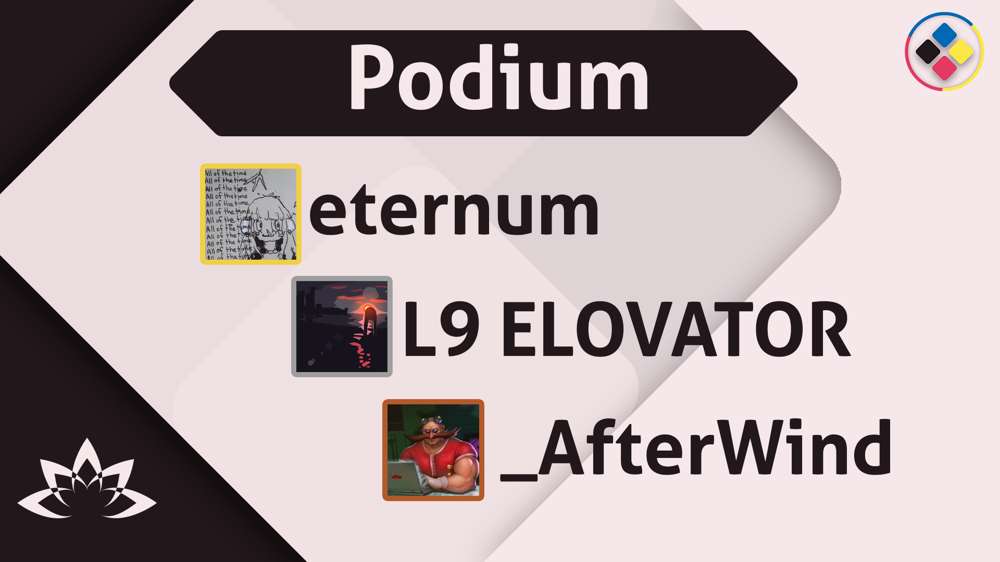

---
tags:
  - o!RST 2021
  - o!RT
---

# osu! Romania Summer Tournament 2021

The **osu! Romania Summer Tournament 2021** (***o!RST 2021***) was a 1v1 double elimination osu! tournament for Romanian and Moldovan players hosted by ::{ flag=RO }:: [Nice Aesthetics](https://osu.ppy.sh/users/7782553), ::{ flag=RO }:: [FallenAngelD](https://osu.ppy.sh/users/5225626), and ::{ flag=RO }:: [Ahrinity](https://osu.ppy.sh/users/11587229). It was the third instalment of the osu! Romania Tournament.

## Tournament schedule

| Event | Timestamp |
| --: | :-- |
| Registration phase | 2021-05-24/2021-06-28 |
| Qualifier stage | 2021-07-20/2021-07-21 |
| Round of 32 | 2021-07-31/2021-08-01 |
| Round of 16 | 2021-08-07/2021-08-08 |
| Quarterfinals | 2021-08-14/2021-08-15 |
| Semifinals | 2021-08-21/2021-08-22 |
| Finals | 2021-09-04/2021-09-05 |
| Grand Finals | 2021-09-11/2021-09-12 |

## Prizes

| Placing | Prize(s) |
| :-: | :-- |
|  | 70€, 1x Lotus Keypad, Profile Badge |
|  | 30€, 1x Lotus Keypad |

**Note**: As the winner of the tournament waived his Lotus Keypad prize, the keypad was awarded to the player who finished 3rd instead.

## Organisation

The osu! Romania Summer Tournament 2021 was run by various community members:

| Position | Member(s) |
| :-- | :-- |
| Host | ::{ flag=RO }:: [Nice Aesthetics](https://osu.ppy.sh/users/7782553),::{ flag=RO }:: [FallenAngelD](https://osu.ppy.sh/users/5225626), ::{ flag=RO }:: [Ahrinity](https://osu.ppy.sh/users/11587229) |
| Mappool selector | ::{ flag=RO }:: [badeu](https://osu.ppy.sh/users/1473890), ::{ flag=GR }:: [JackPaX](https://osu.ppy.sh/users/11226645), ::{ flag=RO }:: [Ahrinity](https://osu.ppy.sh/users/11587229), ::{ flag=PL }:: [Najmsb](https://osu.ppy.sh/users/13742685) |
| Streamer | ::{ flag=RO }:: [FallenAngelD](https://osu.ppy.sh/users/5225626) |
| Commentator | ::{ flag=RO }:: [Teetoos](https://osu.ppy.sh/users/10065874), ::{ flag=RO }:: [FallenAngelD](https://osu.ppy.sh/users/5225626), ::{ flag=RO }:: [Nice Aesthetics](https://osu.ppy.sh/users/7782553), ::{ flag=RO }:: [Ahrinity](https://osu.ppy.sh/users/11587229), ::{ flag=RO }:: [eternum](https://osu.ppy.sh/users/4581069), ::{ flag=RO }:: [My Angel vuru](https://osu.ppy.sh/users/8244518), ::{ flag=RO }:: [L9 ELOVATOR](https://osu.ppy.sh/users/9578404) |
| Designer | ::{ flag=RO }:: [Nice Aesthetics](https://osu.ppy.sh/users/7782553), ::{ flag=RO }:: [FallenAngelD](https://osu.ppy.sh/users/5225626) |
| Referee | ::{ flag=RO }:: [Nice Aesthetics](https://osu.ppy.sh/users/7782553), ::{ flag=RO }:: [LuchiBuchi](https://osu.ppy.sh/users/10897656), ::{ flag=RO }:: [Piggy Bank](https://osu.ppy.sh/users/8190224/), ::{ flag=RO }:: [STRYKEX](https://osu.ppy.sh/users/15799234), ::{ flag=RO }:: [basil simp](https://osu.ppy.sh/users/18515010), ::{ flag=RO }:: [Canonbomb18](https://osu.ppy.sh/users/9480076), ::{ flag=FR }:: [Taevas](https://osu.ppy.sh/users/7276846), ::{ flag=RO }:: [Ahrinity](https://osu.ppy.sh/users/11587229) |

## Links

- [Discussion thread](https://osu.ppy.sh/community/forums/topics/1300582?n=1)
- [Livestream](https://www.twitch.tv/osuromania)
- [Spreadsheet](https://docs.google.com/spreadsheets/d/153fQCI0r_n-aWGhSVSTL7LCY00PXWKO1dF8tso6TG3g/edit#gid=1178176870)
- [Bracket](https://challonge.com/osurost)

## Participants

| Seed | Players |
| :-- | :-- |
| Top | ::{ flag=RO }:: [eternum](https://osu.ppy.sh/users/4581069), ::{ flag=RO }:: [\_AfterWind](https://osu.ppy.sh/users/2086138), ::{ flag=RO }:: [Razei](https://osu.ppy.sh/users/10778261), ::{ flag=RO }:: [Lucrise](https://osu.ppy.sh/users/9719351), ::{ flag=RO }:: [L9 ELOVATOR](https://osu.ppy.sh/users/9578404), ::{ flag=RO }:: [cristi2708](https://osu.ppy.sh/users/7552300), ::{ flag=RO }:: [nanoya](https://osu.ppy.sh/users/12366071), ::{ flag=RO }:: [Rekkke](https://osu.ppy.sh/users/11133864) |
| High | ::{ flag=RO }:: [Gadzzaa](https://osu.ppy.sh/users/14367771), ::{ flag=RO }:: [RedGameBoy](https://osu.ppy.sh/users/8942234), ::{ flag=RO }:: [entsetzen](https://osu.ppy.sh/users/10261883), ::{ flag=RO }:: [WhySoInsecure](https://osu.ppy.sh/users/10198597), ::{ flag=RO }:: [Paato](https://osu.ppy.sh/users/9390417), ::{ flag=RO }:: [A-XLE](https://osu.ppy.sh/users/12487373), ::{ flag=RO }:: [Lernaeus](https://osu.ppy.sh/users/9703390), ::{ flag=RO }:: [GMTrooll](https://osu.ppy.sh/users/7593010) |
| Low | ::{ flag=RO }:: [Dank Uta](https://osu.ppy.sh/users/6566362), ::{ flag=RO }:: [RatonGolzache](https://osu.ppy.sh/users/11649551), ::{ flag=RO }:: [SiKKr](https://osu.ppy.sh/users/10959013), ::{ flag=RO }:: [megalapin](https://osu.ppy.sh/users/21023217), ::{ flag=RO }:: [RareshRSN](https://osu.ppy.sh/users/9542018), ::{ flag=RO }:: [hroni](https://osu.ppy.sh/users/14414337), ::{ flag=RO }:: [sarpili](https://osu.ppy.sh/users/14381318), ::{ flag=RO }:: [Australia](https://osu.ppy.sh/users/16196079) |
| Bottom | ::{ flag=RO }:: [MariusBDR](https://osu.ppy.sh/users/16334893), ::{ flag=RO }:: [Boticeli](https://osu.ppy.sh/users/13494470), ::{ flag=RO }:: [Dano Osu](https://osu.ppy.sh/users/11013717), ::{ flag=RO }:: [L9 MATEIUT](https://osu.ppy.sh/users/14774102), ::{ flag=RO }:: [rzvthePsycho](https://osu.ppy.sh/users/10310918), ::{ flag=RO }:: [VenTryXX](https://osu.ppy.sh/users/10808572) |

## Podium

This competition has come to an end and resulted in the following podium:

| Placing | Player |
| :-: | :-- |
|  | ::{ flag=RO }:: [eternum](https://osu.ppy.sh/users/4581069) |
|  | ::{ flag=RO }:: [L9 ELOVATOR](https://osu.ppy.sh/users/9578404) |
|  | ::{ flag=RO }:: [_AfterWind](https://osu.ppy.sh/users/2086138) |

## Mappools

### Grand Finals

**[Download the mappack here! (173 MB)](https://drive.google.com/file/d/1beuT6THIoqaIz3MiAIMssYIHc3P_RocL/view)**

- NoMod
  1. [nao - Toaru Shoukoku  (Nana Abe) [Hime Hime Collab]](https://osu.ppy.sh/beatmapsets/1276409#osu/2651915)
  2. [LeaF - Paraclete (Kroytz) [Serendipity]](https://osu.ppy.sh/beatmapsets/455109#osu/975588)
  3. [Tia - Deal with the devil (Bazz B) [Gambling maniac]](https://osu.ppy.sh/beatmapsets/819239#osu/1717644)
  4. [Warak - Cosmic Invaders (Cassu2) [Budget Akali Style]](https://osu.ppy.sh/beatmapsets/732045#osu/1544689)
  5. [Camellia as "Bang Riot" - Blastix Riotz (xidorn) [the fifth]](https://osu.ppy.sh/beatmapsets/732045#osu/1544689)
  6. [meganeko - Feral (osu! edit) (Respirte) [Veracious]](https://osu.ppy.sh/beatmapsets/1204383#osu/2507884)
  7. [Hagane - Event Horizon (yaspo) [Beyond Corsace]](https://osu.ppy.sh/beatmapsets/1276324#osu/2651787)
- Hidden
  1. [Yousei Teikoku - Kuusou Mesorogiwi (IsomirDiAngelo) [Prophecy]](https://osu.ppy.sh/beatmapsets/1260852#osu/2621030)
  2. [Buta-Otome - towa no maigo (Natteke desu) [ar8 edit]](https://osu.ppy.sh/beatmapsets/639108#osu/2900413)
  3. [Camellia - B L A C K - R A Y (Mir) [Obtrusion]](https://osu.ppy.sh/beatmapsets/1020387#osu/2134989)
- HardRock
  1. [Wagakki Band - Roku Chounen to Ichiya Monogatari (Taeyang) [Taeyang's style]](https://osu.ppy.sh/beatmapsets/490930#osu/1046293)
  2. [ESTi - HELIX (Edit Ver.) (FreeSongs) [Helix]](https://osu.ppy.sh/beatmapsets/331732#osu/734769)
  3. [Polyphia - O.D. (Melwoine) [Overly Difficult]](https://osu.ppy.sh/beatmapsets/1276327#osu/2651794)
- DoubleTime
  1. [ClariS - CLICK(Soleily Remix) (Kencho) [Niseclick]](https://osu.ppy.sh/beatmapsets/402741#osu/875761)
  2. [S.S.H. - Sorcerian ~ Major Demon (Elcheer) [Demon Slayer]](https://osu.ppy.sh/beatmapsets/1272001#osu/2643212)
  3. [monet - Noborenai Sakamichi (Mirash) [Delis' Insane]](https://osu.ppy.sh/beatmapsets/671607#osu/1419974)
  4. [Receptor - Redstar (fergas) [Glory]](https://osu.ppy.sh/beatmapsets/184301#osu/502414)
- ForceMod
  1. [Shintani Ryoko - Wonderful World (squishi) [beautiful collab fuck do you want me to call it?]](https://osu.ppy.sh/beatmapsets/719011#osu/1518426)
  2. [ParagonX9 - Chaoz Japan (AJT) [VViliam5]](https://osu.ppy.sh/beatmapsets/1182086#osu/3157088)
  3. [sakuraburst - Glacierfall (Park Remix) (ScubDomino) [get f**ked up]](https://osu.ppy.sh/beatmapsets/1329045#osu/2753127)
- Tiebreaker
  1. **[Vektor - Outer Isolation (FCL) [Segregated]](https://osu.ppy.sh/beatmapsets/469408#osu/1574230)**

### Finals

**[Download the mappack here! (147 MB)](https://drive.google.com/file/d/1RRwLDwJYCUpvDbsg_8xOfgjz9KvuAsB1/view)**

- NoMod
  1. [BUTAOTOME - Osanadachi (BarkingMadDog) [Extreme]](https://osu.ppy.sh/beatmapsets/1306569#osu/2708955)
  2. [xi - over the top (Kroytz) [beyond the heavens]](https://osu.ppy.sh/beatmapsets/479215#osu/1023355)
  3. [MANUEL - GAS GAS GAS (heroin_player67) [Step On It!]](https://osu.ppy.sh/beatmapsets/826430#osu/1731978)
  4. [Camellia - [BLEED BLOOD] (Mir) [Wildsense]](https://osu.ppy.sh/beatmapsets/1021338#osu/2136959)
  5. [Imperial Circus - Shinbatsu o Tadori (Kite) [Extreme]](https://osu.ppy.sh/beatmapsets/482382#osu/2039543)
- Hidden
  1. [Infected Mushroom - Guitarmass (Cut Ver.) (Ciyus Miapah) [Total Domination]](https://osu.ppy.sh/beatmapsets/947022#osu/1977960)
  2. [x0o0x_ - Big Brother (Luscent) [YOKES' EXTRA Mix]](https://osu.ppy.sh/beatmapsets/1120687#osu/2400783)
  3. [Nekomata Master - Far east nightbird (HighTec) [yf's Expert]](https://osu.ppy.sh/beatmapsets/576795#osu/1231299)
- HardRock
  1. [Reol - Asymmetry (Skystar) [cRyoSkystar's Farewell]](https://osu.ppy.sh/beatmapsets/310499#osu/771496)
  2. [Eisyo-kobu - Oriental Blossom (Crystal) [yf's Expert]](https://osu.ppy.sh/beatmapsets/586889#osu/1242793)
  3. [xi - Zauberkugel (pishifat) [Extra]](https://osu.ppy.sh/beatmapsets/554892#osu/1174596)
- DoubleTime
  1. [Toyosaki Aki - Diamond (Fycho) [Insane]](https://osu.ppy.sh/beatmapsets/111760#osu/290581)
  2. [KAMELOT - Kevlar Skin (LMT) [Insane]](https://osu.ppy.sh/beatmapsets/1267309#osu/2633777)
  3. [Kalafina - Kyrie (Vell) [Genesis]](https://osu.ppy.sh/beatmapsets/369380#osu/809513)
- ForceMod
  1. [YOASOBI - Yoru ni Kakeru (ShirohaMyMommy) [Moonlight Shadow]](https://osu.ppy.sh/beatmapsets/1135665#osu/2371802)
  2. [Sound Horizon - Raijin no Hidariude (Satellite) [ExtrA]](https://osu.ppy.sh/beatmapsets/1382134#osu/2895387)
- Tiebreaker
  1. **[Release Hallucination - Chronostasis (Painketsu) [Time Sakugo]](https://osu.ppy.sh/beatmapsets/553085#osu/1171193)**

### Semi-Finals

**[Download the mappack here! (120 MB)](https://drive.google.com/file/d/1tuSslkBr-RkFSZWXvqq6jjw-MAKIrGBG/view)**

- NoMod
  1. [Yousei Teikoku - Dea x Crisis (Lasse) [Despair]](https://osu.ppy.sh/beatmapsets/1338846#osu/2773398)
  2. [cosMo@BousouP - Sekai no Owari ni Aimashou (Realazy) [Lasse's owo Dimensions]](https://osu.ppy.sh/beatmapsets/872578#osu/1825921)
  3. [POLKADOT STINGRAY - Otoshimae (moph) [Extreme]](https://osu.ppy.sh/beatmapsets/1301330#osu/2699135)
  4. [Giga - BRING IT ON (Pho) [Let's Do This!]](https://osu.ppy.sh/beatmapsets/865490#osu/1809677)
  5. [Igorrr - Cicadidae (fergas) [Chirr 2]](https://osu.ppy.sh/beatmapsets/301320#osu/862246)
- Hidden
  1. [Akita Neru - Gotya Gotya Uruse (Rachelles) [Hinarika's Style]](https://osu.ppy.sh/beatmapsets/55850#osu/169329)
  2. [Kelly Clarkson - Behind These Hazel Eyes (Nightcore Remix) (Raikozen) [raikoplayer111]](https://osu.ppy.sh/beatmapsets/639701#osu/1356688)
  3. [MYUKKE. - re[in]flaw (captin1) [in[co]rect]](https://osu.ppy.sh/beatmapsets/1344871#osu/2785316)
- HardRock
  1. [JIN feat. 96neko - Children Record (Lasse) [Expert]](https://osu.ppy.sh/beatmapsets/931072#osu/1944231)
  2. [Cait Sith - Schrodinger's Cat (Sushi) [EX]](https://osu.ppy.sh/beatmapsets/36409#osu/117641)
  3. [ChouchouP - Tsukimiyo Rabbit (Zero__wind) [Tsuki]](https://osu.ppy.sh/beatmapsets/122342#osu/312959)
- DoubleTime
  1. [MUKKA - DEVOCHKA S KARE (DendyHere) [Collab Another]](https://osu.ppy.sh/beatmapsets/956109#osu/2034967)
  2. [Tatsh feat. Tsukiko - (Natteke) Floating Darkness [Collab]](https://osu.ppy.sh/beatmapsets/22173#osu/76612)
  3. [Halozy - Heart of Night (Chaoslitz) [Life of Loneliness]](https://osu.ppy.sh/beatmapsets/462878#osu/991229)
- ForceMod
  1. [Ranko - In the Black (Mirash) [raNko]](https://osu.ppy.sh/beatmapsets/937562#osu/1958516)
  2. [syatten remixed celas - Bird Sprite -Awakening of Light- (emu1337) [LMT's Extra]](https://osu.ppy.sh/beatmapsets/1321314#osu/2741605)
- Tiebreaker
  1. **[Unlucky Morpheus - Angreifer (KwAIMSuckASFuk) [Inanity Wrath]](https://osu.ppy.sh/beatmapsets/1111593#osu/2322515)**

### Quarter-Finals

**[Download the mappack here! (117.7 MB)](https://drive.google.com/file/d/10-YOyKUKIA92Fb-znt6He2B-lDAt7lmy/view?usp=sharing)**

- NoMod
  1. [LiSA - Tsumibito (Rosiie) [Desire]](https://osu.ppy.sh/beatmapsets/1370775#osu/2834295)
  2. [xi - Ascension to Heaven (Kroytz) [Extra]](https://osu.ppy.sh/beatmapsets/1301360#osu/2732587)
  3. [YURRY CANON - Nadeshiko color Heart (kwk) [Saturnalize's Extra]](https://osu.ppy.sh/beatmapsets/682996#osu/1463294)
  4. [CELLON. - Labyrinth of Darkness (Mir) [Expert]](https://osu.ppy.sh/beatmapsets/778383#osu/1634887)
  5. [goreshit - Goreshit Compilation (\_LRJ_) [MATZcore 9.5]](https://drive.google.com/file/d/1gKeP1HjocGCT7sPnzeM8rL2gmRJkvNcE/view?usp=sharing)
- Hidden
  1. [Suzumu - Kakumeisei ousama densenbyou (tutuhaha) [AngelHoney's Extra]](https://osu.ppy.sh/beatmapsets/307686#osu/701528)
  2. [SWAN K feat. Asuka M - LOVE B.B.B ([ Couch ] Lite) [cs4]](https://osu.ppy.sh/beatmapsets/1100957#osu/2531905)
- HardRock
  1. [Primary - Awake (xChippy) [Goodbye]](https://osu.ppy.sh/beatmapsets/308179#osu/689290)
  2. [ZUN - Futatsuiwa From Sado (Spirit World) (Parachute) [Overdrive]](https://osu.ppy.sh/beatmapsets/69559#osu/200536)
- DoubleTime
  1. [AK X LYNX ft. Veela - Virtual Paradise (alacat) [thzz' Insane]](https://osu.ppy.sh/beatmapsets/477725#osu/1093107)
  2. [lasah - GHOST OF LORELEY (moph) [Ambient's Insane]](https://osu.ppy.sh/beatmapsets/486177#osu/1058615)
  3. [Kurahashi Yoeko - Tomodachi no Uta (tutuhaha) [Light Insane]](https://osu.ppy.sh/beatmapsets/790979#osu/1659942)
- ForceMod
  1. [JUNNA - Here (Mirash) [Extra]](https://osu.ppy.sh/beatmapsets/737103#osu/1555562)
  2. [DJ YOSHITAKA - Evans (Jerrysr) [Insane]](https://osu.ppy.sh/beatmapsets/13694#osu/50483)
- Tiebreaker
  1. **[sanj - last minute (sakuraburst remix) (Monarch) [burst]](https://osu.ppy.sh/beatmapsets/486920#osu/1038193)**

### Round of 16

**[Download the mappack here! (91.1 MB)](https://drive.google.com/file/d/1BtemqmnoHWDaJbNsz1zSQlrrCi1Bwkm3/view?usp=sharing)**

- NoMod
  1. [KISIDA KYODAN & THE AKEBOSI ROCKETS - GATE\~Sore wa Akatsuki no you ni~ (Akitoshi) [Darkness]](https://osu.ppy.sh/beatmapsets/480386#osu/1025551)
  2. [BlackYooh vs. siromaru - BLACK or WHITE? (BluOxy) [MASTER]](https://osu.ppy.sh/beatmapsets/248876#osu/635679)
  3. [Ryokuoushoku Shakai - LADYBUG (RLC) [Rebirth]](https://osu.ppy.sh/beatmapsets/1441587#osu/2965623)
  4. [Function Phantom - Euclid (RikiH_) [-Tochi's Extra]](https://osu.ppy.sh/beatmapsets/427750#osu/923384)
  5. [DragonForce - Ring of Fire (MashaSG) [Extra]](https://osu.ppy.sh/beatmapsets/717015#osu/1518059)
- Hidden
  1. [paraoka - boot (rickyboi) [Shoe]](https://osu.ppy.sh/beatmapsets/50131#osu/154226)
  2. [SHK - Identity Part III (ktgster) [SHD]](https://osu.ppy.sh/beatmapsets/280329#osu/634351)
- HardRock
  1. [IA - Six Trillion Years and Overnight Story (NatsumeRin) [Rin]](https://osu.ppy.sh/beatmapsets/51245#osu/158662)
  2. [HyuN - Infinity Heaven (Niva) [Ad Infinitum]](https://osu.ppy.sh/beatmapsets/891345#osu/1863246)
- DoubleTime
  1. [mona (CV: Natsukawa Shiina) - No.1 (HeTo) [Lovely]](https://osu.ppy.sh/beatmapsets/1090518#osu/2279641)
  2. [IOSYS feat. NJK Record - Miracle-Hinacle (Hinacle) [Collab]](https://osu.ppy.sh/beatmapsets/50454#osu/155049)
  3. [COIN - Talk Too Much (Asphyxia) [Kyshiro's Insane]](https://osu.ppy.sh/beatmapsets/901626#osu/2004149)
- ForceMod
  1. [Zips - Reiwai Terrorism (Nevo) [Heisei]](https://osu.ppy.sh/beatmapsets/1092496#osu/2283725)
  2. [Memme - Extreme Fantasy (AngelHoney) [ExtrA]](https://osu.ppy.sh/beatmapsets/49459#osu/152480)
- Tiebreaker
  1. **[Houshou Marine - Ahoy!! Warera Houshou Kaizokudan* (Amateurre) [Shukkou!]](https://osu.ppy.sh/beatmapsets/1235807#osu/2568969)**

### Round of 32

**[Download the mappack here! (94 MB)](https://drive.google.com/file/d/1mFJdBoACkqp_4sMufKcXxCYCDCwWvBVe/view)**

- NoMod
  1. [Imy - Fake (Bellicose) [Dored's Expert]](https://osu.ppy.sh/beatmapsets/1261105#osu/2637339)
  2. [Porter Robinson - Sad Machine (Draper Remix) (Alonevpk) [mac n cheese]](https://osu.ppy.sh/beatmapsets/363257#osu/797658)
  3. [Nanahoshi Kangengakudan - anoko dokonoko (kwk) [Rizen's Extra]](https://osu.ppy.sh/beatmapsets/654452#osu/1437419)
  4. [Virtual Riot - Prove Them Wrong (C00L) [Zizou's Insane]](https://osu.ppy.sh/beatmapsets/1216594#osu/2610932)
  5. [Nekrogoblikon - The Skin Thief (LMT) [Insane]](https://osu.ppy.sh/beatmapsets/1061535#osu/2223742)
- Hidden
  1. [Various Artists - Rolling Girl (Shidoni) [Nowa's Extra]](https://osu.ppy.sh/beatmapsets/965620#osu/2056940)
  2. [SHIKI - Aqua Marine (soulfear) [Another]](https://osu.ppy.sh/beatmapsets/27049#osu/90961)
- HardRock
  1. [Feint & Boyinaband - Time Bomb (feat. Veela) (Naitsirk) [Time Freeze]](https://osu.ppy.sh/beatmapsets/652909#osu/1384287)
  2. [Aethoro - Woodfairies (verychill) [Knight's Insane]](https://osu.ppy.sh/beatmapsets/1309729#osu/2724745)
- DoubleTime
  1. [Suzuki Konomi - DAYS of DASH (Kalibe) [pkhg's Insane]](https://osu.ppy.sh/beatmapsets/515921#osu/1113532)
  2. [O-Life Japan - Yamanobori Kibun (qinche) [Lunatic]](https://osu.ppy.sh/beatmapsets/30256#osu/99989)
  3. [Chiyoko - Alice's Mad Tea Party (neonat) [Insane]](https://osu.ppy.sh/beatmapsets/215151#osu/515359)
- ForceMod
  1. [Nomy - Cocaine (Nightcore Mix) (Aleks719) [Insane]](https://osu.ppy.sh/beatmapsets/39153#osu/124993)
  2. [IOSYS - Midnight Lightning Bolt (pieguy1372) [Lunatic]](https://osu.ppy.sh/beatmapsets/16371#osu/58701)
- Tiebreaker
  1. **[Inui Toko - Namae no Nai Kaibutsu (wiken) [Prismatic]](https://osu.ppy.sh/beatmapsets/1290765#osu/2679351)**

### Qualifiers

**[Download the mappack here! (77.2 MB)](https://drive.google.com/file/d/1Pfyf0R7D47_AjDe6gz7z1OaxFvVEoX0R/view?usp=share_link)**

- NoMod
  1. [Higuchi Kaede - MARBLE (Amateurre) [Resonance]](https://osu.ppy.sh/beatmapsets/1189212#osu/2579124)
  2. [Ice - Amber Wishes (JBHyperion) [toybot's Extreme]](https://osu.ppy.sh/beatmapsets/412859#osu/902716)
  3. [Nanahoshi Kangengakudan - No,39 (pkk) [No Sankyuu]](https://osu.ppy.sh/beatmapsets/531488#osu/1126317)
  4. [EmoCo. - This Club is Not 4 U (Ryuusei Aika) [#1: Ellyu's Expert]](https://osu.ppy.sh/beatmapsets/1282123#osu/2663016)
- Hidden
  1. [jippusu - Mushikui Saikede Rhythm (Amamiya Yuko) [RLC]](https://osu.ppy.sh/beatmapsets/87547#osu/240689)
  2. [Aki - star river (ShirohaMyMommy) [Lunatic]](https://osu.ppy.sh/beatmapsets/908990#osu/1896891)
- HardRock
  1. [Omoi - Totsugeki Zenya no Dance (Yales) [Explosion]](https://osu.ppy.sh/beatmapsets/342030#osu/756065)
  2. [MYTK - Senkyou (Realazy) [Cubby's Insane]](https://osu.ppy.sh/beatmapsets/1262410#osu/2623949)
- DoubleTime
  1. [Sana - Byoumei Koiwazurai ([ Joey ]) [Insane]](https://osu.ppy.sh/beatmapsets/220636#osu/609741)
  2. [DJ Fresh (feat. Rita Ora) - Hot Right Now (Radio Edit) (Asphyxia) [Kysphyxia's Insane]](https://osu.ppy.sh/beatmapsets/231114#osu/539090)

## Match results

### Grand Finals

Saturday, 11 September 2021:

| Player 1 |  |  | Player 2 | Match link |
| --: | :-: | :-: | :-- | :-- |
| \_AfterWind ::{ flag=RO }:: | 4 | **9** | ::{ flag=RO }:: **L9 ELOVATOR** | [#1](https://osu.ppy.sh/community/matches/90747076) |

Sunday, 12 September 2021:

| Player 1 |  |  | Player 2 | Match link |
| --: | :-: | :-: | :-- | :-- |
| **eternum** ::{ flag=RO }:: | **9** | 7 | ::{ flag=RO }:: L9 ELOVATOR | [#1](https://osu.ppy.sh/community/matches/90805530) |

### Finals

Saturday, 4 September 2021:

| Player 1 |  |  | Player 2 | Match link |
| --: | :-: | :-: | :-- | :-- |
| **eternum** ::{ flag=RO }:: | **7** | 4 | ::{ flag=RO }:: \_AfterWind | [#1](https://osu.ppy.sh/community/matches/90384246) |
| cristi2708 ::{ flag=RO }:: | 1 | **7** | ::{ flag=RO }:: **L9 ELOVATOR** | [#1](https://osu.ppy.sh/community/matches/90391055) |

Sunday, 5 September 2021:

| Player 1 |  |  | Player 2 | Match link |
| --: | :-: | :-: | :-- | :-- |
| **Lucrise** ::{ flag=RO }:: | **7** | 5 | ::{ flag=RO }:: nanoya | [#1](https://osu.ppy.sh/community/matches/90433586) |

Monday, 6 September 2021:

| Player 1 |  |  | Player 2 | Match link |
| --: | :-: | :-: | :-- | :-- |
| **L9 ELOVATOR** ::{ flag=RO }:: | **7** | 0 | ::{ flag=RO }:: Lucrise | [#1](https://osu.ppy.sh/community/matches/90482703) |

### Semi-Finals

Friday, 20 August 2021:

| Player 1 |  |  | Player 2 | Match link |
| --: | :-: | :-: | :-- | :-- |
| A-XLE ::{ flag=RO }:: | 1 | **7** | ::{ flag=RO }:: **WhySoInsecure** | [#1](https://osu.ppy.sh/community/matches/89550583) |
| **Rekkke** ::{ flag=RO }:: | **7** | 2 | ::{ flag=RO }:: Lernaeus | [#1](https://osu.ppy.sh/community/matches/89561775) |

Saturday, 21 August 2021:

| Player 1 |  |  | Player 2 | Match link |
| --: | :-: | :-: | :-- | :-- |
| **L9 ELOVATOR** ::{ flag=RO }:: | **7** | 0 | ::{ flag=RO }:: entsetzen | [#1](https://osu.ppy.sh/community/matches/89608041) |
| **nanoya** ::{ flag=RO }:: | **7** | 0 | ::{ flag=RO }:: Gadzzaa | [#1](https://osu.ppy.sh/community/matches/89614613) |

Sunday, 22 August 2021:

| Player 1 |  |  | Player 2 | Match link |
| --: | :-: | :-: | :-- | :-- |
| WhySoInsecure ::{ flag=RO }:: | 1 | **7** | ::{ flag=RO }:: **nanoya** | [#1](https://osu.ppy.sh/community/matches/89671577) |
| **\_AfterWind** ::{ flag=RO }:: | **7** | 2 | ::{ flag=RO }:: cristi2708 | [#1](https://osu.ppy.sh/community/matches/89674010) |
| **L9 ELOVATOR** ::{ flag=RO }:: | **7** | 0 | ::{ flag=RO }:: Rekkke | [#1](https://osu.ppy.sh/community/matches/89679253) |

Monday, 23 August 2021:

| Player 1 |  |  | Player 2 | Match link |
| --: | :-: | :-: | :-- | :-- |
| **eternum** ::{ flag=RO }:: | **7** | 2 | ::{ flag=RO }:: Lucrise | [#1](https://osu.ppy.sh/community/matches/89730724) |

### Quarter-Finals

Friday, 13 August 2021:

| Player 1 |  |  | Player 2 | Match link |
| --: | :-: | :-: | :-- | :-- |
| WhySoInsecure ::{ flag=RO }:: | **6** | 1 | ::{ flag=RO }:: RatonGolzache | [#1](https://osu.ppy.sh/community/matches/89178817) |

Saturday, 14 of August 2021:

| Player 1 |  |  | Player 2 | Match link |
| --: | :-: | :-: | :-- | :-- |
| RedGameBoy ::{ flag=RO }:: | 5 | **6** | ::{ flag=RO }:: **Lernaeus** | [#1](https://osu.ppy.sh/community/matches/89220441) |
| VenTryXX ::{ flag=RO }:: | -1 | **0** | ::{ flag=RO }:: **Australia** | win by default |
| **RedGameBoy** ::{ flag=RO }:: | **0** | -1 | ::{ flag=RO }:: megalapin | win by default |
| **Lernaeus** ::{ flag=RO }:: | **0** | -1 | ::{ flag=RO }:: L9 MATEIUT | win by default |
| **Paato** ::{ flag=RO }:: | **0** | -1 | ::{ flag=RO }:: sarpili | win by default |
| **Lucrise** ::{ flag=RO }:: | **6** | 4 | ::{ flag=RO }:: L9 ELOVATOR | [#1](https://osu.ppy.sh/community/matches/89232815) |
| **\_AfterWind** ::{ flag=RO }:: | **6** | 2 | ::{ flag=RO }:: nanoya | [#1](https://osu.ppy.sh/community/matches/89233709) |
| **Gadzzaa** ::{ flag=RO }:: | **6** | 0 | ::{ flag=RO }:: SiKKr | [#1](https://osu.ppy.sh/community/matches/89233883) |
| **GMTrooll** ::{ flag=RO }:: | **0** | -1 | ::{ flag=RO }:: Dano Osu | win by default |

Sunday, 15 August 2021:

| Player 1 |  |  | Player 2 | Match link |
| --: | :-: | :-: | :-- | :-- |
| **entsetzen** ::{ flag=RO }:: | **6** | 2 | ::{ flag=RO }:: Dank Uta | [#1](https://osu.ppy.sh/community/matches/89276378) |
| A-XLE ::{ flag=RO }:: | 3 | **6** | ::{ flag=RO }:: **cristi2708** | [#1](https://osu.ppy.sh/community/matches/89278010) |
| **entsetzen** ::{ flag=RO }:: | **6** | 0 | ::{ flag=RO }:: Australia | [#1](https://osu.ppy.sh/community/matches/89278012) |
| **WhySoInsecure** ::{ flag=RO }:: | **6** | 2 | ::{ flag=RO }:: Paato | [#1](https://osu.ppy.sh/community/matches/89281518) |
| **Gadzzaa** ::{ flag=RO }:: | **0** | -1 | ::{ flag=RO }:: GMTrooll | win by default |

Monday, 16 August 2021:

| Player 1 |  |  | Player 2 | Match link |
| --: | :-: | :-: | :-- | :-- |
| **eternum** ::{ flag=RO }:: | **6** | 1 | ::{ flag=RO }:: Rekkke | [#1](https://osu.ppy.sh/community/matches/89332314) |

### Round of 16

Tuesday, 3 August 2021:

| Player 1 |  |  | Player 2 | Match link |
| --: | :-: | :-: | :-- | :-- |
| **Dano Osu** ::{ flag=RO }:: | **6** | 2 | ::{ flag=RO }:: hroni | [#1](https://osu.ppy.sh/community/matches/88588591) |

Friday, 6 August 2021:

| Player 1 |  |  | Player 2 | Match link |
| --: | :-: | :-: | :-- | :-- |
| **\_AfterWind** ::{ flag=RO }:: | **6** | 2 | ::{ flag=RO }:: Lernaeus | [#1](https://osu.ppy.sh/community/matches/88766359) |
| **L9 ELOVATOR** ::{ flag=RO }:: | **6** | 1 | ::{ flag=RO }:: WhySoInsecure | [#1](https://osu.ppy.sh/community/matches/88773001) |

Saturday, 7 August 2021:

| Player 1 |  |  | Player 2 | Match link |
| --: | :-: | :-: | :-- | :-- |
| **eternum** ::{ flag=RO }:: | **6** | 0 | ::{ flag=RO }:: GMTrooll | [#1](https://osu.ppy.sh/community/matches/88816565) |
| MariusBDR ::{ flag=RO }:: | -1 | **0** | ::{ flag=RO }:: **Australia** | win by default |
| rzvthePsycho ::{ flag=RO }:: | -1 | **0** | ::{ flag=RO }:: **megalapin** | win by default |
| **nanoya** ::{ flag=RO }:: | **6** | 0 | ::{ flag=RO }:: RedGameBoy | [#1](https://osu.ppy.sh/community/matches/88822694) |
| **L9 MATEIUT** ::{ flag=RO }:: | **0** | -1 | ::{ flag=RO }:: RareshRSN | win by default |
| Boticeli ::{ flag=RO }:: | -1 | **0** | ::{ flag=RO }:: **sarpili** | win by default |
| Razei ::{ flag=RO }:: | -1 | **0** | ::{ flag=RO }:: **SiKKr** | win by default |
| VenTryXX ::{ flag=RO }:: | 0 | **6** | ::{ flag=RO }:: **A-XLE** | [#1](https://osu.ppy.sh/community/matches/88830361) |
| **Lucrise** ::{ flag=RO }:: | **6** | 0 | ::{ flag=RO }:: Paato | [#1](https://osu.ppy.sh/community/matches/88836856) |

Sunday, 8 August 2021:

| Player 1 |  |  | Player 2 | Match link |
| --: | :-: | :-: | :-- | :-- |
| **Rekkke** ::{ flag=RO }:: | **6** | 0 | ::{ flag=RO }:: Gadzzaa | [#1](https://osu.ppy.sh/community/matches/88876876) |
| **cristi2708** ::{ flag=RO }:: | **6** | 0 | ::{ flag=RO }:: entsetzen | [#1](https://osu.ppy.sh/community/matches/88886246) |

### Round of 32

Friday, 30 July 2021:

| Player 1 |  |  | Player 2 | Match link |
| --: | :-: | :-: | :-- | :-- |
| **Paato** ::{ flag=RO }:: | **5** | 0 | ::{ flag=RO }:: megalapin | [#1](https://osu.ppy.sh/community/matches/88335123) |

Saturday, 31 July 2021:

| Player 1 |  |  | Player 2 | Match link |
| --: | :-: | :-: | :-- | :-- |
| **Lernaeus** ::{ flag=RO }:: | **5** | 2 | ::{ flag=RO }:: RatonGolzache | [#1](https://osu.ppy.sh/community/matches/88388437) |
| **GMTrooll** ::{ flag=RO }:: | **5** | 2 | ::{ flag=RO }:: Dank Uta | [#1](https://osu.ppy.sh/community/matches/88390115) |
| **Rekkke** ::{ flag=RO }:: | **0** | -1 | ::{ flag=RO }:: MariusBDR | win by default |
| **Gadzzaa** ::{ flag=RO }:: | **5** | 0 | ::{ flag=RO }:: Australia | [#1](https://osu.ppy.sh/community/matches/88394227) |
| **Lucrise** ::{ flag=RO }:: | **0** | -1 | ::{ flag=RO }:: rzvthePsycho | win by default |
| **L9 ELOVATOR** ::{ flag=RO }:: | **5** | 1 | ::{ flag=RO }:: L9 MATEIUT | [#1](https://osu.ppy.sh/community/matches/88402385) |
| **entsetzen** ::{ flag=RO }:: | **5** | 0 | ::{ flag=RO }:: hroni | [#1](https://osu.ppy.sh/community/matches/88407808) |

Sunday, 1 August 2021:

| Player 1 |  |  | Player 2 | Match link |
| --: | :-: | :-: | :-- | :-- |
| **nanoya** ::{ flag=RO }:: | **0** | -1 | ::{ flag=RO }:: Boticeli | win by default |
| **RedGameBoy** ::{ flag=RO }:: | **0** | -1 | ::{ flag=RO }:: sarpili | win by default |
| Razei ::{ flag=RO }:: | -1 | **0** | ::{ flag=RO }:: **VenTryXX** | win by default |
| **A-XLE** ::{ flag=RO }:: | **5** | 0 | ::{ flag=RO }:: SiKKr | [#1](https://osu.ppy.sh/community/matches/88456798) |
| **cristi2708** ::{ flag=RO }:: | **0** | -1 | ::{ flag=RO }:: Dano Osu | win by default |

Monday, 2 August 2021:

| Player 1 |  |  | Player 2 | Match link |
| --: | :-: | :-: | :-- | :-- |
| **WhySoInsecure** ::{ flag=RO }:: | **5** | 1 | ::{ flag=RO }:: RareshRSN | [#1](https://osu.ppy.sh/community/matches/88522572) |

**Note:** The #1-2 seeded players, **eternum** and **\_AfterWind**, received direct byes to the winners bracket Round of 16, due to the uneven number of players in the Round of 32 bracket.

## Ruleset

### General rules

1. This is a 1v1 tournament featuring a knockout double-elimination format, with a preceding qualifier stage.
2. The system used for beatmap scoring will be [ScoreV2](/wiki/Gameplay/Score#scorev2).
3. It is required to be part of the tournament Discord server.
4. It is expected from the players to be respectful to other competitors, to staff members, and overall to follow the [osu! community rules](/wiki/Rules). Exceedingly poor conduct will be punished with disqualification and even potential blacklisting from future editions of the tournament.

### Registration

1. Prerequisites for participating in the tournament are as follows:
   - Having a Romanian ::{ flag=RO }:: or Moldovan ::{ flag=MD }:: flag on the profile. If a player does not have one of the two flags on his profile, being able to prove Romanian identity by other means to the tournament organizers is also a valid way to fulfill this requirement.
   - Passing the [screening](/wiki/Tournaments/Official_support#tournament-screening) phase to verify eligibility for playing in tournaments supported by the osu! staff. This will be done only after the sign-up period has ended, so a player must be registered to go through this process.
2. Core staff members like hosts, referees, mappool selectors, or spreadsheet managers are not allowed to simultaneously take part in the tournament as players.
3. Staff members fulfilling only front-end roles as streamers, commentators or graphics designers are permitted to participate in the tournament as players.

### Qualifiers

1. The qualifiers will determine the participants and the seeding order for the knockout stage.
2. Each player will play in one of the qualifier lobbies held during the weekend.
3. Whilst in the lobby, the players will do one playthrough of the qualifiers mappool, in the order from the mappool spreadsheet.
4. The results will be sorted by the **total score** each player achieved in their respective playthrough.

### Knockout stage

1. The knockout stage will be split into multiple rounds taking place on a weekly basis, with each round's matches being played on a corresponding mappool.
2. It will feature a maximum of 64 players in a Round of 64 bracket. If the minimum number of players for a bracket of that size is not reached, the bracket will be downsized to Round of 32.
3. For each round a weekend will be allocated in the tournament's tentative schedule, however a round may be postponed at the discretion of the staff and with the approval of the remaining participants if the situation calls for it.
4. The winning conditions for matches in each round are as follows:
   - Round of 64/Round of 32: Best of 9 (first to 5 points)
   - Round of 16/Quarter-Finals: Best of 11 (first to 6 points)
   - Semi-Finals/Finals: Best of 13 (first to 7 points)
   - Grand Finals: Best of 17 (first to 9 points), with "bracket reset" rules in the Grand Final applying as follows:
     - The finalist coming from the Losers Bracket has to win 2 consecutive games.
     - The finalist coming from the Winners Bracket has to win 1 game. That means winning either the first set, or the decisive set right after in case he loses the first one.

### Match procedure

1. 10 minutes before match time, the referee will create a lobby with the name o!RST: (Player 1) vs (Player 2). Shortly after, he will give the invites to the players.
2. If a player is more than 5 minutes late to the lobby, he will lose a point. Failure to be present in the lobby 10 minutes after match time will be considered a forfeit.
3. Players are allowed to choose one warm-up map each, but the maps must not exceed 4 minutes of drain time.
4. Both players will type the `!roll` command to draw a random number. The player with the lower number will have the first ban, and the player with the higher number will have the first pick.
5. After the pick and ban order is decided, the players will give their first set of bans. Before the second set of bans, each player will be able to choose one map each as their first pick of the match, with those maps being protected from the second round of bans. After the second round of bans, the two protected maps will be played in pick order, and then the match will continue with the rest of the maps being played sequentially right after they are picked by the player, following the pick order which was established after the rolls.
6. Players have 90 seconds to pick or ban a map and 120 seconds to prepare before a map starts. If a player does not pick a map in time, that player's pick will be surrendered to the opponent, and if the same happens for a ban, that player's ban will be considered unused.
7. For each map, after both players are ready, the referee will start a 10 second countdown with `!mp start 10` which will automatically start gameplay.
8. If a player disconnects within the first 15 seconds of play, the map will be replayed, but this is only allowed once per game.
9. Each map win is one point. The first player to reach the required amount of points wins. If the score is tied with only one point left to play, the match will be decided on the Tiebreaker map.
10. The referee cannot interfere with, or make decisions about the match that are not within his responsibility. For those kinds of situations, a host will have to be contacted.

### Scheduling

1. The standard time used for scheduling purposes will be in **UTC+3** (Romania's time zone during Daylight Saving Time).
2. Matches will be held by default during the weekend, with reschedules being allowed on other days of the week within some limits.
3. Reschedules are expected to be done within an adequate time frame before the previously established match time, ideally with at least 12 hours to go before the match is supposed to take place. Otherwise, it will be at the tournament staff's discretion whether the reschedule will be allowed or not.

### Mappools

1. There will be separate mappools for each round. Their difficulty will increase after each week of the knockout stage, while the qualifiers mappool will have a balanced difficulty, relative to the overall difficulty of the bracket stage mappools.
2. The mappools will consist of the following mod brackets: [No Mod](/wiki/Gameplay/Game_modifier#no-mod), [Hidden](/wiki/Gameplay/Game_modifier/Hidden), [Hard Rock](/wiki/Gameplay/Game_modifier/Hard_Rock), [Double Time](/wiki/Gameplay/Game_modifier/Double_Time), ForceMod, and a Tiebreaker. Only exception is the qualifier stage which will not feature ForceMod or Tiebreaker maps.
3. Mod rules:
   - ForceMod: Both players must choose at least one of the Hidden, HardRock, Flashlight or EZ mods, or any of their valid combinations.
   - Tiebreaker: both players can, but are not forced to choose at least one of the Hidden, HardRock, Flashlight, EZ mods, or any of their valid combinations. This map cannot be picked by the players and will only be used as the decisive map whenever in a knockout stage match two players are tied with one point left to play.
   - On ForceMod and the Tiebreaker, EZ mod has a multiplier of 1.06x
4. The number of maps in each round for each mod bracket is as follows:

| **Round/Mod** | NoMod | Hidden | HardRock | DoubleTime | ForceMod | Tiebreaker |
| :-: | :-: | :-: | :-: | :-: | :-: | :-: |
| Qualifiers | 4 | 2 | 2 | 2 | 0 | 0 |
| Round of 32 | 5 | 2 | 2 | 3 | 2 | 1 |
| Round of 16 | 5 | 2 | 2 | 3 | 2 | 1 |
| Quarter Finals | 5 | 2 | 2 | 3 | 2 | 1 |
| Semi-Finals | 5 | 3 | 3 | 3 | 2 | 1 |
| Finals | 5 | 3 | 3 | 3 | 2 | 1 |
| Grand Finals | 7 | 3 | 3 | 4 | 3 | 1 |
