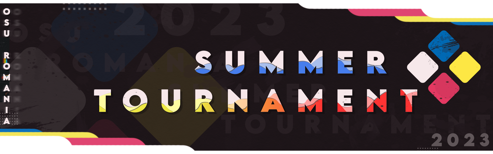
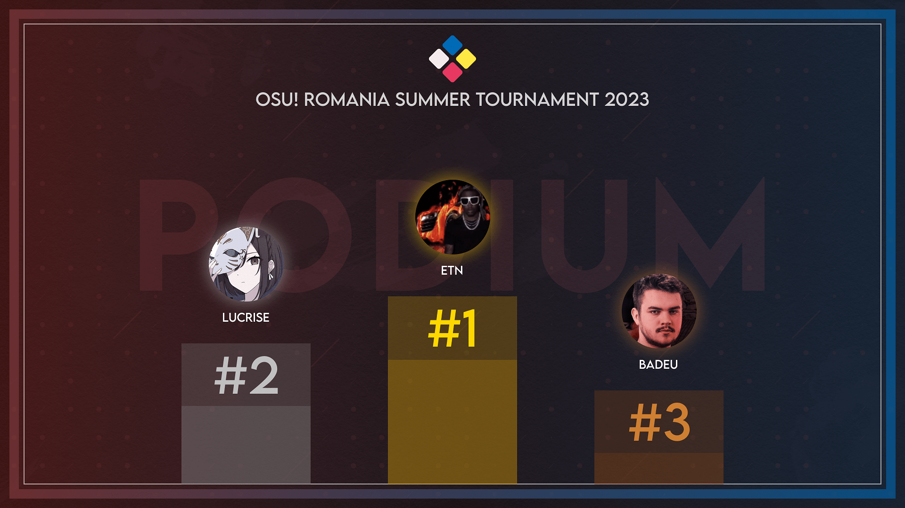

---
tags:
  - o!RST 2023
  - o!RT
---

# osu! Romania Summer Tournament 2023

The **osu! Romania Summer Tournament 2023** (***o!RST 2023***) was a 1v1 double elimination osu! tournament for Romanian and Moldovan players hosted by ::{ flag=RO }:: [Teetoos](https://osu.ppy.sh/users/10065874), ::{ flag=RO }:: [RatonGolzache](https://osu.ppy.sh/users/11649551) and ::{ flag=RO }:: [FallenAngelD](https://osu.ppy.sh/users/5225626). It was the fifth instalment of the osu! Romania Tournament.

## Tournament schedule

| Event | Timestamp |
| --: | :-- |
| Registration phase | 2023-06-01/2023-06-28 |
| Qualifier stage | 2023-07-15/2023-07-16 |
| Round of 32 | 2023-07-22/2023-07-23 |
| Round of 16 | 2023-07-29/2023-07-30 |
| Quarterfinals | 2023-08-05/2023-08-06 |
| Semifinals | 2023-08-12/2023-08-13 |
| Finals | 2023-08-19/2023-08-20 |
| Grand Finals | 2023-08-26/2023-08-28 |

## Prizes

| Placing | Prize(s) |
| :-: | :-- |
|  | 63.5€, profile badge |
|  | 42.3€ |
|  | 21.2€ |

## Organisation

The osu! Romania Summer Tournament 2023 was run by various community members:

| Position | Member(s) |
| :-- | :-- |
| Host | ::{ flag=RO }:: [Teetoos](https://osu.ppy.sh/users/10065874), ::{ flag=RO }:: [RatonGolzache](https://osu.ppy.sh/users/11649551), ::{ flag=RO }:: [FallenAngelD](https://osu.ppy.sh/users/5225626) |
| Mappool selector | ::{ flag=GR }:: [JackPaX](https://osu.ppy.sh/users/11226645), ::{ flag=CA }:: [Takiaz](https://osu.ppy.sh/users/11177233) |
| Mappool playtester | ::{ flag=RO }:: [Teetoos](https://osu.ppy.sh/users/10065874), ::{ flag=PL }:: [cezgru](https://osu.ppy.sh/users/2629617), ::{ flag=RO }:: [nanoya](https://osu.ppy.sh/users/12366071) |
| Mapper | ::{ flag=FR }:: [jehukm](https://osu.ppy.sh/users/10981418), ::{ flag=RO }:: [nanoya](https://osu.ppy.sh/users/12366071), ::{ flag=FR }:: [Mimiliaa](https://osu.ppy.sh/users/7117621), ::{ flag=IT }:: [Zekk](https://osu.ppy.sh/users/9704802) |
| Streamer | ::{ flag=RO }:: [FallenAngelD](https://osu.ppy.sh/users/5225626), ::{ flag=RO }:: [Teetoos](https://osu.ppy.sh/users/10065874), ::{ flag=GB }:: [Roebuck554](https://osu.ppy.sh/users/15904004) |
| Commentator | ::{ flag=RO }:: [Teetoos](https://osu.ppy.sh/users/10065874), ::{ flag=RO }:: [FallenAngelD](https://osu.ppy.sh/users/5225626), ::{ flag=RO }:: [RatonGolzache](https://osu.ppy.sh/users/11649551), ::{ flag=RO }:: [Smol Ina](https://osu.ppy.sh/users/18789828), ::{ flag=RO }:: [r0botonic](https://osu.ppy.sh/users/14880483), ::{ flag=RO }:: [etn](https://osu.ppy.sh/users/4581069), ::{ flag=RO }:: [AndoryuRO](https://osu.ppy.sh/users/18631525), ::{ flag=RO }:: [nanoya](https://osu.ppy.sh/users/12366071), ::{ flag=RO }:: [LuchiBuchi](https://osu.ppy.sh/users/10897656) |
| Graphics designer | ::{ flag=RO }:: [GabuTheDev](https://osu.ppy.sh/users/17063658), ::{ flag=SE }:: [Velle](https://osu.ppy.sh/users/12849926), ::{ flag=RO }:: [Nice Aesthetics](https://osu.ppy.sh/users/7782553), ::{ flag=HU }:: [Indicolite](https://osu.ppy.sh/users/19309181) |
| Referee | ::{ flag=RO }:: [calancis](https://osu.ppy.sh/users/7980091), ::{ flag=RO }:: [STRYKEX](https://osu.ppy.sh/users/15799234), ::{ flag=RO }:: [FallenAngelD](https://osu.ppy.sh/users/5225626), ::{ flag=FR }:: [jehukm](https://osu.ppy.sh/users/10981418), ::{ flag=RO }:: [Nice Aesthetics](https://osu.ppy.sh/users/7782553), ::{ flag=RO }:: [hroni](https://osu.ppy.sh/users/14414337), ::{ flag=RO }:: [Koocie](https://osu.ppy.sh/users/8023626), ::{ flag=RO }:: [LuchiBuchi](https://osu.ppy.sh/users/10897656), ::{ flag=GB }:: [ilyt](https://osu.ppy.sh/users/9402773), ::{ flag=PL }:: [O_re_O](https://osu.ppy.sh/users/18389558) |
| Sheet Manager | ::{ flag=VN }:: [rock-on](https://osu.ppy.sh/users/9676089), ::{ flag=FR }:: [jehukm](https://osu.ppy.sh/users/10981418), ::{ flag=RO }:: [GabuTheDev](https://osu.ppy.sh/users/17063658), ::{ flag=RO }:: [LuchiBuchi](https://osu.ppy.sh/users/10897656) |

## Links

- [Discussion thread](https://osu.ppy.sh/community/forums/topics/1772675?n=1)
- [Livestream](https://www.twitch.tv/osuromania)
- [Spreadsheet](https://docs.google.com/spreadsheets/d/1_VjqjnSC6WfbnqgwhSr_RWKROM4wW7u3EJyi9sFs5ss/edit#gid=340794063)
- [Bracket](https://challonge.com/ORST2023)

## Participants

| Seed | Players |
| :-- | :-- |
| 1-8 | ::{ flag=RO }:: [etn](https://osu.ppy.sh/users/4581069), ::{ flag=RO }:: [badeu](https://osu.ppy.sh/users/1473890), ::{ flag=RO }:: [Razei](https://osu.ppy.sh/users/10778261), ::{ flag=RO }:: [Lucrise](https://osu.ppy.sh/users/9719351), ::{ flag=RO }:: [Shrikyun](https://osu.ppy.sh/users/21644645), ::{ flag=RO }:: [_Silvian](https://osu.ppy.sh/users/8511882), ::{ flag=RO }:: [r0botonic](https://osu.ppy.sh/users/14880483), ::{ flag=RO }:: [Chiu](https://osu.ppy.sh/users/3148900) |
| 9-16 | ::{ flag=RO }:: [roliy](https://osu.ppy.sh/users/9578404), ::{ flag=RO }:: [Kehest](https://osu.ppy.sh/users/6145000), ::{ flag=RO }:: [KeitoChan](https://osu.ppy.sh/users/10569381), ::{ flag=RO }:: [HowlPleb](https://osu.ppy.sh/users/15995105), ::{ flag=RO }:: [cristi2708](https://osu.ppy.sh/users/7552300), ::{ flag=RO }:: [Ficus Akishida](https://osu.ppy.sh/users/10345787), ::{ flag=RO }:: [gadzzaa](https://osu.ppy.sh/users/14367771), ::{ flag=RO }:: [Korinna](https://osu.ppy.sh/users/13603871) |
| 17-24 | ::{ flag=RO }:: [AlexBelea](https://osu.ppy.sh/users/19430137), ::{ flag=RO }:: [IIANTONIOII](https://osu.ppy.sh/users/12274213), ::{ flag=RO }:: [Martin23](https://osu.ppy.sh/users/9315365), ::{ flag=RO }:: [ent](https://osu.ppy.sh/users/10261883), ::{ flag=RO }:: [Nature angel](https://osu.ppy.sh/users/16555513), ::{ flag=RO }:: [zhuqing](https://osu.ppy.sh/users/14575641), ::{ flag=RO }:: [bossuromaniei](https://osu.ppy.sh/users/19994316), ::{ flag=RO }:: [kRionik](https://osu.ppy.sh/users/15324096) |
| 25-32 | ::{ flag=RO }:: [Paato](https://osu.ppy.sh/users/9390417), ::{ flag=RO }:: [\_Nino\_](https://osu.ppy.sh/users/8925010), ::{ flag=RO }:: [Lernaeus](https://osu.ppy.sh/users/9703390), ::{ flag=RO }:: [valked](https://osu.ppy.sh/users/28694940), ::{ flag=RO }:: [Teikem](https://osu.ppy.sh/users/16357854), ::{ flag=RO }:: [Asio_](https://osu.ppy.sh/users/19906166), ::{ flag=RO }:: [Luminous Sky](https://osu.ppy.sh/users/4429612), ::{ flag=RO }:: [AkakiKN](https://osu.ppy.sh/users/12875343) |

## Podium

This competition has come to an end and resulted in the following podium:

| Placing | Player |
| :-: | :-- |
|  | ::{ flag=RO }:: [etn](https://osu.ppy.sh/users/4581069) |
|  | ::{ flag=RO }:: [Lucrise](https://osu.ppy.sh/users/9719351) |
|  | ::{ flag=RO }:: [badeu](https://osu.ppy.sh/users/1473890) |

## Mappools

### Grand Finals

**[Download the mappack here! (154MB)](https://drive.google.com/file/d/1epT4Qjys7qN-ck4iy2pdjaFMJx2h7e1V/view)**

- NoMod
  1. [Alestorm - Shipwrecked [CAMO'S KEELHAULED]](https://osu.ppy.sh/beatmapsets/1850895#osu/3802256)
  2. [Plum - Tempest [Cyclogenesis]](https://osu.ppy.sh/beatmapsets/1544570#osu/3157129)
  3. [Cranky vs. HiTECH NINJA - HiT! HiT! HiT! [GREETINGS FROM HELL]](https://osu.ppy.sh/beatmapsets/1176223#osu/2453247)
  4. [kors k vs. Camellia - The Rolling [song is nice though]](https://osu.ppy.sh/beatmapsets/688576#osu/1457148)
  5. [AAAA vs. Frums - beepbit * futures [fast * forward]](https://osu.ppy.sh/beatmapsets/1633221#osu/3333700)
  6. [II-L - VOSTOK-6 [Beyond]](https://osu.ppy.sh/beatmapsets/1380791#osu/2852981)
- Hidden
  1. [Alestorm - Keelhauled [GIVE NO QUARTER]](https://osu.ppy.sh/beatmapsets/1537993#osu/3144568)
  2. [cordelia - Endless Flap [bans HD2]](https://osu.ppy.sh/beatmapsets/2048616#osu/4277201)
  3. [tofubeats - CANDYYYLAND feat LIZ - Pa's Lam System Remix [Bittersweet Surrender]](https://osu.ppy.sh/beatmapsets/663519#osu/1478117)
  4. [TOMOSUKE - Macuilxochitl [Flower]](https://osu.ppy.sh/beatmapsets/1621894#osu/3311346)
- HardRock
  1. [BUTAOTOME - Mesen [EXPERT]](https://osu.ppy.sh/beatmapsets/865750#osu/1810154)
  2. [DJ Totoriott - Chloe [Mystery]](https://osu.ppy.sh/beatmapsets/915491#osu/1911962)
  3. [BEMANI Sound Team "Sota Fujimori" - OZONE [Crack]](https://osu.ppy.sh/beatmapsets/1466924#osu/3012571)
  4. [xi - Beatrice [esu x iljaaz's Extreme]](https://osu.ppy.sh/beatmapsets/1801967#osu/3698095)
- DoubleTime
  1. [Wakeshima Kanon - Tsukinami [Onlybiscuit's Extra]](https://osu.ppy.sh/beatmapsets/896080#osu/1924025)
  2. [-45 - yoshikawa45 vs. siesta45 Battle of HongKong [Para Bellum]](https://osu.ppy.sh/beatmapsets/1889111#osu/3890692)
  3. [LADYBABY - Nippon Manju [TheMefisto's Insane]](https://osu.ppy.sh/beatmapsets/910392#osu/2053770)
  4. [inabakumori - Lagtrain [Repetition]](https://osu.ppy.sh/beatmapsets/1313664#osu/2722655)
- Tiebreaker
  1. [ZxNX+Delaina - False Fairy Tale [The White Rabbit]](https://osu.ppy.sh/beatmapsets/2032331#osu/4351761)

### Finals

**[Download the mappack here! (167MB)](https://drive.google.com/file/d/1_nHsVXCEDupugNhzCCOb-NziJ9WJn2dm/view)**

- NoMod
  1. [ELFENSJoN - Hyousou wa Hakuen wo Matoite [Extra]](https://osu.ppy.sh/beatmapsets/1312064#osu/2719302)
  2. [Raimukun - Arachne [Resurrection]](https://osu.ppy.sh/beatmapsets/2024121#osu/4216118)
  3. [Machine Girl - Infinite Potentiality (Cut Ver.) [extraordinaire]](https://osu.ppy.sh/beatmapsets/1719598#osu/3514241)
  4. [Camellia vs Akira Complex - Railgun Roulette (VIP) [Neil x Sharu, Syzygy]](https://osu.ppy.sh/beatmapsets/694402#osu/1469136)
  5. [Inferi - Onslaught of the Covenant [Expert]](https://osu.ppy.sh/beatmapsets/1764590#osu/3611958)
  6. [MANY THANKS! feat. Setsunan - Banka [Extreme]](https://osu.ppy.sh/beatmapsets/1939593#osu/4010164)
- Hidden
  1. [Yousei Teikoku - Ranshou Aion [Paradise]](https://osu.ppy.sh/beatmapsets/1492639#osu/3059613)
  2. [kors k - SigSig [Yokes' Hidden Expert]](https://osu.ppy.sh/beatmapsets/1615650#osu/3298593)
  3. [Unlucky Morpheus - Majotachi no Shanikusai [AdveNt's Master Spark]](https://osu.ppy.sh/beatmapsets/1890758#osu/3903974)
  4. [II-L feat. amelie xoxo - THE EARTH [Zeta: Non-trivial]](https://osu.ppy.sh/beatmapsets/1889101#osu/3900737)
- HardRock
  1. [UNISON SQUARE GARDEN - Chaos ga Kiwamaru [some soccer anime i guess]](https://osu.ppy.sh/beatmapsets/1914935#osu/3950576)
  2. [Ampzer - Lotus [-PC's Extra]](https://osu.ppy.sh/beatmapsets/1848627#osu/3797495)
  3. [Dirtyphonics - Night Ride [Ultimate Drift]](https://osu.ppy.sh/beatmapsets/1621891#osu/3311337)
  4. [NIWASHI & taiyo - Nami/Oto you-shi [Ubiquitous]](https://osu.ppy.sh/beatmapsets/1833621#osu/3764329)
- DoubleTime
  1. [Charlie Puth - Light Switch [Click Clack]](https://osu.ppy.sh/beatmapsets/1712086#osu/3498454)
  2. [senya - Shunkan Everlasting [Lunatic]](https://osu.ppy.sh/beatmapsets/1981457#osu/4114463)
  3. [beatMARIO - Night of Knights [Kotori's Extreme]](https://osu.ppy.sh/beatmapsets/352570#osu/828940)
  4. [KOTOKO - Wing my Way [Endless Sky]](https://osu.ppy.sh/beatmapsets/850548#osu/1778268)
- Tiebreaker
  1. [SAMString - NUMA [Multifarious]](https://osu.ppy.sh/beatmapsets/1570528#osu/3207042)

### Semi-Finals

**[Download the mappack here! (125MB)](https://drive.google.com/file/d/1-0OjSV0eqTUC3TUIBLhzG3zzGtgRpRoJ/view)**

- NoMod
  1. [Mami Kawada - Serment [Pledges]](https://osu.ppy.sh/beatmapsets/1833913#osu/3764941)
  2. [PYKAMIA - Fantasia Sonata Mirror [FINAL]](https://osu.ppy.sh/beatmapsets/1883456#osu/3877754)
  3. [otetsu - Meiteki Cybernetics [Raijodo x kuyusu's Extra (MYT Edit)]](https://osu.ppy.sh/beatmapsets/1570535#osu/3207056)
  4. [Silentroom - Nhelv [Eureka]](https://osu.ppy.sh/beatmapsets/744182#osu/1569152)
  5. [The Ritual Aura - Ectoplasm [Synthetic Absolutism - Original]](https://osu.ppy.sh/beatmapsets/1563639#osu/3193037)
  6. [connsome - flat by second [Another]](https://osu.ppy.sh/beatmapsets/1633261#osu/3333760)
- Hidden
  1. [Kaf - Kako o Kurau [Penitence]](https://osu.ppy.sh/beatmapsets/1575602#osu/3216819)
  2. [Cranky - The Five [Short Edit] [Five]](https://osu.ppy.sh/beatmapsets/1194122#osu/2487840)
  3. [Reku Mochizuki - VEZZELiX [ripita]](https://osu.ppy.sh/beatmapsets/1567516#osu/3200583)
  4. [ave;new feat. Shirasawa Rie - MAYBE ROSY KISS -HARD dRESS STYLE- [MAYBE POSSIBLE]](https://osu.ppy.sh/beatmapsets/169650#osu/410858)
- HardRock
  1. [Akatsuki Records - KOISHI ~ Koishi Infinity ~ [Stacked]](https://osu.ppy.sh/beatmapsets/1062030#osu/2223872)
  2. [zakuro - Tasogare no Odoriba [Dance]](https://osu.ppy.sh/beatmapsets/1800829#osu/3691977)
  3. [Pegboard Nerds x MisterWives - Coffins [Neil x LCFC's Conflux]](https://osu.ppy.sh/beatmapsets/823272#osu/1725369)
  4. [NIWASHI - Harder Than Diamond [Down's Extra]](https://osu.ppy.sh/beatmapsets/1884920#osu/3880947)
- DoubleTime
  1. [sana - Senpai. [litoluna's Insane]](https://osu.ppy.sh/beatmapsets/637706#osu/1384674)
  2. [Down - Trio Cup [Lunatic]](https://osu.ppy.sh/beatmapsets/1769914#osu/3623164)
  3. [ALiCE'S EMOTiON - Voice [Sakura Lunatic]](https://osu.ppy.sh/beatmapsets/2040705#osu/4257344)
  4. [Mark Keali'i Ho'omalu & Kamehameha Schools Children's Chorus - Hawaiian Roller Coaster Ride [Beyond the Horizon]](https://osu.ppy.sh/beatmapsets/1525457#osu/3121051)
- Tiebreaker
  1. [Down - Chosun [Dragon]](https://osu.ppy.sh/beatmapsets/1833547#osu/3764203)

### Quarter-Finals

**[Download the mappack here! (142MB)](https://drive.google.com/file/d/1z3URi-h3ueWOxNYdGw0g_AHnw7Jniymq/view)**

- NoMod
  1. [Yuki Hayashi - Concept no Tatakai [NZ no Tatakai]](https://osu.ppy.sh/beatmapsets/1698769#osu/3471158)
  2. [Aether Realm - Tarot [Final Stand]](https://osu.ppy.sh/beatmapsets/1291247#osu/2680248)
  3. [hitorie - NONSENSE [Gochisousama]](https://osu.ppy.sh/beatmapsets/1963004#osu/4068544)
  4. [MYTK - Senkyou [Orientalism (feat. Altai)]](https://osu.ppy.sh/beatmapsets/1262410#osu/2623950)
  5. [goreshit - Satori De Pon! [Terror]](https://osu.ppy.sh/beatmapsets/1550807#osu/3169031)
  6. [john - Utage [Dabbe's Hidden Insane]](https://osu.ppy.sh/beatmapsets/1842709#osu/3802071)
- Hidden
  1. [BAND-MAID - RINNE [REINCARNATION]](https://osu.ppy.sh/beatmapsets/1193063#osu/2485993)
  2. [Hana - Kuukirikigaku Shoujo to Shounen no Uta [Mirash & Delis' Collab Extra]](https://osu.ppy.sh/beatmapsets/1164291#osu/2744118)
  3. [lapix - shime (Extended Mix) [Collab]](https://osu.ppy.sh/beatmapsets/1144604#osu/2389811)
  4. [Tokyo Jihen - Sounan [deca & fuju's expert]](https://osu.ppy.sh/beatmapsets/1512583#osu/3168251)
- HardRock
  1. [Yorushika - Replicant [Everybody out there is a replica]](https://osu.ppy.sh/beatmapsets/1225062#osu/2547849)
  2. [Se-U-Ra - Qlifact -another- [Icekalt's Extra]](https://osu.ppy.sh/beatmapsets/1224699#osu/2577517)
  3. [K/DA - THE BADDEST feat. (G)I-DLE, Bea Miller, Wolftyla [Kujinn's Drip]](https://osu.ppy.sh/beatmapsets/1246447#osu/2590758)
  4. [$UICIDEBOY$ x GETTER - CHAMPION OF DEATH [EXTRA x MIZUJIN]](https://osu.ppy.sh/beatmapsets/1935146#osu/4036813)
- DoubleTime
  1. [Takigawa Alisa - Season [Insane]](https://osu.ppy.sh/beatmapsets/1029865#osu/2153468)
  2. [-45 - System Sun [Insane]](https://osu.ppy.sh/beatmapsets/1616029#osu/3299371)
  3. [yanaginagi - Tokohana [Heilia & Atipir's Platonic Collab Insane]](https://osu.ppy.sh/beatmapsets/1798429#osu/3689495)
  4. [Post Malone, Swae Lee - Sunflower [Insane]](https://osu.ppy.sh/beatmapsets/1450998#osu/3014599)
- Tiebreaker
  1. [King Gizzard & The Lizard Wizard - Robot Stop [REDLIGHT (VIP)]](https://osu.ppy.sh/beatmapsets/1610231#osu/3287767)

### Round of 16

**[Download the mappack here! (97MB)](https://drive.google.com/file/d/1-zgElhRN_AyhMexdk2SzmBmSvmJxkFhx/view)**

- NoMod
  1. [LiSA - Tsumibito [Spiral of Emotions]](https://osu.ppy.sh/beatmapsets/1180614#osu/2461785)
  2. [Raimukun - Nyarlathotep's Dreamland [Arctic Allegro]](https://osu.ppy.sh/beatmapsets/2012214#osu/4187144)
  3. [Anba, Fokushi, saint, Lollia, Tsubame - Portrait of the Pirate F [Anata wa shinji raremasu ka?]](https://osu.ppy.sh/beatmapsets/852450#osu/1781806)
  4. [Raphlesia & BilliumMoto - My Love [Our Expert]](https://osu.ppy.sh/beatmapsets/1388906#osu/2868387)
  5. [Noah - Heavenly caress [Days of Future Past]](https://osu.ppy.sh/beatmapsets/1537692#osu/3144021)
  6. [Death Grips - I've Seen Footage [Dada's Special Extra]](https://osu.ppy.sh/beatmapsets/1875441#osu/3859444)
- Hidden
  1. [Rita - deficiency [collapse]](https://osu.ppy.sh/beatmapsets/1267545#osu/2634223)
  2. [Sheena Ringo - Open Secret [Oba]](https://osu.ppy.sh/beatmapsets/1729856#osu/3535284)
  3. [ak+q - Ignotus [Expert]](https://osu.ppy.sh/beatmapsets/997209#osu/2085958)
- HardRock
  1. [Icon For Hire - Cynics & Critics [Extreme]](https://osu.ppy.sh/beatmapsets/296017#osu/664851)
  2. [Aitsuki Nakuru - Daisan no Shinzou [nakuru]](https://osu.ppy.sh/beatmapsets/1833750#osu/3764586)
  3. [Function Phantom - Variable [Deluxe]](https://osu.ppy.sh/beatmapsets/751774#osu/1582594)
- DoubleTime
  1. [Vaundy - Hadaka no Yuusha [FuJu's Insane]](https://osu.ppy.sh/beatmapsets/1669880#osu/3424169)
  2. [Hatsune Miku - Oshiete!! Mahou no Lyric [Insane]](https://osu.ppy.sh/beatmapsets/40669#osu/128931)
  3. [CHON - Splash [-Kemsyt & Orkay's Insane]](https://osu.ppy.sh/beatmapsets/1570536#osu/3384390)
- Tiebreaker
  1. [DJ SHARPNEL - FAKE PROMISE [NISEMONO]](https://osu.ppy.sh/beatmapsets/1604660#osu/3276769)

### Round of 32

**[Download the mappack here! (137MB)](https://drive.google.com/file/d/1_EWLhbs2DfBw2UIJpEkJFXskn1680vxz/view)**

- NoMod
  1. [Suzuki Konomi - Sky Blue OASIS [Shining]](https://osu.ppy.sh/beatmapsets/1379578#osu/2850709)
  2. [Xi - Youyoumu ~ Run or Dash [Extra]](https://osu.ppy.sh/beatmapsets/1782703#osu/3650832)
  3. [Tsukuyomi - Tsuki ga Michiru [Collab Extra]](https://osu.ppy.sh/beatmapsets/1867271#osu/3875735)
  4. [Middle Idol - Insight [Do Not Fall!]](https://osu.ppy.sh/beatmapsets/1794345#osu/3677660)
  5. [LeaF - Kyouki Ranbu [Extreme (OD9)]](https://osu.ppy.sh/beatmapsets/1369440#osu/3414749)
  6. [maki - whiteland calm [Another]](https://osu.ppy.sh/beatmapsets/1740250#osu/3557551)
- Hidden
  1. [Rib - Tsukiakari [Yudragen's Expert]](https://osu.ppy.sh/beatmapsets/1688783#osu/3623311)
  2. [kobasolo - Haru ni Yuraredo Kimi Omou (feat. Kopi) [insane]](https://osu.ppy.sh/beatmapsets/1235937#osu/2577821)
  3. [Eagle - S!ck [!]](https://osu.ppy.sh/beatmapsets/1286316#osu/2670817)
- HardRock
  1. [Alisa Kozhikina - Gravity - Zero [Freedom]](https://osu.ppy.sh/beatmapsets/694185#osu/1640908)
  2. [Sakuzyo - Erlung [Precision Dance (Corsace Ver.)]](https://osu.ppy.sh/beatmapsets/1824709#osu/3744532)
  3. [USAO - Knight Rider [Hanori's Extra]](https://osu.ppy.sh/beatmapsets/1550327#osu/3182347)
- DoubleTime
  1. [Yousei Teikoku - Torikago [Insane]](https://osu.ppy.sh/beatmapsets/412140#osu/974072)
  2. [dj TAKA - Colors -sasakure.UK Futurelogic Remix- [Hyper]](https://osu.ppy.sh/beatmapsets/317439#osu/1319822)
  3. [CHiCO with HoneyWorks - Sekai wa Koi ni Ochiteiru [Confession]](https://osu.ppy.sh/beatmapsets/549977#osu/1526271)
- Tiebreaker
  1. [Nakamura Meiko - Core of Spark [Dash the Heart]](https://osu.ppy.sh/beatmapsets/798420#osu/1676639)

### Qualifiers

**[Download the mappack here! (71MB)](https://drive.google.com/file/d/1fbqRKbfmed0pDuU4srHvRBQcsr4kC9Fy/view)**

- NoMod
  1. [Jin feat. MARiA from GARNiDELiA - daze [Let's "Excitement"]](https://osu.ppy.sh/beatmapsets/620132#osu/1307021)
  2. [m108 - XIII Charlotte [yumenother]](https://osu.ppy.sh/beatmapsets/678383#osu/1434424)
  3. [POP ART TOWN - i [IROHAKE'S EXTRA]](https://osu.ppy.sh/beatmapsets/1635846#osu/3371358)
  4. [EmoCo. - This Club is Not 4 U [#3: Seolv's Expert]](https://osu.ppy.sh/beatmapsets/1282123#osu/2663018)
- Hidden
  1. [Toyama Nao - Wagon [Departure]](https://osu.ppy.sh/beatmapsets/1669004#osu/3408413)
  2. [happy30 - As the wind blows [Kyouren x Ascended's Extra]](https://osu.ppy.sh/beatmapsets/1881739#osu/3893986)
- HardRock
  1. [YUC'e - Cinderella Syndrome [Affection]](https://osu.ppy.sh/beatmapsets/561693#osu/1187506)
  2. [ALI - Wild Side [Ayyrage's Another]](https://osu.ppy.sh/beatmapsets/1109683#osu/2371970)
- DoubleTime
  1. [Spira Spica - Sansan Days [KoldNoodl's Insane]](https://osu.ppy.sh/beatmapsets/1671373#osu/3423393)
  2. [Nekrogoblikon - Killing Time (and Space) [Insane]](https://osu.ppy.sh/beatmapsets/1536045#osu/3140773)

## Match results

### Grand Finals

Saturday, August 26, 2023:

| Player 1 |  |  | Player 2 | Match link |
| --: | :-: | :-: | :-- | :-- |
| badeu ::{ flag=RO }:: | 3 | **7** | ::{ flag=RO }:: **Lucrise** | [#1](https://osu.ppy.sh/community/matches/110176505) |

Monday, August 28, 2023:

| Player 1 |  |  | Player 2 | Match link |
| --: | :-: | :-: | :-- | :-- |
| **etn** ::{ flag=RO }:: | **7** | 3 | ::{ flag=RO }:: Lucrise | [#1](https://osu.ppy.sh/community/matches/110209499) |

### Finals

Saturday, August 19, 2023:

| Player 1 |  |  | Player 2 | Match link |
| --: | :-: | :-: | :-- | :-- |
| **Lucrise** ::{ flag=RO }:: | **7** | 1 | ::{ flag=RO }:: _Silvian | [#1](https://osu.ppy.sh/community/matches/110070237) |
| Razei ::{ flag=RO }:: | -1 | **0** | ::{ flag=RO }:: Shrikyun | win by default |

Sunday, August 20, 2023:

| Player 1 |  |  | Player 2 | Match link |
| --: | :-: | :-: | :-- | :-- |
| **etn** ::{ flag=RO }:: | **7** | 3 | ::{ flag=RO }:: badeu | [#1](https://osu.ppy.sh/community/matches/110086027) |

Monday, August 21, 2023:

| Player 1 |  |  | Player 2 | Match link |
| --: | :-: | :-: | :-- | :-- |
| Shrikyun ::{ flag=RO }:: | 0 | **7** | ::{ flag=RO }:: **Lucrise** | [#1](https://osu.ppy.sh/community/matches/110101938) |

### Semi-Finals

Saturday, August 12, 2023:

| Player 1 |  |  | Player 2 | Match link |
| --: | :-: | :-: | :-- | :-- |
| **Shrikyun** ::{ flag=RO }:: | **6** | 1 | ::{ flag=RO }:: Ficus Akishida | [#1](https://osu.ppy.sh/community/matches/109958375) |
| **r0botonic** ::{ flag=RO }:: | **6** | 1 | ::{ flag=RO }:: AlexBelea | [#1](https://osu.ppy.sh/community/matches/109958667) |
| **_Silvian** ::{ flag=RO }:: | **6** | 3 | ::{ flag=RO }:: HowlPleb | [#1](https://osu.ppy.sh/community/matches/109961308) |
| **roliy** ::{ flag=RO }:: | **6** | 0 | ::{ flag=RO }:: Kehest | [#1](https://osu.ppy.sh/community/matches/109962808) |

Sunday, August 13, 2023:

| Player 1 |  |  | Player 2 | Match link |
| --: | :-: | :-: | :-- | :-- |
| badeu ::{ flag=RO }:: | **0** | -1 | ::{ flag=RO }:: Razei | win by default |
| **Shrikyun** ::{ flag=RO }:: | **6** | 4 | ::{ flag=RO }:: roliy | [#1](https://osu.ppy.sh/community/matches/109975490) |
| **etn** ::{ flag=RO }:: | **6** | 4 | ::{ flag=RO }:: Lucrise | [#1](https://osu.ppy.sh/community/matches/109977573) |
| **_Silvian** ::{ flag=RO }:: | **6** | 5 | ::{ flag=RO }:: r0botonic | [#1](https://osu.ppy.sh/community/matches/109979280) |

### Quarter-Finals

Thursday, August 3, 2023:

| Player 1 |  |  | Player 2 | Match link |
| --: | :-: | :-: | :-- | :-- |
| KeitoChan ::{ flag=RO }:: | 3 | **6** | ::{ flag=RO }:: **Korinna** | [#1](https://osu.ppy.sh/community/matches/109815675) |

Saturday, August 5, 2023:

| Player 1 |  |  | Player 2 | Match link |
| --: | :-: | :-: | :-- | :-- |
| **AlexBelea** ::{ flag=RO }:: | **6** | 1 | ::{ flag=RO }:: Lernaeus | [#1](https://osu.ppy.sh/community/matches/109846805) |
| **ent** ::{ flag=RO }:: | **6** | 3 | ::{ flag=RO }:: bossuromaniei | [#1](https://osu.ppy.sh/community/matches/109847281) |
| **gadzzaa** ::{ flag=RO }:: | **6** | 2 | ::{ flag=RO }:: Nature angel | [#1](https://osu.ppy.sh/community/matches/109849176) |
| **Ficus Akishida** ::{ flag=RO }:: | **0** | -1 | ::{ flag=RO }:: kRionik | win by default |
| **HowlPleb** ::{ flag=RO }:: | **6** | 1 | ::{ flag=RO }:: IIANTONIOII | [#1](https://osu.ppy.sh/community/matches/109850801) |
| Chiu ::{ flag=RO }:: | 5 | **6** | ::{ flag=RO }:: **Martin23** | [#1](https://osu.ppy.sh/community/matches/109852747) |
| **Kehest** ::{ flag=RO }:: | **6** | 1 | ::{ flag=RO }:: cristi2708 | [#1](https://osu.ppy.sh/community/matches/109853856) |

Sunday, August 6, 2023:

| Player 1 |  |  | Player 2 | Match link |
| --: | :-: | :-: | :-- | :-- |
| **Lucrise** ::{ flag=RO }:: | **6** | 2 | ::{ flag=RO }:: Shrikyun | [#1](https://osu.ppy.sh/community/matches/109864225) |
| **Razei** ::{ flag=RO }:: | **6** | 1 | ::{ flag=RO }:: _Silvian | [#1](https://osu.ppy.sh/community/matches/109864876) |
| **Kehest** ::{ flag=RO }:: | **6** | 3 | ::{ flag=RO }:: gadzzaa | [#1](https://osu.ppy.sh/community/matches/109866325) |
| **HowlPleb** ::{ flag=RO }:: | **6** | 3 | ::{ flag=RO }:: ent | [#1](https://osu.ppy.sh/community/matches/109868902) |
| Martin23 ::{ flag=RO }:: | 4 | **6** | ::{ flag=RO }:: **AlexBelea** | [#1](https://osu.ppy.sh/community/matches/109869666) |
| **badeu** ::{ flag=RO }:: | **6** | 2 | ::{ flag=RO }:: r0botonic | [#1](https://osu.ppy.sh/community/matches/109869716) |

Monday, August 7, 2023:

| Player 1 |  |  | Player 2 | Match link |
| --: | :-: | :-: | :-- | :-- |
| Korinna ::{ flag=RO }:: | 3 | **6** | ::{ flag=RO }:: **Ficus Akishida** | [#1](https://osu.ppy.sh/community/matches/109885773) |

Tuesday, August 8, 2023:

| Player 1 |  |  | Player 2 | Match link |
| --: | :-: | :-: | :-- | :-- |
| **etn** ::{ flag=RO }:: | **6** | 4 | ::{ flag=RO }:: roliy | [#1](https://osu.ppy.sh/community/matches/109896716) |

### Round of 16

Friday, July 28, 2023:

| Player 1 |  |  | Player 2 | Match link |
| --: | :-: | :-: | :-- | :-- |
| AkakiKN ::{ flag=RO }:: | 1 | **5** | ::{ flag=RO }:: **Korinna** | [#1](https://osu.ppy.sh/community/matches/109723960) |
| **etn** ::{ flag=RO }:: | **5** | 0 | ::{ flag=RO }:: AlexBelea | [#1](https://osu.ppy.sh/community/matches/109724716) |

Saturday, July 29, 2023:

| Player 1 |  |  | Player 2 | Match link |
| --: | :-: | :-: | :-- | :-- |
| \_Nino\_ ::{ flag=RO }:: | 3 | **5** | ::{ flag=RO }:: **bossuromaniei** | [#1](https://osu.ppy.sh/community/matches/109734462) |
| **Razei** ::{ flag=RO }:: | **5** | 0 | ::{ flag=RO }:: Ficus Akishida | [#1](https://osu.ppy.sh/community/matches/109736812) |
| Teikem ::{ flag=RO }:: | 2 | **5** | ::{ flag=RO }:: **cristi2708** | [#1](https://osu.ppy.sh/community/matches/109737553) |
| Asio_ ::{ flag=RO }:: | -1 | **0** | ::{ flag=RO }:: Martin23 | win by default |
| **r0botonic** ::{ flag=RO }:: | **5** | 2 | ::{ flag=RO }:: kRionik | [#1](https://osu.ppy.sh/community/matches/109740687) |
| **_Silvian** ::{ flag=RO }:: | **5** | 1 | ::{ flag=RO }:: KeitoChan | [#1](https://osu.ppy.sh/community/matches/109741596) |

Sunday, July 30, 2023:

| Player 1 |  |  | Player 2 | Match link |
| --: | :-: | :-: | :-- | :-- |
| Paato ::{ flag=RO }:: | -1 | **0** | ::{ flag=RO }:: kRionik | win by default |
| **Lernaeus** ::{ flag=RO }:: | **0** | -1 | ::{ flag=RO }:: zhuqing | win by default |
| **badeu** ::{ flag=RO }:: | **5** | 2 | ::{ flag=RO }:: gadzzaa | [#1](https://osu.ppy.sh/community/matches/109753712) |
| valked ::{ flag=RO }:: | 2 | **5** | ::{ flag=RO }:: **Nature angel** | [#1](https://osu.ppy.sh/community/matches/109754628) |
| Chiu ::{ flag=RO }:: | 2 | **5** | ::{ flag=RO }:: **roliy** | [#1](https://osu.ppy.sh/community/matches/109757400) |

Monday, July 31, 2023:

| Player 1 |  |  | Player 2 | Match link |
| --: | :-: | :-: | :-- | :-- |
| **Shrikyun** ::{ flag=RO }:: | **5** | 3 | ::{ flag=RO }:: HowlPleb | [#1](https://osu.ppy.sh/community/matches/109772524) |
| **Lucrise** ::{ flag=RO }:: | **5** | 0 | ::{ flag=RO }:: ent | [#1](https://osu.ppy.sh/community/matches/109774726) |

### Round of 32

Friday, July 21, 2023:

| Player 1 |  |  | Player 2 | Match link |
| --: | :-: | :-: | :-- | :-- |
| **badeu** ::{ flag=RO }:: | **5** | 0 | ::{ flag=RO }:: Luminous Sky | [#1](https://osu.ppy.sh/community/matches/109606700) |

Saturday, July 22, 2023:

| Player 1 |  |  | Player 2 | Match link |
| --: | :-: | :-: | :-- | :-- |
| **etn** ::{ flag=RO }:: | **5** | 0 | ::{ flag=RO }:: AkakiKN | [#1](https://osu.ppy.sh/community/matches/109621251) |
| **HowlPleb** ::{ flag=RO }:: | **5** | 2 | ::{ flag=RO }:: Nature angel | [#1](https://osu.ppy.sh/community/matches/109622059) |
| **gadzzaa** ::{ flag=RO }:: | **5** | 4 | ::{ flag=RO }:: IIANTONIOII | [#1](https://osu.ppy.sh/community/matches/109623094) |
| **Ficus Akihida** ::{ flag=RO }:: | **5** | 4 | ::{ flag=RO }:: Martin23 | [#1](https://osu.ppy.sh/community/matches/109626300) |
| **KeitoChan** ::{ flag=RO }:: | **5** | 1 | ::{ flag=RO }:: zhuqing | [#1](https://osu.ppy.sh/community/matches/109627934) |

Sunday, July 23, 2023:

| Player 1 |  |  | Player 2 | Match link |
| --: | :-: | :-: | :-- | :-- |
| **Razei** ::{ flag=RO }:: | **5** | 0 | ::{ flag=RO }:: Asio_ | [#1](https://osu.ppy.sh/community/matches/109638301) |
| **roliy** ::{ flag=RO }:: | **5** | 0 | ::{ flag=RO }:: kRionik | [#1](https://osu.ppy.sh/community/matches/109640366) |
| **r0botoic** ::{ flag=RO }:: | **5** | 0 | ::{ flag=RO }:: \_Nino\_ | [#1](https://osu.ppy.sh/community/matches/109641136) |
| cristi2708 ::{ flag=RO }:: | 4 | **5** | ::{ flag=RO }:: **ent** | [#1](https://osu.ppy.sh/community/matches/109641374) |
| **_Silvian** ::{ flag=RO }:: | **5** | 1 | ::{ flag=RO }:: Lernaeus | [#1](https://osu.ppy.sh/community/matches/109642053) |

Monday, July 24, 2023:

| Player 1 |  |  | Player 2 | Match link |
| --: | :-: | :-: | :-- | :-- |
| **Kehest** ::{ flag=RO }:: | **5** | 1 | ::{ flag=RO }:: bossuromaniei | [#1](https://osu.ppy.sh/community/matches/109653565) |
| **Lucrise** ::{ flag=RO }:: | **5** | 0 | ::{ flag=RO }:: Teikem | [#1](https://osu.ppy.sh/community/matches/109655844) |
| **Chiu** ::{ flag=RO }:: | **5** | 1 | ::{ flag=RO }:: Paato | [#1](https://osu.ppy.sh/community/matches/109657517) |
| **Shrikyun** ::{ flag=RO }:: | **5** | 0 | ::{ flag=RO }:: valked | [#1](https://osu.ppy.sh/community/matches/109659241) |
| Korinna ::{ flag=RO }:: | 4 | **5** | ::{ flag=RO }:: **AlexBelea** | [#1](https://osu.ppy.sh/community/matches/109659502) |

## Ruleset

### General rules

1. This is a 1v1 tournament featuring a knockout double-elimination format, with a preceding qualifier stage.
2. The system used for beatmap scoring will be [ScoreV2](/wiki/Gameplay/Score#scorev2), with [NoFail](/wiki/Gameplay/Game_modifier/No_Fail) enforced on all maps.
3. It is required to be part of the tournament Discord server.
4. It is expected from the players to be respectful to other competitors, to staff members, and overall to follow the [osu! community rules](/wiki/Rules). Exceedingly poor conduct will be punished with disqualification and even potential blacklisting from future editions of the tournament.

### Registration

1. Prerequisites for participating in the tournament are as follows:
   - Having a Romanian ::{ flag=RO }:: or Moldovan ::{ flag=MD }:: flag on the profile. If a player does not have one of the two flags on his profile, being able to prove Romanian identity by other means to the tournament organizers is also a valid way to fulfill this requirement.
   - Passing the [screening](/wiki/Tournaments/Official_support#tournament-screening) phase to verify eligibility for playing in tournaments supported by the osu! staff. This will be done only after the sign-up period has ended, so a player must be registered to go through this process.
2. Core staff members like hosts, referees, mappool selectors, or spreadsheet managers are not allowed to simultaneously take part in the tournament as players.
3. Staff members fulfilling only front-end roles as streamers, commentators or graphics designers are permitted to participate in the tournament as players.

### Qualifiers

1. The qualifiers will determine the participants and the seeding order for the knockout stage.
2. Each player will play in one of the qualifier lobbies held during the weekend. Players may ask for extra lobbies to be scheduled on other days of the week, but not later than Monday, July 17 2023, 22:00 UTC+3.
3. Whilst in the lobby, the players will do one playthrough of the qualifiers mappool, in the order from the mappool spreadsheet.
4. The results will be sorted by **total rank**, which is the sum of a player's placings by score when compared to other players on every map in the pool. The lower the total rank, the higher placing in the qualifiers ranking. In case of a tie between multiple players on total rank, normalised average score will be used as a tiebreaker.

### Knockout stage

1. The knockout stage will be split into multiple rounds taking place on a weekly basis, with each round's matches being played on a corresponding mappool.
2. It will feature a maximum of 32 players in a Round of 32 bracket. If the minimum number of players for a bracket of that size is not reached, the bracket will be downsized to Round of 16.
3. For each round a weekend will be allocated in the tournament's tentative schedule, however a round may be postponed at the discretion of the staff and with the approval of the remaining participants if the situation calls for it.
4. Round of 32 and Round of 16 will give players 1 map ban each, while starting from the Quarter Finals they will both have 2 map bans. If a player bans a map, that map cannot be picked for playing by any of the two players in the match.
5. The winning conditions for matches in each round are as follows:
   - Round of 32/Round of 16: Best of 9 (first to 5 points)
   - Quarter-Finals/Semi-Finals: Best of 11 (first to 6 points)
   - Finals/Grand Finals: Best of 13 (first to 7 points), with "bracket reset" rules in the Grand Final applying as follows:
     - The finalist coming from the Losers Bracket has to win 2 consecutive games.
     - The finalist coming from the Winners Bracket has to win 1 game. That means winning either the first set, or the decisive set right after in case he loses the first one.

### Match procedure

1. 10 minutes before match time, the referee will create a lobby with the name ORST: (Player 1) vs (Player 2). Shortly after, he will give the invites to the players.
2. If a player fails to be present in the lobby 10 minutes after match time, whilst not responding to any method of contact, it will be considered a forfeit and a loss by default for that player.
3. Players are allowed to choose one warm-up map each, but the maps must not exceed 4 minutes of drain time.
4. Both players will type the `!roll` command to draw a random number. The player with the lower number will decide the ban order, and the player with the higher number will choose the pick order.
5. The ban order will be A-B in Round of 32/16, and A-B-B-A from Quarter Finals onwards, with "A" representing the player with the first ban.
6. Players have 90 seconds to pick or ban a map and 90 seconds to prepare before a map starts. If a player does not pick a map in due time, that player's pick will be skipped, and if the same happens for a ban, that player's ban will be considered unused.
7. Each player has the right to request one timeout for technical reasons, which can last up to 3 minutes.
8. For each map, after both players are ready, the referee will start a 10 second countdown with `!mp start 10` which will automatically start gameplay.
9. If a player does not ready up before the end of the 90 second ready-up timer, the referee will trigger that player's timeout, which will result in the loss of said player's right to request any subsequent timeout. If the ready-up timer expires again for the same player, the referee will forcefully start gameplay at the end of the countdown.
10. If a player disconnects within the first 30 seconds of play, the map will be replayed, but this is only allowed once per game. Subsequent disconnections or any disconnect which happens more than 30 seconds into the map will result in a point loss unless the player who disconnected can provide proof of the final score.
11. Each map win is one point. The first player to reach the required amount of points wins. If the score is tied with only one point left to play, the match will be decided on the Tiebreaker map.
12. Maps which end in a tie will be replayed.
13. The referee cannot interfere with, or make decisions about the match that are not within his responsibility. For those kinds of situations, a host will have to be contacted.

### Scheduling

1. The standard time used for scheduling purposes will be in **UTC+3** (Romania's time zone during Daylight Saving Time).
2. Matches will be held by default during the weekend, with reschedules being allowed on other days of the week within some limits.
3. Reschedules are expected to be done within an adequate time frame before the previously established match time, ideally with at least 8 hours to go before the match is supposed to take place. Otherwise, it will be at the tournament staff's discretion whether the reschedule will be allowed or not.

### Mappools

1. There will be separate mappools for each round. Their difficulty will increase after each week of the knockout stage, while the qualifiers mappool will have about the same difficulty as the Round of 16 mappool.
2. The mappools will consist of the following mod brackets: [No Mod](/wiki/Gameplay/Game_modifier#no-mod), [Hidden](/wiki/Gameplay/Game_modifier/Hidden), [Hard Rock](/wiki/Gameplay/Game_modifier/Hard_Rock), [Double Time](/wiki/Gameplay/Game_modifier/Double_Time), and a Tiebreaker on which [FreeMod](/wiki/Gameplay/Game_modifier#free-mod) rules will apply. The only exception is the qualifier stage which will not feature a Tiebreaker map.
3. On the Tiebreaker both players can, but are not forced to choose at least one of the Hidden, HardRock, Flashlight and EZ mods, or any of their valid combinations. This map cannot be picked by the players and will only be used as the decisive map whenever in a knockout stage match two players are tied with one point left to play.
4. EZ mod will have a multiplier of 1x (the score obtained in the lobby will be multiplied by 2).
5. The number of maps in each round for each mod bracket will be as follows:

| **Round/Mod** | NoMod | Hidden | HardRock | DoubleTime | Tiebreaker |
| :-: | :-: | :-: | :-: | :-: | :-: |
| Qualifiers | 4 | 2 | 2 | 2 | 0 |
| Round of 32 | 6 | 3 | 3 | 3 | 1 |
| Round of 16 | 6 | 3 | 3 | 3 | 1 |
| Quarter Finals | 6 | 4 | 4 | 4 | 1 |
| Semi-Finals | 6 | 4 | 4 | 4 | 1 |
| Finals | 6 | 4 | 4 | 4 | 1 |
| Grand Finals | 6 | 4 | 4 | 4 | 1 |
