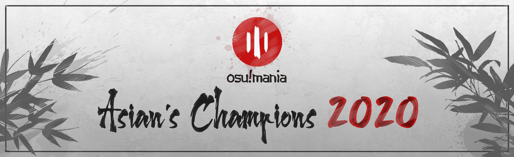

---
tags:
  - o!mAC
  - o!mAC2020
  - omAC
  - omAC2020
---

# osu!mania Asian's Champions 2020

The **osu!mania Asian's Champions 2020** (***o!mAC2020***) was an individual 1v1 osu!mania 4-key tournament for players from Asia. It was the second instalment of the osu!mania Asian's Champions.

## Tournament schedule

| Event | Timestamp |
| --: | :-- |
| Registration phase | 2020-10-01/2020-10-14 |
| Qualifiers | 2020-10-25/2020-11-02 |
| Post-qualifiers | 2020-11-07/2020-11-08 |
| Round of 16 | 2020-11-14/2020-11-15 |
| Quarterfinals | 2020-11-21/2020-11-22 |
| Semifinals | 2020-11-28/2020-11-29 |
| Finals | 2020-12-05/2020-12-06 |

## Prizes

| Placing | Prizes |
| :-: | :-- |
|  | Unique profile badge, 4 months of osu!supporter |
|  | 2 months of osu!supporter |
|  | 1 month of osu!supporter |

## Organisation

The osu!mania Asian's Champions 2020 was run by various community members.

| Position | Member(s) |
| :-- | :-- |
| Host | ::{ flag=ID }:: [Mirea](https://osu.ppy.sh/users/8404646) |
| Co-host | ::{ flag=PH }:: [vincent4399](https://osu.ppy.sh/users/9764388) |
| Mappool selector | ::{ flag=ID }:: [Cims](https://osu.ppy.sh/users/15159469), ::{ flag=ID }:: [LuxSayaka](https://osu.ppy.sh/users/8382579), ::{ flag=TH }:: [-[DaNieL_TH]-](https://osu.ppy.sh/users/6456531) |
| Streamer | ::{ flag=ID }:: [Victim_Crasher](https://osu.ppy.sh/users/2084869), ::{ flag=MY }:: [[MY]Solut1on\_](https://osu.ppy.sh/users/14262785), ::{ flag=VN }:: [DanX](https://osu.ppy.sh/users/10542408) |
| Commentator | ::{ flag=US }:: [[GS]Antunder](https://osu.ppy.sh/users/10416995), ::{ flag=US }:: [[GS]Aussie](https://osu.ppy.sh/users/13395045), ::{ flag=US }:: [[GS]Croniken](https://osu.ppy.sh/users/9989041), ::{ flag=CL }:: [[GS]Myuka](https://osu.ppy.sh/users/10072733), ::{ flag=SG }:: [Raveille](https://osu.ppy.sh/users/1388767), ::{ flag=MY }:: [Cryolien](https://osu.ppy.sh/users/1626983), ::{ flag=AU }:: [Beat43210](https://osu.ppy.sh/users/5664171) |
| Referee | ::{ flag=NL }:: [Albionthegreat](https://osu.ppy.sh/users/9853595), ::{ flag=ID }:: [by-ad](https://osu.ppy.sh/users/7439939), ::{ flag=ID }:: [Yukari\_Sama](https://osu.ppy.sh/users/6316524), ::{ flag=PH }:: [Gerwin13](https://osu.ppy.sh/users/15776185), ::{ flag=PH }:: [MowseChow](https://osu.ppy.sh/users/11341964), ::{ flag=DE }:: [GDLenny](https://osu.ppy.sh/users/8406711) |
| Statistician | ::{ flag=VN }:: [MashedPotato](https://osu.ppy.sh/users/10494860) |
| Wiki editor | ::{ flag=CN }:: [kj415j45](https://osu.ppy.sh/users/9367540) |

## Links

- [Discussion thread](https://osu.ppy.sh/community/forums/topics/1155270)
- [Livestream](https://www.twitch.tv/asianschampions)
- [Discord server](https://discord.gg/HhgdbCK)
- [Mappools](https://docs.google.com/spreadsheets/d/1JC6uyToKPOvAWHDenWN87gWb9QSBPKGLU9XRlZhaGPk)
- [Challonge](https://challonge.com/zh_CN/asianschampions20)
- **[Statistics sheet](https://docs.google.com/spreadsheets/d/1sS51USN3pMNHdjWBPrKW2rmaaLgKpStwxdynL1pWc-4)**

## Podium

This competition has come to an end and resulted in the following podium:

| Placing | Player |
| :-: | :-- |
|  | ::{ flag=PH }:: [bojii](https://osu.ppy.sh/users/10083439) |
|  | ::{ flag=CN }:: [WLYMinato](https://osu.ppy.sh/users/12703319) |
|  | ::{ flag=MY }:: [xxxxxx2800](https://osu.ppy.sh/users/4084853) |

## Mappools

### Finals

- FreeMod
  1. [Remember Me - seleP [REMEMBER THE CHORDJACKS]](https://osu.ppy.sh/beatmapsets/1022231#mania/2138692)
  2. [Cyber Induction - Sharpnel Sounds [IcyWorld's Lv.15 1.1x]](https://osu.ppy.sh/beatmapsets/547118#mania/1159561)
  3. [Japanese Transformation - DJKurara [Expert]](https://osu.ppy.sh/beatmapsets/294908#mania/662856)
  4. [Crystal Chamber Combustion - Aquellex [World Destroyer (266BPM Edit)]](https://osu.ppy.sh/beatmapsets/1047374#mania/2192050)
  5. [Adcar - Terminal 11 [Challenger]](https://osu.ppy.sh/beatmapsets/911470#mania/1902611)
  6. [Tortura - MAX MAXIMIZER [Distress]](https://osu.ppy.sh/beatmapsets/1065944#mania/2232022)
  7. [Turkey Turkey - Kommisar [LN Master]](https://osu.ppy.sh/beatmapsets/852916#mania/1782630)
  8. [Lost Civilization - Laur vs CK [DEVIL!!]](https://osu.ppy.sh/beatmapsets/975897#mania/2222783)
  9. [Silentroom - Protoflicker [(crysather--).inversify();]](https://osu.ppy.sh/beatmapsets/1281571#mania/2661954)
  10. [Yooh - Destiny [HEAVENLY]](https://osu.ppy.sh/beatmapsets/943080#mania/1969418)
  11. [Dark Sheep - Chroma [Sentinel of Light]](https://osu.ppy.sh/beatmapsets/1243184#mania/2584610)
  12. [Exargon - 5argon vs. encX [HTPLN vs. DaNieL Beat Creation Drop!! [178.5 BPM AC Edited]]](https://osu.ppy.sh/beatmapsets/690540#mania/2289591)
  13. [Tokyo Machine - FIGHT [FIGHTO !]](https://osu.ppy.sh/beatmapsets/1042644#mania/2179359)
  14. [Camellia - Killerbeast [hunter (sv)]](https://osu.ppy.sh/beatmapsets/1032781#mania/2160748)
  15. [F-777 - Cosmic Blaster [Cosmic Discharger (SV edited)]](https://osu.ppy.sh/beatmapsets/1145553#mania/2657549)
- Tiebreaker
  1. [Camellia - Stealth-Dash [Undetectable]](https://osu.ppy.sh/beatmapsets/1278064#mania/2655224)

### Semifinals

- FreeMod
  1. [Camellia - !!Check this out [Jacks rain from above ! (No SV)]](https://osu.ppy.sh/beatmapsets/498554#mania/1061270)
  2. [UNDEAD CORPORATION - Embraced by the Flame [Phoenix Flame]](https://osu.ppy.sh/beatmapsets/1218051#mania/2598514)
  3. [Camellia - Gene Disruption [BIOLOGICAL ANOMALY]](https://osu.ppy.sh/beatmapsets/555326#mania/1175359)
  4. [Chroma - Sayonara Planet Wars [qqq's INFINITE Lv.18]](https://osu.ppy.sh/beatmapsets/730558#mania/1543529)
  5. [Venetian Snares - Frictional Nevada [Challenge]](https://osu.ppy.sh/beatmapsets/1047387#mania/2189312)
  6. [Hatsuki Yura - Black Swan Lake [LN MASTER]](https://osu.ppy.sh/beatmapsets/1284981#mania/2668028)
  7. [Sota Fujimori - Move That Body -Extended Mix- [Dance]](https://osu.ppy.sh/beatmapsets/765772#mania/1609983)
  8. [Mitsuyoshi Takenobu no Ani - Amphisbaena [Challenge]](https://osu.ppy.sh/beatmapsets/960865#mania/2020883)
  9. [Mameyudoufu - Far Away (Mameyudoufu Remix) [4K // So Far Away]](https://osu.ppy.sh/beatmapsets/1263937#mania/2627124)
  10. [penoreri - Sulfur [sulvere]](https://osu.ppy.sh/beatmapsets/828463#mania/1735770)
  11. [USAO - Avenger [Bionic]](https://osu.ppy.sh/beatmapsets/979529#mania/2050059)
  12. [Hatsuki Yura - Black Princess [Kurohime]](https://osu.ppy.sh/beatmapsets/1229571#mania/2556474)
  13. [Brian Tyler - Now You See Me (Robert DeLong Remix) [Deceive.]](https://osu.ppy.sh/beatmapsets/808840#mania/1697306)
  14. [Dictate - Scavenger [Omnivore / Scavenger 'MX']](https://osu.ppy.sh/beatmapsets/1159208#mania/2418916)
  15. [lapix - Foolish Hero [d99's SVecial]](https://osu.ppy.sh/beatmapsets/384479#mania/841506)
- Tiebreaker
  1. **[Team Grimoire vs Laur - Grievous Lady -nothing is but what is not- [-Glass of Despair-]](https://osu.ppy.sh/beatmapsets/1242120#mania/2598596)**

### Quarterfinals

- FreeMod
  1. [Seeed - Ticket [one hundred years x1.1]](https://osu.ppy.sh/beatmapsets/1089252#mania/2666457)
  2. [UNDEAD CORPORATION - Yoru Naku Usagi wa Yume o Miru [Crimson Full Moon]](https://osu.ppy.sh/beatmapsets/583655#mania/1235045)
  3. [YUCe - Night Club Junkie [Junk]](https://osu.ppy.sh/beatmapsets/736941#mania/1555269)
  4. [Camellia - BADBOY [CARDIAC ARREST (2015)]](https://osu.ppy.sh/beatmapsets/392033#mania/853768)
  5. [Muramasa Qualia - Kurokami Midareshi Shura to Narite [Blossom]](https://osu.ppy.sh/beatmapsets/1075348#mania/2250177)
  6. [Nanahira - magical new world [Upan x 2ndlegend's Magical LN]](https://osu.ppy.sh/beatmapsets/1172097#mania/2444702)
  7. [P\*Light feat. mow\*2 - OVERDRIVER [OVERFLOW [LN]]](https://osu.ppy.sh/beatmapsets/578558#mania/1224999)
  8. [sakuzyo - Imprinting [Fortissimo]](https://osu.ppy.sh/beatmapsets/1213018#mania/2598538)
  9. [Zekk - MAHOROBA [Gem's FUTURE]](https://osu.ppy.sh/beatmapsets/1266777#mania/2643795)
  10. [MIDInco - Etude [Interlude]](https://osu.ppy.sh/beatmapsets/1162486#mania/2424948)
  11. [Yumemido - Lyrith -Meikyu Lilith- [Lyrith]](https://osu.ppy.sh/beatmapsets/703651#mania/1488672)
  12. [Kakka - Alfheim [Freya]](https://osu.ppy.sh/beatmapsets/941878#mania/1966772)
  13. [TheFatRat, Slaydit & Anjulie - Stronger [to the end]](https://osu.ppy.sh/beatmapsets/997318#mania/2086153)
- Tiebreaker
  1. **[DJ Noriken - \#The\_Relentless\_(Modified) [Unique Immovable]](https://osu.ppy.sh/beatmapsets/1104886#mania/2480407)**

### Round of 16

- FreeMod
  1. [Pepper Peach - Fire Exit [Original Mix] [Fire Disasters!! [134.4 BPM Edited]]](https://osu.ppy.sh/beatmapsets/967458#mania/2071714)
  2. [DJ Sharpnel - Touch The Angel [IcyWorld's Lv.12]](https://osu.ppy.sh/beatmapsets/685631#mania/1451308)
  3. [Streetlight Manifesto - Everything Went Numb [Violence]](https://osu.ppy.sh/beatmapsets/519153#mania/1102948)
  4. [Kkrusty - A Quick Death [Desolation]](https://osu.ppy.sh/beatmapsets/800074#mania/1679692)
  5. [Pastel\*Palettes - Zettai Sengen \~Recital\~ [LN or Escape!]](https://osu.ppy.sh/beatmapsets/1098509#mania/2295130)
  6. [Ebanko - Lyoshka [This Song Is About Tragic Love]](https://osu.ppy.sh/beatmapsets/838082#mania/1754605)
  7. [Reol feat.Tokyo Gegegay - THE SIXTH SENSE [Shikkusu Sensu]](https://osu.ppy.sh/beatmapsets/1295157#mania/2687344)
  8. [PSYQUI - Lightning [Thunder Rawr]](https://osu.ppy.sh/beatmapsets/1136241#mania/2373014)
  9. [C K - Nirv Luce [AncuL's Future]](https://osu.ppy.sh/beatmapsets/685897#mania/1453769)
  10. [LeaF - Alice in Misanthrope -Ensei Alice- [ALie's Wonderland SV]](https://osu.ppy.sh/beatmapsets/559582#mania/1191750)
  11. [Slappy - Hanami [Edit]](https://osu.ppy.sh/beatmapsets/1101411#mania/2329945)
- Tiebreaker
  1. **[Camellia - Exit This Earth's Atomosphere (Camellia's 'PLANETARY//200STEP' Remix) [-Mystic vs. Leni's Thermosphere]](https://osu.ppy.sh/beatmapsets/860846#mania/1801089)**

### Post-qualifiers

- FreeMod
  1. [Mori Calliope feat. kokorobeats - Excuse My Rudeness, But Could You Please RIP? [DEADBEATS]](https://osu.ppy.sh/beatmapsets/1256680#mania/2611413)
  2. [Risk Junk - Tropical April [Insane]](https://osu.ppy.sh/beatmapsets/156729#mania/383923)
  3. [The Ghost of 3.13 - Daydream [Fantasy]](https://osu.ppy.sh/beatmapsets/764928#mania/1608410)
  4. [LiSa - rapid life syndrome [syndrome]](https://osu.ppy.sh/beatmapsets/822152#mania/1723116)
  5. [senya - Shinrabansho ni furete [Insane(LN)]](https://osu.ppy.sh/beatmapsets/586947#mania/1242917)
  6. [ARM feat. Nicole Curry - Come to Life [Inspiration]](https://osu.ppy.sh/beatmapsets/1117755#mania/2334914)
  7. [Alon Mor & Sex Whales - Jasmine [Moderate]](https://osu.ppy.sh/beatmapsets/738864#mania/1559307)
  8. [EZFG - Hurting For A Very Hurtful Pain [Insane]](https://osu.ppy.sh/beatmapsets/153038#mania/376358)
  9. [Getter Jaani - Rockefeller Street [ProSinewaveViewingperity]](https://osu.ppy.sh/beatmapsets/1110967#mania/2321275)
- Tiebreaker
  1. **[Camellia - Furry Cannon [CURIOSSITY'S PRIMAL SVVAGERY (buffed edition)]](https://osu.ppy.sh/beatmapsets/1003476#mania/2100177)**

### Qualifiers

- FreeMod
  1. [Anixto - Joker [Stage 1: Deep Emotion]](https://osu.ppy.sh/beatmapsets/1278881#mania/2656695)
  2. [Hyper Potions - Trick or Treat [Stage 2: Happy Halloween!]](https://osu.ppy.sh/beatmapsets/1278788#mania/2656544)
  3. [encX - Tomorrow [Stage 3: My Future]](https://osu.ppy.sh/beatmapsets/1279307#mania/2657569)
  4. [Laur - Alteregoism [Stage 4: Metamorphose]](https://osu.ppy.sh/beatmapsets/1279463#mania/2657952)
  5. [Receptor feat. K.I.R.A. - Lullaby [Stage 5: Possessed]](https://osu.ppy.sh/beatmapsets/1264052#mania/2627355)

## Match results

### Finals

| Player 1 |  |  | Player 2 | Note |
| --: | :-: | :-: | :-- | :-- |
| WLYMinato | 0 | **7** | **bojii** |  |
| Onta_Bekasi | 4 | **7** | **xxxxxx2800** |  |

### Semifinals

| Player 1 |  |  | Player 2 | Note |
| --: | :-: | :-: | :-- | :-- |
| Onta_Bekasi | 1 | **7** | **bojii** |  |
| **WLYMinato** | **7** | 6 | xxxxxx2800 |  |

### Quarterfinals

| Player 1 |  |  | Player 2 | Note |
| --: | :-: | :-: | :-- | :-- |
| **WLYMinato** | **6** | 0 | SHOKO - |  |
| Emiratess123 | 0 | **0** | **Onta_Bekasi** | *win by default* |
| \[Crz\]FolAH1217 | 2 | **6** | **bojii** |  |
| **xxxxxx2800** | **6** | 2 | TriDoanGaming |  |

### Round of 16

| Player 1 |  |  | Player 2 | Note |
| --: | :-: | :-: | :-- | :-- |
| **WLYminato** | **5** | 1 | shokoha |  |
| **Emiratess123** | **5** | 2 | S V |  |  |
| **Onta_Bekasi** | **5** | 2 | -Frostleaf- |  |
| **xxxxxx2800** | **5** | 2 | Freshky |  |
| **\[Crz\]FolAH1217** | **3** | 0 | Kan4 | *win by default* |
| **SHOKO -** | **5** | 4 | Lottery61 |  |
| **TriDoanGaming** | **0** | -1 | Sakaki | *forfeit* |
| **Bojii** | **0** | -1 | Situroen | *forfeit* |

### Qualifiers & Post-qualifiers

Check the results in this [statistics sheet](https://docs.google.com/spreadsheets/d/1sS51USN3pMNHdjWBPrKW2rmaaLgKpStwxdynL1pWc-4).

## Ruleset

### General rules

- *osu!mania Asian's Champions 2020* is an **1v1 osu!mania 4-key** tournament using **Score V2**.
- Stage instructions:
  - Post-qualifiers is BO7.
  - Round of 16 is BO9.
  - Quarterfinals is BO11.
  - Semifinals is BO11.
  - Finals is BO13.
- **Single-elimination** will be applied **after Qualifiers**.
- Warm-up will be given start from Post-qualifiers and so on.
- The mappool except Qualifiers will consist of a set of FreeMod picks and one Tiebreaker.
- Multi-accounting is strictly prohibited.
- Please be punctual in attending your match.
- Match re-schedule is possible with the agreement between players and staff.

### Tournament registration

- The flag on your profile must represent an Asian country. For a complete list of Asian countries, you can visit [worldometers](https://www.worldometers.info/geography/how-many-countries-in-asia/).
- No rank restriction.

### Match instructions

- You will get a notification from your referee that your match is ready 10 minutes before the scheduled time. Once you are ready, please let them know, and they will invite you to the lobby.
- The referee will ask you to roll for ban and pick order. The lower roll will ban first, and the higher roll will pick first. Ban and pick order alternates between players.
- Warmup maps must be downloadable via osu!direct with 3 minutes length at maximum.
- Visual mods such as HD, FL, FI and MR are allowed. NF is allowed too.
- After the warmups, each player will ban one map.
- Players will pick maps until one player reaches the required amount of points to win the match.
- The tiebreaker map will be played if both players are at match point.

### Match schedule

- All matches will be run according to the schedule time unless there is a re-schedule request by the players.
- Postponement will be given for 10 minutes if there are still players who have not entered the match lobby.
- In case there's a player who has not entered the match lobby after 10 minutes suspension, we will start counting the match points accumulatively. 1 match point will goes to the attending player per 5 minutes. This will be running continuously until the third 5 minutes ends and the match will be declared as **Win by Default**.
