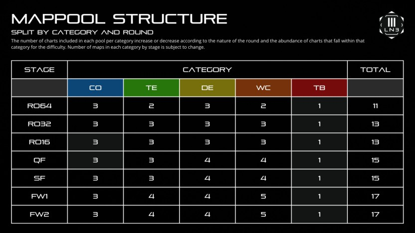
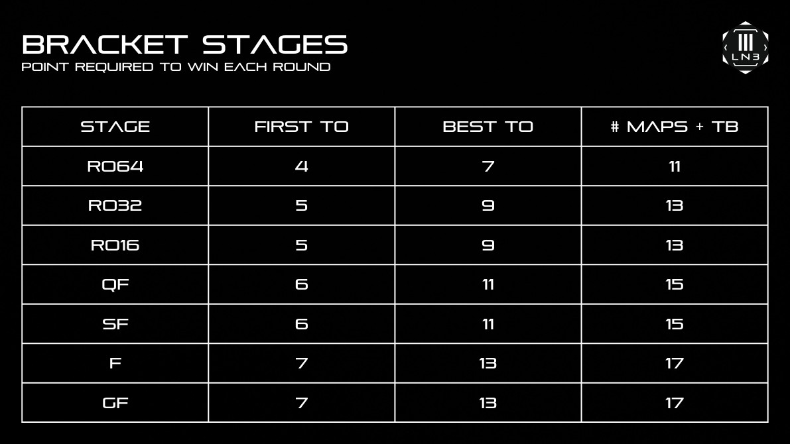

---
tags:
  - o!mLN
  - o!mLN3
  - o!mLN 3
---

# osu!mania LN Tournament 3

The **osu!mania LN Tournament 3** (***o!mLN 3***) was a worldwide double-elimination 1v1 osu!mania 4-key tournament hosted by ::{ flag=VN }:: [MashedPotato](https://osu.ppy.sh/users/10494860), ::{ flag=SG }:: [Polytetral](https://osu.ppy.sh/users/8612061), and ::{ flag=FR }:: [\_yosh](https://osu.ppy.sh/users/7157133). The tournament featured a variety of maps with a vast amount of sliders (or Long Notes) in its mappools. It was the third instalment of the osu!mania LN Tournament.

## Tournament schedule

| Event | Timestamp |
| --: | :-- |
| Registration phase | 2022-09-19/2022-10-02 |
| Screening phase | 2022-10-02/2022-10-09 |
| Live drawings | 2022-10-09 |
| Qualifiers | 2022-10-15/2022-10-16 |
| Round of 64 | 2022-10-22/2022-10-23 |
| Round of 32 | 2022-10-29/2022-10-30 |
| Round of 16 | 2022-11-05/2022-11-06 |
| Quarterfinals | 2022-11-12/2022-11-13 |
| Semifinals | 2022-11-19/2022-11-20 |
| Finals | 2022-11-26/2022-11-27 |
| Grand Finals | 2022-12-03/2022-12-04 |

## Prizes

| Placing | Prize(s) |
| :-: | :-- |
|  | Unique profile badge, US$60 |
|  | US$36 |
|  | US$24 |

Generous donations from ::{ flag=TH }:: [HowToPlayLN](https://osu.ppy.sh/users/10879600), ::{ flag=VN }:: [MashedPotato](https://osu.ppy.sh/users/10494860), and ::{ flag=SG }:: [Polytetral](https://osu.ppy.sh/users/8612061) helped fund some of the prizes.

## Organisation

The osu!mania LN Tournament 3 was run by various community members.

| Position | Member(s) |
| :-- | :-- |
| Organiser | ::{ flag=VN }:: [MashedPotato](https://osu.ppy.sh/users/10494860), ::{ flag=SG }:: [Polytetral](https://osu.ppy.sh/users/8612061), ::{ flag=FR }:: [\_yosh](https://osu.ppy.sh/users/7157133) |
| Mappool selector | ::{ flag=US }:: [chxu](https://osu.ppy.sh/users/13712190), ::{ flag=FR }:: [Paturages](https://osu.ppy.sh/users/1375479), ::{ flag=SG }:: [Polytetral](https://osu.ppy.sh/users/8612061), ::{ flag=ID }:: [\[Crz\]Crysarlene](https://osu.ppy.sh/users/5492871) |
| Mapper | ::{ flag=PH }:: [Akatsumi Chan](https://osu.ppy.sh/users/11306351), ::{ flag=US }:: [Ballistic](https://osu.ppy.sh/users/5170506), ::{ flag=NL }:: [DannyPX](https://osu.ppy.sh/users/11253722), ::{ flag=PH  }:: [doctormango](https://osu.ppy.sh/users/13370527), ::{ flag=ID }:: [FelixSpade](https://osu.ppy.sh/users/2651304), ::{ flag=TH }:: [HowToPlayLN](https://osu.ppy.sh/users/10879600), ::{ flag=CN }:: [Hylotl](https://osu.ppy.sh/users/18270260), ::{ flag=AR }:: [juankristal](https://osu.ppy.sh/users/443656), ::{ flag=US }:: [Logan636](https://osu.ppy.sh/users/9423766), ::{ flag=VN }:: [Micleak](https://osu.ppy.sh/users/16140674), ::{ flag=GB }:: [MocaLoca](https://osu.ppy.sh/users/13474391), ::{ flag=TH }:: [MyZterioN-](https://osu.ppy.sh/users/8521723), ::{ flag=FR }:: [Paturages](https://osu.ppy.sh/users/1375479), ::{ flag=SG }:: [Raveille](https://osu.ppy.sh/users/1388767), ::{ flag=SG }:: [TheFunk](https://osu.ppy.sh/users/13981991), ::{ flag=CN }:: [YuEast 2018](https://osu.ppy.sh/users/13953619), ::{ flag=ID }:: [\[Crz\]Crysarlene](https://osu.ppy.sh/users/5492871), ::{ flag=US }:: [\[GS\]Rose](https://osu.ppy.sh/users/9481266), ::{ flag=PL }:: [\_underjoy](https://osu.ppy.sh/users/2235750) |
| Mappool tester | ::{ flag=PH }:: [4Kenn](https://osu.ppy.sh/users/20496815), ::{ flag=PH }:: [Akatsumi Chan](https://osu.ppy.sh/users/11306351), ::{ flag=TH }:: [banan](https://osu.ppy.sh/users/16011592), ::{ flag=MY }:: [cheewee10](https://osu.ppy.sh/users/4477497), ::{ flag=US }:: [chxu](https://osu.ppy.sh/users/13712190), ::{ flag=VN }:: [CPT\_Sivelia](https://osu.ppy.sh/users/12562107), ::{ flag=NL }:: [DannyPX](https://osu.ppy.sh/users/11253722), ::{ flag=TH }:: [HowToPlayLN](https://osu.ppy.sh/users/10879600), ::{ flag=CN }:: [Hylotl](https://osu.ppy.sh/users/18270260), ::{ flag=BR }:: [LeMarcinho](https://osu.ppy.sh/users/13347579), ::{ flag=VN }:: [Micleak](https://osu.ppy.sh/users/16140674), ::{ flag=TH }:: [MyZterioN-](https://osu.ppy.sh/users/8521723), ::{ flag=SG }:: [Polytetral](https://osu.ppy.sh/users/8612061), ::{ flag=ES }:: [Quenlla](https://osu.ppy.sh/users/4725379), ::{ flag=CN }:: [tyrcs](https://osu.ppy.sh/users/13026904), ::{ flag=CN }:: [\[Crz\]Alleyne](https://osu.ppy.sh/users/11279273), ::{ flag=TW }:: [\[Crz\]Ha0201](https://osu.ppy.sh/users/12243730), ::{ flag=CL }:: [\[GS\]Myuka](https://osu.ppy.sh/users/10072733) |
| Referee | ::{ flag=PE }:: [-Xuste-](https://osu.ppy.sh/users/17989444), ::{ flag=ID }:: [-Yubi-](https://osu.ppy.sh/users/17851478), ::{ flag=NL }:: [Albionthegreat](https://osu.ppy.sh/users/9853595), ::{ flag=MY }:: [Auxesiaa](https://osu.ppy.sh/users/16417718), ::{ flag=TW }:: [blacktea12](https://osu.ppy.sh/users/13389861), ::{ flag=NL }:: [DannyPX](https://osu.ppy.sh/users/11253722), ::{ flag=US }:: [Dynascape](https://osu.ppy.sh/users/8784587), ::{ flag=US }:: [EpsilonMaiagare](https://osu.ppy.sh/users/3855052), ::{ flag=VN }:: [Krystal Quan](https://osu.ppy.sh/users/20569104), ::{ flag=US }:: [Logan636](https://osu.ppy.sh/users/9423766), ::{ flag=SE }:: [Logg45vs](https://osu.ppy.sh/users/8684540), ::{ flag=PH }:: [Normiplier](https://osu.ppy.sh/users/10069850), ::{ flag=VN }:: [poitydabezt](https://osu.ppy.sh/users/17148657), ::{ flag=SG }:: [Polytetral](https://osu.ppy.sh/users/8612061), ::{ flag=NL }:: [Saemitsu](https://osu.ppy.sh/users/14262789), ::{ flag=FR }:: [Satsukel](https://osu.ppy.sh/users/9066390)::{ flag=GB }:: [StartAndSelect](https://osu.ppy.sh/users/8720555), ::{ flag=BR }:: [Yuragi](https://osu.ppy.sh/users/8501380), ::{ flag=CN }:: [\[Crz\]Alleyne](https://osu.ppy.sh/users/11279273), ::{ flag=CN }:: [\[GB\]Sanae](https://osu.ppy.sh/users/11238501), ::{ flag=FR }:: [\_yosh](https://osu.ppy.sh/users/7157133) |
| Streamer | ::{ flag=MY }:: [-Einar-](https://osu.ppy.sh/users/8782656), ::{ flag=NL }:: [Albionthegreat](https://osu.ppy.sh/users/9853595), ::{ flag=US }:: [Alter-](https://osu.ppy.sh/users/4980256), ::{ flag=VN }:: [DanX](https://osu.ppy.sh/users/10542408), ::{ flag=US }:: [EpsilonMaiagare](https://osu.ppy.sh/users/3855052), ::{ flag=ID }:: [jonjot](https://osu.ppy.sh/users/2084869), ::{ flag=TH }:: [konkawe](https://osu.ppy.sh/users/15665805), ::{ flag=SE }:: [Logg45vs](https://osu.ppy.sh/users/8684540), ::{ flag=US }:: [RhymesWithMash](https://osu.ppy.sh/users/18834550), ::{ flag=US }:: [SunApple](https://osu.ppy.sh/users/11817622) |
| Commentator | ::{ flag=US }:: [-Sparky-](https://osu.ppy.sh/users/3187959), ::{ flag=SG }:: [AdamAckerville](https://osu.ppy.sh/users/12297375), ::{ flag=NL }:: [Albionthegreat](https://osu.ppy.sh/users/9853595), ::{ flag=AU }:: [Beat43210](https://osu.ppy.sh/users/5664171), ::{ flag=MY }:: [cheewee10](https://osu.ppy.sh/users/4477497), ::{ flag=MY }:: [Cryolien](https://osu.ppy.sh/users/1626983), ::{ flag=US }:: [Dynascape](https://osu.ppy.sh/users/8784587), ::{ flag=US }:: [ERA degenera](https://osu.ppy.sh/users/16165650), ::{ flag=PH }:: [FirevicE](https://osu.ppy.sh/users/17823779), ::{ flag=PH }:: [Itawachi](https://osu.ppy.sh/users/12929973), ::{ flag=US }:: [Logan636](https://osu.ppy.sh/users/9423766), ::{ flag=VN }:: [Lott](https://osu.ppy.sh/users/13821222), ::{ flag=FR }:: [Merlin69420h](https://osu.ppy.sh/users/15801489), ::{ flag=US }:: [MoltenLead](https://osu.ppy.sh/users/22310025), ::{ flag=ID }:: [Oofyxl](https://osu.ppy.sh/users/20599160), ::{ flag=FR }:: [Paturages](https://osu.ppy.sh/users/1375479), ::{ flag=US }:: [PorkIsGreat](https://osu.ppy.sh/users/10756322), ::{ flag=AU }:: [PotassiumF](https://osu.ppy.sh/users/4247722), ::{ flag=US }:: [RhymesWithMash](https://osu.ppy.sh/users/18834550), ::{ flag=PH }:: [Silhoueska Elze](https://osu.ppy.sh/users/11517895), ::{ flag=US }:: [SunApple](https://osu.ppy.sh/users/11817622), ::{ flag=SG }:: [TheFunk](https://osu.ppy.sh/users/13981991), ::{ flag=CA }:: [walmart5193](https://osu.ppy.sh/users/16468962), ::{ flag=BR }:: [Yuragi](https://osu.ppy.sh/users/8501380) |
| Designer | ::{ flag=US }:: [Cixia](https://osu.ppy.sh/users/7464885), ::{ flag=ID }:: [nayuu](https://osu.ppy.sh/users/12561379) |
| Statistician | ::{ flag=VN }:: [MashedPotato](https://osu.ppy.sh/users/10494860) |
| Wiki writer | ::{ flag=ID }:: [fajar13k](https://osu.ppy.sh/users/7100002) |

## Links

- [Discussion thread](https://osu.ppy.sh/community/forums/topics/1633030)
- [o!mLN Discord server](https://discord.gg/SPQtt3s)
- [Livestream](https://www.twitch.tv/osumanialive)
- [Challonge bracket](https://challonge.com/i9m94cm9)
- [Pick'em predictions website](https://pickem.hwc.hr/tournaments/101) hosted by ::{ flag=DE }:: [hallowatcher](https://osu.ppy.sh/users/1874761)
- **[Statistics sheet](https://docs.google.com/spreadsheets/d/11vi9CALEtaEnyvm-xwwGsudXB7HsaPMAoAXwF5hx0QY/edit?usp=sharing)**

## Participants

*Note: Ranks were recorded at the end of registration.*

| Rank | Player |
| --: | :-- |
| #19 | ::{ flag=MY }:: [Neokje](https://osu.ppy.sh/users/7727987) |
| #44 | ::{ flag=CA }:: [UmmmMrMoo](https://osu.ppy.sh/users/15314355) |
| #45 | ::{ flag=AU }:: [ruka](https://osu.ppy.sh/users/6117525) |
| #55 | ::{ flag=ID }:: [Onta\_Bekasi](https://osu.ppy.sh/users/8677684) |
| #68 | ::{ flag=KR }:: [Flying Samira](https://osu.ppy.sh/users/10329095) |
| #116 | ::{ flag=CZ }:: [grillroasted](https://osu.ppy.sh/users/18271627) |
| #213 | ::{ flag=KR }:: [Krokodil](https://osu.ppy.sh/users/10001325) |
| #215 | ::{ flag=SG }:: [-Aishiteru-](https://osu.ppy.sh/users/13390529) |
| #256 | ::{ flag=KR }:: [gaesol](https://osu.ppy.sh/users/12452131) |
| #267 | ::{ flag=MY }:: [xxxxxx2800](https://osu.ppy.sh/users/4084853) |
| #275 | ::{ flag=CN }:: [\[Crz\]sunnyxxy](https://osu.ppy.sh/users/10333739) |
| #282 | ::{ flag=US }:: [GripWarrior](https://osu.ppy.sh/users/11734610) |
| #285 | ::{ flag=JP }:: [jhleetgirl](https://osu.ppy.sh/users/10745260) |
| #347 | ::{ flag=MY }:: [Cryolien](https://osu.ppy.sh/users/1626983) |
| #369 | ::{ flag=CL }:: [\[LS\]bambi fnf](https://osu.ppy.sh/users/20360332) |
| #381 | ::{ flag=TH }:: [--Pavin--](https://osu.ppy.sh/users/12046267) |
| #410 | ::{ flag=GB }:: [TingMomentum](https://osu.ppy.sh/users/12489832) |
| #439 | ::{ flag=NL }:: [Freek](https://osu.ppy.sh/users/9630674) |
| #488 | ::{ flag=PE }:: [-Lalito898](https://osu.ppy.sh/users/15098503) |
| #492 | ::{ flag=PE }:: [Dokors](https://osu.ppy.sh/users/18248094) |
| #596 | ::{ flag=PH }:: [Silhoueska Elze](https://osu.ppy.sh/users/11517895) |
| #619 | ::{ flag=KR }:: [Lami-](https://osu.ppy.sh/users/16505281) |
| #621 | ::{ flag=KR }:: [SuddenDeath](https://osu.ppy.sh/users/6699923) |
| #647 | ::{ flag=JP }:: [yoppy-yugen](https://osu.ppy.sh/users/11799103) |
| #689 | ::{ flag=TH }:: [Achino](https://osu.ppy.sh/users/13349388) |
| #725 | ::{ flag=SG }:: [sukidayo-](https://osu.ppy.sh/users/16870002) |
| #789 | ::{ flag=FR }:: [Auraah](https://osu.ppy.sh/users/10015908) |
| #799 | ::{ flag=BH }:: [Unitori-](https://osu.ppy.sh/users/15772814) |
| #801 | ::{ flag=GB }:: [syaro-](https://osu.ppy.sh/users/15716021) |
| #824 | ::{ flag=US }:: [ASharpp](https://osu.ppy.sh/users/12657177) |
| #832 | ::{ flag=RU }:: [Nepko](https://osu.ppy.sh/users/11898245) |
| #907 | ::{ flag=US }:: [DarkMew2](https://osu.ppy.sh/users/13921965) |
| #957 | ::{ flag=GT }:: [Gezideo](https://osu.ppy.sh/users/12344416) |
| #962 | ::{ flag=JP }:: [ICECAKE](https://osu.ppy.sh/users/16100800) |
| #991 | ::{ flag=SG }:: [AdamAckerville](https://osu.ppy.sh/users/12297375) |
| #1,080 | ::{ flag=US }:: [mvje](https://osu.ppy.sh/users/12429489) |
| #1,136 | ::{ flag=NL }:: [Shoira](https://osu.ppy.sh/users/13377652) |
| #1,149 | ::{ flag=CA }:: [walmart5193](https://osu.ppy.sh/users/16468962) |
| #1,168 | ::{ flag=ID }:: [Dellia](https://osu.ppy.sh/users/12143152) |
| #1,193 | ::{ flag=CL }:: [Jeanne Da Rin](https://osu.ppy.sh/users/5214842) |
| #1,263 | ::{ flag=US }:: [\[LS\]Ham](https://osu.ppy.sh/users/17523947) |
| #1,266 | ::{ flag=US }:: [\[GS\]linc](https://osu.ppy.sh/users/12093536) |
| #1,323 | ::{ flag=ID }:: [Proxae](https://osu.ppy.sh/users/8410575) |
| #1,343 | ::{ flag=FR }:: [jeremkyurem](https://osu.ppy.sh/users/13431947) |
| #1,364 | ::{ flag=PH }:: [DeenBoi](https://osu.ppy.sh/users/16746554) |
| #1,382 | ::{ flag=ES }:: [ShiroPeDeFresa](https://osu.ppy.sh/users/16020685) |
| #1,386 | ::{ flag=BR }:: [Maykee kee](https://osu.ppy.sh/users/23091978) |
| #1,398 | ::{ flag=TH }:: [Nozomi Sakurai](https://osu.ppy.sh/users/6456531) |
| #1,463 | ::{ flag=PL }:: [Hlimak](https://osu.ppy.sh/users/1340272) |
| #1,586 | ::{ flag=TH }:: [nanonbandusty](https://osu.ppy.sh/users/15543726) |
| #1,606 | ::{ flag=IT }:: [Kiraz](https://osu.ppy.sh/users/3807675) |
| #1,636 | ::{ flag=PH }:: [DiamondGenius75](https://osu.ppy.sh/users/19107638) |
| #1,777 | ::{ flag=US }:: [Halogen-](https://osu.ppy.sh/users/169992) |
| #1,779 | ::{ flag=FR }:: [Babibelbleu](https://osu.ppy.sh/users/16892459) |
| #1,788 | ::{ flag=HK }:: [zero2snow](https://osu.ppy.sh/users/7751516) |
| #1,828 | ::{ flag=PH }:: [Dyei](https://osu.ppy.sh/users/23643731) |
| #1,836 | ::{ flag=US }:: [-mint-](https://osu.ppy.sh/users/8976576) |
| #1,858 | ::{ flag=HK }:: [DC2\_727](https://osu.ppy.sh/users/17483369) |
| #1,984 | ::{ flag=ES }:: [Enthalpy](https://osu.ppy.sh/users/9552883) |
| #2,031 | ::{ flag=VN }:: [nanihoang](https://osu.ppy.sh/users/18042811) |
| #2,035 | ::{ flag=TH }:: [MIkuaimbot](https://osu.ppy.sh/users/17699745) |
| #2,069 | ::{ flag=JP }:: [gyoza\_goki](https://osu.ppy.sh/users/18144664) |
| #2,117 | ::{ flag=DE }:: [ERA medium kek](https://osu.ppy.sh/users/11625617) |
| #2,136 | ::{ flag=JP }:: [Mi0117](https://osu.ppy.sh/users/15501680) |
| #2,172 | ::{ flag=US }:: [Imperialtrinity](https://osu.ppy.sh/users/5066305) |
| #2,197 | ::{ flag=US }:: [Znow](https://osu.ppy.sh/users/15513303) |
| #2,363 | ::{ flag=PH }:: [iid3rp](https://osu.ppy.sh/users/23274559) |
| #2,365 | ::{ flag=US }:: [SunApple](https://osu.ppy.sh/users/11817622) |
| #2,462 | ::{ flag=US }:: [\_Seth](https://osu.ppy.sh/users/8111953) |
| #2,521 | ::{ flag=VN }:: [DoraSPS](https://osu.ppy.sh/users/16005504) |
| #2,598 | ::{ flag=MY }:: [JayLye](https://osu.ppy.sh/users/14892447) |
| #2,618 | ::{ flag=US }:: [\[LS\]Fox](https://osu.ppy.sh/users/15270411) |
| #2,700 | ::{ flag=VN }:: [Mama Junko](https://osu.ppy.sh/users/21622469) |
| #2,747 | ::{ flag=BR }:: [DemiFiendSMT](https://osu.ppy.sh/users/20051971) |
| #2,758 | ::{ flag=BR }:: [V2power](https://osu.ppy.sh/users/2966032) |
| #2,767 | ::{ flag=DE }:: [ERA Sirbeyy](https://osu.ppy.sh/users/12917829) |
| #2,804 | ::{ flag=MY }:: [StyGix](https://osu.ppy.sh/users/7745408) |
| #2,838 | ::{ flag=ID }:: [KinoJourney](https://osu.ppy.sh/users/15798093) |
| #2,876 | ::{ flag=MY }:: [-Einar-](https://osu.ppy.sh/users/8782656) |
| #2,964 | ::{ flag=VN }:: [Frostleaf](https://osu.ppy.sh/users/11863174) |
| #2,965 | ::{ flag=MY }:: [Tosai\_](https://osu.ppy.sh/users/3760209) |
| #2,989 | ::{ flag=US }:: [Orca-](https://osu.ppy.sh/users/7958845) |
| #3,015 | ::{ flag=PH }:: [ERA Frossno](https://osu.ppy.sh/users/17480973) |
| #3,085 | ::{ flag=DE }:: [ERA Leo](https://osu.ppy.sh/users/15440118) |
| #3,141 | ::{ flag=TH }:: [\[Ping\]](https://osu.ppy.sh/users/6291395) |
| #3,350 | ::{ flag=PH }:: [Eon Musk](https://osu.ppy.sh/users/12239110) |
| #3,381 | ::{ flag=AR }:: [- Kuru](https://osu.ppy.sh/users/24649329) |
| #3,736 | ::{ flag=JP }:: [yakik](https://osu.ppy.sh/users/16801743) |
| #3,897 | ::{ flag=GB }:: [epic man 2](https://osu.ppy.sh/users/14566000) |
| #3,975 | ::{ flag=BR }:: [Zergh](https://osu.ppy.sh/users/3181281) |
| #4,201 | ::{ flag=CA }:: [dylan52528](https://osu.ppy.sh/users/13145344) |
| #4,225 | ::{ flag=US }:: [RhymesWithMash](https://osu.ppy.sh/users/18834550) |
| #4,643 | ::{ flag=TW }:: [Pdog4ni](https://osu.ppy.sh/users/14581544) |
| #4,690 | ::{ flag=AR }:: [Valym](https://osu.ppy.sh/users/16918057) |
| #4,817 | ::{ flag=DE }:: [\[GE\] Arthur](https://osu.ppy.sh/users/24122055) |
| #5,002 | ::{ flag=BR }:: [terror67890](https://osu.ppy.sh/users/12079742) |
| #5,158 | ::{ flag=ES }:: [Kracohc](https://osu.ppy.sh/users/11554942) |
| #5,271 | ::{ flag=GT }:: [iSeraphine](https://osu.ppy.sh/users/14862011) |
| #5,502 | ::{ flag=VN }:: [minhhuyosuer](https://osu.ppy.sh/users/19626270) |
| #5,539 | ::{ flag=DK }:: [\[HD\]Urrk](https://osu.ppy.sh/users/11539225) |
| #5,567 | ::{ flag=VN }:: [\[MBR\] VTSeele](https://osu.ppy.sh/users/17050835) |
| #5,650 | ::{ flag=US }:: [-northern-](https://osu.ppy.sh/users/16247587) |
| #5,694 | ::{ flag=RU }:: [Asefis](https://osu.ppy.sh/users/10840899) |
| #5,723 | ::{ flag=BR }:: [Namirin-chan](https://osu.ppy.sh/users/6761832) |
| #5,789 | ::{ flag=PL }:: [Mr\_adamello](https://osu.ppy.sh/users/7420894) |
| #5,813 | ::{ flag=NL }:: [samuelhklumpers](https://osu.ppy.sh/users/10945523) |
| #6,114 | ::{ flag=JP }:: [syo73](https://osu.ppy.sh/users/14495182) |
| #7,133 | ::{ flag=VN }:: [Cronoxux](https://osu.ppy.sh/users/15143673) |
| #7,254 | ::{ flag=US }:: [-Sparky-](https://osu.ppy.sh/users/3187959) |
| #7,361 | ::{ flag=ES }:: [game\_maker26](https://osu.ppy.sh/users/4876699) |
| #7,528 | ::{ flag=CA }:: [Sinaeb](https://osu.ppy.sh/users/1576095) |
| #8,071 | ::{ flag=VN }:: [slowaf](https://osu.ppy.sh/users/15999854) |
| #9,264 | ::{ flag=HK }:: [RyanWong1216](https://osu.ppy.sh/users/19030562) |
| #9,751 | ::{ flag=US }:: [- Sky -](https://osu.ppy.sh/users/15255368) |
| #11,385 | ::{ flag=BR }:: [TheRaiderr](https://osu.ppy.sh/users/23707078) |
| #11,621 | ::{ flag=US }:: [cyger](https://osu.ppy.sh/users/20020441) |
| #12,510 | ::{ flag=AU }:: [AnatharaX](https://osu.ppy.sh/users/14390680) |
| #27,233 | ::{ flag=VN }:: [kungto](https://osu.ppy.sh/users/19157857) |

## Podium

This competition has come to an end and resulted in the following podium:

| Placing | Player |
| :-: | :-- |
|  | ::{ flag=PH }:: [Silhoueska Elze](https://osu.ppy.sh/users/11517895) |
|  | ::{ flag=CZ }:: [grillroasted](https://osu.ppy.sh/users/18271627) |
|  | ::{ flag=BR }:: [DemiFiendSMT](https://osu.ppy.sh/users/20051971) |

## Mappools

### Grand Finals

**[Download the mappack here! (209 MB)](https://drive.google.com/drive/folders/1cVChb_ASuNsNqYXn1umApwaF9Ya8z6FQ?usp=sharing)**

- Coordination
  1. [Kairiki Bear - Akusei Lolita Machiavelism (DannyPX) \[T1M1NG H34V3N \[1.05x Rate\]\]](https://osu.ppy.sh/beatmapsets/1473182#mania/3023777)
  2. [katagiri - Sendan Life (katagiri Bootleg) (Raveille) \[NostaLNgia (timing hell bootleg) \[1.1x Rate\]\]](https://osu.ppy.sh/beatmapsets/1217839#mania/3901454)
  3. [Five Hammer - fffff op.2 (Hylotl) \[#FFFFFF LN burfed (what)\]](https://osu.ppy.sh/beatmapsets/1770683#mania/3893504)
- Technical
  1. [Camellia feat. chiisana - re:||VERSE (\[Crz\]Crysarlene) \[Delusion\]](https://osu.ppy.sh/beatmapsets/1222376#mania/3902887)
  2. [Reol - Minazoko Yuuhodou (\[Crz\]Crysarlene) \[Beneath The Silence \[1.1x Rate\]\]](https://osu.ppy.sh/beatmapsets/1893942#mania/3902882)
  3. [Silentroom - Shuu no Hazama (Hylotl) \[RaLNshower (Cut)\]](https://osu.ppy.sh/beatmapsets/1795612#mania/3881561)
  4. [Supa7onyz pres. 5-let - Unsynchronized Rhythms (Polytetral) \[Chaotically Unsynced\]](https://osu.ppy.sh/beatmapsets/1893947#mania/3902894)
- Wildcard
  1. [HowToPlayLN - LNCryption (HowToPlayLN) \[Steganography \[feat. FelixSpade\]\]](https://osu.ppy.sh/beatmapsets/1893946#mania/3902893)
  2. [KikuoHana - Desert Theater (FelixSpade) \[HTPLN x Felix's Fatamorgana 1.05x (252bpm)\]](https://osu.ppy.sh/beatmapsets/1893921#mania/3902825)
  3. [Kobaryo - Milky Factory (YuEast 2018) \[LessJumptrill\]](https://osu.ppy.sh/beatmapsets/1844204#mania/3789349)
  4. [Laur - Cyber Attack (Logan636) \[Logan x Funk's Abandonment of Peace (cut) x1.05\]](https://osu.ppy.sh/beatmapsets/1892814#mania/3900348)
  5. [void feat. kotsukimiya, Gt. eba - Name of oath (\[Crz\]Crysarlene) \[Oathsworn\]](https://osu.ppy.sh/beatmapsets/1893940#mania/3902877)
- Density
  1. [cosMo@bousou-P - Tachyon (doctormango) \[HTPLN x doctormango's Epsilon-Delta \[1.05x Rate\]\]](https://osu.ppy.sh/beatmapsets/1863010#mania/3830912)
  2. [Feryquitous feat. Aitsuki Nakuru - Kairikou (zzzzzzsa6177) \[Hikari No Yami (Cut Edit) x1.1\_P\]](https://osu.ppy.sh/beatmapsets/1651362#mania/3374658)
  3. [Camellia - SECRET BOSS (Hylotl) \[Last staNd (w/ \[Crz\]Crysarlene)\]](https://osu.ppy.sh/beatmapsets/1893119#mania/3901087)
  4. [Hino Isuka - Wonderful Paradise (HowToPlayLN) \[Delemonized-Pythonized Utopia \[1.1x Rate\]\]](https://osu.ppy.sh/beatmapsets/1893945#mania/3902890)
- Tiebreaker
  1. **[Kry.exe - Last Wish (feat. Ice) (FelixSpade) \[End\]](https://osu.ppy.sh/beatmapsets/1893944#mania/3902885)**

### Finals

**[Download the mappack here! (207 MB)](https://drive.google.com/drive/folders/1Cw4uLSuFSInC4zPow7VkWB4UQiDUxRrf?usp=share_link)**

- Coordination
  1. [Miyashita Yuu - Endgame (doctormango) \[Dance of the Reaper\]](https://osu.ppy.sh/beatmapsets/1856605#mania/3815684)
  2. [YOASOBI - Yoru ni Kakeru (gzdongsheng) \[LNight 1.1x (286bpm)\]](https://osu.ppy.sh/beatmapsets/1569356#mania/3204773)
  3. [KURORAK - Gamma Stop Giving Me Hard Bags (chxu) \[LNettuce\]](https://osu.ppy.sh/beatmapsets/1888615#mania/3889592)
- Technical
  1. [Outsider - Acquaintance (FelixSpade) \[LN Prodigy\]](https://osu.ppy.sh/beatmapsets/1868638#mania/3844290)
  2. [Mono. - Susceptible (DannyPX) \[Influenced\]](https://osu.ppy.sh/beatmapsets/1889156#mania/3890770)
  3. [Sta feat. Ice - Cathedral (Micleak) \[Exposure to a downpour of sunlight and a thousand chords held in\]](https://osu.ppy.sh/beatmapsets/1865981#mania/3838235)
  4. [phonon - Polyriddim (Izadi House Flip) (ERA Hatsuki) \[FunKatsu's ratJAM v2.0\]](https://osu.ppy.sh/beatmapsets/1851364#mania/3803970)
- Wildcard
  1. [xi vs. Kaneko Chiharu - Op.I \<fear-TITAN-\> (MyZterioN-) \[Theia 1.05x\]](https://osu.ppy.sh/beatmapsets/1882752#mania/3876326)
  2. [Laur - Nostalgic Blood of the Strife (Logan636) \[Logan x Felix's World End\]](https://osu.ppy.sh/beatmapsets/1889195#mania/3890953)
  3. [uma vs. Morimori Atsushi - Re:End of a Dream (FelixSpade) \[Raveille vs. Felix's Awaken\]](https://osu.ppy.sh/beatmapsets/1889177#mania/3890920)
  4. [Camellia - Sulfide (Cut Ver.) (Micleak) \[Acetification\]](https://osu.ppy.sh/beatmapsets/1888853#mania/3890073)
  5. [Hatsuki yura - confession -Mitsuyaku Language- (ERA Hatsuki) \[Akatsumi's Confession to eZmmR (Full Vers) \[1.15x Rate\]\]](https://osu.ppy.sh/beatmapsets/1861215#mania/3856909)
- Density
  1. [Helblinde - Grief & Malice (FelixSpade) \[LN Prodigy (cut) 1.15x (230bpm)\]](https://osu.ppy.sh/beatmapsets/1853497#mania/3859925)
  2. [DRIVE. - SO GRAND. (DannyPX) \[EDITED\]](https://osu.ppy.sh/beatmapsets/1889155#mania/3890768)
  3. [beatMARIO (COOL&CREATE) - Lunatic Eyes \~ Invisible Full Moon (Cut Ver.) (TheFunk) \[Blood Moon 1.1x (220bpm)\]](https://osu.ppy.sh/beatmapsets/1888601#mania/3889545)
  4. [xi - Event Hor!zon (FelixSpade) \[LN Prodigy 1.1x (220bpm)\]](https://osu.ppy.sh/beatmapsets/1872786#mania/3859933)
- Tiebreaker
  1. **[rN vs. \[Shanom, ptar124 & Zekai\] - dichroma, ludiosia. (HowToPlayLN) \[dilemma\]](https://osu.ppy.sh/beatmapsets/1889170#mania/3890904)**

### Semifinals

**[Download the mappack here! (140 MB)](https://drive.google.com/drive/folders/1tCQCZN9c_Ym67-WD3H9n92f4hkOnRY-Y?usp=sharing)**

- Coordination
  1. [Feryquitous - Vend (galtonist) \[The girl who got expelled from her planet (Short ver.)\]](https://osu.ppy.sh/beatmapsets/1201343#mania/2581084)
  2. [UNISON SQUARE GARDEN - Sugar Song to Bitter Step (Hylotl) \[LN\]](https://osu.ppy.sh/beatmapsets/1785404#mania/3656916)
  3. [Virtual Riot - Bossfight Afterparty (Paturages) \[Raid Shadow Legends\]](https://osu.ppy.sh/beatmapsets/1884860#mania/3880809)
- Technical
  1. [nitro - qualia -ideaesthesia- (doctormango) \[interperception\]](https://osu.ppy.sh/beatmapsets/1867902#mania/3842429)
  2. [Crayvxn - Crank It (TheFunk) \[Crankin (Edit)\]](https://osu.ppy.sh/beatmapsets/1849899#mania/3878417)
  3. [Feryquitous - Dille (\[Crz\]Crysarlene) \[(edit) => { return edit }\]](https://osu.ppy.sh/beatmapsets/1270439#mania/3881139)
- Wildcard
  1. [xi - Inixia (FelixSpade) \[LN Prodigy\]](https://osu.ppy.sh/beatmapsets/1852937#mania/3807300)
  2. [LeaF - Heavensdoor (Penguinosity) \[Disruption\]](https://osu.ppy.sh/beatmapsets/1474778#mania/3026551)
  3. [Kobaryo - SUPER EMULATOR \[feat. HiTNEX-X\] (HowToPlayLN) \[ENGINE DESTRUCTION \[1.05x Rate\]\]](https://osu.ppy.sh/beatmapsets/1884776#mania/3880637)
  4. [Feryquitous/xi - Orca (gzdongsheng) \[Broken\]](https://osu.ppy.sh/beatmapsets/1591869#mania/3251235)
- Density
  1. [polysha - All we need is HAPPY (WORLD'S) END. (DannyPX) \[Sekaowa\]](https://osu.ppy.sh/beatmapsets/1885008#mania/3881124)
  2. [Persian Groovies - Phoenix \[feat. Kobaryo\] (-MysticEyes) \[ResurrectioLN 1.1x\]](https://osu.ppy.sh/beatmapsets/816319#mania/3021012)
  3. [BlackY - LAMIA (MyZterioN-) \[Nirvard (edit)\]](https://osu.ppy.sh/beatmapsets/1693630#mania/3880733)
  4. [MAX MAXIMIZER - Tortura (\[Crz\]Crysarlene) \[Distress\]](https://osu.ppy.sh/beatmapsets/1065944#mania/2232022)
- Tiebreaker
  1. **[Imperial Circus Dead Decadence - Jashin no Konrei, Giha Ai to Shiru (juankristal) \[juanderjoy's Sakuya \[Nerf Ver\]\]](https://osu.ppy.sh/beatmapsets/1884424#mania/3879904)**

### Quarterfinals

**[Download the mappack here! (127 MB)](https://drive.google.com/drive/folders/1tIa27MmLxpD-Ko9B0FQmJKwukWgHP-Nz?usp=sharing)**

- Coordination
  1. [polysha - Uron (Eclipse-) \[Lavender Blaze \[1,1x Rate\]\]](https://osu.ppy.sh/beatmapsets/1809092#mania/3710492)
  2. [YOASOBI - Romance (Hylotl) \[Love letter\]](https://osu.ppy.sh/beatmapsets/1758483#mania/3598728)
  3. [Three feat.Kagamine Len - Ego Rock (Raveille) \[Nonsensu\]](https://osu.ppy.sh/beatmapsets/1880547#mania/3871591)
- Technical
  1. [Kairiki Bear - Bug (Micleak) \[Flawful\]](https://osu.ppy.sh/beatmapsets/1854104#mania/3866387)
  2. [Giga ft. Kagamine Rin & Len - BRING IT ON (DannyPX) \[GIVE IT ALL (cut)\]](https://osu.ppy.sh/beatmapsets/1239671#mania/3836004)
  3. [Makari - Labyrinth (Abraxos) \[Although of course you end up becoming yourself\]](https://osu.ppy.sh/beatmapsets/1291607#mania/2680883)
- Wildcard
  1. [technoplanet - Intuition (FelixSpade) \[Presentiment\]](https://osu.ppy.sh/beatmapsets/1880770#mania/3872003)
  2. [Taishi - INSIDE BLUE INSIDE - Part2 (Cut Ver.) (Ballistic) \[Demersal\]](https://osu.ppy.sh/beatmapsets/1879734#mania/3869753)
  3. [HowToPlayLN - Normal Distribution (takehirotei "t-distribution" remix) (HowToPlayLN) \[There is no turning back\]](https://osu.ppy.sh/beatmapsets/1880819#mania/3872087)
  4. [Yuyoyuppe feat. Hatsune Miku - My fxxkin desire for you (Penguinosity) \[Absent\]](https://osu.ppy.sh/beatmapsets/1529612#mania/3128830)
- Density
  1. [penoreri - Reverenced Flower (Saemitsu) \[Ortlinde=NBLG=Saekyria's Prophecy\]](https://osu.ppy.sh/beatmapsets/1575695#mania/3217013)
  2. [COSIO(ZUNTATA) - FUJIN Rumble (Penguinosity) \[Mizu 1.15\]](https://osu.ppy.sh/beatmapsets/1633443#mania/3334065)
  3. [Feint - Tower Of Heaven (You Are Slaves) (HowToPlayLN) \[Eternal Bliss \[1.05x Rate\]\]](https://osu.ppy.sh/beatmapsets/1880082#mania/3870448)
  4. [SynthWulf - POINT ZERO 2 (\[Crz\]Crysarlene) \[. 0 2 + + \[1.1x Rate\]\]](https://osu.ppy.sh/beatmapsets/1161517#mania/3857017)
- Tiebreaker
  1. **[ikaruga\_nex vs. Kagetora. - Grabinschrift der Goetter (DannyPX) \[Edit\]](https://osu.ppy.sh/beatmapsets/1880825#mania/3872095)**

### Round of 16

**[Download the mappack here! (100 MB)](https://drive.google.com/drive/folders/17F9S79rVU-Ch4OGz5sHzcs7B6FxfT-T6?usp=sharing)**

- Coordination
  1. [Yasutaka Nakata - Pico Pico Tokyo (feat. Momo Mashiro) (YuEast 2018) \[\~\~\~\]](https://osu.ppy.sh/beatmapsets/1864296#mania/3833925)
  2. [Two Door Cinema Club - Undercover Martyn (\[Crz\]Crysarlene) \[until next day\]](https://osu.ppy.sh/beatmapsets/1771855#mania/3627514)
  3. [Meddmia - Zettai Tekitai Mecha Kirai yaa (CrewK) \[Hachamecha\]](https://osu.ppy.sh/beatmapsets/1763576#mania/3609717)
- Technical
  1. [John Coltrane - Giant Steps (Davvy) \[Sheets of sound\]](https://osu.ppy.sh/beatmapsets/1592995#mania/3253520)
  2. [ODESZA - Late Night (elexire) \[Outing\]](https://osu.ppy.sh/beatmapsets/1692588#mania/3458593)
  3. [Memme feat. M2U - Sky of the Ocean (Logan636) \[Logan x HowToPlayLN's Troposphere\]](https://osu.ppy.sh/beatmapsets/1876041#mania/3860745)
- Wildcard
  1. [DJ Noriken & aran - Comet Coaster (chxu) \[Frizzle\]](https://osu.ppy.sh/beatmapsets/1875722#mania/3859986)
  2. [sakuzyo - Fractalize (\[Crz\]Crysarlene) \[Polynomial\]](https://osu.ppy.sh/beatmapsets/1873352#mania/3854822)
  3. [rintaro soma - solips (MyZterioN-) \[oneself\]](https://osu.ppy.sh/beatmapsets/1749997#mania/3580147)
- Density
  1. [MOMOIRO CLOVER Z - SARABA, Itoshiki Kanashimitachi yo (Short vers) (Akatsumi Chan) \[Melancholy\]](https://osu.ppy.sh/beatmapsets/1851363#mania/3803968)
  2. [rN - fragments.arc (HowToPlayLN) \[Unsynced Chaotically\]](https://osu.ppy.sh/beatmapsets/1875919#mania/3860490)
  3. [Amogh Symphony - Decoded: Karnosiris (Cut Ver.) (Paturages) \[Broken Matrix\]](https://osu.ppy.sh/beatmapsets/1836766#mania/3771275)
- Tiebreaker
  1. **[t+pazolite, Nanahira, Cranky & Pico - PICO-Pico-TRANSLATION! (Polytetral) \[Abridged Duet\]](https://osu.ppy.sh/beatmapsets/1876155#mania/3860942)**

### Round of 32

**[Download the mappack here! (88 MB)](https://drive.google.com/drive/folders/1jRRzxwPbwbuQW3pJbnyk0jBcsLCBMNwC?usp=sharing)**

- Coordination
  1. [ueotan - Mario Paint (Time Regression Mix) (Eclipse-) \[L-aNother\]](https://osu.ppy.sh/beatmapsets/1598198#mania/3264020)
  2. [Taku Inoue - Synchronica Airline (MyZterioN-) \[departing\]](https://osu.ppy.sh/beatmapsets/1741527#mania/3560266)
  3. [Madeon - Pop Culture (chxu) \[Potatoes\]](https://osu.ppy.sh/beatmapsets/1352407#mania/2799736)
- Technical
  1. [432pro - kawaii-catgirl-gif.png (HowToPlayLN) \[4D4: reference not found\]](https://osu.ppy.sh/beatmapsets/1871847#mania/3851405)
  2. [The Flashbulb - Mellann (Logan636) \[Suffocation\]](https://osu.ppy.sh/beatmapsets/1871430#mania/3850601)
  3. [Silentroom - garland saga (Stability) \[vanity\]](https://osu.ppy.sh/beatmapsets/1525862#mania/3121866)
- Wildcard
  1. [succducc - me & u (Kara Edit) (TingMomentum) \[Stage 3: Affection\]](https://osu.ppy.sh/beatmapsets/1794198#mania/3677199)
  2. [M2U - Marionette (Akatsumi Chan) \[Steampunk\]](https://osu.ppy.sh/beatmapsets/1672675#mania/3416730)
  3. [lapix feat. Numbndub - Future Raver (Logan636) \[Ecstatic Bliss\]](https://osu.ppy.sh/beatmapsets/1871428#mania/3850593)
- Density
  1. [II-L & Ziken Akahane - 7x3 (HowToPlayLN) \[1.3125\]](https://osu.ppy.sh/beatmapsets/1871846#mania/3851404)
  2. [onoken - Viden (Guilhermeziat) \[editation\]](https://osu.ppy.sh/beatmapsets/1788533#mania/3815694)
  3. [Hopeku - Quantum (chxu) \[Battle on the Big Bridge\]](https://osu.ppy.sh/beatmapsets/1871815#mania/3851340)
- Tiebreaker
  1. [PSYQUI - Pallet feat. mikanzil (HowToPlayLN) \[polychromatic refraction\]](https://osu.ppy.sh/beatmapsets/1871849#mania/3851407)

### Round of 64

**[Download the mappack here! (79 MB)](https://drive.google.com/drive/folders/1jRRzxwPbwbuQW3pJbnyk0jBcsLCBMNwC)**

- Coordination
  1. [uno feat.(IOSYS) - disco KAWAii (ByeForNow) \[LN-FINITE\]](https://osu.ppy.sh/beatmapsets/1130778#mania/2362045)
  2. [owl\*tree - Desperate (Raveille) \[Stage 3: Cadence\]](https://osu.ppy.sh/beatmapsets/910295#mania/1899584)
  3. [Eve - Tokyo Ghetto (MyZterioN-) \[Angst (cut)\]](https://osu.ppy.sh/beatmapsets/1477236#mania/3030941)
- Technical
  1. [Kagi - Clematis (Paturages) \[Gray Hardrock\]](https://osu.ppy.sh/beatmapsets/1789340#mania/3679866)
  2. [M2U - Promise (feat. Sherie) (-NoName-) \[guden's 4K Bond\]](https://osu.ppy.sh/beatmapsets/1301740#mania/2717138)
- Wildcard
  1. [NIWASHI - The Fascinating Cat's Eye (elexire) \[Amber Eyes\]](https://osu.ppy.sh/beatmapsets/1718486#mania/3511829)
  2. [penoreri - Prayer (\_Kobii) \[EXHAUST\]](https://osu.ppy.sh/beatmapsets/952639#mania/1989158)
- Density
  1. [penoreri - Sailing Force (Paturages) \[Normandy\]](https://osu.ppy.sh/beatmapsets/1867629#mania/3841854)
  2. [Kanae Tachibana composed by nmk - Elsa de la bibliotheque (Hylotl) \[Yumemiru\]](https://osu.ppy.sh/beatmapsets/1793212#mania/3675127)
  3. [Memme - China Dress (juankristal) \[Stage 3: Armony\]](https://osu.ppy.sh/beatmapsets/901835#mania/1882949)
- Tiebreaker
  1. **[Hatsuki Yura - Transmigration (Akatsumi Chan) \[Akatsumi & HTPLN's Jewelry\]](https://osu.ppy.sh/beatmapsets/1802919#mania/3709803)**

### Qualifiers

**[Download the mappack here! (15 MB)](https://drive.google.com/drive/folders/1Jy4KMu-W6UexYvTLRy1kW8tsX9pu-lhv?usp=sharing)**

- Coordination
  1. [Yooh - Good bye, Merry-Go-Round. (Raveille) \[Course 1: Coordinating Carousel\]](https://osu.ppy.sh/beatmapsets/1863241#mania/3831417)
- Technical
  1. [USAO - Cthugha (Logan636) \[Collaboration Duel 2: A Clash of Logos and Chaos\]](https://osu.ppy.sh/beatmapsets/1863104#mania/3831124)
- Wildcard
  1. [Se-U-Ra - Mochi Kage no Hakobune Six (\[Crz\]Crysarlene) \[Act 3: Ark Sailing Over Truth\]](https://osu.ppy.sh/beatmapsets/1863194#mania/3831322)
- Density
  1. [II-L - Unidentified Frequency Op.1 (Type-Adamski) (HowToPlayLN) \[Unidentified Qualifiers Stage 4: (Type-Density)\]](https://osu.ppy.sh/beatmapsets/1863195#mania/3831323)

## Match results

### Grand Finals

Saturday, 3 December 2022:

| Player 1 |  |  | Player 2 | Match link |
| --: | :-: | :-: | :-- | :-- |
| **grillroasted** ::{ flag=CZ }:: | **7** | 0 | ::{ flag=BR }:: DemiFiendSMT | [#1](https://osu.ppy.sh/community/matches/105429101) |

Sunday, 4 December 2022:

| Player 1 |  |  | Player 2 | Match link |
| --: | :-: | :-: | :-- | :-- |
| **Silhoueska Elze** ::{ flag=PH }:: | **7** | 5 | ::{ flag=CZ }:: grillroasted | [#1](https://osu.ppy.sh/community/matches/105450216) |

### Finals

Saturday, 26 November 2022:

| Player 1 |  |  | Player 2 | Match link |
| --: | :-: | :-: | :-- | :-- |
| MIkuaimbot ::{ flag=TH }:: | 2 | **7** | ::{ flag=CZ }:: **grillroasted** | [#1](https://osu.ppy.sh/community/matches/105291944) |
| **GripWarrior** ::{ flag=US }:: | **7** | 1 | ::{ flag=TH }:: --Pavin-- | [#1](https://osu.ppy.sh/community/matches/105293575) |

Sunday, 27 November 2022:

| Player 1 |  |  | Player 2 | Match link |
| --: | :-: | :-: | :-- | :-- |
| DemiFiendSMT ::{ flag=BR }:: | 1 | **7** | ::{ flag=PH }:: **Silhoueska Elze** | [#1](https://osu.ppy.sh/community/matches/105319383) |
| GripWarrior ::{ flag=US }:: | 6 | **7** | ::{ flag=CZ }:: **grillroasted** | [#1](https://osu.ppy.sh/community/matches/105321654) |

### Semifinals

Saturday, 19 November 2022:

| Player 1 |  |  | Player 2 | Match link |
| --: | :-: | :-: | :-- | :-- |
| **UmmmMrMoo** ::{ flag=CA }:: | **6** | 3 | ::{ flag=KR }:: gaesol | [#1](https://osu.ppy.sh/community/matches/105144442) |
| **--Pavin--** ::{ flag=TH }:: | **6** | 1 | ::{ flag=ID }:: Onta\_Bekasi | [#1](https://osu.ppy.sh/community/matches/105150732) |
| jhleetgirl ::{ flag=JP }:: | 3 | **6** | ::{ flag=CZ }:: **grillroasted** | [#1](https://osu.ppy.sh/community/matches/105151610) |
| **TingMomentum** ::{ flag=GB }:: | **6** | 4 | ::{ flag=MY }:: xxxxxx2800 | [#1](https://osu.ppy.sh/community/matches/105152800) |
| MIkuaimbot ::{ flag=TH }:: | 5 | **6** | ::{ flag=PH }:: **Silhoueska Elze** | [#1](https://osu.ppy.sh/community/matches/105155475) |

Sunday, 20 November 2022:

| Player 1 |  |  | Player 2 | Match link |
| --: | :-: | :-: | :-- | :-- |
| **grillroasted** ::{ flag=CZ }:: | **6** | 5 | ::{ flag=GB }:: TingMomentum | [#1](https://osu.ppy.sh/community/matches/105177609) |
| **--Pavin--** ::{ flag=TH }:: | **6** | 3 | ::{ flag=CA }:: UmmmMrMoo | [#1](https://osu.ppy.sh/community/matches/105181060) |
| **DemiFiendSMT** ::{ flag=BR }:: | **6** | 3 | ::{ flag=US }:: GripWarrior | [#1](https://osu.ppy.sh/community/matches/105183677) |

### Quarterfinals

Saturday, 12 November 2022:

| Player 1 |  |  | Player 2 | Match link |
| --: | :-: | :-: | :-- | :-- |
| SunApple ::{ flag=US }:: | 0 | **6** | ::{ flag=ID }:: **Onta\_Bekasi** | [#1](https://osu.ppy.sh/community/matches/105007024) |
| **Flying Samira** ::{ flag=KR }:: | **6** | 0 | ::{ flag=TH }:: Achino | [#1](https://osu.ppy.sh/community/matches/105011559) |
| -Aishiteru- ::{ flag=SG }:: | -1 | **0** | ::{ flag=MY }:: **xxxxxx2800** | *win by default* |
| **Lami-** ::{ flag=KR }:: | **6** | 4 | ::{ flag=ES }:: ShiroPeDeFresa | [#1](https://osu.ppy.sh/community/matches/105013657) |
| **MIkuaimbot** ::{ flag=TH }:: | **6** | 3 | ::{ flag=TH }:: --Pavin-- | [#1](https://osu.ppy.sh/community/matches/105015030) |
| **gaesol** ::{ flag=KR }:: | **6** | 1 | ::{ flag=US }:: DarkMew2 | [#1](https://osu.ppy.sh/community/matches/105016227) |
| **grillroasted** ::{ flag=CZ }:: | **6** | 3 | ::{ flag=AU }:: ruka | [#1](https://osu.ppy.sh/community/matches/105016126) |
| **Auraah** ::{ flag=FR }:: | **6** | 1 | ::{ flag=HK }:: zero2snow | [#1](https://osu.ppy.sh/community/matches/105021741) |
| Shoira ::{ flag=NL }:: | 0 | **6** | ::{ flag=US }:: **ASharpp** | [#1](https://osu.ppy.sh/community/matches/105028048) |

Sunday, 13 November 2022:

| Player 1 |  |  | Player 2 | Match link |
| --: | :-: | :-: | :-- | :-- |
| **grillroasted** ::{ flag=CZ }:: | **6** | 1 | ::{ flag=KR }:: Flying Samira | [#1](https://osu.ppy.sh/community/matches/105036295) |
| Lami- ::{ flag=KR }:: | 3 | **6** | ::{ flag=ID }:: **Onta\_Bekasi** | [#1](https://osu.ppy.sh/community/matches/105038661) |
| ASharpp ::{ flag=US }:: | 1 | **6** | ::{ flag=KR }:: **gaesol** | [#1](https://osu.ppy.sh/community/matches/105042431) |
| **DemiFiendSMT** ::{ flag=BR }:: | **6** | 0 | ::{ flag=JP }:: jhleetgirl | [#1](https://osu.ppy.sh/community/matches/105042344) |
| Auraah ::{ flag=FR }:: | 2 | **6** | ::{ flag=MY }:: **xxxxxx2800** | [#1](https://osu.ppy.sh/community/matches/105042287) |
| **Silhoueska Elze** ::{ flag=PH }:: | **6** | 0 | ::{ flag=CA }:: UmmmMrMoo | [#1](https://osu.ppy.sh/community/matches/105043667) |
| TingMomentum ::{ flag=GB }:: | 1 | **6** | ::{ flag=US }:: **GripWarrior** | [#1](https://osu.ppy.sh/community/matches/105050151) |

### Round of 16

Saturday, 5 November 2022:

| Player 1 |  |  | Player 2 | Match link |
| --: | :-: | :-: | :-- | :-- |
| yoppy-yugen ::{ flag=JP }:: | -1 | **0** | ::{ flag=US }:: **DarkMew2** | *win by default* |
| DC2\_727 ::{ flag=HK }:: | 0 | **5** | ::{ flag=HK }:: **zero2snow** | [#1](https://osu.ppy.sh/community/matches/104866379) |
| **xxxxxx2800** ::{ flag=MY }:: | **5** | 0 | ::{ flag=US }:: \_Seth | [#1](https://osu.ppy.sh/community/matches/104867839) |
| iid3rp ::{ flag=PH }:: | 1 | **5** | ::{ flag=ID }:: **Onta\_Bekasi** | [#1](https://osu.ppy.sh/community/matches/104868054) |
| Unitori- ::{ flag=BH }:: | -1 | **0** | ::{ flag=MY }:: **StyGix** | *win by default* |
| SuddenDeath ::{ flag=KR }:: | -1 | **0** | ::{ flag=CL }:: **Jeanne Da Rin** | *win by default* |
| -Einar- ::{ flag=MY }:: | -1 | **0** | ::{ flag=PH }:: **Dyei** | *win by default* |
| **Achino** ::{ flag=TH }:: | **5** | 2 | ::{ flag=BR }:: Zergh | [#1](https://osu.ppy.sh/community/matches/104873249) |
| **ERA Frossno** ::{ flag=PH }:: | **5** | 2 | ::{ flag=DE }:: ERA medium kek | [#1](https://osu.ppy.sh/community/matches/104873245) |
| JayLye ::{ flag=MY }:: | 2 | **5** | ::{ flag=SG }:: **sukidayo** | [#1](https://osu.ppy.sh/community/matches/104873032) |
| \[Crz\]sunnyxxy ::{ flag=CN }:: | 2 | **5** | ::{ flag=AU }:: **ruka** | [#1](https://osu.ppy.sh/community/matches/104874513) |
| **MIkuaimbot** ::{ flag=TH }:: | **5** | 2 | ::{ flag=SG }:: -Aishiteru- | [#1](https://osu.ppy.sh/community/matches/104874311) |
| **AdamAckerville** ::{ flag=SG }:: | **5** | 1 | ::{ flag=GB }:: syaro- | [#1](https://osu.ppy.sh/community/matches/104877257) |
| **--Pavin--** ::{ flag=TH }:: | **5** | 3 | ::{ flag=FR }:: Auraah | [#1](https://osu.ppy.sh/community/matches/104877464) |
| grillroasted ::{ flag=CZ }:: | 2 | **5** | ::{ flag=CA }:: **UmmmMrMoo** | [#1](https://osu.ppy.sh/community/matches/104880322) |
| **TingMomentum** ::{ flag=GB }:: | **5** | 0 | ::{ flag=US }:: SunApple | [#1](https://osu.ppy.sh/community/matches/104879048) |
| **walmart5193** ::{ flag=CA }:: | **5** | 2 | ::{ flag=PE }:: -Lalito898 | [#1](https://osu.ppy.sh/community/matches/104881694) |

Sunday, 6 November 2022:

| Player 1 |  |  | Player 2 | Match link |
| --: | :-: | :-: | :-- | :-- |
| \[GS\]linc ::{ flag=US }:: | 0 | **5** | ::{ flag=US }:: **ASharpp** | [#1](https://osu.ppy.sh/community/matches/104889436) |
| **nanonbandusty** ::{ flag=TH }:: | **0** | -1 | ::{ flag=GT }:: Gezideo | *win by default* |
| **GripWarrior** ::{ flag=US }:: | **5** | 0 | ::{ flag=KR }:: Lami- | [#1](https://osu.ppy.sh/community/matches/104892210) |
| ERA Frossno ::{ flag=PH }:: | 0 | **5** | ::{ flag=TH }:: **Achino** | [#1](https://osu.ppy.sh/community/matches/104893012) |
| **zero2snow** ::{ flag=HK }:: | **5** | 1 | ::{ flag=SG }:: sukidayo- | [#1](https://osu.ppy.sh/community/matches/104893928) |
| **Silhoueska Elze** ::{ flag=PH }:: | **5** | 0 | ::{ flag=KR }:: Flying Samira | [#1](https://osu.ppy.sh/community/matches/104898695) |
| **ShiroPeDeFresa** ::{ flag=ES }:: | **5** | 1 | ::{ flag=PH }:: Eon Musk | [#1](https://osu.ppy.sh/community/matches/104898698) |
| **jhleetgirl** ::{ flag=JP }:: | **5** | 0 | ::{ flag=NL }:: Shoira | [#1](https://osu.ppy.sh/community/matches/104899665) |
| **xxxxxx2800** ::{ flag=MY }:: | **5** | 2 | ::{ flag=TH }:: nanonbandusty | [#1](https://osu.ppy.sh/community/matches/104899572) |
| **Onta\_Bekasi** ::{ flag=ID }:: | **5** | 2 | ::{ flag=PH }:: Dyei | [#1](https://osu.ppy.sh/community/matches/104899700) |
| **DemiFiendSMT** ::{ flag=BR }:: | **0** | -1 | ::{ flag=KR }:: gaesol | *win by default* |
| **ShiroPeDeFresa** ::{ flag=ES }:: | **5** | 0 | ::{ flag=MY }:: StyGix | [#1](https://osu.ppy.sh/community/matches/104900815) |
| Jeanne Da Rin ::{ flag=CL }:: | 0 | **5** | ::{ flag=AU }:: **ruka** | [#1](https://osu.ppy.sh/community/matches/104901144) |
| AdamAckerville ::{ flag=SG }:: | 3 | **5** | ::{ flag=US }:: **DarkMew2** | [#1](https://osu.ppy.sh/community/matches/104903601), [#2](https://osu.ppy.sh/community/matches/104904096) |
| walmart5193 ::{ flag=CA }:: | 1 | **5** | ::{ flag=US }:: **ASharpp** | [#1](https://osu.ppy.sh/community/matches/104910139) |

### Round of 32

Saturday, 29 October 2022:

| Player 1 |  |  | Player 2 | Match link |
| --: | :-: | :-: | :-- | :-- |
| **Gezideo** ::{ flag=GT }:: | **0** | -1 | ::{ flag=ES }:: Enthalpy | *win by default* |
| samuelhklumpers ::{ flag=NL }:: | 0 | **5** | ::{ flag=SG }:: **sukidayo-** | [#1](https://osu.ppy.sh/community/matches/104723795) |
| **-Aishiteru-** ::{ flag=SG }:: | **5** | 0 | ::{ flag=SG }:: AdamAckerville | [#1](https://osu.ppy.sh/community/matches/104723701) |
| JayLye ::{ flag=MY }:: | 1 | **5** | ::{ flag=JP }:: **jhleetgirl** | [#1](https://osu.ppy.sh/community/matches/104723730) |
| **Silhoueska Elze** ::{ flag=PH }:: | **5** | 0 | ::{ flag=MY }:: -Einar- | [#1](https://osu.ppy.sh/community/matches/104726099) |
| Cryolien ::{ flag=MY }:: | 0 | **5** | ::{ flag=GB }:: **syaro-** | [#1](https://osu.ppy.sh/community/matches/104726425) |
| **grillroasted** ::{ flag=CZ }:: | **5** | 1 | ::{ flag=BH }:: Unitori- | [#1](https://osu.ppy.sh/community/matches/104726338) |
| **MIkuaimbot** ::{ flag=TH }:: | **5** | 0 | ::{ flag=JP }:: yoppy-yugen | [#1](https://osu.ppy.sh/community/matches/104726960) |
| Kiraz ::{ flag=IT }:: | 2 | **5** | ::{ flag=BR }:: **Zergh** | [#1](https://osu.ppy.sh/community/matches/104727687) |
| jeremkyurem ::{ flag=KR }:: | 0 | **5** | ::{ flag=HK }:: **zero2snow** | [#1](https://osu.ppy.sh/community/matches/104730749) |
| **--Pavin--** ::{ flag=TH }:: | **5** | 1 | ::{ flag=US }:: \[GS\]linc | [#1](https://osu.ppy.sh/community/matches/104730733) |
| **GripWarrior** ::{ flag=US }:: | **5** | 0 | ::{ flag=CN }:: \[Crz\]sunnyxxy | [#1](https://osu.ppy.sh/community/matches/104730725) |
| Babibelbleu ::{ flag=FR }:: | -1 | **0** | ::{ flag=PE }:: **-Lalito898** | *win by default* |
| **ASharpp** ::{ flag=US }:: | **5** | 0 | ::{ flag=US }:: -mint- | [#1](https://osu.ppy.sh/community/matches/104738348) |

Sunday, 30 October 2022:

| Player 1 |  |  | Player 2 | Match link |
| --: | :-: | :-: | :-- | :-- |
| ERA Frossno ::{ flag=PH }:: | 1 | **5** | ::{ flag=US }:: **SunApple** | [#1](https://osu.ppy.sh/community/matches/104742637) |
| ICECAKE ::{ flag=JP }:: | -1 | **0** | ::{ flag=PH }:: **Dyei** | *win by default* |
| **ERA medium kek** ::{ flag=DE }:: | **0** | -1 | ::{ flag=MY }:: Neokje | *win by default* |
| **Flying Samira** ::{ flag=KR }:: | **5** | 0 | ::{ flag=PH }:: iid3rp | [#1](https://osu.ppy.sh/community/matches/104748630) |
| **Lami-** ::{ flag=KR }:: | **0** | -1 | ::{ flag=KR }:: SuddenDeath | *win by default* |
| Hlimak ::{ flag=PL }:: | 0 | **5** | ::{ flag=PH }:: **Eon Musk** | [#1](https://osu.ppy.sh/community/matches/104750611) |
| DC2\_727 ::{ flag=HK }:: | 1 | **5** | ::{ flag=NL }:: **Shoira** | [#1](https://osu.ppy.sh/community/matches/104750572) |
| **gaesol** ::{ flag=KR }:: | **5** | 2 | ::{ flag=MY }:: xxxxxx2800 | [#1](https://osu.ppy.sh/community/matches/104750617) |
| **DemiFiendSMT** ::{ flag=BR }:: | **5** | 0 | ::{ flag=TH }:: nanonbandusty | [#1](https://osu.ppy.sh/community/matches/104751251) |
| **TingMomentum** ::{ flag=GB }:: | **5** | 0 | ::{ flag=TH }:: Achino | [#1](https://osu.ppy.sh/community/matches/104751678) |
| Onta\_Bekasi ::{ flag=ID }:: | **5** | 0 | ::{ flag=BR }:: Maykee kee | [#1](https://osu.ppy.sh/community/matches/104752080) |
| Halogen- ::{ flag=US }:: | 0 | **5** | ::{ flag=AU }:: **ruka** | [#1](https://osu.ppy.sh/community/matches/104753916) |
| \[LS\]bambi fnf ::{ flag=CL }:: | -1 | **0** | ::{ flag=MY }:: **StyGix** | *win by default* |
| Namirin-chan ::{ flag=BR }:: | 1 | **5** | ::{ flag=CL }:: **Jeanne Da Rin** | [#1](https://osu.ppy.sh/community/matches/104754620) |
| Imperialtrinity ::{ flag=US }:: | 0 | **5** | ::{ flag=US }:: **DarkMew2** | [#1](https://osu.ppy.sh/community/matches/104755804) |
| Dellia ::{ flag=ID }:: | 2 | **5** | ::{ flag=US }:: **\_Seth** | [#1](https://osu.ppy.sh/community/matches/104755904) |
| **Auraah** ::{ flag=FR }:: | **5** | 1 | ::{ flag=CA }:: walmart5193 | [#1](https://osu.ppy.sh/community/matches/104757201) |
| **UmmmMrMoo** ::{ flag=CA }:: | **5** | 0 | ::{ flag=ES }:: ShiroPeDeFresa | [#1](https://osu.ppy.sh/community/matches/104759080) |

### Round of 64

Saturday, 22 October 2022:

| Player 1 |  |  | Player 2 | Match link |
| --: | :-: | :-: | :-- | :-- |
| Maykee kee ::{ flag=BR }:: | 1 | **4** | ::{ flag=JP }:: **jhleetgirl** | [#1](https://osu.ppy.sh/community/matches/104568809) |
| **-Aishiteru-** ::{ flag=SG }:: | **4** | 0 | ::{ flag=US }:: Halogen- | [#1](https://osu.ppy.sh/community/matches/104572381) |
| Asharpp ::{ flag=US }:: | -1 | **0** | ::{ flag=PH }:: **ERA Frossno** | *win by default* |
| ICECAKE ::{ flag=JP }:: | -1 | **0** | ::{ flag=HK }:: **DC2\_727** | *win by default* |
| Onta\_Bekasi ::{ flag=ID }:: | -1 | **0** | ::{ flag=MY }:: **JayLye** | *win by default* |
| **Flying Samira** ::{ flag=KR }:: | **4** | 0 | ::{ flag=NL }:: samuelhklumpers | [#1](https://osu.ppy.sh/community/matches/104580152) |
| Eon Musk ::{ flag=PH }:: | 0 | **4** | ::{ flag=TH }:: **nanonbandusty** | [#1](https://osu.ppy.sh/community/matches/104580085) |
| **Lami-** ::{ flag=KR }:: | **4** | 0 | ::{ flag=US }:: Imperialtrinity | [#1](https://osu.ppy.sh/community/matches/104581553) |
| ruka ::{ flag=AU }:: | 3 | **4** | ::{ flag=SG }:: **AdamAckerville** | [#1](https://osu.ppy.sh/community/matches/104581220) |
| **\[Crz\]sunnyxxy** ::{ flag=CN }:: | **4** | 0 | ::{ flag=GB }:: syaro- | [#1](https://osu.ppy.sh/community/matches/104582449) |
| **SunApple** ::{ flag=US }:: | **4** | 1 | ::{ flag=US }:: -mint- | [#1](https://osu.ppy.sh/community/matches/104584528) |
| **Unitori-** ::{ flag=BH }:: | **4** | 0 | ::{ flag=US }:: \_Seth | [#1](https://osu.ppy.sh/community/matches/104585993) |
| **MIkuaimbot** ::{ flag=TH }:: | **4** | 0 | ::{ flag=BR }:: Namirin-chan | [#1](https://osu.ppy.sh/community/matches/104586204) |
| **walmart5193** ::{ flag=CA }:: | **4** | 0 | ::{ flag=BR }:: Zergh | [#1](https://osu.ppy.sh/community/matches/104589454) |
| **ShiroPeDeFresa** ::{ flag=ES }:: | **4** | 0 | ::{ flag=ES }:: Enthalpy | [#1](https://osu.ppy.sh/community/matches/104591028) |
| Neokje ::{ flag=MY }:: | 2 | **4** | ::{ flag=US }:: **\[GS\]linc** | [#1](https://osu.ppy.sh/community/matches/104591157) |
| **UmmmMrMoo** ::{ flag=CA }:: | **4** | 0 | ::{ flag=GT }:: Gezideo | [#1](https://osu.ppy.sh/community/matches/104594963) |

Sunday, 23 October 2022:

| Player 1 |  |  | Player 2 | Match link |
| --: | :-: | :-: | :-- | :-- |
| **GripWarrior** ::{ flag=US }:: | **4** | 1 | ::{ flag=MY }:: Cryolien | [#1](https://osu.ppy.sh/community/matches/104598309) |
| sukidayo- ::{ flag=SG }:: | -1 | **0** | ::{ flag=PH }:: **iid3rp** | *win by default* |
| **Silhoueska Elze** ::{ flag=PH }:: | **4** | 0 | ::{ flag=KR }:: jeremkyurem | [#1](https://osu.ppy.sh/community/matches/104603768) |
| Dyei ::{ flag=PH }:: | 1 | **4** | ::{ flag=NL }:: **Shoira** | [#1](https://osu.ppy.sh/community/matches/104604626) |
| **--Pavin--** ::{ flag=TH }:: | **4** | 0 | ::{ flag=DE }:: ERA medium kek | [#1](https://osu.ppy.sh/community/matches/104605712) |
| Jeanne Da Rin ::{ flag=CL }:: | 0 | **4** | ::{ flag=JP }:: **yoppy-yugen** | [#1](https://osu.ppy.sh/community/matches/104606626) |
| **grillroasted** ::{ flag=CZ }:: | **4** | 0 | ::{ flag=ID }:: Dellia | [#1](https://osu.ppy.sh/community/matches/104607049) |
| **xxxxxx2800** ::{ flag=MY }:: | **0** | -1 | ::{ flag=MY }:: StyGix | *win by default* |
| **gaesol** ::{ flag=KR }:: | **0** | -1 | ::{ flag=CL }:: \[LS\]bambi fnf | *win by default* |
| **SuddenDeath** ::{ flag=KR }:: | **4** | 1 | ::{ flag=US }:: DarkMew2 | [#1](https://osu.ppy.sh/community/matches/104609416) |
| -Lalito898 ::{ flag=PE }:: | 0 | **4** | ::{ flag=TH }:: **Achino** | [#1](https://osu.ppy.sh/community/matches/104609188) |
| **TingMomentum** ::{ flag=GB }:: | **4** | 0 | ::{ flag=FR }:: Babibelbleu | [#1](https://osu.ppy.sh/community/matches/104610798) |
| zero2snow ::{ flag=HK }:: | 0 | **4** | ::{ flag=MY }:: **-Einar-** | [#1](https://osu.ppy.sh/community/matches/104610639) |
| **Auraah** ::{ flag=FR }:: | **4** | 0 | ::{ flag=IT }:: Kiraz | [#1](https://osu.ppy.sh/community/matches/104610450) |
| **DemiFiendSMT** ::{ flag=BR }:: | **4** | 0 | ::{ flag=PL }:: Hlimak | [#1](https://osu.ppy.sh/community/matches/104612043) |

### Qualifiers

Detailed statistics for this round can be found in [this spreadsheet](https://docs.google.com/spreadsheets/d/12g5Ggo362Ihj5AOPsNoliJzHXbvGO9pauKHsiDGTMzg/edit?usp=sharing) alongside the final standings on which players made it through to the next stage.

## Ruleset

### General rules

1. This tournament is a **1v1 double-elimination tournament**.
2. Players will first go through Qualifiers, then continuing to the double-elimination bracket.
3. Any player is allowed to sign up due to no rank limit.
4. Any members of staff **apart from organisers, mappool selectors, and referees** are allowed to play.
5. Players and staff members must have read this ruleset entirely.
6. Any rule changes or unexpected occurrences will be announced in the Discord server.

### Mappool format

The maps in this tournament will only consist of Long Note (LN) oriented maps, and cover 4 sub-categories of LNs which are used to categorise all mappools after this stage. See the graphics below for more information!

### Stage regulations

#### Qualifiers

1. After the screening phase has concluded, players eligible to play will participate in tournament play.
2. In the first weekend, players will play 4 qualifiers maps in sequence up to 2 times, in a scheduled lobby (they may choose not to play the 2nd time if desired).

##### Qualifiers mappool details

1. The 4 qualifiers maps will cover 4 sub-categories of LNs which are used to categorise all mappools after this stage:
   - Stage 1: Coordination
   - Stage 2: Technical
   - Stage 3: Wildcard
   - Stage 4: Density

##### Seeding calculation

1. After completing the scheduled lobby, each player will have 1 - 2 scored recorded for each of the 4 qualifiers maps. **For each of the maps, the higher score of the two is taken** and is used to not only cut down to a pre-decided number of players that will advance to the next stage, but also determine each player's "seed".
2. A player's "seed" is determined by where their scored for each map stands relative to the other participants. Essentially, a player receives a higher score rating for 1 qualifier map if they perform better at it relative to other participants, and vice versa. This score rating is **averaged for all 4 maps**. Thus, a player **with higher score will receive a higher "seed"**. The top 64 players in terms of score rating will move on to the Bracket Elimination stage, and every other player is eliminated from the tournament.

##### Bracket Matches

After Qualifier Stage, every remaining player will be arranged into a standard Double Elimination Bracket, where the highest seeded player will face the lowest seeded player, 2nd highest faces 2nd lowest, and so on. Each player must lose 2 different matches to be eliminated from the tournament.

### Tournament Procedure

#### Pre-match procedure

1. Players will be informed of their match by an assigned referee 30 minutes before their matches commence, through a ping on Discord.
2. 30 minutes before the match commences, both players will also be allowed to provide a warmup map **(it must be uploaded on the osu! forum, safe for work, and less than 4:00 long** which will be played before the [Mid-match procedure](#mid-match-procedure). Players are allowed to skip their own warmup if desired.
3. Players will be provided with an invite to the lobby hosted by the referee 5 minutes before their match commences. Players are required to be p resent in the lobby before the stipulated match time.
4. When both players are present in the lobby, the match will begin with each player playing their selected warmup (if any).

#### Mid-match procedure

1. After warmups, both players will run the `!roll` command in the lobby chat. The player with the higher roll will be able to **choose whether to protect, ban, and pick first or second**. The player with the lower roll receives the opposite of this.
2. Following the ban/pick procedure, both players will alternate in picks, and play the picked map simultaneously. The player who obtains a higher score will win a point, and this process repeats until one of the players wins the required number of points to claim the win for the match. The required number of points to win the match varies for each stage.
3. In the event where both players are 1 point away from winning the match, the tiebraeker will be played, and the player who wins the tiebreaker map will win the match.
4. Should there be a tie in map score between the 2 players, the result will be nullified and the map will be played once more to determine who gets the point.

### Additional rules/information

#### Mod configurations

1. The score system used for all matches in this tournament will be **Score V2**.
2. All maps are played with FreeMod. Visual mods such as Mirror, Hidden, Fade-In, Flashlight, and any combination of these mods are allowed. You are also allowed, but not forced, to play with NoFail.

#### Punctuality

1. Players are required to arrive for their match before the stipulated time for their match. Otherwise, a **10 minute** grace timer will be applied by the appointed referee for the match.
2. If the player fails to arrive at their match before this timer runs out, the match will be considered as a win by default to the other player.
3. If the player arrives at their match during this grace period, the time remaining on the timer will be brought forward to the ban/pick proceeding of the match.

#### Ban/Pick procedures

1. Players will be given 3 minutes to roll and perform their first ban/picks. Subsequently, players will have 2 minutes to pick a map and get ready to play the map.
   - If a player fails to adhere to the timer to ban/pick, the referee will choose a map by random to be picked in place of the player, using the `!roll` command
   - On the second and subsequent occurrences, a point will be automatically awarded to the other player.

#### Disconnection

1. If a player is disconnected from a map within the first 30 seconds of gameplay, they can ask for the map to be aborted and replayed. This is only available once per match for each player; Subsequent disconnects will give a point to the opponent and use up the remainder of the 10 minute grace period.
2. If a player disconnects after the first 30 seconds of gameplay, 1 point will be awarded to the other player.
3. In the event a player is unable to return to the lobby before the grace period ends, the match will be considered a win to the other player.
4. In the event both players are disconnected, the player whose grace period runs out first will concede the match to the opponent.
5. In the event both players run out of grace period simultaneously, the winner will be the player with the higher qualifier seed.

#### Player conduct

Please treat all Players and Staff Members with basic decency. Any conflict will be treated case by case, and in the event a player or staff member is found to have conducted themselves inappropriately towards anyone in the server, **said individual can be subject to timeouts, warnings and bans from the tournament and its affiliated twitch channel based on the severity of the incident**.
