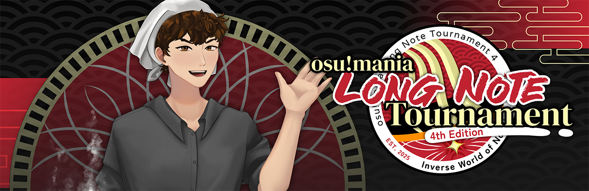
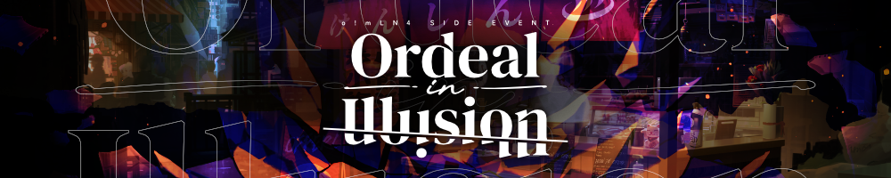
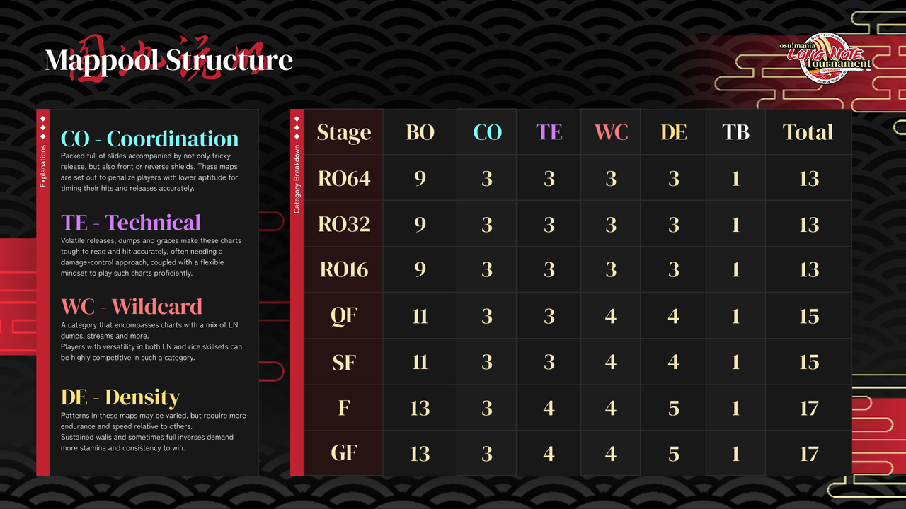

---
tags:
  - omLN
  - o!mLN
  - o!mLN4
  - o!mLN 4
---

# osu!mania LN Tournament 4

 

The **osu!mania LN Tournament 4** (***o!mLN4***) is a worldwide double-elimination 1v1 osu!mania 4-key tournament hosted by ::{ flag=TH }:: [HowToPlayLN](https://osu.ppy.sh/users/10879600) and ::{ flag=SG }:: [Polytetral](https://osu.ppy.sh/users/8612061). The tournament features a variety of maps with a vast amount of sliders (or long notes) in its mappools. It is the 4th instalment of the osu!mania LN tournament.

## Tournament schedule

| Event | Timestamp |
| --: | :-- |
| Registration phase | 2025-07-21/2025-08-18 |
| Screening phase | 2025-08-19/2025-09-06 |
| Qualifier Showcase | 2025-09-07 (14:00 UTC) |
| Qualifiers | 2025-09-08/2025-09-14 |
| Round of 64 | 2025-09-15/2025-09-21 |
| Round of 32 | 2025-09-22/2025-09-28 |
| Round of 16 | 2025-09-29/2025-10-05 |
| Quarterfinals | 2025-10-06/2025-10-16 |
| Semifinals | 2025-10-13/2025-10-19 |
| Finals | 2025-10-20/2025-10-26 |
| Grand Finals | 2025-10-27/2025-11-02 |

## Prizes

The prize pool will be divided in two parts: one is the **Regular Prize Pool**, allocated to the tournament winner; the other one is the **[OII](#ordeal-in-illusion) Prize Pool**, allocated to the event winner.

The Regular Prize Pool starts at $450 USD, while the OII Prize Pool will start at $100 USD. Community donations will contribute to both Tournament and OII Prize Pools in a 70/30 ratio respectively.

So far, there are **$450 USD** on the Regular Prize Pool and **$100 USD** on the OII Prize Pool.

The Regular Prize Pool is distributed among the participants as seen below:

| Placing | Prize(s) |
| :-: | :-- |
|  | o!mLN4 profile badge (pending), 40% of Regular Prize Pool |
|  | 25% of Regular Prize Pool |
|  | 20% of Regular Prize Pool |
| *4-6th place* | 5% of Regular Prize Pool |

<!--\
\
--> 

The OII Prize Pool is distributed among the participants as seen below:

| Placing | Prize(s) |
| :-: | :-- |
| *Lucky draw winners (3)* | 33% of OII Prize Pool |

## Organisation

The osu!mania LN Tournament 4 is run by various community members.

| Position | Member(s) |
| :-: | :-- |
| Tournament Organiser | ::{ flag=TH }:: [HowToPlayLN](https://osu.ppy.sh/users/10879600), ::{ flag=SG }:: [Polytetral](https://osu.ppy.sh/users/8612061) |
| Mappooler | ::{ flag=ID }:: [\[Crz\]Crysarlene](https://osu.ppy.sh/users/5492871), ::{ flag=US }:: [ImperialTrinity](https://osu.ppy.sh/users/5066305), ::{ flag=FR }:: [Paturages](https://osu.ppy.sh/users/1375479), ::{ flag=CN }:: [Yuiesta](https://osu.ppy.sh/users/13953619) |
| Mapper | ::{ flag=ID }:: [Ainer](https://osu.ppy.sh/users/13371424), ::{ flag=PH }:: [Akatsumi Chan](https://osu.ppy.sh/users/11306351), ::{ flag=AU }:: [anatharax](https://osu.ppy.sh/users/14390680), ::{ flag=KR }:: [Castella](https://osu.ppy.sh/users/4810916), ::{ flag=CN }:: [cherrychou](https://osu.ppy.sh/users/7214023), ::{ flag=NL }:: [DannyPX](https://osu.ppy.sh/users/11253722), ::{ flag=US }:: [elexire](https://osu.ppy.sh/users/9206093), ::{ flag=GB }:: [epic man 2](https://osu.ppy.sh/users/14566000), ::{ flag=US }:: [EpsilonMaiagare](https://osu.ppy.sh/users/3855052), ::{ flag=ID }:: [FelixSpade](https://osu.ppy.sh/users/2651304), ::{ flag=CN }:: [gzdongsheng](https://osu.ppy.sh/users/8660315), ::{ flag=CN }:: [Hylotl](https://osu.ppy.sh/users/18270260), ::{ flag=US }:: [ImperialTrinity](https://osu.ppy.sh/users/5066305), ::{ flag=CN }:: [Koyori Chan](https://osu.ppy.sh/users/11238501), ::{ flag=VN }:: [Micleak](https://osu.ppy.sh/users/16140674), ::{ flag=CN }:: [Muses](https://osu.ppy.sh/users/9705896), ::{ flag=US }:: [mystV](https://osu.ppy.sh/users/21654601), ::{ flag=TH }:: [MyZterioN-](https://osu.ppy.sh/users/8521723), ::{ flag=FR }:: [Paturages](https://osu.ppy.sh/users/1375479), ::{ flag=NL }:: [Saemitsu](https://osu.ppy.sh/users/14262789), ::{ flag=SG }:: [TheFunk](https://osu.ppy.sh/users/13981991), ::{ flag=US }:: [Toaph Daddy](https://osu.ppy.sh/users/7616811) |
| Playtester | ::{ flag=AU }:: [anatharax](https://osu.ppy.sh/users/14390680), ::{ flag=FR }:: [Koiidex](https://osu.ppy.sh/users/5193488), ::{ flag=BR }:: [LeMarcinho](https://osu.ppy.sh/users/13347579), ::{ flag=PH }:: [LivelyPeninsula](https://osu.ppy.sh/users/11517895), ::{ flag=KR }:: [SuddenDeath](https://osu.ppy.sh/users/6699923), ::{ flag=NL }:: [Toxic Scent](https://osu.ppy.sh/users/12599154), ::{ flag=CA }:: [Yubi](https://osu.ppy.sh/users/7198974) |
| Referee | ::{ flag=US }:: [akace100](https://osu.ppy.sh/users/9308128), ::{ flag=CN }:: [CapooFanboy](https://osu.ppy.sh/users/27235859), ::{ flag=US }:: [Dynascape](https://osu.ppy.sh/users/8784587), ::{ flag=US }:: [EpsilonMaiagare](https://osu.ppy.sh/users/3855052), ::{ flag=PE }:: [ERA Kaeseorin](https://osu.ppy.sh/users/17989444), ::{ flag=CA }:: [ERA Sunny](https://osu.ppy.sh/users/16468962), ::{ flag=CN }:: [Koyori Chan](https://osu.ppy.sh/users/11238501), ::{ flag=VN }:: [Krystal Quan](https://osu.ppy.sh/users/20569104), ::{ flag=BR }:: [LeMarcinho](https://osu.ppy.sh/users/13347579), ::{ flag=SE }:: [Logg45vs](https://osu.ppy.sh/users/8684540), ::{ flag=PH }:: [Normiplier](https://osu.ppy.sh/users/10069850), ::{ flag=FR }:: [Paturages](https://osu.ppy.sh/users/1375479), ::{ flag=IN }:: [Pilot\_BFFRI](https://osu.ppy.sh/users/27266540), ::{ flag=VN }:: [Poity](https://osu.ppy.sh/users/17148657), ::{ flag=SG }:: [Polytetral](https://osu.ppy.sh/users/8612061), ::{ flag=CN }:: [Rush\_FTK](https://osu.ppy.sh/users/3046856), ::{ flag=US }:: [SunApple](https://osu.ppy.sh/users/11817622), ::{ flag=DE }:: [TheHunter1](https://osu.ppy.sh/users/6496016), ::{ flag=US }:: [trooperr](https://osu.ppy.sh/users/32028459), ::{ flag=HK }:: [YonGin](https://osu.ppy.sh/users/7109317) |
| Streamer | ::{ flag=CN }:: [CapooFanboy](https://osu.ppy.sh/users/27235859), ::{ flag=US }:: [EpsilonMaiagare](https://osu.ppy.sh/users/3855052), ::{ flag=PL }:: [flapczek](https://osu.ppy.sh/users/8210988), ::{ flag=ID }:: [Fyl](https://osu.ppy.sh/users/10069307), ::{ flag=TH }:: [konkawe](https://osu.ppy.sh/users/15665805), ::{ flag=SE }:: [Logg45vs](https://osu.ppy.sh/users/8684540), ::{ flag=CL }:: [myucchii](https://osu.ppy.sh/users/10072733), ::{ flag=FR }:: [Paturages](https://osu.ppy.sh/users/1375479), ::{ flag=ID }:: [Reyi](https://osu.ppy.sh/users/13385865), ::{ flag=CN }:: [Rush\_FTK](https://osu.ppy.sh/users/3046856), ::{ flag=US }:: [SunApple](https://osu.ppy.sh/users/11817622), ::{ flag=CN }:: [Yuiesta](https://osu.ppy.sh/users/13953619), ::{ flag=US }:: [Znow](https://osu.ppy.sh/users/15513303) |
| Commentator | ::{ flag=IE }:: [-Nightkore](https://osu.ppy.sh/users/26311862), ::{ flag=MY }:: [\[-Leon-\]](https://osu.ppy.sh/users/13382147), ::{ flag=SG }:: [Adam Yuuki](https://osu.ppy.sh/users/12297375), ::{ flag=MY }:: [Cryolien](https://osu.ppy.sh/users/1626983), ::{ flag=US }:: [Dynascape](https://osu.ppy.sh/users/8784587), ::{ flag=GB }:: [epic man 2](https://osu.ppy.sh/users/14566000), ::{ flag=CA }:: [ERA Sunny](https://osu.ppy.sh/users/16468962), ::{ flag=PH }:: [Itawachi](https://osu.ppy.sh/users/12929973), ::{ flag=MY }:: [IvanOfficial](https://osu.ppy.sh/users/12818249), ::{ flag=VN }:: [MashedPotato](https://osu.ppy.sh/users/10494860), ::{ flag=CL }:: [myucchii](https://osu.ppy.sh/users/10072733), ::{ flag=FR }:: [Paturages](https://osu.ppy.sh/users/1375479), ::{ flag=SG }:: [Polytetral](https://osu.ppy.sh/users/8612061), ::{ flag=AU }:: [PotassiumF](https://osu.ppy.sh/users/4247722), ::{ flag=CN }:: [Rush\_FTK](https://osu.ppy.sh/users/3046856), ::{ flag=US }:: [Sparky](https://osu.ppy.sh/users/3187959), ::{ flag=US }:: [SunApple](https://osu.ppy.sh/users/11817622), ::{ flag=HK }:: [YonGin](https://osu.ppy.sh/users/7109317), ::{ flag=US }:: [Znow](https://osu.ppy.sh/users/15513303) |
| Sheeter | ::{ flag=US }:: [EpsilonMaiagare](https://osu.ppy.sh/users/3855052), ::{ flag=CN }:: [Yuiesta](https://osu.ppy.sh/users/13953619) |
| GFX Designer | ::{ flag=SE }:: [Melancholicc](https://osu.ppy.sh/users/18406374), ::{ flag=IT }::  [MightyMigz](https://osu.ppy.sh/users/8863387), ::{ flag=ID }:: [nayuu](https://osu.ppy.sh/users/12561379), ::{ flag=PH }:: [Normiplier](https://osu.ppy.sh/users/10069850), ::{ flag=PH }:: [OsuMe65](https://osu.ppy.sh/users/852867), ::{ flag=SG }:: [Polytetral](https://osu.ppy.sh/users/8612061), ::{ flag=CN }:: [Sakura006](https://osu.ppy.sh/users/10365024), ::{ flag=PH }:: [Swarmsii](https://osu.ppy.sh/users/11716111), ::{ flag=PH }:: [yukina meng](https://osu.ppy.sh/users/9919550), ::{ flag=MY }:: [Z419](https://osu.ppy.sh/users/9912966) |
| Developer | ::{ flag=KR }:: [Nopekjk](https://osu.ppy.sh/users/4585186), ::{ flag=KR }:: [yhsphd](https://osu.ppy.sh/users/6665667) |
| Composer | ::{ flag=TH }:: [HowToPlayLN](https://osu.ppy.sh/users/10879600) |

## Links

- [Registrations news post](https://osu.ppy.sh/home/news/2025-07-21-osu-mania-ln-tournament-4-registrations-now-open)
- [Discussion thread](https://osu.ppy.sh/community/forums/topics/2107840?n=1)
- [Challonge Bracket](https://challonge.com/5whqliol)
- [o!mLN Discord Sever](https://discord.gg/SPQtt3s)
- [Livestream](https://www.twitch.tv/osumanialive)
- **[Information spreadsheet](https://docs.google.com/spreadsheets/d/1Wl3Q41AI0e36sINVWh6qJHtKcCG_fdju2_0CdBm0DGs/edit?usp=sharing)**
- **[Statistics sheet](https://drive.google.com/drive/folders/1sBl4ej38-oYWs6Wc7al-KMskdfkmZilu)**

## Ordeal In Illusion

**Ordeal In Illusion** is a leaderboard event that runs in parallel to the tournament's schedule, available for everyone to participate!

After the mappool showcase, every week starting from Round of 64, **original songs released in the week's mappool** will receive a leaderboard on the statistics sheet, allowing both players and spectators alike to compete for the best score on the tournament's original beatmaps.

Before the start of the next round's mappool showcase, leaderboards for the week's originals will be frozen. Tickets are then awarded to every participant who submitted scores to the leaderboard, with the number of tickets awarded increasing with their ranking on the leaderboard:

| Placing | Prize(s) |
| :-: | :-- |
|  | 5 Tickets |
|  | 4 Tickets |
|  | 3 Tickets |
| *4-7th place* | 2 Tickets |
| *Other participates* | 1 Ticket |

At the end of the tournament, 3 tickets will be drawn during a livestream. The owners of these tickets will be winners of this event.

Details can be found on the **[information spreadsheet](https://docs.google.com/spreadsheets/d/1Wl3Q41AI0e36sINVWh6qJHtKcCG_fdju2_0CdBm0DGs/edit?usp=sharing)**.

<!--## Participants-->

<!--## Podium-->

## Mappools

### Finals

**[Download the mappack here! (189 MB)](https://drive.google.com/file/d/1vI47cbbceBJMDym15C0-VobxGgcLGR9E/)**\
[View the showcase VOD here](https://www.youtube.com/watch?v=54aANVnyelo)\
[View the showcase VOD (Chinese commentary) here](https://www.bilibili.com/video/BV11MWoz2EoN)

- Coordination
  1. [heylog - flare (Logan636) \[tallow paste\]](https://osu.ppy.sh/beatmapsets/2452307#mania/5357422)
  2. [Meguri Meguru - Hakai (MyZterioN-) \[ramification\]](https://osu.ppy.sh/beatmapsets/2452296#mania/5357381)
  3. [yuikonnu - Setsuna Trip (Koyori Chan) \[Insane (cut)\]](https://osu.ppy.sh/beatmapsets/2452371#mania/5357594)
- Technical
  1. [Quartzone & L.M. - Inutilia (Hylotl) \[Nothing (OD8.2)\]](https://osu.ppy.sh/beatmapsets/2175016#mania/5341643)
  2. [Monster Siren Records - Somniomancer \[null set\] (ImperialTrinity) \[I just want to wake up.\]](https://osu.ppy.sh/beatmapsets/2452340#mania/5357496)
  3. [Receptor - Kislorod (Cut Ver.) (Paturages) \[Breathtaking\]](https://osu.ppy.sh/beatmapsets/2452314#mania/5357437)
  4. [Billain feat. Tasha Baxter - Breach (FelixSpade, \[Crz\]Crysarlene) \[Regression (feat. FelixSpade) \[1.05x Rate\]\]](https://osu.ppy.sh/beatmapsets/2452341#mania/5357497)
- Wildcard
  1. [HowToPlayLN x nm-y - Variations on Transcendence (FelixSpade, Ainer) \[Passage to Posthumanism\]](https://osu.ppy.sh/beatmapsets/2452324#mania/5357451)
  2. [Iyowa feat. Hatsune Miku & flower - Last Journey (Cut Ver.) (Micleak) \[Took Wings (Rendezvous)\]](https://osu.ppy.sh/beatmapsets/2452231#mania/5357229)
  3. [Laur - Afflict (feat. Risa Yuzuki) (FelixSpade) \[timing he11\]](https://osu.ppy.sh/beatmapsets/2452328#mania/5357478)
  4. [MYUKKE. - Anti Safety Zone (Koyori Chan) \[Insane (edit) 1.05x (179bpm)\]](https://osu.ppy.sh/beatmapsets/2452372#mania/5357598)
- Density
  1. [Gram - Svartalfar (Hylotl) \[Nidavellir\]](https://osu.ppy.sh/beatmapsets/2452343#mania/5357506)
  2. [AAAA - reach for your victory!!! (Saemitsu) \[boundless glory\]](https://osu.ppy.sh/beatmapsets/2452334#mania/5357486)
  3. [xi - White Peak (Benson\_) \[Benson's LN Summit x1.15\_P\]](https://osu.ppy.sh/beatmapsets/1803724#mania/3717642)
  4. [DJ Myosuke & Gram - The Rebellion of Phantom (feat. Valkyria) (mystV) \[RebeLlioN 1.1x\]](https://osu.ppy.sh/beatmapsets/2172903#mania/4587042)
  5. [Aoi - Welkius (\[Crz\]Crysarlene, Hylotl) \[Angelic Horizon (feat. Hylotl) \[1.05x (220bpm)\]\]](https://osu.ppy.sh/beatmapsets/2452342#mania/5357501)
- Tiebreaker
  1. **[Sad Keyboard Guy & Gardens - Illusory Truth (ImperialTrinity, \[Crz\]Crysarlene, MyZterioN-, gzdongsheng) \[Uncertainty Apparition\]](https://osu.ppy.sh/beatmapsets/2452345#mania/5357508)**

### Semifinals

**[Download the mappack here! (208 MB)](https://drive.google.com/file/d/1GGHHOHqdshawnTAULWEg3FbQ9qDLoKmA/)**\
[View the showcase VOD here](https://www.youtube.com/watch?v=R5fOsgX1wVY)\
[View the showcase VOD (Chinese commentary) here](https://www.bilibili.com/video/BV1Mi4UzTELz)

- Coordination
  1. [Kolaa - Ama Ama Toutetsu Bon Bon (DannyPX) \[Tides And Ripples of Transmutation\]](https://osu.ppy.sh/beatmapsets/2449004#mania/5347428)
  2. [DECO\*27 - Ai Kotoba IV feat. Hatsune Miku (Castella) \[Honey Color\]](https://osu.ppy.sh/beatmapsets/2449026#mania/5347464)
  3. [ANTHEM - Snake Eyes (EpsilonMaiagare) \[You're Going Down (1.05x)\]](https://osu.ppy.sh/beatmapsets/2448994#mania/5347406)
- Technical
  1. [Frums - 19ZZ (ImperialTrinity) \[LN-J03\]](https://osu.ppy.sh/beatmapsets/2226646#mania/4723502)
  2. [Sou - Tada, Kimi no Mama de (FelixSpade, Saemitsu, epic man 2) \[Your Eternal Self\]](https://osu.ppy.sh/beatmapsets/2448990#mania/5347389)
  3. [Culprate - Beast (Vorso Remix) (\[Crz\]Crysarlene) \[Excelsior\]](https://osu.ppy.sh/beatmapsets/2230642#mania/4733962)
- Wildcard
  1. [suisoh - Heat abnormal (ImperialTrinity) \[Soliloquy (OD 7.7)\]](https://osu.ppy.sh/beatmapsets/2137913#mania/5347360)
  2. [Monster Siren Records - ......Has Arrived. (Hylotl) \[Impeccable Day 1.05x\]](https://osu.ppy.sh/beatmapsets/2407523#mania/5225364)
  3. [BlackY feat. Risa Yuzuki - Crimsonate (Castella) \[Forgotten World \[1.1x Rate\]\]](https://osu.ppy.sh/beatmapsets/2449024#mania/5347461)
  4. [cosMo@BousouP - Veauty and Violence (mystV) \[Beyond the Firmament\]](https://osu.ppy.sh/beatmapsets/2080079#mania/4355866)
- Density
  1. [PSYQUI feat. mikanzil - Endroll (Begin) \[o!mLN4 Edit 1.15x\]](https://osu.ppy.sh/beatmapsets/2448996#mania/5347411)
  2. [Hino Isuka - Dreamin' attraction!! (\[Crz\]Crysarlene) \[Sidonia \[1.05x Rate\]\]](https://osu.ppy.sh/beatmapsets/2006864#mania/4174291)
  3. [Katagiri - Katagiri Catch Ball (Yuiesta) \[Hani Hani Honey Honey\]](https://osu.ppy.sh/beatmapsets/1909953#mania/3939523)
  4. [SP-# - tinnitus (Enie) \[LN\]](https://osu.ppy.sh/beatmapsets/1540031#mania/3148286)
- Tiebreaker
  1. **[sugosugiii feat. Ethereal\_Winter - of the Iridescent Judgement (cherrychou, Muses, Koyori Chan, Yuiesta) \[of the Unraveling Nightmare\]](https://osu.ppy.sh/beatmapsets/2449007#mania/5347431)**

### Quarterfinals

**[Download the mappack here! (98 MB)](https://drive.google.com/file/d/117Sg3PEIhUaWAbR_ij11AwSdioTWqMiS/)**\
[View the showcase VOD here](https://www.youtube.com/watch?v=d-7a7OLoxlI)\
[View the showcase VOD (Chinese commentary) here](https://www.bilibili.com/video/BV1YkxEzoEtH)

- Coordination
  1. [Kajiura Yuki - Sis puella magica! (Paturages, ImperialTrinity) \[Imperial's Homura vs. Pat's Madoka\]](https://osu.ppy.sh/beatmapsets/2445641#mania/5338156)
  2. [LOLUET - 7 (Castella) \[Violent Feeling\]](https://osu.ppy.sh/beatmapsets/2445671#mania/5338253)
  3. [hitorie - Heart Breath (Xu seventeen) \[Life\]](https://osu.ppy.sh/beatmapsets/2376954#mania/5135061)
- Technical
  1. [Sakuzyo feat. Enoa (CV\: Hikaru Tono) - NotToNotice(); (ImperialTrinity, Saemitsu) \[// DesireToComprehend();\]](https://osu.ppy.sh/beatmapsets/2445692#mania/5338306)
  2. [-45 - A c i - L (Hylotl) \[Dlanor A. Knox\]](https://osu.ppy.sh/beatmapsets/2444430#mania/5334504)
  3. [IU - The Red Shoes (Cut Ver.) (Micleak) \[Fleeting; Long, and on I go 1.05x\]](https://osu.ppy.sh/beatmapsets/2421616#mania/5268381)
- Wildcard
  1. [Banzoin Hakka Ch. HOLOSTARS-EN - KiLLiNG ME (EpsilonMaiagare) \[THE NOODLES ARE KiL\[LN\]G ME\]](https://osu.ppy.sh/beatmapsets/2445645#mania/5338172)
  2. [Mono. - ST4RDUST\*XABER (\[Crz\]FolAH1217) \[C0smic Radiance\]](https://osu.ppy.sh/beatmapsets/1992859#mania/4141033)
  3. [Origami Angel - Escape Rope (Paturages) \[Dig\]](https://osu.ppy.sh/beatmapsets/2445646#mania/5338173)
  4. [Fall Out Boy - Dance, Dance (epic man 2) \[tragic;\]](https://osu.ppy.sh/beatmapsets/2218652#mania/4702795)
- Density
  1. [Hachi - Rinne (Chorus) (EpsilonMaiagare) \[Sorrow\]](https://osu.ppy.sh/beatmapsets/2445653#mania/5338192)
  2. [USAO - You & DIE (Cut ver.) (FelixSpade) \[LN Prodigy // Perpetual\]](https://osu.ppy.sh/beatmapsets/2445659#mania/5338234)
  3. [HowToPlayLN - Illusory -never trust what you can see- (\[Crz\]Crysarlene) \[Dread\]](https://osu.ppy.sh/beatmapsets/2445676#mania/5338262)
  4. [SiLiS - Nouille -Nigiyakana shigoto- (EpsilonMaiagare) \[A Lively Work\]](https://osu.ppy.sh/beatmapsets/2445663#mania/5338238)
- Tiebreaker
  1. **[Taishi feat. Noriko Mitose - Innocencia (Cut ver.) (ImperialTrinity) \[Ember of Life\]](https://osu.ppy.sh/beatmapsets/2445675#mania/5338261)**

### Round of 16

**[Download the mappack here! (103 MB)](https://drive.google.com/file/d/1xuclxv4_OHfJVt_Ut39-t_mB0kupZ3aj/)**\
[View the showcase VOD here](https://www.youtube.com/watch?v=40QOzpBAjXg)\
[View the showcase VOD (Chinese commentary) here](https://www.bilibili.com/video/BV1J1nzzmEWU)

- Coordination
  1. [Shikata Akiko - EXEC\_CHRONICLE\_KEY/. (DannyPX) \[I shall offer this Hymn\]](https://osu.ppy.sh/beatmapsets/2125862#mania/4468537)
  2. [Function Phantom - Integral Cube (juankristal) \[Limit (cut)\]](https://osu.ppy.sh/beatmapsets/1698324#mania/3689823)
  3. [PSYQUI feat. mikanzil - Waraenai (FelixSpade) \[LN Expert // Monochrome\]](https://osu.ppy.sh/beatmapsets/2442163#mania/5328531)
- Technical
  1. [TJ.hangneil - Kamui (MyZterioN-) \[Ituren\]](https://osu.ppy.sh/beatmapsets/2222914#mania/4713634)
  2. [Kikuo - Missing, Missing (ImperialTrinity) \[(M)i(S)sin(G)\]](https://osu.ppy.sh/beatmapsets/2442156#mania/5328510)
  3. [Risa Yuzuki - End Roll Syndrome (Castella) \[A Winter Carnival\]](https://osu.ppy.sh/beatmapsets/2442332#mania/5329025)
- Wildcard
  1. [Frums - 24eeev0-$ (arccat) \[lies within.\]](https://osu.ppy.sh/beatmapsets/2214264#mania/4691496)
  2. [seatrus - Raindrop (MyZterioN-) \[urban\]](https://osu.ppy.sh/beatmapsets/2442228#mania/5328744)
  3. [Dr. Dre & Snoop Dogg - The Next Episode (San Holo Remix) (Cut Ver.) (epic man 2) \[Noodle It Like It's Hot\]](https://osu.ppy.sh/beatmapsets/2442151#mania/5328503)
- Density
  1. [Machine Girl - Full Metal Dipshit (EpsilonMaiagare) \[1080 CRS \[LN\] (1.1x)\]](https://osu.ppy.sh/beatmapsets/2442160#mania/5328522)
  2. [Slax - Too Much Loli (Yuiesta) \[K-Loli x1.05\]](https://osu.ppy.sh/beatmapsets/2214144#mania/4691226)
  3. [SiLiS feat. Ethereal\_Winter - Night of the Reborn Perennial (epic man 2) \[Everlong\]](https://osu.ppy.sh/beatmapsets/2442159#mania/5328521)
- Tiebreaker
  1. **[Halv - Akashic Hex (Saemitsu) \[Echoes of the Primordials\]](https://osu.ppy.sh/beatmapsets/2442155#mania/5328509)**

### Round of 32

**[Download the mappack here! (82 MB)](https://drive.google.com/file/d/1D0_2HP8joOnV0pj8XZ8OAS3TLY8uaJy0/)**\
[View the showcase VOD here](https://www.youtube.com/watch?v=pkfQto38lPg)\
[View the showcase VOD (Chinese commentary) here](https://www.bilibili.com/video/BV1xunPzxE4C/)

- Coordination
  1. [RAKEL - Follow You into the Dark (DannyPX) \[I'm Fighting to Save my Love\]](https://osu.ppy.sh/beatmapsets/2438679#mania/5318753)
  2. [Dreamcatcher - Chase Me (fvrex) \[Paralysis\]](https://osu.ppy.sh/beatmapsets/2223502#mania/4715015)
  3. [MAISONdes - Tokyo Shandy Rendez-vous (Paturages) \[Escapade\]](https://osu.ppy.sh/beatmapsets/2438690#mania/5318776)
- Technical
  1. [konoco - Love ka? (Muses) \[alter ego\]](https://osu.ppy.sh/beatmapsets/2438931#mania/5319340)
  2. [Getty & Kobaryo - Breaking Dawn (feat. Itsuki Natsume) \[Short Version\] (MyZterioN-) \[LNation Anthem\]](https://osu.ppy.sh/beatmapsets/2438701#mania/5318794)
  3. [Suisoh - Empath (ImperialTrinity) \[LNpath\]](https://osu.ppy.sh/beatmapsets/2117470#mania/4585607)
- Wildcard
  1. [Supa7onyz - dntnk.jfl (Saemitsu) \[smpl.cmplxty\]](https://osu.ppy.sh/beatmapsets/2438674#mania/5318746)
  2. [Set It Off - Why Do I (Feat. Hatsune Miku) (epic man 2) \[I wish you were thinking about me\]](https://osu.ppy.sh/beatmapsets/2122015#mania/4459045)
  3. [Machine Girl - Virtual Paradise (EpsilonMaiagare) \[Feel the LN!\]](https://osu.ppy.sh/beatmapsets/2438689#mania/5318774)
- Density
  1. [Endorfin. - Luminous Rage (\[Crz\]Crysarlene) \[Patu Rage\]](https://osu.ppy.sh/beatmapsets/2438744#mania/5318899)
  2. [Kanaria - Dec. (Amaya Whisper Cover) (Paturages) \[Gambling.\]](https://osu.ppy.sh/beatmapsets/2438691#mania/5318778)
  3. [RINYA - BUCHIAGE Fireworks (Toaph Daddy) \[Meteor Shower\]](https://osu.ppy.sh/beatmapsets/2438683#mania/5318767)
- Tiebreaker
  1. **[o!mLN4 Sound Team "The HAIYAA Nephews" - Multi-Stage Gastrolatry (EpsilonMaiagare, ImperialTrinity, Yuiesta, TheFunk, Hylotl) \[THE KING OF FLAVOR\]](https://osu.ppy.sh/beatmapsets/2438697#mania/5318785)**

### Round of 64

**[Download the mappack here! (72 MB)](https://drive.google.com/file/d/17yrf8TqmdLMjoqazD5j6eGYu1vrdmEuE/)**\
[View the showcase VOD here](https://www.youtube.com/watch?v=MVPm896E7i4)\
[View the showcase VOD (Chinese commentary) here](https://www.bilibili.com/video/BV1oppqzrEea)

- Coordination
  1. [Unlike Pluto - Painted Dreams (LeMarcinho) \[Stage 3\: Tear OD8\]](https://osu.ppy.sh/beatmapsets/2435459#mania/5308656)
  2. [Kagetora. - Reimei (ImperialTrinity) \[Dergo's Remei (OD 8)\]](https://osu.ppy.sh/beatmapsets/2435461#mania/5308658)
  3. [tsukimi feat. KAFU - phony (MyZterioN-) \[fugue\]](https://osu.ppy.sh/beatmapsets/2025943#mania/4221064)
- Technical
  1. [RADWIMPS - Cat Chase (anatharax) \[Crescendo\]](https://osu.ppy.sh/beatmapsets/2435457#mania/5308651)
  2. [II-L ft.amelie xoxo - THE EARTH (ImperialTrinity) \[Another Editation\]](https://osu.ppy.sh/beatmapsets/1889879#mania/3899915)
  3. [dj-Nate - Thermodynamix (TheFunk) \[Acheron\]](https://osu.ppy.sh/beatmapsets/2435562#mania/5308941)
- Wildcard
  1. [Tedjimo yomigY - JezoensiS (elexire) \[Picea\]](https://osu.ppy.sh/beatmapsets/2435277#mania/5308306)
  2. [loqto - 90(2) (ImperialTrinity) \[RuleBlazing's Elegance ( OD 7.5)\]](https://osu.ppy.sh/beatmapsets/2435471#mania/5308685)
  3. [Houshou Marine - Ahoy!! Warera Houshou Kaizokudan (Cut Ver.) (Koyori Chan) \[Yo-Ho!!\]](https://osu.ppy.sh/beatmapsets/2435463#mania/5308675)
- Density
  1. [Alkome - Mind Disorder (RuleBlazing) \[Mind Distortion (edit)\]](https://osu.ppy.sh/beatmapsets/1768298#mania/4360855)
  2. [SOUND HOLIC - Night Bird \[DJ Command Remix\] (feat. 709sec.) (Koyori Chan, Yuiesta) \[omln 1.1x\]](https://osu.ppy.sh/beatmapsets/2435465#mania/5308678)
  3. [Spica - Yume o Kakeru! (Cut Ver.) (Paturages) \[Noodle Bath\]](https://osu.ppy.sh/beatmapsets/2435472#mania/5308688)
- Tiebreaker
  1. **[THE BEAT WIZARD - a lil ol tit for tat (FelixSpade, TheFunk) \[retribution\]](https://osu.ppy.sh/beatmapsets/2435474#mania/5308691)**

### Qualifiers

**[Download the mappack here! (41 MB)](https://drive.google.com/file/d/1GgQcCKAIoulT_mDoy66FpCAUsYomb_Ml/view)**\
[View the showcase VOD here](https://www.youtube.com/watch?v=ETgpSQvl1xQ)\
[View the showcase VOD (Chinese commentary) here](https://www.bilibili.com/video/BV16UaozZEMx)

- Coordination
  1. [dabih - The Greatest (DannyPX) \[Stage 1\: There Never Was\]](https://osu.ppy.sh/beatmapsets/2432028#mania/5298440)
  2. [Yunomi - Aimai Trip (with Momobako & miko)  (Sped Up Ver.) (Yuiesta) \[Stage 5\: Quasi-love\]](https://osu.ppy.sh/beatmapsets/2432066#mania/5298547)
- Wildcard
  1. [Cansol - Train of Thought (elexire) \[Stage 2\: Routing\]](https://osu.ppy.sh/beatmapsets/2432022#mania/5298426)
  2. [technoplanet - Inscape \[Extended Mix\] (\[Crz\]Crysarlene) \[Stage 6\: Caesura\]](https://osu.ppy.sh/beatmapsets/2432029#mania/5298443)
- Density
  1. [DGK - Kinki to Hiiro Gensou -The Primary Plasm- (Yuiesta, Hylotl) \[Stage 3\: fumo (w/ Yuiesta)\]](https://osu.ppy.sh/beatmapsets/2432025#mania/5298430)
  2. [Feryquitous feat. Aitsuki Nakuru - Fake (Sped Up Ver.) (ImperialTrinity) \[Stage 7\: Faker\]](https://osu.ppy.sh/beatmapsets/2432031#mania/5298445)
- Technical
  1. [Miyavi - What's my Name (Paturages) \[Stage 4\: Heisenberg\]](https://osu.ppy.sh/beatmapsets/2432053#mania/5298513)

## Ruleset

*For the latest rules, see the [forum post](https://osu.ppy.sh/community/forums/topics/2107840)*

### General rules

1. This tournament is a **1v1 global open rank double-elimination tournament**.
2. Players will first go through Qualifiers, then continue to the double-elimination bracket.
3. Staff members that met [official tournament support rules](/wiki/Tournaments/Official_support#staff) are allowed to play.
4. Players and staff members must have read this ruleset entirely.
5. Any rule changes or unexpected occurrences will be announced in the [Discord server](https://discord.gg/SPQtt3s).

### Mappool format

The maps in this tournament will only consist of long note (LN) oriented maps, and cover 4 sub-categories of LNs which are used to categorise all mappools after this stage. Details can be found below:

### Registrations

1. **Any** rank players from **any** region can register this tournament.
2. You must fill [Player Signup form](https://docs.google.com/forms/u/0/d/e/1FAIpQLSfQGnO66J7b22TgVmCTjhbmc3nyCpheLAup4wlMupt_3MUwcw/) to finish register.
3. If player passed [tournament screening](/wiki/Tournaments/Official_support#tournament-screening) after register, they are able to play qualifiers.

### Stage regulations

#### Qualifiers

1. After the screening phase has concluded, players eligible to play will participate in tournament play.
2. In the first weekend, players will play 7 qualifiers maps in sequence up to 2 times, in a scheduled lobby (they may choose not to play the 2nd time if desired).
3. The 7 qualifiers maps will cover 4 sub-categories of LNs which are used to categorise all mappools after this stage:
   - Stage 1: Early-game Releases
   - Stage 2: Early to Mid-game Wildcard (Short Duration)
   - Stage 3: Pure Density
   - Stage 4: Mid-game Technical
   - Stage 5: Late-game Releases
   - Stage 6: Mid to Late-game Wildcard (Long Duration)
   - Stage 7: Speed Density
4. This tournament will make use of the **Average Placement** method to seed players.
5. In the qualification process, every player who signs up has to schedule for a lobby during the Qualfiers Stage, and play through all 7 qualifier maps in the mappool at least once, and up to 2 times.
6. After completing the scheduled lobby, each player will have 1-2 scores recorded for each of the 7 qualifier maps. For each of the maps, the higher score of the two is taken and is used to provide the player's placement for each individual map.
7. After all players have completed their qualifier lobbies, each player's Average Placement will be obtained by dividing their Sum Placement by the number of maps in the qualifier mappool. This Average Placement will be used to cut down to the top 64 players, who will advance to the Bracket Elimination stage. Every other player is eliminated from the tournament.

##### Bracket Matches

1. After Qualifier Stage, the top 64 players will be arranged into a standard Double Elimination Bracket, where the highest seeded player will face the lowest seeded player, 2nd highest faces 2nd lowest, and so on. A player will be eliminated from the tournament after losing 2 matches in the bracket stage.

### Tournament Procedure

#### Pre-match procedure

1. Players will be informed of their match by an assigned referee 30 minutes before their matches commence, through a ping on Discord.
2. Players will be provided with an invite to the lobby hosted by the referee 5 minutes before their match commences. Players are required to be present in the lobby before the stipulated match time. 
3. Warmups will not be allowed for this tournament.

#### Mid-match procedure

1. After both players have joined the lobby, both players will run the !roll command in the lobby chat.
2. The player with the higher roll will pick first, and choose whether to protect first. If they choose to pick first, then they will ban second. The player with the lower roll receives the opposite of this.
3. Following the ban/pick procedure, both players will alternate in picks, and play the picked map simultaneously. The player who obtains a higher score will win a point, and this process repeats until one of the players wins the required number of points to claim the win for the match.
   - The required number of points to win the match varies for each stage.
4. Each player receives the right to use a 2-minute timeout once per match. If players find the need to use the timeout between picks, they should raise their request to the referee facilitating their match.
5. Players are encouraged to use their timeout only when an urgent situation or personal condition calls for it, and not to stall for time.
6. In the event where both players are 1 point away from winning the match, the tiebreaker will be played, and the player who wins the tiebreaker map will win the match.
7. Should there be a tie in map score between the 2 players, the result will be nullified and the map will be played once more to determine who gets the point.

### Additional rules/information

#### Mod configurations

1. The score system used for all matches in this tournament will be **Score V2**.
2. All maps are played with FreeMod. Visual mods such as Mirror, Hidden, Fade-In, Flashlight, and any combination of these mods are allowed. You are also allowed, but not forced, to play with NoFail.

#### Punctuality

1. Players are required to arrive for their match before the stipulated time for their match. Otherwise, a **10 minute** grace timer will be applied by the appointed referee for the match.
2. If the player fails to arrive at their match before this timer runs out, the match will be considered as a win by default to the other player.
3. If the player arrives at their match during this grace period, the time remaining on the timer will be brought forward to the ban/pick proceeding of the match.

#### Ban/Pick procedures

1. Players will be given 2 minutes to roll and perform their first ban/picks. Subsequently, players will have 2 minutes to pick a map and get ready to play the map.
   - If a player fails to adhere to the timer to ban/pick, the referee will choose a map by random to be picked in place of the player, using the !roll command.
   - On the second and subsequent occurrences, a point will be automatically awarded to the other player.

#### Disconnection

1. If a player is disconnected from a map within the first 30 seconds of gameplay, they can ask for the map to be aborted and replayed.
   - This is only available once per match for each player. Subsequent disconnects will give a point to the opponent and use up the remainder of the 10 minute grace period.
2. In the event a player is unable to return to the lobby before the grace period ends, the match will be considered a win to the other player.
3. In the event both players are disconnected, the player whose grace period runs out first will concede the match to the opponent.
4. In the event both players run out of grace period simultaneously, the winner will be the player with the higher qualifier seed.

#### General conduct

1. Every staff and player must respect each other and follow the osu! community rules, no discussion about sensitive topics (for example religion, politics), and anything that could be offensive to others.
2. Keep the competition and atmosphere friendly amongst each other, whether it is in the match, in the Twitch chatroom, or on the Discord server. Tournaments are always for us to come together as a community and not engage in pointless arguments.
3. In the event a player or staff member is found to have conducted themselves inappropriately towards anyone in the server, said individual can be subject to timeouts, warnings and bans from the tournament and its affiliated twitch channel based on the severity of the incident.
