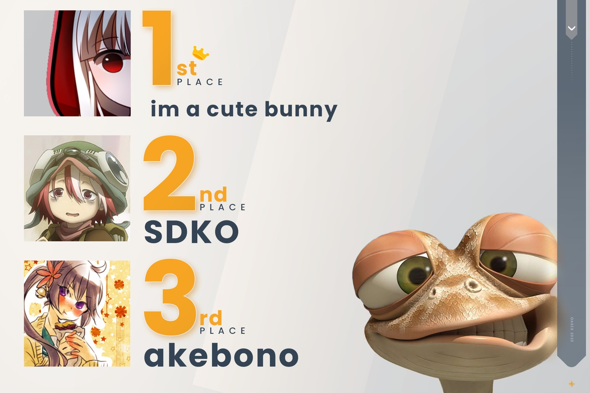

---
tags:
  - oASIS
  - o!ASIS
  - oASIS 2023
  - o!ASIS 2023
---

# osu! Amateur Solo Indonesia Showdown

The **osu! Amateur Solo Indonesia Showdown** (***oASIS*** or ***o!ASIS***) was a double-elimination 1v1 osu! tournament hosted by ::{ flag=ID }:: [Millie](https://osu.ppy.sh/users/3484548). The tournament was open to all players from Indonesia with a global rank of #10,000 or lower. It was the first instalment of the osu! Amateur Solo Indonesia Showdown tournament series.

## Tournament schedule

| Event | Timestamp |
| --: | :-- |
| Registration phase | 2023-01-30/2023-02-05 |
| Qualifiers | 2023-02-06/2023-02-12 |
| Round of 16 | 2023-02-13/2023-02-19 |
| Quarterfinals | 2023-02-20/2023-02-26 |
| Semifinals | 2023-02-27/2023-03-05 |
| Finals (week 1) | 2023-03-06/2023-03-12 |
| Finals (week 2) | 2023-03-13/2023-13-19 |

## Prizes

| Placing | Prize(s) |
| :-: | :-- |
|  | 2 months of osu!supporter, customised profile banner |
|  | Customised profile banner |
|  | Customised profile banner |

## Organisation

oASIS was run by various osu! community members from Indonesia and beyond.

| Position | Member(s) |
| :-- | :-- |
| Host | ::{ flag=ID }:: [Millie](https://osu.ppy.sh/users/3484548) |
| Mappool selector | ::{ flag=ID }:: [-TwiHD](https://osu.ppy.sh/users/5470299), ::{ flag=ID }:: [BlankTap](https://osu.ppy.sh/users/10137131), ::{ flag=ID }:: [Seox](https://osu.ppy.sh/users/3793938) |
| Mappool helper | ::{ flag=ID }:: [Millie](https://osu.ppy.sh/users/3484548), ::{ flag=ID }:: [Niva](https://osu.ppy.sh/users/197805), ::{ flag=ID }:: [Kuro Fuyusaki](https://osu.ppy.sh/users/2667496) |
| Playtester | ::{ flag=ID }:: [malvon](https://osu.ppy.sh/users/11113661), ::{ flag=ID }:: [Caviar-](https://osu.ppy.sh/users/10474988), ::{ flag=ID }:: [PatrickFPSGamer](https://osu.ppy.sh/users/4796773) |
| Streamer | ::{ flag=ID }:: [Millie](https://osu.ppy.sh/users/3484548), ::{ flag=MY }:: [Laphii](https://osu.ppy.sh/users/9364594) |
| Commentator | ::{ flag=ID }:: [Millie](https://osu.ppy.sh/users/3484548), ::{ flag=ID }:: [BlankTap](https://osu.ppy.sh/users/10137131) |
| Referee | ::{ flag=ID }:: [YaeMyMommy](https://osu.ppy.sh/users/17278897), ::{ flag=ID }:: [Vincent A](https://osu.ppy.sh/users/11050632), ::{ flag=MY }:: [Kokoro Amamiya](https://osu.ppy.sh/users/9534110), ::{ flag=PH }:: [-Pekora-](https://osu.ppy.sh/users/17959882), ::{ flag=HK }:: [ShadeCegLgMn](https://osu.ppy.sh/users/12609866) |
| Graphic designer | ::{ flag=ID }:: [Felter](https://osu.ppy.sh/users/5865319) |
| Spreadsheet manager | ::{ flag=ID }:: [Millie](https://osu.ppy.sh/users/3484548) |
| Wiki editor | ::{ flag=ID }:: [Niva](https://osu.ppy.sh/users/197805) |

## Links

- **[Main spreadsheet](https://docs.google.com/spreadsheets/d/1lPWXj5JwDwwP-KgHheXKP4jbGITcJgkU984yS6xMuxk/edit?usp=sharing)**
- [Forum thread](https://osu.ppy.sh/community/forums/topics/1714567)
- [Discord server](https://discord.gg/XkxJm53naR)
- [Challonge brackets](https://challonge.com/oasis2023)
- [Livestream channel](https://www.twitch.tv/osuIndonesia)

## Participants

Listed below are the players who managed to qualify into the Round of 16 (along with their respective seed number and Qualifiers Z-Sum value) out of 69 registered teams in total.

| Seed no. | Player | Z-Sum |
| :-: | :-- | :-- |
| 1 | ::{ flag=ID }:: [im a cute bunny](https://osu.ppy.sh/users/12578000) | 10.566 |
| 2 | ::{ flag=ID }:: [akebono](https://osu.ppy.sh/users/1815316) | 10.337 |
| 3 | ::{ flag=ID }:: [nsfuu](https://osu.ppy.sh/users/10849159) | 10.154 |
| 4 | ::{ flag=ID }:: [SDKO](https://osu.ppy.sh/users/4858555) | 9.258 |
| 5 | ::{ flag=ID }:: [Icun](https://osu.ppy.sh/users/17908427) | 9.114 |
| 6 | ::{ flag=ID }:: [Zoont](https://osu.ppy.sh/users/7109269) | 8.832 |
| 7 | ::{ flag=ID }:: [AlanEt](https://osu.ppy.sh/users/15037088) | 8.825 |
| 8 | ::{ flag=ID }:: [-CircleParadox-](https://osu.ppy.sh/users/10423227) | 8.788 |
| 9 | ::{ flag=ID }:: [Frixell](https://osu.ppy.sh/users/15601286) | 8.630 |
| 10 | ::{ flag=ID }:: [fnayR](https://osu.ppy.sh/users/2800253) | 8.533 |
| 11 | ::{ flag=ID }:: [cerena](https://osu.ppy.sh/users/5411734) | 8.345 |
| 12 | ::{ flag=ID }:: [CubeixID200](https://osu.ppy.sh/users/10678919) | 7.996 |
| 13 | ::{ flag=ID }:: [Honoka-Chan](https://osu.ppy.sh/users/11912828) | 7.768 |
| 14 | ::{ flag=ID }:: [ArchieA7](https://osu.ppy.sh/users/7087699) | 7.710 |
| 15 | ::{ flag=ID }:: [HyuugaDesuka](https://osu.ppy.sh/users/22684871) | 7.705 |
| 16 | ::{ flag=ID }:: [-Lunix](https://osu.ppy.sh/users/12964890) | 7.550 |

## Podium

## Mappools

### Finals (week 2)

**[Download the mappack here! (178 MB)](https://cdn.discordapp.com/attachments/913324595002605572/1084511862235856977/oasis2023gf1678633193617.zip)**

- NoMod
  1. [KINEMA106 - Juusou (Mordred) \[Iron Rain\]](https://osu.ppy.sh/beatmapsets/1301393#osu/2699247)
  2. [Maverick - opaque (Niva) \[-TwiNM2\]](https://osu.ppy.sh/beatmapsets/1955283#osu/4049716)
  3. [F A K E S - Last Words (DeviousPanda) \[werf's Extra\]](https://osu.ppy.sh/beatmapsets/1497474#osu/3119382)
  4. [Redside - Sidequest (Feiri) \[collab adventure\]](https://osu.ppy.sh/beatmapsets/1876071#osu/3860793)
  5. [IOSYS - Marisa Tanked My Score With an Incredible Hand (Yauxo) \[Special\]](https://osu.ppy.sh/beatmapsets/963766#osu/2017787)
- Hidden
  1. [Nana Mizuki - FINAL COMMANDER (Gravified) \[LAST BREATH\]](https://osu.ppy.sh/beatmapsets/1222526#osu/2542811)
  2. [Nanamori-chu \* Goraku-bu - Happy Time wa Owaranai (Cut Ver.) (-Keitaro) \[Insane\]](https://osu.ppy.sh/beatmapsets/1057015#osu/2210722)
  3. [Hino Isuka - Mechanical Jager (Livia) \[MEGA\]](https://osu.ppy.sh/beatmapsets/902823#osu/1884850)
- HardRock
  1. [School Food Punishment - RPG (Moete) \[Remorse\]](https://osu.ppy.sh/beatmapsets/1393720#osu/2877058)
  2. [ak+q - Ignotus (Ryuusei Aika) \[FUTURE+\]](https://osu.ppy.sh/beatmapsets/761244#osu/1600778)
  3. [sakuraburst - Glacierfall (Park Remix) (ScubDomino) \[celine's exp\*rt\]](https://osu.ppy.sh/beatmapsets/1329045#osu/2769942)
- DoubleTime
  1. [Matsushita - Kiritorisen (Millie) \[Origami feat. Seox\]](https://osu.ppy.sh/beatmapsets/1955342#osu/4049869)
  2. [seleP feat. Lily - Re;2 (Elcheer) \[Re;Vengeance\]](https://osu.ppy.sh/beatmapsets/1557197#osu/3181150)
  3. [Jun.A - Kawaii Daisensou no Refrain (Athanasia-) \[Insane (nerf)\]](https://osu.ppy.sh/beatmapsets/1783165#osu/3652107)
  4. [zts - liberatedliberator (deetz) \[Dada's Insane\]](https://osu.ppy.sh/beatmapsets/907805#osu/1902670)
- FreeMod
  1. [Rohi - Slan Leat (VINXIS) \[RLC's Extra\]](https://osu.ppy.sh/beatmapsets/1177073#osu/2454945)
  2. [Frums - Wavetapper (-jordan-) \[Expert\]](https://osu.ppy.sh/beatmapsets/1507849#osu/3088183)
  3. [Tsukiko - Haruka Kanata (imoutosan) \[Error: 80 - 32\]](https://osu.ppy.sh/beatmapsets/138296#osu/362479)
  4. [NIWASHI - Y (Down) \[PaRaDogi's Extra\]](https://osu.ppy.sh/beatmapsets/1689372#osu/3455084)
- Tiebreaker
  1. **[Masayoshi Minoshima feat.nomico - Lost Emotion (Amane UK Hardcore Remix) (MaridiuS) \[Despondency\]](https://osu.ppy.sh/beatmapsets/618953#osu/1304748)**

### Finals (week 1)

**[Download the mappack here! (159 MB)](https://mappack.yewonkim.tk/download?filename=oasis2023f1678040967898.zip)**

- NoMod
  1. [Yorushika - Matasaburo (Rosiie) \[Summer Wind\]](https://osu.ppy.sh/beatmapsets/1485959#osu/3047001)
  2. [Xi - Youyoumu \~ Run or Dash (GYGY) \[Extra\]](https://osu.ppy.sh/beatmapsets/1782703#osu/3650832)
  3. [Akatsuki Records - HANIPAGANDA (Night Mare) \[ZELQ'S EXTRA STAGE\]](https://osu.ppy.sh/beatmapsets/1083844#osu/2309567)
  4. [onoken - felys final remix (Elayue) \[Acylica's Extreme\]](https://osu.ppy.sh/beatmapsets/1319560#osu/2771203)
  5. [Hataya Naofumi - Looting the Louvre (oneplusone) \[Invasion du musee du Louvre\]](https://osu.ppy.sh/beatmapsets/1893902#osu/3902785)
- Hidden
  1. [Risa Yuzuki - S'il Vous President (gazimal) \[P, P, President\]](https://osu.ppy.sh/beatmapsets/1736708#osu/3549507)
  2. [DJ Sharpnel - IVALTEK (happy30) \[HappyMiX\]](https://osu.ppy.sh/beatmapsets/50429#osu/154988)
  3. [Official HIGE DANdism - Mixed Nuts (Amateurre) \[Liyuuchie's Ascent Extra\]](https://osu.ppy.sh/beatmapsets/1802422#osu/3695972)
- HardRock
  1. [t+pazolite - cheatreal (caren\_sk) \[RLC's Extra\]](https://osu.ppy.sh/beatmapsets/88180#osu/442170)
  2. [Anamanaguchi - John Hughes (Bonsai) \[Sushi's Insane\]](https://osu.ppy.sh/beatmapsets/655256#osu/1388633)
  3. [tomatoism - Someone Special (Jiysea) \[L e c a n d y ' s E x p e r t\]](https://osu.ppy.sh/beatmapsets/1282080#osu/2662928)
- DoubleTime
  1. [Shimotsuki Haruka - Kaleidoscope (Shurelia) \[Insane\]](https://osu.ppy.sh/beatmapsets/169622#osu/410798)
  2. [DIANA - Beethoven Virus (Orkay) \[Insane\]](https://osu.ppy.sh/beatmapsets/1724615#osu/3524604)
  3. [ALiCE'S EMOTiON - Tag (Hardbeat Remix) (Takos) \[Patchouli\]](https://osu.ppy.sh/beatmapsets/28991#osu/96525)
  4. [Kakichoco - Barbed Eye (Starfy) \[Chaoz's Insane\]](https://osu.ppy.sh/beatmapsets/482726#osu/1047447)
- FreeMod
  1. [UNDEAD CORPORATION - BLOW (hehe) \[Extra\]](https://osu.ppy.sh/beatmapsets/1019640#osu/3325194)
  2. [Komiya Mao - Yozakura (melloe) \[Seasons\]](https://osu.ppy.sh/beatmapsets/477903#osu/1020839)
  3. [Hatsune Miku - Hidari Migi -migihidari- (NatsumeRin) \[Rin\]](https://osu.ppy.sh/beatmapsets/24177#osu/87223)
  4. [BUTAOTOME - Gensou no Satellite (ScubDomino) \[add me on genshin 800950001\]](https://osu.ppy.sh/beatmapsets/1109181#osu/2317907)
- Tiebreaker
  1. **[Shaun Martin - Madiba (over\_loadcode) \[Dynamic\]](https://osu.ppy.sh/beatmapsets/1301789#osu/2700108)**

### Semifinals

**[Download the mappack here! (164 MB)](https://mappack.yewonkim.tk/download?filename=oasis2023sf1677415305247.zip)**

- NoMod
  1. [CloZee - Koto (galvenize) \[Extra\]](https://osu.ppy.sh/beatmapsets/517055#osu/1098833)
  2. [DM Ashura - Classical Insanity (Kurashina Asuka) \[agitato\]](https://osu.ppy.sh/beatmapsets/1644511#osu/3356836)
  3. [Nanahoshi Kangengakudan feat. Hatsune Miku - No.39 (pkk) \[No Sankyuu\]](https://osu.ppy.sh/beatmapsets/531488#osu/1126317)
  4. [KARUT - Starting Pistol (Millie) \[osu!id uma Collab\]](https://osu.ppy.sh/beatmapsets/1946772#osu/4027884)
  5. [Mili - String Theocracy (\[Arc\]) \[Theatrically Interesting\]](https://osu.ppy.sh/beatmapsets/1192164#osu/2484169)
- Hidden
  1. [Kenshi Yonezu - KICK BACK (iljaaz) \[KALIBE'S EXTRA\]](https://osu.ppy.sh/beatmapsets/1864481#osu/3838743)
  2. [DJ Okawari - Canon (Short Ver.) (backstep) \[Peaceful\]](https://osu.ppy.sh/beatmapsets/44305#osu/138830)
  3. [Nor - Usagi Flap (Raids) \[KAITEN INSANE 22,366,819 AZUSA SANDBAG METHOD?!?\]](https://osu.ppy.sh/beatmapsets/1876276#osu/3861173)
- HardRock
  1. [TUYU - Itsuka Otona ni Nareru to Ii ne. (Len) \[Not Classic Extra\]](https://osu.ppy.sh/beatmapsets/1773106#osu/3630306)
  2. [onoken - unisonote (GreenHue) \[Kloyd's Extra\]](https://osu.ppy.sh/beatmapsets/1142060#osu/2385221)
  3. [Sataka Ryohei feat. Aitsuki Nakuru - Killer neuron (SMOKELIND) \[Nymphe & Ermi's I\]](https://osu.ppy.sh/beatmapsets/1781376#osu/3676552)
- DoubleTime
  1. [Aya Hirayama - Sayonara Rolling Star (Bariton) \[keep rolling\~!\]](https://osu.ppy.sh/beatmapsets/731892#osu/1544394)
  2. [45 - System 0 (Doomsdaddy) \[Witchcraft\]](https://osu.ppy.sh/beatmapsets/1778456#osu/3642351)
  3. [Yuyoyuppe - AiAe (Fort) \[Insane\]](https://osu.ppy.sh/beatmapsets/257793#osu/663881)
  4. [Dio ft. Sef - Tijdmachine (GladiOol) \[Lesjuh's Hard\]](https://osu.ppy.sh/beatmapsets/6997#osu/129876)
- FreeMod
  1. [FOLiACETATE - Heterochromia Iridis (ktgster) \[Another\]](https://osu.ppy.sh/beatmapsets/106443#osu/279607)
  2. [NIWASHI - Sapphire On Fire (DeviousPanda) \[Feiri's Another\]](https://osu.ppy.sh/beatmapsets/1461145#osu/3022593)
  3. [inabakumori - Tokoshizume (xyperX) \[Kard's Insane\]](https://osu.ppy.sh/beatmapsets/1777533#osu/3657734)
  4. [Thaehan - Never Give Up (verychill) \[Nowa's Extra\]](https://osu.ppy.sh/beatmapsets/1048705#osu/2699387)
- Tiebreaker
  1. **[Krik/Krak - Archetype no Ido no Kaibutsu (Adinda) \[Illusion\]](https://osu.ppy.sh/beatmapsets/1654863#osu/3377955)**

### Quarterfinals

**[Download the mappack here! (152 MB)](https://mappack.yewonkim.tk/download?filename=oasis2023qf1676803648731.zip)**

- NoMod
  1. [Satono Diamond (CV: Tachibana Hina) & Kitasan Black (CV: Yano Hinaki) - Ambitious World (SatonoDiamond) \[Let's start my Challenge!\]](https://osu.ppy.sh/beatmapsets/1809169#osu/3710664)
  2. [celas - Azul (Remix) (Satellite) \[Fort's Extra\]](https://osu.ppy.sh/beatmapsets/1369453#osu/3160793)
  3. [Rise Against - Disparity By Design (pishifat) \[Extra\]](https://osu.ppy.sh/beatmapsets/360325#osu/1768260)
  4. [Mitsukiyo - Constant Moderato (araran) \[Sunazuka Akira's Extra\]](https://osu.ppy.sh/beatmapsets/1640689#osu/3369276)
  5. [Ariana Grande - 7 rings (wafer) \[6 rings\]](https://osu.ppy.sh/beatmapsets/1168016#osu/2436954)
- Hidden
  1. [Yorushika - Arugu (Faito) \[Enerugi's Extra\]](https://osu.ppy.sh/beatmapsets/1108809#osu/2372012)
  2. [Silver Forest - Tsurupettan (YokesPai) \[kolik's Lunatic\]](https://osu.ppy.sh/beatmapsets/1731247#osu/3538794)
  3. [Enako feat. Pmarusama - Identity Meltdown (TV Size) (Reiszen) \[Expert\]](https://osu.ppy.sh/beatmapsets/1911771#osu/3943503)
- HardRock
  1. [LIP x LIP - Chiisana Lion feat. Minami (CV: Toyonaga Toshiyuki) (Jian) \[SeaRasp's Insane\]](https://osu.ppy.sh/beatmapsets/905572#osu/1901118)
  2. [TOMOSUKE feat. Crystal Paloa - Seasons (jycool) \[seasons\]](https://osu.ppy.sh/beatmapsets/1732626#osu/3541530)
  3. [HyuN - You'Re aRleAdY dEAd (J1\_) \[lfj's Insane\]](https://osu.ppy.sh/beatmapsets/891441#osu/1863464)
- DoubleTime
  1. [eufonius - pieces (My Angel Rize) \[Frontier's Insane\]](https://osu.ppy.sh/beatmapsets/1115379#osu/2396844)
  2. [Xceon feat. Mayumi Morinaga - Ikuseisou no Monogatari \~The Story of Eternity\~ (Seikatu) \[Insane\]](https://osu.ppy.sh/beatmapsets/306782#osu/686559)
  3. [:) feat. KAFU - Egonomy (Ryuusei Aika) \[kieg's Hard\]](https://osu.ppy.sh/beatmapsets/1745150#osu/3594762)
  4. [\*NSYNC - I Want You Back (Aranel) \[Apology\]](https://osu.ppy.sh/beatmapsets/1737620#osu/3551511)
- FreeMod
  1. [Nekrogoblikon - Dressed as Goblins (Dada) \[Another\]](https://osu.ppy.sh/beatmapsets/1233657#osu/2867842)
  2. [onoken - K8017 (tsukamaete) \[Another\]](https://osu.ppy.sh/beatmapsets/13470#osu/49822)
  3. [kamome sano - Elemental Creation (kamome sano Remix) (UberFazz) \[EXHAUST\]](https://osu.ppy.sh/beatmapsets/1569809#osu/3205645)
  4. [Yunomi & nicamoq - Indoor Kei Nara Trackmaker (curryrice Remix) (toybot) \[sing's master\]](https://osu.ppy.sh/beatmapsets/926885#osu/1935933)
- Tiebreaker
  1. **[Eisyo-kobu - Oriental Blossom (Rolni) \[Infinity\]](https://osu.ppy.sh/beatmapsets/1023172#osu/2140353)**

### Round of 16

**[Download the mappack here! (95 MB)](https://mappack.yewonkim.tk/download?filename=oasis2023ro161676211079792.zip)**

- NoMod
  1. [angela - Otome no Route wa Hitotsu Janai! (verychill) \[Shady's Extra\]](https://osu.ppy.sh/beatmapsets/1153303#osu/2420209)
  2. [RYO - Shuffle Heaven (Kurashina Asuka) \[Extra\]](https://osu.ppy.sh/beatmapsets/1349060#osu/2793277)
  3. [Nanahoshi Kangengakudan - MAKE A LOSER (inst) (Keqing) \[Ayamateurre's Insane\]](https://osu.ppy.sh/beatmapsets/1504828#osu/3169833)
  4. [Street vs. Sin:cK - Adamantite (Acylica) \[vikala's Another\]](https://osu.ppy.sh/beatmapsets/1265628#osu/2630256)
- Hidden
  1. [Sound Souler - Bubble Flower (Sylas) \[\_Epreus' Extra\]](https://osu.ppy.sh/beatmapsets/1152182#osu/2438031)
  2. [Rin'ca - Darling-go-round (Bellicose) \[Promise\]](https://osu.ppy.sh/beatmapsets/1501758#osu/3077032)
- HardRock
  1. [Nero's Day At Disneyland - No Money Down, Low Monthly Payments (grumd) \[Insane\]](https://osu.ppy.sh/beatmapsets/111825#osu/290733)
  2. [iru1919 - Tenko (Seto Kousuke) \[Insane\]](https://osu.ppy.sh/beatmapsets/840826#osu/1759876)
- DoubleTime
  1. [BiBi - Cutie Panther (happy623) \[Fycho's Hard\]](https://osu.ppy.sh/beatmapsets/152112#osu/384521)
  2. [Suzaku - VANESSA (La Cataline) \[Another\]](https://osu.ppy.sh/beatmapsets/27862#osu/97663)
  3. [Chito (CV: Minase Inori), Yuuri (CV: Kubo Yurika) - More One Night (Assertive Hardcore Bootleg) (Minorsonek) \[Mathew's Hard\]](https://osu.ppy.sh/beatmapsets/734135#osu/1567978)
- FreeMod
  1. [Nekrogoblikon - The Skin Thief (LMT) \[Insane\]](https://osu.ppy.sh/beatmapsets/1061535#osu/2223742)
  2. [Aishuu Mania - the lost dedicated (Matrix) \[rolniczy's insane\]](https://osu.ppy.sh/beatmapsets/1596341#osu/3262088)
  3. [xi - Beatrice (Gordon) \[Collab Insane\]](https://osu.ppy.sh/beatmapsets/1664961#osu/3477124)
- Tiebreaker
  1. **[wakaG - Yozora ni Saita Hana (Reillia) \[Sakura\]](https://osu.ppy.sh/beatmapsets/810188#osu/1699930)**

### Qualifiers

**[Download the mappack here! (67 MB)](https://drive.google.com/file/d/1zC0x2zbBZmUsKPypUvm7FE69u-708ton/view)**

- NoMod
  1. [yanaginagi - Zoetrope (Asphyxia) \[Erisu's Extra\]](https://osu.ppy.sh/beatmapsets/181681#osu/3711197)
  2. [m108 - Sunflower (Leader) \[Expert\]](https://osu.ppy.sh/beatmapsets/1403962#osu/2895675)
  3. [Takanashi Kiara - SPARKS (PotatoDew) \[don't stop!\]](https://osu.ppy.sh/beatmapsets/1693861#osu/3461183)
  4. [Zekk - Feelsleft0ut (Ascended) \[Cubby's Extra\]](https://osu.ppy.sh/beatmapsets/1811658#osu/3716153)
- Hidden
  1. [BUTAOTOME - Sharekoube (moph) \[Expert\]](https://osu.ppy.sh/beatmapsets/1597784#osu/3894799)
  2. [ICE - Majestic Phoenix (Zetera) \[Deramok's Lit Insane\]](https://osu.ppy.sh/beatmapsets/845094#osu/1772022)
- HardRock
  1. [BUTAOTOME - Kurukuru Tsukai (Entry) \[Elcheer's Another\]](https://osu.ppy.sh/beatmapsets/1032027#osu/2164424)
  2. [Mitsukiyo - Luminous Memory (CoLouRed GlaZeE) \[Kuse's Insane\]](https://osu.ppy.sh/beatmapsets/1796025#osu/3681704)
- DoubleTime
  1. [Eri Sasaki - Ring of Fortune (CelsiusLK) \[Insane\]](https://osu.ppy.sh/beatmapsets/317236#osu/706798)
  2. [SHK - SO HOT (Remix by SHK) (AngelHoney) \[Hard\]](https://osu.ppy.sh/beatmapsets/40086#osu/127409)
  3. [HyuN - Illusion of Inflict (Icekalt) \[Light Insane\]](https://osu.ppy.sh/beatmapsets/968923#osu/2041171)

## Match results

### Finals (week 2)

Friday, 17 March 2023:

| Bracket | Player 1 |  |  | Player 2 | Match link |
| :-: | --: | :-: | :-: | :-- | :-- |
| Lower | [akebono](https://osu.ppy.sh/users/1815316) ::{ flag=ID }:: | 5 | **7** | ::{ flag=ID }:: **[SDKO](https://osu.ppy.sh/users/4858555)** | [#1](https://osu.ppy.sh/community/matches/107421064) |

Monday, 21 March 2023, Grand Final:

| Bracket | Player 1 |  |  | Player 2 | Match link |
| :-: | --: | :-: | :-: | :-- | :-- |
| Grand Final | **[im a cute bunny](https://osu.ppy.sh/users/12578000)** ::{ flag=ID }:: | **7** | 4 | ::{ flag=ID }:: [SDKO](https://osu.ppy.sh/users/4858555) | [#1](https://osu.ppy.sh/community/matches/107484474) |

### Finals (week 1)

Friday, 10 March 2023:

| Bracket | Player 1 |  |  | Player 2 | Match link |
| :-: | --: | :-: | :-: | :-- | :-- |
| Lower | [Icun](https://osu.ppy.sh/users/17908427) ::{ flag=ID }:: | 3 | **7** | ::{ flag=ID }:: **[nsfuu](https://osu.ppy.sh/users/10849159)** | [#1](https://osu.ppy.sh/community/matches/107284824) |

Saturday, 11 March 2023:

| Bracket | Player 1 |  |  | Player 2 | Match link |
| :-: | --: | :-: | :-: | :-- | :-- |
| Lower | [cerena](https://osu.ppy.sh/users/5411734) ::{ flag=ID }:: | 3 | **7** | ::{ flag=ID }:: **[SDKO](https://osu.ppy.sh/users/4858555)** | [#1](https://osu.ppy.sh/community/matches/107300886) |

Sunday, 12 March 2023:

| Bracket | Player 1 |  |  | Player 2 | Match link |
| :-: | --: | :-: | :-: | :-- | :-- |
| Upper | **[im a cute bunny](https://osu.ppy.sh/users/12578000)** ::{ flag=ID }:: | **7** | 4 | ::{ flag=ID }:: [akebono](https://osu.ppy.sh/users/1815316) | [#1](https://osu.ppy.sh/community/matches/107306855) |
| Lower | [nsfuu](https://osu.ppy.sh/users/10849159) ::{ flag=ID }:: | 0 | **7** | ::{ flag=ID }:: **[SDKO](https://osu.ppy.sh/users/4858555)** | *win by default* |

### Semifinals

Friday, 3 March 2023:

| Bracket | Player 1 |  |  | Player 2 | Match link |
| :-: | --: | :-: | :-: | :-- | :-- |
| Lower | **[nsfuu](https://osu.ppy.sh/users/10849159)** ::{ flag=ID }:: | **6** | 2 | ::{ flag=ID }:: [Frixell](https://osu.ppy.sh/users/15601286) | [#1](https://osu.ppy.sh/community/matches/107153567) |

Saturday, 4 March 2023:

| Bracket | Player 1 |  |  | Player 2 | Match link |
| :-: | --: | :-: | :-: | :-- | :-- |
| Lower | [-CircleParadox-](https://osu.ppy.sh/users/10423227) ::{ flag=ID }:: | 2 | **6** | ::{ flag=ID }:: **[Zoont](https://osu.ppy.sh/users/7109269)** | [#1](https://osu.ppy.sh/community/matches/107172717) |
| Upper | **[im a cute bunny](https://osu.ppy.sh/users/12578000)** ::{ flag=ID }:: | **6** | 2 | ::{ flag=ID }:: [Icun](https://osu.ppy.sh/users/17908427) | [#1](https://osu.ppy.sh/community/matches/107171437) |
| Lower | **[fnayR](https://osu.ppy.sh/users/2800253)** ::{ flag=ID }:: | **6** | 2 | ::{ flag=ID }:: [CubeixID200](https://osu.ppy.sh/users/10678919) | [#1](https://osu.ppy.sh/community/matches/107175274) |
| Lower | **[SDKO](https://osu.ppy.sh/users/4858555)** ::{ flag=ID }:: | **6** | 3 | ::{ flag=ID }:: [HyuugaDesuka](https://osu.ppy.sh/users/22684871) | [#1](https://osu.ppy.sh/community/matches/107174242) |

Sunday, 5 March 2023:

| Bracket | Player 1 |  |  | Player 2 | Match link |
| :-: | --: | :-: | :-: | :-- | :-- |
| Lower | **[SDKO](https://osu.ppy.sh/users/4858555)** ::{ flag=ID }:: | **6** | 3 | ::{ flag=ID }:: [Zoont](https://osu.ppy.sh/users/7109269) | [#1](https://osu.ppy.sh/community/matches/107197629) |

Monday, 6 March 2023:

| Bracket | Player 1 |  |  | Player 2 | Match link |
| :-: | --: | :-: | :-: | :-- | :-- |
| Lower | **[nsfuu](https://osu.ppy.sh/users/10849159)** ::{ flag=ID }:: | **6** | 0 | ::{ flag=ID }:: [fnayR](https://osu.ppy.sh/users/2800253) | [#1](https://osu.ppy.sh/community/matches/107197662) |
| Upper | **[akebono](https://osu.ppy.sh/users/1815316)** ::{ flag=ID }:: | **6** | 3 | ::{ flag=ID }:: [cerena](https://osu.ppy.sh/users/5411734) | [#1](https://osu.ppy.sh/community/matches/107210408) |

### Quarterfinals

Friday, 24 February 2023:

| Bracket | Player 1 |  |  | Player 2 | Match link |
| :-: | --: | :-: | :-: | :-- | :-- |
| Upper | [nsfuu](https://osu.ppy.sh/users/10849159) ::{ flag=ID }:: | 4 | **6** | ::{ flag=ID }:: **[cerena](https://osu.ppy.sh/users/5411734)** | [#1](https://osu.ppy.sh/community/matches/107028501) |

Saturday, 25 February 2023:

| Bracket | Player 1 |  |  | Player 2 | Match link |
| :-: | --: | :-: | :-: | :-- | :-- |
| Lower | **[CubeixID200](https://osu.ppy.sh/users/10678919)** ::{ flag=ID }:: | **6** | 3 | ::{ flag=ID }:: [Honoka-Chan](https://osu.ppy.sh/users/11912828) | [#1](https://osu.ppy.sh/community/matches/107045025) |

Sunday, 26 February 2023:

| Bracket | Player 1 |  |  | Player 2 | Match link |
| :-: | --: | :-: | :-: | :-- | :-- |
| Upper | [SDKO](https://osu.ppy.sh/users/4858555) ::{ flag=ID }:: | 3 | **6** | ::{ flag=ID }:: **[Icun](https://osu.ppy.sh/users/17908427)** | [#1](https://osu.ppy.sh/community/matches/107066197) |
| Lower | **[HyuugaDesuka](https://osu.ppy.sh/users/22684871)** ::{ flag=ID }:: | **6** | 2 | ::{ flag=ID }:: [AlanEt](https://osu.ppy.sh/users/15037088) | [#1](https://osu.ppy.sh/community/matches/107069121) |
| Lower | **[Frixell](https://osu.ppy.sh/users/15601286)** ::{ flag=ID }:: | **6** | 2 | ::{ flag=ID }:: [-Lunix](https://osu.ppy.sh/users/12964890) | [#1](https://osu.ppy.sh/community/matches/107070091) |
| Upper | **[im a cute bunny](https://osu.ppy.sh/users/12578000)** ::{ flag=ID }:: | **6** | 0 | ::{ flag=ID }:: [-CircleParadox-](https://osu.ppy.sh/users/10423227) | [#1](https://osu.ppy.sh/community/matches/107071382) |
| Upper | **[akebono](https://osu.ppy.sh/users/1815316)** ::{ flag=ID }:: | **6** | 2 | ::{ flag=ID }:: [fnayR](https://osu.ppy.sh/users/2800253) | [#1](https://osu.ppy.sh/community/matches/107071230) |
| Lower | **[Zoont](https://osu.ppy.sh/users/7109269)** ::{ flag=ID }:: | **6** | 2 | ::{ flag=ID }:: [ArchieA7](https://osu.ppy.sh/users/7087699) | [#1](https://osu.ppy.sh/community/matches/107072405) |

### Round of 16

Friday, 17 February 2023:

| Bracket | Player 1 |  |  | Player 2 | Match link |
| :-: | --: | :-: | :-: | :-- | :-- |
| Upper | **[Icun](https://osu.ppy.sh/users/17908427)** ::{ flag=ID }:: | **5** | 2 | ::{ flag=ID }:: [CubeixID200](https://osu.ppy.sh/users/10678919) | [#1](https://osu.ppy.sh/community/matches/106873620) |
| Upper | **[-CircleParadox-](https://osu.ppy.sh/users/10423227)** ::{ flag=ID }:: | **5** | 4 | ::{ flag=ID }:: [Frixell](https://osu.ppy.sh/users/15601286) | [#1](https://osu.ppy.sh/community/matches/106891584) |

Saturday, 18 February 2023:

| Bracket | Player 1 |  |  | Player 2 | Match link |
| :-: | --: | :-: | :-: | :-- | :-- |
| Upper | [Zoont](https://osu.ppy.sh/users/7109269) ::{ flag=ID }:: | 4 | **5** | ::{ flag=ID }:: **[cerena](https://osu.ppy.sh/users/5411734)** | [#1](https://osu.ppy.sh/community/matches/106913383) |
| Upper | **[nsfuu](https://osu.ppy.sh/users/10849159)** ::{ flag=ID }:: | **5** | 1 | ::{ flag=ID }:: [ArchieA7](https://osu.ppy.sh/users/7087699) | [#1](https://osu.ppy.sh/community/matches/106914487) |
| Upper | **[akebono](https://osu.ppy.sh/users/1815316)** ::{ flag=ID }:: | **5** | 4 | ::{ flag=ID }:: [HyuugaDesuka](https://osu.ppy.sh/users/22684871) | [#1](https://osu.ppy.sh/community/matches/106915198) |
| Upper | **[im a cute bunny](https://osu.ppy.sh/users/12578000)** ::{ flag=ID }:: | **5** | 0 | ::{ flag=ID }:: [-Lunix](https://osu.ppy.sh/users/12964890) | [#1](https://osu.ppy.sh/community/matches/106912181) |

Sunday, 19 February 2023:

| Bracket | Player 1 |  |  | Player 2 | Match link |
| :-: | --: | :-: | :-: | :-- | :-- |
| Upper | [AlanEt](https://osu.ppy.sh/users/15037088) ::{ flag=ID }:: | 4 | **5** | ::{ flag=ID }:: **[fnayR](https://osu.ppy.sh/users/2800253)** | [#1](https://osu.ppy.sh/community/matches/106937367) |
| Upper | **[SDKO](https://osu.ppy.sh/users/4858555)** ::{ flag=ID }:: | **5** | 0 | ::{ flag=ID }:: [Honoka-Chan](https://osu.ppy.sh/users/11912828) | [#1](https://osu.ppy.sh/community/matches/106931400) |

## Ruleset

### General rules

1. Beatmap scoring is based on **[ScoreV2](/wiki/Gameplay/Score#scorev2).**
2. The mappools for each round will be announced by the tournament management in advance before the actual matches take place.
3. Match schedules will be predetermined by the tournament management. If there are any players who are unable to attend the current schedule for any reason, all other affected players may apply and settle for a reschedule at the `#scheduling` channel in the tournament's Discord server.
4. A referee will create a multiplayer room 10 minutes in advance and will start to send out invites.
5. If a player does not show up within **10 minutes** of the start time, their opponent wins by default.
6. If no staff or referee is available, the match will be postponed.
7. **NoFail will be enforced in all beatmaps.** This is to ensure that the points are to be awarded more fairly towards players who perform better in general during the course of the beatmap regardless of their remaining health at the end.
8. If a player disconnects, it will be treated as if they had failed the beatmap.
   - A match can be rematched for disconnects that occur within a few seconds after the beatmap has been started by the referee.
9. Lag is not a valid reason to nullify a beatmap.
10. If any problems during the match occur, the tournament management will make a decision based on the referee's report.
11. It is expected that all players be polite and respectful to each other. Penalties will be given upon violation.
    - If a player is found to be engaging in an act that is deemed to be distasteful or provocative, the corresponding player may be disqualified right away from the tournament and/or blacklisted from future iterations of the tournament by the tournament management.
    - Usage of any tools or programs that are against the [osu! community rules](/wiki/Rules#community-rules) is strictly prohibited and will be straight up reported to the osu! team at will.

### Tournament registration

1. All interested players are required to register into the tournament individually through [this form](https://forms.gle/5fDFGVCuUE6g5etc8).
2. To ensure that all incoming registrations are serious and valid, every registered player will be checked in detail by the tournament management.
   - Although the tournament doesn't undergo an official screening process, the tournament management reserves the right to disallow players with a negative or otherwise suspicious track record from participating to preserve the integrity of the tournament.
3. The list of players who are deemed to be eligible to compete in the tournament will be published by the tournament management after the registration phase has ended.
4. Testplayers, referees, and mappool selectors may not participate as players in this tournament.

### Round-specific rules

#### Qualifier rules

1. Each player will have to sign up to one of the Qualifier lobbies that have been scheduled and prepared by the tournament management in advance.
2. In the lobby, all players will have to consecutively play all of the eleven Qualifier beatmaps in the order of NM1 -> NM2 -> NM3 -> NM4 -> HD1 -> HD2 -> HR1 -> HR2 -> DT1 -> DT2 -> DT3.
3. Players **are not allowed** to ban any beatmaps in the Qualifiers.
4. Players **are not allowed** to join (or register for) more than one Qualifier lobby.
5. Based on their performance in the Qualifier, players will be ranked based on their Z-Sum value (which is the total amount of Z-Score across all eleven Qualifier beatmaps). A brief explanation on the concept of Z-Sum and Z-Score can be found [here](http://www.statisticshowto.com/probability-and-statistics/z-score/).
6. 16 players with the **highest Z-Sum value** will advance to the knock-out stages.
   - If there are two (or more) players who share the same Z-Sum value, the player that holds the higher total score combined from all ten Qualifier beatmaps will be placed in the higher seed.
7. Failure to attend in any of the predetermined Qualifier lobbies will result in an instant elimination from the tournament.

#### Knock-out stage rules

1. The 16 players who managed to get through from the Qualifiers will be matched to each other based on their Qualifiers seeding.
2. Players will compete against each other using the double-elimination system.
3. The double-elimination system works as follows:
   - Players who lose in the upper bracket can still play again on the lower bracket.
   - Players who lose in the lower bracket will be eliminated from the tournament.
   - In the Grand Final, the winner of the the upper bracket will only need to win a single match against their opponent in order to claim the championship title. The winner of the lower bracket, however, will need to win two matches and enforce a *bracket reset* against their opponent in order to claim the championship title.
4. Players who can compete in the next round are determined by:
   - In the the Round of 16, each player needs to win 5 points in order to win a match. (Best of 9)
   - In the Quarterfinals and the Semifinals, each player needs to win 6 points in order to win a match. (Best of 11)
   - In both of the Finals weeks, each player needs to win 7 points in order to win a match. (Best of 13)
   - Whether there are players who are declared to win the match by default.
   - Whether there are players who are disqualified from the tournament.

### Match instructions

1. Each player must use the `!roll` command once in the multiplayer lobby in order to determine the banning and picking order.
   - The winner of the `!roll` gets to determine who gets the first pick and the second ban.
   - The loser of the `!roll` gets the opposite by default.
   - This rule does not apply in the Qualifier lobbies.
2. Each player has to ban **two beatmaps** from the corresponding mappool. These beatmaps will not be allowed to be picked by any player during the entire match.
   - Barring the tiebreaker, there are no restrictions as to which maps may and may not be banned in a match.
   - Banning does not apply in the Qualifier lobbies.
3. **There will be no warm-up beatmaps to be played in the multiplayer lobby.** Players who are looking to warm up before the match are expected to do so by their own before the match commences.
4. In a FreeMod pick, each player has to apply at least one mod to play the beatmap with. Allowed mods are Easy, HardRock, Hidden, or any possible combinations of the three mods.
   - Playing a FreeMod pick without any mods applied is not allowed.
5. In the case of a tiebreaker, the tiebreaker map will be played with the FreeMod option enabled which allows players to play the tiebreaker map with Easy, HardRock, Hidden, or any possible combinations of the three mods should they wish to.
   - Playing the tiebreaker map with a mod is *not* mandatory.
6. The results of each match and any other relevant information regarding the match will be noted by the referee after the match has been concluded.
