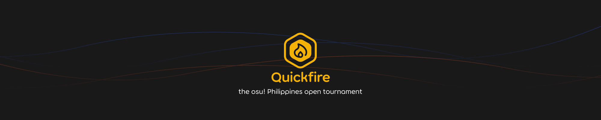

---
tags:
  - oPQS
  - oPQS2022
  - oPQS 2022
---

# osu! Philippines Quickfire Showdown

The **osu! Philippines Quickfire Showdown** (***oPQS***) was a 1v1 single-elimination open tournament held on both days of the [CONQuest PH 2022](https://www.conquestph.com/). As the name of the tournament implies, there were no warmups, and the mappools were revealed on the spot. The osu! Philippines Quickfire Showdown was the first ever osu! LAN tournament in the Philippines.

## Tournament schedule

### 2022-07-23 (day 1)

| Event | Timestamp |
| --: | :-- |
| Registration phase | 10:00 - 13:00 (UTC+08) |
| Round of 16 | 13:00 - 15:00 (UTC+08) |
| Quarterfinals | 15:00 - 16:00 (UTC+08) |
| Semifinals | 16:00 - 17:00 (UTC+08) |
| Finals | 17:00 (UTC+08) |

### 2022-07-24 (day 2)

| Event | Timestamp |
| --: | :-- |
| Registration phase | 10:00 - 13:00 (UTC+08) |
| Round of 16 | 13:00 - 15:00 (UTC+08) |
| Quarterfinals | 15:00 - 16:00 (UTC+08) |
| Semifinals | 16:00 - 17:00 (UTC+08) |
| Finals | 17:00 (UTC+08) |

## Prizes

*Note: The prizes were granted for each day of the tournament.*

| Placing | Prizes |
| :-: | :-- |
|  | Unique profile badge, osu!merch, 14 months of osu!supporter |
|  | osu!merch, 4 months of osu!supporter |
|  | osu!merch, 2 months of osu!supporter |

## Organisation

The osu! Philippines Quickfire Showdown was ran by various community members.

| Position | Member(s) |
| :-- | :-- |
| Host | ::{ flag=PH }:: [Afireee](https://osu.ppy.sh/users/7919913), ::{ flag=PH }:: [Zaphirox](https://osu.ppy.sh/users/2478675), ::{ flag=PH }:: [ToshiroKen](https://osu.ppy.sh/users/9550257) |
| Mappool selector | ::{ flag=PH }:: [Afireee](https://osu.ppy.sh/users/7919913), ::{ flag=PH }:: [ToshiroKen](https://osu.ppy.sh/users/9550257), ::{ flag=PH }:: [xidorn](https://osu.ppy.sh/users/7904667), ::{ flag=PH }:: [konawiki](https://osu.ppy.sh/users/4003979), ::{ flag=FR }:: [Nerowo](https://osu.ppy.sh/users/8642284) |
| Custom mapper | ::{ flag=PH }:: [samosita](https://osu.ppy.sh/users/6090289), ::{ flag=PH }:: [xidorn](https://osu.ppy.sh/users/7904667), ::{ flag=PH }:: [iFinixe](https://osu.ppy.sh/users/10501608), ::{ flag=PH }:: [Onegai](https://osu.ppy.sh/users/11849100) |
| Spreadsheet | ::{ flag=PH }:: [SurfChu85](https://osu.ppy.sh/users/4469895), ::{ flag=PH }:: [topecnz](https://osu.ppy.sh/users/2103927), ::{ flag=PH }:: [-Ichinose](https://osu.ppy.sh/users/12635292), ::{ flag=NL }:: [Albionthegreat](https://osu.ppy.sh/users/9853595) |
| GFX | ::{ flag=PH }:: [hake](https://osu.ppy.sh/users/8111613), ::{ flag=PH }:: [Nitrous](https://osu.ppy.sh/users/7293512), ::{ flag=PH }:: [Capuccino](https://osu.ppy.sh/users/7726605), ::{ flag=PH }:: [topecnz](https://osu.ppy.sh/users/2103927) |
| Production | ::{ flag=PH }:: [Nitrous](https://osu.ppy.sh/users/7293512), ::{ flag=PH }:: [Capuccino](https://osu.ppy.sh/users/7726605), ::{ flag=GB }:: [ilw8](https://osu.ppy.sh/users/14167692), ::{ flag=RU }:: [DeadRote](https://osu.ppy.sh/users/7943969), ::{ flag=PH }:: [topecnz](https://osu.ppy.sh/users/2103927), ::{ flag=PH }:: [-Ichinose](https://osu.ppy.sh/users/12635292), ::{ flag=PH }:: [ToshiroKen](https://osu.ppy.sh/users/9550257), ::{ flag=PH }:: [Sharuru](https://osu.ppy.sh/users/3436126) |
| Streamer | ::{ flag=PH }:: [-Ichinose](https://osu.ppy.sh/users/12635292) |
| On-site commentator | ::{ flag=PH }:: [Nathos](https://osu.ppy.sh/users/5432869), ::{ flag=PH }:: [BronyPH](https://osu.ppy.sh/users/1492995), ::{ flag=PH }:: [Faltri](https://osu.ppy.sh/users/12372097) |
| Off-site commentator | ::{ flag=PH }:: [xidorn](https://osu.ppy.sh/users/7904667), ::{ flag=KR }:: [ToGlette](https://osu.ppy.sh/users/1076236) |
| Referee | ::{ flag=PH }:: [topecnz](https://osu.ppy.sh/users/2103927), ::{ flag=PH }:: [-Ichinose](https://osu.ppy.sh/users/12635292), ::{ flag=PH }:: [-Pekora-](https://osu.ppy.sh/users/17959882), ::{ flag=PH }:: [omaru1](https://osu.ppy.sh/users/18480113), ::{ flag=PH }:: [ShizuVoice](https://osu.ppy.sh/users/9570552) |
| Wiki writer | ::{ flag=PH }:: [topecnz](https://osu.ppy.sh/users/2103927), ::{ flag=PH }:: [Afireee](https://osu.ppy.sh/users/7919913) |

## Links

- [News article](https://osu.ppy.sh/home/news/2022-07-21-osu-philippines-conquest-ph-2022)
- [Challonge brackets (day 1)](https://challonge.com/oPQS_Day1)
- [Challonge brackets (day 2)](https://challonge.com/oPQS_Day2)
- [Facebook group](https://www.facebook.com/groups/officialosuphilippines)
- [Livestream](https://www.twitch.tv/osuliveph)

## Participants

- Day 1
  - ::{ flag=PH }:: [-Hanamaru-](https://osu.ppy.sh/users/11348518)
  - ::{ flag=PH }:: [\[Vik\]](https://osu.ppy.sh/users/5428448)
  - ::{ flag=PH }:: [Buizie](https://osu.ppy.sh/users/4795670)
  - ::{ flag=PH }:: [rexralph1](https://osu.ppy.sh/users/18499824)
  - ::{ flag=PH }:: [Awper](https://osu.ppy.sh/users/7378754)
  - ::{ flag=PH }:: [Autard_Diab](https://osu.ppy.sh/users/14964684)
  - ::{ flag=PH }:: [vincent4399](https://osu.ppy.sh/users/9764388)
  - ::{ flag=PH }:: [2 and eight](https://osu.ppy.sh/users/8923608)
  - ::{ flag=PH }:: [Random328](https://osu.ppy.sh/users/13822589)
  - ::{ flag=PH }:: [Revillica](https://osu.ppy.sh/users/9806095)
  - ::{ flag=PH }:: [Leehi](https://osu.ppy.sh/users/11172033)
  - ::{ flag=PH }:: [MarvelWizardKH](https://osu.ppy.sh/users/5356586)
  - ::{ flag=PH }:: [xXCraigyxD28Xx](https://osu.ppy.sh/users/14916935)
  - ::{ flag=PH }:: [Danimato](https://osu.ppy.sh/users/23541645)
  - ::{ flag=PH }:: [Takow](https://osu.ppy.sh/users/29766556)
  - ::{ flag=PH }:: [NathanSS](https://osu.ppy.sh/users/8500628)
- Day 2
  - ::{ flag=PH }:: [bluezenithgames](https://osu.ppy.sh/users/12681578)
  - ::{ flag=PH }:: [Lunasen_](https://osu.ppy.sh/users/15216246)
  - ::{ flag=PH }:: [Gale Wise](https://osu.ppy.sh/users/23314214)
  - ::{ flag=PH }:: [Dunn](https://osu.ppy.sh/users/7241691)
  - ::{ flag=PH }:: [RnJn](https://osu.ppy.sh/users/11580827)
  - ::{ flag=PH }:: [Chasm](https://osu.ppy.sh/users/11995130)
  - ::{ flag=PH }:: [KanataMyBeloved](https://osu.ppy.sh/users/10888411)
  - ::{ flag=PH }:: [Edison](https://osu.ppy.sh/users/1325159)
  - ::{ flag=PH }:: [OsuSeulgiDragon](https://osu.ppy.sh/users/6073492)
  - ::{ flag=PH }:: [Oooodriiin](https://osu.ppy.sh/users/7223737)
  - ::{ flag=PH }:: [Makir0](https://osu.ppy.sh/users/10407999)
  - ::{ flag=PH }:: [Pillows](https://osu.ppy.sh/users/7851281)
  - ::{ flag=PH }:: [CasualHexagons](https://osu.ppy.sh/users/14104256)
  - ::{ flag=PH }:: [CircIes](https://osu.ppy.sh/users/9930573)
  - ::{ flag=PH }:: [MerpyXD](https://osu.ppy.sh/users/14213060)
  - ::{ flag=PH }:: [mechadoodle](https://osu.ppy.sh/users/16894076)

## Podium

This competition has come to an end and resulted in the following podium:

### 2022-07-23 (day 1)

| Placing | Player |
| :-: | :-- |
|  | ::{ flag=PH }:: [Revillica](https://osu.ppy.sh/users/9806095) |
|  | ::{ flag=PH }:: [rexralph1](https://osu.ppy.sh/users/18499824) |
|  | ::{ flag=PH }:: [xXCraigyxD28Xx](https://osu.ppy.sh/users/14916935) |

### 2022-07-24 (day 2)

| Placing | Player |
| :-: | :-- |
|  | ::{ flag=PH }:: [CircIes](https://osu.ppy.sh/users/9930573) |
|  | ::{ flag=PH }:: [bluezenithgames](https://osu.ppy.sh/users/12681578) |
|  | ::{ flag=PH }:: [RnJn](https://osu.ppy.sh/users/11580827) |

## Mappools (day 1)

### Finals

- NoMod
  1. [LEAF XCEED Music Division - Touch Me Not (samosita) [Malevolence]](https://osu.ppy.sh/beatmapsets/1811504#osu/3715687)
  2. [Xi - Densetsu no Sabori Shinigami ~ Make a quick escape (Toumei Dragon) [Cellina & TD's Collab Extra]](https://osu.ppy.sh/beatmapsets/1621473#osu/3435049)
  3. [Tanchiky - Sanshi Suimei (Lavi) [Haven]](https://osu.ppy.sh/beatmapsets/911085#osu/1901422)
- Hidden
  1. [A.SAKA - Nanatsu Issenzakura (Hollow Wings) [Whirl]](https://osu.ppy.sh/beatmapsets/214138#osu/503262)
- HardRock
  1. [Nekomata Master - Following Flow (Beomsan) [Special]](https://osu.ppy.sh/beatmapsets/511699#osu/1087690)
- DoubleTime
  1. [Perfume - NIGHT FLIGHT (eiri-) [Voyage]](https://osu.ppy.sh/beatmapsets/861719#osu/1802689)
- Forcemods
  1. [Inspector K - Disconnected Hardkore (Lesjuh) [HAX]](https://osu.ppy.sh/beatmapsets/59663#osu/178721)
  2. [Risshuu feat. Choko - Take (yf\_bmp) [Yoshino's Extra]](https://osu.ppy.sh/beatmapsets/1376486#osu/2857448)
- Tiebreaker
  1. **[Cranky - Flugel (Net0) [CMB Collab]](https://osu.ppy.sh/beatmapsets/1280436#osu/2659781)**

### Semifinals

- NoMod
  1. [JIN feat. LiSA - Headphone Actor (Amiya) [Tragic Love Extra]](https://osu.ppy.sh/beatmapsets/936267#osu/1955955)
  2. [xi - Time files (IOException) [Classic Another]](https://osu.ppy.sh/beatmapsets/1685122#osu/3470668)
  3. [8 BALLIN' - KNOW ME (Onegai) [Swagapino Collab (Tournament Ver.)]](https://osu.ppy.sh/beatmapsets/1512310#osu/3096572)
- Hidden
  1. [seiya-murai feat.ALT - Sumidagawa Karenka (kiddly) [Extra]](https://osu.ppy.sh/beatmapsets/28796#osu/96095)
- HardRock
  1. [Cranky - Party 4u "Holy Nite Mix" (avira0922) [Max]](https://osu.ppy.sh/beatmapsets/7205#osu/31279)
- DoubleTime
  1. [Fuki - Kodomo no Youni (Nao Tomori) [Insane]](https://osu.ppy.sh/beatmapsets/1263862#osu/2626985)
- Forcemods
  1. [Frums - Options (Nerova Riuz GX) [Option 5: Default]](https://osu.ppy.sh/beatmapsets/1049855#osu/2194138)
  2. [Susumu Hirasawa - Amor Buffer (Real1) [KIRBY Mix]](https://osu.ppy.sh/beatmapsets/11702#osu/44526)
- Tiebreaker
  1. **[Nanahira - Petals (Kalibe) [Flower]](https://osu.ppy.sh/beatmapsets/592381#osu/1601880)**

### Quarterfinals

- NoMod
  1. [Ayane - FaV -F\*\*\* and Vanguard- (Corinn) [Happiness]](https://osu.ppy.sh/beatmapsets/494460#osu/1052871)
  2. [Thaehan - Doki-Doki (Mr HeliX) [Mecha's Extra]](https://osu.ppy.sh/beatmapsets/519054#osu/1191209)
  3. [NILFRUITS - Ironina (Yugu) [Extra]](https://osu.ppy.sh/beatmapsets/1767671#osu/3621771)
- Hidden
  1. [Shawn Wasabi - LEMONS feat. kennedi (defiance) [lemonade]](https://osu.ppy.sh/beatmapsets/1272023#osu/2643263)
- HardRock
  1. [Cranky - Luvin' You (avira0922) [MAX]](https://osu.ppy.sh/beatmapsets/8923#osu/36134)
- DoubleTime
  1. [Rin - Ayakashi set 12 Another ~ Border of Life (pishifat) [Lunatic]](https://osu.ppy.sh/beatmapsets/1001360#osu/2097074)
- Forcemods
  1. [LeaF - Kyouki Ranbu (toybot) [Cubby's Another]](https://osu.ppy.sh/beatmapsets/1312129#osu/3056025)
  2. [solfa feat. Shimotsuki Haruka - leap in your mind (Dored) [Gust's Hyper]](https://osu.ppy.sh/beatmapsets/911281#osu/1949167)
- Tiebreaker
  1. **[Powerless feat. Sennzai - Unrequited (PandaHero) [Collab Extra]](https://osu.ppy.sh/beatmapsets/1442147#osu/2966612)**

### Round of 16

- NoMod
  1. [Feryquitous feat. Aitsuki Nakuru - Fake (KlaksoncakFish) [Doppelganger]](https://osu.ppy.sh/beatmapsets/1559330#osu/3185179)
  2. [xi - Ascension to Heaven (-Tynamo) [Nagatoro's Insane]](https://osu.ppy.sh/beatmapsets/968656#osu/2061330)
  3. [Silentroom - NULCTRL (Nerova Riuz GX) [Pattern 04a "exINS" Noz]](https://osu.ppy.sh/beatmapsets/917159#osu/2104920)
- Hidden
  1. [Sound Horizon - Arbelge no Tatakai (P_O) [Insane]](https://osu.ppy.sh/beatmapsets/1075671#osu/2383173)
- HardRock
  1. [xi - Zauberkugel (pishifat) [Insane]](https://osu.ppy.sh/beatmapsets/554892#osu/1296762)
- DoubleTime
  1. [seatrus - MONONOKE (Realazy) [Agatsu's Hard]](https://osu.ppy.sh/beatmapsets/1280194#osu/3047818)
- Forcemods
  1. [xi - Parousia (Niva) [Eschatology]](https://osu.ppy.sh/beatmapsets/1672934#osu/3417286)
  2. [HANYUU MAIGO - Onomatope feat. Riria (Alvearia) [Anxiety]](https://osu.ppy.sh/beatmapsets/1799744#osu/3689590)
- Tiebreaker
  1. **[Camellia feat. Nanahira - Kansoku Eisei (jonathanlfj) [Nyquilfj's Extra]](https://osu.ppy.sh/beatmapsets/720294#osu/1806995)**

## Mappools (day 2)

### Finals

- NoMod
  1. [Imy - Countdown (jonathanlfj) [captin's Extra]](https://osu.ppy.sh/beatmapsets/1246683#osu/2593669)
  2. [UI-70 - Mou Uta Shika Kikoenai (Kurashina Asuka) [Expert]](https://osu.ppy.sh/beatmapsets/1537442#osu/3143524)
  3. [aran & lapix - KALACAKLA (Ambrew) [Follow Me Into Reality]](https://osu.ppy.sh/beatmapsets/706771#osu/1494341)
- Hidden
  1. [meganeko - Feral (osu! edit) (Respirte) [Nowa's Extra]](https://osu.ppy.sh/beatmapsets/1204383#osu/2549390)
- HardRock
  1. [Brandy - Cross Time !! (Leader) [captin's Extra]](https://osu.ppy.sh/beatmapsets/973162#osu/2067296)
- DoubleTime
  1. [455-38B - G e n g a o z o - f o o n (ktgster) [Insane]](https://osu.ppy.sh/beatmapsets/869649#osu/1939173)
- Forcemods
  1. [Mitsukasa Ayase (CV: Sawasawa Sawa) - PERFECT GIRL (Deppyforce) [CAPTAIN FLATEARTH]](https://osu.ppy.sh/beatmapsets/1358125#osu/2810600)
  2. [COOL&CREATE - Cirno to Mario no Perfect Sansuu Kyoushitsu (Reiji Maigo) [Extra]](https://osu.ppy.sh/beatmapsets/1563526#osu/3192828)
- Tiebreaker
  1. **[Irodorimidori - Bokura no Freedom DiVE (-Mercury) [FOUR DIMENSIONS]](https://osu.ppy.sh/beatmapsets/1667264#osu/3404280)**

### Semifinals

- NoMod
  1. [Natsume Itsuki - Mayday (SMOKELIND) [EX]](https://osu.ppy.sh/beatmapsets/1506697#osu/3086147)
  2. [xi - Akasha (Jemmmmy) [Extreme]](https://osu.ppy.sh/beatmapsets/118768#osu/433168)
  3. [rejection - Goodbye Goodnight (feat. shully) (osu! edit) (iFinixe) [conQUEST na hanapin sya <3]](https://osu.ppy.sh/beatmapsets/1810988#osu/3714525)
- Hidden
  1. [IOSYS - Power of Dream (Night Fever Refix) (Kite) [Power of Stream]](https://osu.ppy.sh/beatmapsets/27152#osu/91215)
- HardRock
  1. [VINXIS - Facade (Niva) [Insane]](https://osu.ppy.sh/beatmapsets/1001625#osu/2096750)
- DoubleTime
  1. [Sharlo - Vidro Moyou (Sharlo) [Collab]](https://osu.ppy.sh/beatmapsets/139045#osu/347171)
- Forcemods
  1. [UNDEAD CORPORATION - Flowering Night Fever (Alheak) [pishi's Lunatic]](https://osu.ppy.sh/beatmapsets/393663#osu/895806)
  2. [Hiroki Isogai, Ippo Yamada - Abandoned Memory (Dr. Wily Stage 1) (Dada) [DEDEDE Mix]](https://osu.ppy.sh/beatmapsets/1025118#osu/2144135)
- Tiebreaker
  1. **[Yooh - Shigure (pyth0nix) [Lunar Downpour]](https://osu.ppy.sh/beatmapsets/1186689#osu/2473220)**

### Quarterfinals

- NoMod
  1. [Wakeshima Kanon - the BEAST can't BE STOpped (Gelidium) [Frail]](https://osu.ppy.sh/beatmapsets/1243487#osu/2585154)
  2. [LEAF XCEED Music Division - M.U. Ako With Her (Mocaotic) [Expert]](https://osu.ppy.sh/beatmapsets/1234591#osu/2566466)
  3. [Nakanojojo - Bittersweet (feat. Kuishinboakachan a.k.a Kiato) (Mental) [Akitoshi's Bittersweet Extra]](https://osu.ppy.sh/beatmapsets/700384#osu/1482745)
- Hidden
  1. [Amane - BOOZEHOUND (tieff) [Lesjuh]](https://osu.ppy.sh/beatmapsets/9995#osu/39549)
- HardRock
  1. [Wednesday Campanella - Melos (Strinderin) [Run]](https://osu.ppy.sh/beatmapsets/967776#osu/2025224)
- DoubleTime
  1. [t+pazolite - Party in the HOLLOWood feat. Nanahira (eiri-) [HYper]](https://osu.ppy.sh/beatmapsets/819349#osu/1717855)
- Forcemods
  1. [Chicala Lpis - Kaefig (Saturnalize) [kwk's Extra]](https://osu.ppy.sh/beatmapsets/705769#osu/1493143)
  2. [Becky - Less Than Three (Ricardo Autobahn Remix) (Sonnyc) [Expert]](https://osu.ppy.sh/beatmapsets/1078502#osu/2256655)
- Tiebreaker
  1. **[Rita - dorchadas (Delis) [Sharnoth]](https://osu.ppy.sh/beatmapsets/580215#osu/1279490)**

### Round of 16

- NoMod
  1. [solfa feat. Chata - Colorful precious life (lit120) [Yozuku's Extra]](https://osu.ppy.sh/beatmapsets/1640724#osu/3348791)
  2. [HyuN - Infinity Heaven (Niva) [Ad Infinitum]](https://osu.ppy.sh/beatmapsets/891345#osu/1863246)
  3. [REOL - Give me a break Stop now (SnowNiNo\_)[Collab Extra]](https://osu.ppy.sh/beatmapsets/497482#osu/1072777)
- Hidden
  1. [tsunamix_underground - Period. ~ Seishin no Kousoku to Jiyuu o Tsukamu Jouka (TicClick) [Lunatic]](https://osu.ppy.sh/beatmapsets/223092#osu/521280)
- HardRock
  1. [Xi - Majotachi no Butoukai ~ Magus (Kite) [Extra Stage]](https://osu.ppy.sh/beatmapsets/43862#osu/158309)
- DoubleTime
  1. [Street - Hestia (GYGY) [Hard]](https://osu.ppy.sh/beatmapsets/1707295#osu/3547064)
- Forcemods
  1. [Akiyama Uni - The Grimoire of Alice (Hollow Wings) [Lunatic]](https://osu.ppy.sh/beatmapsets/123839#osu/344620)
  2. [HyuN - Wild Card (cococolaco) [Mirash's Insane]](https://osu.ppy.sh/beatmapsets/891334#osu/1863206)
- Tiebreaker
  1. **[DJ Noriken - #The_Relentless_(Modified) (captin1) [Unstoppable]](https://osu.ppy.sh/beatmapsets/331821#osu/734927)**

## Match results

### Day 2

#### Finals

| Player 1 |  |  | Player 2 | Match link |
| --: | :-: | :-: | :-- | :-- |
| bluezenithgames | 1 | 3 | **CircIes** | [#1](https://osu.ppy.sh/community/matches/102521459) |
| **RnJn** | **3** | 2 | OsuSeulgiDragon | [#1](https://osu.ppy.sh/community/matches/102520939) |

#### Semifinals

| Player 1 |  |  | Player 2 | Match link |
| --: | :-: | :-: | :-- | :-- |
| **bluezenithgames** | **3** | 0 | RnJn | [#1](https://osu.ppy.sh/community/matches/102520721) |
| OsuSeulgiDragon | 0 | **3** | **CircIes** | [#1](https://osu.ppy.sh/community/matches/102520372) |

#### Quarterfinals

| Player 1 |  |  | Player 2 | Match link |
| --: | :-: | :-: | :-- | :-- |
| **bluezenithgames** | **2** | 0 | Dunn | [#1](https://osu.ppy.sh/community/matches/102519294) |
| **RnJn** | **2** | 0 | KanataMyBeloved | [#1](https://osu.ppy.sh/community/matches/102519504) |
| **OsuSeulgiDragon** | **2** | 1 | Pillows | [#1](https://osu.ppy.sh/community/matches/102519735) |
| **CircIes** | **2** | 0 | MerpyXD | [#1](https://osu.ppy.sh/community/matches/102519893) |

#### Round of 16

| Player 1 |  |  | Player 2 | Match link |
| --: | :-: | :-: | :-- | :-- |
| **bluezenithgames** | **2** | 1 | Lunasen\_ | [#1](https://osu.ppy.sh/community/matches/102517654) |
| Gale Wise | 0 | **2** | **Dunn** | [#1](https://osu.ppy.sh/community/matches/102517825) |
| **RnJn** | **2** | 0 | Chasm | [#1](https://osu.ppy.sh/community/matches/102518608) |
| **KanataMyBeloved** | **2** | 0 | Edison | [#1](https://osu.ppy.sh/community/matches/102518225 ) |
| **OsuSeulgiDragon** | **2** | 1 | Oooodriiin | [#1](https://osu.ppy.sh/community/matches/102518483) |
| Makir0 | 0 | **2** | **Pillows** | [#1](https://osu.ppy.sh/community/matches/102518974) |
| CasualHexagons | 1 | **2** | **CircIes** | [#1](https://osu.ppy.sh/community/matches/102518936) |
| **MerpyXD** | **2** | 0 | mechadoodle | [#1](https://osu.ppy.sh/community/matches/102519815) |

### Day 1

#### Finals

| Player 1 |  |  | Player 2 | Match link |
| --: | :-: | :-: | :-- | :-- |
| rexralph1 | 0 | **3** | **Revillica** | [#1](https://osu.ppy.sh/community/matches/102495355) |
| Awper | 0 | **3** | **xXCraigyxD28Xx** | [#1](https://osu.ppy.sh/community/matches/102495115) |

#### Semifinals

| Player 1 |  |  | Player 2 | Match link |
| --: | :-: | :-: | :-- | :-- |
| **rexralph1** | **3** | 2 | Awper | [#1](https://osu.ppy.sh/community/matches/102494079) |
| **Revillica** | **3** | 1 | xXCraigyxD28Xx | [#1](https://osu.ppy.sh/community/matches/102494726) |

#### Quarterfinals

| Player 1 |  |  | Player 2 | Match link |
| --: | :-: | :-: | :-- | :-- |
| -Hanamaru- | 0 | **2** | **rexralph1** | [#1](https://osu.ppy.sh/community/matches/102493377) |
| **Awper** | **2** | 0 | 2 and eight | *forfeit* |
| **Revillica** | **2** | 0 | Leehi | [#1](https://osu.ppy.sh/community/matches/102493628) |
| **xXCraigyxD28Xx** | **2** | 0 | NathanSS | [#1](https://osu.ppy.sh/community/matches/102493884) |

#### Round of 16

| Player 1 |  |  | Player 2 | Match link |
| --: | :-: | :-: | :-- | :-- |
| **-Hanamaru-** | **2** | 0 | [Vik] | [#1](https://osu.ppy.sh/community/matches/102490622) |
| Buizie | 0 | **2** | **rexralph1** | [#1](https://osu.ppy.sh/community/matches/102491171) |
| **Awper** | **2** | 1 | Autard_Diab | [#1](https://osu.ppy.sh/community/matches/102491617) |
| vincent4399 | 0 | **2** | **2 and eight** | [#1](https://osu.ppy.sh/community/matches/102492011) |
| Random328 | 0 | **2** | **Revillica** | *forfeit* |
| **Leehi** | **2** | 1 | MarvelWizardKH | [#1](https://osu.ppy.sh/community/matches/102492332) |
| **xXCraigyxD28Xx** | **2** | 1 | Danimato | [#1](https://osu.ppy.sh/community/matches/102492744) |
| Takow | 0 | **2** | **NathanSS** | [#1](https://osu.ppy.sh/community/matches/102492940) |

## Ruleset

- 1v1 Open Rank, 16 Player Single Elimination Tournament, Random Seeding
- All schedules in the tournament are default to Philippine Standard Time (UTC+08)
- All players should be at the venue before their match time, otherwise, they will be given a 10-minute grace period to enter. Failure to do so will issue a WBD on the opponent.
- Round of 16 and Quarterfinals - BO3 / First to Two
- Semifinals and Finals - BO5 / First to Three
- No Warmups
- Single ban per player, Tiebreakers cannot be banned.
- Referee will ask the players to do the “!roll” command. The winner of the !roll command will have the option to either ban first or pick first.
- When a Forcemod has been picked, a player must have at least one mod (either HD or HR) but they are free to use both.
- Freemod is allowed on Tiebreaker.
- Majority of the mappool should contain Featured Artist songs, could be filled with other non-FA songs.
- All mappools will be revealed on the spot.
