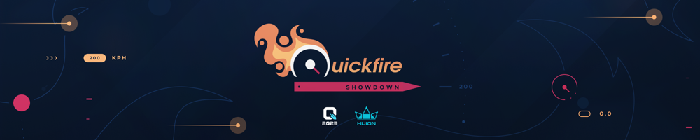

---
tags:
  - oPQS
  - oPQS2023
  - oPQS23
  - oPQS 2023
  - oPQS 23
---

# osu! Philippines Quickfire Showdown 2023

The **osu! Philippines Quickfire Showdown 2023** (***oPQS2023***), also known as **osu! Philippines Quickfire Showdown 2023 Presented by Huion** for sponsorship reasons, was a LAN tournament featuring a *Super Smash Bros.*–styled brawl format first used in the [Benelux Mania Tournament 2023](https://osu.ppy.sh/community/forums/topics/1615365), where each multiplayer room has four players playing each other in a free-for-all (1v1v1v1), held at [CONQuest PH 2023](https://www.conquestph.com/).

## Tournament schedule

| Event | Timestamp |
| --: | :-- |
| Registration phase | 2023-03-28/2023-04-22 |
| Qualifiers | 2023-04-29/2023-05-13 |
| Credentials distribution | 2023-05-07/2023-05-20 |
| Tournament day 1 | 2023-06-02 |
| Tournament day 2 | 2023-06-03 |

## Prizes

*Note: The prizes were granted for each day of the tournament.*

| Placing | Prizes |
| :-: | :-- |
|  | Unique profile badge, osu!merch, 4 months of osu!supporter, Huion tablet |
|  | osu!merch, 2 months of osu!supporter |
|  | osu!merch, 1 month of osu!supporter |

## Organisation

The osu! Philippines Quickfire Showdown 2023 was run by various community members.

| Position | Member(s) |
| :-- | :-- |
| Host | ::{ flag=PH }:: ::topecnz::{ user-id=2103927 }, ::{ flag=PH }:: ::ToshiroKen::{ user-id=9550257 }, ::{ flag=PH }:: ::SurfChu85::{ user-id=4469895 }, ::{ flag=PH }:: ::EnIite::{ user-id=13470730 } |
| Mappool selector | ::{ flag=PH }:: ::xidorn::{ user-id=7904667 }, ::{ flag=PH }:: ::Cohue::{ user-id=12538598 } |
| Custom mapper | ::{ flag=PH }:: ::Anastaxia::{ user-id=5375302 }, ::{ flag=PH }:: ::flake::{ user-id=7627157 }, ::{ flag=PH }:: ::Kyuuchie::{ user-id=11057641 }, ::{ flag=PH }:: ::iFinixe::{ user-id=10501608 }, ::{ flag=PH }:: ::Onegai::{ user-id=11849100 }, ::{ flag=PH }:: ::newton-::{ user-id=5875419 }, ::{ flag=PH }:: ::Amateurre::{ user-id=7326908 } |
| Playtester | ::{ flag=PH }:: ::ToshiroKen::{ user-id=9550257 }, ::{ flag=PH }:: ::GADO::{ user-id=1519847 }, ::{ flag=US }:: ::SilenceSuzuka::{ user-id=7249644 }, ::{ flag=SA }:: ::-Peachii::{ user-id=9683186 }, ::{ flag=PH }:: ::xX\1MusicMan\1Xx::{ user-id=5718989 }, ::{ flag=PH }:: ::Hinatsuru Ai::{ user-id=10442993 }, ::{ flag=PH }:: ::zonelouise::{ user-id=1492995 } |
| Spreadsheet manager | ::{ flag=PH }:: ::SurfChu85::{ user-id=4469895 }, ::{ flag=NL }:: ::Albionthegreat::{ user-id=9853595 }, ::{ flag=HK }:: ::ShadeCegLgMn::{ user-id=12609866 } |
| Graphic designer | ::{ flag=PH }:: ::FLCammo::{ user-id=18789292 }, ::{ flag=PH }:: ::mjk::{ user-id=19607673 }, ::{ flag=PH }:: ::muffleberry::{ user-id=8978259 }, ::{ flag=PH }:: ::KouMyMommy::{ user-id=23541645 }, ::{ flag=PH }:: ::Miyazumi::{ user-id=7991329 }, ::{ flag=PH }:: ::Inflique::{ user-id=13865585 }, ::{ flag=PH }:: ::Nitrous::{ user-id=7293512 } |
| Stream operator | ::{ flag=PH }:: ::Sharuru::{ user-id=3436126 }, ::{ flag=PH }:: ::-Ichinose::{ user-id=12635292 }, ::{ flag=PH }:: ::Nitrous::{ user-id=7293512 } |
| Commentator | ::{ flag=PH }:: ::SurfChu85::{ user-id=4469895 }, ::{ flag=PH }:: ::EnIilte::{ user-id=13470730 }, ::{ flag=PH }:: ::Miyazumi::{ user-id=7991329 }, ::{ flag=PH }:: ::lenpai::{ user-id=5314573 }, ::{ flag=PH }:: ::Toadette::{ user-id=11517895 }, ::{ flag=PH }:: ::fafa::{ user-id=12372097 }, ::{ flag=PH }:: ::zonelouise::{ user-id=1492995 }, ::{ flag=PH }:: ::Nathos::{ user-id=4785223 }, ::{ flag=PH }:: ::Kageno::{ user-id=7246165 }, ::{ flag=PH }:: ::Zaphirox::{ user-id=2478675 }, ::{ flag=PH }:: ::yukina meng::{ user-id=9919550 } |
| Referee | ::{ flag=PH }:: ::SurfChu85::{ user-id=4469895 }, ::{ flag=PH }:: ::-Ichinose::{ user-id=12635292 }, ::{ flag=PH }:: ::ToshiroKen::{ user-id=9550257 }, ::{ flag=PH }:: ::IDan24::{ user-id=11730796 }, ::{ flag=PH }:: ::lenpai::{ user-id=5314573 }, ::{ flag=PH }:: ::Flakens::{ user-id=13583261 }, ::{ flag=PH }:: ::Toadette::{ user-id=11517895 }, ::{ flag=PH }:: ::arccat::{ user-id=4848294 }, ::{ flag=PH }:: ::Ciirno::{ user-id=4189963 }, ::{ flag=PH }:: ::zaynaku::{ user-id=5439033 }, ::{ flag=PH }:: ::-Hanamaru-::{ user-id=11348518 }, ::{ flag=PH }:: ::-PeKoRa-::{ user-id=17959882 }, ::{ flag=PH }:: ::Komi Shouko::{ user-id=12117146 }, ::{ flag=PH }:: ::-Oblivion::{ user-id=18810732 }, ::{ flag=PH }:: ::Sam1Ko::{ user-id=24435526 } |
| Programmer | ::{ flag=PH }:: ::Nitrous::{ user-id=7293512 }, ::{ flag=NL }:: ::DannyPX::{ user-id=11253722 }, ::{ flag=RU }:: ::DeadRote::{ user-id=7943969 } |
| Wiki writer | ::{ flag=PH }:: ::topecnz::{ user-id=2103927 } |

## Links

- [Announcement news post](https://osu.ppy.sh/home/news/2023-05-29-osu-philippines-conquest-festival-2023)
- [Facebook group](https://www.facebook.com/groups/officialosuphilippines)
- [Livestream](https://www.twitch.tv/osuliveph)

## Participants

- Day 1
  - Confirmed
    - ::{ flag=PH }:: ::Impowster::{ user-id=13484596 }
    - ::{ flag=PH }:: ::rwnd\1::{ user-id=14916935 }
    - ::{ flag=PH }:: ::CircIes::{ user-id=9930573 }
    - ::{ flag=PH }:: ::xjfn::{ user-id=9326546 }
    - ::{ flag=PH }:: ::Desmond823::{ user-id=14582737 }
    - ::{ flag=PH }:: ::fixedbyglue::{ user-id=8296269 }
    - ::{ flag=PH }:: ::rexralph1::{ user-id=18499824 }
    - ::{ flag=PH }:: ::Nyashwa::{ user-id=9834366 }
    - ::{ flag=PH }:: ::Geanyl::{ user-id=10038631 }
    - ::{ flag=PH }:: ::Buizie::{ user-id=4795670 }
- Day 2
  - Confirmed
    - ::{ flag=PH }:: ::NathanRam1918::{ user-id=4734703 }
    - ::{ flag=PH }:: ::Yukixo::{ user-id=17847877 }
    - ::{ flag=PH }:: ::LordGabriel::{ user-id=9227895 }
    - ::{ flag=PH }:: ::Miggie::{ user-id=12028437 }
    - ::{ flag=PH }:: ::-Myhra::{ user-id=2558163 }
    - ::{ flag=PH }:: ::Lunasen\1::{ user-id=15216246 }
    - ::{ flag=PH }:: ::Segawa Emi::{ user-id=11865009 }
    - ::{ flag=PH }:: ::bluezenithgames::{ user-id=12681578 }
    - ::{ flag=PH }:: ::OsuSeulgiDragon::{ user-id=6073492 }
    - ::{ flag=PH }:: ::Blasy::{ user-id=15317621 }
    - ::{ flag=PH }:: ::Kexrus::{ user-id=12634710 }
    - ::{ flag=PH }:: ::okirema::{ user-id=12544805 }
    - ::{ flag=PH }:: ::Ravel::{ user-id=15902214 }
    - ::{ flag=PH }:: ::Dunn::{ user-id=7241691 }
    - ::{ flag=PH }:: ::T-Spin-Double::{ user-id=8249051 }
    - ::{ flag=PH }:: ::CasualHexagons::{ user-id=14104256 }
  - Substitute
    - ::{ flag=PH }:: ::Hetzer357::{ user-id=22690359 }
    - ::{ flag=PH }:: ::Tsk::{ user-id=14389528 }
    - ::{ flag=PH }:: ::FiddleMinger::{ user-id=10300115 }
    - ::{ flag=PH }:: ::Tonskiii::{ user-id=11958707 }

## Podium

This competition has come to an end and resulted in the following podium:

### 2023-06-02 (day 1)

| Placing | Player |
| :-: | :-- |
|  | ::{ flag=PH }:: ::Impowster::{ user-id=13484596 } |
|  | ::{ flag=PH }:: ::CircIes::{ user-id=9930573 } |
|  | ::{ flag=PH }:: ::fixedbyglue::{ user-id=8296269 } |

### 2023-06-03 (day 2)

| Placing | Player |
| :-: | :-- |
|  | ::{ flag=PH }:: ::NathanRam1918::{ user-id=4734703 } |
|  | ::{ flag=PH }:: ::Miggie::{ user-id=12028437 } |
|  | ::{ flag=PH }:: ::Lunasen\1::{ user-id=15216246 } |

## Mappools

### Finals

- No Mod
  1. [25-ji, Nightcord de. x Kagamine Len - Bug [Guruguru]](https://osu.ppy.sh/beatmapsets/1997245#osu/4151115)
  2. [Team Grimoire - Dantalion [Conflict]](https://osu.ppy.sh/beatmapsets/1622117#osu/3311891)
  3. [Shiggy Jr. - Oteage Psychics [Extra!!]](https://osu.ppy.sh/beatmapsets/1997246#osu/4151120)
  4. [N2 - NULL APOPHENIA [conQUEST failed kasi di ko siya nahanap]](https://osu.ppy.sh/beatmapsets/1995015#osu/4146045)
  5. [MisoilePunch - Mesheer [Divine]](https://osu.ppy.sh/beatmapsets/1824319#osu/3743383)
  6. [xi feat. Sta - Tiferet [Another]](https://osu.ppy.sh/beatmapsets/714225#osu/1509637)
  7. [Plutian - Until the Blue Moon Rises [Special]](https://osu.ppy.sh/beatmapsets/995205#osu/2081848)
- Hidden
  1. [Morimori Atsushi - Txxs or get the fxxk out!! [Delis' Extra]](https://osu.ppy.sh/beatmapsets/1686490#osu/3447527)
  2. [Marmalade butcher - Noxious [Morri's Hidden Expert]](https://osu.ppy.sh/beatmapsets/1638116#osu/3356020)
  3. [Toromaru - Formless Canvas [Panda & elicz1's Expert]](https://osu.ppy.sh/beatmapsets/1727694#osu/3531367)
  4. [Frums - theyaremanycolors [s0m3xtra]](https://osu.ppy.sh/beatmapsets/1533352#osu/4052461)
- Hard Rock
  1. [Rita - dorchadas [Luscent's extra]](https://osu.ppy.sh/beatmapsets/1673436#osu/3489482)
  2. [SHIKI - Pure Ruby [Another]](https://osu.ppy.sh/beatmapsets/39325#osu/125448)
  3. [Mili - String Theocracy [May you find your book in this place. (quickfire HR)]](https://osu.ppy.sh/beatmapsets/1995919#osu/4148070)
  4. [James Landino - Hide And Seek [Extra]](https://osu.ppy.sh/beatmapsets/972932#osu/2036902)
- Double Time
  1. [ClariS - Hitorigoto -TV MIX- [Little's Insane]](https://osu.ppy.sh/beatmapsets/596704#osu/1264763)
  2. [ChomuP - Gate of Steiner [Insane]](https://osu.ppy.sh/beatmapsets/48941#osu/157886)
  3. [raito - Blood Drain -Again- [Knight's Insane]](https://osu.ppy.sh/beatmapsets/1152554#osu/2430721)
  4. [Mitsukiyo - Luminous Memory [Insane]](https://osu.ppy.sh/beatmapsets/1796025#osu/3684847)
- Tiebreaker
  1. **[Studio EIM - Gebura 1-3 [The Red Mist]](https://osu.ppy.sh/beatmapsets/1995931#osu/4148086)**

### Semifinals

- No Mod
  1. [25-ji, Nightcord de. x Kagamine Len - Bug [Guruguru]](https://osu.ppy.sh/beatmapsets/1997245#osu/4151115)
  2. [Mitsukiyo - Theme 91 [freeuma]](https://osu.ppy.sh/beatmapsets/1884138#osu/3879314)
  3. [Shiggy Jr. - Oteage Psychics [Extra!!]](https://osu.ppy.sh/beatmapsets/1997246#osu/4151120)
  4. [NAYEON - LOVE COUNTDOWN (Feat. Wonstein) [ConQuest na nahanap ko na siya]](https://osu.ppy.sh/beatmapsets/1997336#osu/4151384)
  5. [MisoilePunch - Mesheer [Divine]](https://osu.ppy.sh/beatmapsets/1824319#osu/3743383)
  6. [Risshuu feat. Choko - Take [Yoshino's Extra]](https://osu.ppy.sh/beatmapsets/1376486#osu/2857448)
  7. [TSUNKU - Ringside Perfect Version [ee]](https://osu.ppy.sh/beatmapsets/1219178#osu/2536511)
- Hidden
  1. [BUTAOTOME - Gensou no Satellite [Extra]](https://osu.ppy.sh/beatmapsets/982405#osu/2056031)
  2. [Marmalade butcher - Noxious [Morri's Hidden Expert]](https://osu.ppy.sh/beatmapsets/1638116#osu/3356020)
  3. [P4koo - Crystal Illusion [Ultra]](https://osu.ppy.sh/beatmapsets/797393#osu/1674629)
  4. [Frums - theyaremanycolors [s0m3xtra]](https://osu.ppy.sh/beatmapsets/1533352#osu/4052461)
- Hard Rock
  1. [Rita - dorchadas [Luscent's extra]](https://osu.ppy.sh/beatmapsets/1673436#osu/3489482)
  2. [Hioka Natsumi & Yasumoto Hiroki feat. Kumaide-mura no Minasan - KUMAMIKO DANCING (TV Size) [Zero's Insane]](https://osu.ppy.sh/beatmapsets/441668#osu/950964)
  3. [Mili - String Theocracy [May you find your book in this place. (quickfire HR)]](https://osu.ppy.sh/beatmapsets/1995919#osu/4148070)
  4. [James Landino - Hide And Seek [Extra]](https://osu.ppy.sh/beatmapsets/972932#osu/2036902)
- Double Time
  1. [ClariS - Hitorigoto -TV MIX- [Little's Insane]](https://osu.ppy.sh/beatmapsets/596704#osu/1264763)
  2. [ChomuP - Gate of Steiner [Insane]](https://osu.ppy.sh/beatmapsets/48941#osu/157886)
  3. [raito - Blood Drain -Again- [Knight's Insane]](https://osu.ppy.sh/beatmapsets/1152554#osu/2430721)
  4. [James Landino - Reaction feat. Slyleaf [Milan-'s Insane]](https://osu.ppy.sh/beatmapsets/972816#osu/2036668)
- Tiebreaker
  1. **[Dirty Loops & Cory Wong - Follow The Light [Racing to the Stars]](https://osu.ppy.sh/beatmapsets/1582334#osu/3231534)**

### Round of 16

- No Mod
  1. [Twin-Tails - Twintail Dreamer! (TV Size) [Baka's Twintail Extra]](https://osu.ppy.sh/beatmapsets/1115213#osu/2331868)
  2. [Mitsukiyo - Theme 91 [freeuma]](https://osu.ppy.sh/beatmapsets/1884138#osu/3879314)
  3. [Tarako - Bing Chilling-ish [My Angel Jeremy's Social Credit Grind]](https://osu.ppy.sh/beatmapsets/1820912#osu/3736423)
  4. [NAYEON - LOVE COUNTDOWN (Feat. Wonstein) [ConQuest na nahanap ko na siya]](https://osu.ppy.sh/beatmapsets/1997336#osu/4151384)
  5. [Gram - Nibelungen [lungaspeeding]](https://osu.ppy.sh/beatmapsets/1783116#osu/3651733)
  6. [Risshuu feat. Choko - Take [Yoshino's Extra]](https://osu.ppy.sh/beatmapsets/1376486#osu/2857448)
  7. [TSUNKU - Ringside Perfect Version [ee]](https://osu.ppy.sh/beatmapsets/1219178#osu/2536511)
- Hidden
  1. [BUTAOTOME - Gensou no Satellite [Extra]](https://osu.ppy.sh/beatmapsets/982405#osu/2056031)
  2. [sasakure.UK - Jack-the-Ripper [ReMiX]](https://osu.ppy.sh/beatmapsets/23907#osu/94264)
  3. [P4koo - Crystal Illusion [Ultra]](https://osu.ppy.sh/beatmapsets/797393#osu/1674629)
  4. [EmoCo. - This Club is Not 4 U [#5: Yugu's Extra]](https://osu.ppy.sh/beatmapsets/1282123#osu/2663020)
- Hard Rock
  1. [kessoku band - Seishun Complex (TV Size) [the outside world is not for me]](https://osu.ppy.sh/beatmapsets/1886769#osu/3885326)
  2. [Hioka Natsumi & Yasumoto Hiroki feat. Kumaide-mura no Minasan - KUMAMIKO DANCING (TV Size) [Zero's Insane]](https://osu.ppy.sh/beatmapsets/441668#osu/950964)
  3. [cYsmix - triangles [Chaoz's Expert]](https://osu.ppy.sh/beatmapsets/1841885#osu/3783209)
  4. [Warak - Slow Motion (feat. DongGeyoung) [DeviousPanda's Expert]](https://osu.ppy.sh/beatmapsets/1014716#osu/2155904)
- Double Time
  1. [Amatsuki - DORAEMON [Insane]](https://osu.ppy.sh/beatmapsets/853519#osu/1783814)
  2. [Sound Souler - Eternalism 2 [Gibune's Insane]](https://osu.ppy.sh/beatmapsets/1299190#osu/2694599)
  3. [mafumafu - Kakushigoto [NiNo's Light Insane.]](https://osu.ppy.sh/beatmapsets/770023#osu/1618984)
  4. [James Landino - Reaction feat. Slyleaf [Milan-'s Insane]](https://osu.ppy.sh/beatmapsets/972816#osu/2036668)
- Tiebeaker
  1. **[Amatsuki - Chiisana Koi no Uta [Together]](https://osu.ppy.sh/beatmapsets/534788#osu/1169701)**

### Qualifiers

- No Mod
  1. [PassCode - ATLAS (Nao Tomori) [Collab Transcendence]](https://osu.ppy.sh/beatmapsets/1385282#osu/2861782)
  2. [69 de 74 - Grievous Fate (LeCandy) [candy]](https://osu.ppy.sh/beatmapsets/1948450#osu/4032765)
  3. [Yousei Teikoku - Naikan Uchuu Shisha no Yurikago (IsomirDiAngelo) [Atalanta's Extra]](https://osu.ppy.sh/beatmapsets/1306595#osu/3356229)
  4. [VeetaCrush & ProjectG - glacier's poetry (JeZag) [insurmountable]](https://osu.ppy.sh/beatmapsets/1739433#osu/3555094)
- Hidden
  1. [eicateve - R.I.P. (Firika) [Heaven]](https://osu.ppy.sh/beatmapsets/1103441#osu/2305272)
  2. [inabakumori - Tokoshizume (xyperX) [Mahiru's Expert]](https://osu.ppy.sh/beatmapsets/1777533#osu/3674557)
- Hard Rock
  1. [Powerless - Soleil (Lince Cosmico) [Reluisant Collaboration]](https://osu.ppy.sh/beatmapsets/773708#osu/2008757)
  2. [Sound Souler - Bubble Flower (hypercyte) [Expert]](https://osu.ppy.sh/beatmapsets/1152177#osu/2404822)
- Double Time
  1. [Eri Sasaki - Gate of Steiner (xbopost) [Milky-way Crossing]](https://osu.ppy.sh/beatmapsets/1010752#osu/2115799)
  2. [Eleharmonica remixed by kors k - Der Wald (kors k Remix) (Cheesecake) [mithew's Light Insane]](https://osu.ppy.sh/beatmapsets/581787#osu/1478254)

## Match results

### Day 2

#### Finals

| Player 1 | Player 2 | Player 3 | Player 4 | Score | Match link |
| :-- | :-- | :-- | :-- | :-- | :-- |
| **NathanRam1918** | Yukixo | Lunasen_ | Miggie | **47** - 14 - 24 - 27 | [#1](https://osu.ppy.sh/community/matches/108812832) |

#### Semifinals

| Player 1 | Player 2 | Player 3 | Player 4 | Score | Match link |
| :-- | :-- | :-- | :-- | :-- | :-- |
| bluezenithgames | **Miggie** | Blasy | **Lunasen_** | 15 - **40** - 13 - **44** | [#1](https://osu.ppy.sh/community/matches/108812353) |
| **NathanRam1918** | -Myhra | **Yukixo** | Kexrus | **45** - 28 - **28** - 11 | [#1](https://osu.ppy.sh/community/matches/108811580) |

#### Quarterfinals

| Player 1 | Player 2 | Player 3 | Player 4 | Score | Match link |
| :-- | :-- | :-- | :-- | :-- | :-- |
| LordGabriel | Dunn | **Lunasen_** | **Kexrus** | 25 - 11 - **43** - **33** | [#1](https://osu.ppy.sh/community/matches/108810865) |
| **Yukixo** | T-Spin-Double | Segawa Emi | **Blasy** | **41** - 8 - 28 - **35** | [#1](https://osu.ppy.sh/community/matches/108810838) |
| **Miggie** | Ravel | **-Myhra** | okirema | **53** - 11 - **29** - 19 | [#1](https://osu.ppy.sh/community/matches/108809950) |
| **NathanRam1918** | CasualHexagons | **bluezenithgames** | OsuSeulgiDragon | **56** - 10 - **28** - 18 | [#1](https://osu.ppy.sh/community/matches/108809952) |

### Day 1

#### Finals

| Player 1 | Player 2 | Player 3 | Player 4 | Score | Match link |
| :-- | :-- | :-- | :-- | :-- | :-- |
| **Impowster** | rwnd_ | CircIes | fixedbyglue | **44** - 16 - 34 - 18 | [#1](https://osu.ppy.sh/community/matches/108794487) |

#### Semifinals

| Player 1 | Player 2 | Player 3 | Player 4 | Score | Match link |
| :-- | :-- | :-- | :-- | :-- | :-- |
| **CircIes** | xjfn | **fixedbyglue** | rexralph1 | **53** - 19 - **27** - 13 | [#1](https://osu.ppy.sh/community/matches/108793846) |
| **Impowster** | **rwnd_** | Desmond823 | Nyashwa | **47** - **38** - 13 - 14 | [#1](https://osu.ppy.sh/community/matches/108793043) |

#### Quarterfinals

| Player 1 | Player 2 | Player 3 | Player 4 | Score | Match link |
| :-- | :-- | :-- | :-- | :-- | :-- |
| **rexralph1** | **Nyashwa** | Geanyl | Buizie | **39** - **34** - 27 - 12 | [#1](https://osu.ppy.sh/community/matches/108792396) |

## Ruleset

The full tournament ruleset can be found on the [Quickfire Showdown tournament handbook](https://up.topec.nz/OPQS_2023_Handbook.pdf).

### Tournament format

- The tournament format is free-for-all (1v1v1v1).
- All maps in the mappool are set to be played in a predetermined order with the tiebreaker being played last.
- Each player will be allocated points depending on their standing on each map, with the top two players advancing to the next round.
- Matches will continue as a single-elimination bracket until there are four players left in the Finals. The player with the most points in the Finals will be declared champion.
- Prior to the live LAN tournament specified in this format, a pre-qualification phase is to be conducted weeks prior to the event.
- They must be rank #99,999 or above by the end of registration, adjusted via a badge weighting system.

### Mappool structure

The star rating of the mappool ranges from 6.0–6.4 stars. Note that the star rating of the tiebreaker will be a bit higher than the given range.

#### Pre-qualification phase

The Qualifier mappool will be composed of 10 maps. The structured is specified as follows:

| Mappool bracket | Maps |
| :-- | :-- |
| No Mod (NM) | 4 |
| Hidden (HD) | 2 |
| Hard Rock (HR) | 2 |
| Double Time (DT) | 2 |

#### Main tournament

The mappool is structured to have 20 maps, one of which is dedicated as a tiebreaker. For every round, 10 of the 20 maps will be replaced. The tiebreaker will change every round, meaning the remaining 9 replacements are from the regular picks.

The pool structure for the tournament is specified below:

| Mappool bracket | Maps |
| :-- | :-- |
| No Mod (NM) | 7 |
| Hidden (HD) | 4 |
| Hard Rock (HR) | 4 |
| Double Time (DT) | 4 |
| Tiebreaker (TB) | 1 |

### Match instructions

- The players should be set up within 10 minutes before the match starts.
- There are no warm-ups.
- All players are to use the `!roll` command. The order of the bans and picks for each player is decided by the result of the rolls, with the highest roll being player 1 and the lowest player 4:
  - Player 4 bans, player 3 bans, player 2 bans, player 1 bans.
  - Player 1 picks, player 2 picks, player 3 picks, player 4 picks.
  - Player 1 picks, player 2 picks, player 3 picks, player 4 picks.
  - Therfore each player has 1 ban and 2 picks.
- In the case of a multiplayer room that lacks a player, the off-site referee will randomly (using `!roll`) ban and select maps. The point distribution will not change.
- 8 maps will be played (2 picks by each player) and 1 tiebreaker.
- The tiebreaker will always be played after all 8 maps have been played.
- Mod usages are stipulated in the mappool, but in general, No Fail (NF) is forced for all matches.
