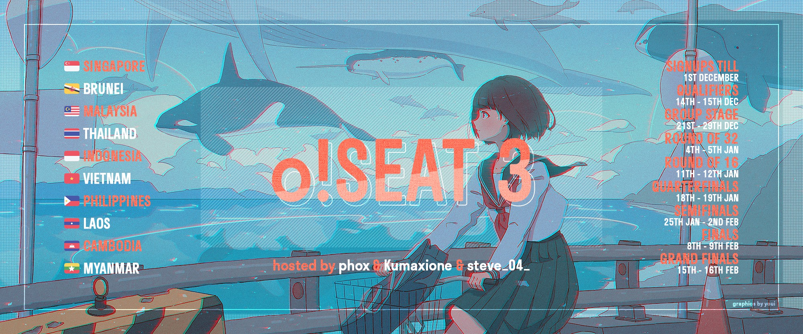
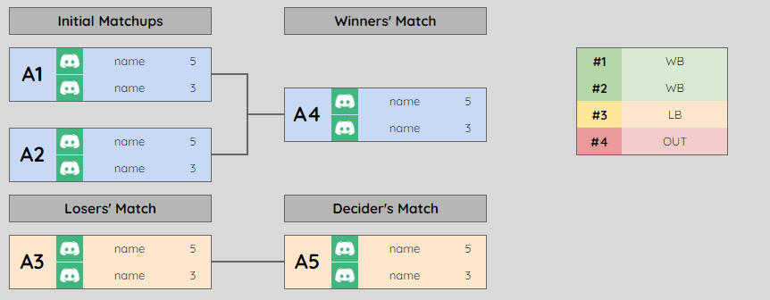
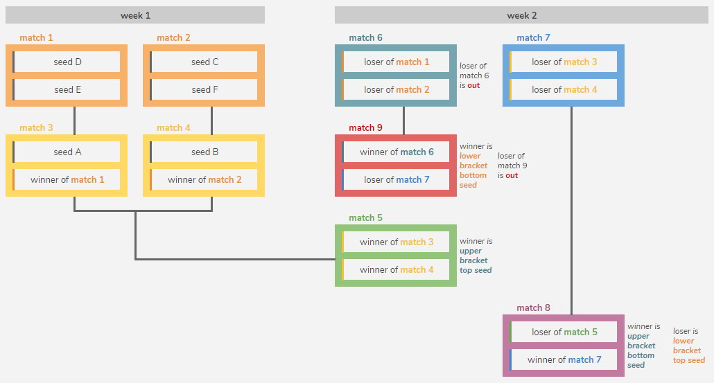

---
tags:
  - oSEAT
  - oSEAT3
---

# osu! South East Asia Tournament 3

The **osu! South East Asia Tournament 3** (***oSEAT3***) was a South East Asian double-elimination one-on-one osu! tournament hosted by ::{ flag=MY }:: [Kumaxione](https://osu.ppy.sh/users/2582531), ::{ flag=SG }:: [phox](https://osu.ppy.sh/users/772295), and ::{ flag=VN }:: [steve\_04\_](https://osu.ppy.sh/users/10852911). It was the third instalment of the osu! South East Asia Tournament.

## Tournament schedule

| Event | Timestamp |
| --: | :-- |
| Registration phase | 2019-10-27/2020-12-01 |
| Live drawings | 2019-12-01 (21:00 UTC+8) |
| Qualifiers | 2019-12-14/2019-12-15 |
| Group stage | 2019-12-17/2020-01-01 |
| Round of 32 | 2020-01-02/2020-01-05 |
| Round of 16 | 2020-01-11/2020-01-12 |
| Quarterfinals | 2020-01-15/2020-01-20 |
| Semifinals | 2020-01-26/2020-02-02 |
| Finals | 2020-02-08/2020-02-09 |
| Grand Finals | 2020-02-16 |

## Prizes

| Placing | Prize(s) |
| :-: | :-- |
|  | Unique profile badge, 1 year of osu!supporter |
|  | 6 months of osu!supporter |
|  | 4 months of osu!supporter |
| *4th place* | 2 months of osu!supporter |
| *5th place* | 1 month of osu!supporter |

*Note: 5th place was determined by a playoff.*

## Organisation

The osu! South East Asia 3 was run by various community members.

| Position | Member(s) |
| :-- | :-- |
| Manager | ::{ flag=MY }:: [Kumaxione](https://osu.ppy.sh/users/2582531), ::{ flag=SG }:: [phox](https://osu.ppy.sh/users/772295), ::{ flag=VN }:: [steve\_04\_](https://osu.ppy.sh/users/10852911) |
| Mappool selector | ::{ flag=MY }:: [Kumaxione](https://osu.ppy.sh/users/2582531), ::{ flag=SG }:: [Loslite](https://osu.ppy.sh/users/6398160), ::{ flag=SG }:: [phox](https://osu.ppy.sh/users/772295), ::{ flag=TH }:: [Seaweed](https://osu.ppy.sh/users/5151214), ::{ flag=SG }:: [SeeL](https://osu.ppy.sh/users/5104320) |
| Referee | ::{ flag=VN }:: [- Rem -](https://osu.ppy.sh/users/10489063), ::{ flag=PH }:: [-Hanamaru-](https://osu.ppy.sh/users/11348518), ::{ flag=US }:: [ChillierPear](https://osu.ppy.sh/users/9501251), ::{ flag=DE }:: [GDLenny](https://osu.ppy.sh/users/8406711), ::{ flag=SG }:: [Heresy](https://osu.ppy.sh/users/8876938), ::{ flag=PL }:: [Houtarou Oreki](https://osu.ppy.sh/users/4185566), ::{ flag=MY }:: [Iyouka](https://osu.ppy.sh/users/7138499), ::{ flag=MY }:: [Kumaxione](https://osu.ppy.sh/users/2582531), ::{ flag=VN }:: [LOLEnigMatic](https://osu.ppy.sh/users/13571949), ::{ flag=SG }:: [phox](https://osu.ppy.sh/users/772295), ::{ flag=VN }:: [steve\_04\_](https://osu.ppy.sh/users/10852911), ::{ flag=US }:: [Suicune3](https://osu.ppy.sh/users/6895187), ::{ flag=VN }:: [Vespulaz](https://osu.ppy.sh/users/10848857), ::{ flag=US }:: [Yeong Yuseong](https://osu.ppy.sh/users/8926244) |
| Streamer | ::{ flag=ID }:: [Fre](https://osu.ppy.sh/users/3484548), ::{ flag=ID }:: [Skydiver](https://osu.ppy.sh/users/4750008) |
| Commentator | ::{ flag=ID }:: [Fre](https://osu.ppy.sh/users/3484548), ::{ flag=VN }:: [Hoaq](https://osu.ppy.sh/users/7696512), ::{ flag=ID }:: [Skydiver](https://osu.ppy.sh/users/4750008) |
| Designer | ::{ flag=SG }:: [youi](https://osu.ppy.sh/users/7537133) |
| Statistician | ::{ flag=VN }:: [steve\_04\_](https://osu.ppy.sh/users/10852911) |
| Wiki editor | ::{ flag=ID }:: [fajar13k](https://osu.ppy.sh/users/7100002) |

## Links

- [Discussion thread](https://osu.ppy.sh/community/forums/topics/978343)
- [oSEAT Discord server](https://discord.gg/sVHndPU)
- [Livestream](https://www.twitch.tv/oseatournament)
- [Challonge brackets](https://challonge.com/SEAT3)
- **[Statistics sheet](https://docs.google.com/spreadsheets/d/1waGkj7eW1oNKF4itjLrNbk0dCviPlXfjw70l0a1U_AA/edit?usp=sharing)**

## Participants

| Seed | Members |
| :-- | :-- |
| Top | ::{ flag=ID }:: [Skydiver](https://osu.ppy.sh/users/4750008), ::{ flag=SG }:: [GSBlank](https://osu.ppy.sh/users/2312106), ::{ flag=PH }:: [MioMilo](https://osu.ppy.sh/users/2199427), ::{ flag=ID }:: [Rexeez](https://osu.ppy.sh/users/1987591), ::{ flag=SG }:: [Raindrop](https://osu.ppy.sh/users/1155871), ::{ flag=MY }:: [Tzero](https://osu.ppy.sh/users/6088976), ::{ flag=SG }:: [k\_1tty](https://osu.ppy.sh/users/5407620), ::{ flag=PH }:: [konawiki](https://osu.ppy.sh/users/4003979), ::{ flag=SG }:: [Rtyzen](https://osu.ppy.sh/users/2439822), ::{ flag=SG }:: [Rtzero](https://osu.ppy.sh/users/9262462), ::{ flag=VN }:: [Shironi](https://osu.ppy.sh/users/8660120), ::{ flag=MY }:: [ShaneLiang](https://osu.ppy.sh/users/6716499), ::{ flag=SG }:: [moosepi](https://osu.ppy.sh/users/1868745), ::{ flag=VN }:: [Tuon](https://osu.ppy.sh/users/6673790), ::{ flag=ID }:: [Fuma](https://osu.ppy.sh/users/1501956), ::{ flag=ID }:: [Fre](https://osu.ppy.sh/users/3484548) |
| High | ::{ flag=PH }:: [xX\_MusicMan\_Xx](https://osu.ppy.sh/users/5718989), ::{ flag=ID }:: [Gatyaa420](https://osu.ppy.sh/users/984132), ::{ flag=MY }:: [Zygody](https://osu.ppy.sh/users/3677251), ::{ flag=MY }:: [Zeph2003](https://osu.ppy.sh/users/10343292), ::{ flag=ID }:: [Ascaveth](https://osu.ppy.sh/users/3245206), ::{ flag=TH }:: [UltimaticCatz](https://osu.ppy.sh/users/6068543), ::{ flag=TH }:: [Chorus](https://osu.ppy.sh/users/3504692), ::{ flag=MY }:: [Sano](https://osu.ppy.sh/users/9195856), ::{ flag=VN }:: [Hoaq](https://osu.ppy.sh/users/7696512), ::{ flag=ID }:: [F4UZ4N](https://osu.ppy.sh/users/11070577), ::{ flag=MY }:: [vernonlim](https://osu.ppy.sh/users/10167542), ::{ flag=ID }:: [Kirinagi](https://osu.ppy.sh/users/5937545), ::{ flag=MY }:: [squidstain](https://osu.ppy.sh/users/11073207), ::{ flag=TH }:: [Deppyforce](https://osu.ppy.sh/users/5286213), ::{ flag=SG }:: [woahsia](https://osu.ppy.sh/users/195946), ::{ flag=TH }:: [-- Arata --](https://osu.ppy.sh/users/13267213) |
| Middle high | ::{ flag=VN }:: [realshin](https://osu.ppy.sh/users/8006029), ::{ flag=SG }:: [Moltenfury](https://osu.ppy.sh/users/3395820), ::{ flag=VN }:: [sindes19](https://osu.ppy.sh/users/11021073), ::{ flag=MY }:: [Auxuelus](https://osu.ppy.sh/users/5414124), ::{ flag=MY }:: [MilkyCoffee-](https://osu.ppy.sh/users/7673764), ::{ flag=SE }:: [ExLuck](https://osu.ppy.sh/users/10448438), ::{ flag=MY }:: [blufir\_](https://osu.ppy.sh/users/11134301), ::{ flag=PH }:: [fixedbyglue](https://osu.ppy.sh/users/8296269), ::{ flag=MY }:: [not\_aweeb](https://osu.ppy.sh/users/9375317), ::{ flag=MY }:: [Computer Badger](https://osu.ppy.sh/users/6893361), ::{ flag=ID }:: [Tazkiz](https://osu.ppy.sh/users/3738010), ::{ flag=MY }:: [Chiyuu](https://osu.ppy.sh/users/8226107), ::{ flag=ID }:: [OTWGE](https://osu.ppy.sh/users/11759284), ::{ flag=VN }:: [kezo](https://osu.ppy.sh/users/7431143), ::{ flag=ID }:: [gunadharika](https://osu.ppy.sh/users/11367222), ::{ flag=ID }:: [LoidKun](https://osu.ppy.sh/users/6437601) |
| Middle low | ::{ flag=SG }:: [Lunarsol](https://osu.ppy.sh/users/6622650), ::{ flag=MY }:: [\[Winter\]](https://osu.ppy.sh/users/7373182), ::{ flag=ID }:: [phizh](https://osu.ppy.sh/users/4569302), ::{ flag=MY }:: [Agagak](https://osu.ppy.sh/users/3645490), ::{ flag=ID }:: [LongExistence](https://osu.ppy.sh/users/2380426), ::{ flag=PH }:: [xidorn](https://osu.ppy.sh/users/7904667), ::{ flag=MY }:: [wilson9909](https://osu.ppy.sh/users/8703188), ::{ flag=MY }:: [Tokama Club](https://osu.ppy.sh/users/7321060), ::{ flag=ID }:: [PatrickFPSGamer](https://osu.ppy.sh/users/4796773), ::{ flag=MY }:: [Shimoto\_Chifu](https://osu.ppy.sh/users/4830350), ::{ flag=SG }:: [OppaiSuki](https://osu.ppy.sh/users/1285403), ::{ flag=MY }:: [verdas123](https://osu.ppy.sh/users/11148851), ::{ flag=MY }:: [Reinaru](https://osu.ppy.sh/users/7353307), ::{ flag=ID }:: [thefarrel007](https://osu.ppy.sh/users/2429128), ::{ flag=ID }:: [dika312](https://osu.ppy.sh/users/741613), ::{ flag=MY }:: [KrispyKrep](https://osu.ppy.sh/users/10985924), ::{ flag=SG }:: [JianHao Tan](https://osu.ppy.sh/users/5447609) |
| Low | ::{ flag=VN }:: [- Sheep -](https://osu.ppy.sh/users/9611301), ::{ flag=TH }:: [\[AmPhyze\]](https://osu.ppy.sh/users/9552188), ::{ flag=SG }:: [Hecatia](https://osu.ppy.sh/users/8244635), ::{ flag=ID }:: [NoVaLian](https://osu.ppy.sh/users/6459827), ::{ flag=TH }:: [-Plubby-](https://osu.ppy.sh/users/6861948), ::{ flag=MY }:: [Judicious](https://osu.ppy.sh/users/8087710), ::{ flag=VN }:: [Hifiveme8](https://osu.ppy.sh/users/10501494), ::{ flag=VN }:: [kappuchino](https://osu.ppy.sh/users/8518165), ::{ flag=MY }:: [ImranNajmi](https://osu.ppy.sh/users/9691844), ::{ flag=TH }:: [muramax](https://osu.ppy.sh/users/10552306), ::{ flag=ID }:: [Snowhaven](https://osu.ppy.sh/users/5603587), ::{ flag=TH }:: [mickeyparm](https://osu.ppy.sh/users/11354950), ::{ flag=ID }:: [praguzz](https://osu.ppy.sh/users/5014039), ::{ flag=MY }:: [sciia](https://osu.ppy.sh/users/11091825), ::{ flag=TH }:: [Kafie-kun](https://osu.ppy.sh/users/10184712) |
| Bottom | ::{ flag=VN }:: [NamSPro](https://osu.ppy.sh/users/11387006), ::{ flag=MY }:: [ManzMalaya](https://osu.ppy.sh/users/3999924), ::{ flag=MY }:: [FinalizedRhyme](https://osu.ppy.sh/users/10299111), ::{ flag=MY }:: [Hunter12](https://osu.ppy.sh/users/4695446), ::{ flag=MY }:: [KansaiDrifto](https://osu.ppy.sh/users/12123178), ::{ flag=TH }:: [BruTal Osu Game](https://osu.ppy.sh/users/12330100), ::{ flag=ID }:: [FzoneBlue](https://osu.ppy.sh/users/9472056), ::{ flag=SG }:: [eFrostBite](https://osu.ppy.sh/users/11150615), ::{ flag=TH }:: [ben333ki](https://osu.ppy.sh/users/12443451), ::{ flag=TH }:: [AkiYotoki](https://osu.ppy.sh/users/6448980), ::{ flag=ID }:: [D-Rain](https://osu.ppy.sh/users/9925149), ::{ flag=PH }:: [-Flux](https://osu.ppy.sh/users/8872267), ::{ flag=TH }:: [minec456](https://osu.ppy.sh/users/6182018), ::{ flag=TH }:: [Pado](https://osu.ppy.sh/users/11942151), ::{ flag=MY }:: [Its not Marvin](https://osu.ppy.sh/users/13600612) |

## Groups

| Group | Top seed | High seed | Middle high seed | Middle low seed | Low seed | Bottom seed |
| :-: | :-- | :-- | :-- | :-- | :-- | :-- |
| A | ::{ flag=ID }:: [Skydiver](https://osu.ppy.sh/users/4750008) | ::{ flag=PH }:: [xX\_MusicMan\_Xx](https://osu.ppy.sh/users/5718989) | ::{ flag=PH }:: [fixedbyglue](https://osu.ppy.sh/users/8296269) | ::{ flag=ID }:: [phizh](https://osu.ppy.sh/users/4569302) | ::{ flag=TH }:: [-Plubby-](https://osu.ppy.sh/users/6861948) | ::{ flag=VN }:: [NamSPro](https://osu.ppy.sh/users/11387006) |
| B | ::{ flag=MY }:: [ShaneLiang](https://osu.ppy.sh/users/6716499) | ::{ flag=TH }:: [UltimaticCatz](https://osu.ppy.sh/users/6068543) | ::{ flag=MY }:: [MilkyCoffee-](https://osu.ppy.sh/users/7673764) | ::{ flag=MY }:: [Reinaru](https://osu.ppy.sh/users/7353307) | ::{ flag=ID }:: [Snowhaven](https://osu.ppy.sh/users/5603587) | ::{ flag=SG }:: [eFrostBite](https://osu.ppy.sh/users/11150615) |
| C | ::{ flag=ID }:: [Fuma](https://osu.ppy.sh/users/1501956) | ::{ flag=MY }:: [Zeph2003](https://osu.ppy.sh/users/10343292) | ::{ flag=ID }:: [gunadharika](https://osu.ppy.sh/users/11367222) | ::{ flag=MY }:: [\[Winter\]](https://osu.ppy.sh/users/7373182) | ::{ flag=VN }:: [- Sheep -](https://osu.ppy.sh/users/9611301) | ::{ flag=TH }:: [Kafie-kun](https://osu.ppy.sh/users/10184712) |
| D | ::{ flag=MY }:: [Tzero](https://osu.ppy.sh/users/6088976) | ::{ flag=MY }:: [squidstain](https://osu.ppy.sh/users/11073207) | ::{ flag=MY }:: [not\_aweeb](https://osu.ppy.sh/users/9375317) | ::{ flag=ID }:: [PatrickFPSGamer](https://osu.ppy.sh/users/4796773) | ::{ flag=MY }:: [KrispyKrep](https://osu.ppy.sh/users/10985924) | ::{ flag=TH }:: [Pado](https://osu.ppy.sh/users/11942151) |
| E | ::{ flag=PH }:: [konawiki](https://osu.ppy.sh/users/4003979) | ::{ flag=ID }:: [Kirinagi](https://osu.ppy.sh/users/5937545) | ::{ flag=MY }:: [Computer Badger](https://osu.ppy.sh/users/6893361) | ::{ flag=SG }:: [OppaiSuki](https://osu.ppy.sh/users/1285403) | ::{ flag=VN }:: [kappuchino](https://osu.ppy.sh/users/8518165) | ::{ flag=TH }:: [BruTal Osu Game](https://osu.ppy.sh/users/12330100) |
| F | ::{ flag=VN }:: [Shironi](https://osu.ppy.sh/users/8660120) | ::{ flag=TH }:: [-- Arata --](https://osu.ppy.sh/users/13267213) | ::{ flag=ID }:: [LoidKun](https://osu.ppy.sh/users/6437601) | ::{ flag=SG }:: [JianHao Tan](https://osu.ppy.sh/users/5447609) | ::{ flag=MY }:: [ImranNajmi](https://osu.ppy.sh/users/9691844) | - |
| G | ::{ flag=SG }:: [Rtzero](https://osu.ppy.sh/users/9262462) | ::{ flag=TH }:: [Deppyforce](https://osu.ppy.sh/users/5286213) | ::{ flag=VN }:: [sindes19](https://osu.ppy.sh/users/11021073) | ::{ flag=ID }:: [dika312](https://osu.ppy.sh/users/741613) | ::{ flag=ID }:: [praguzz](https://osu.ppy.sh/users/5014039) | ::{ flag=MY }:: [FinalizedRhyme](https://osu.ppy.sh/users/10299111) |
| H | ::{ flag=PH }:: [MioMilo](https://osu.ppy.sh/users/2199427) | ::{ flag=MY }:: [Zygody](https://osu.ppy.sh/users/3677251) | ::{ flag=ID }:: [Tazkiz](https://osu.ppy.sh/users/3738010) | ::{ flag=MY }:: [verdas123](https://osu.ppy.sh/users/11148851) | ::{ flag=TH }:: [\[AmPhyze\]](https://osu.ppy.sh/users/9552188) | ::{ flag=TH }:: [minec456](https://osu.ppy.sh/users/6182018) |
| I | ::{ flag=ID }:: [Rexeez](https://osu.ppy.sh/users/1987591) | ::{ flag=ID }:: [Gatyaa420](https://osu.ppy.sh/users/984132) | ::{ flag=SG }:: [Moltenfury](https://osu.ppy.sh/users/3395820) | ::{ flag=MY }:: [Agagak](https://osu.ppy.sh/users/3645490) | ::{ flag=PH }:: [-Flux](https://osu.ppy.sh/users/8872267) | ::{ flag=MY }:: [Its not Marvin](https://osu.ppy.sh/users/13600612) |
| J | ::{ flag=VN }:: [Tuon](https://osu.ppy.sh/users/6673790) | ::{ flag=TH }:: [Chorus](https://osu.ppy.sh/users/3504692) | ::{ flag=ID }:: [OTWGE](https://osu.ppy.sh/users/11759284) | ::{ flag=ID }:: [LongExistence](https://osu.ppy.sh/users/2380426) | ::{ flag=MY }:: [sciia](https://osu.ppy.sh/users/11091825) | ::{ flag=MY }:: [KansaiDrifto](https://osu.ppy.sh/users/12123178) |
| K | ::{ flag=SG }:: [Rtyzen](https://osu.ppy.sh/users/2439822) | ::{ flag=MY }:: [Sano](https://osu.ppy.sh/users/9195856) | ::{ flag=SE }:: [ExLuck](https://osu.ppy.sh/users/10448438) | ::{ flag=PH }:: [xidorn](https://osu.ppy.sh/users/7904667) | ::{ flag=MY }:: [Judicious](https://osu.ppy.sh/users/8087710) | ::{ flag=TH }:: [ben333ki](https://osu.ppy.sh/users/12443451) |
| L | ::{ flag=SG }:: [k\_1tty](https://osu.ppy.sh/users/5407620) | ::{ flag=VN }:: [Hoaq](https://osu.ppy.sh/users/7696512) | ::{ flag=MY }:: [Auxuelus](https://osu.ppy.sh/users/5414124) | ::{ flag=MY }:: [Shimoto\_Chifu](https://osu.ppy.sh/users/4830350) | ::{ flag=TH }:: [mickeyparm](https://osu.ppy.sh/users/11354950) | ::{ flag=MY }:: [Hunter12](https://osu.ppy.sh/users/4695446) |
| M | ::{ flag=SG }:: [Raindrop](https://osu.ppy.sh/users/1155871) | ::{ flag=MY }:: [vernonlim](https://osu.ppy.sh/users/10167542) | ::{ flag=VN }:: [kezo](https://osu.ppy.sh/users/7431143) | ::{ flag=SG }:: [Lunarsol](https://osu.ppy.sh/users/6622650) | ::{ flag=VN }:: [Hifiveme8](https://osu.ppy.sh/users/10501494) | ::{ flag=ID }:: [FzoneBlue](https://osu.ppy.sh/users/9472056) |
| N | ::{ flag=ID }:: [Fre](https://osu.ppy.sh/users/3484548) | ::{ flag=ID }:: [F4UZ4N](https://osu.ppy.sh/users/11070577) | ::{ flag=VN }:: [realshin](https://osu.ppy.sh/users/8006029) | ::{ flag=MY }:: [wilson9909](https://osu.ppy.sh/users/8703188) | ::{ flag=ID }:: [NoVaLian](https://osu.ppy.sh/users/6459827) | ::{ flag=TH }:: [AkiYotoki](https://osu.ppy.sh/users/6448980) |
| O | ::{ flag=SG }:: [moosepi](https://osu.ppy.sh/users/1868745) | ::{ flag=ID }:: [Ascaveth](https://osu.ppy.sh/users/3245206) | ::{ flag=MY }:: [Chiyuu](https://osu.ppy.sh/users/8226107) | ::{ flag=ID }:: [thefarrel007](https://osu.ppy.sh/users/2429128) | ::{ flag=TH }:: [muramax](https://osu.ppy.sh/users/10552306) | ::{ flag=ID }:: [D-Rain](https://osu.ppy.sh/users/9925149) |
| P | ::{ flag=SG }:: [GSBlank](https://osu.ppy.sh/users/2312106) | ::{ flag=SG }:: [woahsia](https://osu.ppy.sh/users/195946) | ::{ flag=MY }:: [blufir\_](https://osu.ppy.sh/users/11134301) | ::{ flag=MY }:: [Tokama Club](https://osu.ppy.sh/users/7321060) | ::{ flag=SG }:: [Hecatia](https://osu.ppy.sh/users/8244635) | ::{ flag=MY }:: [ManzMalaya](https://osu.ppy.sh/users/3999924) |

## Podium

This competition has come to an end and resulted in the following podium:

| Placing | Player |
| :-: | :-- |
|  | ::{ flag=ID }:: [Skydiver](https://osu.ppy.sh/users/4750008) |
|  | ::{ flag=SG }:: [Rtyzen](https://osu.ppy.sh/users/2439822) |
|  | ::{ flag=ID }:: [LoidKun](https://osu.ppy.sh/users/6437601) |
| *4th place* | ::{ flag=PH }:: [MioMilo](https://osu.ppy.sh/users/2199427) |
| *5th place* | ::{ flag=SG }:: [GSBlank](https://osu.ppy.sh/users/2312106) |

## Mappools

### Grand Finals

**[Download the mappack here! (130 MB)](https://drive.google.com/file/d/1GS7xi9NJm6pZujzw-ylg0hyLEvlz2luy/view)**

- NoMod
  1. [hitorie - Little Cry Baby (moph) \[Extreme\]](https://osu.ppy.sh/beatmapsets/1098258#osu/2294643)
  2. [Camellia vs Akira Complex - Railgun Roulette (VIP) (NeilPerry) \[Neil x Sharu, Syzygy\]](https://osu.ppy.sh/beatmapsets/694402#osu/1469136)
  3. [-45 - Rougoku STRIP (Deramok) \[..!\]](https://osu.ppy.sh/beatmapsets/583171#osu/1234064)
  4. [xi - d e a t h p i a n o \~for four pianos\~ (Riana) \[Deadly\]](https://osu.ppy.sh/beatmapsets/950606#osu/1986856)
  5. [Carpool Tunnel - Afterlight (\_Epreus) \[Expert\]](https://osu.ppy.sh/beatmapsets/1001546#osu/2096611)
- Hidden
  1. [A.SAKA - Nanatsu Koyoto (xLolicore-) \[Skystar's Extra\]](https://osu.ppy.sh/beatmapsets/768281#osu/1615857)
  2. [AQUAELIE - Death Dial (Yusomi) \[Extra Stage\]](https://osu.ppy.sh/beatmapsets/742095#osu/1565367)
  3. [Loki - With Fire and Sword (2013) (TheShadowOfDark) \[Minorsonek's Scintillation\]](https://osu.ppy.sh/beatmapsets/1088528#osu/2276018)
- HardRock
  1. [Team.NEKOKAN - Airman ga Taosenai (Sotarks) \[Blown by the Wind\]](https://osu.ppy.sh/beatmapsets/732994#osu/1546425)
  2. [mocchie - Onsoku no Greenwich (elege) \[Sealing Club\]](https://osu.ppy.sh/beatmapsets/300048#osu/673008)
  3. [Marguerite du Pre - Marie Antoinette (Crimmi) \[Black Another\]](https://osu.ppy.sh/beatmapsets/450147#osu/967923)
- DoubleTime
  1. [Halozy - Secret Sister Complex (moonlightleaf) \[Flandre\]](https://osu.ppy.sh/beatmapsets/683123#osu/1444708)
  2. [Aso Natsuko - Perfect-area complete! (gary00737) \[Pata-Mon's Insane\]](https://osu.ppy.sh/beatmapsets/927758#osu/1957037)
  3. [Venetian Snares - Szamar Madar (fergas) \[Insane\]](https://osu.ppy.sh/beatmapsets/311327#osu/695401)
  4. [omniboi - BonBon (Kyshiro) \[Happy\]](https://osu.ppy.sh/beatmapsets/505729#osu/1075827)
- FreeMod
  1. [Dance Gavin Dance - Son of Robot (Alumetri) \[Catharsis\]](https://osu.ppy.sh/beatmapsets/1047286#osu/2189162)
  2. [SHK - Imagination (ktgster) \[SHD\]](https://osu.ppy.sh/beatmapsets/1078340#osu/2256378)
  3. [Tatsh feat. Tsukiko - Floating Darkness (Cheri) \[Extra Stage\]](https://osu.ppy.sh/beatmapsets/1054865#osu/2204124)
  4. [xi - FREEDOM DiVE (Nakagawa-Kanon) \[FOUR DIMENSIONS\]](https://osu.ppy.sh/beatmapsets/39804#osu/129891)

### Finals

**[Download the mappack here! (132 MB)](https://drive.google.com/file/d/1UTTv0agwW-iwPNYtd4Orj3tOxNJqdVbn/view?usp=sharing)**

- NoMod
  1. [Alfakyun. x Camellia - calling (ProfessionalBox) \[Prestissimo\]](https://osu.ppy.sh/beatmapsets/523558#osu/1111493)
  2. [DECO\*27 - Otome Dissection feat. Hatsune Miku (YelloJello) \[SOS\]](https://osu.ppy.sh/beatmapsets/913720#osu/1908618)
  3. [Unlucky Morpheus - Jealousy of Silence (Krimek) \[extra\]](https://osu.ppy.sh/beatmapsets/975812#osu/2042304)
  4. [Camellia - WHAT THE CAT!? (Akali) \[Procatstination (Meowzerrin Style)\]](https://osu.ppy.sh/beatmapsets/588018#osu/1245003)
  5. [Plutian - Until the Blue Moon Rises (ktgster) \[Special\]](https://osu.ppy.sh/beatmapsets/995205#osu/2081848)
- Hidden
  1. [ZUTOMAYO - Byoshin wo kamu (Jounzan) \[semaphore's Extra\]](https://osu.ppy.sh/beatmapsets/969520#osu/2074994)
  2. [EZFG - cloud (ktgster) \[Skyhigh\]](https://osu.ppy.sh/beatmapsets/571117#osu/1210394)
  3. [nowisee - confusion (yaspo) \[again\]](https://osu.ppy.sh/beatmapsets/720928#osu/1839779)
- HardRock
  1. [CELLON. - Labyrinth of Darkness (Mir) \[Expert\]](https://osu.ppy.sh/beatmapsets/778383#osu/1634887)
  2. [KOKIA - Ningen tte Sonna Mono ne (tatemae) \[kodoku\]](https://osu.ppy.sh/beatmapsets/1051092#osu/2196700)
  3. [Falcom Sound Team jdk - GENESIS BEYOND THE BEGINNING (Mariko Sakuragi) \[Insane\]](https://osu.ppy.sh/beatmapsets/1032441#osu/2223546)
- DoubleTime
  1. [HoneyWorks - Watashi no Tenshi feat. Narumi Sena (CV: Amamiya Sora) (hypercyte) \[hyperluin's Collab Insane\]](https://osu.ppy.sh/beatmapsets/1085461#osu/2269836)
  2. [KNOWER - BUTTS TITS MONEY (Imakuri) \[INSANE\]](https://osu.ppy.sh/beatmapsets/1076064#osu/2251648)
  3. [Juno Reactor - Guardian Angel (PandaHero) \[Insane\]](https://osu.ppy.sh/beatmapsets/965524#osu/2021129)
  4. [Reol,nqrse - Ooedo Ranvu (zhu) \[Insane\]](https://osu.ppy.sh/beatmapsets/703580#osu/1572152)
- FreeMod
  1. [umu. - humanly (Half) \[len's robotically another\]](https://osu.ppy.sh/beatmapsets/977552#osu/2065883)
  2. [EYE_RH - The Red Coronation (Parachute) \[Calamity\]](https://osu.ppy.sh/beatmapsets/1033460#osu/2160869)
  3. [Kalafina x The Prodigy - No Good Magia (Start the Witch) (Okoratu) \[Walpurgisnacht\]](https://osu.ppy.sh/beatmapsets/988552#osu/2067859)
  4. [Helblinde - Grief & Malice (Necroh) \[AR9\]](https://osu.ppy.sh/beatmapsets/256997#osu/588959)

### Semifinals

**[Download the mappack here! (122 MB)](https://drive.google.com/file/d/1h9gbFO-ybLxrAPQ2Rvbp3ZaGp21OPTXv/view)**

- NoMod
  1. [Powerless feat. Sennzai - Unrequited (VINXIS) \[Reunion\]](https://osu.ppy.sh/beatmapsets/543109#osu/1162811)
  2. [Ayase Rie - Hijitsuzaikei Joshitachi wa Dou Surya Ii Desu ka? (Left) \[Testo's Expert\]](https://osu.ppy.sh/beatmapsets/859575#osu/1821815)
  3. [Yunomi - Harajuku Sunny Day (Nathan) \[Sunburn\]](https://osu.ppy.sh/beatmapsets/532325#osu/1127971)
  4. [Igorrr - Cicadidae (fergas) \[Chirr 2\]](https://osu.ppy.sh/beatmapsets/301320#osu/862246)
  5. [Roselia - Re:Birth Day (ktgster) \[Special\]](https://osu.ppy.sh/beatmapsets/986556#osu/2063886)
- Hidden
  1. [UNDEAD CORPORATION - Yoru Naku Usagi wa Yume o Miru (tokiko) \[Extra Stage\]](https://osu.ppy.sh/beatmapsets/901641#osu/1882605)
  2. [a\_hisa - Smoked Turkey Rag (Flask) \[HEAVENLY\]](https://osu.ppy.sh/beatmapsets/1065988#osu/2232119)
  3. [guna - Yukidsuki-yashou (ktgster) \[Another\]](https://osu.ppy.sh/beatmapsets/1059195#osu/2218160)
- HardRock
  1. [Camellia feat. Nanahira - Kansoku Eisei (jonathanlfj) \[Countless\]](https://osu.ppy.sh/beatmapsets/720294#osu/1520788)
  2. [Azu - Haryu (milr\_) \[Expert\]](https://osu.ppy.sh/beatmapsets/576232#osu/2243948)
  3. [Fujita Maiko - Kakehiki (Lafayla) \[Desire\]](https://osu.ppy.sh/beatmapsets/1009710#osu/2113705)
- DoubleTime
  1. [Wataru Sena feat. sana - Hitori Tabi (thanh\_nemo) \[nai nai nai nai\]](https://osu.ppy.sh/beatmapsets/861626#osu/1802518)
  2. [Denkishiki Karen Ongaku Shuudan - Silver Orbit (Lasse) \[Insane\]](https://osu.ppy.sh/beatmapsets/1062758#osu/2225693)
  3. [Poppin'Party x Aya (CV: Maeshima Ami) x Kokoro (CV: Itou Miku) - Geki! Teikoku Kagekidan (Left) \[Mikalus' Insane\]](https://osu.ppy.sh/beatmapsets/948049#osu/1992840)
  4. [Charli XCX - Vroom Vroom (schoolboy) \[Dailycare's Insane\]](https://osu.ppy.sh/beatmapsets/868943#osu/1981580)
- FreeMod
  1. [JUNNA - Here (Mirash) \[Extra\]](https://osu.ppy.sh/beatmapsets/737103#osu/1555562)
  2. [NekomeP - WORLDS CONNECT feat.IA (kwk) \[CONNECTING WORLD\]](https://osu.ppy.sh/beatmapsets/802919#osu/1685427)
  3. [SAMString - Forget The Promise (DeviousPanda) \[Elysium\]](https://osu.ppy.sh/beatmapsets/1002019#osu/2097442)
  4. [44teru-k - Ume (AngelHoney) \[Extra\]](https://osu.ppy.sh/beatmapsets/44071#osu/138138)

### Quarterfinals

**[Download the mappack here! (92 MB)](https://drive.google.com/file/d/1eoNTJ_0CfUjgKT9fBxHme9ODxFly-Ksz/view)**

- NoMod
  1. [Camellia - Fastest Crash (sukiNathan) \[RLC's Paroxysm\]](https://osu.ppy.sh/beatmapsets/331025#taiko/733432)
  2. [Rche - Todestrieb (FrenZ396) \[Impulse\]](https://osu.ppy.sh/beatmapsets/968678#taiko/2026835)
  3. [Kairiki bear feat. GUMI, Kagamine Rin - Inai Inai Isonshou (Wanko) \[Addiction\]](https://osu.ppy.sh/beatmapsets/932530#taiko/1946996)
  4. [yuikonnu - Ghost Rule (Len) \[Crier's Extra\]](https://osu.ppy.sh/beatmapsets/440650#taiko/959427)
  5. [M2U & NICODE - Lune (Taeyang) \[\[ -Scarlet- \]'s Extra\]](https://osu.ppy.sh/beatmapsets/417408#taiko/911537)
- Hidden
  1. [brave elements - Massarani (Amiya) \[coco's Extra\]](https://osu.ppy.sh/beatmapsets/889525#taiko/1971136)
  2. [KEiNA - Karen Setsugetsuka (Artethia & Epsilon Remix) (Lasse) \[Skystar x fanzhen's Extra\]](https://osu.ppy.sh/beatmapsets/796468#taiko/1701907)
  3. [Ween - Ocean Man (Mismagius) \[MEMES LOL!!\]](https://osu.ppy.sh/beatmapsets/821880#taiko/1722561)
- HardRock
  1. [LiSA - Tsumibito (Onlybiscuit) \[Sinner\]](https://osu.ppy.sh/beatmapsets/945516#taiko/2169604)
  2. [GLORYHAMMER - The Unicorn Invasion of Dundee (greenhue) \[SILENCEGREENHUE's Extra\]](https://osu.ppy.sh/beatmapsets/1072728#taiko/2246099)
  3. [Colorful Sounds Port - ETERNAL DRAIN (Lunala) \[wyrio's Extra\]](https://osu.ppy.sh/beatmapsets/946118#taiko/2009707)
- DoubleTime
  1. [ChouCho - Kawaru Mirai (CelsiusLK) \[Insane\]](https://osu.ppy.sh/beatmapsets/278961#taiko/637739)
  2. [Memme - Marionette (Gamu) \[Kagetsu's Another\]](https://osu.ppy.sh/beatmapsets/690608#taiko/1503150)
  3. [KAMELOT - On the Coldest Winter Night (LMT) \[Winter Dreams\]](https://osu.ppy.sh/beatmapsets/1000995#taiko/2095186)
- FreeMod
  1. [Camellia feat. Nanahira - PAPAYAPA BASS (Mir) \[Papayapa!\]](https://osu.ppy.sh/beatmapsets/529991#taiko/1123616)
  2. [Ryu\* Vs. L.E.D.-G Vs. ZUN - PARADISE GHOST (Pokie) \[Extra\]](https://osu.ppy.sh/beatmapsets/67133#taiko/195305)
  3. [SHK - Violet Perfume (ktgster) \[SHD\]](https://osu.ppy.sh/beatmapsets/1010865#taiko/2115970)

### Round of 16

**[Download the mappack here! (109 MB)](https://drive.google.com/file/d/15aJLWylVJHKTOwkuC4IBZ4dkpJ4r5Odc/view?usp=sharing)**

- NoMod
  1. [Suzuki Konomi - Zenbu Kimi ga Ita kara Shittanda (Kalibe) \[Hope\]](https://osu.ppy.sh/beatmapsets/587616#osu/1725575)
  2. [Suda Keina - veil (Kaitjuh) \[yudragen's extra\]](https://osu.ppy.sh/beatmapsets/1023081#osu/2220743)
  3. [LIQU@. - Yotogibanashi no Kamikakushi (Kyubey) \[oko's Extra\]](https://osu.ppy.sh/beatmapsets/236396#osu/717133)
  4. [Expander - subtractive (type 1 if cute) \[12345\]](https://osu.ppy.sh/beatmapsets/889514#osu/1859132)
  5. [Eagle - D (P o M u T a) \[EXTREME\]](https://osu.ppy.sh/beatmapsets/403667#osu/877728)
- Hidden
  1. [Dark PHOENiX - Locked Girl ~ The Girl's Secret Room (sjoy) \[Lunatic\]](https://osu.ppy.sh/beatmapsets/310687#osu/694305)
  2. [Roselia - Charles (Deca) \[discord light mode\]](https://osu.ppy.sh/beatmapsets/1050700#osu/2195984)
  3. [Pizuya's Cell - Inchlings of the Shining Needle \~ Little Princess (Shurelia) \[LMT's Insane\]](https://osu.ppy.sh/beatmapsets/1001641#osu/2096780)
- HardRock
  1. [REOL - Kamisama ni Natta Hi (Mentai) \[A Broken and Distant Tomorrow\]](https://osu.ppy.sh/beatmapsets/623748#osu/1319869)
  2. [SOUND HOLIC feat. Nana Takahashi - Wakusei\*Lollipop (moonlightleaf) \[Happy!!\]](https://osu.ppy.sh/beatmapsets/658934#osu/1395603)
  3. [Feryquitous - Lividi (Ryuusei Aika) \[Rein's EXPERT\]](https://osu.ppy.sh/beatmapsets/599735#osu/1678113)
- DoubleTime
  1. [Rhythmics & Cat Like Thief - Summer Wars (XinCrin) \[Insane\]](https://osu.ppy.sh/beatmapsets/104621#osu/276915)
  2. [Shinra-Bansho - Aqua Terrarium (CoLouRed GlaZeE) \[DelizeE's Terrarium\]](https://osu.ppy.sh/beatmapsets/922144#osu/1925706)
  3. [Aimer - L-O-V-E (Yuuya\_ke) \[sunset serenade\]](https://osu.ppy.sh/beatmapsets/974709#osu/2040225)
- FreeMod
  1. [S3RL - Catchit (Radio Edit) (Rolniczy) \[Ex\]](https://osu.ppy.sh/beatmapsets/839864#osu/1848985)
  2. [Aitsuki Nakuru - Presenter\* (Hanazawa Kana) \[Nokris' Extra\]](https://osu.ppy.sh/beatmapsets/760473#osu/1717796)
  3. [Maisaki Nami - Rokka no Uta English ver (lit120) \[ktgster's Insane\]](https://osu.ppy.sh/beatmapsets/902723#osu/1884616)

### Round of 32

**[Download the mappack here! (120 MB)](https://drive.google.com/file/d/16T_rAwgd8WlBd87Nt_q-dDtHRC0uweWx/view)**

- NoMod
  1. [Suzuki Konomi - One day sky (Kyle73) \[Starry Sky\]](https://osu.ppy.sh/beatmapsets/843226#osu/1764267)
  2. [EmoCo. - This Club is not 4 U (Ellyu) \[#1: Expert\]](https://osu.ppy.sh/beatmapsets/1060424#osu/2220267)
  3. [EPICA - Victims of Contingency (DakiniBrave) \[Extra\]](https://osu.ppy.sh/beatmapsets/540457#osu/1150882)
  4. [Hirano Aya, Katou Emiri, Fukuhara Kaori, Endou Aya - Motteke! Sailor Fuku (TV Size) (Yugu) \[Pata-Mon's Lucky!\]](https://osu.ppy.sh/beatmapsets/924885#osu/1932689)
  5. [Eleharmonica remixed by kors k - Der Wald (kors k Remix) (Cheesecake) \[Lasse's Extra\]](https://osu.ppy.sh/beatmapsets/581787#osu/1498537)
- Hidden
  1. [OISHII - ONIGIRI FREEWAY (Niva) \[Extra\]](https://osu.ppy.sh/beatmapsets/873667#osu/1826135)
  2. [xi - Caramel Custard (sullywally) \[Insane\]](https://osu.ppy.sh/beatmapsets/1007007#osu/2115302)
  3. [CHiCO with HoneyWorks - Historia (CelsiusLK) \[Pain\]](https://osu.ppy.sh/beatmapsets/453678#osu/972834)
- HardRock
  1. [Roselia - ONENESS (Underdogs) \[Extra\]](https://osu.ppy.sh/beatmapsets/419257#osu/1506402)
  2. [senya - Yoru no Hana \~Nagi\~ (Okoratu) \[tourn\]](https://osu.ppy.sh/beatmapsets/544875#osu/2237462)
  3. [Kagamine Rin - Abstract Nonsense (SapphireGhost) \[Suicide\]](https://osu.ppy.sh/beatmapsets/39580#osu/126062)
- DoubleTime
  1. [Black Raison d'etre - INSIDE IDENTITY (CXu) \[rEdo's Hard\]](https://osu.ppy.sh/beatmapsets/66901#osu/204822)
  2. [senya - Koyoi Index (jonathanlfj) \[Lunatic\]](https://osu.ppy.sh/beatmapsets/234455#osu/543814)
  3. [Xin Yun Chuan Yin - Da Bei Zhou (Firika) \[Gust's Insane\]](https://osu.ppy.sh/beatmapsets/1056223#osu/2208731)
- FreeMod
  1. [Aso Natsuko - More-more LOVERS!! (Beomsan) \[SS!\]](https://osu.ppy.sh/beatmapsets/1062273#osu/2228184)
  2. [Susumu Hirasawa - The Girl in Byakkoya (Pata-Mon) \[Paprika\]](https://osu.ppy.sh/beatmapsets/770240#osu/1619425)
  3. [Hanataba - Night of Knights (v2b) \[DJPop's Extra Stage\]](https://osu.ppy.sh/beatmapsets/5445#osu/26726)

### Group stage week 2

**[Download the mappack here! (70 MB)](https://drive.google.com/file/d/1kb4XoTLHUVLjTjHfVeSNlyfETownFZ4_/view)**

- NoMod
  1. [Feint - We Won't Be Alone (feat. Laura Brehm) (Cheesecake) \[Hikaru's Rose Extra\]](https://osu.ppy.sh/beatmapsets/357539#osu/1231520)
  2. [xi - Solar Storm (sdafsf) \[Left's Expert\]](https://osu.ppy.sh/beatmapsets/566408#osu/1223596)
  3. [Infected Mushroom - Where Do I Belong (Mao) \[Expert\]](https://osu.ppy.sh/beatmapsets/959439#osu/2008690)
  4. [Kitsune^2 - Rainbow Tylenol (Gero) \[Rumi's Light Extra\]](https://osu.ppy.sh/beatmapsets/396643#osu/904866)
  5. [oreoreusagi - Kimikagesou no Itomagoi (RLC) \[Farewell\]](https://osu.ppy.sh/beatmapsets/122586#osu/313429)
- Hidden
  1. [SOUND HOLIC feat. Nana Takahashi - Otomezakura Graduation (CSAQ) \[Lunatic\]](https://osu.ppy.sh/beatmapsets/300091#osu/673084)
  2. [Zektbach - The Sealer \~A Milia to Milia no Min\~ (celerih) \[Another\]](https://osu.ppy.sh/beatmapsets/1067056#osu/2234037)
- HardRock
  1. [Ed Sheeran - Shape Of You ( cover by J.Fla ) (cRyo\[iceeicee\]) \[Insane\]](https://osu.ppy.sh/beatmapsets/594154#osu/1256777)
  2. [seiya-murai feat. ALT - KUNG-FU MAMA (Irreversible) \[EXTREME\]](https://osu.ppy.sh/beatmapsets/207462#osu/489444)
- DoubleTime
  1. [O-Life Japan - Yamanobori Kibun (qinche) \[Lunatic\]](https://osu.ppy.sh/beatmapsets/30256#osu/99989)
  2. [Kuba Oms - Sex Is Good (Affirmation) \[Insane\]](https://osu.ppy.sh/beatmapsets/935772#osu/1954975)
- FreeMod
  1. [Suzuki Konomi - Blow out (Kalibe) \[Linadeft's Extra\]](https://osu.ppy.sh/beatmapsets/617203#osu/1324163)
  2. [Kawano Marina - Sekai no Hate (Nao Tomori) \[Lasse's Insane\]](https://osu.ppy.sh/beatmapsets/892145#osu/1865143)

### Group stage week 1

**[Download the mappack here! (79 MB)](https://mega.nz/#F!KupS1SqA!lOH8xviyDRC84aHC96yvkA)**

- NoMod
  1. [Ayaka Ohashi - Wagamama MIRROR HEART (Rizia) \[Kisses' Extra\]](https://osu.ppy.sh/beatmapsets/554618#osu/1226282)
  2. [Miki Sayaka vs. Miki Sayaka (fw. Miki Sayaka) - squartatrice (phox) \[wkyik's Extreme (SEAT3 fix)\]](https://osu.ppy.sh/beatmapsets/1079549#osu/2258640)
  3. [Blaster & Extra Terra - Spacecraft (Pandize) \[Mun's Insane\]](https://osu.ppy.sh/beatmapsets/712901#osu/1530346)
  4. [Sangatsu no Phantasia - Pastel Rain (deetz) \[Extra\]](https://osu.ppy.sh/beatmapsets/1060431#osu/2220287)
  5. [KOKIA - Chouwa oto \~with reflection\~ (Kiiwa) \[Kiiwa & Damnae's Insane\]](https://osu.ppy.sh/beatmapsets/159810#osu/390219)
- Hidden
  1. [SEVENTEEN - Don't Wanna Cry (Euny) \[Natsu's Extra\]](https://osu.ppy.sh/beatmapsets/618466#osu/1366147)
  2. [Thaehan - Bwa ! (Sonnyc) \[Insane\]](https://osu.ppy.sh/beatmapsets/1014936#osu/2124787)
- HardRock
  1. [lily white - Binetsu kara Mystery (ZZHBOY) \[Mystery\]](https://osu.ppy.sh/beatmapsets/276245#osu/626343)
  2. [onumi - CONFUSION PART ONE (Leader) \[PandaHero's Insane\]](https://osu.ppy.sh/beatmapsets/1037665#osu/2197286)
- DoubleTime
  1. [Helblinde - When Time Sleeps (Xarr) \[Hard\]](https://osu.ppy.sh/beatmapsets/800946#osu/1689539)
  2. [estha - Starmine feat. mintea (Apriy) \[Collab\]](https://osu.ppy.sh/beatmapsets/163291#osu/397888)
- FreeMod
  1. [BUTAOTOME - Gensou no Satellite (Ascendance) \[Icekalt's Insane\]](https://osu.ppy.sh/beatmapsets/982405#osu/2058539)
  2. [Nekomata Master - Sennen no kotowari (Crimmi) \[HARD\]](https://osu.ppy.sh/beatmapsets/317050#osu/709648)

### Qualifiers

**[Download the mappack here! (76 MB)](https://mega.nz/#F!f3xXRQbC!Ce_NZgkWjR-jLdB4qae8TA)**

- NoMod
  1. [Demetori - Furuki Yuanxian \~ Death Echo (jonathanlfj) \[Extra Stage Collab\]](https://osu.ppy.sh/beatmapsets/291517#osu/656385)
  2. [Kero Kero Bonito - Flamingo (WTN3 Remix) (Nerova Riuz GX) \[Multi Color\]](https://osu.ppy.sh/beatmapsets/409214#osu/888383)
  3. [Nanahira & Reol - Electric Angel (Lunala) \[Pata-Mon's Expert\]](https://osu.ppy.sh/beatmapsets/958353#osu/2052211)
- Hidden
  1. [COOL&CREATE - Rapid Ensemble (Doomsday93) \[Lunatic\]](https://osu.ppy.sh/beatmapsets/13235#osu/49067)
  2. [Endorfin. - Luminous Rage -Feryquitous OrderBless Remix- (Nokris) \[Extra\]](https://osu.ppy.sh/beatmapsets/743239#osu/1569584)
- HardRock
  1. [Mura Masa - Lovesick (sammish) \[heartache\]](https://osu.ppy.sh/beatmapsets/548341#osu/1401977)
  2. [subplaid - Only time make your hapiness (Desperate-kun) \[Insane\]](https://osu.ppy.sh/beatmapsets/560330#osu/1184962)
- DoubleTime
  1. [Aimer - I beg you (xbopost) \[Lost Butterfly\]](https://osu.ppy.sh/beatmapsets/1029661#osu/2153072)
  2. [XX:me - Torikago (Mordred) \[Dakini's Insane\]](https://osu.ppy.sh/beatmapsets/764067#osu/1624401)

## Match results

### Grand Finals

Sunday, 16 February 2020:

| Player 1 |  |  | Player 2 | Match link |
| --: | :-: | :-: | :-- | :-- |
| LoidKun ::{ flag=ID }:: | 1 | **7** | ::{ flag=SG }:: **Rtyzen** | [#1](https://osu.ppy.sh/community/matches/58493519), [#2](https://osu.ppy.sh/community/matches/58497423) |
| **Skydiver** ::{ flag=ID }:: | **7** | 0 | ::{ flag=SG }:: Rtyzen | [#1](https://osu.ppy.sh/community/matches/58498398) |

### Finals

Saturday, 8 February 2020:

| Player 1 |  |  | Player 2 | Match link |
| --: | :-: | :-: | :-- | :-- |
| **Rtyzen** ::{ flag=SG }:: | **7** | 1 | ::{ flag=MY }:: Tzero | [#1](https://osu.ppy.sh/community/matches/58293456) |
| **Skydiver** ::{ flag=ID }:: | **7** | 5 | ::{ flag=ID }:: LoidKun | [#1](https://osu.ppy.sh/community/matches/58291987) |

Sunday, 9 February 2020:

| Player 1 |  |  | Player 2 | Match link |
| --: | :-: | :-: | :-- | :-- |
| GSBlank ::{ flag=MY }:: | 6 | **7** | ::{ flag=PH }:: **MioMilo** | [#1](https://osu.ppy.sh/community/matches/58294546) |
| Tzero ::{ flag=MY }:: | -1 | **0** | ::{ flag=MY }:: **GSBlank** | *win by default* |
| **Rtyzen** ::{ flag=SG }:: | **7** | 3 | ::{ flag=PH }:: MioMilo | [#1](https://osu.ppy.sh/community/matches/58324166) |

### Semifinals

Sunday, 26 January 2020:

| Player 1 |  |  | Player 2 | Match link |
| --: | :-: | :-: | :-- | :-- |
| **Tzero** ::{ flag=MY }:: | **7** | 4 | ::{ flag=ID }:: Rexeez | [#1](https://osu.ppy.sh/community/matches/57996209) |

Monday, 27 January 2020:

| Player 1 |  |  | Player 2 | Match link |
| --: | :-: | :-: | :-- | :-- |
| k\_1tty ::{ flag=SG }:: | 5 | **7** | ::{ flag=ID }:: **Fuma** | [#1](https://osu.ppy.sh/community/matches/58017371) |

Wednesday, 29 January 2020:

| Player 1 |  |  | Player 2 | Match link |
| --: | :-: | :-: | :-- | :-- |
| **Tzero** ::{ flag=MY }:: | **7** | 6 | ::{ flag=ID }:: Fuma | [#1](https://osu.ppy.sh/community/matches/58056299) |

Saturday, 1 February 2020:

| Player 1 |  |  | Player 2 | Match link |
| --: | :-: | :-: | :-- | :-- |
| Raindrop ::{ flag=SG }:: | 0 | **7** | ::{ flag=PH }:: **MioMilo** | [#1](https://osu.ppy.sh/community/matches/58124637) |
| **Skydiver** ::{ flag=ID }:: | **7** | 1 | ::{ flag=SG }:: Rtyzen | [#1](https://osu.ppy.sh/community/matches/58127618) |

Sunday, 2 February 2020:

| Player 1 |  |  | Player 2 | Match link |
| --: | :-: | :-: | :-- | :-- |
| **JianHaoTan** ::{ flag=SG }:: | **7** | 4 | ::{ flag=VN }:: Tuon | [#1](https://osu.ppy.sh/community/matches/58131061) |
| JianHaoTan ::{ flag=SG }:: | -1 | **0** | ::{ flag=PH }:: **MioMilo** | *win by default* |
| **LoidKun** ::{ flag=ID }:: | **7** | 3 | ::{ flag=MY }:: GSBlank | [#1](https://osu.ppy.sh/community/matches/58157965) |

### Quarterfinals

Wednesday, 15 January 2020:

| Player 1 |  |  | Player 2 | Match link |
| --: | :-: | :-: | :-- | :-- |
| **Rexeez** ::{ flag=ID }:: | **6** | 0 | ::{ flag=ID }:: dika312 | [#1](https://osu.ppy.sh/community/matches/57737664) |

Friday, 17 January 2020:

| Player 1 |  |  | Player 2 | Match link |
| --: | :-: | :-: | :-- | :-- |
| k\_1tty ::{ flag=SG }:: | 3 | **6** | ::{ flag=MY }:: **GSBlank** | [#1](https://osu.ppy.sh/community/matches/57777852) |
| Deppyforce ::{ flag=TH }:: | 0 | **6** | ::{ flag=ID }:: **Gatyaa420** | [#1](https://osu.ppy.sh/community/matches/57779071) |
| **Fuma** ::{ flag=ID }:: | **6** | 2 | ::{ flag=MY }:: Chiyuu | [#1](https://osu.ppy.sh/community/matches/57780516) |
| woahsia ::{ flag=SG }:: | 3 | **6** | ::{ flag=ID }:: **Ascaveth** | [#1](https://osu.ppy.sh/community/matches/57780499) |
| Tzero ::{ flag=MY }:: | 2 | **6** | ::{ flag=ID }:: **LoidKun** | [#1](https://osu.ppy.sh/community/matches/57780364) |

Saturday, 18 January 2020:

| Player 1 |  |  | Player 2 | Match link |
| --: | :-: | :-: | :-- | :-- |
| Chorus ::{ flag=TH }:: | 4 | **6** | ::{ flag=VN }:: **Tuon** | [#1](https://osu.ppy.sh/community/matches/57801776) |
| ShaneLiang ::{ flag=MY }:: | -1 | **0** | ::{ flag=VN }:: **realshin** | *win by default* |
| **Rtyzen** ::{ flag=SG }:: | **6** | 2 | ::{ flag=SG }:: Raindrop | [#1](https://osu.ppy.sh/community/matches/57806557) |
| Lunarsol ::{ flag=SG }:: | 0 | **6** | ::{ flag=MY }:: **not\_aweeb** | [#1](https://osu.ppy.sh/community/matches/57807058) |

Sunday, 19 January 2020:

| Player 1 |  |  | Player 2 | Match link |
| --: | :-: | :-: | :-- | :-- |
| **MioMilo** ::{ flag=PH }:: | **6** | 0 | ::{ flag=PH }:: konawiki | [#1](https://osu.ppy.sh/community/matches/57819862) |
| Ascaveth ::{ flag=ID }:: | 4 | **6** | ::{ flag=ID }:: **Rexeez** | [#1](https://osu.ppy.sh/community/matches/57833283) |
| not\_aweeb ::{ flag=MY }:: | 3 | **6** | ::{ flag=VN }:: **Tuon** | [#1](https://osu.ppy.sh/community/matches/57834161) |
| Gatyaa420 ::{ flag=ID }:: | 2 | **6** | ::{ flag=ID }:: **Fuma** | [#1](https://osu.ppy.sh/community/matches/57836287) |

Monday, 20 January 2020:

| Player 1 |  |  | Player 2 | Match link |
| --: | :-: | :-: | :-- | :-- |
| **MioMilo** ::{ flag=PH }:: | **6** | 0 | ::{ flag=VN }:: realshin | [#1](https://osu.ppy.sh/community/matches/57858251) |

### Round of 16

Friday, 10 January 2020:

| Player 1 |  |  | Player 2 | Match link |
| --: | :-: | :-: | :-- | :-- |
| Fre ::{ flag=ID }:: | 3 | **6** | ::{ flag=MY }:: **not\_aweeb** | [#1](https://osu.ppy.sh/community/matches/57616959) |
| Moltenfury ::{ flag=SG }:: | 4 | **6** | ::{ flag=ID }:: **dika312** | [#1](https://osu.ppy.sh/community/matches/57618365) |

Saturday, 11 January 2020:

| Player 1 |  |  | Player 2 | Match link |
| --: | :-: | :-: | :-- | :-- |
| **Ascaveth** ::{ flag=ID }:: | **6** | 1 | ::{ flag=ID }:: phizh | [#1](https://osu.ppy.sh/community/matches/57641099) |
| F4UZ4N ::{ flag=ID }:: | 2 | **6** | ::{ flag=ID }:: **gunadharika** | [#1](https://osu.ppy.sh/community/matches/57641102) |
| Hoaq ::{ flag=VN }:: | -1 | **0** | ::{ flag=SG }:: **OppaiSuki** | *win by default* |
| **konawiki** ::{ flag=PH }:: | **6** | 3 | ::{ flag=PH }:: xidorn | [#1](https://osu.ppy.sh/community/matches/57644136) |
| xX\_MusicMan\_Xx ::{ flag=PH }:: | 2 | **6** | ::{ flag=MY }:: **Chiyuu** | [#1](https://osu.ppy.sh/community/matches/57644133) |
| **Tuon** ::{ flag=VN }:: | **6** | 0 | ::{ flag=VN }:: sindes19 | [#1](https://osu.ppy.sh/community/matches/57646805) |
| Chorus ::{ flag=TH }:: | 5 | **6** | ::{ flag=SG }:: **k\_1tty** | [#1](https://osu.ppy.sh/community/matches/57646151) |
| Lunarsol ::{ flag=SG }:: | 1 | **6** | ::{ flag=SG }:: **GSBlank** | [#1](https://osu.ppy.sh/community/matches/57646984) |
| ShaneLiang ::{ flag=MY }:: | 2 | **6** | ::{ flag=MY }:: **Tzero** | [#1](https://osu.ppy.sh/community/matches/57646980) |
| \[Winter\] ::{ flag=MY }:: | 1 | **6** | ::{ flag=MY }:: **vernonlim** | [#1](https://osu.ppy.sh/community/matches/57646804) |
| Rexeez ::{ flag=ID }:: | 3 | **6** | ::{ flag=SG }:: **Rtyzen** | [#1](https://osu.ppy.sh/community/matches/57646972) |
| Kirinagi ::{ flag=ID }:: | -1 | **0** | ::{ flag=SE }:: **ExLuck** | *win by default* |
| OppaiSuki ::{ flag=SG }:: | 0 | **6** | ::{ flag=VN }:: **Tuon** | [#1](https://osu.ppy.sh/community/matches/57647925) |
| Rtzero ::{ flag=SG }:: | 1 | **6** | ::{ flag=ID }:: **Gatyaa420** | [#1](https://osu.ppy.sh/community/matches/57648694) |
| **moosepi** ::{ flag=SG }:: | **6** | 2 | ::{ flag=PH }:: fixedbyglue | [#1](https://osu.ppy.sh/community/matches/57648687) |
| moosepi ::{ flag=SG }:: | 5 | **6** | ::{ flag=MY }:: **not\_aweeb** | [#1](https://osu.ppy.sh/community/matches/57650483) |

Sunday, 12 January 2020:

| Player 1 |  |  | Player 2 | Match link |
| --: | :-: | :-: | :-- | :-- |
| **Skydiver** ::{ flag=ID }:: | **6** | 1 | ::{ flag=ID }:: Fuma | [#1](https://osu.ppy.sh/community/matches/57652913) |
| **Ascaveth** ::{ flag=ID }:: | **6** | 3 | ::{ flag=ID }:: gunadharika | [#1](https://osu.ppy.sh/community/matches/57670514) |
| **Gatyaa420** ::{ flag=ID }:: | **6** | 0 | ::{ flag=SE }:: ExLuck | [#1](https://osu.ppy.sh/community/matches/57671695) |
| Computer Badger ::{ flag=MY }:: | 0 | **6** | ::{ flag=ID }:: **dika312** | [#1](https://osu.ppy.sh/community/matches/57672025) |
| **Zygody** ::{ flag=MY }:: | **6** | 1 | ::{ flag=MY }:: Agagak | [#1](https://osu.ppy.sh/community/matches/57674753) |
| UltimaticCatz ::{ flag=TH }:: | -1 | **0** | ::{ flag=MY }:: **blufir\_** | *win by default* |
| **JianHao Tan** ::{ flag=SG }:: | **6** | 1 | ::{ flag=TH }:: Deppyforce | [#1](https://osu.ppy.sh/community/matches/57676052) |
| squidstain ::{ flag=MY }:: | 5 | **6** | ::{ flag=VN }:: **realshin** | [#1](https://osu.ppy.sh/community/matches/57676145) |
| vernonlim ::{ flag=MY }:: | 4 | **6** | ::{ flag=MY }:: **Chiyuu** | [#1](https://osu.ppy.sh/community/matches/57677533) |
| Zygody ::{ flag=MY }:: | 5 | **6** | ::{ flag=PH }:: **konawiki** | [#1](https://osu.ppy.sh/community/matches/57677542) |
| **realshin** ::{ flag=VN }:: | **6** | 2 | ::{ flag=MY }:: blufir\_ | [#1](https://osu.ppy.sh/community/matches/57678127) |
| **LoidKun** ::{ flag=ID }:: | **6** | 3 | ::{ flag=PH }:: MioMilo | [#1](https://osu.ppy.sh/community/matches/57679156) |

Monday, 13 January 2020:

| Player 1 |  |  | Player 2 | Match link |
| --: | :-: | :-: | :-- | :-- |
| **Raindrop** ::{ flag=SG }:: | **6** | 1 | ::{ flag=SG }:: woahsia | [#1](https://osu.ppy.sh/community/matches/57699318) |

### Round of 32

Thursday, 2 January 2020:

| Player 1 |  |  | Player 2 | Match link |
| --: | :-: | :-: | :-- | :-- |
| **Deppyforce** ::{ flag=TH }:: | **6** | 2 | ::{ flag=MY }:: Zygody | [#1](https://osu.ppy.sh/community/matches/57437443) |

Friday, 3 January 2020:

| Player 1 |  |  | Player 2 | Match link |
| --: | :-: | :-: | :-- | :-- |
| **ExLuck** ::{ flag=SE }:: | **6** | 1 | ::{ flag=MY }:: mickeyparm | [#1](https://osu.ppy.sh/community/matches/57457650) |
| **Rtyzen** ::{ flag=SG }:: | **6** | 1 | ::{ flag=VN }:: Hoaq | [#1](https://osu.ppy.sh/community/matches/57458434) |
| **Skydiver** ::{ flag=ID }:: | **0** | -1 | ::{ flag=TH }:: UltimaticCatz | *win by default* |
| **Chorus** ::{ flag=TH }:: | **6** | 1 | ::{ flag=SG }:: Moltenfury | [#1](https://osu.ppy.sh/community/matches/57461539) |

Saturday, 4 January 2020:

| Player 1 |  |  | Player 2 | Match link |
| --: | :-: | :-: | :-- | :-- |
| **gunadharika** ::{ flag=ID }:: | **6** | 0 | ::{ flag=MY }:: KrispyKrep | [#1](https://osu.ppy.sh/community/matches/57479602) |
| **k\_1tty** ::{ flag=SG }:: | **0** | -1 | ::{ flag=MY }:: Sano | *win by default* |
| **MioMilo** ::{ flag=PH }:: | **6** | 3 | ::{ flag=SG }:: Rtzero | [#1](https://osu.ppy.sh/community/matches/57482427) |
| **not\_aweeb** ::{ flag=MY }:: | **6** | 0 | ::{ flag=VN }:: - Sheep - | [#1](https://osu.ppy.sh/community/matches/57482428) |
| **dika312** ::{ flag=ID }:: | **6** | 3 | ::{ flag=TH }:: \[AmPhyze\] | [#1](https://osu.ppy.sh/community/matches/57483073) |
| **GSBlank** ::{ flag=SG }:: | **6** | 0 | ::{ flag=ID }:: Ascaveth | [#1](https://osu.ppy.sh/community/matches/57485825) |
| **Chiyuu** ::{ flag=MY }:: | **6** | 3 | ::{ flag=MY }:: Tokama Club | [#1](https://osu.ppy.sh/community/matches/57485861) |
| Auxuelus ::{ flag=MY }:: | 1 | **6** | ::{ flag=PH }:: **xidorn** | [#1](https://osu.ppy.sh/community/matches/57485879) |
| **Fuma** ::{ flag=ID }:: | **6** | 1 | ::{ flag=MY }:: squidstain | [#1](https://osu.ppy.sh/community/matches/57487158) |
| **Tzero** ::{ flag=MY }:: | **6** | 0 | ::{ flag=MY }:: \[Winter\] | [#1](https://osu.ppy.sh/community/matches/57488538) |
| **Rexeez** ::{ flag=ID }:: | **6** | 2 | ::{ flag=VN }:: Tuon | [#1](https://osu.ppy.sh/community/matches/57488538) |
| **Gatyaa420** ::{ flag=ID }:: | **6** | 1 | ::{ flag=ID }:: OTWGE | [#1](https://osu.ppy.sh/community/matches/57489908) |

Sunday, 5 January 2020:

| Player 1 |  |  | Player 2 | Match link |
| --: | :-: | :-: | :-- | :-- |
| konawiki ::{ flag=PH }:: | 1 | **6** | ::{ flag=SG }:: **JianHao Tan** | [#1](https://osu.ppy.sh/community/matches/57506707) |
| LongExistence ::{ flag=ID }:: | -1 | **0** | ::{ flag=MY }:: **Agagak** | *win by default* |
| **phizh** ::{ flag=ID }:: | **6** | 0 | ::{ flag=ID }:: Snowhaven | [#1](https://osu.ppy.sh/community/matches/57508691) |
| Shironi ::{ flag=VN }:: | -1 | **0** | ::{ flag=SG }:: **OppaiSuki** | *win by default* |
| Tazkiz ::{ flag=ID }:: | -1 | **0** | ::{ flag=VN }:: **sindes19** | *win by default* |
| **Raindrop** ::{ flag=SG }:: | **6** | 2 | ::{ flag=ID }:: Fre | [#1](https://osu.ppy.sh/community/matches/57511424) |
| F4UZ4N ::{ flag=ID }:: | 5 | **6** | ::{ flag=SG }:: **Lunarsol** | [#1](https://osu.ppy.sh/community/matches/57511789) |
| **LoidKun** ::{ flag=ID }:: | **0** | -1 | ::{ flag=ID }:: Kirinagi | *win by default* |
| moosepi ::{ flag=SG }:: | 2 | **6** | ::{ flag=SG }:: **woahsia** | [#1](https://osu.ppy.sh/community/matches/57513801) |
| **ShaneLiang** ::{ flag=MY }:: | **0** | -1 | ::{ flag=PH }:: xX\_MusicMan\_Xx | *win by default* |
| **Computer Badger** ::{ flag=MY }:: | **6** | 1 | ::{ flag=MY }:: ImranNajmi | [#1](https://osu.ppy.sh/community/matches/57513725) |
| **vernonlim** ::{ flag=MY }:: | **6** | 4 | ::{ flag=MY }:: wilson9909 | [#1](https://osu.ppy.sh/community/matches/57513842) |
| **realshin** ::{ flag=VN }:: | **6** | 3 | ::{ flag=VN }:: kezo | [#1](https://osu.ppy.sh/community/matches/57513859) |
| MilkyCoffee- ::{ flag=MY }:: | -1 | **0** | ::{ flag=PH }:: **fixedbyglue** | *win by default* |
| **blufir\_** ::{ flag=MY }:: | **6** | 1 | ::{ flag=ID }:: thefarrel007 | [#1](https://osu.ppy.sh/community/matches/57516363) |

### Group stage

Tuesday, 17 December 2019:

| Group | Player 1 |  |  | Player 2 | Match link |
| :-: | --: | :-: | :-: | :-- | :-- |
| I1 | **Agagak** ::{ flag=MY }:: | **5** | 0 | ::{ flag=MY }:: Its not Marvin | [#1](https://osu.ppy.sh/community/matches/57038147) |

Wednesday, 18 December 2019:

| Group | Player 1 |  |  | Player 2 | Match link |
| :-: | --: | :-: | :-: | :-- | :-- |
| I3 | **Rexeez** ::{ flag=ID }:: | **5** | 1 | ::{ flag=MY }:: Agagak | [#1](https://osu.ppy.sh/community/matches/57060559) |

Thursday, 19 December 2019:

| Group | Player 1 |  |  | Player 2 | Match link |
| :-: | --: | :-: | :-: | :-- | :-- |
| M2 | **kezo** ::{ flag=VN }:: | **5** | 0 | ::{ flag=ID }:: FzoneBlue | [#1](https://osu.ppy.sh/community/matches/57080712) |
| A1 | **phizh** ::{ flag=ID }:: | **5** | 0 | ::{ flag=TH }:: -Plubby- | [#1](https://osu.ppy.sh/community/matches/57084087) |
| L2 | **Auxuelus** ::{ flag=MY }:: | **5** | 0 | ::{ flag=MY }:: Hunter12 | [#1](https://osu.ppy.sh/community/matches/57085002) |
| A3 | phizh ::{ flag=ID }:: | 1 | **5** | ::{ flag=ID }:: **Skydiver** | [#1](https://osu.ppy.sh/community/matches/57087108) |
| B6 | Reinaru ::{ flag=MY }:: | -1 | **0** | ::{ flag=SG }:: eFrostBite | *win by default* |

Friday, 20 December 2019:

| Group | Player 1 |  |  | Player 2 | Match link |
| :-: | --: | :-: | :-: | :-- | :-- |
| K1 | **xidorn** ::{ flag=PH }:: | **5** | 1 | ::{ flag=MY }:: Judicious | [#1](https://osu.ppy.sh/community/matches/57101390) |
| O2 | **Chiyuu** ::{ flag=MY }:: | **5** | 0 | ::{ flag=ID }:: D-Rain | [#1](https://osu.ppy.sh/community/matches/57104587) |
| A2 | **fixedbyglue** ::{ flag=PH }:: | **5** | 1 | ::{ flag=VN }:: NamSPro | [#1](https://osu.ppy.sh/community/matches/57105137) |
| H1 | **verdas123** ::{ flag=MY }:: | **5** | 4 | ::{ flag=TH }:: \[AmPhyze\] | [#1](https://osu.ppy.sh/community/matches/57105134) |
| D2 | **not\_aweeb** ::{ flag=MY }:: | **5** | 0 | ::{ flag=TH }:: Pado | [#1](https://osu.ppy.sh/community/matches/57106629) |
| D1 | **PatrickFPSGamer** ::{ flag=ID }:: | **5** | 1 | ::{ flag=MY }:: KrispyKrep | [#1](https://osu.ppy.sh/community/matches/57106952) |
| C1 | **\[Winter\]** ::{ flag=MY }:: | **5** | 1 | ::{ flag=VN }:: - Sheep - | [#1](https://osu.ppy.sh/community/matches/57107900) |
| J2 | **OTWGE** ::{ flag=ID }:: | **5** | 0 | ::{ flag=MY }:: KansaiDrifto | [#1](https://osu.ppy.sh/community/matches/57108231) |
| G1 | **dika312** ::{ flag=ID }:: | **5** | 1 | ::{ flag=ID }:: praguzz | [#1](https://osu.ppy.sh/community/matches/57108741), [#2](https://osu.ppy.sh/community/matches/57105108) |
| D3 | **Tzero** ::{ flag=MY }:: | **5** | 0 | ::{ flag=ID }:: PatrickFPSGamer | [#1](https://osu.ppy.sh/community/matches/57108768) |
| F1 | **JianHao Tan** ::{ flag=SG }:: | **5** | 0 | ::{ flag=MY }:: ImranNajmi | [#1](https://osu.ppy.sh/community/matches/57108739) |
| D4 | **squidstain** ::{ flag=MY }:: | **5** | 4 | ::{ flag=MY }:: not\_aweeb | [#1](https://osu.ppy.sh/community/matches/57108738) |
| O4 | Ascaveth ::{ flag=ID }:: | 4 | **5** | ::{ flag=MY }:: **Chiyuu** | [#1](https://osu.ppy.sh/community/matches/57110571) |
| D8 | PatrickFPSGamer ::{ flag=ID }:: | -1 | **0** | ::{ flag=MY }:: **KrispyKrep** | *win by default* |

Saturday, 21 December 2019:

| Group | Player 1 |  |  | Player 2 | Match link |
| :-: | --: | :-: | :-: | :-- | :-- |
| M1 | **Lunarsol** ::{ flag=SG }:: | **5** | 1 | ::{ flag=VN }:: Hifivem8 | [#1](https://osu.ppy.sh/community/matches/57129401) |
| I2 | **Moltenfury** ::{ flag=SG }:: | **5** | 0 | ::{ flag=PH }:: -Flux | [#1](https://osu.ppy.sh/community/matches/57130909) |
| O1 | thefarrel007 ::{ flag=ID }:: | 4 | **5** | ::{ flag=TH }:: **muramax** | [#1](https://osu.ppy.sh/community/matches/57130931) |
| L1 | Shimoto\_Chifu ::{ flag=MY }:: | 3 | **5** | ::{ flag=TH }:: **mickeyparm** | [#1](https://osu.ppy.sh/community/matches/57130928) |
| J1 | **LongExistence** ::{ flag=ID }:: | **5** | 1 | ::{ flag=MY }:: sciia | [#1](https://osu.ppy.sh/community/matches/57131623) |
| C2 | **gunadharika** ::{ flag=ID }:: | **5** | 0 | ::{ flag=TH }:: Kafie-kun | [#1](https://osu.ppy.sh/community/matches/57133229) |
| H2 | **Tazkiz** ::{ flag=ID }:: | **5** | 0 | ::{ flag=TH }:: minec456 | [#1](https://osu.ppy.sh/community/matches/57134174) |
| L3 | **k\_1tty** ::{ flag=SG }:: | **5** | 1 | ::{ flag=TH }:: mickeyparm | [#1](https://osu.ppy.sh/community/matches/57134176) |
| H7 | verdas123 ::{ flag=MY }:: | -1 | **0** | ::{ flag=ID }:: **Tazkiz** | *win by default* |
| P1 | **Tokama Club** ::{ flag=MY }:: | **5** | 4 | ::{ flag=SG }:: Hecatia | [#1](https://osu.ppy.sh/community/matches/57134177) |
| N2 | **realshin** ::{ flag=VN }:: | **5** | 0 | ::{ flag=TH }:: AkiYotoki | [#1](https://osu.ppy.sh/community/matches/57135406) |
| K2 | **ExLuck** ::{ flag=SE }:: | **5** | 0 | ::{ flag=TH }:: ben333ki | [#1](https://osu.ppy.sh/community/matches/57135502) |
| N1 | **wilson9909** ::{ flag=MY }:: | **5** | 1 | ::{ flag=ID }:: NoVaLian | [#1](https://osu.ppy.sh/community/matches/57135503) |
| E1 | OppaiSuki ::{ flag=SG }:: | 4 | **5** | ::{ flag=VN }:: **kappuchino** | [#1](https://osu.ppy.sh/community/matches/57135498) |
| M3 | **Raindrop** ::{ flag=SG }:: | **5** | 1 | ::{ flag=SG }:: Lunarsol | [#1](https://osu.ppy.sh/community/matches/57136263) |
| O3 | **moosepi** ::{ flag=SG }:: | **5** | 0 | ::{ flag=TH }:: muramax | [#1](https://osu.ppy.sh/community/matches/57136761) |
| P2 | **blufir\_** ::{ flag=MY }:: | **5** | 1 | ::{ flag=MY }:: ManzMalaya | [#1](https://osu.ppy.sh/community/matches/57136751) |
| B1 | Reinaru ::{ flag=MY }:: | 3 | **5** | ::{ flag=ID }:: **Snowhaven** | [#1](https://osu.ppy.sh/community/matches/57136765) |
| G2 | **sindes19** ::{ flag=VN }:: | **5** | 0 | ::{ flag=MY }:: FinalizedRhyme | [#1](https://osu.ppy.sh/community/matches/57137026) |
| P3 | **GSBlank** ::{ flag=SG }:: | **5** | 2 | ::{ flag=MY }:: Tokama Club | [#1](https://osu.ppy.sh/community/matches/57137030) |
| K3 | **Rtyzen** ::{ flag=SG }:: | **5** | 0 | ::{ flag=PH }:: xidorn | [#1](https://osu.ppy.sh/community/matches/57138717) |
| D7 | PatrickFPSGamer ::{ flag=ID }:: | -1 | **0** | ::{ flag=MY }:: not\_aweeb | *win by default* |
| P4 | **woahsia** ::{ flag=SG }:: | **5** | 3 | ::{ flag=MY }:: bluefir\_ | [#1](https://osu.ppy.sh/community/matches/57138702) |
| J3 | Tuon ::{ flag=VN }:: | 0 | **5** | ::{ flag=ID }:: **LongExistence** | *win by default* |

Sunday, 22 December 2019:

| Group | Player 1 |  |  | Player 2 | Match link |
| :-: | --: | :-: | :-: | :-- | :-- |
| E2 | **Computer Badger** ::{ flag=MY }:: | **5** | 0 | ::{ flag=TH }:: BruTal Osu Game | [#1](https://osu.ppy.sh/community/matches/57157590) |
| C4 | **Zeph2003** ::{ flag=MY }:: | **5** | 0 | ::{ flag=ID }:: gunadharika | [#1](https://osu.ppy.sh/community/matches/57158336) |
| A4 | **xX\_MusicMan\_Xx** ::{ flag=PH }:: | **5** | 3 | ::{ flag=PH }:: fixedbyglue | [#1](https://osu.ppy.sh/community/matches/57158333) |
| H8 | verdas123 ::{ flag=MY }:: | -1 | **0** | ::{ flag=ID }:: **Tazkiz** | *win by default* |
| E3 | **konawiki** ::{ flag=PH }:: | **0** | -1 | ::{ flag=VN }:: kappuchino | *win by default* |
| G4 | **Deppyforce** ::{ flag=TH }:: | **5** | 2 | ::{ flag=VN }:: sindes19 | [#1](https://osu.ppy.sh/community/matches/57163176) |
| B3 | **ShaneLiang** ::{ flag=MY }:: | **5** | 0 | ::{ flag=ID }:: Snowhaven | [#1](https://osu.ppy.sh/community/matches/57163734) |
| J4 | **Chorus** ::{ flag=TH }:: | **5** | 1 | ::{ flag=ID }:: OTWGE | [#1](https://osu.ppy.sh/community/matches/57163750) |
| N3 | **Fre** ::{ flag=ID }:: | **5** | 2 | ::{ flag=MY }:: wilson9909 | [#1](https://osu.ppy.sh/community/matches/57163861) |
| C3 | **Fuma** ::{ flag=ID }:: | **0** | -1 | ::{ flag=MY }:: \[Winter\] | *win by default* |
| I4 | **Gatyaa420** ::{ flag=ID }:: | **5** | 1 | ::{ flag=SG }:: Moltenfury | [#1](https://osu.ppy.sh/community/matches/57165781) |

Monday, 23 December 2019:

| Group | Player 1 |  |  | Player 2 | Match link |
| :-: | --: | :-: | :-: | :-- | :-- |
| I9 | Gatyaa420 ::{ flag=ID }:: | -1 | **0** | ::{ flag=SG }:: **Moltenfury** | *win by default* |
| F4 | -- Arata -- ::{ flag=TH }:: | 0 | **5** | ::{ flag=ID }:: **LoidKun** | [#1](https://osu.ppy.sh/community/matches/57188961) |
| K4 | Sano ::{ flag=MY }:: | 3 | **5** | ::{ flag=SE }:: **ExLuck** | [#1](https://osu.ppy.sh/community/matches/57188981) |
| F3 | Shironi ::{ flag=VN }:: | 1 | **5** | ::{ flag=SG }:: **JianHao Tan** | [#1](https://osu.ppy.sh/community/matches/57190452) |
| H3 | **MioMilo** ::{ flag=PH }:: | **0** | -1 | ::{ flag=MY }:: verdas123 | *win by default* |
| L4 | Hoaq ::{ flag=VN }:: | 4 | **5** | ::{ flag=MY }:: **Auxuelus** | [#1](https://osu.ppy.sh/community/matches/57190433) |
| M4 | kezo ::{ flag=VN }:: | 3 | **5** | ::{ flag=MY }:: **vernonlim** | [#1](https://osu.ppy.sh/community/matches/57191902) |

Tuesday, 24 December 2019:

| Group | Player 1 |  |  | Player 2 | Match link |
| :-: | --: | :-: | :-: | :-- | :-- |
| H4 | **Zygody** ::{ flag=MY }:: | **5** | 0 | ::{ flag=ID }:: Tazkiz | [#1](https://osu.ppy.sh/community/matches/57213854) |
| I5 | **Rexeez** ::{ flag=ID }:: | **5** | 4 | ::{ flag=ID }:: Gatyaa420 | [#1](https://osu.ppy.sh/community/matches/57214667) |

Wednesday, 25 December 2019:

| Group | Player 1 |  |  | Player 2 | Match link |
| :-: | --: | :-: | :-: | :-- | :-- |
| B2 | **MilkyCoffee-** ::{ flag=MY }:: | **5** | 0 | ::{ flag=SG }:: eFrostBite | [#1](https://osu.ppy.sh/community/matches/57232564) |
| H6 | **\[AmPhyze\]** ::{ flag=TH }:: | **5** | 0 | ::{ flag=TH }:: minec456 | [#1](https://osu.ppy.sh/community/matches/57234903) |
| O7 | muramax ::{ flag=TH }:: | -1 | **0** | ::{ flag=ID }:: **Ascaveth** | *win by default* |
| B4 | **UltimaticCatz** ::{ flag=TH }:: | **5** | 4 | ::{ flag=MY }:: MilkyCoffee- | [#1](https://osu.ppy.sh/community/matches/57234922) |
| N4 | **F4UZ4N** ::{ flag=ID }:: | **5** | 2 | ::{ flag=VN }:: realshin | [#1](https://osu.ppy.sh/community/matches/57236419) |
| E4 | **Kirinagi** ::{ flag=ID }:: | **5** | 2 | ::{ flag=MY }:: Computer Badger | [#1](https://osu.ppy.sh/community/matches/57236956) |
| O8 | muramax ::{ flag=TH }:: | -1 | **0** | ::{ flag=ID }:: **thefarrel007** | *win by default* |

Thursday, 26 December 2019:

| Group | Player 1 |  |  | Player 2 | Match link |
| :-: | --: | :-: | :-: | :-- | :-- |
| E6 | **OppaiSuki** ::{ flag=SG }:: | **5** | 0 | ::{ flag=TH }:: BruTal Osu Game | [#1](https://osu.ppy.sh/community/matches/57254220) |
| A7 | **phizh** ::{ flag=ID }:: | **5** | 2 | ::{ flag=PH }:: fixedbyglue | [#1](https://osu.ppy.sh/community/matches/57254553) |
| M7 | **Lunarsol** ::{ flag=SG }:: | **5** | 0 | ::{ flag=VN }:: kezo | [#1](https://osu.ppy.sh/community/matches/57258851) |
| G3 | Rtzero ::{ flag=SG }:: | 3 | **5** | ::{ flag=ID }:: **dika312** | [#1](https://osu.ppy.sh/community/matches/57258861) |
| C5 | **Fuma** ::{ flag=ID }:: | **5** | 4 | ::{ flag=MY }:: Zeph2003 | [#1](https://osu.ppy.sh/community/matches/57259227) |

Friday, 27 December 2019:

| Group | Player 1 |  |  | Player 2 | Match link |
| :-: | --: | :-: | :-: | :-- | :-- |
| N6 | **NoVaLian** ::{ flag=ID }:: | **0** | -1 | ::{ flag=TH }:: AkiYotoki | *win by default* |
| A6 | **-Plubby-** ::{ flag=TH }:: | **5** | 0 | ::{ flag=VN }:: NamSPro | [#1](https://osu.ppy.sh/community/matches/57280256) |
| P6 | **Hecatia** ::{ flag=SG }:: | **0** | -1 | ::{ flag=MY }:: ManzMalaya | *win by default* |
| O5 | **moosepi** ::{ flag=SG }:: | **5** | 4 | ::{ flag=MY }:: Chiyuu | [#1](https://osu.ppy.sh/community/matches/57283807) |
| I6 | Its not Marvin ::{ flag=MY }:: | 1 | **5** | ::{ flag=PH }:: **-Flux** | [#1](https://osu.ppy.sh/community/matches/57285226) |
| P7 | Tokama Club ::{ flag=MY }:: | 3 | **5** | ::{ flag=MY }:: **blufir\_** | [#1](https://osu.ppy.sh/community/matches/57285423) |
| A8 | **fixedbyglue** ::{ flag=PH }:: | **0** | -1 | ::{ flag=TH }:: -Plubby- | *win by default* |
| J7 | **Tuon** ::{ flag=VN }:: | **5** | 2 | ::{ flag=ID }:: OTWGE | [#1](https://osu.ppy.sh/community/matches/57286243) |
| L5 | **k\_1tty** ::{ flag=SG }:: | **5** | 4 | ::{ flag=MY }:: Auxuelus | [#1](https://osu.ppy.sh/community/matches/57288074) |

Saturday, 28 December 2019:

| Group | Player 1 |  |  | Player 2 | Match link |
| :-: | --: | :-: | :-: | :-- | :-- |
| M6 | **Hifiveme8** ::{ flag=VN }:: | **0** | -1 | ::{ flag=ID }:: FzoneBlue | *win by default* |
| K6 | **Judicious** ::{ flag=MY }:: | **5** | 0 | ::{ flag=TH }:: ben333ki | [#1](https://osu.ppy.sh/community/matches/57304803) |
| J6 | **sciia** ::{ flag=MY }:: | **5** | 1 | ::{ flag=MY }:: KansaiDrifto | [#1](https://osu.ppy.sh/community/matches/57305485) |
| G6 | **praguzz** ::{ flag=ID }:: | **5** | 1 | ::{ flag=MY }:: FinalizedRhyme | [#1](https://osu.ppy.sh/community/matches/57306242) |
| N5 | Fre ::{ flag=ID }:: | 4 | **5** | ::{ flag=ID }:: **F4UZ4N** | [#1](https://osu.ppy.sh/community/matches/57306998) |
| K5 | **Rtyzen** ::{ flag=SG }:: | **5** | 0 | ::{ flag=SE }:: ExLuck | [#1](https://osu.ppy.sh/community/matches/57307688) |
| E7 | kappuchino ::{ flag=VN }:: | 1 | **5** | ::{ flag=MY }:: **Computer Badger** | [#1](https://osu.ppy.sh/community/matches/57307590) |
| L7 | mickeyparm ::{ flag=TH }:: | 1 | **5** | ::{ flag=VN }:: **Hoaq** | [#1](https://osu.ppy.sh/community/matches/57308394) |
| L9 | Auxuelus ::{ flag=MY }:: | 2 | **5** | ::{ flag=VN }:: **Hoaq** | [#1](https://osu.ppy.sh/community/matches/57309206) |
| K7 | xidorn ::{ flag=PH }:: | 2 | **5** | ::{ flag=MY }:: **Sano** | [#1](https://osu.ppy.sh/community/matches/57310523) |
| H5 | **MioMilo** ::{ flag=PH }:: | **5** | 0 | ::{ flag=MY }:: Zygody | [#1](https://osu.ppy.sh/community/matches/57310516) |
| B5 | **ShaneLiang** ::{ flag=MY }:: | **5** | 2 | ::{ flag=TH }:: UltimaticCatz | [#1](https://osu.ppy.sh/community/matches/57310512) |
| P8 | **Tokama Club** ::{ flag=MY }:: | **5** | 3 | ::{ flag=SG }:: Hecatia | [#1](https://osu.ppy.sh/community/matches/57310528) |
| L6 | **Shimoto\_Chifu** ::{ flag=MY }:: | **0** | -1 | ::{ flag=MY }:: Hunter12 | *win by default* |
| D5 | **Tzero** ::{ flag=MY }:: | **5** | 1 | ::{ flag=MY }:: squidstain | [#1](https://osu.ppy.sh/community/matches/57311820) |
| N7 | wilson9909 ::{ flag=MY }:: | 2 | **5** | ::{ flag=VN }:: **realshin** | [#1](https://osu.ppy.sh/community/matches/57312001) |
| G7 | **Rtzero** ::{ flag=SG }:: | **5** | 3 | ::{ flag=VN }:: sindes19 | [#1](https://osu.ppy.sh/community/matches/57311823) |
| A5 | **Skydiver** ::{ flag=ID }:: | **5** | 2 | ::{ flag=PH }:: xX\_MusicMan\_Xx | [#1](https://osu.ppy.sh/community/matches/57311927) |
| O9 | Chiyuu ::{ flag=MY }:: | 4 | **5** | ::{ flag=ID }:: **Ascaveth** | [#1](https://osu.ppy.sh/community/matches/57311866) |
| L8 | **mickeyparm** ::{ flag=TH }:: | **5** | 2 | ::{ flag=MY }:: Shimoto\_Chifu | [#1](https://osu.ppy.sh/community/matches/57312545) |
| D6 | **KrispyKrep** ::{ flag=MY }:: | **5** | 0 | ::{ flag=TH }:: Pado | [#1](https://osu.ppy.sh/community/matches/57313214) |
| C9 | **Zeph2003** ::{ flag=MY }:: | **0** | -1 | ::{ flag=MY }:: \[Winter\] | *win by default* |
| J8 | **OTWGE** ::{ flag=ID }:: | **5** | 0 | ::{ flag=MY }:: sciia | [#1](https://osu.ppy.sh/community/matches/57313303) |
| B7 | Snowhaven ::{ flag=ID }:: | 0 | **5** | ::{ flag=MY }:: **MilkyCoffee-** | [#1](https://osu.ppy.sh/community/matches/57313277) |
| M5 | **Raindrop** ::{ flag=SG }:: | **5** | 0 | ::{ flag=MY }:: vernonlim | [#1](https://osu.ppy.sh/community/matches/57313944) |
| B8 | **Snowhaven** ::{ flag=ID }:: | **0** | -1 | ::{ flag=SG }:: eFrostBite | *win by default* |
| B9 | **UltimaticCatz** ::{ flag=TH }:: | **5** | 0 | ::{ flag=MY }:: MilkyCoffee- | [#1](https://osu.ppy.sh/community/matches/57314708) |

Sunday, 29 December 2019:

| Group | Player 1 |  |  | Player 2 | Match link |
| :-: | --: | :-: | :-: | :-- | :-- |
| G5 | dika312 ::{ flag=ID }:: | 0 | **5** | ::{ flag=TH }:: **Deppyforce** | [#1](https://osu.ppy.sh/community/matches/57330938) |
| C6 | **- Sheep -** ::{ flag=VN }:: | **5** | 2 | ::{ flag=TH }:: Kafie-kun | [#1](https://osu.ppy.sh/community/matches/57331753) |
| E8 | kappuchino ::{ flag=VN }:: | 2 | **5** | ::{ flag=SG }:: **OppaiSuki** | [#1](https://osu.ppy.sh/community/matches/57331756) |
| E5 | **konawiki** ::{ flag=PH }:: | **5** | 2 | ::{ flag=ID }:: Kirinagi | [#1](https://osu.ppy.sh/community/matches/57332499) |
| I7 | Agagak ::{ flag=MY }:: | 0 | **5** | ::{ flag=SG }:: **Moltenfury** | [#1](https://osu.ppy.sh/community/matches/57333204) |
| E9 | **Kirinagi** ::{ flag=ID }:: | **5** | 2 | ::{ flag=MY }:: Computer Badger | [#1](https://osu.ppy.sh/community/matches/57333200) |
| O6 | **thefarrel007** ::{ flag=ID }:: | **5** | 1 | ::{ flag=ID }:: D-Rain | [#1](https://osu.ppy.sh/community/matches/57333947) |
| C7 | **\[Winter\]** ::{ flag=MY }:: | **5** | 1 | ::{ flag=ID }:: gunadharika | [#1](https://osu.ppy.sh/community/matches/57334771) |
| N9 | **Fre** ::{ flag=ID }:: | **5** | 2 | ::{ flag=VN }:: realshin | [#1](https://osu.ppy.sh/community/matches/57335631) |
| K8 | **xidorn** ::{ flag=PH }:: | **5** | 0 | ::{ flag=MY }:: Judicious | [#1](https://osu.ppy.sh/community/matches/57336608) |
| K9 | ExLuck ::{ flag=SE }:: | 1 | **5** | ::{ flag=MY }:: **Sano** | [#1](https://osu.ppy.sh/community/matches/57336612) |
| I8 | **Agagak** ::{ flag=MY }:: | **5** | 1 | ::{ flag=PH }:: -Flux | [#1](https://osu.ppy.sh/community/matches/57336603) |
| A9 | **xX\_MusicMan\_Xx** ::{ flag=PH }:: | **5** | 0 | ::{ flag=ID }:: phizh | [#1](https://osu.ppy.sh/community/matches/57338028) |
| D9 | **squidstain** ::{ flag=MY }:: | **5** | 2 | ::{ flag=MY }:: not\_aweeb | [#1](https://osu.ppy.sh/community/matches/57338080) |
| F5 | JianHao Tan ::{ flag=SG }:: | 4 | **5** | ::{ flag=ID }:: **LoidKun** | [#1](https://osu.ppy.sh/community/matches/57338094) |
| N8 | **wilson9909** ::{ flag=MY }:: | **5** | 0 | ::{ flag=ID }:: NoVaLian | [#1](https://osu.ppy.sh/community/matches/57338774) |
| G8 | **sindes19** ::{ flag=VN }:: | **5** | 0 | ::{ flag=ID }:: praguzz | [#1](https://osu.ppy.sh/community/matches/57339500) |
| F9 | **JianHao Tan** ::{ flag=SG }:: | **0** | -1 | ::{ flag=VN }:: Shironi | *win by default* |
| H9 | **Zygody** ::{ flag=MY }:: | **0** | -1 | ::{ flag=ID }:: Tazkiz | *win by default* |
| J5 | LongExistence ::{ flag=ID }:: | 1 | **5** | ::{ flag=TH }:: **Chorus** | [#1](https://osu.ppy.sh/community/matches/57339668) |
| J9 | LongExistence ::{ flag=ID }:: | 1 | **5** | ::{ flag=VN }:: **Tuon** | [#1](https://osu.ppy.sh/community/matches/57340678) |

Monday, 30 December 2019:

| Group | Player 1 |  |  | Player 2 | Match link |
| :-: | --: | :-: | :-: | :-- | :-- |
| C8 | **gunadharika** ::{ flag=ID }:: | **5** | 1 | ::{ flag=VN }:: - Sheep - | [#1](https://osu.ppy.sh/community/matches/57362608) |
| G9 | dika312 ::{ flag=ID }:: | 2 | **5** | ::{ flag=SG }:: **Rtzero** | [#1](https://osu.ppy.sh/community/matches/57363754) |
| M9 | vernonlim ::{ flag=MY }:: | 4 | **5** | ::{ flag=SG }:: **Lunarsol** | [#1](https://osu.ppy.sh/community/matches/57364051) | [#1](https://osu.ppy.sh/community/matches/57364051) |
| P5 | **GSBlank** ::{ flag=SG }:: | **5** | 4 | ::{ flag=SG }:: woahsia | [#1](https://osu.ppy.sh/community/matches/57363891) |
| P9 | blufir\_ ::{ flag=MY }:: | 1 | **5** | ::{ flag=SG }:: **woahsia** | [#1](https://osu.ppy.sh/community/matches/57365371) |

Wednesday, 1 December 2019:

| Group | Player 1 |  |  | Player 2 | Match link |
| :-: | --: | :-: | :-: | :-- | :-- |
| M8 | **kezo** ::{ flag=VN }:: | **0** | -1 | ::{ flag=VN }:: Hifivem8 | *win by default* |

## Ruleset

### Registration

1. Only players that have a country flag from one of these following countries may sign up:
   - ::{ flag=BN }:: Brunei
   - ::{ flag=KH }:: Cambodia
   - ::{ flag=ID }:: Indonesia
   - ::{ flag=LA }:: Laos
   - ::{ flag=MY }:: Malaysia
   - ::{ flag=MM }:: Myanmar
   - ::{ flag=PH }:: The Philippines
   - ::{ flag=SG }:: Singapore
   - ::{ flag=TH }:: Thailand
   - ::{ flag=VN }:: Vietnam
2. **Notably, we have removed the pp lower limit for signups.** However, it is strongly recommended that you are able to comfortably play maps that are at least ~5.2\* for maximum enjoyment.
3. You must stay in the Discord server for the duration of your run in the tournament. Failure to do so will result in your slot in the tournament being forfeited.

### Rescheduling

1. The scheduler will schedule a time for each match. This time will either be on a weekend or a Friday night, depending on the provided availabilities of the 2 players.
2. If you cannot make it for the scheduled time, please contact your opponent and agree on a new timing before notifying the Scheduler at least **24 hours (one day)** before both the originally scheduled time and the new time. A screenshot of your conversation with your opponent regarding the change in time will need to be provided as proof.
3. Late reschedules are subject to referee availability and may not be honored.
4. if your opponent does not respond to your reschedule request within 48 hours, notify a scheduler. You will be allowed to choose a new timing of your choice for the match.
   - You will have to attempt to make contact via both Discord and osu! forum PM.

### Match proceedings

1. Before each match (except in group stages), both players are allowed to choose and play an osu! standard warmup with song length (not drain time) shorter than **4 minutes**.
2. After warmups, both players will `!roll`.
   - Higher score gets to choose who gets to pick first and ban second.
   - Lower score gets to choose who gets to bann first and pick second.
3. Each player will be given a maximum of 2 minutes for every action (ban/choosing maps). Failure to decide before the time limit may result in the opposing player making the decision.
4. Players have 1 round of bans before the first round of picks. In addition, for the bracket stage matches, players will have an additional round of bans before the third round of picks.
5. After a beatmap has been selected, players will have a maximum time of 2 minutes to ready up. Otherwise, a force-start may be done by the referee.
   - More time may be given under the referee's discretion
6. **All maps will be played under NoFail mod, in addition to their specified mod.**
7. Higher score wins the map.
8. In the case of a draw, the player that did not pick the map wins the point.
9. For FreeMod maps, both players have to take at least 1 mod out of the following combination only: Easy, Hidden, HardRock, or Flashlight.

### Tiebreaking

1. The mappool is designed such that when both players reach match point, there will be 3 maps left.
2. Both players have to *Private Message* (PM) the referee which map they would like to ban out of the 3 maps within 2 minutes. **`#multiplayer` chat is strongly discouraged during this time**.
   - If both players ban different maps, the 3rd map is played
   - **If both players ban the same map, the referee does a `!roll` 2 to determine which map out of the remaining will be played. (1 corresponds to the map listed higher on the map pool)**.
   - If one player does not ban a map within the time limit or says anything in `#multiplayer` that can be deemed as an attempt to mindgame, the other player is free to choose his choice of maps within the 3 maps.
   - If neither player bans a map within the time limit, the choice of map is randomised.
3. If the tiebreaker map ends in a draw, low roll gets to choose another tiebreaker within the remaining 2 maps.

### Round-specific rules

#### Qualifiers

1. Mappool will contain 3 NM, 2 HD, 2 HR, and 2 DT maps.
2. There are no warmups for Qualifiers. Please warm up on your own beforehand.
3. Each player will play through the 9 maps in the pool once, in a specified order.
4. For each map, players will score 1 point for each score they beat (among all other players playing qualifiers).
5. Top 96 points earners qualify for Group Stage.
6. Ties will be broken by comparing each player’s highest point-earning map.
   - The player that gets the most points on a map will rank higher.
   - If both players get the same number of points on their highest point-earning map, their next highest map will be compared, and so on until a difference is found.
   - If no difference is found in this manner, the tie will be resolved randomly.
7. For administrative purposes, if a player submits a score on at least 1 map and does not submit a score on at least 1 map, they will have a score of 0 for maps they did not submit a score on. If a player does not submit a score for any map, they will be disqualified.

#### Group stage

1. Each group will have 4 or 6 players (depending on whether the number of qualifiers is a power of 2 or a multiple of 6). Each group will have 1 player of each seed.
   - The top 8 qualifiers will be allocated a group based on hypothetical bracket seeding. All other qualifiers will be assigned groups randomly.
2. Group Stage will be split into 2 weeks. **Each week has different mappool**.
3. All group stage matches will be best of 9 (first to 5 wins)
4. Each group stage pool contains 5 NM, 2 HD, 2 HR, 2 DT, and 2 FM maps.
5. **Each group will be run as a small bracket stage.**
   - Below is how a 4 man group will be run. 
   - Below is how a 6 man group will be run. 
6. The top 2 players will qualify to the RO32 winner’s bracket. The 3rd place player (and for 6 man groups, 4th place player) will qualify to the RO32 loser’s bracket. All other players will be eliminated.

#### Round of 32/Round of 16/Quarterfinals

1. Matches will be best of 11 (first to 6 points)
2. Mappool for respective rounds will contain 5 NM, 3 HD, 3 HR, 3 DT, and 3 FM maps.

#### Semifinals/Finals

1. Matches will be best of 13 (first to 7 points)
2. Mappool for respective rounds will contain 5 NM, 3 HD, 3 HR, 4 DT, and 4 FM maps.

#### Grand Finals

1. Matches will be best of 13 (first to 7 points)
2. Mappool for respective rounds will contain 5 NM, 3 HD, 3 HR, 4 DT, and 4 FM maps.
3. There will be a bracket reset match, if necessary.

### Late penalties

1. **Less than 5 minutes**: no penalty.
2. **5-10 minutes**: No warmup for the respective player, opposing player chooses whether to pick first or ban first.
3. **10-15 minutes**: 1 point given to opposing player, opposing player gets a free ban.
4. **More than 15 minutes**: Win by default for the opposing player.

### Disconnections

1. Not within a map, if disconnecting player reconnects in:
   - **Less than 3 minutes**: No penalty.
   - **3-5 minutes**: Opposing player gains control of pick if it was going to be disconnected player's pick, else no penalty.
   - **5-10 minutes**: 1 point given to opposing player, opposing player gets a free ban.
   - **More than 10 minutes**: Win by Default.
2. Within a map:
   - **If within the first minute, for the first 2 times this occurs**: Automatic rematch.
   - **Otherwise**: Rematch only at the discretion of both referee and opponent
   - If disconnecting player takes a prolonged time to reconnect to the match, penalties for disconnecting outside a map also apply.
