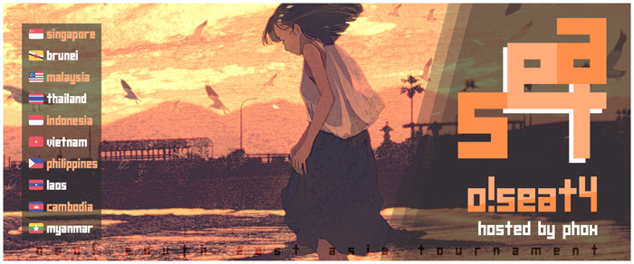
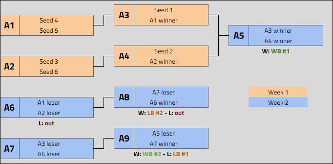

---
tags:
  - oSEAT
  - oSEAT4
---

# osu! South East Asia Tournament 4

The **osu! South East Asia Tournament 4** (***oSEAT4***) was a double-elimination 1v1 osu! tournament hosted by ![][flag_SG] [phox](https://osu.ppy.sh/users/772295). The tournament was open to all players from all ten [ASEAN member states](https://asean.org/asean/asean-member-states/) (![][flag_BN] Brunei Darussalam, ![][flag_KH] Cambodia, ![][flag_ID] Indonesia, ![][flag_LA] Laos, ![][flag_MY] Malaysia, ![][flag_MM] Myanmar, ![][flag_PH] The Phillipines, ![][flag_SG] Singapore, ![][flag_TH] Thailand, and ![][flag_VN] Vietnam) regardless of rank. It was the 4th installment of the osu! South East Asia Tournament.

## Tournament schedule

| Event | Timestamp |
| --: | :-- |
| Registration phase | 2020-11-07/2020-11-22 |
| Screening phase | 2020-11-23/2020-11-29 |
| Qualifiers | 2020-11-30/2020-12-06 |
| Group Stage week 1 | 2020-12-07/2020-12-13 |
| Group Stage week 2 | 2020-12-14/2020-12-20 |
| Round of 32 | 2020-12-21/2020-12-27 |
| Round of 16 | 2020-12-28/2021-01-03 |
| Quarterfinals | 2021-01-04/2021-01-10 |
| Semifinals | 2021-01-11/2021-01-17 |
| Finals week 1 | 2021-01-18/2021-01-23 |
| Finals week 2 | 2021-01-24/2021-01-30 |

## Prizes

| Placing | Prize(s) |
| :-: | :-- |
|  | 12 months of osu!supporter tag, unique profile badge |
|  | 6 months of osu!supporter tag |
|  | 4 months of osu!supporter tag |
| *4th place* | 2 months of osu!supporter tag |
| *5th place* | 1 month of osu!supporter tag |

## Organization

oSEAT4 was run by various osu! community members predominantly hailing from South East Asian countries.

| Position | Member(s) |
| :-- | :-- |
| Host | ![][flag_SG] [phox](https://osu.ppy.sh/users/772295) |
| Mappool selector | ![][flag_SG] [phox](https://osu.ppy.sh/users/772295), ![][flag_SG] [Fragmented](https://osu.ppy.sh/users/847434), ![][flag_TH] [Seaweed](https://osu.ppy.sh/users/5151214), ![][flag_SG] [Ayucchi](https://osu.ppy.sh/users/7823498), ![][flag_US] [Not A Function](https://osu.ppy.sh/users/4773094) |
| Playtester | ![][flag_ID] [F4UZ4N](https://osu.ppy.sh/users/11070577), ![][flag_GB] [timberwolf](https://osu.ppy.sh/users/11042418), ![][flag_FI] [HENKSELI](https://osu.ppy.sh/users/7005392), ![][flag_NL] [Swerro](https://osu.ppy.sh/users/4507667) |
| Streamer | ![][flag_SG] [Moltenfury](https://osu.ppy.sh/users/3395820), ![][flag_VN] [Hoaq](https://osu.ppy.sh/users/7696512), ![][flag_MY] [--Mirai--](https://osu.ppy.sh/users/8923407), ![][flag_SG] [k\_1tty](https://osu.ppy.sh/users/5407620), ![][flag_KR] [PostScr1pt](https://osu.ppy.sh/users/3410997)  |
| Commentator | ![][flag_SG] [Heresy](https://osu.ppy.sh/users/8876938), ![][flag_PH] [patsugoi](https://osu.ppy.sh/users/15748531), ![][flag_US] [Not A Function](https://osu.ppy.sh/users/4773094) |
| Referee | ![][flag_SG] [phox](https://osu.ppy.sh/users/772295), ![][flag_SG] [Fragmented](https://osu.ppy.sh/users/847434), ![][flag_ID] [F4UZ4N](https://osu.ppy.sh/users/11070577), ![][flag_SG] [Heresy](https://osu.ppy.sh/users/8876938), ![][flag_MY] [Kumaxione](https://osu.ppy.sh/users/2582531), ![][flag_ID] [CookieSan](https://osu.ppy.sh/users/5634959), ![][flag_SG] [ellyn](https://osu.ppy.sh/users/10592989), ![][flag_VN] [RylieXD](https://osu.ppy.sh/users/14585583), ![][flag_ID] [Arvalon](https://osu.ppy.sh/users/14667308), ![][flag_VN] [Vespulaz](https://osu.ppy.sh/users/10848857), ![][flag_KR] [PostScr1pt](https://osu.ppy.sh/users/3410997), ![][flag_PL] [Flapczek](https://osu.ppy.sh/users/8210988), ![][flag_AU] [Fairy Bread](https://osu.ppy.sh/users/8306102), ![][flag_TW] [SugiuraAyano](https://osu.ppy.sh/users/2529213), ![][flag_US] [Suicune3](https://osu.ppy.sh/users/6895187), ![][flag_FI] [CPU_Cartel](https://osu.ppy.sh/users/9634978), ![][flag_PL] [Kondi](https://osu.ppy.sh/users/7382321) |
| Graphic designer | ![][flag_SG] [megumic](https://osu.ppy.sh/users/7537133) |
| Spreadsheet manager | ![][flag_SG] [phox](https://osu.ppy.sh/users/772295) |
| Wiki editor | ![][flag_ID] [Niva](https://osu.ppy.sh/users/197805) |

## Links

- **[Main spreadsheet](https://docs.google.com/spreadsheets/d/16LDQYYDwd7obzSgLijTV1hBD7QOZE_2Ibe9ZLqTWQNw/edit#gid=1373445856)**
- [Forum thread](https://osu.ppy.sh/community/forums/topics/1177376)
- [Discord server](https://discord.gg/sVHndPU)
- [Livestream channel](https://www.twitch.tv/oseatournament)
- [Challonge bracket](https://challonge.com/SEAT4)

## Podium

This competition has come to an end and resulted in the following podium:

| Placing | Player |
| :-: | :-- |
|  | ![][flag_ID] **[Skydiver](https://osu.ppy.sh/users/4750008)** |
|  | ![][flag_SG] **[megumic](https://osu.ppy.sh/users/7537133)** |
|  | ![][flag_ID] **[Lifeline](https://osu.ppy.sh/users/11367222)** |

## Participants

Listed below are players who qualified into the Group Stage (along with their respective seeding and group placement) out of 179 registered players in total.

| Group | Seed A | Seed B | Seed C | Seed D | Seed E | Seed F |
| :-- | :-- | :-- | :-- | :-- | :-- | :-- |
| A | ![][flag_ID] [Skydiver](https://osu.ppy.sh/users/4750008) | ![][flag_PH] [zonelouise](https://osu.ppy.sh/users/1492995) | ![][flag_SG] [Moltenfury](https://osu.ppy.sh/users/3395820) | ![][flag_MY] [Chizu-Kun](https://osu.ppy.sh/users/10288461) | ![][flag_ID] [fnayR](https://osu.ppy.sh/users/2800253) | ![][flag_SG] [kirkirs](https://osu.ppy.sh/users/9902622) |
| B | ![][flag_ID] [Fuma](https://osu.ppy.sh/users/1501956) | ![][flag_SG] [moosepi](https://osu.ppy.sh/users/1868745) | ![][flag_MY] [vernonlim](https://osu.ppy.sh/users/10167542) | ![][flag_PH] [Senjuro](https://osu.ppy.sh/users/3003839) | ![][flag_ID] [Sonic-](https://osu.ppy.sh/users/8691555) | ![][flag_ID] [honeymint](https://osu.ppy.sh/users/4796773) |
| C | ![][flag_PH] [Rammu](https://osu.ppy.sh/users/10652837) | ![][flag_MY] [DuoX](https://osu.ppy.sh/users/9560694) | ![][flag_SG] [ExImperia](https://osu.ppy.sh/users/5200499) | ![][flag_MY] [CookieDASH](https://osu.ppy.sh/users/8249895) | ![][flag_ID] [Bunan-](https://osu.ppy.sh/users/2763354) | ![][flag_PH] [Oooodriiin](https://osu.ppy.sh/users/7223737) |
| D | ![][flag_SG] [megumic](https://osu.ppy.sh/users/7537133) | ![][flag_SG] [Eagle5324](https://osu.ppy.sh/users/11987104) | ![][flag_MY] [Auxuelus](https://osu.ppy.sh/users/5414124) | ![][flag_MY] [heyimcrunchy](https://osu.ppy.sh/users/13067221) | ![][flag_ID] [CubeixID200](https://osu.ppy.sh/users/10678919) | ![][flag_PH] [Aryuii](https://osu.ppy.sh/users/11272208) |
| E | ![][flag_SG] [\[-Lockon-\]](https://osu.ppy.sh/users/6726331) | ![][flag_MY] [not\_aweeb](https://osu.ppy.sh/users/9375317) | ![][flag_TH] [Chorus](https://osu.ppy.sh/users/3504692) | ![][flag_SG] [DVDthe1st](https://osu.ppy.sh/users/2138989) | ![][flag_SG] [yayatutu135](https://osu.ppy.sh/users/8420023) | ![][flag_TH] [Iambosszie](https://osu.ppy.sh/users/7286850) |
| F | ![][flag_ID] [Vinno](https://osu.ppy.sh/users/10717635) | ![][flag_PH] [KagenoKami](https://osu.ppy.sh/users/7246165) | ![][flag_PH] [Zyxus](https://osu.ppy.sh/users/8055861) | ![][flag_TH] [- Seen -](https://osu.ppy.sh/users/5082392) | ![][flag_MY] [Ayameru](https://osu.ppy.sh/users/7373182) | ![][flag_MY] [Rawn](https://osu.ppy.sh/users/2621067) |
| G | ![][flag_ID] [Rexeez](https://osu.ppy.sh/users/1987591) | ![][flag_ID] [Venta](https://osu.ppy.sh/users/11320627) | ![][flag_MY] [Heya](https://osu.ppy.sh/users/11379332)¹ | ![][flag_VN] [Hoaq](https://osu.ppy.sh/users/7696512) | ![][flag_SG] [Deze](https://osu.ppy.sh/users/7638335) | ![][flag_MY] [malaidan](https://osu.ppy.sh/users/14279913) |
| H | ![][flag_SG] [Rtyzen](https://osu.ppy.sh/users/2439822) | ![][flag_VN] [Tuon](https://osu.ppy.sh/users/6673790) | ![][flag_SG] [woahsia](https://osu.ppy.sh/users/195946) | ![][flag_MY] [Agagak](https://osu.ppy.sh/users/3645490) | ![][flag_PH] [tiny snek](https://osu.ppy.sh/users/10619389) | ![][flag_TH] [Faken](https://osu.ppy.sh/users/10249166) |
| I | ![][flag_SG] [k\_1tty](https://osu.ppy.sh/users/5407620) | ![][flag_ID] [Suikami](https://osu.ppy.sh/users/1929336) | ![][flag_TH] [Deppyforce](https://osu.ppy.sh/users/5286213) | ![][flag_MY] [verdas123](https://osu.ppy.sh/users/11148851) | ![][flag_MY] [alphaplay](https://osu.ppy.sh/users/9304966) | ![][flag_PH] [FrostIce](https://osu.ppy.sh/users/8238365) |
| J | ![][flag_PH] [xidorn](https://osu.ppy.sh/users/7904667) | ![][flag_SG] [oneplusone](https://osu.ppy.sh/users/1843447) | ![][flag_ID] [Fayn](https://osu.ppy.sh/users/5390495) | ![][flag_TH] [\[AmPhyze\]](https://osu.ppy.sh/users/9552188) | ![][flag_MY] [Flashback9](https://osu.ppy.sh/users/7714136) | ![][flag_VN] [Phoeni\_](https://osu.ppy.sh/users/14953642) |
| K | ![][flag_SG] [SeeL](https://osu.ppy.sh/users/5104320) | ![][flag_PH] [Revillica](https://osu.ppy.sh/users/9806095)² | ![][flag_US] (![][flag_PH]) [\_Kolin](https://osu.ppy.sh/users/7249644)³ | ![][flag_SG] [Lunarsol](https://osu.ppy.sh/users/6622650) | ![][flag_SG] [RePeaTT](https://osu.ppy.sh/users/11132323) | ![][flag_SG] [\_gt](https://osu.ppy.sh/users/8301957) |
| L | ![][flag_PH] [MioMilo](https://osu.ppy.sh/users/2199427) | ![][flag_MY] [Tzero](https://osu.ppy.sh/users/6088976) | ![][flag_VN] [sindes19](https://osu.ppy.sh/users/11021073) | ![][flag_SG] [m0fum0fu](https://osu.ppy.sh/users/5143605) | ![][flag_PH] [MarvelWizardKH](https://osu.ppy.sh/users/5356586) | ![][flag_VN] [Llama\_The\_Goat](https://osu.ppy.sh/users/11232450) |
| M | ![][flag_MY] [Rampax](https://osu.ppy.sh/users/3995630) | ![][flag_ID] [Walfrid](https://osu.ppy.sh/users/6600809) | ![][flag_MY] [Chiyuu](https://osu.ppy.sh/users/8226107) | ![][flag_MY] [decaykets](https://osu.ppy.sh/users/3404543) | ![][flag_BN] [Daynem W](https://osu.ppy.sh/users/4699134) | ![][flag_SG] [Shleepy](https://osu.ppy.sh/users/8486823) |
| N | ![][flag_ID] [Lifeline](https://osu.ppy.sh/users/11367222) | ![][flag_SG] [Rtzero](https://osu.ppy.sh/users/9262462) | ![][flag_ID] [Firia](https://osu.ppy.sh/users/9730262) | ![][flag_LA] [Lessrtrer](https://osu.ppy.sh/users/11038623) | ![][flag_SG] [Hecatia](https://osu.ppy.sh/users/8244635) | ![][flag_PH] [fixedbyglue](https://osu.ppy.sh/users/8296269) |
| O | ![][flag_PH] [konawiki](https://osu.ppy.sh/users/4003979) | ![][flag_PH] [Milkteaism](https://osu.ppy.sh/users/9642774) | ![][flag_SG] [Milk Tee](https://osu.ppy.sh/users/6708955) | ![][flag_PH] [-Graigory-](https://osu.ppy.sh/users/14024170) | ![][flag_MY] [Yaro](https://osu.ppy.sh/users/9196013) | ![][flag_MY] [Computer Badger](https://osu.ppy.sh/users/6893361) |
| P | ![][flag_SG] [Demonical](https://osu.ppy.sh/users/5447609) | ![][flag_PH] [Xyloz](https://osu.ppy.sh/users/12040280) | ![][flag_ID] [Daffy](https://osu.ppy.sh/users/5968633) | ![][flag_PH] [ishokuP](https://osu.ppy.sh/users/7309033) | ![][flag_PH] [Kagitingan](https://osu.ppy.sh/users/7407323) | ![][flag_SG] [fausion](https://osu.ppy.sh/users/12261210) |

¹ ![][flag_ID] *[ngonk](https://osu.ppy.sh/users/12030070) initially qualified for this Group Stage berth, but they decided to forfeit from the tournament during the running of the Group Stage. Under the discretion of staff members and all other affected players, ![][flag_MY] [Heya](https://osu.ppy.sh/users/11379332) was later admitted to the Group Stage in their spot.*

² ![][flag_ID] *[cfood](https://osu.ppy.sh/users/8626190) initially qualified for this Group Stage berth, but they decided to forfeit from the tournament during the running of the Group Stage. Under the discretion of staff members and all other affected players, ![][flag_PH] [Revillica](https://osu.ppy.sh/users/9806095) was later admitted to the Group Stage in their spot.*

³ *Despite having the ![][flag_US] United States flag displayed on their profile, [\_Kolin](https://osu.ppy.sh/users/7249644) is eligible to participate in the tournament as they are in possession of a valid ![][flag_PH] [Phillipine passport](https://en.wikipedia.org/wiki/Philippine_passport).*

## Mappools

### Finals week 2

**[Download the mappack here! (173 MB)](https://drive.google.com/uc?export=download&id=1Oe0_HvHBwtM3wE8W8lV8zgDa-pxmj9_3)**

- NoMod
  - [Tokoyami Towa - -ERROR (Rumia-) \[\*@\#\*% (SEAT edit)\]](https://osu.ppy.sh/beatmapsets/1225788#osu/2777404)
  - [SYU (from GALNERYUS) - REASON (NoFC) \[WISDOM\]](https://osu.ppy.sh/beatmapsets/1198924#osu/2496838)
  - [Reol & nqrse - Ooedo ranvu (Sparhten) \[Extra+\]](https://osu.ppy.sh/beatmapsets/1302183#osu/2700747)
  - [Zekk - Re\_Construct (yf\_bmp) \[Extra\]](https://osu.ppy.sh/beatmapsets/1318761#osu/2731945)
  - [Zektbach - L'erisia(primal logic) (Roll\_Pan) \[SPECIAL\]](https://osu.ppy.sh/beatmapsets/329642#osu/730840)
  - [eFeL remixed by KHTP - Beat Cannon (KHTP Remix) (ktgster) \[Focus!\]](https://osu.ppy.sh/beatmapsets/1240125#osu/2578246)  
- Hidden
  - [Morimori Atsushi - Apsaras (Rtyzen) \[Dance\]](https://osu.ppy.sh/beatmapsets/1192309#osu/2484453)
  - [REDALiCE - taboo tears you up (Down) \[Flandre Scarlet\]](https://osu.ppy.sh/beatmapsets/1341292#osu/2778415)
  - [Niko - Made Of Fire (Extended Mix) (Mismagius) \[NO ONE CAN STOP ME\]](https://osu.ppy.sh/beatmapsets/1102510#osu/2303231)
- HardRock
  - [Demetori - Yuuga ni Sakase, Sumizome no Sakura \~ The Harm of Coming into Existence (jonathanlfj) \[Extra Stage\]](https://osu.ppy.sh/beatmapsets/1034179#osu/2162263)
  - [Amemori Sayo x Kudou Chitose - White Lily (Yugu) \[Black and White's Story\]](https://osu.ppy.sh/beatmapsets/1034381#osu/2162647)
  - [YuNi - Toumei Seisai (-Mikan) \[Life-coloured Voice\]](https://osu.ppy.sh/beatmapsets/1175057#osu/2450948)
- DoubleTime
  - [Ichigaya Arisa (CV: Itou Ayasa) - Su-Suki Nanka Janai! (Gaia) \[My Angel Arisa\]](https://osu.ppy.sh/beatmapsets/796450#osu/1672466)
  - [Insert Rupee - Facing Fears (OC ReMix) (Charles445) \[Insane\]](https://osu.ppy.sh/beatmapsets/36541#osu/118054)
  - [Firewind - Few Against Many (LMT) \[Sandvich's Insane\]](https://osu.ppy.sh/beatmapsets/896546#osu/1916906)
  - [Camellia - Body F10ating in the Zero Gravity Space (Cubby) \[Otosaka's Insane\]](https://osu.ppy.sh/beatmapsets/1266354#osu/2685242)
- FreeMod
  - [LeaF - Kyouki Ranbu (vikala) \[Master\]](https://osu.ppy.sh/beatmapsets/1312129#osu/2719437)
  - [Rin - Kishinjou set 14 \~ Primordial Beat (Hey lululu) \[Extra Stage\]](https://osu.ppy.sh/beatmapsets/1032048#osu/2158094)
  - [Zekk - Ashes (Smug Nanachi) \[Ameth x Colicen x Cheri's Combustion Expert\]](https://osu.ppy.sh/beatmapsets/1341787#osu/2779441)

### Finals week 1

**[Download the mappack here! (163 MB)](https://drive.google.com/uc?export=download&id=1a11olxJekvoNmmcp9t6zhMFnY6JSa9cY)**

- NoMod
  - [Aqours - Kimeta yo Hand in Hand (SkyFlame) \[Unity\]](https://osu.ppy.sh/beatmapsets/1288914#osu/2675756)
  - [Ryu\* vs. L.E.D.-G vs. ZUN - PARADISE GHOST (Leader) \[Extra Stage\]](https://osu.ppy.sh/beatmapsets/1074982#osu/2249464)
  - [Kaf - Montage (Sparhten) \[Exchanging Myself\]](https://osu.ppy.sh/beatmapsets/1344469#osu/2784409)
  - [Twenty One Pilots - Heathens (Magnetude Bootleg) (Cassu2) \[blasphemy\]](https://osu.ppy.sh/beatmapsets/985093#osu/2061081)
  - [Melissa Kinrenka - Eva (0ugi) \[Mediocre\]](https://osu.ppy.sh/beatmapsets/1275297#osu/2649758)
  - [Usada Pekora - Discommunication Alien (Deppyforce) \[uwaaa\]](https://osu.ppy.sh/beatmapsets/1175871#osu/2452581)  
- Hidden
  - [DJ TOTTO feat. 3L - Youkakushi -Ayakashi Kakushi- (Halfslashed) \[Phantasm\]](https://osu.ppy.sh/beatmapsets/1257553#osu/2613131)
  - [Seiryu - Ultramarine (RLC) \[fanzhen's Extra\]](https://osu.ppy.sh/beatmapsets/107377#osu/281390)
  - [De De MOUSE - Silly Love (Senseabel) \[mwah\]](https://osu.ppy.sh/beatmapsets/1075163#osu/2249821)
- HardRock
  - [Hoshino Mea - GROUND-ZERO (My Angel Watame) \[Rebellion\]](https://osu.ppy.sh/beatmapsets/1338059#osu/2771799)
  - [Kagetora. - Narcissus at Oasis -Kagetora. style- (X Light) \[Cub's Blooming Flower Extra\]](https://osu.ppy.sh/beatmapsets/1139910#osu/2434361)
  - [MDK - Press Start (hypercyte) \[Team UK\]](https://osu.ppy.sh/beatmapsets/1202763#osu/2504780)
- DoubleTime
  - [Kalafina - Red Moon (EvilElvis) \[diffname\]](https://osu.ppy.sh/beatmapsets/524806#osu/1113831)
  - [Gesu no Kiwami Otome. - Romance ga Ariamaru (Emilia) \[rizumu\]](https://osu.ppy.sh/beatmapsets/623049#osu/1313279)
  - [Suzuki Konomi - Love is MY RAIL (iljaaz) \[Kowari's Insane\]](https://osu.ppy.sh/beatmapsets/1075757#osu/2261226)
  - [F-777 - Hydra (DTM9 Nowa) \[Insane\]](https://osu.ppy.sh/beatmapsets/1089683#osu/2278247)
- FreeMod
  - [Kanpyohgo - Unmei no Dark Side -Rolling Gothic mix (Suicune3) \[Wandering in the Darkened Entryway\]](https://osu.ppy.sh/beatmapsets/1289097#osu/2680939)
  - [Wagakki Band - Kagerou Days (IOException) \[Expert\]](https://osu.ppy.sh/beatmapsets/1207286#osu/2514123)
  - [t+pazolite - chipscape (Shiirn) \[Ragnarok\]](https://osu.ppy.sh/beatmapsets/27752#osu/95382)

### Semifinals

**[Download the mappack here! (114 MB)](https://drive.google.com/uc?export=download&id=1LYEQCVrF5jLiN1zhMV1BxvSA4uFhtTGj)**

- NoMod
  - [Eve - Gekka\*Midare Botan (Meg) \[Meg&Roll\_Pan's E-Xtra\]](https://osu.ppy.sh/beatmapsets/530685#osu/1124857)
  - [Riverside - The Magic Valleys of Dark Wolf (LMT) \[Expert\]](https://osu.ppy.sh/beatmapsets/1267263#osu/2633689)
  - [Sanbaka - Virtual to LIVE (Bokamin) \[Extreme\]](https://osu.ppy.sh/beatmapsets/1223760#osu/2545390)
  - [Xect. - Emptiness (Heilia) \[Extreme\]](https://osu.ppy.sh/beatmapsets/1210804#osu/2520609)
  - [CHON - If (DeviousPanda) \[piroshki's Expert\]](https://osu.ppy.sh/beatmapsets/1076978#osu/2311803)
  - [The Quick Brown Fox - The Big Black (Blue Dragon) \[WHO'S AFRAID OF THE BIG BLACK\]](https://osu.ppy.sh/beatmapsets/41823#osu/131891)  
- Hidden
  - [t+pazolite - Oshama Scramble! (NoHitter) \[MASTER\]](https://osu.ppy.sh/beatmapsets/1230451#osu/2600438)
  - [Expander - subtractive (anna apple) \[12345\]](https://osu.ppy.sh/beatmapsets/889514#osu/1859132)
  - [Rib - Seisou Bakuretsu Boy (Midge) \[mark lee\]](https://osu.ppy.sh/beatmapsets/526508#osu/1117247)
- HardRock
  - [REDALiCE - Pekorap Tropical House Remix (Yuuma) \[Universal Daikaiten Peko Peko no Mai\]](https://osu.ppy.sh/beatmapsets/1224414#osu/2546607)
  - [OISHII - UP UP MT. CAKE (Pennek) \[SONNYC'S EXPERT\]](https://osu.ppy.sh/beatmapsets/963792#osu/2108649)
  - [Hashimoto Miyuki - Symphonic Love (Karen) \[Expert\]](https://osu.ppy.sh/beatmapsets/1188338#osu/2476349)
- DoubleTime
  - [Triad Primus - Trancing Pulse (Ayalis) \[Coll@b\]](https://osu.ppy.sh/beatmapsets/450406#osu/966335)
  - [IOSYS - Chanteikku Sanyousei no Itazura Daisensou (Kochiya Sanae) \[Crazy Jay\]](https://osu.ppy.sh/beatmapsets/24448#osu/91462)
  - [senya - Sasayaku, Kiekaketa Kouishou ga. (Satellite) \[ponpokorin's Lunatic\]](https://osu.ppy.sh/beatmapsets/1053613#osu/2201687)
  - [Maison book girl - faithlessness (newton-) \[shizuforce's insane\]](https://osu.ppy.sh/beatmapsets/1063163#osu/2226170)
- FreeMod
  - [Mutsuhiko Izumi - Red Goose (nold\_1702) \[Superable\]](https://osu.ppy.sh/beatmapsets/46239#osu/144029)
  - [sHimaU - SLOTcore Is Dead  (Arphimigon) \[SIX\]](https://osu.ppy.sh/beatmapsets/306012#osu/933686)
  - [Kalafina - Magia (Teky) \[Resonance\]](https://osu.ppy.sh/beatmapsets/1238888#osu/2575810)

### Quarterfinals

**[Download the mappack here! (157 MB)](https://drive.google.com/uc?export=download&id=1GONWcU2ja9-wN5WF6shn-E4LqHBCaJA8)**

- NoMod
  - [Inugami Korone & Nekomata Okayu - Hyadain no Joujou Yuujou (Yuuma) \[Okayu\]](https://osu.ppy.sh/beatmapsets/1279298#osu/2657558)
  - [xi - Ascension to Heaven (-Tynamo) \[FINAL DIMENSION\]](https://osu.ppy.sh/beatmapsets/968656#osu/2026805)
  - [Hashimoto Miyuki - Yume miru mama ni koi o shite (239) \[Extra\]](https://osu.ppy.sh/beatmapsets/1237680#osu/2572531)
  - [Zekk - Feelsleft0ut (J1\_) \[Alone\]](https://osu.ppy.sh/beatmapsets/821587#osu/1722011)
  - [Ozawa Takumi - La gis sulva za Celow (Hey lululu) \[Another\]](https://osu.ppy.sh/beatmapsets/1125359#osu/2513983)
- Hidden
  - [KAMELOT - Liar Liar (Wasteland Monarchy) (LMT) \[Dark\]](https://osu.ppy.sh/beatmapsets/629668#osu/1329273)
  - [Isekai Joucho - Yorugao no Kokuhaku (Yugu) \[Spiral\]](https://osu.ppy.sh/beatmapsets/1081281#osu/2261977)
  - [Yamamoto Mineko - Cadena (KKipalt) \[Extra\]](https://osu.ppy.sh/beatmapsets/1257561#osu/2613139)
- HardRock
  - [Aice5 - Be with you (Settia) \[Leaf's Pledge\]](https://osu.ppy.sh/beatmapsets/502090#osu/1081059)
  - [Cranky vs. MASAKI - ouroboros -twin stroke of the end- (celerih) \[Another\]](https://osu.ppy.sh/beatmapsets/1052054#osu/2209919)
  - [Function Phantom - Paradox (byfar) \[Sing's Another\]](https://osu.ppy.sh/beatmapsets/824125#osu/1734156)
- DoubleTime
  - [HACHI feat. Hatsune Miku - Suna no Wakusei (gowww) \[Insane\]](https://osu.ppy.sh/beatmapsets/841634#osu/1761258)
  - [ZUN & Ryu\* - Second Darkside (banvi) \[Lunatic\]](https://osu.ppy.sh/beatmapsets/24304#osu/83355)
  - [halca - Sentimental Crisis (Hitsukuya) \[Shady's Insane\]](https://osu.ppy.sh/beatmapsets/1171966#osu/2556247)
- FreeMod
  - [Amuro vs Killer - Mei (iedesu) \[Muya's Another\]](https://osu.ppy.sh/beatmapsets/1148799#osu/2411485)
  - [BLOOD STAIN CHILD - Last Stardust (Smoothie) \[tutu's Extra\]](https://osu.ppy.sh/beatmapsets/332345#osu/1265343)
  - [IAHN - Burn Out (hypercyte) \[Log Off Know\]](https://osu.ppy.sh/beatmapsets/974889#osu/2040572)

### Round of 16

**[Download the mappack here! (137 MB)](https://drive.google.com/uc?export=download&id=1cOqcPhNcvwbpt_eKFmKjEJNzDCf_sxlk)**

- NoMod
  - [WANIMA - GONG (Smoke) \[Stampede\]](https://osu.ppy.sh/beatmapsets/1099681#osu/2297302)
  - [xi - Evolve Cybernation (NewRulerNA) \[Extra\]](https://osu.ppy.sh/beatmapsets/114389#osu/544334)
  - [yuikonnu - Uchouten Vivace (kwk) \[Boys and Girls!\]](https://osu.ppy.sh/beatmapsets/948049#osu/1253062)
  - [Reol - BRING IT ON (Yugu) \[HW's AnOther\]](https://osu.ppy.sh/beatmapsets/974362#osu/2167873)
  - [Rings of Saturn - Senseless Massacre (HML) \[Extra\]](https://osu.ppy.sh/beatmapsets/507278#osu/1086000)
- Hidden
  - [KAMELOT - Veil of Elysium (LMT) \[ar9\]](https://osu.ppy.sh/beatmapsets/1252853#osu/2761040)
  - [Dirty Androids - Egret and Willow (-PC) \[Snowy Egret on Willow Branch\]](https://osu.ppy.sh/beatmapsets/915233#osu/1911494)
  - [Zektbach - The Sealer \~A Milia to Milia no Min\~ (celerih) \[EX\]](https://osu.ppy.sh/beatmapsets/1067056#osu/2234038)
- HardRock
  - [kalon. - Juubaku (Meg) \[E-Xtra\]](https://osu.ppy.sh/beatmapsets/529724#osu/1123155)
  - [ReX - Heart of Witch (alacat) \[Poruteri's Maximum\]](https://osu.ppy.sh/beatmapsets/209790#osu/726106)
  - [Sangatsu no Phantasia - Seishun nante Iranaiwa (Ryuusei Aika) \[iljaaz's Expert\]](https://osu.ppy.sh/beatmapsets/1064632#osu/2229109)  
- DoubleTime
  - [Todo Kohaku - Mela! (Hinsvar) \[Darling\]](https://osu.ppy.sh/beatmapsets/1269084#osu/2637342)
  - [Foreground Eclipse - Iris (x2x0x0x0x) \[Exc's Lunatic\]](https://osu.ppy.sh/beatmapsets/160057#osu/391018)
  - [Nomiya Ayumi - Colors (xierbaliti) \[Insane\]](https://osu.ppy.sh/beatmapsets/9695#osu/38845)  
- FreeMod
  - [DNCE - Cake By The Ocean (Sidetail) \[aYaYaYaYa\]](https://osu.ppy.sh/beatmapsets/824393#osu/1748652)
  - [Machita Chima - KING (Ayucchi) \[Expert\]](https://osu.ppy.sh/beatmapsets/1306528#osu/2708875)
  - [Silentroom - Alt Futur (SaltyLucario) \[jamesjan's Extra\]](https://osu.ppy.sh/beatmapsets/1265982#osu/2656852) 

### Round of 32

**[Download the mappack here! (173 MB)](https://drive.google.com/uc?export=download&id=1UvKY5SZPaRleicj9Pw29bFVa1GJ4cVFs)**

- NoMod
  - [YOASOBI - Ano Yume o Nazotte (Flask) \[Summer Night, You, Two Silhouettes Side-by-side\]](https://osu.ppy.sh/beatmapsets/1120850#osu/2342037)
  - [Seiryu - Critical Crystal (BD MIX) (yaspo) \[Dragon\]](https://osu.ppy.sh/beatmapsets/1257558#osu/2613136)
  - [Poppin'Party x Aya (CV: Maeshima Ami) x Kokoro (CV: Itou Miku) - Geki! Teikoku Kagekidan (Left) \[Left x Karen x bbj0920's Expert\]](https://osu.ppy.sh/beatmapsets/948049#osu/1983241)
  - [Saiph - Hydrangea (thiev) \[nul\]](https://osu.ppy.sh/beatmapsets/1284350#osu/2666993)
  - [UNDEAD CORPORATION - Everything will freeze (sjoy) \[Extra\]](https://osu.ppy.sh/beatmapsets/336471#osu/744672)
- Hidden
  - [DJ'TEKINA//SOMETHING - Internet bitch P\*Light Remix (Meg) \[Bitch\]](https://osu.ppy.sh/beatmapsets/357487#osu/786379)
  - [Megpoid GUMI - For my soul  (val0108) \[Insane\]](https://osu.ppy.sh/beatmapsets/22509#osu/80102)
  - [REDALiCE vs. USAO - SAIKYO STRONGER (Otosaka-Yu) \[OtosaKana's STRENGTHENING FUTURE\]](https://osu.ppy.sh/beatmapsets/1098586#osu/2296800)
- HardRock
  - [TWICE - Fanfare (\[Im Nayeon\]) \[Fragmented's Extra\]](https://osu.ppy.sh/beatmapsets/1195633#osu/2496243)
  - [L.E.D.-G - EMPEROR OF THE AVALON (Acylica) \[Another\]](https://osu.ppy.sh/beatmapsets/1190926#osu/2481302)
  - [Given - Fuyu no Hanashi (- ascended -) \[Tragic Love Story\]](https://osu.ppy.sh/beatmapsets/1188198#osu/2476072)  
- DoubleTime
  - [yak\_won - Lucid (soulfear) \[Another\]](https://osu.ppy.sh/beatmapsets/15898#osu/85591)
  - [HIMEHINA - Hitogata (TV Size) (Ryuusei Aika) \[Nasmoeb's Insane\]](https://osu.ppy.sh/beatmapsets/942714#osu/1970539)
  - [chano & 40mP - Natsukoi Hanabi (Xayah) \[Insane\]](https://osu.ppy.sh/beatmapsets/963553#osu/2019793)  
- FreeMod
  - [Yorushika - Ai Nijou (Shiny Braixen) \[Extra\]](https://osu.ppy.sh/beatmapsets/1035354#osu/2178023)
  - [PUP - Anaphylaxis (Hobbes2) \[Extra\]](https://osu.ppy.sh/beatmapsets/1169856#osu/2464094)
  - [Denkishiki Karen Ongaku Shuudan - Never Forget (LMT) \[Loss of a Loved One\]](https://osu.ppy.sh/beatmapsets/1187196#osu/2474203)  

### Group Stage week 2

**[Download the mappack here! (112 MB)](https://drive.google.com/uc?export=download&id=14PCz90yD5v4mtKWSiCmzgQpfiMJVIA_c)**

- NoMod
  - [T7 - Strike (galvenize) \[Insane\]](https://osu.ppy.sh/beatmapsets/679007#osu/1435677)
  - [orangentle / Yu_Asahina - HAELEQUINZ -the clown of 24stairs- (xLolicore-) \[Lince's Schizophrenia\]](https://osu.ppy.sh/beatmapsets/618645#osu/1306871)
  - [VY1 - Cyber Thunder Cider (tutuhaha) \[Cider\]](https://osu.ppy.sh/beatmapsets/47146#osu/146610)
  - [Function Phantom - Variable (Chaoslitz) \[Deluxe\]](https://osu.ppy.sh/beatmapsets/751774#osu/1582594)
  - [Kabocha - EmbryO (Kawashiro) \[Garden's Expert\]](https://osu.ppy.sh/beatmapsets/947018#osu/1990062)
- Hidden
  - [Natsuiro Matsuri - Marigold (Ayucchi) \[Bittersweet\]](https://osu.ppy.sh/beatmapsets/1167380#osu/2435698)
  - [kors k - SigSig (Reiji-RJ) \[Another\]](https://osu.ppy.sh/beatmapsets/27677#osu/92684)
- HardRock
  - [Grand Thaw - SOLROS (Lunala) \[Fantasia\]](https://osu.ppy.sh/beatmapsets/1136592#osu/2376019)
  - [siromaru - Absurd Gaff (spro) \[Another\]](https://osu.ppy.sh/beatmapsets/278213#osu/630291)
- DoubleTime
  - [Shirakami Fubuki - Say! Fanfare! (Bokamin) \[Insane\]](https://osu.ppy.sh/beatmapsets/1277448#osu/2658704)
  - [Giga-P - Electric Angel (koreapenguin) \[Sonnyc's Insane\]](https://osu.ppy.sh/beatmapsets/172900#osu/417898)
- FreeMod
  - [M2U - A Bella! (feat. Lucy) (Okoratu) \[Battle's Extra\]](https://osu.ppy.sh/beatmapsets/1158767#osu/2418106)
  - [M2U - Memory of Beach (milr\_) \[Mx\]](https://osu.ppy.sh/beatmapsets/1120861#osu/2342057)

### Group Stage week 1

**[Download the mappack here! (136 MB)](https://drive.google.com/uc?export=download&id=1AgtwrukjKoTm4uyX8Exxv7xJ4YTluhB0)**

- NoMod
  - [MOB CHOIR - 99 (AirinCat) \[SALT SPLASH\]](https://osu.ppy.sh/beatmapsets/1221343#osu/2540648)
  - [Memme - BSPower Explosion (yeahyeahyeahhh) \[Baka yyy\]](https://osu.ppy.sh/beatmapsets/45760#osu/142772)
  - [KNOWER - Overtime (Mir) \[Ecstacy\]](https://osu.ppy.sh/beatmapsets/1170697#osu/2442178)
  - [Getty vs. DJ DiA - Ops:Code -Rapture- (Realazy) \[Jean-Mi's Extra\]](https://osu.ppy.sh/beatmapsets/776328#osu/2415132)
  - [GANO - Tanoshii Kaerimichi (newton-) \[Extra\]](https://osu.ppy.sh/beatmapsets/1221646#osu/2541192)
- Hidden
  - [sasakure.UK - Hisekai Harmonize feat. Kagamine Rin (Enon) \[Down's Extra\]](https://osu.ppy.sh/beatmapsets/934960#osu/1978834)
  - [BUTAOTOME - Towa no Maigo (Icekalt) \[Insane\]](https://osu.ppy.sh/beatmapsets/1069288#osu/2239337)
- HardRock
  - [ALiCE'S EMOTiON - Foughten Field (Natsu) \[Last Spell\]](https://osu.ppy.sh/beatmapsets/366643#osu/804534)
  - [Paramore - Looking Up (Lesjuh) \[Hard\]](https://osu.ppy.sh/beatmapsets/17563#osu/66662)
- DoubleTime
  - [Dreamcatcher - Wake up (Natsu) \[Insane\]](https://osu.ppy.sh/beatmapsets/645662#osu/1412353)
  - [Comp - Touchuu Aika (Mao) \[KenTwin's Insane\]](https://osu.ppy.sh/beatmapsets/198700#osu/472087)
- FreeMod
  - [Jin - Children Record (tutuhaha) \[Record\]](https://osu.ppy.sh/beatmapsets/55775#osu/169004)
  - [ARM x Komso feat. Nanahira - Onegai! Kon kon Oinarisama (Len) \[Classic Extra\]](https://osu.ppy.sh/beatmapsets/1302044#osu/2707852)

### Qualifiers

**[Download the mappack here! (52 MB)](https://drive.google.com/uc?export=download&id=1MjH9DYH4XODeh1Z0jHrZhYJeKd6hozn4)**

- NoMod
  - [MY FIRST STORY - Mukoku (AirinCat) \[Extra\]](https://osu.ppy.sh/beatmapsets/1047546#osu/21896537)
  - [Tyrfing - Verflucht (Muya) \[Another\]](https://osu.ppy.sh/beatmapsets/965125#osu/2045906)
  - [Zutto Mayonaka de Ii no ni. - Byoushin o Kamu (Irohas) \[moph's Extra\]](https://osu.ppy.sh/beatmapsets/833772#osu/1746520)
- Hidden
  - [USAO - Knight Rider (RLC) \[Extra\]](https://osu.ppy.sh/beatmapsets/1156969#osu/2414318)
  - [Chata - len (Cami) \[Nightmare Descends\]](https://osu.ppy.sh/beatmapsets/857816#osu/1792255)
- HardRock
  - [Linkin Park - Session (h4d0uk3n1) \[Katherine\]](https://osu.ppy.sh/beatmapsets/669536#osu/1488047)
  - [Dance Gavin Dance - Tree Village (Dilectus) \[Extra\]](https://osu.ppy.sh/beatmapsets/703666#osu/1488698)
- DoubleTime
  - [Buono! - Winter Story (Nakagawa-Kanon) \[Insane\]](https://osu.ppy.sh/beatmapsets/40425#osu/128303)
  - [dj TAKA - Colors -sasakure.UK Futurelogic Remix- (\_wa) \[Hyper\]](https://osu.ppy.sh/beatmapsets/317439#osu/1319822)

## Match results

### Finals week 2

Saturday, 30 January 2021:

| Bracket | Player 1 |  |  | Player 2 | Match link |
| :-: | --: | :-: | :-: | :-- | :-- |
| Lower | **[megumic](https://osu.ppy.sh/users/7537133)** ![][flag_SG] | **7** | 0 | ![][flag_ID] [Lifeline](https://osu.ppy.sh/users/11367222) | [#1](https://osu.ppy.sh/community/matches/74553279) |

Sunday, 31 January 2021 (Grand Final):

| Bracket | Player 1 |  |  | Player 2 | Match link |
| :-: | --: | :-: | :-: | :-- | :-- |
| Grand Final | **[Skydiver](https://osu.ppy.sh/users/4750008)** ![][flag_ID] | **7** | 3 | ![][flag_SG] [megumic](https://osu.ppy.sh/users/7537133) | [#1](https://osu.ppy.sh/community/matches/74637070) |

### Finals week 1

Saturday, 23 January 2021:

| Bracket | Player 1 |  |  | Player 2 | Match link |
| :-: | --: | :-: | :-: | :-- | :-- |
| Lower | [k\_1tty](https://osu.ppy.sh/users/5407620) ![][flag_SG] | 5 | **7** | ![][flag_ID] **[Lifeline](https://osu.ppy.sh/users/11367222)** | [#1](https://osu.ppy.sh/community/matches/74035356) |
| Lower | **[MioMilo](https://osu.ppy.sh/users/2199427)** ![][flag_PH] | **7** | 5 | ![][flag_ID] [Fuma](https://osu.ppy.sh/users/1501956) | [#1](https://osu.ppy.sh/community/matches/74040505) |

Sunday, 24 January 2021:

| Bracket | Player 1 |  |  | Player 2 | Match link |
| :-: | --: | :-: | :-: | :-- | :-- |
| Lower | **[Lifeline](https://osu.ppy.sh/users/11367222)** ![][flag_ID] | **7** | 5 | ![][flag_PH] [MioMilo](https://osu.ppy.sh/users/2199427) | [#1](https://osu.ppy.sh/community/matches/74101173) |
| Upper | **[Skydiver](https://osu.ppy.sh/users/4750008)** ![][flag_ID] | **7** | 4 | ![][flag_SG] [megumic](https://osu.ppy.sh/users/7537133) | [#1](https://osu.ppy.sh/community/matches/74118203) |

Monday, 25 January 2021 (5th Place Playoff):

| Bracket | Player 1 |  |  | Player 2 | Match link |
| :-: | --: | :-: | :-: | :-- | :-- |
| 5th Place Playoff | [k\_1tty](https://osu.ppy.sh/users/5407620) ![][flag_SG] | 4 | **7** | ![][flag_ID] **[Fuma](https://osu.ppy.sh/users/1501956)** | [#1](https://osu.ppy.sh/community/matches/74121020) |

### Semifinals

Saturday, 16 January 2021:

| Bracket | Player 1 |  |  | Player 2 | Match link |
| :-: | --: | :-: | :-: | :-- | :-- |
| Lower | [Rtzero](https://osu.ppy.sh/users/9262462) ![][flag_SG] | 1 | **7** | ![][flag_ID] **[Fuma](https://osu.ppy.sh/users/1501956)** | [#1](https://osu.ppy.sh/community/matches/73537088) |
| Lower | **[\[-Lockon-\]](https://osu.ppy.sh/users/6726331)** ![][flag_SG] | **7** | 5 | ![][flag_PH] [xidorn](https://osu.ppy.sh/users/7904667) | [#1](https://osu.ppy.sh/community/matches/73535895) |
| Lower | **[Rtyzen](https://osu.ppy.sh/users/2439822)** ![][flag_SG] | **7** | 3 | ![][flag_MY] [Rampax](https://osu.ppy.sh/users/3995630) | [#1](https://osu.ppy.sh/community/matches/73532116) |
| Lower | **[Lifeline](https://osu.ppy.sh/users/11367222)** ![][flag_ID] | **7** | 4 | ![][flag_ID] [Rexeez](https://osu.ppy.sh/users/1987591) | [#1](https://osu.ppy.sh/community/matches/73527013) |

Sunday, 17 January 2021:

| Bracket | Player 1 |  |  | Player 2 | Match link |
| :-: | --: | :-: | :-: | :-- | :-- |
| Upper | **[megumic](https://osu.ppy.sh/users/7537133)** ![][flag_SG] | **7** | 2 | ![][flag_PH] [MioMilo](https://osu.ppy.sh/users/2199427) | [#1](https://osu.ppy.sh/community/matches/73609887) |
| Lower | [\[-Lockon-\]](https://osu.ppy.sh/users/6726331) ![][flag_SG] | 2 | **7** | ![][flag_ID] **[Fuma](https://osu.ppy.sh/users/1501956)** | [#1](https://osu.ppy.sh/community/matches/73595095) |
| Lower | [Rtyzen](https://osu.ppy.sh/users/2439822) ![][flag_SG] | 6 | **7** | ![][flag_ID] **[Lifeline](https://osu.ppy.sh/users/11367222)** | [#1](https://osu.ppy.sh/community/matches/73596507) |
| Upper | **[Skydiver](https://osu.ppy.sh/users/4750008)** ![][flag_ID] | **7** | 2 | ![][flag_SG] [k\_1tty](https://osu.ppy.sh/users/5407620) | [#1](https://osu.ppy.sh/community/matches/73606021) |

### Quarterfinals

Thursday, 7 January 2021:

| Bracket | Player 1 |  |  | Player 2 | Match link |
| :-: | --: | :-: | :-: | :-- | :-- |
| Lower | [Milkteaism](https://osu.ppy.sh/users/9642774) ![][flag_PH] | 0 | **6** | ![][flag_MY] **[Chiyuu](https://osu.ppy.sh/users/8226107)** | *win by default* |

Friday, 8 January 2021:

| Bracket | Player 1 |  |  | Player 2 | Match link |
| :-: | --: | :-: | :-: | :-- | :-- |
| Lower | **[Fuma](https://osu.ppy.sh/users/1501956)** ![][flag_ID] | **6** | 0 | ![][flag_PH] [Rammu](https://osu.ppy.sh/users/10652837) | [#1](https://osu.ppy.sh/community/matches/73013107) |
| Lower | [oneplusone](https://osu.ppy.sh/users/1843447) ![][flag_SG] | 3 | **6** | ![][flag_PH] **[xidorn](https://osu.ppy.sh/users/7904667)** | [#1](https://osu.ppy.sh/community/matches/73006970) |
| Lower | [Venta](https://osu.ppy.sh/users/11320627) ![][flag_ID] | 0 | **6** | ![][flag_ID] **[Rexeez](https://osu.ppy.sh/users/1987591)** | *win by default* |

Saturday, 9 January 2021:

| Bracket | Player 1 |  |  | Player 2 | Match link |
| :-: | --: | :-: | :-: | :-- | :-- |
| Upper | **[MioMilo](https://osu.ppy.sh/users/2199427)** ![][flag_PH] | **6** | 5 | ![][flag_ID] [Lifeline](https://osu.ppy.sh/users/11367222) | [#1](https://osu.ppy.sh/community/matches/73070950) |
| Lower | [konawiki](https://osu.ppy.sh/users/4003979) ![][flag_PH] | 1 | **6** | ![][flag_MY] **[Rampax](https://osu.ppy.sh/users/3995630)** | [#1](https://osu.ppy.sh/community/matches/73021742) |
| Lower | [Eagle5324](https://osu.ppy.sh/users/11987104) ![][flag_SG] | 4 | **6** | ![][flag_PH] **[zonelouise](https://osu.ppy.sh/users/1492995)** | [#1](https://osu.ppy.sh/community/matches/73090676) |
| Lower | **[Tzero](https://osu.ppy.sh/users/6088976)** ![][flag_MY] | **6** | 5 | ![][flag_SG] [SeeL](https://osu.ppy.sh/users/5104320) | [#1](https://osu.ppy.sh/community/matches/73072966) |
| Lower | [Chiyuu](https://osu.ppy.sh/users/8226107) ![][flag_MY] | 1 | **6** | ![][flag_PH] **[xidorn](https://osu.ppy.sh/users/7904667)** | [#1](https://osu.ppy.sh/community/matches/73081840) |
| Upper | **[megumic](https://osu.ppy.sh/users/7537133)** ![][flag_SG] | **6** | 3 | ![][flag_SG] [Rtyzen](https://osu.ppy.sh/users/2439822) | [#1](https://osu.ppy.sh/community/matches/73083950) |
| Lower | **[not\_aweeb](https://osu.ppy.sh/users/9375317)** ![][flag_MY] | **6** | 1 | ![][flag_VN] [Tuon](https://osu.ppy.sh/users/6673790) | [#1](https://osu.ppy.sh/community/matches/73083714) |

Sunday, 10 January 2021:

| Bracket | Player 1 |  |  | Player 2 | Match link |
| :-: | --: | :-: | :-: | :-- | :-- |
| Lower | **[Rexeez](https://osu.ppy.sh/users/1987591)** ![][flag_ID] | **6** | 4 | ![][flag_PH] [zonelouise](https://osu.ppy.sh/users/1492995) | [#1](https://osu.ppy.sh/community/matches/73152011) |
| Upper | **[k\_1tty](https://osu.ppy.sh/users/5407620)** ![][flag_SG] | **6** | 0 | ![][flag_SG] [Rtzero](https://osu.ppy.sh/users/9262462) | [#1](https://osu.ppy.sh/community/matches/73154797) |
| Lower | **[Rampax](https://osu.ppy.sh/users/3995630)** ![][flag_MY] | **6** | 3 | ![][flag_MY] [Tzero](https://osu.ppy.sh/users/6088976) | [#1](https://osu.ppy.sh/community/matches/73160641) |
| Upper | **[Skydiver](https://osu.ppy.sh/users/4750008)** ![][flag_ID] | **6** | 0 | ![][flag_SG] [\[-Lockon-\]](https://osu.ppy.sh/users/6726331) | [#1](https://osu.ppy.sh/community/matches/73142523) |
| Lower | [not\_aweeb](https://osu.ppy.sh/users/9375317) ![][flag_MY] | 4 | **6** | ![][flag_ID] **[Fuma](https://osu.ppy.sh/users/1501956)** | [#1](https://osu.ppy.sh/community/matches/73155315) |

### Round of 16

Friday, 1 January 2021:

| Bracket | Player 1 |  |  | Player 2 | Match link |
| :-: | --: | :-: | :-: | :-- | :-- |
| Lower | **[SeeL](https://osu.ppy.sh/users/5104320)** ![][flag_SG] | **6** | 1 | ![][flag_SG] [DVDthe1st](https://osu.ppy.sh/users/2138989) | [#1](https://osu.ppy.sh/community/matches/72638889) |
| Lower | **[xidorn](https://osu.ppy.sh/users/7904667)** ![][flag_PH] | **6** | 0 | ![][flag_VN] [Hoaq](https://osu.ppy.sh/users/7696512) | *win by default* |

Saturday, 2 January 2021:

| Bracket | Player 1 |  |  | Player 2 | Match link |
| :-: | --: | :-: | :-: | :-- | :-- |
| Lower | **[Chiyuu](https://osu.ppy.sh/users/8226107)** ![][flag_MY] | **6** | 1 | ![][flag_MY] [Auxuelus](https://osu.ppy.sh/users/5414124) | [#1](https://osu.ppy.sh/community/matches/72649030) |
| Lower | **[Daffy](https://osu.ppy.sh/users/5968633)** ![][flag_ID] | **6** | 2 | ![][flag_SG] [Moltenfury](https://osu.ppy.sh/users/3395820) | [#1](https://osu.ppy.sh/community/matches/72641490) |
| Upper | **[Skydiver](https://osu.ppy.sh/users/4750008)** ![][flag_SG] | **6** | 0 | ![][flag_SG] [Eagle5324](https://osu.ppy.sh/users/11987104) | [#1](https://osu.ppy.sh/community/matches/72657027) |
| Lower | **[Deppyforce](https://osu.ppy.sh/users/5286213)** ![][flag_TH] | **6** | 3 | ![][flag_MY] [Agagak](https://osu.ppy.sh/users/3645490) | [#1](https://osu.ppy.sh/community/matches/72641487) |
| Lower | [\_Kolin](https://osu.ppy.sh/users/7249644) ![][flag_US] (![][flag_PH]) | 4 | **6** | ![][flag_TH] **[Chorus](https://osu.ppy.sh/users/3504692)** | [#1](https://osu.ppy.sh/community/matches/72644384) |
| Lower | **[Rexeez](https://osu.ppy.sh/users/1987591)** ![][flag_ID] | **6** | 1 | ![][flag_ID] [Suikami](https://osu.ppy.sh/users/1929336) | [#1](https://osu.ppy.sh/community/matches/72647424) |
| Lower | **[DuoX](https://osu.ppy.sh/users/9560694)** ![][flag_MY] | **6** | 3 | ![][flag_SG] [Hecatia](https://osu.ppy.sh/users/8244635) | [#1](https://osu.ppy.sh/community/matches/72648337) |
| Upper | [not\_aweeb](https://osu.ppy.sh/users/9375317) ![][flag_MY] | 2 | **6** | ![][flag_SG] **[Rtyzen](https://osu.ppy.sh/users/2439822)** | [#1](https://osu.ppy.sh/community/matches/72644384) |
| Lower | **[Tuon](https://osu.ppy.sh/users/6673790)** ![][flag_VN] | **6** | 2 | ![][flag_ID] [Fayn](https://osu.ppy.sh/users/5390495) | [#1](https://osu.ppy.sh/community/matches/72650467) |
| Lower | **[moosepi](https://osu.ppy.sh/users/1868745)** ![][flag_SG] | **6** | 4 | ![][flag_PH] [Xyloz](https://osu.ppy.sh/users/12040280) | [#1](https://osu.ppy.sh/community/matches/72650382) |
| Lower | **[SeeL](https://osu.ppy.sh/users/5104320)** ![][flag_SG] | **6** | 4 | ![][flag_TH] [Deppyforce](https://osu.ppy.sh/users/5286213) | [#1](https://osu.ppy.sh/community/matches/72646013) |
| Upper | **[Rtzero](https://osu.ppy.sh/users/9262462)** ![][flag_SG] | **6** | 5 | ![][flag_PH] [konawiki](https://osu.ppy.sh/users/4003979) | [#1](https://osu.ppy.sh/community/matches/72650519) |
| Lower | **[Rampax](https://osu.ppy.sh/users/3995630)** ![][flag_MY] | **6** | 1 | ![][flag_ID] [Bunan-](https://osu.ppy.sh/users/2763354) | [#1](https://osu.ppy.sh/community/matches/72652819) |
| Lower | **[KagenoKami](https://osu.ppy.sh/users/7246165)** ![][flag_PH] | **6** | 1 | ![][flag_VN] [sindes19](https://osu.ppy.sh/users/11021073) | [#1](https://osu.ppy.sh/community/matches/72653176) |
| Lower | **[Vinno](https://osu.ppy.sh/users/10717635)** ![][flag_ID] | **6** | 3 | ![][flag_SG] [\_gt](https://osu.ppy.sh/users/8301957) | [#1](https://osu.ppy.sh/community/matches/72639281) |
| Lower | **[Rammu](https://osu.ppy.sh/users/10652837)** ![][flag_PH] | **6** | 0 | ![][flag_SG] [Walfrid](https://osu.ppy.sh/users/6600809) | *win by default* | 
| Lower | [Demonical](https://osu.ppy.sh/users/10717635) ![][flag_SG] | 0 | **6** | ![][flag_PH] **[Senjuro](https://osu.ppy.sh/users/3003839)** | *win by default* |
| Lower | **[zonelouise](https://osu.ppy.sh/users/1492995)** ![][flag_PH] | **6** | 0 | ![][flag_SG] [Milk Tee](https://osu.ppy.sh/users/6708955) | *win by default* |

Sunday, 3 January 2021:

| Bracket | Player 1 |  |  | Player 2 | Match link |
| :-: | --: | :-: | :-: | :-- | :-- |
| Lower | **[Tuon](https://osu.ppy.sh/users/6673790)** ![][flag_VN] | **6** | 4 | ![][flag_ID] [Vinno](https://osu.ppy.sh/users/10717635) | [#1](https://osu.ppy.sh/community/matches/72709279) |
| Upper | **[Lifeline](https://osu.ppy.sh/users/11367222)** ![][flag_ID] | **6** | 2 | ![][flag_PH] [Milkteaism](https://osu.ppy.sh/users/9642774) | [#1](https://osu.ppy.sh/community/matches/72689767) |
| Upper | **[k\_1tty](https://osu.ppy.sh/users/5407620)** ![][flag_SG] | **6** | 0 | ![][flag_MY] [Tzero](https://osu.ppy.sh/users/6088976) | [#1](https://osu.ppy.sh/community/matches/72709677) |
| Lower | [Chorus](https://osu.ppy.sh/users/3504692) ![][flag_TH] | 2 | **6** | ![][flag_PH] **[xidorn](https://osu.ppy.sh/users/7904667)** | [#1](https://osu.ppy.sh/community/matches/72699336) |
| Upper | **[\[-Lockon-\]](https://osu.ppy.sh/users/6726331)** ![][flag_SG] | **6** | 2 | ![][flag_ID] [Venta](https://osu.ppy.sh/users/11320627) | [#1](https://osu.ppy.sh/community/matches/72694960) |
| Upper | [oneplusone](https://osu.ppy.sh/users/1843447) ![][flag_SG] | 1 | **6** | ![][flag_PH] **[MioMilo](https://osu.ppy.sh/users/2199427)** | [#1](https://osu.ppy.sh/community/matches/72696328) |
| Lower | **[Rexeez](https://osu.ppy.sh/users/1987591)** ![][flag_ID] | **6** | 5 | ![][flag_PH] [KagenoKami](https://osu.ppy.sh/users/7246165) | [#1](https://osu.ppy.sh/community/matches/72700966) |
| Lower | [Senjuro](https://osu.ppy.sh/users/3003839) ![][flag_PH] | 0 | **6** | ![][flag_MY] **[Rampax](https://osu.ppy.sh/users/3995630)** | [#1](https://osu.ppy.sh/community/matches/72705148) |
| Lower | [DuoX](https://osu.ppy.sh/users/9560694) ![][flag_MY] | 1 | **6** | ![][flag_PH] **[zonelouise](https://osu.ppy.sh/users/1492995)** | [#1](https://osu.ppy.sh/community/matches/72705819) |
| Lower | **[Rammu](https://osu.ppy.sh/users/10652837)** ![][flag_PH] | **6** | 3 | ![][flag_SG] [moosepi](https://osu.ppy.sh/users/1868745) | [#1](https://osu.ppy.sh/community/matches/72712098) |
| Lower | [Daffy](https://osu.ppy.sh/users/5968633) ![][flag_ID] | 0 | **6** | ![][flag_MY] **[Chiyuu](https://osu.ppy.sh/users/8226107)** | *win by default* |

Thursday, 7 January 2021:

| Bracket | Player 1 |  |  | Player 2 | Match link |
| :-: | --: | :-: | :-: | :-- | :-- |
| Upper | [Fuma](https://osu.ppy.sh/users/1501956) ![][flag_ID] | 1 | **6** | ![][flag_SG] **[megumic](https://osu.ppy.sh/users/7537133)** | [#1](https://osu.ppy.sh/community/matches/72946367) |

### Round of 32

Friday, 25 December 2020:

| Bracket | Player 1 |  |  | Player 2 | Match link |
| :-: | --: | :-: | :-: | :-- | :-- |
| Lower | **[Fayn](https://osu.ppy.sh/users/5390495)** ![][flag_ID] | **6** | 0 | ![][flag_MY] [verdas123](https://osu.ppy.sh/users/11148851) | [#1](https://osu.ppy.sh/community/matches/72196294) |

Saturday, 26 December 2020:

| Bracket | Player 1 |  |  | Player 2 | Match link |
| :-: | --: | :-: | :-: | :-- | :-- |
| Lower | [Deze](https://osu.ppy.sh/users/7638335) ![][flag_SG] | 2 | **6** | ![][flag_MY] **[Agagak](https://osu.ppy.sh/users/3645490)** | [#1](https://osu.ppy.sh/community/matches/72245077) |
| Upper | [KagenoKami](https://osu.ppy.sh/users/7246165) ![][flag_PH] | 5 | **6** | ![][flag_MY] **[not_aweeb](https://osu.ppy.sh/users/9375317)** | [#1](https://osu.ppy.sh/community/matches/72239771) |
| Lower | **[DVDthe1st](https://osu.ppy.sh/users/2138989)** ![][flag_SG] | **6** | 2 | ![][flag_PH] [Zyxus](https://osu.ppy.sh/users/8055861) | [#1](https://osu.ppy.sh/community/matches/72241993) |
| Upper | **[MioMilo](https://osu.ppy.sh/users/2199427)** ![][flag_PH] | **6** | 3 | ![][flag_SG] [SeeL](https://osu.ppy.sh/users/5104320) | [#1](https://osu.ppy.sh/community/matches/72243687) |
| Upper | **[Rtyzen](https://osu.ppy.sh/users/2439822)** ![][flag_SG] | **6** | 1 | ![][flag_ID] [Rexeez](https://osu.ppy.sh/users/1987591) | [#1](https://osu.ppy.sh/community/matches/72253683) |
| Lower | [Firia](https://osu.ppy.sh/users/9730262) ![][flag_ID] | 0 | **6** | ![][flag_ID] **[Walfrid](https://osu.ppy.sh/users/6600809)** | [#1](https://osu.ppy.sh/community/matches/72245587) |
| Upper | **[Venta](https://osu.ppy.sh/users/11320627)** ![][flag_ID] | **6** | 2 | ![][flag_VN] [Tuon](https://osu.ppy.sh/users/6673790) | [#1](https://osu.ppy.sh/community/matches/72251162) |
| Lower | **[Xyloz](https://osu.ppy.sh/users/12040280)** ![][flag_PH] | **6** | 0 | ![][flag_MY] [Computer Badger](https://osu.ppy.sh/users/6893361) | [#1](https://osu.ppy.sh/community/matches/72252104) |
| Upper | [Rammu](https://osu.ppy.sh/users/10652837) ![][flag_PH] | 4 | **6** | ![][flag_SG] **[Eagle5324](https://osu.ppy.sh/users/11987104)** | [#1](https://osu.ppy.sh/community/matches/72258950) |
| Lower | **[Suikami](https://osu.ppy.sh/users/1929336)** ![][flag_ID] | **6** | 2 | ![][flag_MY] [Flashback9](https://osu.ppy.sh/users/7714136) | [#1](https://osu.ppy.sh/community/matches/72257518) |
| Upper | **[konawiki](https://osu.ppy.sh/users/4003979)** ![][flag_PH] | **6** | 3 | ![][flag_ID] [Daffy](https://osu.ppy.sh/users/5968633) | [#1](https://osu.ppy.sh/community/matches/72256145) |
| Upper | [Chiyuu](https://osu.ppy.sh/users/8226107) ![][flag_MY] | 3 | **6** | ![][flag_SG] **[Rtzero](https://osu.ppy.sh/users/9262462)** | [#1](https://osu.ppy.sh/community/matches/72253478) |
| Upper | **[\[-Lockon-\]](https://osu.ppy.sh/users/6726331)** ![][flag_SG] | **6** | 5 | ![][flag_ID] [Vinno](https://osu.ppy.sh/users/10717635) | [#1](https://osu.ppy.sh/community/matches/72253284) |
| Lower | [Daynem W](https://osu.ppy.sh/users/4699134) ![][flag_BN] | 0 | **6** | ![][flag_SG] **[Hecatia](https://osu.ppy.sh/users/8244635)** | *win by default* |

Sunday, 27 December 2020:

| Bracket | Player 1 |  |  | Player 2 | Match link |
| :-: | --: | :-: | :-: | :-- | :-- |
| Lower | [Lunarsol](https://osu.ppy.sh/users/6622650) ![][flag_SG] | 0 | **6** | ![][flag_VN] **[sindes19](https://osu.ppy.sh/users/11021073)** | [#1](https://osu.ppy.sh/community/matches/72308015) |
| Lower | **[Auxuelus](https://osu.ppy.sh/users/5414124)** ![][flag_MY] | **6** | 5 | ![][flag_SG] [ExImperia](https://osu.ppy.sh/users/5200499) | [#1](https://osu.ppy.sh/community/matches/72313266) |
| Lower | **[Milk Tee](https://osu.ppy.sh/users/6708955)** ![][flag_SG] | **6** | 0 | ![][flag_PH] [Kagitingan](https://osu.ppy.sh/users/7407323) | [#1](https://osu.ppy.sh/community/matches/72293942) |
| Upper | [\_Kolin](https://osu.ppy.sh/users/7249644) ![][flag_US] (![][flag_PH]) | 1 | **6** | ![][flag_SG] **[Tzero](https://osu.ppy.sh/users/6088976)** | [#1](https://osu.ppy.sh/community/matches/72304186) |
| Upper | **[Lifeline](https://osu.ppy.sh/users/11367222)** ![][flag_ID] | **6** | 5 | ![][flag_MY] [Rampax](https://osu.ppy.sh/users/3995630) | [#1](https://osu.ppy.sh/community/matches/72295747) |
| Upper | **[oneplusone](https://osu.ppy.sh/users/1843447)** ![][flag_SG] | **6** | 2 | ![][flag_TH] [Deppyforce](https://osu.ppy.sh/users/5286213) | [#1](https://osu.ppy.sh/community/matches/72306030) |
| Upper |  **[k\_1tty](https://osu.ppy.sh/users/5407620)** ![][flag_SG] | **6** | 1 | ![][flag_PH] [xidorn](https://osu.ppy.sh/users/7904667) | [#1](https://osu.ppy.sh/community/matches/72306051) |
| Upper | **[Fuma](https://osu.ppy.sh/users/1501956)** ![][flag_ID] | **6** | 5 | ![][flag_PH] [zonelouise](https://osu.ppy.sh/users/1492995) | [#1](https://osu.ppy.sh/community/matches/72313709) |
| Upper | **[Skydiver](https://osu.ppy.sh/users/4750008)** ![][flag_ID] | **6** | 2 | ![][flag_SG] [moosepi](https://osu.ppy.sh/users/1868745) | [#1](https://osu.ppy.sh/community/matches/72310462) |
| Lower | [vernonlim](https://osu.ppy.sh/users/10167542) ![][flag_MY] | 0 | **6** | ![][flag_SG] **[moltenfury](https://osu.ppy.sh/users/3395820)** | [#1](https://osu.ppy.sh/community/matches/72311955) |
| Lower | **[Bunan-](https://osu.ppy.sh/users/2763354)** ![][flag_ID] | **6** | 3 | ![][flag_MY] [heyimcrunchy](https://osu.ppy.sh/users/1868745) | [#1](https://osu.ppy.sh/community/matches/13067221) |
| Lower | [m0fum0fu](https://osu.ppy.sh/users/5143605) ![][flag_SG] | 5 | **6** | ![][flag_SG] **[\_gt](https://osu.ppy.sh/users/8301957)** | [#1](https://osu.ppy.sh/community/matches/72313362) |
| Upper | **[megumic](https://osu.ppy.sh/users/7537133)** ![][flag_SG] | **6** | 1 | ![][flag_MY] [DuoX](https://osu.ppy.sh/users/9560694) | [#1](https://osu.ppy.sh/community/matches/72310597) |
| Lower | [- Seen -](https://osu.ppy.sh/users/4699134) ![][flag_TH] | 0 | **6** | ![][flag_TH] **[Chorus](https://osu.ppy.sh/users/3504692)** | *win by default* |
| Lower | [woahsia](https://osu.ppy.sh/users/195946) ![][flag_SG] | 0 | **6** | ![][flag_VN] **[Hoaq](https://osu.ppy.sh/users/7696512)** | *win by default* |

Monday, 28 December 2020:

| Bracket | Player 1 |  |  | Player 2 | Match link |
| :-: | --: | :-: | :-: | :-- | :-- |
| Lower | [Chizu-kun](https://osu.ppy.sh/users/10288461) ![][flag_MY] | 0 | **6** | ![][flag_PH] **[Senjuro](https://osu.ppy.sh/users/3003839)** | [#1](https://osu.ppy.sh/community/matches/72361772) |

Wednesday, 30 December 2020:

| Bracket | Player 1 |  |  | Player 2 | Match link |
| :-: | --: | :-: | :-: | :-- | :-- |
| Upper | [Demonical](https://osu.ppy.sh/users/5447609) ![][flag_SG] | 0 | **6** | ![][flag_PH] **[Milkteaism](https://osu.ppy.sh/users/9642774)** | *win by default* |

### Group Stage week 2

Friday, 18 December 2020:

| Group | Player 1 |  |  | Player 2 | Match link |
| :-: | --: | :-: | :-: | :-- | :-- |
| G | **[Rexeez](https://osu.ppy.sh/users/1987591)** ![][flag_ID] | **5** | 0 | ![][flag_MY] [Heya](https://osu.ppy.sh/users/11379332) | [#1](https://osu.ppy.sh/community/matches/71786110) |
| I | [alphaplay](https://osu.ppy.sh/users/9304966) ![][flag_MY] | 0 | **5** | ![][flag_TH] **[Deppyforce](https://osu.ppy.sh/users/5286213)** | [#1](https://osu.ppy.sh/community/matches/71782839) |
| K | [RePeaTT](https://osu.ppy.sh/users/11132323) ![][flag_SG] | 4 | **5** | ![][flag_SG] **[\_gt](https://osu.ppy.sh/users/8301957)** | [#1](https://osu.ppy.sh/community/matches/71776736) |
| C | [CookieDASH](https://osu.ppy.sh/users/8249895) ![][flag_MY] | 3 | **5** | ![][flag_PH] **[Oooodriiin](https://osu.ppy.sh/users/7223737)** | [#1](https://osu.ppy.sh/community/matches/71776736) |
| I | **[k\_1tty](https://osu.ppy.sh/users/5407620)** ![][flag_SG] | **5** | 1 | ![][flag_ID] [Suikami](https://osu.ppy.sh/users/1929336) | [#1](https://osu.ppy.sh/community/matches/71776576) |
| A | [fnayR](https://osu.ppy.sh/users/2800253) ![][flag_ID] | 2 | **5** | ![][flag_SG] **[kirkirs](https://osu.ppy.sh/users/9902622)** | [#1](https://osu.ppy.sh/community/matches/71779488) |
| H | **[Rtyzen](https://osu.ppy.sh/users/2439822)** ![][flag_SG] | **5** | 0 | ![][flag_VN] [Tuon](https://osu.ppy.sh/users/6673790) | [#1](https://osu.ppy.sh/community/matches/71779990) |
| P | [ishokuP](https://osu.ppy.sh/users/7309033) ![][flag_PH] | 1 | **5** | ![][flag_ID] **[Daffy](https://osu.ppy.sh/users/5968633)** | [#1](https://osu.ppy.sh/community/matches/71779846) |
| L | **[MioMilo](https://osu.ppy.sh/users/2199427)** ![][flag_PH] | **5** | 1 | ![][flag_MY] [Tzero](https://osu.ppy.sh/users/6088976) | [#1](https://osu.ppy.sh/community/matches/71779753) |
| E | **[\[-Lockon-\]](https://osu.ppy.sh/users/6726331)** ![][flag_SG] | **5** | 2 | ![][flag_MY] [not\_aweeb](https://osu.ppy.sh/users/9375317) | [#1](https://osu.ppy.sh/community/matches/71779566) |
| M | [Rampax](https://osu.ppy.sh/users/3995630) ![][flag_MY] | 2 | **5** | ![][flag_MY] **[Chiyuu](https://osu.ppy.sh/users/8226107)** | [#1](https://osu.ppy.sh/community/matches/71779824) |
| F | [- Seen -](https://osu.ppy.sh/users/5082392) ![][flag_TH] | 1 | **5** | ![][flag_PH] **[KagenoKami](https://osu.ppy.sh/users/7246165)** | [#1](https://osu.ppy.sh/community/matches/71783318) |
| D | **[megumic](https://osu.ppy.sh/users/7537133)** ![][flag_SG] | **5** | 4 | ![][flag_SG] [Eagle5324](https://osu.ppy.sh/users/11987104) | [#1](https://osu.ppy.sh/community/matches/71785974) |
| B | **[Sonic-](https://osu.ppy.sh/users/8691555)** ![][flag_MY] | **5** | 4 | ![][flag_ID] [honeymint](https://osu.ppy.sh/users/4796773) | [#1](https://osu.ppy.sh/community/matches/71783048) |
| D | [heyimcrunchy](https://osu.ppy.sh/users/13067221) ![][flag_MY] | 4 | **5** | ![][flag_MY] **[Auxuelus](https://osu.ppy.sh/users/5414124)** | [#1](https://osu.ppy.sh/community/matches/71783318) |
| E | **[DVDthe1st](https://osu.ppy.sh/users/2138989)** ![][flag_SG] | **5** | 4 | ![][flag_TH] [Chorus](https://osu.ppy.sh/users/3504692) | [#1](https://osu.ppy.sh/community/matches/71783061) |
| G | **[Hoaq](https://osu.ppy.sh/users/7696512)** ![][flag_VN] | **5** | 4 | ![][flag_MY] [malaidan](https://osu.ppy.sh/users/14279913) | [#1](https://osu.ppy.sh/community/matches/71783078) |
| L | **[Tzero](https://osu.ppy.sh/users/6088976)** ![][flag_MY] | **5** | 2 | ![][flag_SG] [m0fum0fu](https://osu.ppy.sh/users/5143605) | [#1](https://osu.ppy.sh/community/matches/71786446) |
| O | **[konawiki](https://osu.ppy.sh/users/4003979)** ![][flag_PH] | **5** | 2 | ![][flag_PH] [Milkteaism](https://osu.ppy.sh/users/9642774) | [#1](https://osu.ppy.sh/community/matches/71786349) |
| F | **[Vinno](https://osu.ppy.sh/users/10717635)** ![][flag_ID] | **5** | 3 | ![][flag_PH] [Zyxus](https://osu.ppy.sh/users/8055861) | [#1](https://osu.ppy.sh/community/matches/71829083) |
| H | [tiny snek](https://osu.ppy.sh/users/10619389) ![][flag_PH] | 0 | **5** | ![][flag_TH] **[Faken](https://osu.ppy.sh/users/10249166)** | *win by default* |
| P | **[Demonical](https://osu.ppy.sh/users/5447609)** ![][flag_SG] | **5** | 0 | ![][flag_PH] [Xyloz](https://osu.ppy.sh/users/12040280) | *win by default* |
| L | **[m0fum0fu](https://osu.ppy.sh/users/5143605)** ![][flag_SG] | **5** | 0 | ![][flag_VN] [sindes19](https://osu.ppy.sh/users/11021073) | *win by default* |

Saturday, 19 December 2020:

| Group | Player 1 |  |  | Player 2 | Match link |
| :-: | --: | :-: | :-: | :-- | :-- |
| B | **[Fuma](https://osu.ppy.sh/users/1501956)** ![][flag_ID] | **5** | 0 | ![][flag_SG] [moosepi](https://osu.ppy.sh/users/1868745) | [#1](https://osu.ppy.sh/community/matches/71848362) |
| H | [Agagak](https://osu.ppy.sh/users/3645490) ![][flag_MY] | 2 | **5** | ![][flag_SG] **[woahsia](https://osu.ppy.sh/users/195946)** | [#1](https://osu.ppy.sh/community/matches/71847333) |
| J | [\[AmPhyze\]](https://osu.ppy.sh/users/9552188) ![][flag_TH] | 0 | **5** | ![][flag_ID] **[Fayn](https://osu.ppy.sh/users/5390495)** | [#1](https://osu.ppy.sh/community/matches/71848086) |
| N | **[Lessrtrer](https://osu.ppy.sh/users/11038623)** ![][flag_LA] | **5** | 4 | ![][flag_PH] [fixedbyglue](https://osu.ppy.sh/users/8296269) | [#1](https://osu.ppy.sh/community/matches/71850852) |
| O | [-Graigory-](https://osu.ppy.sh/users/14024170) ![][flag_PH] | 4 | **5** | ![][flag_MY] **[Computer Badger](https://osu.ppy.sh/users/6893361)** | [#1](https://osu.ppy.sh/community/matches/71838335) |
| K | [SeeL](https://osu.ppy.sh/users/5104320) ![][flag_SG] | 0 | **5** | ![][flag_US] (![][flag_PH]) **[\_Kolin](https://osu.ppy.sh/users/7249644)** | [#1](https://osu.ppy.sh/community/matches/71837577) |
| N | **[Lifeline](https://osu.ppy.sh/users/11367222)** ![][flag_ID] | **5** | 1 | ![][flag_SG] [Rtzero](https://osu.ppy.sh/users/9262462) | [#1](https://osu.ppy.sh/community/matches/71837512) |
| K | **[Lunarsol](https://osu.ppy.sh/users/6622650)** ![][flag_SG] | **5** | 3 | ![][flag_PH] [Revillica](https://osu.ppy.sh/users/9806095) | [#1](https://osu.ppy.sh/community/matches/71837416) |
| D | **[CubeixID200](https://osu.ppy.sh/users/10678919)** ![][flag_ID] | **5** | 1 | ![][flag_PH] [Aryuii](https://osu.ppy.sh/users/11272208) | [#1](https://osu.ppy.sh/community/matches/71840806) |
| A | **[Chizu-Kun](https://osu.ppy.sh/users/10288461)** ![][flag_MY] | **5** | 1 | ![][flag_SG] [Moltenfury](https://osu.ppy.sh/users/3395820) | [#1](https://osu.ppy.sh/community/matches/71840786) |
| I | **[verdas123](https://osu.ppy.sh/users/11148851)** ![][flag_MY] | **5** | 4 | ![][flag_PH] [FrostIce](https://osu.ppy.sh/users/8238365) | [#1](https://osu.ppy.sh/community/matches/71840838) |
| B | [Senjuro](https://osu.ppy.sh/users/3003839) ![][flag_PH] | 1 | **5** | ![][flag_MY] **[vernonlim](https://osu.ppy.sh/users/10167542)** | [#1](https://osu.ppy.sh/community/matches/71844042) |
| N | [Hecatia](https://osu.ppy.sh/users/8244635) ![][flag_SG] | 4 | **5** | ![][flag_ID] **[Firia](https://osu.ppy.sh/users/9730262)** | [#1](https://osu.ppy.sh/community/matches/71839128) |
| J | [xidorn](https://osu.ppy.sh/users/7904667) ![][flag_PH] | 2 | **5** | ![][flag_SG] **[oneplusone](https://osu.ppy.sh/users/1843447)** | [#1](https://osu.ppy.sh/community/matches/71845910) |
| C | **[Bunan-](https://osu.ppy.sh/users/2763354)** ![][flag_ID] | **5** | 4 | ![][flag_SG] [ExImperia](https://osu.ppy.sh/users/5200499) | [#1](https://osu.ppy.sh/community/matches/71845935) |
| F | **[Ayameru](https://osu.ppy.sh/users/7373182)** ![][flag_MY] | **5** | 3 | ![][flag_MY] [Rawn](https://osu.ppy.sh/users/2621067) | [#1](https://osu.ppy.sh/community/matches/71848034) |
| N | **[Rtzero](https://osu.ppy.sh/users/9262462)** ![][flag_SG] | **5** | 4 | ![][flag_ID] [Firia](https://osu.ppy.sh/users/9730262) | [#1](https://osu.ppy.sh/community/matches/71840868) |
| A | **[Skydiver](https://osu.ppy.sh/users/4750008)** ![][flag_ID] | **5** | 1 | ![][flag_PH] [zonelouise](https://osu.ppy.sh/users/1492995) | [#1](https://osu.ppy.sh/community/matches/71850882) |
| K | **[SeeL](https://osu.ppy.sh/users/5104320)** ![][flag_SG] | **5** | 2 | ![][flag_SG] [Lunarsol](https://osu.ppy.sh/users/6622650) | [#1](https://osu.ppy.sh/community/matches/71840661) |
| E | [yayatutu135](https://osu.ppy.sh/users/8420023) ![][flag_SG] | 3 | **5** | ![][flag_TH] **[Iambosszie](https://osu.ppy.sh/users/7286850)** | [#1](https://osu.ppy.sh/community/matches/71850717) |
| L | **[sindes19](https://osu.ppy.sh/users/11021073)** ![][flag_VN] | **5** | 2 | ![][flag_PH] [MarvelWizardKH](https://osu.ppy.sh/users/5356586) | [#1](https://osu.ppy.sh/community/matches/71850844) |
| C | **[Rammu](https://osu.ppy.sh/users/10652837)** ![][flag_PH] | **5** | 3 | ![][flag_MY] [DuoX](https://osu.ppy.sh/users/9560694) | [#1](https://osu.ppy.sh/community/matches/71850702) |
| H | **[Tuon](https://osu.ppy.sh/users/6673790)** ![][flag_VN] | **5** | 3 | ![][flag_SG] [woahsia](https://osu.ppy.sh/users/195946) | [#1](https://osu.ppy.sh/community/matches/71854343) |
| C | **[ExImperia](https://osu.ppy.sh/users/5200499)** ![][flag_SG] | **5** | 1 | ![][flag_PH] [Oooodriiin](https://osu.ppy.sh/users/7223737) | [#1](https://osu.ppy.sh/community/matches/71854335) |
| K | [Revillica](https://osu.ppy.sh/users/9806095) ![][flag_PH] | 1 | **5** | ![][flag_SG] **[\_gt](https://osu.ppy.sh/users/8301957)** | [#1](https://osu.ppy.sh/community/matches/71856892) |
| D | **[Eagle5324](https://osu.ppy.sh/users/11987104)** ![][flag_SG] | **5** | 1 | ![][flag_MY] [Auxuelus](https://osu.ppy.sh/users/5414124) | [#1](https://osu.ppy.sh/community/matches/71856880) |
| I | [Suikami](https://osu.ppy.sh/users/1929336) ![][flag_ID] | 2 | **5** | ![][flag_TH] **[Deppyforce](https://osu.ppy.sh/users/5286213)** | [#1](https://osu.ppy.sh/community/matches/71856888) |
| P | [Xyloz](https://osu.ppy.sh/users/12040280) ![][flag_PH] | 0 | **5** | ![][flag_ID] **[Daffy](https://osu.ppy.sh/users/5968633)** | *win by default* |
| O | [Yaro](https://osu.ppy.sh/users/9196013) ![][flag_MY] | 0 | **5** | ![][flag_SG] **[Milk Tee](https://osu.ppy.sh/users/6708955)** | *win by default* |
| L | **[MarvelWizardKH](https://osu.ppy.sh/users/5356586)** ![][flag_PH] | **5** | 0 | ![][flag_VN] [Llama\_The\_Goat](https://osu.ppy.sh/users/11232450) | *win by default* |
| E | **[not\_aweeb](https://osu.ppy.sh/users/9375317)** ![][flag_MY] | **5** | 0 | ![][flag_SG] [DVDthe1st](https://osu.ppy.sh/users/9375317) | *win by default* |
| J | **[Flashback9](https://osu.ppy.sh/users/7714136)** ![][flag_MY] | **5** | 0 | ![][flag_VN] [Phoeni\_](https://osu.ppy.sh/users/14953642) | *win by default* |
| E | [Iambosszie](https://osu.ppy.sh/users/7286850) ![][flag_TH] | 0 | **5** | ![][flag_TH] **[Chorus](https://osu.ppy.sh/users/3504692)** | *win by default* |
| M | [Walfrid](https://osu.ppy.sh/users/6600809) ![][flag_ID] | 0 | **5** | ![][flag_BN] **[Daynem W](https://osu.ppy.sh/users/4699134)** | *win by default* |

Sunday, 20 December 2020:

| Group | Player 1 |  |  | Player 2 | Match link |
| :-: | --: | :-: | :-: | :-- | :-- |
| N | **[Hecatia](https://osu.ppy.sh/users/8244635)** ![][flag_SG] | **5** | 4 | ![][flag_LA] [Lessrtrer](https://osu.ppy.sh/users/11038623) | [#1](https://osu.ppy.sh/community/matches/71856901) |
| P | [ishokuP](https://osu.ppy.sh/users/7309033) ![][flag_PH] | 2 | **5** | ![][flag_PH] **[Kagitingan](https://osu.ppy.sh/users/7407323)** | [#1](https://osu.ppy.sh/community/matches/71901385) |
| M | **[Rampax](https://osu.ppy.sh/users/3995630)** ![][flag_MY] | **5** | 0 | ![][flag_BN] [Daynem W](https://osu.ppy.sh/users/4699134) | [#1](https://osu.ppy.sh/community/matches/71910253) |
| F | **[Zyxus](https://osu.ppy.sh/users/8055861)** ![][flag_PH] | **5** | 1 | ![][flag_MY] [Ayameru](https://osu.ppy.sh/users/7373182) | [#1](https://osu.ppy.sh/community/matches/71901905) |
| G | [Deze](https://osu.ppy.sh/users/7638335) ![][flag_SG] | 1 | **5** | ![][flag_ID] **[Venta](https://osu.ppy.sh/users/11320627)** | [#1](https://osu.ppy.sh/community/matches/71905092) |
| A | **[Moltenfury](https://osu.ppy.sh/users/3395820)** ![][flag_SG] | **5** | 2 | ![][flag_SG] [kirkirs](https://osu.ppy.sh/users/9902622) | [#1](https://osu.ppy.sh/community/matches/71905072) |
| M | **[decaykets](https://osu.ppy.sh/users/3404543)** ![][flag_MY] | **5** | 2 | ![][flag_SG] [Shleepy](https://osu.ppy.sh/users/8486823) | [#1](https://osu.ppy.sh/community/matches/71905077) |
| I | [alphaplay](https://osu.ppy.sh/users/9304966) ![][flag_MY] | 4 | **5** | ![][flag_MY] **[verdas123](https://osu.ppy.sh/users/11148851)** | [#1](https://osu.ppy.sh/community/matches/71905118) |
| F | [- Seen -](https://osu.ppy.sh/users/5082392) ![][flag_TH] | 0 | **5** | ![][flag_ID] **[Vinno](https://osu.ppy.sh/users/10717635)** | [#1](https://osu.ppy.sh/community/matches/71912308) |
| B | **[Senjuro](https://osu.ppy.sh/users/3003839)** ![][flag_PH] | **5** | 1 | ![][flag_MY] [Sonic-](https://osu.ppy.sh/users/8691555) | [#1](https://osu.ppy.sh/community/matches/71905077) |
| M | **[Walfrid](https://osu.ppy.sh/users/6600809)** ![][flag_ID] | **5** | 2 | ![][flag_MY] [decaykets](https://osu.ppy.sh/users/3404543) | [#1](https://osu.ppy.sh/community/matches/71912284) |
| O | **[Milkteaism](https://osu.ppy.sh/users/9642774)** ![][flag_PH] | **5** | 1 | ![][flag_SG] [Milk Tee](https://osu.ppy.sh/users/6708955) | [#1](https://osu.ppy.sh/community/matches/71915100) |
| C | **[DuoX](https://osu.ppy.sh/users/9560694)** ![][flag_MY] | **5** | 1 | ![][flag_ID] [Bunan-](https://osu.ppy.sh/users/2763354) | [#1](https://osu.ppy.sh/community/matches/71915387) |
| A | **[zonelouise](https://osu.ppy.sh/users/1492995)** ![][flag_PH] | **5** | 1 | ![][flag_MY] [Chizu-Kun](https://osu.ppy.sh/users/10288461) | [#1](https://osu.ppy.sh/community/matches/71914805) |
| G | [Deze](https://osu.ppy.sh/users/7638335) ![][flag_SG] | 0 | **5** | ![][flag_ID] **[Rexeez](https://osu.ppy.sh/users/1987591)** | [#1](https://osu.ppy.sh/community/matches/71918346) |
| B | **[moosepi](https://osu.ppy.sh/users/1868745)** ![][flag_SG] | **5** | 2 | ![][flag_MY] [vernonlim](https://osu.ppy.sh/users/10167542) | [#1](https://osu.ppy.sh/community/matches/71915355) |
| H | **[Agagak](https://osu.ppy.sh/users/3645490)** ![][flag_MY] | **5** | 1 | ![][flag_TH] [Faken](https://osu.ppy.sh/users/10249166) | [#1](https://osu.ppy.sh/community/matches/71915406) |
| O | [Yaro](https://osu.ppy.sh/users/9196013) ![][flag_MY] | 2 | **5** | ![][flag_MY] **[Computer Badger](https://osu.ppy.sh/users/6893361)** | [#1](https://osu.ppy.sh/community/matches/71920580) |
| J | [\[AmPhyze\]](https://osu.ppy.sh/users/9552188) ![][flag_TH] | 4 | **5** | ![][flag_MY] **[Flashback9](https://osu.ppy.sh/users/7714136)** | [#1](https://osu.ppy.sh/community/matches/71973260) |
| P | **[Kagitingan](https://osu.ppy.sh/users/7407323)** ![][flag_PH] | **5** | 0 | ![][flag_SG] [fausion](https://osu.ppy.sh/users/12261210) | *win by default* |
| D | **[heyimcrunchy](https://osu.ppy.sh/users/13067221)** ![][flag_MY] | **5** | 0 | ![][flag_ID] [CubeixID200](https://osu.ppy.sh/users/10678919) | *win by default* |
| J | **[xidorn](https://osu.ppy.sh/users/7904667)** ![][flag_PH] | **5** | 0 | ![][flag_ID] [Fayn](https://osu.ppy.sh/users/5390495) | *win by default* |
| G | [Heya](https://osu.ppy.sh/users/11379332) ![][flag_MY] | 0 | **5** | ![][flag_VN] **[Hoaq](https://osu.ppy.sh/users/7696512)** | *win by default* |

### Group Stage week 1

Friday, 11 December 2020:

| Group | Player 1 |  |  | Player 2 | Match link |
| :-: | --: | :-: | :-: | :-- | :-- |
| C | [CookieDASH](https://osu.ppy.sh/users/8249895) ![][flag_MY] | 2 | **5** | ![][flag_ID] **[Bunan-](https://osu.ppy.sh/users/2763354)** | [#1](https://osu.ppy.sh/community/matches/71354815) |
| D | **[Auxuelus](https://osu.ppy.sh/users/5414124)** ![][flag_SG] | **5** | 0 | ![][flag_PH] [Aryuii](https://osu.ppy.sh/users/11272208) | [#1](https://osu.ppy.sh/community/matches/71352781) |
| H | **[woahsia](https://osu.ppy.sh/users/195946)** ![][flag_SG] | **5** | 4 | ![][flag_TH] [Faken](https://osu.ppy.sh/users/10249166) | [#1](https://osu.ppy.sh/community/matches/71337505) |
| A | **[Chizu-Kun](https://osu.ppy.sh/users/10288461)** ![][flag_MY] | **5** | 2 | ![][flag_ID] [fnayR](https://osu.ppy.sh/users/10288461) | [#1](https://osu.ppy.sh/community/matches/71345549) |
| B | **[vernonlim](https://osu.ppy.sh/users/10167542)** ![][flag_MY] | **5** | 0 | ![][flag_ID] [honeymint](https://osu.ppy.sh/users/4796773) | [#1](https://osu.ppy.sh/community/matches/71357848) |
| G | [Hoaq](https://osu.ppy.sh/users/7696512) ![][flag_VN] | 1 | **5** | ![][flag_SG] **[Deze](https://osu.ppy.sh/users/7638335)** | [#1](https://osu.ppy.sh/community/matches/71357340) |
| H | **[Tuon](https://osu.ppy.sh/users/6673790)** ![][flag_VN] | **5** | 4 | ![][flag_SG] [woahsia](https://osu.ppy.sh/users/195946) | [#1](https://osu.ppy.sh/community/matches/71357097) |

Saturday, 12 December 2020:

| Group | Player 1 |  |  | Player 2 | Match link |
| :-: | --: | :-: | :-: | :-- | :-- |
| N | **[Firia](https://osu.ppy.sh/users/9730262)** ![][flag_ID] | **5** | 0 | ![][flag_PH] [fixedbyglue](https://osu.ppy.sh/users/8296269) | [#1](https://osu.ppy.sh/community/matches/71420032) |
| J | **[Fayn](https://osu.ppy.sh/users/5390495)** ![][flag_ID] | **5** | 0 | ![][flag_VN] [Phoeni\_](https://osu.ppy.sh/users/14953642) | [#1](https://osu.ppy.sh/community/matches/71423238) |
| M | [decaykets](https://osu.ppy.sh/users/3404543) ![][flag_MY] | 3 | **5** | ![][flag_BN] **[Daynem W](https://osu.ppy.sh/users/4699134)** | [#1](https://osu.ppy.sh/community/matches/71422481) |
| L | **[sindes19](https://osu.ppy.sh/users/11021073)** ![][flag_VN] | **5** | 0 | ![][flag_VN] [Llama\_The\_Goat](https://osu.ppy.sh/users/11232450) | [#1](https://osu.ppy.sh/community/matches/71422241) |
| J | **[\[AmPhyze\]](https://osu.ppy.sh/users/9552188)** ![][flag_TH] | **5** | 3 | ![][flag_MY] [Flashback9](https://osu.ppy.sh/users/7714136) | [#1](https://osu.ppy.sh/community/matches/71364002) |
| M | **[Chiyuu](https://osu.ppy.sh/users/8226107)** ![][flag_MY] | **5** | 0 | ![][flag_SG] [Shleepy](https://osu.ppy.sh/users/8486823) | [#1](https://osu.ppy.sh/community/matches/71365508) |
| N | [Lessrtrer](https://osu.ppy.sh/users/11038623) ![][flag_LA] | 2 | **5** | ![][flag_SG] **[Hecatia](https://osu.ppy.sh/users/8244635)** | [#1](https://osu.ppy.sh/community/matches/71407439) |
| K | **[Lunarsol](https://osu.ppy.sh/users/6622650)** ![][flag_SG] | **5** | 2 | ![][flag_SG] [RePeaTT](https://osu.ppy.sh/users/11132323) | [#1](https://osu.ppy.sh/community/matches/71409744) |
| E | **[DVDthe1st](https://osu.ppy.sh/users/2138989)** ![][flag_SG] | **5** | 4 | ![][flag_SG] [yayatutu135](https://osu.ppy.sh/users/8420023) | [#1](https://osu.ppy.sh/community/matches/71409625) |
| P | **[ishokuP](https://osu.ppy.sh/users/7309033)** ![][flag_PH] | **5** | 2 | ![][flag_PH] [Kagitingan](https://osu.ppy.sh/users/7407323) | [#1](https://osu.ppy.sh/community/matches/71411394) |
| A | **[Moltenfury](https://osu.ppy.sh/users/3395820)** ![][flag_SG] | **5** | 3 | ![][flag_SG] [kirkirs](https://osu.ppy.sh/users/9902622) | [#1](https://osu.ppy.sh/community/matches/71414507) |
| K | **[\_Kolin](https://osu.ppy.sh/users/3645490)** ![][flag_US] (![][flag_PH]) | **5** | 4 | ![][flag_SG] [\_gt](https://osu.ppy.sh/users/10619389) | [#1](https://osu.ppy.sh/community/matches/8301957) |
| I | **[Deppyforce](https://osu.ppy.sh/users/5286213)** ![][flag_TH] | **5** | 0 | ![][flag_PH] [FrostIce](https://osu.ppy.sh/users/8238365) | [#1](https://osu.ppy.sh/community/matches/71420053) |
| C | **[ExImperia](https://osu.ppy.sh/users/5200499)** ![][flag_SG] | **5** | 1 | ![][flag_PH] [Oooodriiin](https://osu.ppy.sh/users/7223737) | [#1](https://osu.ppy.sh/community/matches/71420035) |
| K | **[SeeL](https://osu.ppy.sh/users/5104320)** ![][flag_SG] | **5** | 0 | ![][flag_SG] [Lunarsol](https://osu.ppy.sh/users/6622650) | [#1](https://osu.ppy.sh/community/matches/71411352) |
| E | **[Chorus](https://osu.ppy.sh/users/3504692)** ![][flag_TH] | **5** | 0 | ![][flag_TH] [Iambosszie](https://osu.ppy.sh/users/7286850) | [#1](https://osu.ppy.sh/community/matches/71425225) |
| M | [Walfrid](https://osu.ppy.sh/users/6600809) ![][flag_ID] | 2 | **5** | ![][flag_MY] **[Chiyuu](https://osu.ppy.sh/users/8226107)** | [#1](https://osu.ppy.sh/community/matches/71428564) |
| F | **[Zyxus](https://osu.ppy.sh/users/8055861)** ![][flag_PH] | **5** | 0 | ![][flag_MY] [Rawn](https://osu.ppy.sh/users/2621067) | [#1](https://osu.ppy.sh/community/matches/71428391) |
| M | **[Rampax](https://osu.ppy.sh/users/3995630)** ![][flag_MY] | **5** | 0 | ![][flag_BN] [Daynem W](https://osu.ppy.sh/users/4699134) | [#1](https://osu.ppy.sh/community/matches/71428288) |
| G | **[ngonk](https://osu.ppy.sh/users/12030070)** ![][flag_ID] | **5** | 2 | ![][flag_MY] [malaidan](https://osu.ppy.sh/users/14279913) | [#1](https://osu.ppy.sh/community/matches/71424988) |
| I | [verdas123](https://osu.ppy.sh/users/11148851) ![][flag_MY] | 4 | **5** | ![][flag_MY] **[alphaplay](https://osu.ppy.sh/users/9304966)** | [#1](https://osu.ppy.sh/community/matches/71425280) |
| D | **[heyimcrunchy](https://osu.ppy.sh/users/13067221)** ![][flag_MY] | **5** | 4 | ![][flag_ID] [CubeixID200](https://osu.ppy.sh/users/10678919) | [#1](https://osu.ppy.sh/community/matches/71428006) |
| B | **[Senjuro](https://osu.ppy.sh/users/3003839)** ![][flag_PH] | **5** | 2 | ![][flag_MY] [Sonic-](https://osu.ppy.sh/users/8691555) | [#1](https://osu.ppy.sh/community/matches/71429558) |
| D | **[Eagle5324](https://osu.ppy.sh/users/11987104)** ![][flag_SG] | **5** | 4 | ![][flag_MY] [Auxuelus](https://osu.ppy.sh/users/5414124) | [#1](https://osu.ppy.sh/community/matches/71431267) |
| J | **[xidorn](https://osu.ppy.sh/users/7904667)** ![][flag_PH] | **5** | 4 | ![][flag_TH] [\[AmPhyze\]](https://osu.ppy.sh/users/9552188) | [#1](https://osu.ppy.sh/community/matches/71431565) |
| N | **[Lifeline](https://osu.ppy.sh/users/11367222)** ![][flag_ID] | **5** | 2 | ![][flag_SG] [Hecatia](https://osu.ppy.sh/users/8244635) | [#1](https://osu.ppy.sh/community/matches/71413017) |
| E | **[\[-Lockon-\]](https://osu.ppy.sh/users/6726331)** ![][flag_SG] | **5** | 0 | ![][flag_SG] [DVDthe1st](https://osu.ppy.sh/users/2138989) | *win by default* |
| N | **[Rtzero](https://osu.ppy.sh/users/9262462)** ![][flag_SG] | **5** | 0 | ![][flag_ID] [Firia](https://osu.ppy.sh/users/9730262) | *win by default* |

Sunday, 13 December 2020:

| Group | Player 1 |  |  | Player 2 | Match link |
| :-: | --: | :-: | :-: | :-- | :-- |
| O | **[Milkteaism](https://osu.ppy.sh/users/9642774)** ![][flag_PH] | **5** | 4 | ![][flag_SG] [Milk Tee](https://osu.ppy.sh/users/6708955) | [#1](https://osu.ppy.sh/community/matches/71477430) |
| P | **[Daffy](https://osu.ppy.sh/users/5968633)** ![][flag_ID] | **5** | 0 | ![][flag_SG] [fausion](https://osu.ppy.sh/users/12261210) | [#1](https://osu.ppy.sh/community/matches/71477272) |
| L | **[m0fum0fu](https://osu.ppy.sh/users/5143605)** ![][flag_SG] | **5** | 0 | ![][flag_PH] [MarvelWizardKH](https://osu.ppy.sh/users/5356586) | [#1](https://osu.ppy.sh/community/matches/71487424) |
| J | **[oneplusone](https://osu.ppy.sh/users/1843447)** ![][flag_SG] | **5** | 3 | ![][flag_ID] [Fayn](https://osu.ppy.sh/users/5390495) | [#1](https://osu.ppy.sh/community/matches/71470352) |
| O | [-Graigory-](https://osu.ppy.sh/users/14024170) ![][flag_PH] | 2 | **5** | ![][flag_MY] **[Yaro](https://osu.ppy.sh/users/9196013)** | [#1](https://osu.ppy.sh/community/matches/71472275) |
| P | **[Demonical](https://osu.ppy.sh/users/5447609)** ![][flag_SG] | **5** | 0 | ![][flag_PH] [ishokuP](https://osu.ppy.sh/users/7309033) | [#1](https://osu.ppy.sh/community/matches/71475877) |
| F | **[- Seen -](https://osu.ppy.sh/users/5082392)** ![][flag_TH] | **5** | 3 | ![][flag_MY] [Ayameru](https://osu.ppy.sh/users/7373182) | [#1](https://osu.ppy.sh/community/matches/71475873) |
| A | **[Skydiver](https://osu.ppy.sh/users/4750008)** ![][flag_ID] | **5** | 3 | ![][flag_MY] [Chizu-Kun](https://osu.ppy.sh/users/10288461) | [#1](https://osu.ppy.sh/community/matches/71475866) |
| H | **[Rtyzen](https://osu.ppy.sh/users/2439822)** ![][flag_SG] | **5** | 3 | ![][flag_MY] [Agagak](https://osu.ppy.sh/users/3645490) | [#1](https://osu.ppy.sh/community/matches/71477403) |
| K | [cfood](https://osu.ppy.sh/users/8626190) ![][flag_ID] | 3 | **5** | ![][flag_US] (![][flag_PH]) **[\_Kolin](https://osu.ppy.sh/users/7249644)** | [#1](https://osu.ppy.sh/community/matches/71480763) |
| O | **[Milk Tee](https://osu.ppy.sh/users/6708955)** ![][flag_SG] | **5** | 2 | ![][flag_MY] [Computer Badger](https://osu.ppy.sh/users/6893361) | [#1](https://osu.ppy.sh/community/matches/71467999) |
| C | **[DuoX](https://osu.ppy.sh/users/9560694)** ![][flag_MY] | **5** | 2 | ![][flag_SG] [ExImperia](https://osu.ppy.sh/users/5200499) | [#1](https://osu.ppy.sh/community/matches/71482803) |
| B | **[moosepi](https://osu.ppy.sh/users/1868745)** ![][flag_SG] | **5** | 4 | ![][flag_MY] [vernonlim](https://osu.ppy.sh/users/10167542) | [#1](https://osu.ppy.sh/community/matches/71482715) |
| F | [Vinno](https://osu.ppy.sh/users/10717635) ![][flag_ID] | 3 | **5** | ![][flag_TH] **[- Seen -](https://osu.ppy.sh/users/5082392)** | [#1](https://osu.ppy.sh/community/matches/71482814) |
| I | **[Suikami](https://osu.ppy.sh/users/1929336)** ![][flag_ID] | **5** | 3 | ![][flag_TH] [Deppyforce](https://osu.ppy.sh/users/5286213) | [#1](https://osu.ppy.sh/community/matches/71483312) |
| C | **[Rammu](https://osu.ppy.sh/users/10652837)** ![][flag_PH] | **5** | 0 | ![][flag_ID] [Bunan-](https://osu.ppy.sh/users/2763354) | [#1](https://osu.ppy.sh/community/matches/71485163) |
| G | **[Venta](https://osu.ppy.sh/users/11320627)** ![][flag_ID] | **5** | 4 | ![][flag_ID] [ngonk](https://osu.ppy.sh/users/12030070) | [#1](https://osu.ppy.sh/community/matches/71485030) |
| I | **[k\_1tty](https://osu.ppy.sh/users/11320627)** ![][flag_ID] | **5** | 1 | ![][flag_MY] [alphaplay](https://osu.ppy.sh/users/9304966) | [#1](https://osu.ppy.sh/community/matches/71487526) |
| P | **[Xyloz](https://osu.ppy.sh/users/12040280)** ![][flag_PH] | **5** | 3 | ![][flag_ID] [Daffy](https://osu.ppy.sh/users/5968633) | [#1](https://osu.ppy.sh/community/matches/71487542) |
| L | **[MioMilo](https://osu.ppy.sh/users/2199427)** ![][flag_PH] | **5** | 1 | ![][flag_SG] [m0fum0fu](https://osu.ppy.sh/users/5143605) | [#1](https://osu.ppy.sh/community/matches/71490431) |
| A | **[zonelouise](https://osu.ppy.sh/users/1492995)** ![][flag_PH] | **5** | 1 | ![][flag_SG] [Moltenfury](https://osu.ppy.sh/users/3395820) | [#1](https://osu.ppy.sh/community/matches/71489692) |
| O | **[konawiki](https://osu.ppy.sh/users/4003979)** ![][flag_PH] | **5** | 0 | ![][flag_MY] [Yaro](https://osu.ppy.sh/users/9196013) | [#1](https://osu.ppy.sh/community/matches/71490433) |
| F | **[KagenoKami](https://osu.ppy.sh/users/7246165)** ![][flag_PH] | **5** | 4 | ![][flag_PH] [Zyxus](https://osu.ppy.sh/users/9196013) | [#1](https://osu.ppy.sh/community/matches/71490425) |
| D | **[megumic](https://osu.ppy.sh/users/7246165)** ![][flag_SG] | **5** | 0 | ![][flag_MY] [heyimcrunchy](https://osu.ppy.sh/users/13067221) | [#1](https://osu.ppy.sh/community/matches/71490377) |
| L | **[Tzero](https://osu.ppy.sh/users/6088976)** ![][flag_MY] | **5** | 3 | ![][flag_VN] [sindes19](https://osu.ppy.sh/users/11021073) | [#1](https://osu.ppy.sh/community/matches/71493498) |
| B | **[Fuma](https://osu.ppy.sh/users/1501956)** ![][flag_ID] | **5** | 1 | ![][flag_PH] [Senjuro](https://osu.ppy.sh/users/3003839) | [#1](https://osu.ppy.sh/community/matches/71487494) |
| E | **[not\_aweeb](https://osu.ppy.sh/users/9375317)** ![][flag_MY] | **5** | 0 | ![][flag_TH] [Chorus](https://osu.ppy.sh/users/3504692) | *win by default* |
| G | [Rexeez](https://osu.ppy.sh/users/9375317) ![][flag_ID] | 0 | **5** | ![][flag_SG] **[Deze](https://osu.ppy.sh/users/7638335)** | *win by default* |

## Ruleset

### General rules

1. Map scoring is based on **[ScoreV2](/wiki/Score#scorev2).**
2. The mapsets for each round will be announced by the Tournament Management in advance before the actual matches take place.
3. Match schedules will be predetermined by the Tournament Management. If there are any player(s) who are unable to attend the current schedule for any reason, all other affected players may apply and settle for a reschedule at the #reschedule channel in the tournament's Discord server.
4. A referee will create a multiplayer room 10 minutes in advance and will start to send out invites.
5. If a player does not show up within **10 minutes** of the start time, their opponent wins by default.
6. If no staff or referee is available, the match will be postponed.
7. **NoFail will be enforced in all maps.** This is to ensure that the points are to be awarded more fairly towards players who perform better in general during the course of the map regardless of their remaining health at the end.
8. If a player disconnects, it will be treated as if they failed the map.
   - Disconnects that occur within a few seconds after the map is started by the referee can be rematched.
9. If a player disconnects between beatmaps, the match can be delayed up to 15 minutes max.
   - In case the disconnected player failed to report back after the maximum allowance of 15 minutes had passed, the opposing player may be declared to be winning the match by default.
10. Lag is not a valid reason to nullify a map.
11. If there are any problems during the match occurence, the Tournament Management will make a decision based on referee's report.
12. It is expected that all players be polite and respectful to each other. Penalties will be given if players violate.
    - If a player is found to be engaging in an act of offensive provocation, the said player responsible for the provocation may be either disqualified right away from oSEAT4 and/or blacklisted from the future installment(s) of oSEAT.
    - Usage of any illegal programs is strictly prohibited and will be straight up reported to the osu!staff at will.
    - If a player is found to be smurfing another player's account, the corresponding players will be blacklisted in the next installment(s) of oSEAT regardless of their role in the smurfing accident.
13. Failing to attend in more than two matches without a clear reason of absence will result in a blacklist for the next oSEAT installment (oSEAT5).

### Tournament registration

1. All interested players  are required to register into the tournament individually.
   - In order to be eligible to play in the tournament, a player must have a flag of either one of the ten [ASEAN member states](https://asean.org/asean/asean-member-states/) (![][flag_BN] Brunei Darussalam, ![][flag_KH] Cambodia, ![][flag_ID] Indonesia, ![][flag_LA] Laos, ![][flag_MY] Malaysia, ![][flag_MM] Myanmar, ![][flag_PH] The Phillipines, ![][flag_SG] Singapore, ![][flag_TH] Thailand, or ![][flag_VN] Vietnam) displayed on their profile ***OR*** is in possession of a valid primary national identity document (i.e. passport or ID card) issued by one of the aforementioned countries.
2. To ensure valid and serious registrations, every registered player will be checked by the Tournament Management and screened by osu!'s Tournament Staff.
3. The list of players who have passed the screening and are able to compete in the tournament will be published after the Registration Phase has ended.
4. Testplayers, referees, and map selectors may not participate as players in this tournament.

### Qualifier rules

1. Each player will have to sign up to one of the Qualifier lobbies that has been scheduled and prepared by the Tournament Management in advance.
2. In the lobby, all players will have to consecutively play all of the nine Qualifier maps in the order of NM1 -> NM2 -> NM3 -> HD1 -> HD2 -> HR1 -> HR2 -> DT1 -> DT2.
3. Players **are not allowed** to ban any maps in the Qualifiers.
4. Players **are not allowed** to join in (or register for) more than one Qualifier lobby.
5. 96 players with the **highest amount of accumulated Qualifier points in total** will advance to the Group Stage.
   - The Qualifier points for each individual map are being calculated by the following mechanism: The best performer on the map across all Qualifier lobbies combined gains +150 points added to their Qualifier points tally, the second best performer gains +149 points, the third best performer gains +148 points, and so on until the 150th best performer gains +1 point. Players who ranked 151th or lower on the corresponding map will receive no point.
   - Players who ranked #1 - #16 based on their accumulated Qualifier Points will be designated as Seed A players.
   - Players who ranked #17 - #32 based on their accumulated Qualifier Points will be designated as Seed B players.
   - Players who ranked #33 - #48 based on their accumulated Qualifier Points will be designated as Seed C players.
   - Players who ranked #49 - #64 based on their accumulated Qualifier Points will be designated as Seed D players.
   - Players who ranked #65 - #80 based on their accumulated Qualifier Points will be designated as Seed E players.
   - Players who ranked #81 - #96 based on their accumulated Qualifier Points will be designated as Seed F players.
   - Players who ranked #97 or lower based on their accumulated Qualifier Points will be knocked out from the tournament.
6. Failure to attend in any of the predetermined Qualifier lobbies will result in an instant elimination from the tournament.

### Group Stage rules

1. In the Group Stage, the 96 previously qualified players will be divided into 16 groups consisting of 6 different players each based on their seed.
2. All the players from each group will face each other over the period of two weeks based on the following bracket scheme:

3. The winner of A5 and A9 on each group will advance to the Knock-out stages in the Upper Bracket as the group's winner and runner-up respectively, while the loser of A9 and the winner of A8 will advance to the Knock-out stages in the Lower Bracket accordingly as the 3rd-placed and the 4th-placed player in the group. The other two players will be eliminated from the tournament.
4. All matches in Group Stage will be done in a Best-of-9 matchup format.

### Knock-out stage rules

1. The 64 players who managed to get through from the Group Stage will be matched to each other based on their Group Stage placement as described above.
2. Players will compete against each other using the Double Elimination system.
3. The Double Elimination System works as follows:
   - Players who lose in the Upper Bracket can still play again on the Lower Bracket.
   - Players who lose in the Lower Bracket will be eliminated from the tournament.
   - In the Grand Finals, the winner of the the Upper Bracket only needs to win a single match against their opponent in order to claim the championship title. The winner of the Lower Bracket, however, needs to win two matches and enforce a Bracket Reset against their opponent in order to claim the championship title.
4. Players who can compete in the next round are determined by the following criteria:
   - In the Round of 32, Round of 16, and Quarterfinals, each player needs to win 6 points in order to win a match. (Best-of-11)
   - In the Semifinals and both of the Finals Weeks, each player needs to win 7 points in order to to win a match. (Best-of-13)
   - Players who Win By Default.
   - If there are players who is disqualified from the tournament.

### Match regulations

1. Each player must use the `!roll` command once in the multiplayer lobby in order to determine the banning and picking order.
   - The winner of the `!roll` gets to determine who gets the first pick and the second ban.
   - The loser of the `!roll` gets the opposite by default.
   - This rule does not apply in the Qualifier lobbies.
2. Each player has to ban **one beatmap** (on Group Stage) and **two beatmaps** (on the Knock-out stages) from the mappool. These beatmaps are not allowed to be picked by any player during the entire match.
   - Each player may not ban two maps from the same modpool in a single match.
   - Banning does not apply in the Qualifier lobbies.
3. **There will be no warm-up beatmaps to be played in the multiplayer lobby.** Players who are looking up to warm themselves up before the match are expected to do so by their own outside the multiplayer lobby.
4. In a FreeMod pick, each player has to apply at least one mod to play the map with. Allowed mods are EZ, HR, HD, FL, or any possible combinations of the four mods.
   - Playing a FreeMod pick without any mods activated is not allowed.
5. In case a map ends with a score tie, **the player that doesn't pick the map** gets the point.
6. In case of a tiebreaker, each player will discreetly ban 1 of the 3 remaining available maps from the mappool. This is done by sending an in-game PM with your ban to the match referee. The one map that ends up not being banned by both players will be played as the tiebreaker.
   - If both players ban the same map, the referee will run the `!roll 2` command in the lobby to determine which of the 2 remaining possible tiebreakers will be played.
7. The results of each match and any other relevant information regarding the match will be posted on the Discord server after the match has been concluded by the responsible referees.

[flag_AU]: /wiki/shared/flag/AU.gif "Australia"
[flag_BN]: /wiki/shared/flag/BN.gif "Brunei"
[flag_FI]: /wiki/shared/flag/FI.gif "Finland"
[flag_GB]: /wiki/shared/flag/GB.gif "United Kingdom"
[flag_ID]: /wiki/shared/flag/ID.gif "Indonesia"
[flag_KH]: /wiki/shared/flag/KH.gif "Cambodia"
[flag_KR]: /wiki/shared/flag/KR.gif "South Korea"
[flag_LA]: /wiki/shared/flag/LA.gif "Lao People's Democratic Republic"
[flag_MM]: /wiki/shared/flag/MM.gif "Myanmar"
[flag_MY]: /wiki/shared/flag/MY.gif "Malaysia"
[flag_NL]: /wiki/shared/flag/NL.gif "Netherlands"
[flag_PH]: /wiki/shared/flag/PH.gif "Philippines"
[flag_PL]: /wiki/shared/flag/PL.gif "Poland"
[flag_SG]: /wiki/shared/flag/SG.gif "Singapore"
[flag_TH]: /wiki/shared/flag/TH.gif "Thailand"
[flag_TW]: /wiki/shared/flag/TW.gif "Taiwan"
[flag_US]: /wiki/shared/flag/US.gif "United States"
[flag_VN]: /wiki/shared/flag/VN.gif "Vietnam"
