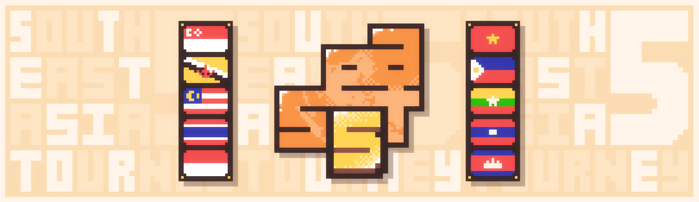
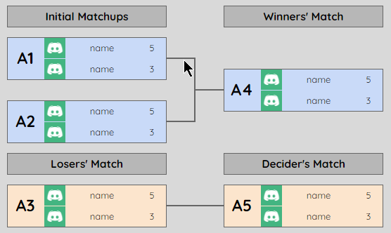

---
tags:
  - oSEAT
  - oSEAT5
---

# osu! South East Asia Tournament 5

The **osu! South East Asia Tournament 5** (***oSEAT5***) was a double-elimination 1v1 osu! tournament hosted by ::{ flag=MY }:: [Its not Marvin](https://osu.ppy.sh/users/13600612), ::{ flag=SG }:: [phox](https://osu.ppy.sh/users/772295), and ::{ flag=FR }:: [Taevas](https://osu.ppy.sh/users/7276846). The tournament was open to all players from all ten [ASEAN member states](https://asean.org/about-asean/member-states/) (::{ flag=BN }:: Brunei Darussalam, ::{ flag=KH }:: Cambodia, ::{ flag=ID }:: Indonesia, ::{ flag=LA }:: Laos, ::{ flag=MY }:: Malaysia, ::{ flag=MM }:: Myanmar, ::{ flag=PH }:: The Philippines, ::{ flag=SG }:: Singapore, ::{ flag=TH }:: Thailand, and ::{ flag=VN }:: Vietnam) regardless of rank. It was the fifth instalment of the osu! South East Asia Tournament.

## Tournament schedule

| Event | Timestamp |
| --: | :-- |
| Registration phase | 2021-10-31/2021-11-14 |
| Screening phase | 2021-11-15/2021-11-20 |
| Qualifiers | 2021-11-21/2021-11-28 |
| Preliminary groups | 2021-11-29/2021-12-05 |
| Round of 64 | 2021-12-06/2021-12-12 |
| Round of 32 | 2021-12-13/2021-12-19 |
| Round of 16 | 2020-12-20/2021-12-26 |
| *Holiday break* | 2021-12-27/2022-01-02 |
| Quarterfinals | 2022-01-03/2022-01-09 |
| Semifinals | 2022-01-10/2022-01-16 |
| Finals (week 1) | 2022-01-17/2022-01-23 |
| Finals (week 2) | 2022-01-24/2022-01-30 |

## Prizes

| Placing | Prize(s) |
| :-: | :-- |
|  | 12 months of osu!supporter, exclusive [Wrist Labs](https://www.instagram.com/wrist.labs/) goodie pack, unique profile badge |
|  | 6 months of osu!supporter |
|  | 4 months of osu!supporter |
| *4th place* | 2 months of osu!supporter |
| *5th place* | 1 month of osu!supporter |

## Organisation

oSEAT5 was run by various osu! community members predominantly hailing from various South East Asian countries.

| Position | Member(s) |
| :-- | :-- |
| Host | ::{ flag=MY }:: [Its not Marvin](https://osu.ppy.sh/users/13600612), ::{ flag=SG }:: [phox](https://osu.ppy.sh/users/772295), ::{ flag=FR }:: [Taevas](https://osu.ppy.sh/users/7276846) |
| Mappool selector | ::{ flag=SG }:: [phox](https://osu.ppy.sh/users/772295) |
| Playtester | ::{ flag=ID }:: [Walfrid](https://osu.ppy.sh/users/6600809), ::{ flag=SG }:: [pashty](https://osu.ppy.sh/users/9576725), ::{ flag=ID }:: [Daffy](https://osu.ppy.sh/users/5968633), ::{ flag=TH }:: [Deppyforce](https://osu.ppy.sh/users/5286213), ::{ flag=ID }:: [Skydiver](https://osu.ppy.sh/users/4750008), ::{ flag=ID }:: [SDKO](https://osu.ppy.sh/users/4858555), ::{ flag=DE }:: [Menty](https://osu.ppy.sh/users/36192840), ::{ flag=US }:: [daw9801](https://osu.ppy.sh/users/4773094) |
| Streamer | ::{ flag=MY }:: [Hand Sanitiser](https://osu.ppy.sh/users/5091293), ::{ flag=MY }:: [Laphii](https://osu.ppy.sh/users/9364594), ::{ flag=MY }:: [My Angel Petra](https://osu.ppy.sh/users/8691555), ::{ flag=TW }:: [XzCraftP](https://osu.ppy.sh/users/1593180) |
| Commentator | ::{ flag=PH }:: [TofuDoriftu](https://osu.ppy.sh/users/17812861), ::{ flag=MY }:: [LouisZpro](https://osu.ppy.sh/users/6231292), ::{ flag=PH }:: [Kikomeister](https://osu.ppy.sh/users/11570118), ::{ flag=MY }:: [malaidan](https://osu.ppy.sh/users/14279913), ::{ flag=PH }:: [RuiTachi-](https://osu.ppy.sh/users/11807272) |
| Referee | ::{ flag=MY }:: [Hand Sanitiser](https://osu.ppy.sh/users/5091293), ::{ flag=MY }:: [Laphii](https://osu.ppy.sh/users/9364594), ::{ flag=ID }:: [FikriEka](https://osu.ppy.sh/users/4176856), ::{ flag=VN }:: [rock-on](https://osu.ppy.sh/users/9676089), ::{ flag=VN }:: [Chitanda Eru](https://osu.ppy.sh/users/10004804), ::{ flag=PH }:: [Loreal](https://osu.ppy.sh/users/9362231), ::{ flag=MY }:: [Xyrelyx](https://osu.ppy.sh/users/3765632), ::{ flag=PH }:: [Chooga](https://osu.ppy.sh/users/9477784), ::{ flag=SG }:: [ellyn](https://osu.ppy.sh/users/10592989), ::{ flag=HK }:: [KR1L1Z13](https://osu.ppy.sh/users/16629149), ::{ flag=HK }:: [ShadeCegLgMn](https://osu.ppy.sh/users/12609866), ::{ flag=FR }:: [jehukm](https://osu.ppy.sh/users/10981418), ::{ flag=PL }:: [Kondi](https://osu.ppy.sh/users/7382321), ::{ flag=DE }:: [TheHunter1](https://osu.ppy.sh/users/6496016), ::{ flag=US }:: [Aoiyuuki-](https://osu.ppy.sh/users/1820694) |
| Graphic designer | ::{ flag=SG }:: [megumic](https://osu.ppy.sh/users/7537133) |
| Spreadsheet manager | ::{ flag=MY }:: [Its not Marvin](https://osu.ppy.sh/users/13600612), ::{ flag=SG }:: [phox](https://osu.ppy.sh/users/772295) |
| Wiki editor | ::{ flag=ID }:: [Niva](https://osu.ppy.sh/users/197805) |

## Links

- **[Main spreadsheet](https://docs.google.com/spreadsheets/d/1wwwyS47vH-N7S-IMAgl9FulTP8lepaKNAOGxLgJ0bBs/edit#gid=0)**
- [Forum thread](https://osu.ppy.sh/community/forums/topics/1452561)
- [Discord server](https://discord.gg/sVHndPU)
- [Challonge brackets](https://challonge.com/osuseat5)
- [Livestream channel](https://www.twitch.tv/osusea)

## Participants

Listed below are the players who managed to qualify into the Preliminary groups (along with their respective bracket, seeding, and group placements) out of 176 registered players in total.

- *Upper bracket:*

| Group | Seed A | Seed B | Seed C | Seed D |
| :-: | :-- | :-- | :-- | :-- |
| A | ::{ flag=SG }:: [Tebi](https://osu.ppy.sh/users/5407620) | ::{ flag=SG }:: [Rtyzen](https://osu.ppy.sh/users/2439822) | ::{ flag=MY }:: [DuoX](https://osu.ppy.sh/users/9560694) | ::{ flag=VN }:: [realshin](https://osu.ppy.sh/users/8006029) |
| B | ::{ flag=ID }:: [Crezz](https://osu.ppy.sh/users/7108275) | ::{ flag=TH }:: [ChaiPhukChep](https://osu.ppy.sh/users/9723127) | ::{ flag=ID }:: [Vinno](https://osu.ppy.sh/users/10717635) | ::{ flag=SG }:: [Picon](https://osu.ppy.sh/users/8447637) |
| C | ::{ flag=SG }:: [Demonical](https://osu.ppy.sh/users/5447609) | ::{ flag=ID }:: [Lifeline](https://osu.ppy.sh/users/11367222) | ::{ flag=ID }:: [Venta](https://osu.ppy.sh/users/11320627) | ::{ flag=TH }:: [Salvotore](https://osu.ppy.sh/users/3394696) |
| D | ::{ flag=PH }:: [Rammu](https://osu.ppy.sh/users/10652837) | ::{ flag=SG }:: [GSBlank](https://osu.ppy.sh/users/2312106) | ::{ flag=TH }:: [\[AmPhyze\]](https://osu.ppy.sh/users/9552188) | ::{ flag=TH }:: [-Kedama](https://osu.ppy.sh/users/12147277) |
| E | ::{ flag=SG }:: [Eagle5324](https://osu.ppy.sh/users/11987104) | ::{ flag=ID }:: [Thatnoobguy](https://osu.ppy.sh/users/11091594) | ::{ flag=PH }:: [BronyPH](https://osu.ppy.sh/users/1492995) | ::{ flag=VN }:: [walle](https://osu.ppy.sh/users/8431549) |
| F | ::{ flag=ID }:: [Rexeez](https://osu.ppy.sh/users/1987591) | ::{ flag=ID }:: [deeto](https://osu.ppy.sh/users/10069909) | ::{ flag=SG }:: [\_gt](https://osu.ppy.sh/users/8301957) | ::{ flag=SG }:: [dlwlrma-](https://osu.ppy.sh/users/7908994) |
| G | ::{ flag=SG }:: [megumic](https://osu.ppy.sh/users/7537133) | ::{ flag=PH }:: [BronyPH 2](https://osu.ppy.sh/users/7246165) | ::{ flag=VN }:: [SkyArrow](https://osu.ppy.sh/users/4039647) | ::{ flag=MY }:: [Inugami Korone](https://osu.ppy.sh/users/4474918) |
| H | ::{ flag=PH }:: [NathanRammu2044](https://osu.ppy.sh/users/8472976) | ::{ flag=SG }:: [Dawnwing](https://osu.ppy.sh/users/5144534) | ::{ flag=MY }:: [Tzero](https://osu.ppy.sh/users/6088976) | ::{ flag=TH }:: [- Seen -](https://osu.ppy.sh/users/5082392) |

- *Lower bracket:*

| Group | Seed A | Seed B | Seed C | Seed D |
| :-: | :-- | :-- | :-- | :-- |
| A | ::{ flag=ID }:: [Bunan-](https://osu.ppy.sh/users/2763354) | ::{ flag=SG }:: [Moltenfury](https://osu.ppy.sh/users/3395820) | ::{ flag=PH }:: [ToshiroKen](https://osu.ppy.sh/users/9550257) | ::{ flag=PH }:: [RuiTachi-](https://osu.ppy.sh/users/11807272) |
| B | ::{ flag=MY }:: [Chiyuu](https://osu.ppy.sh/users/8226107) | ::{ flag=ID }:: [OTWGE](https://osu.ppy.sh/users/11759284) | ::{ flag=TH }:: [Faken](https://osu.ppy.sh/users/10249166) | ::{ flag=BN }:: [Ui S](https://osu.ppy.sh/users/15525343) |
| C | ::{ flag=SG }:: [wick](https://osu.ppy.sh/users/8004317) | ::{ flag=TH }:: [chantat on osu](https://osu.ppy.sh/users/12290117) | ::{ flag=PH }:: [\[-Kurumi-\]](https://osu.ppy.sh/users/5414484) | ::{ flag=PH }:: [JayAreEee](https://osu.ppy.sh/users/10852557) |
| D | ::{ flag=PH }:: [-Graigory-](https://osu.ppy.sh/users/14024170) | ::{ flag=MY }:: [Hanami-](https://osu.ppy.sh/users/8703188) | ::{ flag=ID }:: [Cudi](https://osu.ppy.sh/users/9974314) | ::{ flag=SG }:: [Moroha29](https://osu.ppy.sh/users/9182389) |
| E | ::{ flag=PH }:: [xidorn](https://osu.ppy.sh/users/7904667) | ::{ flag=MY }:: [not\_aweeb](https://osu.ppy.sh/users/9375317) | ::{ flag=ID }:: [FishStar](https://osu.ppy.sh/users/12563284) | ::{ flag=MY }:: [GKen](https://osu.ppy.sh/users/12633052) |
| F | ::{ flag=SG }:: [Hecatia](https://osu.ppy.sh/users/8244635) | ::{ flag=SG }:: [RePeaTT](https://osu.ppy.sh/users/11132323) | ::{ flag=SG }:: [marcellasne\_](https://osu.ppy.sh/users/6622650) | ::{ flag=PH }:: [Swish0s](https://osu.ppy.sh/users/10971042) |
| G | ::{ flag=MY }:: [Mumei Nanashi](https://osu.ppy.sh/users/5414124) | ::{ flag=MY }:: [Ltwoed](https://osu.ppy.sh/users/13670830) | ::{ flag=ID }:: [Suikami](https://osu.ppy.sh/users/1929336) | ::{ flag=ID }:: [fnayR](https://osu.ppy.sh/users/2800253) |
| H | ::{ flag=ID }:: [Misaki - Rhythm](https://osu.ppy.sh/users/7128826) | ::{ flag=SG }:: [Milk Tee](https://osu.ppy.sh/users/6708955) | ::{ flag=MY }:: [DaNoobSlayaar](https://osu.ppy.sh/users/8688777) | ::{ flag=SG }:: [sinn](https://osu.ppy.sh/users/4262229) |
| I | ::{ flag=US }:: (::{ flag=PH }::) [\_Kolin](https://osu.ppy.sh/users/7249644)[^flag-note-1] | ::{ flag=MY }:: [Agagak](https://osu.ppy.sh/users/3645490) | ::{ flag=SG }:: [Inquisitives](https://osu.ppy.sh/users/10722794) | ::{ flag=SG }:: [OppaiSuki](https://osu.ppy.sh/users/1285403) |
| J | ::{ flag=VN }:: [\[sin\]](https://osu.ppy.sh/users/11021073) | ::{ flag=PH }:: [aurora on osu](https://osu.ppy.sh/users/12352050) | ::{ flag=MY }:: [Floth](https://osu.ppy.sh/users/11134301) | ::{ flag=MY }:: [LITFAM123](https://osu.ppy.sh/users/13584478) |
| K | ::{ flag=ID }:: [Tazkiz](https://osu.ppy.sh/users/3738010) | ::{ flag=SG }:: [Rtzero](https://osu.ppy.sh/users/9262462) | ::{ flag=MY }:: [Chizu-Kun](https://osu.ppy.sh/users/10288461) | ::{ flag=SG }:: [JokThree](https://osu.ppy.sh/users/7713152) |
| L | ::{ flag=PH }:: [2 and eight](https://osu.ppy.sh/users/8923608) | ::{ flag=ID }:: [DeathAdderz](https://osu.ppy.sh/users/7457788) | ::{ flag=SG }:: [moosepi](https://osu.ppy.sh/users/1868745) | ::{ flag=MY }:: [\_Rel\_](https://osu.ppy.sh/users/11622287) |
| M | ::{ flag=TH }:: [Yorocchi](https://osu.ppy.sh/users/5286218) | ::{ flag=SG }:: [Grantorio](https://osu.ppy.sh/users/5623529) | ::{ flag=VN }:: [Phoeni\_](https://osu.ppy.sh/users/14953642) | ::{ flag=PH }:: [Kagitingan](https://osu.ppy.sh/users/7407323) |
| N | ::{ flag=PH }:: [NathanSS](https://osu.ppy.sh/users/8500628) | ::{ flag=ID }:: [DeZpair](https://osu.ppy.sh/users/7518843) | ::{ flag=PH }:: [ChaeY\_Milk](https://osu.ppy.sh/users/10383440) | ::{ flag=JP }:: (::{ flag=PH }::) [ZHKPN](https://osu.ppy.sh/users/13042221)[^flag-note-2] |
| O | ::{ flag=ID }:: [-TwiHD](https://osu.ppy.sh/users/5470299) | ::{ flag=MY }:: [Houshou Marine](https://osu.ppy.sh/users/6402211) | ::{ flag=SG }:: [D3rpyB01](https://osu.ppy.sh/users/11772019) | ::{ flag=SG }:: [Shleepy](https://osu.ppy.sh/users/8486823) |
| P | ::{ flag=PH }:: [konawiki](https://osu.ppy.sh/users/4003979) | ::{ flag=PH }:: [Senjuro](https://osu.ppy.sh/users/3003839) | ::{ flag=SG }:: [kirkirs](https://osu.ppy.sh/users/9902622) | ::{ flag=SG }:: [hollowknees](https://osu.ppy.sh/users/15195364) |

## Podium

This competition has come to an end and resulted in the following podium:

| Placing | Player |
| :-: | :-- |
|  | ::{ flag=ID }:: [Lifeline](https://osu.ppy.sh/users/11367222) |
|  | ::{ flag=PH }:: [NathanRammu2044](https://osu.ppy.sh/users/8472976) |
|  | ::{ flag=SG }:: [Tebi](https://osu.ppy.sh/users/5407620) |

## Mappools

### Finals (week 2)

**[Download the mappack here! (185 MB)](https://drive.google.com/u/0/uc?id=1sveB_3TPuXj7_oJNIFs-GkCmwOQIs_Pa&export=download)**

- NoMod
  1. [ELFENSJoN - ASH OF ROUGE (Xayah) \[pog\]](https://osu.ppy.sh/beatmapsets/1471010#osu/3019994)
  2. [UNDEAD CORPORATION - The silent world (Aeril) \[Armageddon\]](https://osu.ppy.sh/beatmapsets/1581330#osu/3229017)
  3. [TOMOSUKE - Macuilxochitl (Raijodo) \[Flower (phox's CS4 Edit)\]](https://osu.ppy.sh/beatmapsets/1683090#osu/3438884)
  4. [Silentroom - NULCTRL (factal Remix) (Xarr) \[fluid\]](https://osu.ppy.sh/beatmapsets/1256524#osu/2611132)
  5. [Spire - Somnambulism (verychill) \[LMT's Lucid Nightmare\]](https://osu.ppy.sh/beatmapsets/1171893#osu/3120531)
  6. [tarolabo - eth ken (ktgster) \[Extreme (phox's AR9 Edit)\]](https://osu.ppy.sh/beatmapsets/1683088#osu/3438882)
- Hidden
  1. [Yorushika - Walk (Ryuusei Aika) \[Whitening Memory, Catchpenny Pattern and You\]](https://osu.ppy.sh/beatmapsets/1518479#osu/3108320)
  2. [void (Mournfinale) - World Vanquisher (Deppyforce) \[De-structurization\]](https://osu.ppy.sh/beatmapsets/1683078#osu/3438866)
  3. [Kijibato - w/WWW feat. Hoshimiya Toto (-Tynamo) \[Endless\]](https://osu.ppy.sh/beatmapsets/1329408#osu/2753990)
  4. [DJ Myosuke - Behemoth (Mazzerin) \[D357RUC710N\]](https://osu.ppy.sh/beatmapsets/1612153#osu/3291477)
- HardRock
  1. [EPICA - The Cosmic Algorithm (Mordred) \[anime map\]](https://osu.ppy.sh/beatmapsets/1479445#osu/3035067)
  2. [Otokaze - SaiGetsu (Cut Ver.) (Yusomi) \[Years\]](https://osu.ppy.sh/beatmapsets/746240#osu/1572866)
  3. [Given - Fuyu no Hanashi (Yudragen) \[All that you've left behind, has become my everything\]](https://osu.ppy.sh/beatmapsets/1401056#osu/2890370)
  4. [ClariS - Hitorigoto (TV Size) (Net0) \[Faito's Expert\]](https://osu.ppy.sh/beatmapsets/1292749#osu/2688323)
- DoubleTime
  1. [LazuLight - Diamond City Lights (\[ TNTlealu \]) \[Rainbow\]](https://osu.ppy.sh/beatmapsets/1464031#osu/3017567)
  2. [-45 - System Sun (Lasse) \[Insane (Flask's 1.12x (170bpm) Edit)\]](https://osu.ppy.sh/beatmapsets/1658007#osu/3384275)
  3. [Denkishiki Karen Ongaku Shuudan - Aoki Kotou no Anguis (OliBomby) \[TheBlank's Insane\]](https://osu.ppy.sh/beatmapsets/989342#osu/2069602)
  4. [Hatsune Miku - With a Dance Number (val0108) \[0108 style\]](https://osu.ppy.sh/beatmapsets/29691#osu/98415)
- FreeMod
  1. [USAO - Hastur (Extended Mix) (Regou) \[Anomaly\]](https://osu.ppy.sh/beatmapsets/1313256#osu/2721644)
  2. [Utah Saints - Something Good '08 (Radio Edit) (xDololow) \[Running Child\]](https://osu.ppy.sh/beatmapsets/456463#osu/2194972)
  3. [xi - Blue Zenith (Asphyxia) \[FOUR DIMENSIONS\]](https://osu.ppy.sh/beatmapsets/292301#osu/658127)

### Finals (week 1)

**[Download the mappack here! (172 MB)](https://drive.google.com/u/0/uc?id=182y2MbubZEM0g5WCiEWX1wOgdCvL5btH&export=download)**

- NoMod
  1. [RAISE A SUILEN - HELL! or HELL? (Strategas) \[RAS\]](https://osu.ppy.sh/beatmapsets/1251944#osu/2602090)
  2. [Hino Isuka - Dreamin' attraction!! (My Angel Watame) \[Hellish Attraction!! (Nerf)\]](https://osu.ppy.sh/beatmapsets/1181405#osu/3420222)
  3. [siromaru + cranky - conflict (yf\_bmp) \[Intersection\]](https://osu.ppy.sh/beatmapsets/1212359#osu/3107406)
  4. [Billain - Codename (winber1) \[\_.\]](https://osu.ppy.sh/beatmapsets/1495814#osu/3066436)
  5. [Cattle Decapitation - Your Disposal (Chanci) \[Eradication\]](https://osu.ppy.sh/beatmapsets/988109#osu/2207855)
  6. [Nekomata Master - Life is beautiful (DeviousPanda) \[Extravaganza (Tournament Ver.)\]](https://osu.ppy.sh/beatmapsets/1570515#osu/3207016)
- Hidden
  1. [bbno$ & Rich Brian - edamame (PotatoDew) \[nerf\]](https://osu.ppy.sh/beatmapsets/1589180#osu/3245938)
  2. [Alstroemeria Records feat. ayame - SACRIFICE (Original Mix) (Nuvolina) \[Extra\]](https://osu.ppy.sh/beatmapsets/1161525#osu/2423227)
  3. [IOSYS - Kanbu de Tomatte Sugu Tokeru ~ Kyouki no Udongein (eiri-) \[ExGon & Len's Classic Extra\]](https://osu.ppy.sh/beatmapsets/1442363#osu/3121361)
  4. [A-One feat. ayaponzu\* - Justice Monster (Chizu-Kun) \[Phantasm\]](https://osu.ppy.sh/beatmapsets/1513750#osu/3099250)
- HardRock
  1. [Hoshimachi Suisei - Jibunkatte Dazzling (-Atri-) \[Ji Ba vtuber Tu\]](https://osu.ppy.sh/beatmapsets/1565297#osu/3196416)
  2. [Natsuiro Burning Love\*Prim - Sore wa Hanabi no Youna Koi (Yooh) \[Fragile Love\]](https://osu.ppy.sh/beatmapsets/1419210#osu/2923717)
  3. [Sanxion7 - Gargoyle (2009 version) (Down) \[Emerald\]](https://osu.ppy.sh/beatmapsets/1373720#osu/2839980)
  4. [Michael Jackson - Smooth Criminal (FailureAtOsu) \[Crescendo\]](https://osu.ppy.sh/beatmapsets/1297771#osu/2692157)
- DoubleTime
  1. [senya - Shounen yo, Tokkou no Sakigake to Nare (-Mo-) \[Catharsis\]](https://osu.ppy.sh/beatmapsets/562169#osu/1188549)
  2. [Sano Denji - Taiko Time (Flask) \[SEAT5 Time\]](https://osu.ppy.sh/beatmapsets/1536761#osu/3428157)
  3. [UNDEAD CORPORATION - Murasa (MaridiuS) \[Seni's Lunatic\]](https://osu.ppy.sh/beatmapsets/1280200#osu/3257630)
  4. [Black Eyed Peas - Boom Boom Pow (mrowswares) \[Ultra\]](https://osu.ppy.sh/beatmapsets/1263837#osu/2626918)
- FreeMod
  1. [96Neko feat. Kogeinu - Akatsuki Arrival (Down) \[Extra\]](https://osu.ppy.sh/beatmapsets/1529859#osu/3129297)
  2. [SEPHID - The Public Parallel (Camo) \[Master\]](https://osu.ppy.sh/beatmapsets/1627418#osu/3322445)
  3. [Hakui Koyori - "Hmm,Ah,Ah." (Deppyforce) \[x.x\]](https://osu.ppy.sh/beatmapsets/1662519#osu/3393912)

### Semifinals

**[Download the mappack here! (201 MB)](https://drive.google.com/u/0/uc?id=1nnjbj9lfIZMOmK_KePSBn60SCwd_1f4g&export=download)**

- NoMod
  1. [KISIDA KYODAN & THE AKEBOSI ROCKETS - Strike The Blood (Maot) \[Ipputasai\]](https://osu.ppy.sh/beatmapsets/1587864#osu/3243028)
  2. [Musical Masterpiece - M-A(FOOLISH) (idke) \[GYZE - HONESTY\]](https://osu.ppy.sh/beatmapsets/1306566#osu/2708949)
  3. [HIDEKI NAGANUMA - AIN'T NOTHIN' LIKE A FUNKY BEAT (yaspo) \[AIN'T NOTHIN' LIKE A FUNKY BEAT\]](https://osu.ppy.sh/beatmapsets/1627451#osu/3322521)
  4. [Elliot Hsu - Reality Purge (Realazy) \[Aether\]](https://osu.ppy.sh/beatmapsets/1508500#osu/3089374)
  5. [DJ Myosuke & Gram - JINGLE DEATH (Regou) \[Otosaka's Requiem... Extra\]](https://osu.ppy.sh/beatmapsets/1616023#osu/3328315)
  6. [Ookami Mio - Sparkle (Deppyforce) \[Very Hard\]](https://osu.ppy.sh/beatmapsets/1202031#osu/2503405)
- Hidden
  1. [Sangatsu no Phantasia - Seishun nante Iranaiwa (Smug Nanachi) \[Adolescence\]](https://osu.ppy.sh/beatmapsets/1146237#osu/2393405)
  2. [KOTOKO - Koi Kou Enishi (Shikibe Mayu) \[newton's Expert: Mako\]](https://osu.ppy.sh/beatmapsets/1404864#osu/3247654)
  3. [Masahiro "Godspeed" Aoki - Frostbite (Cut Ver.) (Niva) \[kuyusu's Expert\]](https://osu.ppy.sh/beatmapsets/1501511#osu/3081403)
- HardRock
  1. [MisomyL - Ring ! Run ! Nyan!! (Fisky) \[Genetically ! Engineered ! Catgirls!!\]](https://osu.ppy.sh/beatmapsets/1536674#osu/3141960)
  2. [USAO - Knight Rider (RLC) \[Extra\]](https://osu.ppy.sh/beatmapsets/1156969#osu/2414318)
  3. [luz - Doku Ringo to Cinderella (Ametrin) \[Fairy Tale?\]](https://osu.ppy.sh/beatmapsets/664784#osu/1406919)
- DoubleTime
  1. [Eriri Spencer Sawamura, Utaha Kasumigaoka, Megumi Kato - LOVE iLLUSiON (jordanlr7) \[Insane\]](https://osu.ppy.sh/beatmapsets/1648765#osu/3365328)
  2. [ARM (IOSYS) - Last Occultism \~ Utsushiyo no Hijutsu-shi (eiri-) \[Zekk's Insane\]](https://osu.ppy.sh/beatmapsets/1616038#osu/3359825)
  3. [REDALiCE - Great Nano Desu\* (YokesPai) \[Insane\]](https://osu.ppy.sh/beatmapsets/1587332#osu/3241887)
  4. [Zu Hai - Hao Yun Lai (kanor) \[My turn, draw!!!!!!\]](https://osu.ppy.sh/beatmapsets/1090501#osu/2279607)
- FreeMod
  1. [Sharpnel High Speed Music Team - Exciting Hyper Highspeed Star (fanzhen0019) \[Hyper Highspeed\]](https://osu.ppy.sh/beatmapsets/1070942#osu/2241715)
  2. [Katakiri Rekka - Answer (ShirohaMyMommy) \[AxariousMyMommy Collab\]](https://osu.ppy.sh/beatmapsets/1062653#osu/2225299)
  3. [mafumafu - I wanna be a girl (Night Mare) \[Can I Become One, Please?\]](https://osu.ppy.sh/beatmapsets/1069248#osu/2238336)

### Quarterfinals

**[Download the mappack here! (190 MB)](https://drive.google.com/u/0/uc?id=1myZcitGg68YqK2MoHLb2xv7USoObZ5Mv&export=download)**

- NoMod
  1. [nonoc - Relive (0ugi) \[Extreme: Rem\]](https://osu.ppy.sh/beatmapsets/1226951#osu/2551412)
  2. [Xi - Broken the Moon (-Tynamo) \[suika ibuki broke the moon\]](https://osu.ppy.sh/beatmapsets/1597800#osu/3263130)
  3. [Yonekura Chihiro - DEAR MY WAKER (Skystar) \[Overdrive\]](https://osu.ppy.sh/beatmapsets/1579180#osu/3224533)
  4. [Zekk - Freefall (0ppInOsu) \[0pp's bread is dead\]](https://osu.ppy.sh/beatmapsets/1581139#osu/3228592)
  5. [Okui Masami - God Speed (ykcarrot) \[Insane (AJT's 240BPM Edit)\]](https://osu.ppy.sh/beatmapsets/1129735#osu/2359996)
  6. [MAD CHILD - Voice 2 Voice (Kawashiro) \[Yugu's MAXIMUM\]](https://osu.ppy.sh/beatmapsets/1361203#osu/2987273)
- Hidden
  1. [Araki x nqrse x Meychan - Odo (Chizu-Kun) \[Axaptice's Extra\]](https://osu.ppy.sh/beatmapsets/1545055#osu/3195697)
  2. [siqlo - wholeheartedly (Feiri) \[Extra\]](https://osu.ppy.sh/beatmapsets/1439394#osu/3297831)
  3. [Kenshi Yonezu - MAD HEAD LOVE (Keqing) \[NEWTON'S LOVE INSANE\]](https://osu.ppy.sh/beatmapsets/1429536#osu/3205010)
- HardRock
  1. [Hoshimachi Suisei - GHOST (Amateurre) \[Mayu's Extreme\]](https://osu.ppy.sh/beatmapsets/1432314#osu/2962189)
  2. [Laur - Vindication (Cubby) \[Extra\]](https://osu.ppy.sh/beatmapsets/1580046#osu/3226352)
  3. [Ian Taylor - Sea Shanty 2 (Kyshiro) \[Buying gf 10gp\]](https://osu.ppy.sh/beatmapsets/1484283#osu/3044046)
- DoubleTime
  1. [Printemps - Eien Friends (Sakaue Nachi) \[Friends\]](https://osu.ppy.sh/beatmapsets/235836#osu/546514)
  2. [zts - miragecoordinator (Tsumugi-chan) \[Collab Expert\]](https://osu.ppy.sh/beatmapsets/1085924#osu/2270798)
  3. [Tatsh feat. Tsukiko - Floating Darkness (Natteke) \[Collab\]](https://osu.ppy.sh/beatmapsets/22173#osu/76612)
  4. [Rigel Theatre - SPIKA (Lunala) \[Fantasy\]](https://osu.ppy.sh/beatmapsets/993379#osu/2077290)
- FreeMod
  1. [KAMELOT - Vespertine (My Crimson Bride) (LMT) \[ar9.3\]](https://osu.ppy.sh/beatmapsets/1000057#osu/3401158)
  2. [A.SAKA - Nanatsu Koyoto (My Angel Watame) \[Kawa's Extra\]](https://osu.ppy.sh/beatmapsets/768281#osu/1618445)
  3. [senya - Kimiiro Subliminal (AtHeoN) \[Satellite\]](https://osu.ppy.sh/beatmapsets/418398#osu/1031948)

### Round of 16

**[Download the mappack here! (204 MB)](https://drive.google.com/u/0/uc?id=1Qo_PPRZQtm2dIOoYRPDpOzLP8g8kfAIR&export=download)**

- NoMod
  1. [TRUE - Soundscape (Azunyan-) \[Fortissimo\]](https://osu.ppy.sh/beatmapsets/1173554#osu/2447685)
  2. [Jun Kuroda - Coquette (Suicune3) \[Oni\]](https://osu.ppy.sh/beatmapsets/1551222#osu/3169923)
  3. [FELT - Goodbye (Hysteria) \[Farewell (phox's Introless Edit)\]](https://osu.ppy.sh/beatmapsets/1655798#osu/3379847)
  4. [IAHN - Transform (Original Mix) (Daycore) \[Eula's Extreme\]](https://osu.ppy.sh/beatmapsets/1381820#osu/3162796)
  5. [Morimori Atsushi - Time Machine (Elcheer) \[03:45:104 1.05x (230bpm)\]](https://osu.ppy.sh/beatmapsets/1286317#osu/2670818)
- Hidden
  1. [Epica - Fight Your Demons (KogumaX) \[Expert\]](https://osu.ppy.sh/beatmapsets/1615425#osu/3298109)
  2. [Tsukuyomi - Moonlight at midday (Seros) \[Extra\]](https://osu.ppy.sh/beatmapsets/1537310#osu/3143258)
  3. [Blakfish - Jeremy Kyle Is A Marked Man (Serafeim) \[End on happiness\]](https://osu.ppy.sh/beatmapsets/1620017#osu/3307624)
- HardRock
  1. [ONE OK ROCK - One by One (Noob55) \[Kirishima-'s Extreme\]](https://osu.ppy.sh/beatmapsets/1183373#osu/2568117)
  2. [Kanban Musume-tai - Suki de Sugoi ni Naritai na (Kyuuchie) \[Nagachienyuni's Caffeine Overdose\]](https://osu.ppy.sh/beatmapsets/1566547#osu/3198645)
  3. [Tokoyami Towa - Palette (Restart Button) \[Expert\]](https://osu.ppy.sh/beatmapsets/1425822#osu/2935945)
- DoubleTime
  1. [Yonekura Chihiro - Be braver! (Shikibe Mayu) \[Shizurre's Insane\]](https://osu.ppy.sh/beatmapsets/1433072#osu/2950591)
  2. [Kola Kid - timer (Mirash) \[Insane\]](https://osu.ppy.sh/beatmapsets/1089084#osu/2277128)
  3. [ZUTOMAYO - STUDY ME (GIDZ) \[Collab Insane\]](https://osu.ppy.sh/beatmapsets/1353446#osu/2911090)
- FreeMod
  1. [Rohi - LvC3 (VINXIS) \[RLC's Extra\]](https://osu.ppy.sh/beatmapsets/1231655#osu/2560356)
  2. [La priere - Senjou no Utahime (Hinsvar) \[Valkyrie\]](https://osu.ppy.sh/beatmapsets/1398580#osu/2885693)
  3. [M2U - A Bella! (feat. Lucy) (rollpan) \[ExtrA\]](https://osu.ppy.sh/beatmapsets/1517567#osu/3106686)

### Round of 32

**[Download the mappack here! (135 MB)](https://drive.google.com/u/0/uc?id=1iARuFmoze2zdClpV9a52DDPikMYL4Fqg&export=download)**

- NoMod
  1. [TUYU - Namikare (jonathanlfj) \[Superior\]](https://osu.ppy.sh/beatmapsets/1174754#osu/2450295)
  2. [Wotamin - Gigantic O.T.N (-Tynamo) \[Love Game\]](https://osu.ppy.sh/beatmapsets/1605439#osu/3278348)
  3. [Tenjin Kotone - Who Are You Nante Iwanaide (Talulah) \[The not boring diff\]](https://osu.ppy.sh/beatmapsets/1266996#osu/2686649)
  4. [Frums (unknown "lambda") - 19ZZ (pocket-) \[D083F431190D51707475CB37EDF4F1E5\]](https://osu.ppy.sh/beatmapsets/1388112#osu/2866795)
  5. [SPACELECTRO - Glow (pw384) \[FUTURE ANOMALY\]](https://osu.ppy.sh/beatmapsets/1378482#osu/2952961)
- Hidden
  1. [Yousei Teikoku - Paradiso=Inferno (IsomirDiAngelo) \[Net0's Extra\]](https://osu.ppy.sh/beatmapsets/1296273#osu/2750915)
  2. [Mitsukiyo - Unwelcome School (gazimal) \[AdveNt's Insane\]](https://osu.ppy.sh/beatmapsets/1541421#osu/3158362)
  3. [BEMANI Sound Team "Yvya" - Fuego -GITADORA EDITION- (Seolv) \[captin's MASTER\]](https://osu.ppy.sh/beatmapsets/1436535#osu/2955651)
- HardRock
  1. [REDALiCE & cosMoP@Bousou-P - ANGEL HALO (PayneTrain) \[INFERNO\]](https://osu.ppy.sh/beatmapsets/1278290#osu/2655635)
  2. [Luck Ganriki feat. Kino Nei - Kina no Kaori \~Ai no Shiren!\~ (eiri-) \[Ayyri & Yuuya's Expert\]](https://osu.ppy.sh/beatmapsets/1300086#osu/2696952)
  3. [Parov Stelar - Libella Swing (Taeyang) \[Extra\]](https://osu.ppy.sh/beatmapsets/991657#osu/2073859)
- DoubleTime
  1. [adieu - Ao (Rtyzen) \[Blue Sky\]](https://osu.ppy.sh/beatmapsets/1076185#osu/2251839)
  2. [umu. - Dareka no Shinzou ni Nareta Nara (xbopost) \[Collab Insane\]](https://osu.ppy.sh/beatmapsets/1098181#osu/2321761)
  3. [Tamura Yukari - Endless Story (lolcubes) \[Insane\]](https://osu.ppy.sh/beatmapsets/38426#osu/123021)
- FreeMod
  1. [goreshit - looming shadow of a tree long gone (Hobbes2) \[greenhobbes' extreme\]](https://osu.ppy.sh/beatmapsets/1072094#osu/2972038)
  2. [ZUTOMAYO - Byoushin o Kamu (semaphore) \[attendant's Another\]](https://osu.ppy.sh/beatmapsets/1352963#osu/2968941)
  3. [ROCKY CHACK, Lil Jon & The East Side Boyz - Ringo Biyori \~The Wolf Whistling Song x Get Low (feat. Ying Yang Twins) (Deramok) \[Insane\]](https://osu.ppy.sh/beatmapsets/1062345#osu/2538882)

### Round of 64

**[Download the mappack here! (184 MB)](https://drive.google.com/file/d/1o3fiz1dVRf7W2ZLxVCgjoInhs53IQAWb/view?usp=sharing)**

- NoMod
  1. [Coda - Fighting Gold (Saika0k1) \[Gold Experience\]](https://osu.ppy.sh/beatmapsets/1588182#osu/3243699)
  2. [BlackY - KITTY FOILED (AdveNt) \[mischievous old\]](https://osu.ppy.sh/beatmapsets/1644809#osu/3357412)
  3. [fripSide - HesitationSnow (Fushimi Rio) \[Extra\]](https://osu.ppy.sh/beatmapsets/1329838#osu/2755377)
  4. [ISOMERZ (DJ Raisei + seatrus) - Symmetric (Realazy) \[Amateurre's Expert\]](https://osu.ppy.sh/beatmapsets/1381824#osu/2954718)
  5. [MisoilePunch - VVelcome!! (R3m) \[Flask's EXHAUST\]](https://osu.ppy.sh/beatmapsets/1235627#osu/3179665)
- Hidden
  1. [Hoshimachi Suisei & Amane Kanata - Tsukiakari (Amateurre) \[captin's Expert\]](https://osu.ppy.sh/beatmapsets/1296278#osu/2716344)
  2. [LeaF - MEPHISTO (Alumetorz) \[Extra\]](https://osu.ppy.sh/beatmapsets/106212#osu/278451)
  3. [Yonekura Chihiro - Smiling-Swinging!! (Shikibe Mayu) \[Deppy's Insane\]](https://osu.ppy.sh/beatmapsets/1568530#osu/3274180)
- HardRock
  1. [Inugami Korone - SAIKYO TENSAI WONDERFUL WORLD of KORONE (Yuuma) \[Yubi Yubi\]](https://osu.ppy.sh/beatmapsets/1431435#osu/2946557)
  2. [MYTK - Senkyou (Realazy) \[Cubby's Insane\]](https://osu.ppy.sh/beatmapsets/1262410#osu/2623949)
  3. [HuMeR - ChaserXX (Realazy) \[Kkip's Another\]](https://osu.ppy.sh/beatmapsets/930846#osu/2066790)
- DoubleTime
  1. [Chino (CV: Inori Minase) - Mirai Puzzle (My Angel Ram) \[Insane\]](https://osu.ppy.sh/beatmapsets/1547564#osu/3187933)
  2. [Aki - Darkish (Lortus) \[Light Insane\]](https://osu.ppy.sh/beatmapsets/514965#osu/1097552)
  3. [Amane - Melt in the sky (Gabi) \[Lunatic\]](https://osu.ppy.sh/beatmapsets/930846#osu/2066790)
- FreeMod
  1. [Camellia feat. Nanahira - Kizuitara Shunkashuutou (HeTo) \[Dubturt's Extra\]](https://osu.ppy.sh/beatmapsets/1120946#osu/2361902)
  2. [Nekomata Master feat. \*spiLa\* - Clumsy thoughts (AJT) \[Emotions\]](https://osu.ppy.sh/beatmapsets/1544696#osu/3157348)
  3. [L.E.D. - THE LAST STRIKER (Amamiya Yuko) \[Another\]](https://osu.ppy.sh/beatmapsets/129065#osu/326367)

### Preliminary groups (upper bracket)

**[Download the mappack here! (108 MB)](https://drive.google.com/u/0/uc?id=16uRQfNAqnSCC_9iy6YWug-e2WSmT-Kng&export=download)**

- NoMod
  1. [Twin-Tails - Twintail Dreamer! (AtHeoN) \[Twintail\]](https://osu.ppy.sh/beatmapsets/388449#osu/847386)
  2. [Ice - Amber Wishes (Deemo edit) (Astronic) \[Aspiration\]](https://osu.ppy.sh/beatmapsets/1610241#osu/3287781)
  3. [BlackY - Sakura Ranman Cleopatra (Rtyzen) \[Extra\]](https://osu.ppy.sh/beatmapsets/1626963#osu/3321639)
  4. [lapix - Outer Space (lcfc) \[Extreme\]](https://osu.ppy.sh/beatmapsets/1544179#osu/3156268)
  5. [Shade - Mars (LMT) \[Hyper (phox's 1.63x Edit)\]](https://osu.ppy.sh/beatmapsets/1639259#osu/3345763)
- Hidden
  1. [Sakuzyo - FAFNIR (Sulfur) \[-kevincela-'s Extreme\]](https://osu.ppy.sh/beatmapsets/777255#osu/1634515)
  2. [Hijirime Laeria - stlaeria (Hinsvar) \[Salvation\]](https://osu.ppy.sh/beatmapsets/1352739#osu/2800493)
- HardRock
  1. [ELECTROCUTICA feat. EVO+ - Moon Seeker (Lulu-) \[Lulu x Bonzi — Pulsation\]](https://osu.ppy.sh/beatmapsets/1235544#osu/2568398)
  2. [MK feat. YURiE - Spiral (FrenZ396) \[Extra\]](https://osu.ppy.sh/beatmapsets/1570048#osu/3206058)
- DoubleTime
  1. [Ceui - Rainbow Days (Shikibe Mayu) \[Insane\]](https://osu.ppy.sh/beatmapsets/1181354#osu/2464147)
  2. [Bomfunk MC's - Freestyler (Lesjuh) \[Insane\]](https://osu.ppy.sh/beatmapsets/35629#osu/115352)
  3. [Joshua Sitron & Billy Straus - Swiper No Swiping! (Gordon) \[Oh, Man!\]](https://osu.ppy.sh/beatmapsets/1440219#osu/2963126)
- FreeMod
  1. [Sakuzyo - Instinct (Zelq) \[Circles\]](https://osu.ppy.sh/beatmapsets/1291263#osu/2680275)
  2. [P.D.P. - A Word To The Wise (TheKingHenry) \[Extra\]](https://osu.ppy.sh/beatmapsets/890157#osu/1860763)
  3. [My Chemical Romance - Welcome To The Black Parade (Moph) \[DELIS' EXTRA\]](https://osu.ppy.sh/beatmapsets/1286287#osu/2801378)

### Preliminary groups (lower bracket)

**[Download the mappack here! (147 MB)](https://drive.google.com/u/0/uc?id=1Q02nKi-F7M3IxCLG0ME2GyFf4dLxFmam&export=download)**

- NoMod
  1. [GARNiDELiA - Yakusoku -Promise code- (Yasaija 714) \[kotachi's Extra\]](https://osu.ppy.sh/beatmapsets/727714#osu/1536489)
  2. [AVTechNO! - boku-boku SuketchP Remix (-Tynamo) \[Emotional Limit\]](https://osu.ppy.sh/beatmapsets/1281400#osu/2661624)
  3. [KyoKa - Kirameki\*Chocolaterie (-Atri-) \[A la Carte\]](https://osu.ppy.sh/beatmapsets/1113378#osu/2326006)
  4. [Kero Kero Bonito - The Princess and the Clock (pocket-) \[her Sojourn\]](https://osu.ppy.sh/beatmapsets/1492284#osu/3058966)
  5. [GEM - Umiyuri Kaiteitan (Loreley) \[Delis' Extra\]](https://osu.ppy.sh/beatmapsets/647452#osu/1571516)
- Hidden
  1. [96neko - Buriki no Dance (Kimchi Sandwich) \[Expert\]](https://osu.ppy.sh/beatmapsets/1296562#osu/2690060)
  2. [Linkin Park - New Divide (pw384) \["The Divergent" - 2021\]](https://osu.ppy.sh/beatmapsets/1559072#osu/3184612)
- HardRock
  1. [Maki Ligon & Karamitasu - Touhou vs. Fortnite Dance Compilation (Testo) \[schoolboy's Extreme\]](https://osu.ppy.sh/beatmapsets/872310#osu/1830635)
  2. [Cranky - Libera me (Kloyd) \[Muya's Insane\]](https://osu.ppy.sh/beatmapsets/1085726#osu/2273615)
- DoubleTime
  1. [Rita, Asari, Tezuka Ryouko - Hajimari no Toki (Djulus) \[Collab Insane\]](https://osu.ppy.sh/beatmapsets/1615974#osu/3299298)
  2. [Machita Chima - phony (Yugu) \[Insane\]](https://osu.ppy.sh/beatmapsets/1560617#osu/3274541)
  3. [K/DA - MORE feat. Madison Beer, (G)I-DLE, Lexie Liu, Jaira Burns, Seraphine (Elinor) \[Halgoh & Eli's Insane\]](https://osu.ppy.sh/beatmapsets/1075757#osu/2261226)
- FreeMod
  1. [Myrath - Endure The Silence (LMT) \[BOUYAAA's Extra\]](https://osu.ppy.sh/beatmapsets/555454#osu/1303812)
  2. [BEMANI Sound Team "Nekomata Master" - The last of world music (Heilia) \[Scub's Extra\]](https://osu.ppy.sh/beatmapsets/1060239#osu/3190378)
  3. [BEMANI Sound Team "Sota Fujimori 2nd Season" - POSSESSION (20th Anniversary Mix) (PayneTrain) \[Expert\]](https://osu.ppy.sh/beatmapsets/1551322#osu/3170084)

### Qualifiers

**[Download the mappack here! (93 MB)](https://drive.google.com/u/0/uc?id=1zygvCFswLV_FBNNVqp-fnEJmQ3o9XHUQ&export=download)**

- NoMod
  1. [xi - Blue Zenith (Aspyhxia) \[RLC's Extra\]](https://osu.ppy.sh/beatmapsets/292301#osu/657916)
  2. [ZUTOMAYO - STUDY ME (GIDZ) \[RLC x Nathan's Extra\]](https://osu.ppy.sh/beatmapsets/1353446#osu/2801804)
  3. [Zekk - Freefall (Livia) \[v=gt\]](https://osu.ppy.sh/beatmapsets/1559779#osu/3185984)
- Hidden
  1. [Katakiri Rekka - Answer (bakabaka) \[Insane\]](https://osu.ppy.sh/beatmapsets/39953#osu/127047)
  2. [Sano Denji - Taiko Time (Flask) \[OTST Time\]](https://osu.ppy.sh/beatmapsets/1536761#osu/3142119)
- HardRock
  1. [Hoshimachi Suisei & Amane Kanata - Tsukiakari (Amateurre) \[captin's Extra\]](https://osu.ppy.sh/beatmapsets/1296278#osu/2716344)
  2. [96neko - Buriki no Dance (CallieCube) \[kario's Another\]](https://osu.ppy.sh/beatmapsets/1332410#osu/2760616)
- DoubleTime
  1. [Yousei Teikoku - Paradiso=Inferno (IsomirDiAngelo) \[Insane\]](https://osu.ppy.sh/beatmapsets/1296273#osu/2750914)
  2. [Sakuzyo - FAFNIR (Sulfur) \[KKip's Insane\]](https://osu.ppy.sh/beatmapsets/777255#osu/1637690)

## Match results

### Finals (week 2)

Saturday, 29 January 2022:

| Bracket | Player 1 |  |  | Player 2 | Match link |
| :-: | --: | :-: | :-: | :-- | :-- |
| Lower | [Tebi](https://osu.ppy.sh/users/5407620) ::{ flag=SG }:: | 3 | **8** | ::{ flag=ID }:: **[Lifeline](https://osu.ppy.sh/users/11367222)** | [#1](https://osu.ppy.sh/community/matches/97130133) |

Wednesday, 2 February 2022, Grand Final:

| Bracket | Player 1 |  |  | Player 2 | Match link |
| :-: | --: | :-: | :-: | :-- | :-- |
| Grand Final | [NathanRammu2044](https://osu.ppy.sh/users/8472976) ::{ flag=PH }:: | 6 | **9** | ::{ flag=ID }:: **[Lifeline](https://osu.ppy.sh/users/11367222)** | [#1](https://osu.ppy.sh/community/matches/97293572) |

### Finals (week 1)

Saturday, 22 January 2022:

| Bracket | Player 1 |  |  | Player 2 | Match link |
| :-: | --: | :-: | :-: | :-- | :-- |
| Lower | **[Rexeez](https://osu.ppy.sh/users/11367222)** ::{ flag=ID }:: | **8** | 3 | ::{ flag=PH }:: [Rammu](https://osu.ppy.sh/users/10652837) | [#1](https://osu.ppy.sh/community/matches/96834092) |
| Lower | [Crezz](https://osu.ppy.sh/users/7108275) ::{ flag=ID }:: | 5 | **8** | ::{ flag=ID }:: **[Lifeline](https://osu.ppy.sh/users/11367222)** | [#1](https://osu.ppy.sh/community/matches/96833378) |

Sunday, 23 January 2022:

| Bracket | Player 1 |  |  | Player 2 | Match link |
| :-: | --: | :-: | :-: | :-- | :-- |
| Lower | **[Lifeline](https://osu.ppy.sh/users/11367222)** ::{ flag=ID }:: | **8** | 4 | ::{ flag=ID }:: [Rexeez](https://osu.ppy.sh/users/1987591) | [#1](https://osu.ppy.sh/community/matches/96881059) |

Monday, 24 January 2022:

| Bracket | Player 1 |  |  | Player 2 | Match link |
| :-: | --: | :-: | :-: | :-- | :-- |
| Upper | [Tebi](https://osu.ppy.sh/users/5407620) ::{ flag=SG }:: | 2 | **8** | ::{ flag=PH }:: **[NathanRammu2044](https://osu.ppy.sh/users/8472976)** | [#1](https://osu.ppy.sh/community/matches/96927354) |

### Semifinals

Saturday, 15 January 2022:

| Bracket | Player 1 |  |  | Player 2 | Match link |
| :-: | --: | :-: | :-: | :-- | :-- |
| Lower | **[Lifeline](https://osu.ppy.sh/users/11367222)** ::{ flag=ID }:: | **7** | 2 | ::{ flag=SG }:: [Rtyzen](https://osu.ppy.sh/users/2439822) | [#1](https://osu.ppy.sh/community/matches/96531102) |
| Lower | [Tzero](https://osu.ppy.sh/users/6088976) ::{ flag=MY }:: | 5 | **7** | ::{ flag=PH }:: **[Rammu](https://osu.ppy.sh/users/10652837)** | [#1](https://osu.ppy.sh/community/matches/96538636) |
| Upper | **[Tebi](https://osu.ppy.sh/users/5407620)** ::{ flag=SG }:: | **7** | 6 | ::{ flag=ID }:: [Crezz](https://osu.ppy.sh/users/7108275) | [#1](https://osu.ppy.sh/community/matches/96538734) |
| Lower | **[Dawnwing](https://osu.ppy.sh/users/5144534)** ::{ flag=SG }:: | **7** | 0 | ::{ flag=SG }:: [Demonical](https://osu.ppy.sh/users/5447609) | *win by default* |

Sunday, 16 January 2022:

| Bracket | Player 1 |  |  | Player 2 | Match link |
| :-: | --: | :-: | :-: | :-- | :-- |
| Upper | **[NathanRammu2044](https://osu.ppy.sh/users/8472976)** ::{ flag=PH }:: | **7** | 5 | ::{ flag=ID }:: [Rexeez](https://osu.ppy.sh/users/1987591) | [#1](https://osu.ppy.sh/community/matches/96590552) |
| Lower | [Eagle5324](https://osu.ppy.sh/users/11987104) ::{ flag=SG }:: | 2 | **7** | ::{ flag=ID }:: **[Vinno](https://osu.ppy.sh/users/10717635)** | [#1](https://osu.ppy.sh/community/matches/96544511) |
| Lower | [Dawnwing](https://osu.ppy.sh/users/5144534) ::{ flag=SG }:: | 2 | **7** | ::{ flag=PH }:: **[Rammu](https://osu.ppy.sh/users/10652837)** | [#1](https://osu.ppy.sh/community/matches/96587915) |

Monday, 17 January 2022:

| Bracket | Player 1 |  |  | Player 2 | Match link |
| :-: | --: | :-: | :-: | :-- | :-- |
| Lower | **[Lifeline](https://osu.ppy.sh/users/11367222)** ::{ flag=ID }:: | **7** | 4 | ::{ flag=ID }:: [Vinno](https://osu.ppy.sh/users/10717635) | [#1](https://osu.ppy.sh/community/matches/96572076) |

### Quarterfinals

Saturday, 8 January 2022:

| Bracket | Player 1 |  |  | Player 2 | Match link |
| :-: | --: | :-: | :-: | :-- | :-- |
| Upper | [Tzero](https://osu.ppy.sh/users/6088976) ::{ flag=MY }:: | 2 | **7** | ::{ flag=ID }:: **[Crezz](https://osu.ppy.sh/users/7108275)** | [#1](https://osu.ppy.sh/community/matches/96261105) |
| Lower | [Salvotore](https://osu.ppy.sh/users/3394696) ::{ flag=TH }:: | 2 | **7** | ::{ flag=VN }:: **[SkyArrow](https://osu.ppy.sh/users/4039647)** | [#1](https://osu.ppy.sh/community/matches/96260981) |
| Lower | **[Rtyzen](https://osu.ppy.sh/users/2439822)** ::{ flag=SG }:: | **7** | 3 | ::{ flag=SG }:: [\_gt](https://osu.ppy.sh/users/8301957) | [#1](https://osu.ppy.sh/community/matches/96258296) |
| Lower | [realshin](https://osu.ppy.sh/users/8006029) ::{ flag=VN }:: | 3 | **7** | ::{ flag=PH }:: **[BronyPH 2](https://osu.ppy.sh/users/7246165)** | [#1](https://osu.ppy.sh/community/matches/96261047) |
| Lower | [Picon](https://osu.ppy.sh/users/8447637) ::{ flag=SG }:: | 3 | **7** | ::{ flag=ID }:: **[Vinno](https://osu.ppy.sh/users/10717635)** | [#1](https://osu.ppy.sh/community/matches/96248273) |
| Lower | **[GSBlank](https://osu.ppy.sh/users/2312106)** ::{ flag=SG }:: | **7** | 3 | ::{ flag=TH }:: [ChaiPhukChep](https://osu.ppy.sh/users/9723127) | [#1](https://osu.ppy.sh/community/matches/96258688) |
| Upper | **[Rexeez](https://osu.ppy.sh/users/1987591)** ::{ flag=ID }:: | **7** | 1 | ::{ flag=SG }:: [Eagle5324](https://osu.ppy.sh/users/11987104) | [#1](https://osu.ppy.sh/community/matches/96263286) |
| Lower | **[Rammu](https://osu.ppy.sh/users/10652837)** ::{ flag=PH }:: | **7** | 3 | ::{ flag=VN }:: [walle](https://osu.ppy.sh/users/8431549) | [#1](https://osu.ppy.sh/community/matches/96258303) |

Sunday, 9 January 2022:

| Bracket | Player 1 |  |  | Player 2 | Match link |
| :-: | --: | :-: | :-: | :-- | :-- |
| Lower | **[deeto](https://osu.ppy.sh/users/10069909)** ::{ flag=ID }:: | **7** | 4 | ::{ flag=ID }:: [Venta](https://osu.ppy.sh/users/11320627) | [#1](https://osu.ppy.sh/community/matches/96297015) |
| Upper | **[NathanRammu2044](https://osu.ppy.sh/users/8472976)** ::{ flag=PH }:: | **7** | 2 | ::{ flag=ID }:: [Lifeline](https://osu.ppy.sh/users/11367222) | [#1](https://osu.ppy.sh/community/matches/96297949) |
| Upper | **[Tebi](https://osu.ppy.sh/users/5407620)** ::{ flag=SG }:: | **7** | 3 | ::{ flag=SG }:: [Dawnwing](https://osu.ppy.sh/users/5144534) | [#1](https://osu.ppy.sh/community/matches/96297973) |
| Lower | **[Rtyzen](https://osu.ppy.sh/users/2439822)** ::{ flag=SG }:: | **7** | 0 | ::{ flag=PH }:: [BronyPH 2](https://osu.ppy.sh/users/7246165) | *win by default* |

Monday, 10 January 2022:

| Bracket | Player 1 |  |  | Player 2 | Match link |
| :-: | --: | :-: | :-: | :-- | :-- |
| Lower | [deeto](https://osu.ppy.sh/users/10069909) ::{ flag=ID }:: | 4 | **7** | ::{ flag=SG }:: **[Demonical](https://osu.ppy.sh/users/5447609)** | [#1](https://osu.ppy.sh/community/matches/96302092) |
| Lower | [GSBlank](https://osu.ppy.sh/users/2312106) ::{ flag=SG }:: | 5 | **7** | ::{ flag=ID }:: **[Vinno](https://osu.ppy.sh/users/10717635)** | [#1](https://osu.ppy.sh/community/matches/96338542) |
| Lower | **[Rammu](https://osu.ppy.sh/users/10652837)** ::{ flag=PH }:: | **7** | 1 | ::{ flag=VN }:: [SkyArrow](https://osu.ppy.sh/users/4039647) | [#1](https://osu.ppy.sh/community/matches/96306009) |

### Round of 16

Monday, 20 December 2021:

| Bracket | Player 1 |  |  | Player 2 | Match link |
| :-: | --: | :-: | :-: | :-- | :-- |
| Lower | **[SkyArrow](https://osu.ppy.sh/users/4039647)** ::{ flag=VN }:: | **6** | 0 | ::{ flag=TH }:: [chantat on osu](https://osu.ppy.sh/users/12290117) | *win by default* |

Thursday, 21 December 2021:

| Bracket | Player 1 |  |  | Player 2 | Match link |
| :-: | --: | :-: | :-: | :-- | :-- |
| Lower | **[konawiki](https://osu.ppy.sh/users/4003979)** ::{ flag=PH }:: | **6** | 0 | ::{ flag=TH }:: [\[AmPhyze\]](https://osu.ppy.sh/users/9552188) | *win by default* |

Saturday, 25 December 2021:

| Bracket | Player 1 |  |  | Player 2 | Match link |
| :-: | --: | :-: | :-: | :-- | :-- |
| Lower | [-TwiHD](https://osu.ppy.sh/users/5470299) ::{ flag=ID }:: | 4 | **6** | ::{ flag=ID }:: **[DeathAdderz](https://osu.ppy.sh/users/7457788)** | [#1](https://osu.ppy.sh/community/matches/95676962) |
| Lower | **[megumic](https://osu.ppy.sh/users/4003979)** ::{ flag=SG }:: | **6** | 0 | ::{ flag=MY }:: [Houshou Marine](https://osu.ppy.sh/users/6402211) | *win by default* |

Sunday, 26 December 2021:

| Bracket | Player 1 |  |  | Player 2 | Match link |
| :-: | --: | :-: | :-: | :-- | :-- |
| Lower | **[BronyPH](https://osu.ppy.sh/users/1492995)** ::{ flag=PH }:: | **6** | 1 | ::{ flag=SG }:: [wick](https://osu.ppy.sh/users/8004317) | [#1](https://osu.ppy.sh/community/matches/95704878) |
| Lower | **[BronyPH 2](https://osu.ppy.sh/users/7246165)** ::{ flag=PH }:: | **6** | 1 | ::{ flag=MY }:: [Mumei Nanashi](https://osu.ppy.sh/users/5414124) | [#1](https://osu.ppy.sh/community/matches/95713871) |
| Lower | **[-Kedama](https://osu.ppy.sh/users/12147277)** ::{ flag=TH }:: | **6** | 4 | ::{ flag=US }:: (::{ flag=PH }::) [\_Kolin](https://osu.ppy.sh/users/7249644) | [#1](https://osu.ppy.sh/community/matches/95707399) |
| Lower | [Faken](https://osu.ppy.sh/users/10249166) ::{ flag=TH }:: | 4 | **6** | ::{ flag=MY }:: **[DuoX](https://osu.ppy.sh/users/9560694)** | [#1](https://osu.ppy.sh/community/matches/95715535) |
| Lower | **[Vinno](https://osu.ppy.sh/users/10717635)** ::{ flag=ID }:: | **6** | 0 | ::{ flag=PH }:: [Senjuro](https://osu.ppy.sh/users/3003839) | [#1](https://osu.ppy.sh/community/matches/95717438) |
| Lower | **[\_gt](https://osu.ppy.sh/users/8301957)** ::{ flag=SG }:: | **6** | 5 | ::{ flag=MY }:: [DaNoobSlayaar](https://osu.ppy.sh/users/8688777) | [#1](https://osu.ppy.sh/community/matches/95717573) |
| Upper | **[Eagle5324](https://osu.ppy.sh/users/11987104)** ::{ flag=SG }:: | **6** | 5 | ::{ flag=ID }:: [deeto](https://osu.ppy.sh/users/10069909) | [#1](https://osu.ppy.sh/community/matches/95717572) |

Monday, 27 December 2021:

| Bracket | Player 1 |  |  | Player 2 | Match link |
| :-: | --: | :-: | :-: | :-- | :-- |
| Lower | **[Venta](https://osu.ppy.sh/users/11320627)** ::{ flag=ID }:: | **6** | 1 | ::{ flag=PH }:: [RuiTachi-](https://osu.ppy.sh/users/11807272) | [#1](https://osu.ppy.sh/community/matches/95747262) |
| Lower | [Thatnoobguy](https://osu.ppy.sh/users/11091594) ::{ flag=ID }:: | 4 | **6** | ::{ flag=VN }:: **[walle](https://osu.ppy.sh/users/8431549)** | [#1](https://osu.ppy.sh/community/matches/95753416) |
| Lower | **[dlwlrma-](https://osu.ppy.sh/users/7908994)** ::{ flag=SG }:: | **6** | 3 | ::{ flag=SG }:: [Rtzero](https://osu.ppy.sh/users/9262462) | [#1](https://osu.ppy.sh/community/matches/95754979) |
| Lower | **[- Seen -](https://osu.ppy.sh/users/5082392)** ::{ flag=TH }:: | **6** | 3 | ::{ flag=SG }:: [RePeaTT](https://osu.ppy.sh/users/11132323) | [#1](https://osu.ppy.sh/community/matches/95758935) |

Thursday, 30 December 2021:

| Bracket | Player 1 |  |  | Player 2 | Match link |
| :-: | --: | :-: | :-: | :-- | :-- |
| Lower | **[SkyArrow](https://osu.ppy.sh/users/4039647)** ::{ flag=VN }:: | **6** | 3 | ::{ flag=MY }:: [DuoX](https://osu.ppy.sh/users/9560694) | [#1](https://osu.ppy.sh/community/matches/95890516) |

Friday, 31 December 2021:

| Bracket | Player 1 |  |  | Player 2 | Match link |
| :-: | --: | :-: | :-: | :-- | :-- |
| Upper | [GSBlank](https://osu.ppy.sh/users/2312106) ::{ flag=SG }:: | 5 | **6** | ::{ flag=SG }:: **[Dawnwing](https://osu.ppy.sh/users/5144534)** | [#1](https://osu.ppy.sh/community/matches/95939182) |

Saturday, 1 January 2022:

| Bracket | Player 1 |  |  | Player 2 | Match link |
| :-: | --: | :-: | :-: | :-- | :-- |
| Lower | **[ChaiPhukChep](https://osu.ppy.sh/users/9723127)** ::{ flag=TH }:: | **6** | 5 | ::{ flag=MY }:: [not\_aweeb](https://osu.ppy.sh/users/9375317) | [#1](https://osu.ppy.sh/community/matches/95974699) |
| Upper | **[Crezz](https://osu.ppy.sh/users/7108275)** ::{ flag=ID }:: | **6** | 2 | ::{ flag=SG }:: [Rtyzen](https://osu.ppy.sh/users/2439822) | [#1](https://osu.ppy.sh/community/matches/95976122) |
| Lower | [\[sin\]](https://osu.ppy.sh/users/11021073) ::{ flag=VN }:: | 0 | **6** | ::{ flag=PH }:: **[xidorn](https://osu.ppy.sh/users/7904667)** | *win by default* |

Sunday, 2 January 2022:

| Bracket | Player 1 |  |  | Player 2 | Match link |
| :-: | --: | :-: | :-: | :-- | :-- |
| Upper | **[Lifeline](https://osu.ppy.sh/users/11367222)** ::{ flag=ID }:: | **6** | 1 | ::{ flag=PH }:: [Rammu](https://osu.ppy.sh/users/10652837) | [#1](https://osu.ppy.sh/community/matches/96008596) |
| Upper | **[NathanRammu2044](https://osu.ppy.sh/users/8472976)** ::{ flag=PH }:: | **6** | 1 | ::{ flag=TH }:: [Salvotore](https://osu.ppy.sh/users/3394696) | [#1](https://osu.ppy.sh/community/matches/96014696) |
| Lower | **[ChaiPhukChep](https://osu.ppy.sh/users/9723127)** ::{ flag=TH }:: | **6** | 1 | ::{ flag=TH }:: [- Seen -](https://osu.ppy.sh/users/5082392) | [#1](https://osu.ppy.sh/community/matches/96017085) |
| Lower | [konawiki](https://osu.ppy.sh/users/4003979) ::{ flag=PH }:: | 1 | **6** | ::{ flag=SG }:: **[\_gt](https://osu.ppy.sh/users/8301957)** | [#1](https://osu.ppy.sh/community/matches/96016708) |
| Upper | **[Tebi](https://osu.ppy.sh/users/5407620)** ::{ flag=SG }:: | **6** | 0 | ::{ flag=SG }:: [Picon](https://osu.ppy.sh/users/8447637) | [#1](https://osu.ppy.sh/community/matches/96011378) |
| Lower | **[Vinno](https://osu.ppy.sh/users/10717635)** ::{ flag=ID }:: | **6** | 2 | ::{ flag=TH }:: [-Kedama](https://osu.ppy.sh/users/12147277) | [#1](https://osu.ppy.sh/community/matches/96014494) |
| Lower | [xidorn](https://osu.ppy.sh/users/7904667) ::{ flag=PH }:: | 4 | **6** | ::{ flag=SG }:: **[megumic](https://osu.ppy.sh/users/7537133)** | [#1](https://osu.ppy.sh/community/matches/96011244) |
| Upper | [realshin](https://osu.ppy.sh/users/8006029) ::{ flag=VN }:: | 2 | **6** | ::{ flag=MY }:: **[Tzero](https://osu.ppy.sh/users/6088976)** | [#1](https://osu.ppy.sh/community/matches/96018764) |
| Lower | [BronyPH](https://osu.ppy.sh/users/1492995) ::{ flag=PH }:: | 0 | **6** | ::{ flag=ID }:: **[Venta](https://osu.ppy.sh/users/11320627)** | *win by default* |

Monday, 3 January 2022:

| Bracket | Player 1 |  |  | Player 2 | Match link |
| :-: | --: | :-: | :-: | :-- | :-- |
| Lower | **[walle](https://osu.ppy.sh/users/8431549)** ::{ flag=VN }:: | **6** | 1 | ::{ flag=SG }:: [dlwlrma-](https://osu.ppy.sh/users/7908994) | [#1](https://osu.ppy.sh/community/matches/96052462) |
| Lower | **[BronyPH 2](https://osu.ppy.sh/users/7246165)** ::{ flag=PH }:: | **6** | 2 | ::{ flag=ID }:: [DeathAdderz](https://osu.ppy.sh/users/7457788) | [#1](https://osu.ppy.sh/community/matches/96056048) |

Tuesday, 4 January 2022:

| Bracket | Player 1 |  |  | Player 2 | Match link |
| :-: | --: | :-: | :-: | :-- | :-- |
| Upper | [Demonical](https://osu.ppy.sh/users/5447609) ::{ flag=SG }:: | 5 | **6** | ::{ flag=ID }:: **[Rexeez](https://osu.ppy.sh/users/1987591)** | [#1](https://osu.ppy.sh/community/matches/96057251) |

### Round of 32

Thursday, 16 December 2021:

| Bracket | Player 1 |  |  | Player 2 | Match link |
| :-: | --: | :-: | :-: | :-- | :-- |
| Lower | **[walle](https://osu.ppy.sh/users/8431549)** ::{ flag=VN }:: | **6** | 0 | ::{ flag=MY }:: [LITFAM123](https://osu.ppy.sh/users/13584478) | *win by default* |

Friday, 17 December 2021:

| Bracket | Player 1 |  |  | Player 2 | Match link |
| :-: | --: | :-: | :-: | :-- | :-- |
| Lower | [ChaeY\_Milk](https://osu.ppy.sh/users/10383440) ::{ flag=PH }:: | 0 | **6** | ::{ flag=SG }:: **[wick](https://osu.ppy.sh/users/8004317)** | [#1](https://osu.ppy.sh/community/matches/95371164) |
| Lower | **[Mumei Nanashi](https://osu.ppy.sh/users/5414124)** ::{ flag=MY }:: | **6** | 4 | ::{ flag=SG }:: [Moroha29](https://osu.ppy.sh/users/9182389) | [#1](https://osu.ppy.sh/community/matches/95378150) |
| Lower | [Yorocchi](https://osu.ppy.sh/users/5286218) ::{ flag=TH }:: | 3 | **6** | ::{ flag=PH }:: **[Senjuro](https://osu.ppy.sh/users/3003839)** | [#1](https://osu.ppy.sh/community/matches/95373669) |
| Lower | **[not\_aweeb](https://osu.ppy.sh/users/9375317)** ::{ flag=MY }:: | **6** | 5 | ::{ flag=PH }:: [2 and eight](https://osu.ppy.sh/users/8923608) | [#1](https://osu.ppy.sh/community/matches/95379998) |
| Lower | [Inugami Korone](https://osu.ppy.sh/users/95387391) ::{ flag=MY }:: | 4 | **6** | ::{ flag=SG }:: **[RePeaTT](https://osu.ppy.sh/users/11132323)** | [#1](https://osu.ppy.sh/community/matches/95387391) |
| Lower | **[\_Kolin](https://osu.ppy.sh/users/7249644)** ::{ flag=US }:: (::{ flag=PH }::) | **6** | 4 | ::{ flag=PH }:: [\[-Kurumi-\]](https://osu.ppy.sh/users/5414484) | [#1](https://osu.ppy.sh/community/matches/95372514) |
| Upper | [Thatnoobguy](https://osu.ppy.sh/users/11091594) ::{ flag=ID }:: | 5 | **6** | ::{ flag=SG }:: **[Dawnwing](https://osu.ppy.sh/users/5144534)** | [#1](https://osu.ppy.sh/community/matches/95372496) |
| Lower | [Bunan-](https://osu.ppy.sh/users/2763354) ::{ flag=ID }:: | 3 | **6** | ::{ flag=PH }:: **[RuiTachi-](https://osu.ppy.sh/users/11807272)** | [#1](https://osu.ppy.sh/community/matches/95372515) |
| Upper | **[Crezz](https://osu.ppy.sh/users/7108275)** ::{ flag=ID }:: | **6** | 0 | ::{ flag=ID }:: [Venta](https://osu.ppy.sh/users/11320627) | *win by default* |

Saturday, 18 December 2021:

| Bracket | Player 1 |  |  | Player 2 | Match link |
| :-: | --: | :-: | :-: | :-- | :-- |
| Lower | **[DeathAdderz](https://osu.ppy.sh/users/7457788)** ::{ flag=ID }:: | **6** | 3 | ::{ flag=SG }:: [marcellasne\_](https://osu.ppy.sh/users/6622650) | [#1](https://osu.ppy.sh/community/matches/95428414) |
| Upper | [Vinno](https://osu.ppy.sh/users/10717635) ::{ flag=ID }:: | 0 | **6** | ::{ flag=TH }:: **[Salvotore](https://osu.ppy.sh/users/3394696)** | [#1](https://osu.ppy.sh/community/matches/95417908) |
| Upper | **[Tebi](https://osu.ppy.sh/users/5407620)** ::{ flag=SG }:: | **6** | 0 | ::{ flag=TH }:: [Faken](https://osu.ppy.sh/users/10249166) | [#1](https://osu.ppy.sh/community/matches/95417931) |
| Upper | **[deeto](https://osu.ppy.sh/users/10069909)** ::{ flag=ID }:: | **6** | 1 | ::{ flag=PH }:: [konawiki](https://osu.ppy.sh/users/4003979) | [#1](https://osu.ppy.sh/community/matches/95424624) |
| Lower | **[chantat on osu](https://osu.ppy.sh/users/12290117)** ::{ flag=TH }:: | **6** | 1 | ::{ flag=ID }:: [OTWGE](https://osu.ppy.sh/users/11759284) | [#1](https://osu.ppy.sh/community/matches/95425641) |
| Lower | **[Rtzero](https://osu.ppy.sh/users/9262462)** ::{ flag=SG }:: | **6** | 2 | ::{ flag=SG }:: [Grantorio](https://osu.ppy.sh/users/5623529) | [#1](https://osu.ppy.sh/community/matches/95426137) |
| Upper | [SkyArrow](https://osu.ppy.sh/users/10717635) ::{ flag=VN }:: | 2 | **6** | ::{ flag=SG }:: **[Picon](https://osu.ppy.sh/users/3394696)** | [#1](https://osu.ppy.sh/community/matches/95428247) |
| Lower | [Cudi](https://osu.ppy.sh/users/9974314) ::{ flag=ID }:: | 0 | **6** | ::{ flag=PH }:: **[xidorn](https://osu.ppy.sh/users/7904667)** | [#1](https://osu.ppy.sh/community/matches/95430265) |
| Upper | **[Tzero](https://osu.ppy.sh/users/6088976)** ::{ flag=MY }:: | **6** | 5 | ::{ flag=VN }:: [\[sin\]](https://osu.ppy.sh/users/11021073) | [#1](https://osu.ppy.sh/community/matches/95430248) |
| Upper | **[Rexeez](https://osu.ppy.sh/users/1987591)** ::{ flag=ID }:: | **6** | 0 | ::{ flag=ID }:: [-TwiHD](https://osu.ppy.sh/users/5470299) | [#1](https://osu.ppy.sh/community/matches/95420671) |

Sunday, 19 December 2021:

| Bracket | Player 1 |  |  | Player 2 | Match link |
| :-: | --: | :-: | :-: | :-- | :-- |
| Upper | [megumic](https://osu.ppy.sh/users/7537133) ::{ flag=SG }:: | 4 | **6** | ::{ flag=VN }:: **[realshin](https://osu.ppy.sh/users/8006029)** | [#1](https://osu.ppy.sh/community/matches/95434900) |
| Upper | **[GSBlank](https://osu.ppy.sh/users/2312106)** ::{ flag=SG }:: | **6** | 4 | ::{ flag=SG }:: [dlwlrma-](https://osu.ppy.sh/users/7908994) | [#1](https://osu.ppy.sh/community/matches/95468815) |
| Upper | **[Eagle5324](https://osu.ppy.sh/users/11987104)** ::{ flag=SG }:: | **6** | 4 | ::{ flag=SG }:: [\_gt](https://osu.ppy.sh/users/8301957) | [#1](https://osu.ppy.sh/community/matches/95439297) |
| Lower | **[\[AmPhyze\]](https://osu.ppy.sh/users/9552188)** ::{ flag=TH }:: | **6** | 2 | ::{ flag=MY }:: [Chizu-Kun](https://osu.ppy.sh/users/10288461) | [#1](https://osu.ppy.sh/community/matches/95464236) |
| Lower | **[DaNoobSlayaar](https://osu.ppy.sh/users/8688777)** ::{ flag=MY }:: | **6** | 0 | ::{ flag=PH }:: [ToshiroKen](https://osu.ppy.sh/users/9550257) | [#1](https://osu.ppy.sh/community/matches/95465497) |
| Upper | **[Rtyzen](https://osu.ppy.sh/users/2439822)** ::{ flag=SG }:: | **6** | 4 | ::{ flag=PH }:: [BronyPH](https://osu.ppy.sh/users/1492995) | [#1](https://osu.ppy.sh/community/matches/95465450) |
| Upper | **[NathanRammu2044](https://osu.ppy.sh/users/8472976)** ::{ flag=PH }:: | **6** | 0 | ::{ flag=PH }:: [-Kedama](https://osu.ppy.sh/users/12147277) | [#1](https://osu.ppy.sh/community/matches/95466955) |

Tuesday, 21 December 2021:

| Bracket | Player 1 |  |  | Player 2 | Match link |
| :-: | --: | :-: | :-: | :-- | :-- |
| Upper | **[GSBlank](https://osu.ppy.sh/users/2312106)** ::{ flag=SG }:: | **6** | 4 | ::{ flag=SG }:: [dlwlrma-](https://osu.ppy.sh/users/7908994) | [#1](https://osu.ppy.sh/community/matches/95468815) |

Wednesday, 22 December 2021:

| Bracket | Player 1 |  |  | Player 2 | Match link |
| :-: | --: | :-: | :-: | :-- | :-- |
| Upper | **[Lifeline](https://osu.ppy.sh/users/11367222)** ::{ flag=ID }:: | **6** | 1 | ::{ flag=TH }:: [- Seen -](https://osu.ppy.sh/users/5082392) | [#1](https://osu.ppy.sh/community/matches/95544649) |
| Upper | **[Demonical](https://osu.ppy.sh/users/5447609)** ::{ flag=SG }:: | **6** | 4 | ::{ flag=PH }:: [BronyPH 2](https://osu.ppy.sh/users/7246165) | [#1](https://osu.ppy.sh/community/matches/95554487) |

Friday, 24 December 2021:

| Bracket | Player 1 |  |  | Player 2 | Match link |
| :-: | --: | :-: | :-: | :-- | :-- |
| Lower | **[DuoX](https://osu.ppy.sh/users/9560694)** ::{ flag=MY }:: | **6** | 2 | ::{ flag=PH }:: [-Graigory-](https://osu.ppy.sh/users/14024170) | [#1](https://osu.ppy.sh/community/matches/95633497) |

Saturday, 25 December 2021:

| Bracket | Player 1 |  |  | Player 2 | Match link |
| :-: | --: | :-: | :-: | :-- | :-- |
| Lower | [Hecatia](https://osu.ppy.sh/users/8244635) ::{ flag=SG }:: | 5 | **6** | ::{ flag=MY }:: **[Houshou Marine](https://osu.ppy.sh/users/6402211)** | [#1](https://osu.ppy.sh/community/matches/95671535) |

Sunday, 26 December 2021:

| Bracket | Player 1 |  |  | Player 2 | Match link |
| :-: | --: | :-: | :-: | :-- | :-- |
| Upper | **[Rammu](https://osu.ppy.sh/users/10652837)** ::{ flag=MY }:: | **6** | 5 | ::{ flag=TH }:: [ChaiPhukChep](https://osu.ppy.sh/users/9723127) | [#1](https://osu.ppy.sh/community/matches/95715871) |

### Round of 64

Friday, 10 December 2021:

| Bracket | Player 1 |  |  | Player 2 | Match link |
| :-: | --: | :-: | :-: | :-- | :-- |
| Lower | **[xidorn](https://osu.ppy.sh/users/7904667)** ::{ flag=PH }:: | **6** | 1 | ::{ flag=JP }:: (::{ flag=PH }::) [ZHKPN](https://osu.ppy.sh/users/13042221) | [#1](https://osu.ppy.sh/community/matches/95048523) |

Saturday, 11 December 2021:

| Bracket | Player 1 |  |  | Player 2 | Match link |
| :-: | --: | :-: | :-: | :-- | :-- |
| Upper | **[Venta](https://osu.ppy.sh/users/11320627)** ::{ flag=ID }:: | **6** | 1 | ::{ flag=TH }:: [Yorocchi](https://osu.ppy.sh/users/5286218) | [#1](https://osu.ppy.sh/community/matches/95090738) |
| Lower | [Suikami](https://osu.ppy.sh/users/1929336) ::{ flag=ID }:: | 4 | **6** | ::{ flag=ID }:: **[OTWGE](https://osu.ppy.sh/users/11759284)** | [#1](https://osu.ppy.sh/community/matches/95096956) |
| Lower | **[Houshou Marine](https://osu.ppy.sh/users/6402211)** ::{ flag=MY }:: | **6** | 2 | ::{ flag=MY }:: [Agagak](https://osu.ppy.sh/users/3645490) | [#1](https://osu.ppy.sh/community/matches/95054181) |
| Lower | [JokThree](https://osu.ppy.sh/users/7713152) ::{ flag=SG }:: | 2 | **6** | ::{ flag=SG }:: **[RePeaTT](https://osu.ppy.sh/users/11132323)** | [#1](https://osu.ppy.sh/community/matches/95084898) |
| Lower | **[BronyPH](https://osu.ppy.sh/users/1492995)** ::{ flag=PH }:: | **6** | 5 | ::{ flag=US }:: (::{ flag=PH }::) [\_Kolin](https://osu.ppy.sh/users/7249644) | [#1](https://osu.ppy.sh/community/matches/95086690) |
| Upper | [NathanSS](https://osu.ppy.sh/users/8500628) ::{ flag=PH }:: | 5 | **6** | ::{ flag=PH }:: **[RuiTachi-](https://osu.ppy.sh/users/11807272)** | [#1](https://osu.ppy.sh/community/matches/95086748) |
| Upper | **[-Graigory-](https://osu.ppy.sh/users/14024170)** ::{ flag=PH }:: | **6** | 0 | ::{ flag=MY }:: [Ltwoed](https://osu.ppy.sh/users/13670830) | [#1](https://osu.ppy.sh/community/matches/95089227) |
| Lower | [\[AmPhyze\]](https://osu.ppy.sh/users/9552188) ::{ flag=TH }:: | 3 | **6** | ::{ flag=TH }:: **[Faken](https://osu.ppy.sh/users/10249166)** | [#1](https://osu.ppy.sh/community/matches/95094237) |
| Lower | **[- Seen -](https://osu.ppy.sh/users/5082392)** ::{ flag=TH }:: | **6** | 3 | ::{ flag=ID }:: [Cudi](https://osu.ppy.sh/users/9974314) | [#1](https://osu.ppy.sh/community/matches/95094363) |
| Upper | **[BronyPH 2](https://osu.ppy.sh/users/7246165)** ::{ flag=PH }:: | **6** | 1 | ::{ flag=SG }:: [Rtzero](https://osu.ppy.sh/users/9262462) | [#1](https://osu.ppy.sh/community/matches/95096535) |
| Upper | **[dlwlrma-](https://osu.ppy.sh/users/7908994)** ::{ flag=SG }:: | **6** | 4 | ::{ flag=MY }:: [Mumei Nanashi](https://osu.ppy.sh/users/5414124) | [#1](https://osu.ppy.sh/community/matches/95098963) |
| Upper | **[realshin](https://osu.ppy.sh/users/8006029)** ::{ flag=VN }:: | **6** | 5 | ::{ flag=MY }:: [not\_aweeb](https://osu.ppy.sh/users/9375317) | [#1](https://osu.ppy.sh/community/matches/95099111) |
| Lower | [Phoeni\_](https://osu.ppy.sh/users/14953642) ::{ flag=VN }:: | 0 | **6** | ::{ flag=MY }:: **[LITFAM123](https://osu.ppy.sh/users/13584478)** | *win by default* |

Sunday, 12 December 2021:

| Bracket | Player 1 |  |  | Player 2 | Match link |
| :-: | --: | :-: | :-: | :-- | :-- |
| Lower | [Ui S](https://osu.ppy.sh/users/15525343) ::{ flag=BN }:: | 1 | **6** | ::{ flag=PH }:: **[\[-Kurumi-\]](https://osu.ppy.sh/users/5414484)** | [#1](https://osu.ppy.sh/community/matches/95139786) |
| Lower | [Misaki - Rhythm](https://osu.ppy.sh/users/7128826) ::{ flag=ID }:: | 4 | **6** | ::{ flag=SG }:: **[Grantorio](https://osu.ppy.sh/users/5623529)** | [#1](https://osu.ppy.sh/community/matches/95099328) |
| Lower | **[wick](https://osu.ppy.sh/users/8004317)** ::{ flag=SG }:: | **6** | 4 | ::{ flag=SG }:: [moosepi](https://osu.ppy.sh/users/1868745) | [#1](https://osu.ppy.sh/community/matches/95131490) |
| Upper | **[Picon](https://osu.ppy.sh/users/8447637)** ::{ flag=SG }:: | **6** | 0 | ::{ flag=MY }:: [DaNoobSlayaar](https://osu.ppy.sh/users/8688777) | [#1](https://osu.ppy.sh/community/matches/95133284) |
| Upper | **[Dawnwing](https://osu.ppy.sh/users/5144534)** ::{ flag=SG }:: | **6** | 2 | ::{ flag=ID }:: [DeathAdderz](https://osu.ppy.sh/users/7457788) | [#1](https://osu.ppy.sh/community/matches/95145523) |
| Upper | **[\_gt](https://osu.ppy.sh/users/8301957)** ::{ flag=SG }:: | **6** | 1 | ::{ flag=TH }:: [chantat on osu](https://osu.ppy.sh/users/12290117) | [#1](https://osu.ppy.sh/community/matches/95136083) |
| Upper | [walle](https://osu.ppy.sh/users/8431549) ::{ flag=VN }:: | 3 | **6** | ::{ flag=ID }:: **[-TwiHD](https://osu.ppy.sh/users/5470299)** | [#1](https://osu.ppy.sh/community/matches/95136725) |
| Lower | **[ToshiroKen](https://osu.ppy.sh/users/12147277)** ::{ flag=PH }:: | **6** | 4 | ::{ flag=SG }:: [Milk Tee](https://osu.ppy.sh/users/6708955) | [#1](https://osu.ppy.sh/community/matches/95137275) |
| Upper | **[-Kedama](https://osu.ppy.sh/users/12147277)** ::{ flag=TH }:: | **6** | 0 | ::{ flag=PH }:: [ChaeY\_Milk](https://osu.ppy.sh/users/10383440) | [#1](https://osu.ppy.sh/community/matches/95137032) |
| Upper | **[ChaiPhukChep](https://osu.ppy.sh/users/9723127)** ::{ flag=TH }:: | **6** | 2 | ::{ flag=SG }:: [Hecatia](https://osu.ppy.sh/users/8244635) | [#1](https://osu.ppy.sh/community/matches/95143804) |
| Lower | [Inquisitives](https://osu.ppy.sh/users/10722794) ::{ flag=SG }:: | 5 | **6** | ::{ flag=MY }:: **[Chizu-Kun](https://osu.ppy.sh/users/10288461)** | [#1](https://osu.ppy.sh/community/matches/95143701) |
| Upper | **[Salvotore](https://osu.ppy.sh/users/3394696)** ::{ flag=TH }:: | **6** | 1 | ::{ flag=ID }:: [Bunan-](https://osu.ppy.sh/users/2763354) | [#1](https://osu.ppy.sh/community/matches/95145590) |
| Lower | **[marcellasne\_](https://osu.ppy.sh/users/6622650)** ::{ flag=SG }:: | **6** | 5 | ::{ flag=SG }:: [hollowknees](https://osu.ppy.sh/users/15195364) | [#1](https://osu.ppy.sh/community/matches/95145489) |
| Lower | **[Senjuro](https://osu.ppy.sh/users/3003839)** ::{ flag=PH }:: | **6** | 2 | ::{ flag=ID }:: [FishStar](https://osu.ppy.sh/users/12563284) | [#1](https://osu.ppy.sh/community/matches/95147996) |
| Upper | [Inugami Korone](https://osu.ppy.sh/users/4474918) ::{ flag=MY }:: | 2 | **6** | ::{ flag=VN }:: **[\[sin\]](https://osu.ppy.sh/users/11021073)** | [#1](https://osu.ppy.sh/community/matches/95147774) |
| Upper | [DuoX](https://osu.ppy.sh/users/9560694) ::{ flag=MY }:: | 3 | **6** | ::{ flag=PH }:: **[konawiki](https://osu.ppy.sh/users/4003979)** | [#1](https://osu.ppy.sh/community/matches/95147770) |

Monday, 13 December 2021:

| Bracket | Player 1 |  |  | Player 2 | Match link |
| :-: | --: | :-: | :-: | :-- | :-- |
| Lower | [Floth](https://osu.ppy.sh/users/11134301) ::{ flag=MY }:: | 5 | **6** | ::{ flag=SG }:: **[Moroha29](https://osu.ppy.sh/users/9182389)** | [#1](https://osu.ppy.sh/community/matches/95184151) |

### Preliminary groups

Thursday, 2 December 2021:

| Bracket/Group | Player 1 |  |  | Player 2 | Match link |
| :-: | --: | :-: | :-: | :-- | :-- |
| Upper/A | **[Tebi](https://osu.ppy.sh/users/5407620)** ::{ flag=SG }:: | **5** | 0 | ::{ flag=VN }:: [realshin](https://osu.ppy.sh/users/8006029) | [#1](https://osu.ppy.sh/community/matches/94716082) |

Friday, 3 December 2021:

| Bracket/Group | Player 1 |  |  | Player 2 | Match link |
| :-: | --: | :-: | :-: | :-- | :-- |
| Lower/H | **[Misaki - Rhythm](https://osu.ppy.sh/users/7128826)** ::{ flag=ID }:: | **5** | 0 | ::{ flag=SG }:: [sinn](https://osu.ppy.sh/users/4262229) | [#1](https://osu.ppy.sh/community/matches/94755581) |
| Lower/J | [aurora on osu](https://osu.ppy.sh/users/12352050) ::{ flag=PH }:: | 4 | **5** | ::{ flag=MY }:: **[Floth](https://osu.ppy.sh/users/11134301)** | [#1](https://osu.ppy.sh/community/matches/94749417) |
| Upper/E | **[Eagle5324](https://osu.ppy.sh/users/11987104)** ::{ flag=MY }:: | **5** | 1 | ::{ flag=VN }:: [walle](https://osu.ppy.sh/users/8431549) | [#1](https://osu.ppy.sh/community/matches/94757758) |
| Lower/A | [Moltenfury](https://osu.ppy.sh/users/3395820) ::{ flag=SG }:: | 3 | **5** | ::{ flag=PH }:: **[ToshiroKen](https://osu.ppy.sh/users/9550257)** | [#1](https://osu.ppy.sh/community/matches/94760322) |

Saturday, 4 December 2021:

| Bracket/Group | Player 1 |  |  | Player 2 | Match link |
| :-: | --: | :-: | :-: | :-- | :-- |
| Lower/D | [Hanami-](https://osu.ppy.sh/users/11091594) ::{ flag=MY }:: | 0 | **5** | ::{ flag=ID }:: **[Cudi](https://osu.ppy.sh/users/1492995)** | [#1](https://osu.ppy.sh/community/matches/94793019) |
| Lower/M | [Grantorio](https://osu.ppy.sh/users/5623529) ::{ flag=SG }:: | 0 | **5** | ::{ flag=VN }:: **[Phoeni\_](https://osu.ppy.sh/users/14953642)** | [#1](https://osu.ppy.sh/community/matches/94794439) |
| Upper/G | **[megumic](https://osu.ppy.sh/users/7537133)** ::{ flag=SG }:: | **5** | 2 | ::{ flag=MY }:: [Inugami Korone](https://osu.ppy.sh/users/4474918) | [#1](https://osu.ppy.sh/community/matches/94809141) |
| Upper/G | [BronyPH 2](https://osu.ppy.sh/users/7246165) ::{ flag=PH }:: | 4 | **5** | ::{ flag=VN }:: **[SkyArrow](https://osu.ppy.sh/users/4039647)** | [#1](https://osu.ppy.sh/community/matches/94808756) |
| Lower/O | **[Houshou Marine](https://osu.ppy.sh/users/6402211)** ::{ flag=MY }:: | **5** | 0 | ::{ flag=SG }:: [D3rpyB01](https://osu.ppy.sh/users/11772019) | [#1](https://osu.ppy.sh/community/matches/94801655) |
| Lower/I | **[\_Kolin](https://osu.ppy.sh/users/7249644)** ::{ flag=US }:: (::{ flag=PH }::) | **5** | 1 | ::{ flag=SG }:: [OppaiSuki](https://osu.ppy.sh/users/1285403) | [#1](https://osu.ppy.sh/community/matches/94791129) |
| Lower/I | [Agagak](https://osu.ppy.sh/users/3645490) ::{ flag=MY }:: | 0 | **5** | ::{ flag=SG }:: **[Inquisitives](https://osu.ppy.sh/users/10722794)** | [#1](https://osu.ppy.sh/community/matches/94812300) |
| Lower/M | **[Yorocchi](https://osu.ppy.sh/users/5286218)** ::{ flag=TH }:: | **5** | 1 | ::{ flag=PH }:: [Kagitingan](https://osu.ppy.sh/users/7407323) | [#1](https://osu.ppy.sh/community/matches/94791117) |
| Upper/H | [Thatnoobguy](https://osu.ppy.sh/users/11091594) ::{ flag=ID }:: | 2 | **5** | ::{ flag=PH }:: **[BronyPH](https://osu.ppy.sh/users/1492995)** | [#1](https://osu.ppy.sh/community/matches/94791198) |
| Lower/F | **[Hecatia](https://osu.ppy.sh/users/8244635)** ::{ flag=SG }:: | **5** | 0 | ::{ flag=PH }:: [Swish0s](https://osu.ppy.sh/users/10971042) | [#1](https://osu.ppy.sh/community/matches/94793013) |
| Lower/D | **[-Graigory-](https://osu.ppy.sh/users/14024170)** ::{ flag=PH }:: | **5** | 2 | ::{ flag=SG }:: [Moroha29](https://osu.ppy.sh/users/9182389) | [#1](https://osu.ppy.sh/community/matches/94793007) |
| Lower/D | [-Graigory-](https://osu.ppy.sh/users/14024170) ::{ flag=PH }:: | 3 | **5** | ::{ flag=ID }:: **[Cudi](https://osu.ppy.sh/users/1492995)** | [#1](https://osu.ppy.sh/community/matches/94794465) |
| Lower/F | [RePeaTT](https://osu.ppy.sh/users/11132323) ::{ flag=SG }:: | 1 | **5** | ::{ flag=SG }:: **[marcellasne\_](https://osu.ppy.sh/users/6622650)** | [#1](https://osu.ppy.sh/community/matches/94794441) |
| Upper/C | **[Demonical](https://osu.ppy.sh/users/5447609)** ::{ flag=SG }:: | **5** | 1 | ::{ flag=PH }:: [Salvotore](https://osu.ppy.sh/users/3394696) | [#1](https://osu.ppy.sh/community/matches/94795666) |
| Lower/C | **[chantat on osu](https://osu.ppy.sh/users/12290117)** ::{ flag=TH }:: | **5** | 2 | ::{ flag=PH }:: [\[-Kurumi-\]](https://osu.ppy.sh/users/5414484) | [#1](https://osu.ppy.sh/community/matches/94795574) |
| Lower/F | [Swish0s](https://osu.ppy.sh/users/10971042) ::{ flag=PH }:: | 0 | **5** | ::{ flag=SG }:: **[RePeaTT](https://osu.ppy.sh/users/11132323)** | [#1](https://osu.ppy.sh/community/matches/94795753) |
| Lower/F | **[Hecatia](https://osu.ppy.sh/users/8244635)** ::{ flag=SG }:: | **5** | 4 | ::{ flag=SG }:: [marcellasne\_](https://osu.ppy.sh/users/6622650) | [#1](https://osu.ppy.sh/community/matches/94795746) |
| Upper/B | **[Crezz](https://osu.ppy.sh/users/7108275)** ::{ flag=ID }:: | **5** | 1 | ::{ flag=SG }:: [Picon](https://osu.ppy.sh/users/8447637) | [#1](https://osu.ppy.sh/community/matches/94796813) |
| Lower/A | **[Bunan-](https://osu.ppy.sh/users/2763354)** ::{ flag=ID }:: | **5** | 0 | ::{ flag=PH }:: [RuiTachi-](https://osu.ppy.sh/users/11807272) | [#1](https://osu.ppy.sh/community/matches/94797082) |
| Upper/B | [ChuiPhukChep](https://osu.ppy.sh/users/9723127) ::{ flag=TH }:: | 3 | **5** | ::{ flag=ID }:: **[Vinno](https://osu.ppy.sh/users/10717635)** | [#1](https://osu.ppy.sh/community/matches/94796823) |
| Upper/C | [Demonical](https://osu.ppy.sh/users/5447609) ::{ flag=TH }:: | 3 | **5** | ::{ flag=ID }:: **[Lifeline](https://osu.ppy.sh/users/11367222)** | [#1](https://osu.ppy.sh/community/matches/94796835) |
| Upper/C | **[Demonical](https://osu.ppy.sh/users/5447609)** ::{ flag=SG }:: | **5** | 0 | ::{ flag=PH }:: [Salvotore](https://osu.ppy.sh/users/3394696) | [#1](https://osu.ppy.sh/community/matches/94798174) |
| Upper/B | [Picon](https://osu.ppy.sh/users/8447637) ::{ flag=SG }:: | 2 | **5** | ::{ flag=TH }:: **[ChuiPhukChep](https://osu.ppy.sh/users/9723127)** | [#1](https://osu.ppy.sh/community/matches/94798091) |
| Lower/A | **[RuiTachi-](https://osu.ppy.sh/users/11807272)** ::{ flag=PH }:: | **5** | 0 | ::{ flag=SG }:: [Moltenfury](https://osu.ppy.sh/users/3395820) | [#1](https://osu.ppy.sh/community/matches/94798431) |
| Upper/B | **[Crezz](https://osu.ppy.sh/users/7108275)** ::{ flag=ID }:: | **5** | 3 | ::{ flag=ID }:: [Vinno](https://osu.ppy.sh/users/10717635) | [#1](https://osu.ppy.sh/community/matches/94798343) |
| Upper/A | **[Rtyzen](https://osu.ppy.sh/users/2439822)** ::{ flag=SG }:: | **5** | 1 | ::{ flag=MY }:: [DuoX](https://osu.ppy.sh/users/9560694) | [#1](https://osu.ppy.sh/community/matches/94801428) |
| Upper/A | **[Tebi](https://osu.ppy.sh/users/5407620)** ::{ flag=SG }:: | **5** | 2 | ::{ flag=SG }:: [Rtyzen](https://osu.ppy.sh/users/2439822) | [#1](https://osu.ppy.sh/community/matches/94803807) |
| Lower/D | **[Moroha29](https://osu.ppy.sh/users/9182389)** ::{ flag=SG }:: | **5** | 2 | ::{ flag=MY }:: [Hanami-](https://osu.ppy.sh/users/8703188) | [#1](https://osu.ppy.sh/community/matches/94803530) |
| Lower/E | **[xidorn](https://osu.ppy.sh/users/7904667)** ::{ flag=PH }:: | **5** | 2 | ::{ flag=MY }:: [GKen](https://osu.ppy.sh/users/12633052) | [#1](https://osu.ppy.sh/community/matches/94803865) |
| Upper/F | **[deeto](https://osu.ppy.sh/users/10069909)** ::{ flag=ID }:: | **5** | 1 | ::{ flag=SG }:: [\_gt](https://osu.ppy.sh/users/8301957) | [#1](https://osu.ppy.sh/community/matches/94803649) |
| Upper/D | **[GSBlank](https://osu.ppy.sh/users/2312106)** ::{ flag=SG }:: | **5** | 0 | ::{ flag=TH }:: [\[AmPhyze\]](https://osu.ppy.sh/users/9552188) | [#1](https://osu.ppy.sh/community/matches/94806198) |
| Upper/H | [Dawnwing](https://osu.ppy.sh/users/5144534) ::{ flag=SG }:: | 0 | **5** | ::{ flag=TH }:: **[Tzero](https://osu.ppy.sh/users/6088976)** | [#1](https://osu.ppy.sh/community/matches/94806208) |
| Upper/D | **[Rammu](https://osu.ppy.sh/users/10652837)** ::{ flag=PH }:: | **5** | 0 | ::{ flag=TH }:: [\[AmPhyze\]](https://osu.ppy.sh/users/9552188) | [#1](https://osu.ppy.sh/community/matches/94809124) |
| Lower/E | **[not\_aweeb](https://osu.ppy.sh/users/9375317)** ::{ flag=MY }:: | **5** | 2 | ::{ flag=ID }:: [FishStar](https://osu.ppy.sh/users/12563284) | [#1](https://osu.ppy.sh/community/matches/94809075) |
| Upper/D | [-Kedama](https://osu.ppy.sh/users/12147277) ::{ flag=TH }:: | 3 | **5** | ::{ flag=SG }:: **[GSBlank](https://osu.ppy.sh/users/2312106)** | [#1](https://osu.ppy.sh/community/matches/94809119) |
| Upper/E | **[Eagle5324](https://osu.ppy.sh/users/11987104)** ::{ flag=SG }:: | **5** | 4 | ::{ flag=PH }:: [BronyPH](https://osu.ppy.sh/users/1492995) | [#1](https://osu.ppy.sh/community/matches/94809335) |
| Lower/E | [GKen](https://osu.ppy.sh/users/12633052) ::{ flag=MY }:: | 1 | **5** | ::{ flag=SG }:: **[FishStar](https://osu.ppy.sh/users/12563284)** | [#1](https://osu.ppy.sh/community/matches/94812253) |
| Lower/E | [xidorn](https://osu.ppy.sh/users/7904667) ::{ flag=PH }:: | 2 | **5** | ::{ flag=MY }:: **[not\_aweeb](https://osu.ppy.sh/users/9375317)** | [#1](https://osu.ppy.sh/community/matches/94812246) |
| Upper/G | [Inugami Korone](https://osu.ppy.sh/users/4474918) ::{ flag=MY }:: | 4 | **5** | ::{ flag=PH }:: **[BronyPH 2](https://osu.ppy.sh/users/7246165)** | [#1](https://osu.ppy.sh/community/matches/94812833) |
| Upper/C | **[Lifeline](https://osu.ppy.sh/users/11367222)** ::{ flag=ID }:: | **5** | 0 | ::{ flag=ID }:: [Venta](https://osu.ppy.sh/users/11320627) | *win by default* |
| Upper/F | **[Rexeez](https://osu.ppy.sh/users/1987591)** ::{ flag=ID }:: | **5** | 0 | ::{ flag=SG }:: [dlwlrma-](https://osu.ppy.sh/users/7908994) | *win by default* |
| Upper/F | **[\_gt](https://osu.ppy.sh/users/8301957)** ::{ flag=SG }:: | **5** | 0 | ::{ flag=SG }:: [dlwlrma-](https://osu.ppy.sh/users/7908994) | *win by default* |

Monday, 5 December 2021:

| Bracket/Group | Player 1 |  |  | Player 2 | Match link |
| :-: | --: | :-: | :-: | :-- | :-- |
| Lower/G | [Ltwoed](https://osu.ppy.sh/users/13670830) ::{ flag=MY }:: | 3 | **5** | ::{ flag=ID }:: **[Suikami](https://osu.ppy.sh/users/1929336)** | [#1](https://osu.ppy.sh/community/matches/94853466) |
| Lower/H | [Milk Tee](https://osu.ppy.sh/users/6708955) ::{ flag=SG }:: | 4 | **5** | ::{ flag=MY }:: **[DaNoobSlayaar](https://osu.ppy.sh/users/8688777)** | [#1](https://osu.ppy.sh/community/matches/94851238) |
| Lower/J | **[\[sin\]](https://osu.ppy.sh/users/11021073)** ::{ flag=VN }:: | **5** | 0 | ::{ flag=MY }:: [LITFAM123](https://osu.ppy.sh/users/13584478) | [#1](https://osu.ppy.sh/community/matches/94853469) |
| Lower/O | **[-TwiHD](https://osu.ppy.sh/users/5470299)** ::{ flag=ID }:: | **5** | 3 | ::{ flag=SG }:: [Shleepy](https://osu.ppy.sh/users/8486823) | [#1](https://osu.ppy.sh/community/matches/94850806) |
| Lower/M | **[Yorocchi](https://osu.ppy.sh/users/5286218)** ::{ flag=TH }:: | **5** | 4 | ::{ flag=VN }:: [Phoeni\_](https://osu.ppy.sh/users/14953642) | [#1](https://osu.ppy.sh/community/matches/94849314) |
| Upper/G | **[megumic](https://osu.ppy.sh/users/7537133)** ::{ flag=SG }:: | **5** | 0 | ::{ flag=VN }:: [SkyArrow](https://osu.ppy.sh/users/4039647) | [#1](https://osu.ppy.sh/community/matches/94814968) |
| Lower/I | **[\_Kolin](https://osu.ppy.sh/users/7249644)** ::{ flag=US }:: (::{ flag=PH }::) | **5** | 2 | ::{ flag=SG }:: [Inquisitives](https://osu.ppy.sh/users/10722794) | [#1](https://osu.ppy.sh/community/matches/94816577) |
| Lower/N | **[NathanSS](https://osu.ppy.sh/users/8500628)** ::{ flag=PH }:: | **5** | 0 | ::{ flag=JP }:: (::{ flag=PH }::) [ZHKPN](https://osu.ppy.sh/users/13042221) | [#1](https://osu.ppy.sh/community/matches/94848064) |
| Lower/K | [Tazkiz](https://osu.ppy.sh/users/3738010) ::{ flag=ID }:: | 3 | **5** | ::{ flag=SG }:: **[JokThree](https://osu.ppy.sh/users/7713152)** | [#1](https://osu.ppy.sh/community/matches/94852202) |
| Lower/C | **[wick](https://osu.ppy.sh/users/8004317)** ::{ flag=SG }:: | **5** | 0 | ::{ flag=PH }:: [JayAreEee](https://osu.ppy.sh/users/10852557) | [#1](https://osu.ppy.sh/community/matches/94849388) |
| Lower/N | [NathanSS](https://osu.ppy.sh/users/8500628) ::{ flag=PH }:: | 2 | **5** | ::{ flag=PH }:: **[ChaeY\_Milk](https://osu.ppy.sh/users/10383440)** | [#1](https://osu.ppy.sh/community/matches/94849239) |
| Lower/L | **[2 and eight](https://osu.ppy.sh/users/8923608)** ::{ flag=PH }:: | **5** | 2 | ::{ flag=MY }:: [\_Rel\_](https://osu.ppy.sh/users/11622287) | [#1](https://osu.ppy.sh/community/matches/94863776) |
| Lower/M | [Kagitingan](https://osu.ppy.sh/users/7407323) ::{ flag=PH }:: | 2 | **5** | ::{ flag=SG }:: **[Grantorio](https://osu.ppy.sh/users/5623529)** | [#1](https://osu.ppy.sh/community/matches/94849317) |
| Lower/I | [OppaiSuki](https://osu.ppy.sh/users/1285403) ::{ flag=SG }:: | 1 | **5** | ::{ flag=MY }:: **[Agagak](https://osu.ppy.sh/users/3645490)** | [#1](https://osu.ppy.sh/community/matches/94849373) |
| Lower/P | **[konawiki](https://osu.ppy.sh/users/4003979)** ::{ flag=PH }:: | **5** | 0 | ::{ flag=SG }:: [hollowknees](https://osu.ppy.sh/users/15195364) | [#1](https://osu.ppy.sh/community/matches/94850796) |
| Lower/C | [wick](https://osu.ppy.sh/users/8004317) ::{ flag=SG }:: | 1 | **5** | ::{ flag=TH }:: **[chantat on osu](https://osu.ppy.sh/users/12290117)** | [#1](https://osu.ppy.sh/community/matches/94850679) |
| Lower/C | [JayAreEee](https://osu.ppy.sh/users/10852557) ::{ flag=PH }:: | 2 | **5** | ::{ flag=PH }:: **[\[-Kurumi-\]](https://osu.ppy.sh/users/5414484)** | [#1](https://osu.ppy.sh/community/matches/94850683) |
| Lower/P | **[Senjuro](https://osu.ppy.sh/users/3003839)** ::{ flag=PH }:: | **5** | 2 | ::{ flag=SG }:: [kirkirs](https://osu.ppy.sh/users/9902622) | [#1](https://osu.ppy.sh/community/matches/94850800) |
| Lower/A | **[Bunan-](https://osu.ppy.sh/users/2763354)** ::{ flag=ID }:: | **5** | 4 | ::{ flag=PH }:: [ToshiroKen](https://osu.ppy.sh/users/9550257) | [#1](https://osu.ppy.sh/community/matches/94856873) |
| Lower/O | **[-TwiHD](https://osu.ppy.sh/users/5470299)** ::{ flag=ID }:: | **5** | 2 | ::{ flag=MY }:: [Houshou Marine](https://osu.ppy.sh/users/6402211) | [#1](https://osu.ppy.sh/community/matches/94852144) |
| Lower/B | [OTWGE](https://osu.ppy.sh/users/11759284) ::{ flag=ID }:: | 4 | **5** | ::{ flag=TH }:: **[Faken](https://osu.ppy.sh/users/10249166)** | [#1](https://osu.ppy.sh/community/matches/94861465) |
| Lower/P | **[konawiki](https://osu.ppy.sh/users/4003979)** ::{ flag=PH }:: | **5** | 1 | ::{ flag=PH }:: [Senjuro](https://osu.ppy.sh/users/3003839) | [#1](https://osu.ppy.sh/community/matches/94852119) |
| Lower/P | **[hollowknees](https://osu.ppy.sh/users/15195364)** ::{ flag=SG }:: | **5** | 2 | ::{ flag=SG }:: [kirkirs](https://osu.ppy.sh/users/9902622) | [#1](https://osu.ppy.sh/community/matches/94852123) |
| Lower/O | **[Shleepy](https://osu.ppy.sh/users/8486823)** ::{ flag=SG }:: | **5** | 3 | ::{ flag=SG }:: [D3rpyB01](https://osu.ppy.sh/users/11772019) | [#1](https://osu.ppy.sh/community/matches/94852145) |
| Lower/K | **[Rtzero](https://osu.ppy.sh/users/9262462)** ::{ flag=SG }:: | **5** | 3 | ::{ flag=MY }:: [Chizu-Kun](https://osu.ppy.sh/users/10288461) | [#1](https://osu.ppy.sh/community/matches/94852205) |
| Lower/H | [sinn](https://osu.ppy.sh/users/4262229) ::{ flag=SG }:: | 4 | **5** | ::{ flag=SG }:: **[Milk Tee](https://osu.ppy.sh/users/6708955)** | [#1](https://osu.ppy.sh/community/matches/94853011) |
| Lower/K | [JokThree](https://osu.ppy.sh/users/7713152) ::{ flag=SG }:: | 0 | **5** | ::{ flag=SG }:: **[Rtzero](https://osu.ppy.sh/users/9262462)** | [#1](https://osu.ppy.sh/community/matches/94853518) |
| Lower/K | [Tazkiz](https://osu.ppy.sh/users/3738010) ::{ flag=ID }:: | 3 | **5** | ::{ flag=MY }:: **[Chizu-kun](https://osu.ppy.sh/users/10288461)** | [#1](https://osu.ppy.sh/community/matches/94853524) |
| Upper/H | **[NathanRammu2044](https://osu.ppy.sh/users/8472976)** ::{ flag=PH }:: | **5** | 2 | ::{ flag=TH }:: [- Seen -](https://osu.ppy.sh/users/5082392) | [#1](https://osu.ppy.sh/community/matches/94856879) |
| Lower/L | **[DeathAdderz](https://osu.ppy.sh/users/7457788)** ::{ flag=ID }:: | **5** | 4 | ::{ flag=SG }:: [moosepi](https://osu.ppy.sh/users/1868745) | [#1](https://osu.ppy.sh/community/matches/94864021) |
| Lower/H | [Misaki - Rhythm](https://osu.ppy.sh/users/7128826) ::{ flag=ID }:: | 2 | **5** | ::{ flag=MY }:: **[DaNoobSlayaar](https://osu.ppy.sh/users/8688777)** | [#1](https://osu.ppy.sh/community/matches/94857169) |
| Upper/E | [walle](https://osu.ppy.sh/users/8431549) ::{ flag=VN }:: | 0 | **5** | ::{ flag=ID }:: **[Thatnoobguy](https://osu.ppy.sh/users/11091594)** | [#1](https://osu.ppy.sh/community/matches/94858994) |
| Lower/G | **[Mumei Nanashi](https://osu.ppy.sh/users/5414124)** ::{ flag=MY }:: | **5** | 0 | ::{ flag=ID }:: [fnayR](https://osu.ppy.sh/users/2800253) | [#1](https://osu.ppy.sh/community/matches/94859011) |
| Upper/H | **[NathanRammu2044](https://osu.ppy.sh/users/8472976)** ::{ flag=PH }:: | **5** | 1 | ::{ flag=MY }:: [Tzero](https://osu.ppy.sh/users/6088976) | [#1](https://osu.ppy.sh/community/matches/94859126) |
| Upper/A | **[Rtyzen](https://osu.ppy.sh/users/2439822)** ::{ flag=SG }:: | **5** | 4 | ::{ flag=MY }:: [DuoX](https://osu.ppy.sh/users/9560694) | [#1](https://osu.ppy.sh/community/matches/94858998) |
| Lower/J | **[\[sin\]](https://osu.ppy.sh/users/11021073)** ::{ flag=VN }:: | **5** | 1 | ::{ flag=MY }:: [Floth](https://osu.ppy.sh/users/11134301) | [#1](https://osu.ppy.sh/community/matches/94861746) |
| Upper/H | [- Seen -](https://osu.ppy.sh/users/5082392) ::{ flag=TH }:: | 3 | **5** | ::{ flag=SG }:: **[Dawnwing](https://osu.ppy.sh/users/5144534)** | [#1](https://osu.ppy.sh/community/matches/94861753) |
| Upper/D | [-Kedama](https://osu.ppy.sh/users/12147277) ::{ flag=TH }:: | 2 | **5** | ::{ flag=PH }:: **[Rammu](https://osu.ppy.sh/users/10652837)** | [#1](https://osu.ppy.sh/community/matches/94861445) |
| Lower/G | **[Mumei Nanashi](https://osu.ppy.sh/users/5414124)** ::{ flag=MY }:: | **5** | 4 | ::{ flag=ID }:: [Suikami](https://osu.ppy.sh/users/1929336) | [#1](https://osu.ppy.sh/community/matches/94861729) |
| Lower/B | [Chiyuu](https://osu.ppy.sh/users/8226107) ::{ flag=MY }:: | 4 | **5** | ::{ flag=BN }:: **[Ui S](https://osu.ppy.sh/users/15525343)** | [#1](https://osu.ppy.sh/community/matches/94862112) |
| Upper/F | **[Rexeez](https://osu.ppy.sh/users/1987591)** ::{ flag=ID }:: | **5** | 4 | ::{ flag=ID }:: [deeto](https://osu.ppy.sh/users/10069909) | [#1](https://osu.ppy.sh/community/matches/94861552) |
| Upper/H | **[Tzero](https://osu.ppy.sh/users/6088976)** ::{ flag=MY }:: | **5** | 1 | ::{ flag=SG }:: [Dawnwing](https://osu.ppy.sh/users/5144534) | [#1](https://osu.ppy.sh/community/matches/94863925) |
| Upper/G | **[SkyArrow](https://osu.ppy.sh/users/4039647)** ::{ flag=VN }:: | **5** | 3 | ::{ flag=PH }:: [BronyPH 2](https://osu.ppy.sh/users/7246165) | [#1](https://osu.ppy.sh/community/matches/94863924) |
| Lower/B | [Ui S](https://osu.ppy.sh/users/15525343) ::{ flag=BN }:: | 0 | **5** | ::{ flag=TH }:: **[Faken](https://osu.ppy.sh/users/10249166)** | [#1](https://osu.ppy.sh/community/matches/94864203) |
| Lower/L | [\_Rel\_](https://osu.ppy.sh/users/11622287) ::{ flag=MY }:: | 4 | **5** | ::{ flag=SG }:: **[moosepi](https://osu.ppy.sh/users/1868745)** | [#1](https://osu.ppy.sh/community/matches/94866373) |
| Lower/B | [Chiyuu](https://osu.ppy.sh/users/8226107) ::{ flag=MY }:: | 0 | **5** | ::{ flag=ID }:: **[OTWGE](https://osu.ppy.sh/users/11759284)** | [#1](https://osu.ppy.sh/community/matches/94864178) |
| Lower/L | [2 and eight](https://osu.ppy.sh/users/8923608) ::{ flag=PH }:: | 2 | **5** | ::{ flag=ID }:: **[DeathAdderz](https://osu.ppy.sh/users/7457788)** | [#1](https://osu.ppy.sh/community/matches/94866367) |
| Upper/B | **[Vinno](https://osu.ppy.sh/users/10717635)** ::{ flag=ID }:: | **5** | 4 | ::{ flag=TH }:: [ChaiPhukChep](https://osu.ppy.sh/users/9723127) | [#1](https://osu.ppy.sh/community/matches/94859116) |
| Lower/J | [aurora on osu](https://osu.ppy.sh/users/12352050) ::{ flag=PH }:: | 0 | **5** | ::{ flag=MY }:: **[LITFAM123](https://osu.ppy.sh/users/13584478)** | *win by default* |
| Upper/A | **[DuoX](https://osu.ppy.sh/users/9560694)** ::{ flag=MY }:: | **5** | 0 | ::{ flag=VN }:: [realshin](https://osu.ppy.sh/users/8006029) | *win by default* |
| Lower/N | [DeZpair](https://osu.ppy.sh/users/7518843) ::{ flag=ID }:: | 0 | **5** | ::{ flag=PH }:: **[ChaeY\_Milk](https://osu.ppy.sh/users/10383440)** | *win by default* |
| Lower/N | [DeZpair](https://osu.ppy.sh/users/7518843) ::{ flag=ID }:: | 0 | **5** | ::{ flag=JP }:: (::{ flag=PH }::) **[ZHKPN](https://osu.ppy.sh/users/13042221)** | *win by default* |

Sunday, 6 December 2021:

| Bracket/Group | Player 1 |  |  | Player 2 | Match link |
| :-: | --: | :-: | :-: | :-- | :-- |
| Upper/E | [BronyPH](https://osu.ppy.sh/users/1492995) ::{ flag=PH }:: | 2 | **5** | ::{ flag=ID }:: **[Thatnoobguy](https://osu.ppy.sh/users/11091594)** | [#1](https://osu.ppy.sh/community/matches/94891908) |
| Lower/G | **[Ltwoed](https://osu.ppy.sh/users/13670830)** ::{ flag=MY }:: | **5** | 0 | ::{ flag=ID }:: [fnayR](https://osu.ppy.sh/users/2800253) | *win by default* |
| Upper/F | **[deeto](https://osu.ppy.sh/users/10069909)** ::{ flag=ID }:: | **5** | 0 | ::{ flag=SG }:: [\_gt](https://osu.ppy.sh/users/8301957) | *win by default* |

## Ruleset

### General rules

1. Beatmap scoring is based on **[ScoreV2](/wiki/Gameplay/Score#scorev2).**
2. The mappools for each round will be announced by the Tournament Management in advance before the actual matches take place.
3. Match schedules will be predetermined by the Tournament Management. If there are any player(s) who are unable to attend the current schedule for any reason, all other affected players may apply and settle for a reschedule at the `#reschedule` channel in the tournament's Discord server.
4. A referee will create a multiplayer room 10 minutes in advance and will start to send out invites.
5. If a player does not show up within **10 minutes** of the start time, their opponent wins by default.
6. If no staff or referee is available, the match will be postponed.
7. **NoFail will be enforced in all beatmaps.** This is to ensure that the points are to be awarded more fairly towards players who perform better in general during the course of the beatmap regardless of their remaining health at the end.
8. If a player disconnects, it will be treated as if they had failed the beatmap.
   - A match can be rematched for disconnects that occur within a few seconds after the beatmap has been started by the referee.
9. If a player disconnects between beatmaps, the match can be delayed up to 15 minutes at most.
   - In case the disconnected player fails to report back after the maximum allowance of 15 minutes had passed, the opposing player may be declared to win the match by default.
10. Lag is not a valid reason to nullify a beatmap.
11. If any problems during the match occur, the Tournament Management will make a decision based on the referee's report.
12. It is expected that all players be polite and respectful to each other. Penalties will be given upon violation.
    - If a player is found to be engaging in an act that is deemed to be distasteful or provocative, the corresponding player may be disqualified right away from the tournament and/or blacklisted from the future iterations of the tournament by the Tournament Management.
    - Usage of any tools and programs that are against [osu!'s community rules](/wiki/Rules#community-rules) is strictly prohibited and will be straight up reported to the osu! team at will.
13. Failing to attend in more than two matches without a clear reason of absence will result in a blacklist for the next oSEAT instalment (oSEAT6).

### Tournament registration

1. All interested players are required to register into the tournament individually.
   - In order to be eligible to play in the tournament, a player must either:
     - Have the flag of any of the ten [ASEAN member states](https://asean.org/about-asean/member-states/) (::{ flag=BN }:: Brunei Darussalam, ::{ flag=KH }:: Cambodia, ::{ flag=ID }:: Indonesia, ::{ flag=LA }:: Laos, ::{ flag=MY }:: Malaysia, ::{ flag=MM }:: Myanmar, ::{ flag=PH }:: The Philippines, ::{ flag=SG }:: Singapore, ::{ flag=TH }:: Thailand, or ::{ flag=VN }:: Vietnam) displayed on their profile, ***or***
     - Be in possession of a valid primary national identity document (i.e. passport or ID card) issued by one of the aforementioned countries.
2. To ensure that all incoming registrations are serious and valid, every registered player will be checked in detail by the Tournament Management.
3. The list of players who are deemed to be eligible to compete in the tournament will be published by the Tournament Management after the Registration phase has ended.
4. Testplayers, referees, and mappool selectors may not participate as players in this tournament.

### Round-specific rules

#### Qualifier rules

1. Each player will have to sign up to one of the Qualifier lobbies that has been scheduled and prepared by the Tournament Management in advance.
2. In the lobby, all players will have to consecutively play all of the nine Qualifier beatmaps in the order of NM1 -> NM2 -> NM3 -> HD1 -> HD2 -> HR1 -> HR2 -> DT1 -> DT2.
3. Players **are not allowed** to ban any beatmaps in the Qualifiers.
4. Players **are not allowed** to join in (or register for) more than one Qualifier lobby.
5. Based on their performance in the Qualifier, players will be ranked based on the amount of Qualifier points they accumulate.
   - The Qualifier points are awarded for each individual beatmap and calculated by the following mechanism: the best performer on the beatmap across all Qualifier lobbies combined gains +1 point added to their Qualifier points tally, the second best performer gains +2 points, the third best performer gains +3 points, and so on.
6. The 96 players with the **lowest amount of accumulated Qualifier points in total** will advance to the Preliminary groups as follows:

| Qualifier ranking | Preliminary group bracket |
| :-: | :-- |
| #1 - #8 | Upper / **Seed A** |
| #9 - #16 | Upper / **Seed B** |
| #17 - #24 | Upper / **Seed C** |
| #25 - #32 | Upper / **Seed D** |
| #33 - #48 | Lower / **Seed A** |
| #49 - #64 | Lower / **Seed B** |
| #65 - #80 | Lower / **Seed C** |
| #81 - #96 | Lower / **Seed D** |

7. Failure to attend in any of the predetermined Qualifier lobbies will result in an instant elimination from the tournament.

#### Preliminary group phase rules

1. In the Preliminary groups, all previously qualified players will be divided into 24 groups (8 in the upper bracket and 16 in the lower bracket) consisting of 4 different players each based on their seed.
2. All players in each group will face each other over a single week based on the following bracket scheme, with the following preceedings:

   - The **top 2 players from each upper bracket group** will qualify directly to the **Round of 32** in the **upper bracket**.
   - The **bottom 2 players from each upper bracket group** and **the winner from each lower bracket group** will qualify to the **Round of 64** in the **upper bracket**.
   - The **2nd and 3rd-placed player from each lower bracket group** will qualify to the **Round of 64** in the **lower bracket**.
   - The 4th-placed player from each lower bracket group will be knocked out from the tournament.

3. **The upper bracket groups and the lower bracket groups will each play a different pool.**
4. All matches in the Preliminary groups will be done in a Best-of-9 matchup format.

#### Knock-out stage rules

1. All remaining will be matched to each other based on their Preliminary groups placement as described above.
2. Players will compete against each other using the modified Double Elimination system.
3. The modified Double Elimination System works as follows:
   - Players who lose in the upper bracket can still play again on the lower bracket.
   - Players who lose in the lower bracket will be eliminated from the tournament.
   - In the Grand Final, the winner of the the upper bracket will start the match with a 2-point advantage against the winner of the lower bracket. **There will be no bracket reset in the Grand Final.**
4. Players who can compete in the next round are determined by the following criteria:
   - In the Round of 64, Round of 32, and Round of 16, each player needs to win 6 points in order to win a match. (Best-of-11)
   - In the Quarterfinals and Semifinals, each player needs to win 7 points in order to to win a match. (Best-of-13)
   - In both of the Finals weeks (excluding the Grand Final), each player needs to win 8 points in order to to win a match. (Best-of-15)
   - In the Grand Final, each player needs to win 9 points in order to to win a match (Best-of-17) with the winner of the the Upper Bracket starting the match with a 2-point advantage as described above.
   - Players who win By default.
   - If there are players who are disqualified from the tournament.

### Match regulations

1. Each player must use the `!roll` command once in the multiplayer lobby in order to determine the banning and picking order.
   - The winner of the `!roll` gets to determine who gets the first pick and the second ban.
   - The loser of the `!roll` gets the opposite by default.
   - This rule does not apply in the Qualifier lobbies.
2. Each player is obligated to ban **two beatmaps** from the mappool, with the first ban given prior to the beginning of the match and the second ban given after 4 maps have been played. These beatmaps are not allowed to be picked by any player during the entire match.
   - Banning does not apply in the Qualifier lobbies.
3. **There will be no warm-up beatmaps to be played in the multiplayer lobby.** Players who are looking up to warm themselves up before the match are expected to do so by their own outside the multiplayer lobby.
4. In a FreeMod pick, each player has to apply at least one mod to play the beatmap with. Allowed mods are EZ, HR, HD, FL, or any possible combinations of the four mods.
   - Playing a FreeMod pick without any mods activated is not allowed.
5. In case a beatmap ends with a score tie, **the player that doesn't pick the beatmap** gets the point.
6. In case of a tiebreaker, each player will discreetly ban 1 of the 3 remaining available beatmaps from the mappool. This is done by sending an in-game PM with your ban to the match referee. The one beatmap that ends up not being banned by both players will be played as the tiebreaker.
   - If both players ban the same beatmap, the referee will run the `!roll 2` command in the lobby to determine which of the 2 remaining possible tiebreakers will be played.
7. The results of each match and any other relevant information regarding the match will be posted on the Discord server after the match has been concluded by the responsible referees.

## Notes

[^flag-note-1]: Despite having the ::{ flag=US }:: American flag on their profile, [\_Kolin](https://osu.ppy.sh/users/7249644) is eligible to participate in the tournament as they are in possession of a valid ::{ flag=PH }:: [Philippine passport](https://en.wikipedia.org/wiki/Philippine_passport).
[^flag-note-2]: Despite having the ::{ flag=JP }:: Japanese flag on their profile, [ZHKPN](https://osu.ppy.sh/users/13042221) is eligible to participate in the tournament as they are a citizen of ::{ flag=PH }:: The Philippines living abroad.
