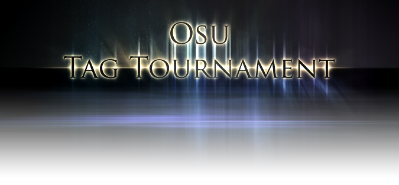
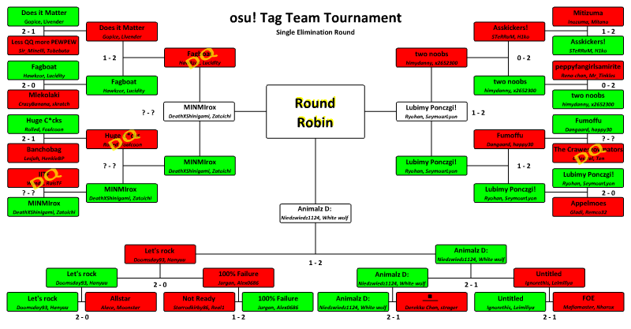

---
tags:
- oTTMT
---

# osu! Tag Team Multiplayer Tournament



The **osu! Tag Team Multiplayer Tournament** (***oTTMT***) was a two-on-two tag team based osu! tournament hosted by ![][flag_SE] [Gabi](https://osu.ppy.sh/users/57057). It was the first installment of the osu! Tag Team Multiplayer Tournament.

## Tournament Schedule

- The osu! Tag Team Multiplayer Tournament started 2009-06-12 and ended 2009-09-06.

## Prizes

In every tournament, people conquering a place on the podium are eligible to receive unique prizes created specifically for osu! Tag Team Multiplayer Tournament winners. It is possible that these items change with every installment of the osu! Tag Team Multiplayer Tournament.

| Placing | Prize(s) |
| :-: | :-- |
|  | 6 months of osu!supporter tag, profile badge |


## Organisation

The osu! Tag Team Multiplayer Tournament was run by various community members by distributing the multitude of tasks into various fields of responsibility.

| Position | Member(s) |
| :-- | :-- |
| Manager | ![][flag_SE] [Gabi](https://osu.ppy.sh/users/57057) |
| Referee | ![][flag_SE] [Gabi](https://osu.ppy.sh/users/57057), ![][flag_US] [Daru](https://osu.ppy.sh/users/32480), ![][flag_DE] [Larto](https://osu.ppy.sh/users/12328), ![][flag_US] [EEeee](https://osu.ppy.sh/users/19819) |

## Links

- [Discussion thread](https://osu.ppy.sh/community/forums/topics/12710)

## Participants

| Team | Members |
| :-- | :-- |
| **Does it matter?** | ![][flag_NL] **[Gopice](https://osu.ppy.sh/users/54848)**, ![][flag_NL] [livender](https://osu.ppy.sh/users/55384) |
| **Less QQ more PEWPEW** | ![][flag_EC] **[Sir Minelli](https://osu.ppy.sh/users/39872)**, ![][flag_JP] [tobebuta](https://osu.ppy.sh/users/14053) |
| **fagboat** | ![][flag_ZA] **[hawkzor](https://osu.ppy.sh/users/37529)**, ![][flag_ZA] [Lucidity](https://osu.ppy.sh/users/56904) |
| **Mlekołaki** | ![][flag_PL] **[CrazyBanana](https://osu.ppy.sh/users/62856)**, ![][flag_PL] [skratch](https://osu.ppy.sh/users/49499) |
| **huge cocks** | ![][flag_US] **[Rolled](https://osu.ppy.sh/users/5243)**, ![][flag_US] [foulcoon](https://osu.ppy.sh/users/19883) |
| **Banchobag** | ![][flag_NL] **[Lesjuh](https://osu.ppy.sh/users/44308)**, ![][flag_NL] [Henkie](https://osu.ppy.sh/users/16944) |
| **IITF** | ![][flag_RU] **[RaisTF](https://osu.ppy.sh/users/44074)**, ![][flag_PH] [WyndII](https://osu.ppy.sh/users/46538) |
| **MINMIrox** | ![][flag_US] **[DeathxShinigami](https://osu.ppy.sh/users/49516)**, ![][flag_US] [Zatoichi](https://osu.ppy.sh/users/35199) |
| **Mitizuma** | ![][flag_FR] **[Inozuma](https://osu.ppy.sh/users/14137)**, ![][flag_FR] [Mitano](https://osu.ppy.sh/users/63932) |
| **Asskickers!** | ![][flag_PL] **[SteRRuM](https://osu.ppy.sh/users/42585)**, ![][flag_UY] [H1ko](https://osu.ppy.sh/users/58710) |
| **peppyfangirlsamirite** | ![][flag_DK] **[Rena-chan](https://osu.ppy.sh/users/62858)**, ![][flag_AU] [Alurn](https://osu.ppy.sh/users/28991) |
| **two noobs** | ![][flag_CN] **[himydanny](https://osu.ppy.sh/users/19173)**, ![][flag_TW] [x2652300](https://osu.ppy.sh/users/11556) |
| **Fumoffu** | ![][flag_DE] **[Dangaard](https://osu.ppy.sh/users/19488)**, ![][flag_NL] [happy30](https://osu.ppy.sh/users/27767) |
| **The Craweszoymators** | ![][flag_NL] **[Celestral](https://osu.ppy.sh/users/25025)**, ![][flag_NL] [Ten](https://osu.ppy.sh/users/44484) |
| **Lubimy Ponczgi!** | ![][flag_PL] **[Ryohan](https://osu.ppy.sh/users/16963)**, ![][flag_PL] [Lef](https://osu.ppy.sh/users/44826) |
| **Appelmoes** | ![][flag_NL] **[Remco32](https://osu.ppy.sh/users/9199)**, ![][flag_NL] [GladiOol](https://osu.ppy.sh/users/23326) |
| **Let's rock** | ![][flag_GB] **[Doomsday](https://osu.ppy.sh/users/18983)**, ![][flag_AT] [Hanyuu](https://osu.ppy.sh/users/73480) |
| **Allstar** | ![][flag_TW] **[Alace](https://osu.ppy.sh/users/25993)**, ![][flag_TW] [moonstar](https://osu.ppy.sh/users/38408) |
| **Not Ready** | ![][flag_US] **[Starrodkirby86](https://osu.ppy.sh/users/410)**, ![][flag_SE] [Real1](https://osu.ppy.sh/users/40998) |
| **100% Failure** | ![][flag_AT] **[Leimilia](https://osu.ppy.sh/users/44079)**, ![][flag_US] [Strawberry-kun](https://osu.ppy.sh/users/27844) |
| **Animalz D:** | ![][flag_PL] **[niedz](https://osu.ppy.sh/users/9610)**, ![][flag_PL] [WubWoofWolf](https://osu.ppy.sh/users/39828) |
| **?!** | ![][flag_US] **[Derekku](https://osu.ppy.sh/users/91341)**, ![][flag_US] [strager](https://osu.ppy.sh/users/64678) |
| **Untitled** | ![][flag_CN] **[ignorethis](https://osu.ppy.sh/users/27343)**, ![][flag_CN] [leimiliya](https://osu.ppy.sh/users/76568) |
| **FOE** | ![][flag_US] **[Mafiamaster](https://osu.ppy.sh/users/17695)**, ![][flag_DE] [Nharox](https://osu.ppy.sh/users/6794) |

------------------------------

## Podium

This competition has come to an end and resulted in the following podium:

| Placing | Team(s) |
| :-: | :-- |
|  | Animalz D: |
|  | Lubimy Ponczgi! |
|  | MINMIrox |



------------------------------

## Mappools

**Semifinals mappool was announced in the game room and thus was not revealed.**

### Finals

**This mappool was announced and played during Finals.**

- [Tatsh - Kachoufuusetsu \[Another\]](https://osu.ppy.sh/beatmapsets/4598#osu/24575)
- [Starving Trancer feat. Maki - Agony \[Hard\]](https://osu.ppy.sh/beatmapsets/8196#osu/33963)
- [Tatsh Assault X - The Dirty Of Loudness \[Insane\]](https://osu.ppy.sh/beatmapsets/11341#osu/43416)
- [Seiryu - Time To Air \[Another\]](https://osu.ppy.sh/beatmapsets/4597#osu/24557)

### Round 3

- [Nico Nico Douga - Patty's NIPPONPON \[Insane\]](https://osu.ppy.sh/beatmapsets/6909#osu/30520)
- [Amane - Boozehound \[ignore's Insane\]](https://osu.ppy.sh/beatmapsets/5875#osu/27848)
- [Shinji Orito, Magome Togoshi - Yoru Sou \[Hard\]](https://osu.ppy.sh/beatmapsets/3708#osu/22394)
- [Paramore - That's What You Get \[Hard\]](https://osu.ppy.sh/beatmapsets/6732#osu/30078)
- [Zettai Karen Children - DATTE Daihonmei \[Hard\]](https://osu.ppy.sh/beatmapsets/7660#osu/32545)
- [KOTOKO and Utatsuki Kaori - Double HarmoniZe Shock!! \[Hard\]](https://osu.ppy.sh/beatmapsets/1091#osu/8170)
- [Digital R.i.S.E. - Cerulean Sky \[Hard\]](https://osu.ppy.sh/beatmapsets/3998#osu/23086)
- [Megumi Nakajima (Ranka Mei) - Nyan Nyan Song (Touhou Rock Remix) \[Nyaaaaa\]](https://osu.ppy.sh/beatmapsets/7613#osu/32440)
- [bubbles - F \[Insane\]](https://osu.ppy.sh/beatmapsets/4866#osu/25795)

### Round 2

- [3oh!3 - Don't Dance \[EEeee's Don't Dance\]](https://osu.ppy.sh/beatmapsets/5425#osu/27532)
- [Ali Project - King Knight \[Hard\]](https://osu.ppy.sh/beatmapsets/1981#osu/18353)
- [Amane - Boozehound \[Nuts\]](https://osu.ppy.sh/beatmapsets/5875#osu/27810)
- [Gojou Kai - Ultimate Truth \[Hard\]](https://osu.ppy.sh/beatmapsets/4077#osu/23275)
- [Haru - Voyage 1969 (Instrumental) \[Hard\]](https://osu.ppy.sh/beatmapsets/7034#osu/30824)
- [Hatsune Miku - White Letter](https://osu.ppy.sh/beatmapsets/6346)
- [Heartsdales feat. SOUL'd OUT - Candy Pop \[S.O.S!!?\]](https://osu.ppy.sh/beatmapsets/4900#osu/25300)
- [Hyadain - Quick \[Zerostarry's Hard\]](https://osu.ppy.sh/beatmapsets/4106#osu/23336)
- [IOSYS - Eirin's Clinic That People Queue Up For \[CURE ME EIRIN!!!\]](https://osu.ppy.sh/beatmapsets/5513#osu/27071)
- [Johannes Brahms - Brahms(O2 Version) \[CJ Mix\]](https://osu.ppy.sh/beatmapsets/5566#osu/27285)
- [Katakiri Rekka - Tamayura \[Hard\]](https://osu.ppy.sh/beatmapsets/4041#osu/23270)
- [Kotoko - Sociometry \[Hard\]](https://osu.ppy.sh/beatmapsets/904#osu/18971)
- [Lady GaGa - Poker Face \[EEeee's Insane\]](https://osu.ppy.sh/beatmapsets/6297#osu/29623)
- [Matchbox 20 - How Far We've Come \[Hard\]](https://osu.ppy.sh/beatmapsets/1264#osu/12870)
- [May Nakabayashi - Seikan Hikou \[Insane\]](https://osu.ppy.sh/beatmapsets/2894#osu/21842)
- [Perfume - Perfume \[Insane\]](https://osu.ppy.sh/beatmapsets/6197#osu/28828)
- [Revo - White Illusion \[Hard\]](https://osu.ppy.sh/beatmapsets/5909#osu/27902)
- [Seiryu - Time to air \[Hyper\]](https://osu.ppy.sh/beatmapsets/4597#osu/24556)
- [Shinji Orito, Magome Togoshi - Yoru Sou \[Hard\]](https://osu.ppy.sh/beatmapsets/3708#osu/22394)
- [Smiley - Xuxa \[Expert\]](https://osu.ppy.sh/beatmapsets/5471#osu/26806)
- [Tamaki Nami - Brightdown \[Crazy\]](https://osu.ppy.sh/beatmapsets/3346#osu/24224)
- [Tatsh - Kachoufuusetsu \[Hyper\]](https://osu.ppy.sh/beatmapsets/4598#osu/24569)
- [The Killers - Spaceman \[Hard\]](https://osu.ppy.sh/beatmapsets/4130#osu/25081)
- [THE IDOLM@STER - Christmas for you! \[M@STER!\]](https://osu.ppy.sh/beatmapsets/4409#osu/24067)
- [YMCK - Curry da yo! \[HOT!\]](https://osu.ppy.sh/beatmapsets/5020#osu/25584)

### Round 1

- [3oh!3 - I Can't Do It Alone](https://osu.ppy.sh/beatmapsets/3771)
- [3oh!3 - Starstrukk](https://osu.ppy.sh/beatmapsets/4727)
- [3oh!3 - Richman](https://osu.ppy.sh/beatmapsets/4756)
- [3OH!3 - ELECTROSHOCK!](https://osu.ppy.sh/beatmapsets/4726)
- [Anna - Kiss no Yukue](https://osu.ppy.sh/beatmapsets/5571)
- [Amane - Eternal Fullmoon](https://osu.ppy.sh/beatmapsets/5240)
- [Audition - Can Can](https://osu.ppy.sh/beatmapsets/5177)
- [Brandy - Visual Dream](https://osu.ppy.sh/beatmapsets/4954)
- [Caramell - Caramelldansen (Speedycake Remix)](https://osu.ppy.sh/beatmapsets/1018)
- [Chiaki Ishikawa - Uninstall](https://osu.ppy.sh/beatmapsets/5480)
- [COOL&CREATE - Help me, ERINNNNNN!!](https://osu.ppy.sh/beatmapsets/5346)
- [Crazy Loop - Joanna Shut Up!](https://osu.ppy.sh/beatmapsets/4176)
- [DJ - Mocha - Fallen Angel](https://osu.ppy.sh/beatmapsets/3169)
- [dj TAKA - V -conclusion-](https://osu.ppy.sh/beatmapsets/3740)
- [DragonForce - Through The Fire And Flames](https://osu.ppy.sh/beatmapsets/1752)
- [eufonius - Apocrypha](https://osu.ppy.sh/beatmapsets/5656)
- [Figure@Maid - Gacha Gacha kyute Figu@Mate](https://osu.ppy.sh/beatmapsets/3285)
- [Hal & Misato - Natsukusa no Senro -J-Trance remix-](https://osu.ppy.sh/beatmapsets/1070)
- [Haru - Broken Moon (Instrumental)](https://osu.ppy.sh/beatmapsets/7125)
- [Hatsune Miku - Can't Defeat Airman](https://osu.ppy.sh/beatmapsets/2522)
- [Hirano Aya - Lost My Music](https://osu.ppy.sh/beatmapsets/4591)
- [Hirano Aya - Tsuiterune Notterune](https://osu.ppy.sh/beatmapsets/6387)
- [IOSYS - Hakurei Jinja](https://osu.ppy.sh/beatmapsets/3589)
- [IOSYS - Oyome Ni Shinasai](https://osu.ppy.sh/beatmapsets/2518)
- [Iwao Junko - Yorokobi no Carol](https://osu.ppy.sh/beatmapsets/4441)
- [Katou Emiri(Hiiragi Kagami) - 100 Percent NaINaINaI](https://osu.ppy.sh/beatmapsets/3436)
- [Machinae Supremacy - The Great Gianna Sisters](https://osu.ppy.sh/beatmapsets/5404)
- [Mika - Lollipop](https://osu.ppy.sh/beatmapsets/1527)
- [Red Pulse - Open Your Mind](https://osu.ppy.sh/beatmapsets/5298)
- [Skye Sweetnam - Sharada](https://osu.ppy.sh/beatmapsets/6507)
- [t+pazolite feat. - Okkusenman (Hardcore Mix)](https://osu.ppy.sh/beatmapsets/303)
- [UI-70 - Invisible Full Moon](https://osu.ppy.sh/beatmapsets/5763)
- [Yoko Hikasa - Don't Say "Lazy"](https://osu.ppy.sh/beatmapsets/6257)

------------------------------

## Match Results

### Finals

| Sunday, 2009-09-06 |  |  |  |
| --: | :-: | :-: | :-- |
| Lubimy Ponczgi! | 1 | **3** | **Animalz D:** |

### Semifinals

|  |  |  |  |
| --: | :-: | :-: | :-- |
| MINMIrox | ? | **3** | **Lubimy Ponczgi!** |

### Round 3

|  |  |  |  |  |
| --: | :-: | :-: | :-- | :-- |
| fagboat | 0 | **2** | **MINMIrox** | -disqualified- |
| two noobs | 1 | **2** | **Lubimy Ponczgi!** |
| Let's rock | 1 | **2** | **Animalz D:** |

### Round 2

|  |  |  |  |  |
| --: | :-: | :-: | :-- | :-- |
| Does it matter? | 1 | **2** | **fagboat** |
| huge cocks | 0 | **2** | **MINMIrox** | -disqualified- |
| Asskickers! | 0 | **2** | **two noobs** |
| Fumoffu | 1 | **2** | **Lubimy Ponczgi!** |
| **Let's rock** | **2** | 0 | 100% Failure |
| **Animalz D:** | **2** | 1 | Untitled |

### Round 1

|  |  |  |  |  |
| --: | :-: | :-: | :-- | :-- |
| **Does it matter?** | **2** | 1 | Less QQ more PEWPEW |
| **fagboat** | **2** | 0 | Mlekołaki |
| **huge cocks** | **2** | 1 | Banchobag |
| IITF | 0 | **2** | **MINMIrox** | -disqualified- |
| Mitizuma | 1 | **2** | **Asskickers!** |
| peppyfangirlsamirite | 0 | **2** | **two noobs** |
| **Fumoffu** | **2** | 0 | The Craweszoymators | -disqualified- |
| **Lubimy Ponczgi!** | **2** | 0 | Appelmoes |
| **Let's rock** | **2** | 0 | Allstar |
| Not Ready | 1 | **2** | **100% Failure** |
| **Animalz D:** | **2** | 1 | ?! |
| **Untitled** | **2** | 1 | FOE |

------------------------------

## Ruleset

### Tournament Rules

- All beatmaps that will be played will be choosen by me and the judges and will be Updated on this topic
- a "bundle" of different beatmaps will be updated on this topic every three days, or if all teams have finished their matches, it will be updated right after.
- You need 2 players to be able to sign up your team. (more info further down)
- Each team needs to pick out 1 leader to inform and keep updated on Maps and confirmation
- When the sign up's are over, all teams will be randomly picked to "battle" another team. You will know who your opponent is by looking at this post, which will be updated. (more info on who you're going to battle will be updated on this topic everytime you have confirmed the results with me or a judge)
- After your team has won, the 2 leaders from each team needs to either confirm it to a judge, or you need to take a screenshot of the winning team and show a judge so he can then confirm it to me.
- The team can't have more then 2 players. you are NOT allowed to replace anyone after you have signed up with your team.
- When battling another team, you need to have 2 players playing.

Your team and the team you are facing have a 7 day limit to finish your game.

Breaking any of these rules will lead to disqualification.

Furthermore, judges reserve the right to disqualify teams even if they do not break any of the above rules, and the judges finds reason do to so. So please, don't manipulate any loopholes you may find.

### Tournament Registration

Sign up Template:

```
Team Name:
Team Leader:
Members:
Time Zone:
```

Here is an example:

```
Team Name: Team Salladmix
Team Leader: Gabi
Members: Gabi and jon
Time Zone: (Gmt+1) (Gmt -5) we can play between Gmt 6pm-9pm
```

Please include the hours you can play on Weekends aswell.

Wildcard template:

If you like, you can sign up as a Wildcard. This means that you will be paired up with somebody at random, who also signed up as wildcard. If you have already signed up for wildcard but you then find someone else that you want to team with, please edit your post and MSG me on IRC or forums.

```
Name:
Timezone:
```

Example for *Wildcard*:

```
Name: Gabi
Timezone: Gmt+1
```

### Match Instructions

Mod settings for the match:

- Play mode: Osu! standard
- Team Mode: Tag Team Vs
- Win Condition: Score
- 3 maps will be chosen to play out of the announced maps for that bracket, a team must win 2 of the 3 to advance.
- A Judge must always be present.
- No Easy, Half Time, Sudden Death, Relax or Spun out mods.

If both teams agree on difficulty-increasing mods, like hidden or flashlight, then they can be used, but only if both teams agree.

[flag_AT]: /wiki/shared/flag/AT.gif
[flag_AU]: /wiki/shared/flag/AU.gif
[flag_CN]: /wiki/shared/flag/CN.gif
[flag_DE]: /wiki/shared/flag/DE.gif
[flag_DK]: /wiki/shared/flag/DK.gif
[flag_EC]: /wiki/shared/flag/EC.gif
[flag_FR]: /wiki/shared/flag/FR.gif
[flag_GB]: /wiki/shared/flag/GB.gif
[flag_JP]: /wiki/shared/flag/JP.gif
[flag_NL]: /wiki/shared/flag/NL.gif
[flag_PH]: /wiki/shared/flag/PH.gif
[flag_PL]: /wiki/shared/flag/PL.gif
[flag_RU]: /wiki/shared/flag/RU.gif
[flag_SE]: /wiki/shared/flag/SE.gif
[flag_TW]: /wiki/shared/flag/TW.gif
[flag_US]: /wiki/shared/flag/US.gif
[flag_UY]: /wiki/shared/flag/UY.gif
[flag_ZA]: /wiki/shared/flag/ZA.gif
