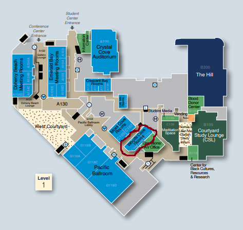
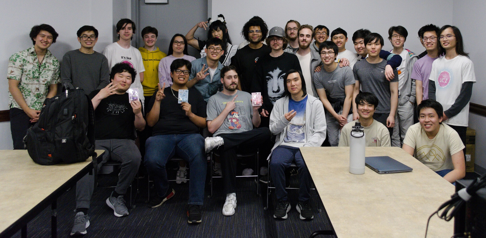
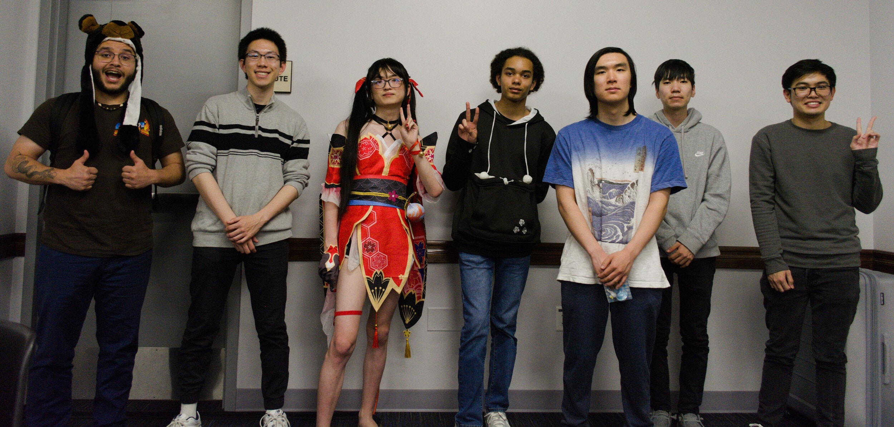

---
tags:
  - 2024
  - IDOLS
  - osu! UCI
  - UCI
---

# Irvine's Definitive osu! LAN Spring

**Irvine's Definitive osu! LAN Spring** (***IDOLS***) was an osu! and 4K osu!mania BYOC LAN tournament hosted by [osu! UCI](/wiki/Community/Organisations/osu!_UCI). It took place at the University of California, Irvine.

## Event details

The event took place on Saturday, 25 May, 2024 from 8:00 a.m. to 10:00 p.m. PDT. It was located in the UCI Student Center (311 W Peltason Dr, Irvine, CA 92697), in the Woods Cove rooms.

### Tournament schedule

#### osu!

| Time | Event |
| :-- | :-- |
| 8:00 a.m. | Doors open and check-ins begin |
| 10:00 a.m. | Qualifier lobbies |
| 1:00 p.m. | Upper bracket round of 16 (pool 1, BO7) |
| 2:00 p.m. | Upper bracket quarterfinals and lower bracket round 1 (pool 1, BO7) |
| 3:00 p.m. | Lower bracket round 2 (pool 2, BO9) |
| 4:00 p.m. | Upper bracket semifinals and lower bracket round 3 (pool 2, BO9) |
| 5:00 p.m. | Lower bracket quarterfinals (pool 3, BO9) |
| 6:00 p.m. | Upper bracket finals and lower bracket semifinals (pool 3, BO9) |
| 7:00 p.m. | Lower bracket finals (pool 4, BO11) |
| 8:00 p.m. | Grand finals and reset, if needed (pool 4, BO11) |

#### osu!mania

| Time | Event |
| :-- | :-- |
| 8:00 a.m. | Doors open and check-ins begin |
| 11:00 a.m. | Upper bracket quarterfinals (pool 1, BO7) |
| 12:00 p.m. | Upper bracket semifinals (pool 1, BO7) |
| 1:00 p.m. | Lower bracket quarterfinals (pool 2, BO9) |
| 2:00 p.m. | Upper bracket finals and lower bracket semifinals (pool 2, BO9) |
| 3:00 p.m. | Lower bracket finals (pool 3, BO11) |
| 4:00 p.m. | Grand finals and reset, if needed (pool 3, BO11) |

## Prizes

The top 3 players in each of the osu! and osu!mania tournaments were awarded a Sanrio keychain.

## Organisation

IDOLS was run by various osu! community members at UCI or visiting for the event.

| Position | Member(s) |
| :-- | :-- |
| Referee | ::{ flag=US }:: [chmpchmp](https://osu.ppy.sh/users/7838099), ::{ flag=US }:: [Drowzy-](https://osu.ppy.sh/users/10970649), ::{ flag=US }:: [Yes1Yes1](https://osu.ppy.sh/users/12430265), ::{ flag=US }:: [blocta](https://osu.ppy.sh/users/31368411), ::{ flag=US }:: [freddiiieeee](https://osu.ppy.sh/users/7112839), ::{ flag=US }:: [clayton](https://osu.ppy.sh/users/3666350), ::{ flag=US }:: [PorkIsGreat](https://osu.ppy.sh/users/10756322), ::{ flag=US }:: [Science](https://osu.ppy.sh/users/5535233), ::{ flag=DE }:: [TheHunter1](https://osu.ppy.sh/users/6496016) |
| osu! mappooler | ::{ flag=US }:: [freddiiieeee](https://osu.ppy.sh/users/7112839) |
| osu!mania mappooler | ::{ flag=US }:: [blocta](https://osu.ppy.sh/users/31368411), ::{ flag=US }:: [PorkIsGreat](https://osu.ppy.sh/users/10756322) |
| Commentator | ::{ flag=US }:: [freddiiieeee](https://osu.ppy.sh/users/7112839), ::{ flag=US }:: [Kahli](https://osu.ppy.sh/users/8926244), ::{ flag=US }:: [PorkIsGreat](https://osu.ppy.sh/users/10756322), ::{ flag=US }:: [Caboozled\_Pie](https://osu.ppy.sh/users/17652842) |
| Graphic designer | ::{ flag=XX }:: APOLLY ([Twitter](https://twitter.com/ApollyonicWorks)) |
| Photographer | ::{ flag=US }:: [PorkIsGreat](https://osu.ppy.sh/users/10756322) |

## Links

- [Bracket (osu!)](https://brackethq.com/b/0a32b/)
- [Bracket (osu!mania)](https://brackethq.com/b/t622b/)
- [Forum thread](https://osu.ppy.sh/community/forums/topics/1916804)
- [Livestream](https://www.twitch.tv/osuuci)
- [osu! UCI Discord server](https://discordapp.com/invite/qbZddFV)

## Participants

### osu!

- ::{ flag=US }:: [-Agent](https://osu.ppy.sh/users/12404995)
- ::{ flag=US }:: [AccNome](https://osu.ppy.sh/users/10976433)
- ::{ flag=CA }:: [Aquatic\_3](https://osu.ppy.sh/users/22711091)
- ::{ flag=US }:: [astrin](https://osu.ppy.sh/users/14252935)
- ::{ flag=US }:: [BTMC](https://osu.ppy.sh/users/3171691)
- ::{ flag=US }:: [Clarity](https://osu.ppy.sh/users/3441616)
- ::{ flag=US }:: [Daprin](https://osu.ppy.sh/users/10961983)
- ::{ flag=US }:: [DaSwagTurtle](https://osu.ppy.sh/users/9901787)
- ::{ flag=US }:: [dyle](https://osu.ppy.sh/users/2615492)
- ::{ flag=US }:: [easypeasy123](https://osu.ppy.sh/users/9946406)
- ::{ flag=US }:: [ERA test](https://osu.ppy.sh/users/15769399)
- ::{ flag=US }:: [iSarz](https://osu.ppy.sh/users/13886367)
- ::{ flag=US }:: [Jarran](https://osu.ppy.sh/users/11417993)
- ::{ flag=US }:: [Kahli](https://osu.ppy.sh/users/8926244)
- ::{ flag=US }:: [Kenny](https://osu.ppy.sh/users/1225459)
- ::{ flag=US }:: [LGSLG](https://osu.ppy.sh/users/20437671)
- ::{ flag=US }:: [Mathyu](https://osu.ppy.sh/users/6303313)
- ::{ flag=US }:: [Muff1nkat](https://osu.ppy.sh/users/12404447)
- ::{ flag=US }:: [Putzy](https://osu.ppy.sh/users/23664366)
- ::{ flag=US }:: [ricoel](https://osu.ppy.sh/users/7438459)
- ::{ flag=US }:: [Ritz](https://osu.ppy.sh/users/12456082)
- ::{ flag=US }:: [RocketeerRover](https://osu.ppy.sh/users/14477332)
- ::{ flag=US }:: [ur cute](https://osu.ppy.sh/users/9993348)
- ::{ flag=US }:: [Xpxp](https://osu.ppy.sh/users/10809086)

### osu!mania

- ::{ flag=US }:: [-mint-](https://osu.ppy.sh/users/8976576)
- ::{ flag=US }:: [cow](https://osu.ppy.sh/users/10629473)
- ::{ flag=US }:: [fogershot](https://osu.ppy.sh/users/12645717)
- ::{ flag=US }:: [ketzu](https://osu.ppy.sh/users/13557639)
- ::{ flag=US }:: [MagiScorch](https://osu.ppy.sh/users/14241467)
- ::{ flag=US }:: [yodevdev](https://osu.ppy.sh/users/27123258)

## Podium

### osu!

| Placing | Player |
| :-: | :-- |
|  | ::{ flag=US }:: [Mathyu](https://osu.ppy.sh/users/6303313) |
|  | ::{ flag=US }:: [ur cute](https://osu.ppy.sh/users/9993348) |
|  | ::{ flag=US }:: [BTMC](https://osu.ppy.sh/users/3171691) |

### osu!mania

| Placing | Player |
| :-: | :-- |
|  | ::{ flag=US }:: [MagiScorch](https://osu.ppy.sh/users/14241467) |
|  | ::{ flag=US }:: [-mint-](https://osu.ppy.sh/users/8976576) |
|  | ::{ flag=US }:: [cow](https://osu.ppy.sh/users/10629473) |

## Mappools

### osu!

[View the mappool on Google Sheets](https://docs.google.com/spreadsheets/d/1WM-_Gpr08PNUeD3h01VDQkq7gk-xORvI0t6i8txsN9I/edit)

#### Grand Finals

- NoMod
  1. [Konuko - Toumei Elegy (Awaken) [Ultimate Reverberant Gonkanau]](https://osu.ppy.sh/beatmapsets/219380#osu/724015)
  2. [Raimukun - Myths Orbis (knowledgeking) [Triangulum Majus]](https://osu.ppy.sh/beatmapsets/1889095#osu/3890663)
  3. [Busdriver - Imaginary Places (Moreon) [squirrelp's Underground]](https://osu.ppy.sh/beatmapsets/632870#osu/1365214)
  4. [Sota Fujimori - polygon (Kaifin) [unhinged]](https://osu.ppy.sh/beatmapsets/559097#osu/1182462)
  5. [SAW WAVE SOUND - GRID KNIGHT (Dada) [GRID IRON]](https://osu.ppy.sh/beatmapsets/1592210#osu/3251884)
- Hidden
  1. [System Of A Down - Toxicity (Icekalt) [Disorder]](https://osu.ppy.sh/beatmapsets/1041151#osu/2176046)
  2. [TUYU - Loser Girl (h i f u) [hd2]](https://osu.ppy.sh/beatmapsets/1433115#osu/2949376)
  3. [Kuroneko Dungeon - Lilieze to Enryuu Laevateinn (GYGY) [Melltigedig]](https://osu.ppy.sh/beatmapsets/1851159#osu/3802842)
- HardRock
  1. [ELFENSJoN - Hyousou wa Hakuen wo Matoite (Yusomi) [Extra]](https://osu.ppy.sh/beatmapsets/1312064#osu/2719302)
  2. [PUP - Lionheart (Rektygon) [Serenity]](https://osu.ppy.sh/beatmapsets/1950227#osu/4037795)
  3. [Renard - Rainbow Dash Likes Girls \(Stay Gay Pony Girl\) (ztrot) [Holy Shit! It's Rainbow Dash!!]](https://osu.ppy.sh/beatmapsets/57255#osu/172662)
- DoubleTime
  1. [DaymanOurSavior - Snow halation but shawty's like a melody in my head (Demonical) [Replay]](https://osu.ppy.sh/beatmapsets/1243995#osu/2586018)
  2. [Zeami - Music Revolver (KanaRin) [Kana]](https://osu.ppy.sh/beatmapsets/53231#osu/162363)
  3. [Conagusuri - Hina Choco Dark Matter (Mafiamaster) [Lunatic]](https://osu.ppy.sh/beatmapsets/15576#osu/56337)
  4. [Function Phantom - Algebra (Bonzi) [Asahina Leader's Insane]](https://osu.ppy.sh/beatmapsets/300195#osu/748656)
- Tiebreaker
  1. **[Ito Kanako - Sky of Twilight (ItsWinter) [Atelier]](https://osu.ppy.sh/beatmapsets/1570424#osu/3392208)**

#### Finals

- NoMod
  1. [yanne feat. Hatsune Miku - Marionette no Kairaku (SkyFlame) [Manipulative]](https://osu.ppy.sh/beatmapsets/1550860#osu/3169154)
  2. [xi - Fiat Lux (knowledgeking) [Let There Be Light]](https://osu.ppy.sh/beatmapsets/1764633#osu/3612033)
  3. [Machi DiDi - Pi Li Pa La (Aranel) [Impossible]](https://osu.ppy.sh/beatmapsets/1713947#osu/3502179)
  4. [Raimukun - Avantgarde (Weoweet) [tourney ver]](https://osu.ppy.sh/beatmapsets/1972769#osu/4093543)
- Hidden
  1. [LEAF XCEED Music Division - Guitar vs Piano (Shiro) [G Major]](https://osu.ppy.sh/beatmapsets/518003#osu/1100512)
  2. [ginkiha - EOS (itstaipeople) [HD2]](https://osu.ppy.sh/beatmapsets/1988978#osu/4131885)
  3. [Nekomata Master+ - chaos eater -IIDX edition- (fanzhen0019) [captin's Extra]](https://osu.ppy.sh/beatmapsets/1169533#osu/2442129)
- HardRock
  1. [MY FIRST STORY - REVIVER (HabiHolic) [Ex]](https://osu.ppy.sh/beatmapsets/1205497#osu/2510298)
  2. [James Landino - Hide And Seek (Mirash) [Expert]](https://osu.ppy.sh/beatmapsets/972932#osu/2036903)
  3. [YOASOBI - Idol (Anxient) [Loli's Deceitful Fallacy]](https://osu.ppy.sh/beatmapsets/1977097#osu/4105494)
- DoubleTime
  1. [Dreamcatcher - YOU AND I (ailv) [Tatan's Extra]](https://osu.ppy.sh/beatmapsets/787672#osu/1653145)
  2. [EPICA - Wings of Freedom (Sieg) [Victoria]](https://osu.ppy.sh/beatmapsets/737174#osu/1555717)
  3. [kessoku band - Guitar to Kodoku to Aoi Hoshi (ponbot) [Ame's Insane]](https://osu.ppy.sh/beatmapsets/1880007#osu/3902695)
- Tiebreaker
  1. **[Nhato - Ibuki \(Intro Mix\) (Jenny) [Dextrose]](https://osu.ppy.sh/beatmapsets/947517#osu/1978996)**

#### Semifinals

- NoMod
  1. [AZKi - ERROR (Nana Abe) [Nanamori's Senseless Perseverance]](https://osu.ppy.sh/beatmapsets/1563644#osu/3193043)
  2. [Fractal Dreamers - Gardens Under A Spring Sky (Feiri) [Expert]](https://osu.ppy.sh/beatmapsets/1577406#osu/3220851)
  3. [DIALOGUE+ - Jinsei Easy? (Amateurre) [LV.75 Matha's Extreme]](https://osu.ppy.sh/beatmapsets/1507979#osu/3266522)
  4. [Feryquitous - Arcahv (Seros) [tadict's Beyond]](https://osu.ppy.sh/beatmapsets/1340339#osu/2922201)
- Hidden
  1. [Pierce The Veil - King For A Day \(feat. Kellin Quinn\) (attendant) [Expert]](https://osu.ppy.sh/beatmapsets/1074059#osu/2250398)
  2. [Hommarju feat. Latte - masterpiece \(Cut Ver.\) (Enon) [Beomsan's reMASTER]](https://osu.ppy.sh/beatmapsets/2092449#osu/4386400)
  3. [Camellia - Routing (Mir) [Reverb]](https://osu.ppy.sh/beatmapsets/663255#osu/1403907)
- HardRock
  1. [UNDEAD CORPORATION - Yoru Naku Usagi wa Yume o Miru (MaridiuS) [Lenvia's Classic Collab Extra]](https://osu.ppy.sh/beatmapsets/695743#osu/1511837)
  2. [Nekomata Master - Far east nightbird (tsuka) [Extreme]](https://osu.ppy.sh/beatmapsets/34203#osu/111302)
  3. [sakuzyo - Lost Memory (Mao) [Expert]](https://osu.ppy.sh/beatmapsets/984780#osu/2060508)
- DoubleTime
  1. [Shawn Wasabi - Marble Soda (Len) [Crier's Extra]](https://osu.ppy.sh/beatmapsets/387784#osu/846259)
  2. [Humanoid - MENDES (yeahyeahyeahhh) [Hyper]](https://osu.ppy.sh/beatmapsets/21928#osu/79465)
  3. [IOSYS - Power of Dream (DaRRi MIx) [DaRRi MIx]](https://osu.ppy.sh/beatmapsets/8268#osu/34162)
- Tiebreaker
  1. **[Hisui Chazuke - Bomb Bang Bound!!! (Ryuusei Aika) [Blunder Blender Brander???]](https://osu.ppy.sh/beatmapsets/2044096#osu/4266258)**

#### Round of 16 and Quarterfinals

- NoMod
  1. [Poppin'Party - Cherry Bomb (\[Karcher\]) [Love]](https://osu.ppy.sh/beatmapsets/1397392#osu/2883760)
  2. [Rche - Todestrieb (FrenZ396) [Impulse]](https://osu.ppy.sh/beatmapsets/968678#osu/2026835)
  3. [HuMeR - ChaserXX (Hishiro Chizuru) [Cybernetics]](https://osu.ppy.sh/beatmapsets/1293408#osu/2771171)
  4. [PSYQUI - Still in my heart feat. Punipuni Denki (Typ4) [Bruh Moment Expert]](https://osu.ppy.sh/beatmapsets/961460#osu/2012780)
- Hidden
  1. [Nakamura Meiko - Dispel (Yogurtt) [Cataclysm]](https://osu.ppy.sh/beatmapsets/1597607#osu/3262706)
  2. [Nanamori-chu \* Goraku-bu - Happy Time wa Owaranai \(Cut Ver.\) (-Keitaro) [Osu's Extra]](https://osu.ppy.sh/beatmapsets/1057015#osu/2234458)
- HardRock
  1. [AliA - Utopia (Wen) [banter's Extreme]](https://osu.ppy.sh/beatmapsets/1258148#osu/4225705)
  2. [Yuu - U.N. Owen was Her? (ignorethis) [DJPop's Insane]](https://osu.ppy.sh/beatmapsets/7104#osu/31906)
- DoubleTime
  1. [sana - Kokuhaku Rival Sengen (Nara) [Kibboo's Insane]](https://osu.ppy.sh/beatmapsets/301561#osu/798617)
  2. [Bomfunk MC's - Freestyler (Lesjuh) [Insane]](https://osu.ppy.sh/beatmapsets/35629#osu/115352)
  3. [Hatsune Miku - Netoge Haijin Sprechchor (Lalarun) [Insane]](https://osu.ppy.sh/beatmapsets/25802#osu/87369)
- Tiebreaker
  1. **[FELT - Lies in Reality (Crissa) [Lost Inside]](https://osu.ppy.sh/beatmapsets/778002#osu/1634214)**

#### Qualifiers

- NoMod
  1. [Guilty Kiss - Strawberry Trapper (Asaiga) [Athy's Trick in Dice]](https://osu.ppy.sh/beatmapsets/496107#osu/1055997)
  2. [Xi - Youyoumu \~ Run or Dash (OldEclipse) [CS4]](https://osu.ppy.sh/beatmapsets/1918615#osu/4005731)
  3. [TK from Ling tosite sigure - Bonnou (melwoine) [archie's Extreme]](https://osu.ppy.sh/beatmapsets/2043955#osu/4451595)
  4. [sky\_delta - Midnight City Warfare (lcfc) [Extra]](https://osu.ppy.sh/beatmapsets/1008607#osu/2136334)
- Hidden
  1. [Sota Fujimori - ACCELERATE (Chaoslitz) [yf's Extra \(#3\)]](https://osu.ppy.sh/beatmapsets/852406#osu/2042694)
  2. [Sakamoto Shoichiro - Eye of Aeon (niii\_san) [Expert]](https://osu.ppy.sh/beatmapsets/1543327#osu/3154664)
- HardRock
  1. [Omoi - Snow Drive (Yales) [Freeze]](https://osu.ppy.sh/beatmapsets/323522#osu/719051)
  2. [Ponkichi - Hyakukakai to Shirotokkuri (Byakuya) [117's Another]](https://osu.ppy.sh/beatmapsets/952759#osu/1992031)
- DoubleTime
  1. [u's - Snow halation (Guy) [Insane]](https://osu.ppy.sh/beatmapsets/111587#osu/290188)
  2. [fromis\_9 - LOVE BOMB (Cellina) [Atipir's Insane]](https://osu.ppy.sh/beatmapsets/1849271#osu/3798823)

### osu!mania

[View the mappool on Google Sheets](https://docs.google.com/spreadsheets/d/1Vlu1yfHmOneTO5DLH0lEkgPmacRxy-OfXvXOdPgsSZU/edit)

#### Grand Finals

- Rice
  1. [linear ring with RNAcid - Gypsophila (MyZterioN-) [heartsick 1.05x \(159bpm\)]](https://osu.ppy.sh/beatmapsets/1805950#mania/3703574)
  2. [DJ SHARPNEL - Policy In The Sky! (Shoegazer) [Revolution! 1.3x \(227bpm\)]](https://osu.ppy.sh/beatmapsets/1428978#mania/2944413)
  3. [EXO-K - MAMA \(Sped Up Ver.\) (\[GB\]Reisen) [No One Who Care About Me...]](https://osu.ppy.sh/beatmapsets/2130561#mania/4480776)
  4. [Suue & Petboy - Meant To Be \(Nightcore Mix\) (Blue\_Potion) [Be Yourself]](https://osu.ppy.sh/beatmapsets/2130736#mania/4481183)
  5. [Neru & z5 - Whatever whatever whatever feat.Takanashi Kiara & Ninomae Ina'nis \[COVER\] (Hakos-Baelz) [IYA]](https://osu.ppy.sh/beatmapsets/1665552#mania/3400210)
  6. [Camellia - FM Synthesis Experiment (ERA Imperial) [Muses' Experimental Evaluation: INHUMAN 1.05x \(157.5BPM\)]](https://osu.ppy.sh/beatmapsets/1993221#mania/4142021)
  7. [YOASOBI - Haruka (LaoXiao-) [Moment x1.1]](https://osu.ppy.sh/beatmapsets/1398827#mania/2886214)
- Long Note
  1. [Mitsukiyo - Rolling Beat (chxu) [Hereafter]](https://osu.ppy.sh/beatmapsets/1935065#mania/3999014)
  2. [Amogh Symphony - Decoded: Karnosiris \(Cut Ver.\) (Paturages) [Broken Matrix]](https://osu.ppy.sh/beatmapsets/1836766#mania/3771275)
  3. [IU - eight \(Prod. & Feat. SUGA of BTS\) (upan) [Are You Happy Now]](https://osu.ppy.sh/beatmapsets/1183311#mania/2466983)
- Hybrid
  1. [lapix - Flying Castle (TheFunk) [Colourdrive]](https://osu.ppy.sh/beatmapsets/1935107#mania/3999102)
  2. [Zekk - Fluctuation (Reyi) [Drago's Oscillation]](https://osu.ppy.sh/beatmapsets/1606431#mania/3572590)
  3. [Kolaa & Kumako - Ichirin (AlexDunk) [Polaris.]](https://osu.ppy.sh/beatmapsets/2130743#mania/4481214)
- Tiebreaker
  1. **[SiLiS - GAME MAKE OVER (Saemitsu) [RETRO ANAMNESIS]](https://osu.ppy.sh/beatmapsets/2123356#mania/4462335)**

#### Finals

- Rice
  1. [Nekomata Master feat. Shimotsuki Haruka - Element of SPADA (FelixSpade) [Exodus 1.1x \(187bpm\)]](https://osu.ppy.sh/beatmapsets/1611228#mania/3289654)
  2. [eye burn - SHI\*A\*WA\*SE (Elekton) [joy]](https://osu.ppy.sh/beatmapsets/735407#mania/1552444)
  3. [Streetlight Manifesto - Point / Counterpoint (Monheim) [Antics \(Low LN\)]](https://osu.ppy.sh/beatmapsets/1705189#mania/3987469)
  4. [paraoka ft. MIROMU\*STARDUST - Rainbow Archiver (0DZ0) [Miraiya 1.1x \(149bpm\)]](https://osu.ppy.sh/beatmapsets/1924559#mania/3973192)
  5. [II-L feat. amelie xoxo - THE EARTH (Ucitysm) [Aphelion | kot vs. Polarin's Extra]](https://osu.ppy.sh/beatmapsets/2002137#mania/4163446)
  6. [Kensuke Ushio - China (Falcon) [Ni Hao \(1.0x\)]](https://osu.ppy.sh/beatmapsets/1927760#mania/3981008)
- Long Note
  1. [Mili - world.execute\(me\); (juankristal) [logkristal.execute\(LN\);]](https://osu.ppy.sh/beatmapsets/2127212#mania/4471815)
  2. [Red Velvet - Feel My Rhythm (fvrex) [Celebration]](https://osu.ppy.sh/beatmapsets/1724966#mania/3525373)
  3. [Madeon - Pop Culture (chxu) [Potatoes]](https://osu.ppy.sh/beatmapsets/1352407#mania/2799736)
- Hybrid
  1. [LOONA - Hi High (Tailsdk) [Sky]](https://osu.ppy.sh/beatmapsets/1095523#mania/2289628)
  2. [HOYO-MiX feat. Jonathan Steingard - Wildfire (Damaree) [Fighting Against Fate // 4K]](https://osu.ppy.sh/beatmapsets/1988096#mania/4129883)
- Tiebreaker
  1. **[Zekk - SUMMER (Shima Rin) [Ichigo]](https://osu.ppy.sh/beatmapsets/1159269#mania/2419040)**

#### Quarterfinals and Semifinals

- Rice
  1. [Cardboard Box - Nest (Guilhermeziat) [Yolk 1.1]](https://osu.ppy.sh/beatmapsets/576883#mania/2433644)
  2. [H2SO4/Mad hatter Tea - The Crimson Empire (\[Crz\]hinako1804) [Revanche]](https://osu.ppy.sh/beatmapsets/1518576#mania/3108519)
  3. [Marmalade butcher - Ushinahareru Runazuki (Shoegazer) [Insane]](https://osu.ppy.sh/beatmapsets/1486395#mania/3172014)
  4. [The Flashbulb - Mellann (Ballistic) [Introspection 1.1x \(116bpm\)]](https://osu.ppy.sh/beatmapsets/1816098#mania/3725685)
  5. [TJ.hangneil - ozma (Vortex-) [princess]](https://osu.ppy.sh/beatmapsets/1584783#mania/3237135)
- Long Note
  1. [HOYO-Mix - Sway to My Beat in Cosmos (iParacosm) [Welcome to my World]](https://osu.ppy.sh/beatmapsets/2173398#mania/4588173)
  2. [IZ\*ONE - Panorama (Ilham) [fvrex's 4K Portrait]](https://osu.ppy.sh/beatmapsets/1864149#mania/3833630)
- Hybrid
  1. [PassCode - Koisuru Cherry Tokimeki Kafunshou (lenpai) [Allergies!]](https://osu.ppy.sh/beatmapsets/1732482#mania/3541291)
  2. [LE SSERAFIM - Perfect Night (clew629) [Perfect Energy]](https://osu.ppy.sh/beatmapsets/2087093#mania/4373253)
- Tiebreaker
  1. **[Endorfin. - Fatalism (\[GS\]Rose) [reckoning]](https://osu.ppy.sh/beatmapsets/1977109#mania/4104298)**

## Match results

### osu!

#### Grand Finals

| Player 1 |  |  | Player 2 | Match link |
| --: | :-: | :-: | :-- | :-- |
| [Mathyu](https://osu.ppy.sh/users/6303313) | 3 | **6** | [ur cute](https://osu.ppy.sh/users/9993348) | [#1](https://osu.ppy.sh/community/matches/114033601) |
| [Mathyu](https://osu.ppy.sh/users/6303313) | **6** | 4 | [ur cute](https://osu.ppy.sh/users/9993348) | [#1](https://osu.ppy.sh/community/matches/114033939) |

#### Finals

##### Winners

| Player 1 |  |  | Player 2 | Match link |
| --: | :-: | :-: | :-- | :-- |
| [Mathyu](https://osu.ppy.sh/users/6303313) | **5** | 2 | [BTMC](https://osu.ppy.sh/users/3171691) | [#1](https://osu.ppy.sh/community/matches/114032596) |

##### Losers (Grand Finals pool)

| Player 1 |  |  | Player 2 | Match link |
| --: | :-: | :-: | :-- | :-- |
| [BTMC](https://osu.ppy.sh/users/3171691) | 4 | **6** | [ur cute](https://osu.ppy.sh/users/9993348) | [#1](https://osu.ppy.sh/community/matches/114033075) |

#### Semifinals

##### Winners

| Player 1 |  |  | Player 2 | Match link |
| --: | :-: | :-: | :-- | :-- |
| [Mathyu](https://osu.ppy.sh/users/6303313) | **5** | 2 | [Clarity](https://osu.ppy.sh/users/3441616) | [#1](https://osu.ppy.sh/community/matches/114031412) |
| [BTMC](https://osu.ppy.sh/users/3171691) | **5** | 3 | [Kahli](https://osu.ppy.sh/users/8926244) | [#1](https://osu.ppy.sh/community/matches/114031335) |

##### Losers (Finals pool)

| Player 1 |  |  | Player 2 | Match link |
| --: | :-: | :-: | :-- | :-- |
| [Clarity](https://osu.ppy.sh/users/3441616) | 1 | **5** | [ur cute](https://osu.ppy.sh/users/9993348) | [#1](https://osu.ppy.sh/community/matches/114032048) |
| [Kahli](https://osu.ppy.sh/users/8926244) | **5** | 2 | [ricoel](https://osu.ppy.sh/users/7438459) | [#1](https://osu.ppy.sh/community/matches/114031999) |
| [ur cute](https://osu.ppy.sh/users/9993348) | **5** | 1 | [Kahli](https://osu.ppy.sh/users/8926244) | [#1](https://osu.ppy.sh/community/matches/114032563) |

#### Quarterfinals

##### Winners

| Player 1 |  |  | Player 2 | Match link |
| --: | :-: | :-: | :-- | :-- |
| [Mathyu](https://osu.ppy.sh/users/6303313) | **4** | 0 | [Jarran](https://osu.ppy.sh/users/11417993) | [#1](https://osu.ppy.sh/community/matches/114030002) |
| [ricoel](https://osu.ppy.sh/users/7438459) | 3 | **4** | [Clarity](https://osu.ppy.sh/users/3441616) | [#1](https://osu.ppy.sh/community/matches/114030017) |
| [ur cute](https://osu.ppy.sh/users/9993348) | 1 | **4** | [BTMC](https://osu.ppy.sh/users/3171691) | [#1](https://osu.ppy.sh/community/matches/114030023) |
| [astrin](https://osu.ppy.sh/users/14252935) | 2 | **4** | [Kahli](https://osu.ppy.sh/users/8926244) | [#1](https://osu.ppy.sh/community/matches/114030029) |

##### Losers (Semifinals pool)

| Player 1 |  |  | Player 2 | Match link |
| --: | :-: | :-: | :-- | :-- |
| [astrin](https://osu.ppy.sh/users/14252935) | **5** | 2 | [RocketeerRover](https://osu.ppy.sh/users/14477332) | [#1](https://osu.ppy.sh/community/matches/114030878) |
| [ur cute](https://osu.ppy.sh/users/9993348) | **5** | 1 | [Kenny](https://osu.ppy.sh/users/1225459) | [#1](https://osu.ppy.sh/community/matches/114030801) |
| [ricoel](https://osu.ppy.sh/users/7438459) | **5** | 1 | [Daprin](https://osu.ppy.sh/users/10961983) | [#1](https://osu.ppy.sh/community/matches/114030737) |
| [Jarran](https://osu.ppy.sh/users/11417993) | 0 | **5** | [AccNome](https://osu.ppy.sh/users/10976433) | [#1](https://osu.ppy.sh/community/matches/114030732) |
| [astrin](https://osu.ppy.sh/users/14252935) | 1 | **5** | [ur cute](https://osu.ppy.sh/users/9993348) | [#1](https://osu.ppy.sh/community/matches/114031515) |
| [ricoel](https://osu.ppy.sh/users/7438459) | **5** | 3 | [AccNome](https://osu.ppy.sh/users/10976433) | [#1](https://osu.ppy.sh/community/matches/114031333) |

#### Round of 16

##### Winners

| Player 1 |  |  | Player 2 | Match link |
| --: | :-: | :-: | :-- | :-- |
| [Mathyu](https://osu.ppy.sh/users/6303313) | **4** | 0 | [-Agent](https://osu.ppy.sh/users/12404995) | [#1](https://osu.ppy.sh/community/matches/114029246) |
| [Jarran](https://osu.ppy.sh/users/11417993) | **4** | 3 | [RocketeerRover](https://osu.ppy.sh/users/14477332) | [#1](https://osu.ppy.sh/community/matches/114029255) |
| [ricoel](https://osu.ppy.sh/users/7438459) | **4** | 0 | [Muff1nkat](https://osu.ppy.sh/users/12404447) | [#1](https://osu.ppy.sh/community/matches/114029267) |
| [Kenny](https://osu.ppy.sh/users/1225459) | 1 | **4** | [Clarity](https://osu.ppy.sh/users/3441616) | [#1](https://osu.ppy.sh/community/matches/114029193) |
| [ur cute](https://osu.ppy.sh/users/9993348) | **4** | 0 | [Daprin](https://osu.ppy.sh/users/10961983) | [#1](https://osu.ppy.sh/community/matches/114029195) |
| [Xpxp](https://osu.ppy.sh/users/10809086) | 2 | **4** | [BTMC](https://osu.ppy.sh/users/3171691) | [#1](https://osu.ppy.sh/community/matches/114029150) |
| [astrin](https://osu.ppy.sh/users/14252935) | **4** | 3 | [AccNome](https://osu.ppy.sh/users/10976433) | [#1](https://osu.ppy.sh/community/matches/114029161) |
| [Putzy](https://osu.ppy.sh/users/23664366) | 0 | **4** | [Kahli](https://osu.ppy.sh/users/8926244) | [#1](https://osu.ppy.sh/community/matches/114029164) |

##### Losers

| Player 1 |  |  | Player 2 | Match link |
| --: | :-: | :-: | :-- | :-- |
| [-Agent](https://osu.ppy.sh/users/12404995) | 1 | **4** | [RocketeerRover](https://osu.ppy.sh/users/14477332) | [#1](https://osu.ppy.sh/community/matches/114029948) |
| [Muff1nkat](https://osu.ppy.sh/users/12404447) | 0 | **4** | [Kenny](https://osu.ppy.sh/users/1225459) | [#1](https://osu.ppy.sh/community/matches/114030020) |
| [Daprin](https://osu.ppy.sh/users/10961983) | **4** | 1 | [Xpxp](https://osu.ppy.sh/users/10809086) | [#1](https://osu.ppy.sh/community/matches/114030091) |
| [AccNome](https://osu.ppy.sh/users/10976433) | **4** | 1 | [Putzy](https://osu.ppy.sh/users/23664366) | [#1](https://osu.ppy.sh/community/matches/114029988) |

#### Qualifiers

Qualifiers were played across two main matches, and some further matches required by players who had connection issues.

- [Lobby 1](https://osu.ppy.sh/community/matches/114026610)
- [Lobby 2](https://osu.ppy.sh/community/matches/114026678)

See the [Qualifier results spreadsheet](https://docs.google.com/spreadsheets/d/14ogPEpFzPskknlTIlLvSRJVfdq5bxzZoU0L2wwHaJ-M/edit) for a more detailed log of performances on individual maps.

| Seed | Player | Average placement | Average score |
| --: | :-- | --: | --: |
| 1 | [Mathyu](https://osu.ppy.sh/users/6303313) | 4.2 | 605073 |
| 2 | [Kahli](https://osu.ppy.sh/users/8926244) | 4.6 | 573934 |
| 3 | [ur cute](https://osu.ppy.sh/users/9993348) | 4.7 | 582471 |
| 4 | [Clarity](https://osu.ppy.sh/users/3441616) | 5.2 | 585601 |
| 5 | [ricoel](https://osu.ppy.sh/users/7438459) | 5.6 | 589569 |
| 6 | [BTMC](https://osu.ppy.sh/users/3171691) | 7.4 | 500118 |
| 7 | [astrin](https://osu.ppy.sh/users/14252935) | 8.7 | 443682 |
| 8 | [RocketeerRover](https://osu.ppy.sh/users/14477332) | 9.4 | 388109 |
| 9 | [Jarran](https://osu.ppy.sh/users/11417993) | 9.4 | 379961 |
| 10 | [AccNome](https://osu.ppy.sh/users/10976433) | 10.3 | 388968 |
| 11 | [Xpxp](https://osu.ppy.sh/users/10809086) | 10.5 | 375106 |
| 12 | [Muff1nkat](https://osu.ppy.sh/users/12404447) | 12.4 | 312643 |
| 13 | [Kenny](https://osu.ppy.sh/users/1225459) | 12.5 | 309236 |
| 14 | [Daprin](https://osu.ppy.sh/users/10961983) | 12.6 | 295010 |
| 15 | [Putzy](https://osu.ppy.sh/users/23664366) | 13.2 | 312770 |
| 16 | [-Agent](https://osu.ppy.sh/users/12404995) | 13.3 | 345872 |
|  | [ERA test](https://osu.ppy.sh/users/15769399) | 15.3 | 242605 |
|  | [Ritz](https://osu.ppy.sh/users/12456082) | 16.9 | 217711 |
|  | [DaSwagTurtle](https://osu.ppy.sh/users/9901787) | 17.0 | 217760 |
|  | [dyle](https://osu.ppy.sh/users/2615492) | 18.7 | 150521 |
|  | [easypeasy123](https://osu.ppy.sh/users/9946406) | 19.8 | 111419 |
|  | [iSarz](https://osu.ppy.sh/users/13886367) | 22.4 | 37303 |
|  | [Aquatic\_3](https://osu.ppy.sh/users/22711091) | 22.5 | 52078 |
|  | [LGSLG](https://osu.ppy.sh/users/20437671) | 23.4 | 3011 |

### osu!mania

#### Grand Finals

| Player 1 |  |  | Player 2 | Match link |
| --: | :-: | :-: | :-- | :-- |
| [MagiScorch](https://osu.ppy.sh/users/14241467) | **6** | 3 | [-mint-](https://osu.ppy.sh/users/8976576) | [#1](https://osu.ppy.sh/community/matches/114031091) |

#### Finals

##### Winners

| Player 1 |  |  | Player 2 | Match link |
| --: | :-: | :-: | :-- | :-- |
| [cow](https://osu.ppy.sh/users/10629473) | 0 | **5** | [MagiScorch](https://osu.ppy.sh/users/14241467) | [#1](https://osu.ppy.sh/community/matches/114030140) |

##### Losers (Grand Finals pool)

| Player 1 |  |  | Player 2 | Match link |
| --: | :-: | :-: | :-- | :-- |
| [cow](https://osu.ppy.sh/users/10629473) | 5 | **6** | [-mint-](https://osu.ppy.sh/users/8976576) | [#1](https://osu.ppy.sh/community/matches/114030547) |

#### Semifinals

##### Winners

| Player 1 |  |  | Player 2 | Match link |
| --: | :-: | :-: | :-- | :-- |
| [cow](https://osu.ppy.sh/users/10629473) | **4** | 0 | [fogershot](https://osu.ppy.sh/users/12645717) | [#1](https://osu.ppy.sh/community/matches/114028746) |
| [-mint-](https://osu.ppy.sh/users/8976576) | 2 | **4** | [MagiScorch](https://osu.ppy.sh/users/14241467) | [#1](https://osu.ppy.sh/community/matches/114028747) |

##### Losers (Finals pool)

| Player 1 |  |  | Player 2 | Match link |
| --: | :-: | :-: | :-- | :-- |
| [-mint-](https://osu.ppy.sh/users/8976576) | **5** | 0 | [ketzu](https://osu.ppy.sh/users/13557639) | [#1](https://osu.ppy.sh/community/matches/114029310) |
| [fogershot](https://osu.ppy.sh/users/12645717) | **5** | -1 | [yodevdev](https://osu.ppy.sh/users/27123258) | *forfeit* |
| [-mint-](https://osu.ppy.sh/users/8976576) | **5** | 0 | [fogershot](https://osu.ppy.sh/users/12645717) | [#1](https://osu.ppy.sh/community/matches/114029758) |

#### Quarterfinals winners

[cow](https://osu.ppy.sh/users/10629473) and [MagiScorch](https://osu.ppy.sh/users/14241467) were given byes and so did not participate in this round.

| Player 1 |  |  | Player 2 | Match link |
| --: | :-: | :-: | :-- | :-- |
| [ketzu](https://osu.ppy.sh/users/13557639) | 0 | **4** | [fogershot](https://osu.ppy.sh/users/12645717) | [#1](https://osu.ppy.sh/community/matches/114027695) |
| [-mint-](https://osu.ppy.sh/users/8976576) | **4** | 0 | [yodevdev](https://osu.ppy.sh/users/27123258) | [#1](https://osu.ppy.sh/community/matches/114027696) |

## Ruleset

Any disregard for these rules will be met with punishment, ranging from a warning to immediate disqualification. It will be up to the discretion of the staff to punish based on the severity of the offence. **These rules and regulations are subject to change during the event.**

### Qualifier lobby procedure (osu! only)

- All players will play in a qualifier lobby and play through every map in the qualifier mappool.
- The 16 players with the highest average placement across all lobbies will be seeded into the bracket stage.

### Bracket lobby procedure

Both tournaments will use a standard double-elimination format for playoffs.

- No warmups.
- Each player has 1 ban.
- The player with the higher `!roll` chooses to ban or pick first; the player with the lower `!roll` will get the first of whatever was not chosen by the other player.
- Pick order will alternate between players.
- A tiebreaker will be played when both players are at match point.
- FreeMod will be enabled for tiebreaker.
- In the event that there is a tie on a map, the map will be replayed.

### Disconnects and missed matches

- Disconnects during a map count as losses.
- Missing a match counts as a loss; no rematches will be made.

### Misconduct and cheating

- Unsportsmanlike behavior and harassment will not be tolerated and can factor into a player's removal from the event.
- Any sort of verbal harassment towards another in the tourney will not be tolerated. This includes referees, bystanders, and any other attendees of the event.
- Players will have their computers inspected prior to the beginning of matches to ensure that there are no illegal programs running.
- Under no circumstances are players allowed to touch the peripherals or computer of another without explicit permission.
