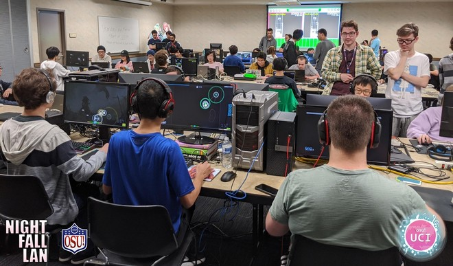
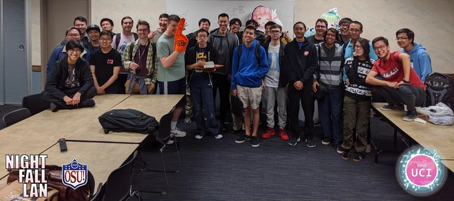

---
tags:
  - 2020
  - Irvine
  - NFL
  - osu! UCI
  - UCI
---

# Night Fall LAN

The **Night Fall LAN** (***NFL***) was an osu! and 4K osu!mania BYOC LAN tournament hosted by [osu! UCI](/wiki/Community/Organisations/osu!_UCI). It took place at the University of California, Irvine.

Contrary to what the name might suggest, this tournament ran during the winter of 2020, and most of it took place in the afternoon. osu! UCI has [a long history](/wiki/Tournaments/osu!_UCI) of stretching their tournament names...

## Event details

The tournament took place on Saturday, January 18, 2020, and lasted nearly the entire day (with lots of breaks, of course). It was located in the UCI Student Center (311 W Peltason Dr, Irvine, CA 92697), room Moss Cove AB.

## Prizes

All prizes were awarded to osu! and osu!mania winners.

| Placing | Prize(s) |
| :-: | :-- |
|  | Profile badge |

## Organisation

The NFL was run by various osu! community members at UCI or visiting for the event.

| Position | Member(s) |
| :-- | :-- |
| Mappool selector | ::{ flag=US }:: [[Blue]](https://osu.ppy.sh/users/13192092), ::{ flag=US }:: [[Nick]](https://osu.ppy.sh/users/9726582), ::{ flag=US }:: [migin](https://osu.ppy.sh/users/11118735), ::{ flag=US }:: [Riku on osu](https://osu.ppy.sh/users/3071659), ::{ flag=US }:: [slushy](https://osu.ppy.sh/users/3692940), ::{ flag=US }:: [stupud man](https://osu.ppy.sh/users/2141612) |
| Streamer | ::{ flag=US }:: [R34pling](https://osu.ppy.sh/users/7662172) |
| Commentator | ::{ flag=XX }:: Matthew<!-- TODO what is his osu profile -->, ::{ flag=US }:: [pishifat](https://osu.ppy.sh/users/3178418), ::{ flag=US }:: [Riku on osu](https://osu.ppy.sh/users/3071659), ::{ flag=US }:: [ruruchewy](https://osu.ppy.sh/users/7112839), ::{ flag=US }:: [Sukida](https://osu.ppy.sh/users/4097867), ::{ flag=US }:: [Yattaze](https://osu.ppy.sh/users/13870255) |
| Referee | ::{ flag=US }:: [[Blue]](https://osu.ppy.sh/users/13192092), ::{ flag=US }:: [[Nick]](https://osu.ppy.sh/users/9726582), ::{ flag=US }:: [ilalalayou](https://osu.ppy.sh/users/3144766), ::{ flag=US }:: [migin](https://osu.ppy.sh/users/11118735), ::{ flag=US }:: [phamitsu](https://osu.ppy.sh/users/13045418), ::{ flag=US }:: [PingusKhan](https://osu.ppy.sh/users/9648050), ::{ flag=US }:: [Riku on osu](https://osu.ppy.sh/users/3071659) |
| Designer | ::{ flag=US }:: [pishifat](https://osu.ppy.sh/users/3178418), ::{ flag=XX }:: Skydendrin ([Carrd profile](https://skydendrin.carrd.co)) |

## Links

- **[Website](http://www.osuuci.com/tournaments/NFL/)**
- [Challonge bracket (osu!)](https://challonge.com/NFL_STD)
- [Challonge bracket (osu!mania)](https://challonge.com/rgg8emqj)
- [Forum thread](https://osu.ppy.sh/community/forums/topics/1000378)
- [Livestream](https://www.twitch.tv/osuuci)
- [osu! UCI Discord server](https://discord.gg/qbZddFV)
- [Photos from the event](https://imgur.com/a/IhQCgTw)

## Participants

### osu!

- ::{ flag=US }:: [fieryrage](https://osu.ppy.sh/users/3533958)
- ::{ flag=US }:: [Ikeda](https://osu.ppy.sh/users/9288843)
- ::{ flag=US }:: [iolight](https://osu.ppy.sh/users/5141675)
- ::{ flag=US }:: [jms8719](https://osu.ppy.sh/users/2042565)
- ::{ flag=US }:: [Kenny](https://osu.ppy.sh/users/1225459)
- ::{ flag=US }:: [Mathyu](https://osu.ppy.sh/users/6303313)
- ::{ flag=US }:: [Monko2k](https://osu.ppy.sh/users/4852013)
- ::{ flag=US }:: [MyAngelNeptune](https://osu.ppy.sh/users/5290308)
- ::{ flag=US }:: [Pab](https://osu.ppy.sh/users/4753430)
- ::{ flag=US }:: [ruruchewy](https://osu.ppy.sh/users/7112839)
- ::{ flag=US }:: [R Y A N](https://osu.ppy.sh/users/2765201)
- ::{ flag=US }:: [SSplosionz](https://osu.ppy.sh/users/9511965)
- ::{ flag=US }:: [Sukida](https://osu.ppy.sh/users/4097867)
- ::{ flag=US }:: [Vaxei](https://osu.ppy.sh/users/4787150)

### osu!mania

- ::{ flag=US }:: [-mint-](https://osu.ppy.sh/users/8976576)
- ::{ flag=US }:: [Chest Flattener](https://osu.ppy.sh/users/4292614)
- ::{ flag=US }:: [Crescendo PiaNo](https://osu.ppy.sh/users/8798383)
- ::{ flag=CA }:: [Dark lord bob](https://osu.ppy.sh/users/4588299)
- ::{ flag=US }:: [Ecal](https://osu.ppy.sh/users/8384260)
- ::{ flag=US }:: [Ouchiee](https://osu.ppy.sh/users/6310052)
- ::{ flag=US }:: [Ralgrand](https://osu.ppy.sh/users/696447)
- ::{ flag=US }:: [Zushen](https://osu.ppy.sh/users/2106316)

## Podium

### osu!

| Placing | Player |
| :-: | :-- |
|  | ::{ flag=US }:: [Vaxei](https://osu.ppy.sh/users/4787150) |
|  | ::{ flag=US }:: [Monko2k](https://osu.ppy.sh/users/4852013) |
|  | ::{ flag=US }:: [fieryrage](https://osu.ppy.sh/users/3533958) |

### osu!mania

| Placing | Player |
| :-: | :-- |
|  | ::{ flag=US }:: [-mint-](https://osu.ppy.sh/users/8976576) |
|  | ::{ flag=US }:: [Crescendo PiaNo](https://osu.ppy.sh/users/8798383) |
|  | ::{ flag=CA }:: [Dark lord bob](https://osu.ppy.sh/users/4588299) |

## Mappools

### osu!

**[Download the mappack here! (646 MB)](https://drive.google.com/file/d/1YKIYf1XWgSieLAzQba9OmE_TFyOCkcZu/view)**

#### Grand Finals

- NoMod
  1. [ShinRa-Bansho - Dramatic Hizakurige (Kirylln) [Trail of Blazing Hell Fire]](https://osu.ppy.sh/beatmapsets/926231#osu/2034980)
  2. [Kanpyohgo - Unmei no Dark Side -Rolling Gothic mix (My Angel Azusa) [FreeSongs' Rolling Hell]](https://osu.ppy.sh/beatmapsets/514980#osu/1093703)
  3. [Freezer - Narcissus At Oasis (Freezer Remix) (EijiKuinbii) [Master]](https://osu.ppy.sh/beatmapsets/614615#osu/1442992)
- Hidden
  1. [Yorushika - Yuunagi, Bou, Hana Madoi (Delis) [Collab Extra]](https://osu.ppy.sh/beatmapsets/1029921#osu/2153557)
  2. [Cranky - Libera me (eiri-) [Freedom]](https://osu.ppy.sh/beatmapsets/757813#osu/1609794)
  3. [Thaehan - Help (\_Epreus) [Serendipity]](https://osu.ppy.sh/beatmapsets/766939#osu/1612129)
- HardRock
  1. [marina - Towa yori Towa ni (lit120) [Lasse's Extra]](https://osu.ppy.sh/beatmapsets/457621#osu/1349686)
  2. [monet - Noborenai Sakamichi (Mirash) [Hill of Sunflowers]](https://osu.ppy.sh/beatmapsets/671607#osu/1419975)
  3. [Jun Kuroda & AAAA - Cygnus (Rohit6) [BLACK ANOTHER]](https://osu.ppy.sh/beatmapsets/358056#osu/888465)
- DoubleTime
  1. [Chata - len (Rolni) [agony]](https://osu.ppy.sh/beatmapsets/1029309#osu/2152326)
  2. [TwoThirds & Feint - Epiphany (feat. Veela) (Streliteela) [Insane]](https://osu.ppy.sh/beatmapsets/241474#osu/557703)
  3. [Maksim Mrvica - Croatian Rhapsody (haha5957) [Vivace]](https://osu.ppy.sh/beatmapsets/54016#osu/170608)
- Tiebreaker
  1. **[Diao Ye Zong feat. Meramipop - Uprising Ideology (Hey lululu) [Downfalling Ideology]](https://osu.ppy.sh/beatmapsets/890516#osu/1861656)**

#### Finals

- NoMod
  1. [BLACKPINK - Kill This Love (handsome) [Master]](https://osu.ppy.sh/beatmapsets/952026#osu/1988028)
  2. [daisan - -+ (Starfy) [DSE Wintertime 2019]](https://osu.ppy.sh/beatmapsets/389617#osu/1870148)
  3. [lapix - Carry Me Away (Avena) [Ultra]](https://osu.ppy.sh/beatmapsets/662208#osu/1401834)
- Hidden
  1. [yak\_won - Sinus \~Secret Heart\~ (ktgster) [Extreme]](https://osu.ppy.sh/beatmapsets/736694#osu/1554713)
  2. [Minami - Kawaki wo Ameku (Mirash) [Expert]](https://osu.ppy.sh/beatmapsets/919827#osu/1921069)
  3. [TatshMusicCircle - Raikou -3rd Desire- (Kite) [Extra]](https://osu.ppy.sh/beatmapsets/143316#osu/1836851)
- HardRock
  1. [MIOYAMAZAKI - Noise (toybot) [Twilight]](https://osu.ppy.sh/beatmapsets/664507#osu/1406420)
  2. [nmk - sola (sjoy) [Extra]](https://osu.ppy.sh/beatmapsets/183267#osu/439135)
  3. [LukHash - GLITCH (Mao) [DEFECT]](https://osu.ppy.sh/beatmapsets/785774#osu/1649675)
- DoubleTime
  1. [Petit Rabbit's with beans, Hayami Saori, Kayano Ai - Waai Waai Try! (Momochikun) [Insane]](https://osu.ppy.sh/beatmapsets/906130#osu/1891025)
  2. [Aiobahn - Sugiyuku Hi to Kimi e (feat. nayuta) (toseethefuture) [Feelings]](https://osu.ppy.sh/beatmapsets/1032553#osu/2158968)
  3. [Kanon Wakeshima - Love your enemies (Delis) [Insane]](https://osu.ppy.sh/beatmapsets/419765#osu/909764)
- Tiebreaker
  1. **[ClariS - Colorful (tamame's apostate remix) (Bearizm) [Akuma]](https://osu.ppy.sh/beatmapsets/866938#osu/1812392)**

#### Semifinals

- NoMod
  1. [GTA feat. Sam Bruno - Red Lips (Mendus Remix) (Euny) [MLBB]](https://osu.ppy.sh/beatmapsets/512810#osu/1148052)
  2. [Nanahoshi Kangengakudan feat.Matsushita - Dance Number o Tomo ni (pkk) [Dance Number]](https://osu.ppy.sh/beatmapsets/353398#osu/778603)
  3. [YUC'e - Magical Mixer (Anishina Kodoku) [Magic]](https://osu.ppy.sh/beatmapsets/680338#osu/1438557)
- Hidden
  1. [Grand Thaw - Aventyr (Nakagawa-Kanon) [Another]](https://osu.ppy.sh/beatmapsets/60184#osu/180027)
  2. [Fractal Dreamers - Celestial Horizon (Pho) [Extra]](https://osu.ppy.sh/beatmapsets/751846#osu/1582771)
  3. [W.T. Orchestra - William Tell Overture (Louis Cyphre) [Champion]](https://osu.ppy.sh/beatmapsets/29107#osu/97397)
- HardRock
  1. [MAMI - Kaze no Uta (Asuka\_-) [Milan-'s Insane]](https://osu.ppy.sh/beatmapsets/620982#osu/1322221)
  2. [Lon - MATRYOSHKA (EvilElvis) [Extra]](https://osu.ppy.sh/beatmapsets/109185#osu/285086)
  3. [Umeboshi Chazuke - Owari to Hajimari no Oto (Yoshimaro) [AF's Extra]](https://osu.ppy.sh/beatmapsets/790045#osu/1674513)
- DoubleTime
  1. [40mP feat. Luo Tianyi - Usotsuki wa Koi no Hajimari (NeKroMan4ik) [Insane]](https://osu.ppy.sh/beatmapsets/1050580#osu/2195777)
  2. [Choucho - When the First Love Ends (MeLLoN) [Collab]](https://osu.ppy.sh/beatmapsets/25451#osu/86219)
  3. [zts - liberatedliberator (deetz) [Dada's Insane]](https://osu.ppy.sh/beatmapsets/907805#osu/1902670)
- Tiebreaker
  1. **[Halozy - Masshiro na Yuki (Heilia) [White Eternity]](https://osu.ppy.sh/beatmapsets/820259#osu/1939883)**

#### Quarterfinals

- NoMod
  1. [Nanaki - Mousou Kajitsu (caren\_sk) [CRN]](https://osu.ppy.sh/beatmapsets/107012#osu/280632)
  2. [ginkiha feat. TEA - Neon Tetra (Ambrew) [Paracheirodon]](https://osu.ppy.sh/beatmapsets/734323#osu/1549405)
  3. [Nanahoshi Kangengakudan - Meikaruza (pkk) [Extra]](https://osu.ppy.sh/beatmapsets/302756#osu/701033)
- Hidden
  1. [Inori Minase - Lucky Clover (RepL4y) [Fortune]](https://osu.ppy.sh/beatmapsets/734821#osu/1551347)
  2. [Kano - Stella-rium(Puru Remix) (VINXIS) [Extra]](https://osu.ppy.sh/beatmapsets/401731#osu/873777)
  3. [BUTAOTOME - Futari Dake no Kotoba (celerih) [Together]](https://osu.ppy.sh/beatmapsets/962568#osu/2015483)
- HardRock
  1. [cillia - FIRST (sukiNathan) [LAST]](https://osu.ppy.sh/beatmapsets/323961#osu/719902)
  2. [Kagamine Rin - Black Rebel (val0108) [0108 Rebel]](https://osu.ppy.sh/beatmapsets/28425#osu/109301)
  3. [REDALiCE Feat. Ayumi Nomiya - Little Star (LKs) [Extra]](https://osu.ppy.sh/beatmapsets/81051#osu/247241)
- DoubleTime
  1. [Nakae Mitsuki - Pure Love, True Love (El SolarBeam) [Insane]](https://osu.ppy.sh/beatmapsets/123687#osu/315738)
  2. [Chata - D Senjou no Koi no Uta (hoLysoup) [Insane]](https://osu.ppy.sh/beatmapsets/61414#osu/183425)
  3. [Neru - Re-Education (tutuhaha) [Hard]](https://osu.ppy.sh/beatmapsets/58773#osu/176676)
- Tiebreaker
  1. **[kamome sano - starlights feat. TEA (MoeMoeKyunNN) [Labradorite]](https://osu.ppy.sh/beatmapsets/525840#osu/1115984)**

#### Round of 16

- NoMod
  1. [Dual & Dorothy starring Taneda Risa, Sakura Ayane - Oshiete (VINXIS) [Remo Prototype]](https://osu.ppy.sh/beatmapsets/451644#osu/968814)
  2. [The Flashbulb - Passage D (z1085684963) [Insane]](https://osu.ppy.sh/beatmapsets/400300#osu/871639)
  3. [Evil Activities - Make a Wish (AdRon Zh3Ro) [Insane]](https://osu.ppy.sh/beatmapsets/20156#osu/70517)
- Hidden
  1. [sasakure.UK x DECO\*27 - 39 (Finshie) [Insane]](https://osu.ppy.sh/beatmapsets/667433#osu/1412248)
  2. [sana - Sunset March (hypercyte) [Twilight]](https://osu.ppy.sh/beatmapsets/739396#osu/1560218)
  3. [Foreground Eclipse - Calm Eyes Fixed On Me, Screaming (Alternative) [Lunatic]](https://osu.ppy.sh/beatmapsets/130227#osu/328588)
- HardRock
  1. [nano - INFINITY ZERO (Giralda) [Insane]](https://osu.ppy.sh/beatmapsets/230022#osu/535188)
  2. [Nekomata Master+ - squall (wa\_) [Extreme]](https://osu.ppy.sh/beatmapsets/85534#osu/234923)
  3. [ak+q - Excelsia (Sotarks) [Gabe's Insane]](https://osu.ppy.sh/beatmapsets/694200#osu/1522867)
- DoubleTime
  1. [livetune feat. Hatsune Miku - Tell Your World (Colin Hou) [Hard]](https://osu.ppy.sh/beatmapsets/42110#osu/147605)
  2. [Tama - Sonna Yume wo Mita no \~lonely dreaming girl\~ (Remix) (Snowy Dream) [Baka]](https://osu.ppy.sh/beatmapsets/46186#osu/146360)
  3. [MAX COVERI - RUNNING IN THE 90'S (Monstrata) [GERO'S HARD]](https://osu.ppy.sh/beatmapsets/739262#osu/1632044)
- Tiebreaker
  1. **[DJ SHARPNEL - FAKE PROMISE (Urushi38) [True]](https://osu.ppy.sh/beatmapsets/145978#osu/620789)**

#### Seeding

- NoMod
  1. [Rin'ca - Pleasure garden (Nagi Hisakawa) [Everlasting]](https://osu.ppy.sh/beatmapsets/1035162#osu/2168802)
  2. [Yuuhei Satellite feat. senya - Torinokosareta Bijutsu (Arranged: HiZuMi) (Petal) [Remorse]](https://osu.ppy.sh/beatmapsets/982006#osu/2170157)
- Hidden
  1. [KOTOKO - Oboetete Ii yo (cRyo\[iceeicee\]) [Insane]](https://osu.ppy.sh/beatmapsets/53791#osu/163836)
  2. [Otokaze - Ame Michi (Flower) [Insane]](https://osu.ppy.sh/beatmapsets/65545#osu/191942)
- HardRock
  1. [Two Steps From Hell - Dragonwing (emu1337) [Shizuku's Light Insane]](https://osu.ppy.sh/beatmapsets/936546#osu/2050101)
  2. [onoken - Felys (tsukamaete) [Alazy]](https://osu.ppy.sh/beatmapsets/14769#osu/53914)
- DoubleTime
  1. [IU - Good Day (ykcarrot) [Hard]](https://osu.ppy.sh/beatmapsets/45404#osu/141786)
  2. [onumi - NOSTALGIA (PandaHero) [Hard]](https://osu.ppy.sh/beatmapsets/952393#osu/2176309)

### osu!mania

**[Download the mappack here! (263 MB)](https://drive.google.com/file/d/1CpuO4EPhLPK9AEiu-eg7E6qQY71_mjyH/view)**

#### Finals

- NoMod
  1. [Kidkanevil - Lantern 1 (Valedict) [Fog]](https://osu.ppy.sh/beatmapsets/630576#mania/1331160)
  2. [Pierce The Veil - Bulletproof Love (Shoegazer) [Loveless]](https://osu.ppy.sh/beatmapsets/559456#mania/1183195)
  3. [SP-# - tinnitus (stupud man) [4K Corneal]](https://osu.ppy.sh/beatmapsets/766340#mania/1611051)
  4. [Virus Syndicate & Virtual Riot & Dion Timmer - Gang Shit (Gekido-) [Tech Shit]](https://osu.ppy.sh/beatmapsets/966210#mania/2022451)
  5. [IOSYS - Bow Down, You Ignorant Fools! -The Princess' Insane All Night Hourai Live- (Xay) [\\HIMESAMA/]](https://osu.ppy.sh/beatmapsets/467385#mania/1000026)
  6. [KAKU P-MODEL - Big Brother (Wh1teh) [Challenge]](https://osu.ppy.sh/beatmapsets/500824#mania/1065834)
  7. [Coakira - KAMISORI (Civilization) [ERADICATE]](https://osu.ppy.sh/beatmapsets/790716#mania/1659079)
  8. [uno & D.watt (IOSYS TRAX) - #Endroll (ByeForNow) [LN-VITY (3/4/18)]](https://osu.ppy.sh/beatmapsets/759313#mania/1596925)
  9. [Nekomata Master - Scars of FAUNA (Raveille) [Orchid]](https://osu.ppy.sh/beatmapsets/846374#mania/1770185)
  10. [SCRIPT - SENSE (LeiN-) [Ephemeral]](https://osu.ppy.sh/beatmapsets/981117#mania/2053187)
  11. [Frums - dropdead (Chrubble) [fatality]](https://osu.ppy.sh/beatmapsets/957823#mania/2186287)
  12. [Kontinuum - Lost (feat. Savoi) \[Sunroof Remix\] (Dreamwalker) [Emotional Drift]](https://osu.ppy.sh/beatmapsets/624059#mania/1321781)
  13. [Igorrr & Ruby My Dear - Figue Folle (Parachor) [Grotesque \[Lv.18\]]](https://osu.ppy.sh/beatmapsets/347453#mania/782953)
- Tiebreaker
  1. **[KikuoHana - Haretsu Haretsu Haretsu (Gekido-) [Rupture]](https://osu.ppy.sh/beatmapsets/977898#mania/2046620)**

#### Semifinals

- NoMod
  1. [KAN TAKAHIKO - NRG (Masayoshi Iimori Remix) (Daikyi) [sunn0glasses]](https://osu.ppy.sh/beatmapsets/580438#mania/1228933)
  2. [goreshit - thinking of you (Uncle iNawe) [ilikexd's Insane]](https://osu.ppy.sh/beatmapsets/408474#mania/887000)
  3. [Team Musical Masterpiece - M-A (Night Bunny 7) [IcyWorld's Expert Lv.15]](https://osu.ppy.sh/beatmapsets/565125#mania/1194482)
  4. [The Flashbulb - Chik Habit (Gekido-) [Challenge]](https://osu.ppy.sh/beatmapsets/732982#mania/1642858)
  5. [LUZE & Emew. - Unmeiron (snoverpk) [Valedict's Another]](https://osu.ppy.sh/beatmapsets/475927#mania/1084020)
  6. [stereoberry - ametsuchi (Civilization) [petrichor]](https://osu.ppy.sh/beatmapsets/671311#mania/1419426)
  7. [uno(IOSYS) - #FairyJoke #SDVX\_Edit (PiraTom) [LNFINITE]](https://osu.ppy.sh/beatmapsets/591507#mania/1251730)
  8. [Nekomata Master - Avalon no oka (tailsdk) [Adventure (Edit)]](https://osu.ppy.sh/beatmapsets/799580#mania/2020482)
  9. [Venetian Snares - Epidermis (Shoegazer) [Tribalism]](https://osu.ppy.sh/beatmapsets/898099#mania/2209406)
  10. [U1 overground - Dopamine (Abraxos) [(11b)-11,17,21-trihydroxypregn-4-ene-3,20-dione]](https://osu.ppy.sh/beatmapsets/619376#mania/1305530)
  11. [sasakure.UK - the girl who ate the aurora (-Tim-) [Another]](https://osu.ppy.sh/beatmapsets/348999#mania/769730)
- Tiebreaker
  1. **[PSYQUI - Hype feat. Such (lapix Remix) (Chrubble) [Skybound]](https://osu.ppy.sh/beatmapsets/934819#mania/1951599)**

#### Round 2

- NoMod
  1. [fallen shepherd feat. RabbiTon Strings - ENDYMION (Halogen-) [Kami's Hard]](https://osu.ppy.sh/beatmapsets/684675#mania/1478702)
  2. [dj TAKA meets DJ YOSHITAKA ft.guit.good-cool - Elemental Creation -GITADO ROCK ver.- (Shoegazer) [Another]](https://osu.ppy.sh/beatmapsets/675163#mania/1428368)
  3. [Helblinde - Heaven's Fall (Kaito-kun) [Extra]](https://osu.ppy.sh/beatmapsets/541483#mania/1217314)
  4. [Bishu - Eyes wide open (Guilhermeziat) [Stage 2: Temptation]](https://osu.ppy.sh/beatmapsets/732776#mania/1546009)
  5. [Colorful Sounds Port - Requiem -Dies irae- (Halogen-) [Insane]](https://osu.ppy.sh/beatmapsets/158239#mania/747522)
  6. [Nanamori-chu \* Goraku-bu - My Pace de Ikimashou (SurfChu85) [Exe's LNormal]](https://osu.ppy.sh/beatmapsets/606157#mania/1280604)
  7. [cubesato - My First Phone (Raveille) [My First Long Note Map]](https://osu.ppy.sh/beatmapsets/917317#mania/1915742)
  8. [Frums - theyaremanycolors (Vortex-) [civ's 660THz]](https://osu.ppy.sh/beatmapsets/829383#mania/1966749)
  9. [succducc - me & u (Shoegazer) [yume]](https://osu.ppy.sh/beatmapsets/781107#mania/1640584)
- Tiebreaker
  1. **[lapix - Carry Me Away (Extended Mix) (Turrim) [Insane]](https://osu.ppy.sh/beatmapsets/808703#mania/1697077)**

#### Round 1

- NoMod
  1. [Yu\_Asahina - Trickstarz (hi19hi19) [Medium]](https://osu.ppy.sh/beatmapsets/349432#mania/770550)
  2. [Yooh - LiFE Garden (pocket-Gao) [4K Hard]](https://osu.ppy.sh/beatmapsets/436217#mania/943041)
  3. [Twenty Knives - Crow's Ghost (Shoegazer) [Hard]](https://osu.ppy.sh/beatmapsets/666119#mania/1414005)
  4. [Vospi - We Met Dat Night (Halogen-) [HD]](https://osu.ppy.sh/beatmapsets/151453#mania/374173)
  5. [Ryu\* - KOROBUSHKA (Ryu\* Remix) (\[Teleport\]) [HD]](https://osu.ppy.sh/beatmapsets/225821#mania/526900)
  6. [succducc - destination moon but it has amen breaks (Dergo) [Hard]](https://osu.ppy.sh/beatmapsets/843723#mania/1768521)
  7. [aran - L.F.O (-MysticEyes) [Hyper]](https://osu.ppy.sh/beatmapsets/882805#mania/1845630)
- Tiebreaker
  1. **[F-777 - Airborne Robots (Curiossity) [SC]](https://osu.ppy.sh/beatmapsets/473736#mania/1012165)**

## Match results

### osu!

#### Grand Finals

| Player 1 |  |  | Player 2 | Match link |
| --: | :-: | :-: | :-- | :-- |
| **Vaxei** ::{ flag=US }:: | **6** | 3 | ::{ flag=US }:: Monko2k | [#1](https://osu.ppy.sh/community/matches/57828235) |

#### Finals

##### Winners

| Player 1 |  |  | Player 2 | Match link |
| --: | :-: | :-: | :-- | :-- |
| **Vaxei** ::{ flag=US }:: | **5** | 3 | ::{ flag=US }:: Monko2k | [#1](https://osu.ppy.sh/community/matches/57826509) |

##### Losers

| Player 1 |  |  | Player 2 | Match link |
| --: | :-: | :-: | :-- | :-- |
| **Monko2k** ::{ flag=US }:: | **6** | 4 | ::{ flag=US }:: fieryrage | [#1](https://osu.ppy.sh/community/matches/57827438) (used Grand Finals mappool) |

#### Semifinals

##### Winners

| Player 1 |  |  | Player 2 | Match link |
| --: | :-: | :-: | :-- | :-- |
| **Vaxei** ::{ flag=US }:: | **4** | 1 | ::{ flag=US }:: fieryrage | [#1](https://osu.ppy.sh/community/matches/57823102) |
| **Monko2k** ::{ flag=US }:: | **4** | 0 | ::{ flag=US }:: Mathyu | [#1](https://osu.ppy.sh/community/matches/57823584) |

##### Losers

| Player 1 |  |  | Player 2 | Match link |
| --: | :-: | :-: | :-- | :-- |
| **fieryrage** ::{ flag=US }:: | **4** | 0 | ::{ flag=US }:: R Y A N | *lost match link* <!-- TODO --> |
| **Mathyu** ::{ flag=US }:: | **4** | 0 | ::{ flag=US }:: Kenny | [#1](https://osu.ppy.sh/community/matches/57824146) |
| **fieryrage** ::{ flag=US }:: | **0** | -1 | ::{ flag=US }:: Mathyu | *forfeit* |

#### Quarterfinals

##### Winners

| Player 1 |  |  | Player 2 | Match link |
| --: | :-: | :-: | :-- | :-- |
| **Vaxei** ::{ flag=US }:: | **3** | 0 | ::{ flag=US }:: Ikeda | [#1](https://osu.ppy.sh/community/matches/57821760) |
| **fieryrage** ::{ flag=US }:: | **3** | 0 | ::{ flag=US }:: Kenny | [#1](https://osu.ppy.sh/community/matches/57821584) |
| **Monko2k** ::{ flag=US }:: | **3** | 2 | ::{ flag=US }:: jms8719 | [#1](https://osu.ppy.sh/community/matches/57821707) |
| **Mathyu** ::{ flag=US }:: | **3** | 0 | ::{ flag=US }:: R Y A N | [#1](https://osu.ppy.sh/community/matches/57821807) |

##### Losers

| Player 1 |  |  | Player 2 | Match link |
| --: | :-: | :-: | :-- | :-- |
| **R Y A N** ::{ flag=US }:: | **3** | 0 | ::{ flag=US }:: Sukida | *lost match link* <!-- TODO --> |
| **jms8719** ::{ flag=US }:: | **3** | 0 | ::{ flag=US }:: ruruchewy | [#1](https://osu.ppy.sh/community/matches/57822337) |
| **Kenny** ::{ flag=US }:: | **3** | 0 | ::{ flag=US }:: iolight | [#1](https://osu.ppy.sh/community/matches/57822032) |
| Ikeda ::{ flag=US }:: | 0 | **3** | ::{ flag=US }:: **Pab** | [#1](https://osu.ppy.sh/community/matches/57822208) |
| **R Y A N** ::{ flag=US }:: | **3** | 2 | ::{ flag=US }:: jms8719 | [#1](https://osu.ppy.sh/community/matches/57822992) |
| **Kenny** ::{ flag=US }:: | **3** | 0 | ::{ flag=US }:: Pab | [#1](https://osu.ppy.sh/community/matches/57822613) |

#### Round of 16

##### Winners

| Player 1 |  |  | Player 2 | Match link |
| --: | :-: | :-: | :-- | :-- |
| Sukida ::{ flag=US }:: | 2 | **3** | ::{ flag=US }:: **Ikeda** | [#1](https://osu.ppy.sh/community/matches/57820970) |
| **fieryrage** ::{ flag=US }:: | **3** | 0 | ::{ flag=US }:: SSplosionz | [#1](https://osu.ppy.sh/community/matches/57820963) |
| **Kenny** ::{ flag=US }:: | **3** | 0 | ::{ flag=US }:: ruruchewy | [#1](https://osu.ppy.sh/community/matches/57820873) |
| **jms8719** ::{ flag=US }:: | **3** | 1 | ::{ flag=US }:: iolight | [#1](https://osu.ppy.sh/community/matches/57820948) |
| **R Y A N** ::{ flag=US }:: | **3** | 1 | ::{ flag=US }:: Pab | [#1](https://osu.ppy.sh/community/matches/57821189) |

##### Losers

| Player 1 |  |  | Player 2 | Match link |
| --: | :-: | :-: | :-- | :-- |
| SSplosionz ::{ flag=US }:: | 1 | **3** | ::{ flag=US }:: **ruruchewy** | [#1](https://osu.ppy.sh/community/matches/57821446) |

#### Seeding

All of the players joined a [seeding multiplayer match](https://osu.ppy.sh/community/matches/57819614). ::{ flag=US }:: MyAngelNeptune left after playing the second HardRock pick and didn't continue in the tournament.

| Player | Aggregate placement |
| :-- | :-- |
| ::{ flag=US }:: Vaxei | 20 |
| ::{ flag=US }:: Monko2k | 27 |
| ::{ flag=US }:: Mathyu | 28 |
| ::{ flag=US }:: fieryrage | 32 |
| ::{ flag=US }:: Kenny | 41 |
| ::{ flag=US }:: R Y A N | 47 |
| ::{ flag=US }:: jms8719 | 57 |
| ::{ flag=US }:: Ikeda | 68 |
| ::{ flag=US }:: Sukida | 68 |
| ::{ flag=US }:: iolight | 74 |
| ::{ flag=US }:: Pab | 78 |
| ::{ flag=US }:: ruruchewy | 90 |
| ::{ flag=US }:: SSplosionz | 98 |
| ::{ flag=US }:: MyAngelNeptune | 112 |

### osu!mania

#### Finals

| Player 1 |  |  | Player 2 | Match link |
| --: | :-: | :-: | :-- | :-- |
| **-mint-** ::{ flag=US }:: | **5** | 0 | ::{ flag=US }:: Crescendo PiaNo | [#1](https://osu.ppy.sh/community/matches/57824501) |

#### Semifinals

##### Winners

| Player 1 |  |  | Player 2 | Match link |
| --: | :-: | :-: | :-- | :-- |
| **-mint-** ::{ flag=US }:: | **4** | 0 | ::{ flag=CA }:: Dark lord bob | [#1](https://osu.ppy.sh/community/matches/57821038) (used Round 2 mappool) |

##### Losers

| Player 1 |  |  | Player 2 | Match link |
| --: | :-: | :-: | :-- | :-- |
| Dark lord bob ::{ flag=CA }:: | 2 | **5** | ::{ flag=US }:: **Crescendo PiaNo** | [#1](https://osu.ppy.sh/community/matches/57823420) |

#### Round 2

##### Winners

| Player 1 |  |  | Player 2 | Match link |
| --: | :-: | :-: | :-- | :-- |
| **-mint-** ::{ flag=US }:: | **4** | 1 | ::{ flag=US }:: Zushen | [#1](https://osu.ppy.sh/community/matches/57820188) |
| Crescendo PiaNo ::{ flag=US }:: | 2 | **4** | ::{ flag=CA }:: **Dark lord bob** | [#1](https://osu.ppy.sh/community/matches/57819903) |

##### Losers

| Player 1 |  |  | Player 2 | Match link |
| --: | :-: | :-: | :-- | :-- |
| **Zushen** ::{ flag=US }:: | **4** | 0 | ::{ flag=US }:: Ouchiee | [#1](https://osu.ppy.sh/community/matches/57821024) |
| **Crescendo PiaNo** ::{ flag=US }:: | **4** | 1 | ::{ flag=US }:: Ecal | [#1](https://osu.ppy.sh/community/matches/57821329) |
| Zushen ::{ flag=US }:: | 2 | **5** | ::{ flag=US }:: **Crescendo PiaNo** | [#1](https://osu.ppy.sh/community/matches/57822917) (used Semifinals mappool) |

#### Round 1

##### Winners

| Player 1 |  |  | Player 2 | Match link |
| --: | :-: | :-: | :-- | :-- |
| **-mint-** ::{ flag=US }:: | **3** | 0 | ::{ flag=US }:: Ralgrand | [#1](https://osu.ppy.sh/community/matches/57819267) |
| Ecal ::{ flag=US }:: | 1 | **3** | ::{ flag=US }:: **Zushen** | [#1](https://osu.ppy.sh/community/matches/57819163) |
| **Crescendo PiaNo** ::{ flag=US }:: | **3** | 0 | ::{ flag=US }:: Chest Flattener | [#1](https://osu.ppy.sh/community/matches/57819400) |
| **Dark lord bob** ::{ flag=CA }:: | **3** | 1 | ::{ flag=US }:: Ouchiee | [#1](https://osu.ppy.sh/community/matches/57819203) |

##### Losers

| Player 1 |  |  | Player 2 | Match link |
| --: | :-: | :-: | :-- | :-- |
| Chest Flattener ::{ flag=US }:: | 1 | **4** | ::{ flag=US }:: **Ouchiee** | [#1](https://osu.ppy.sh/community/matches/57819977) (used Round 2 mappool) |
| **Ecal** ::{ flag=US }:: | **4** | 0 | ::{ flag=US }:: Ralgrand | [#1](https://osu.ppy.sh/community/matches/57820758) (used Round 2 mappool) |

## Ruleset

Any disregard for these rules will be met with punishment, ranging from a warning to immediate disqualification. It will be up to the discretion of the staff to punish based on the severity of the offence. **These rules and regulations are subject to change during the event.**

### Format

#### Seeding (osu! only)

1. Every player will play the entire Seeding mappool in display order.
2. When the match concludes, each player will have their placements on each map added together to determine their seeding score (lower aggregate placement = higher seed).

#### Playoffs

Both tournaments will use a standard double-elimination format for playoffs.

| Match length | Round (osu!) | Round (osu!mania) |
| --: | :-- | :-- |
| Best of 5 | Round of 16, Quarterfinals | Round 1 |
| Best of 7 | Semifinals | Round 2 |
| Best of 9 | Finals | Semifinals |
| Best of 11 | Grand finals | Finals |

### Lobby and matches

1. Missing your match counts as a loss; no rematches will be made.
2. Score V2 will be used as the win condition.
3. Warmups will not be allowed.
4. Low roll bans first; high roll picks first.
5. Leaving tournament premises (Moss Cove AB) outside of assigned break times will result in a forfeiture of the tournament.
6. No-shows will be automatically considered forfeitures.
7. Tournament participants must notify staff before leaving tournament premises.

### Disconnection

1. On first disconnect, the opponent decides whether to rematch or not.
2. Second and further disconnects are counted as losses.

### Match reporting

1. Both players will have to report their scores together to the main desk.
2. Both players must unanimously agree on the winner of the match.
3. In the case of disagreement, a referee will check the match history link provided and make a judgement call.

### Misconduct and cheating

1. Unsportsmanlike behavior and harassment will not be tolerated and can factor into your removal from the event.
2. Any sort of verbal harassment towards another in the tournament will not be tolerated. This includes referees, bystanders and any other attendees of the event.
3. Players will have their computers inspected prior to the beginning of matches to ensure that there are no illegal programs running at the time.
4. Under no circumstances are players allowed to touch the peripherals or computer of another without explicit permission.
