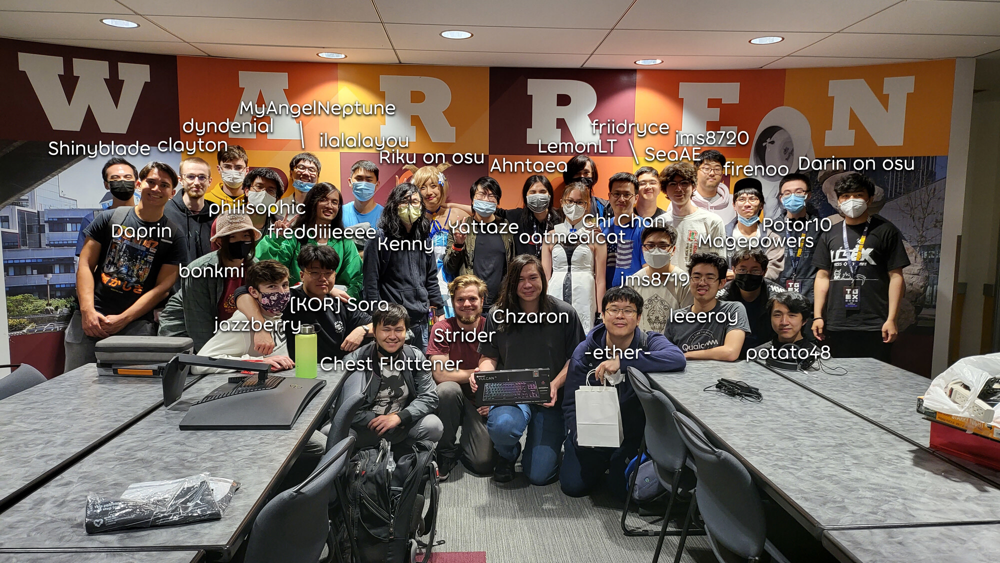

---
tags:
  - LAN
  - osu! at UCSD
  - osu! UCSD
  - San Diego
  - TGEX
  - TGEX2022
  - UCSD
---

# Triton Gaming Expo 2022

**Triton Gaming Expo 2022** (***TGEX 2022***) was an osu! BYOC LAN event hosted by [osu! at UCSD](/wiki/Community/Organisations/osu!_at_UCSD) in collaboration with *Triton Gaming*. It shared its name with its parent event, a gaming convention spanning many more games and activities. This event and tournament was osu! at UCSD's fourth appearance at TGEX.

## TGEX

TGEX 2022 took place on Sunday, May 29th at [Price Center](https://en.wikipedia.org/wiki/Price_Center) at the [University of California, San Diego](https://en.wikipedia.org/wiki/University_of_California,_San_Diego) (*UCSD*). The main floor was open from 12:00 p.m. to 10:00 p.m., but each event inside had its own schedule. The osu! LAN ran from around 11:15 a.m. to 9:00 p.m. in Earl Warren College Room.

Aside from the osu! event, TGEX hosted tournaments for many other games, panels with game industry experts, an artist alley, cosplay gathering, keyboard showcase, and more. More details can be found in the [Triton Gaming Discord server](https://discord.gg/tritongaming).

## Links

- [Main spreadsheet](https://docs.google.com/spreadsheets/d/1eckyCyhWb1Y2bNuopxzE-C-XSJ4Qil0t5utQykW3vTA/edit)
- [Challonge bracket](https://challonge.com/yqvqkyfq)
- [Seeding results spreadsheet](https://docs.google.com/spreadsheets/d/1WZbENIjcmtDUcwqj-heN7MfDbsBZ8znvfprOP-Sve0g/edit)
- [osu! at UCSD Discord server](https://discord.gg/DqBVmv5Knx)
- [Triton Gaming Discord server](https://discord.gg/tritongaming)

## Tournament format

The tournament hosted at TGEX 2022 was a 1v1 double-elimination osu! tournament with a seeding round before the bracket. More details and rules can be found in the ["Info & Rules" tab of the main spreadsheet](https://docs.google.com/spreadsheets/d/1eckyCyhWb1Y2bNuopxzE-C-XSJ4Qil0t5utQykW3vTA/edit#gid=1843073213).

## Organisation

TGEX 2022 was run by various osu! community members at UCSD or visiting for the event.

| Position | Member(s) |
| :-- | :-- |
| Mappooler | ::{ flag=US }:: [Ahntaea](https://osu.ppy.sh/users/4941097), ::{ flag=US }:: [Darin on osu](https://osu.ppy.sh/users/4839876), ::{ flag=CN }:: [friidryce](https://osu.ppy.sh/users/8271310), ::{ flag=US }:: [Harrharrqi](https://osu.ppy.sh/users/2744592), ::{ flag=US }:: [jms8720](https://osu.ppy.sh/users/2570828), ::{ flag=US }:: [philisophic](https://osu.ppy.sh/users/7040672), ::{ flag=US }:: [Riku on osu](https://osu.ppy.sh/users/3071659), ::{ flag=US }:: [Yattaze](https://osu.ppy.sh/users/13870255) |
| Commentator | ::{ flag=US }:: [Riku on osu](https://osu.ppy.sh/users/3071659), ::{ flag=US }:: [Yattaze](https://osu.ppy.sh/users/13870255) |
| Designer | ::{ flag=US }:: [Potor10](https://osu.ppy.sh/users/8029687) |
| Referee | ::{ flag=US }:: [Darin on osu](https://osu.ppy.sh/users/4839876), ::{ flag=CN }:: [friidryce](https://osu.ppy.sh/users/8271310), ::{ flag=US }:: [philisophic](https://osu.ppy.sh/users/7040672), ::{ flag=US }:: [jms8720](https://osu.ppy.sh/users/2570828) |

## Podium and prizes

| Placing | Player | Prizes |
| :-: | :-- | :-- |
|  | ::{ flag=US }:: [Chzaron](https://osu.ppy.sh/users/11607790) | 6 months of osu!supporter, Vulkan TKL keyboard |
|  | ::{ flag=US }:: [Kenny](https://osu.ppy.sh/users/1225459) | 3 months of osu!supporter, Aorus M4 mouse |
|  | ::{ flag=US }:: [-ether-](https://osu.ppy.sh/users/6131258) | 1 month of osu!supporter, MSI Grabbag |

## Participants

- ::{ flag=US }:: [-ether-](https://osu.ppy.sh/users/6131258)
- ::{ flag=US }:: [\[KOR\] Sora](https://osu.ppy.sh/users/11985468)
- ::{ flag=US }:: [atlae99](https://osu.ppy.sh/users/29787503)
- ::{ flag=US }:: [Chzaron](https://osu.ppy.sh/users/11607790)
- ::{ flag=US }:: [crikhard](https://osu.ppy.sh/users/7023000)
- ::{ flag=US }:: [Daprin](https://osu.ppy.sh/users/10961983)
- ::{ flag=US }:: [dyndenial](https://osu.ppy.sh/users/16779673)
- ::{ flag=US }:: [firenoo](https://osu.ppy.sh/users/10815041)
- ::{ flag=US }:: [freddiiieeee](https://osu.ppy.sh/users/7112839)
- ::{ flag=US }:: [jazzberry](https://osu.ppy.sh/users/11055678)
- ::{ flag=US }:: [jms8719](https://osu.ppy.sh/users/2042565)
- ::{ flag=US }:: [Kenny](https://osu.ppy.sh/users/1225459)
- ::{ flag=US }:: [leeeroy](https://osu.ppy.sh/users/12620812)
- ::{ flag=US }:: [potato48](https://osu.ppy.sh/users/10724175)
- ::{ flag=US }:: [SeaAE](https://osu.ppy.sh/users/12354364)
- ::{ flag=US }:: [Strider](https://osu.ppy.sh/users/4553852)
- ::{ flag=US }:: [Vysion](https://osu.ppy.sh/users/11594132)

## Mappools

### Grand Finals and Losers Finals

- NoMod
  1. [paraoka - Dreadnought (Harrharrqi) [Crazy]](https://osu.ppy.sh/beatmapsets/1771071#osu/3625559)
  2. [AKIMO - St. Scarhand (Axarious) [190BPM]](https://osu.ppy.sh/beatmapsets/1047523#osu/2189609)
  3. [Various Artists - Hashire Uma Musume (ponbot) [Hashire aramaki & ponbot!]](https://osu.ppy.sh/beatmapsets/1454027#osu/2989093)
  4. [MYTK - Senkyou (Realazy) [Orientalism \(feat. Altai\)]](https://osu.ppy.sh/beatmapsets/1262410#osu/2623950)
  5. [daisan - Deepsea Moonlight (Pennek) [YOKES' EXPERT]](https://osu.ppy.sh/beatmapsets/1032654#osu/2712975)
- Hidden
  1. [Bentham - Chicago (ponbot) [Re: Wonder]](https://osu.ppy.sh/beatmapsets/1243342#osu/2584895)
  2. [Sotetsu Record - Shonandai no uta (jasontime12345) [gaLAxy]](https://osu.ppy.sh/beatmapsets/1435595#osu/3024746)
  3. [xi - Vanitas (RLC) [Memoriam]](https://osu.ppy.sh/beatmapsets/89682#osu/243657)
- HardRock
  1. [Feryquitous feat. Aitsuki Nakuru - Kairikou (Ryuusei Aika) [Skystar's Irregular]](https://osu.ppy.sh/beatmapsets/740862#osu/1723257)
  2. [Guilty Kiss - KOWAREYASUKI (ktgster) [Special]](https://osu.ppy.sh/beatmapsets/766867#osu/1611995)
  3. [ZYTOKINE - Dancing Dollz feat. cold kiss - REDALiCE Remix (MaridiuS) [Vanity]](https://osu.ppy.sh/beatmapsets/690966#osu/1464221)
- DoubleTime
  1. [Inui Toko - Kimagure Romantic (newton-) [Amateurre & sanairrt's Insane]](https://osu.ppy.sh/beatmapsets/1130251#osu/2434490)
  2. [Hatsune Miku - Netoge Haijin Sprechchor (Lalarun) [Insane]](https://osu.ppy.sh/beatmapsets/25802#osu/87369)
  3. [Yuizuki Sora - Koi, Hitokuchi. (Shizuku-) [Insane]](https://osu.ppy.sh/beatmapsets/1045588#osu/2260997)
  4. [Yasuharu Takanashi - Fairy Tail Main Theme (Suck) [KIRBY Mix]](https://osu.ppy.sh/beatmapsets/13686#osu/50625)
- ForceMod
  1. [Minamotoya feat. Kuroa\* - Hana Kagerou (404 AimNotFound) [Yokes' Expert]](https://osu.ppy.sh/beatmapsets/929130#osu/1945907)
  2. [EBIMAYO - GOODTEK (yf\_bmp) [Insane]](https://osu.ppy.sh/beatmapsets/1680421#osu/3432910)
  3. [fallen shepherd feat. RabbiTon Strings - ENDYMION (Acylica) [Realazy\(Frenchcore\)]](https://osu.ppy.sh/beatmapsets/1291409#osu/2680522)
- Tiebreaker
  1. **[Yooh - MariannE (Camo) [Labyrinth]](https://osu.ppy.sh/beatmapsets/1550633#osu/3168656)**

### Finals and Losers Round 5–6

- NoMod
  1. [Kawada Mami - Going back to square one (cRyo\[iceeicee\]) [Insane]](https://osu.ppy.sh/beatmapsets/384975#osu/841064)
  2. [Tatsh - Xevel (emu1337) [Extreme]](https://osu.ppy.sh/beatmapsets/1254404#osu/2615748)
  3. [Utsu-P feat. flower - Living ghost is alive (kuyusu) [Expert]](https://osu.ppy.sh/beatmapsets/1165437#osu/2430730)
  4. [Mameyudoufu - Citadel (captin1) [Autonomy]](https://osu.ppy.sh/beatmapsets/1024712#osu/2143344)
  5. [monaca:factory feat. GEM - Mermaid (cherrymeii) [kodoku's Umiyuri]](https://osu.ppy.sh/beatmapsets/1429665#osu/3338157)
- Hidden
  1. [nobodyknows+ - Kokoro Odoru (toybot) [Dance!]](https://osu.ppy.sh/beatmapsets/1020878#osu/2136080)
  2. [Dark PHOENiX - Taketori Hishou (Patchouli) [Extra]](https://osu.ppy.sh/beatmapsets/21374#osu/74200)
- HardRock
  1. [HoneyWorks - Re: Hatsukoi no Ehon feat. Aida Miou \(CV: Toyosaki Aki\) (Karen) [Sukidayo]](https://osu.ppy.sh/beatmapsets/943193#osu/1969733)
  2. [HyuN - Infinity Heaven (Niva) [Ad Infinitum]](https://osu.ppy.sh/beatmapsets/891345#osu/1863246)
- DoubleTime
  1. [Suzuki Konomi - DAYS of DASH (Kalibe) [Brilliance]](https://osu.ppy.sh/beatmapsets/515921#osu/1095507)
  2. [zts - the executioner (-kevincela-) [Insane]](https://osu.ppy.sh/beatmapsets/342360#osu/756752)
  3. [Allj - Suzuki (Testo) [Testo's & schoolboy's Hype]](https://osu.ppy.sh/beatmapsets/836883#osu/1752416)
- ForceMod
  1. [MuryokuP - A tree without a branch (Melwoine) [Axarious' Extra]](https://osu.ppy.sh/beatmapsets/1037902#osu/2171298)
  2. [forestpireo - Kanojo Ga Ichiban Shoujo Nanoka? (Teara) [KIRBY Mix]](https://osu.ppy.sh/beatmapsets/11773#osu/50845)
  3. [Hatsuki Yura - Kyokou no Rakuen (KKipalt) [Paradise]](https://osu.ppy.sh/beatmapsets/1257566#osu/2613148)
- Tiebreaker
  1. **[Hoshimachi Suisei - Stellar Stellar (ImWater) [Cinderella]](https://osu.ppy.sh/beatmapsets/1680549#osu/3433242)**

### Round 4 and Losers Round 3–4

- NoMod
  1. [Reol - Asymmetry (Gaia) [Extra]](https://osu.ppy.sh/beatmapsets/292077#osu/657509)
  2. [daisan - -+ (RikiH\_) [Extra]](https://osu.ppy.sh/beatmapsets/135094#osu/338544)
  3. [AZKi - Intersection (RLC) [X]](https://osu.ppy.sh/beatmapsets/1270610#osu/2640443)
  4. [Expander - diagram (Otosaka-Yu) [Elite Mapper Regou]](https://osu.ppy.sh/beatmapsets/974798#osu/2049110)
- Hidden
  1. [Memme - Starving Days (Gamu) [Extra]](https://osu.ppy.sh/beatmapsets/275743#osu/625507)
  2. [Hommarju feat. Latte - masterpiece (simplistiC) [Insane]](https://osu.ppy.sh/beatmapsets/12483#osu/47152)
- HardRock
  1. [MIMI - Kuu ni Naru (ThunderBird2678) [Kaze]](https://osu.ppy.sh/beatmapsets/1676605#osu/3425143)
  2. [OSTER project - Devilz Staircase (Nyquill) [Another]](https://osu.ppy.sh/beatmapsets/150695#osu/371750)
- DoubleTime
  1. [sana x 000 x mary - Ai Kotoba III (Yugu) [gary00737's Insane]](https://osu.ppy.sh/beatmapsets/1149018#osu/2460008)
  2. [Kitsune Soundsystem - Raptorjesus Died for Our Sine Waves (Aleks719) [Hard]](https://osu.ppy.sh/beatmapsets/32405#osu/106049)
  3. [Imy - Meteora (Icekalt) [Insane]](https://osu.ppy.sh/beatmapsets/1129440#osu/2674708)
- ForceMod
  1. [Lapfox Trax feat. guilhox - Lapfoxed Forever (Blue Dragon) [Nogard]](https://osu.ppy.sh/beatmapsets/59521#osu/178353)
  2. [himmel - Empyrean (aabc271) [Heaven]](https://osu.ppy.sh/beatmapsets/871438#osu/1820787)
- Tiebreaker
  1. **[Feryquitous - Dstorv (RLC) [Ende Fateind Trasfomate]](https://osu.ppy.sh/beatmapsets/531553#osu/1126445)**

### Round 1–3 and Losers Round 1–2

- NoMod
  1. [Yumi Arai - Hikouki Gumo \(el poco maro DnB EDIT\) (Monstrata) [Path of Wind]](https://osu.ppy.sh/beatmapsets/357161#osu/806017)
  2. [Yuyoyuppe - AiAe (Fort) [Expert]](https://osu.ppy.sh/beatmapsets/257793#osu/657054)
  3. [Reol,nqrse - Ooedo Ranvu (zhu) [Expert]](https://osu.ppy.sh/beatmapsets/703580#osu/1572141)
  4. [Isekai Joucho - Kyoukankaku Obake (Calvaria) [Elayue's Expectation]](https://osu.ppy.sh/beatmapsets/1141909#osu/2385728)
- Hidden
  1. [Wakeshima Kanon - killy killy JOKER (P A N) [eXtra]](https://osu.ppy.sh/beatmapsets/277901#osu/629665)
  2. [Amane - BOOZEHOUND (tieff) [Lesjuh]](https://osu.ppy.sh/beatmapsets/9995#osu/39549)
- HardRock
  1. [Rchetype - V Is For (Blue Dragon) [Insane]](https://osu.ppy.sh/beatmapsets/111914#osu/290919)
  2. [Nero's Day At Disneyland - No Money Down, Low Monthly Payments (grumd) [Insane]](https://osu.ppy.sh/beatmapsets/111825#osu/290733)
- DoubleTime
  1. [azusa - Check my soul (Sumisola) [Insane]](https://osu.ppy.sh/beatmapsets/45664#osu/142462)
  2. [Shoichiro Sakamoto - Eye of Aeon (KanaRin) [Insane]](https://osu.ppy.sh/beatmapsets/26528#osu/91139)
  3. [nano - Now or Never (tutuhaha) [Now]](https://osu.ppy.sh/beatmapsets/51755#osu/158498)
- ForceMod
  1. [HitoshizukuP x Yama - Crazy nighT (Sephibro) [Crazy]](https://osu.ppy.sh/beatmapsets/109401#osu/285549)
  2. [Kawada Mami - u/n (Reiji Maigo) [Insane]](https://osu.ppy.sh/beatmapsets/1142576#osu/2470326)
- Tiebreaker
  1. **[Uchu Conbini - Compass (Sing) [Space]](https://osu.ppy.sh/beatmapsets/1349881#osu/2794869)**

### Seeding round

- NoMod
  1. [KINEMA106 - Juusou (Mordred) [Yogurtt's Extra]](https://osu.ppy.sh/beatmapsets/1301393#osu/2709081)
  2. [Felicity of the Millennium - Sacred Renaissance (rollpan) [NM2]](https://osu.ppy.sh/beatmapsets/1569544#osu/3205100)
  3. [After the Rain - Shikioriori ni Tayutotte (\[ -Scarlet- \]) [LanJay rigged this. Ban Jesus too]](https://osu.ppy.sh/beatmapsets/837257#osu/1753120)
  4. [Function Phantom - Variable (Chaoslitz) [Deluxe]](https://osu.ppy.sh/beatmapsets/751774#osu/1582594)
- Hidden
  1. [bj.HaLo - Ende (galvenize) [Another]](https://osu.ppy.sh/beatmapsets/44035#osu/148716)
  2. [kors k - SigSig (AJT) [Nisan's Insane]](https://osu.ppy.sh/beatmapsets/1615650#osu/3298595)
- HardRock
  1. [THE ORAL CIGARETTES - 5150 (Kagetsu) [Collab Extra]](https://osu.ppy.sh/beatmapsets/705655#osu/1532288)
  2. [HyuN - Guitian (ScubDomino) [Insane]](https://osu.ppy.sh/beatmapsets/891348#osu/1863256)
- DoubleTime
  1. [senya - Koyoi Index (jonathanlfj) [Lunatic]](https://osu.ppy.sh/beatmapsets/234455#osu/543814)
  2. [Tsunamaru - Gin no Fluch (HelloSCV) [Insane]](https://osu.ppy.sh/beatmapsets/85721#osu/235309)

## Match results

### Grand Finals

| Player 1 |  |  | Player 2 | Match link |
| --: | :-: | :-: | :-- | :-- |
| **[Chzaron](https://osu.ppy.sh/users/11607790)** ::{ flag=US }:: | **6** | 1 | ::{ flag=US }:: [Kenny](https://osu.ppy.sh/users/1225459) | [#1](https://osu.ppy.sh/community/matches/101038923) |

### Finals

#### Winners bracket

| Player 1 |  |  | Player 2 | Match link |
| --: | :-: | :-: | :-- | :-- |
| **[Chzaron](https://osu.ppy.sh/users/11607790)** ::{ flag=US }:: | **5** | 2 | ::{ flag=US }:: [-ether-](https://osu.ppy.sh/users/6131258) | [#1](https://osu.ppy.sh/community/matches/101037695) |

#### Losers bracket

| Player 1 |  |  | Player 2 | Match link |
| --: | :-: | :-: | :-- | :-- |
| [-ether-](https://osu.ppy.sh/users/6131258) ::{ flag=US }:: | -1 | **0** | ::{ flag=US }:: **[Kenny](https://osu.ppy.sh/users/1225459)** | *forfeit* |

### Round 4 and Losers Round 5–6

#### Winners bracket

| Player 1 |  |  | Player 2 | Match link |
| --: | :-: | :-: | :-- | :-- |
| **[Chzaron](https://osu.ppy.sh/users/11607790)** ::{ flag=US }:: | **4** | 0 | ::{ flag=US }:: [Kenny](https://osu.ppy.sh/users/1225459) | [#1](https://osu.ppy.sh/community/matches/101035941) |
| [Daprin](https://osu.ppy.sh/users/10961983) ::{ flag=US }:: | 3 | **4** | ::{ flag=US }:: **[-ether-](https://osu.ppy.sh/users/6131258)** | [#1](https://osu.ppy.sh/community/matches/101035950) |

#### Losers bracket

| Player 1 |  |  | Player 2 | Match link |
| --: | :-: | :-: | :-- | :-- |
| **[Daprin](https://osu.ppy.sh/users/10961983)** ::{ flag=US }:: | **5** | 3 | ::{ flag=US }:: [potato48](https://osu.ppy.sh/users/10724175) | [#1](https://osu.ppy.sh/community/matches/101036960) |
| **[Kenny](https://osu.ppy.sh/users/1225459)** ::{ flag=US }:: | **5** | 3 | ::{ flag=US }:: [Strider](https://osu.ppy.sh/users/4553852) | [#1](https://osu.ppy.sh/community/matches/101036948) |
| [Daprin](https://osu.ppy.sh/users/10961983) ::{ flag=US }:: | 4 | **5** | ::{ flag=US }:: **[Kenny](https://osu.ppy.sh/users/1225459)** | [#1](https://osu.ppy.sh/community/matches/101037708) |

### Round 3 and Losers Round 3–4

#### Winners bracket

| Player 1 |  |  | Player 2 | Match link |
| --: | :-: | :-: | :-- | :-- |
| **[Chzaron](https://osu.ppy.sh/users/11607790)** ::{ flag=US }:: | **4** | 0 | ::{ flag=US }:: [potato48](https://osu.ppy.sh/users/10724175) | [#1](https://osu.ppy.sh/community/matches/101033416) |
| [\[KOR\] Sora](https://osu.ppy.sh/users/11985468) ::{ flag=US }:: | 1 | **4** | ::{ flag=US }:: **[Kenny](https://osu.ppy.sh/users/1225459)** | [#1](https://osu.ppy.sh/community/matches/101033422) |
| **[Daprin](https://osu.ppy.sh/users/10961983)** ::{ flag=US }:: | **4** | 2 | ::{ flag=US }:: [Strider](https://osu.ppy.sh/users/4553852) | [#1](https://osu.ppy.sh/community/matches/101033425) |
| [crikhard](https://osu.ppy.sh/users/7023000) ::{ flag=US }:: | 0 | **4** | ::{ flag=US }:: **[-ether-](https://osu.ppy.sh/users/6131258)** | [#1](https://osu.ppy.sh/community/matches/101033431) |

#### Losers bracket

| Player 1 |  |  | Player 2 | Match link |
| --: | :-: | :-: | :-- | :-- |
| [\[KOR\] Sora](https://osu.ppy.sh/users/11985468) ::{ flag=US }:: | 3 | **4** | ::{ flag=US }:: **[leeeroy](https://osu.ppy.sh/users/12620812)** | [#1](https://osu.ppy.sh/community/matches/101035038) |
| **[potato48](https://osu.ppy.sh/users/10724175)** ::{ flag=US }:: | **4** | 0 | ::{ flag=US }:: [Vysion](https://osu.ppy.sh/users/11594132) | [#1](https://osu.ppy.sh/community/matches/101035367) |
| **[crikhard](https://osu.ppy.sh/users/7023000)** ::{ flag=US }:: | **4** | 1 | ::{ flag=US }:: [jazzberry](https://osu.ppy.sh/users/11055678) | [#1](https://osu.ppy.sh/community/matches/101034821) |
| **[Strider](https://osu.ppy.sh/users/4553852)** ::{ flag=US }:: | **4** | 0 | ::{ flag=US }:: [dyndenial](https://osu.ppy.sh/users/16779673) | [#1](https://osu.ppy.sh/community/matches/101035380) |
| [leeeroy](https://osu.ppy.sh/users/12620812) ::{ flag=US }:: | 3 | **4** | ::{ flag=US }:: **[potato48](https://osu.ppy.sh/users/10724175)** | [#1](https://osu.ppy.sh/community/matches/101036224) |
| [crikhard](https://osu.ppy.sh/users/7023000) ::{ flag=US }:: | 1 | **4** | ::{ flag=US }:: **[Strider](https://osu.ppy.sh/users/4553852)** | [#1](https://osu.ppy.sh/community/matches/101036226) |

### Round 2

#### Winners bracket

| Player 1 |  |  | Player 2 | Match link |
| --: | :-: | :-: | :-- | :-- |
| **[Chzaron](https://osu.ppy.sh/users/11607790)** ::{ flag=US }:: | **4** | 0 | ::{ flag=US }:: [firenoo](https://osu.ppy.sh/users/10815041) | [#1](https://osu.ppy.sh/community/matches/101031724) |
| **[potato48](https://osu.ppy.sh/users/10724175)** ::{ flag=US }:: | **4** | 1 | ::{ flag=US }:: [dyndenial](https://osu.ppy.sh/users/16779673) | [#1](https://osu.ppy.sh/community/matches/101032594) |
| **[\[KOR\] Sora](https://osu.ppy.sh/users/11985468)** ::{ flag=US }:: | **4** | 0 | ::{ flag=US }:: [jazzberry](https://osu.ppy.sh/users/11055678) | [#1](https://osu.ppy.sh/community/matches/101031620) |
| **[Kenny](https://osu.ppy.sh/users/1225459)** ::{ flag=US }:: | **4** | 0 | ::{ flag=US }:: [SeaAE](https://osu.ppy.sh/users/12354364) | [#1](https://osu.ppy.sh/community/matches/101031633) |
| **[Daprin](https://osu.ppy.sh/users/10961983)** ::{ flag=US }:: | **4** | 0 | ::{ flag=US }:: [Vysion](https://osu.ppy.sh/users/11594132) | [#1](https://osu.ppy.sh/community/matches/101031639) |
| **[Strider](https://osu.ppy.sh/users/4553852)** ::{ flag=US }:: | **4** | 0 | ::{ flag=US }:: [jms8719](https://osu.ppy.sh/users/2042565) | [#1](https://osu.ppy.sh/community/matches/101031762) |
| **[crikhard](https://osu.ppy.sh/users/7023000)** ::{ flag=US }:: | **4** | 0 | ::{ flag=US }:: [freddiiieeee](https://osu.ppy.sh/users/7112839) | [#1](https://osu.ppy.sh/community/matches/101031744) |
| **[-ether-](https://osu.ppy.sh/users/6131258)** ::{ flag=US }:: | **4** | 3 | ::{ flag=US }:: [leeeroy](https://osu.ppy.sh/users/12620812) | [#1](https://osu.ppy.sh/community/matches/101031752) |

#### Losers bracket

| Player 1 |  |  | Player 2 | Match link |
| --: | :-: | :-: | :-- | :-- |
| [freddiiieeee](https://osu.ppy.sh/users/7112839) ::{ flag=US }:: | 0 | **4** | ::{ flag=US }:: **[leeeroy](https://osu.ppy.sh/users/12620812)** | [#1](https://osu.ppy.sh/community/matches/101033421) |
| [jms8719](https://osu.ppy.sh/users/2042565) ::{ flag=US }:: | 3 | **4** | ::{ flag=US }:: **[Vysion](https://osu.ppy.sh/users/11594132)** | [#1](https://osu.ppy.sh/community/matches/101033430) |
| [SeaAE](https://osu.ppy.sh/users/12354364) ::{ flag=US }:: | -1 | **0** | ::{ flag=US }:: **[jazzberry](https://osu.ppy.sh/users/11055678)** | *forfeit* |
| **[dyndenial](https://osu.ppy.sh/users/16779673)** ::{ flag=US }:: | **4** | 0 | ::{ flag=US }:: [firenoo](https://osu.ppy.sh/users/10815041) | [#1](https://osu.ppy.sh/community/matches/101033452) |

### Round 1

#### Winners bracket

| Player 1 |  |  | Player 2 | Match link |
| --: | :-: | :-: | :-- | :-- |
| **[firenoo](https://osu.ppy.sh/users/10815041)** ::{ flag=US }:: | **4** | 0 | ::{ flag=US }:: [atlae99](https://osu.ppy.sh/users/29787503) | [#1](https://osu.ppy.sh/community/matches/101030746) |

#### Losers bracket

| Player 1 |  |  | Player 2 | Match link |
| --: | :-: | :-: | :-- | :-- |
| **[leeeroy](https://osu.ppy.sh/users/12620812)** ::{ flag=US }:: | **4** | 0 | ::{ flag=US }:: [atlae99](https://osu.ppy.sh/users/29787503) | [#1](https://osu.ppy.sh/community/matches/101032916) |

### Seeding

The seeding was done online the day prior to the LAN. Every participant played every map in the seeding mappool, and they were seeded by their average placement. Details can be found in the [seeding results spreadsheet](https://docs.google.com/spreadsheets/d/1WZbENIjcmtDUcwqj-heN7MfDbsBZ8znvfprOP-Sve0g/edit).

| Player | Average rank |
| :-- | --: |
| ::{ flag=US }:: [Chzaron](https://osu.ppy.sh/users/11607790) | 3.1 |
| ::{ flag=US }:: [Daprin](https://osu.ppy.sh/users/10961983) | 3.6 |
| ::{ flag=US }:: [crikhard](https://osu.ppy.sh/users/7023000) | 4.1 |
| ::{ flag=US }:: [\[KOR\] Sora](https://osu.ppy.sh/users/11985468) | 4.3 |
| ::{ flag=US }:: [Kenny](https://osu.ppy.sh/users/1225459) | 4.6 |
| ::{ flag=US }:: [-ether-](https://osu.ppy.sh/users/6131258) | 4.8 |
| ::{ flag=US }:: [Strider](https://osu.ppy.sh/users/4553852) | 8.0 |
| ::{ flag=US }:: [potato48](https://osu.ppy.sh/users/10724175) | 8.7 |
| ::{ flag=US }:: [dyndenial](https://osu.ppy.sh/users/16779673) | 8.8 |
| ::{ flag=US }:: [jms8719](https://osu.ppy.sh/users/2042565) | 9.5 |
| ::{ flag=US }:: [leeeroy](https://osu.ppy.sh/users/12620812) | 10.9 |
| ::{ flag=US }:: [SeaAE](https://osu.ppy.sh/users/12354364) | 11.0 |
| ::{ flag=US }:: [jazzberry](https://osu.ppy.sh/users/11055678) | 12.3 |
| ::{ flag=US }:: [freddiiieeee](https://osu.ppy.sh/users/7112839) | 13.0 |
| ::{ flag=US }:: [Vysion](https://osu.ppy.sh/users/11594132) | 14.2 |
| ::{ flag=US }:: [firenoo](https://osu.ppy.sh/users/10815041) | 15.2 |
| ::{ flag=US }:: [atlae99](https://osu.ppy.sh/users/29787503) | 16.9 |
