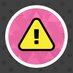
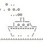

# osu! on X

osu! maintains several accounts on X, each serving a specific niche. While most are low-traffic and may not always surface in algorithmic feeds due to current platform guidelines, they remain a vital resource for staying informed outside the osu! ecosystem. To ensure you see these updates, we recommend following them directly or enabling notifications.

## Service

| Avatar | Handle | Description |
| :-: | :-: | :-- |
|  | [@osustatus](https://X.com/osustatus) | Low-traffic notifications of issues with the website and [Bancho](/wiki/Bancho_(server)). |
|  | [@osusupport](https://X.com/osusupport) | Help with account and/or community issues. Run by the [account support team](/wiki/People/Account_support_team). |

## Community

| Avatar | Handle | Description |
| :-: | :-: | :-- |
|  | [@osugame](https://X.com/osugame) | The official source of news and announcements. |
|  | [@banchoboat](https://X.com/banchoboat) | Comedy relief when things go wrong. |
|  | [@osu_nat](https://X.com/osu_nat) | News, announcements, and short community surveys by the [NAT](/wiki/People/Nomination_Assessment_Team) (not run by [the osu! team](/wiki/People/osu!_team)). |
|  | [@osu_tcomm](https://X.com/osu_tcomm) | News and announcements of various types from the [Tournament Committee](/wiki/People/Tournament_Committee) (not run by [the osu! team](/wiki/People/osu!_team)). |
|  | [@pp_committee](https://X.com/pp_committee) | Difficulty calculation announcements for all game modes, run by the [Performance Points Committee](/wiki/People/Performance_Points_Committee). |

## Personal

| Avatar | Handle | Description |
| :-: | :-: | :-- |
|  | [@ppy](https://X.com/ppy) | The [osu! creator](/wiki/People/peppy)'s personal Twitter account, which is not strictly related to osu!, but still covers a vast part of it. |
