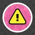
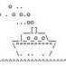

# Twitter

osu! posiada kilka kont na Twitterze, z czego każde z nich pełni inne funkcje. Pomimo niewielkiej aktywności oferują one wystarczającą ilość informacji o tym, co dzieje się w świecie osu!.

## Usługi

| Awatar | Nazwa | Opis |
| :-: | :-: | :-- |
|  | [@osustatus](https://twitter.com/osustatus) | Informacje o problemach ze stroną lub [Bancho](/wiki/Bancho_(server)). |
|  | [@osusupport](https://twitter.com/osusupport) | Pomoc w sprawach związanych ze społecznością osu! oraz kontami. Prowadzone przez [zespół wsparcia do spraw związanych z kontami](/wiki/People/Account_support_team). |

## Społeczność

| Awatar | Nazwa | Opis |
| :-: | :-: | :-- |
|  | [@osugame](https://twitter.com/osugame) | Oficjalne źródło aktualności i ogłoszeń. |
|  | [@banchoboat](https://twitter.com/banchoboat) | Humorystyczne rozluźnienie sytuacji, gdy coś pójdzie nie tak. |
|  | [@osu_nat](https://twitter.com/osu_nat) | Aktualności, ogłoszenia i krótkie ankiety społecznościowe prowadzone przez [zespół oceniania nominacji (NAT)](/wiki/People/Nomination_Assessment_Team). Konto nie jest prowadzone przez [główny zespół osu!](/wiki/People/osu!_team). |
|  | [@osu_tcomm](https://twitter.com/osu_tcomm) | Różnego rodzaju wiadomości i ogłoszenia od [komitetu turniejowego](/wiki/People/Tournament_Committee). Konto nie jest prowadzone przez [główny zespół osu!](/wiki/People/osu!_team). |
|  | [@pp_committee](https://twitter.com/pp_committee) | Ogłoszenia dotyczące rekalkulacji ilości gwiazdek oraz pp dla wszystkich trybów gry, prowadzone przez [komitet pp](/wiki/People/Performance_Points_Committee). |

## Osobiste

| Awatar | Nazwa | Opis |
| :-: | :-: | :-- |
|  | [@ppy](https://twitter.com/ppy) | Osobiste konto [twórcy osu!](/wiki/People/peppy). Nie jest ono ściśle powiązane z samą grą, ale tematy z nią związane obejmują znaczną jego część. |
