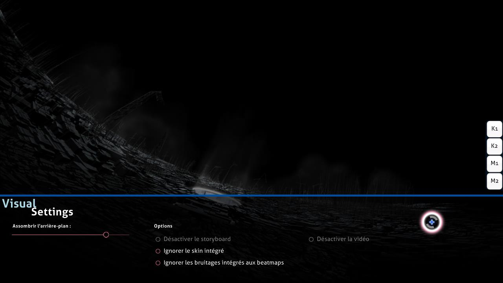

# Paramètres visuels

Les **paramètres visuels** sont une superposition de personnalisation cachée située en bas du terrain de jeu. Il est possible d'y accéder lorsque la beatmaps est en cours de chargement ou lorsque le jeu est en pause. Lorsque la superposition des paramètres visuels est affichée, la beatmap est retardé jusqu'à ce que le curseur quitte la superposition des paramètres visuels.

*Remarque : Les modifications des paramètres visuels sont sauvegardées par beatmap mais certaines d'entre elles seront perdues après la fermeture d'osu!. Pour les définir globalement (et pour toujours), utilisez la barre latérale [options](/wiki/Options).*

Il est également possible d'accéder à la superposition des paramètres visuels en mettant le jeu en pause. Toutefois, cette méthode ne fonctionne pas dans les matchs [multijoueurs](/wiki/Multi), car elle sera considérée comme une tentative de quitter le match et vous devrez quitter la salle.

## Paramètres

| Nom | Effet | Notes |
| :-- | :-- | :-- |
| `Assombrir l'arrière-plan :` | Assombrir le terrain de jeu (y compris les story-boards et/ou les vidéos de fond). | Pendant les pauses, le niveau de luminosité est réduit de 30% (max 0%) (ce comportement peut être désactivé dans les options). *Note : Les modifications de l'ambiance de fond sont sauvegardées par beatmap mais seront perdues après la fermeture d'osu!* |
| `Désactiver le storyboard` | Supprimez tous les éléments du storyboard. Cela n'affecte pas le [Kiai Time](/wiki/Kiai_time) et la vidéo de fond, le cas échéant. | Cette option est recommandée aux joueurs ayant des problèmes d'épilepsie, lorsque la beatmap affiche un avertissement d'épilepsie. Cette option est désactivée s'il n'y a pas de storyboard à jouer. |
| `Ignorer le skin intégré` | Utilisez le skin sélectionnée par le joueur au lieu du skin incluse dans la beatmap. | Cela nécessite une nouvelle tentative pour prendre effet. |
| `Ignorer les bruitages intégrés aux beatmaps  ` | Utilise les hitsounds du skin sélectionné par le joueur au lieu des hitsounds personnalisés de la beatmap, le cas échéant. | Cela nécessite une nouvelle tentative pour prendre effet. |
| `Désactiver la vidéo` | Ne pas lire la vidéo de fond. Cela ne supprime pas le storyboard. | Cette option nécessite une nouvelle tentative si elle est activée après le début du jeu. Cette option est désactivée s'il n'y a pas de vidéo de fond à jouer. |
