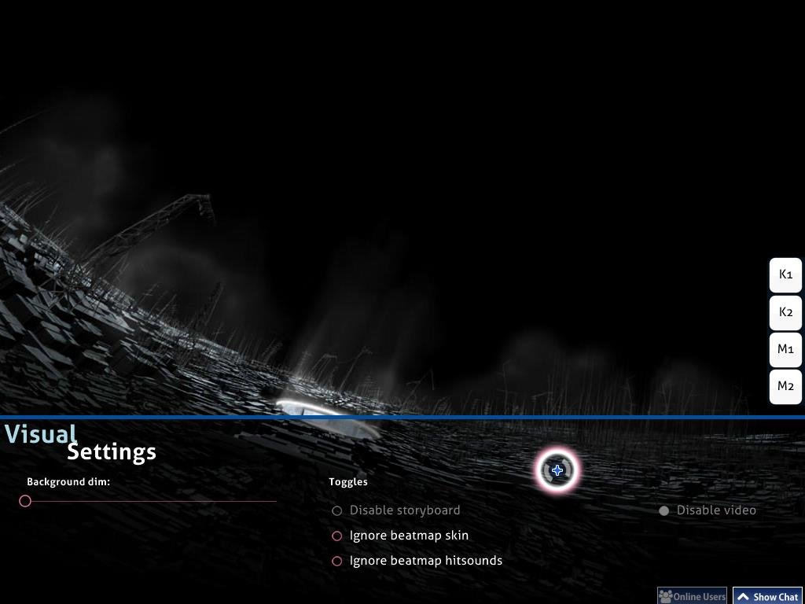

# Visual Settings

**Visual Settings** is a hidden customisation overlay located at the bottom of the playfield. It can be accessed while the beatmap is loading. When the Visual Settings overlay is shown, the beatmap will be delayed until the osu!cursor leaves the Visual Settings overlay.

Alternatively, it is possible to access Visual Settings overlay by pausing the game. However, this method does not work in [Multi](/wiki/Multi "Multi") match as it will be treated as attempting to quit the match and leave the room instead.

_Note:_ Setting changes from Visual Settings are saved per beatmap and will be lost after closing osu!. Global settings can be set in the [Options](/wiki/Options "Options") sidebar.

## Available options

| Name | Effect | Notes |
|:---:|:---|:---|
| Background dim | Darken the playfield. | During breaks, the dim is -30% of the rate set or 0%. No special effects at 100% dim. Also darkens storyboard elements at 100% dim. |
| Disable storyboard | Remove all storyboard elements. Does not affect Kiai Time and background video. | In maps with an epilepsy warning, this is recommended for players with epilepsy issue. This option is disabled if there is no storyboard to play. |
| Ignore beatmap skin | Do not use the beatmap's custom skin, if any. The player's selected skin will be used instead. | Requires a retry to take effect. |
| Ignore beatmap hitsounds | Do not use the beatmap's custom hit sounds, if any. The player's selected skin's hit sounds will be used. | Requires a retry to take effect. |
| Disable video | Do not play the video. This does not remove the storyboard. | Requires a retry if activated after the song starts. This option is disabled if there is no video to play. |